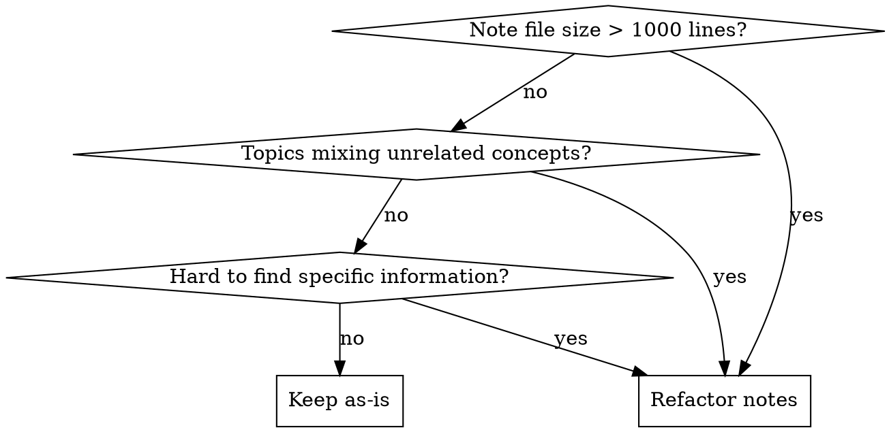

# Splitting Notes

## Overview

Split large monolithic note files into focused, single-topic files with index-based navigation.
Reduces cognitive load and improves discoverability through progressive grouping.

## When to Use



**Use when:**

- Note files exceed 1000 lines
- Single file mixes unrelated topics
- Navigation and search are difficult
- Content needs better organization

**Don't use when:**

- Files are already under 500 lines
- Topics are tightly coupled
- Splitting would harm coherence

## Prerequisite

**Complex multi-step refactoring** - Must complete planning phase first.

If not currently in **plan mode**, invoke `EnterPlanMode` before starting.

- **In plan mode**: Complete analysis and create migration plan
- **After plan mode**: Execute split and verification

## Core Pattern

**Before** - Monolithic file:

```text
notes/topic/large-file.md (1500+ lines)
├── H2 Chapter 1
├── H2 Chapter 2
├── H2 Chapter 3
└── ...10+ more sections
```

**After** - Modular structure:

```text
notes/topic/
├── topic.md (index, ~50 lines)
├── chapter-1.md (~200 lines)
├── chapter-2.md (~150 lines)
├── chapter-3.md (~180 lines)
└── ...remaining chapters
```

**See** [examples.md](./examples.md) **for complete walkthroughs** of:

- Simple split (300 lines, Python)
- Medium split (850 lines, Vue)
- Complex split (1500 lines, React)

## Quick Reference

| Principle       | Rule                                            |
| --------------- | ----------------------------------------------- |
| **File size**   | Target ~500 lines, max 1000                     |
| **H2 chapters** | Split by topic, merge if <100 lines             |
| **Index files** | Same name as directory, Map of Content only     |
| **Structure**   | Progressive: Getting Started → Core → Advanced  |
| **Links**       | `- [Name](./path.md) - Description` (no period) |

## Implementation

### 1. Planning Phase (Plan Mode Required)

**Analyze the source:**

- Analyze target file and directory structure: use `Glob`/`Grep` to understand context
- Read source file: identify all H2 sections
- Calculate chapter sizes: count lines per section, plan split strategy

**Create migration plan:**

- List target files with their H2 sections
- Group related topics
- Ensure sizes stay under 1000 lines

### 2. Execution Phase

**Split by H2 sections:**

- Short chapters (<100 lines) → merge
- Long chapters → separate file
- Single H2 > 1000 lines → keep independent
- Add `sidebar_position` and adjusted `tags` frontmatter to each split file

**Create index file** (same name as directory):

- Progressive grouping (Getting Started → Core → Advanced)
- Every link MUST have description
- Format: `- [Name](./path.md) - Description` (no period)

See [examples.md](./examples.md) for complete index file templates.

### 3. Verification Checklist

- [ ] Frontmatter added to split files (`sidebar_position` + `tags`)
- [ ] Internal links updated (use `Grep`)
- [ ] Image paths corrected (`./figures/subdirectory/file.ext`)
- [ ] Index order matches `sidebar_position`
- [ ] Build succeeds: `pnpm build`
- [ ] Lint passes: `pnpm lint:notes`
- [ ] Line count verified: `wc -l original new/*`
- [ ] Original file deleted
- [ ] Use `TodoWrite` to mark all tasks complete

## Common Mistakes

| Mistake                      | Fix                                                  |
| ---------------------------- | ---------------------------------------------------- |
| Splitting without planning   | Use plan mode first, create migration plan           |
| Index without descriptions   | Every link needs `- [Name](./path.md) - Description` |
| Descriptions with periods    | Remove period, capitalize first letter only          |
| Random order in index        | Use progressive grouping (basics → advanced)         |
| Forgetting internal links    | Grep for `](./` and update all references            |
| Breaking figures paths       | Update to `./figures/subdirectory/filename.ext`      |
| Deleting before verification | Keep original until all checks pass                  |

## Real-World Impact

**Before**: `python.md` (1046 lines) - hard to navigate, slow to load
**After**: 12 focused files + index - each topic immediately accessible

Search improvement: 3x faster (specific file vs scan entire document)
Build time: 40% reduction (parallel processing of smaller files)
