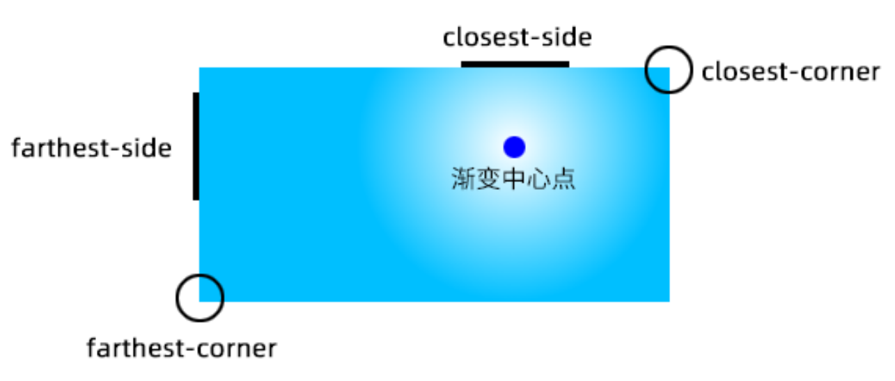

# Gradient

## Color Stop List

`<color-stop-list>`,
`[<linear-color-stop> [, <linear-color-hint>]?]#, <linear-color-stop>`:

- `<linear-color-stop>`: `<color> <length-percentage>{1,2}?`.
- `<linear-color-hint>`: `<length-percentage>`, 改变颜色的转换点位置.
- `<length-percentage>`: `<length> | <percentage>`.

`<angular-color-stop-list>`,
`[<angular-color-stop> [, <angular-color-hint>]?]#, <angular-color-stop>`:

- `<angular-color-stop>`: `<color> && <angle-percentage>{1,2}?`.
- `<angular-color-hint>`: `<angle-percentage>`, 改变颜色的转换点位置.
- `<angle-percentage>`: `<angle> | <percentage>`.

:::tip[Color Stop Position]

若后一个色标的位置值为 `0`,
则它的位置总是会被浏览器调整为前一个色标的位置值:

```css
/* 条纹形状 */
.stripe {
  background: linear-gradient(yellow 30%, blue 0);
  background: linear-gradient(yellow 33.3%, blue 0 66.6%, yellowgreen 0);
  background-size: 100% 45px;
}
```

:::

## Linear

[Linear gradient](https://developer.mozilla.org/docs/Web/CSS/gradient/linear-gradient):

- `[<angle> | to <side-or-corner>]?, <color-stop-list>`.
- Default angle: `to bottom`.
- `0deg` angle: `to top`.
- `90deg` angle: `to right`.
- `-90deg` angle: `to left`.

```css
.linear-gradient {
  width: 300px;
  height: 150px;
  background-image: linear-gradient(45deg, white 100px, skyblue 100px 200px, white 200px);
  border: solid deepskyblue;
}
```

[](https://developer.mozilla.org/docs/Web/CSS/gradient/linear-gradient#composition_of_a_linear_gradient)

## Radial

[Radial gradient](https://developer.mozilla.org/docs/Web/CSS/gradient/radial-gradient):

- `[<ending-shape> || <size>]? [at <position>]?, <color-stop-list>`.
- `<ending-shape>`:
  - `ellipse` (initial value).
  - `circle`.
- `<size>`.
  - `closest-side`.
  - `farthest-side`.
  - `closest-corner`.
  - `farthest-corner`.
  - `<length>`: 单独一个值不能为 `<percentage>`.
  - `<length-percentage>{2}`.

[](https://developer.mozilla.org/docs/Web/CSS/gradient/radial-gradient#size)

```css
.radial-gradient {
  background-image: radial-gradient(50px, white, deepskyblue);
  /* stylelint-disable-next-line declaration-property-value-no-unknown */
  background-image: radial-gradient(50px 50%, white, deepskyblue);
  /* stylelint-disable-next-line declaration-property-value-no-unknown */
  background-image: radial-gradient(50% 50%, white, deepskyblue);
  background-image: radial-gradient(100px at 0 0, white, deepskyblue);
  background-image: radial-gradient(100px at left top, white, deepskyblue);
  background-image: radial-gradient(100px at right 100px bottom 100px, white, deepskyblue);
  background-image: radial-gradient(farthest-corner circle at right 100px bottom 100px, white, deepskyblue);
}
```

[](https://developer.mozilla.org/docs/Web/CSS/gradient/radial-gradient#composition_of_a_radial_gradient)

## Conic

[Conic gradient](https://developer.mozilla.org/docs/Web/CSS/gradient/conic-gradient):

- `[from <angle>]? [at <position>]?, <angular-color-stop-list>`.
- Default angle: `0deg`.

```css
.pie {
  width: 150px;
  height: 150px;
  background: conic-gradient(yellowgreen 40%, gold 0deg 75%, deepskyblue 0deg);
  border-radius: 50%;
}

.color-picker-wheel {
  width: 150px;
  height: 150px;
  background:
    radial-gradient(closest-side circle, gray, transparent), conic-gradient(red, magenta, blue, aqua, lime, yellow, red);
  border-radius: 50%;
}
```

[](https://developer.mozilla.org/docs/Web/CSS/gradient/conic-gradient#composition_of_a_conic_gradient)

## References

- Background gradient [loading spinner](https://css-tricks.com/single-element-loaders-the-spinner).
- Background gradient [shapes](https://css-tricks.com/drawing-images-with-css-gradients).
