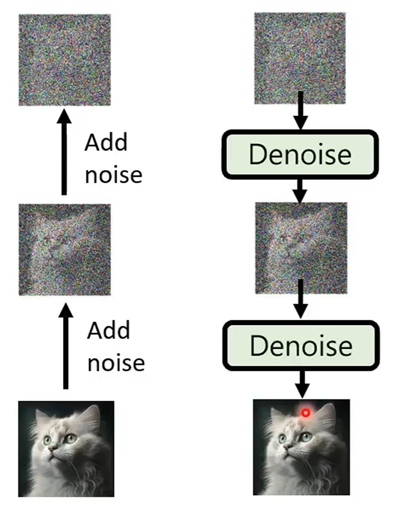
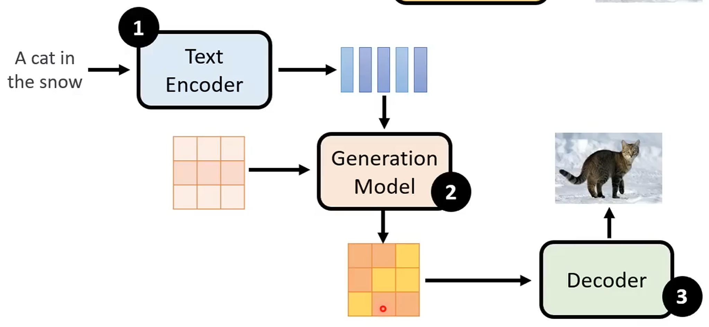
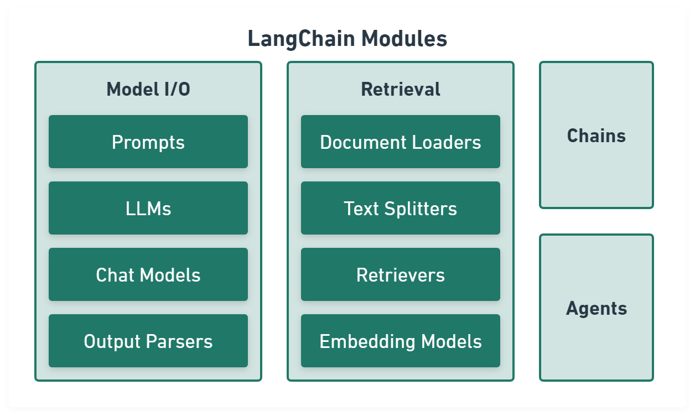
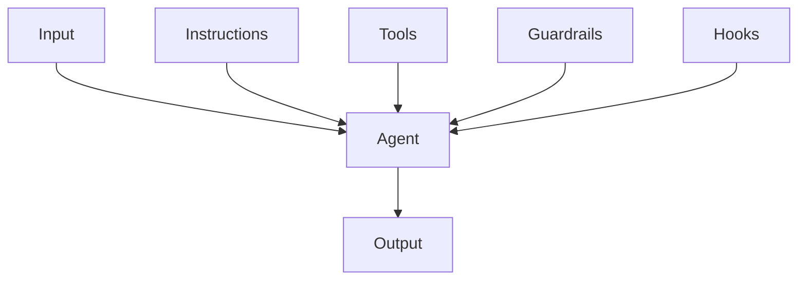
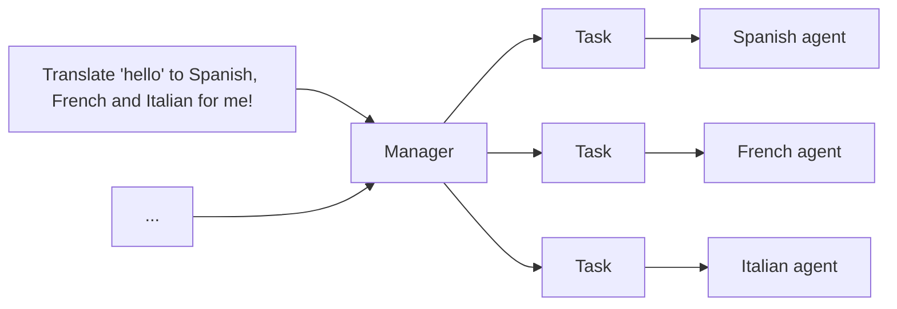
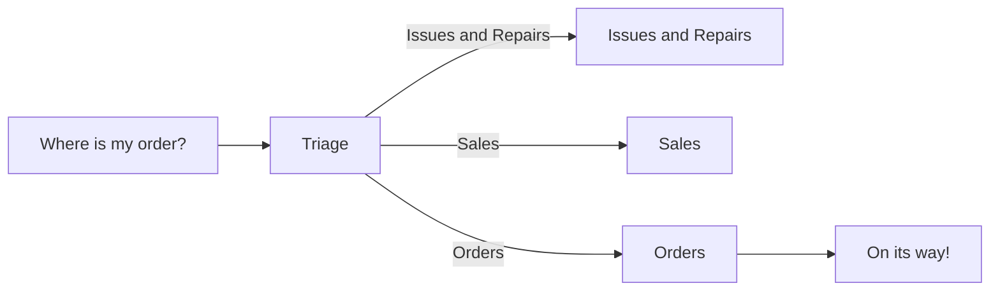

# LLM Basic Notes

## Generative AI

### Generative Model

- Autoregressive (AR) model:
  generate output one token at a time, conditioned on previous tokens.
- Non-autoregressive (NAR) model:
  generate output all at once parallel, without conditioning on previous tokens.

|             | AR Model | NAR Model |
| ----------- | :------: | :-------: |
| Parallelism |   Low    |   High    |
| Speed       |   Slow   |   Fast    |
| Quality     |   High   |    Low    |

结合上述两种方法 (Encoder + Decoder 架构):

- 用 AR model 生成中间向量, 用 NAR model 生成最终输出.
- 用 NAR model 多次生成, 逐步优化输出.
- Speculative decoding:
  用 NAR model 快速生成若干个预测输出, 作为 AR model 的后续输入,
  使得 AR model 可以同时输出多个结果.


### Scaling Law

现有的预训练语言模型对于数据的需求量远高于扩展法则
(e.g [Chinchilla](https://nips.cc/virtual/2022/53031)) 中所给出的估计规模.
很多更小的模型也能够通过使用超大规模的预训练数据获得较大的模型性能提升.
这种现象的一个重要原因是由于 Transformer 架构具有较好的数据扩展性.
目前为止, 还没有实验能够有效验证特定参数规模语言模型的饱和数据规模
(即随着数据规模的扩展, 模型性能不再提升).

### Emergent Ability

大语言模型的涌现能力被非形式化定义为
`在小型模型中不存在但在大模型中出现的能力`:

- In-context learning.
- Instruction following.
- Step-by-step reasoning.

### ChatGPT

Fine-tuned GPT model on conversational data:

- Pre-training:
  学习文字接龙, 学习大规模资料 (self-supervised learning), 生成下一个单词.
- Instruction-tuning (IT):
  人工文字接龙, 人工标注部分问题的答案 (supervised learning), 引导模型生成的方向.
- Reinforcement learning from human feedback
  ([RLHF](https://nips.cc/virtual/2022/52886)):
  训练一个 reward model, 负责评价模型生成的答案, 提供人类反馈.
  以 reward model 的评价分数为 reward, 通过强化学习优化模型.
  一般聚焦于三个方面: 有用性 (Helpfulness), 诚实性 (Honesty), 无害性 (Harmlessness).

:::tip Alignment

Instruction-tuning (IT) with supervised learning on labelled data
and reinforcement learning from human feedback (RLHF).

:::

### Diffusion Model

Forward process (diffusion) + reverse process (denoise):

[](https://nips.cc/virtual/2020/protected/poster_4c5bcfec8584af0d967f1ab10179ca4b.html)

Stable diffusion model:

[](https://ieeexplore.ieee.org/document/9878449)

### Video Model

Generative videos as world models simulator.

## LLM Toolchain

### LangChain

[LangChain](https://upstash.com/blog/langchain-explained)
aims to make programming with LLMs easier.

[](https://github.com/langchain-ai/langchainjs)

Model I/O module
normalize LLM inputs (e.g. prompts), APIs, and outputs (e.g. completions):


```ts
import { CommaSeparatedListOutputParser } from '@langchain/core/output_parsers'
import { PromptTemplate } from '@langchain/core/prompts'
import { OpenAI } from '@langchain/openai'

const template = PromptTemplate.fromTemplate('List 10 {subject}.\n{format_instructions}')
const model = new OpenAI({ temperature: 0 })
const listParser = new CommaSeparatedListOutputParser()

const prompt = await template.format({
  subject: 'countries',
  format_instructions: listParser.getFormatInstructions(),
})

const result = await model.invoke(prompt)
const listResult = await listParser.parse(result)
```

Retrieval module
help to process data alongside the user inputs,
making it easier to retrieve relevant information:


```ts
import { UpstashVectorStore } from '@langchain/community/vectorstores/upstash'
import { OpenAIEmbeddings } from '@langchain/openai'
import { CSVLoader } from 'langchain/document_loaders/fs/csv'
import { ScoreThresholdRetriever } from 'langchain/retrievers/score_threshold'
import { RecursiveCharacterTextSplitter } from 'langchain/text_splitter'

// CSV data.
const loader = new CSVLoader('path/to/example.csv')
const docs = await loader.load()

// Text splitter.
const splitter = new RecursiveCharacterTextSplitter({
  chunkSize: 10,
  chunkOverlap: 1,
})
const docs = await splitter.createDocuments(['...'])

// Embeddings and vector store.
const vectorStore = new UpstashVectorStore(new OpenAIEmbeddings())
await vectorStore.addDocuments(docs)
const retriever = ScoreThresholdRetriever.fromVectorStore(vectorStore, {
  minSimilarityScore: 0.9,
})
const result = await retriever.getRelevantDocuments('...?')
```

Chains module
link tasks together:


```ts
import { CommaSeparatedListOutputParser } from '@langchain/core/output_parsers'
import { PromptTemplate } from '@langchain/core/prompts'
import { RunnableSequence } from '@langchain/core/runnables'
import { OpenAI } from '@langchain/openai'

const template = PromptTemplate.fromTemplate('List 10 {subject}.\n{format_instructions}')
const model = new OpenAI({ temperature: 0 })
const listParser = new CommaSeparatedListOutputParser()

const chain = RunnableSequence.from([template, model, listParser])

const result = await chain.invoke({
  subject: 'countries',
  format_instructions: listParser.getFormatInstructions(),
})
```

Agents module
is chains with a list of functions (called tools) it can execute,
while chains are hardcoded,
agents choose their actions with the help of an LLM:


```ts
import { createVectorStoreAgent, VectorStoreToolkit } from 'langchain/agents'

const toolkit = new VectorStoreToolkit({ name: 'Demo Data', vectorStore }, model)
const agent = createVectorStoreAgent(model, toolkit)

const result = await agent.invoke({ input: '...' })
```

### LLM Platform

- OpenAI GPT [API](https://platform.openai.com).
- Google Gemini [API](https://ai.google.dev).

## AI Agents

AI agents powered by tricky LLMs prompting:

- Generative [agent](https://github.com/joonspk-research/generative_agents).
- Minecraft [agent](https://github.com/MineDojo/Voyager).

### Agent Instruction

- Use existing documents:
  使用现有的操作程序、支持脚本或政策文档来创建 LLM 友好的 routines.
- Prompt agents to break down tasks:
  提供更小、更清晰的步骤有助于最大限度地减少歧义, 并帮助模型更好地遵循指令.
- Define clear actions:
  确保 routine 中的每一步都对应一个特定的行动或输出.
- Capture edge cases:
  实际交互通常会产生决策点, 一个健壮的 routine 会预测常见的变化,
  并包含关于如何通过条件步骤或分支来处理它们的指令, e.g 在缺少所需信息时提供替代步骤.

```markdown
您是 LLM 智能体指令编写专家.
请将以下帮助中心文档转换为一组清晰的指令, 以编号列表形式编写.
该文档将成为 LLM 遵循的政策. 确保没有歧义, 并且指令是以智能体的指示形式编写的.
要转换的帮助中心文档如下 {{help_center_doc}}
```

### Agent Orchestration

单智能体系统 (Single-agent systems):



多智能体系统中心模式 (Multi-agent systems in manager pattern):
其余智能体作为工具, 由中心智能体调用:



```python
from agents import Agent, Runner

manager_agent = Agent(
  name="manager_agent",
  instructions=(
    "您是一名翻译代理. 您使用给定的工具进行翻译."
    "如果要求进行多次翻译, 您将调用相关工具."
  ),
  tools=[
    spanish_agent.as_tool(
      tool_name="translate_to_spanish",
      tool_description="将用户的消息翻译成西班牙语",
    ),
    french_agent.as_tool(
      tool_name="translate_to_french",
      tool_description="将用户的消息翻译成法语",
    ),
    italian_agent.as_tool(
      tool_name="translate_to_italian",
      tool_description="将用户的消息翻译成意大利语",
    ),
  ],
)

async def main():
  msg = input("Translate 'hello' to Spanish, French and Italian for me!")

  orchestrator_output = await Runner.run(manager_agent, msg)

  for message in orchestrator_output.new_messages:
    print(f"翻译步骤: {message.content}")
```

多智能体系统去中心模式 (Multi-agent systems in decentralized pattern),
多个代理作为对等体运行:



```python
from agents import Agent, Runner

technical_support_agent = Agent(
  name="Technical Support Agent",
  instructions=(
    "您提供解决技术问题、系统中断或产品故障排除的专家协助."
  ),
  tools=[search_knowledge_base]
)

sales_assistant_agent = Agent(
  name="Sales Assistant Agent",
  instructions=(
    "您帮助企业客户浏览产品目录、推荐合适的解决方案并促成购买交易."
  ),
  tools=[initiate_purchase_order]
)

order_management_agent = Agent(
  name="Order Management Agent",
  instructions=(
    "您协助客户查询订单跟踪、交付时间表以及处理退货或退款."
  )
)

tools=[track_order_status, initiate_refund_process]

triage_agent = Agent(
  name="Triage Agent",
  instructions="您作为第一个接触点, 评估客户查询并迅速将其引导至正确的专业代理.",
  handoffs=[technical_support_agent, sales_assistant_agent, order_management_agent],
)

await Runner.run(triage_agent, input("您能提供我最近购买商品的配送时间表更新吗?"))
```

### Agent Guardrails

构建防护措施:

- 相关性分类器:
  确保智能体响应保持在预期范围内, 通过标记偏离主题的查询.
- 安全分类器:
  检测试图利用系统漏洞的不安全输入 (越狱或提示注入).
- PII 过滤器:
  通过审查模型输出中任何潜在的个人身份信息 (PII), 防止不必要的个人身份信息泄露.
- 内容审核:
  标记有害或不当的输入 (仇恨言论、骚扰、暴力), 以保持安全、尊重的互动.
- 工具安全措施:
  通过评估您代理可用的每个工具的风险,
  并根据只读与写入访问、可逆性、所需的账户权限和财务影响等因素分配低、中或高评级.
  使用这些风险评级来触发自动化操作,
  例如在高风险功能执行前暂停进行防护措施检查, 或在需要时升级到人工干预.
- 基于规则的保护:
  简单的确定性措施 (黑名单、输入长度限制、正则表达式过滤器) 以防止已知的威胁,
  如禁止的术语或 SQL 注入.
- 输出验证:
  通过提示工程和内容检查确保响应与品牌价值一致, 防止可能损害品牌完整性的输出.

```python
from agents import (
  Agent,
  GuardrailFunctionOutput,
  InputGuardrailTripwireTriggered,
  RunContextWrapper,
  Runner,
  TResponseInputItem,
  input_guardrail,
  Guardrail,
  GuardrailTripwireTriggered
)
from pydantic import BaseModel

class ChurnDetectionOutput(BaseModel):
  is_churn_risk: bool
  reasoning: str

churn_detection_agent = Agent(
  name="Churn Detection Agent",
  instructions="识别用户消息是否表示潜在的客户流失风险.",
  output_type=ChurnDetectionOutput,
)

@input_guardrail
async def churn_detection_tripwire(
   ctx: RunContextWrapper[None],
   agent: Agent,
   input: str | list[TResponseInputItem]
) -> GuardrailFunctionOutput:
  result = await Runner.run(churn_detection_agent, input, context=ctx.context)

  return GuardrailFunctionOutput(
    output_info=result.final_output,
    tripwire_triggered=result.final_output.is_churn_risk,
  )

customer_support_agent = Agent(
  name="Customer support agent",
  instructions="您是客户支持代理. 您帮助客户解决他们的问题.",
  input_guardrails=[Guardrail(guardrail_function=churn_detection_tripwire)]
)

async def main():
  # 这应该没问题
  await Runner.run(customer_support_agent, "你好！")
  print("你好消息已通过")

  # 这应该触发防护措施
  try:
    await Runner.run(customer_support_agent, "我想取消订阅")
    print("防护措施未触发 - 这是意料之外的")
  except GuardrailTripwireTriggered:
    print("流失检测防护措施已触发")
```

当超出失败阈值或高风险操作时, 触发人工干预计划, 是一项关键的安全保障措施:

## MCP Server

- [Sequential thinking](https://github.com/modelcontextprotocol/servers/tree/main/src/sequentialthinking).
- [Context7](https://github.com/upstash/context7).
- [Playwright](https://github.com/microsoft/playwright-mcp).
- [Puppeteer](https://github.com/modelcontextprotocol/servers/tree/main/src/puppeteer).
- [Browser tools](https://github.com/AgentDeskAI/browser-tools-mcp).
- [StageWise](https://github.com/stagewise-io/stagewise).
- [Git](https://github.com/modelcontextprotocol/servers/tree/main/src/git).
- [GitHub](https://github.com/github/github-mcp-server).
- [MySQL](https://github.com/benborla/mcp-server-mysql).
- [Figma](https://help.figma.com/hc/en-us/articles/32132100833559-Guide-to-the-Dev-Mode-MCP-Server).
- [Notion](https://github.com/makenotion/notion-mcp-server).
- [APIFox](https://github.com/apifox/apifox-mcp-server).

## LLM Tools

### Documentation

- [DeepWiki](https://github.com/AsyncFuncAI/deepwiki-open).

## LLM Reference

- LLM survey: [大语言模型](https://github.com/LLMBook-zh/LLMBook-zh.github.io).
