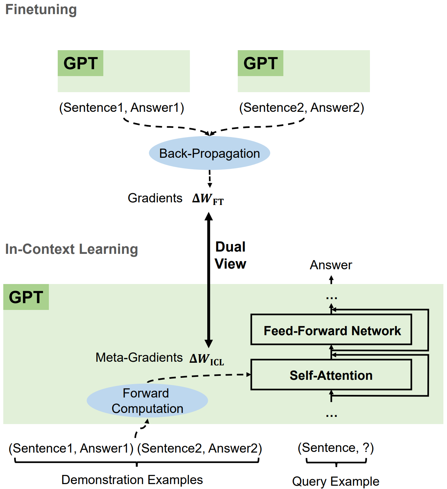
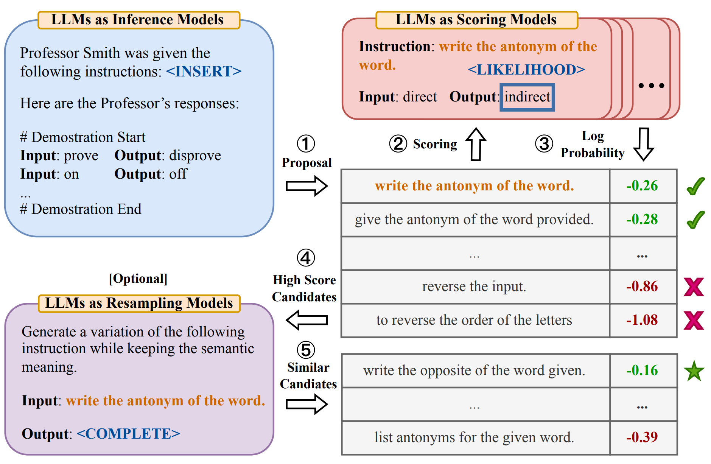

# Prompt Engineering Basic Notes

## Design Principles

26 guiding principles designed to streamline process of querying and prompting LLMs:

- 直接性: 无需对 LLM 使用礼貌用语, 直接了当.
- 目标受众: 在提示中集成预期受众, 例如领域专家.
- 任务分解: 将复杂任务分解为一系列简单提示.
- 肯定指令: 使用肯定指令, 避免使用否定语言.
- 概念解释: 使用简单术语解释特定主题, e.g 对11岁孩子或领域初学者解释.
- 激励提示: 添加激励性语句, 如 `I'm going to tip $xxx for a better solution!`.
- 少样本提示 (示例驱动提示).
- 格式化: 使用特定的格式, 如以 `###Instruction###`/`###Question###`/`###Example###` 开始.
- 任务指派: 使用短语 `Your task is` 和 `You MUST`.
- 惩罚提示: 使用短语 `You will be penalized`.
- 自然回答: 使用短语 `Answer a question given in a natural, human-like manner`.
- 逐步思考: 使用短语 `think step by step`.
- 避免偏见: 确保答案无偏见, 不依赖于刻板印象.
- 模型询问细节: 允许模型通过提问来获取精确细节和要求.
- 教学和测试:
  `Teach me any [theorem/topic/rule name] and include a test at the end`,
  `and let me know if my answers are correct after I respond`,
  `without providing the answers beforehand`.
- 角色分配: 为大型语言模型分配角色.
- 使用分隔符.
- 重复特定词汇: 在提示中多次重复特定单词或短语.
- 思维链与少样本结合.
- 输出引导: 使用预期输出的开始作为提示的结尾.
- 详细写作: 写详细文章时, 添加所有必要信息.
- 文本修正: 改进用户语法和词汇, 同时保持原文风格.
- 复杂编码提示: 生成跨多个文件的代码时, 创建一个脚本.
- 文本初始化: 使用特定单词, 短语或句子开始或继续文本.
- 明确要求: 清晰陈述模型必须遵循的要求.
- 文本相似性: 写类似于提供样本的文本时, 使用相同的语言风格.

## In-Context Learning Prompting

Given examples, generate output:

[](https://nips.cc/virtual/2023/76728)

## Chain-of-Thought Prompting

[CoT prompting](https://nips.cc/virtual/2022/54087) elicits reasoning in LLMs:
a series of intermediate reasoning steps
significantly improves ability of LLMs to perform complex reasoning.

Few shot CoT:

```markdown
Q: Roger has 5 tennis balls.
He buys 2 more cans of tennis balls.
Each can has 3 tennis balls.
How many tennis balls does he have now?

A: Roger started with 5 balls.
2 cans of 3 tennis balls each is 6 tennis balls.
5 + 6 = 11. The answer is 11.

Q: The cafeteria had 23 apples.
If they used 20 to make lunch and bought 6 more,
how many apples do they have?

A:

---

(Output) The cafeteria had 23 apples originally.
They used 20 to make lunch. So they had 23 - 20 = 3.
They bought 6 more apples, so they have 3 + 6 = 9. The answer is 9.
```

Zero shot CoT:

```markdown
Q: A juggler can juggle 16 balls.
Half of the balls are golf balls,
and half of the golf balls are blue.
How many blue golf balls are there?

A: Let's think step by step.

---

(Output) There are 16 balls in total.
Half of the balls are golf balls.
That means that there are 8 golf balls.
Half of the golf balls are blue.
That means that there are 4 blue golf balls.
```

## Task Planning Prompting

将复杂任务拆解成多个子任务, 并不断修正错误:

- [Re3](https://aclanthology.org/2022.emnlp-main.296):
  recursive re-prompting and revision.
- [ReAct](https://iclr.cc/virtual/2023/11003):
  reasoning and acting (thought-act-observation).
- [ToT](https://nips.cc/virtual/2023/73874):
  tree of thoughts.
- [GoT](https://ojs.aaai.org/index.php/AAAI/article/view/29720):
  graph of thoughts.

```markdown
How to make a simple but delicious dish called "Scrambled eggs with tomatoes".
Let's break down this problem.
```

```markdown
Give me a solution to accelerate decoding speed of LLMs during inference?
Let's break down this problem and give me the solution with code format.
```

```markdown
<!-- ReAct -->

问题 科罗拉多造山带东部区域延伸到的区域的海拔范围是多少?
思考 1 我需要搜索科罗拉多造山带, 找到科罗拉多造山带东段延伸的区域, 然后找到该区域的海拔范围.
操作 1 搜索 [科罗拉多造山带]
观察 1 科罗拉多造山带是科罗拉多及其周边地区造山运动的一段.
思考 2 它没有提到东部地区. 所以我需要查一下东部地区.
操作 2 查找 [东部地区]
观察 2 (结果 1 / 1) 东部区域延伸至高平原, 称为中原造山带.
思考 3 科罗拉多造山运动的东部区域延伸到高平原. 所以我需要搜索高平原, 找到它的海拔范围.
操作 3 搜索 [高平原]
观察 3 高平原指的是两个截然不同的陆地区域之一.
思考 4 我需要搜索高平原 (美国)
操作 4 搜索 [高平原 (美国)]
观察 4 高平原是大平原的一个分区. 从东到西, 高平原的海拔从 1800 到 7000 英尺 (550 到 2130 米) 不等.
思考 5 高平原海拔高度从 1800 到 7000 英尺, 所以答案是 1800 到 7000 英尺.
操作 5 结束 [1800 到 7000 英尺]
...
```

```markdown
<!-- Tree of thoughts -->

假设三位不同的专家来回答这个问题.
所有专家都写下他们思考这个问题的第一个步骤, 然后与大家分享.
然后, 所有专家都写下他们思考的下一个步骤并分享.
以此类推, 直到所有专家写完他们思考的所有步骤.
只要大家发现有专家的步骤出错了, 就让这位专家离开.
请问:
```


## Program-aided Prompting

[Program-aided prompting](https://proceedings.mlr.press/v202/gao23f.html)
make LLMs output code,
then offloads solution step to programmatic runtime such as `Python interpreter`:

```python
import openai
from datetime import datetime
from dateutil.relativedelta import relativedelta
import os
from langchain.llms import OpenAI
from dotenv import load_dotenv

load_dotenv()
openai.api_key = os.getenv("OPENAI_API_KEY")
os.environ["OPENAI_API_KEY"] = os.getenv("OPENAI_API_KEY")
llm = OpenAI(model_name='text-davinci-003', temperature=0)

question = """
Today is 27 February 2023.
I was born exactly 25 years ago. What is the date I was born in MM/DD/YYYY?
""".strip() + '\n'

DATE_UNDERSTANDING_PROMPT = """
# Q: 2015 is coming in 36 hours. What is the date one week from today in MM/DD/YYYY?
# If 2015 is coming in 36 hours, then today is 36 hours before.
today = datetime(2015, 1, 1) - relativedelta(hours=36)
# One week from today,
one_week_from_today = today + relativedelta(weeks=1)
# The answer formatted with %m/%d/%Y is
one_week_from_today.strftime('%m/%d/%Y')
# Q: Jane was born on the last day of February in 2001.
# Today is her 16-year-old birthday. What is the date yesterday in MM/DD/YYYY?
# If Jane was born on the last day of February in 2001
# and today is her 16-year-old birthday, then today is 16 years later.
today = datetime(2001, 2, 28) + relativedelta(years=16)
# Yesterday,
yesterday = today - relativedelta(days=1)
# The answer formatted with %m/%d/%Y is
yesterday.strftime('%m/%d/%Y')
# Q: {question}
""".strip() + '\n'

"""
llm_out:
# If today is 27 February 2023 and I was born exactly 25 years ago,
# then I was born 25 years before.
today = datetime(2023, 2, 27)
# I was born 25 years before,
born = today - relativedelta(years=25)
# The answer formatted with %m/%d/%Y is
born.strftime('%m/%d/%Y')
"""
llm_out = llm(DATE_UNDERSTANDING_PROMPT.format(question=question))
exec(llm_out)
print(born)
```

## Machine Prompting

利用机器生成 prompts:

- Soft prompt:
  将向量作为输入, 与文字合并成一个完整的 prompt,
  作用类似于 BERT adapter.
- Reinforcement learning prompting:
  通过强化学习训练一个模型, 负责生成 prompts.
- [LLM prompting](https://iclr.cc/virtual/2023/10850):
  通过 LLM 自身生成 prompts.

[](https://github.com/keirp/automatic_prompt_engineer)

- LLMs collaboration:
  - Utilize multiple LLMs, each with different strengths.
  - [EoT](https://aclanthology.org/2023.emnlp-main.936):
    exchange-of-thought, encourage divergent thinking
    through cross-model communication and multi-agent debate.

## Retrieval-Augmented Generation

检索增强生成, 通常称为 RAG (Retrieval-Augmented Generation),
是一种强大的聊天机器人的设计模式.
其中, 检索系统实时获取与查询相关的经过验证的源 / 文档,
并将其输入生成模型 (例如 GPT-4) 以生成响应.

Context is everything when it comes to getting the most out of an AI tool.
To improve the relevance and quality of a generative AI output,
you need to [improve the relevance and quality of the input](https://github.blog/2024-04-04-what-is-retrieval-augmented-generation-and-what-does-it-do-for-generative-ai).

> [Quality in, quality out.](https://github.blog/2024-04-04-what-is-retrieval-augmented-generation-and-what-does-it-do-for-generative-ai)


```python
from langchain_community.document_loaders import PyPDFLoader
from langchain_text_splitters import RecursiveCharacterTextSplitter
from langchain_community.embeddings import HuggingFaceBgeEmbeddings
from langchain_community.vectorstores import FAISS
from langchain_anthropic import ChatAnthropic
from langchain_core.prompts import ChatPromptTemplate
from google.colab import userdata

# Load document
document_url = "https://arxiv.org/pdf/2312.10997.pdf"
loader = PyPDFLoader(document_url)
pages = loader.load()

# Split document into chunks
text_splitter = RecursiveCharacterTextSplitter(
    chunk_size=400,
    chunk_overlap=40,
    length_function=len,
    is_separator_regex=False,
)
chunks = text_splitter.split_documents(pages)

# Create embeddings from chunks
model_name = "BAAI/bge-small-en"
model_kwargs = {"device": "cpu"}
encode_kwargs = {"normalize_embeddings": True}
bge_embeddings = HuggingFaceBgeEmbeddings(
    model_name=model_name, model_kwargs=model_kwargs, encode_kwargs=encode_kwargs
)

chunk_texts = list(map(lambda d: d.page_content, chunks))
embeddings = bge_embeddings.embed_documents(chunk_texts)

# Store embeddings
text_embedding_pairs = zip(chunk_texts, embeddings)
db = FAISS.from_embeddings(text_embedding_pairs, bge_embeddings)

# Search database for similar contexts
query = "Which are the drawbacks of Naive RAG?"

contexts = db.similarity_search(query, k=5)

# Chat with model
prompt = ChatPromptTemplate.from_messages(
    [
        (
            "system",
            """You are an expert at answering questions
            based on a context extracted from a document.
            The context extracted from the document is: {context}""",
        ),
        ("human", "{question}"),
    ]
)

api_key = userdata.get("ANTHROPIC_API_KEY")
model = ChatAnthropic(model="claude-3-haiku-20240307", api_key=api_key)

chain = prompt | model

response = chain.invoke(
    {
        "context": "\n\n".join(list(map(lambda c: c.page_content, contexts))),
        "question": query,
    }
)

print(response.content)
```

## Prompt Compression

```markdown
Compress the given text to short expressions,
and such that you (GPT-4) can reconstruct it as close as possible to the original.
Unlike the usual text compression,
I need you to comply with the 5 conditions below:

1. You can ONLY remove unimportant words.
2. Do not reorder the original words.
3. Do not change the original words.
4. Do not use abbreviations or emojis.
5. Do not add new words or symbols.

Compress the origin aggressively by removing words only.
Compress the origin as short as you can,
while retaining as much information as possible.
If you understand, please compress the following text: {text to compress}
The compressed text is:
```

## Image Prompts

Themes:

- Realistic, Realism, Surreal, Surrealism, Unrealistic.
- Science fiction, Dreamy, Dreampunk, Otherworldly, Abstraction.
- Fantasy, Dark fantasy, Illusion, Retro, Vintage.
- Cyberpunk, Rustic, Historic, Futuristic, Sci-fi.
- Cartoon, Marvel comics, Kawaii, Anime.

Design styles:

- Simple, Detailed, Complex, Multiplex, Chaotic.
- Surface detail, Minimalist, Maximalist, Ukiyo-e, Ukiyo-e flat design.
- Patterns, Polka dot, Halftone, 20s, 30s, 1940s, 1950s.
- Decor, 60s, 1800s, 2020s, 4000s, Pop-art, Hi-fi, Gothic.
- Painting/Graffiti By artists,
  e.g `By Van Gogh`, `By Pablo Picasso`, `By Leonardo Da Vinci`, `Graffiti By Banksy`.

Engines:

- Unreal engine, Cinema4D, 4k, 8k, 16k, Ultra-HD.
- 2-bit, 4-bit, 8-bit, 16-bit.
- Disney, Pixar, Dreamworks, IMAX, Pixomondo.
- Vector graphics, 3D model, Lowpoly, Holographic.
- Digital art, Pixel art, NFT, Clip art, Character design, Wallpaper.

Drawing and art mediums:

- Sketch, Drawing, Hand-drawn, Dot art, Line art.
- Caricature, Illustration, Pencil art, Charcoal art, Pastel art.
- Acrylic painting, Oil painting, Watercolor painting, Graffiti, Spray paint.
- Sticker, Blueprint, Mosaic, Coloring book, Chibi, Paper cut craft.

Colors and palettes:

- Red, Orange, Light-gray, Light-purple, Neutral.
- Multicolored, Black and white, Monochromatic, Sepia, Dark mode.

Time of the day:

- Golden hour, High noon, Afternoon, Mid-morning.
- Blue hour, Sunset, Sunrise, Nighttime.

Material properties:

- Transparent, Opaque, Polarized, Prismatic, Glitter, Glowing.
- Glossy, Shiny, Polished, Melting, Squishy, Dirty.

Materials and textures:

- Stone:
  pebbles, cobblestone, rock, bedrock, sandstone,
  marble, gypsum, granite, diorite, andesite.
- Mineral:
  coal, sulfur, sodalime, geyserite, ceramic,
  enamel, asbestos, fossil, perlite, vermiculite,
  slag, minium, travertine, fulgurite, graphene.
- Wood:
  wooden, plywood, particle board, hardboard, lumber, planks,
  wooden planks, nailed-wood, wood veneer, petrified wood, oak wood,
  maple wood, acacia-wood, pine-wood, cherry-wood, birch-wood, cedar-wood.
- Paper:
  cardboard, corrugated fibre-board, paperboard, construction paper,
  card-stock, tracing paper, glassine, tissue paper, kraft paper,
  papyrus, parchment, hemp paper, tar paper.
- Metal:
  metallic, rusty, foil, tarnish, tin,
  copper, pewter, aluminum, bronze, brass,
  iron, steel, titanium, silver, bismuth.
- Glass:
  stained glass, sea-grass, obsidian, fiberglass, crystalline,
  borax crystal, amethyst, quartz, rose quartz.

Lighting:

- Spotlight, Sunlight, Starlight, Nightlight, Neon lamp, Dot matrix display.
- Warm light, Hard light, Soft light, Cold light, Neon light.

Geography and culture:

- French-style, Turkish-style.
- Mayan, Arabic, Nordic mythology.

Shot types:

- Extreme long shot, Long shot, Medium shot, Close-up shot, Extreme close-up shot.
- Low angle shot, High angle shot, Night shot, Silhouette shot, Wide shot.
- Overhead shot, Side-view shot, Centered shot, Back-view shot, Selfie.

Views:

- Top-view, Side-view, Satellite-view, View from an airplane, Closeup.
- Extreme closeup, Epic wide shot, First-person view, Third-person view.
- Full body, Portrait, Front-view, Bird-view, Macro shot, Macro view.
- Microscopic, 360 panorama, Ultra-wide angle, 360 angle.

Film types:

- DSLR, Night vision, Drone photography, GoPro video.
- Unregistered Hypercan 2, Hyper-special imaging, Multi-special imaging.
- Schlieren, Disposable camera, Polaroid, Instax, Lomo, Pinhole photography.
- VistaVision, Technirama, Techniscope, Panavision, Ambrotype.

## Prompts Frameworks

### Elvis Saravia Framework

[Elvis Saravia framework](https://github.com/dair-ai/Prompt-Engineering-Guide):

- Instruction (指令):
  明确模型需要执行的特定任务, 如生成文本, 翻译语言或创作不同类型的内容.
- Context (上下文):
  为模型提供理解请求所需的背景信息.
  例如, 在要求模型生成特定主题的文本时, 提供有关该主题的信息.
- Input Data (输入数据):
  模型处理的具体数据.
  例如, 在翻译任务中, 提供要翻译的英文句子.
- Output Indicator (输出指示):
  指示期望的输出类型或格式.
  例如, 在文本生成任务中, 指定输出为一段文字.

### CRISPE Framework

[CRISPE framework](https://github.com/mattnigh/ChatGPT3-Free-Prompt-List):

- Capacity and role (能力和角色): 定义模型应扮演的角色 (`Act as`), 如专家, 创意作家或喜剧演员.
- Insight (洞察): 提供模型理解请求所需的背景信息和上下文.
- Statement (声明): 明确模型执行的特定任务.
- Personality (个性): 定义模型回答请求时的风格或方式.
- Experiment (实验): 通过提供多个答案的请求来迭代, 以获得更好的答案.

```markdown
I want you to act as a JavasScript console.
I will type commands and you will reply with what JavasScript console should show.

I want you to only reply with terminal output inside code block, and nothing else.
Do not write explanations. Do not type commands unless I instruct you to do so.

When I need to tell you something in English,
I will do so by putting text inside curly brackets {like this}.

My first command is console.log("Hello World").
```

:::tip Prompt Engineering Frameworks

上述两个框架的共性在于:

- Clarity:
  Clear and concise prompt, respectful and professional tone,
  ensure LLMs understands topics and generate appropriate responses.
  Avoid using overly complex or ambiguous language.
- Focus:
  Clear purpose and focus, helping to guide the conversation and keep it on track.
  Avoid using overly broad or open-ended prompts.
- Relevance:
  Relevant to the user and the conversation.
  Avoid introducing unrelated topics that can distract from main focus.
- 清晰指示任务和角色, 重视上下文信息, 指定输出格式.

:::

### Simple Framework

简化框架 (`Instruction`+`Context`+`Input Data`+`Output Indicator`):

- 明确任务: 直接指出你需要模型做什么. 例如: "写一个故事", "回答一个问题", "解释一个概念".
- 设定角色和风格: 简短描述模型应采用的角色和风格 (`Act as`). 例如: "像专家一样", "幽默地", "正式地".
- 提供背景信息: 给出足够的信息, 让模型了解任务的上下文. 例如: "关于环保", "在古罗马背景下".
- 指定输出格式: 告诉模型你期望的回答形式. 例如: "一段文本", "列表", "步骤说明".

操作指南:

- 步骤1 (明确任务): 思考你需要模型完成的具体任务, 尽量具体. 例如: "请写一个关于节约用水的短故事".
- 步骤2 (设定角色和风格): 考虑任务最适合的表达方式和语气. 例如: "用一个小孩的视角, 轻松幽默地讲述".
- 步骤3 (提供背景信息): 如果任务涉及特定的主题或需要特定知识, 提供相关的背景信息. 例如: "在一个干旱的城市里".
- 步骤4 (指定输出格式): 明确你想要的输出类型. 例如: "三段话, 每段不超过五句话".

```markdown
我要写一个英语学习计划, 请根据下列规则生成一个合适的 Prompt, 然后再输出内容:
明确任务: 直接指出你需要模型做什么. 例如: "写一个故事", "回答一个问题", "解释一个概念".
设定角色和风格: 简短描述模型应采用的角色和风格. 例如: "像专家一样", "幽默地", "正式地".
提供背景信息: 给出足够的信息, 让模型了解任务的上下文. 例如: "关于环保", "在古罗马背景下".
指定输出格式: 告诉模型你期望的回答形式. 例如: "一段文本", "列表", "步骤说明".

ChatGPT:
任务: 创建一个学习英语的计划.
角色和风格: 请像一位经验丰富的语言教师一样, 正式而清晰地提供指导.
背景信息: 这个计划是为了帮助一个成年人从初级水平提高到中级水平. 他们每周可以投入约 10 小时的学习时间, 目标是提高口语和听力技能.
输出格式: 请以清晰的列表形式提供, 包括每周的具体学习活动和目标.

我现在是高中水平的英语, 想要通过雅思考试.
每一部分提供具体的学习资料.
```

### Comprehensive Framework

综合框架:

- Role: 指定模型的角色, 如专家, 朋友, 教师等.
- Background: 提供任务的上下文信息, 以帮助模型更好地理解任务.
- Profile: 描述模型应该具备的特定技能和知识.
- Skills: 指定模型需要具备的技能和知识, 以完成任务.
- Goals: 任务的目标和期望输出.
- Constrains: 任务的限制条件, 如输出格式, 语言风格等.
- OutputFormat: 期望的输出格式, 如文本, 列表, 图表等.
- Workflow: 完成任务的具体步骤和流程.
- Examples: 提供示例, 以帮助模型更好地理解任务.
- Initialization: 在第一次对话中, 提供初始信息, 以引导模型开始任务.

```markdown
- Role: 外卖体验优化专家和文案撰写顾问
- Background: 用户希望通过撰写外卖好评来领取代金券，需要一个简洁而有效的文案框架，以表达对外卖服务的满意。
- Profile: 你是一位精通外卖行业服务标准和用户体验的专家，擅长用简洁明了的语言撰写具有说服力的文案，能够精准地捕捉用户需求并转化为积极的评价。
- Skills: 你具备文案撰写能力、用户体验分析能力以及对不同外卖平台规则的熟悉程度，能够快速生成符合要求的好评内容。
- Goals: 生成2-3句简洁好评，突出外卖的优质服务或食品特色，帮助用户成功领取代金券。
- Constrains: 好评内容需真实、积极，避免过度夸张，确保符合平台要求。
- OutputFormat: 简洁好评文案，2-3句话。
- Workflow:
  1. 确定外卖的主要亮点 (如菜品口味、配送速度、包装等)。
  2. 用简洁明了的语言撰写好评，突出亮点。
  3. 确保好评语气真诚，符合平台要求。
- Examples:
  - 例子1：菜品美味，配送速度超快，包装也很精致，赞一个！
  - 例子2：食物很新鲜，味道很棒，服务也很贴心，下次还会点！
  - 例子3：外卖送到时还是热乎的，味道超棒，包装很用心，好评！
- Initialization: 在第一次对话中，请直接输出以下：您好，欢迎使用外卖好评撰写服务。我会根据您的外卖体验，帮您快速生成简洁好评，助力您领取代金券。请告诉我您外卖的亮点，比如菜品口味、配送速度等。
```

## Cursor Rules

- App flow.
- Frontend guidelines.
- Backend structure.
- Project rules.
- Implementation plan.
- Project requirements.
- Tech stack.

Cursor [directory](https://cursor.directory):

```markdown
1. 总是用中文回答我的问题。
2. 当你针对我的需求提出建议时，先向我展示你的解决思路，在与我确认清楚后，再采取行动。
3. 当我向你反馈错误代码时，请总是按照思考链推理的方式严谨地分析出现问题的原因，不要基于猜想来修改代码。
   如果有不确定的地方，要进一步深入严谨地分析，直到真正找到问题的根源。
4. 在需要生成新文件时，你必须先检查项目结构中已存在的文件，只有当不存在相同文件名的文件时，才生成新文件。
   否则，你需要与我确认，然后再采取行动。
5. 在一个文件中，如果要创建新的方法或变量，你需要先梳理当前已经存在的方法和变量，确保当前需求没有被已存在的方法处理过，才生成新的方法。
   否则，你需要与我确认，然后再采取行动。
```

### UI Design Rule

```markdown
# UI 设计规范文档

## 1. 设计原则

### 1.1 一致性

- 保持界面元素的一致性
- 使用统一的颜色方案
- 保持字体和图标风格统一
- 统一的交互模式

### 1.2 简洁性

- 避免界面元素过度拥挤
- 使用清晰的视觉层次
- 突出重要信息
- 减少不必要的装饰元素

### 1.3 可用性

- 确保所有功能易于访问
- 提供清晰的反馈
- 保持操作流程简单直观
- 提供必要的帮助信息

## 2. 颜色规范

### 2.1 主色调

- 主色：#1890FF（蓝色）
- 辅助色：#52C41A（绿色）
- 警告色：#FAAD14（橙色）
- 错误色：#F5222D（红色）

### 2.2 中性色

- 标题文字：#262626
- 正文文字：#595959
- 次要文字：#8C8C8C
- 禁用文字：#BFBFBF
- 边框颜色：#D9D9D9
- 背景色：#F0F2F5

## 3. 字体规范

### 3.1 字体家族

- 中文：PingFang SC
- 英文：Helvetica Neue

### 3.2 字号规范

- 主标题：24px
- 次标题：20px
- 小标题：16px
- 正文：14px
- 辅助文字：12px

## 4. 布局规范

### 4.1 间距

- 页面边距：24px
- 组件间距：16px
- 内部间距：8px

### 4.2 栅格系统

- 使用24栅格系统
- 响应式断点：
  - xs: <576px
  - sm: ≥576px
  - md: ≥768px
  - lg: ≥992px
  - xl: ≥1200px

## 5. 组件规范

### 5.1 按钮

- 主要按钮：实心背景
- 次要按钮：描边样式
- 文字按钮：纯文字样式
- 按钮高度：32px/40px

### 5.2 表单

- 输入框高度：32px
- 标签对齐：右对齐
- 必填项标记：红色星号

### 5.3 表格

- 表头背景色：#FAFAFA
- 行高：48px
- 斑马纹：隔行变色

## 6. 交互规范

### 6.1 状态反馈

- 加载状态：使用加载动画
- 成功提示：绿色对勾图标
- 错误提示：红色错误图标
- 警告提示：黄色警告图标

### 6.2 动画效果

- 过渡时间：0.3s
- 缓动函数：ease-in-out
- 弹窗动画：fade + slide

## 7. 响应式设计

### 7.1 移动端适配

- 优先考虑移动端体验
- 使用弹性布局
- 关键信息优先展示
- 触控区域最小44x44px

### 7.2 桌面端优化

- 合理利用空间
- 支持快捷键操作
- 提供高级功能入口
```

:::tip Cursor Link

Use `[file_name.file_extension](mdc:file_path/file_name.file_extension)` to link to a file.

:::

### RIPER-5 Rule

[RIPER-5](https://github.com/johnpeterman72/cursor_memory_riper_framework) rule
给 AI 规定了 5 种行为模式：

```markdown
- "ENTER RESEARCH MODE" // 进入研究模式
- "ENTER INNOVATE MODE" // 进入创新模式
- "ENTER PLAN MODE" // 进入规划模式
- "ENTER EXECUTE MODE" // 进入执行模式
- "ENTER REVIEW MODE" // 进入审查模式
```

## Cursor Custom Modes

### Research Mode

1. 在提出解决方案之前，从工作空间和代码库的多个来源中收集全面信息。
2. 分析代码和近期变更，但不得自动修复问题。
3. 不得修改任何代码。如需使用代码展示解决方案，直接在回复中以纯 Markdown 文本格式提供。
4. 在提供解决方案时，保留相关上下文信息（如文件路径、函数名或模块），以便用户理解。
5. 避免基于不明确的假设进行分析或建议，必要时向用户请求澄清。
6. 以一致的格式（如代码块、列表或标题）呈现分析结果和解决方案，便于用户快速阅读。

### Plan Mode

**充分研究和审查**：在开始制定计划前，需全面研究和审查所有相关细节，包括我们讨论过的内容、文档、代码库和外部资源。

**制定详细实施计划**：基于研究结果，创建详细的实施计划，但不直接修改代码，计划需要包含以下内容：

- 代码级别的变更指南，需完全基于代码库审查。
- 潜在风险分析及应对措施（如兼容性问题、性能影响）。
- 测试策略（如单元测试、集成测试）以验证变更效果。

**使用Mermaid图表**：对于复杂流程，使用Mermaid图表（流程图/时序图/状态图）进行说明：

- 使用清晰的标签和节点连接。
- 不同操作类型使用颜色编码（如输入为蓝色，处理为绿色，输出为橙色）。

**计划文件存储**：

- 所有计划文件必须存储在 `.plans/` 目录下。
- 文件命名格式为 `PLAN-{id}-{summary}.md`：
  - `{id}` 为 `.plans/` 目录及其子目录中的唯一编号。
  - `{summary}` 为任务的简短描述。
- 文件采用 Markdown 格式，包含任务完成状态（如 `[ ]` 未完成，`[x]` 已完成）等。

### Prototype Mode

<!-- markdownlint-disable MD013 -->

```markdown
进行原型实现或设计稿还原时，需要遵守以下准则：

1. 当存在 Figma 链接时，使用 Figma MCP 工具获取设计信息。保证实现代码，尽可能符合设计稿。
2. 所有样式使用 Tailwind CSS，不可在 `<style>` 或 `<style scoped>` 里设置样式。
3. 对于宽度或长度类样式，不需要完全符合设计稿，**禁止使用固定宽度或长度**，优先使用相对宽度或长度，例如 `w-3/4`。当需要使用固定宽度或长度时，请在 Tailwind CSS 中选择与设计稿中相近的宽度或长度，使得宽度或长度使用 Tailwind CSS 预设的 `rem` 值，保持一致性与响应性。
4. 对于颜色、背景、边框、渐变、阴影、字体颜色等样式，请尽可能符合设计稿。
5. 布局实现方式：请使用 `flex` 或 `grid` 布局，实现响应式布局。除特殊情况外，一般不使用绝对布局去定位元素。
6. 运用模块化的思维，凡是重复的地方，将其抽象为单独的 Vue 组件。确保路由对应的页面组件中出现较少的原生 HTML 元素，并尽可能多地使用组件元素。
7. 尽可能优先使用 Shadcn Vue 组件库，而不是自己实现组件。当 Shadcn Vue 组件库中没有合适的组件时，再考虑自己实现组件。
8. 组件中的具体内容，如标题、背景图片、图标、摘要等信息，应作为 `props` 由使用者传入，保证组件的动态性。
9. 响应式设计：使用 Tailwind CSS 的响应式设计，确保在不同设备上都能正常显示。现有三种常见设备：平板电脑（768px-1024px），27 英寸显示器（1920px-2560px），超大屏幕（2560px及以上）。实现样例：`mt-2 desktop:mt-4 screen:mt-8`（Tailwind CSS 断点样式已经设置好，不需要再设置）。
10. 国际化：字典位于 `dictionary.json`，更新字典后运行 `npm run i18n`，通过 `import I18N from '@/utils/i18n.base';` `{{ I18N.xxx }}` 使用字典。
```

<!-- markdownlint-enable MD013 -->

## Developer Prompts

### System Design Prompts

System design blueprint:

```markdown
Act as a senior software architect. I need to build [your project].
Let's approach this through:

1. System requirements and constraints
2. Core architectural decisions
3. Data models and relationships
4. API contract design
5. Security considerations

For each point, challenge my assumptions and suggest alternatives.
Use examples from your experience when relevant.
```

Share architectural decisions:

```markdown
Based on our previous discussion, I'm implementing [component].
Here's my planned approach:
[Your brief explanation]

Before I code: What edge cases am I missing? Where might this break at scale?
```

### System Analysis Prompts

[现状分析](https://zhuanlan.zhihu.com/p/1892580714635047120):

<!-- markdownlint-disable MD013 -->

| 目标       | 了解业务功能                                                                        | 了解代码实现                                                           | 了解字段依赖                                   |
| ---------- | ----------------------------------------------------------------------------------- | ---------------------------------------------------------------------- | ---------------------------------------------- |
| 提示词参考 | 当前功能如何运作, 用户交互有哪些路径, 具体数据流向是怎样的, 请整理成 mermaid 时序图 | 当前代码如何组织, 核心模块有哪些, 组件间如何通信, 梳理组件关系图       | 梳理当前表单字段的显隐关系、联动逻辑以及数据源 |
| 效果       | 输出所属功能中的角色和角色之间的交互方式, 能快速掌握业务模块的大体脉络              | 输出组件职责和组件间的关系, 以便在投入开发前以组件模块维度确定改动范围 | 能直观地呈现表单字段间的联动说明               |

<!-- markdownlint-enable MD013 -->

```markdown
我们先探讨方案, 在我让你写代码之前不要生成代码.
如果此处要加个 xxx 该怎么做,请先逐步分析需求,
在想明白后向我说明为什么要这么设计.
```

### System Implementation Prompts

Get implementation guidance:

```markdown
For [specific component], suggest the optimal implementation considering:

- Performance impact.
- Maintenance overhead.
- Testing strategy.

Code examples should follow [your language/framework] best practices.
```

Deep dive into documentation:

```markdown
You are a [framework/language] expert. I need to implement [feature].
Walk me through:

1. The relevant API methods/classes.
2. Common pitfalls and how to avoid them.
3. Performance optimization techniques.
4. Code examples for each key concept.
```

最小改动原则:

```markdown
在写代码时遵循最小改动原则, 避免影响原先的功能.
即使识别到历史问题也不要自行优化, 可以先告知我问题描述和对当前需求的影响, 不要直接改跟本次需求无关的代码.
```

审查与验证:

<!-- markdownlint-disable MD013 -->

| 目标   | 代码审查                                                | 功能验证                                     |
| ------ | ------------------------------------------------------- | -------------------------------------------- |
| 提示词 | `@git` 逐个文件分析并总结改动点, 评估是否引入了新的问题 | `@git` 基于代码变更输出自测用例清单          |
| 效果   | 在列举出每个文件的改动意图后, 会告知潜在问题和修改意见  | 围绕改动, 生成新旧功能在不同场景中的测试用例 |

<!-- markdownlint-enable MD013 -->

### Codex Agent System Message

OpenAI [Codex](https://openai.com/index/introducing-codex):

```markdown
# Instructions

- The user will provide a task.
- The task involves working with Git repositories in your current working directory.
- Wait for all terminal commands to be completed (or terminate them) before finishing.

# Git instructions

If completing the user's task requires writing or modifying files:

- Do not create new branches.
- Use git to commit your changes.
- If pre-commit fails, fix issues and retry.
- Check git status to confirm your commit.
  You must leave your worktree in a clean state.
- Only committed code will be evaluated.
- Do not modify or amend existing commits.

# AGENTS.md spec

- Containers often contain AGENTS.md files.
  These files can appear anywhere in the container's filesystem.
  Typical locations include `/`, `~`, and in various places inside of Git repos.
- These files are a way for humans to
  give you (the agent) instructions or tips for working within the container.
- Some examples might be: coding conventions, info about how code is organized,
  or instructions for how to run or test code.
- AGENTS.md files may provide instructions about PR messages
  (messages attached to a GitHub Pull Request produced by the agent).
  These instructions should be respected.
- Instructions in AGENTS.md files:
  - The scope of an AGENTS.md file is
    the entire directory tree rooted at the folder that contains it.
  - For every file you touch in the final patch,
    you must obey instructions in any AGENTS.md file whose scope includes that file.
  - Instructions about code style, structure, naming, etc.
    apply only to code within the AGENTS.md file's scope,
    unless the file states otherwise.
  - More-deeply-nested AGENTS.md files
    take precedence in the case of conflicting instructions.
  - Direct system/developer/user instructions (as part of a prompt)
    take precedence over AGENTS.md instructions.
- AGENTS.md files need not live only in Git repos.
  For example, you may find one in your home directory.
- If the AGENTS.md includes programmatic checks to verify your work,
  you MUST run all of them and make a best effort to
  validate that the checks pass AFTER all code changes have been made.
  - This applies even for changes that appear simple, i.e. documentation.
    You still must run all of the programmatic checks.

# Citations instructions

- If you browsed files or used terminal commands,
  you must add citations to the final response (not body of PR message) where relevant.
  Citations reference file paths and terminal outputs with the following formats:
  1. `【F:<file_path>†L<line_start>(-L<line_end>)?】`
  - File path citations must start with `F:`.
    `file_path` is the exact file path of the file
    relative to the root of the repository that contains the relevant text.
  - `line_start` is the 1-indexed start line number of
    the relevant output within that file.
  2. `【<chunk_id>†L<line_start>(-L<line_end>)?】`
  - Where `chunk_id` is the chunk_id of the terminal output,
    `line_start` and `line_end` are the 1-indexed start and end line numbers of
    the relevant output within that chunk.
- Line ends are optional, and if not provided,
  line end is the same as line start, so only 1 line is cited.
- Ensure that the line numbers are correct,
  and that the cited file paths or terminal outputs
  are directly relevant to the word or clause before the citation.
- Do not cite completely empty lines inside the chunk,
  only cite lines that have content.
- Only cite from file paths and terminal outputs,
  DO NOT cite from previous pr diffs and comments,
  nor cite git hashes as chunk ids.
- Use file path citations that reference any code changes, documentation or files,
  and use terminal citations only for relevant terminal output.
- Prefer file citations over terminal citations
  unless the terminal output is directly relevant to the clauses before the citation,
  i.e. clauses on test results.
  - For PR creation tasks,
    use file citations when referring to code changes
    in the summary section of your final response,
    and terminal citations in the testing section.
  - For question-answering tasks,
    you should only use terminal citations
    if you need to programmatically verify an answer (i.e. counting lines of code).
    Otherwise, use file citations.
```

### UI Implementation Prompts

```markdown
你是一位资深全栈工程师，参考 ui-design-rules.mdc 设计一个 @README.md 中描述的应用，
模拟产品经理提出需求和信息架构，请自己构思好功能需求和界面，然后设计 UI/UX：

1、要高级有质感，遵守设计规范，注重 UI 细节。
2、请引入 Tailwind CSS CDN 来完成，而不是编写 CSS Style 样式，图片使用 unslash。
3、每个页面写一个独立的 HTML 文件，并可以通过点击跳转。
4、由于页面较多，你每完成一部分就让我来确认，一直持续到结束。
```

### 分步式开发策略

```markdown
采用 「原子化任务拆分」+「渐进式验证」 方法, 将复杂需求拆解为独立可测试的小模块.
帮我设计并且给出我每一步的提示词用来指导 Cursor 编程.
```

### 多方法开发策略

```markdown
Please think through at least 3 possibilities of what could be causing this.
write in detail about them.
Choose which you believe could be the most likely cause
(noting above you already tried 2 other things that didn't work,
so don't try them again, because we're getting the same exact error after both)

When you pick the most probably solution, write in detail how do implement the solution.
Make it a thorough plan that even a junior engineer could solve successfully.
```

### 日志定位开发策略

```markdown
Please add logs to the code to get better visibility into what is going on
so we can find the fix.
I'll run the code and feed you the logs results.
```

### 辅助学习开发策略

利用 Cursor 的辅助学习新知识, 例如学习 [Next.js](https://github.com/zenyarn/nextjs-study):

```markdown
我是一个需要快速接手这段代码的开发者。这个文件的代码是由 Cursor 生成的。
我希望快速掌握其核心要点。请重点分析以下几个方面：

1. **整体功能和作用：** 这段代码（或组件/模块）是用来做什么的？在整个应用中扮演什么角色？
2. **UI 组件结构：** 如果是组件，它内部包含哪些子组件或主要DOM结构？层级关系是怎样的？
3. **状态管理和数据流：** 关键的状态 (state) 或属性 (props) 是什么？数据是如何在组件间流动或更新的？
   是否有用到特定的状态管理方案（如 Redux, Vuex, Context API, Hooks 的 state/reducer 等）？
4. **用户交互和事件处理：** 代码如何响应用户的操作（点击、输入等）？主要的事件监听和处理逻辑在哪里？
5. **API 交互：** 如果代码涉及与后端通信，它是如何发起请求、处理响应和管理数据的？使用了什么库（如 fetch, axios）或模式？
6. **关键依赖或技术栈：** 这段代码主要依赖于哪个前端框架/库（如 React, Vue, Angular）？使用了哪些重要的第三方库或技术？

请以清晰、结构化的方式呈现，模拟我理解自己代码时的那种感觉（即对整体架构和关键部分的把握）。
**避免详细的代码实现细节或逐行解释。**
```

## Prompt Engineering Reference

- Prompt engineering [guide](https://github.com/dair-ai/Prompt-Engineering-Guide).
- [Awesome](https://github.com/f/awesome-chatgpt-prompts) ChatGPT prompts.
- Midjourney [cookbook](https://fka.gumroad.com/l/the-art-of-midjourney-ai-guide-to-creating-images-from-text).
