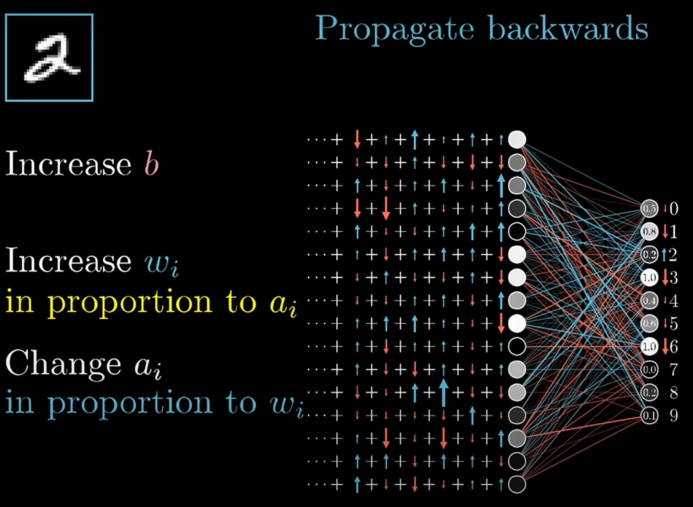

# AI Basic Notes

## Calculus and Mathematical Analysis

### Euler's Formula

复数平面 (Complex Plane) 上的圆周运动:

$$
\begin{equation}
  e^{ix}=\cos{x}+i\sin{x}
\end{equation}
$$

### Fourier Transform

Time to frequency transform:

$$
\begin{equation}
  \hat{f}(\xi)=\int_{-\infty}^{\infty}f(t)e^{-2\pi i\xi t}dt
\end{equation}
$$

Discrete Fourier Transform (DFT):

$$
\begin{equation}
  X[k]=\sum\limits_{n=0}^{N-1}x_n e^{-\frac{i2\pi}{N}kn}
\end{equation}
$$

outcomes

$$
\begin{bmatrix}
  1 & 1 & 1 & \dots & 1 \\
  1 & e^{\frac{2\pi i}{n}} & e^{\frac{2\pi i(2)}{n}}
  & \dots & e^{\frac{2\pi i(n-1)}{n}} \\
  1 & e^{\frac{2\pi i(2)}{n}} & e^{\frac{2\pi i(4)}{n}}
  & \dots & e^{\frac{2\pi i(2)(n-1)}{n}} \\
  \vdots & \vdots & \vdots & \ddots & \vdots \\
  1 & e^{\frac{2\pi i(n-1)}{n}} & e^{\frac{2\pi i(2)(n-1)}{n}}
  & \dots & e^{\frac{2\pi i(n-1)(n-1)}{n}}
\end{bmatrix}
$$

[](https://www.youtube.com/watch?v=spUNpyF58BY)

## Probability Theory and Mathematical Statistics

### Normal Distribution

若随机变量 $X$ 服从一个位置参数为 $\mu$, 尺度参数为 $\sigma$ 的概率分布,
且其概率密度函数 (Probability Density Function, PDF) 为:

$$
\begin{equation}
  f(x)=\frac{1}{\sigma\sqrt{2\pi}}e^{-\frac{1}{2}(\frac{x-\mu}{\sigma})^2}
\end{equation}
$$

则这个随机变量称为正态随机变量, 正态随机变量服从的分布称为正态分布,
记作 $X \sim N(\mu,\sigma^2)$, 读作 $X$ 服从 $N(\mu,\sigma^2)$ (正态分布).
其中 $\mu$ 为均值 (数学期望 Mean), $\sigma$ 为标准差 (Standard Deviation).

正态分布 (又称 Gaussian Distribution) 是一种连续概率分布.
当 $\mu$ 为 0, $\sigma$ 为 1 时, 称为标准正态分布 (Standard Normal Distribution).

### Gaussian Integral

$$
\begin{equation}
  \int_{-\infty}^{\infty}e^{-x^2}dx=\sqrt{\pi}
\end{equation}
$$

[高维空间求解](https://zhuanlan.zhihu.com/p/651305078)高斯积分:

[](https://www.youtube.com/watch?v=cy8r7WSuT1I)

对于正态分布, 系数 $\frac{1}{\sqrt{\pi}}$ 使得概率密度函数的积分为 1,
即 $\int_{-\infty}^{\infty}f(x)dx=1$, 使其成为有意义的概率分布.

### Central Limit Theorem

在自然界与生产中, 一些现象受到许多**相互独立**的随机因素的影响,
如果每个因素所产生的影响都很微小时, **总影响** (Sum) 可以看作服从正态分布.

相互独立的正态分布, 其和也是正态分布.
总体正态分布的均值等于各个分布的均值之和,
$E(X_1+\dots+X_n)=E(X_1)+\dots+E(X_n)=n\mu$.
假设协方差为 0, 则总体正态分布的方差等于各个分布的方差之和,
${Var(X_1+\dots+X_n)}={Var(X_1)+\dots+Var(X_n)}={n}\sigma^2$,
可以得到总体正态分布的标准差为 $\sqrt{n}\sigma$.

设随机变量 $X_1,X_2,\dots,X_n$ 独立同分布(Independent Identically Distribution),
且均值为 $E(X_i)=\mu$, 方差为 $D(X_i)=\sigma^2$,
对于任意 $x$, 其分布函数为

$$
F_n(x)=P\left\{\frac{\sum_{i=1}^n{X_i}-n\mu}{\sqrt{n}\sigma}\leq{x}\right\}
$$

满足

$$
\begin{equation}
  \lim_{n\to\infty}F_n(x)
  =\lim_{n\to\infty}P\left\{\frac{\sum_{i=1}^n{X_i}-n\mu}{\sqrt{n}\sigma}\leq{x}\right\}
  =\frac{1}{\sqrt{2\pi}}\int_{-\infty}^x{e^{-\frac{t^2}{2}}dt}
  =\varnothing(x)
\end{equation}
$$

独立同分布的中心极限定理说明, 当 $n$ 足够大时,
随机变量 $X_n=\sum\limits_{i=1}^n{X_i}$
近似服从正态分布 $N(n\mu,n\sigma^2)$;
标准化后的随机变量 $Y_n=\frac{\sum_{i=1}^n{X_i}-n\mu}{\sqrt{n}\sigma}$
近似服从标准正态分布 $N(0,1)$.

[](https://www.youtube.com/watch?v=zeJD6dqJ5lo)

更一般化的中心极限定理,
可参见林德伯格中心极限定理 ([Lindeberg CLT](https://en.wikipedia.org/wiki/Central_limit_theorem#Lindeberg_CLT))
etc.

## Linear Algebra

## Multilayer Perceptron


多层感知机是一种前馈神经网络 (Feedforward Neural Network)
就像是一个模拟大脑处理信息的过程,
通过多层处理 (输入层, 隐藏层, 输出层),
从原始数据中提取特征, 并做出预测或分类,
它通过调整内部连接权重来学习和改进其预测能力.

### 线性变换

$H=WX+B$:

- $w_{ij}^l$ (`weight`): 第 $l$ 层第 $i$ 个节点与上一层第 $j$ 个节点连接的权重.
- $b_i^l$ (`bias`): 第 $l$ 层第 $i$ 个节点的偏置.

$$
H=\begin{bmatrix}
  w_{00}^l & w_{01}^l & \dots & w_{0n}^l \\
  w_{10}^l & w_{11}^l & \dots & w_{1n}^l \\
  \vdots & \vdots & \ddots & \vdots \\
  w_{k0}^l & w_{k1}^l & \dots & w_{kn}^l
\end{bmatrix}
\begin{bmatrix}
  x_0^{l-1} \\
  x_1^{l-1} \\
  \vdots \\
  x_n^{l-1}
\end{bmatrix}
+\begin{bmatrix}
  b_0^l \\
  b_1^l \\
  \vdots \\
  b_k^l
\end{bmatrix}
$$

### 激活函数

激活函数 $y=\sigma(H)$:

- 引入非线性特性, 使得网络可以学习和模拟复杂函数.
- ReLU (Rectified Linear Unit, 线性整流单元): $\sigma(H)=\max(0,H)$.
- Sigmoid: $\sigma(H)=\frac{1}{1+e^{-H}}$.
- e.g 归一化函数, 使得输出值在 0 到 1 之间, 可以使得整个网络成为概率模型.

### 损失函数

损失函数 (Loss Function) $L(y,\hat{y})$:

- 用于衡量真实值(或人工标注值) $y$ 与模型预测值 $\hat{y}$ 之间的差异.
- 常见的损失函数有均方误差 (Mean Squared Error, MSE) 和交叉熵 (Cross Entropy).
- MSE: $L(y,\hat{y})=\frac{1}{n}\sum\limits_{i=1}^n(y_i-\hat{y}_i)^2$.
- Cross Entropy: $L(y,\hat{y})=-\sum\limits_{i=1}^n{y_i\log(\hat{y}_i)}$.

:::tip Learning

Learning is the process of minimizing loss function,
finally find out the right weights and biases.

:::

### 梯度下降

通过梯度下降 (Gradient Descent) 算法, 优化损失函数, 使其最小化:

$$
\begin{equation}
  \theta_{t+1}=\theta_t-\alpha\nabla{L}
\end{equation}
$$

其中, $\alpha$ 为学习率, $L$ 为损失函数, $\nabla{L}$ 为损失函数的梯度,
$\theta$ 为模型参数, $t$ 为迭代次数.

### 反向传播

反向传播 (Backpropagation) 算法:
通过链式法则, 计算梯度.
从最小化损失函数出发, 由输出层到输入层, 计算每一层的梯度, 从而更新权重和偏置.

[](https://www.youtube.com/watch?v=Ilg3gGewQ5U)

## Convolutional Architecture

### Convolution

Convolution is a mathematical operation
that combines two functions to produce a third function:

$$
\begin{equation}
  (f*g)(t):=\int_{-\infty}^{\infty} f(\tau)g(t-\tau)d\tau
\end{equation}
$$

Given $\boldsymbol{a}$ and $\boldsymbol{b}$, then:
$(\boldsymbol{a}*\boldsymbol{b})_n=\sum\limits_{\substack{i,j\\i+j=n}}a_i\cdot{b_j}$,
e.g $(1,2,3)*(4,5,6)=(4,13,28,27,18)_{0\dots{4}}$.
上述计算可以转换为多项式相乘的形式:

$$
\begin{split}
  A(x)&=\sum\limits_{i=0}^{M-1}a_i\cdot{x^i}   \\
  B(x)&=\sum\limits_{i=0}^{N-1}b_i\cdot{x^i}   \\
  C(x)&=A(x)\cdot{B(x)}                        \\
  C(x)&=\sum\limits_{i=0}^{M+N-2}c_i\cdot{x^i} \\
  c_i&=\sum\limits_{j=0}^{i}a_j\cdot{b_{i-j}}
\end{split}
$$

可以运用快速傅里叶变换 (FFT) 以 $O(N\log N)$ 的时间复杂度求解 $c_i$ 的值, 从而实现快速卷积运算.

[](https://www.youtube.com/watch?v=KuXjwB4LzSA)

For matrix:

$$
B(i,j)=\sum\limits_{m=0}^{M_k-1}\sum\limits_{n=0}^{N_k-1} K(m, n) A(i-m, j-n)
$$

### Convolutional Neural Networks

CNNs are a class of deep neural networks,
most commonly applied to analyzing visual imagery.
They are also known as ConvNets.

- Input Layer (输入层):
  raw pixel values of an image.
- Hidden Layers (隐藏层):
  - Convolutional Layer (卷积层):
    apply a convolution operation to the input,
    passing the results to the next layer.
  - Pooling Layer (池化层):
    down-samples the input representation,
    reducing its dimensionality.
  - Fully Connected Layer (全连接层):
    compute the class scores,
    resulting in a volume of size `1x1x10`,
    where each of the 10 numbers represents a class.
- Output Layer (输出层):
  class scores.

### Convolutional Layer

Convolutional Layer is the first layer to extract features from an input image.
The layer's parameters consist of a set of learnable filters (or kernels),
which have a small receptive field but extend through full depth of input volume.

### Pooling Layer

Pooling Layer is used to reduce the spatial dimensions of the input volume.
It helps to reduce the amount of parameters and computation in the network,
and hence to also control over-fitting.

### Fully Connected Layer

Fully Connected Layer is a traditional Multilayer Perceptron (MLP) layer.
It is used to compute the class scores,
resulting in a volume of size `1x1x10`,
where each of the 10 numbers represents a class.

## Recurrent Architecture

CNNs 常用于处理空间结构的数据,
RNNs 常用于处理时序关系的数据.

## Residual Architecture

ResNet 通过残差学习解决了深度网络的退化问题 (深度网络的训练问题),
最短的路, 决定容易优化的程度: 残差连接 (Residual Connection) 可以认为层数是 0.
最长的路, 决定深度网络的能力: 解决了深度网络的训练问题后, 可以做到更深的网络 (100+).

ResNet 通过引入残差连接, 允许网络学习残差映射而不是原始映射.
残差映射就是目标层与它的前面某层之间的差异 $\mathcal{F}(\mathrm{x}):=\mathcal{H}(\mathrm{x})-\mathrm{x}$.
如果输入和输出之间的差异很小, 那么残差网络只需要学习这些微小的差异即可.
这种学习通常比学习原始的复杂映射要简单得多.

$$
\begin{equation}
\begin{split}
  \mathrm{y}&=\mathcal{F}(\mathrm{x}, W_i)+W_s\mathrm{x}    \\
            &=\mathcal{F}(\mathrm{x})+\mathrm{x}            \\
            &=\mathcal{H}(\mathrm{x})-\mathrm{x}+\mathrm{x} \\
            &=\mathcal{H}(\mathrm{x})
\end{split}
\end{equation}
$$


从深层网络角度来讲, 不同的层学习的速度差异很大,
表现为网络中靠近输出的层学习的情况很好, 靠近输入的层学习的很慢,
有时甚至训练了很久, 前几层的权值和刚开始随机初始化的值差不多 (无法收敛).
因此, 梯度消失或梯度爆炸的根本原因在于反向传播训练法则, 本质在于方法问题.
ResNet 通过残差连接保持梯度传播, 使得网络的训练更加容易:

$$
\begin{equation}
  \frac{\theta{f(g(x))+g(x)}}{\theta{x}}=
  \frac{\theta{f(g(x))}}{\theta{g(x)}}\cdot{\frac{\theta{g(x)}}{\theta{x}}}+\frac{\theta{g(x)}}{\theta{x}}
\end{equation}
$$

## Transformer Architecture

[](https://jalammar.github.io/illustrated-transformer)

- Self-attention only:
  comparing to Recurrent Neural Networks (RNNs),
  no recurrent layers, allows for more parallelization.
- Multi-headed attention:
  consistent with Convolutional Neural Networks (CNNs),
  multiple output channels.

### Self-Attention Mechanism

In layman's terms,
a self-attention module takes in n inputs and returns n outputs:

- Self: allows the inputs to interact with each other
- Attention: find out who they should pay more attention to.
- The outputs are aggregates of these interactions and attention scores.

$$
\begin{equation}
  \text{Attention}(Q, K, V)=\text{softmax}(\frac{QK^T}{\sqrt{d_k}})V
\end{equation}
$$

[](https://towardsdatascience.com/illustrated-self-attention-2d627e33b20a)

The illustrations are divided into the following steps:

- Prepare inputs.
- Weights initialization (Constant/Random/Xavier/Kaiming Initialization).
- Derive query, key and value.
- Calculate attention scores for Input 1.
- Calculate softmax.
- Multiply scores with values.
- Sum weighted values to get Output 1.
- Repeat steps 4–7 for Input 2 & Input 3.

```python
Input 1: [1, 0, 1, 0]
Input 2: [0, 2, 0, 2]
Input 3: [1, 1, 1, 1]
```

Weights for query, key and value
(these weights are usually small numbers,
initialized randomly using an appropriate random distribution
like Gaussian, Xavier and Kaiming distributions):

```python
[[1, 0, 1], [[0, 0, 1], [[0, 2, 0],
 [1, 0, 0],  [1, 1, 0],  [0, 3, 0],
 [0, 0, 1],  [0, 1, 0],  [1, 0, 3],
 [0, 1, 1]]  [1, 1, 0]]  [1, 1, 0]]
```

Derive query, key and value:

```python
Query representations for every input:
               [1, 0, 1]
[1, 0, 1, 0]   [1, 0, 0]   [1, 0, 2]
[0, 2, 0, 2] x [0, 0, 1] = [2, 2, 2]
[1, 1, 1, 1]   [0, 1, 1]   [2, 1, 3]

Key representations for every input:
               [0, 0, 1]
[1, 0, 1, 0]   [1, 1, 0]   [0, 1, 1]
[0, 2, 0, 2] x [0, 1, 0] = [4, 4, 0]
[1, 1, 1, 1]   [1, 1, 0]   [2, 3, 1]

Value representations for every input:
               [0, 2, 0]
[1, 0, 1, 0]   [0, 3, 0]   [1, 2, 3]
[0, 2, 0, 2] x [1, 0, 3] = [2, 8, 0]
[1, 1, 1, 1]   [1, 1, 0]   [2, 6, 3]
```

$QK^T$ for Input 1:

```python
            [0, 4, 2]
[1, 0, 2] x [1, 4, 3] = [2, 4, 4]
            [1, 0, 1]
```

:::tip $XX^T$

$XX^T$ 为行向量分别与自己和其他两个行向量做内积 (点乘),
向量的内积表征两个向量的夹角 ($\cos\theta=\frac{a\cdot{b}}{|a||b|}$),
表征一个向量在另一个向量上的投影,
投影的值大, 说明两个向量相关度高 (Relevance/Similarity).

:::

Softmaxed([$\sigma(z_i)=\frac{e^{z_i}}{\sum\limits_{j=1}^K{e^{z_j}}}$](https://en.wikipedia.org/wiki/Softmax_function))
attention scores, $\text{softmax}(\frac{QK^T}{\sqrt{d_k}})$:

```python
softmax([2, 4, 4]) = [0.0, 0.5, 0.5]
```

:::tip $\sqrt{d_k}$

矩阵 $A$ 中每一个元素除以 $\sqrt{d_k}$ 后, 方差变为 1.
这使得 $\text{softmax}(A)$ 的分布"陡峭"程度与 $d_k$ 解耦,
从而使得训练过程中梯度值保持稳定.

:::

Alignment vectors (yellow vectors) addition to Output 1,
$\text{softmax}(\frac{QK^T}{\sqrt{d_k}})V$:

```python
1: 0.0 * [1, 2, 3] = [0.0, 0.0, 0.0]
2: 0.5 * [2, 8, 0] = [1.0, 4.0, 0.0]
3: 0.5 * [2, 6, 3] = [1.0, 3.0, 1.5]

[0.0, 0.0, 0.0] + [1.0, 4.0, 0.0] + [1.0, 3.0, 1.5] = [2.0, 7.0, 1.5]
```

Repeat for Input 2 & Input 3:

```python
Output 2: [2.0, 8.0, 0.0]
Output 3: [2.0, 7.8, 0.3]
```

:::tip $QK^TV$

Self-attention 中的 $QKV$ 思想,
另一个层面是想要构建一个具有全局语义整合功能的数据库.

:::

```python
import torch
from torch.nn.functional import softmax

# 1. Prepare inputs
x = [
    [1, 0, 1, 0],  # Input 1
    [0, 2, 0, 2],  # Input 2
    [1, 1, 1, 1],  # Input 3
]
x = torch.tensor(x, dtype=torch.float32)

# 2. Weights initialization
w_query = [
    [1, 0, 1],
    [1, 0, 0],
    [0, 0, 1],
    [0, 1, 1],
]
w_key = [
    [0, 0, 1],
    [1, 1, 0],
    [0, 1, 0],
    [1, 1, 0],
]
w_value = [
    [0, 2, 0],
    [0, 3, 0],
    [1, 0, 3],
    [1, 1, 0],
]
w_query = torch.tensor(w_query, dtype=torch.float32)
w_key = torch.tensor(w_key, dtype=torch.float32)
w_value = torch.tensor(w_value, dtype=torch.float32)

# 3. Derive query, key and value
queries = x @ w_query
keys = x @ w_key
values = x @ w_value

# 4. Calculate attention scores
attn_scores = queries @ keys.T

# 5. Calculate softmax
attn_scores_softmax = softmax(attn_scores, dim=-1)
# tensor([[6.3379e-02, 4.6831e-01, 4.6831e-01],
#         [6.0337e-06, 9.8201e-01, 1.7986e-02],
#         [2.9539e-04, 8.8054e-01, 1.1917e-01]])
# For readability, approximate the above as follows
attn_scores_softmax = [
    [0.0, 0.5, 0.5],
    [0.0, 1.0, 0.0],
    [0.0, 0.9, 0.1],
]
attn_scores_softmax = torch.tensor(attn_scores_softmax)

# 6. Multiply scores with values
weighted_values = values[:, None] * attn_scores_softmax.T[:, :, None]

# 7. Sum weighted values
outputs = weighted_values.sum(dim=0)

print(outputs)
# tensor([[2.0000, 7.0000, 1.5000],
#         [2.0000, 8.0000, 0.0000],
#         [2.0000, 7.8000, 0.3000]])
# tensor([[1.9366, 6.6831, 1.5951],
#         [2.0000, 7.9640, 0.0540],
#         [1.9997, 7.7599, 0.3584]])
```

### Multi-Head Attention Mechanism

Multiple output channels:

$$
\begin{equation}
\begin{split}
  \text{MultiHead}(Q,K,V)&=\text{Concat}(\text{head}_1,\ldots,\text{head}_h)W^O \\
  \text{where}\ \text{head}_i&=\text{Attention}(QW_i^Q,KW_i^K,VW_i^V)
\end{split}
\end{equation}
$$

```python
from math import sqrt
import torch
import torch.nn

class Self_Attention(nn.Module):
    # input : batch_size * seq_len * input_dim
    # q : batch_size * input_dim * dim_k
    # k : batch_size * input_dim * dim_k
    # v : batch_size * input_dim * dim_v
    def __init__(self, input_dim, dim_k, dim_v):
        super(Self_Attention, self).__init__()
        self.q = nn.Linear(input_dim, dim_k)
        self.k = nn.Linear(input_dim, dim_k)
        self.v = nn.Linear(input_dim, dim_v)
        self._norm_fact = 1 / sqrt(dim_k)

    def forward(self, x):
        Q = self.q(x)  # Q: batch_size * seq_len * dim_k
        K = self.k(x)  # K: batch_size * seq_len * dim_k
        V = self.v(x)  # V: batch_size * seq_len * dim_v

        # Q * K.T() # batch_size * seq_len * seq_len
        attention = nn.Softmax(dim=-1)(torch.bmm(Q, K.permute(0, 2, 1))) * self._norm_fact

        # Q * K.T() * V # batch_size * seq_len * dim_v
        output = torch.bmm(attention, V)

        return output

class Self_Attention_Multiple_Head(nn.Module):
    # input : batch_size * seq_len * input_dim
    # q : batch_size * input_dim * dim_k
    # k : batch_size * input_dim * dim_k
    # v : batch_size * input_dim * dim_v
    def __init__(self, input_dim, dim_k, dim_v, nums_head):
        super(Self_Attention_Multiple_Head, self).__init__()
        assert dim_k % nums_head == 0
        assert dim_v % nums_head == 0
        self.q = nn.Linear(input_dim, dim_k)
        self.k = nn.Linear(input_dim, dim_k)
        self.v = nn.Linear(input_dim, dim_v)

        self.nums_head = nums_head
        self.dim_k = dim_k
        self.dim_v = dim_v
        self._norm_fact = 1 / sqrt(dim_k)

    def forward(self, x):
        Q = self.q(x).reshape(-1, x.shape[0], x.shape[1], self.dim_k // self.nums_head)
        K = self.k(x).reshape(-1, x.shape[0], x.shape[1], self.dim_k // self.nums_head)
        V = self.v(x).reshape(-1, x.shape[0], x.shape[1], self.dim_v // self.nums_head)
        print(x.shape)
        print(Q.size())

        # Q * K.T() # batch_size * seq_len * seq_len
        attention = nn.Softmax(dim=-1)(torch.matmul(Q, K.permute(0, 1, 3, 2)))

        # Q * K.T() * V # batch_size * seq_len * dim_v
        output = torch.matmul(attention, V).reshape(x.shape[0], x.shape[1], -1)

        return output
```

### Positional Encoding Mechanism

[位置编码](https://kazemnejad.com/blog/transformer_architecture_positional_encoding)
使用正弦和余弦函数的 d 维向量编码方法,
用于在输入序列中表示每个单词的位置信息,
丰富了模型的输入数据, 为其提供位置信息
(把词序信号加到词向量上帮助模型学习这些信息):

- 唯一性 (Unique): 为每个时间步输出一个独一无二的编码.
- 一致性 (Consistent): 不同长度的句子之间, 任何两个时间步之间的距离保持一致.
- 泛化性 (Generalizable): 模型能毫不费力地泛化到更长的句子, 位置编码的值是有界的.
- 确定性 (Deterministic): 位置编码的值是确定性的.

编码函数使用正弦和余弦函数, 其频率沿着向量维度进行减少.
编码向量包含每个频率的正弦和余弦对,
以实现 $\sin(x+k)$ 和 $\cos(x+k)$ 的线性变换, 从而有效地表示相对位置.

For $\vec{p_t}\in\mathbb{R}^d$ (where $d\equiv_2{0}$),
then $f:\mathbb{N}\to\mathbb{R}^d$

$$
\begin{align}
  \vec{p_t}^{(i)}=f(t)^{(i)}&:=
  \begin{cases}
      \sin({\omega_k}\cdot{t}), &\text{if}\ i=2k \\
      \cos({\omega_k}\cdot{t}), &\text{if}\ i=2k+1
  \end{cases}
\end{align}
$$

where

$$
\omega_k=\frac{1}{10000^{2k/d}}
$$

outcomes

$$
\vec{p_t} = \begin{bmatrix}
\sin({\omega_1}\cdot{t})\\
\cos({\omega_1}\cdot{t})\\
\\
\sin({\omega_2}\cdot{t})\\
\cos({\omega_2}\cdot{t})\\
\\
\vdots\\
\\
\sin({\omega_{d/2}}\cdot{t})\\
\cos({\omega_{d/2}}\cdot{t})
\end{bmatrix}_{d\times{1}}
$$

## Generative AI

### Generative Video

Generative videos as world models simulator.

## Prompt Engineering

### Elvis Saravia Framework

[Elvis Saravia framework](https://github.com/dair-ai/Prompt-Engineering-Guide):

- Instruction (指令):
  明确模型需要执行的特定任务, 如生成文本, 翻译语言或创作不同类型的内容.
- Context (上下文):
  为模型提供理解请求所需的背景信息.
  例如, 在要求模型生成特定主题的文本时, 提供有关该主题的信息.
- Input Data (输入数据):
  模型处理的具体数据.
  例如, 在翻译任务中, 提供要翻译的英文句子.
- Output Indicator (输出指示):
  指示期望的输出类型或格式.
  例如, 在文本生成任务中, 指定输出为一段文字.

### CRISPE Framework

[CRISPE framework](https://github.com/mattnigh/ChatGPT3-Free-Prompt-List):

- Capacity and role (能力和角色): 定义模型应扮演的角色 (`Act as`), 如专家, 创意作家或喜剧演员.
- Insight (洞察): 提供模型理解请求所需的背景信息和上下文.
- Statement (声明): 明确模型执行的特定任务.
- Personality (个性): 定义模型回答请求时的风格或方式.
- Experiment (实验): 通过提供多个答案的请求来迭代, 以获得更好的答案.

```bash
I want you to act as a JavasScript console.
I will type commands and you will reply with what JavasScript console should show.

I want you to only reply with terminal output inside code block, and nothing else.
Do not write explanations. Do not type commands unless I instruct you to do so.

When I need to tell you something in English,
I will do so by putting text inside curly brackets {like this}.

My first command is console.log("Hello World").
```

:::tip Prompt Engineering Frameworks

上述两个框架的共性在于:

- Clarity:
  Clear and concise prompt, respectful and professional tone,
  ensure LLMs understands topics and generate appropriate responses.
  Avoid using overly complex or ambiguous language.
- Focus:
  Clear purpose and focus, helping to guide the conversation and keep it on track.
  Avoid using overly broad or open-ended prompts.
- Relevance:
  Relevant to the user and the conversation.
  Avoid introducing unrelated topics that can distract from main focus.
- 清晰指示任务和角色, 重视上下文信息, 指定输出格式.

:::

### Simple Framework

简化的综合框架:

- 明确任务: 直接指出你需要模型做什么. 例如: "写一个故事", "回答一个问题", "解释一个概念".
- 设定角色和风格: 简短描述模型应采用的角色和风格 (`Act as`). 例如: "像专家一样", "幽默地", "正式地".
- 提供背景信息: 给出足够的信息, 让模型了解任务的上下文. 例如: "关于环保", "在古罗马背景下".
- 指定输出格式: 告诉模型你期望的回答形式. 例如: "一段文本", "列表", "步骤说明".

操作指南:

- 步骤1 (明确任务): 思考你需要模型完成的具体任务, 尽量具体. 例如: "请写一个关于节约用水的短故事".
- 步骤2 (设定角色和风格): 考虑任务最适合的表达方式和语气. 例如: "用一个小孩的视角, 轻松幽默地讲述".
- 步骤3 (提供背景信息): 如果任务涉及特定的主题或需要特定知识, 提供相关的背景信息. 例如: "在一个干旱的城市里".
- 步骤4 (指定输出格式): 明确你想要的输出类型. 例如: "三段话, 每段不超过五句话".

```bash
我要写一个英语学习计划, 请根据下列规则生成一个合适的 Prompt, 然后再输出内容:
明确任务: 直接指出你需要模型做什么. 例如: "写一个故事", "回答一个问题", "解释一个概念".
设定角色和风格: 简短描述模型应采用的角色和风格. 例如: "像专家一样", "幽默地", "正式地".
提供背景信息: 给出足够的信息, 让模型了解任务的上下文. 例如: "关于环保", "在古罗马背景下".
指定输出格式: 告诉模型你期望的回答形式. 例如: "一段文本", "列表", "步骤说明".

ChatGPT:
任务: 创建一个学习英语的计划.
角色和风格: 请像一位经验丰富的语言教师一样, 正式而清晰地提供指导.
背景信息: 这个计划是为了帮助一个成年人从初级水平提高到中级水平. 他们每周可以投入约 10 小时的学习时间, 目标是提高口语和听力技能.
输出格式: 请以清晰的列表形式提供, 包括每周的具体学习活动和目标.

我现在是高中水平的英语, 想要通过雅思考试.
每一部分提供具体的学习资料.
```

### Prompt Context

检索增强生成, 通常称为 RAG, 是一种强大的聊天机器人的设计模式.
其中, 检索系统实时获取与查询相关的经过验证的源 / 文档, 并将其输入生成模型 (例如 GPT-4) 以生成响应.

Context is everything when it comes to getting the most out of an AI tool.
To improve the relevance and quality of a generative AI output,
you need to [improve the relevance and quality of the input](https://github.blog/2024-04-04-what-is-retrieval-augmented-generation-and-what-does-it-do-for-generative-ai):
"Quality in, quality out".

### Image Prompts

Themes:

- Realistic, Realism, Surreal, Surrealism, Unrealistic.
- Science fiction, Dreamy, Dreampunk, Otherworldly, Abstraction.
- Fantasy, Dark fantasy, Illusion, Retro, Vintage.
- Cyberpunk, Rustic, Historic, Futuristic, Sci-fi.
- Cartoon, Marvel comics, Kawaii, Anime.

Design styles:

- Simple, Detailed, Complex, Multiplex, Chaotic.
- Surface detail, Minimalist, Maximalist, Ukiyo-e, Ukiyo-e flat design.
- Patterns, Polka dot, Halftone, 20s, 30s, 1940s, 1950s.
- Decor, 60s, 1800s, 2020s, 4000s, Pop-art, Hi-fi, Gothic.
- Painting/Graffiti By artists,
  e.g `By Van Gogh`, `By Pablo Picasso`, `By Leonardo Da Vinci`, `Graffiti By Banksy`.

Engines:

- Unreal engine, Cinema4D, 4k, 8k, 16k, Ultra-HD.
- 2-bit, 4-bit, 8-bit, 16-bit.
- Disney, Pixar, Dreamworks, IMAX, Pixomondo.
- Vector graphics, 3D model, Lowpoly, Holographic.
- Digital art, Pixel art, NFT, Clip art, Character design, Wallpaper.

Drawing and art mediums:

- Sketch, Drawing, Hand-drawn, Dot art, Line art.
- Caricature, Illustration, Pencil art, Charcoal art, Pastel art.
- Acrylic painting, Oil painting, Watercolor painting, Graffiti, Spray paint.
- Sticker, Blueprint, Mosaic, Coloring book, Chibi, Paper cut craft.

Colors and palettes:

- Red, Orange, Light-gray, Light-purple, Neutral.
- Multicolored, Black and white, Monochromatic, Sepia, Dark mode.

Time of the day:

- Golden hour, High noon, Afternoon, Mid-morning.
- Blue hour, Sunset, Sunrise, Nighttime.

Material properties:

- Transparent, Opaque, Polarized, Prismatic, Glitter, Glowing.
- Glossy, Shiny, Polished, Melting, Squishy, Dirty.

Materials and textures:

- Stone:
  pebbles, cobblestone, rock, bedrock, sandstone,
  marble, gypsum, granite, diorite, andesite.
- Mineral:
  coal, sulfur, sodalime, geyserite, ceramic,
  enamel, asbestos, fossil, perlite, vermiculite,
  slag, minium, travertine, fulgurite, graphene.
- Wood:
  wooden, plywood, particle board, hardboard, lumber, planks,
  wooden planks, nailed-wood, wood veneer, petrified wood, oak wood,
  maple wood, acacia-wood, pine-wood, cherry-wood, birch-wood, cedar-wood.
- Paper:
  cardboard, corrugated fibre-board, paperboard, construction paper,
  card-stock, tracing paper, glassine, tissue paper, kraft paper,
  papyrus, parchment, hemp paper, tar paper.
- Metal:
  metallic, rusty, foil, tarnish, tin,
  copper, pewter, aluminum, bronze, brass,
  iron, steel, titanium, silver, bismuth.
- Glass:
  stained glass, sea-grass, obsidian, fiberglass, crystalline,
  borax crystal, amethyst, quartz, rose quartz.

Lighting:

- Spotlight, Sunlight, Starlight, Nightlight, Neon lamp, Dot matrix display.
- Warm light, Hard light, Soft light, Cold light, Neon light.

Geography and culture:

- French-style, Turkish-style.
- Mayan, Arabic, Nordic mythology.

Shot types:

- Extreme long shot, Long shot, Medium shot, Close-up shot, Extreme close-up shot.
- Low angle shot, High angle shot, Night shot, Silhouette shot, Wide shot.
- Overhead shot, Side-view shot, Centered shot, Back-view shot, Selfie.

Views:

- Top-view, Side-view, Satellite-view, View from an airplane, Closeup.
- Extreme closeup, Epic wide shot, First-person view, Third-person view.
- Full body, Portrait, Front-view, Bird-view, Macro shot, Macro view.
- Microscopic, 360 panorama, Ultra-wide angle, 360 angle.

Film types:

- DSLR, Night vision, Drone photography, GoPro video.
- Unregistered Hypercan 2, Hyper-special imaging, Multi-special imaging.
- Schlieren, Disposable camera, Polaroid, Instax, Lomo, Pinhole photography.
- VistaVision, Technirama, Techniscope, Panavision, Ambrotype.

### Prompt Engineering Reference

- [Awesome](https://github.com/f/awesome-chatgpt-prompts) ChatGPT prompts.

## LLM Toolchain

### LangChain

[LangChain](https://upstash.com/blog/langchain-explained)
aims to make programming with LLMs easier.

[](https://github.com/langchain-ai/langchainjs)

Model I/O module
normalize LLM inputs (e.g. prompts), APIs, and outputs (e.g. completions):


```ts
import { PromptTemplate } from '@langchain/core/prompts'
import { OpenAI } from '@langchain/openai'
import { CommaSeparatedListOutputParser } from '@langchain/core/output_parsers'

const template = PromptTemplate.fromTemplate(
  'List 10 {subject}.\n{format_instructions}'
)
const model = new OpenAI({ temperature: 0 })
const listParser = new CommaSeparatedListOutputParser()

const prompt = await template.format({
  subject: 'countries',
  format_instructions: listParser.getFormatInstructions(),
})

const result = await model.invoke(prompt)

const listResult = await parser.parse(result)
```

Retrieval module
help to process data alongside the user inputs,
making it easier to retrieve relevant information:


> [Quality in, quality out.](https://github.blog/2024-04-04-what-is-retrieval-augmented-generation-and-what-does-it-do-for-generative-ai)

```ts
import { CSVLoader } from 'langchain/document_loaders/fs/csv'
import { RecursiveCharacterTextSplitter } from 'langchain/text_splitter'
import { OpenAIEmbeddings } from '@langchain/openai'
import { UpstashVectorStore } from '@langchain/community/vectorstores/upstash'
import { ScoreThresholdRetriever } from 'langchain/retrievers/score_threshold'

// CSV data.
const loader = new CSVLoader('path/to/example.csv')
const docs = await loader.load()

// Text splitter.
const splitter = new RecursiveCharacterTextSplitter({
  chunkSize: 10,
  chunkOverlap: 1,
})
const docs = await splitter.createDocuments(['...'])

// Embeddings and vector store.
const vectorStore = new UpstashVectorStore(new OpenAIEmbeddings())
await vectorStore.addDocuments(docs)
const retriever = ScoreThresholdRetriever.fromVectorStore(vectorStore, {
  minSimilarityScore: 0.9,
})
const result = await retriever.getRelevantDocuments('...?')
```

Chains module
link tasks together:


```ts
import { PromptTemplate } from '@langchain/core/prompts'
import { RunnableSequence } from '@langchain/core/runnables'
import { OpenAI } from '@langchain/openai'
import { CommaSeparatedListOutputParser } from '@langchain/core/output_parsers'

const template = PromptTemplate.fromTemplate(
  'List 10 {subject}.\n{format_instructions}'
)
const model = new OpenAI({ temperature: 0 })
const listParser = new CommaSeparatedListOutputParser()

const chain = RunnableSequence.from([template, model, listParser])

const result = await chain.invoke({
  subject: 'countries',
  format_instructions: listParser.getFormatInstructions(),
})
```

Agents module
is chains with a list of functions (called tools) it can execute,
while chains are hardcoded,
agents choose their actions with the help of an LLM:


```ts
import { VectorStoreToolkit, createVectorStoreAgent } from 'langchain/agents'

const toolkit = new VectorStoreToolkit(
  { name: 'Demo Data', vectorStore },
  model
)
const agent = createVectorStoreAgent(model, toolkit)

const result = await agent.invoke({ input: '...' })
```

### LLM Platform

- OpenAI GPT [API](https://platform.openai.com).
- Google Gemini [API](https://ai.google.dev).
