# AI Basic Notes

## Linear Algebra

### Linear Space

[向量空间](https://www.3blue1brown.com/lessons/span)的一组基:
张成 (span) 该空间的一个线性无关 (linearly independent) 向量集.

### Linear Transformation

[线性变换](https://www.3blue1brown.com/lessons/linear-transformations)是指一个向量空间到另一个向量空间的映射,
满足加法和数乘运算的线性性质:

$$
\begin{equation}
  L(\alpha\vec{v}+\beta\vec{w})=\alpha{L(\vec{v})}+\beta{L(\vec{w})}
\end{equation}
$$

[Matrix representation](https://www.3blue1brown.com/lessons/matrix-multiplication):

$$
\begin{split}
  \vec{v}&=x\vec{i}+y\vec{j} \\
         &=\begin{bmatrix}x \\ y\end{bmatrix} \\

  A\vec{v}&=x\hat{i}+y\hat{j} \\
          &=x\begin{bmatrix}a \\ c\end{bmatrix}\vec{i}
            +y\begin{bmatrix}b \\ d\end{bmatrix}\vec{j} \\
          &=\begin{bmatrix}a & b \\ c & d\end{bmatrix}
            \begin{bmatrix}x \\ y\end{bmatrix} \\

  A_2A_1&=A_2\hat{i}+A_2\hat{j} \\
        &=(\begin{bmatrix}a_2 & b_2 \\ c_2 & d_2\end{bmatrix}
          \begin{bmatrix}a_1 \\ c_1 \end{bmatrix})\vec{i}
          +(\begin{bmatrix}a_2 & b_2 \\ c_2 & d_2\end{bmatrix}
          \begin{bmatrix}b_1 \\ d_1\end{bmatrix})\vec{j} \\
        &=(a_1\begin{bmatrix}a_2 \\ c_2\end{bmatrix}
          +c_1\begin{bmatrix}b_2 \\ d_2\end{bmatrix})\vec{i}
          +(b_1\begin{bmatrix}a_2 \\ c_2\end{bmatrix}
          +d_1\begin{bmatrix}b_2 \\ d_2\end{bmatrix})\vec{j} \\
        &=\begin{bmatrix}
            a_2a_1+b_2c_1 & a_2b_1+b_2d_1 \\
            c_2a_1+d_2c_1 & c_2b_1+d_2d_1
          \end{bmatrix}
\end{split}
$$

:::tip Matrix Multiplication

左乘矩阵相当于对列向量进行线性变换,
右乘矩阵相当于对行向量进行线性变换.

:::

$A_{m\times n}$ 表示 n 维空间到 m 维空间的线性变换:

- n 列: 输入空间有 n 个基向量, 即为 n 维空间.
- m 行: 输出空间每个基向量对应 m 个坐标, 即为 m 维空间.
- $A_{1\times n}$ 表示 n 维空间到一维空间的线性变换:
  向量点乘 (Dot Product) $\vec{v} \cdot \vec{w}$ 可以理解为
  $\vec{w}$ 通过 $V_{1\times n}$ 变换到一维空间后的投影.

:::tip Dot Product and Cross Product

- Dot Product: $\vec{v} \cdot \vec{w}=\|\vec{v}\|\|\vec{w}\|\cos{\theta}$.
- Cross Product: $\|\vec{v} \times \vec{w}\|=\|\vec{v}\|\|\vec{w}\|\sin{\theta}$.
- $\vec{v}\cdot(\vec{v}\times\vec{w})=0$,
  $\vec{w}\cdot(\vec{v}\times\vec{w})=0$.

:::

Basis changes, [translating transformations](https://www.3blue1brown.com/lessons/change-of-basis#translating-transformations):

$$
\vec{v_p}=P^{-1}AP\vec{w_p}
$$

### Determinant

$\det(A)$ 表示矩阵 A 的[行列式](https://www.3blue1brown.com/lessons/determinant),
表示该变换对空间的缩放因子:

[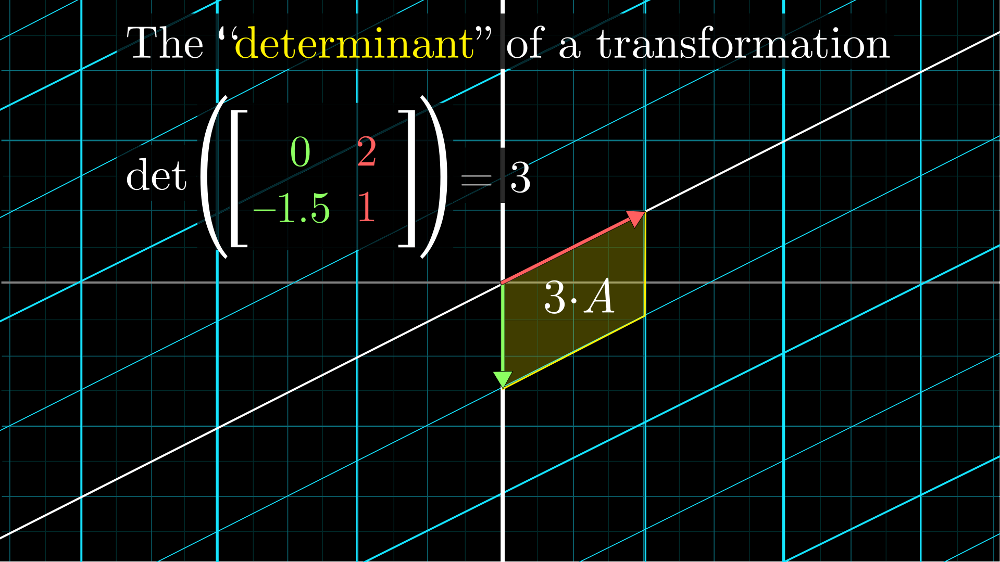](https://www.3blue1brown.com/lessons/determinant)

$\det(A)=0$ 时, 表示该变换将空间压缩到一个低维空间,
称矩阵 $A$ 为奇异矩阵 (Singular Matrix):

- 矩阵 $A$ 列向量线性相关.
- 矩阵 $A$ 不满秩 (Not full rank).
- 矩阵 $A$ 不可逆.

Determinant for 2d matrix:

$$
\begin{equation}
  \begin{vmatrix}a & b \\ c & d\end{vmatrix}=ad-bc
\end{equation}
$$


Determinant for 3d matrix:

$$
\begin{equation}
  \begin{vmatrix}a & b & c \\ d & e & f \\ g & h & i\end{vmatrix}
  =a\begin{vmatrix}e & f \\ h & i\end{vmatrix}
   -b\begin{vmatrix}d & f \\ g & i\end{vmatrix}
   +c\begin{vmatrix}d & e \\ g & h\end{vmatrix}
\end{equation}
$$

Determinant for matrix multiplication:

$$
\begin{equation}
  \det(A_1A_2)=\det(A_1)\det(A_2)
\end{equation}
$$

### Gaussian Elimination

高斯消元法求解线性方程组 (Linear System Of Equations):

首先第一行的第一个元素化为 1,
下面每行减去第一行乘以该行第一个元素的倍数,
从而把第一列除第一行外的全部元素都化为 0,
进而把第二列除前两个元素之外的元素都化为 0,
最后把矩阵化为上三角矩阵.
类似地, 从最后一行开始, 逐行把上三角矩阵化为单位矩阵.

$$
\begin{split}
  A\vec{x}&=\vec{v} \\
  A^{-1}A\vec{x}&=A^{-1}\vec{v} \\
  \vec{x}&=A^{-1}\vec{v}
\end{split}
$$

### Eigenvalue and Eigenvector

$A=\begin{bmatrix}
  a & b \\
  c & d
\end{bmatrix}$
eigenvalue $A\vec{v}=\lambda\vec{v}$ [quick calculation](https://www.3blue1brown.com/lessons/quick-eigen):

$$
\begin{split}
  \lambda&=m\pm\sqrt{m^2-p} \\
         &=\frac{\lambda_1+\lambda_2}{2}
           \pm\sqrt{(\frac{\lambda_1+\lambda_2}{2})^2-\lambda_1\lambda_2} \\
         &=\frac{a+d}{2}\pm\sqrt{(\frac{a+d}{2})^2-(ad-bc)}
\end{split}
$$

### Linear Algebra Reference

- Interactive book: [impressive linear algebra](https://immersivemath.com/ila/index.html).

## Mathematical Analysis

### Limit

洛必达法则是求解分数形式的未定型极限 $\lim_{x\to{a}}\frac{0}{0}$ 的有效方法之一:

$$
\begin{equation}
\begin{split}
  \lim_{x\to{a}}\frac{f(x)}{g(x)}
  &=\lim_{x\to{a}}\frac{df(x)}{dg(x)} \\
  &=\lim_{x\to{a}}\frac{\frac{df}{dx}(a)dx}{\frac{dg}{dx}(a)dx} \\
  &=\lim_{x\to{a}}\frac{\frac{df}{dx}(a)}{\frac{dg}{dx}(a)} \\
  &=\lim_{x\to{a}}\frac{f'(a)}{g'(a)}
\end{split}
\end{equation}
$$

### Derivative

常见导数:

$$
\begin{equation}
\begin{split}
  \frac{d}{dx}x^n&=nx^{n-1} \\
  \frac{d}{dx}\sin{x}&=\cos{x} \\
  \frac{d}{dx}\cos{x}&=-\sin{x} \\
  \frac{d}{dx}a^x&=a^x\ln{a} \\
  \frac{d}{dx}e^x&=e^x \\
  \frac{d}{dx}\log_a{x}&=\frac{1}{x\ln{a}} \\
  \frac{d}{dx}\ln{x}&=\frac{1}{x} \\
  \frac{d}{dx}(g(x)+h(x))&=g'(x)+h'(x) \\
  \frac{d}{dx}(g(x)h(x))&=g'(x)h(x)+g(x)h'(x) \\
  \frac{d}{dx}f(g(x))&=f'(g(x))g'(x) \\
  \frac{d}{dx}f^{-1}(x)&=\frac{1}{f'(f^{-1}(x))} \\
  \frac{d}{dx}\int_{a(x)}^{b(x)}f(t)dt&=f(b(x))b'(x)-f(a(x))a'(x)
\end{split}
\end{equation}
$$

### Series

泰勒级数利用函数在某点的各阶导数, 近似该点附近函数的值:

$$
\begin{equation}
\begin{split}
  \frac{1}{1-x}&=\sum\limits_{n=0}^{\infty}x^n \quad |x|\lt1 \\
  e^x&=\sum\limits_{n=0}^{\infty}\frac{x^n}{n!} \\
  \ln(1+x)&=\sum\limits_{n=1}^{\infty}\frac{(-1)^{n-1}}{n}x^n \quad x\in(-1,1] \\
  \sin(x)&=\sum\limits_{n=0}^{\infty}\frac{(-1)^n}{(2n+1)!}x^{2n+1} \\
  \cos(x)&=\sum\limits_{n=0}^{\infty}\frac{(-1)^n}{(2n)!}x^{2n} \\
  f(x)&=\sum\limits_{n=0}^{\infty}\frac{f^{(n)(x_0)}}{n!}(x-x_0)^n \\
      &=f(x_0)+f'(x_0)(x-x_0)+\frac{f''(x_0)}{2!}(x-x_0)^2+\dots
\end{split}
\end{equation}
$$

### Euler's Formula

复数平面 (Complex Plane) 上的圆周运动:

$$
\begin{equation}
  e^{ix}=\cos{x}+i\sin{x}
\end{equation}
$$

### Fourier Transform

Time to frequency transform:

$$
\begin{equation}
  \hat{f}(\xi)=\int_{-\infty}^{\infty}f(t)e^{-2\pi i\xi t}dt
\end{equation}
$$

Discrete Fourier Transform (DFT):

$$
\begin{equation}
  X[k]=\sum\limits_{n=0}^{N-1}x_n e^{-\frac{i2\pi}{N}kn}
\end{equation}
$$

outcomes

$$
\begin{bmatrix}
  1 & 1 & 1 & \dots & 1 \\
  1 & e^{\frac{2\pi i}{n}} & e^{\frac{2\pi i(2)}{n}}
  & \dots & e^{\frac{2\pi i(n-1)}{n}} \\
  1 & e^{\frac{2\pi i(2)}{n}} & e^{\frac{2\pi i(4)}{n}}
  & \dots & e^{\frac{2\pi i(2)(n-1)}{n}} \\
  \vdots & \vdots & \vdots & \ddots & \vdots \\
  1 & e^{\frac{2\pi i(n-1)}{n}} & e^{\frac{2\pi i(2)(n-1)}{n}}
  & \dots & e^{\frac{2\pi i(n-1)(n-1)}{n}}
\end{bmatrix}
$$

[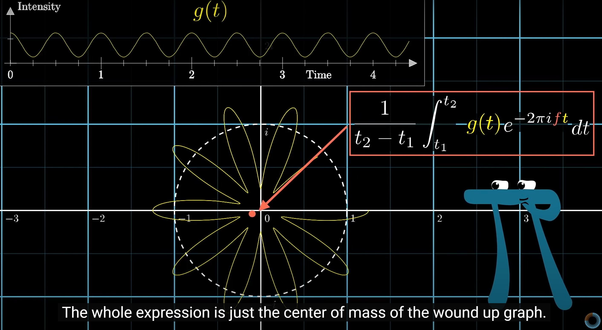](https://www.3blue1brown.com/lessons/fourier-transforms)

### Differential Equation

微分方程 (Differential Equation) 是描述变量之间关系的方程,
通常包含未知函数及其导数, 用于描述物理现象和自然规律.

#### First Order Differential Equation

一阶微分方程:

$$
\begin{equation}
  \frac{d}{dt}\begin{bmatrix}x(t)\\y(t)\end{bmatrix}
  =\begin{bmatrix}a&b\\c&d\end{bmatrix}\begin{bmatrix}x(t)\\y(t)\end{bmatrix}
  \Rightarrow
  \begin{bmatrix}x(t)\\y(t)\end{bmatrix}
  =e^{\begin{bmatrix}a&b\\c&d\end{bmatrix}t}\begin{bmatrix}x(0)\\y(0)\end{bmatrix}
\end{equation}
$$

$$
\begin{split}
\text{if} \quad \vec{v}(t)&=e^{Mt}\vec{v}_0 \\
\text{then} \quad
  \frac{d}{dt}\vec{v}(t)
  &=\frac{d}{dt}e^{Mt}\vec{v}_0 \\
  &=\frac{d}{dt}\sum\limits_{n=0}^{\infty}\frac{M^n}{n!}t^n\vec{v}_0 \\
  &=\sum\limits_{n=0}^{\infty}\frac{M^n}{n!}nt^{n-1}\vec{v}_0 \\
  &=M\sum\limits_{n=0}^{\infty}\frac{M^{n-1}}{(n-1)!}t^{n-1}\vec{v}_0 \\
  &=Me^{Mt}\vec{v}_0 \\
  &=M\vec{v}(t)
\end{split}
$$

#### Second Order Differential Equation

$$
\begin{equation}
  \ddot{x}(t)=-\mu\dot{x}(t)-\omega x(t)
\end{equation}
$$

Gravitational force equation:

$$
\begin{split}
  \ddot{y}(t)=-g, \quad &
  \dot{y}(t)=-gt+v_0
  \\
  \frac{d\vec{x}_1}{dt}=\vec{v}_1, \quad &
  \frac{d\vec{v}_1}{dt}=Gm_2\Big(\frac{\vec{x}_2-\vec{x}_1}{\|\vec{x}_2-\vec{x}_1\|}\Big)\Big(\frac{1}{\|\vec{x}_2-\vec{x}_1\|^2}\Big)
  \\
  & \ddot{\theta}(t)=-\mu\dot{\theta}(t)-\frac{g}{L}\sin\big({\theta}(t)\big)
\end{split}
$$

#### Partial Differential Equation

[热传导方程](https://www.3blue1brown.com/lessons/heat-equation):

$$
\frac{\partial{T}}{\partial{t}}(x,t)=\alpha\frac{\partial^2{T}}{\partial{x^2}}(x,t)
$$

Black-Scholes / Merton equation:

$$
\frac{\partial{V}}{\partial{t}}+rS\frac{\partial{V}}{\partial{S}}+\frac{1}{2}\sigma^2S^2\frac{\partial^2{V}}{\partial{S^2}}-rV=0
$$

#### Phase Space

相空间是描述系统状态的空间,
每个点代表系统的一个状态, 点的轨迹描述了系统的演化.

```python
import numpy as np

# Physical constants
g = 9.8
L = 2
mu = 0.1

THETA_0 = np.pi / 3  # 60 degrees
THETA_DOT_0 = 0  # No initial angular velocity

# Definition of ODE
def get_theta_double_dot(theta, theta_dot):
    return -mu * theta_dot - (g / L) * np.sin(theta)

# Solution to the differential equation (numerically)
def theta(t):
    theta = THETA_0
    theta_dot = THETA_DOT_0
    delta_t = 0.01  # Time step
    for _ in np.arange(0, t, delta_t):
        theta_double_dot = get_theta_double_dot(theta, theta_dot)
        theta += theta_dot * delta_t
        theta_dot += theta_double_dot * delta_t
    return theta
```

## Mathematical Statistics

### Normal Distribution

若随机变量 $X$ 服从一个位置参数为 $\mu$, 尺度参数为 $\sigma$ 的概率分布,
且其概率密度函数 (Probability Density Function, PDF) 为:

$$
\begin{equation}
  f(x)=\frac{1}{\sigma\sqrt{2\pi}}e^{-\frac{1}{2}(\frac{x-\mu}{\sigma})^2}
\end{equation}
$$

则这个随机变量称为正态随机变量, 正态随机变量服从的分布称为正态分布,
记作 $X \sim N(\mu,\sigma^2)$, 读作 $X$ 服从 $N(\mu,\sigma^2)$ (正态分布).
其中 $\mu$ 为均值 (数学期望 Mean), $\sigma$ 为标准差 (Standard Deviation).

正态分布 (又称 Gaussian Distribution) 是一种连续概率分布.
当 $\mu$ 为 0, $\sigma$ 为 1 时, 称为标准正态分布 (Standard Normal Distribution).

### Central Limit Theorem

在自然界与生产中, 一些现象受到许多**相互独立**的随机因素的影响,
如果每个因素所产生的影响都很微小时, **总影响** (Sum) 可以看作服从正态分布.

相互独立的正态分布, 其和也是正态分布.
总体正态分布的均值等于各个分布的均值之和,
$E(X_1+\dots+X_n)=E(X_1)+\dots+E(X_n)=n\mu$.
假设协方差为 0, 则总体正态分布的方差等于各个分布的方差之和,
${Var(X_1+\dots+X_n)}={Var(X_1)+\dots+Var(X_n)}={n}\sigma^2$,
可以得到总体正态分布的标准差为 $\sqrt{n}\sigma$.

设随机变量 $X_1,X_2,\dots,X_n$ 独立同分布(Independent Identically Distribution),
且均值为 $E(X_i)=\mu$, 方差为 $D(X_i)=\sigma^2$,
对于任意 $x$, 其分布函数为

$$
F_n(x)=P\left\{\frac{\sum_{i=1}^n{X_i}-n\mu}{\sqrt{n}\sigma}\leq{x}\right\}
$$

满足

$$
\begin{equation}
  \lim_{n\to\infty}F_n(x)
  =\lim_{n\to\infty}P\left\{\frac{\sum_{i=1}^n{X_i}-n\mu}{\sqrt{n}\sigma}\leq{x}\right\}
  =\frac{1}{\sqrt{2\pi}}\int_{-\infty}^x{e^{-\frac{t^2}{2}}dt}
  =\varnothing(x)
\end{equation}
$$

独立同分布的中心极限定理说明, 当 $n$ 足够大时,
随机变量 $X_n=\sum\limits_{i=1}^n{X_i}$
近似服从正态分布 $N(n\mu,n\sigma^2)$;
标准化后的随机变量 $Y_n=\frac{\sum_{i=1}^n{X_i}-n\mu}{\sqrt{n}\sigma}$
近似服从标准正态分布 $N(0,1)$.

[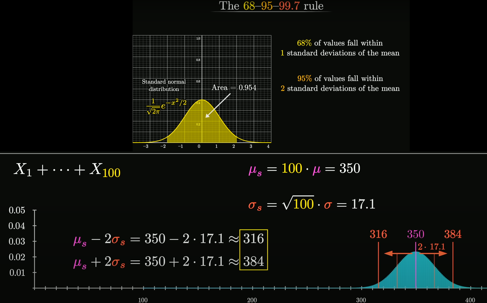](https://www.3blue1brown.com/lessons/clt)

更一般化的中心极限定理,
可参见林德伯格中心极限定理 ([Lindeberg CLT](https://en.wikipedia.org/wiki/Central_limit_theorem#Lindeberg_CLT))
etc.

### Gaussian Integral

$$
\begin{equation}
  \int_{-\infty}^{\infty}e^{-x^2}dx=\sqrt{\pi}
\end{equation}
$$

[高维空间求解](https://zhuanlan.zhihu.com/p/651305078)高斯积分:

[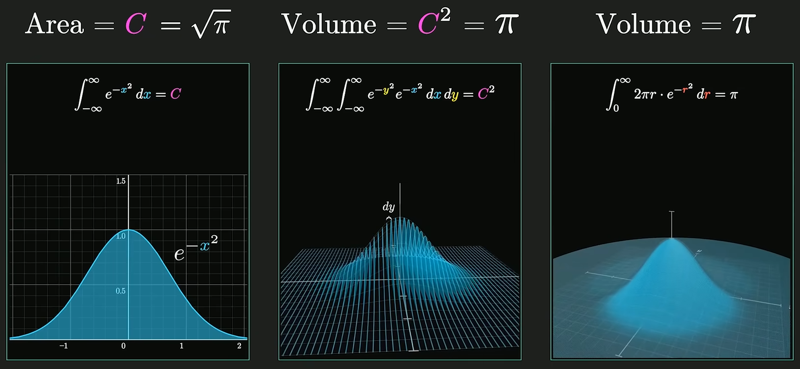](https://www.3blue1brown.com/lessons/gaussian-integral)

对于正态分布, 系数 $\frac{1}{\sqrt{\pi}}$ 使得概率密度函数的积分为 1,
即 $\int_{-\infty}^{\infty}f(x)dx=1$, 使其成为有意义的概率分布.

### Binomial Distribution

重复 n 次独立的伯努利试验, $X \sim B(n,p)$, 期望值 $E(X)=np$, 方差 $D(X)=np(1-p)$:

$$
\begin{equation}
  P(X=k)=C_n^kp^k(1-p)^{n-k}
\end{equation}
$$

### Bayes Theorem

[Bayes theorem](https://www.3blue1brown.com/lessons/bayes-theorem):

$$
P(A \cap B)=P(A|B)P(B)=P(B|A)P(A)\Rightarrow
$$

$$
\begin{equation}
  P(A|B)=\frac{P(B|A)P(A)}{P(B)}=\frac{P(B|A)P(A)}{P(B|A)P(A)+P(B|\neg{A})P(\neg{A})}
\end{equation}
$$


其中, $\frac{P(B|A)}{P(B|\neg{A})}$ 称为[贝叶斯系数 (Bayes Factor)](https://www.3blue1brown.com/lessons/better-bayes):

$$
O(A|B)=\frac{P(A|B)}{P(\neg{A}|B)}=\frac{P(A|B)P(B)}{P(\neg{A}|B)P(B)}=\frac{P(B|A)P(A)}{P(B|\neg{A})P(\neg{A})}=O(A)\frac{P(B|A)}{P(B|\neg{A})}
$$

### Information Entropy

[信息熵](https://www.3blue1brown.com/lessons/wordle)
是对信息量的度量 ($E[I]$),
概率小的事件发生所带来的信息量大, 概率大的事件发生所带来的信息量小,
即概率小, 出现机会小, 不确定性大, 信息熵大, 信息量大:

$$
\begin{equation}
  H(X)=E[-\log_2{P(x_i)}]=-\sum\limits_{i=1}^n{P(x_i)\log_2{P(x_i)}}
\end{equation}
$$

## Supervised Learning

### Regression

Output a scalar:

- Linear regression:
  $y=Wx+b=\sum\limits_{i=1}^n{w_ix_i}+b$,
  $L=\sum\limits_{i=1}^n(y_i-\hat{y}_i)^2$.
- Polynomial regression:
  $y=\sum\limits_{i=1}^n{w_ix^i}+b$.
- Logistic regression (output probability):
  $y=\sigma(Wx+b)=\frac{1}{1+e^{-\sum\limits_{i=1}^n{w_ix_i}-b}}$,
  $L=-\sum\limits_{i=1}^n{y_i\log(\hat{y}_i)}$.

If model can't even fit training data,
then model have large bias (underfitting).
If model can fit training data but not testing data,
then model have large variance (overfitting).

#### Underfitting

To prevent underfitting, we can:

- Add more features as input.
- Use more complex and flexible model.

#### Overfitting

More complex model does not always lead to better performance
on testing data or new data.

| Model | Training Error | Testing Error |
| :---: | -------------: | ------------: |
|  $x$  |           31.9 |          35.0 |
| $x^2$ |           15.4 |          18.4 |
| $x^3$ |           15.3 |          18.1 |
| $x^4$ |           14.9 |          28.2 |
| $x^5$ |           12.8 |         232.1 |

A extreme example,
such function obtains $0$ training loss, but large testing loss:

$$
\begin{align*}
  f(x)=\begin{cases}
    y_i, & \exists{x_i}\in{X} \\
    \text{random}, & \text{otherwise}
  \end{cases}
\end{align*}
$$

To prevent overfitting, we can:

- More training data.
- Data augmentation: crop, flip, rotate, cutout, mixup.
- Constrained model:
  - Less parameters, sharing parameters.
  - Less features.
  - Early stopping.
  - Dropout.
  - Regularization.

$$
\begin{split}
  L(w)&=\sum\limits_{i=1}^n(y_i-\hat{y}_i)^2+\lambda\sum\limits_{i=1}^n{w_i^2}\\
  w_{t+1}&=w_t-\eta\nabla{L(w)}\\
  &=w_t-\eta(\frac{\partial{L}}{\partial{w}}+\lambda{w_t})\\
  &=(1-\eta\lambda)w_t-\eta\frac{\partial{L}}{\partial{w}}
  \quad (\text{Regularization: Weight Decay})
\end{split}
$$

### Classification

- Binary classification:
  $y=\delta(Wx+b)$,
  $L=\sum\limits_{i=1}^n\delta(y_i\ne\hat{y}_i)$,
  e.g spam filtering.
- Multi-class classification:
  $y=\text{softmax}(Wx+b)$,
  $L=-\sum\limits_{i=1}^n{y_i\log(\hat{y}_i)}$,
  e.g document classification.
- Non-linear model:
  - Deep learning: $y=\text{softmax}(\text{ReLU}(Wx+b))$,
    e.g image recognition, game playing.
  - Support vector machine (SVM): $y=\text{sign}(Wx+b)$.
  - Decision tree: $y=\text{vote}(\text{leaves}(x))$.
  - K-nearest neighbors (KNN): $y=\text{vote}(\text{neighbors}(x))$.

### Structured Learning

#### Training

Find a function $F$:

$$
F:X\times{Y}\to{R}
$$

$F(x, y)$ evaluates how well $y$ fits $x$ (object compatible).

#### Inference

Given an object $x$:

$$
\tilde{y}=\arg\max\limits_{y\in{Y}}F(x, y)
$$


:::tip Three Problems

- Evaluation: what does $F(X, y)$ look like.
- Inference: how to solve $\arg\max$ problem.
- Training: how to find $F(x, y)$ with given training data.

:::

#### Structured Linear Model

$$
\begin{split}
  F(x, y)&=\sum\limits_{i=1}^n{w_i\phi_i(x, y)} \\
  &=\begin{bmatrix}w_1\\w_2\\w_3\\\vdots\\w_n\end{bmatrix}\cdot
    \begin{bmatrix}\phi_1(x, y)\\\phi_2(x, y)\\\phi_3(x, y)\\\vdots\\\phi_n(x, y)\end{bmatrix}\\
  &=W\cdot\Phi(x, y)
\end{split}
$$

## Unsupervised Learning

### Principal Component Analysis

主成分分析 (PCA) 是一种常用的数据降维方法, 将 $m$ 个 $n$ 维向量降为 $k$ 维,
其目标是选择 $k$ 个单位 (模为 $1$) 正交基, 使得原始数据变换到这组基上后,
各字段两两间协方差为 $0$ (各字段完全独立), 各字段的方差尽可能大 (各字段降维后分布尽可能分散),
即在正交的约束下, 取最大的 $k$ 个方差:

$$
\begin{equation}
  C=\frac{1}{m}XX^T=\frac{1}{m}\begin{bmatrix}
    \sum_{i=1}^m(x_i^1)^2&\sum_{i=1}^m{x_i^1x_i^2}&\dots&\sum_{i=1}^m{x_i^1x_i^n}\\
    \sum_{i=1}^m{x_i^2x_i^1}&\sum_{i=1}^m(x_i^2)^2&\dots&\sum_{i=1}^m{x_i^2x_i^n}\\
    \vdots&\vdots&\ddots&\vdots\\
    \sum_{i=1}^m{x_i^nx_i^1}&\sum_{i=1}^m{x_i^nx_i^2}&\dots&\sum_{i=1}^m(x_i^n)^2
  \end{bmatrix}
\end{equation}
$$

协方差矩阵 $C$ 是一个对称矩阵, 其对角线分别为各字段的方差,
其第 $i$ 行 $j$ 列和第 $j$ 行 $i$ 列元素相同, 表示 $i$ 和 $j$ 两个字段的协方差.
将协方差矩阵对角化, 得到基于矩阵运算的 PCA 算法如下:

- 将原始数据按列组成 $n$ 行 $m$ 列矩阵 $X$.
- 将 $X$ 的每一行 (代表一个属性字段) 进行零均值化, 即减去这一行的均值,
  使得 $\bar{x}=0$, 方便方差与协方差的计算.
- 求出协方差矩阵 $C=\frac{1}{m}XX^T$ 的特征值及对应的特征向量.
- 将特征向量按对应特征值大小从上到下按行排列成矩阵, 取前 $k$ 行组成矩阵 $P$.
- $Y=PX$ 即为降维到 $k$ 维后的数据.

:::tip Normalization

$$
x'_i=\frac{x_i-\mu}{\sigma}
$$

:::

### Word Embedding

词嵌入是自然语言处理 (NLP) 中的一种技术,
将词汇映射到实数向量空间, 使得词汇之间的语义关系可以通过向量空间中的距离来表示.

### Variational Auto-Encoders

变分自编码器 (VAEs) 是一种生成模型, 通过学习数据的潜在分布来生成新的数据:

$$
\begin{split}
  Z&=\text{Encoder}(X) \\
  X'&=\text{Decoder}(Z) \\
  L&=\text{Min Loss}(X',X)
\end{split}
$$

变分自动编码器学习的是隐变量 (特征) $Z$ 的概率分布, $z\sim N(0, I), x|z\sim N\big(\mu(z), \sigma(z)\big)$,
通过深度网络来学习 $q(z|x)$ 的参数, 一步步优化 $q$ 使其与 $p(z|x)$ 十分相似, 便可用它来对复杂的分布进行近似的推理:

- Feature disentangle:
  voice conversion.
- Discrete representation:
  unsupervised classification, unsupervised summarization.
- Anomaly detection:
  face detection, fraud detection, disease detection, network intrusion detection.
- Compression and decompression.
- Generator.


### Generative Adversarial Networks

生成对抗网络 (GANs) 由两个网络组成: 生成器 (Generator) 和判别器 (Discriminator).
生成器的目标是生成尽可能逼真的数据, 判别器的目标是尽可能准确地区分真实数据和生成数据.
两个网络相互对抗, 生成器生成数据 (decoder in VAE), 判别器判断数据真伪 ($1/0$ classification neural network),
生成器根据判别器的判断结果调整生成数据的策略, 不断提升生成数据的逼真程度.

$$
\begin{split}
G^*&=\arg\min_G\max_DV(G,D)\\
D^*&=\arg\max_DV(D,G)
\end{split}
$$


## Self-supervised Learning

Pre-trained models + fine-tuning (downstream tasks):

- Cross lingual.
- Cross discipline.
- Pre-training with artificial data.
- Long context window.

### Pre-trained Models

#### Pre-trained Data

- Content filtering: 去除有害内容.
- Text extraction: 去除 HTML 标签.
- Quality filtering: 去除低质量内容.
- Document deduplication: 去除重复内容.

#### BERT

Bidirectional Encoder Representations from Transformers 是一种预训练模型,
通过大规模无监督学习, 学习文本的语义信息, 用于下游任务的微调:

- Masked token prediction: 随机遮挡输入文本中的一些词, 预测被遮挡的词.
- Next sentence prediction: 预测两个句子的顺序关系.


### Fine-tuning

#### BERT Adapters

[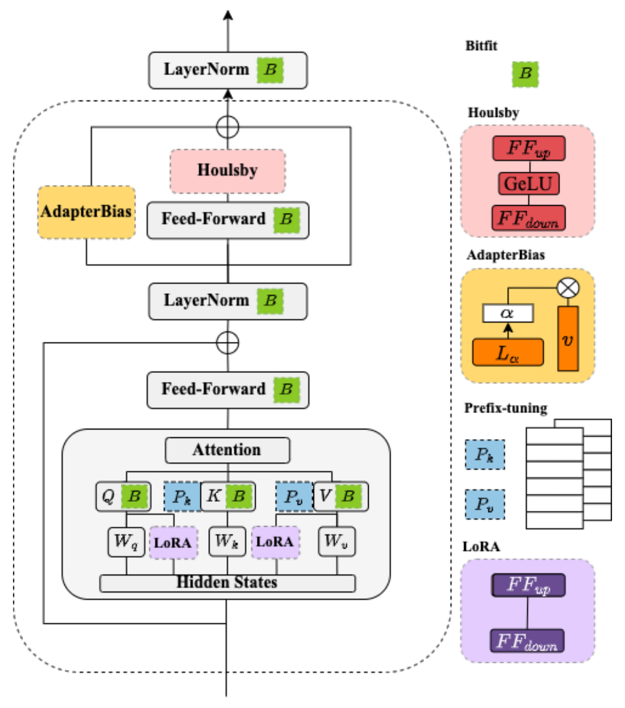](https://ieeexplore.ieee.org/document/10023274)

#### Low-Rank Adaptation

低秩适配 (LoRA) 是一种参数高效微调技术 (Parameter-efficient Fine-tuning),
其基本思想是冻结原始矩阵 $W_0\in\mathbb{R}^{H\times{H}}$,
通过低秩分解矩阵 $A\in\mathbb{R}^{H\times{R}}$ 和 $B\in\mathbb{R}^{H\times{R}}$
来近似参数更新矩阵 $\Delta{W}=A\cdot{B^T}$,
其中 $R\ll{H}$ 是减小后的秩:

$$
\begin{equation}
  W=W_0+\Delta{W}=W_0+A\cdot{B^T}
\end{equation}
$$

在微调期间, 原始的矩阵参数 $W_0$ 不会被更新,
低秩分解矩阵 $A$ 和 $B$ 则是可训练参数用于适配下游任务.
LoRA 微调在保证模型效果的同时, 能够显著降低模型训练的成本.

#### Instruction-tuning

Make model can understand human instructions not appear in training data:

[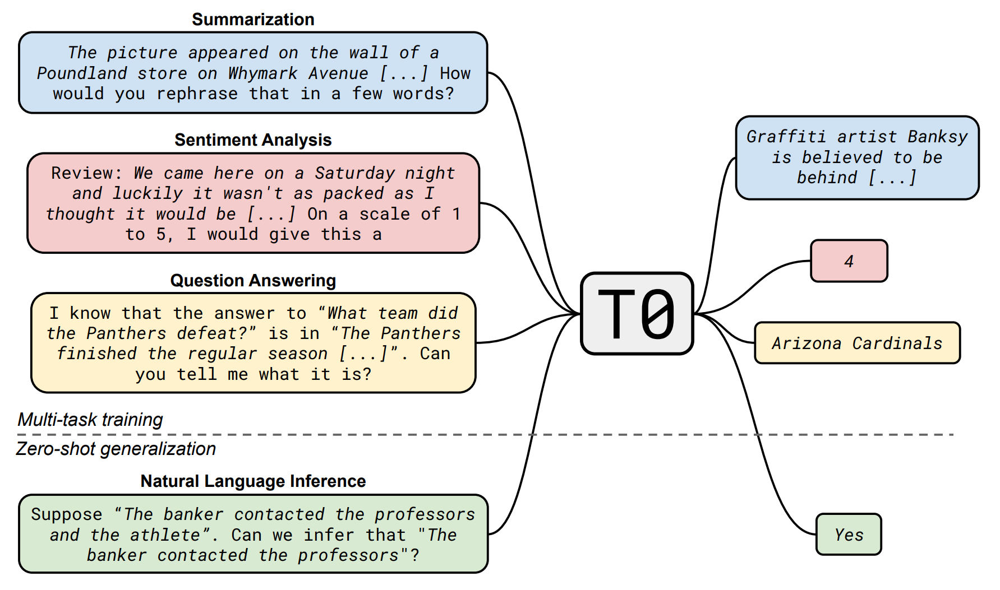](https://iclr.cc/virtual/2022/7102)

- 提高指令复杂性和多样性能够促进模型性能的提升.
- 更大的参数规模有助于提升模型的指令遵循能力.

## Reinforcement Learning

强化学习是一种机器学习方法, 通过智能体与环境交互,
智能体根据环境的反馈调整策略, 利用梯度上升算法 (Gradient Ascent),
最大化长期奖励 (learn from rewards and mistakes).


$$
\begin{equation}
\begin{split}
  \theta^*&=\arg\max\limits_\theta\bar{R}_\theta=\arg\max\limits_\theta\sum\limits_{\tau}R(\tau)P(\tau|\theta)\\
  \theta_{t+1}&=\theta_t+\eta\nabla\bar{R}_\theta\\
  \nabla\bar{R}_\theta&=\begin{bmatrix}\frac{\partial\bar{R}_\theta}{\partial{w_1}}\\\frac{\partial\bar{R}_\theta}{\partial{w_2}}\\\vdots\\\frac{\partial\bar{R}_\theta}{\partial{b_1}}\\\vdots\end{bmatrix}\\
  R_t&=\sum\limits_{n=t}^N\gamma^{n-t}r_n
\end{split}
\end{equation}
$$

### Actor-Critic Model


### Inverse Reinforcement Learning


## Multilayer Perceptron


多层感知机是一种前馈神经网络 (Feedforward Neural Network)
就像是一个模拟大脑处理信息的过程,
通过多层处理 (输入层, 隐藏层, 输出层),
从原始数据中提取特征, 并做出预测或分类,
它通过调整内部连接权重来学习和改进其预测能力.

### Linear Mapping

线性变换 $H^l=W^lX^{l-1}+B^l$:

- $w_{ij}^l$ (`weight`): 第 $l$ 层第 $i$ 个节点与上一层第 $j$ 个节点连接的权重.
- $b_i^l$ (`bias`): 第 $l$ 层第 $i$ 个节点的偏置.

$$
H=\begin{bmatrix}
  w_{00}^l & w_{01}^l & \dots & w_{0n}^l \\
  w_{10}^l & w_{11}^l & \dots & w_{1n}^l \\
  \vdots & \vdots & \ddots & \vdots \\
  w_{k0}^l & w_{k1}^l & \dots & w_{kn}^l
\end{bmatrix}
\begin{bmatrix}
  x_0^{l-1} \\
  x_1^{l-1} \\
  \vdots \\
  x_n^{l-1}
\end{bmatrix}
+\begin{bmatrix}
  b_0^l \\
  b_1^l \\
  \vdots \\
  b_k^l
\end{bmatrix}
$$

### Activation Function

激活函数 $y=\sigma(H)$, $X^l=\sigma(H^l)$:

- 引入非线性特性, 使得网络可以学习和拟合复杂函数.
- ReLU (Rectified Linear Unit, 线性整流单元): $\sigma(H)=\max(0,H)$,
  可以解决梯度消失问题 (越靠近输入层的神经元梯度越接近 0), 加速收敛.
- Sigmoid: $\sigma(H)=\frac{1}{1+e^{-H}}$.
- e.g 归一化函数, 使得输出值在 0 到 1 之间, 可以使得整个网络成为概率模型.


### Loss Function

损失函数 $L(y,\hat{y})$:

- 用于衡量真实值(或人工标注值) $y$ 与模型预测值 $\hat{y}$ 之间的差异.
- 常见的损失函数有均方误差 (Mean Squared Error, MSE) 和交叉熵 (Cross Entropy).
  - 均方误差:
    $L(y,\hat{y})=\frac{1}{n}\sum\limits_{i=1}^n(y_i-\hat{y}_i)^2$.
  - 交叉熵:
    $L(y,\hat{y})=-\sum\limits_{i=1}^n{y_i\log(\hat{y}_i)}$, 常用于 classification 任务.
  - Selective synaptic plasticity:
    $L'(\theta)=L(\theta)+\lambda\sum\limits_ib_i(\theta_i'-\theta_i)^2$.

:::tip Deep

$|\mathcal{H}|$ is the size of hypothesis space,
larger $|\mathcal{H}|$ means deeper model:


Deep model need less neurons (parameters) to represent same function,
means deep model has smaller $|\mathcal{H}|$,
flat/shallow model has larger $|\mathcal{H}|$.

:::

:::tip Learning

Learning is the process of minimizing loss function,
finally find out the right weights and biases:

- Early stopping.
- Dropout.
- Regularization.
- New activation function.
- Adaptive learning rate.

:::

### Gradient Descent

通过[梯度下降算法](https://www.3blue1brown.com/lessons/gradient-descent),
优化损失函数, 使其最小化 (沿梯度下降方向, 调整 W 和 B):

$$
\begin{equation}
  \theta_{t+1}=\theta_t-\eta\nabla{L}
\end{equation}
$$

其中, $\eta$ 为学习率, $L$ 为损失函数, $\nabla{L}$ 为损失函数的梯度,
$\theta$ 为模型参数, $t$ 为迭代次数.

$$
\begin{split}
  \arg\min{L(\theta)}&=L(a,b)+\frac{\partial{L(a,b)}}{\partial{\theta_1}}(\theta_1-a)+\frac{\partial{L(a,b)}}{\partial{\theta_2}}(\theta_2-b)\\
  &+\dots+\frac{1}{n!}\frac{\partial^n{L(a,b)}}{\partial{\theta_1^n}}(\theta_1-a)^n+\frac{1}{n!}\frac{\partial^n{L(a,b)}}{\partial{\theta_2^n}}(\theta_2-b)^n\\
  &\approx{L(a,b)}+\frac{\partial{L(a,b)}}{\partial{\theta_1}}(\theta_1-a)+\frac{\partial{L(a,b)}}{\partial{\theta_2}}(\theta_2-b)
  \\
  &\Rightarrow
  \begin{bmatrix}\theta_1-a\\\theta_2-b\end{bmatrix}
  =-\eta\begin{bmatrix}\frac{\partial{L(a,b)}}{\partial{\theta_1}}\\\frac{\partial{L(a,b)}}{\partial{\theta_2}}\end{bmatrix}
  \\
  &\Rightarrow
  \begin{bmatrix}\theta_1 \\ \theta_2\end{bmatrix}
  =\begin{bmatrix}a\\b\end{bmatrix}-\eta\begin{bmatrix}\frac{\partial{L(a,b)}}{\partial{\theta_1}}\\\frac{\partial{L(a,b)}}{\partial{\theta_2}}\end{bmatrix}
\end{split}
$$


```python
def convex_function(x):
    return x**2

def gradient_descent(initial_x, learning_rate, num_iterations):
    x_values = [initial_x]
    y_values = [convex_function(initial_x)]

    x = initial_x

    for i in range(num_iterations):
        gradient = 2 * x  # 函数 f(x) = x^2 的导数为 f'(x) = 2x
        x -= learning_rate * gradient

        x_values.append(x)
        y_values.append(convex_function(x))

    return x_values, y_values
```

#### Gradient

一个优秀的梯度下降算法, 需要满足以下几个条件:

- 高效性:
  梯度下降算法的迭代次数尽可能少.
  当距离最小值较远时, $\nabla{L}\gg0$,
  当距离最小值较近时, $\nabla{L}\to0$,
  这样的梯度下降算法可以更快地收敛.
  反之, 当距离最小值较远时, $\nabla{L}\to0$, 这样的梯度下降算法更慢收敛.
- 稳定性:
  梯度下降算法的迭代过程尽可能稳定.
  [Maxout](https://proceedings.mlr.press/v28/goodfellow13) 激活函数拟合能力非常强, 可以拟合任意的凸函数.
- 鲁棒性:
  梯度下降算法对于`初始值的选择`或者`特定的线索片段`不敏感.
  [Dropout](https://jmlr.org/papers/v15/srivastava14a.html) 策略
  减少神经元之间复杂的共适应关系 (每个神经元有 $p\%$ 概率不被激活),
  迫使网络去学习更加鲁棒的特征, 缓解过拟合问题, 提高模型的泛化能力.

#### Learning Rate

必要时需要调整学习率, 使得梯度下降更快收敛:

- 如果学习率过大, 可能会导致梯度下降不稳定, 甚至发散.
- 如果学习率过小, 可能会导致梯度下降收敛速度过慢.

常见的学习率调整策略有:

- Learning rate decay:
  - 阶梯衰减 (Step Decay): $\eta_t=\frac{\eta}{\sqrt{t+1}}$.
  - 线性衰减 (Linear Decay): $\eta_t=\eta(1-\frac{t}{T})$.
  - 指数衰减 (Exponential Decay): $\eta_t=\eta{e^{-kt}}$.
  - 余弦衰减 (Cosine Decay): $\eta_t=\eta\frac{1+\cos(\frac{\pi{t}}{T})}{2}$.
- Warm up learning rate: increase and then decrease learning rate.
- SGD with [momentum](https://proceedings.mlr.press/v28/sutskever13.html):
  $w_{t+1}=w_t+v_{t+1}=w_t+\lambda{v_t}-\eta{g_t}$.
- Adaptive learning rate:
  - [AdaGrad](https://jmlr.org/papers/v12/duchi11a.html):
    adaptive sub-gradient method,
    $w_{t+1}=w_t-\frac{\frac{\eta}{\sqrt{t+1}}}{\sqrt{\frac{1}{t+1}\sum_{i=0}^t{g_i^2}}}g_t=w_t-\frac{\eta}{\sqrt{\sum_{i=0}^t{g_i^2}}}g_t$.
  - [RMSprop](https://pytorch.org/docs/stable/generated/torch.optim.RMSprop.html):
    root mean square propagation,
    $w_{t+1}=w_t-\frac{\eta}{\sigma_t}g_t=w_t-\frac{\eta}{\sqrt{\alpha\sigma_{t-1}^2}+(1-\alpha)g_t^2}g_t$,
  - [Adam](https://pytorch.org/docs/stable/generated/torch.optim.Adam.html):
    adaptive moment estimation (Momentum + RMSprop).
  - [RAdam](https://iclr.cc/virtual/2020/1812):
    start with SGDM, then switch to Adam.

#### Critical Point

当遇到 $\nabla{L}=0$ 的情况时, 可能是以下几种情况:

- 局部最小值 (Local Minimum).
- 局部最大值 (Local Maximum).
- 鞍点 (Saddle Point).

此时利用泰勒级数展开, 可以得到:

$$
\begin{split}
L(\theta)&\approx{L(\theta_0)}+\nabla{L(\theta_0)}(\theta-\theta_0)+\frac{1}{2}(\theta-\theta_0)^T\nabla^2{L(\theta_0)}(\theta-\theta_0)\\
&=L(\theta_0)+\frac{1}{2}(\theta-\theta_0)^T\nabla^2{L(\theta_0)}(\theta-\theta_0)
\end{split}
$$

其中, $\nabla^2{L(\theta_0)}$ 为 Hessian 矩阵, 为二阶导数矩阵:

- 当 $\nabla^2{L(\theta_0)}$ 为正定矩阵时, $\theta_0$ 为局部最小值.
- 当 $\nabla^2{L(\theta_0)}$ 为负定矩阵时, $\theta_0$ 为局部最大值.
- 当 $\nabla^2{L(\theta_0)}$ 为不定矩阵时, $\theta_0$ 为鞍点.

:::tip Saddle Point

在高维空间中, 鞍点的数量远远多于局部最小值.
深度神经网络拥有大量的参数, 使得其损失函数的鞍点数量远远多于局部最小值.

:::

### Backpropagation

[反向传播算法](https://www.3blue1brown.com/lessons/backpropagation-calculus):
从最小化损失函数出发, 由输出层到输入层, 通过链式法则, 计算每一层的梯度, 从而更新权重和偏置.


Derivative chain rule (链式法则):

$$
\begin{split}
\frac{\partial{L}}{\partial{w_{ij}^l}}
&=\frac{\partial{L}}{\partial{x_i^l}}\cdot
  \frac{\partial{x_i^l}}{\partial{z_i^l}}\cdot
  \frac{\partial{z_i^l}}{\partial{w_{ij}^l}} \\
&=\frac{\partial{L}}{\partial{x_i^l}}\cdot
  \frac{\partial{\sigma(z_i^l)}}{\partial{z_i^l}}\cdot
  \frac{\partial(X^{l-1}W_i^l+b_i^l)}{\partial{w_{ij}^l}} \\
&=\delta_i^l\cdot\sigma'(z_i^l)\cdot{x_j^{l-1}} \\

\frac{\partial{L}}{\partial{b_i^l}}
&=\frac{\partial{L}}{\partial{x_i^l}}\cdot
  \frac{\partial{x_i^l}}{\partial{z_i^l}}\cdot
  \frac{\partial{z_i^l}}{\partial{b_i^l}} \\
&=\frac{\partial{L}}{\partial{x_i^l}}\cdot
  \frac{\partial{\sigma(z_i^l)}}{\partial{z_i^l}}\cdot
  \frac{\partial(b_i^l+W_i^lX^{l-1})}{\partial{b_i^l}} \\
&=\delta_i^l\cdot\sigma'(z_i^l) \\

\frac{\partial{L}}{\partial{x_j^{l-1}}}
&=\sum\limits_{i=0}^{N_l-1}\frac{\partial{L}}{\partial{x_i^l}}\cdot
  \frac{\partial{x_i^l}}{\partial{z_i^l}}\cdot
  \frac{\partial{z_i^l}}{\partial{x_j^{l-1}}} \\
&=\sum\limits_{i=0}^{N_l-1}\frac{\partial{L}}{\partial{x_i^l}}\cdot
  \frac{\partial{\sigma(z_i^l)}}{\partial{z_i^l}}\cdot
  \frac{\partial(W_i^lX^{l-1}+b_i^l)}{\partial{x_j^{l-1}}} \\
&=\sum\limits_{i=0}^{N_l-1}\delta_i^l\cdot\sigma'(z_i^l)\cdot{w_{ij}^l}
\end{split}
$$

outcomes

$$
\begin{equation}
\nabla{L}=\begin{bmatrix}
  \frac{\partial{L}}{\partial{w^1}} \\[0.8em]
  \frac{\partial{L}}{\partial{b^1}} \\[0.5em]
  \vdots \\[0.5em]
  \frac{\partial{L}}{\partial{w^l}} \\[0.8em]
  \frac{\partial{L}}{\partial{b^l}}
\end{bmatrix}
\end{equation}
$$

:::tip Mini-Batch

Utilize parallel computing (GPU) to speed up training process:

- Divide training data into mini-batches.
- Update weights and biases for each mini-batch.
- Repeat until convergence.

| Batch Size         | Small  | Large  |
| ------------------ | ------ | ------ |
| Speed (Sequential) | Faster | Slower |
| Speed (Parallel)   | Same   | Same   |
| One Epoch Time     | Slower | Faster |
| Gradient           | Noisy  | Stable |
| Optimization       | Better | Worse  |
| Generalization     | Better | Worse  |


:::

```python
class Network(object):
    def SGD(self, training_data, epochs, mini_batch_size, eta, test_data=None):
        """Train the neural network using mini-batch stochastic
        gradient descent.  The ``training_data`` is a list of tuples
        ``(x, y)`` representing the training inputs and the desired
        outputs.  The other non-optional parameters are
        self-explanatory.  If ``test_data`` is provided then the
        network will be evaluated against the test data after each
        epoch, and partial progress printed out.  This is useful for
        tracking progress, but slows things down substantially."""
        if test_data:
            n_test = len(test_data)
        n = len(training_data)
        for j in range(epochs):
            random.shuffle(training_data)
            mini_batches = [
                training_data[k : k + mini_batch_size]
                for k in range(0, n, mini_batch_size)
            ]
            for mini_batch in mini_batches:
                self.update_mini_batch(mini_batch, eta)
            if test_data:
                print(
                    "Epoch {0}: {1} / {2}".format(j, self.evaluate(test_data), n_test)
                )
            else:
                print("Epoch {0} complete".format(j))

    def update_mini_batch(self, mini_batch, eta):
        """Update the network's weights and biases by applying
        gradient descent using backpropagation to a single mini batch.
        The ``mini_batch`` is a list of tuples ``(x, y)``, and ``eta``
        is the learning rate."""
        nabla_b = [np.zeros(b.shape) for b in self.biases]
        nabla_w = [np.zeros(w.shape) for w in self.weights]
        for x, y in mini_batch:
            delta_nabla_b, delta_nabla_w = self.backpropagation(x, y)
            nabla_b = [nb + dnb for nb, dnb in zip(nabla_b, delta_nabla_b)]
            nabla_w = [nw + dnw for nw, dnw in zip(nabla_w, delta_nabla_w)]
        self.weights = [
            w - (eta / len(mini_batch)) * nw for w, nw in zip(self.weights, nabla_w)
        ]
        self.biases = [
            b - (eta / len(mini_batch)) * nb for b, nb in zip(self.biases, nabla_b)
        ]

    def backpropagation(self, x, y):
        """Return a tuple ``(nabla_b, nabla_w)`` representing the
        gradient for the cost function C_x.  ``nabla_b`` and
        ``nabla_w`` are layer-by-layer lists of numpy arrays, similar
        to ``self.biases`` and ``self.weights``."""
        nabla_b = [np.zeros(b.shape) for b in self.biases]
        nabla_w = [np.zeros(w.shape) for w in self.weights]
        # feedforward
        activation = x
        activations = [x]  # list to store all the activations, layer by layer
        zs = []  # list to store all the z vectors, layer by layer
        for b, w in zip(self.biases, self.weights):
            z = np.dot(w, activation) + b
            zs.append(z)
            activation = self.non_linearity(z)
            activations.append(activation)
        # backward pass
        delta = self.cost_derivative(activations[-1], y) * self.d_non_linearity(zs[-1])
        nabla_b[-1] = delta
        nabla_w[-1] = np.dot(delta, activations[-2].transpose())
        # Note that the variable l in the loop below is used a little
        # differently to the notation in Chapter 2 of the book.  Here,
        # l = 1 means the last layer of neurons, l = 2 is the
        # second-last layer, and so on.  It's a renumbering of the
        # scheme in the book, used here to take advantage of the fact
        # that Python can use negative indices in lists.
        for l in range(2, self.num_layers):
            z = zs[-l]
            sp = self.d_non_linearity(z)
            delta = np.dot(self.weights[-l + 1].transpose(), delta) * sp
            nabla_b[-l] = delta
            nabla_w[-l] = np.dot(delta, activations[-l - 1].transpose())
        return (nabla_b, nabla_w)
```

## Convolutional Architecture

### Convolution

Convolution is a mathematical operation
that combines two functions to produce a third function:

$$
\begin{equation}
  (f*g)(t):=\int_{-\infty}^{\infty} f(\tau)g(t-\tau)d\tau
\end{equation}
$$

Given $\boldsymbol{a}$ and $\boldsymbol{b}$, then:
$(\boldsymbol{a}*\boldsymbol{b})_n=\sum\limits_{\substack{i,j\\i+j=n}}a_i\cdot{b_j}$,
e.g $(1,2,3)*(4,5,6)=(4,13,28,27,18)_{0\dots{4}}$.
上述计算可以转换为多项式相乘的形式:

$$
\begin{split}
  A(x)&=\sum\limits_{i=0}^{M-1}a_i\cdot{x^i}   \\
  B(x)&=\sum\limits_{i=0}^{N-1}b_i\cdot{x^i}   \\
  C(x)&=A(x)\cdot{B(x)}                        \\
  C(x)&=\sum\limits_{i=0}^{M+N-2}c_i\cdot{x^i} \\
  c_i&=\sum\limits_{j=0}^{i}a_j\cdot{b_{i-j}}
\end{split}
$$

可以运用快速傅里叶变换 (FFT) 以 $O(N\log N)$ 的时间复杂度求解 $c_i$ 的值, 从而实现快速卷积运算.

[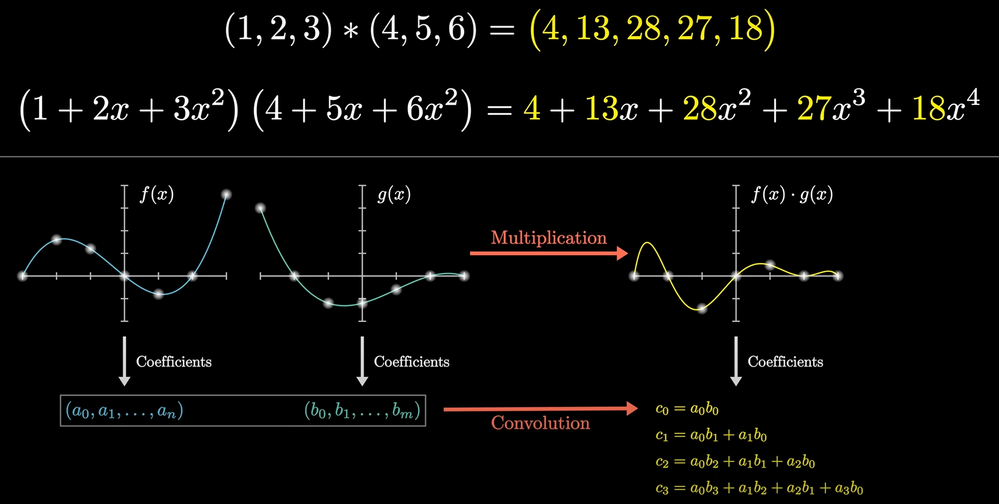](https://www.3blue1brown.com/lessons/convolutions)

For matrix:

$$
B(i,j)=\sum\limits_{m=0}^{M_k-1}\sum\limits_{n=0}^{N_k-1} K(m, n) A(i-m, j-n)
$$

### Convolutional Neural Networks

CNNs are a class of deep neural networks,
most commonly applied to analyzing visual imagery.
They are also known as ConvNets:

- Input Layer (输入层):
  raw pixel values of an image.
- Hidden Layers (隐藏层):
  - Convolutional Layer (卷积层):
    find patterns in regions of the input,
    and passing the results to the next layer.
  - Pooling Layer (池化层):
    down-samples the input representation,
    reducing its dimensionality.
  - Fully Connected Layer (全连接层):
    compute the class scores,
    resulting in a volume of size $1\times1\times{n}$,
    where each of the $n$ numbers represents a class.
- Output Layer (输出层):
  class scores.


```python
# Load the data and split it between train and test sets
(x_train, y_train), (x_test, y_test) = keras.datasets.mnist.load_data()

# Scale images to the [0, 1] range
x_train = x_train.astype("float32") / 255
x_test = x_test.astype("float32") / 255
# Make sure images have shape (28, 28, 1)
x_train = np.expand_dims(x_train, -1)
x_test = np.expand_dims(x_test, -1)
print("x_train shape:", x_train.shape)
print("y_train shape:", y_train.shape)
print(x_train.shape[0], "train samples")
print(x_test.shape[0], "test samples")

# Model parameters
num_classes = 10
input_shape = (28, 28, 1)

model = keras.Sequential(
    [
        keras.layers.Input(shape=input_shape),
        keras.layers.Conv2D(64, kernel_size=(3, 3), activation="relu"),
        keras.layers.Conv2D(64, kernel_size=(3, 3), activation="relu"),
        keras.layers.MaxPooling2D(pool_size=(2, 2)),
        keras.layers.Conv2D(128, kernel_size=(3, 3), activation="relu"),
        keras.layers.Conv2D(128, kernel_size=(3, 3), activation="relu"),
        keras.layers.GlobalAveragePooling2D(),
        keras.layers.Dropout(0.5),
        keras.layers.Dense(num_classes, activation="softmax"),
    ]
)

model.compile(
    loss=keras.losses.SparseCategoricalCrossEntropy(),
    optimizer=keras.optimizers.Adam(learning_rate=1e-3),
    metrics=[
        keras.metrics.SparseCategoricalAccuracy(name="acc"),
    ],
)

# Train
batch_size = 128
epochs = 20

callbacks = [
    keras.callbacks.ModelCheckpoint(filepath="model_at_epoch_{epoch}.keras"),
    keras.callbacks.EarlyStopping(monitor="val_loss", patience=2),
]

model.fit(
    x_train,
    y_train,
    batch_size=batch_size,
    epochs=epochs,
    validation_split=0.15,
    callbacks=callbacks,
)
score = model.evaluate(x_test, y_test, verbose=0)

# Save model
model.save("final_model.keras")

# Predict
predictions = model.predict(x_test)
```

### Convolutional Layer

Convolutional Layer is the first layer to extract features from an input image.
The layer's parameters consist of a set of learnable filters (or kernels),
which have a small receptive field but extend through full depth of input volume.


### Pooling Layer

Pooling Layer is used to reduce the spatial dimensions of the input volume.
It helps to reduce the amount of parameters and computation in the network,
and hence to also control overfitting.

### Fully Connected Layer

Fully Connected Layer is a traditional Multilayer Perceptron (MLP) layer.
It is used to compute the class scores,
resulting in a volume of size $1\times1\times{n}$,
where each of the $n$ numbers represents a class.

### Spatial Transformer Networks

传统的池化方式 (Max Pooling/Average Pooling)
所带来卷积网络的位移不变性和旋转不变性只是局部的和固定的,
且池化并不擅长处理其它形式的仿射变换.

Spatial transformer networks (STNs) allow a neural network to learn
how to perform spatial transformations on the input image
in order to enhance the geometric invariance of the model.
STNs 可以学习一种变换, 这种变换可以将仿射变换后的图像进行矫正,
保证 CNNs 在输入图像发生变换时, 仍然能够保持稳定的输出
(可视为总是输入未变换的图像).


## Recurrent Architecture

### Recurrent Neural Networks

循环神经网络 (RNNs) 是一种具有循环结构的神经网络,
可以处理序列数据, 例如时间序列数据, 自然语言文本等.

当序列数据输入到 RNNs 中时, 每个时间步都会产生一个输出,
并将隐藏状态 (Hidden State) 传递到下一个时间步.
因此, 当改变输入序列的顺序时, RNNs 会产生不同的输出
(Changing sequence order will change output).

$$
\begin{equation}
\begin{split}
  h_t&=\sigma(W_hh_{t-1}+W_ix_t+b_h) \\
  y_t&=\sigma(W_oh_t+b_y)
\end{split}
\end{equation}
$$


### Long Short-Term Memory

长短期记忆网络 (LSTM) 是一种特殊的 RNN,
通过引入门控机制 (Gate Mechanism) 来控制信息的流动,
解决了长序列训练过程中的梯度消失和梯度爆炸问题.

$$
\begin{equation}
\begin{split}
  f_t&=\sigma(W_f\cdot[h_{t-1},x_t]+b_f) \\
  i_t&=\sigma(W_i\cdot[h_{t-1},x_t]+b_i) \\
  \tilde{C}_t&=\tanh(W_C\cdot[h_{t-1},x_t]+b_C) \\
  C_t&=f_t*{C_{t-1}}+i_t*\tilde{C}_t \\
  o_t&=\sigma(W_o\cdot[h_{t-1},x_t]+b_o) \\
  h_t&=o_t*\tanh(C_t) \\
  y_t&=\sigma(W_yh_t+b_y)
\end{split}
\end{equation}
$$


## Residual Architecture

ResNet 通过残差学习解决了深度网络的退化问题 (深度网络的训练问题),
最短的路, 决定容易优化的程度: 残差连接 (Residual Connection) 可以认为层数是 0.
最长的路, 决定深度网络的能力: 解决了深度网络的训练问题后, 可以做到更深的网络 (100+).

ResNet 通过引入残差连接, 允许网络学习残差映射而不是原始映射.
残差映射就是目标层与它的前面某层之间的差异 $\mathcal{F}(\mathrm{x}):=\mathcal{H}(\mathrm{x})-\mathrm{x}$.
如果输入和输出之间的差异很小, 那么残差网络只需要学习这些微小的差异即可.
这种学习通常比学习原始的复杂映射要简单得多.

$$
\begin{equation}
\begin{split}
  \mathrm{y}&=\mathcal{F}(\mathrm{x}, W_i)+W_s\mathrm{x}    \\
            &=\mathcal{F}(\mathrm{x})+\mathrm{x}            \\
            &=\mathcal{H}(\mathrm{x})-\mathrm{x}+\mathrm{x} \\
            &=\mathcal{H}(\mathrm{x})
\end{split}
\end{equation}
$$


从深层网络角度来讲, 不同的层学习的速度差异很大,
表现为网络中靠近输出的层学习的情况很好, 靠近输入的层学习的很慢,
有时甚至训练了很久, 前几层的权值和刚开始随机初始化的值差不多 (无法收敛).
因此, 梯度消失或梯度爆炸的根本原因在于反向传播训练法则, 本质在于方法问题.
ResNet 通过残差连接保持梯度传播, 使得网络的训练更加容易:

$$
\begin{equation}
  \frac{\theta{f(g(x))+g(x)}}{\theta{x}}=
  \frac{\theta{f(g(x))}}{\theta{g(x)}}\cdot{\frac{\theta{g(x)}}{\theta{x}}}+\frac{\theta{g(x)}}{\theta{x}}
\end{equation}
$$

## Transformer Architecture

[](https://jalammar.github.io/illustrated-transformer)

- Self-attention only:
  comparing to Recurrent Neural Networks (RNNs),
  no recurrent layers, allows for more parallelization.
- Multi-headed attention:
  consistent with Convolutional Neural Networks (CNNs),
  multiple output channels.

### Self-Attention Mechanism

In layman's terms,
a [self-attention](https://www.3blue1brown.com/lessons/attention)
module takes in n inputs and returns n outputs:

- Self: allows the inputs to interact with each other
- Attention: find out who they should pay more attention to.
- The outputs are aggregates of these interactions and attention scores.

$$
\begin{equation}
  \text{Attention}(Q, K, V)=\text{softmax}(\frac{QK^T}{\sqrt{d_k}})V
\end{equation}
$$

[](https://towardsdatascience.com/illustrated-self-attention-2d627e33b20a)

The illustrations are divided into the following steps:

- Prepare inputs.
- Weights initialization (Constant/Random/Xavier/Kaiming Initialization).
- Derive query, key and value.
- Calculate attention scores for input.
- Calculate softmax.
- Multiply scores with values.
- Sum weighted values to get output.

$$
X=\begin{bmatrix}x_1\\x_2\\x_3\end{bmatrix}
 =\begin{bmatrix}1&0&1&0\\0&2&0&2\\1&1&1&1\end{bmatrix}
$$

Weights for query, key and value
(these weights are usually small numbers,
initialized randomly using an appropriate random distribution
like Gaussian, Xavier and Kaiming distributions):

$$
W_Q=\begin{bmatrix}q_1&q_2&q_3\end{bmatrix}
   =\begin{bmatrix}1&0&1\\1&0&0\\0&0&1\\0&1&1\end{bmatrix}\\[1em]
W_K=\begin{bmatrix}k_1&k_2&k_3\end{bmatrix}
   =\begin{bmatrix}0&0&1\\1&1&0\\0&1&0\\1&1&0\end{bmatrix}\\[1em]
W_V=\begin{bmatrix}v_1&v_2&v_3\end{bmatrix}
   =\begin{bmatrix}0&2&0\\0&3&0\\1&0&3\\1&1&0\end{bmatrix}
$$

Derive query, key and value:

$$
Q=XW_Q
 =\begin{bmatrix}1&0&1&0\\0&2&0&2\\1&1&1&1\end{bmatrix}
  \begin{bmatrix}1&0&1\\1&0&0\\0&0&1\\0&1&1\end{bmatrix}
 =\begin{bmatrix}1&0&2\\2&2&2\\2&1&3\end{bmatrix}\\[1em]
K=XW_K
 =\begin{bmatrix}1&0&1&0\\0&2&0&2\\1&1&1&1\end{bmatrix}
  \begin{bmatrix}0&0&1\\1&1&0\\0&1&0\\1&1&0\end{bmatrix}
 =\begin{bmatrix}0&1&1\\4&4&0\\2&3&1\end{bmatrix}\\[1em]
V=XW_V
 =\begin{bmatrix}1&0&1&0\\0&2&0&2\\1&1&1&1\end{bmatrix}
  \begin{bmatrix}0&2&0\\0&3&0\\1&0&3\\1&1&0\end{bmatrix}
 =\begin{bmatrix}1&2&3\\2&8&0\\2&6&3\end{bmatrix}\\[1em]
$$

Calculate attention scores $QK^T$ for input:

$$
QK^T
=\begin{bmatrix}1&0&2\\2&2&2\\2&1&3\end{bmatrix}
 \begin{bmatrix}0&4&2\\1&4&3\\1&0&1\end{bmatrix}
=\begin{bmatrix}2&4&4\\4&16&12\\4&12&10\end{bmatrix}
$$

:::tip $XX^T$

$XX^T$ 为行向量分别与自己和其他两个行向量做内积 (点乘),
向量的内积表征两个向量的夹角 ($\cos\theta=\frac{a\cdot{b}}{|a||b|}$),
表征一个向量在另一个向量上的投影,
投影的值大, 说明两个向量相关度高 (Relevance/Similarity).

$$
\begin{bmatrix}
v_1 \\ v_2 \\ v_3 \\ \vdots \\ v_n
\end{bmatrix}
\cdot
\begin{bmatrix}
w_1 \\ w_2 \\ w_3 \\ \vdots \\ w_n
\end{bmatrix}
=v_1w_1+v_2w_2+v_3w_3+\dots+v_nw_n
$$

:::

Softmaxed attention scores $\text{softmax}(\frac{QK^T}{\sqrt{d_k}})$:

$$
\text{softmax}(QK^T)
=\text{softmax}\Bigg(\begin{bmatrix}2&4&4\\4&16&12\\4&12&10\end{bmatrix}\Bigg)
=\begin{bmatrix}0.0&0.5&0.5\\0.0&1.0&0.0\\0.0&0.9&0.1\end{bmatrix}
$$

:::tip Softmax

[`softmax`](https://en.wikipedia.org/wiki/Softmax_function) function:

$$
\begin{equation}
  \sigma(z_i)=\frac{e^{z_i/T}}{\sum_{j=1}^K{e^{z_j/T}}}
\end{equation}
$$

其中, $T$ 为温度参数 (Temperature Parameter),
用于控制 `softmax` 函数的输出分布的`陡峭`程度:

- $T=1$ 时, `softmax` 函数退化为标准形式.
- $T>1$ 时, `softmax` 函数输出分布更加`平缓`.
- $T<1$ 时, `softmax` 函数输出分布更加`陡峭`.
- $T\to0$ 时, `softmax` 函数退化为 `argmax` 函数,
  输出分布中只有一个元素为 1, 其他元素为 0.

:::

:::tip $\sqrt{d_k}$

矩阵 $A$ 中每一个元素除以 $\sqrt{d_k}$ 后, 方差变为 1.
这使得 $\text{softmax}(A)$ 的分布"陡峭"程度与 $d_k$ 解耦,
从而使得训练过程中梯度值保持稳定.

:::

Alignment vectors (yellow vectors) addition to output:

$$
\begin{split}
y_1&=\sum\limits_{i=1}^{3}\alpha_{1i}v_i \\
&=\alpha_{11}v_1+\alpha_{12}v_2+\alpha_{13}v_3 \\
&=0.0\begin{bmatrix}1&2&3\end{bmatrix}
  +0.5\begin{bmatrix}2&8&0\end{bmatrix}
  +0.5\begin{bmatrix}2&6&3\end{bmatrix} \\
&=\begin{bmatrix}2.0&7.0&1.5\end{bmatrix}
\end{split}
$$

Repeat for every input:

$$
y_2=\begin{bmatrix}2.0&8.0&0.0\end{bmatrix},
y_3=\begin{bmatrix}2.0&7.8&0.3\end{bmatrix}
$$

Calculate $\text{softmax}(\frac{QK^T}{\sqrt{d_k}})V$ by matrix multiplication:

$$
\text{softmax}(QK^T)V
=\begin{bmatrix}0.0&0.5&0.5\\0.0&1.0&0.0\\0.0&0.9&0.1\end{bmatrix}
\begin{bmatrix}1&2&3\\2&8&0\\2&6&3\end{bmatrix}
=\begin{bmatrix}2.0&7.0&1.5\\2.0&8.0&0.0\\2.0&7.8&0.3\end{bmatrix}
$$

:::tip $QK^TV$

Self-attention 中的 $QKV$ 思想,
另一个层面是想要构建一个具有全局语义 (Context) 整合功能的数据库,
使得 Context Size 内的每个元素都能够`看到`其他元素的信息,
从而能够更好地进行决策.

:::

```python
import torch
from torch.nn.functional import softmax

# 1. Prepare inputs
x = [
    [1, 0, 1, 0],  # Input 1
    [0, 2, 0, 2],  # Input 2
    [1, 1, 1, 1],  # Input 3
]
x = torch.tensor(x, dtype=torch.float32)

# 2. Weights initialization
w_query = [
    [1, 0, 1],
    [1, 0, 0],
    [0, 0, 1],
    [0, 1, 1],
]
w_key = [
    [0, 0, 1],
    [1, 1, 0],
    [0, 1, 0],
    [1, 1, 0],
]
w_value = [
    [0, 2, 0],
    [0, 3, 0],
    [1, 0, 3],
    [1, 1, 0],
]
w_query = torch.tensor(w_query, dtype=torch.float32)
w_key = torch.tensor(w_key, dtype=torch.float32)
w_value = torch.tensor(w_value, dtype=torch.float32)

# 3. Derive query, key and value
queries = x @ w_query
keys = x @ w_key
values = x @ w_value

# 4. Calculate attention scores
attn_scores = queries @ keys.T

# 5. Calculate softmax
attn_scores_softmax = softmax(attn_scores, dim=-1)
# tensor([[6.3379e-02, 4.6831e-01, 4.6831e-01],
#         [6.0337e-06, 9.8201e-01, 1.7986e-02],
#         [2.9539e-04, 8.8054e-01, 1.1917e-01]])
# For readability, approximate the above as follows
attn_scores_softmax = [
    [0.0, 0.5, 0.5],
    [0.0, 1.0, 0.0],
    [0.0, 0.9, 0.1],
]
attn_scores_softmax = torch.tensor(attn_scores_softmax)

# 6. Multiply scores with values
weighted_values = values[:, None] * attn_scores_softmax.T[:, :, None]

# 7. Sum weighted values
outputs = weighted_values.sum(dim=0)

print(outputs)
# tensor([[2.0000, 7.0000, 1.5000],
#         [2.0000, 8.0000, 0.0000],
#         [2.0000, 7.8000, 0.3000]])
# tensor([[1.9366, 6.6831, 1.5951],
#         [2.0000, 7.9640, 0.0540],
#         [1.9997, 7.7599, 0.3584]])
```

自注意力机制能够直接建模序列中任意两个位置之间的关系,
进而有效捕获长程依赖关系, 具有更强的序列建模能力.
自注意力的计算过程对于基于硬件的并行优化 (GPU/TPU) 非常友好,
因此能够支持大规模参数的高效优化.

### Multi-Head Attention Mechanism

Multiple output channels:

$$
\begin{equation}
\begin{split}
  \text{MultiHead}(Q,K,V)&=\text{Concat}(\text{head}_1,\ldots,\text{head}_h)W^O \\
  \text{where}\ \text{head}_i&=\text{Attention}(QW_i^Q,KW_i^K,VW_i^V)
\end{split}
\end{equation}
$$

```python
from math import sqrt
import torch
import torch.nn

class Self_Attention(nn.Module):
    # input : batch_size * seq_len * input_dim
    # q : batch_size * input_dim * dim_k
    # k : batch_size * input_dim * dim_k
    # v : batch_size * input_dim * dim_v
    def __init__(self, input_dim, dim_k, dim_v):
        super(Self_Attention, self).__init__()
        self.q = nn.Linear(input_dim, dim_k)
        self.k = nn.Linear(input_dim, dim_k)
        self.v = nn.Linear(input_dim, dim_v)
        self._norm_fact = 1 / sqrt(dim_k)

    def forward(self, x):
        Q = self.q(x)  # Q: batch_size * seq_len * dim_k
        K = self.k(x)  # K: batch_size * seq_len * dim_k
        V = self.v(x)  # V: batch_size * seq_len * dim_v

        # Q * K.T() # batch_size * seq_len * seq_len
        attention = nn.Softmax(dim=-1)(torch.bmm(Q, K.permute(0, 2, 1))) * self._norm_fact

        # Q * K.T() * V # batch_size * seq_len * dim_v
        output = torch.bmm(attention, V)

        return output

class Self_Attention_Multiple_Head(nn.Module):
    # input : batch_size * seq_len * input_dim
    # q : batch_size * input_dim * dim_k
    # k : batch_size * input_dim * dim_k
    # v : batch_size * input_dim * dim_v
    def __init__(self, input_dim, dim_k, dim_v, nums_head):
        super(Self_Attention_Multiple_Head, self).__init__()
        assert dim_k % nums_head == 0
        assert dim_v % nums_head == 0
        self.q = nn.Linear(input_dim, dim_k)
        self.k = nn.Linear(input_dim, dim_k)
        self.v = nn.Linear(input_dim, dim_v)

        self.nums_head = nums_head
        self.dim_k = dim_k
        self.dim_v = dim_v
        self._norm_fact = 1 / sqrt(dim_k)

    def forward(self, x):
        Q = self.q(x).reshape(-1, x.shape[0], x.shape[1], self.dim_k // self.nums_head)
        K = self.k(x).reshape(-1, x.shape[0], x.shape[1], self.dim_k // self.nums_head)
        V = self.v(x).reshape(-1, x.shape[0], x.shape[1], self.dim_v // self.nums_head)
        print(x.shape)
        print(Q.size())

        # Q * K.T() # batch_size * seq_len * seq_len
        attention = nn.Softmax(dim=-1)(torch.matmul(Q, K.permute(0, 1, 3, 2)))

        # Q * K.T() * V # batch_size * seq_len * dim_v
        output = torch.matmul(attention, V).reshape(x.shape[0], x.shape[1], -1)

        return output
```

### Positional Encoding Mechanism

[位置编码](https://kazemnejad.com/blog/transformer_architecture_positional_encoding)
使用正弦和余弦函数的 d 维向量编码方法,
用于在输入序列中表示每个单词的位置信息,
丰富了模型的输入数据, 为其提供位置信息
(把词序信号加到词向量上帮助模型学习这些信息):

- 唯一性 (Unique): 为每个时间步输出一个独一无二的编码.
- 一致性 (Consistent): 不同长度的句子之间, 任何两个时间步之间的距离保持一致.
- 泛化性 (Generalizable): 模型能毫不费力地泛化到更长的句子, 位置编码的值是有界的.
- 确定性 (Deterministic): 位置编码的值是确定性的.

编码函数使用正弦和余弦函数, 其频率沿着向量维度进行减少.
编码向量包含每个频率的正弦和余弦对,
以实现 $\sin(x+k)$ 和 $\cos(x+k)$ 的线性变换, 从而有效地表示相对位置.

For $\vec{p_t}\in\mathbb{R}^d$ (where $d\equiv_2{0}$),
then $f:\mathbb{N}\to\mathbb{R}^d$

$$
\begin{align}
  \vec{p_t}^{(i)}=f(t)^{(i)}:=
  \begin{cases}
      \sin({\omega_k}\cdot{t}), &\text{if}\ i=2k \\
      \cos({\omega_k}\cdot{t}), &\text{if}\ i=2k+1
  \end{cases}
\end{align}
$$

where

$$
\omega_k=\frac{1}{10000^{2k/d}}
$$

outcomes

$$
\vec{p_t} = \begin{bmatrix}
\sin({\omega_1}\cdot{t}) \\
\cos({\omega_1}\cdot{t}) \\
\\
\sin({\omega_2}\cdot{t}) \\
\cos({\omega_2}\cdot{t}) \\
\\
\vdots \\
\\
\sin({\omega_{d/2}}\cdot{t}) \\
\cos({\omega_{d/2}}\cdot{t})
\end{bmatrix}_{d\times{1}}
$$

## Explainable AI

### Local Explanation

Explain the decision of a single instance
(why do you think this image is a `cat`):

- Saliency map:
  use gradient to highlight most important pixels for model's decision
  $|\frac{\partial{e}}{\partial{x_n}}|$.
- Probing:
  perturb input and observe how prediction changes (via 3rd NNs).

### Global Explanation

Explain the whole model
(what does a `cat` look like).

## Generative AI

### Generative Model

- Autoregressive (AR) model:
  generate output one token at a time, conditioned on previous tokens.
- Non-autoregressive (NAR) model:
  generate output all at once parallel, without conditioning on previous tokens.

|             | AR Model | NAR Model |
| ----------- | :------: | :-------: |
| Parallelism |   Low    |   High    |
| Speed       |   Slow   |   Fast    |
| Quality     |   High   |    Low    |

结合上述两种方法 (Encoder + Decoder 架构):

- 用 AR model 生成中间向量, 用 NAR model 生成最终输出.
- 用 NAR model 多次生成, 逐步优化输出.
- Speculative decoding:
  用 NAR model 快速生成若干个预测输出, 作为 AR model 的后续输入,
  使得 AR model 可以同时输出多个结果.


### Scaling Law

现有的预训练语言模型对于数据的需求量远高于扩展法则
(e.g [Chinchilla](https://nips.cc/virtual/2022/53031)) 中所给出的估计规模.
很多更小的模型也能够通过使用超大规模的预训练数据获得较大的模型性能提升.
这种现象的一个重要原因是由于 Transformer 架构具有较好的数据扩展性.
目前为止, 还没有实验能够有效验证特定参数规模语言模型的饱和数据规模
(即随着数据规模的扩展，模型性能不再提升).

### Emergent Ability

大语言模型的涌现能力被非形式化定义为
`在小型模型中不存在但在大模型中出现的能力`:

- In-context learning.
- Instruction following.
- Step-by-step reasoning.

### ChatGPT

Fine-tuned GPT model on conversational data:

- Pre-training:
  学习文字接龙, 学习大规模资料 (self-supervised learning), 生成下一个单词.
- Instruction-tuning (IT):
  人工文字接龙, 人工标注部分问题的答案 (supervised learning), 引导模型生成的方向.
- Reinforcement learning from human feedback
  ([RLHF](https://nips.cc/virtual/2022/52886)):
  训练一个 reward model, 负责评价模型生成的答案, 提供人类反馈.
  以 reward model 的评价分数为 reward, 通过强化学习优化模型.
  一般聚焦于三个方面: 有用性 (Helpfulness), 诚实性 (Honesty), 无害性 (Harmlessness).

:::tip Alignment

Instruction-tuning (IT) with supervised learning on labelled data
and reinforcement learning from human feedback (RLHF).

:::

### Diffusion Model

Forward process (diffusion) + reverse process (denoise):

[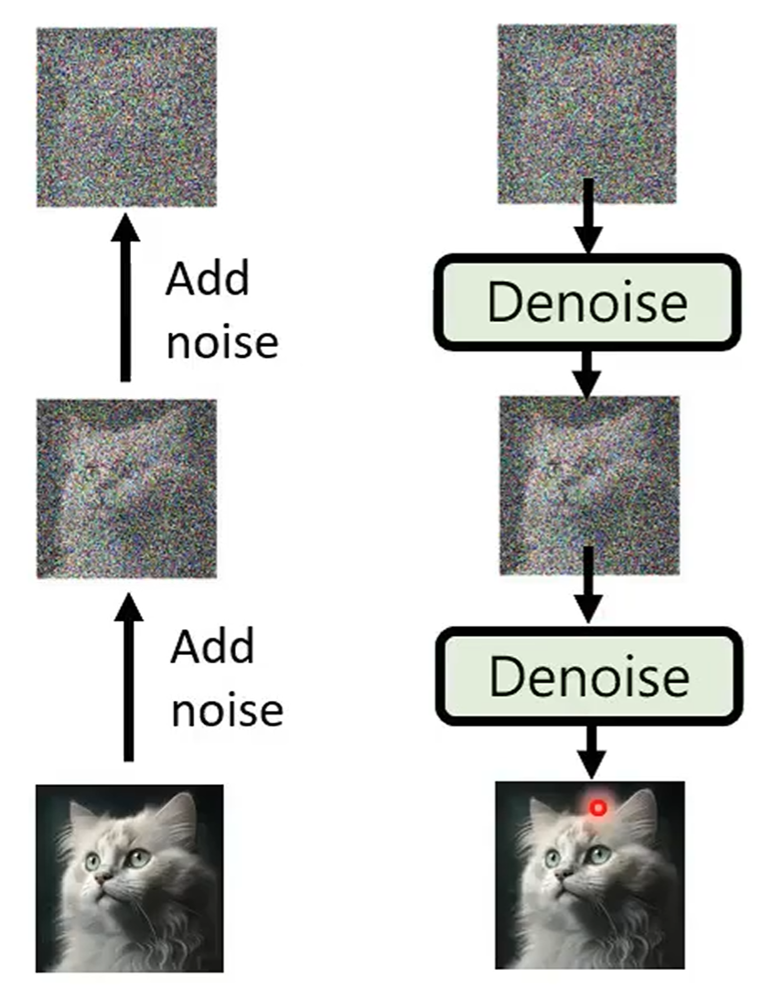](https://nips.cc/virtual/2020/protected/poster_4c5bcfec8584af0d967f1ab10179ca4b.html)

Stable diffusion model:

[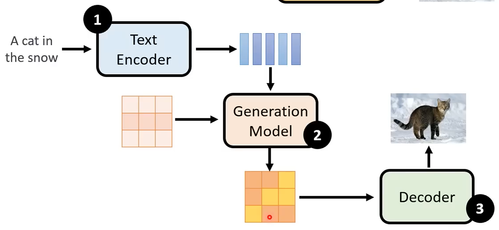](https://ieeexplore.ieee.org/document/9878449)

### Video Model

Generative videos as world models simulator.

## Prompt Engineering

### In-Context Learning Prompting

Given examples, generate output:

[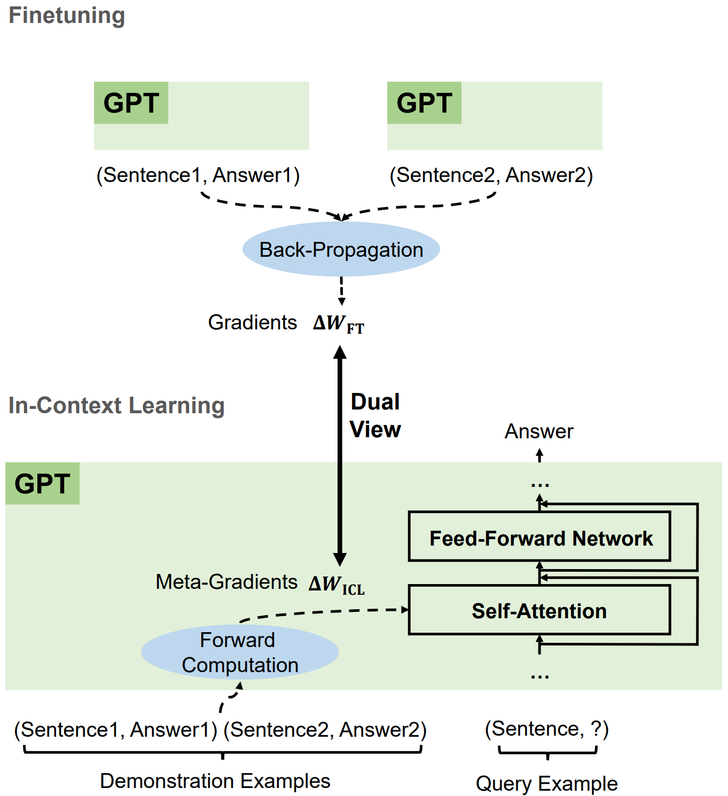](https://nips.cc/virtual/2023/76728)

### Chain-of-Thought Prompting

[CoT prompting](https://nips.cc/virtual/2022/54087) elicits reasoning in LLMs:
a series of intermediate reasoning steps
significantly improves ability of LLMs to perform complex reasoning.

Few shot CoT:

```bash
Q: Roger has 5 tennis balls.
He buys 2 more cans of tennis balls.
Each can has 3 tennis balls.
How many tennis balls does he have now?

A: Roger started with 5 balls.
2 cans of 3 tennis balls each is 6 tennis balls.
5 + 6 = 11. The answer is 11.

Q: The cafeteria had 23 apples.
If they used 20 to make lunch and bought 6 more,
how many apples do they have?

A:
------

(Output) The cafeteria had 23 apples originally.
They used 20 to make lunch. So they had 23 - 20 = 3.
They bought 6 more apples, so they have 3 + 6 = 9. The answer is 9.
```

Zero shot CoT:

```bash
Q: A juggler can juggle 16 balls.
Half of the balls are golf balls,
and half of the golf balls are blue.
How many blue golf balls are there?

A: Let's think step by step.
------

(Output) There are 16 balls in total.
Half of the balls are golf balls.
That means that there are 8 golf balls.
Half of the golf balls are blue.
That means that there are 4 blue golf balls.
```

### Task Planning Prompting

将复杂任务拆解成多个子任务, 并不断修正错误:

- [Re3](https://aclanthology.org/2022.emnlp-main.296):
  recursive re-prompting and revision.
- [ToT](https://nips.cc/virtual/2023/73874):
  tree of thoughts.
- [GoT](https://ojs.aaai.org/index.php/AAAI/article/view/29720):
  graph of thoughts.

```bash
How to make a simple but delicious dish called "Scrambled eggs with tomatoes".
Let’s break down this problem.
```

```bash
Give me a solution to accelerate decoding speed of LLMs during inference?
Let’s break down this problem and give me the solution with code format.
```

```bash
# Tree of thoughts
假设三位不同的专家来回答这个问题.
所有专家都写下他们思考这个问题的第一个步骤, 然后与大家分享.
然后, 所有专家都写下他们思考的下一个步骤并分享.
以此类推, 直到所有专家写完他们思考的所有步骤.
只要大家发现有专家的步骤出错了, 就让这位专家离开.
请问:
```


### Machine Prompting

利用机器生成 prompts:

- Soft prompt:
  将向量作为输入, 与文字合并成一个完整的 prompt,
  作用类似于 BERT adapter.
- Reinforcement learning prompting:
  通过强化学习训练一个模型, 负责生成 prompts.
- [LLM prompting](https://iclr.cc/virtual/2023/10850):
  通过 LLM 自身生成 prompts.

[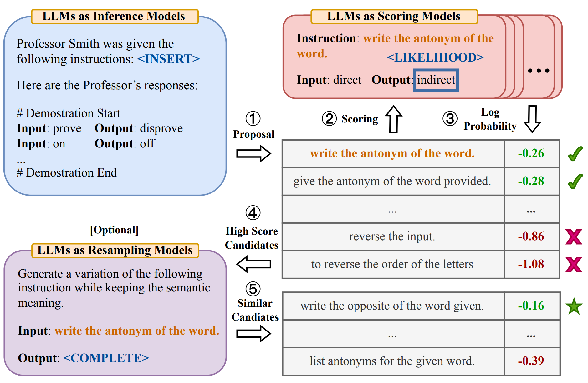](https://github.com/keirp/automatic_prompt_engineer)

- LLMs collaboration:
  - Utilize multiple LLMs, each with different strengths.
  - [EoT](https://aclanthology.org/2023.emnlp-main.936):
    exchange-of-thought, encourage divergent thinking
    through cross-model communication and multi-agent debate.

### Retrieval-Augmented Generation

检索增强生成, 通常称为 RAG (Retrieval-Augmented Generation),
是一种强大的聊天机器人的设计模式.
其中, 检索系统实时获取与查询相关的经过验证的源 / 文档,
并将其输入生成模型 (例如 GPT-4) 以生成响应.

Context is everything when it comes to getting the most out of an AI tool.
To improve the relevance and quality of a generative AI output,
you need to [improve the relevance and quality of the input](https://github.blog/2024-04-04-what-is-retrieval-augmented-generation-and-what-does-it-do-for-generative-ai).

> [Quality in, quality out.](https://github.blog/2024-04-04-what-is-retrieval-augmented-generation-and-what-does-it-do-for-generative-ai)


```python
from langchain_community.document_loaders import PyPDFLoader
from langchain_text_splitters import RecursiveCharacterTextSplitter
from langchain_community.embeddings import HuggingFaceBgeEmbeddings
from langchain_community.vectorstores import FAISS
from langchain_anthropic import ChatAnthropic
from langchain_core.prompts import ChatPromptTemplate
from google.colab import userdata

# Load document
document_url = "https://arxiv.org/pdf/2312.10997.pdf"
loader = PyPDFLoader(document_url)
pages = loader.load()

# Split document into chunks
text_splitter = RecursiveCharacterTextSplitter(
    chunk_size=400,
    chunk_overlap=40,
    length_function=len,
    is_separator_regex=False,
)
chunks = text_splitter.split_documents(pages)

# Create embeddings from chunks
model_name = "BAAI/bge-small-en"
model_kwargs = {"device": "cpu"}
encode_kwargs = {"normalize_embeddings": True}
bge_embeddings = HuggingFaceBgeEmbeddings(
    model_name=model_name, model_kwargs=model_kwargs, encode_kwargs=encode_kwargs
)

chunk_texts = list(map(lambda d: d.page_content, chunks))
embeddings = bge_embeddings.embed_documents(chunk_texts)

# Store embeddings
text_embedding_pairs = zip(chunk_texts, embeddings)
db = FAISS.from_embeddings(text_embedding_pairs, bge_embeddings)

# Search database for similar contexts
query = "Which are the drawbacks of Naive RAG?"

contexts = db.similarity_search(query, k=5)

# Chat with model
prompt = ChatPromptTemplate.from_messages(
    [
        (
            "system",
            """You are an expert at answering questions
            based on a context extracted from a document.
            The context extracted from the document is: {context}""",
        ),
        ("human", "{question}"),
    ]
)

api_key = userdata.get("ANTHROPIC_API_KEY")
model = ChatAnthropic(model="claude-3-haiku-20240307", api_key=api_key)

chain = prompt | model

response = chain.invoke(
    {
        "context": "\n\n".join(list(map(lambda c: c.page_content, contexts))),
        "question": query,
    }
)

print(response.content)
```

### Elvis Saravia Framework

[Elvis Saravia framework](https://github.com/dair-ai/Prompt-Engineering-Guide):

- Instruction (指令):
  明确模型需要执行的特定任务, 如生成文本, 翻译语言或创作不同类型的内容.
- Context (上下文):
  为模型提供理解请求所需的背景信息.
  例如, 在要求模型生成特定主题的文本时, 提供有关该主题的信息.
- Input Data (输入数据):
  模型处理的具体数据.
  例如, 在翻译任务中, 提供要翻译的英文句子.
- Output Indicator (输出指示):
  指示期望的输出类型或格式.
  例如, 在文本生成任务中, 指定输出为一段文字.

### CRISPE Framework

[CRISPE framework](https://github.com/mattnigh/ChatGPT3-Free-Prompt-List):

- Capacity and role (能力和角色): 定义模型应扮演的角色 (`Act as`), 如专家, 创意作家或喜剧演员.
- Insight (洞察): 提供模型理解请求所需的背景信息和上下文.
- Statement (声明): 明确模型执行的特定任务.
- Personality (个性): 定义模型回答请求时的风格或方式.
- Experiment (实验): 通过提供多个答案的请求来迭代, 以获得更好的答案.

```bash
I want you to act as a JavasScript console.
I will type commands and you will reply with what JavasScript console should show.

I want you to only reply with terminal output inside code block, and nothing else.
Do not write explanations. Do not type commands unless I instruct you to do so.

When I need to tell you something in English,
I will do so by putting text inside curly brackets {like this}.

My first command is console.log("Hello World").
```

:::tip Prompt Engineering Frameworks

上述两个框架的共性在于:

- Clarity:
  Clear and concise prompt, respectful and professional tone,
  ensure LLMs understands topics and generate appropriate responses.
  Avoid using overly complex or ambiguous language.
- Focus:
  Clear purpose and focus, helping to guide the conversation and keep it on track.
  Avoid using overly broad or open-ended prompts.
- Relevance:
  Relevant to the user and the conversation.
  Avoid introducing unrelated topics that can distract from main focus.
- 清晰指示任务和角色, 重视上下文信息, 指定输出格式.

:::

### Simple Framework

简化的综合框架:

- 明确任务: 直接指出你需要模型做什么. 例如: "写一个故事", "回答一个问题", "解释一个概念".
- 设定角色和风格: 简短描述模型应采用的角色和风格 (`Act as`). 例如: "像专家一样", "幽默地", "正式地".
- 提供背景信息: 给出足够的信息, 让模型了解任务的上下文. 例如: "关于环保", "在古罗马背景下".
- 指定输出格式: 告诉模型你期望的回答形式. 例如: "一段文本", "列表", "步骤说明".

操作指南:

- 步骤1 (明确任务): 思考你需要模型完成的具体任务, 尽量具体. 例如: "请写一个关于节约用水的短故事".
- 步骤2 (设定角色和风格): 考虑任务最适合的表达方式和语气. 例如: "用一个小孩的视角, 轻松幽默地讲述".
- 步骤3 (提供背景信息): 如果任务涉及特定的主题或需要特定知识, 提供相关的背景信息. 例如: "在一个干旱的城市里".
- 步骤4 (指定输出格式): 明确你想要的输出类型. 例如: "三段话, 每段不超过五句话".

```bash
我要写一个英语学习计划, 请根据下列规则生成一个合适的 Prompt, 然后再输出内容:
明确任务: 直接指出你需要模型做什么. 例如: "写一个故事", "回答一个问题", "解释一个概念".
设定角色和风格: 简短描述模型应采用的角色和风格. 例如: "像专家一样", "幽默地", "正式地".
提供背景信息: 给出足够的信息, 让模型了解任务的上下文. 例如: "关于环保", "在古罗马背景下".
指定输出格式: 告诉模型你期望的回答形式. 例如: "一段文本", "列表", "步骤说明".

ChatGPT:
任务: 创建一个学习英语的计划.
角色和风格: 请像一位经验丰富的语言教师一样, 正式而清晰地提供指导.
背景信息: 这个计划是为了帮助一个成年人从初级水平提高到中级水平. 他们每周可以投入约 10 小时的学习时间, 目标是提高口语和听力技能.
输出格式: 请以清晰的列表形式提供, 包括每周的具体学习活动和目标.

我现在是高中水平的英语, 想要通过雅思考试.
每一部分提供具体的学习资料.
```

### Image Prompts

Themes:

- Realistic, Realism, Surreal, Surrealism, Unrealistic.
- Science fiction, Dreamy, Dreampunk, Otherworldly, Abstraction.
- Fantasy, Dark fantasy, Illusion, Retro, Vintage.
- Cyberpunk, Rustic, Historic, Futuristic, Sci-fi.
- Cartoon, Marvel comics, Kawaii, Anime.

Design styles:

- Simple, Detailed, Complex, Multiplex, Chaotic.
- Surface detail, Minimalist, Maximalist, Ukiyo-e, Ukiyo-e flat design.
- Patterns, Polka dot, Halftone, 20s, 30s, 1940s, 1950s.
- Decor, 60s, 1800s, 2020s, 4000s, Pop-art, Hi-fi, Gothic.
- Painting/Graffiti By artists,
  e.g `By Van Gogh`, `By Pablo Picasso`, `By Leonardo Da Vinci`, `Graffiti By Banksy`.

Engines:

- Unreal engine, Cinema4D, 4k, 8k, 16k, Ultra-HD.
- 2-bit, 4-bit, 8-bit, 16-bit.
- Disney, Pixar, Dreamworks, IMAX, Pixomondo.
- Vector graphics, 3D model, Lowpoly, Holographic.
- Digital art, Pixel art, NFT, Clip art, Character design, Wallpaper.

Drawing and art mediums:

- Sketch, Drawing, Hand-drawn, Dot art, Line art.
- Caricature, Illustration, Pencil art, Charcoal art, Pastel art.
- Acrylic painting, Oil painting, Watercolor painting, Graffiti, Spray paint.
- Sticker, Blueprint, Mosaic, Coloring book, Chibi, Paper cut craft.

Colors and palettes:

- Red, Orange, Light-gray, Light-purple, Neutral.
- Multicolored, Black and white, Monochromatic, Sepia, Dark mode.

Time of the day:

- Golden hour, High noon, Afternoon, Mid-morning.
- Blue hour, Sunset, Sunrise, Nighttime.

Material properties:

- Transparent, Opaque, Polarized, Prismatic, Glitter, Glowing.
- Glossy, Shiny, Polished, Melting, Squishy, Dirty.

Materials and textures:

- Stone:
  pebbles, cobblestone, rock, bedrock, sandstone,
  marble, gypsum, granite, diorite, andesite.
- Mineral:
  coal, sulfur, sodalime, geyserite, ceramic,
  enamel, asbestos, fossil, perlite, vermiculite,
  slag, minium, travertine, fulgurite, graphene.
- Wood:
  wooden, plywood, particle board, hardboard, lumber, planks,
  wooden planks, nailed-wood, wood veneer, petrified wood, oak wood,
  maple wood, acacia-wood, pine-wood, cherry-wood, birch-wood, cedar-wood.
- Paper:
  cardboard, corrugated fibre-board, paperboard, construction paper,
  card-stock, tracing paper, glassine, tissue paper, kraft paper,
  papyrus, parchment, hemp paper, tar paper.
- Metal:
  metallic, rusty, foil, tarnish, tin,
  copper, pewter, aluminum, bronze, brass,
  iron, steel, titanium, silver, bismuth.
- Glass:
  stained glass, sea-grass, obsidian, fiberglass, crystalline,
  borax crystal, amethyst, quartz, rose quartz.

Lighting:

- Spotlight, Sunlight, Starlight, Nightlight, Neon lamp, Dot matrix display.
- Warm light, Hard light, Soft light, Cold light, Neon light.

Geography and culture:

- French-style, Turkish-style.
- Mayan, Arabic, Nordic mythology.

Shot types:

- Extreme long shot, Long shot, Medium shot, Close-up shot, Extreme close-up shot.
- Low angle shot, High angle shot, Night shot, Silhouette shot, Wide shot.
- Overhead shot, Side-view shot, Centered shot, Back-view shot, Selfie.

Views:

- Top-view, Side-view, Satellite-view, View from an airplane, Closeup.
- Extreme closeup, Epic wide shot, First-person view, Third-person view.
- Full body, Portrait, Front-view, Bird-view, Macro shot, Macro view.
- Microscopic, 360 panorama, Ultra-wide angle, 360 angle.

Film types:

- DSLR, Night vision, Drone photography, GoPro video.
- Unregistered Hypercan 2, Hyper-special imaging, Multi-special imaging.
- Schlieren, Disposable camera, Polaroid, Instax, Lomo, Pinhole photography.
- VistaVision, Technirama, Techniscope, Panavision, Ambrotype.

### AI Agents

AI agents powered by tricky LLMs prompting:

- Generative [agent](https://github.com/joonspk-research/generative_agents).
- Minecraft [agent](https://github.com/MineDojo/Voyager).

### Prompt Engineering Reference

- Prompt engineering [guide](https://github.com/dair-ai/Prompt-Engineering-Guide).
- [Awesome](https://github.com/f/awesome-chatgpt-prompts) ChatGPT prompts.
- Midjourney [cookbook](https://fka.gumroad.com/l/the-art-of-midjourney-ai-guide-to-creating-images-from-text).
- LLM [book](https://github.com/LLMBook-zh/LLMBook-zh.github.io).

## LLM Toolchain

### LangChain

[LangChain](https://upstash.com/blog/langchain-explained)
aims to make programming with LLMs easier.

[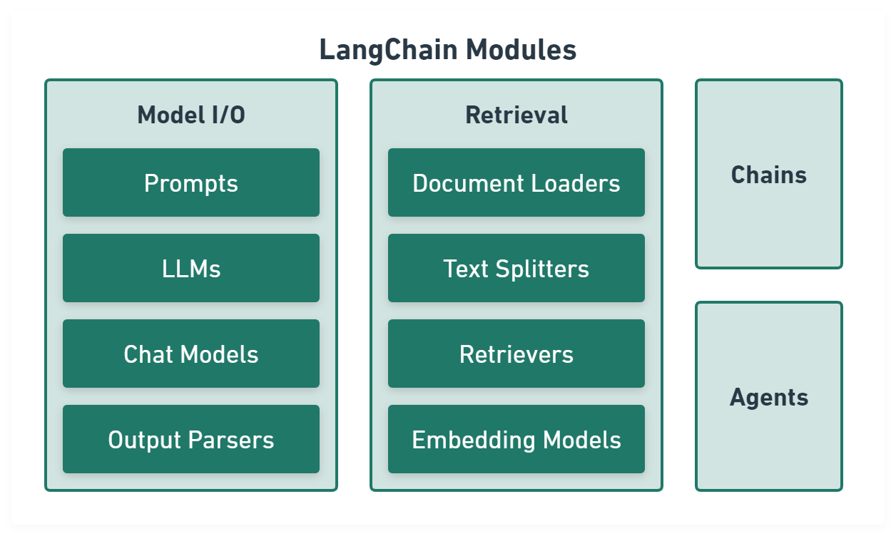](https://github.com/langchain-ai/langchainjs)

Model I/O module
normalize LLM inputs (e.g. prompts), APIs, and outputs (e.g. completions):


```ts
import { PromptTemplate } from '@langchain/core/prompts'
import { OpenAI } from '@langchain/openai'
import { CommaSeparatedListOutputParser } from '@langchain/core/output_parsers'

const template = PromptTemplate.fromTemplate(
  'List 10 {subject}.\n{format_instructions}',
)
const model = new OpenAI({ temperature: 0 })
const listParser = new CommaSeparatedListOutputParser()

const prompt = await template.format({
  subject: 'countries',
  format_instructions: listParser.getFormatInstructions(),
})

const result = await model.invoke(prompt)

const listResult = await parser.parse(result)
```

Retrieval module
help to process data alongside the user inputs,
making it easier to retrieve relevant information:


```ts
import { CSVLoader } from 'langchain/document_loaders/fs/csv'
import { RecursiveCharacterTextSplitter } from 'langchain/text_splitter'
import { OpenAIEmbeddings } from '@langchain/openai'
import { UpstashVectorStore } from '@langchain/community/vectorstores/upstash'
import { ScoreThresholdRetriever } from 'langchain/retrievers/score_threshold'

// CSV data.
const loader = new CSVLoader('path/to/example.csv')
const docs = await loader.load()

// Text splitter.
const splitter = new RecursiveCharacterTextSplitter({
  chunkSize: 10,
  chunkOverlap: 1,
})
const docs = await splitter.createDocuments(['...'])

// Embeddings and vector store.
const vectorStore = new UpstashVectorStore(new OpenAIEmbeddings())
await vectorStore.addDocuments(docs)
const retriever = ScoreThresholdRetriever.fromVectorStore(vectorStore, {
  minSimilarityScore: 0.9,
})
const result = await retriever.getRelevantDocuments('...?')
```

Chains module
link tasks together:


```ts
import { PromptTemplate } from '@langchain/core/prompts'
import { RunnableSequence } from '@langchain/core/runnables'
import { OpenAI } from '@langchain/openai'
import { CommaSeparatedListOutputParser } from '@langchain/core/output_parsers'

const template = PromptTemplate.fromTemplate(
  'List 10 {subject}.\n{format_instructions}',
)
const model = new OpenAI({ temperature: 0 })
const listParser = new CommaSeparatedListOutputParser()

const chain = RunnableSequence.from([template, model, listParser])

const result = await chain.invoke({
  subject: 'countries',
  format_instructions: listParser.getFormatInstructions(),
})
```

Agents module
is chains with a list of functions (called tools) it can execute,
while chains are hardcoded,
agents choose their actions with the help of an LLM:


```ts
import { VectorStoreToolkit, createVectorStoreAgent } from 'langchain/agents'

const toolkit = new VectorStoreToolkit(
  { name: 'Demo Data', vectorStore },
  model,
)
const agent = createVectorStoreAgent(model, toolkit)

const result = await agent.invoke({ input: '...' })
```

### LLM Platform

- OpenAI GPT [API](https://platform.openai.com).
- Google Gemini [API](https://ai.google.dev).
