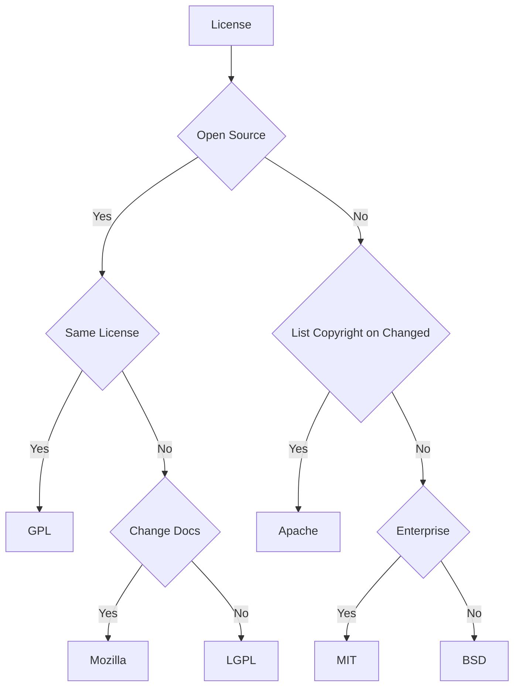

# Git Basic Notes

## Git Configuration

- `/etc/gitconfig`.
- `~/.gitconfig` 或 `~/.config/git/config`.
- `repo/.git/config`.

### Basic Configuration

```bash
git config --global user.name "sabertazimi"
git config --global user.email sabertazimi@gmail.com
git config --global core.autocrlf false
git config --global core.editor vim
git config --global credential.helper store
git config --global color.ui true
```

```bash
git config --global init.defaultBranch main
git config --global push.default simple
git config --global merge.conflictstyle diff3
git config --global pull.rebase true
git config --global rebase.autoStash true
```

```bash
git config --global alias.s "status"
git config --global alias.c "commit --verbose"
git config --global alias.a "add"
git config --global alias.rs "restore --staged"
git config --global alias.st "stash"
git config --global alias.pr "pull --rebase"
git config --global alias.rpo "remote prune origin"
```

```bash
git config --global commit.template $HOME/.gitmsg.md
git config --global commit.gpgsign true
git config --global gpg.program gpg
git config --global user.signingkey <pub-keyID>
```

```bash
# after 1s, git auto correct wrong command
git config --global help.autocorrect 10
```

### Proxy Configuration

```bash
# GitHub proxy.
git config --global url."https:/hub.fastgit.org/".insteadOf "https://github.com/"

# Socks5 proxy.
git config --global http.proxy 'socks5://127.0.0.1:1080'
git config --global https.proxy 'socks5://127.0.0.1:1080'

# Post buffer configuration.
git config --global http.postbuffer 524288000
git config --global https.postbuffer 1048576000
```

:::caution DNS Pollution

To fix `SSL_ERROR_SYSCALL in connection to github.com:443`:

- Ensure git configuration correct.
- Ensure socks5 proxy stay working.
- Change DNS server configuration (`8.8.8.8`).

:::

### List and Help

```bash
git config --list
git --help
man git-
git help
git help config
```

## Git Ignore File

文件 `.gitignore` 的格式规范如下：

- 所有空行或者以 # 开头的行都会被 Git 忽略.
- 可以使用标准的 glob 模式 (简化正则表达式) 匹配.
- 匹配模式可以以 `/` 开头防止递归.
- 匹配模式可以以 `/` 结尾指定目录.
- 要跟踪指定模式以外的文件或目录, 可以在模式前加上惊叹号 `!` 取反.
- GitHub gitignore [style](https://github.com/github/gitignore).

```bash
# no .a files
*.a

# but do track lib.a, even though you're ignoring .a files above
!lib.a

# only ignore the TODO file in the current directory, not subDir/TODO
/TODO

# ignore all files in the build/ directory
build/

# ignore doc/notes.txt, but not doc/server/arch.txt
doc/*.txt

# ignore all .pdf files in the doc/ directory
doc/**/*.pdf
```

## Add

- 交互式的选择 add 特定部分

```bash
git add -p
```

## Remove

完全删除文件

```bash
git rm filename
```

--cached: 保留磁盘文件(仅从 git 库移除文件)

```bash
git rm --cached filename
```

## Move

```bash
git mv old_path new_path
```

## Clean

Remove untracked files from the working tree:

```bash
# Remove untracked files:
git clean -f

# Remove untracked files and folders:
git clean -fd

# Dry run:
git clean -n
```

## Commit

- -a: 跳过暂存阶段(git add)
- -v: 显示详细 diff 信息

```bash
git commit -a -v
```

重新提交

```bash
git commit --amend -a -v
```

### Commit Style Guide

- [Conventional Commits Specification](https://github.com/conventional-commits/conventionalcommits.org)
- [Commit Linter](https://github.com/conventional-changelog/commitlint)
- [Commitizen: Conventional Commits CLI Tool](https://github.com/commitizen/cz-cli)
- [Commitizen Conventional Changelog](https://github.com/commitizen/cz-conventional-changelog)
- [Standard Version: Automate Versioning and CHANGELOG Generation](https://github.com/conventional-changelog/standard-version)

```bash
npm i -D standard-version
```

```bash
npx commitizen init cz-conventional-changelog --save-dev --save-exact
```

```md
<type>(<scope>): <subject>
(emptyLine)

<body>
  (emptyLine)
<footer>
```

#### Message Subject

no more than 50 characters

#### Commit Type

- feat: 新增了一个功能 (MINOR Version).
- fix: 修复了一个 bug (PATCH Version）.
- docs: 只是更改文档.
- style: 不影响代码含义的变化 (空白、格式化、缺少分号等).
- refactor: 代码重构, 既不修复错误也不添加功能.
- perf: 改进性能的代码更改.
- test: 添加确实测试或更正现有的测试.
- build: 影响构建系统或外部依赖关系的更改 (示例范围: gulp, broccoli, NPM).
- ci: 更改持续集成文件和脚本 (示例范围: Travis, Circle, BrowserStack, SauceLabs).
- chore: 其他不修改 src 或 test 文件 e.g `chore(release)`.
- revert: commit 回退.

#### Scope Values

- init
- runner
- watcher
- config
- web-server
- proxy
- empty

#### Message Body

- uses the imperative, present tense: “change” not “changed” nor “changes”
- includes **motivation** for the change and contrasts with previous behavior

#### Message Footer

- referencing issues e.g. close #666, #888
- BREAKING CHANGE (`<type>!`) (MAJOR Version)
  e.g.`port-runner` command line option has changed to `runner-port`,
  so that it is consistent with the configuration file syntax.
  To migrate your project, change all the commands, where you use `--port-runner`
  to `--runner-port`.

### Git Commit Tool

[Commitizen CLI](https://github.com/commitizen/cz-cli):

```bash
npm i -g commitizen cz-conventional-changelog
echo '{ "path": "cz-conventional-changelog" }' > ~/.czrc
git cz # replace for `git commit`
```

[CommitLint](https://github.com/conventional-changelog/commitlint):

```bash
yarn add -D @commitlint/config-conventional @commitlint/cli
echo "module.exports = {extends: ['@commitlint/config-conventional']}" > commitlint.config.js

yarn add -D husky
yarn husky install
yarn husky add .husky/commit-msg 'yarn commitlint --edit "$1"'
```

[Husky](https://github.com/typicode/husky):

```bash
npx husky-init
npx husky add .husky/pre-commit "lint-staged"
npx husky add .husky/commit-msg 'npx --no-install commitlint --edit "$1"'
```

```json
{
  "husky": {
    "hooks": {
      "pre-commit": "lint-staged"
    }
  },
  "lint-staged": {
    "*.{js,jsx,ts,tsx}": ["eslint --fix", "prettier --write"],
    "*.{md,mdx}": ["prettier --write"]
  }
}
```

### Git Commit Emoji

- [GitEmoji](https://github.com/carloscuesta/gitmoji)

| Commit type              | Emoji                                         |
| :----------------------- | :-------------------------------------------- |
| Initial commit           | :tada: `:tada:`                               |
| Version tag              | :bookmark: `:bookmark:`                       |
| New feature              | :sparkles: `:sparkles:`                       |
| Bugfix                   | :bug: `:bug:`                                 |
| Metadata                 | :card_index: `:card_index:`                   |
| Documentation            | :books: `:books:`                             |
| Documenting source code  | :bulb: `:bulb:`                               |
| Performance              | :racehorse: `:racehorse:`                     |
| Cosmetic                 | :lipstick: `:lipstick:`                       |
| Tests                    | :rotating_light: `:rotating_light:`           |
| Adding a test            | :white_check_mark: `:white_check_mark:`       |
| Make a test pass         | :heavy_check_mark: `:heavy_check_mark:`       |
| General update           | :zap: `:zap:`                                 |
| Improve format/structure | :art: `:art:`                                 |
| Refactor code            | :hammer: `:hammer:`                           |
| Removing code/files      | :fire: `:fire:`                               |
| Continuous Integration   | :green_heart: `:green_heart:`                 |
| Security                 | :lock: `:lock:`                               |
| Upgrading dependencies   | :arrow_up: `:arrow_up:`                       |
| Downgrading dependencies | :arrow_down: `:arrow_down:`                   |
| Lint                     | :shirt: `:shirt:`                             |
| Translation              | :alien: `:alien:`                             |
| Text                     | :pencil: `:pencil:`                           |
| Critical hotfix          | :ambulance: `:ambulance:`                     |
| Deploying stuff          | :rocket: `:rocket:`                           |
| Fixing on MacOS          | :apple: `:apple:`                             |
| Fixing on Linux          | :penguin: `:penguin:`                         |
| Fixing on Windows        | :checkered_flag: `:checkered_flag:`           |
| Work in progress         | :construction: `:construction:`               |
| Adding CI build system   | :construction_worker: `:construction_worker:` |
| Removing a dependency    | :heavy_minus_sign: `:heavy_minus_sign:`       |
| Adding a dependency      | :heavy_plus_sign: `:heavy_plus_sign:`         |
| Docker                   | :whale: `:whale:`                             |
| Configuration files      | :wrench: `:wrench:`                           |
| Package.json in JS       | :package: `:package:`                         |
| Bad code                 | :poop: `:poop:`                               |
| Reverting changes        | :rewind: `:rewind:`                           |
| Breaking changes         | :boom: `:boom:`                               |
| Code review changes      | :ok_hand: `:ok_hand:`                         |
| Accessibility            | :wheelchair: `:wheelchair:`                   |
| Move/rename repository   | :truck: `:truck:`                             |

## Stash

临时地保存一些还没有提交的工作,
以便在分支上不需要提交未完成工作就可以清理工作目录:

- git stash: 备份当前的工作区的内容, 将当前的工作区内容保存到 Git 栈
- git stash apply/pop: 从 Git 栈中读取最近一次保存的内容, 恢复工作区的相关内容
- git stash branch `<branch>`: 新建分支, 并在该分支上恢复储藏内容
- git stash list: 显示 Git 栈内的所有备份
- git stash clear: 清空 Git 栈

```bash
# git stash popup
git stash show -p stash@{0} | git apply -R
```

Pop a single file:

```bash
git restore -s stash@{0} -- <filename>
git checkout stash@{0} -- <filename>
```

## Revert

- 重新提交前 n 次的 commit

```bash
git revert -n
```

## Reset

```bash
git reset $(git merge-base master $(git rev-parse --abbrev-ref HEAD))
```

- `git rev-parse --abbrev-rev HEAD`
  will return the name of the branch currently on.
- `git merge-base master $(name of your branch)`
  will find the best common ancestor between master and current branch.
- `git reset $(hash of the branch creation)`
  will undo all the commits, merges, rebase
  (preserving changes to the code).

## Log

- -p: 打印 diff 差异信息
- -n: n 为十进制数字,显示最近 n 次信息
- --stat: 打印简略统计信息
- --graph: 显示分支合并历史
- --pretty=: 设置日志格式
- --author=: 指定作者
- --committer=: 指定提交者
- --after=/--since=: 限制日志时间
- --before=/--until=: 限制日志时间 "2008-01-15" "2 years 1 day 3 minutes ago"
- --decorate: 查看各个分支当前所指的对象(commit object)
- --help

```bash
git log -p --stat --graph --pretty=format:"%h - %an, %ar : %s" --since=2.weeks path_name
```

### Pretty Format

| 选项 | 说明                                        |
| :--- | :------------------------------------------ |
| %H   | 提交对象(commit)的完整哈希字串              |
| %h   | 提交对象的简短哈希字串                      |
| %T   | 树对象(tree)的完整哈希字串                  |
| %t   | 树对象的简短哈希字串                        |
| %P   | 父对象(parent)的完整哈希字串                |
| %p   | 父对象的简短哈希字串                        |
| %an  | 作者(author)的名字                          |
| %ae  | 作者的电子邮件地址                          |
| %ad  | 作者修订日期 (可以用\|-date=\|选项定制格式) |
| %at  | 作者修订日期 (ms)                           |
| %ar  | 作者修订日期, 按多久以前的方式显示          |
| %cn  | 提交者(committer)的名字                     |
| %ce  | 提交者的电子邮件地址                        |
| %cd  | 提交日期                                    |
| %cr  | 提交日期,按多久以前的方式显示               |
| %s   | 提交说明                                    |

### Log Options

| 选项               | 说明                                                    |
| :----------------- | :------------------------------------------------------ |
| -p                 | 打印 diff 差异信息                                      |
| -n                 | n 为十进制数字,显示最近 n 次信息                        |
| --stat             | 打印简略统计信息                                        |
| --graph            | 显示分支合并历史                                        |
| --pretty=          | 设置日志格式                                            |
| --author=          | 指定作者                                                |
| --committer=       | 指定提交者                                              |
| --after=/--since=  | 限制日志时间                                            |
| --before=/--until= | 限制日志时间 "2008-01-15" "2 years 1 day 3 minutes ago" |
| --help             |                                                         |

### Log Filter

#### Log by Amount

```bash
git log -3
```

#### Log by Date

- `before` and `until`
- `after` and `since`

```bash
git log --before="yesterday"
git log --after="1 week ago"
git log --after="2014-7-1" --before="2014-7-4"
```

#### Log by Author

```bash
git log --author="John\|Mary"
```

#### Log by Commit Message

```bash
git log --grep="feat"
git log --grep="fix"
```

#### Log by File

```bash
git log -- src/components/ErrorBoundary/ErrorBoundary.test.tsx
git log -- "*.test.tsx"
```

#### Log by Content

```bash
git log -S"Hello, World!"
```

#### Log by Range

```bash
git log main..feature
```

## Reflog

分析你所有分支的头指针的日志来查找出你在重写历史上可能丢失的提交:

`git reflog show` is an alias for
`git log -g --abbrev-commit --pretty=oneline`.
`git reflog` is useful for trace local git manipulation history.

```bash
git reflog
git reset HEAD@{index}
```

## Show

- 查看其他分支 或 提交点的文件状态

```bash
git show branchName/commitHash:fileName
```

## Alias

- !: 执行外部命令

```bash
git config --global alias.co checkout
git config --global alias.br branch
git config --global alias.ci commit
git config --global alias.st status

git config --global alias.unstage 'reset HEAD --'
git config --global alias.last 'log -1 HEAD'

git config --global alias.visual '!gitk'
```

## Remote

添加与删除远程仓库源:

```bash
git remote add <shortname> <remote-url>
git remote rm <shortname>
```

显示仓库信息:

```bash
git remote show [remote-name]
```

重命名仓库缩写名:

```bash
git remote rename <old> <new>
```

## Pull

拉取变更:

```bash
git pull [remote-name]
git pull --rebase
git pull --allow-unrelated-histories
```

## Fetch

```bash
git fetch <repo_name> <branch_name>
```

## Merge

合并的结果是生成一个新的快照 (并提交) (新的提交对象).

## Rebase

切换到工作分支, 编码开发新特性:

```bash
git checkout feature-branch
```

新特性开发完毕, 变基操作以简洁提交历史:

```bash
git rebase master
git rebase [baseBranch] [topicBranch]
```

切换到主分支, 合并特性分支:

```bash
git checkout master
git merge feature-branch
```

Pull with auto rebase and auto stash:

```bash
git pull --rebase --autostash
```

## Push

推送变更:

```bash
git push [remote-name] [local-branch-name]:[remote-branch-name]
```

从本地操作, 删除远程仓库的分支:

```bash
git push origin --delete [remote-branch-name]
```

保存推送密码:

```bash
git config --global credential.helper store
```

## Branch

### Basic Branch Workflow

#### Basic Branch

创建新分支

```bash
git branch <new-branch-name>
```

删除分支

```bash
git branch -d <branch-name>
git push origin --delete <remote-branch-name>
```

切换分支

```bash
git checkout <branch-name>
```

切换到新分支

```bash
git checkout -b <new-branch-name>
```

打印分支信息

```bash
git branch -v(详细信息) -vv(详细远程信息) --merged(显示合并至当前分支的分支) --no-merged(显示未合并至当前分支的分支)
```

#### Remote Branch

- Show all remote branch:

```bash
git branch -r
```

本地分支跟踪远程分支(在此本地分支上运行 git pull 自动抓取), 2 种方式:

- 设置当前所在本地分支跟踪某一远程分支

```bash
git branch -u [remoteName]/[branch]
```

- 创建并切换至新的本地分支(跟踪某一远程分支)
  - --track: 本地分支由 git 自动命名
  - -b: 本地分支由创建者命名

```bash
git checkout --track [new-local-branch]

git checkout -b [new-local-branch] [remoteName]/[branch]
```

- Delete remote branch

```bash
git push --delete origin [remote-branch-name]
```

#### Upstream Branch

```bash
git status -sb
git branch -avv
git remote show origin
```

### Advanced Branch Workflow

[Git Flow Extension](https://github.com/nvie/gitflow):

1. master 类型分支, 名为 `?|master` 或 `master`, 其中 `?` 为开发代号.
2. develop 类型分支, 名为 `?|develop` 或 `develop`, 其中 `?` 为开发代号.
3. feature 类型分支, 名为 `feature/*` 或 `?|feature/*` , 其中 `*` 为特征描述.
4. release 类型分支, 名为 `release-*` 或 `?|release-*` , 其中 `*` 为要发布的版本号.
5. hotfix 类型分支, 名为 `hotfix-*` 或 `?|hotfix-*` , 其中 `*` 为要发布的版本号.
6. issues 类型分支, 名为 `issues/*` 或 `?|issues/*` , 其中 `*` 为问题描述.
7. trials 类型分支, 名为 `?%trials.*`, `?` 为此分支的父分支, `*` 为描述的名称 (或直接为 `?%trials`).
8. basedOn 类型分支, 名为 `basedOn` 或 `?|basedOn`, `?` 为其来源的 master 分支的开发代号.
9. work 类型分支, 名为 `work.***/basedOn-?-*` , `***` 代表此描述此 work 的名称,
   `?` 为其所基于的分支的开发代号, 最后一个 `*` 代表其在 `?|basedOn` 上所基于的分支的版本号或状态名.

#### Master Branch and Develop Branch

_多长期分支模式_:
master 分支与 develop 分支都是长期分支,
区别在于分支的**稳定性等级**, master > develop.

e.g master/develop/next

- 每一次的提交都必须有意义

git 在每次提交的时候要求输入对此提交的概括, 这个概括不能为空.

正确的提交概括：更新了程序 doc
错误的提交概括：updates

- 开发型任务中的 master 类型与 develop 类型分支必须成对出现,
  master 分支的推进只能来源与 release 分支和 hotfix 分支的合并, 禁止在 master 分支上直接提交

master 分支上只有我们推送上去的稳定版本的程序, develop 分支上的程序一直处于开发状态, 不稳定.
在开发型任务中使用 gg-init 进行版本控制的初始化, 建立配套的 master ～ develop 分支对.
在使用型任务中使用 gg-work-init 进行版本控制的初始化,
拉取需要使用的稳定版本程序的 master 分支, 并初始化对应的 basedOn 分支（见 9）.

#### Feature Branch

1. 只能从 develop 类型分支上创建.
2. 最终必须合并到 develop 类型分支.
3. 最终分支被删除.

每当有新特性需要加入的时候,
我们应该从 develop 类型分支上新建一个 feature 类型分支,
完成新特性的开发和测试后将特性合并到 develop 类型分支上.

在 develop 类型分支上使用 gg-feature-open featureName 建立并转向一个名为 feature/featureName 的新分支
在一个 feature 类型分支上使用 gg-feature-close 把这个分支的工作合并到 develop 类型分支上,
删除此分支, 完成一个特性的开发.

#### Release Branch

1. 只能从 develop 类型分支上创建.
2. 最终必须同时合并到 master 类型分支 (发布新的版本) 和 develop 类型分支 (基于新版本的进一步开发).
3. 最终分支被删除.

每当工作进入到一个较为稳定阶段的时候, 可以使用 gg-release-open versionNum 建立一个名为 release-versionNum 的临时分支,
在这个分支上允许进行小的改动 (比如修改一下 readme 文件中的版本号),
然后使用 gg-release-close 将此版本合并（发布）到 master 类型分支上, 同时合并到 develop 类型分支上, 然后删除此分支.

#### Hotfix Branch

1. 只能从 master 类型分支上创建.
2. 最终必须同时合并到 master 类型分支(发布新的热补丁版本)和 develop 类型分支(基于新版本的进一步开发).
3. 最终分支被删除.

当新版本发布后发现必须马上解决的严重 bug 时,
使用 gg-hotfix-open versionNum 建立名为 hotfix-versionNum 的临时分支,
在这个分支上完成 bug 的修复,
然后使用 gg-hotfix-close 将此版本合并（发布）到 master 类型分支上,
同时合并到 develop 类型分支上, 然后删除此分支.

#### Issues Branch

1. 只能从 develop 类型分支上创建.
2. 最终必须合并到 develop 类型分支.
3. 最终分支被删除.

每当有（比较复杂的）问题需要解决的时候,
应该从 develop 类型分支上新建一个 issues 类型分支,
完成问题的调试后合并到 develop 类型分支上.

在 develop 类型分支上使用 gg-issues-open featureName 建立并转向一个名为 issues/issuesName 的新分支,
在一个 issues 类型分支上使用 gg-issues-close 把这个分支的工作合并到 develop 类型分支上,
然后删除此分支, 解决了一个复杂的问题.
issues 类型和 feature 类型的实现方式一模一样, 仅仅有名字上面的差别.

#### Trials Branch

- 可以从除了 release 类型分支以外的任何类型分支上创建.
- 在这个分支上请发挥想象力大胆实验:
  - 接受实验结果, 把实验过程并入父分支, 称为 good-close.
  - 实验结果不理想, 放弃实验结果, 从实验开始前重新来过, 称为 bad-close.
- 最终分支被删除.

在满足条件的分支 A 上工作, 时不时会冒出一些大胆的想法.
这个时候使用 gg-trials-open trialsName 创建并转向一个名为 A/trials.trialsName 的实验分支,
在这个分支上进行疯狂的实验.

#### BasedOn Branch

1. 从 name|master 建立并初始化为 name|basedOn.
2. 只能从对应的 master 分支 fork 到此分支.
3. 禁止在这个分支上提交.

这个分支是一个为了使工作流程更为清晰的缓存分支,
分支上只有从 master 稳定分支上挑选出来的自己在工作中将要（尝试）使用的稳定版本.
在 basedOn 类型分支上使用 gg-select 版本号,
从对应的 master 分支上选出一个稳定版本或使用 gg-select-the-latest 从对应的 master 分支上选择最新的版本 fork 到这个分支,
并加上 inUse-versionNum 的标签.
从 master 到此分支的行为是 fork,
即有可能此分支的 log 为
`(init)v1.0===>v0.9=====>v0.8======>v1.3`,
这个分支上的 commit 来源于 master, 但是其分支提交历史与 master 分支无关.

#### Work Branch

1. 只能从 basedOn 类型分支上创建.
2. 可以借助 basedOn 分支升级.

## Tag

列出标记及其信息

```bash
git tag
git tag -l "v1.8-"
git show <tagName(v1.4)>
```

创建标签:

- 不加-m 会调用 core.editor)
- 省略 commit 序列,标签添加至最新提交

创建附注(annotated)标签

```bash
git tag -a <tagName(v1.4)> [commit序列]
```

创建轻量(lightweight)标签

```bash
git tag <tagName(v1.4)> [commit序列]
```

共享标签至远程库

```bash
git push [remote-name] <tagName>
git push [remote-name] --tags
git push --follow-tags
```

## Submodule

管理一个仓库的其他外部仓库.
它可以被用在库或者其他类型的共享资源上.
submodule 命令有几个子命令, 如 (add/update/sync)
用来管理这些资源.

- add submodule

```bash
git submodule add git://github.com/rack/rack.git ./lib/rack
cat .gitmodules
```

- get submodule

```bash
git submodule init
git submodule update
```

- sync submodule

```bash
git pull origin/master --rebase
git submodule update
```

```bash
git submodule update --init --force --remote
```

## Diff

查看未暂存(un-staged)差异

```bash
git diff
```

查看已暂存(staged)差异

```bash
git diff --staged
```

显示空白字符错误(space/tab/return)

```bash
git diff --check
```

```bash
diff -u <src> <dist>
diff -Nur <src_dir> <dist_dir>
```

## Patch

```bash
patch -p[num] < patchFile
patch -dry -run -p[num] < patchFile
```

```bash
diff -Nur program_1.0 program_2.0 > program_2.0.patch
patch -p1 <../program_2.0.patch
```

- `git format-patch`:
  mailbox 的格式来生成一系列的补丁以便你可以发送到一个邮件列表中.
- `git am`:
  应用来自邮箱的补丁.
- `git apply`:
  应用一个通过 git diff 或者甚至使用 GNU diff 命令创建的补丁.

## Bisect

通过二分查找快速定位问题提交:

```bash
git bisect start
git bisect good 42bf0c8df2
git bisect bad 57613f8c56
git bisect good # Current commit is good.
git bisect bad # Current commit is bad.
```

## Reverse List

Lists commit objects in reverse chronological order:

```bash
git rev-list --count HEAD
git rev-parse --short HEAD
```

## Filter Branch

根据某些规则来重写大量的提交记录,
例如从任何地方删除文件,
或者通过过滤一个仓库中的一个单独的子目录以提取出一个项目:

```bash
git rev-list --objects --all
\ | grep "$(git verify-pack -v .git/objects/pack/*.idx
\ | sort -k 3 -n | tail -5 | awk '{print$1}')"
git filter-branch -f --prune-empty --index-filter
\ 'git rm -rf --cached --ignore-unmatch your-file-name'
\ --tag-name-filter cat -- --all
```

## Cherry Pick

获得在单个提交中引入的变更, 然后尝试将作为一个新的提交引入到你当前分支上.

## GitHub

### GPG Usage

[Generate new GPG key](https://docs.github.com/authentication/managing-commit-signature-verification/generating-a-new-gpg-key):

```bash
# Generate GPG key
gpg --full-generate-key
# List GPG keys
gpg --list-secret-keys --keyid-format=long

# Export GPG public key as an ASCII armored version
gpg --armor --export <pub-keyID>
# Copy output to GitHub GPG textarea

# Export GPG private key as an ASCII armored version
# gpg --armor --export-secret-key sabertazimi@gmail.com -w0

# Git global configuration for GPG signature commits
git config --global commit.gpgsign true
git config --global gpg.program gpg
git config --global user.signingkey <pub-keyID>

# WSL2 fix: Add to ~/.zshrc
export GPG_TTY=$(tty)

# Import GitHub signature
curl https://github.com/web-flow.gpg | gpg --import
# gpg --sign-key <GitHub-keyID>
gpg --sign-key 4AEE18F83AFDEB23

# Log git signature
git log --show-signature

# Single signature commit
git commit -S -m "..."
```

[Update existing GPG key](https://inspirezone.tech/using-gpg-keys-on-github):

```bash
gpg --edit-key <pub-keyID>
> expire
> passwd
> save
```

After this
[update](https://github.blog/changelog/2022-05-31-improved-verification-of-historic-git-commit-signatures)
commits signed with expired GPG key (before it expired)
no longer become `unverified` state.

### LICENSE

#### Popular LICENSE




#### Unique LICENSE

- CC BY-NC-SA 3.0 License

```html
<a rel="license" href="http://creativecommons.org/licenses/by-nc-sa/3.0/"
  ></a
><br />This work is licensed under a
<a rel="license" href="http://creativecommons.org/licenses/by-nc-sa/3.0/"
  >Creative Commons Attribution-NonCommercial-ShareAlike 3.0 Unported License</a
>.
```

```md
Homework Public License(HPL)

Copyright (c) 2016 Sabertaz

This is for your reference only,not for your cheating.

Don't:

1a. Outright copyright infringement - Don't just copy this and change the name.
1b. Reserve a copy of this project and tell your teacher
that it is your own homework - Plagiarism is shame.

If you become rich through modifications, related work services,
or supporting the original work, share the love. Only a poor guy would make loads
off this work and not buy the original works creator(s) a pint.Code is
provided with no warranty. Using somebody else's code and bitching when it
goes wrong makes you stupid. Fix the problem yourself.
```

```md
The Star And Thank Author License (SATA)

Copyright (c) 2016 sabertazimi(sabertazimi@gmail.com)

Project Url: https://github.com/sabertazimi/Awesome-Notes

Permission is hereby granted, free of charge, to any person obtaining a copy
of this software and associated documentation files (the "Software"), to deal
in the Software without restriction, including without limitation the rights
to use, copy, modify, merge, publish, distribute, sublicense, and/or sell
copies of the Software, and to permit persons to whom the Software is
furnished to do so, subject to the following conditions:

The above copyright notice and this permission notice shall be included in
all copies or substantial portions of the Software.

And wait, the most important, you shall star/+1/like the project(s) in project url
section above first, and then thank the author(s) in Copyright section.

Here are some suggested ways:

- Email the authors a thank-you letter, and make friends with him/her/them.
- Report bugs or issues.
- Tell friends what a wonderful project this is.
- And, sure, you can just express thanks in your mind without telling the world.

Contributors of this project by forking have the option to add his/her name and
forked project url at copyright and project url sections, but shall not delete
or modify anything else in these two sections.

THE SOFTWARE IS PROVIDED "AS IS", WITHOUT WARRANTY OF ANY KIND, EXPRESS OR
IMPLIED, INCLUDING BUT NOT LIMITED TO THE WARRANTIES OF MERCHANTABILITY,
FITNESS FOR A PARTICULAR PURPOSE AND NONINFRINGEMENT. IN NO EVENT SHALL THE
AUTHORS OR COPYRIGHT HOLDERS BE LIABLE FOR ANY CLAIM, DAMAGES OR OTHER
LIABILITY, WHETHER IN AN ACTION OF CONTRACT, TORT OR OTHERWISE, ARISING FROM,
OUT OF OR IN CONNECTION WITH THE SOFTWARE OR THE USE OR OTHER DEALINGS IN
THE SOFTWARE.
```

### Teamwork

如果在组织的托管空间创建版本库, 一定要要为版本库指派一个拥有 Push 权限的团队,
以免以 `Fork + Pull` 模式工作时, Pull Request 没有人响应.

#### Pull Request Work Flow

1. Fork it.
2. Create your feature branch (`git checkout -b my-new-feature`).
3. Ensure tests are passing.
4. Commit changes (`git commit -am 'Add some feature'`).
5. Push to the branch (`git push origin my-new-feature`).
6. Create new Pull Request.
7. Check `Allow edits from maintainers`.

### GitHub CLI Tool

#### CLI Installation

Install `gh` by `apt`,
according of [official introduction](https://github.com/cli/cli/blob/trunk/docs/install_linux.md).

```bash
gh auth login
```

#### GH Issue Usage

```bash
gh issue create
gh issue close
gh issue status
gh issue list
```

#### GH PR Usage

```bash
gh pr checkout
gh pr create
gh pr close
gh pr merge
gh pr status
gh pr list
```

#### GH Repo Usage

Clone repo:

```bash
gh repo clone cli/cli

# fastest way to clone authorized user repos
gh alias set rc 'repo clone'
gh rc dragon
```

Create repo:

```bash
# create a repository under your account using the current directory name
$ git init my-project
$ cd my-project
$ gh repo create

# create a repository with a specific name
$ gh repo create my-project

# create a repository in an organization
$ gh repo create cli/my-project

# disable issues and wiki
$ gh repo create --enable-issues=false --enable-wiki=false
```

Push repo:

```bash
git init

echo "# RepoName" >> README.md
git add README.md
git commit -m "Initial commit"

git remote add origin git@github.com:username/RepoName.git
git push -u origin master
```

List repo:

```bash
gh repo list sabertazimi
```

### Wiki

#### Wiki Git Access

```bash
git clone git@github.com:user/repo.wiki.git
```

### Shorten GitHub URL

```bash
curl -i http://git.io -F "url=https://github.com/technoweenie" -F "code=t"
```

### GitHub Flavored Markdown

#### Link

##### Tooltip of Link

```md
This is a [link to a web page](https://url.com 'This title will appear as a tooltip').
```

```md

```

##### Label of Link

```md
This is a [link to a web page][mylabel].

Then at the end of the document …

[mylabel]: https://url.com 'Optional title'
[mylabel]: https://url.com 'Optional title'
```

```md
![Alt text][mylabel]

[mylabel]: https://imageurl.com 'This is a title'
```

### GitHub Pages

In `https://github.com/<user>/<repo>/settings/pages`,
setup `source` of pages and `Enforce HTTPS`.

### GitHub Git Attributes

`.gitattributes`:

```bash
*.md linguist-detectable=true
*.md linguist-documentation=false
```

### GitHub Actions

```yml
name: Dependencies

on:
  schedule:
    - cron: '0 0 * * 1'
  workflow_dispatch:

jobs:
  update:
    name: Update
    runs-on: ubuntu-latest
    steps:
      - name: Checkout repository
        uses: actions/checkout@v2
        with:
          submodules: true
          fetch-depth: 1
      - name: Setup Node environment
        uses: actions/setup-node@v2
        with:
          node-version: 16
          architecture: x64
          registry-url: https://registry.npmjs.org/
          cache: yarn
      - name: Install dependencies
        run: |
          yarn
      - name: Update dependencies
        run: |
          yarn up '*'
      - name: Create pull request
        uses: peter-evans/create-pull-request@v3.1.0
        with:
          commit-message: 'build(deps): update all dependencies'
          branch: build/deps-update
          delete-branch: true
          title: 'build(deps): update all dependencies'
          body: An updated update of all NPM dependencies.
          labels: dependencies
          assignees: sabertazimi
          reviewers: sabertazimi
```

```yml
name: Deploy to Vercel
uses: amondnet/vercel-action@v20
with:
  vercel-token: ${{ secrets.VERCEL_TOKEN }}
  vercel-args: ${{ fromJSON('["--prod", ""]')[github.ref != 'refs/heads/main'] }}
  vercel-org-id: ${{ secrets.VERCEL_ORG_ID }}
  vercel-project-id: ${{ secrets.VERCEL_PROJECT_ID }}
  scope: ${{ secrets.VERCEL_ORG_ID }}
  working-directory: ./
```

### GitHub Dependabot

```yml
version: 2
updates:
  - package-ecosystem: npm # See documentation for possible values
    directory: / # Location of package manifests
    schedule:
      interval: weekly
      day: sunday
      time: '14:00'
      timezone: Asia/Shanghai
    open-pull-requests-limit: 10
    versioning-strategy: increase
    assignees:
      - sabertazimi
```

### GitHub Copilot

- GitHub Copilot usage [tips](https://github.blog/2024-03-25-how-to-use-github-copilot-in-your-ide-tips-tricks-and-best-practices).

## Git Internals

### Git Objects

`.git/objects` is immutable, `.git/refs` is mutable.

`blob`持有文件的内容,`树对象`是一个包含`blob`对象和`子树对象`的目录列表.
`提交对象`是工作目录的一个快照, 包含了一些像时间或提交信息这样的元数据.
`分支`是`提交对象`的命名引用.
`工作目录`是一个目录, 有着相应的仓库, `暂存区`(索引)为下一个`提交对象`持有对应的`树对象`,
而仓库就是一个`提交对象`的集合.

[](https://github.blog/2022-08-29-gits-database-internals-i-packed-object-store)

```bash
git hash-object 创建blob对象
git cat-file -t
git cat-file -p
git update-index --add --cache-info 将文件添加至暂存区
git write-tree 创建tree对象
git commit-tree 创建commit对象

$ git hash-object -w --stdin
Hello, world!
af5626b4a114abcb82d63db7c8082c3c4756e51b

$ git cat-file -t af5626b4a114abcb82d63db7c8082c3c4756e51b
blob

$ git cat-file -p af5626b4a114abcb82d63db7c8082c3c4756e51b
Hello, world!
```

```bash
# -w for write into codebase,
# --stdin for reading from stdin not file
echo 'test content' | git hash-object -w --stdin
git cat-file -p <object-hash-number>
```

```bash
#!/bin/bash

function separator() {
    for i in {1..20}
    do
        printf "-"
    done
    printf $1
    for i in {1..20}
    do
        printf "-"
    done
    printf "\n"
}

function git_object_type() {
    printf "type => "
    git cat-file -t $1
    for i in {1..40}
    do
        printf "-"
    done
    printf "\n"
}

function git_object_content() {
    git cat-file -p $1
}

function print_git_objects() {
    files=$(git rev-list --parents --objects HEAD | awk '{print $1}')
    index=0

    for file in $files
    do
        len=$(expr length "$file")

        if [ $len -gt 30 ]
        then
            index=$(expr $index + 1)
            separator $index
            echo $file
            git_object_type $file
            git_object_content $file
        fi
    done
}

print_git_objects
```

### Git Packfiles

Each `*.pack` file in `.git/objects/pack/`
is called a `packfile`.
Packfiles store multiple objects in compressed forms.

The pack-index `.idx` operates
like a query index that speeds up read queries
that rely on the primary key (object ID).


### Add Inside

- create blob objects: contains content of files
- add files to index list (.git/index)

### Commit Inside

- create tree objects: each object represent a directory,
  contains blob object refs in this directory
- create commit object:
  contains root tree object hash number and parent commit object hash number

### Checkout Inside

```bash
git checkout <commit-hash-id>
```

- get commit object by commit hash id
- get root tree object in commit object
- write file entries by root tree object (tree graph)
- write .git/index
- set HEAD to that commit (detached HEAD state)

```ts
// Get file commit history
const Git = require('nodegit')
let repo

Git.Repository.open(path.resolve('./.git'))
  .then((r) => {
    repo = r
    return repo.getMasterCommit()
  })
  .then((firstCommitOnMaster) => {
    const walker = repo.createRevWalk()
    walker.push(firstCommitOnMaster.sha())
    walker.sorting(Git.Revwalk.SORT.Time)

    return walker.fileHistoryWalk(historyFile, 2)
  })
  .then((resultingArrayOfCommits) => {
    if (resultingArrayOfCommits.length > 0) {
      const commit = resultingArrayOfCommits[0].commit
      const date = commit.date()
    }
  })

function getGitLastUpdatedTimeStamp(filePath) {
  let lastUpdated = 0

  try {
    lastUpdated
      = Number.parseInt(
        spawn
          .sync('git', ['log', '-1', '--format=%at', path.basename(filePath)], {
            cwd: path.dirname(filePath),
          })
          .stdout.toString('utf-8')
      ) * 1000
  } catch (e) {
    /* do not handle for now */
  }

  return lastUpdated
}
```

### Merge Inside

```bash
git merge <giver-branch>/<giver-commit>
```

- write giver commit hash to `.git/MERGE_HEAD`
- find base commit (the most recent common ancestor commit)
- diff and apply according to base commit, giver commit, receiver commit
- do what `git checkout` do
- remove `.git/MERGE_HEAD`

### Fetch Inside

- get hash of remote commit and its root tree object
- copy all diff objects in tree graph into .git/objects
- update `.git/refs/remotes/origin/<branch>`, set `.git/FETCH_HEAD` to it

### Clone Inside

`git init` + `git remote add origin <repo-url>` + `git pull origin`

### Push Inside

- apply commit to remote repo
- update remote repo `.git/refs/heads/<branch>` to new commit
- update local repo `.git/refs/remotes/origin/<branch>` to new commit

### Branch Inside

- HEAD -> refs/heads/master -> commit object
- branches are just refs, refs are just files (contain commit hash id)
