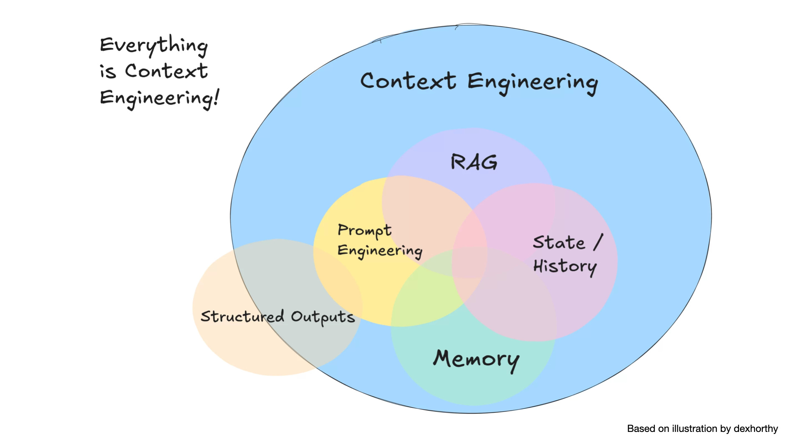

# Context

注意力计算复杂度是 $O(n^2)$, 且是稀疏的 (模型不会均匀地关注所有输入):

- 上下文窗口受硬件边界限制.
- 有效上下文小于标称上下文: coding agent 只能有效利用其中的 10-15 $\%$.
- `Lost in the middle`: 中间内容容易被忽略, 更关注开头和结尾.

## Engineering

LLM 并未统一利用其上下文,
它们的准确性和可靠性会[随着输入令牌数量的增加而下降](https://research.trychroma.com/context-rot),
称之为上下文腐烂 (`Context Rot`).

因此, 仅仅在模型的上下文中拥有相关信息是不够的:
信息的呈现方式对性能有显著影响.
这凸显了 `上下文工程` 的必要性,
优化相关信息的数量并最小化不相关上下文以实现可靠的性能:

- System instructions.
- Tool definitions.
- Few-shot examples.
- User prompt.
- Conversation history.
- Short-term memory.
- Long-term memory.
- External knowledge.
- Tool outputs.
- Sub-agent outputs.
- Artifacts.

[](https://addyo.substack.com/p/how-good-is-ai-at-coding-react-really)

:::tip[Planning with Files]

[Manus](https://manus.im/blog/Context-Engineering-for-AI-Agents-Lessons-from-Building-Manus):

1. Design around **KV-cache**:
   - 稳定内容放前面: system prompt, tool definitions.
   - 动态内容放后面: chat history, user input.
   - 避免在稳定前缀中插入可变内容: e.g. 禁止在 system prompt 中插入时间戳.
2. **Plan** is required
3. **Files** are memory
4. Don't get few-shotted: get rid of repetitive actions
5. Manipulate attention through **recitation**

```md
Start of context: [Original goal - far away, forgotten]
...many tool calls...
End of context: [Recently read task_plan.md - gets ATTENTION!]
```

:::

## Session

Immediate dialogue history and working memory for single and continuous conversation:

- Chronological history (**events**): user input, agent response, tool call, tool output.
- Working memory (**state**).

### Compression

由于上下文窗口限制、API 费用、生成延迟、生成质量等因素,
过多的上下文会显著增加成本、延迟、噪声和误差,
需要对会话进行压缩:

- Keep last N turns.
- Token-based truncation.
- Recursive summarization.
- Trigger: count, time, event.

## Personalization

Meta-prompting for [memory extraction](https://cookbook.openai.com/examples/agents_sdk/context_personalization#2-shape-of-a-memory):

```md
You are a [USE CASE] agent whose goal is [GOAL].
What information would be important to keep in working memory during a single session?
List both fixed attributes (always needed) and inferred attributes (derived from user behavior or context).
```

## Dynamic Discovery

Dynamic context [discovery](https://cursor.com/cn/blog/dynamic-context-discovery):

- 工具响应 -> 文件.
- 终端会话 -> 文件.
- 上下文压缩时引用对话历史.
- 按需加载.
- 渐进式披露.

## References

- Context engineering [whitepaper](https://www.kaggle.com/whitepaper-context-engineering-sessions-and-memory).
