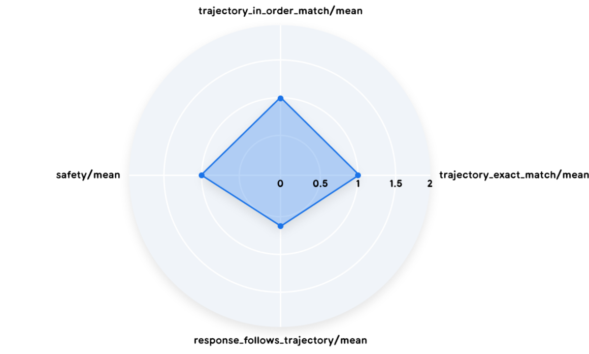

# Eval

## Principles

Agents [eval](https://www.anthropic.com/engineering/demystifying-evals-for-ai-agents):

1. Start early.
2. Source realistic tasks from failures.
3. Define unambiguous, robust success criteria.
4. Design graders thoughtfully and combine multiple types (code-based, model-based, human).
5. Make sure the problems are hard enough for model.
6. Iterate on evaluations to improve signal-to-noise ratio.
7. Read transcripts (记录).
8. Pick framework: [prompt foo](https://github.com/promptfoo/promptfoo), [harbor](https://github.com/laude-institute/harbor).

:::tip[Agent Failure]

智能体的失败通常不是系统崩溃, 而是质量的细微退化,
源于模型权重、训练数据和环境交互的复杂相互作用.
这些失败是**隐晦的**:

- Algorithm bias.
- Factual hallucination.
- Concept drift: 性能随时间推移而下降, 无法发现新问题.
- Emergent unintended behaviors.

:::

## Targets

- Effectiveness: goal achievement.
- Efficiency: operational cost.
- Robustness: reliability.
- Safety and alignment: trustworthiness.

## Methods

| Method            | 👍 Strengths                    | 👎 Weaknesses                                                |
| ----------------- | ------------------------------- | ------------------------------------------------------------ |
| Automated Metrics | Objective, scalable, efficient  | May not capture full capabilities                            |
| LLM-as-a-Judge    | Consistent, scalable, efficient | May overlook intermediate steps, limited by LLM capabilities |
| Human Evaluation  | Captures nuanced behavior       | Subjective, time-consuming, expensive, difficult to scale    |

## Trace

When building agents, [trace](https://x.com/hwchase17/status/2010044779225329688) is the source of truth:

- Debugging becomes trace analysis
- Testing becomes eval-driven
- Can't set breakpoints in reasoning
- Performance optimization changes: task success rate, reasoning quality, tool usage efficiency

## Trajectory

**Trajectory** is equally important as **final response**:

- Exact match: produce trajectory that perfectly mirrors ideal solution.
- In-order match: complete expected trajectory, while accommodating extra, un-penalized actions.
- Any-order match: include all necessary actions.
- Precision: relevant tool calls.
- Recall: essential tool calls.

## Benchmarks

[Benchmarks](https://blog.sshh.io/p/understanding-ai-benchmarks):

- Aggregate: Don’t obsess over a 1-2% lead on one benchmark, focus on specific and comprehensive domain.
- Relative: Compare within the same model family or lab, how did the score change from v1 to v2?
- Verify: The only benchmark that matters at the end of the day is your workload.

## References

- Agent evaluation [whitepaper](https://www.kaggle.com/whitepaper-agent-companion).
- Agent quality [whitepaper](https://www.kaggle.com/whitepaper-agent-quality).
- Claude Opus 4.5 [system card](https://assets.anthropic.com/m/64823ba7485345a7/Claude-Opus-4-5-System-Card.pdf).
- Autonomous agents [benchmark](https://github.com/GAIR-NLP/AgencyBench).
