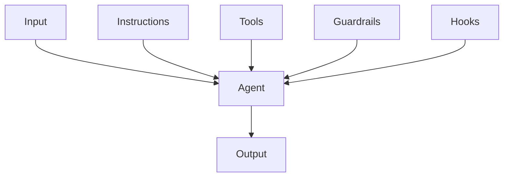
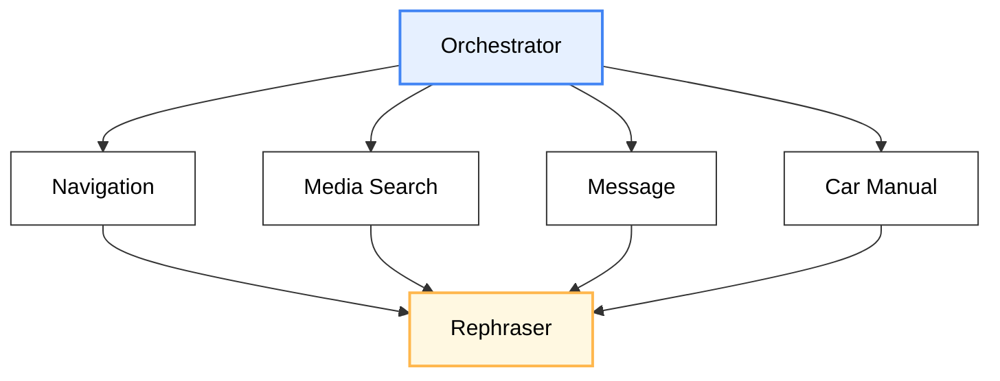
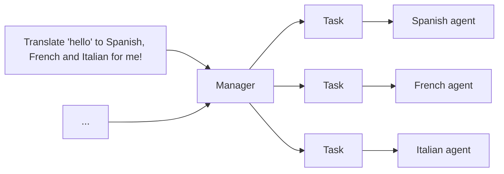
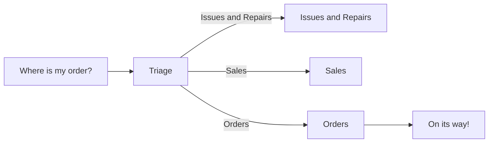

# Multi-Agent

- Sequential.
- Hierarchical.
- Peer-to-peer.
- Collaborative.
- Competitive.


:::tip[Pros]

- Accuracy: cross check.
- Efficiency: parallelism.
- Scalability.
- Fault tolerance.
- Reliability: reduce hallucinations and biases.

:::

## Single-agent



## Diamond Pattern



## Manager Pattern

多智能体系统中心模式 (Multi-agent systems in manager pattern):
其余智能体作为工具, 由中心智能体调用:



```python
from agents import Agent, Runner

manager_agent = Agent(
  name="manager_agent",
  instructions=(
    "您是一名翻译代理. 您使用给定的工具进行翻译."
    "如果要求进行多次翻译, 您将调用相关工具."
  ),
  tools=[
    spanish_agent.as_tool(
      tool_name="translate_to_spanish",
      tool_description="将用户的消息翻译成西班牙语",
    ),
    french_agent.as_tool(
      tool_name="translate_to_french",
      tool_description="将用户的消息翻译成法语",
    ),
    italian_agent.as_tool(
      tool_name="translate_to_italian",
      tool_description="将用户的消息翻译成意大利语",
    ),
  ],
)

async def main():
  msg = input("Translate 'hello' to Spanish, French and Italian for me!")

  orchestrator_output = await Runner.run(manager_agent, msg)

  for message in orchestrator_output.new_messages:
    print(f"翻译步骤: {message.content}")
```

## Decentralized Pattern

多智能体系统去中心模式 (Multi-agent systems in decentralized pattern),
多个代理作为对等体运行:



```python
from agents import Agent, Runner

technical_support_agent = Agent(
  name="Technical Support Agent",
  instructions=(
    "您提供解决技术问题、系统中断或产品故障排除的专家协助."
  ),
  tools=[search_knowledge_base]
)

sales_assistant_agent = Agent(
  name="Sales Assistant Agent",
  instructions=(
    "您帮助企业客户浏览产品目录、推荐合适的解决方案并促成购买交易."
  ),
  tools=[initiate_purchase_order]
)

order_management_agent = Agent(
  name="Order Management Agent",
  instructions=(
    "您协助客户查询订单跟踪、交付时间表以及处理退货或退款."
  )
)

tools=[track_order_status, initiate_refund_process]

triage_agent = Agent(
  name="Triage Agent",
  instructions="您作为第一个接触点, 评估客户查询并迅速将其引导至正确的专业代理.",
  handoffs=[technical_support_agent, sales_assistant_agent, order_management_agent],
)

await Runner.run(triage_agent, input("您能提供我最近购买商品的配送时间表更新吗?"))
```
