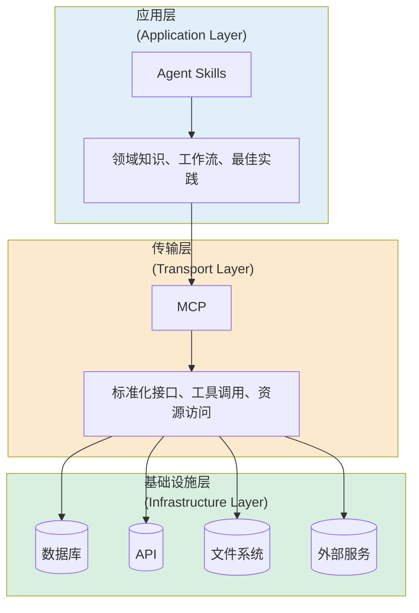

# Claude Code

## Configuration

`~/.claude/settings.json`:

```json
{
  "env": {
    "ANTHROPIC_AUTH_TOKEN": "<YOUR_API_KEY>",
    "ANTHROPIC_BASE_URL": "https://open.bigmodel.cn/api/anthropic",
    "ANTHROPIC_MODEL": "glm-4.7",
    "ANTHROPIC_SMALL_FAST_MODEL": "glm-4.7",
    "ANTHROPIC_DEFAULT_OPUS_MODEL": "glm-4.7",
    "ANTHROPIC_DEFAULT_SONNET_MODEL": "glm-4.7",
    "ANTHROPIC_DEFAULT_HAIKU_MODEL": "glm-4.7",
    "API_TIMEOUT_MS": "3000000",
    "CLAUDE_CODE_DISABLE_NONESSENTIAL_TRAFFIC": "1"
  }
}
```

## Memory

Captures everything Claude does during your coding sessions, compresses it with Claude `agent-sdk`,
and [injects relevant context](http://github.com/thedotmack/claude-mem) back into future sessions.

## Session

Resume from [session](https://stevekinney.com/courses/ai-development/claude-code-session-management):

```bash
# Most recent session
claude -c

# Specific session
claude -r
claude -r [session_id]
```

## Non-interactive Mode

Use Claude Code as a [unix-style utility](https://code.claude.com/docs/en/common-workflows#use-claude-as-a-unix-style-utility):

```bash
claude -p "$REVIEW_PROMPT" > review-result.md 2>&1 || true
```

See GitHub [code review action](https://github.com/sabertazimi/blog/pull/1572),
[improved version](https://github.com/sabertazimi/blog/pull/1573),
and [agent-native version](https://github.com/sabertazimi/blog/pull/1574).

:::tip[Composable]

Unix 系统中, 命令行工具通常是独立的、可组合的，
`claude -p` 可以接受标准输入, 并且可以与其他工具无缝集成,
从而形成一个强大的工具链.

:::

## Commands

`.claude/commands/api/api-new.md`:

```md
Create a new POST $ARGUMENTS endpoint with:

- Auth middleware.
- Rate limiting middleware.
- Error handling wrapper.
- TypeScript interfaces for request and response.
```

```bash
/api-new /api/users
```

URL to markdown [command](./recipes/prompts/url2md.md).

## Skills

```md
<skills_instructions>
When users ask you to perform tasks, check if any of the available skills below can help complete the task more effectively.

How to use skills:
- Invoke skills using this tool with the skill name only (no arguments)
- When you invoke a skill, you will see <command-message>The "{name}" skill is loading</command-message>
- The skill's prompt will expand and provide detailed instructions

Important:
- Only use skills listed in <available_skills> below
- Do not invoke a skill that is already running
</skills_instructions>

<available_skills>
<skill>
<name>xlsx</name>
<description>Comprehensive spreadsheet creation, editing, and analysis with support for formulas, formatting, data analysis...</description>
<location>plugin</location>
</skill>
</available_skills>
```



**渐进式披露**:

- 核心功能简洁: 500 行以内.
- 高级功能分离.
- [按需加载](https://platform.claude.com/docs/en/agents-and-tools/agent-skills/overview#how-skills-work):
  metadata -> instructions -> resources and code.

:::tip[工具选择]

- 临时任务 -> prompts
- 标准作业程序 -> skills
- 连接外部系统 -> MCP
- 复杂独立任务 -> sub-agents

:::

### Name

Using gerund form [`verb + -ing`](https://platform.claude.com/docs/en/agents-and-tools/agent-skills/best-practices#naming-conventions):
this clearly describes activity or capability:

- `processing-pdf`
- `analyzing-spreadsheets`
- `managing-databases`
- `testing-code`
- `writing-documentation`

### Description

**核心原则**: 既要说明`做什么`，也要说明`什么时候用`:

```yaml
description: Extract text and tables from PDF files, fill forms, merge documents.
  Use when working with PDF files or when the user mentions PDFs,
  forms, or document extraction.
```

### Effective

1. Core quality:
   - [ ] Description is specific and includes key terms
   - [ ] Description includes both what the Skill does and when to use it
   - [ ] SKILL.md body is under 500 lines
   - [ ] Additional details are in separate files (if needed)
   - [ ] No time-sensitive information (or in "old patterns" section)
   - [ ] Consistent terminology throughout
   - [ ] Examples are concrete, not abstract
   - [ ] File references are one level deep
   - [ ] Progressive disclosure used appropriately
   - [ ] Workflows have clear steps
2. Code and scripts:
   - [ ] Scripts solve problems rather than punt to Claude
   - [ ] Error handling is explicit and helpful
   - [ ] No "voodoo constants" (all values justified)
   - [ ] Required packages listed in instructions and verified as available
   - [ ] Scripts have clear documentation
   - [ ] No Windows-style paths (all forward slashes)
   - [ ] Validation/verification steps for critical operations
   - [ ] Feedback loops included for quality-critical tasks
3. Testing:
   - [ ] At least three evaluations created
   - [ ] Tested with Haiku, Sonnet, and Opus
   - [ ] Tested with real usage scenarios
   - [ ] Team feedback incorporated (if applicable)

### Security

1. Code Review:
   - [ ] 所有脚本已审查
   - [ ] 无硬编码密钥或密码
   - [ ] 无危险的系统命令（rm -rf, eval, exec）
   - [ ] 文件路径经过验证（防止路径遍历）
2. Network Access:
   - [ ] 检查所有外部 URL
   - [ ] 验证 API 端点可信
   - [ ] 处理网络失败情况
3. Data Handling:
   - [ ] 无敏感数据泄露
   - [ ] 日志不包含 PII
   - [ ] 临时文件正确清理
4. Permissions:
   - [ ] 最小权限原则
   - [ ] 不请求不必要的文件访问
   - [ ] 明确说明需要的权限
5. Documentation:
   - [ ] 安全注意事项已文档化
   - [ ] 数据处理流程透明
   - [ ] 用户知情同意

```bash
grep -r "requests\." .
grep -r "os.system" .
grep -r "subprocess" .
grep -r "eval" .
```

## Plugins

Install [plugins](https://github.com/anthropics/claude-code/tree/main/plugins)
from [marketplace](https://code.claude.com/docs/en/plugin-marketplaces),
it will extend Claude Code through the plugin system with:

- Custom commands.
- Agents.
- Hooks.
- Skills.
- MCP servers.

```bash
/plugin marketplace add anthropics/claude-plugins-official
```

```bash
/plugin marketplace add anthropics/skills
```

```bash
/plugin marketplace add obra/superpowers-marketplace
```

```bash
/plugin marketplace add sabertazimi/claude-code
```

```bash
/plugin install frontend-design
```

```bash
/plugin install ralph-wiggum
```

```bash
/plugin install superpowers@superpowers-marketplace
```

```bash
/plugin install sabertaz-claude-code
```

## SDK

- [Code review agent](./recipes/code/review.md).

## Best Practices

Claude code [best practices](https://www.anthropic.com/engineering/claude-code-best-practices):

- Plan mode: 对于复杂的任务, 使用 plan mode 先进行规划, 会比直接执行更高效.
- Extended thinking mode: [`MAX_THINKING_TOKENS`](https://decodeclaude.com/ultrathink-deprecated).
- Claude code has [built-in toolkit](https://code.claude.com/docs/en/settings#tools-available-to-claude),
  follow [certain paradigm](https://www.vtrivedy.com/posts/claudecode-tools-reference) to use them.
- Avoid `/compact`: dump plan and progress + `/clear` the state + restart from dump file.
- Use GitHub [actions](https://github.com/anthropics/claude-code-action):
  code review, issue triage, documentation sync, etc.

## Library

### Bootstrap

- [Everything](https://github.com/affaan-m/everything-claude-code):
  Complete configuration collection.
- [Showcase](https://github.com/ChrisWiles/claude-code-showcase):
  Comprehensive project configuration.
- [Bootstrap](https://github.com/alinaqi/claude-bootstrap):
  Opinionated project initialization.

### Workflow

- [Superpowers](https://github.com/obra/superpowers):
  Complete software development workflow.
- [Agents](https://github.com/wshobson/agents):
  Comprehensive production-ready system combining agents, multi-agent workflow orchestrators, skills, and slash commands.
- [Manus](https://github.com/OthmanAdi/planning-with-files):
  Manus-style persistent markdown planning.
- [Sisyphus](https://github.com/Yeachan-Heo/oh-my-claudecode):
  Multi-agent orchestration.
- [Ralph](https://github.com/frankbria/ralph-claude-code):
  Autonomous development loop.
- [Compound](https://github.com/EveryInc/compound-engineering-plugin):
  Compound engineering plugin.
- [Continuous](https://github.com/parcadei/Continuous-Claude-v3):
  Session continuity, token-efficient MCP execution, and agentic workflows.
- [TaskMaster](https://github.com/eyaltoledano/claude-task-master):
  Task-management system.

### Frontend

- [Vercel](https://github.com/vercel-labs/agent-skills):
  React best practices and web design guidelines.
- [UI/UX](https://github.com/nextlevelbuilder/ui-ux-pro-max-skill):
  Design intelligence for professional UI/UX.
- [Figma](https://github.com/figma/mcp-server-guide):
  Figma integration.
- [Stitch](https://github.com/google-labs-code/stitch-skills):
  UI design toolkit.
- [Dev](http://github.com/SawyerHood/dev-browser):
  Browser automation.
- [Remotion](https://github.com/remotion-dev/skills):
  Create videos programmatically in React.
- [Expo](https://github.com/expo/skills):
  Expo projects and application services.

### DevOps

- [Cloudflare](https://github.com/cloudflare/skills).

### Documentation

- [Notion](https://github.com/makenotion/claude-code-notion-plugin).
- [NotebookLM](https://github.com/PleasePrompto/notebooklm-skill).
- [Obsidian](https://github.com/kepano/obsidian-skills).

### Math

- [Scientific](https://github.com/K-Dense-AI/claude-scientific-skills):
  Comprehensive scientific collection.

### Guardrails

- [SafetyNet](https://github.com/kenryu42/claude-code-safety-net):
  Catching destructive git and filesystem commands before they execute.

### Assistant

- [Life](https://github.com/lout33/claude_life_assistant):
  Personal coach that remembers, notices patterns, and holds accountable.
- [Health](https://github.com/huifer/Claude-Ally-Health):
  Intelligent healthcare assistant.

### Management

- [Switch](https://github.com/farion1231/cc-switch):
  Quick configuration with All-in-One assistant.
- [Seekers](https://github.com/yusufkaraaslan/Skill_Seekers):
  Convert documentation websites, GitHub repositories, and PDFs
  into Claude AI skills with automatic conflict detection.
- [Directory](https://github.com/vercel-labs/skills):
  `npx skills add <owner/repo>`.
- [WuMing](https://github.com/chujianyun/skills):
  Prompts optimizer and skills synchronizer.

### Collections

- [Skills](https://github.com/anthropics/skills):
  Anthropic skills.
- [Plugins](https://github.com/anthropics/claude-plugins-official):
  Anthropic plugins.
- [Awesome](https://github.com/ComposioHQ/awesome-claude-skills):
  List.
- [Marketplace](https://skillsmp.com):
  Marketplace.
- [Registry](https://github.com/Kamalnrf/claude-plugins):
  Lightweight registry to skills and plugins.
- [Build](https://github.com/davepoon/buildwithclaude):
  Single hub to skills and plugins.

## References

- Skills [best practices](https://platform.claude.com/docs/en/agents-and-tools/agent-skills/best-practices).
- Skills [cookbook](https://github.com/anthropics/claude-cookbooks/tree/main/skills).
- Skills [specification](https://github.com/agentskills/agentskills).
- OpenCode complete [guide](https://github.com/vbgate/learn-opencode).
