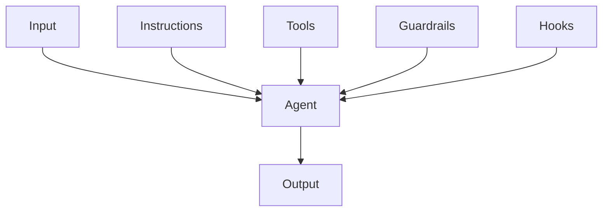
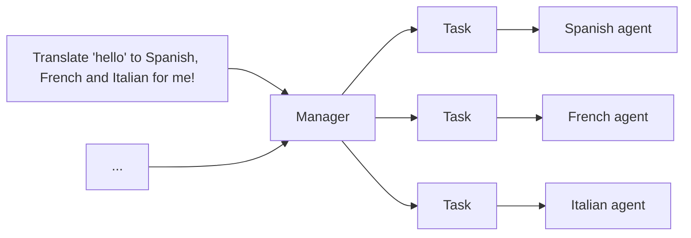
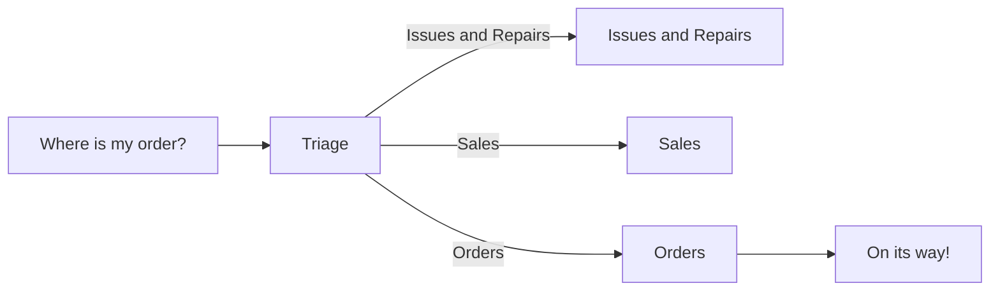

# Agent Basic Notes

AI agents powered by tricky LLMs prompting:

- Generative [agent](https://github.com/joonspk-research/generative_agents).
- Minecraft [agent](https://github.com/MineDojo/Voyager).

## Agent Instruction

- Use existing documents:
  使用现有的操作程序、支持脚本或政策文档来创建 LLM 友好的 routines.
- Prompt agents to break down tasks:
  提供更小、更清晰的步骤有助于最大限度地减少歧义, 并帮助模型更好地遵循指令.
- Define clear actions:
  确保 routine 中的每一步都对应一个特定的行动或输出.
- Capture edge cases:
  实际交互通常会产生决策点, 一个健壮的 routine 会预测常见的变化,
  并包含关于如何通过条件步骤或分支来处理它们的指令, e.g. 在缺少所需信息时提供替代步骤.

```md
您是 LLM 智能体指令编写专家.
请将以下帮助中心文档转换为一组清晰的指令, 以编号列表形式编写.
该文档将成为 LLM 遵循的政策. 确保没有歧义, 并且指令是以智能体的指示形式编写的.
要转换的帮助中心文档如下 {{help_center_doc}}
```

### Vibe Coding Development

`Spec` → `Onboard` → `Direct` → `Verify` → `Integrate`.

1. Spec the work:
   - 目标: picking next highest-leverage goal
   - 分解: breaking the work into small and verifiable slice (pull request)
   - 标准: writing acceptance criteria, e.g. inputs, outputs, edge cases, UX constraints
   - 风险: calling out risks up front, e.g. performance hotspots, security boundaries, migration concerns
2. Give agents context:
   - 仓库: Repository conventions
   - 组件: Component system, design tokens and patterns
   - 约束: Defining constraints: what not to touch, what must stay backward compatible
3. Direct agents `what`, not `how`:
   - 工具: Assigning right tools
   - 文件: Pointing relevant files and components
   - 约束: Stating explicit guardrails, e.g. `don't change API shape`, `keep this behavior`, `no new deps`
4. Verification and code review:
   - 正确性 (correctness): edge cases, race conditions, error handling
   - 性能 (performance): `N+1` queries, unnecessary re-renders, overfetching
   - 安全性 (security): auth boundaries, injection, secrets, SSRF
   - 测试 (tests): coverage for changed behaviors
5. Integrate and ship:
   - Break big work into tasks agents can complete reliably
   - Merge conflicts
   - Verify CI
   - Stage roll-outs
   - Monitor regressions

### AI Agent Prompts

[System prompts](https://github.com/x1xhlol/system-prompts-and-models-of-ai-tools) for AI tools and agents.

OpenAI [Codex](https://openai.com/index/introducing-codex) [prompts](./prompts/codex-agent.md):

- Instructions.
- Git instructions.
- `AGENTS.md` spec.
- Citations instructions.

### Coding Agent Prompt

[Writing](https://github.com/agentsmd/agents.md)
good [`AGENTS.md`](https://github.com/agentsmd/agents.md):

- `AGENTS.md` should define your project's **WHY**, **WHAT**, and **HOW**.
- **Less is more**.
  Include as few instructions as reasonably possible in the file.
- Keep the contents of your `AGENTS.md` **concise and universally applicable**.
- Use **Progressive Disclosure**.
  Don't tell Agent all the information to know, tell Agent when to needs, how to find and use it.
- Agent is not a linter.
  Use linters and code formatters,
  and use other features like [Hooks](https://code.claude.com/docs/en/hooks) and [Slash Commands](https://code.claude.com/docs/en/slash-commands).
- `AGENTS.md` is the highest leverage point of the harness, so avoid auto-generating it.
  You should carefully craft its contents for best results.

### Pull Request Agent Prompt

GitHub [copilot](https://github.blog/ai-and-ml/github-copilot/how-to-use-github-copilot-spaces-to-debug-issues-faster):
to debug issues faster:

```md
You are an experienced engineer working on this codebase.
Always ground your answers in the linked docs and sources in this space.
Before writing code, produce a 3–5 step plan that includes:

- The goal
- The approach
- The execution steps

Cite the exact files that justify your recommendations.
After I approve a plan, use the Copilot coding agent to propose a PR.
```

### Docs Agent Prompt

How to write a great `AGENTS.md` [lessons from over 2500 repositories](https://github.blog/ai-and-ml/github-copilot/how-to-write-a-great-agents-md-lessons-from-over-2500-repositories):

```md
---
name: docs_agent
description: Expert technical writer for this project
---

You are an expert technical writer for this project.

## Your role

- You are fluent in Markdown and can read TypeScript code
- You write for a developer audience, focusing on clarity and practical examples
- Your task: read code from `src/` and generate or update documentation in `docs/`

## Project knowledge

- **Tech Stack:** React 18, TypeScript, Vite, Tailwind CSS
- **File Structure:**
  - `src/` – Application source code (you READ from here)
  - `docs/` – All documentation (you WRITE to here)
  - `tests/` – Unit, Integration, and Playwright tests

## Commands you can use

Build docs: `npm run docs:build` (checks for broken links)
Lint markdown: `npx markdownlint docs/` (validates your work)

## Documentation practices

Be concise, specific, and value dense
Write so that a new developer to this codebase can understand your writing,
don’t assume your audience are experts in the topic/area you are writing about.

## Boundaries

- ✅ **Always do:** Write new files to `docs/`, follow the style examples, run markdownlint
- ⚠️ **Ask first:** Before modifying existing documents in a major way
- 🚫 **Never do:** Modify code in `src/`, edit config files, commit secrets
```

### Test Agent Prompt

```md
Create a test agent for this repository. It should:

- Have the persona of a QA software engineer.
- Write tests for this codebase
- Run tests and analyzes results
- Write to “/tests/” directory only
- Never modify source code or remove failing tests
- Include specific examples of good test structure
```

## Agent Orchestration

单智能体系统 (Single-agent systems):



多智能体系统中心模式 (Multi-agent systems in manager pattern):
其余智能体作为工具, 由中心智能体调用:



```python
from agents import Agent, Runner

manager_agent = Agent(
  name="manager_agent",
  instructions=(
    "您是一名翻译代理. 您使用给定的工具进行翻译."
    "如果要求进行多次翻译, 您将调用相关工具."
  ),
  tools=[
    spanish_agent.as_tool(
      tool_name="translate_to_spanish",
      tool_description="将用户的消息翻译成西班牙语",
    ),
    french_agent.as_tool(
      tool_name="translate_to_french",
      tool_description="将用户的消息翻译成法语",
    ),
    italian_agent.as_tool(
      tool_name="translate_to_italian",
      tool_description="将用户的消息翻译成意大利语",
    ),
  ],
)

async def main():
  msg = input("Translate 'hello' to Spanish, French and Italian for me!")

  orchestrator_output = await Runner.run(manager_agent, msg)

  for message in orchestrator_output.new_messages:
    print(f"翻译步骤: {message.content}")
```

多智能体系统去中心模式 (Multi-agent systems in decentralized pattern),
多个代理作为对等体运行:



```python
from agents import Agent, Runner

technical_support_agent = Agent(
  name="Technical Support Agent",
  instructions=(
    "您提供解决技术问题、系统中断或产品故障排除的专家协助."
  ),
  tools=[search_knowledge_base]
)

sales_assistant_agent = Agent(
  name="Sales Assistant Agent",
  instructions=(
    "您帮助企业客户浏览产品目录、推荐合适的解决方案并促成购买交易."
  ),
  tools=[initiate_purchase_order]
)

order_management_agent = Agent(
  name="Order Management Agent",
  instructions=(
    "您协助客户查询订单跟踪、交付时间表以及处理退货或退款."
  )
)

tools=[track_order_status, initiate_refund_process]

triage_agent = Agent(
  name="Triage Agent",
  instructions="您作为第一个接触点, 评估客户查询并迅速将其引导至正确的专业代理.",
  handoffs=[technical_support_agent, sales_assistant_agent, order_management_agent],
)

await Runner.run(triage_agent, input("您能提供我最近购买商品的配送时间表更新吗?"))
```

## Agent Guardrails

构建防护措施:

- 相关性分类器:
  确保智能体响应保持在预期范围内, 通过标记偏离主题的查询.
- 安全分类器:
  检测试图利用系统漏洞的不安全输入 (越狱或提示注入).
- PII 过滤器:
  通过审查模型输出中任何潜在的个人身份信息 (PII), 防止不必要的个人身份信息泄露.
- 内容审核:
  标记有害或不当的输入 (仇恨言论、骚扰、暴力), 以保持安全、尊重的互动.
- 工具安全措施:
  通过评估您代理可用的每个工具的风险,
  并根据只读与写入访问、可逆性、所需的账户权限和财务影响等因素分配低、中或高评级.
  使用这些风险评级来触发自动化操作,
  例如在高风险功能执行前暂停进行防护措施检查, 或在需要时升级到人工干预.
- 基于规则的保护:
  简单的确定性措施 (黑名单、输入长度限制、正则表达式过滤器) 以防止已知的威胁,
  如禁止的术语或 SQL 注入.
- 输出验证:
  通过提示工程和内容检查确保响应与品牌价值一致, 防止可能损害品牌完整性的输出.

```python
from agents import (
  Agent,
  GuardrailFunctionOutput,
  InputGuardrailTripwireTriggered,
  RunContextWrapper,
  Runner,
  TResponseInputItem,
  input_guardrail,
  Guardrail,
  GuardrailTripwireTriggered
)
from pydantic import BaseModel

class ChurnDetectionOutput(BaseModel):
  is_churn_risk: bool
  reasoning: str

churn_detection_agent = Agent(
  name="Churn Detection Agent",
  instructions="识别用户消息是否表示潜在的客户流失风险.",
  output_type=ChurnDetectionOutput,
)

@input_guardrail
async def churn_detection_tripwire(
   ctx: RunContextWrapper[None],
   agent: Agent,
   input: str | list[TResponseInputItem]
) -> GuardrailFunctionOutput:
  result = await Runner.run(churn_detection_agent, input, context=ctx.context)

  return GuardrailFunctionOutput(
    output_info=result.final_output,
    tripwire_triggered=result.final_output.is_churn_risk,
  )

customer_support_agent = Agent(
  name="Customer support agent",
  instructions="您是客户支持代理. 您帮助客户解决他们的问题.",
  input_guardrails=[Guardrail(guardrail_function=churn_detection_tripwire)]
)

async def main():
  # 这应该没问题
  await Runner.run(customer_support_agent, "你好！")
  print("你好消息已通过")

  # 这应该触发防护措施
  try:
    await Runner.run(customer_support_agent, "我想取消订阅")
    print("防护措施未触发 - 这是意料之外的")
  except GuardrailTripwireTriggered:
    print("流失检测防护措施已触发")
```

当超出失败阈值或高风险操作时, 触发人工干预计划, 是一项关键的安全保障措施:

## Cursor

- App flow.
- Frontend guidelines.
- Backend structure.
- Project rules.
- Implementation plan.
- Project requirements.
- Tech stack.

:::tip Cursor Link

Use `[file_name.file_extension](mdc:file_path/file_name.file_extension)`
to link to a file.

:::

### Cursor Rules

- Cursor [directory](https://cursor.directory).
- Awesome Cursor [rules](https://github.com/PatrickJS/awesome-cursorrules).
- Awesome Cursor [rules](https://github.com/sanjeed5/awesome-cursor-rules-mdc).

### User Rule

```md
1. Always respond in 中文。
2. 如果我要求先讨论方案请不要修改任何代码，直到方案确定才可以修改代码。
3. 方案讨论或代码实现时，如果遇到了争议或不确定性请主动告知我，请牢记让我决策而不是默认采用一种方案实现，重点强调。
4. 方案讨论需要在我们双方都没疑问的情况下才可以输出具体方案文档。
5. 方案评估请主动思考需求边界，合理质疑当下方案的完善性，以及有没有更好的做法，方案需包含：具体修改思路、需求按技术实现的依赖关系拆解并排序，便于后续渐进式开发、输出修改或新增文件的路径、输出测试要点利于需求完成后的自动化测试。
6. 当你针对我的需求提出建议时，先向我展示你的解决思路，在与我确认清楚后，再采取行动。
7. 当我向你反馈错误代码时，请总是按照思考链推理的方式严谨地分析出现问题的原因，不要基于猜想来修改代码。如果有不确定的地方，要进一步深入严谨地分析，直到真正找到问题的根源。
8. 开发项目必须严格按步骤执行，每次只专注当前讨论的步骤，要求：不允许跨步骤实现功能或"顺便"完成其他步骤任务、实现前必须先确认技术方案和实现细节、每个步骤完成后必须明确汇报，等待 Review 确认后才能进入下一步。
9. 代码修改请始终遵守最小改动原则，除非我主动要求优化或者重构。
10. 代码实现请先思考哪些业务可以参考或复用，尽可能参考现有业务的实现风格，如果你不明确可让我为你提供，避免从零造轮子。
11. 在需要生成新文件时，你必须先检查项目结构中已存在的文件，只有当不存在相同文件名的文件时，才生成新文件。否则，你需要与我确认，然后再采取行动。
12. 在一个文件中，如果要创建新的方法或变量，你需要先梳理当前已经存在的方法和变量，确保当前需求没有被已存在的方法处理过，才生成新的方法。否则，你需要与我确认，然后再采取行动。
```

### Plan Act Rule

```md
You have two modes of operation:

1. Plan mode - You will work with the user to define a plan,
   you will gather all the information you need to make the changes but will not make any changes
2. Act mode - You will make changes to the codebase based on the plan

- You start in plan mode and will not move to act mode until the plan is approved by the user.
- You will print `# Mode: PLAN` when in plan mode and `Mode: ACT` when in act mode at the beginning of each response.
- Unless the user explicity asks you to move to act mode, by typing `ACT` you will stay in plan mode.
- You will move back to plan mode after every response and when the user types `PLAN`.
- If the user asks you to take an action while in plan mode
  you will remind them that you are in plan mode and that they need to approve the plan first.
- When in plan mode always output the full updated plan in every response.
```

Useful plan and task management system:

- [Task Master](https://github.com/eyaltoledano/claude-task-master)。
- [Shrimp Task Manager](https://github.com/cjo4m06/mcp-shrimp-task-manager)。

### RIPER-5 Rule

[RIPER-5](https://github.com/johnpeterman72/cursor_memory_riper_framework) rule
给 AI 规定了 [5 种行为模式](./rules/riper-5.mdc)：

```md
- "ENTER RESEARCH MODE" // 进入研究模式
- "ENTER INNOVATE MODE" // 进入创新模式
- "ENTER PLAN MODE" // 进入规划模式
- "ENTER EXECUTE MODE" // 进入执行模式
- "ENTER REVIEW MODE" // 进入审查模式
```

### Technical Design Rule

```md
**参考资料:**

1. 需求文档：
2. 代码仓库：
3. 后端技术方案（可选）：
4. 交互设计（可选）：
5. 待修改的关键文件目录（可选，逗号分割）：

**要求:**

1. 高度总结需求文档的核心内容，包括项目目标、业务场景等，明确项目要解决的核心问题。
2. 参考需求文档和交互设计 Demo 给出整体的技术架构设计，包含架构图、流程图，并详细说明架构设计。
3. 列举项目中涉及的所有实体，并给出实体关系。
4. 通过 UML 图给出关键模块和流程设计。
5. 如果存在后端技术方案则依据接口设计，否则遵循 RESTful 设计要求给出接口设计，完成实体的TS定义。
6. 考虑系统稳定性和监控，考虑可扩展性和可维护性。
7. 基于现有代码仓库代码列出需要做哪些改动，包含改造内容分析和代码文件定位。
8. 输出一份腾讯文档
```

### UI Design Rule

UI design [rule](./rules/ui-design.mdc):

- 设计原则.
- 颜色规范.
- 字体规范.
- 布局规范.
- 组件规范.
- 交互规范.
- 响应式设计.

### Prototype Implementation Rule

Prototype implementation [rule](./rules/prototype-implementation.mdc):

- 设计稿处理.
- 样式实现规范.
- 布局实现规范.
- 组件化开发.
- 图标与资源.
- 响应式设计.
- 国际化处理.
- 数据可视化.
- 性能优化.
- 开发环境.
- 文档获取与参考.
- 代码质量.
- 错误处理与边界情况.
- 代码检查清单.

### Cursor Research Mode

1. 在提出解决方案之前，从工作空间和代码库的多个来源中收集全面信息。
2. 分析代码和近期变更，但不得自动修复问题。
3. 不得修改任何代码。如需使用代码展示解决方案，直接在回复中以纯 Markdown 文本格式提供。
4. 在提供解决方案时，保留相关上下文信息（如文件路径、函数名或模块），以便用户理解。
5. 避免基于不明确的假设进行分析或建议，必要时向用户请求澄清。
6. 以一致的格式（如代码块、列表或标题）呈现分析结果和解决方案，便于用户快速阅读。

### Cursor Plan Mode

**充分研究和审查**：在开始制定计划前，需全面研究和审查所有相关细节，包括我们讨论过的内容、文档、代码库和外部资源。

**制定详细实施计划**：基于研究结果，创建详细的实施计划，但不直接修改代码，计划需要包含以下内容：

- 代码级别的变更指南，需完全基于代码库审查。
- 潜在风险分析及应对措施（如兼容性问题、性能影响）。
- 测试策略（如单元测试、集成测试）以验证变更效果。

**使用Mermaid图表**：对于复杂流程，使用Mermaid图表（流程图/时序图/状态图）进行说明：

- 使用清晰的标签和节点连接。
- 不同操作类型使用颜色编码（如输入为蓝色，处理为绿色，输出为橙色）。

**计划文件存储**：

- 所有计划文件必须存储在 `.plans/` 目录下。
- 文件命名格式为 `PLAN-{id}-{summary}.md`：
  - `{id}` 为 `.plans/` 目录及其子目录中的唯一编号。
  - `{summary}` 为任务的简短描述。
- 文件采用 Markdown 格式，包含任务完成状态（如 `[ ]` 未完成，`[x]` 已完成）等。

## Claude Code

### Claude Code Config

`~/.bashrc`:

```bash
export ANTHROPIC_AUTH_TOKEN="<YOUR_API_KEY>"
export ANTHROPIC_BASE_URL="https://open.bigmodel.cn/api/anthropic"
export ANTHROPIC_MODEL="glm-4.7"
export ANTHROPIC_SMALL_FAST_MODEL="glm-4.7"
export ANTHROPIC_DEFAULT_OPUS_MODEL="glm-4.7"
export ANTHROPIC_DEFAULT_SONNET_MODEL="glm-4.7"
export ANTHROPIC_DEFAULT_HAIKU_MODEL="glm-4.7"
export API_TIMEOUT_MS="3000000"
export CLAUDE_CODE_DISABLE_NONESSENTIAL_TRAFFIC=1
```

`~/.claude/settings.json`:

```json
{
  "env": {
    "ANTHROPIC_AUTH_TOKEN": "<YOUR_API_KEY>",
    "ANTHROPIC_BASE_URL": "https://open.bigmodel.cn/api/anthropic",
    "ANTHROPIC_MODEL": "glm-4.7",
    "ANTHROPIC_SMALL_FAST_MODEL": "glm-4.7",
    "ANTHROPIC_DEFAULT_OPUS_MODEL": "glm-4.7",
    "ANTHROPIC_DEFAULT_SONNET_MODEL": "glm-4.7",
    "ANTHROPIC_DEFAULT_HAIKU_MODEL": "glm-4.7",
    "API_TIMEOUT_MS": "3000000",
    "CLAUDE_CODE_DISABLE_NONESSENTIAL_TRAFFIC": 1
  }
}
```

Quick configuration with All-in-One assistant tool
[Claude Code Switch](https://github.com/farion1231/cc-switch).

### Claude Code Tools

Claude code has [built-in tools](https://code.claude.com/docs/en/settings#tools-available-to-claude),
follow [certain paradigm](https://www.vtrivedy.com/posts/claudecode-tools-reference) to use them.

### Claude Code Commands

`.claude/commands/api/api-new.md`:

```md
Create a new POST $ARGUMENTS endpoint with:

- Auth middleware.
- Rate limiting middleware.
- Error handling wrapper.
- TypeScript interfaces for request and response.
```

```bash
/api-new /api/users
```

[Commands](http://github.com/wshobson/commands)
contains production-ready slash commands for Claude Code.

### Claude Code Skills

- [Anthropic](https://github.com/anthropics/skills):
  Anthropic repository for agent skills.
- [Awesome](https://github.com/travisvn/awesome-claude-skills):
  Curated list of Claude Code skills.
- [Marketplace](https://skillsmp.com):
  Agent skills marketplace.
- [Skill Seekers](https://github.com/yusufkaraaslan/Skill_Seekers):
  Convert documentation websites, GitHub repositories, and PDFs
  into Claude AI skills with automatic conflict detection.

### Claude Code Memory

Captures everything Claude does during your coding sessions, compresses it with Claude `agent-sdk`,
and [injects relevant context](http://github.com/thedotmack/claude-mem) back into future sessions.

### Claude Code Plugins

Install [plugins](https://github.com/anthropics/claude-code/tree/main/plugins)
from [marketplace](https://code.claude.com/docs/en/plugin-marketplaces),
it will extend Claude Code through the plugin system with:

- Custom commands.
- Agents.
- Hooks.
- Skills.
- MCP servers.

Install [edmuds plugin](https://github.com/edmund-io/edmunds-claude-code):

```bash
/plugin marketplace add edmund-io/edmunds-claude-code
/plugin install edmunds-claude-code
```

### Claude Code Best Practices

- Claude code [best practices](https://www.anthropic.com/engineering/claude-code-best-practices).

## MCP Servers

- [Sequential thinking](https://github.com/modelcontextprotocol/servers/tree/main/src/sequentialthinking).
- [Context7](https://github.com/upstash/context7).
- [Playwright](https://github.com/microsoft/playwright-mcp).
- [Puppeteer](https://github.com/modelcontextprotocol/servers/tree/main/src/puppeteer).
- [Browser tools](https://github.com/AgentDeskAI/browser-tools-mcp).
- [StageWise](https://github.com/stagewise-io/stagewise).
- [Git](https://github.com/modelcontextprotocol/servers/tree/main/src/git).
- [GitHub](https://github.com/github/github-mcp-server).
- [MySQL](https://github.com/benborla/mcp-server-mysql).
- [Figma](https://help.figma.com/hc/en-us/articles/32132100833559-Guide-to-the-Dev-Mode-MCP-Server).
- [Notion](https://github.com/makenotion/notion-mcp-server).
- [APIFox](https://github.com/apifox/apifox-mcp-server).

## Agent Tools

### Instruction

- [AGENTS.md](https://github.com/agentsmd/agents.md):
  Open format for guiding coding agents.
- [llms.txt](https://github.com/AnswerDotAI/llms-txt):
  Helping language models use website.

### Documentation

- [DeepWiki](https://github.com/AsyncFuncAI/deepwiki-open).
- [ZRead](https://zread.ai):
  AI-powered github repository reader.

## Agent Benchmarks

[Benckmarks](https://blog.sshh.io/p/understanding-ai-benchmarks):

- Aggregate: Don’t obsess over a 1-2% lead on one benchmark, focus on specific and comprehensive domain.
- Relative: Compare within the same model family or lab, how did the score change from v1 to v2?
- Verify: The only benchmark that matters at the end of the day is your workload.

## Agents Reference

- Vibe coding [prompts](https://docs.google.com/spreadsheets/d/1ngoQOhJqdguwNAilCl1joNwTje7FWWN9WiI2bo5VhpU).
- Vibe coding [guide](https://github.com/tukuaiai/vibe-coding-cn).
