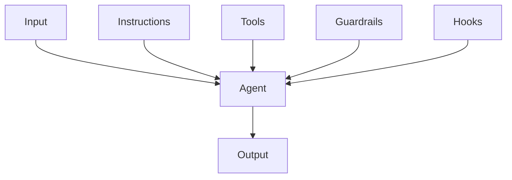
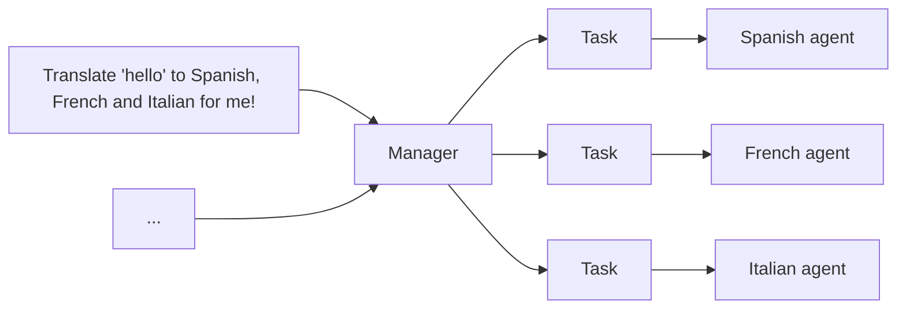
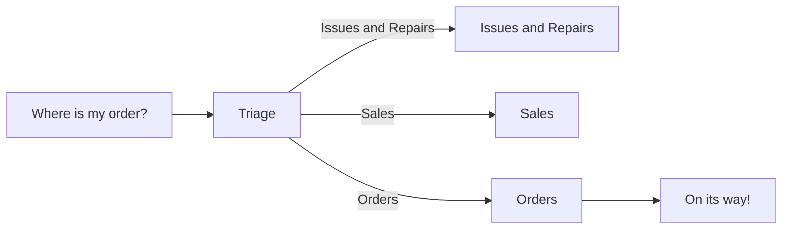

# Agent

## Architecture

General agent [components](https://www.kaggle.com/whitepaper-agents):

- LLM (brain)
- Prompting (instructions)
- Memory
- External knowledge
- Tools


## Principles

### First-Principles

从李世石与 AlphaGo 的围棋对战中的第 37 手,
我们可以总结出[第一性原理](https://www.chasewhughes.com/writing/beyond-the-replica-the-case-for-first-principles-agents)
智能体的基本原则:

- Replica agents: 当流程需要人工审核、代理作为用户的副驾驶员或与仅限 UI 的旧版工具集成时，使用仿生学。
- Alien agents: 当目标是纯粹的结果效率时，使用第一性原理。

### Asymmetry of Verification and Verifiers

Asymmetry of verification and verifiers [law](https://www.jasonwei.net/blog/asymmetry-of-verification-and-verifiers-law):

所有可解决且易于验证的问题, 都将被 AI 解决.

:::caution[Agent Traffic]

[Among the agents](https://www.hyperdimensional.co/p/among-the-agents):

Value of highly polished UI and enterprise applications will decrease,
value of performant, reliable, extensible API will increase.

:::

## Patterns

Agent design [patterns](https://rlancemartin.github.io/2026/01/09/agent_design):

- Give agents a computer (CLI and files)
- Progressive disclosure
- Offload context
- Cache context
- Isolate context
- Evolve context

### Agent-native Architecture

[Agent-native](https://every.to/guides/agent-native) apps should:

- Parity (对等性): 用户通过 UI 完成任务 `<->` Agent 通过工具实现.
- Granularity (细粒度): tools should be atomic primitives.
- Composability: 有了上述两点, 只需编写新的提示词即可创建新功能.
- Emergent capability.
- Files as universal interface: files for legibility, databases for structure.
- Improvement over time:
  - Accumulated context: state persists across sessions.
  - Developer-level refinement: system prompts.
  - User-level customization: user prompts.

```md
**Who I Am**:
Reading assistant for the Every app.

**What I Know About This User**:
- Interested in military history and Russian literature
- Prefers concise analysis
- Currently reading *War and Peace*

**What Exists**:
- 12 notes in /notes
- three active projects
- User preferences at /preferences.md

**Recent Activity**:
- User created "Project kickoff" (two hours ago)
- Analyzed passage about Austerlitz (yesterday)

**My Guidelines**:
- Don't spoil books they're reading
- Use their interests to personalize insights

**Current State**:
- No pending tasks
- Last sync: 10 minutes ago
```

:::tip[Agent-native Product]

Build capable foundation,
observe what users ask agent to do,
**formalize patterns** that emerge:

- Common patterns: domain tools.
- Frequent requests: dedicated prompts.
- Unused tools: remove.

:::

### Multi-Agent System

- Sequential.
- Hierarchical.
- Peer-to-peer.
- Collaborative.
- Competitive.

:::tip[Pros]

- Scalability: parallelism.
- Reliability: reduce hallucinations and biases.
- Fault tolerance.

:::

## Instructions

- Use existing documents:
  使用现有的操作程序、支持脚本或政策文档来创建 LLM 友好的 routines.
- Prompt agents to break down tasks:
  提供更小、更清晰的步骤有助于最大限度地减少歧义, 并帮助模型更好地遵循指令.
- Define clear actions:
  确保 routine 中的每一步都对应一个特定的行动或输出.
- Capture edge cases:
  实际交互通常会产生决策点, 一个健壮的 routine 会预测常见的变化,
  并包含关于如何通过条件步骤或分支来处理它们的指令, e.g. 在缺少所需信息时提供替代步骤.

```md
您是 LLM 智能体指令编写专家.
请将以下帮助中心文档转换为一组清晰的指令, 以编号列表形式编写.
该文档将成为 LLM 遵循的政策. 确保没有歧义, 并且指令是以智能体的指示形式编写的.
要转换的帮助中心文档如下 {{help_center_doc}}
```

How to write a great `AGENTS.md` [lessons from over 2500 repositories](https://github.blog/ai-and-ml/github-copilot/how-to-write-a-great-agents-md-lessons-from-over-2500-repositories):

1. States a clear **role**:
   Defines who the agent is (expert technical writer),
   what skills it has (Markdown, TypeScript),
   and what it does (read code, write docs).
2. Executable **commands**: Gives AI tools it can run (npm run docs:build and npx markdownlint docs/). Commands come first.
3. **Project** knowledge: Specifies tech stack with versions (React 18, TypeScript, Vite, Tailwind CSS) and exact file locations.
4. Real **examples**: Shows what good output looks like with actual code. No abstract descriptions.
5. Three-tier **boundaries**: Set clear rules using always do, ask first, never do. Prevents destructive mistakes.

:::tip

Role -> Tool -> Context -> Example -> Boundary

:::

### Vibe Coding

1. Spec the work:
   - 目标: picking next highest-leverage goal
   - 分解: breaking the work into small and verifiable slice (pull request)
   - 标准: writing acceptance criteria, e.g. inputs, outputs, edge cases, UX constraints
   - 风险: calling out risks up front, e.g. performance hot-spots, security boundaries, migration concerns
2. Give agents context:
   - 仓库: Repository conventions
   - 组件: Component system, design tokens and patterns
   - 约束: Defining constraints: what not to touch, what must stay backward compatible
3. Direct agents `what`, not `how`:
   - 工具: Assigning right tools
   - 文件: Pointing relevant files and components
   - 约束: Stating explicit guardrails, e.g. `don't change API shape`, `keep this behavior`, `no new deps`
4. Verification and code review:
   - 正确性 (correctness): edge cases, race conditions, error handling
   - 性能 (performance): `N+1` queries, unnecessary re-renders, over-fetching
   - 安全性 (security): auth boundaries, injection, secrets, SSRF
   - 测试 (tests): coverage for changed behaviors
5. Integrate and ship:
   - Break big work into tasks agents can complete reliably
   - Merge conflicts
   - Verify CI
   - Stage roll-outs
   - Monitor regressions

:::tip

Spec → Onboard → Direct → Verify → Integrate

:::

### System

OpenAI [Codex](https://openai.com/index/introducing-codex)
system [prompts](./recipes/prompts/codex.md):

- Instructions.
- Git instructions.
- `AGENTS.md` spec.
- Citations instructions.

### Coding

[Writing](https://github.com/agentsmd/agents.md)
good [`AGENTS.md`](https://github.com/agentsmd/agents.md):

- `AGENTS.md` should define your project's **WHY**, **WHAT**, and **HOW**.
- **Less is more**.
  Include as few instructions as reasonably possible in the file.
- Keep the contents of your `AGENTS.md` **concise and universally applicable**.
- Use **Progressive Disclosure**.
  Don't tell Agent all the information to know, tell Agent when to needs, how to find and use it.
- Agent is not a linter.
  Use linters and code formatters,
  and use other features like [Hooks](https://code.claude.com/docs/en/hooks) and [Slash Commands](https://code.claude.com/docs/en/slash-commands).
- `AGENTS.md` is the highest leverage point of the harness, so avoid auto-generating it.
  You should carefully craft its contents for best results.

### Pull Request

GitHub [copilot](https://github.blog/ai-and-ml/github-copilot/how-to-use-github-copilot-spaces-to-debug-issues-faster)
to debug issues faster:

```md
You are an experienced engineer working on this codebase.
Always ground your answers in the linked docs and sources in this space.
Before writing code, produce a 3–5 step plan that includes:

- The goal
- The approach
- The execution steps

Cite the exact files that justify your recommendations.
After I approve a plan, use the Copilot coding agent to propose a PR.
```

### Testing

```md
Create a test agent for this repository. It should:

- Have the persona of a QA software engineer.
- Write tests for this codebase
- Run tests and analyzes results
- Write to “/tests/” directory only
- Never modify source code or remove failing tests
- Include specific examples of good test structure
```

### Research

AI agents powered by tricky LLMs prompting:

- Deep research agent from [claude agents cookbook](https://github.com/anthropics/claude-cookbooks/tree/main/patterns/agents).
- [DeepCode](https://github.com/HKUDS/DeepCode):
  Open agentic coding.
- Generative [agent](https://github.com/joonspk-research/generative_agents).
- Minecraft [agent](https://github.com/MineDojo/Voyager).

## Tool

[Tool execution](https://www.youtube.com/watch?v=TqC1qOfiVcQ):

1. Tool calling: atomic toolkit
2. Bash: composable static scripts
3. Codegen: dynamic programs

## Context

注意力计算复杂度是 $O(n^2)$, 且是稀疏的 (模型不会均匀地关注所有输入):

- 上下文窗口受硬件边界限制.
- 有效上下文小于标称上下文: coding agent 只能有效利用其中的 10-15 $\%$.
- `Lost in the middle`: 中间内容容易被忽略, 更关注开头和结尾.

### Context Engineering

LLM 并未统一利用其上下文,
它们的准确性和可靠性会[随着输入令牌数量的增加而下降](https://research.trychroma.com/context-rot),
称之为上下文腐烂 (`Context Rot`).

因此, 仅仅在模型的上下文中拥有相关信息是不够的:
信息的呈现方式对性能有显著影响.
这凸显了 `上下文工程` 的必要性,
优化相关信息的数量并最小化不相关上下文以实现可靠的性能.
e.g. custom gemini CLI [command](./recipes/prompts/url2md.md).

[](https://addyo.substack.com/p/how-good-is-ai-at-coding-react-really)

:::tip[Planning with Files]

[Manus](https://manus.im/blog/Context-Engineering-for-AI-Agents-Lessons-from-Building-Manus):

1. Design around **KV-cache**:
   - 稳定内容放前面: system prompt, tool definitions.
   - 动态内容放后面: chat history, user input.
   - 避免在稳定前缀中插入可变内容: e.g. 禁止在 system prompt 中插入时间戳.
2. **Plan** is required
3. **Files** are memory
4. Don't get few-shotted: get rid of repetitive actions
5. Manipulate attention through **recitation**

```md
Start of context: [Original goal - far away, forgotten]
...many tool calls...
End of context: [Recently read task_plan.md - gets ATTENTION!]
```

:::

### Dynamic Discovery

Dynamic context [discovery](https://cursor.com/cn/blog/dynamic-context-discovery):

- 工具响应 -> 文件.
- 终端会话 -> 文件.
- 上下文压缩时引用对话历史.
- 按需加载.
- 渐进式披露.

### Personalization

Meta-prompting for [memory extraction](https://cookbook.openai.com/examples/agents_sdk/context_personalization#2-shape-of-a-memory):

```md
You are a [USE CASE] agent whose goal is [GOAL].
What information would be important to keep in working memory during a single session?
List both fixed attributes (always needed) and inferred attributes (derived from user behavior or context).
```

:::tip[Memory System]

[Memory system](https://cookbook.openai.com/examples/agents_sdk/context_personalization#memory-guardrails):

- Repeatable memory loop: inject → reason → distill → consolidate.
- Enforce precedence: current user message > session context > memory.

:::

## Workflow

### AGENTS.md

项目配置文件应回答[三个问题](https://mp.weixin.qq.com/s/a5UDlkD6Db2kKCAj7LN6gQ):

- WHAT: 技术栈、项目结构、各模块的职责.
- WHY: 项目的目的、设计决策的背景, 特别是反模式代码 (历史债务).
- HOW: 运行、测试、验证的基本命令与流程.
- 渐进式披露: 文件本身 300 行以内，越短越好, 剩余内容列出文档与简要描述.

### Plan Mode

Claude code `EnterPlanMode` system prompt:

```md
Entered plan mode. You should now focus on exploring the codebase and designing an implementation approach.

In plan mode, you should:
1. Thoroughly explore the codebase to understand existing patterns
2. Identify similar features and architectural approaches
3. Consider multiple approaches and their trade-offs
4. Use AskUserQuestion if you need to clarify the approach
5. Design a concrete implementation strategy
6. When ready, use ExitPlanMode to present your plan for approval

Remember: DO NOT write or edit any files yet. This is a read-only exploration and planning phase.
```

### Debug Mode

Cursor [debug mode](https://cursor.com/blog/agent-best-practices#bug-debug-mode):

1. Assume: 生成多个假设
2. Log: 进行日志埋点
3. Collect: 收集运行时数据 (log, trace, profile)
4. Locate: 复现 bug, 分析实际行为, 精准定位根本原因
5. Fix: 基于证据, 进行有针对性的修复

### TDD

模型通过强化学习, 利用 `尝试 -> 反馈 -> 调整` 循环, 实现 agentic 能力.
提供清晰的成功标准, 允许试错的使用方式, 与智能体训练过程相契合.

[Test-driven development](https://cursor.com/cn/blog/agent-best-practices):

1. Write tests:
   让智能体根据预期的输入/输出对编写测试.
   明确说明在做 TDD, 避免 agent 为尚不存在的功能编写模拟实现.
2. Run tests:
   让智能体运行测试并确认测试确实失败.
   明确说明在这个阶段不要编写实现代码.
3. Commit tests.
4. Write code:
   让智能体编写能通过测试的代码，并指示它不要修改测试.
   告诉它持续迭代, 直到所有测试通过.
5. Submit code.

### Compound

[Compound engineering](https://every.to/chain-of-thought/compound-engineering-how-every-codes-with-agents)
(复利工程), 每个 PR 都在教育系统, 每个 bug 都成为永久的教训, 每次代码审查都在更新 agent 的默认行为:

- 将经验沉淀到项目文档.
- 让 bug 修复产生长期价值.
- 从代码审查中提取模式.
- 建立可复用的工作流程: slash commands, hooks, guardrails, and skills.
- Linter rules, regression tests, `AGENTS.md` improvements, checklist updates.

## Orchestration

单智能体系统 (Single-agent systems):



多智能体系统中心模式 (Multi-agent systems in manager pattern):
其余智能体作为工具, 由中心智能体调用:



```python
from agents import Agent, Runner

manager_agent = Agent(
  name="manager_agent",
  instructions=(
    "您是一名翻译代理. 您使用给定的工具进行翻译."
    "如果要求进行多次翻译, 您将调用相关工具."
  ),
  tools=[
    spanish_agent.as_tool(
      tool_name="translate_to_spanish",
      tool_description="将用户的消息翻译成西班牙语",
    ),
    french_agent.as_tool(
      tool_name="translate_to_french",
      tool_description="将用户的消息翻译成法语",
    ),
    italian_agent.as_tool(
      tool_name="translate_to_italian",
      tool_description="将用户的消息翻译成意大利语",
    ),
  ],
)

async def main():
  msg = input("Translate 'hello' to Spanish, French and Italian for me!")

  orchestrator_output = await Runner.run(manager_agent, msg)

  for message in orchestrator_output.new_messages:
    print(f"翻译步骤: {message.content}")
```

多智能体系统去中心模式 (Multi-agent systems in decentralized pattern),
多个代理作为对等体运行:



```python
from agents import Agent, Runner

technical_support_agent = Agent(
  name="Technical Support Agent",
  instructions=(
    "您提供解决技术问题、系统中断或产品故障排除的专家协助."
  ),
  tools=[search_knowledge_base]
)

sales_assistant_agent = Agent(
  name="Sales Assistant Agent",
  instructions=(
    "您帮助企业客户浏览产品目录、推荐合适的解决方案并促成购买交易."
  ),
  tools=[initiate_purchase_order]
)

order_management_agent = Agent(
  name="Order Management Agent",
  instructions=(
    "您协助客户查询订单跟踪、交付时间表以及处理退货或退款."
  )
)

tools=[track_order_status, initiate_refund_process]

triage_agent = Agent(
  name="Triage Agent",
  instructions="您作为第一个接触点, 评估客户查询并迅速将其引导至正确的专业代理.",
  handoffs=[technical_support_agent, sales_assistant_agent, order_management_agent],
)

await Runner.run(triage_agent, input("您能提供我最近购买商品的配送时间表更新吗?"))
```

## Guardrails

构建防护措施:

- 相关性分类器:
  确保智能体响应保持在预期范围内, 通过标记偏离主题的查询.
- 安全分类器:
  检测试图利用系统漏洞的不安全输入 (越狱或提示注入).
- PII 过滤器:
  通过审查模型输出中任何潜在的个人身份信息 (PII), 防止不必要的个人身份信息泄露.
- 内容审核:
  标记有害或不当的输入 (仇恨言论、骚扰、暴力), 以保持安全、尊重的互动.
- 工具安全措施:
  通过评估您代理可用的每个工具的风险,
  并根据只读与写入访问、可逆性、所需的账户权限和财务影响等因素分配低、中或高评级.
  使用这些风险评级来触发自动化操作,
  例如在高风险功能执行前暂停进行防护措施检查, 或在需要时升级到人工干预.
- 基于规则的保护:
  简单的确定性措施 (黑名单、输入长度限制、正则表达式过滤器) 以防止已知的威胁,
  如禁止的术语或 SQL 注入.
- 输出验证:
  通过提示工程和内容检查确保响应与品牌价值一致, 防止可能损害品牌完整性的输出.

```python
from agents import (
  Agent,
  GuardrailFunctionOutput,
  InputGuardrailTripwireTriggered,
  RunContextWrapper,
  Runner,
  TResponseInputItem,
  input_guardrail,
  Guardrail,
  GuardrailTripwireTriggered
)
from pydantic import BaseModel

class ChurnDetectionOutput(BaseModel):
  is_churn_risk: bool
  reasoning: str

churn_detection_agent = Agent(
  name="Churn Detection Agent",
  instructions="识别用户消息是否表示潜在的客户流失风险.",
  output_type=ChurnDetectionOutput,
)

@input_guardrail
async def churn_detection_tripwire(
   ctx: RunContextWrapper[None],
   agent: Agent,
   input: str | list[TResponseInputItem]
) -> GuardrailFunctionOutput:
  result = await Runner.run(churn_detection_agent, input, context=ctx.context)

  return GuardrailFunctionOutput(
    output_info=result.final_output,
    tripwire_triggered=result.final_output.is_churn_risk,
  )

customer_support_agent = Agent(
  name="Customer support agent",
  instructions="您是客户支持代理. 您帮助客户解决他们的问题.",
  input_guardrails=[Guardrail(guardrail_function=churn_detection_tripwire)]
)

async def main():
  # 这应该没问题
  await Runner.run(customer_support_agent, "你好！")
  print("你好消息已通过")

  # 这应该触发防护措施
  try:
    await Runner.run(customer_support_agent, "我想取消订阅")
    print("防护措施未触发 - 这是意料之外的")
  except GuardrailTripwireTriggered:
    print("流失检测防护措施已触发")
```

当超出失败阈值或高风险操作时, 触发人工干预计划, 是一项关键的安全保障措施:

## Eval

Agents [eval](https://www.anthropic.com/engineering/demystifying-evals-for-ai-agents):

1. Start early.
2. Source realistic tasks from failures.
3. Define unambiguous, robust success criteria.
4. Design graders thoughtfully and combine multiple types (code-based, model-based, human).
5. Make sure the problems are hard enough for model.
6. Iterate on evaluations to improve signal-to-noise ratio.
7. Read transcripts (记录).
8. Pick framework: [prompt foo](https://github.com/promptfoo/promptfoo), [harbor](https://github.com/laude-institute/harbor).

When building agents, [trace](https://x.com/hwchase17/status/2010044779225329688) is the source of truth:

- Debugging becomes trace analysis
- Testing becomes eval-driven
- Can't set breakpoints in reasoning
- Performance optimization changes: task success rate, reasoning quality, tool usage efficiency

## Benchmarks

[Benchmarks](https://blog.sshh.io/p/understanding-ai-benchmarks):

- Aggregate: Don’t obsess over a 1-2% lead on one benchmark, focus on specific and comprehensive domain.
- Relative: Compare within the same model family or lab, how did the score change from v1 to v2?
- Verify: The only benchmark that matters at the end of the day is your workload.

## LangChain

[LangChain](https://upstash.com/blog/langchain-explained)
aims to make programming with LLMs easier.

[](https://github.com/langchain-ai/langchainjs)

Model I/O module
normalize LLM inputs (e.g. prompts), APIs, and outputs (e.g. completions):


Retrieval module
help to process data alongside the user inputs,
making it easier to retrieve relevant information:


Chains module
link tasks together:


Agents module
is chains with a list of functions (called tools) it can execute,
while chains are hardcoded,
agents choose their actions with the help of an LLM:


See more code [snippets](./recipes/code/langchain.md).

## LangGraph

Building agent with [LangGraph](https://www.kaggle.com/code/markishere/day-3-building-an-agent-with-langgraph).

## Library

### Instruction

- [AGENTS.md](https://github.com/agentsmd/agents.md):
  Open format for guiding coding agents.
- [llms.txt](https://github.com/AnswerDotAI/llms-txt):
  Helping language models use website.
- [System](https://github.com/x1xhlol/system-prompts-and-models-of-ai-tools):
  System prompts for AI agents.

### SDK

- [LangGraph](https://github.com/langchain-ai/langgraph):
  Build resilient language agents as graphs.
- [LangChain](https://github.com/langchain-ai/langchain):
  Platform for reliable agents.
- [TypeChat](https://github.com/microsoft/TypeChat):
  Makes it easy to build natural language interfaces.
- [OpenAI](https://platform.openai.com).
- [Google](https://ai.google.dev).

### RAG

- [RAGFlow](https://github.com/infiniflow/ragflow):
  Superior context layer for AI agents.

### Agents

- [n8n](https://github.com/Zie619/n8n-workflows):
  Curated list of n8n workflows.
- [Dify](https://github.com/langgenius/dify):
  LLM app development platform combines AI workflow, RAG pipeline, agent capabilities.
- [MetaGPT](https://github.com/geekan/MetaGPT):
  Multi-agent framework to form collaborative entity for complex tasks.
- [ChatDev](https://github.com/OpenBMB/ChatDev):
  Communicative agents for software development.
- [SWEAgent](https://github.com/princeton-nlp/SWE-agent):
  Princeton GitHub issues auto-fixer.
- [PRAgent](https://github.com/Codium-ai/pr-agent):
  Codium AI-powered agent for automated pull request analysis, feedback and suggestions.

### Project

- [VibeKanban](http://github.com/BloopAI/vibe-kanban):
  Run coding agents in parallel without conflicts, and perform code review.

### Frontend

- [Puck](https://github.com/puckeditor/puck):
  Agentic visual editor for React.
- [Vercel.ai](https://github.com/vercel/ai):
  Build AI-powered web applications.

### Browser

- [BrowserUse](https://github.com/browser-use/browser-use):
  Leading open-source web agent project.
- [Agent](https://github.com/vercel-labs/agent-browser):
  Browser automation CLI for AI agents.
- [Stagehand](https://github.com/browserbase/stagehand):
  AI Browser Automation Framework.
- [LightPanda](https://github.com/lightpanda-io/browser):
  Headless browser designed for AI and automation.
- [FireCrawl](https://github.com/firecrawl/firecrawl):
  Turn entire websites into LLM-ready markdown or structured data.
- [X-Crawl](https://github.com/coder-hxl/x-crawl):
  Flexible Node.js AI-assisted crawler library.

### Client

- [LobeChat](https://github.com/lobehub/lobe-chat):
  Open-source and modern design AI chat framework.
- [ChatBox](https://github.com/chatboxai/chatbox):
  User-friendly desktop client app for AI models.
- [CherryStudio](https://github.com/CherryHQ/cherry-studio):
  All-in-One desktop copilot.
- [ChatHub](https://github.com/chathub-dev/chathub):
  All-in-one chatbot client.

### Copilot

- [Everywhere](https://github.com/DearVa/Everywhere):
  Context-aware AI assistant for desktop.
- [Immersive](https://github.com/immersive-translate/immersive-translate):
  Translate web pages instantly.
- [DeepL](https://github.com/DeepLcom):
  Free translation copilot.
- [GrammarLy](https://github.com/grammarly):
  Free writing and grammar checker copilot.

### Slide

- [Banana](https://github.com/Anionex/banana-slides):
  AI-native PPT generator based on nano banana pro.

### Documentation

- [DeepWiki](https://github.com/AsyncFuncAI/deepwiki-open).
- [ZRead](https://zread.ai):
  AI-powered github repository reader.

## References

- Agents [whitepaper](https://www.kaggle.com/whitepaper-agents).
- Agents companion [whitepaper](https://www.kaggle.com/whitepaper-agent-companion).
- Agent system [prompts](https://github.com/x1xhlol/system-prompts-and-models-of-ai-tools).
- Coding agents [list](https://github.com/sourcegraph/awesome-code-ai).
- Vibe coding [guide](https://github.com/tukuaiai/vibe-coding-cn).
- First-principles agentic coding [guide](https://mp.weixin.qq.com/s/a5UDlkD6Db2kKCAj7LN6gQ).
