# Claude Code

## Configuration

`~/.bashrc`:

```bash
export ANTHROPIC_AUTH_TOKEN="<YOUR_API_KEY>"
export ANTHROPIC_BASE_URL="https://open.bigmodel.cn/api/anthropic"
export ANTHROPIC_MODEL="glm-4.7"
export ANTHROPIC_SMALL_FAST_MODEL="glm-4.7"
export ANTHROPIC_DEFAULT_OPUS_MODEL="glm-4.7"
export ANTHROPIC_DEFAULT_SONNET_MODEL="glm-4.7"
export ANTHROPIC_DEFAULT_HAIKU_MODEL="glm-4.7"
export API_TIMEOUT_MS="3000000"
export CLAUDE_CODE_DISABLE_NONESSENTIAL_TRAFFIC=1
```

`~/.claude/settings.json`:

```json
{
  "env": {
    "ANTHROPIC_AUTH_TOKEN": "<YOUR_API_KEY>",
    "ANTHROPIC_BASE_URL": "https://open.bigmodel.cn/api/anthropic",
    "ANTHROPIC_MODEL": "glm-4.7",
    "ANTHROPIC_SMALL_FAST_MODEL": "glm-4.7",
    "ANTHROPIC_DEFAULT_OPUS_MODEL": "glm-4.7",
    "ANTHROPIC_DEFAULT_SONNET_MODEL": "glm-4.7",
    "ANTHROPIC_DEFAULT_HAIKU_MODEL": "glm-4.7",
    "API_TIMEOUT_MS": "3000000",
    "CLAUDE_CODE_DISABLE_NONESSENTIAL_TRAFFIC": 1
  }
}
```

## Memory

Captures everything Claude does during your coding sessions, compresses it with Claude `agent-sdk`,
and [injects relevant context](http://github.com/thedotmack/claude-mem) back into future sessions.

## Session

Resume from [session](https://stevekinney.com/courses/ai-development/claude-code-session-management):

```bash
# Most recent session
claude -c

# Specific session
claude -r
claude -r [session_id]
```

## Commands

`.claude/commands/api/api-new.md`:

```md
Create a new POST $ARGUMENTS endpoint with:

- Auth middleware.
- Rate limiting middleware.
- Error handling wrapper.
- TypeScript interfaces for request and response.
```

```bash
/api-new /api/users
```

## Skills

```mermaid
---
config:
  flowchart:
    subGraphTitleMargin:
      bottom: 30
---
graph TD
  subgraph Application["应用层<br />(Application Layer)"]
    SKILLS["Agent Skills"]
    KNOWLEDGE["领域知识、工作流、最佳实践"]
  end

  subgraph Transport["传输层<br />(Transport Layer)"]
    MCP["MCP"]
    STD["标准化接口、工具调用、资源访问"]
  end

  subgraph Infrastructure["基础设施层<br />(Infrastructure Layer)"]
    DB[("数据库")]
    API[("API")]
    FS[("文件系统")]
    EXT[("外部服务")]
  end

  SKILLS --> KNOWLEDGE --> MCP --> STD
  STD --> DB & API & FS & EXT

  style Transport fill:#fceacf
  style Application fill:#e1eff8
  style Infrastructure fill:#d9f0e1
```



**渐进式披露**:

- 核心功能简洁: 500 行以内.
- 高级功能分离.
- [按需加载](https://platform.claude.com/docs/en/agents-and-tools/agent-skills/overview#how-skills-work):
  metadata -> instructions -> resources and code.

:::tip[工具选择]

- 临时任务 -> prompts
- 标准作业程序 -> skills
- 连接外部系统 -> MCP
- 复杂独立任务 -> sub-agents

:::

### Description

**核心原则**: 既要说明`做什么`，也要说明`什么时候用`:

```yaml
description: Extract text and tables from PDF files, fill forms, merge documents.
  Use when working with PDF files or when the user mentions PDFs,
  forms, or document extraction.
```

### Effective

1. Core quality:
   - [ ] Description is specific and includes key terms
   - [ ] Description includes both what the Skill does and when to use it
   - [ ] SKILL.md body is under 500 lines
   - [ ] Additional details are in separate files (if needed)
   - [ ] No time-sensitive information (or in "old patterns" section)
   - [ ] Consistent terminology throughout
   - [ ] Examples are concrete, not abstract
   - [ ] File references are one level deep
   - [ ] Progressive disclosure used appropriately
   - [ ] Workflows have clear steps
2. Code and scripts:
   - [ ] Scripts solve problems rather than punt to Claude
   - [ ] Error handling is explicit and helpful
   - [ ] No "voodoo constants" (all values justified)
   - [ ] Required packages listed in instructions and verified as available
   - [ ] Scripts have clear documentation
   - [ ] No Windows-style paths (all forward slashes)
   - [ ] Validation/verification steps for critical operations
   - [ ] Feedback loops included for quality-critical tasks
3. Testing:
   - [ ] At least three evaluations created
   - [ ] Tested with Haiku, Sonnet, and Opus
   - [ ] Tested with real usage scenarios
   - [ ] Team feedback incorporated (if applicable)

### Security

1. Code Review:
   - [ ] 所有脚本已审查
   - [ ] 无硬编码密钥或密码
   - [ ] 无危险的系统命令（rm -rf, eval, exec）
   - [ ] 文件路径经过验证（防止路径遍历）
2. Network Access:
   - [ ] 检查所有外部 URL
   - [ ] 验证 API 端点可信
   - [ ] 处理网络失败情况
3. Data Handling:
   - [ ] 无敏感数据泄露
   - [ ] 日志不包含 PII
   - [ ] 临时文件正确清理
4. Permissions:
   - [ ] 最小权限原则
   - [ ] 不请求不必要的文件访问
   - [ ] 明确说明需要的权限
5. Documentation:
   - [ ] 安全注意事项已文档化
   - [ ] 数据处理流程透明
   - [ ] 用户知情同意

```bash
grep -r "requests\." .
grep -r "os.system" .
grep -r "subprocess" .
grep -r "eval" .
```

## Plugins

Install [plugins](https://github.com/anthropics/claude-code/tree/main/plugins)
from [marketplace](https://code.claude.com/docs/en/plugin-marketplaces),
it will extend Claude Code through the plugin system with:

- Custom commands.
- Agents.
- Hooks.
- Skills.
- MCP servers.

```bash
/plugin marketplace add anthropics/claude-plugins-official
```

```bash
/plugin marketplace add obra/superpowers-marketplace
```

```bash
/plugin marketplace add sabertazimi/claude-code
```

```bash
/plugin install frontend-design
```

```bash
/plugin install superpowers@superpowers-marketplace
```

```bash
/plugin install sabertaz-claude-code
```

## SDK

[Code review agent](https://nader.substack.com/p/the-complete-guide-to-building-agents):

```python
import { query, AgentDefinition } from "@anthropic-ai/claude-agent-sdk";

interface ReviewResult {
  issues: Array<{
    severity: "low" | "medium" | "high" | "critical";
    category: "bug" | "security" | "performance" | "style";
    file: string;
    line?: number;
    description: string;
    suggestion?: string;
  }>;
  summary: string;
  overallScore: number;
}

const reviewSchema = {
  type: "object",
  properties: {
    issues: {
      type: "array",
      items: {
        type: "object",
        properties: {
          severity: { type: "string", enum: ["low", "medium", "high", "critical"] },
          category: { type: "string", enum: ["bug", "security", "performance", "style"] },
          file: { type: "string" },
          line: { type: "number" },
          description: { type: "string" },
          suggestion: { type: "string" }
        },
        required: ["severity", "category", "file", "description"]
      }
    },
    summary: { type: "string" },
    overallScore: { type: "number" }
  },
  required: ["issues", "summary", "overallScore"]
};

async function runCodeReview(directory: string): Promise<ReviewResult | null> {
  console.log(`\n${"=".repeat(50)}`);
  console.log(`🔍 Code Review Agent`);
  console.log(`📁 Directory: ${directory}`);
  console.log(`${"=".repeat(50)}\n`);

  let result: ReviewResult | null = null;

  for await (const message of query({
    prompt: `Perform a thorough code review of ${directory}.

Analyze all source files for:
1. Bugs and potential runtime errors
2. Security vulnerabilities
3. Performance issues
4. Code quality and maintainability

Be specific with file paths and line numbers where possible.`,
    options: {
      model: "opus",
      allowedTools: ["Read", "Glob", "Grep", "Task"],
      permissionMode: "bypassPermissions",
      maxTurns: 250,
      outputFormat: {
        type: "json_schema",
        schema: reviewSchema
      },
      agents: {
        "security-scanner": {
          description: "Deep security analysis for vulnerabilities",
          prompt: `You are a security expert. Scan for:
- Injection vulnerabilities (SQL, XSS, command injection)
- Authentication and authorization flaws
- Sensitive data exposure
- Insecure dependencies`,
          tools: ["Read", "Grep", "Glob"],
          model: "sonnet"
        } as AgentDefinition
      }
    }
  })) {
    // Progress updates
    if (message.type === "assistant") {
      for (const block of message.message.content) {
        if ("name" in block) {
          if (block.name === "Task") {
            console.log(`🤖 Delegating to: ${(block.input as any).subagent_type}`);
          } else {
            console.log(`📂 ${block.name}: ${getToolSummary(block)}`);
          }
        }
      }
    }

    // Final result
    if (message.type === "result") {
      if (message.subtype === "success" && message.structured_output) {
        result = message.structured_output as ReviewResult;
        console.log(`\n✅ Review complete! Cost: $${message.total_cost_usd.toFixed(4)}`);
      } else {
        console.log(`\n❌ Review failed: ${message.subtype}`);
      }
    }
  }

  return result;
}

function getToolSummary(block: any): string {
  const input = block.input || {};
  switch (block.name) {
    case "Read": return input.file_path || "file";
    case "Glob": return input.pattern || "pattern";
    case "Grep": return `"${input.pattern}" in ${input.path || "."}`;
    default: return "";
  }
}

function printResults(result: ReviewResult) {
  console.log(`\n${"=".repeat(50)}`);
  console.log(`📊 REVIEW RESULTS`);
  console.log(`${"=".repeat(50)}\n`);

  console.log(`Score: ${result.overallScore}/100`);
  console.log(`Issues Found: ${result.issues.length}\n`);
  console.log(`Summary: ${result.summary}\n`);

  const byCategory = {
    critical: result.issues.filter(i => i.severity === "critical"),
    high: result.issues.filter(i => i.severity === "high"),
    medium: result.issues.filter(i => i.severity === "medium"),
    low: result.issues.filter(i => i.severity === "low")
  };

  for (const [severity, issues] of Object.entries(byCategory)) {
    if (issues.length === 0) continue;

    const icon = severity === "critical" ? "🔴" :
                 severity === "high" ? "🟠" :
                 severity === "medium" ? "🟡" : "🟢";

    console.log(`\n${icon} ${severity.toUpperCase()} (${issues.length})`);
    console.log("-".repeat(30));

    for (const issue of issues) {
      const location = issue.line ? `${issue.file}:${issue.line}` : issue.file;
      console.log(`\n[${issue.category}] ${location}`);
      console.log(`  ${issue.description}`);
      if (issue.suggestion) {
        console.log(`  💡 ${issue.suggestion}`);
      }
    }
  }
}

# Run the review
async function main() {
  const directory = process.argv[2] || ".";
  const result = await runCodeReview(directory);

  if (result) {
    printResults(result);
  }
}

main().catch(console.error);
```

## Best Practices

Claude code [best practices](https://www.anthropic.com/engineering/claude-code-best-practices):

- Plan mode: 对于复杂的任务, 使用 plan mode 先进行规划, 会比直接执行更高效.
- Extended thinking mode: "think" -> "think hard" -> "think harder" -> "ultrathink".
- Claude code has [built-in toolkit](https://code.claude.com/docs/en/settings#tools-available-to-claude),
  follow [certain paradigm](https://www.vtrivedy.com/posts/claudecode-tools-reference) to use them.
- Avoid `/compact`: dump plan and progress + `/clear` the state + restart from dump file.
- Use Claude Code [GitHub Actions](https://github.com/anthropics/claude-code-action).

## Library

### Templates

- [Switch](https://github.com/farion1231/cc-switch):
  Quick configuration with All-in-One assistant.
- [Bootstrap](https://github.com/alinaqi/claude-bootstrap):
  Opinionated project initialization.
- [Showcase](https://github.com/ChrisWiles/claude-code-showcase):
  Comprehensive Claude Code project configuration.
- [Seekers](https://github.com/yusufkaraaslan/Skill_Seekers):
  Convert documentation websites, GitHub repositories, and PDFs
  into Claude AI skills with automatic conflict detection.

### Architecture

- [Superpowers](https://github.com/obra/superpowers):
  Complete software development workflow.
- [Agents](https://github.com/wshobson/agents):
  Comprehensive production-ready system combining agents, multi-agent workflow orchestrators, skills, and slash commands.
- [Manus](https://github.com/OthmanAdi/planning-with-files):
  Manus-style persistent markdown planning.
- [Continuous](https://github.com/parcadei/Continuous-Claude-v2):
  Session continuity, token-efficient MCP execution, and agentic workflows.

### Frontend

- [Edmuds](https://github.com/edmund-io/edmunds-claude-code):
  Personal configuration for productive web development.

### Browser

- [DevBrowser](http://github.com/SawyerHood/dev-browser):
  Browser automation.

### Integration

- [Obsidian](https://github.com/kepano/obsidian-skills):
  Create and edit Obsidian Bases (`.base`) with Obsidian Flavored Markdown.
- [NotebookLM](https://github.com/PleasePrompto/notebooklm-skill):
  Communicate directly with Google NotebookLM notebooks.
- [Figma](https://github.com/figma/mcp-server-guide):
  Figma official skills and MCP server.
- [Notion](https://github.com/makenotion/claude-code-notion-plugin):
  Notion official skills, commands and MCP server.

### Math

- [Scientific](https://github.com/K-Dense-AI/claude-scientific-skills):
  Comprehensive collection of ready-to-use scientific skills.

### Guardrails

- [SafetyNet](https://github.com/kenryu42/claude-code-safety-net):
  Catching destructive git and filesystem commands before they execute.

### Assistant

- [Life](https://github.com/lout33/claude_life_assistant):
  Personal coach that remembers, notices patterns, and holds accountable.
- [Health](https://github.com/huifer/Claude-Ally-Health):
  Intelligent healthcare assistant.

### Collections

- [Skills](https://github.com/anthropics/skills):
  Anthropic repository for agent skills.
- [Awesome](https://github.com/travisvn/awesome-claude-skills):
  Curated list of Claude Code skills.
- [Marketplace](https://skillsmp.com):
  Agent skills marketplace.
- [Plugins](https://github.com/anthropics/claude-plugins-official):
  Anthropic-managed directory of high quality Claude Code plugins.
- [Registry](https://github.com/Kamalnrf/claude-plugins):
  Lightweight registry to discover and manage Claude plugins and agent skills.

## References

- Agent skills [best practices](https://platform.claude.com/docs/en/agents-and-tools/agent-skills/best-practices).
- Claude skills [cookbook](https://github.com/anthropics/claude-cookbooks/tree/main/skills).
