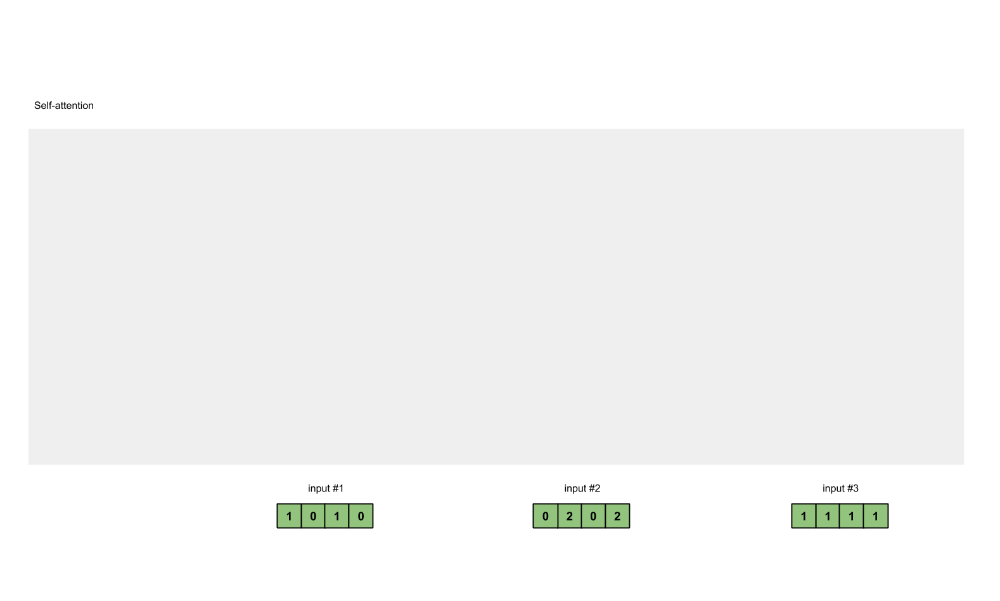

# AI Basic Notes

## Transformer

### Self-Attention Mechanism

In layman's terms,
a self-attention module takes in n inputs and returns n outputs:

- Self: allows the inputs to interact with each other
- Attention: find out who they should pay more attention to.
- The outputs are aggregates of these interactions and attention scores.

$$
Attention(Q, K, V) = softmax(\frac{QK^T}{\sqrt{d_k}})V
$$

[](https://towardsdatascience.com/illustrated-self-attention-2d627e33b20a)

The illustrations are divided into the following steps:

- Prepare inputs.
- Weights initialization (Constant/Random/Xavier/Kaiming Initialization).
- Derive query, key and value.
- Calculate attention scores for Input 1.
- Calculate softmax.
- Multiply scores with values.
- Sum weighted values to get Output 1.
- Repeat steps 4–7 for Input 2 & Input 3.

```python
Input 1: [1, 0, 1, 0]
Input 2: [0, 2, 0, 2]
Input 3: [1, 1, 1, 1]
```

Weights for query, key and value
(these weights are usually small numbers,
initialized randomly using an appropriate random distribution
like Gaussian, Xavier and Kaiming distributions):

```python
[[1, 0, 1], [[0, 0, 1], [[0, 2, 0],
 [1, 0, 0],  [1, 1, 0],  [0, 3, 0],
 [0, 0, 1],  [0, 1, 0],  [1, 0, 3],
 [0, 1, 1]]  [1, 1, 0]]  [1, 1, 0]]
```

Derive query, key and value:

```python
Query representations for every input:
               [1, 0, 1]
[1, 0, 1, 0]   [1, 0, 0]   [1, 0, 2]
[0, 2, 0, 2] x [0, 0, 1] = [2, 2, 2]
[1, 1, 1, 1]   [0, 1, 1]   [2, 1, 3]

Key representations for every input:
               [0, 0, 1]
[1, 0, 1, 0]   [1, 1, 0]   [0, 1, 1]
[0, 2, 0, 2] x [0, 1, 0] = [4, 4, 0]
[1, 1, 1, 1]   [1, 1, 0]   [2, 3, 1]

Value representations for every input:
               [0, 2, 0]
[1, 0, 1, 0]   [0, 3, 0]   [1, 2, 3]
[0, 2, 0, 2] x [1, 0, 3] = [2, 8, 0]
[1, 1, 1, 1]   [1, 1, 0]   [2, 6, 3]
```

$QK^T$ for Input 1:

```python
            [0, 4, 2]
[1, 0, 2] x [1, 4, 3] = [2, 4, 4]
            [1, 0, 1]
```

:::tip $XX^T$

$XX^T$ 为行向量分别与自己和其他两个行向量做内积 (点乘),
向量的内积表征两个向量的夹角 ($\cos\theta=\frac{a \cdot b}{|a||b|}$),
表征一个向量在另一个向量上的投影,
投影的值大, 说明两个向量相关度高 (Relevance/Similarity).

:::

Softmaxed([$\sigma(z_i) = \frac{e^{z_{i}}}{\sum_{j=1}^K e^{z_{j}}}$](https://en.wikipedia.org/wiki/Softmax_function))
attention scores $softmax(\frac{QK^T}{\sqrt{d_k}})$:

```python
softmax([2, 4, 4]) = [0.0, 0.5, 0.5]
```

:::tip $\sqrt{d_k}$

矩阵 $A$ 中每一个元素除以 $\sqrt{d_k}$ 后, 方差变为 1.
这使得 $softmax(A)$ 的分布"陡峭"程度与 $d$ 解耦,
从而使得训练过程中梯度值保持稳定.

:::

Alignment vectors (yellow vectors) $softmax(\frac{QK^T}{\sqrt{d_k}})V$:

```python
1: 0.0 * [1, 2, 3] = [0.0, 0.0, 0.0]
2: 0.5 * [2, 8, 0] = [1.0, 4.0, 0.0]
3: 0.5 * [2, 6, 3] = [1.0, 3.0, 1.5]
```

Addition to Output 1:

```python
[0.0, 0.0, 0.0] + [1.0, 4.0, 0.0] + [1.0, 3.0, 1.5] = [2.0, 7.0, 1.5]
```

Repeat for Input 2 & Input 3:

```python
Output 2: [2.0, 8.0, 0.0]
Output 3: [2.0, 7.8, 0.3]
```

```python
import torch
from torch.nn.functional import softmax

# 1. Prepare inputs
x = [
    [1, 0, 1, 0],  # Input 1
    [0, 2, 0, 2],  # Input 2
    [1, 1, 1, 1],  # Input 3
]
x = torch.tensor(x, dtype=torch.float32)

# 2. Weights initialization
w_query = [
    [1, 0, 1],
    [1, 0, 0],
    [0, 0, 1],
    [0, 1, 1],
]
w_key = [
    [0, 0, 1],
    [1, 1, 0],
    [0, 1, 0],
    [1, 1, 0],
]
w_value = [
    [0, 2, 0],
    [0, 3, 0],
    [1, 0, 3],
    [1, 1, 0],
]
w_query = torch.tensor(w_query, dtype=torch.float32)
w_key = torch.tensor(w_key, dtype=torch.float32)
w_value = torch.tensor(w_value, dtype=torch.float32)

# 3. Derive query, key and value
queries = x @ w_query
keys = x @ w_key
values = x @ w_value

# 4. Calculate attention scores
attn_scores = queries @ keys.T

# 5. Calculate softmax
attn_scores_softmax = softmax(attn_scores, dim=-1)
# tensor([[6.3379e-02, 4.6831e-01, 4.6831e-01],
#         [6.0337e-06, 9.8201e-01, 1.7986e-02],
#         [2.9539e-04, 8.8054e-01, 1.1917e-01]])
# For readability, approximate the above as follows
attn_scores_softmax = [
    [0.0, 0.5, 0.5],
    [0.0, 1.0, 0.0],
    [0.0, 0.9, 0.1],
]
attn_scores_softmax = torch.tensor(attn_scores_softmax)

# 6. Multiply scores with values
weighted_values = values[:, None] * attn_scores_softmax.T[:, :, None]

# 7. Sum weighted values
outputs = weighted_values.sum(dim=0)

print(outputs)
# tensor([[2.0000, 7.0000, 1.5000],
#         [2.0000, 8.0000, 0.0000],
#         [2.0000, 7.8000, 0.3000]])
# tensor([[1.9366, 6.6831, 1.5951],
#         [2.0000, 7.9640, 0.0540],
#         [1.9997, 7.7599, 0.3584]])
```

### Multi-Head Attention Mechanism

```python
from math import sqrt
import torch
import torch.nn

class Self_Attention(nn.Module):
    # input : batch_size * seq_len * input_dim
    # q : batch_size * input_dim * dim_k
    # k : batch_size * input_dim * dim_k
    # v : batch_size * input_dim * dim_v
    def __init__(self, input_dim, dim_k, dim_v):
        super(Self_Attention, self).__init__()
        self.q = nn.Linear(input_dim, dim_k)
        self.k = nn.Linear(input_dim, dim_k)
        self.v = nn.Linear(input_dim, dim_v)
        self._norm_fact = 1 / sqrt(dim_k)

    def forward(self, x):
        Q = self.q(x)  # Q: batch_size * seq_len * dim_k
        K = self.k(x)  # K: batch_size * seq_len * dim_k
        V = self.v(x)  # V: batch_size * seq_len * dim_v

        # Q * K.T() # batch_size * seq_len * seq_len
        atten = nn.Softmax(dim=-1)(torch.bmm(Q, K.permute(0, 2, 1))) * self._norm_fact

        # Q * K.T() * V # batch_size * seq_len * dim_v
        output = torch.bmm(atten, V)

        return output

class Self_Attention_Muti_Head(nn.Module):
    # input : batch_size * seq_len * input_dim
    # q : batch_size * input_dim * dim_k
    # k : batch_size * input_dim * dim_k
    # v : batch_size * input_dim * dim_v
    def __init__(self, input_dim, dim_k, dim_v, nums_head):
        super(Self_Attention_Muti_Head, self).__init__()
        assert dim_k % nums_head == 0
        assert dim_v % nums_head == 0
        self.q = nn.Linear(input_dim, dim_k)
        self.k = nn.Linear(input_dim, dim_k)
        self.v = nn.Linear(input_dim, dim_v)

        self.nums_head = nums_head
        self.dim_k = dim_k
        self.dim_v = dim_v
        self._norm_fact = 1 / sqrt(dim_k)

    def forward(self, x):
        Q = self.q(x).reshape(-1, x.shape[0], x.shape[1], self.dim_k // self.nums_head)
        K = self.k(x).reshape(-1, x.shape[0], x.shape[1], self.dim_k // self.nums_head)
        V = self.v(x).reshape(-1, x.shape[0], x.shape[1], self.dim_v // self.nums_head)
        print(x.shape)
        print(Q.size())

        # Q * K.T() # batch_size * seq_len * seq_len
        atten = nn.Softmax(dim=-1)(torch.matmul(Q, K.permute(0, 1, 3, 2)))

        # Q * K.T() * V # batch_size * seq_len * dim_v
        output = torch.matmul(atten, V).reshape(x.shape[0], x.shape[1], -1)

        return output
```
