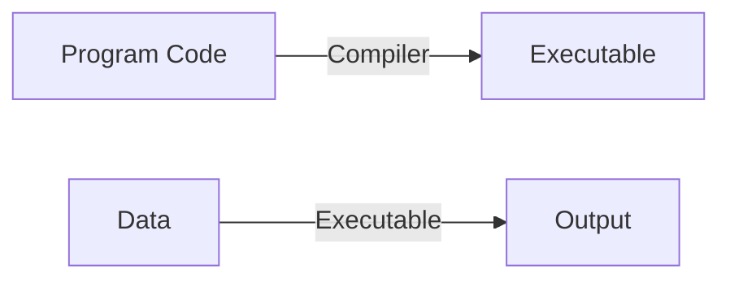
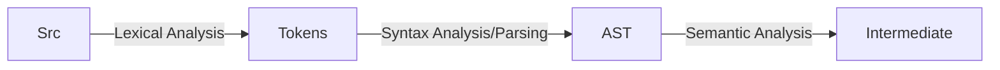
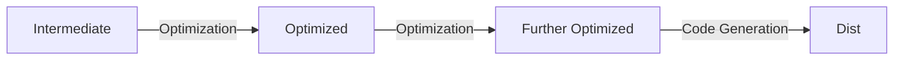

# Grammar

:::tip



:::

## Structure

Front-end:



Back-end:



Details:

- Lexical analysis (词法分析)
- Syntax analysis/parsing (语法分析)
- Semantic analysis (语义分析): type and scope
- Optimization
- Code generation: translate to other high level language/assembly code/machine code

## 符号与符号串

- 字母表/符号集: 元素的非空有穷集合
- 符号串: 字母表中的符号组成的任何有穷序列
- 固有头/尾: 非空首/尾子串
- 闭包: `Σ* = Σ0 U Σ1 U ... U Σn ...`.
- 正闭包: `Σ* = Σ1 U ... U Σn ...`.

## 文法与语言的形式化表示

- 文法 (Grammar): `G = (Vn, Vt, P, S)`, 非终结符集, 终结符集, 规则/产生式集, 开始符号.
- 语言 (Language): `L(G) = {x | S -> x, x <- Vt}` 文法 G 一切句子的集合.
- 句型: rhs of P, 句子: 不含非终结符的右部
- 直接推导: `v -> w`, 闭包推导: `v -*> w`, 正闭包推导: `v -+> w`.

## 乔姆斯基文法体系

- ((((3)2)1)0)
- 0 型文法: 任意文法
- 1 型文法: 上下文有关文法(context sensitive) αAβ -> αηβ
- 2 型文法(语法工具): 上下文无关文法 A -> α
- 3 型文法(词法工具): 正规文法

## 上下文无关文法

### 文法表示

G = (S, N, T, P):

- S: 开始符
- N: 非终结符集合
- T: 终结符集合
- P: 产生式规则集合 X `->` beta1, beta2, ..., betaN, X `<-` N, beta `<-` N+T

### 形式化表示

#### 简易表示

```cpp
Sentence -> Noun Verb Noun
Noun -> sheep
  | tiger
  | grass
  | water
Verb -> eat
  | drink
```

> S: Sentence, N: Sentence/Verb/Noun, T: sheep/tiger/grass/water/eat/drink

```cpp
E -> num
  |id
  |E + E
  |E `*` E
```

`S: E`, `N: E`, `T: num/id/+/*`.

#### 巴科斯范式

Backus-Naur Form:

- `::=`: `被定义为`.
- `word`: 字符本身.
- 双引号外的字: 语法部分.
- 尖括号(`< >`): 必选项(非终结符).
- 方括号(`[ ]`) : 0/1.
- 大括号(`{ }`) : 0/n.
- 竖线(`|`) : `OR`.

## 正规文法

正规文法可与正则语言相互转化:

- A -> aB|Ba
- A -> a

## Regular Expressions

### 基本定义

对于给定的字符集 C:

- 空串 `"\0"` 是正则表达式.
- 任意 `char <- C` 是正则表达式.
- 若 `M`, `N` 是正则表达式, 则 `M|N = {M, N}`,
  `MN = {mn|m <- M, n <- N}`,
  `M* = {"\0", M, MM, MMM, ...}` (选择/连接/闭包) 也是正则表达式.

### 形式表示

```bash
# 具有顺序性
e -> "\0" # basic definition
  | c # basic definition
  | e | e # recursive definition
  | ee # recursive definition
  | e* # recursive definition
```

### 正则语法糖

- `[a-z]` : a|...|z
- c? : 0/1 个 c
- c+ : 1/n 个 c
- `c{i, j}` : i-j 个 c
- "a*" : a* 自身(非 Kleene Closure)
- . : 除 '\n' 外的任意字符

```ts
// 标识符
const identifier = /[a-z_]\w*/gi

// decimal integer
const integer = /(\+|-)?(0|[1-9]\d*)/g

// decimal float
const float = /(\+|-)?(0|[1-9]\d*)?\.\d+/g
```

## 分析树

进行文法推导时生成的树:

- 根 : 开始符
- 内部结点 : 非终结符
- 叶子结点 : 终结符
- 层 : 一步推导(优先级影响推导顺序)
- 叶子结点串: 最终表达式
- 后序遍历 : 最终结果

### 推导类型

- 最左推导(leftmost)
- 最右推导(rightmost)(**规范推导**)

### 句型分析

- 短语: 若 `S -*> Aβ, A -+> α`, 则称 α 是句型 αβ 相对于非终结符 A 的短语
- 直接短语: `S -*> Aβ, A -> α`.
- 一个右句型的直接短语称为该句型的句柄(用于**自下而上**的归约分析)
- 最左归约: 归约最左的句柄, 最右归约: 归约最右的句柄

### Meaning Function

多对一:

L(syntax) = semantic: 多个语法对应一个语义(不同形式的表达式对应同一个意思)

### 二义性文法

一对多:

- 最左推导与最右推导得出的分析树不一致
- 若给定文法 G, 对于句子 s, 其有 2 种不同的分析树, 则称 G 是二义性文法
- 若一个上下文无关语言的所有文法都是二义性文法, 则称此语言是先天二义语言

#### 文法重写

```cpp
E -> E + T
  |T
T -> T * F
  |F
F -> num
  |id
```

> 消除 + 与 `*` 的二义性, 如 3+4`*`5

#### 优先级与结合性

声明优先级与结合性可在一定程度上消除文法的二义性

## 文法规则

- 有害规则: 使文法产生二义性的规则
- 多余规则: 不可达/不可终止的规则
- 2 型文法的 ε 规则: 当语言中不含有 ε 符号串, 则一定存在终结符集不含有 ε 的等价文法(代入法消除 ε)
- 保证非终结符 A 的有效性: `S -*> αAβ, A -+> t`.
