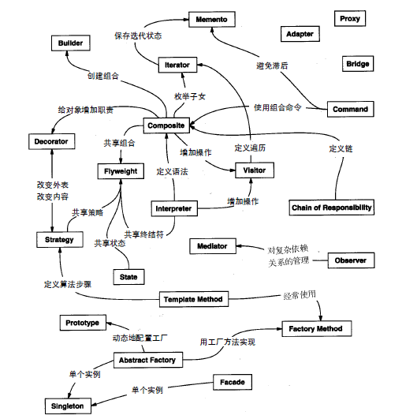
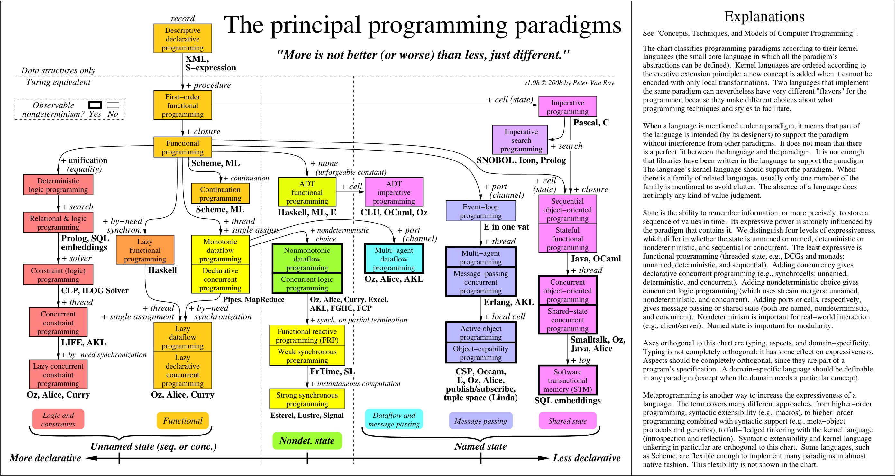

# Design Patterns Basic Notes

## Basic Patterns

:::tip Design Patterns
Software design is the art of managing dependencies and abstractions.
:::

- Minimizing dependencies.
- Introduce fitting abstractions.

### SOLID Principles

- Single Responsibility Principle: 单一功能原则.
- Open-closed Principle: 开闭原则.
- Liskov Substitution Principle: 里氏替换原则.
- Interface Segregation Principle: 接口隔离原则.
- Dependency Inversion Principle: 依赖反转原则.

:::tip SOLID Principles

- 单一职责是所有设计原则的基础.
- 开闭原则是设计的终极目标.
- 里氏替换原则强调的是子类替换父类后程序运行时的正确性, 它用来帮助实现开闭原则.
- 接口隔离原则用来帮助实现里氏替换原则, 同时它也体现了单一职责.
- 依赖倒置原则是过程式设计与面向对象设计的分水岭, 同时它也被用来指导接口隔离原则.

:::

#### Single Responsibility Principle

Too much functionality is in one class and you modify a piece of it,
it can be difficult to understand how that will affect other dependent modules:

- Singleton pattern.
- Decorator pattern.
- Proxy pattern.
- Iterator pattern.
- Visitor pattern.

```ts
// BAD
class Animal {
  constructor(name) {
    super(name);
  }

  getAnimalName() {
    return this.name;
  }

  saveAnimal(animal) {}
}

// GOOD
class Animal {
  constructor(name) {
    super(name);
  }

  getAnimalName() {
    return this.name;
  }
}

class AnimalDB {
  getAnimal(animal) {}
  saveAnimal(animal) {}
}
```

#### Open-Closed Principle

Allow users to add new functionalities without changing existing code,
open for extension, close for modification:

- Polymorphism (多态性).
- Adapter pattern.
- Decorator pattern.
- Proxy pattern.
- Chain of responsibility pattern.
- Iterator pattern.
- Pub-Sub pattern.
- State pattern.
- Strategy pattern.
- Template Method Pattern.

```ts
class Coder {
  constructor(fullName, language, hobby, education, workplace, position) {
    this.fullName = fullName;
    this.language = language;
    this.hobby = hobby;
    this.education = education;
    this.workplace = workplace;
    this.position = position;
  }
}

// BAD: filter by any other new property have to change CodeFilter's code.
class CoderFilter {
  filterByName(coders, fullName) {
    return coders.filter(coder => coder.fullName === fullName);
  }

  filterByLang(coders, language) {
    return coders.filter(coder => coder.language === language);
  }

  filterByHobby(coders, hobby) {
    return coders.filter(coder => coder.hobby === hobby);
  }
}

// GOOD
class CoderFilter {
  filterByProp = (array, propName, value) =>
    array.filter(element => element[propName] === value);
}
```

```java
const animals: Array<Animal> = [
    new Animal('lion'),
    new Animal('mouse')
];

function AnimalSound(a: Array<Animal>) {
    for(int i = 0; i <= a.length; i++) {
        if(a[i].name == 'lion')
            log('roar');
        if(a[i].name == 'mouse')
            log('squeak');
    }
}
AnimalSound(animals);
```

```java
class Animal {
        makeSound();
        //...
}
class Lion extends Animal {
    makeSound() {
        return 'roar';
    }
}
class Squirrel extends Animal {
    makeSound() {
        return 'squeak';
    }
}
class Snake extends Animal {
    makeSound() {
        return 'hiss';
    }
}
//...
function AnimalSound(a: Array<Animal>) {
    for(int i = 0; i <= a.length; i++) {
        log(a[i].makeSound());
    }
}
AnimalSound(animals);
```

```java
class Discount {
    giveDiscount() {
        if(this.customer == 'fav') {
            return this.price * 0.2;
        }
        if(this.customer == 'vip') {
            return this.price * 0.4;
        }
    }
}
```

```java
class VIPDiscount: Discount {
    getDiscount() {
        return super.getDiscount() * 2;
    }
}

class SuperVIPDiscount: VIPDiscount {
    getDiscount() {
        return super.getDiscount() * 2;
    }
}
```

#### Liskov Substitution Principle

Objects of ParentType can be replaced with objects of SubType without altering.
Altering shows that SubType should not be subtype of ParentType
(break Open Closed Principle),
you should re-design ParentType and SubType.

```java
function AnimalLegCount(a: Array<Animal>) {
    for(int i = 0; i <= a.length; i++) {
        if(typeof a[i] == Lion)
            log(LionLegCount(a[i]));
        if(typeof a[i] == Mouse)
            log(MouseLegCount(a[i]));
        if(typeof a[i] == Snake)
            log(SnakeLegCount(a[i]));
    }
}
AnimalLegCount(animals);
```

```java
class Animal {
    //...
    LegCount();
}

//...
class Lion extends Animal{
    //...
    LegCount() {
        //...
    }
}
//...

function AnimalLegCount(a: Array<Animal>) {
    for(let i = 0; i <= a.length; i++) {
        a[i].LegCount();
    }
}
AnimalLegCount(animals);
```

#### Interface Segregation Principle

- Make **fine grained** interfaces that are client specific.
- Clients should not be forced to depend upon interfaces that they do not use.

```java
// BAD.
interface IShape {
    drawCircle();
    drawSquare();
    drawRectangle();
}

class Circle implements IShape {
    drawCircle(){
        //...
    }
    drawSquare(){
        //...
    }
    drawRectangle(){
        //...
    }
}
class Square implements IShape {
    drawCircle(){
        //...
    }
    drawSquare(){
        //...
    }
    drawRectangle(){
        //...
    }
}
class Rectangle implements IShape {
    drawCircle(){
        //...
    }
    drawSquare(){
        //...
    }
    drawRectangle(){
        //...
    }
}
```

```java
// GOOD.
interface IShape {
    draw();
}
interface ICircle {
    drawCircle();
}
interface ISquare {
    drawSquare();
}
interface IRectangle {
    drawRectangle();
}
interface ITriangle {
    drawTriangle();
}
class Circle implements ICircle {
    drawCircle() {
        //...
    }
}
class Square implements ISquare {
    drawSquare() {
        //...
    }
}
class Rectangle implements IRectangle {
    drawRectangle() {
        //...
    }
}
class Triangle implements ITriangle {
    drawTriangle() {
        //...
    }
}
class CustomShape implements IShape {
   draw(){
      //...
   }
}
```

```java
// GOOD.
class Circle implements IShape {
    draw(){
        //...
    }
}

class Triangle implements IShape {
    draw(){
        //...
    }
}

class Square implements IShape {
    draw(){
        //...
    }
}

class Rectangle implements IShape {
    draw(){
        //...
    }
}
```

#### Dependency Inversion Principle

Dependency should be on **abstractions** not concretions:

- High-level modules should not depend upon low-level modules.
  Both should depend upon **abstractions**
- Abstractions should not depend on details.
  Details should depend upon abstractions
- Pros:
  - Loosely coupled modules.
  - Better reusability.
  - Better testability.

```java
class XMLHttpService extends XMLHttpRequestService {}
class Http {
    constructor(private xmlHttpService: XMLHttpService) { }
    get(url: string , options: any) {
        this.xmlHttpService.request(url,'GET');
    }
    post() {
        this.xmlHttpService.request(url,'POST');
    }
    //...
}
```

```java
interface Connection {
    request(url: string, opts:any);
}

// Abstraction not upon on details (but upon on abstractions)
class Http {
    constructor(private httpConnection: Connection) { }
    get(url: string , options: any) {
        this.httpConnection.request(url,'GET');
    }
    post() {
        this.httpConnection.request(url,'POST');
    }
    //...
}

class XMLHttpService implements Connection {
    const xhr = new XMLHttpRequest();
    //...
    request(url: string, opts:any) {
        xhr.open();
        xhr.send();
    }
}
class NodeHttpService implements Connection {
    request(url: string, opts:any) {
        //...
    }
}
class MockHttpService implements Connection {
    request(url: string, opts:any) {
        //...
    }
}
```

### Least Knowledge Principle

最少知识原则 (Law of Demeter):

- 一个软件实体 (变量/对象/类/函数/模块/系统) 应当尽可能少地与其他实体发生相互作用.
- 若两个对象无需直接通信, 则两个对象不应直接相互联系, 引入一个第三者对象承担通信作用.
- Facade pattern.
- Mediator pattern.

## Common Design Patterns



### Patterns Classification

#### Creation Patterns

- Factory Method (工厂方法): 通过将数据和事件接口化来构建若干个子类.
- Abstract Factory (抽象工厂): 建立若干族类的一个实例, 这个实例不需要具体类的细节信息 (抽象类).
- Builder (建造者): 将对象的构建方法和其表现形式分离开来, 总是构建相同类型的对象.
- Prototype (原型): 一个完全初始化的实例, 用于拷贝或者克隆.
- Singleton (单例): 一个类只有唯一的一个实例, 这个实例在整个程序中有一个全局的访问点.

#### Structural Patterns

- Adapter (适配器模式): 将不同类的接口进行匹配与调整, 使得内部接口不兼容的类可以协同工作.
- Bridge (桥接模式): 将对象的接口从其实现中分离出来, 这样对象的实现和接口可以独立的变化.
- Composite (组合模式):
  通过将简单可组合的对象组合起来, 构成一个完整的对象,
  这个对象的能力将会超过这些组成部分的能力的总和, 产生新的能力.
- Decorator (装饰器): 动态给对象增加一些可替换的处理流程.
- Facade (外观模式): 一个类隐藏了内部子系统的复杂度, 只暴露出一些简单的接口.
- Flyweight (享元模式) 一个细粒度对象, 用于将包含在其它地方的信息 在不同对象之间高效地共享.
- Proxy (代理模式): 一个充当占位符的对象用来代表一个真实的对象.

#### Behavioral Patterns

- Chain of Responsibility (响应链): 一种将请求在一串对象中传递的方式, 寻找可以处理这个请求的对象.
- Command (命令): 封装命令请求为一个对象, 从而使记录日志, 队列缓存请求, 未处理请求进行错误处理 这些功能称为可能.
- Interpreter (解释器): 将语言元素包含在一个应用中的一种方式, 用于匹配目标语言的语法.
- Iterator (迭代器): 在不需要直到集合内部工作原理的情况下, 顺序访问一个集合里面的元素.
- Mediator (中介者模式): 在类之间定义简化的通信方式, 用于避免类之间显式的持有彼此的引用.
- Observer (观察者模式): 用于将变化通知给多个类的方式, 可以保证类之间的一致性.
- State (状态): 当对象状态改变时, 改变对象的行为.
- Strategy (策略): 将算法封装到类中, 将选择和实现分离开来.
- Template Method (模板方法): 在一个方法中为某个算法建立一层外壳, 将算法的具体步骤交付给子类去做.
- Visitor (访问者): 为类增加新的操作而不改变类本身.

### Factory Method Pattern

Creating objects without specify exact object class:
not calling a constructor directly.

#### Static Factory Method Pattern

```ts
CoordinateSystem = {
  CARTESIAN: 0,
  POLAR: 1,
};

class Point {
  constructor(x, y) {
    this.x = x;
    this.y = y;
  }

  static get factory() {
    return new PointFactory();
  }
}

class PointFactory {
  static newCartesianPoint(x, y) {
    return new Point(x, y);
  }

  static newPolarPoint(rho, theta) {
    return new Point(rho * Math.cos(theta), rho * Math.sin(theta));
  }
}

const point = PointFactory.newPolarPoint(5, Math.PI / 2);
const point2 = PointFactory.newCartesianPoint(5, 6);
```

#### Dynamic Factory Method Pattern

```ts
class Vehicle {
  constructor({
    type = 'vehicle',
    state = 'brand new',
    color = 'white',
    speed = 0,
  } = {}) {
    this.type = type;
    this.state = state;
    this.color = color;
    this.speed = speed;
  }

  run(...args) {
    if (args.length === 0) {
      console.log(`${this.type} - run with: ${this.speed}km/s`);
    } else if (toString.apply(args[0]) === '[object Number]') {
      this.speed = args[0];
    }
  }

  withColor(...args) {
    if (args.length === 0) {
      console.log(`The color of this ${this.type} product is : ${this.color}`);
    } else if (toString.apply(args[0]) === '[object String]') {
      this.color = args[0];
    }
  }

  reform(funcName, newFunc) {
    if (
      typeof this[funcName] === 'function' ||
      typeof this.prototype[funcName] === 'function'
    ) {
      delete this[funcName];
      this.prototype[funcName] = newFunc;
    }
  }

  addFeature(funcName, newFunc) {
    if (typeof this[funcName] === 'undefined') {
      this[funcName] = newFunc;
      this.prototype[funcName] = newFunc;
    }
  }
}

class Car extends Vehicle {
  constructor({
    type = 'car',
    state = 'brand new',
    color = 'silver',
    speed = 10,
    doors = 4,
  } = {}) {
    super({ type, state, color, speed });
    this.doors = doors;
  }
}

class Truck extends Vehicle {
  constructor({
    type = 'truck',
    state = 'used',
    color = 'blue',
    speed = 8,
    wheelSize = 'large',
  } = {}) {
    super({ type, state, color, speed });
    this.wheelSize = 'large';
  }
}

class VehicleFactory {
  constructor() {
    this.VehicleClass = Car;
  }

  createVehicle(options) {
    switch (options.vehicleType) {
      case 'car':
        this.VehicleClass = Car;
        break;
      case 'truck':
        this.VehicleClass = Truck;
        break;
      default:
        break;
    }

    return new this.VehicleClass(options);
  }
}

class CarFactory extends VehicleFactory {
  constructor() {
    super();
    this.VehicleClass = Car;
  }
}

class TruckFactory extends VehicleFactory {
  constructor() {
    super();
    this.VehicleClass = Truck;
  }
}

const vehicleFactory = new VehicleFactory();
const car = vehicleFactory.createVehicle({
  vehicleType: 'car',
  color: 'yellow',
  doors: 6,
});
const movingTruck = vehicleFactory.createVehicle({
  vehicleType: 'truck',
  state: 'like new',
  color: 'red',
  wheelSize: 'small',
});

const truckFactory = new TruckFactory();
const bigTruck = truckFactory.createVehicle({
  state: 'bad.',
  color: 'pink',
  wheelSize: 'so big',
});
```

#### Asynchronous Factory Method Pattern

```ts
class DataContainer {
  #data;
  #active = false;

  #init(data) {
    this.#active = true;
    this.#data = data;
    return this;
  }

  #check() {
    if (!this.#active) {
      throw new TypeError('Not created by factory');
    }
  }

  getData() {
    this.#check();
    return `DATA: ${this.#data}`;
  }

  static async create() {
    const data = await Promise.resolve('downloaded');
    return new this().#init(data);
  }
}

DataContainer.create().then(dc =>
  assert.equal(dc.getData(), 'DATA: downloaded')
);
```

### Abstract Factory Pattern

Encapsulate **a group of individual factories**
that have a common theme without
specifying their concrete classes.

```ts
class Drink {
  consume() {}
}

class Tea extends Drink {
  consume() {
    console.log('This is Tea');
  }
}

class Coffee extends Drink {
  consume() {
    console.log(`This is Coffee`);
  }
}

class DrinkFactory {
  prepare(amount) {}
}

class TeaFactory extends DrinkFactory {
  makeTea() {
    console.log(`Tea Created`);
    return new Tea();
  }
}

class CoffeeFactory extends DrinkFactory {
  makeCoffee() {
    console.log(`Coffee Created`);
    return new Coffee();
  }
}

const teaDrinkFactory = new TeaFactory();
const tea = teaDrinkFactory.makeTea();
tea.consume();
```

```ts
class AbstractVehicleFactory {
  constructor() {
    // Vehicle types
    this.types = {};
  }

  getVehicle(type, customizations) {
    const Vehicle = this.types[type];

    return Vehicle ? new Vehicle(customizations) : null;
  }

  registerVehicle(type, Vehicle) {
    const proto = Vehicle.prototype;

    // Only register classes that fulfill the vehicle contract
    if (proto.drive && proto.breakDown) {
      this.types[type] = Vehicle;
    }

    return this;
  }
}

// Usage:
const abstractVehicleFactory = new AbstractVehicleFactory()
  .registerVehicle('car', Car)
  .registerVehicle('truck', Truck);

// Instantiate a new car based on the abstract vehicle type
const car = abstractVehicleFactory.getVehicle('car', {
  color: 'lime green',
  state: 'like new',
});

// Instantiate a new truck in a similar manner
const truck = abstractVehicleFactory.getVehicle('truck', {
  wheelSize: 'medium',
  color: 'neon yellow',
});
```

### Builder Pattern

Flexible object creation with chain style calls.

```ts
class Person {
  constructor() {
    this.streetAddress = '';
    this.postcode = '';
    this.city = '';
    this.companyName = '';
    this.position = '';
    this.annualIncome = 0;
  }

  toString() {
    return (
      `Person lives at ${this.streetAddress}, ${this.city}, ${this.postcode}\n` +
      `and works at ${this.companyName} as a ${this.position} earning ${this.annualIncome}`
    );
  }
}

class PersonBuilder {
  constructor(person = new Person()) {
    this.person = person;
  }

  get lives() {
    return new PersonAddressBuilder(this.person);
  }

  get works() {
    return new PersonJobBuilder(this.person);
  }

  build() {
    return this.person;
  }
}

class PersonJobBuilder extends PersonBuilder {
  constructor(person) {
    super(person);
    console.log('New');
  }

  at(companyName) {
    this.person.companyName = companyName;
    return this;
  }

  asA(position) {
    this.person.position = position;
    return this;
  }

  earning(annualIncome) {
    this.person.annualIncome = annualIncome;
    return this;
  }
}

class PersonAddressBuilder extends PersonBuilder {
  constructor(person) {
    super(person);
    console.log('New');
  }

  at(streetAddress) {
    this.person.streetAddress = streetAddress;
    return this;
  }

  withPostcode(postcode) {
    this.person.postcode = postcode;
    return this;
  }

  in(city) {
    this.person.city = city;
    return this;
  }
}

const personBuilder = new PersonBuilder();
const person = personBuilder.lives
  .at('ABC Road')
  .in('Multan')
  .withPostcode('66000')
  .works.at('Beijing')
  .asA('Engineer')
  .earning(10000)
  .build();
```

### Prototype Pattern

可以使用原型模式来减少创建新对象的成本:

- `Object.create()`.
- Object shallow clone.

```ts
class Car {
  constructor(name, model) {
    this.name = name;
    this.model = model;
  }

  SetName(name) {
    console.log(`${name}`);
  }

  clone() {
    return new Car(this.name, this.model);
  }
}

const car = new Car();
car.SetName('Audi');

const car2 = car.clone();
car2.SetName('BMW');
```

### Singleton Pattern

:::tip Singleton Use Case

- Redux/VueX global store.
- Window 对象.
- 全局配置.
- 全局缓存.
- 线程池.
- 内存池.

:::

#### Class Singleton Pattern

```ts
class Singleton {
  constructor() {
    const instance = this.constructor.instance;
    if (instance) return instance;
    this.constructor.instance = this;
  }

  say() {
    console.log('Saying...');
  }
}

class Singleton {
  private static instance: Singleton;
  private constructor() {}

  public static getInstance() {
    if (!Singleton.instance) {
      Singleton.instance = new Singleton();
    }

    return Singleton.instance;
  }

  someMethod() {}
}

const instance = Singleton.getInstance();
```

#### Closure Singleton Pattern

```ts
const createLoginLayer = (function (creator) {
  let singleton;

  return function () {
    if (!singleton) singleton = creator();
    return singleton;
  };
})(loginCreator);
```

### Adapter Pattern

适配器通过内部使用新接口规定的属性/方法, 创建一个外观与旧接口一致的方法
(兼容旧代码):

- `old.method()`.
- `adapter.method()`:
  实现此 method 时, 使用了新接口规定的属性/方法.
- 符合开放封闭原则.

:::tip Adapter Use Case

- API adapter.

:::

```ts
class Calculator1 {
  constructor() {
    this.operations = function (value1, value2, operation) {
      switch (operation) {
        case 'add':
          return value1 + value2;
        case 'sub':
          return value1 - value2;
        default:
          throw new Error('Unsupported operations!');
      }
    };
  }
}

class Calculator2 {
  constructor() {
    this.add = function (value1, value2) {
      return value1 + value2;
    };

    this.sub = function (value1, value2) {
      return value1 - value2;
    };
  }
}

class CalcAdapter {
  constructor() {
    const cal2 = new Calculator2();

    this.operations = function (value1, value2, operation) {
      switch (operation) {
        case 'add':
          return cal2.add(value1, value2);
        case 'sub':
          return cal2.sub(value1, value2);
        default:
          throw new Error('Unsupported operations!');
      }
    };
  }
}
```

```ts
// old interface
function Shipping() {
  this.request = function (zipStart, zipEnd, weight) {
    // ...
    return '$49.75';
  };
}

// new interface
function AdvancedShipping() {
  this.login = function (credentials) {
    /* ... */
  };
  this.setStart = function (start) {
    /* ... */
  };
  this.setDestination = function (destination) {
    /* ... */
  };
  this.calculate = function (weight) {
    return '$39.50';
  };
}

// adapter interface
function AdapterShipping(credentials) {
  const shipping = new AdvancedShipping();

  shipping.login(credentials);

  return {
    request(zipStart, zipEnd, weight) {
      shipping.setStart(zipStart);
      shipping.setDestination(zipEnd);
      return shipping.calculate(weight);
    },
  };
}
```

```ts
const shipping = new Shipping();
const adapterShipping = new AdapterShipping(credentials);

// original shipping object and interface
let cost = shipping.request('78701', '10010', '2 lbs');
log.add(`Old cost: ${cost}`);
// new shipping object with adapted interface
cost = adapter.request('78701', '10010', '2 lbs');
```

### Bridge Pattern

Split large class or set of closely related classes into two separate hierarchies:

- 分离抽象和实现 (Separate abstracts and implements).
- 分离对象的两种不同属性. `e.g` 从 2 个不同维度上扩展对象.

```ts
class VectorRenderer {
  renderCircle(radius) {
    console.log(`Drawing a circle of radius ${radius}`);
  }
}

class RasterRenderer {
  renderCircle(radius) {
    console.log(`Drawing pixels for circle of radius ${radius}`);
  }
}

class Shape {
  constructor(renderer) {
    this.renderer = renderer;
  }
}

class Circle extends Shape {
  constructor(renderer, radius) {
    super(renderer);
    this.radius = radius;
  }

  draw() {
    this.renderer.renderCircle(this.radius);
  }

  resize(factor) {
    this.radius *= factor;
  }
}

const raster = new RasterRenderer();
const vector = new VectorRenderer();
const circle = new Circle(vector, 5);
circle.draw();
circle.resize(2);
circle.draw();
```

### Composite Pattern

- 封装: 组合模式将对象组合成树形结构, 以表示 `部分+整体` 的层次结构.
- 多态: 组合模式通过对象的多态性表现, 使得用户对单个对象和组合对象的使用具有一致性.
- 扩展: 通过将简单可组合的对象组合起来, 构成一个完整的对象,
  这个对象的能力将会超过这些组成部分的能力的总和, 产生新的能力.
- 组合模式是一种 `HAS-A` (聚合) 的关系, 而不是 `IS-A`:
  组合对象包含一组叶对象, 但 Leaf 并不是 Composite 的子类 (尽管称为父子节点).
  组合对象把请求委托给它所包含的所有叶对象,
  它们能够合作的关键是拥有**相同的接口**.

:::tip Composite Use Case

- DOM.
- AST.
- Directory Tree.

:::

#### Composite Pattern Implementation

树形结构:

- 根结点:
  - Component 抽象对象/接口 采用最大宽接口,定义内点和叶点的操作.
  - 将内点特有的操作集设为缺省操作集 (空实现).
- 内点:
  - 持有父结点和子节点的引用 (可使用 Flyweight 模式实现共享).
  - 操作集: 内点操作集 (可添加/删除组件).
- 叶点:
  - 持有父结点引用.
  - 操作集: 叶点操作集 (不可添加/删除组件).

```ts
interface Component {
  add: (Component) => void;
  remove: (Component) => void;
  do: (Context) => void;
}

class Composite implements Component {
  add(child: Component) {
    console.log('Add child');
  }

  remove(child: Component) {
    console.log('Remove child');
  }

  do(context: Context) {
    console.log('Do composite work');

    for (const child of this.children) {
      child.do(context);
    }
  }
}

class Leaf implements Component {
  add(child: Component) {
    throw new UnsupportedOperationException();
  }

  remove(child: Component) {
    if (this.parent === null) return;
    console.log('Remove self');
  }

  do(context: Context) {
    console.log('Do leaf work');
  }
}

const root = new Composite();
const c1 = new Composite();
const c2 = new Composite();
const leaf1 = new Leaf();
const leaf2 = new Leaf();
root.add(c1);
root.add(c2);
c1.add(leaf1);
c1.add(leaf2);
root.do();
```

### Decorator Pattern

- 重写/重载/扩展对象原有的行为 (Methods), 但不改变对象原有属性.
- 可以添加新属性, 并围绕新属性扩展对象的原行为 e.g 原对象只会说中文, 装饰后同时说中文与英文.
- 避免了通过继承来为类型添加新职责, 通过继承的方式容易造成子类的膨胀.
- 保持接口的一致性, **动态**改变对象的外观/职责.
- ConcreteDecorator 类: `private ClassName component` 拥有一个对象引用.
- 在 JS 中, 可以利用 `Closure` (闭包) + `Higher Order Function` (高阶函数) 快速实现装饰器模式.
- 符合开放封闭原则和单一职责模式.

:::tip Decorator Use Case

- React HOC Components.
- ES2016 and TypeScript `@decorator`.
- Guard: form validator.
- Interceptor:
  - HTTP request and response decorator.
  - Web statistic tool.
- Transformer.
- AOP: Aspect Oriented Programming.

:::

```ts
function __decorate(decorators, target) {
  const decorateTarget = target;

  for (const decorator of decorators) {
    decorateTarget = decorator(decorateTarget) || decorateTarget;
  }

  return decorateTarget;
}
```

```ts
class MacBook {
  constructor() {
    this.cost = 997;
    this.screenSize = 11.6;
  }

  getCost() {
    return this.cost;
  }

  getScreenSize() {
    return this.screenSize;
  }
}

// Decorator 1
class Memory extends MacBook {
  constructor(macBook) {
    super();
    this.macBook = macBook;
  }

  getCost() {
    return this.macBook.getCost() + 75;
  }
}

// Decorator 2
class Engraving extends MacBook {
  constructor(macBook) {
    super();
    this.macBook = macBook;
  }

  getCost() {
    return this.macBook.getCost() + 200;
  }
}

// Decorator 3
class Insurance extends MacBook {
  constructor(macBook) {
    super();
    this.macBook = macBook;
  }

  getCost() {
    return this.macBook.getCost() + 250;
  }
}

let mb = new MacBook();
mb = new Memory(mb);
mb = new Engraving(mb);
mb = new Insurance(mb);

console.log(mb.getCost());
// Outputs: 1522
console.log(mb.getScreenSize());
// Outputs: 11.6
```

### Facade Pattern

封装复杂逻辑:

将多个复杂的子系统`封装 + 合并`,
实现一个复杂功能,
但只暴露一个简单的接口.

```ts
class CPU {
  freeze() {
    console.log('Freezed....');
  }

  jump(position) {
    console.log('Go....');
  }

  execute() {
    console.log('Run....');
  }
}

class Memory {
  load(position, data) {
    console.log('Load....');
  }
}

class HardDrive {
  read(lba, size) {
    console.log('Read....');
  }
}

class ComputerFacade {
  constructor() {
    this.processor = new CPU();
    this.ram = new Memory();
    this.hd = new HardDrive();
  }

  start() {
    this.processor.freeze();
    this.ram.load(
      this.BOOT_ADDRESS,
      this.hd.read(this.BOOT_SECTOR, this.SECTOR_SIZE)
    );
    this.processor.jump(this.BOOT_ADDRESS);
    this.processor.execute();
  }
}

const computer = new ComputerFacade();
computer.start();
```

```ts
sabertazimi.addMyEvent = function (el, ev, fn) {
  if (el.addEventListener) {
    el.addEventListener(ev, fn, false);
  } else if (el.attachEvent) {
    el.attachEvent(`on${ev}`, fn);
  } else {
    el[`on${ev}`] = fn;
  }
};
```

### Flyweight Pattern

减小内存开销 (**Performance Optimization**):

- **内部**信息: 对象中的内部方法所需信息/属性, 一个单独的享元可替代大量具有相同内在信息的对象.
- **外部**状态: 作为方法参数, 使之适应不同的外部状态 (Context), 实例对象差异.
- 某个类型的对象有大量的实例, 对这些实例进行分类, 合并相同分类的对象, 只创建少量实例 (享元).
- 通过享元工厂来管理一组享元:
  - 当所需享元已存在时, 返回已存在享元.
  - 当所需享元不存在时, 创建新享元.

:::tip Flyweight Use Case

- Objects pool.
- DOM nodes pool.
- Event delegation.
- Reduce similar object instances.

:::

#### Flyweight Factory Pattern

```ts
class Flyweight {
  constructor(make, model, processor) {
    this.make = make;
    this.model = model;
    this.processor = processor;
  }
}

class FlyweightFactory {
  static flyweights = new Map();

  static get(make, model, processor) {
    const id = make + model;

    if (FlyweightFactory.flyweights.has(id)) {
      return FlyweightFactory.flyweights.get(id);
    }

    const flyweight = new Flyweight(make, model, processor);
    FlyweightFactory.flyweights.set(id, flyweight);
    return flyweight;
  }

  static getCount() {
    return FlyweightFactory.flyweights.size;
  }
}

class Computer {
  constructor(make, model, processor, memory, tag) {
    this.flyweight = FlyweightFactory.get(make, model, processor);
    this.memory = memory;
    this.tag = tag;
    this.getMake = function () {
      return this.flyweight.make;
    };
  }
}

class ComputerCollection {
  computers = new Map();

  add(make, model, processor, memory, tag) {
    this.computers.set(tag, new Computer(make, model, processor, memory, tag));
  }

  get(tag) {
    return this.computers.get(tag);
  }

  getCount() {
    return this.computers.size;
  }
}

const computers = new ComputerCollection();

computers.add('Dell', 'Studio XPS', 'Intel', '5G', 'Y755P');
computers.add('Dell', 'Studio XPS', 'Intel', '6G', 'X997T');
computers.add('Dell', 'Studio XPS', 'Intel', '2G', 'NT777');
computers.add('Dell', 'Studio XPS', 'Intel', '2G', '0J88A');
computers.add('HP', 'Envy', 'Intel', '4G', 'CNU883701');
computers.add('HP', 'Envy', 'Intel', '2G', 'TXU003283');

console.log(`Computers: ${computers.getCount()}`); // 6.
console.log(`Flyweights: ${FlyweightFactory.getCount()}`); // 2.
```

#### Flyweight Pool Pattern

DOM pool:

```ts
class ObjectPool<T, P> {
  objectFactory: () => T;
  objectPool: [T];

  constructor(objectFactory: () => T) {
    this.objectFactory = objectFactory;
    this.objectPool = [];
  }

  create(...args: P) {
    return objectPool.length === 0 ? objectFactory(args) : objectPool.shift();
  }

  recover(obj: T) {
    objectPool.push(obj);
  }
}

const iframeFactory = new ObjectPool(() => {
  const iframe = document.createElement('iframe');
  document.body.appendChild(iframe);
  iframe.onload = function () {
    iframe.onload = null;
    iframeFactory.recover(iframe);
  };
  return iframe;
});

const iframe1 = iframeFactory.create();
iframe1.src = 'http:// baidu.com';
const iframe2 = iframeFactory.create();
iframe2.src = 'http:// QQ.com';
setTimeout(function () {
  const iframe3 = iframeFactory.create();
  iframe3.src = 'http:// 163.com';
}, 3000);
```

### Proxy Pattern

通过一个代理对象:

- 临时存储原对象方法调用产生的一系列结果 (新建对象),
  减少重复对象的产生.
- 代理对象可以为中间过程透明地增加额外逻辑: 预加载/缓存/合并/验证/转换等.
- 昂贵的对象创建或任务执行可以延迟到代理对象中执行.
- 代理类型: 远程/保护/虚拟/缓存代理.
- 符合开放封闭原则.

:::tip Proxy Use Case

- 远程代理:
  - 代理软件.
  - 防火墙代理.
- 保护代理:
  - 跨域处理.
  - 路由保护代理.
- 虚拟代理:
  - 图片预加载.
  - 智能引用代理: C++ smart pointer, Rust `RefCell`, Linux file descriptor.
  - 写时拷贝代理: 内存页, DLL.
- 缓存代理:
  - 缓存函数.
  - 缓存服务器: React Query (cache data).

:::

代理模式强调一种关系 (Proxy 与它的实体之间的关系), 这种关系可以静态地表达.
装饰者模式用于一开始不能确定对象的全部功能.
代理模式通常只有一层`代理-本体`的引用,
装饰者模式经常会形成一条长长的装饰链.

```ts
class Percentage {
  constructor(percent) {
    this.percent = percent;
  }

  toString() {
    return `${this.percent}&`;
  }

  valueOf() {
    return this.percent / 100;
  }
}

const fivePercent = new Percentage(5);
console.log(fivePercent.toString());
console.log(`5% of 50 is ${50 * fivePercent}`);
```

```ts
function GeoCoder() {
  this.getLatLng = function (address) {
    if (address === 'Amsterdam') {
      return '52.3700° N, 4.8900° E';
    } else if (address === 'London') {
      return '51.5171° N, 0.1062° W';
    } else if (address === 'Paris') {
      return '48.8742° N, 2.3470° E';
    } else if (address === 'Berlin') {
      return '52.5233° N, 13.4127° E';
    } else {
      return '';
    }
  };
}

function GeoProxy() {
  const geocoder = new GeoCoder();
  const geocache = {};

  return {
    getLatLng(address) {
      if (!geocache[address]) {
        geocache[address] = geocoder.getLatLng(address);
      }
      log.add(`${address}: ${geocache[address]}`);
      return geocache[address];
    },
    getCount() {
      let count = 0;
      for (const code in geocache) {
        count++;
      }
      return count;
    },
  };
}
```

Proxy in `Vue`:

```ts
const original = { name: 'jeff' };

const reactive = new Proxy(original, {
  get(target, key) {
    console.log('Tracking: ', key);
    return target[key];
  },
  set(target, key, value) {
    console.log('updating UI...');
    return Reflect.set(target, key, value);
  },
});

console.log(reactive.name); // 'Tracking: name'
reactive.name = 'bob'; // 'updating UI...'
```

### Chain of Responsibility Pattern

一种将请求在一串对象中传递的方式, 寻找可以处理这个请求的对象:

- 请求发送者只需知道链中的第一个节点, 从而降低发送者和一组接收者之间的强耦合.
- 请求发送者可以任意选择第一个节点, 从而减少请求在链中的传递次数.
- 职责链中的节点数量和顺序可以自由变化.
- 符合开放封闭原则.

:::tip CoR Use Case

- Middlewares:
  - Redux.
  - Express/Koa.
  - NestJS.
- AOP: Aspect Oriented Programming.
- DOM event capture and bubble chian.
- JavaScript Prototype chain.
- JavaScript Scope chain.

:::

```ts
class Creature {
  constructor(name, attack, defense) {
    this.name = name;
    this.attack = attack;
    this.defense = defense;
  }

  toString() {
    return `${this.name} (${this.attack}/${this.defense})`;
  }
}

// Link Node.
class CreatureModifier {
  constructor(creature) {
    this.creature = creature;
    this.next = null;
  }

  // Build chains.
  add(modifier) {
    if (this.next) this.next.add(modifier);
    else this.next = modifier;
  }

  // Pass objects along to chains.
  handle() {
    if (this.next) this.next.handle();
  }
}

class NoBonusesModifier extends CreatureModifier {
  constructor(creature) {
    super(creature);
    console.log('New');
  }

  handle() {
    console.log('No bonuses for you!');
  }
}

class DoubleAttackModifier extends CreatureModifier {
  constructor(creature) {
    super(creature);
    console.log('New');
  }

  handle() {
    console.log(`Doubling ${this.creature.name}'s attack`);
    this.creature.attack *= 2;
    super.handle(); // Call next();
  }
}

class IncreaseDefenseModifier extends CreatureModifier {
  constructor(creature) {
    super(creature);
    console.log('New');
  }

  handle() {
    if (this.creature.attack <= 2) {
      console.log(`Increasing ${this.creature.name}'s defense`);
      this.creature.defense++;
    }
    super.handle(); // Call next();
  }
}

const peekachu = new Creature('Peekachu', 1, 1);
console.log(peekachu.toString());

const root = new CreatureModifier(peekachu);
root.add(new DoubleAttackModifier(peekachu));
root.add(new IncreaseDefenseModifier(peekachu));
// Chain: creatureModifier -> doubleAttackModifier -> increaseDefenseModifier.
root.handle();

console.log(peekachu.toString());
```

```ts
class Koa extends EventEmitter {
  constructor() {
    super();
    this.middlewares = [];
  }

  use(fn) {
    this.middlewares.push(fn);
  }

  compose(middlewares, ctx) {
    const dispatch = index => {
      // End of chain.
      if (index === middlewares.length) {
        return Promise.resolve();
      }

      // `next` function: call next middleware recursively.
      const next = () => dispatch(index + 1);

      // Call current middleware.
      const middleware = middlewares[index];
      return Promise.resolve(middleware(ctx, next));
    };

    return dispatch(0);
  }

  handleRequest(req, res) {
    // When ctx.body doesn't change, statusCode contains '404'.
    res.statusCode = 404;

    // Create context proxy for `req` and `res` operations.
    const ctx = this.createContext(req, res);

    // Middleware (open api for Koa users).
    const fn = this.compose(this.middlewares, ctx);

    fn.then(() => {
      if (typeof ctx.body === 'object' && ctx.body !== null) {
        res.setHeader('Content-Type', 'application/json;charset=utf8');
        res.end(JSON.stringify(ctx.body));
      } else if (ctx.body instanceof Stream) {
        ctx.body.pipe(res);
      } else if (typeof ctx.body === 'string' || Buffer.isBuffer(ctx.body)) {
        res.setHeader('Content-Type', 'text/htmlCharset=utf8');
        res.end(ctx.body);
      } else {
        res.end('Not Found');
      }
    }).catch(err => {
      this.emit('error', err);
      res.statusCode = 500;
      res.end('Internal Server Error');
    });
  }

  listen(...args) {
    const server = http.createServer(this.handleRequest.bind(this));
    server.listen(...args);
  }
}

const app = new Koa();

app.use(async (ctx, next) => {
  console.log(1);
  await next();
  console.log(2);
});

app.use(async (ctx, next) => {
  console.log(3);

  const p = new Promise((resolve, reject) => {
    setTimeout(() => {
      console.log('3.5');
      resolve();
    }, 1000);
  });

  await p.then();
  await next();
  console.log(4);
  ctx.body = 'Hello Koa';
});

app.listen(2323, () => {
  console.log('Koa server are listening to http://localhost:2323 ...');
});
```

### Command Pattern

需要向某些对象发送请求:

- 解耦命令: 不清楚请求具体操作.
- 解耦接收者: 不清楚请求的接收者 (多个对象中的某个随机对象).

此时希望用一种松耦合的方式来设计程序, 使得请求发送者和请求接收者能够消除彼此的耦合关系:

- 将方法/动作封装成对象, 使得外部通过唯一方法 `execute()`/`run()` 调用内部方法/动作.
- 解耦三者: 客户创建命令, 调用者执行该命令, 接收者在命令执行时执行相应操作.
  - 客户通常被包装为一个命令对象.
  - 调用者接过命令并将其保存下来, 它会在某个时候调用该命令对象的 `Command.execute()` 方法.
  - 调用者调用 `Command.execute()` 后, 最终将调用接收者方法 `Receiver.action()`.

:::tip Command Use Case

- Decouple `Executor` and `Receiver`.
- Bind `Command` to UI components.
- Command sequences (store commands + `Composite` pattern):
  `Macro`/`Batch`/`Undo`/`Redo` feature.
- Command queue (cache commands + `Observer` pattern):
  `Redis`/`RabbitMQ`/`Kafka`.

:::

在 JS 中, `Closure` + `Callback` (`Higher Order Function`) 可以实现隐式的命令模式:

- `Closure` 捕获 `Receiver` (面向对象语言中, `Command` 对象需要持有 `Receiver` 对象).
- `Callback` 函数实现具体逻辑 (面向对象语言中, 需要将其封装进 `Command.execute()` 对象方法).

```ts
// Higher order function
const Command = receiver => () => receiver.action();
```

Bind `Command` to UI components:

- `Executor`: UI components.
- `Client` and `Receiver`: background tasks or other UI components.
- `Executor` -> `Client` `Command.execute()` -> `Receiver.action()`:
  e.g click `button` -> refresh `menu`.

```ts
// Executor
class Button {
  commands = new Set();

  add(command) {
    this.commands.set(command);
  }

  click() {
    for (const command of this.commands) {
      command.execute();
    }
  }
}

// Client: command object, `action` implemented
class Command {
  constructor(receiver) {
    this.receiver = receiver;
  }

  execute() {
    this.receiver.action();
  }
}

// Receiver
class MenuBar {
  action() {
    this.refresh();
  }

  refresh() {
    console.log('refresh menu pages');
  }
}

const button = new Button();
const menuBar = new MenuBar();
const refreshMenuBarCommand = new Command(menuBar);

button.add(refreshMenuBarCommand);
button.click();
```

```ts
class MenuCommand {
  constructor(action) {
    this.action = action;
  }

  execute() {
    this.action();
  }
}

// --------------
const appMenuBar = new MenuBar();

// --------------
const fileActions = new FileActions();
const EditActions = new EditActions();
const InsertActions = new InsertActions();
const HelpActions = new HelpActions();

// --------------
const openCommand = new MenuCommand(fileActions.open);
const closeCommand = new MenuCommand(fileActions.close);
const saveCommand = new MenuCommand(fileActions.save);
const saveAsCommand = new MenuCommand(fileActions.saveAs);
const fileMenu = new Menu('File');
fileMenu.add(new MenuItem('open', openCommand));
fileMenu.add(new MenuItem('Close', closeCommand));
fileMenu.add(new MenuItem('Save', saveCommand));
fileMenu.add(new MenuItem('Close', saveAsCommand));
appMenuBar.add(fileMenu);

// --------------
const cutCommand = new MenuCommand(EditActions.cut);
const copyCommand = new MenuCommand(EditActions.copy);
const pasteCommand = new MenuCommand(EditActions.paste);
const deleteCommand = new MenuCommand(EditActions.delete);
const editMenu = new Menu('Edit');
editMenu.add(new MenuItem('Cut', cutCommand));
editMenu.add(new MenuItem('Copy', copyCommand));
editMenu.add(new MenuItem('Paste', pasteCommand));
editMenu.add(new MenuItem('Delete', deleteCommand));
appMenuBar.add(editMenu);

// --------------
const textBlockCommand = new MenuCommand(InsertActions.textBlock);
const insertMenu = new Menu('Insert');
insertMenu.add(new MenuItem('Text  Block', textBlockCommand));
appMenuBar.add(insertMenu);

// --------------
const showHelpCommand = new MenuCommand(HelpActions.showHelp());
const helpMenu = new Menu('Help');
helpMenu.add(new MenuItem('Show Help', showHelpCommand));
appMenuBar.add(helpMenu);

// --------------
document.getElementsByTagName('body')[0].appendChild(appMenuBar.getElement());
appMenuBar.show();
```

Command sequences to implement `Macro`/`Batch`/`Undo`/`Redo` feature:

```ts
class Cursor {
  constructor(width, height, parent) {
    this.commandStack = [];
    this.width = width;
    this.height = height;

    this.canvas = document.createElement('canvas');
    this.canvas.width = this.width;
    this.canvas.height = this.height;
    parent.appendChild(this.canvas);

    this.ctx = this.canvas.getContext('2d');
    this.ctx.fillStyle = '#CCC000';
    this.move(0, 0);
  }

  move(x, y) {
    this.commandStack.push(() => {
      // `this` point to `Cursor`.
      this.lineTo(x, y);
    });
  }

  lineTo(x, y) {
    this.position.x += x;
    this.position.y += y;
    this.ctx.lineTo(this.position.x, this.position.y);
  }

  executeCommands() {
    this.position = { x: this.width / 2, y: this.height / 2 };
    this.ctx.clearRect(0, 0, this.width, this.height);
    this.ctx.beginPath();
    this.ctx.moveTo(this.position.x, this.position.y);
    for (let i = 0; i < this.commandStack.length; i++) {
      this.commandStack[i]();
    }
    this.ctx.stroke();
  }

  undo() {
    this.commandStack.pop();
    this.executeCommands();
  }
}
```

### Iterator Pattern

一个 Iterator 对象封装访问和遍历一个聚集对象中的各个构件的方法:

- 任何实现 Iterable 接口的数据结构都可以被实现 Iterator 接口的结构**消费** (`Consume`).
- 迭代器 (Iterator) 是按需创建的一次性对象.
  每个迭代器都会关联一个可迭代对象, 而迭代器会暴露迭代其关联可迭代对象的 API.
- 迭代器无须了解与其关联的可迭代对象的内部结构, 只需要知道如何取得连续的值.
- 无需暴露聚集对象的内部表示, 符合开放封闭原则.
- 实现统一遍历接口, 抽离遍历逻辑与业务逻辑, 符合单一职责原则.

:::tip Iterator Use Case

- Collection data structure.
- 遍历对象:
  - 顺序迭代器.
  - 逆序迭代器.
  - 可中止迭代器.
- Generator.

:::

```ts
class Stuff {
  constructor() {
    this.a = 11;
    this.b = 22;
  }

  [Symbol.iterator]() {
    // eslint-disable-next-line @typescript-eslint/no-this-alias
    const self = this;
    let i = 0;

    return {
      next() {
        return {
          done: i > 1,
          value: self[i++ === 0 ? 'a' : 'b'],
        };
      },
    };
  }

  get backwards() {
    // eslint-disable-next-line @typescript-eslint/no-this-alias
    const self = this;
    let i = 0;

    return {
      next() {
        return {
          done: i > 1,
          value: self[i++ === 0 ? 'b' : 'a'],
        };
      },
      // Make iterator iterable
      [Symbol.iterator]() {
        return this;
      },
    };
  }
}

const stuff = new Stuff();
for (const item of stuff) console.log(`${item}`);
for (const item of stuff.backwards) console.log(`${item}`);
```

Implement polyfill with iterator:

```ts
const activeXUploader = () => {
  try {
    return new ActiveXObject('ActiveX.Upload'); // IE 上传控件.
  } catch (e) {
    return false;
  }
};

const flashUploader = () => {
  if (supportFlash()) {
    const str = '<object type="application/x-shockwave-flash"></object>';
    return $(str).appendTo($('body'));
  }

  return false;
};

const formUploader = () => {
  const str = '<input name="file" type="file" class="ui-file"/>'; // 表单上传控件.
  return $(str).appendTo($('body'));
};

const upload = (...uploaderList) => {
  for (const uploader of uploaderList) {
    const uploadResult = uploader();
    if (uploadResult !== false) return uploadResult;
  }
};

const result = upload([activeXUploader, flashUploader, formUploader]);
const result = upload([activeXUploader, flashUploader]);
const result = upload([activeXUploader, formUploader]);
const result = upload([flashUploader, formUploader]);
```

### Mediator Pattern

一个 Mediator 对象封装对象间的协议 (中央集权的控制中心):

- Defines an object that encapsulates how a set of objects interact.
- 所有观察者共享一个共有的被观察者 (所有订阅者订阅同一个节点).
- 解除对象间的强耦合关系 (最少知识原则), 独立地改变对象间的交互方式.
- 网状的多对多关系 => 相对简单的一对多关系.
- 存在单点故障 (`Single Point of Failure`) 可能, 需要容灾备份.

:::tip Mediator Use Case

- 聊天室.
- 交通系统.
- 指挥中心.
- 游戏服务器.
- DOM event bubbling and delegation: `document` serves as a `Mediator`.
- Global state store: A action => store => B change.

:::

```ts
class Person {
  constructor(name) {
    this.name = name;
    this.chatLog = [];
  }

  receive(sender, message) {
    const s = `${sender}: '${message}'`;
    console.log(`[${this.name}'s chat session] ${s}`);
    this.chatLog.push(s);
  }

  say(message) {
    this.room.broadcast(this.name, message);
  }

  pm(who, message) {
    this.room.message(this.name, who, message);
  }
}

class ChatRoom {
  constructor() {
    this.people = [];
  }

  broadcast(source, message) {
    for (const p of this.people)
      if (p.name !== source) p.receive(source, message);
  }

  join(p) {
    const joinMsg = `${p.name} joins the chat`;
    this.broadcast('room', joinMsg);
    p.room = this;
    this.people.push(p);
  }

  message(source, destination, message) {
    for (const p of this.people)
      if (p.name === destination) p.receive(source, message);
  }
}

const room = new ChatRoom();
const zee = new Person('Zee');
const shan = new Person('Shan');

room.join(zee);
room.join(shan);
zee.say('Hello!!');

const doe = new Person('Doe');
room.join(doe);
doe.say('Hello everyone!');
```

### Observer Pattern

- 被观察者 (`Subject`) 维护一组观察者列表,
  每当被观察者状态改变时,
  调用 `notify` 函数,
  此函数遍历调用观察者 (`Observer`) 的 `update` 函数 (自定义逻辑).
- Decouple `Subject` and `Observer`:
  each depends on `Abstraction` not `Implementation`.
- 摆脱持续轮询模式, 在合适时机发布消息.

:::tip Observer Use Case

- Decouple.
- 跨层级通信.
- Message channel.
- 异步编程.

:::

```ts
class ObserverList {
  constructor() {
    this.observerList = [];
  }

  add(obj) {
    return this.observerList.push(obj);
  }

  count() {
    return this.observerList.length;
  }

  get(index) {
    if (index > -1 && index < this.observerList.length) {
      return this.observerList[index];
    }
  }

  indexOf(obj, startIndex) {
    let i = startIndex;

    while (i < this.observerList.length) {
      if (this.observerList[i] === obj) {
        return i;
      }

      i++;
    }

    return -1;
  }

  removeAt(index) {
    this.observerList.splice(index, 1);
  }
}

class Subject {
  constructor() {
    this.observers = new ObserverList();
  }

  addObserver(observer) {
    this.observers.add(observer);
  }

  removeObserver(observer) {
    this.observers.removeAt(this.observers.indexOf(observer, 0));
  }

  notify(context) {
    const observerCount = this.observers.count();

    for (let i = 0; i < observerCount; i++) {
      this.observers.get(i).update(context);
    }
  }
}

class Observer {
  update(context) {}
}
```

### Pub-Sub Pattern

- 发布-订阅模式是借助第三方来实现调度, 发布者和订阅者之间互不感知.
- 观察者模式中主体和观察者是互相感知.
- 符合开放封闭原则.
- 存在依赖追踪困难可能, 导致调试困难.

:::tip Pub-Sub Use Case

- Event listener and handler.
- Event Bus in Vue.
- Event Emitter in Node.
- 异步编程.

:::

#### Pub-Sub Pattern Implementation

```ts
class PubSub {
  constructor() {
    // Broadcast channel
    this.topics = {};
    // Topic identifier
    this.subUid = -1;
  }

  publish(topic, args) {
    if (!this.topics[topic]) {
      return false;
    }

    const subscribers = this.topics[topic];
    let len = subscribers ? subscribers.length : 0;

    while (len--) {
      subscribers[len].func(topic, args);
    }

    return this;
  }

  subscribe(topic, func) {
    if (!this.topics[topic]) {
      this.topics[topic] = [];
    }

    const token = (++this.subUid).toString();
    this.topics[topic].push({
      token,
      func,
    });
    return token;
  }

  unsubscribe(token) {
    for (const m in this.topics) {
      if (this.topics[m]) {
        for (let i = 0, j = this.topics[m].length; i < j; i++) {
          if (this.topics[m][i].token === token) {
            this.topics[m].splice(i, 1);
            return token;
          }
        }
      }
    }

    return this;
  }
}

const pubsub = new PubSub();
const token = pubsub.subscribe('/addFavorite', (topic, args) => {
  console.log('test', topic, args);
});
pubsub.publish('/addFavorite', ['test']);
pubsub.unsubscribe(token);
```

#### Pub-Sub Pattern Usage

`jQuery` event system:

```ts
// Equivalent to subscribe(topicName, callback)
$(document).on('topicName', function () {
  // ..perform some behavior
});

// Equivalent to publish(topicName)
$(document).trigger('topicName');

// Equivalent to unsubscribe(topicName)
$(document).off('topicName');
```

Event emitter:

```ts
class MicroEvent {
  bind(event, callback) {
    this._events = this._events || {};
    this._events[event] = this._events[event] || [];
    this._events[event].push(callback);
  }

  unbind(event, callback) {
    this._events = this._events || {};

    if (event in this._events === false) {
      return;
    }

    this._events[event].splice(this._events[event].indexOf(callback), 1);
  }

  trigger(event, ...args) {
    this._events = this._events || {};
    if (event in this._events === false) {
      return;
    }

    for (let i = 0; i < this._events[event].length; i++) {
      this._events[event][i].apply(this, args);
    }
  }
}
```

`AJAX` callback:

- 当请求返回, 并且实际的数据可用的时候, 会生成一个通知.
- 如何使用这些事件（或者返回的数据）, 都是由订阅者自己决定的.
- 可以有多个不同的订阅者, 以不同的方式使用返回的数据.
- `AJAX` 层: 唯一的责任 - 请求和返回数据, 接着将数据发送给所有想要使用数据的地方.

```ts
(function ($) {
  // Pre-compile template and "cache" it using closure
  const resultTemplate = _.template($('#resultTemplate').html());

  // Subscribe to the new search tags topic
  $.subscribe('/search/tags', function (tags) {
    $('#searchResults').html(`Searched for: ${tags}`);
  });

  // Subscribe to the new results topic
  $.subscribe('/search/resultSet', function (results) {
    $('#searchResults').append(resultTemplate(results));
  });

  // Submit a search query and publish tags on the /search/tags topic
  $('#flickrSearch').submit(function (e) {
    e.preventDefault();
    const tags = $(this).find('#query').val();

    if (!tags) {
      return;
    }

    $.publish('/search/tags', [$.trim(tags)]);
  });

  // Subscribe to new tags being published and perform
  // a search query using them. Once data has returned
  // publish this data for the rest of the application
  // to consume

  $.subscribe('/search/tags', function (tags) {
    // Ajax Request
    $.getJSON(
      'http://api.flickr.com/services/feeds/',
      {
        tags,
        tagMode: 'any',
        format: 'json',
      },

      function (data) {
        if (!data.items.length) {
          return;
        }

        $.publish('/search/resultSet', data.items);
      }
    );
  });
})();
```

### State Pattern

一个 State 对象封装一个与状态相关的行为,
运用有限状态机 (Finite State Machines)
根据 Object State 改变 Object Behavior,
`object` set `state` as its **member**,
`state` set `object` as its **method parameter**:

- 每一种状态和它对应的行为之间的关系局部化:
  - 状态具体行为封装在状态类中, 便于阅读和管理代码.
  - 状态切换规则分布在状态类中, 有效地消除了大量条件分支语句.
- 符合开放封闭原则.

:::tip

- Networking protocol stack.
- Game player logic.

:::

```ts
class Switch {
  constructor() {
    this.state = new OffState();
  }

  on() {
    this.state.on(this);
  }

  off() {
    this.state.off(this);
  }
}

class State {
  constructor() {
    if (this.constructor === State) throw new Error('abstract!');
  }

  on(sw) {
    console.log('Light is already on.');
  }

  off(sw) {
    console.log('Light is already off.');
  }
}

class OnState extends State {
  constructor() {
    super();
    console.log('Light turned on.');
  }

  off(sw) {
    console.log('Turning light off...');
    sw.state = new OffState();
  }
}

class OffState extends State {
  constructor() {
    super();
    console.log('Light turned off.');
  }

  on(sw) {
    console.log('Turning light on...');
    sw.state = new OnState();
  }
}

const button = new Switch();
button.on();
button.off();
```

### Strategy Pattern

- 改变对象的内核/算法, 一个 Strategy 对象封装一个算法, 相互可以替换.
- 利用组合 + 委托 + 多态, 避免复杂的分支语句.
- 将单个策略进行抽象封装:
  - 解耦.
  - 复用.
- JS 中, 函数作为参数与返回值时, 可以实现隐式的策略模式:
  函数作为第一公民, 无需将 Strategy 封装成策略对象, 可以直接传递或返回策略函数.

:::tip Strategy Use Case

- 表单验证 (Validator).
- 动画策略.
- 存在大量 if-else 场景.
- 重构代码.

:::

Change strategy:

```ts
const OutputFormat = Object.freeze({
  markdown: 0,
  html: 1,
});

class ListStrategy {
  start(buffer) {}
  end(buffer) {}
  addListItem(buffer, item) {}
}

class MarkdownListStrategy extends ListStrategy {
  addListItem(buffer, item) {
    buffer.push(` * ${item}`);
  }
}

class HtmlListStrategy extends ListStrategy {
  start(buffer) {
    buffer.push('<ul>');
  }

  end(buffer) {
    buffer.push('</ul>');
  }

  addListItem(buffer, item) {
    buffer.push(`  <li>${item}</li>`);
  }
}

class TextProcessor {
  constructor(outputFormat) {
    this.buffer = [];
    this.setOutputFormat(outputFormat);
  }

  setOutputFormat(format) {
    switch (format) {
      case OutputFormat.markdown:
        this.listStrategy = new MarkdownListStrategy();
        break;
      case OutputFormat.html:
        this.listStrategy = new HtmlListStrategy();
        break;
      default:
        throw new Error('Unsupported output format!');
    }
  }

  appendList(items) {
    this.listStrategy.start(this.buffer);
    for (const item of items) this.listStrategy.addListItem(this.buffer, item);
    this.listStrategy.end(this.buffer);
  }

  clear() {
    this.buffer = [];
  }

  toString() {
    return this.buffer.join('\n');
  }
}

const tp = new TextProcessor();
tp.setOutputFormat(OutputFormat.markdown);
tp.appendList(['one', 'two', 'three']);
console.log(tp.toString());

tp.clear();
tp.setOutputFormat(OutputFormat.html);
tp.appendList(['one', 'two', 'three']);
console.log(tp.toString());
```

Remove `if-else` statements:

```ts
// 违反开放封闭原则
const activity = (type, price) => {
  if (type === 'pre') {
    return price * 0.95;
  } else if (type === 'onSale') {
    return price * 0.9;
  } else if (type === 'back') {
    return price * 0.85;
  } else if (type === 'limit') {
    return price * 0.8;
  }
};

// 利用 Strategy Pattern 进行重构
const activity = new Map([
  ['pre', price => price * 0.95],
  ['onSale', price => price * 0.9],
  ['back', price => price * 0.85],
  ['limit', price => price * 0.8],
]);

const getActivityPrice = (type, price) => activity.get(type)(price);

// 新增新手活动
activity.set('newcomer', price => price * 0.7);
```

```ts
module.exports = (function () {
  const manager = {};

  // command to be encapsulated
  manager.isNull = function (nu) {
    return toString.apply(nu) === '[object Null]';
  };
  manager.isArray = function (arr) {
    return toString.apply(arr) === '[object Array]';
  };
  manager.isString = function (str) {
    return toString.apply(str) === '[object String]';
  };

  // public api
  function execute(command, ...args) {
    return manager[command] && manager[command](...args);
  }

  function run(command) {
    return manager[command] && manager[command]();
  }

  return {
    execute,
    run,
  };
})();
```

Form validator:

```ts
const errorMsg = rules[rule](element, limits);
```

### Template Method Pattern

- Abstract superclass defines the skeleton of an operation
  in terms of a number of high-level steps.
- 通过封装变化提高系统扩展性.
- 符合开放封闭原则.
- 在 JS 中, 高阶函数可以隐式地实现模板方法模式.

:::tip Template Method Use Case

- APIs and SDKs.
- Plugins and Extensions: VSCode extension, Vue plugin.
- Hooks and Callbacks: React/Vue lifecycles, Webpack hooks.
- Software Architecture.

:::

```ts
class Game {
  constructor(numberOfPlayers) {
    this.numberOfPlayers = numberOfPlayers;
    this.currentPlayer = 0;
  }

  run() {
    this.start();
    while (!this.haveWinner) {
      this.takeTurn();
    }
    console.log(`Player ${this.winningPlayer} wins.`);
  }

  start() {
    throw new Error('Unimplemented `start` method!');
  }

  takeTurn() {
    throw new Error('Unimplemented `takeTurn` method!');
  }

  get haveWinner() {
    return this.haveWinner;
  }

  get winningPlayer() {
    return this.winningPlayer;
  }
}

class Chess extends Game {
  constructor() {
    super(2);
    this.maxTurns = 10;
    this.turn = 1;
  }

  start() {
    console.log(
      `Starting a game of chess with ${this.numberOfPlayers} players.`
    );
  }

  get haveWinner() {
    return this.turn === this.maxTurns;
  }

  takeTurn() {
    console.log(`Turn ${this.turn++} taken by player ${this.currentPlayer}.`);
    this.currentPlayer = (this.currentPlayer + 1) % this.numberOfPlayers;
  }

  get winningPlayer() {
    return this.currentPlayer;
  }
}

const chess = new Chess();
chess.run();
```

### Visitor Pattern

Separating an algorithm from an object structure on which it operates.

:::tip Visitor Use Case

- Tree.
- Compiler (Abstract Syntax Tree).

:::

```ts
class NumberExpression {
  constructor(value) {
    this.value = value;
  }

  print(buffer) {
    buffer.push(this.value.toString());
  }
}

class AdditionExpression {
  constructor(left, right) {
    this.left = left;
    this.right = right;
  }

  print(buffer) {
    buffer.push('(');
    this.left.print(buffer);
    buffer.push('+');
    this.right.print(buffer);
    buffer.push(')');
  }
}

const e = new AdditionExpression(
  new NumberExpression(5),
  new AdditionExpression(new NumberExpression(1), new NumberExpression(9))
);
const buffer = [];
e.print(buffer);
```

### IoC and DI Pattern

- IoC (Inversion of Control) 控制反转模式: 将组件间的依赖关系从程序内部提到外部来管理.
- DI (Dependency Injection) 依赖注入模式: 将组件的依赖通过外部以参数或其他形式注入.

A 依赖 B, 若在 A 中实例化 B,
则会形成 A 与 B 间的高度耦合,
使得 A 可测试性与可维护性变差.

将 A 对 B 的控制权抽离出来,
把控制权反转给第三方 (IoC Container),
实现控制反转 (IoC).

IoC Container 将 B 实例化后,
通过构造函数/接口方法/设置属性/工厂模式等方法注入 A 中,
实现依赖注入 (DI).

#### Inversion of Control

```ts
class Component {
  // 构造函数注入.
  constructor(dep) {
    this.dep = dep;
  }

  // 接口方法注入.
  run(context, options = {}) {
    const dep1 = context.getDep1();
    const dep2 = context.getDep2();
    dep1.run();
    dep2.run();
  }

  // 设置属性注入.
  getDep(dep) {
    this.dep = dep;
  }

  // 工厂模式注入.
  static createComponent(dep) {
    return new Component(dep);
  }

  action() {
    this.dep.run();
  }
}

// IoC.
const s1 = new Service('s1');
const s2 = Container.getService('s2');
const s3 = Context.getDep('s3');
const s4 = Context.getInstance();

// DI.
const c1 = new Component(s1);
c1.action(); // s1 run.
c1.getDep(s2);
c1.action(); // s2 run.
const c2 = Component.createComponent(s3);
c2.action(); // s3 run.
c2.run(s4); // s4 run.
```

#### Depends on Abstraction

```ts
interface Database {
  query: () => void;
}

class DbMysql extends Database {
  public query() {
    console.log('Querying by MySQL');
  }
}

class Controller {
  private db: Database;

  public constructor(db: Database) {
    this.db = db;
  }

  public action() {
    this.db.query();
  }
}

const db = new DbMysql();
const c = new Controller(db);
c.action();
```

#### Injection Container

```tsx
import * as React from 'react';
import type { IProvider } from './providers';

class Injector {
  private static container = new Map<string, any>();

  static resolve<T>(target: Type<T>): T {
    if (Injector.container.has(target.name)) {
      return Injector.container.get(target.name);
    }

    const tokens = Reflect.getMetadata('design:types', target) || [];
    const injections = tokens.map((token: Type<any>): any =>
      Injector.resolve(token)
    );
    // eslint-disable-next-line new-cap
    const instance = new target(...injections);
    Injector.container.set(target.name, instance);
    return instance;
  }
}

export interface IProvider<T> {
  provide(): T;
}

@injectable()
export class NameProvider implements IProvider<string> {
  provide() {
    return 'World';
  }
}

export class Hello extends React.Component {
  private readonly nameProvider: IProvider<string>;

  render() {
    return <h1>Hello {this.nameProvider.provide()}!</h1>;
  }
}
```

### Mixin Pattern

将多个对象的属性混入同一个对象, 达到继承/扩展/组合的效果.
React and Vue drop `Mixin`:

- Prototype pollution
- Dependency uncertainty.

#### Prototype Mixin Pattern

```ts
// Extend an existing object with a method from another
function mixin(...args) {
  const receivingClass = args[0];
  const givingClass = args[1];

  // Mixin provide certain methods
  if (args[2]) {
    for (let i = 2, len = args.length; i < len; i++) {
      receivingClass.prototype[args[i]] = givingClass.prototype[args[i]];
    }
  } else {
    // Mixin provide obj
    for (const methodName in givingClass.prototype) {
      if (!receivingClass.prototype[methodName]) {
        receivingClass.prototype[methodName] =
          givingClass.prototype[methodName];
      }
    }
  }
}
```

#### Class Mixin Pattern

```ts
const MoveMixin = superclass =>
  class extends superclass {
    moveUp() {
      console.log('move up');
    }

    moveDown() {
      console.log('move down');
    }

    stop() {
      console.log('stop! in the name of love!');
    }
  };

class CarAnimator {
  moveLeft() {
    console.log('move left');
  }
}

class PersonAnimator {
  moveRandomly() {
    console.log('move randomly');
  }
}

class Animator extends MoveMixin(CarAnimator) {}

const animator = new Animator();
animator.moveLeft();
animator.moveDown();
animator.stop();
// Outputs:
// move left
// move down
// stop! in the name of love!
```

```ts
// 所有 mixins 都需要:
type Constructor<T = {}> = new (...args: any[]) => T;

/////////////
// mixins 例子
////////////

// 添加属性的混合例子
function TimesTamped<TBase extends Constructor>(Base: TBase) {
  return class extends Base {
    timestamp = Date.now();
  };
}

// 添加属性和方法的混合例子
function ActiveTable<TBase extends Constructor>(Base: TBase) {
  return class extends Base {
    isActivated = false;

    activate() {
      this.isActivated = true;
    }

    deactivate() {
      this.isActivated = false;
    }
  };
}

///////////
// 组合类
///////////

// 简答的类
class User {
  name = '';
}

// 添加 TimesTamped 的 User
const TimestampedUser = TimesTamped(User);

// Tina TimesTamped 和 ActiveTable 的类
const TimestampedActiveTableUser = TimesTamped(ActiveTable(User));

//////////
// 使用组合类
//////////

const timestampedUserExample = new TimestampedUser();
console.log(timestampedUserExample.timestamp);

const timestampedActiveTableUserExample = new TimestampedActiveTableUser();
console.log(timestampedActiveTableUserExample.timestamp);
console.log(timestampedActiveTableUserExample.isActivated);
```

## Programming Paradigms

Each programming language realizes one or more paradigms.
Each paradigm is defined by a set of programming concepts.

### Taxonomy of Paradigms



Nondeterminism is important for real-world interaction.
Named state is important for modularity.

#### Observable Nondeterminism

During the execution, this choice is made by
a part of the run-time system called the scheduler.
The nondeterminism is observable
if a user can see **different results** from executions
that start at the **same internal configuration**.

- concurrency or race condition (timing effects)
- shared-state concurrency or message-passing concurrency
- concurrent programming language e.g Java

#### Named State

State is the ability to remember information (a sequence of values in time).
Distinguish three axes of expressiveness, depending on whether the state is:

- Unnamed or named.
- Deterministic or nondeterministic.
- Sequential or concurrent.
- Named, nondeterministic and concurrent paradigm
  as the most expressiveness of state.
- Named state for updatable memory (mutable state) and modularity.

The least expressive combination is functional programming
(threaded state: unnamed, deterministic, sequential).
Adding concurrency gives declarative concurrent programming
(synchronous cells: unnamed, deterministic, concurrent).
Adding nondeterministic choice gives concurrent logic programming
(stream mergers: unnamed, nondeterministic, concurrent).
Adding ports or cells, gives message passing or shared state
(named, nondeterministic, concurrent).

### Functional Programming

Based on the concept of first-class function or closure,
which makes it equivalent to the λ-calculus which is `Turing complete`.

## Framework Paradigms

- full-featured frameworks vs composing micro-libs
- JSX vs templates

Evan You on Vue.js: **Seeking the Balance in Framework Design**
on [JSConf.Asia 2019](https://www.youtube.com/watch?v=ANtSWq-zI0s):

- Functional vs Imperative.
- Immutable vs Mutable.
- Referential Equality Testing vs Change Tracking.

> 打破框架的范式之争, 其实是改变思路. 从思考不同范式之间的竞争关系, 转变成思考多个范式之间的协同关系.
> UseRef in React, Composition in Vue

### Third-party Libraries Usage

- Look for Libraries that Have Accessibility Built in.
- Limit the Number of Third-party Libraries Use.
- Wrap Third-party Dependencies:

```tsx
import { DatePicker as LibraryXDatePicker } from 'LibraryX';

const DatePicker = props => {
  return <LibraryXDatePicker {...props} />;
};

export default DatePicker;
```

### Framework Paradigms Comparison

- 初始渲染: Virtual DOM > 脏检查 >= 依赖收集.
- 小量数据更新: 依赖收集 >> Virtual DOM + 优化 > 脏检查（无法优化） > Virtual DOM 无优化.
- 大量数据更新: 脏检查 + 优化 >= 依赖收集 + 优化 > Virtual DOM（无法/无需优化）>> MVVM 无优化.
- Angular: 脏检查, React: Virtual DOM, Vue: Watch.

### MVC Pattern

在 MVC 中, 视图位于我们架构的顶部, 其背后是控制器.
模型在控制器后面, 而因此我们的视图了解得到我们的控制器, 而控制器了解得到模型.
这里, 我们的视图有对模型的直接访问.
然而将整个模型完全暴露给视图可能会有安全和性能损失,
这取决于我们应用程序的复杂性.
MVVM 则尝试去避免这些问题.

在 MVP 中, 控制器的角色被代理器所取代, 代理器和视图处于同样的地位,
视图和模型的事件都被它侦听着并且接受它的调解.
不同于 MVVM, 没有一个将视图绑定到视图模型的机制, 因此我们转而依赖于每一个视图都实现一个允许代理器同视图去交互的接口.

MVVM 进一步允许我们创建一个模型的特定视图子集, 包含了状态和逻辑信息,
避免了将模型完全暴露给视图的必要.
不同于 MVP 的代理器, 视图模型并不需要去引用一个视图.
视图可以绑定到视图模型的属性上面, 视图模型则去将包含在模型中的数据暴露给视图.
像我们所提到过的, 对视图的抽象意味着其背后的代码需要较少的逻辑.

#### Controller

- 处理请求的参数.
- 渲染和重定向.
- 选择 Model 和 Service.
- 处理 Session 和 Cookies.

### MVVM Pattern

- `View` and `ViewModel` communicate using data-bindings and events.
- `ViewModel` can expose `Model` attributes for data-binding.
- `ViewModel` can contain interfaces
  for fetching and manipulating properties exposed in `View`.

### AOP Pattern

AOP (Aspect Oriented Programming)
把通用逻辑抽离出来,
通过切面的方式添加到某个地方,
可以复用和动态增删切面逻辑:

- Chain of responsibility pattern.
- Decorator pattern.
- Proxy pattern.

Nest.js:
Middleware, Guard, Interceptor, Pipe, ExceptionFilter 通过 AOP 思想,
灵活地作用在某个路由或者全部路由.

Middleware 在最外层, 到达某个路由之后,
先调用 Guard, Guard 用于判断路由有没有权限访问,
再调用 Interceptor, 对 Controller 前后扩展一些逻辑,
在到达目标 Controller 之前, 会调用 Pipe 来对参数做验证和转换.
所有的 HttpException 的异常都会被 ExceptionFilter 处理, 返回不同的响应.

Nest.js 通过 AOP 的架构方式, 实现了松耦合, 易于维护与扩展的架构.

### jQuery Pattern

- Adapter pattern:
  adapted `$.css()` API.
- Facade pattern:
  simple `$.get()`/`$.post()` API over complicated `$.ajax()` API.
- Pub-Sub pattern:
  - `$.on()`/`$.off()`/`$.trigger()` event system.
  - AJAX callback.
- Iterator pattern:
  iterable `$.each()` API.
- Proxy pattern:
  `$.proxy()` context binding.
- Builder pattern:
  `$.text()`/`$.appendTo()` DOM builder.
- Dependency injection pattern:
  custom plugin system.

### Framework Paradigms Reference

- Even You presentation on [JSConf Asia 2019](https://www.youtube.com/watch?v=ANtSWq-zI0s).
- Framework paradigms [guide](https://mp.weixin.qq.com/s/mZ7KuFjyCWNCAq7HnXg96A).

## Domain Driven Design

### Interface Layer

主要负责与外部系统进行交互与通信:

- 做参数的基本处理, 比如入参校验, 回参 DTO 转换 (拆包, 组包)
- Dubbo Services
- RESTful API

### Application Layer

Application Service 层只是很薄的一层,
它内部并不实现任何逻辑,
只是负责协调和转发 (流程编排),
委派业务动作给更下层的领域层.

### Domain Layer

Domain 层是领域模型系统的核心,
负责维护面向对象的领域模型,
几乎全部的业务逻辑都会在这一层实现.
内部主要包含 Entity, ValueObject, Domain Event, Repository.

- `Controller` will receive the user’s requests and reply with a structured response.
- `Service` will process the user’s request,
  including validations and third-party reporting,
  and will receive data using the repository layer as a source of truth.
- `Repository` will function as the application’s source of truth,
  will include the DB and external services queries.

### Infrastructure Layer

主要为 Interface, Application 和 Domain 三层提供支撑:

- 封装基础资源服务, 通过依赖注入方式解耦.
- Third-party tools, Message Queue, File, Cache, Database, Search etc.
- 实现仓储接口 DB, 通常真正读写 DB.

### Domain Driven Design Reference

- Front-end domain driven design [guide](https://dev.to/bespoyasov/clean-architecture-on-frontend-4311).
- Domain driven design Layout in [Golang](https://github.com/lupguo/ddd-layout).

## Scalability Design

- Prefer composites over mixins.
- Always clone objects between components.
- Use namespaced state store modules.
- Write robust tests.
- Interact with REST API via services/SDK.
- Wrap third-party libraries other using them directly:
  - Abstract: changing dependencies without changing interface.
  - Extendability: More obvious route to extending functionality.

## 高并发系统设计

### Concurrent Code Layer

- Mutex Performance
- Database Caches
- Update Merge
- BloomFilter
- Asynchronous
- Multi-Thread

### Concurrent DataBase Layer

- DataBase Type: RDBMS -> NoSQL -> NewSQL
- Table Structure Design
- Index Design
- Split Table
- Read and Write Separation
- Data Slice and Data Partition
- Hot Data Cache

### Concurrent Architecture Layer

- Microservices
- Scale Friendly
- FailFast
- Data PreFetch
- Multi-Level Caches

## 高可用系统设计

### Resource Isolation

### Load Balance Design

- Hardware Load Balance
- Software Load Balance
- Load Balance Algorithms:
  Random, RoundRobin, WeightRoundRobin, ConsistentHash
- Error Machines Auto Detection
- Error Services Auto Retirement
- Services Retry Automation
- Recovery Services Auto Detection

### Idempotence Design

在编程中一个幂等操作的特点是其任意多次执行所产生的影响均与一次执行的影响相同.

#### Write Idempotence Design

- Mutex
- Key Index
- Token
- Data Version
- State Machine

### CAP Theory

A distributed system to simultaneously provide
more than two out of the following three guarantees:

- Consistency:
  Every read receives the most recent write or an error.
- Availability:
  Every request receives a (non-error) response,
  without the guarantee that it contains the most recent write.
- Partition tolerance:
  The system continues to operate
  despite an arbitrary number of messages
  being dropped (or delayed) by the network between nodes.

### 服务熔断

### 服务限流

#### 服务限流算法

一定程度上可以参考计算机网络拥塞控制算法:

- 计数器固定窗口限流:
  单位时间内达到阈值后开始限流, 单位时间后重新计数.
  窗口临界处流量过大, 导致服务不可用.
- 滑动窗口限流:
  在固定窗口限流基础上, 将窗口向右滑动.
- 漏斗限流:
  未满前可进入, 满则拒绝.
  可以平滑流量, 无法解决突发流量.
- 令牌桶限流:
  在漏斗限流基础上, 以恒定速率产生令牌.
  拥有令牌可进入, 无则拒绝.
  可以平滑流量, 可以容忍突发流量.

#### 服务限流策略

- 服务拒绝
- 延时处理
- 请求分级
- 监控预警
- 动态限流
- 动态扩容

#### 服务限流位置

- 接入层限流: 通过 Nginx/API Router 对 DNS/IP 限流.
- 应用限流: 每个服务拥有自己的集群限流服务.
- 基础服务限流: 对消息队列/数据库限流.

### 服务降级

## Reference

- [JavaScript Design Patterns](http://www.dofactory.com/javascript/design-patterns)
- [Refactoring Design Patterns](https://refactoring.guru/design-patterns)
- [JavaScript Patterns](https://www.patterns.dev)
