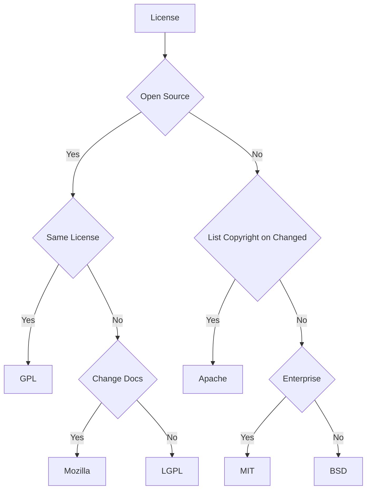

# GitHub

## GPG

[Generate new GPG key](https://docs.github.com/authentication/managing-commit-signature-verification/generating-a-new-gpg-key):

```bash
# Generate GPG key
gpg --full-generate-key
# List GPG keys
gpg --list-secret-keys --keyid-format=long

# Export GPG public key as an ASCII armored version
gpg --armor --export <pub-keyID>
# Copy output to GitHub GPG textarea

# Export GPG private key as an ASCII armored version
# gpg --armor --export-secret-key sabertazimi@gmail.com -w0

# Git global configuration for GPG signature commits
git config --global commit.gpgsign true
git config --global gpg.program gpg
git config --global user.signingkey <pub-keyID>

# WSL2 fix: Add to ~/.zshrc
export GPG_TTY=$(tty)

# Import GitHugit log --show-signatureb signature
curl https://github.com/web-flow.gpg | gpg --import
# gpg --sign-key <GitHub-keyID>
gpg --sign-key B5690EEEBB952194

# Log git signature
git log --show-signature

# Single signature commit
git commit -S -m "..."
```

[Update existing GPG key](https://inspirezone.tech/using-gpg-keys-on-github):

```bash
gpg --edit-key <pub-keyID>
> expire
> passwd
> save
```

After this
[update](https://github.blog/changelog/2022-05-31-improved-verification-of-historic-git-commit-signatures)
commits signed with expired GPG key (before it expired)
no longer become `unverified` state.

## LICENSE

### Popular




### Unique

- CC BY-NC-SA 3.0 License

```html
<a rel="license" href="http://creativecommons.org/licenses/by-nc-sa/3.0/"
  ></a
><br />This work is licensed under a
<a rel="license" href="http://creativecommons.org/licenses/by-nc-sa/3.0/"
  >Creative Commons Attribution-NonCommercial-ShareAlike 3.0 Unported License</a
>.
```

```md
Homework Public License(HPL)

Copyright (c) 2016 Sabertaz

This is for your reference only,not for your cheating.

Don't:

1a. Outright copyright infringement - Don't just copy this and change the name.
1b. Reserve a copy of this project and tell your teacher
that it is your own homework - Plagiarism is shame.

If you become rich through modifications, related work services,
or supporting the original work, share the love. Only a poor guy would make loads
off this work and not buy the original works creator(s) a pint.Code is
provided with no warranty. Using somebody else's code and bitching when it
goes wrong makes you stupid. Fix the problem yourself.
```

```md
The Star And Thank Author License (SATA)

Copyright (c) 2016 sabertazimi(sabertazimi@gmail.com)

Project Url: https://github.com/sabertazimi/Awesome-Notes

Permission is hereby granted, free of charge, to any person obtaining a copy
of this software and associated documentation files (the "Software"), to deal
in the Software without restriction, including without limitation the rights
to use, copy, modify, merge, publish, distribute, sublicense, and/or sell
copies of the Software, and to permit persons to whom the Software is
furnished to do so, subject to the following conditions:

The above copyright notice and this permission notice shall be included in
all copies or substantial portions of the Software.

And wait, the most important, you shall star/+1/like the project(s) in project url
section above first, and then thank the author(s) in Copyright section.

Here are some suggested ways:

- Email the authors a thank-you letter, and make friends with him/her/them.
- Report bugs or issues.
- Tell friends what a wonderful project this is.
- And, sure, you can just express thanks in your mind without telling the world.

Contributors of this project by forking have the option to add his/her name and
forked project url at copyright and project url sections, but shall not delete
or modify anything else in these two sections.

THE SOFTWARE IS PROVIDED "AS IS", WITHOUT WARRANTY OF ANY KIND, EXPRESS OR
IMPLIED, INCLUDING BUT NOT LIMITED TO THE WARRANTIES OF MERCHANTABILITY,
FITNESS FOR A PARTICULAR PURPOSE AND NONINFRINGEMENT. IN NO EVENT SHALL THE
AUTHORS OR COPYRIGHT HOLDERS BE LIABLE FOR ANY CLAIM, DAMAGES OR OTHER
LIABILITY, WHETHER IN AN ACTION OF CONTRACT, TORT OR OTHERWISE, ARISING FROM,
OUT OF OR IN CONNECTION WITH THE SOFTWARE OR THE USE OR OTHER DEALINGS IN
THE SOFTWARE.
```

## Collaboration

如果在组织的托管空间创建版本库, 一定要要为版本库指派一个拥有 Push 权限的团队,
以免以 `Fork + Pull` 模式工作时, Pull Request 没有人响应.

### Pull Request Workflow

1. Fork it.
2. Create your feature branch (`git checkout -b my-new-feature`).
3. Ensure tests are passing.
4. Commit changes (`git commit -am 'Add some feature'`).
5. Push to the branch (`git push origin my-new-feature`).
6. Create new Pull Request.
7. Check `Allow edits from maintainers`.

## CLI

### Installation

Install `gh` by `apt`,
according of [official introduction](https://github.com/cli/cli/blob/trunk/docs/install_linux.md).

```bash
gh auth login
```

### Issue

```bash
gh issue create
gh issue close
gh issue status
gh issue list
```

### Pull Request

```bash
gh pr checkout
gh pr create
gh pr close
gh pr merge
gh pr status
gh pr list
```

### Repository

Clone repo:

```bash
gh repo clone cli/cli

# fastest way to clone authorized user repos
gh alias set rc 'repo clone'
gh rc dragon
```

Create repo:

```bash
# create a repository under your account using the current directory name
git init my-project
cd my-project
gh repo create

# create a repository with a specific name
gh repo create my-project

# create a repository in an organization
gh repo create cli/my-project

# disable issues and wiki
gh repo create --enable-issues=false --enable-wiki=false
```

List repo:

```bash
gh repo list sabertazimi
```

### Workflow

View and watch Workflow:

```bash
gh run view
gh run view --log
gh run watch
```

## Wiki

```bash
git clone git@github.com:user/repo.wiki.git
```

## Shorten URL

```bash
curl -i http://git.io -F "url=https://github.com/technoweenie" -F "code=t"
```

## Flavored Markdown

### Link

#### Tooltip of Link

```md
This is a [link to a web page](https://url.com 'This title will appear as a tooltip').
```

```md

```

#### Label of Link

```md
This is a [link to a web page][mylabel].

Then at the end of the document …

[mylabel]: https://url.com 'Optional title'
[mylabel]: https://url.com 'Optional title'
```

```md
![Alt text][mylabel]

[mylabel]: https://imageurl.com 'This is a title'
```

## Pages

In `https://github.com/<user>/<repo>/settings/pages`,
setup `source` of pages and `Enforce HTTPS`.

## Git Attributes

`.gitattributes`:

```bash
*.md linguist-detectable=true
*.md linguist-documentation=false
```

## Actions

```yml
name: Dependencies

on:
  schedule:
    - cron: '0 0 * * 1'
  workflow_dispatch:

jobs:
  update:
    name: Update
    runs-on: ubuntu-latest
    steps:
      - name: Checkout repository
        uses: actions/checkout@v2
        with:
          submodules: true
          fetch-depth: 1
      - name: Setup Node environment
        uses: actions/setup-node@v2
        with:
          node-version: 16
          architecture: x64
          registry-url: https://registry.npmjs.org/
          cache: yarn
      - name: Install dependencies
        run: |
          yarn
      - name: Update dependencies
        run: |
          yarn up '*'
      - name: Create pull request
        uses: peter-evans/create-pull-request@v3.1.0
        with:
          commit-message: 'build(deps): update all dependencies'
          branch: build/deps-update
          delete-branch: true
          title: 'build(deps): update all dependencies'
          body: An updated update of all NPM dependencies.
          labels: dependencies
          assignees: sabertazimi
          reviewers: sabertazimi
```

```yml
name: Deploy to Vercel
uses: amondnet/vercel-action@v20
with:
  vercel-token: ${{ secrets.VERCEL_TOKEN }}
  vercel-args: ${{ fromJSON('["--prod", ""]')[github.ref != 'refs/heads/main'] }}
  vercel-org-id: ${{ secrets.VERCEL_ORG_ID }}
  vercel-project-id: ${{ secrets.VERCEL_PROJECT_ID }}
  scope: ${{ secrets.VERCEL_ORG_ID }}
  working-directory: ./
```

## Dependabot

```yml
version: 2
updates:
  - package-ecosystem: npm # See documentation for possible values
    directory: / # Location of package manifests
    schedule:
      interval: weekly
      day: sunday
      time: '14:00'
      timezone: Asia/Shanghai
    open-pull-requests-limit: 10
    versioning-strategy: increase
    assignees:
      - sabertazimi
```

## Copilot

- GitHub Copilot usage [tips](https://github.blog/2024-03-25-how-to-use-github-copilot-in-your-ide-tips-tricks-and-best-practices).
