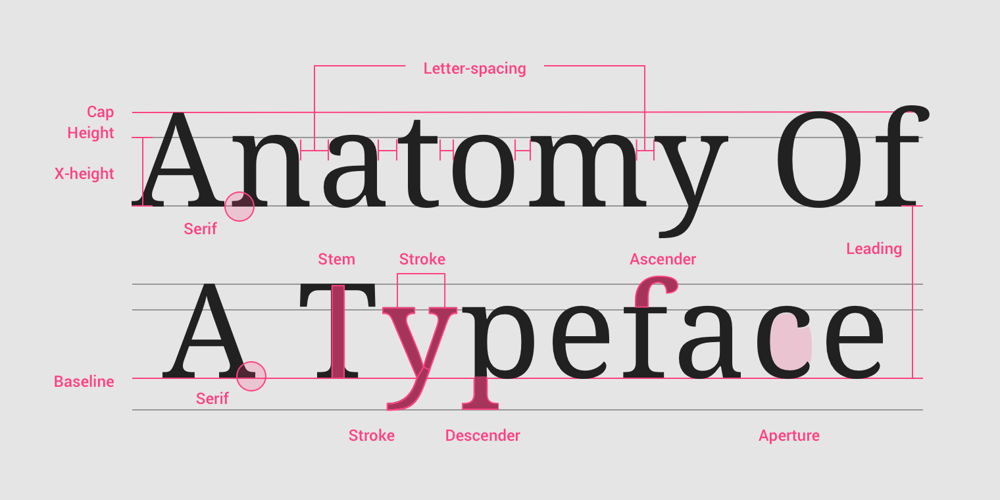

# CSS Advanced Notes

## CSS Framework Key Points

- Content
- Centering
- Font Family
- Spacing
- Color and Contrast
- Balance (Position)
- Primary and Secondary Color
- Custom Text (Font)
- Images and Links

## Typography Principles

- The typeface (font-family).
- Type (modular) scale.
- Responsiveness of the text (size unit and breakpoints).
- Spacing and vertical rhythm.
- Colors (theming).

> Refer to: font-family, font-size, spacing, color.

- [Understanding Typography](https://material.io/design/typography/understanding-typography)
- [Practical Typography](https://practicaltypography.com)
- [Typography Reference](https://noti.st/rar/mz1rIY/golden-rules-of-typography-on-the-web)

### Typography Properties

[](https://material.io/design/typography/understanding-typography.html#type-properties)

### Font Size and Spacing

- Set a base-size.
- Multiples of base-size.
- Use rem for most font-size, use em for some spacing (needing responsive design).

```scss
$xs: $base / $ratio / $ratio;
$sm: $base / $ratio;
$md: $base;
$lg: $base * $ratio;
$xl: $base * $ratio * ratio;
```

#### Font Size

- `rem` is better.
- `em` for responsive layout (etc. layer2 font based-on layer1 font in dropdown menu).
- Make text legible: at least `16px`.

#### Spacing

Make text breathe:

- `margin/padding`: at least `15px`.
- `line-height`: `1.4`.
- `word-spacing`.
- `letter-spacing`.
- 60-100 characters per line.

#### Vertical Rhythms

Keep vertical spaces between elements on a page
consistent (and relative) to each other:

- Set the vertical white space between elements to a multiple of base-size.
- Set the line-height of all text elements to a multiple of base-size.
- Set `margin-top` and `margin-bottom` to `<h1>` ~ `<h6>`/`<hr>` elements
  set `margin-bottom` to normal elements.

### Table

- Remove fills, grid lines, border and bolding.
- Left-align text, right-align numbers
  and align headings with data.
- Put white space to work to group and separate.

## Grid System

- Must have different traits at different sizes
- Must be fluid between breakpoints
- Must have enough control to decide which columns will transform and at which point
- Classes should ideally still make sense at all breakpoints

## Graceful Degradation

Write old browser css code,
then write modern browser css code:

```css
.grid {
  display: flex;

  /* old browser will ignore this rule */
  display: grid;
}
```

## CSS Houdini

- [Draft](https://drafts.css-houdini.org)
- [Implementation Status](https://ishoudinireadyyet.com/)

CSS Houdini bring many API:

- CSS properties and values API:
  custom properties (--var, var(--var)), custom function (--darken(--var)).
- CSS layout API (layoutWorklet):
  layout below (display: flex/grid), layout above (css-sizing: min-content/max-content/fit-content).
- CSS paint API (paintWorklet):
  background, background-color, background-image.
- CSS composite API (compositeWorklet).

to let developers enhance css without any browser updates

## HomePage User Experience

[UX Research](https://baymard.com/blog/2021-current-state-of-ecommerce-homepage-ux)
point out that:

- Feature a Broad Range of Product Types (6% Don’t).
- Avoid Overly Aggressive and Distracting Ads (59% Don’t).
- Implement Carousels Carefully (75% Don’t).
- Assist the Selection of a Well-Defined Scope (62% Don’t).
- Invest in Bespoke Imagery and Design (19% Don’t).
- Make the Search Field Immediately Obvious (22% Don’t).
- Implement Country & Language Selection Carefully (35% Don’t).
- Ensure Visual Hit Areas Match the Actual Hit Areas (43% Don’t).

## Design Principles

### 费茨定律

人机交互和人体工程学中人类活动的模型,
它预测了从任意位置快速移动到一个目标位置所需的时间,
由 2 个位置的距离（D）和目标大小（S）有关, 正比于 D, 反比于 S:

- 关联性强的 UI 放置在一起.
- 大拇指点击热区.
- 屏幕边界视为无限大 (容易到达).
- 关机滑动距离长.

### 米勒定律

人的短时记忆能力广度为 7±2 个信息块:

- 手机号/银行卡号/超大数字分段放置, 信息分层 e.g `134 9999 9999`, `999, 999, 999`.
- 文章布局时增大段落间 margin, 改变部分文字的粗细/字体/颜色.
- 导航/选项卡不超过 9 个 (超过 9 个可使用 dropdown/subMenu).

### 席克定律

用户所面临的选择数量越多,
做出选择所花费的时间就越长,
在人机交互的界面中选项越多,
意味着用户做出决策的时间越长:

- 减少选项并提供默认值.
- 分类分层.
- 分步分页 (大部分手机应用注册界面).

### 泰斯勒定律

泰斯勒定律又称复杂性守恒定律,
该定律认为每一个过程都有其固有的复杂性,
这个复杂性存在一个临界点,
超过了这个点就不能再简化了,
你只能将固有的复杂性从一个地方移动到另外一个地方:

- 智能手机: 按键的复杂度转为手机操作系统的复杂度.
- 智能推荐: 用户自己选择筛选条件的复杂度转为人工智能算法的复杂度.

## Components Design Principles

- [Components Checklist](https://www.smashingmagazine.com/ebooks/checklist-cards-digital)
- [Accordion](https://www.smashingmagazine.com/2017/06/designing-perfect-accordion-checklist)
- [Responsive Configurator](https://www.smashingmagazine.com/2018/02/designing-a-perfect-responsive-configurator)
- [DateTime Picker](https://www.smashingmagazine.com/2017/07/designing-perfect-date-time-picker)
- [Feature Comparison Table](https://www.smashingmagazine.com/2017/08/designing-perfect-feature-comparison-table)
- [Slider](https://www.smashingmagazine.com/2017/07/designing-perfect-slider)
- [Birthday Picker](https://www.smashingmagazine.com/2021/05/frustrating-design-patterns-birthday-picker)
- [Mega Dropdown](https://www.smashingmagazine.com/2021/05/frustrating-design-patterns-mega-dropdown-hover-menus)
- [Frozen Filter](https://www.smashingmagazine.com/2021/07/frustrating-design-patterns-broken-frozen-filters)
- [Disabled Button](https://www.smashingmagazine.com/2021/08/frustrating-design-patterns-disabled-buttons)
- [Infinite Scroll](https://www.smashingmagazine.com/2022/03/designing-better-infinite-scroll)
- [Breadcrumbs](https://www.smashingmagazine.com/2022/04/designing-better-breadcrumbs)
- [Push Notification](https://www.smashingmagazine.com/2022/04/guide-push-notifications-developers)
- [Carousel](https://www.smashingmagazine.com/2022/04/designing-better-carousel-ux)
- [Navigation](https://www.smashingmagazine.com/2022/04/designing-better-navigation-ux-queries)
- [Language Selector](https://www.smashingmagazine.com/2022/05/designing-better-language-selector)

### Form Design Principles

- Form design [blog](https://adamsilver.io/articles/form-design-from-zero-to-hero-all-in-one-blog-post).
- Form design [book](https://www.smashingmagazine.com/printed-books/form-design-patterns).

#### Buttons Placement Principles

[Principles](https://adamsilver.io/articles/where-to-put-buttons-in-forms):

- Align the primary button to the left edge of the inputs.
- Put the back button above the form.
- Put tangentially related actions above the form.
- Place extra buttons based on what they do.
- In some single field forms put the button next to the input (e.g `search` button).
- Put buttons on multi select forms above the form.
