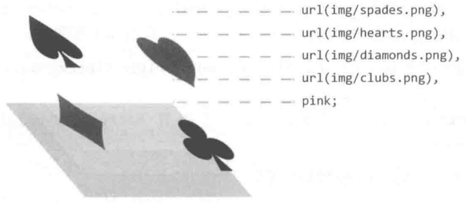

# CSS Advanced Notes

## CSS Border

### Border Radius

`border-radius`:

- 不支持负值.
- 圆角以外的区域不可点击, 无法响应 `click` 事件.
- 没有继承性:
  因此父元素设置 `border-radius`, 子元素依然是直角效果.
  可以给父元素设置 `overflow:hidden` 让子元素视觉上表现为圆角.
- 支持 `border-collapse` 设置为 `separate` 的
  `table`/`inline-table`/`table-cell` 元素.
- 每角都支持单独设置 `水平半径` `/` `垂直半径`:
  `<length-percentage>{1, 4} [/ <length-percentage>{1,4}]?`.

```css
.box {
  /* 左上 右上+左下 右下 / 左上 右上+左下 右下 */
  border-radius: 10px 5px 2em / 20px 25px 30%;

  /* 左上+右下 右上+左下 / 左上 右上 右下 左下 */
  border-radius: 10px 5% / 20px 25em 30px 35em;

  /* 水平半径 垂直半径 */
  border-top-left-radius: 30px 50%;

  /* 水平半径 垂直半径 */
  border-bottom-left-radius: 20% 15px;
}
```

圆角曲线重叠时, 所有圆角半径都缩小至 $f$ 倍:

$$
f =
\min\left(
  \frac{\text{Length}_{\text{horizontal}}}{\sum^{\text{horizontal}}_{\text{radius}}},
  \frac{\text{Length}_{\text{vertical}}}{\sum^{\text{vertical}}_{\text{radius}}}
\right)
$$

```css
.w-150px-h-100px {
  /* f = min(0.50, 0.50) = 0.50 */
  border-radius: 100%;
  border-radius: 75px / 50px;

  /* f = min(0.50, 0.33) = 0.33 */
  border-radius: 150px;
  border-radius: 50px;
}
```

### Border Color

利用 transparent border 扩大元素点击区域,
再结合 `background-clip: padding-box` 隐藏边框:

```css
.icon-clear {
  width: 16px;
  height: 16px;
  background-clip: padding-box;
  border: 11px solid transparent;
}
```

### Border Style

利用 `solid` border 模拟链接下划线:

```css
.link {
  padding-bottom: 5px;
  text-decoration: none;
  border-bottom: 1px solid;
}
```

### Border Image

[`border-image`](https://developer.mozilla.org/docs/Web/CSS/border-image):

- 以九宫格为基本模式, `content-box` 为九宫格中间格子.
- 可以结合 `clip-path` 裁剪边框.
- 可用于实现自定义边框: 渐变边框, 条纹边框, 虚线边框.
- `<'border-image-source'>`
  || `<'border-image-slice'> / <'border-image- width'> / <'border-image-outset'>`
  || `<'border-image-repeat'>`.

```css
.box {
  border-image: url('./grid-nine.svg') 54 33.33% 33.33% 54 / 10px 20px 30px 1 /
    1 30px 20px 10px round space;
}
```

```css
.border-linear-gradient {
  clip-path: inset(0 round 10px);
  border-style: solid;
  border-image: linear-gradient(deepskyblue, deeppink) 20 / 10px;
}

.border-radial-gradient {
  clip-path: inset(0 round 10px);
  border-style: solid;
  border-image: radial-gradient(deepskyblue, deeppink) 20 / 10px;
}

.border-stripe {
  border: 12px solid;
  border-image: repeating-linear-gradient(
      -45deg,
      red,
      red 5px,
      transparent 5px,
      transparent 10px
    ) 12;
}

.border-dashed {
  border: 1px dashed deepskyblue;
  border-image: repeating-linear-gradient(
      135deg,
      deepskyblue,
      deepskyblue 5px,
      transparent 5px,
      transparent 10px
    ) 1;
}
```

### Border Collapse

```css
table,
tr,
td {
  border: 1px solid #666;
}

table {
  border-collapse: collapse;
}
```

### Box Decoration Break

[`box-decoration-break`](https://developer.mozilla.org/docs/Web/CSS/box-decoration-break):

- Control `background`/`border`/`border-image`/`box-shadow`/`clip-path`/`margin`/`padding`
  styles when lines break.
- `slice`: initial value, 断开部分样式直接切割.
- `clone`: 断开部分样式独立渲染.

## CSS Outline

```css
.input {
  outline: none;
}

.input:focus {
  border-color: var(--highlight);
}

.button:focus-visible {
  outline: 1px solid #000;
  outline-offset: 3px;
}

.button:focus:not(:focus-visible) {
  outline: none;
}

.image:active {
  outline: 50px solid rgb(0 0 0 / 10%);
  outline-offset: -50px;
}
```

## CSS Shadow

### Text Shadow

[`text-shadow](https://developer.mozilla.org/docs/Web/CSS/text-shadow):

- `none`.
- `<shadow-text>#`: `<length>{2,3} && <color>?`.
  - 不支持内阴影.
  - `<length>{2,3}`: 不支持阴影扩展 `offset-x offset-y blur-radius`.
  - `<color>?`: default `revert` (user agent color).

```css
:root {
  --colo: #c0c0c0;
  --br-shadow: -6px 6px 15px rgb(0 0 0 / 50%);
  --tl-shadow: 6px -6px 15px rgb(255 255 255/ 80%);
}

body {
  background: var(--color);
}

.neumorphic-text {
  color: var(--color);
  text-shadow: var(--br-shadow), var(--tl-shadow);
}
```

### Box Shadow

[`box-shadow`](https://developer.mozilla.org/docs/Web/CSS/box-shadow):

- `none`.
- `<shadow>#`: `inset? && <length>{2,4} && <color>?`.
  - `inset?`: 支持内阴影.
  - `<length>{2,4}`: 支持阴影扩展 `offset-x offset-y blur-radius spread-radius`.
  - `<color>?`: default `currentcolor` (text computed color).

#### Basic Box Shadow

```css
.box {
  /* offset-x | offset-y | blur-radius | color */
  box-shadow: 10px 5px 5px black;

  /* offset-x | offset-y | blur-radius | spread-radius | color */
  box-shadow: 2px 2px 2px 1px rgb(0 0 0 / 20%);
}
```

#### Inset Box Shadow

模拟边框:

```css
.button-ghost {
  background-color: #fff;

  /* 模拟边框: 左 右 上 下 */
  box-shadow: inset 1px 0 #a2a9b6, inset -1px 0 #a2a9b6, inset 0 1px #a2a9b6, inset
      0 -1px #a2a9b6;
}
```

模拟背景:

```css
.button:active {
  box-shadow: inset 0 0 0 999px rgb(0 0 0 / 10%);
}
```

#### Neumorphic Box Shadow

[Neumorphic box shadow](https://codepen.io/myacode/pen/PoqQQNM):

```css
.neumorphic {
  box-shadow: -10px -10px 15px rgb(255 255 255 / 50%), 10px 10px 15px rgb(70 70
          70 / 12%);
}

.neumorphic:active {
  box-shadow: inset -10px -10px 15px rgb(255 255 255 / 50%), inset 10px 10px
      15px rgb(70 70 70 / 12%);
}
```

## CSS Background

### Background Image

[`background-image`](https://developer.mozilla.org/en-US/docs/Web/CSS/background-image):

- `url()`.
- `image-set([<image> <resolution>]#)`.
- `linear-gradient()`.
- `radial-gradient()`.
- `conic-gradient()`.
- 语法越靠后的背景图像的层叠等级越低:
  `background` 一般设置为 `background-image# background-color`.



```css
.image-set {
  width: 128px;
  height: 96px;
  background: url('fallback.jpg');
  background: image-set(
    url('w128px.jpg') 1x,
    url('w256px.jpg') 2x,
    url('w512px.jpg') 3x
  );
  background-size: cover;
}
```

### Background Repeat

```css
.background-repeat {
  /* Keyword values */
  background-repeat: repeat-x;
  background-repeat: repeat-y;
  background-repeat: repeat;
  background-repeat: space;
  background-repeat: round;
  background-repeat: no-repeat;

  /* Two-value syntax: horizontal | vertical */
  background-repeat: repeat space;
  background-repeat: repeat repeat;
  background-repeat: round space;
  background-repeat: no-repeat round;
}
```

### Background Position

Percentage background position (`<position> type`):

- X offset value = `(container width - image width) * (position x%)`.
- Y offset value = `(container height - image height) * (position y%)`.

```css
/* Keyword values */
background-position: top;
background-position: bottom;
background-position: left;
background-position: right;
background-position: center;

/* <percentage> values */
background-position: 25% 75%;

/* <length> values */
background-position: 0 0;
background-position: 1cm 2cm;
background-position: 10ch 8em;

/* Multiple images */
background-position: 0 0, center;

/* Edge offsets values */
background-position: bottom 10px right 20px;
background-position: right 3em bottom 10px;
background-position: bottom 10px right;
background-position: top right 10px;
```

[](https://developer.mozilla.org/docs/Web/CSS/background-position)

### Background Clip

指定背景显示范围:

- `border-box`.
- `padding-box`.
- `content-box`.
- `text`: 可用于实现`渐变文字`/`镂空文字`/`背景蒙版文字`.

```css
@property --offset {
  syntax: '<length>';
  inherits: false;
  initial-value: 5px;
}

@keyframes move {
  to {
    --offset: 15px;
  }
}

p {
  color: #000;
}

/* 同心圆外扩动画 */
p:hover {
  color: transparent;
  background: repeating-radial-gradient(
    circle at 0 0,
    #000 calc(var(--offset) - 5px),
    #000 var(--offset),
    #fff var(--offset),
    #fff calc(var(--offset) + 5px)
  );
  background-clip: text; /* -webkit-background-clip: text; */
  animation: move 0.5s infinite linear;
}
```

### Background Origin

指定背景绘制起点:

- `padding-box`.
- `border-box`.
- `content-box`.
- 影响 `background-size: <percentage>` 计算.
- 影响**起点两侧**背景样式细节.

### Background Size

[`background-size`](https://developer.mozilla.org/docs/Web/CSS/background-size):

- `auto{1,2}`:
  - 具有 intrinsic size 的背景 (e.g 位图),
    computed to `[intrinsic size, intrinsic size]`.
  - 具有一个方向 intrinsic size, 具有 intrinsic ratio 的背景 (e.g 矢量图),
    computed to `[intrinsic size, intrinsic size * intrinsic ratio]`.
  - 具有一个方向 intrinsic size, 不具有 intrinsic ratio 的背景 (e.g 矢量图),
    computed to `[intrinsic size, extrinsic size]`.
  - 不具有 intrinsic size, 具有 intrinsic ratio 的背景 (e.g 矢量图),
    computed to `contain` (等比例缩放).
  - 不具有 intrinsic size, 不具有 intrinsic ratio 的背景 (e.g CSS gradient),
    computed to `[extrinsic size, extrinsic size]`.
- `cover`: 等比例裁剪, 部分图像会裁剪.
- `contain`: 等比例缩放, 部分区域会留白.
- `<length-percentage>{1,2}`:
  - `<percentage>`: calculate by extrinsic size and `background-origin` box.

```css
.background-size {
  background-size: cover;
  background-size: contain;
  background-size: 100%;
  background-size: 20px;
  background-size: auto 100%;
  background-size: auto 20px;
  background-size: 100% 100%;
  background-size: 20px 20px;
}

.video {
  min-width: 100%;
  min-height: 100%;
  overflow: hidden;
  background-size: cover;
}
```

### Background Attachment

- `scroll`: scrolls with the main view, but stays fixed inside the local view.
- `local`: scrolls both with the main view and the local view.
- `fixed`: stays fixed no matter what.
- 对于可以滚动的元素 (`overflow: scroll`),
  当 `background-attachment: scroll` 时, 背景图不会随元素内容的滚动而滚动.
- 对于可以滚动的元素 (`overflow: scroll`),
  当 `background-attachment: local` 时, 背景图会随元素内容的滚动而滚动.
- Parallax effect: `background-attachment: fixed`.

```css
.bg {
  background-attachment: scroll; /* 背景图相对于元素固定, 背景随页面滚动而移动, 即背景和内容绑定 */
  background-attachment: local; /* 背景图相对于视口固定, 所以随页面滚动背景不动, 相当于背景被设置在了 body 上 */
  background-attachment: fixed; /* 背景图相对于元素内容固定 */
}
```

```css
/* parallax effect */
body {
  box-sizing: border-box;
  width: 100%;
  height: 100vh;
  padding: 0;
  margin: 0;
}

.parallax {
  min-height: 60%; /* key */
  background-image: url('./images/bg.jpg');
  background-repeat: no-repeat;
  background-attachment: fixed; /* key */
  background-position: center;
  background-size: cover;
}
```

## CSS Gradient

### Color Stop List

`<color-stop-list>`,
`[<linear-color-stop> [, <linear-color-hint>]?]#, <linear-color-stop>`:

- `<linear-color-stop>`: `<color> <length-percentage>{1,2}?`.
- `<linear-color-hint>`: `<length-percentage>`, 改变颜色的转换点位置.
- `<length-percentage>`: `<length> | <percentage>`.

`<angular-color-stop-list>`,
`[<angular-color-stop> [, <angular-color-hint>]?]#, <angular-color-stop>`:

- `<angular-color-stop>`: `<color> && <angle-percentage>{1,2}?`.
- `<angular-color-hint>`: `<angle-percentage>`, 改变颜色的转换点位置.
- `<angle-percentage>`: `<angle> | <percentage>`.

### Linear Gradient

[Linear gradient](https://developer.mozilla.org/docs/Web/CSS/gradient/linear-gradient):

- `[<angle> | to <side-or-corner>]?, <color-stop-list>`.
- Default angle: `to bottom`.
- `0deg` angle: `to top`.
- `90deg` angle: `to right`.
- `-90deg` angle: `to left`.

```css
.linear-gradient {
  width: 300px;
  height: 150px;
  background-image: linear-gradient(
    45deg,
    white 100px,
    skyblue 100px 200px,
    white 200px
  );
  border: solid deepskyblue;
}
```

[](https://developer.mozilla.org/docs/Web/CSS/gradient/linear-gradient#composition_of_a_linear_gradient)

### Radial Gradient

[Radial gradient](https://developer.mozilla.org/docs/Web/CSS/gradient/radial-gradient):

- `[<ending-shape> || <size>]? [at <position>]?, <color-stop-list>`.
- `<ending-shape>`:
  - `ellipse` (initial value).
  - `circle`.
- `<size>`.
  - `closest-side`.
  - `farthest-side`.
  - `closest-corner`.
  - `farthest-corner`.
  - `<length>`: 单独一个值不能为 `<percentage>`.
  - `<length-percentage>{2}`.

[](https://developer.mozilla.org/docs/Web/CSS/gradient/radial-gradient#size)

```css
.radial-gradient {
  background-image: radial-gradient(50px, white, deepskyblue);
  background-image: radial-gradient(50px 50%, white, deepskyblue);
  background-image: radial-gradient(50% 50%, white, deepskyblue);
  background-image: radial-gradient(100px at 0 0, white, deepskyblue);
  background-image: radial-gradient(100px at left top, white, deepskyblue);
  background-image: radial-gradient(
    100px at right 100px bottom 100px,
    white,
    deepskyblue
  );
  background-image: radial-gradient(
    farthest-corner circle at right 100px bottom 100px,
    white,
    deepskyblue
  );
}
```

[](https://developer.mozilla.org/docs/Web/CSS/gradient/radial-gradient#composition_of_a_radial_gradient)

### Conic Gradient

[Conic gradient](https://developer.mozilla.org/docs/Web/CSS/gradient/conic-gradient):

- `[from <angle>]? [at <position>]?, <angular-color-stop-list>`.
- Default angle: `0deg`.

```css
.pie {
  width: 150px;
  height: 150px;
  background: conic-gradient(yellowgreen 40%, gold 0deg 75%, deepskyblue 0deg);
  border-radius: 50%;
}

.color-picker-wheel {
  width: 150px;
  height: 150px;
  background: radial-gradient(closest-side circle, gray, transparent),
    conic-gradient(red, magenta, blue, aqua, lime, yellow, red);
  border-radius: 50%;
}
```

[](https://developer.mozilla.org/docs/Web/CSS/gradient/conic-gradient#composition_of_a_conic_gradient)

### Gradient Reference

- Background gradient [loading spinner](https://css-tricks.com/single-element-loaders-the-spinner).

## CSS Object

### Object Fit

[`object-fit`](https://developer.mozilla.org/docs/Web/CSS/object-fit)
只对替换元素
([`Replaced Element`](https://developer.mozilla.org/docs/Web/CSS/Replaced_element))
有作用:

- `input`.
- `select`.
- `textarea`.
- `img`.
- `video`.
- `iframe`.
- `embed`.
- `object`.

`object-fit` (`fill | contain | cover | none | scale-down`)
类似于 `background-size`,
可以处理图片拉伸变形与 `Cumulative Layout Shift` 问题:

```css
.image-container {
  position: relative;
  padding-bottom: calc(2 / 3) * 100%; /* (height / width) ratio */
}

.image-container > img {
  position: absolute;
  width: 100%;
  height: 100%;
  object-fit: cover;
}
```

## CSS Shape

[CSS shapes](https://css-tricks.com/the-shapes-of-css):

- `aspect-ratio`.
- `border`.
- `box-shadow` (inset).
- Background: `color`/`size`/`image`/`gradient`/`clip-path`.
  In modern browsers `background`/`gradient`/`clip-path`
  with `transition`/`transform`
  better than `pseudo elements`.
- `clip-path`
- `mask`
- `filter`.
- SVG:
  - SVG icon.
  - SVG filter.
  - SVG clip-path.
  - SVG mask.
- pseudo elements.

### Shape Outside

[`shape-outside`](https://developer.mozilla.org/docs/Web/CSS/shape-outside)
provides a way to customize wrapping effect for `float` element,
combined with
[`shape-margin`](https://developer.mozilla.org/docs/Web/CSS/shape-margin)
[`shape-image-threshold](https://developer.mozilla.org/docs/Web/CSS/shape-image-threshold)
making it possible to wrap text around complex objects rather than simple boxes:

```css
.shape {
  float: left;
  shape-outside: polygon(50% 0, 100% 50%, 50% 100%, 0 50%);
  shape-margin: 20px;
  shape-image-threshold: 20%;
}
```

### Clip

[`clip`](https://developer.mozilla.org/docs/Web/CSS/clip)
属性只对 `absolute` 与 `fixed` 元素起作用,
是对 `overflow` 属性的有力补充
(`overflow` 对于上述两种元素的裁剪作用有限):

- `auto`.
- `rect(<top-length>, <right-length>, <bottom-length>, <left-length>)`.
- `clip` 元素 `clientWidth`, `clientHeight`, `computedStyle` 保持不变:
  仅视觉上裁剪, 元素尺寸仍为原本尺寸, 原始布局仍然保留.
- `clip` 元素非可见部分无法响应点击事件.

```css
.fixed-clip {
  position: fixed;
  clip: rect(30px 200px 200px 20px);
}
```

### Clip Path

[`clip-path`](https://developer.mozilla.org/docs/Web/CSS/clip-path):

- `none`.
- `<url>`.
- `<geometry-box> || <basic-shape>`:
  - `<geometry-box>`:
    - `border-box`.
    - `padding-box`.
    - `content-box`.
    - `margin-box`.
    - `fill-box`.
    - `stroke-box`.
    - `view-box`.
  - [`<basic-shape>`](https://developer.mozilla.org/docs/Web/CSS/basic-shape):
    - [`inset(<length-percentage>{1,4} [round <'border-radius'>]?)`](https://developer.mozilla.org/docs/Web/CSS/basic-shape/inset).
    - [`circle([<shape-radius>]? [at <position>]?)`](https://developer.mozilla.org/docs/Web/CSS/basic-shape/circle).
    - [`ellipse([<shape-radius>{2}]? [at <position>]?)`](https://developer.mozilla.org/docs/Web/CSS/basic-shape/ellipse).
    - [`polygon([<fill-rule>,]? [<length-percentage> <length-percentage>]#)`](https://developer.mozilla.org/docs/Web/CSS/basic-shape/polygon).
    - [`path([<fill-rule>,]? <string>)`](https://developer.mozilla.org/docs/Web/CSS/path).
- `clip-path` 元素 `clientWidth`, `clientHeight`, `computedStyle` 保持不变:
  仅视觉上裁剪, 元素尺寸仍为原本尺寸, 原始布局仍然保留.
- `clip-path` 元素非可见部分无法响应点击事件.
- [`<fill-rule>`](https://developer.mozilla.org/docs/Web/SVG/Attribute/fill-rule)
  用于确定复杂路径构成的图形的内部与外部, 内部填充, 外部透明.


### Mask

[`mask`](https://developer.mozilla.org/docs/Web/CSS/mask):

- 元素应用 `mask` 属性遮罩效果后, 透明部分仍然可以响应点击事件.

#### Mask Image

[`mask-image`](https://developer.mozilla.org/docs/Web/CSS/mask-image):

- `none`.
- `<url>#`.
- `<gradient>#`.
- `<image()>`.
- `<image-set()>`.
- `<paint()>`.
- `<element()>`.
- `<cross-fade()>`.

#### Mask Mode

[`mask-mode`](https://developer.mozilla.org/docs/Web/CSS/mask-mode):

- `match-source`:
  根据 `mask-image` 类型自动选择模式,
  SVG `<mask>` 元素 (`url(#mask-id)`) 为 `luminance` 模式,
  其余场景 (包括 `url('mask.svg')`) 为 `alpha` 模式.
- `alpha`:
  基于透明度进行遮罩,
  `alpha(100%)` for show,
  `transparent` for hidden.
- `luminance`:
  基于亮度进行遮罩,
  `alpha(100%)` 且为亮色 for show,
  `alpha(100%)` 且为暗色 for hidden,
  `transparent` for hidden.

[](https://css-tricks.com/almanac/properties/m/mask-mode/#aa-alpha-masks)

[](https://css-tricks.com/almanac/properties/m/mask-mode/#aa-luminance-masks)

```css
img.alpha-mask {
  mask-image: linear-gradient(black, transparent);
  mask-mode: alpha;
}
```

[](https://css-tricks.com/almanac/properties/m/mask-mode/#aa-alpha-masks)

[](https://css-tricks.com/almanac/properties/m/mask-mode/#aa-luminance-masks)

#### Mask Type

[`mask-type`](https://developer.mozilla.org/docs/Web/CSS/mask-type),
用于设置 SVG `<mask>` 元素的遮罩模式:

- `luminance`.
- `mask`.

#### Mask Repeat

[`mask-repeat`](https://developer.mozilla.org/docs/Web/CSS/mask-repeat):

| Single Value | Two Value Equivalent  |
| ------------ | --------------------- |
| `no-repeat`  | `no-repeat no-repeat` |
| `repeat-x`   | `repeat no-repeat`    |
| `repeat-y`   | `no-repeat repeat`    |
| `repeat`     | `repeat repeat`       |
| `space`      | `space space`         |
| `round`      | `round round`         |

#### Mask Position

[`mask-position`](https://developer.mozilla.org/docs/Web/CSS/mask-position):

```css
.mask-position {
  /* Keyword values */
  mask-position: center;
  mask-position: top right;
  mask-position: bottom left;

  /* <length-percentage> values */
  mask-position: 25% 75%;
  mask-position: 0 0;
  mask-position: 10% 8em;
}
```

#### Mask Clip

[`mask-clip`](https://developer.mozilla.org/docs/Web/CSS/mask-clip):

- `border-box`.
- `padding-box`.
- `content-box`.
- `margin-box`.
- `fill-box`.
- `stroke-box`.
- `view-box`.
- `no-clip`.

#### Mask Origin

[`mask-origin`](https://developer.mozilla.org/docs/Web/CSS/mask-origin):

- `border-box`.
- `padding-box`.
- `content-box`.
- `margin-box`.
- `fill-box`.
- `stroke-box`.
- `view-box`.

#### Mask Size

[`mask-size`](https://developer.mozilla.org/docs/Web/CSS/mask-size)

- `auto{1,2}`.
- `cover`.
- `contain`.
- `<length-percentage>{12}`.

#### Mask Composite

[`mask-composite`](https://developer.mozilla.org/docs/Web/CSS/mask-composite):

- `add`:
  所有遮罩图片直接合成一个完整的遮罩.
- `subtract`:
  顶层遮罩图片中, 与底层遮罩图片重合的区域不显示遮罩.
- `intersect`:
  顶层遮罩图片中, 与底层遮罩图片重合的区域才显示遮罩.
- `exclude`:
  遮罩图片重合的区域被当作透明区域 (`transparent`),
  其余区域直接合成一个完整的遮罩 (`add`).
- `mask-image` 中语法越靠后的遮罩图片层叠等级越低.

```css
.masked {
  width: 100px;
  height: 100px;
  background-color: #8cffa0;
  mask-image: url('https://mdn.mozillademos.org/files/12668/MDN.svg'),
    url('https://mdn.mozillademos.org/files/12676/star.svg');
  mask-size: 100% 100%;
  mask-composite: add;
}
```

## CSS Filter and Blend

### Filter

[`filter`](https://developer.mozilla.org/docs/Web/CSS/filter):

```css
.filter {
  filter: blur(5px); /* 模糊 */
  filter: brightness(240%); /* 亮度 */
  filter: contrast(200%); /* 对比度 */
  filter: drop-shadow(16px 16px 20px blue); /* 投影 */
  filter: grayscale(50%); /* 灰度 */
  filter: hue-rotate(90deg); /* 色相旋转 */
  filter: invert(75%); /* 反相 (颜色翻转) */
  filter: opacity(25%); /* 透明度 */
  filter: saturate(30%); /* 饱和度 */
  filter: sepia(60%); /* 褐色 (老照片) */
  filter: url('resources.svg'); /* 引用 SVG filter 元素 */

  /* Apply multiple filters */
  filter: contrast(175%) brightness(3%);

  /* Global values */
  filter: inherit;
  filter: initial;
  filter: unset;
}
```

### Backdrop Filter

[`backdrop-filter`](https://developer.mozilla.org/docs/Web/CSS/backdrop-filter):

让当前元素所在区域后面的内容应用滤镜效果.

```css
.dropdown-list {
  background: hsl(0deg 0% 100% / 75%);
  backdrop-filter: blur(5px);
}
```

### Blend Mode

[`<blend-mode>`](https://developer.mozilla.org/docs/Web/CSS/blend-mode):

- `multiply`:
  - 正片叠底: $C=\frac{A \cdot B}{255}$.
  - 混合黑色变黑色.
  - 混合白色不变色.
  - 混合后颜色变暗.
- `screen`:
  - 滤色: $C=255-\frac{(255-A)(255-B)}{255}$.
  - 混合黑色不变色.
  - 混合白色变白色.
  - 混合后颜色变亮.
- `overlay`:
  - 叠加 ($A$ 为底图的色值):
    - $A\leqslant128$: $C=\frac{A \cdot B}{128}$.
    - $A\gt128$: $C=255-\frac{(255-A)(255-B)}{128}$.
  - 底图的阴影 (黑色)和高光 (白色) 的颜色会被保留,
    其他颜色的饱和度和对比度提高, 混合后的图像会更加鲜亮.
- `darken`/`lighten`:
  - 变暗: $C=\min(A, B)$.
  - 变亮: $C=\max(A, B)$.
  - 可用于实现渐变文字.
- `color-dodge`:
  - 颜色变淡: $C=A+\frac{A \cdot B}{255-B}$.
  - 可用于保护底图的高光, 适合处理高光下的人物照片:
    通过将照片和特定颜色混合, 可以改变整个照片的色调 (暖色调或是冷色调),
    同时不会影响人物高光区域的细节.
- `color-burn`:
  - 颜色加深: $C=A-\frac{(255-A)(255-B)}{B}$.
  - 可用于保护底图的阴影, 适合处理阴影丰富的照片:
    通过将照片和特定颜色混合, 可以营造更加幽深的氛围.
- `hard-light`:
  - 强光 ($A$ 为底图的色值):
    - $B\leqslant128$: $C=\frac{A \cdot B}{128}$.
    - $B\gt128$: $C=255-\frac{(255-A)(255-B)}{128}$.
  - 图像亮的地方更亮, 暗的地方更暗.
- `soft-light`:
  - 柔光 ($A$ 为底图的色值):
    - $B\leqslant128$: $C=\frac{A \cdot B}{128}+(\frac{A}{255})^2(255-2\cdot B)$.
    - $B\gt128$: $C=255-\frac{(255-A)(255-B)}{128}$.
  - 图像亮的地方轻微变亮, 暗的地方轻微变暗.
- `difference`:
  - 差值: $C=|A-B|$.
  - 若上层元素为 `white`, 则最终混合的颜色是底层元素颜色的反色.
- `exclusion`:
  - 排除: $C=A+B-\frac{A \cdot B}{128}$.
- `hue`:
  - 色调混合.
  - 混合后的颜色保留底图的饱和度和亮度, 使用顶图的色调.
  - 将照片和渐变色进行色调混合, 可让照片呈现出丰富多彩的色调效果.
- `saturation`:
  - 饱和度混合.
  - 混合后的颜色保留底图的色调和亮度, 使用顶图的饱和度.
- `luminosity`:
  - 亮度混合.
  - 混合后的颜色保留底图的色调和饱和度, 使用顶图的亮度.
  - 当底图是渐变图像或纯色图像, 上层元素是复杂图像时, 适合使用亮度混合模式.
- `color`:
  - 颜色混合.
  - 混合后的颜色保留底图的亮度, 使用顶图的色调和饱和度.
  - 通过使用 CSS 渐变让照片的色调变得丰富.

### Mix Blend Mode

[`mix-blend-mode`](https://developer.mozilla.org/docs/Web/CSS/mix-blend-mode):

- Used for multiple elements, e.g text styles.
- 通常把混合模式设置在顶层元素上:
  当元素应用了混合模式时,
  该元素会混合 `z` 轴上所有层叠顺序比其低的层叠元素.
- `multiply`: `black` is cutout (keep `black`).
- `screen`: `white` is cutout (keep `white`).

```html
<div class="background">
  <h1>Even More CSS Secrets</h1>
</div>

<style>
  .background {
    background-image: url('bg.png');
    background-repeat: no-repeat;
    background-position: center;
    background-size: cover;
  }

  .background h1 {
    color: white; /* keep white */
    background-color: black; /* mix with background */
    mix-blend-mode: screen; /* screen or multiply  */
  }
</style>
```

### Background Blend Mode

[`background-blend-mode`](https://developer.mozilla.org/docs/Web/CSS/background-blend-mode)

- Used for multiple `background-image`.

```css
.box {
  background: url('pic1.png'), url('pic2.png');
  background-size: cover;
  background-blend-mode: lighten; /* lighten, lighten */
}

.gradient-icon {
  background: linear-gradient(deepskyblue, deeppink), url('icon.png'), white;
  background-blend-mode: lighten, normal;
}
```

### Filter and Blend Reference

- Instagram [filters](https://github.com/una/CSSgram).
- Image [effects](https://github.com/bennettfeely/image-effects).
- PhotoShop blending modes [ultimate guide](https://www.slrlounge.com/photoshop-blending-modes).

## SVG

### SVG Fill

```html
<svg
  width="100px"
  height="100px"
  viewBox="0 0 100 100"
  version="1.1"
  xmlns="..."
>
  <title>My Awesome SVG</title>
  <circle class="circle" cx="50" cy="50" r="50" fill="#FFFF00" />
</svg>

<style>
  .circle {
    fill: currentcolor;
    fill-opacity: 50%;
    fill-rule: nonzero;
  }
</style>
```

### SVG Stroke

```css
circle {
  stroke: blue;
  stroke-dasharray: 14px 4px 4px 4px; /* 实色长度 透明长度 实色长度 透明长度 ... */
  stroke-dashoffset: 0;
  stroke-linecap: round;
  stroke-linejoin: round;
  stroke-opacity: 50%;
  stroke-width: 2px;
  paint-order: stroke;
  vector-effect: non-scaling-stroke;
}
```

[](https://developer.mozilla.org/docs/Web/SVG/Attribute/stroke-linecap)

[](https://developer.mozilla.org/docs/Web/SVG/Attribute/stroke-linejoin)

[](https://developer.mozilla.org/docs/Web/SVG/Attribute/stroke-dasharray)

### SVG Marker

[`<marker>`](https://developer.mozilla.org/docs/Web/SVG/Element/marker):

```css
polyline {
  marker-start: url('#marker-circle');
  marker-mid: url('#marker-circle');
  marker-end: url('#marker-arrow');
}
```

### SVG Shape Tag

- Rectangles and squares: `<rect>`.
- Circles: `<circle>`.
- Ellipse: `<ellipse>`.
- Line: `<line>`.
- Polyline: `<polyline>`.
- Polygon: `<polygon>`.
- Path: `<path>`.

### SVG Text Tag

The text tag `<text>` is used to create **selectable** and **accessible** text:

```css
text {
  /* SVG text vertical alignment */
  dominant-baseline: auto;
  dominant-baseline: middle;
  dominant-baseline: central;
  dominant-baseline: text-top;
  dominant-baseline: text-bottom;
  dominant-baseline: alphabetic;
  dominant-baseline: hanging;
  dominant-baseline: ideographic;
  dominant-baseline: mathematical;

  /* SVG text horizontal alignment */
  text-anchor: start;
  text-anchor: middle;
  text-anchor: end;
}
```

### SVG Accessibility Tag

The title `<title>` and description `<desc>` tags
are specifically for providing accessibility content.

### SVG Group Tag

The group tag `<g>` is used to group elements together
to add class names and apply animations, filters, patterns and effects
to a group of elements.

### SVG Defs Tag

The defs tag `<defs>` is used to define elements for later reuse.
This is where you create
**marker**, **patterns**, **filters**, **masks**
to be reused later.
This is also used to create **icon systems**.

```html
<svg width="0" height="0" style="position: absolute;">
  <defs>
    <marker
      id="marker-circle"
      markerWidth="8"
      markerHeight="8"
      refX="4"
      refY="4"
    >
      <circle cx="4" cy="4" r="2.5" />
    </marker>
    <marker
      id="marker-arrow"
      markerWidth="12"
      markerHeight="12"
      refX="2"
      refY="6"
      orient="auto"
    >
      <path d="M2,3 L2,10 L8,6 L2,3" />
    </marker>
  </defs>
</svg>
```

```html
<filter id="noise" y="0" x="0">
  <feTurbulence stitchTiles="stitch" baseFrequency=".75" type="fractalNoise" />
</filter>
```

```html
<pattern ...>
  ...
  <rect
    width="100%"
    height="100%"
    fill="white"
    filter="url(#noise)"
    opacity=".9"
  />
</pattern>
```

### SVG Clip Path

<!-- markdownlint-disable line-length -->

```html
<svg class="svg">
  <clipPath id="circle" clipPathUnits="objectBoundingBox">
    <path
      d="M0.5,0 C0.776,0,1,0.224,1,0.5 C1,0.603,0.969,0.7,0.915,0.779 C0.897,0.767,0.876,0.76,0.853,0.76 C0.794,0.76,0.747,0.808,0.747,0.867 C0.747,0.888,0.753,0.908,0.764,0.925 C0.687,0.972,0.597,1,0.5,1 C0.224,1,0,0.776,0,0.5 C0,0.224,0.224,0,0.5,0"
    />
  </clipPath>
</svg>
```

<!-- markdownlint-enable line-length -->

```css
.item {
  clip-path: url('#circle');
}
```

### SVG Mask

Avatar with circle status indicator:

```html
<svg role="none">
  <mask id="circle">
    <circle fill="white" cx="100" cy="100" r="100"></circle>
    <circle fill="black" cx="86%" cy="86%" r="18"></circle>
  </mask>
  <g mask="url(#circle)">
    <image
      x="0"
      y="0"
      width="100%"
      height="100%"
      xlink:href="avatar.jpg"
    ></image>
    <circle
      fill="none"
      cx="100"
      cy="100"
      r="100"
      stroke="rgb(0 0 0 / 10%)"
      stroke-width="2"
    ></circle>
  </g>
</svg>
```

### SVG Filter

内投影滤镜:

```html
<svg
  width="300"
  height="300"
  viewBox="0 0 20 20"
  style="position:absolute;left:-999px;"
>
  <filter id="inset-shadow">
    <!-- 投影偏移 -->
    <feOffset dx="0" dy="0" />
    <!-- 投影模糊 -->
    <feGaussianBlur stdDeviation="6" result="offset-blur" />
    <!-- 反转投影使其变成内投影 -->
    <feComposite
      operator="out"
      in="SourceGraphic"
      in2="offset-blur"
      result="inverse"
    />
    <!-- 内投影附加黑色 -->
    <feFlood flood-color="black" flood-opacity=".95" result="color" />
    <feComposite operator="in" in="color" in2="inverse" result="shadow" />
    <!-- 把内投影显示在图像上 -->
    <feComposite operator="over" in="shadow" in2="SourceGraphic" />
  </filter>
</svg>
```

毛玻璃滤镜:

```html
<svg width="0" height="0" style="position:absolute;">
  <filter id="blur" color-interpolation-filters="sRGB">
    <feGaussianBlur stdDeviation="6" edgeMode="duplicate" />
    <feComponentTransfer>
      <feFuncA type="discrete" tableValues="0 1" />
    </feComponentTransfer>
  </filter>
</svg>
```

### SVG Animation

```css
circle {
  animation: zoom-in-out 1s infinite alternate;
}

@keyframes zoom-in-out {
  from {
    r: 60px;
  }

  to {
    r: 75px;
  }
}
```

### SVG API

```ts
const svgElement = document.createElementNS(
  'http://www.w3.org/2000/svg',
  'svg'
);
const svgRectElement = document.createElementNS(
  'http://www.w3.org/2000/svg',
  'rect'
);
```

## Media Query

- Logical operators + media types + media features.
- Only for improving compatibility with older browsers.
- Definition order matters when media query with a different selector.
- JavaScript API: `window.matchMedia()`.

```css
/* screen size : 500px ~ 1000px */
@media screen and (min-width: 500px) and (max-width: 1000px) {
  .container {
    width: 750px;
  }
}
```

### Media Logical Query

[Logical operators](https://developer.mozilla.org/docs/Web/CSS/@media#logical_operators)

- `only`: only specific media type.
- `not`: negate entire media query.
- `and`: all.
- `,`: any.

### Media Type Query

[Media types](https://developer.mozilla.org/docs/Web/CSS/@media#media_types):

| Type                 | Query                                    |
| :------------------- | :--------------------------------------- |
| all                  | 所有设备                                 |
| print                | 文档打印或打印预览模式                   |
| screen               | 彩色电脑屏幕                             |
| **Deprecated Query** |                                          |
| braille              | 盲文                                     |
| embossed             | 盲文打印                                 |
| handheld             | 手持设备                                 |
| projection           | 项目演示, 比如幻灯                       |
| speech               | 演讲                                     |
| tty                  | 固定字母间距的网格的媒体, 比如电传打字机 |
| tv                   | 电视                                     |

### Media Feature Query

[Media features](https://developer.mozilla.org/docs/Web/CSS/@media#media_features):

| Feature             | Value                   | Min/Max | Query              |
| :------------------ | :---------------------- | :------ | :----------------- |
| grid                | `<integer>`             | no      | 是否基于格栅的设备 |
| orientation         | `portrait`/`landscape`  | no      | 横屏或竖屏         |
| aspect-ratio        | `<integer>`/`<integer>` | yes     | 渲染界面宽高比例   |
| device-aspect-ratio | `<integer>`/`<integer>` | yes     | 设备屏幕宽高比例   |
| monochrome          | `<integer>`             | yes     | 缓冲器中每像素字节 |
| resolution          | `<resolution>`          | yes     | 分辨率             |
| width               | `<length>`              | yes     | 渲染界面的宽度     |
| height              | `<length>`              | yes     | 渲染界面的高度     |
| device-width        | `<length>`              | yes     | 设备屏幕的输出宽度 |
| device-height       | `<length>`              | yes     | 设备屏幕的输出高度 |
| color               | `<integer>`             | yes     | 每种色彩的字节数   |
| color-index         | `<integer>`             | yes     | 色彩表中的色彩数   |

### Print Device Query

```css
@media print {
  header,
  footer {
    display: none;
  }

  table {
    color-adjust: exact;
  }

  h2 {
    break-before: page;
  }
}
```

- Page style standard [specification](https://developer.mozilla.org/docs/Web/CSS/@page).
- PDF style [tutorial](https://www.smashingmagazine.com/2015/01/designing-for-print-with-css).

### Hover and Pointer Device Query

| Hover Query | Pointer Query | Device                                 |
| ----------- | ------------- | -------------------------------------- |
| none        | coarse        | smartphones, touch screens             |
| none        | fine          | stylus-based screens                   |
| hover       | coarse        | smart TVs, video game consoles         |
| hover       | fine          | desktop computers, laptops, touch pads |

#### Hover Device Query

`hover`/`any-hover`:

- `none`.
- `hover`.

```html
<a href="#">Try hovering over me!</a>

<style>
  @media (hover: hover) {
    a:hover {
      background: yellow;
    }
  }

  @media (any-hover: hover) {
    a:hover {
      background: yellow;
    }
  }
</style>
```

#### Pointer Device Query

`pointer`/`any-pointer`:

- `none`: no pointer device (e.g phones).
- `coarse`: limited accuracy pointer device (e.g smart TV, video game consoles).
- `fine`: accurate pointer device (e.g mouse, touch pads, stylus).

```html
<input id="test" type="checkbox" /> <label for="test">Look at me!</label>

<style>
  input[type='checkbox'] {
    appearance: none;
    margin: 0;
    border: solid;
  }

  input[type='checkbox']:checked {
    background: gray;
  }

  @media (pointer: fine) {
    input[type='checkbox'] {
      width: 15px;
      height: 15px;
      border-color: blue;
      border-width: 1px;
    }
  }

  @media (pointer: coarse) {
    input[type='checkbox'] {
      width: 30px;
      height: 30px;
      border-color: red;
      border-width: 2px;
    }
  }

  @media (any-pointer: fine) {
    input[type='checkbox'] {
      appearance: none;
      width: 15px;
      height: 15px;
      border: 1px solid blue;
    }
  }

  @media (any-pointer: coarse) {
    input[type='checkbox'] {
      appearance: none;
      width: 30px;
      height: 30px;
      border: 2px solid red;
    }
  }
</style>
```

### Resolution Query

[`<resolution>`](https://developer.mozilla.org/docs/Web/CSS/resolution):

- `<number>dpi`.
- `<number>dpcm`.
- `<number>x`/`<number>dppx`: `1dppx` = `96dpi`.

```css
/* Exact resolution */
@media (resolution: 150dpi) {
  p {
    color: red;
  }
}

/* Minimum resolution */
@media (min-resolution: 72dpi) {
  p {
    text-decoration: underline;
  }
}

/* Maximum resolution */
@media (max-resolution: 300dpi) {
  p {
    background: yellow;
  }
}
```

### Contrast Query

`prefers-contrast`:

- `less`.
- `more`.

### Color Scheme Query

`prefers-color-scheme`:

- `no-preference`.
- `light`.
- `dark`.

```css
.day {
  color: black;
  background: #eee;
}

.night {
  color: white;
  background: #333;
}

@media (prefers-color-scheme: dark) {
  .day.dark-scheme {
    color: white;
    background: #333;
  }

  .night.dark-scheme {
    color: #ddd;
    background: black;
  }
}

@media (prefers-color-scheme: light) {
  .day.light-scheme {
    color: #555;
    background: white;
  }

  .night.light-scheme {
    color: black;
    background: #eee;
  }
}
```

### Reduced Motion Query

`prefers-reduced-motion`:

- `no-preference`.
- `reduce`.

```css
@media (prefers-reduced-motion) {
  .animated {
    animation: none;
  }
}
```

### Media Query Support Detection

Detecting media query support in CSS:

```css
/* stylelint-disable-next-line media-feature-name-no-unknown */
@media not all and (prefers-reduced-data), (prefers-reduced-data) {
  color: blue;
}
```

- No support:
  not all and (prefers-reduced-data): false,
  (prefers-reduced-data): false,
  Combined: false.
- Support, but off:
  not all and (prefers-reduced-data): true,
  (prefers-reduced-data): false,
  Combined: true.
- Support, and on:
  not all and (prefers-reduced-data): false,
  (prefers-reduced-data): true,
  Combined: true.

Detecting media query support in JavaScript:

```ts
const query = '(prefers-reduced-data)';

// window.matchMedia(query).media return 'not all' or original query string
const resolvedMediaQuery = window.matchMedia(query).media;

const isSupported = query === resolvedMediaQuery;
```

### Media Query API

Media query [`matchMedia`](https://developer.mozilla.org/docs/Web/API/Window/matchMedia):

```ts
// https://developer.mozilla.org/docs/Web/API/MediaQueryList
const mql = window.matchMedia(mediaQueryString);
```

```ts
if (window.matchMedia('(min-width: 400px)').matches) {
  /* the view port is at least 400 pixels wide */
} else {
  /* the view port is less than 400 pixels wide */
}
```

## Container Query

当组件出现在同一视口大小 (viewport) 页面下的不同地方时,
e.g `.main > .button` vs `.sidebar > .button`,
此时 `@media` 无法有效实现响应式组件,
使用 `@container` 可以有效实现响应式组件:

```css
.sidebar {
  /* stylelint-disable-next-line  property-no-unknown */
  container-type: inline-size;
  /* stylelint-disable-next-line  property-no-unknown */
  container-name: sidebar;
}

/* stylelint-disable-next-line at-rule-no-unknown */
@container sidebar (min-width: 400px) {
  .card {
    display: grid;
    grid-template-columns: 2fr 1fr;
  }
}
```

## Feature Query

### Supports At Rule

[`@supports`](https://developer.mozilla.org/docs/Web/CSS/@supports):

```css
@supports (transform-origin: 5% 5%) {
  font-size: 1rem;
}

@supports selector(A > B) {
  font-size: 1rem;
}

@supports not (not (transform-origin: 2px)) {
  font-size: 1rem;
}

@supports (display: grid) and (not (display: inline-grid)) {
  font-size: 1rem;
}

@supports (display: table-cell) and (display: flex) and (display: contents) {
  font-size: 1rem;
}

@supports (transform-style: preserve) or (-moz-transform-style: preserve) or
  (-o-transform-style: preserve) or (-webkit-transform-style: preserve) {
  font-size: 1rem;
}
```

### Supports API

[`CSS.supports()`](https://developer.mozilla.org/docs/Web/API/CSS/supports):

```ts
const result = CSS.supports('text-decoration-style', 'blink');
const result = CSS.supports('display: flex');
const result = CSS.supports('(--foo: red)');
const result = CSS.supports(`
  (transform-style: preserve) or (-moz-transform-style: preserve) or
  (-o-transform-style: preserve) or (-webkit-transform-style: preserve)
`);
```

## CSS Accessibility

### Screen Reader Only

```css
.sr-only {
  position: absolute;
  width: 1px;
  height: 1px;
  padding: 0;
  margin: -1px;
  overflow: hidden;
  clip: rect(0 0 0 0);
  clip-path: polygon(0 0, 0 0, 0 0);
  white-space: nowrap;
  border-width: 0;
}

.not-sr-only {
  position: static;
  width: auto;
  height: auto;
  padding: 0;
  margin: 0;
  overflow: visible;
  clip: auto;
  clip-path: none;
  white-space: normal;
}
```

### Focusable Areas

Focusable areas:

- Elements whose `tabindex` value is not null.
- The shapes of area elements in an image map.
- The sub-widgets of elements: e.g video controls.
- The scrollable regions of elements.
- The viewport of a `Document`.
- User agent focusable area.

### Keyboard Styles

添加键盘访问样式:

- `outline`.
- `:focus-visible`.
- `:focus`.

## CSS Performance

### Will Change

告知浏览器该元素会有哪些变化的方法,
浏览器可在元素属性真正发生变化之前提前做好对应的优化准备工作:

```css
.will-change-parent:hover .will-change {
  will-change: auto;
  will-change: scroll-position;
  will-change: contents;

  /* <custom-ident> */
  will-change: transform;
  will-change: opacity;
  will-change: left, top;
}
```

### Contain

[CSS containment](https://developer.chrome.com/blog/css-containment):

- `contain` 属性允许开发者声明当前元素和它的内容尽可能的独立于 DOM 树的其他部分.
  这使得浏览器在重新计算布局/样式/绘图或它们的组合的时候, 只会影响到有限的 DOM 区域, 而不是整个页面:
  `none | strict | content | [ size || layout || style || paint ]`.
- `size` containment:
  声明这个元素的尺寸会变化, 不需要去检查它依赖关系中的尺寸变化.
- `layout` containment:
  声明没有外部元素可以影响它内部的布局, 反之亦然.
- `style` containment:
  声明那些同时会影响这个元素和其子孙元素的属性, 都在这个元素的包含范围内.
- `paint` containment:
  声明这个元素的子孙节点不会在它边缘外显示.
  如果一个元素在视窗外或因其他原因导致不可见, 则同样保证它的子孙节点不会被显示.

```css
.box {
  /* 无布局包含 */
  contain: none;

  /* 布局包含 size/layout/style/paint */
  contain: strict;

  /* 布局包含 layout/style/paint */
  contain: content;

  /* 布局包含 size */
  contain: size;

  /* 布局包含 layout */
  contain: layout;

  /* 布局包含 style */
  contain: style;

  /* 布局包含 paint */
  contain: paint;
}

.content {
  /* Keyword values */
  content-visibility: visible;
  content-visibility: hidden;
  content-visibility: auto;

  /* <length> values */
  contain-intrinsic-size: 1000px;
  contain-intrinsic-size: 10rem;

  /* <percentage> value */
  contain-intrinsic-size: 10%;
}
```

### Content Visibility

[`content-visibility`](https://developer.mozilla.org/docs/Web/CSS/content-visibility):

- `visible`:
  element contents are laid out and rendered as normal.
- `hidden`:
  hide element while **preserving its rendering state**,
  if there are any changes that need to happen,
  they only happen when the element is shown again
  (i.e. `content-visibility: hidden` property is removed).
  `display: none` destroys element rendering state,
  `visibility: hidden` doesn't truly remove element.
- `auto`:
  element turns on `layout`, `style` and `paint` containment,
  可用于实现 **lazy loading**, **virtualized list**.

```css
.p {
  content-visibility: auto;
  contain-intrinsic-size: 320px; /* 预设高度, 防止滚动条频繁抖动 */
}
```

### CSS Selectors Performance

减少选择器的复杂性, 与构造样式本身的其他工作相比,
选择器复杂性可以占用计算元素样式所需时间的 50%以上:

- 避免使用统配选择器:
  `*`.
- 避免使用后代选择器 (开销较高):
  `.anchor .link` -> `.anchor-link`.
- 避免使用标签子代选择器:
  `.list > li` -> `.list > .item` (better) -> `.list-item` (best).

### CSS Triggers Performance

- CSS triggers [list](https://github.com/GoogleChromeLabs/css-triggers).
- JavaScript triggers [list](https://gist.github.com/paulirish/5d52fb081b3570c81e3a).

Avoid to frequently change css property
or call JavaScript API triggering layout stage (reflow):

- `width`/`height`/`margin`/`left`/`top` in `Layout` stage.
- `box-shadow`/`border-radius`/`background`/`outline`/`color` in `Paint` stage.
- `cursor`/`z-index`/`transform`/`opacity` in `Composite Layers` stage.
- `top`/`left` has very large time to `paint` each frame.

### CSS Loading Performance

- Avoid `@import`:
  - In HTML.
  - In CSS especially;
  - Beware of oddities with the `PreLoad Scanner`.
- Be wary of synchronous CSS and JavaScript order:
  - JavaScript defined after CSS won't run until CSSOM is completed.
  - If JavaScript doesn't depend on CSS: load it before CSS.
  - If JavaScript does depend on CSS: load it after CSS.
- Load CSS as the DOM needs it:
  - Unblocks `Start Render` and allows progressive rendering.
  - Avoid **flash of un-styled content**.
  - Avoid **re-rendering and repaint** for initial page:
    put `Critical CSS` in HTML footer will lead to
    entire DOM re-rendering and repaint.
- Lazyload any CSS not needed for `Start Render`:
  - Only load `Critical CSS` in `<head>`.
  - Splitting CSS into `Media Queries`.

```html
<!-- Doesn't block rendering -->
<link rel="preload" href="/path/to/split.css" as="style" />

<!-- Loading media query -->
<link
  rel="stylesheet"
  href="/path/to/split.css"
  media="print"
  onload="this.media='all'"
/>
```

### Animation Performance

[High performance animations](https://www.html5rocks.com/en/tutorials/speed/high-performance-animations):

- CSS 高性能动画三要素:
  - `absolute` position: 脱离文档流, 不会导致其他元素重排或重绘.
  - `opacity`: high performance trigger.
  - `transform`: high performance trigger.
- All animation: `keyframe` animation or `transitions` is best.
- JS-based animation: `requestAnimationFrame` is better than `setTimeout`/`setInterval`.
- Position animation: `transform: translate(npx, npx)` is better than `top`/`right`/`bottom`/`left`.
- Scale animation: `transform: scale(n)` better than `width`/`height`.
- Rotation animation: `transform: rotate(deg)` is better.
- Opacity/visibility animation: `opacity: 0...1` is better.

#### Animation Frame

`window.requestAnimationFrame`:

- Reflow: `JavaScript -> Style -> Layout -> Paint -> Composite`.
- Repaint: `Paint -> Composite`.

告诉浏览器希望执行动画并请求浏览器在下一次重绘之前调用指定的函数来更新动画.
该方法使用一个回调函数作为参数, 这个回调函数会在浏览器重绘之前调用.

> 若想要在下次重绘时产生另一个动画画面, callback 必须调用 requestAnimationFrame.

```ts
let start = null;
const element = document.getElementById('SomeElementYouWantToAnimate');
element.style.position = 'absolute';

function step(timestamp) {
  if (!start) {
    start = timestamp;
  }

  const progress = timestamp - start;
  element.style.left = `${Math.min(progress / 10, 200)}px`;

  if (progress < 2000) {
    window.requestAnimationFrame(step);
  }
}

window.requestAnimationFrame(step);
```

#### Animation DevTools

- [DevTools for Animation Performance](https://calibreapp.com/blog/investigate-animation-performance-with-devtools).
- Slower CPU simulation in `performance` panel.
- Enable paint instrumentation in `performance` panel.
- FPS meter in `rendering` panel.
- Paint flashing in `rendering` panel.
- `layers` panel.

### CSS Imports Performance

`link` is parallel, `@import` isn't parallel.

### CSS Performance Reference

- CSS optimization [guide](https://kinsta.com/blog/optimize-css).

## CSS Hacks

### Property Hacks

利用低版本浏览器无法识别新的属性值:

```css
.loading {
  background: url('/images/loading.gif');
  background: url('/images/loading.png'), linear-gradient(transparent, transparent);
}

.shadow {
  border: 1px solid #ddd;
  border: 1px solid rgb(0 0 0 / 0%);
  box-shadow: 2px 2px;
}
```

### Selector Hacks

利用低版本浏览器无法识别新的选择器 (`,`):

```css
/* Webkit */
:-webkit-any(tag-not-found),
.class {
  font-size: 1rem;
}

/* Firefox */
tag-not-found::-moz-progress-bar,
.class {
  font-size: 1rem;
}

/* Chromium Edge */
tag-not-found::-ms-any,
.class {
  font-size: 1rem;
}

/* IE9+ */
:checked,
:disabled,
tag-not-found::before,
tag-not-found::after,
tag-not-found::selection,
.class {
  font-size: 1rem;
}

/* IE10+ */
:valid,
:invalid,
:required,
:optional,
.class {
  font-size: 1rem;
}

/* IE11+ */
tag-not-found::backdrop,
.class {
  font-size: 1rem;
}
```

### CSS Hacks Reference

- Browser [hacks](https://github.com/4ae9b8/browserhacks).

## CSS Tools

### PostCSS

- [PostCSS Preset Env](https://github.com/csstools/postcss-plugins)
- [PostCSS Flexbox Bug Checker](https://github.com/luisrudge/postcss-flexbugs-fixes)

#### CSS Vendor Prefix

CSS vendor prefix order:

- `-moz-` rule.
- `-ms-` rule.
- `-o-` rule.
- `-webkit-` rule.
- Standard rule.

#### CSS Normalize

```css
html,
body {
  box-sizing: border-box;
  height: 100%;
  padding: 0;
  margin: 0;
  font-size: 100%;
}

body {
  min-height: 100vh;
  line-height: 1.5;
}

input,
textarea,
img,
video,
object {
  box-sizing: border-box;
}
```

### StyleLint

`stylelint-config-mass` plugin `index.js`:

```ts
module.exports = {
  extends: ['stylelint-config-sass-guidelines'],
  rules: {
    'order/properties-order': [
      'position',
      'z-index',
      'top',
      'right',
      'bottom',
      'left',
      'box-sizing',
      'display',
      'visibility',
      'opacity',
      'mix-blend-mode',
      'isolation',
      'float',
      'clear',
      'flex',
      'flex-basis',
      'flex-direction',
      'flex-flow',
      'flex-grow',
      'flex-shrink',
      'flex-wrap',
      'grid',
      'grid-template',
      'grid-template-areas',
      'grid-template-rows',
      'grid-template-columns',
      'grid-area',
      'grid-row',
      'grid-row-start',
      'grid-row-end',
      'grid-column',
      'grid-column-start',
      'grid-column-end',
      'grid-auto-rows',
      'grid-auto-columns',
      'grid-auto-flow',
      'gap',
      'row-gap',
      'column-gap',
      'place-content',
      'place-items',
      'place-self',
      'align-content',
      'align-items',
      'align-self',
      'justify-content',
      'justify-items',
      'justify-self',
      'order',
      'columns',
      'column-gap',
      'column-fill',
      'column-rule',
      'column-rule-width',
      'column-rule-style',
      'column-rule-color',
      'column-span',
      'column-count',
      'column-width',
      'backface-visibility',
      'perspective',
      'perspective-origin',
      'transform',
      'transform-origin',
      'transform-style',
      'transition',
      'transition-delay',
      'transition-duration',
      'transition-property',
      'transition-timing-function',
      'width',
      'min-width',
      'max-width',
      'height',
      'min-height',
      'max-height',
      'overflow',
      'overflow-x',
      'overflow-y',
      'resize',
      'margin',
      'margin-top',
      'margin-right',
      'margin-bottom',
      'margin-left',
      'padding',
      'padding-top',
      'padding-right',
      'padding-bottom',
      'padding-left',
      'border',
      'border-top',
      'border-right',
      'border-bottom',
      'border-left',
      'border-width',
      'border-top-width',
      'border-right-width',
      'border-bottom-width',
      'border-left-width',
      'border-style',
      'border-top-style',
      'border-right-style',
      'border-bottom-style',
      'border-left-style',
      'border-radius',
      'border-top-left-radius',
      'border-top-right-radius',
      'border-bottom-left-radius',
      'border-bottom-right-radius',
      'border-color',
      'border-top-color',
      'border-right-color',
      'border-bottom-color',
      'border-left-color',
      'outline',
      'outline-offset',
      'outline-width',
      'outline-style',
      'outline-color',
      'box-shadow',
      'list-style',
      'list-style-type',
      'list-style-position',
      'list-style-image',
      'table-layout',
      'caption-side',
      'border-collapse',
      'border-spacing',
      'empty-cells',
      'animation',
      'animation-name',
      'animation-duration',
      'animation-timing-function',
      'animation-delay',
      'animation-iteration-count',
      'animation-direction',
      'animation-fill-mode',
      'animation-play-state',
      'background',
      'background-attachment',
      'background-clip',
      'background-color',
      'background-image',
      'background-origin',
      'background-position',
      'background-repeat',
      'background-size',
      'background-blend-mode',
      'cursor',
      'color',
      'font',
      'font-family',
      'font-kerning',
      'font-size',
      'font-size-adjust',
      'font-stretch',
      'font-weight',
      'font-smoothing',
      'osx-font-smoothing',
      'font-variant',
      'font-style',
      'tab-size',
      'text-align',
      'text-align-last',
      'text-justify',
      'text-indent',
      'text-transform',
      'text-decoration',
      'text-decoration-color',
      'text-decoration-line',
      'text-decoration-style',
      'text-decoration-thickness',
      'text-rendering',
      'text-shadow',
      'text-overflow',
      'line-height',
      'word-spacing',
      'letter-spacing',
      'white-space',
      'word-break',
      'word-wrap',
      'vertical-align',
      'content',
      'quotes',
      'counter-reset',
      'counter-increment',
      'page-break-before',
      'page-break-after',
      'page-break-inside',
      'pointer-events',
      'will-change',
    ],
    'order/properties-alphabetical-order': null,
    'selector-class-pattern': [
      '^[a-z0-9\\-\\_]+$',
      {
        message:
          'Selector should be written in lowercase with hyphens (selector-class-pattern)',
      },
    ],
  },
};
```

`StyleLint` plugins:

- Ignored invalid properties [checker](https://github.com/kristerkari/stylelint-declaration-block-no-ignored-properties).
- CSS syntax [validator](https://github.com/csstree/stylelint-validator).

### Tailwind

#### Tailwind Configuration

:::danger JIT Mode

Missing `.html`/`.tsx`/`.vue` directory
will lead to class purged.

:::

#### Tailwind Directives

```css
@layer base {
  h1 {
    @apply text-3xl;
  }
}

@layer components {
  .primary-btn {
    @apply bg-yellow-600 hover:bg-yellow-800 text-black font-bold py-4 px-6 shadow-md;
  }
}

@layer utilities {
  @variants hover {
    .padding-large {
      padding: 30px;
    }
  }

  @variants focus hover {
    .border-small {
      border: 1px solid #30485e;
    }

    .border-medium-dashed {
      border: 7px dashed #30485e;
    }
  }

  @responsive {
    /* generate for all breakpoints */
    .border-solid {
      border: 10px solid #30485e;
    }
  }

  @screen sm {
    /* generate for small screen breakpoint */
    .border-solid {
      border: 10px solid #30485e;
    }
  }
}
```

## CSS Style Guide

### CSS Property Order

> 显示属性 -> 自身属性 -> 文本属性.

#### Display Property Order

- position.
- z-index.
- top.
- right.
- bottom.
- left.
- box-sizing.
- display.
- visibility.
- float.
- clear.

#### Self Property Order

- width.
- min-width.
- max-width.
- height.
- min-height.
- max-height.
- overflow.
- padding.
- padding-top.
- padding-right.
- padding-bottom.
- padding-left.
- margin.
- margin-top.
- margin-right.
- margin-bottom.
- margin-left.
- border.
- border-width.
- border-top-width.
- border-right-width.
- border-bottom-width.
- border-left-width.
- border-style.
- border-top-style.
- border-right-style.
- border-bottom-style.
- border-left-style.
- border-color.
- border-top-color.
- border-right-color.
- border-bottom-color.
- border-left-color.
- border-collapse.
- border-spacing.
- outline.
- list-style.
- table-layout.
- caption-side.
- empty-cells.
- background.
- background-color.
- background-image.
- background-repeat.
- background-position.

#### Text Property Order

- color.
- font.
- font-family.
- font-size.
- font-weight.
- line-height.
- text-align.
- text-indent.
- text-transform.
- text-decoration.
- letter-spacing.
- word-spacing.
- white-space.
- vertical-align.
- opacity.
- cursor.
- content.
- quotes.

### CSS Naming Convention

#### Layout Structure Naming Convention

- 容器: container.
- 页头: header.
- 内容: content.
- 页面主体: main.
- 页尾: footer.
- 导航: nav.
- 侧栏: sidebar.
- 栏目: column.
- 页面外围控制整体佈局宽度: wrapper.
- 左右中: left right center.

#### Navigation Naming Convention

- 导航: nav.
- 主导航: main-nav.
- 子导航: sub-nav.
- 顶导航: top-nav.
- 边导航: sidebar.
- 左导航: left-sidebar.
- 右导航: right-sidebar.
- 菜单: menu.
- 子菜单: sub-menu.
- 标题: title.
- 摘要: summary.

#### Functional Component Naming Convention

- 标志: logo.
- 广告: banner.
- 登陆: login.
- 登录条: login-bar.
- 注册: register.
- 搜索: search.
- 功能区: shop.
- 标题: title.
- 加入: join us.
- 状态: status.
- 按钮: btn.
- 滚动: scroll.
- 标籤页: tab.
- 文章列表: list.
- 提示信息: msg.
- 当前的: current.
- 小技巧: tips.
- 图标: icon.
- 注释: note.
- 指南: guide.
- 服务: service.
- 热点: hot.
- 新闻: news.
- 下载: download.
- 投票: vote.
- 合作伙伴: partner.
- 友情链接: link.
- 版权: copyright.

#### CSS Files Naming Convention

- `abstracts`: `$variables`, `@mixin` function.
- `vendors`: external libraries (font-awesome, bootstrap).
- `base`: normalize.css, reset.css, utils.css, font.css, base.css.
  (margin-right, text-center, float-right).
- `components`: form.css, button.css, navbar.css, dropdown.css.
- `layout`: columns.css, grid.css, header.css, footer.css, section.css, navigation.css.
- `pages`: home.css, about.css.
- `themes`: color.css, font.css.
- main.css.
