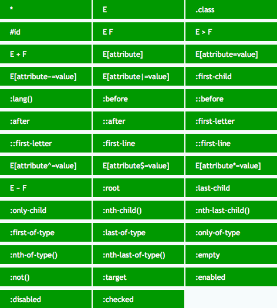

# CSS Basic Notes

## Cascading and Inheritance

### Cascading Order

1. user agent normal
2. user normal
3. author normal
4. CSS Animations
5. author !important
6. user !important
7. user agent !important

### Specificity

Specificity (Selector Priority)
has 4 bits - thousands, hundreds, tens, ones `0000`:

- thousands: inline-style
- hundreds: ID selector
- tens: class selector, attribute selector, pseudo-class(:)
- ones: element selector, pseudo-element(::)

:::tip Specificity

- Universal selector (`*`), combinators (`+`, `>`, `~`, `a b`).
- Negation pseudo-class `(:not)` have no effect on specificity,
  but selectors in it have effect on specificity.

:::

```scss
/* stylelint-disable at-rule-no-unknown */

/* specificity: 0001 */
h1 {
  color: red;
}

/* specificity: 0100 */
#id {
  color: green;
}

/* specificity: 0003 */
h1 + p::first-letter {
  color: blue;
}

/* specificity: 0022 */
li > a[href*='en-US'] > .inline-warning {
  color: yellow;
}
```

```html
<!-- specificity: 1000; -->
<h1 style="color: black">Hello</h1>
```

```css
/* specificity: 0023 */
div li:nth-child(2) a:hover,
div li:nth-child(2) a:focus {
  border: 10px dashed black;
}

/* specificity: 0024 */
div div li:nth-child(2) a:hover,
div div li:nth-child(2) a:focus {
  border: 10px solid black;
}

/* specificity: 0033 */
div div .nav:nth-child(2) a:hover,
div div .nav:nth-child(2) a:focus {
  border: 10px double black;
}

/* specificity: 0101 */
#outer a {
  background-color: red;
}

/* specificity: 0104 */
#outer div ul li a {
  color: yellow;
}

/* specificity: 0113 */
#outer div ul .nav a {
  color: white;
}

/* specificity: 0201 */
#outer #inner a {
  background-color: blue;
}
```

Styles for a directly targeted element will
always take precedence over inherited styles,
regardless of the specificity of the inherited rule

```css
#parent {
  color: green;
}

/* <h1> element will be purple */
h1 {
  color: purple;
}
```

### CSS Inheritance

- Most CSS properties that affect the text node are inherited properties:
  color, font-size, font-family, etc.
- Most CSS properties that affect the element node are non-inherited properties.
- When the `unset` value is set on an inherited property,
  it resets the property value to its inherited value.
- `unset` value resets a non-inherited property to its `initial` value.
- `revert` reverses the CSS default values to the browser user-agent styles.

#### Inherited CSS Property

- all elements: visibility, cursor.
- inline elements:
  letter-spacing, word-spacing, white-space, line-height,
  color, font, font-family, font-size, font-style, font-variant, font-weight,
  text-decoration, text-transform, direction
- block elements: text-indent, text-align
- list elements: list-style, list-style-type, list-style-position, list-style-image
- table elements: border-collapse

## Property Value

### Initial Value

The initial value of a CSS property is its default value,
as listed in its definition table

### Specified Value

The specified value of a CSS property is the value
it receives from the document's style sheet

### Computed Value

The computed value of a CSS property is the value that
is transferred from parent to child during inheritance.
It is calculated from the specified value by:

1. Handling the special values `inherit`, `initial`, `unset`, and `revert`
2. Doing the computation needed to reach the value described in the
   "Computed value" line in the property's definition table

### Used Value

The used value of a CSS property is its value after all calculations
have been performed on the computed value:

- The used values of dimensions (e.g., width, line-height) are in pixels
- The used values of shorthand properties (e.g., background)
  are consistent with those of their component properties
  (e.g., background-color or background-size) and with position and float

### Actual Value

The actual value of a CSS property is the used value of that property
after any necessary approximations have been applied

The user agent performs four steps to calculate a property's actual (final) value:

1. the specified value is determined based on the result of
   cascading, inheritance, or using the initial value.
2. the computed value is calculated according to the specification
   (for example, a span with position:
   absolute will have its computed display changed to block)
3. layout is calculated, resulting in the used value
4. the used value is transformed according to
   the limitations of the local environment,
   resulting in the actual value

:::tip CSS Value Transform

1. initial.
2. specified.
3. computed.
4. used.
5. actual value.

:::

```css
span {
  position: absolute;
} /* display computed to `block` */
```

## Property Order

### Property Order Summary

> 显示属性 -> 自身属性 -> 文本属性

#### Display Property

- position
- display
- float
- clear

#### Self Property

- width
- height
- margin
- padding
- border
- list-style
- background

#### Text Property

- color
- font
- text-decoration
- text-align
- vertical-align
- white-space
- other text
- content

### Property Order Details

#### Display Property Details

- position
- z-index
- top
- right
- bottom
- left
- box-sizing
- display
- visibility
- float
- clear

#### Self Property Details

- width
- min-width
- max-width
- height
- min-height
- max-height
- overflow
- margin
- margin-top
- margin-right
- margin-bottom
- margin-left
- padding
- padding-top
- padding-right
- padding-bottom
- padding-left
- border
- border-width
- border-top-width
- border-right-width
- border-bottom-width
- border-left-width
- border-style
- border-top-style
- border-right-style
- border-bottom-style
- border-left-style
- border-color
- border-top-color
- border-right-color
- border-bottom-color
- border-left-color
- outline
- list-style
- table-layout
- caption-side
- border-collapse
- border-spacing
- empty-cells
- background
- background-color
- background-image
- background-repeat
- background-position

#### Text Property Details

- color
- font
- font-family
- font-size
- font-weight
- line-height
- text-align
- text-indent
- text-transform
- text-decoration
- letter-spacing
- word-spacing
- white-space
- vertical-align
- opacity
- cursor
- content
- quotes

## Naming Convention

### Layout Structure Naming Convention

- 容器: container
- 页头: header
- 内容: content/container
- 页面主体: main
- 页尾: footer
- 导航: nav
- 侧栏: sidebar
- 栏目: column
- 页面外围控制整体佈局宽度: wrapper
- 左右中: left right center

### Navigation Naming Convention

- 导航: nav
- 主导航: main-nav
- 子导航: sub-nav
- 顶导航: top-nav
- 边导航: sidebar
- 左导航: left-sidebar
- 右导航: right-sidebar
- 菜单: menu
- 子菜单: sub-menu
- 标题: title
- 摘要: summary

### Functional Component Naming Convention

- 标志: logo
- 广告: banner
- 登陆: login
- 登录条: login-bar
- 注册: register
- 搜索: search
- 功能区: shop
- 标题: title
- 加入: join us
- 状态: status
- 按钮: btn
- 滚动: scroll
- 标籤页: tab
- 文章列表: list
- 提示信息: msg
- 当前的: current
- 小技巧: tips
- 图标: icon
- 注释: note
- 指南: guild
- 服务: service
- 热点: hot
- 新闻: news
- 下载: download
- 投票: vote
- 合作伙伴: partner
- 友情链接: link
- 版权: copyright

### CSS Files Naming Convention

- abstracts: `$variables`, `@mixin` function
- vendors: external libraries (font-awesome, bootstrap)
- base: normalize.css, reset.css, utils.css, font.css, base.css
  (margin-right, text-center, float-right)
- components: form.css, button.css, navbar.css, dropdown.css
- layout: columns.css, grid.css, header.css, footer.css, section.css, navigation.css
- pages: home.css, about.css
- themes: color.css, font.css
- main.css

## CSS Selector



### 元素选择器

```css
p {
  margin-bottom: 1em;
  line-height: 1.5em;
}
```

### 关系选择器

#### Descendant Selectors

- `E F`: 所有后代选择器
- `E > F`: 直接子选择器

```css
ul li {
  margin-bottom: 0.5em;
}
```

```css
ul > li {
  list-style: none;
} /* 仅限ul的直接子元素li, 忽略嵌套子元素 */
```

Using the descendant selector without more specificity can be really expensive.
The browser is going to check every descendant element for a match
because the relationship isn't restricted to parent and child.

For `.container ul li a` selector:

- match every `<a>` on the page
- find every `<a>` contained in a `<li>`
- use the previous matches and narrow down to
  the ones contained in a `<ul>`
- finally, filter down the above selection to
  the ones contained in an element with the class `.container`

#### Sibling Selectors

- `E + F`: 直接相邻兄弟选择器
- `E ~ F`: 一般兄弟选择器

```css
* + * {
  margin-top: 1.5em;
}
```

```css
li + li {
  border-top: 1px solid #ddd;
}
```

```css
/* p before h1 */
p {
  color: #fff;
}

/* 定位具有相同父元素的, h1标签之后的所有p标签 */
h1 ~ p {
  color: #f00;
}
```

checkbox `input` as hidden `click` event listener

```css
input.checkbox {
  visibility: hidden;
  opacity: 0;
}

nav {
  transform: scale(0);
}

input.checkbox:checked + nav {
  transform: scale(1);
}

input.checkbox:checked ~ nav {
  transform: scale(1);
}
```

### Attribute Selectors

`E[attr]`

```scss
input[required] {
  border: 1px solid #f00;
} //定位页面里所有具有必填属性"required"的input
```

`E[attr=val]`

```scss
input[type='password'] {
  border: 1px solid #aaa;
} //定位页面里的密码输入框
```

`E[attr|=val]`

```scss
p[class|='a'] {
  color: #333;
} //定位页面里所有的P段落里具有class属性且属性值为a或是a-开始的, 比如class="a"以及class="a-b"
```

`E[attr~=val]`

```scss
// 定位页面里所有具有属性title且属性值里拥有完整单词english的div容器
// 比如title="english"以及title="a english"
div[title~='english'] {
  color: #f88;
}
```

`E[attr^=val]`

```scss
div[class^='a'] {
  color: #666;
} //定位页面里具有属性class且属性值以a开头的div容器, 比如class="a"以及class="ab"
```

`E[attr$=val]`

```scss
div[class$='a'] {
  color: #f00;
}
//定位页面里具有属性class且属性值以a结尾的div窗口, 比如class="nba"以及class="cba"
```

`E[attr*=val]`

```scss
a[title*='link'] {
  text-decoration: underline;
}
//定位所有title里具有link字符串的a链接
```

### Pseudo Class Selectors

- `:link`: 未访问的链接.
- `:visited`: 已访问的链接, 不建议使用.
- `:hover`: 鼠标移动到容器, 不仅限于链接, 可用于页面中的任何元素.
- `:active`: 被激活时的状态, 不仅限于链接, 可用于任何具有 tabindex 属性的元素.
- `:focus`: 获得焦点时状态, 不仅限于链接, 可用于任何具有 tabindex 属性的元素.
- `:enabled`: 已启用的界面元素, e.g `input`.
- `:disabled`: 已禁用的界面元素, e.g `input`.
- `:target`: 该选择器定位当前活动页面内定位点的目标元素, #anchor-name `#info:target {font-size:24px;}`.
- `:default`: 应用于一个或多个作为一组类似元素中的默认元素的 UI 元素.
- `:valid`: 应用于输入验证有效元素, 基于 input 的 type/pattern 属性.
- `:invalid`: 应用于输入验证无效元素.
- `:in-range`: 应用于具有范围限制的元素, 其中该值位于限制内, 比如具有 min 和 max 属性的 number 和 range 输入框.
- `:out-of-range`: 与:in-range 选择相反, 其中该值在限制范围外.
- `:required`: 应用于具有必填属性 required 的表单控件.
- `:optional`: 应用于没有必填属性 required 的所有表单控件.
- `:read-only`: 应用于其内容无法供用户修改的元素.
- `:read-write`: 应用于其内容可供用户修改的元素, 比如输入框.
- `:root`: 根元素, 始终指 html 元素.
- `:placeholder-shown`: select `input` with placeholder.
- `:focus-visible`: selected when Tab (shortcut) focused.
- `:focus-within`: selected when any children focused.
- `:empty`: 没有子元素的元素, 没有子元素包括文本节点.
- `:not(exception)`: 该选择器将选择与括号内的选择器不匹配的元素.
- `:lang(en)`: 具有使用双字母缩写(en)表示的语言的元素.
- [`<target_element>:has(<selector>)`](https://ishadeed.com/article/css-has-parent-selector):
  - `:has` normal priority.
  - A target element has child elements.
  - A target element has sibling elements: `:has(+ selector)`.
- `<target_element>:where(<selector>)`:
  - `:where` 0 priority.
  - A target element has child elements.
- `E F:first-of-type`: **相同类型** 的第一个元素.
- `E F:last-of-type`: **相同类型** 的最后一个元素.
- `E F:only-of-type`: 孩子中只有一种该元素.
- `E :nth-child(n)`: 选择 E 的第 n 个孩子.
- `E F:nth-child(n)`:该选择器定位元素 E 的第 n 个子元素的元素 F,可省略 E.
- `E F:nth-last-child(n)`: 该选择器定位元素 E 的倒数第 n 个子元素的元素 F,可省略 E.
- `E F:nth-of-type(n)`: 该选择器定位元素 E 的第 n 个 **相同类型** 子元素,可省略 E.
- `E F:nth-lash-of-type(n)`: 该选择器定位元素 E 的导数第 n 个 **相同类型** 子元素,可省略 E.
- `E F:first-child`: 第一个孩子.
- `E F:last-child`: 最后一个孩子.
- `E F:only-child`: 单一后代.

```html
<a href="#p1">p1</a>
<div id="p1">p1</div>
```

```css
div:target {
  background-color: purple;
}

#p1:target {
  background-color: purple;
}
```

```css
@media screen and (prefers-reduced-motion: reduce) {
  .msg {
    opacity: 0;
    transition: none;
  }
}

.msg {
  opacity: 0;
  transition: opacity 0.2s ease-in-out;
}

input:not(:placeholder-shown) + .msg {
  opacity: 1;
}
```

```css
/* Tab Focus Style */
button:focus-visible {
  outline: 2px solid #416dea;
  outline-offset: 2px;
  box-shadow: 0 1px 1px #416dea;
}

/* Mouse Focus Style */
button:focus:not(:focus-visible) {
  outline: 2px dotted #416dea;
  outline-offset: 2px;
  box-shadow: 0 1px 1px #416dea;
}
```

### Pseudo Element Selectors

- `::first-line`: 匹配文本首行.
- `::first-letter`: 匹配文本首字母.
- `::selection`: 匹配突出显示的文本.
- `::before`.
- `::after`.

```css
/* 定义选中的文本颜色与背景色 */
::selection {
  color: #fff;
  background: #444;
}
```

- `::before` 与 `::after`: 使用 content 属性生成额外的内容并插入在标记中.

```css
a::after {
  content: '↗';
}
```

attr() – 调用当前元素的属性

```css
a::after {
  content: '(' attr(href) ')';
}

b::after {
  content: '(' attr(data-language) ')';
}
```

url() / uri() – 用于引用媒体文件

```css
h1::before {
  content: url('logo.png');
}
```

counter() – 调用计数器, 可以不使用列表元素实现序号功能,配合 CSS3 中`counter-increment`和`counter-reset`属性

```css
h2::before {
  content: 'Chapter ' counter(chapter);
  counter-increment: chapter;
}
```

```css
div {
  counter-reset: tidbit-counter 58;
}

h2::before {
  content: counter(tidbit-counter, list-style-type) ': ';
  counter-increment: tidbit-counter 1;
}
```

```html
<div>
  <h2>HTML</h2>
  <h2>CSS</h2>
  <h2>JS</h2>
</div>

<!-- output
59: HTML
60: CSS
61: JS
output -->
```

Nested counters:

```css
ol {
  list-style-type: none;
  counter-reset: section; /* 为每个ol元素创建新的计数器实例 */
}

li::before {
  content: counters(section, '.') ' '; /* 为所有计数器实例增加以`.`分隔的值 */
  counter-increment: section; /* 只增加计数器的当前实例 */
}
```

```html
<ol>
  <li>item</li>
  <!-- 1     -->
  <li>
    item
    <!-- 2     -->
    <ol>
      <li>item</li>
      <!-- 2.1   -->
      <li>item</li>
      <!-- 2.2   -->
      <li>
        item
        <!-- 2.3   -->
        <ol>
          <li>item</li>
          <!-- 2.3.1 -->
          <li>item</li>
          <!-- 2.3.2 -->
        </ol>
        <ol>
          <li>item</li>
          <!-- 2.3.1 -->
          <li>item</li>
          <!-- 2.3.2 -->
          <li>item</li>
          <!-- 2.3.3 -->
        </ol>
      </li>
      <li>item</li>
      <!-- 2.4   -->
    </ol>
  </li>
  <li>item</li>
  <!-- 3     -->
  <li>item</li>
  <!-- 4     -->
</ol>
<ol>
  <li>item</li>
  <!-- 1     -->
  <li>item</li>
  <!-- 2     -->
</ol>
```

- [利用伪类画额外图形](https://css-tricks.com/examples/ShapesOfCSS/)

```css
.first-details-intro::after {
  position: absolute;
  top: 50%;
  right: 0;
  width: 0;
  height: 0;
  content: '';
  border-top: 15px solid transparent;
  border-right: 25px solid #fff;
  border-bottom: 15px solid transparent;
}
```

## CSS Normalize

- `*` selector has poor performance

```css
html {
  box-sizing: border-box;
  padding: 0;
  margin: 0;
  font-size: 100%;
}

*,
*::before,
*::after {
  box-sizing: inherit;
  padding: inherit;
  margin: inherit;
}

body {
  line-height: 1.5;
}
```

## CSS Box

### Width

auto with `css-sizing`:
present for `fill-available/max-content/min-content/fit-content`
with `height`/`width`/`min-width`/`max-width`/`min-height`/`max-height`/
`grid-template-rows`/`grid-template-columns`/`flex-basis`.

### Z Index

数值越大, 处于可视的优先级越大.

### Overflow

visible, hidden, scroll, auto

### Resize Box

前置属性:overflow

```css
/* 允许用户修改元素尺寸 */
resize: none/both/horizontal/vertical/inherit;
```

### Box Sizing

content-box(default), padding-box, border-box

### Box Height

XXvh(viewport height)

直接计算宽度/高度

```css
.my-element {
  width: calc(10em + 3px);
  height: calc(50% - 100px);
}
```

#### Mobile Box Viewport

```css
.my-element {
  height: 100vh; /* Fallback for browsers that do not support Custom Properties */
  height: calc(var(--vh, 1vh) * 100);
}
```

```ts
window.addEventListener('resize', () => {
  // Get viewport height and multiple it by 1% to get a value for a vh unit
  const vh = window.innerHeight * 0.01;
  document.documentElement.style.setProperty('--vh', `${vh}px`);
});
```

### Box Column

Multiple-column layout:

- `column-count`
- `column-width`
- `column-gap`
- `column-rule`

```css
/* 子元素分列 */
.three-column {
  column-gap: 1em;
  padding: 1em;
  column-count: 3;
}
```

- column-count
- column-width
- column-gap 分隔距离
- column-rule(style) 分隔线

## Box Model

- block-level box: display 属性为 block, list-item, table 的元素,
  会生成 block-level box, 并且参与 block formatting context.
- inline-level box: display 属性为 inline, inline-block, inline-table 的元素,
  会生成 inline-level box, 并且参与 inline formatting context.
- Flex Formatting Context(FFC).
- Grid Formatting Context(GFC).

### Box Margin

- If both margin-left and margin-right are auto, their used values are equal.
  (CSS2 Visual formatting model details: 10.3.3)
- If margin-top, or margin-bottom are auto, their used value is 0.
  (CSS2 Visual formatting model details: 10.6.3)

### Box Percentage Length

Positioned elements with `top: percentage`
depend on `height` of parent,
if `height` of parent is `auto`, it's not working.

## Block Formatting Context

- 一个 BFC 包含创建该上下文元素的所有子元素, 但不包括创建了新 BFC 的子元素的内部元素
- BFC 就是页面上的一个隔离的独立容器, 容器里面的子元素不会影响到外面的元素, 反之也如此
- 一个元素不能同时存在于两个 BFC 中: 可让处于 BFC 内部的元素与外部的元素相互隔离
- 内部的 Box 会在垂直方向, 一个接一个地放置
- vertical margin collapsing
- 每个元素的 margin box 的左边, 与包含块 border box 的左边相接触
- BFC 的区域不会与 float box 重叠: 自适应分栏布局, 清除外/内部浮动
- 计算 BFC 的高度时, 浮动元素也参与计算:
  防止内边距塌陷 (margin-top collapse with margin-bottom)

## Stack Context

The root element forms the root stacking context.
Other stacking contexts are generated by any `position`/`opacity`/`transform` element
(including relatively positioned elements)
having a computed value of `z-index` other than `auto`.

Once apply a `position` property to a box,
can use the `z-index` property to adjust its stack level.

### Create BFC

- 根元素或其它包含它的元素.
- overflow: not visible (i.e hidden).
- float: left/right.
- position: absolute/fixed.
- display: inline-block.
- display: `table-cell`/`table-caption`/`table-*h`.
- display: flow-root.
- direct children of `display: flex/inline-flex`.
- direct children of `display: grid/inline-grid`.

### Margin Collapsing

- closet sibling: 1's margin-bottom with 2's margin-top.
- parent and it's first/last child: up with up (bottom with bottom).
- empty block: margin-top with margin-bottom.

Best Practice: only use `margin-bottom: 1em/1rem` for spacing.

## Float Patterns

float make element specified value of `display`:

- `inline-table` computed to `table`.
- `inline`/`inline-block`/`table-*` computed to `block`.

### Fixed Parent

> Floating wont work inside fixed or absolute `div` unless specify width

```css
.parent {
  position: fixed;
  top: 5px;
  left: 0;
  width: 100%;
}
```

### Float ClearFix

**Best Practice**:
为父容器 (`.row`) 添加 `.clearfix`,
`display: table` 防止外边距塌陷, `clear: both` 清除浮动.

```css
.row {
  width: 100%;
  max-width: --var(row-max-width);
  margin: 0 auto;
}

.clearfix::before,
.clearfix::after {
  display: table;
  content: '';
}

.clearfix::after {
  clear: both;
}

.clearfix {
  *zoom: 1;
}
```

### Float Best Practice

- 段中部分元素浮动(结合 margin/padding), 可实现内嵌效果
- 分栏布局
- `shape-outside` provides a way to customize wrapping,
  making it possible to wrap text around complex objects rather than simple boxes.

```css
shape-outside: polygon(50% 0, 100% 50%, 50% 100%, 0 50%);
```

## Position Patterns

### Static Position

top/left/width/right/z-index are invalid

### Relative Position

- 使元素相对于 `static` 布局, 可使用`top/bottom/left/right`属性进行定位.
- 初始位置被保留, 不脱离文档流.

### Absolute Position

- 使元素相对于 浏览器窗口/父元素(`position: non-static`) 布局 (包括 `%` 形式的 `width/height`)
  - 若 body 为 static, 则元素不会随着滚动条滚动, 其相对于初始窗口布局.
- 可使用 `top/bottom/left/right` 属性进行定位.
- 初始位置不被保留, 脱离文档流.
- `float` property computed to `float: none`.
- `display` `inline-table` computed to `table`.
- `display` `inline`/`inline-block`/`table-*` computed to `block`.

```css
.overlay {
  position: absolute;
  top: 0;
  left: 0;
  z-index: -50;
  width: 100%;
  height: 100%;
  background: rgb(0 0 0 / 50%);
}
```

```css
.fullscreen-video {
  position: absolute;
  top: 0;
  left: 0;
  z-index: -100;
  width: 100%;
  height: 100vh;
  overflow: hidden;
  background-size: cover;
}

.fullscreen-video video {
  min-width: 100%;
  min-height: 100%;
}
```

### Fixed Position

- 使元素想对于 浏览器窗口 布局, 但不受滑动条影响
- 可使用`top/bottom/left/right`属性进行定位
- `float: none`
- display: `inline-table` computed to `table`
- display: `inline`/`inline-block`/`table-*` computed to `block`

```css
/* 使子元素可以相对于父元素布局 */

.parent {
  position: relative;
}

.children {
  position: absolute;
  top: auto;
  left: 0;
}
```

### Sticky Position

`position: sticky` + `top: 0`:

- 粘性定位的元素在它距离视窗顶部大于 0 时, 会按照默认布局, 表现为 Relative Position.
- 一旦其距离顶部的距离等于 0, 元素会固定在窗口顶部, 表现为 Fixed Position.

```css
.sticky {
  position: sticky;
  top: 0;
  margin-top: 50px;
}
```

## Flex Patterns

[Flexbox Complete Guide](https://css-tricks.com/snippets/css/a-guide-to-flexbox)

### Flex Under the Hood

当 `flex-basis` 设置为 `auto`
且 `width` 或者 (`height`) 不为`auto`时,
计算 used size 时会用 `width` 或者 (`height`) 代替 `flex-basis`:

- When there is some free space left:
  true width = `flex-basis` + `flex-grow`/sum of `flex-grow`.
- When there is not enough space:
  true width = `flex-basis` - `flex-shrink`/sum of `flex-shrink`.
- Text nodes and pseudo-elements can be flex children.

### Flex Useful Shorthand

`flex: flex-grow flex-shrink flex-basis`.

- `flex: auto`:

元素会根据自身的宽度与高度来确定尺寸,
但是会自行伸长以吸收 flex 容器中额外的自由空间,
也会缩短至自身最小尺寸以适应容器.
Equal to `flex: 1 1 auto`.

- `flex: initial`:

属性默认值, 元素会根据自身宽高设置尺寸.
它会缩短自身以适应容器,
但不会伸长并吸收 flex 容器中的额外自由空间来适应容器.
Equal to `flex: 0 1 auto`.

- `flex: none`:

元素会根据自身宽高来设置尺寸.
它是完全非弹性的: 既不会缩短, 也不会伸长来适应 flex 容器.
Equal to `flex: 0 0 auto`.

- `flex: <positive-number>`

元素会被赋予一个容器中自由空间的指定占比.
Equal to `flex: <positive-number> 1 0`.

### Flex Parent Property

- justify-content: defines alignment along main axis.
- align-items: defines alignment for cross axis.
- align-content:
  aligns flex container's lines within
  when there is extra space in the cross-axis.
- `*-content` adjust parent padding,
  `*-items` and `*-self` adjust children margin.

Common flex attributes:

- `display: flex;`.
- `flex-direction: row/column;`.
- `flex-wrap: nowrap/wrap/wrap-reverse;`.
- `align-content: flex-start/flex-end/center/space-between/space-around;`.
- `align-items: flex-start/flex-end/center/baseline/stretch;`.
- `justify-content: flex-start/flex-end/center/space-between/space-around;`.

### Flex Children Property

- `flex: number;` 宽/高度权重.
- `flex-basis: number;`.
- `flex-grow: number;`.
- `flex-shrink: number;`.
- `align-self: auto/flex-start/flex-end/center/baseline/stretch;`.
- `order: number;` 显示顺序.

### Flexibility of Float and Alignment

```html
<div class="parent">
    <div class="child></div>
</div>
```

```css
.parent {
  display: flex;
}

.child {
  /* this will push child to the right of parent border */
  margin-left: auto;
}
```

### Flexbox Pseudo Elements

Set `flex` to pseudo elements of flex box
will change width of pseudo elements.

```css
.flex {
  display: flex;
}

.flex::before {
  position: relative; /* no need for absolute position */
  display: block;
}
```

### Fixed Sidebar with Flexbox

```html
<body>
  <aside></aside>
  <main></main>
</body>
```

```css
body {
  display: flex;
  height: 100vh;
  margin: 0;
}

aside {
  flex: 0 0 auto; /* inflexible */
}

main {
  flex: 1 1 auto; /* auto flexible */
  overflow: auto;
}
```

### Flexbox Best Practice

```css
.container {
  display: flex;
}

.initial {
  /* width: 100px~200px */
  flex: initial;
  width: 200px;
  min-width: 100px;
}

.none {
  /* width: 200px */
  flex: none;
  width: 200px;
}

.flex1 {
  /* width: left width * 1/3 */
  flex: 1;
}

.flex2 {
  /* width: left width * 2/3 */
  flex: 2;
}
```

```css
/* 子元素全部居中对齐 */
.vertical-container {
  display: flex;
  align-items: center;
  justify-content: center;
  height: 300px;
}
```

```css
.layer {
  display: flex;
  flex-direction: row;
  flex-grow: 1;
  align-items: center;
  justify-content: flex-start;
  margin: 5px;
  background-color: #fff;
  border: 1px solid #000;
}
```

## Grid Patterns

[Grid Complete Guide](https://css-tricks.com/snippets/css/complete-guide-grid)

```css
.container {
  grid-template-areas:
    'header header header'
    'advert content content'
    'footer footer footer';

  /*
   * grid-template-columns:
   *   repeat([auto-fit / auto-fill / numbers], minmax(60px, 1fr));
   */

  grid-template-rows: 1fr 1fr 1fr;
  grid-template-rows: minmax(90px, 1fr);
  grid-template-columns: 1fr 1fr 1fr;
  grid-template-columns: repeat(3, 1fr);
  grid-gap: 10px;
  align-items: end;
  justify-items: center;
}

.item {
  grid-area: footer;
  grid-row: start / end; /* 2 / -1 */
  grid-column: start / end;
  align-self: end;

  /* grid-area: hstart / vstart / hend / vend */
  justify-self: center;
}
```

Responsive `grid` layout

```css
.items {
  display: grid;
  grid-template-columns: repeat(auto-fit, minmax(400px, 1fr));
}
```

_named_ rows and columns

```css
.main {
  display: grid;
  grid-template-rows: [header] 100px [body] auto;
  grid-template-columns: [l-gutter] 1fr [sidebar] 4fr [content] 8fr [r-gutter] 1fr;
  grid-gap: 1rem 2rem;
}

.header {
  grid-row: header;
  grid-column: sidebar / right-gutter;
}

.sidebar {
  grid-row: body;
  grid-column: sidebar;
}

.content {
  grid-row: body;
  grid-column: content;
}
```

### Grid Attention Tips

- `grid-column` will refactor template of `grid` (`grid-template-columns`)
- `grid-row` will refactor template of `grid` (`grid-template-rows`)

### Grid Alignment

- `justify-content`/`align-content` content within element,
  attach to **parent** css selector
  (effectively adjusts `padding` of parent)
- `justify-items`/`align-items` `inline` items inside box,
  attach to **parent** css selector
  (controls `margin` of children )
- `justify-self`/`align-self` `inline` element within parent,
  attach to **children** css selector
  (effectively adjusts `margin` of children)

### Grid Pseudo Elements

```css
h1.lines {
  display: grid;
  grid-template-columns: 1fr auto 1fr;
  gap: 1em;
}

h1.lines::before,
h1.lines::after {
  align-self: center;
  content: '';
  border-top: 1px solid black;
}
```

## Column Patterns

- float 左右元素 + margin 中间元素
- float 元素 + width: %

### Two Column Pattern

利用父元素 `relative` 与 子元素 `absolute` 进行布局

- `inline-block` + `inline-block`
- `float` + `float`
- `float` + `margin-left`
  (block element ignore float element, inline element surround float element)
- `absolute` + `margin-left` (absolute element not in normal flow)
- `float` + BFC

```css
.div-1 {
  position: relative;
}

.div-1a {
  position: absolute;
  top: 0;
  right: 0;
  width: 200px;
}

.div-1b {
  position: absolute;
  top: 0;
  left: 0;
  width: 200px;
}
```

### Three Column Pattern

#### Absolute and Margin Column

position .left and .right with absolute, add margin-left and margin-right to .middle

#### Float and Margin Column

```html
.left .right .middle
```

```css
.left {
  float: left;
}

.right {
  float: right;
}

.middle {
  margin: 0 right-width 0 left-width;
}
```

#### Float and Negative Margin Column

On a floated element, a negative margin opposite the float direction will decrease
the float area, causing adjacent elements to overlap the floated element. A negative
margin in the direction of the float will pull the floated element in that direction.

1. HTML: .middle first
2. padding-left and padding-right to .container,
   `min-width: 2 * (leftWidth + rightWidth)` to container
3. Float: `float: left` to .left/.middle/.right
4. Negative Margin: `margin-left: -100%` to .left,
   `margin-right: -rightWidth px` to .right
5. Move: `right: leftWidth px` to .left

```html
<div class="container">
  <div class="middle"></div>
  <div class="left"></div>
  <div class="right"></div>
</div>
```

```css
.container {
  padding: 0 200px 0 300px; /* padding-left = .left width, same to .right */
}

.container .middle {
  float: left;
  width: 100%;
  background-color: violet;
}

.container .left {
  position: relative;
  right: 300px;
  float: left;
  width: 300px;
  margin-left: -100%;
  background-color: darkblue;
}

.container .right {
  position: relative;
  float: left;
  width: 200px;
  margin-right: -200px;
  background-color: red;
}
```

## Centering Patterns

[Centering CSS Complete Guide](https://css-tricks.com/centering-css-complete-guide/)

### Horizontal Centering Pattern

- inline: text-align, flex/grid box
- block: auto margin, flex/grid box
- 父元素 float, 父子元素 relative

```css
.container {
  position: relative;
  left: 50%;
  float: left;
}

.container ul {
  position: relative;
  left: -50%;
}
```

### Vertical Centering Pattern

#### Vertical Inline element

- `padding`.
- `line-height`.
- `vertical-align: middle`:
  - 作用环境: parent element `line-height` === `height`.
  - 作用对象: children `inline`/`inline-block`/`table-cell` element.
- `flexbox`.
- `grid`.

Button label (`<a>`) vertical alignment:

```css
a.button::before {
  display: inline-block;
  height: 16px;
  vertical-align: middle;
  content: '';
}
```

#### Vertical Block element

- top + margin
- top + translateY
- vertical-align
- flexbox
- grid

```css
.form-item-label {
  display: flex;
  flex-direction: row;
  align-items: center;
}
```

### Mixing Centering Pattern

在子容器中在设置新元素即可

## CSS Logical Properties and Values

### CSS Logical Basis

In positioning/sizing/margin/padding/border/text alignment:

- `block-start` for `top`
- `block-end` for `bottom`
- `block` for vertical
- `inline-start` for `left`
- `inline-end` for `right`
- `inline` for horizontal

### CSS Logical Reference

- [W3C CSS Logical Draft](https://drafts.csswg.org/css-logical)
- [CSS Tricks CSS Logical Guide](https://css-tricks.com/css-logical-properties-and-values)

## CSS ScrollBar

### Custom ScrollBar

```css
.demo::-webkit-scrollbar {
  /* 滚动条整体样式 */

  /* 高宽分别对应横竖滚动条的尺寸 */
  width: 10px;
  height: 1px;
}

.demo::-webkit-scrollbar-thumb {
  background-color: blue;
  background-image: linear-gradient(
    45deg,
    rgb(255 255 255 / 20%) 25%,
    transparent 25%,
    transparent 50%,
    rgb(255 255 255 / 20%) 50%,
    rgb(255 255 255 / 20%) 75%,
    transparent 75%,
    transparent
  );

  /* 滚动条方块 */
  border-radius: 10px;
}

.demo::-webkit-scrollbar-track {
  background-color: #ededed;

  /* 滚动条轨道 */
  border-radius: 10px;
  box-shadow: inset 0 0 5px rgb(0 0 0 / 20%);
}
```

### Hidden ScrollBar

```css
.demo {
  scrollbar-width: none; /* FireFox */
  -ms-overflow-style: none; /* IE 10+ */
  overflow-x: hidden;
  overflow-y: auto;
}

.demo::-webkit-scrollbar {
  display: none; /* Chrome Safari */
}
```

## CSS Opacity

0 ~ 1, 渐进效果常用属性

## CSS Colors

### HSL Color

- H: hue
- S: saturation (stay `50%` etc.)
- L: lightness (easy to theme colors)

```css
/* Hover Button */
:root {
  --primary-h: 221;
  --primary-s: 72%;
  --primary-l: 62%;
}

.button {
  background-color: hsl(var(--primary-h) var(--primary-s) var(--primary-l));
}

.button:hover,
.button:focus {
  --primary-l: 54%;
}
```

```css
/* Custom Buttons */
:root {
  --primary-h: 221;
  --primary-s: 72%;
  --primary-l: 62%;
}

.button {
  background-color: hsl(var(--primary-h) var(--primary-s) var(--primary-l));
}

.button-secondary {
  --primary-l: 90%;

  color: #222;
}

.button-ghost {
  --primary-l: 90%;

  background-color: transparent;
  border: 3px solid hsl(var(--primary-h) var(--primary-s) var(--primary-l));
}
```

```css
/* Change lightness to get gradient */
.section {
  background: linear-gradient(
    to left,
    hsl(var(--primary-h) var(--primary-s) var(--primary-l)),
    hsl(var(--primary-h) var(--primary-s) 95%)
  );
}

.section-2 {
  --primary-h: 167;
}
```

### CSS Color Reference

- CSS color module level 5 [guide](https://blog.logrocket.com/exploring-css-color-module-level-5):
  - hwb.
  - lab.
  - lch.
  - color-mix.
  - color-contrast.
  - color.
  - accent-color.

## CSS Border

### Border Radius

### Border Image

```css
border-image: source slice width outset repeat;
```

### Border Collapse

```css
table,
tr,
td {
  border: 1px solid #666;
}

table {
  border-collapse: collapse;
}
```

### Border Best Practice

Mix transparent with non-transparent border to make shapes (e.g. triangle).

```css
.arrow-up {
  width: 0;
  height: 0;
  border-right: 16px solid transparent;
  border-bottom: 20px solid #8888e8;
  border-left: 16px solid transparent;
}

.arrow-right {
  width: 0;
  height: 0;
  border-top: 16px solid transparent;
  border-bottom: 16px solid transparent;
  border-left: 20px solid #e888a3;
}

.arrow-down {
  width: 0;
  height: 0;
  border-top: 20px solid #f7df6c;
  border-right: 16px solid transparent;
  border-left: 16px solid transparent;
}

.arrow-left {
  width: 0;
  height: 0;
  border-top: 16px solid transparent;
  border-right: 20px solid #8de698;
  border-bottom: 16px solid transparent;
}
```

## CSS Background

### Background Image

- url()
- linear-gradient()
- radial-gradient()

Awesome gradient buttons:

```css
.btn:hover,
.btn:focus {
  background-position: right center; /* change the direction of the change here */
}

.btn-1 {
  background-image: linear-gradient(
    to right,
    #f6d365 0%,
    #fda085 51%,
    #f6d365 100%
  );
}

.btn-2 {
  background-image: linear-gradient(
    to right,
    #fbc2eb 0%,
    #a6c1ee 51%,
    #fbc2eb 100%
  );
}

.btn-3 {
  background-image: linear-gradient(
    to right,
    #84fab0 0%,
    #8fd3f4 51%,
    #84fab0 100%
  );
}

.btn-4 {
  background-image: linear-gradient(
    to right,
    #a1c4fd 0%,
    #c2e9fb 51%,
    #a1c4fd 100%
  );
}

.btn-5 {
  background-image: linear-gradient(
    to right,
    #ffecd2 0%,
    #fcb69f 51%,
    #ffecd2 100%
  );
}
```

### Background Size

- contain
- cover
- useful for `images` and `video`

```css
.video {
  min-width: 100%;
  min-height: 100%;
  overflow: hidden;
  background-size: cover;
}
```

### Background Repeat

```css
/* Keyword values */
background-repeat: repeat-x;
background-repeat: repeat-y;
background-repeat: repeat;
background-repeat: space;
background-repeat: round;
background-repeat: no-repeat;

/* Two-value syntax: horizontal | vertical */
background-repeat: repeat space;
background-repeat: repeat repeat;
background-repeat: round space;
background-repeat: no-repeat round;
```

### Background Attachment

- `scroll`: scrolls with the main view, but stays fixed inside the local view
- `local`: scrolls both with the main view and the local view
- `fixed`: stays fixed no matter what
- 对于可以滚动的元素 (设置为 `overflow: scroll` 的元素),
  当 `background-attachment` 设置为 `scroll` 时, 背景图不会随元素内容的滚动而滚动
- 对于可以滚动的元素 (设置为 `overflow: scroll` 的元素),
  设置 `background-attachment: local`, 则背景会随内容的滚动而滚动
- parallax effect: `background-attachment: fixed`

```css
background-attachment: scroll; /* 背景图相对于元素固定, 背景随页面滚动而移动, 即背景和内容绑定 */
background-attachment: fixed; /* 背景图相对于元素内容固定 */
background-attachment: local; /* 背景图相对于视口固定, 所以随页面滚动背景不动, 相当于背景被设置在了 body 上 */
```

```css
/* parallax effect */
body {
  box-sizing: border-box;
  width: 100%;
  height: 100vh;
  padding: 0;
  margin: 0;
}

.parallax {
  min-height: 60%; /* key */
  background-image: url('./images/bg.jpg');
  background-repeat: no-repeat;
  background-attachment: fixed; /* key */
  background-position: center;
  background-size: cover;
}
```

### Background Clip

指定背景显示范围 `content-box`/`padding-box`/`border-box`:

```css
h1 {
  color: transparent;
  background-image: url('bg.jpg');
  background-clip: text;
}
```

```css
@property --offset {
  syntax: '<length>';
  inherits: false;
  initial-value: 5px;
}

@keyframes move {
  to {
    --offset: 15px;
  }
}

p {
  color: #000;

  &:hover {
    color: transparent;
    background: repeating-radial-gradient(
      circle at 0 0,
      #000 calc(var(--offset) - 5px),
      #000 var(--offset),
      #fff var(--offset),
      #fff calc(var(--offset) + 5px)
    );
    background-clip: text;
    animation: move 0.5s infinite linear;
  }
}
```

### Background Origin

指定背景绘制起点 content-box/padding-box/border-box

### Blend Mode

- `mix-blend-mode` is used for text styles
- with `multiply`: black is cutout (keep black)
  (`0 * WHAT = 0`)
- with `screen`: white is cutout (keep white)
  (`100 - (100 - WHAT) * (100 - 100) = 100`)

```html
<div class="background">
  <h1>Even More CSS Secrets</h1>
</div>
```

```css
.background {
  background-image: url('bg.png');
  background-repeat: no-repeat;
  background-position: center;
  background-size: cover;
}

.background h1 {
  color: white; /* keep white */
  background-color: black; /* mix with background */
  mix-blend-mode: screen; /* screen or multiply  */
}
```

`background-blend-mode` is used for multiple background images

```html
<div class="container"></div>
```

```css
.container {
  background: url($pic1), url($pic2);
  background-size: cover;
  background-blend-mode: lighten;
}
```

Night mode:

```css
.night {
  filter: brightness(80%) grayscale(20%) contrast(1.2);
  background-blend-mode: darken;
}
```

movie style

```css
.movie {
  filter: contrast(1.1);
  background-blend-mode: soft-light;
}
```

### Mask Style

- Black for masking
- White for showing

```css
#masked {
  width: 100px;
  height: 100px;
  background-color: #8cffa0;
  mask-image: url('https://mdn.mozillademos.org/files/12668/MDN.svg'),
    url('https://mdn.mozillademos.org/files/12676/star.svg');
  mask-size: 100% 100%;
  mask-composite: add; /* Can be changed in the live sample */
}
```

### Clip Path

#### Basic Clip Path

```css
.polygon {
  clip-path: polygon(75% 0%, 100% 50%, 75% 100%, 0% 100%, 25% 50%, 0% 0%);
}
```

#### SVG Clip Path

<!-- markdownlint-disable line-length -->

```html
<svg class="svg">
  <clipPath id="circle" clipPathUnits="objectBoundingBox">
    <path
      d="M0.5,0 C0.776,0,1,0.224,1,0.5 C1,0.603,0.969,0.7,0.915,0.779 C0.897,0.767,0.876,0.76,0.853,0.76 C0.794,0.76,0.747,0.808,0.747,0.867 C0.747,0.888,0.753,0.908,0.764,0.925 C0.687,0.972,0.597,1,0.5,1 C0.224,1,0,0.776,0,0.5 C0,0.224,0.224,0,0.5,0"
    ></path>
  </clipPath>
</svg>
```

<!-- markdownlint-enable line-length -->

```css
.item {
  clip-path: url('#circle');
}
```

### Background Best Practice

#### Scroll Indicator

```css
body {
  position: relative;
}

.indicator {
  position: absolute;
  top: 0;
  right: 0;
  bottom: 0;
  left: 0;
  z-index: 1;
  pointer-events: none;
  background: linear-gradient(to right top, teal 50%, transparent 50%) no-repeat;
  background-size: 100% calc(100% - 100vh);
  mix-blend-mode: darken;
}

/* use after element to hidden triangle background gradient */

/* only show 5px background */
.indicator::after {
  position: fixed;
  top: 5px;
  right: 0;
  bottom: 0;
  left: 0;
  z-index: 1;
  content: '';
  background: #fff;
}
```

#### Jumbotron and Landing Page

```css
.jumbotron {
  width: 1px;
  height: 1px;
  background-image: url('bg.jpg');
  background-repeat: no-repeat;
  background-position: center center;
  background-size: cover;
}
```

#### Horizontal Scrolling Best Practices

[Horizontal Scrolling](https://designshack.net/articles/navigation/horizontal-scrolling-pros-cons/):

- Avoid a full-screen horizontal scroll;
  ensure that users know there is also content
  that can be reached using a traditional method.
- Make scroll interactions obvious and provide instruction.
- To avoid accessibility issues,
  ensure that horizontal scrolling elements also work with keyboard navigation.
- Design horizontal scrolling elements in containers using HTML and CSS.
- Use visual cues, such as partial images,
  to show that there is a horizontal scroll action in effect.
- Use partial horizontal scrolling with a static design element for stability.
- Design horizontal scroll bars in the same manner as vertical scroll bars
  to create an element of familiarity for users.

Horizontal Scrolling Methods:

- Rotate 90 deg element.
- `display: flex; overflow-x: auto;`
- `grid-auto-flow: column;`
- `scroll-snap-type: x mandatory; scroll-snap-align: center;`

## CSS Text

```css
.text {
  text-align: center;
  text-decoration: underline/line-through; /* 下划线与删除线 */
}

.paragraph {
  line-height: 1.5em; /* 行间距  */
  text-indent: 2em; /* 段落缩进 */
  letter-spacing: 50px; /* 字间距  */
  word-spacing: 50px; /* 词间距  */
}
```

### Text Alignment

justify: 自适应, 左右都无空格

```css
.wrap {
  text-align: justify;
  text-align-last: justify; /* 一个块或行的最后一行对齐方式 */
  text-justify: distribute-all-lines; /* ie6-8 */
}
```

### Text Overflow

- clip 切除溢出部分
- ellipsis 省略号标志 (要设定 width)

```css
.truncation-article-container {
  width: 500px;
  overflow: hidden;
  text-overflow: ellipsis;
  white-space: nowrap;
}
```

```css
.article-container {
  display: box;
  overflow: hidden;
  text-overflow: ellipsis;
  word-break: break-all;
  -webkit-box-orient: vertical;
  -webkit-line-clamp: 4; /* 需要显示的行数 */
}
```

### Text Wrap

```css
/* 不换行 */
.nowrap {
  white-space: nowrap;
}

/* 自动换行 */
.auto-wrap {
  word-break: normal;
  word-wrap: break-word;
}

/* 自动换行 */
pre {
  word-wrap: break-word; /* IE 5.5-7 */
  white-space: pre-wrap; /* Modern Browsers */
}

/* 强制换行 */
.force-wrap {
  word-break: break-all;
}
```

### Text Transform

```css
p {
  font-variant: small-caps; /* 小型的大写字母 */
  text-transform: uppercase; /* 大写字母 */
  text-transform: lowercase; /* 小写字母 */
  text-transform: capitalize; /* 首字母大写 */
}
```

### Text Writing Mode

#### Vertical Writing Mode

```css
/* 单列展示 */
.wrap-single {
  width: 25px;
  height: auto;
  padding: 8px 5px;
  font-size: 12px;
  line-height: 18px;
  word-wrap: break-word; /* 英文自动换行 */
}

/* 多列展示 */
.wrap-multiple {
  height: 200px;
  line-height: 30px;
  text-align: justify;
  writing-mode: vertical-lr; /* 从左向右 */
  writing-mode: vertical-rl; /* 从右向左 */
  writing-mode: tb-lr; /* IE 从左向右 */
  writing-mode: tb-rl; /* IE 从右向左 */
}
```

### White Space

- Web Default: 空格被解析为换行
- Web Default: 换行被解析为空格
- Web Default: 自动合并空格

普通标签内自动忽略空格符,
并将其与空白符转换成一个空格进行输出,
可用 `white-space` 改变这一行为:

|------------|-----|----------|------|-------|
| White Space|换行符|空格和制表符|文字换行|行尾空格|
| normal | 合并 | 合并 | 换行 | 删除 |
| nowrap | 合并 | 合并 | 不换行 | 删除 |
| pre | 保留 | 保留 | 不换行 | 保留 |
| pre-wrap | 保留 | 保留 | 换行 | 挂起 |
| pre-line | 保留 | 合并 | 换行 | 删除 |
| break-spaces | 保留 | 保留 | 换行 | 换行 |

## CSS Font

### Font Size

```css
html {
  /* 浏览器默认size为16px, 此时将html-size自动计算为10px */
  font-size: 62.5%;
}

small {
  /* 11px */
  font-size: 1.1rem;
}

strong {
  /* 18px */
  font-size: 1.8rem;
}
```

### Font Style

- normal
- italic
- oblique

### Font Variant

- normal
- small-caps: 小型大写字母

### Font Size Adjust

- 使字体保持大小, 不随字体类型改变而改变
- 不同字体有不同的值(x-height/字体尺寸)

### Font Display

The font display timeline:

- block period: font face is not loaded,
  render an **invisible** fallback font face
  (use normally when loaded in this period)
- swap period: font face is not loaded,
  render a fallback font face
  (use normally when loaded in this period)
- failure period: the user agent treats it as a failed load
  causing normal font fallback

`font-display` - how a font face is displayed based on
whether and when it is downloaded and ready to use:

- auto: font display strategy defined by the user agent
- block: a short block period and an infinite swap period
- swap: an extremely small block period and an infinite swap period
- fallback: an extremely small block period and a short swap period
- optional: an extremely small block period and no swap period

```css
@font-face {
  font-family: ExampleFont;
  font-style: normal;
  font-weight: 400;
  src: url('/path/to/fonts/exampleFont.woff') format('woff'), url('/path/to/fonts/exampleFont.eot')
      format('eot');
  font-display: fallback;
}
```

### Custom Fonts Function

`@font-face` 使用户使用服务端提供的字体:

```css
@font-face {
  /* :call <SNR>105_SparkUpNext() */
  font-family: mySpecialFont;
  font-style: inherit;
  font-weight: inherit;
  font-variant: inherit;
  src: url('./Colleen.ttf');
}

.selector {
  /* :call <SNR>105_SparkUpNext() */
  font-family: mySpecialFont, sans-serif;
}
```

### Font Best Practice

```css
font-family: sans-serif;
font-size: 12px;
font-weight: 400;
line-height: 100px;
color: black;
text-decoration: none;
text-transform: uppercase;
letter-spacing: 1.3px;
```

```css
.mi: {
  font-family: Arial, 'Microsoft YaHei', '黑体', '宋体', sans-serif;
}

.tao: {
  font: 12px/1.5 Tahoma, Helvetica, Arial, '宋体', sans-serif;
}

.one-plus: {
  font: 14px/1.5 'Microsoft YaHei', Arial, Tahoma, '\5b8b\4f53', sans-serif;
}

.tao-ued: {
  font: 12px/1 Tahoma, Helvetica, Arial, '\5b8b\4f53', sans-serif;
}

.tao-ux: {
  font-family: Helvetica, 'Hiragino Sans GB', 'Microsoft Yahei', '微软雅黑',
    Arial, sans-serif;
}

.font {
  font: 12px/1 Tahoma, Helvetica, Arial, '\5b8b\4f53', sans-serif;
}
```

```cpp
宋体 SimSun
黑体 SimHei
微软雅黑 Microsoft YaHei
微软正黑体 Microsoft JhengHei
新宋体 NSimSun
新细明体 PMingLiU
细明体 MingLiU
标楷体 DFKai-SB
仿宋 FangSong
楷体 KaiTi
仿宋_GB2312 FangSong_GB2312
楷体_GB2312 KaiTi_GB2312

宋体: SimSun

华文细黑: STHeiti Light [STXihei]
华文黑体: STHeiti
华文楷体: STKaiti
华文宋体: STSong
华文仿宋: STFangsong
儷黑 Pro: LiHei Pro Medium
儷宋 Pro: LiSong Pro Light
標楷體: BiauKai
蘋果儷中黑: Apple LiGothic Medium
蘋果儷細宋: Apple LiSung Light


新細明體: PMingLiU
細明體: MingLiU
標楷體: DFKai-SB
黑体: SimHei
新宋体: NSimSun
仿宋: FangSong
楷体: KaiTi
仿宋_GB2312: FangSong_GB2312
楷体_GB2312: KaiTi_GB2312
微軟正黑體: Microsoft JhengHei
微软雅黑体: Microsoft YaHei

隶书: LiSu
幼圆: YouYuan
华文细黑: STXihei
华文楷体: STKaiti
华文宋体: STSong
华文中宋: STZhongsong
华文仿宋: STFangsong
方正舒体: FZShuTi
方正姚体: FZYaoti
华文彩云: STCaiyun
华文琥珀: STHupo
华文隶书: STLiti
华文行楷: STXingkai
华文新魏: STXinwei
```

## CSS Counter

Adjust the appearance of content based on its location in a document.

```css
/* Set a counter named 'section', and its initial value is 0. */
body {
  counter-reset: section;
}

/* Increment the value of section counter by 1 */

/* Display the value of section counter */
h3::before {
  content: counter(section);
  counter-increment: section;
}
```

## CSS Filter

- 来源自 SVG 的滤镜特效
- [Instagram Filter](https://github.com/una/CSSgram)

```css
.filter {
  filter: url('resources.svg'); /* 引用SVG filter元素 */
  filter: blur(5px); /* 模糊 */
  filter: brightness(0.4); /* 高光 */
  filter: contrast(200%); /* 对比度 */
  filter: drop-shadow(16px 16px 20px blue); /* 阴影 */
  filter: grayscale(50%); /* 灰度 */
  filter: hue-rotate(90deg); /* 色相旋转 */
  filter: invert(75%); /* 颜色翻转/反相 */
  filter: opacity(25%); /* 透明度 */
  filter: saturate(30%); /* 饱和度 */
  filter: sepia(60%); /* 老照片 */

  /* Apply multiple filters */
  filter: contrast(175%) brightness(3%);

  /* Global values */
  filter: inherit;
  filter: initial;
  filter: unset;
}
```

### Fusion Effect

- Parent element: `background-color` + `filter: contrast()`.
- Child element: `filter: blur()`.

```html
<div class="container">
  <div class="circle circle-1"></div>
  <div class="circle circle-2"></div>
</div>
```

```css
.container {
  background: #fff; /* Required */
  filter: contrast(30);
}

.circle {
  filter: blur(10px);
}
```

### SVG Filter

内投影滤镜

```html
<svg
  width="300"
  height="300"
  viewBox="0 0 20 20"
  style="position:absolute;left:-999px;"
>
  <filter id="inset-shadow">
    <!-- 投影偏移 -->
    <feOffset dx="0" dy="0" />
    <!-- 投影模糊 -->
    <feGaussianBlur stdDeviation="6" result="offset-blur" />
    <!-- 反转投影使其变成内投影 -->
    <feComposite
      operator="out"
      in="SourceGraphic"
      in2="offset-blur"
      result="inverse"
    />
    <!-- 内投影附加黑色 -->
    <feFlood flood-color="black" flood-opacity=".95" result="color" />
    <feComposite operator="in" in="color" in2="inverse" result="shadow" />
    <!-- 把内投影显示在图像上 -->
    <feComposite operator="over" in="shadow" in2="SourceGraphic" />
  </filter>
</svg>
```

毛玻璃滤镜

```html
<svg width="0" height="0" style="position:absolute;">
  <filter id="blur" color-interpolation-filters="sRGB">
    <feGaussianBlur stdDeviation="6" edgeMode="duplicate" />
    <feComponentTransfer>
      <feFuncA type="discrete" tableValues="0 1" />
    </feComponentTransfer>
  </filter>
</svg>
```

### Backdrop Filter

毛玻璃效果 (`Frosted Glass`: `bg-white/30 shadow-lg backdrop-blur-sm`):

```css
body {
  background-image: url('https://images.unsplash.com/image');
  background-position: center;
}

.card {
  background-color: rgb(17 25 40 / 54%);
  border: 1px solid rgb(255 255 255 / 12.5%);
  border-radius: 12px;
  backdrop-filter: blur(12px) saturate(200%);
}

.hero {
  --inset-shadow: inset 0 0 1px 1px hsl(204deg 100% 90% / 100%);
  --shadow: 10px 10px 60px 20px hsl(194deg 100% 9% / 50%);

  background-color: hsl(27deg 10% 90% / 90%);
  border: 1px solid hsl(176deg 87% 7% / 60%);
  border-radius: 5px;
  box-shadow: var(--inset-shadow), var(--shadow);
}

@supports (backdrop-filter: blur(25px) brightness(170%)) {
  .hero {
    background-color: hsl(27deg 10% 90% / 50%);
    backdrop-filter: blur(25px) brightness(170%);
  }
}
```

## CSS Interactive

### Cursor and Pointer

```css
.wrap {
  pointer-events: none;
  cursor: default;
}
```

### User Select

```css
.wrap {
  -webkit-touch-callout: none;
  user-select: none;
}
```

### CSS Form

- 输入框光标颜色

```css
input {
  caret-color: red;
}
```

## SVG Styles

```css
svg {
  fill: red;
  stroke: blue;
  stroke-linecap: round;
  stroke-linejoin: round;
  stroke-width: 2px;
}
```

```ts
const svgElement = document.createElementNS(
  'http://www.w3.org/2000/svg',
  'svg'
);
const svgRectElement = document.createElementNS(
  'http://www.w3.org/2000/svg',
  'rect'
);
```

## Object Position and Fit

`object-position`/`object-fit` 只针对替换元素有作用:

- `form` component.
- `img`.
- `video`.

`object-position`/`object-fit` 之间的关系有点类似于
`background-position`/`background-size`,
可以处理图片拉伸变形问题.

```css
.image-container {
  position: relative;
  padding-bottom: calc(2 / 3) * 100%; /* (height / width) ratio */
}

.image-container > img {
  position: absolute;
  width: 100%;
  height: 100%;
  object-fit: cover;
}
```

## Animation

- [Animation 101 Tutorial](https://github.com/cssanimation/css-animation-101)

### Animation Property

#### Transition and Transform

```css
@media screen and (prefers-reduced-motion: reduce) {
  .div {
    transition: none;
    transform: scaleX(0);
  }
}

.div {
  transition: * * transform * * 0.5s ease;
  transform: scaleX(0);
}

.div:hover,
.div:focus {
  transform: scaleX(1);
}
```

#### Animation and Transform

### Animation Helper

- opacity
- `overflow: hidden`
- pseudo elements (`::before` and `::after`)
- pseudo elements with animation
  (opacity, scale, translate, width/height, margin, background-position)
- `:hover`/`:focus`/`:target` + animation/transform/transition
- transform: scale/translate
- animation-delay
- width/height
- max-width/max-height
- margin
- border
- background
- background-position
- background with multiple gradient
- single box-shadow
- multiple box-shadow

```css
z-index: -1;
overflow: hidden;
```

Changing top/right/bottom/left of pseudo element
can change animation start point
(e.g bottom: 0, right: 0, change width/height from 0 to 100%,
size animation will start from bottom-right corner).

### Transition

#### Basic Usage

- transition-property: color;
- transition-duration: 1s;
- transition-timing-function: cubic-bezier(.42, 0, .58, 1);
- transition-delay: .5s;

```css
@media screen and (prefers-reduced-motion: reduce) {
  .element {
    transition: none;
  }
}

.element {
  transition: property duration timing-function delay;
  transition: transform 0.5s ease-in-out 0.2s;
}
```

#### Transition Internal

`transition` take effect only when
browser detecting different styles between `style` stage.

```ts
// transition not working
panel.style.transform = 'scale(0)';
panel.style.transition = 'transform .5s';
// previous `transform` is empty
panel.style.transform = 'scale(1)';

// transition working
panel.style.transform = 'scale(0)';
panel.style.transition = 'transform .5s';
// previous `transform` is `scale(0)`
requestAnimationFrame(() => {
  panel.style.transform = 'scale(1)';
});

// transition working
panel.style.transform = 'scale(0)';
// `getComputedStyle(element).property` trigger a new `style` stage
const computedTransform = getComputedStyle(panel).transform;
panel.style.transition = 'transform .5s';
// previous `transform` is `scale(0)`
panel.style.transform = 'scale(1)';
```

#### Transition Direction

By specifying the transition on the element itself,
define the transition to occur in both directions
(hover on and hover off).

Change `transition` when `:hover` etc state bring magic effect:

```css
@media screen and (prefers-reduced-motion: reduce) {
  .menu-nav {
    visibility: hidden;
    transition: none;
    transform: translateX(-100%);
  }
}

.menu-nav {
  visibility: hidden;
  transition: all 0.4s ease-in-out;
  transform: translateX(-100%);
}

@media screen and (prefers-reduced-motion: reduce) {
  .menu-link {
    opacity: 0;
    transition: none;
  }
}

.menu-link {
  opacity: 0;
  transition: opacity 0.4s ease-in-out;
}

.menu-toggle:checked ~ .menu-nav {
  visibility: visible;
  transform: translateX(0);
}

@media screen and (prefers-reduced-motion: reduce) {
  .menu-toggle:checked ~ .menu-nav .menu-link {
    opacity: 1;

    /* magic effect for delaying transition */
    transition: none;
  }
}

.menu-toggle:checked ~ .menu-nav .menu-link {
  opacity: 1;

  /* magic effect for delaying transition */
  transition: opacity 0.4s ease-in-out 0.4s;
}
```

#### Class Controls on Transition

Transition Best Practice:
with `transition: opacity 0.5s` set,
first add `.opacity-0` class,
then replace it with `.opacity-1` class.
Transition animation get trigger
as css style of element changed (class changed).

```css
@media screen and (prefers-reduced-motion: reduce) {
  .element {
    transition: none;
  }
}

.element {
  transition: opacity 0.5s;
}

/* before-enter -> enter -> before-leave -> leave */
.enter,
.before-leave {
  opacity: 1;
}

.leave,
.before-enter {
  opacity: 0;
}
```

```ts
div.classList.add('before-enter');

setTimeout(() => {
  div.classList.remove('before-enter');
  div.classList.add('enter');
}, 20);
```

### Transform

Transformations do affect the visual rendering,
but have no affect on the CSS layout other than affecting overflow.
Transforms are also taken into account
when computing client rectangles exposed
via the Element Interface Extensions,
namely getClientRects() and getBoundingClientRect(),
which are specified in [CSSOM-VIEW].

- scale/X/Y/Z/3d(): 0 - n
- translate/X/Y/Z/3d(): n px
- rotate/X/Y/Z/3d(): deg
- skew/X/Y(): deg
- matrix()/matrix3d()
- transform-origin: change transform start point
  `top bottom center left right`
- perspective(): 为 **3D** 转换元素定义透视视图
- keep translate(-50%, -50%) in keyframe transform property list
  when using it for alignment

一般需要在容器元素上加上以下样式:

```css
.transform-container {
  perspective: 1024px;
  transform-style: preserve-3d;
}

.front .back {
  backface-visibility: hidden;
}
```

> :hover should not add to transformed elements
> :hover should add to parent element

当旋转绝对定位居中的元素时, 需要改变 `transform-origin`:

```css
.rotate {
  position: absolute;
  top: 200px;
  left: 50%;
  transform: translateX(-50%);
  transform-origin: left;
}
```

#### Perspective

translateZ 的功能就是让元素在自己的眼前或近或远

```css
.parent {
  perspective: 201px;
}
```

其子元素:

- 设置的 translateZ 值越小, 则子元素大小越小 (因为元素远去, 我们眼睛看到的就会变小).
- translateZ 值越大, 该元素也会越来越大.
- 当 translateZ 值非常接近 201 像素, 但是不超过 201 像素的时候 (如 200 像素).
  该元素的大小就会撑满整个屏幕 (父辈元素没有 overflow:hidden 的限制).
- 当 translateZ 值再变大, 超过 201 像素的时候, 该元素看不见了.

#### Transform Style

transform-style 属性也是 3D 效果中经常使用的,
其两个参数, `flat|preserve-3d`.
前者 flat 为默认值, 表示平面的,
后者 preserve-3d 表示 3D 透视.

#### backface-visibility

```css
backface-visibility: hidden;
```

当元素 `rotateY(180deg)` 时, 元素将被隐藏

### Animation Details

- transform: scale, translate, rotate, skew
- animation bounce/cache: first -100, then, +5/+20, finally 0

```css
@media screen and (prefers-reduced-motion: reduce) {
  .element {
    animation: none;
  }
}

.element {
  animation: name duration timing-function delay iteration-count direction;
}
```

> Tip : fade in body style

```css
@keyframes body-fade-in {
  from {
    opacity: 0;
  }

  to {
    opacity: 1;
  }
}

@media screen and (prefers-reduced-motion: reduce) {
  body {
    animation: none;
    animation-duration: 2.5s;
    animation-timing-function: ease;
    animation-iteration-count: 1;
  }
}

body {
  animation-name: body-fade-in;
  animation-duration: 2.5s;
  animation-timing-function: ease;
  animation-iteration-count: 1;
}
```

```css
@keyframes name1 {
  0% {
    color: red;
  }

  50% {
    color: blue;
  }

  100% {
    color: green;
  }
}

@keyframes name2 {
  from {
    color: red;
  }

  to {
    color: green;
  }
}

/* 直接动画 */
@media screen and (prefers-reduced-motion: reduce) {
  .div {
    animation: none;
    animation-duration: 1s;
    animation-timing-function: cubic-bezier(0.42, 0, 0.58, 1);
    animation-delay: 0.5s;
  }
}

.div {
  animation-name: name;
  animation-duration: 1s;
  animation-timing-function: cubic-bezier(0.42, 0, 0.58, 1);
  animation-delay: 0.5s;
}

/* hover 后再播放动画, 高级化 transform + transition */
@media screen and (prefers-reduced-motion: no-preference) {
  .div:hover,
  .div:focus {
    animation-name: name;
    animation-duration: 1s;
    animation-timing-function: cubic-bezier(0.42, 0, 0.58, 1);
    animation-delay: 0.5s;
  }
}
```

- animation-iteration-count: 执行次数 infinite
- animation-direction: 执行方向
  - normal 0%->100%方向
  - alternate/alternate-reverse 不断交替方向
  - reverse 100%->0%方向
- animation-fill-mode: forwards
- animation-play-state: `paused`/`running`
- DOM events:
  - animationiteration: triggered after each animation iteration
  - animationend: triggered after an animation completes
  - animationstart: triggered at the start of an animation

#### Animation Play State

```css
div {
  animation-play-state: paused;
}

:checked ~ div {
  animation-play-state: running;
}
```

animation pattern: 利用 `animation-paly-state`
与 JS 添加 `.animate` 类控制动画开始和停止.

```css
@media screen and (prefers-reduced-motion: reduce) {
  .to-animate {
    animation: none;
    animation-play-state: paused;
    animation-iteration-count: infinite;
  }
}

.to-animate {
  animation: animationName 1.5s linear;
  animation-play-state: paused;
  animation-iteration-count: infinite;
}

.animate {
  animation-iteration-count: running;
}
```

```ts
element.classList.add('animate');
setTimeout(() => element.classList.remove('animate'), duration);
```

#### FLIP

- first: 初始状态
- last: 动画结束状态
- invert: last 至 first 的 `transform` 属性
- play: `transition: transform .2s linear`

```css
/* first: scale(1), last: scale(1.2) */
@media screen and (prefers-reduced-motion: reduce) {
  .scale-up {
    transition: none;
    transform: scale(0.8);
  }
}

.scale-up {
  transition: transform 0.2s linear;
  transform: scale(0.8);
}

.scale-up:hover,
.scale-up:focus {
  transform: none;
}
```

### Animation Best Practice

#### Clear Splash Animation

```css
.cube {
  backface-visibility: hidden;
  perspective: 1000;
  transform-style: preserve-3d;
  transform: translate3d(0, 0, 0);
}
```

### GreenSock Library

#### TweenMax

```ts
TweenMax.fromTo(element, 1, { x: 0 }, { x: 100 });
```

#### TimelineMax

```ts
const tl = new TimelineMax();
tl.staggerFrom(
  [
    '#Cap_1 > g > path:nth-child(1)',
    '#Cap_1 > circle:nth-child(7)',
    '#Cap_1 > path:nth-child(6)',
    '#Cap_1 > circle:nth-child(5)',
  ],
  1,
  {
    scaleY: 0,
    scaleX: 0,
    transformOrigin: 'center',
    ease: Bounce.easeOut,
    stagger: 0.2,
  }
);
```

## Responsive Design

### Responsive Font

- `em`/`rem` font-size

### Responsive Length

- `vw`
- `vh`
- `vmin`
- `vmax`

### Responsive Size

- Size in `em` if the property scales according to it's font-size.
- **Modular Font Size**:
  Size in `em` if the font-size should be modular
  (relative to it's context/parent).
- Size everything else in `rem` (include media queries).

```css
/* scales to self font-size */
.container {
  margin-top: 1.2em;
}
```

```css
/* modular font size */
.container {
  font-size: 1.2rem;
}

.container p {
  font-size: 1em;
}

.container small {
  font-size: 0.9em;
}
```

### Responsive Box

#### Responsive Width and Height

- `min-height`.
- `max-height`.
- `min-width`.
- `max-width`.

```css
/* responsive images */
img {
  display: block;
  max-width: 100%;
}
```

:::caution Image Display
Image `display` set to `inline` default.
:::

#### Responsive Inline Box

use `inline-box` with `width`

```css
.element {
  display: inline-box;
  width: 80%;
}
```

### Responsive Image

```css
.responsive-image {
  display: block;
  max-width: 100%;
  height: auto;
}
```

```html
<picture>
  <source srcset="mdn-logo-wide.png" media="(min-width: 600px)" />
  
</picture>
```

## Media Query

- `only` for improving compatibility with older browsers.
- Definition order matters when media query with a different selector.
- JavaScript API: `window.matchMedia()`.

```css
/* stylelint-disable */
@media (not / only) 设备类型 and ((not) 设备特性),
  (not / only) 设备类型 and ((not) 设备特性-1) and ((not) 设备特性-2) {
  /* 样式代码 */
}
/* stylelint-enable */
```

```css
/* screen size : 500px ~ 1000px */
@media screen and (min-width: 500px) and (max-width: 1000px) {
  .container {
    width: 750px;
  }
}
```

### Device Type Query

| 类型       | 解释                                     |
| :--------- | :--------------------------------------- |
| all        | 所有设备                                 |
| braille    | 盲文                                     |
| embossed   | 盲文打印                                 |
| handheld   | 手持设备                                 |
| print      | 文档打印或打印预览模式                   |
| projection | 项目演示, 比如幻灯                       |
| screen     | 彩色电脑屏幕                             |
| speech     | 演讲                                     |
| tty        | 固定字母间距的网格的媒体, 比如电传打字机 |
| tv         | 电视                                     |

### Device Feature Query

| 属性                | 值                     | Min/Max | 描述                 |
| :------------------ | :--------------------- | :------ | :------------------- |
| aspect-ratio        | 整数/整数              | yes     | 渲染界面宽高比例     |
| device-aspect-ratio | 整数/整数              | yes     | 设备屏幕宽高比例     |
| color               | 整数                   | yes     | 每种色彩的字节数     |
| color-index         | 整数                   | yes     | 色彩表中的色彩数     |
| height              | length                 | yes     | 渲染界面的高度       |
| width               | length                 | yes     | 渲染界面的宽度       |
| device-height       | length                 | yes     | 设备屏幕的输出高度   |
| device-width        | length                 | yes     | 设备屏幕的输出宽度   |
| grid                | 整数                   | no      | 是否是基于格栅的设备 |
| monochrome          | 整数                   | yes     | 缓冲器中每像素字节   |
| resolution          | 分辨率(`dpi/dpcm`)     | yes     | 分辨率               |
| scan                | Progressive interlaced | no      | tv 媒体扫描方式      |
| orientation         | Portrait/landscape     | no      | 横屏或竖屏           |

### Print Device Query

- Page style standard [specification](https://developer.mozilla.org/en-US/docs/Web/CSS/@page).
- PDF style [tutorial](https://www.smashingmagazine.com/2015/01/designing-for-print-with-css).

### Pointer Device Query

- `none`: no pointer device (e.g phones).
- `coarse`: limited accuracy pointer device (e.g smart TV, video game consoles).
- `fine`: accurate pointer device (e.g mouse, touch pads, stylus).

```html
<input id="test" type="checkbox" /> <label for="test">Look at me!</label>
```

```css
input[type='checkbox'] {
  appearance: none;
  margin: 0;
  border: solid;
}

input[type='checkbox']:checked {
  background: gray;
}

@media (pointer: fine) {
  input[type='checkbox'] {
    width: 15px;
    height: 15px;
    border-color: blue;
    border-width: 1px;
  }
}

@media (pointer: coarse) {
  input[type='checkbox'] {
    width: 30px;
    height: 30px;
    border-color: red;
    border-width: 2px;
  }
}

@media (any-pointer: fine) {
  input[type='checkbox'] {
    appearance: none;
    width: 15px;
    height: 15px;
    border: 1px solid blue;
  }
}

@media (any-pointer: coarse) {
  input[type='checkbox'] {
    appearance: none;
    width: 30px;
    height: 30px;
    border: 2px solid red;
  }
}
```

### Hover Device Query

```html
<a href="#">Try hovering over me!</a>
```

```css
@media (hover: hover) {
  a:hover {
    background: yellow;
  }
}

@media (any-hover: hover) {
  a:hover {
    background: yellow;
  }
}
```

| Hover Query | Pointer Query | Device                                 |
| ----------- | ------------- | -------------------------------------- |
| none        | coarse        | smartphones, touch screens             |
| none        | fine          | stylus-based screens                   |
| hover       | coarse        | smart TVs, video game consoles         |
| hover       | fine          | desktop computers, laptops, touch pads |

### Contrast Query

- `prefers-contrast: less`.
- `prefers-contrast: more`.

### Color Scheme Query

- `color-scheme: light dark`.
- `prefers-color-scheme: light`.
- `prefers-color-scheme: dark`.

```css
.day {
  color: black;
  background: #eee;
}

.night {
  color: white;
  background: #333;
}

@media (prefers-color-scheme: dark) {
  .day.dark-scheme {
    color: white;
    background: #333;
  }

  .night.dark-scheme {
    color: #ddd;
    background: black;
  }
}

@media (prefers-color-scheme: light) {
  .day.light-scheme {
    color: #555;
    background: white;
  }

  .night.light-scheme {
    color: black;
    background: #eee;
  }
}
```

### Reduced Motion Query

- `prefers-reduced-motion`: `no-preference`, `reduce`.

```css
@media (prefers-reduced-motion) {
  .animated {
    animation: none;
  }
}
```

### Container Query

```css
.sidebar {
  /* stylelint-disable-next-line  property-no-unknown */
  container-type: inline-size;
  /* stylelint-disable-next-line  property-no-unknown */
  container-name: sidebar;
}

@container sidebar (min-width: 400px) {
  .card {
    display: grid;
    grid-template-columns: 2fr 1fr;
  }
}
```

### Support Detection Query

Detecting media query support in CSS:

```css
/* stylelint-disable-next-line */
@media not all and (prefers-reduced-data), (prefers-reduced-data) {
  color: blue;
}
```

- No support:
  not all and (prefers-reduced-data): false,
  (prefers-reduced-data): false,
  Combined: false.
- Support, but off:
  not all and (prefers-reduced-data): true,
  (prefers-reduced-data): false,
  Combined: true.
- Support, and on:
  not all and (prefers-reduced-data): false,
  (prefers-reduced-data): true,
  Combined: true.

Detecting media query support in JavaScript:

```ts
const query = '(prefers-reduced-data)';

// window.matchMedia(query).media return 'not all' or original query string
const resolvedMediaQuery = window.matchMedia(query).media;

const isSupported = query === resolvedMediaQuery;
```

### Media Query JavaScript API

- [MDN Media Query Tutorial](https://developer.mozilla.org/en-US/docs/Web/API/Window/matchMedia)

```ts
// https://developer.mozilla.org/en-US/docs/Web/API/MediaQueryList
const mql = window.matchMedia(mediaQueryString);
```

```ts
if (window.matchMedia('(min-width: 400px)').matches) {
  /* the view port is at least 400 pixels wide */
} else {
  /* the view port is less than 400 pixels wide */
}
```

## Accessibility

### Screen Reader Only

```css
.sr-only {
  position: absolute;
  width: 1px;
  height: 1px;
  padding: 0;
  margin: -1px;
  overflow: hidden;
  clip: rect(0 0 0 0);
  clip-path: polygon(0 0, 0 0, 0 0);
  white-space: nowrap;
  border: 0;
}
```

- `display: none`: 元素不在 DOM 流.
- `visibility: hidden`: 元素在 DOM 流, 隐藏不可见, 不可触发事件.
- `opacity: 0`: 元素在 DOM 流, 透明度为 0, 可触发事件.

## Awesome Components

### Landing Page

```css
h1 {
  background-image: url('bg.jpg');
  background-clip: text;
}
```

```css
.jumbotron {
  min-height: 100%;
  background-image: url('');
  background-repeat: no-repeat;
  background-position: center center;
  background-size: cover;
  opacity: 0.8;
}
```

```css
.fullscreen-video {
  position: absolute;
  top: 0;
  left: 0;
  z-index: -100;
  width: 100%;
  height: 100vh;
  overflow: hidden;
  background-size: cover;
}

.fullscreen-video video {
  min-width: 100%;
  min-height: 100%;
}
```

```css
.parallax {
  min-height: 60%; /* key */
  background-image: url('./images/bg.jpg');
  background-repeat: no-repeat;
  background-attachment: fixed; /* key */
  background-position: center;
  background-size: cover;
}
```

### Modal

```css
.overlay {
  position: absolute;
  width: 100%;
  height: 100%;
  background: rgb(0 0 0 / 50%);
}
```

### Flexible Heading

```css
h1 {
  display: flex;
  align-items: center;
  width: 100%;
}

h1::before,
h1::after {
  flex: 1;
  height: 0.1em;
  margin: 0.2em;
  content: '';
  background-color: gray;
}
```

- **reset.css**

### Table

- `margin-left: auto` to align-left
- `border: 0` and `border-collapse: collapse` to remove border line
- `table-layout: fixed` to contain cells with same width
- implement filter or pagination with `display: none` applied to `<tr>`

```css
th,
td {
  padding: 12px 15px;
  text-align: left;
  border-bottom: 1px solid #e1e1e1;
}

th:first-child,
td:first-child {
  padding-left: 0;
}

th:last-child,
td:last-child {
  padding-right: 0;
}
```

### Form

- [Form Design Patterns](https://adamsilver.io/articles/form-design-from-zero-to-hero-all-in-one-blog-post)

#### Custom Form

```css
input[type='email'],
input[type='number'],
input[type='search'],
input[type='text'],
input[type='tel'],
input[type='url'],
input[type='password'],
textarea,
select {
  box-sizing: border-box;
  height: 38px;
  padding: 6px 10px;
  background-color: #fff;
  border: 1px solid #d1d1d1;
  border-radius: 4px;
  box-shadow: none;
}

/* Removes awkward default styles on some inputs for iOS */
input[type='email'],
input[type='number'],
input[type='search'],
input[type='text'],
input[type='tel'],
input[type='url'],
input[type='password'],
textarea {
  appearance: none;
}

textarea {
  min-height: 65px;
  padding-top: 6px;
  padding-bottom: 6px;
}

input[type='email']:focus,
input[type='number']:focus,
input[type='search']:focus,
input[type='text']:focus,
input[type='tel']:focus,
input[type='url']:focus,
input[type='password']:focus,
textarea:focus,
select:focus {
  /* Custom border color */
  border: 1px solid #33c3f0;

  /* Key point: remove default outline */
  outline: 2px solid transparent;
  outline-offset: 2px;
}

label,
legend {
  display: block;
  margin-bottom: 0.5rem;
  font-weight: 600;
}

fieldset {
  padding: 0;
  border-width: 0;
}

input[type='checkbox'],
input[type='radio'] {
  display: inline;
}

label > .label-body {
  display: inline-block;
  margin-left: 0.5rem;
  font-weight: normal;
}
```

#### Custom Checkbox Widget

Input itself as border shape,
Pseudo elements as center shape (checked transform animation):

```css
input[type='checkbox'] + label::before {
  position: relative;
  display: inline-block;
  width: 20px;
  height: 20px;
  margin-right: 10px;
  content: '';
  background: white;
}

input[type='checkbox']:checked + label::before {
  background: #5ac5c9;
}

input[type='checkbox']:checked + label::after {
  position: absolute;
  top: 3px;
  left: 27px;
  width: 13px;
  height: 6px;
  content: '';
  border-bottom: 2px solid black;
  border-left: 2px solid black;
  transform: rotate(-45deg);
}

input[type='checkbox']:focus + label::before {
  outline: #5d9dd5 solid 1px;
  box-shadow: 0 0 8px #5e9ed6;
}

input[type='checkbox']:disabled + label {
  color: #575757;
}

input[type='checkbox']:disabled + label::before {
  background: #ddd;
}
```

#### Custom Select Widget

```css
.custom-select {
  width: 15%;
  height: 35px;
  margin-right: 20px;

  /* 文本属性 */
  text-align: center;
  text-align-last: center;

  /* 消除默认箭头 */
  text-indent: 0.01px;
  text-overflow: '';

  /* 将箭头图片移至右端 */
  background: url('images/arrow.png') no-repeat;
  background-color: #fff;
  background-position: right;

  /* 自定义边框 */
  border: 0;

  /* 消除默认样式 */
  appearance: none;
}

.custom-select:focus {
  border: 1px solid #e74f4d;
}

.custom-select option {
  width: 100%;
  height: 25px;
  padding-left: 30px;
  line-height: 25px;
  color: #323333;
  background-color: #fff;
  direction: rtl;
}

.custom-select option:hover,
.custom-select option:focus {
  color: #fff;
  background: url('./img/tick.png') no-repeat 8px center;
  background-color: #e74f4d;
}
```

#### Custom Switch Widget

Pseudo element switch from circle to circle:

- thumb-size: 2rem.
- track-width: `2 * thumb-size`.
- track-height: thumb-size.
- pseudo-element border-radius: 50%.
- track border-radius: track-size.
- checked transform:
  track `background-color`,
  pseudo element `translateX`.

```css
.gui-switch > input {
  appearance: none;
  display: grid;
  flex-shrink: 0;
  grid: [track] 1fr / [track] 1fr;
  align-items: center;
  inline-size: var(--track-size);
  block-size: var(--thumb-size);
  padding: var(--track-padding);
  border-radius: var(--track-size);
}

.gui-switch > input::before {
  grid-area: track;
  content: '';
  inline-size: var(--thumb-size);
  block-size: var(--thumb-size);
}
```

### Navigation

#### Navigation Basis

- `list-style-type`: 改变 `ul`/`ol` 前标记类型
- `list-style-image`: 改变 `ul`/`ol` 前标记类型
- 设置 `<a href="#">` 样式

```css
ul {
  /* 垂直菜单设置宽度, 水平菜单不设置宽度 */
  list-style: none;
}

/* 水平菜单 */
li {
  float: left;
}

a {
  display: inline-block;
  text-decoration: none;
  cursor: pointer;
}
```

```css
ul {
  text-align: right;
}

li {
  display: inline-block;
}
```

#### Hidden Link

```css
a {
  text-decoration: none;
  pointer-events: none;
  cursor: default;
  opacity: 0;
}
```

#### Awesome Navigation Style

change bottom border

```css
a {
  position: relative;
  padding-bottom: 5px;
  color: #008080;
  text-decoration: none;
}

a::after {
  position: absolute;
  bottom: 0;
  left: 0;
  width: 0;
  height: 3px;
  content: '';
  background-color: #22313f;
  transform-origin: bottom-center;
}

a:hover,
a:focus {
  color: #22313f;
}

a:hover::after,
a:focus::after {
  width: 100%;
}
```

#### GitHub Link

<!-- markdownlint-disable line-length -->

```html
<a
  href="https://github.com/Trevald/WhatTheTag.com"
  class="github-corner"
  aria-label="View source on GitHub"
>
  <svg
    width="80"
    height="80"
    viewBox="0 0 250 250"
    style="position: absolute;top: 0;right: 0;color: #2d3748;border: 0;fill: #718096"
    aria-hidden="true"
  >
    <path d="M0,0 L115,115 L130,115 L142,142 L250,250 L250,0 Z"></path>
    <path
      d="M128.3,109.0 C113.8,99.7 119.0,89.6 119.0,89.6 C122.0,82.7 120.5,78.6 120.5,78.6 C119.2,72.0 123.4,76.3 123.4,76.3 C127.3,80.9 125.5,87.3 125.5,87.3 C122.9,97.6 130.6,101.9 134.4,103.2"
      fill="currentColor"
      style="transform-origin: 130px 106px;"
      class="octo-arm"
    ></path>
    <path
      d="M115.0,115.0 C114.9,115.1 118.7,116.5 119.8,115.4 L133.7,101.6 C136.9,99.2 139.9,98.4 142.2,98.6 C133.8,88.0 127.5,74.4 143.8,58.0 C148.5,53.4 154.0,51.2 159.7,51.0 C160.3,49.4 163.2,43.6 171.4,40.1 C171.4,40.1 176.1,42.5 178.8,56.2 C183.1,58.6 187.2,61.8 190.9,65.4 C194.5,69.0 197.7,73.2 200.1,77.6 C213.8,80.2 216.3,84.9 216.3,84.9 C212.7,93.1 206.9,96.0 205.4,96.6 C205.1,102.4 203.0,107.8 198.3,112.5 C181.9,128.9 168.3,122.5 157.7,114.1 C157.9,116.9 156.7,120.9 152.7,124.9 L141.0,136.5 C139.8,137.7 141.6,141.9 141.8,141.8 Z"
      fill="currentColor"
      class="octo-body"
    ></path>
  </svg>
</a>

<style>
  .github-corner:focus .octo-arm,
  .github-corner:hover .octo-arm {
    animation: none;
  }

  @media (prefers-reduced-motion: no-preference) {
    .github-corner:focus .octo-arm,
    .github-corner:hover .octo-arm {
      animation: octocat-wave 560ms ease-in-out;
    }
  }

  @keyframes octocat-wave {
    0%,
    100% {
      transform: rotate(0);
    }

    20%,
    60% {
      transform: rotate(-25deg);
    }

    40%,
    80% {
      transform: rotate(10deg);
    }
  }
</style>
```

<!-- markdownlint-enable line-length -->

### Footer

#### Sticky Footer

- 如果页面内容不足够长时, 页脚固定在浏览器窗口的底部
- 如果内容足够长时, 页脚固定在页面的最底部

5 种方法:

- negative bottom margin content-wrapper with **fixed height** footer.

```html
<body>
  <main class="wrapper">
    content
    <div class="push"></div>
  </main>
  <footer class="footer"></footer>
</body>

<style>
  html,
  body {
    height: 100%;
    margin: 0;
  }

  .wrapper {
    min-height: 100%;

    /* Equal to height of footer */

    /* But also accounting for potential margin-bottom of last child */
    margin-bottom: -50px;
  }

  .footer,
  .push {
    height: 50px;
  }
</style>
```

- negative top margin on **fixed height** footer.

```html
<body>
  <main class="content">
    <section class="content-inside">content</section>
  </main>
  <footer class="footer"></footer>
</body>

<style>
  html,
  body {
    height: 100%;
    margin: 0;
  }

  .content {
    min-height: 100%;
  }

  .content-inside {
    padding: 20px;
    padding-bottom: 50px;
  }

  .footer {
    height: 50px;
    margin-top: -50px;
  }
</style>
```

- `calc` on **fixed height** footer.

```html
<body>
  <main class="content">content</main>
  <footer class="footer"></footer>
</body>

<style>
  .content {
    min-height: calc(100vh - 70px);
  }

  .footer {
    height: 50px;
  }
</style>
```

- Use `flex` on `body`.

```html
<body>
  <main class="content">content</main>
  <footer class="footer"></footer>
</body>

<style>
  html,
  body {
    height: 100%;
  }

  body {
    display: flex;
    flex-direction: column;
  }

  .content {
    flex: 1 0 auto;
  }

  .footer {
    flex-shrink: 0;
  }
</style>
```

- Use `grid` on `body`.

```html
<body>
  <main class="content">content</main>
  <footer class="footer"></footer>
</body>

<style>
  html {
    height: 100%;
  }

  body {
    display: grid;
    grid-template-rows: 1fr auto;
    min-height: 100%;
  }

  .footer {
    grid-row: 2 / 3;
  }
</style>
```

- Use `gird` with `min-content`.

```html
<body>
  <div class="grid">
    <header>
      <!-- ... -->
    </header>
    <main>
      <!-- ... -->
    </div>
    <footer>
      <!-- ... -->
    </footer>
  </div>
</body>

<style>
  .grid {
    display: grid;
    grid-template-rows: min-content auto min-content;
    height: 100vh;
  }
</style>
```

### Button

- padding

```css
a.btn-custom {
  padding: 10px 40px;
  line-height: 100px;
  text-align: center;
  background-color: #000;
  border-radius: 0;
}
```

#### Gradient Button

```css
@media screen and (prefers-reduced-motion: reduce) {
  a {
    text-decoration: none;
    background-image: linear-gradient(currentcolor, currentcolor);
    background-repeat: no-repeat;
    background-position: 0% 100%;
    background-size: 0% 2px;
    transition: none;
  }
}

a {
  text-decoration: none;
  background-image: linear-gradient(currentcolor, currentcolor);
  background-repeat: no-repeat;
  background-position: 0% 100%;
  background-size: 0% 2px;
  transition: background-size 0.3s;
}

a:hover,
a:focus {
  background-size: 100% 2px;
}
```

```css
@media screen and (prefers-reduced-motion: reduce) {
  a {
    display: inline-block;
    padding: 5px;
    color: #333;
    text-decoration: none;
    background-image: linear-gradient(to top, #333 50%, #fff 50%);
    background-size: 100% 200%;
    transition: none;
  }
}

a {
  display: inline-block;
  padding: 5px;
  color: #333;
  text-decoration: none;
  background-image: linear-gradient(to top, #333 50%, #fff 50%);
  background-size: 100% 200%;
  transition: all 0.3s;
}

a:hover,
a:focus {
  color: #fff;
  background-position: 0 100%;
}
```

### Picture

#### 圆形图片

```css
 {
  overflow: hidden;
  border-radius: 50%;
}
```

### Animation Tips

切换动画时, 需要先把之前的动画清除
(防止出现闪烁 Bug )

#### Animated Dots

```css
.dot {
  display: inline-block;
  height: 1em;
  overflow: hidden;
  line-height: 1;
  text-align: left;
  vertical-align: -0.25ex;
}

@media screen and (prefers-reduced-motion: no-preference) {
  .dot::before {
    animation: dot1 3s infinite step-start both;
  }
}

.dot::before {
  display: block;
  white-space: pre-wrap;
  content: '...\A..\A.';
}

@keyframes dot1 {
  33% {
    transform: translateY(-2em);
  }

  66% {
    transform: translateY(-1em);
  }
}
```

#### Fade with Class

```css
@media screen and (prefers-reduced-motion: no-preference) {
  .enter,
  .leave {
    transition: opacity 0.5s;
  }
}

.before-enter,
.leave {
  opacity: 0;
}

.enter,
.before-leave {
  opacity: 1;
}
```

```ts
function enter(el, done) {
  el.classList.add('before-enter');

  setTimeout(() => {
    el.classList.remove('before-enter');
    el.classList.add('enter');
  }, 20);

  setTimeout(() => {
    el.classList.remove('enter');
    done();
  }, 500);
}

function leave(el, done) {
  el.classList.add('before-leave');

  setTimeout(() => {
    el.classList.remove('before-leave');
    el.classList.add('leave');
  }, 0);

  setTimeout(() => {
    el.classList.remove('leave');
    done();
  }, 500);
}
```

#### Accordion Menu Animation

```css
@media screen and (prefers-reduced-motion: reduce) {
  .menu {
    max-height: 0;
    overflow: hidden;
    transition: none;
  }
}

.menu {
  max-height: 0;
  overflow: hidden;
  transition: max-height, 0.3s;
}

.menu:focus,
.container:hover .menu {
  max-height: 1em;
}
```

#### Slides Animation

```css
.slide {
  width: 500%;
  overflow: hidden;
}

@keyframes slide {
  0% {
    margin-left: 0;
  }

  10% {
    margin-left: 0;
  }

  12% {
    margin-left: -100%;
  }

  22% {
    margin-left: -100%;
  }

  24% {
    margin-left: -200%;
  }

  34% {
    margin-left: -200%;
  }

  36% {
    margin-left: -300%;
  }

  46% {
    margin-left: -300%;
  }

  48% {
    margin-left: -400%;
  }

  58% {
    margin-left: -400%;
  }

  60% {
    margin-left: -300%;
  }

  70% {
    margin-left: -300%;
  }

  72% {
    margin-left: -200%;
  }

  82% {
    margin-left: -200%;
  }

  84% {
    margin-left: -100%;
  }

  94% {
    margin-left: -100%;
  }

  96% {
    margin-left: 0;
  }
}
```

### Resizable Component

[CodePen Demo](https://codepen.io/ZeroX-DG/pen/vjdoYe)

```ts
// bottom-right:
new_width = element_original_width + (mouseX - original_mouseX);
new_height = element_original_height + (mouseY - original_mouseY);
// bottom-left:
new_width = element_original_width - (mouseX - original_mouseX);
new_height = element_original_height + (mouseY - original_mouseY);
new_x = element_original_x - (mouseX - original_mouseX);
// top-right:
new_width = element_original_width + (mouseX - original_mouseX);
new_height = element_original_height - (mouseY - original_mouseY);
new_y = element_original_y + (mouseY - original_mouseY);
// top-left:
new_width = element_original_width - (mouseX - original_mouseX);
new_height = element_original_height - (mouseY - original_mouseY);
new_x = element_original_x + (mouseX - original_mouseX);
new_y = element_original_y + (mouseY - original_mouseY);
```

### Slides

- `position: absolute` to stack slides up
- `id` + `:target` for style current slide (change z-index)
- add animation to slide change: (prev, current, next)
  `.slide`, `.slide:target`, `.slide:target ~ slide`
- add `overflow: hidden` to `body` when animation

```html
<main>
  <section class="slide" id="slide1">
    <a class="slide-link" href="#slide2">next</a>
  </section>
  <section class="slide" id="slide2">
    <a class="slide-link" href="#slide1">prev</a>
    <a class="slide-link" href="#slide3">next</a>
  </section>
  <section class="slide" id="slide3">
    <a class="slide-link" href="#slide2">prev</a>
    <a class="slide-link" href="#slide4">next</a>
  </section>
  <section class="slide" id="slide4">
    <a class="slide-link" href="#slide3">prev</a>
    <a class="slide-link" href="#slide5">next</a>
  </section>
  <section class="slide" id="slide5">
    <a class="slide-link" href="#slide4">prev</a>
  </section>
</main>
```

```css
body {
  overflow: hidden; /* key 1 */
}

.slide {
  position: absolute; /* key 2 */
  z-index: 0; /* key 3 */
  box-sizing: border-box;
  width: 100%;
  height: 100vh;
}

.slide:target {
  z-index: 1; /* key 4 */
}
```

```css
/* Rotate Fade-In Animation */
@media screen and (prefers-reduced-motion: reduce) {
  .slide {
    z-index: 0;
    transition: none;
    transform: rotate(90deg);
    transform-origin: 0 0;
  }
}

.slide {
  z-index: 0;
  transition: transform 1s, opacity 0.8s;
  transform: rotate(90deg);
  transform-origin: 0 0;
}

.slide:target {
  z-index: 1;
  transform: rotate(0deg);
}

.slide:target ~ section {
  opacity: 0;
  transform: rotate(-90deg);
}
```

当两个 `width: 100%` slide 同时处于同一水平位置,
添加左进/右进动画, 当 slide 向右滑动时,
水平的 scrollX 会直接滑到最右边,
导致幻灯片浏览异常.
[解决办法](https://github.com/sabertazimi/hust-web/blob/master/css/target-slide/index.js)
如下:

```ts
const resetScrollX = () => {
  window.scrollTo(0, 0);
};
```

### Timeline and Steps

Use pseudo elements to construct circle and line:

```css
/* The separator line */
.c-timeline-item:not(:last-child) .c-timeline-content::before {
  position: absolute;
  top: 0;
  right: 100%;
  width: 2px;
  height: 100%;
  content: '';
  background-color: #d3d3d3;
}

/* The circle */
.c-timeline-content::after {
  position: absolute;
  top: 0;
  left: -12px;
  z-index: 1;
  width: 20px;
  height: 20px;
  content: '';
  background-color: #fff;
  border: 2px solid #d3d3d3;
  border-radius: 50%;
}
```

### Layout

#### 相同单元

- ul + li + float
- .container{text-align:center;} + .content{width: xx%;}

#### 元素定位

- align
- margin + padding
- position + top/bottom/left/right
- float
- flex

### Geometry and Shape

> CSS Shape on [CSS Tricks](https://css-tricks.com/the-shapes-of-css).

- Background: `color`/`size`/`image`/`gradient`/`clip-path`.
  In modern browsers `background`/`gradient`/`clip-path`
  with `transition`/`transform`
  better than `pseudo elements`.
- `border`.
- `box-shadow` (inset).
- `clip-path`
- `filter`.
- `mask`
- `aspect-ratio`.
- SVG:
  - SVG icon.
  - SVG filter.
  - SVG clip-path.
  - SVG mask.
- pseudo elements.

> [CSSIcon](https://github.com/wentin/cssicon): Pure CSS Icons

#### Stretch Line

- background line
- border line
- pseudo element with `line-through` `text-decoration`

```css
.line {
  width: 70%;
  height: 10px;
  background-color: #000;
}

.line,
.line-background {
  background: linear-gradient(#000, #000) 50% / 70% 10px no-repeat;
}

.line,
.line-border {
  border-top: 10px solid #000;
}

.line,
.line::after {
  /* set thickness */
  font-size: 5em;

  /* hide content */
  color: transparent;
  text-decoration: line-through #000;

  /* control line length */
  content: '_______';
}
```

#### Dash Line

- background dash line
- border dash line
- pseudo element with `dashed` `text-decoration`

```css
.dash-background {
  background: linear-gradient(to left, #000 70%, transparent 0);
  background-repeat: repeat-x;
  background-size: 30px 10px;
}

.dash-border {
  border-top: 10px dashed #000;
}

.dash::after {
  text-decoration-style: dashed;
}
```

#### Circle

- background circle
- clip path circle
- border circle
- pseudo element circle

```css
.circle-background {
  background-image: radial-gradient(#000 72%, transparent 0);
}

.circle-clip-path {
  clip-path: circle(50%);
}

.circle-border {
  border-radius: 50%;
}

.circle::after {
  font-size: 120vw;
  line-height: 0;
  content: '·';
}
```

#### Triangle

- background triangle
- clip path triangle
- border triangle
- pseudo element triangle

```css
.triangle {
  background: linear-gradient(<deg>, #000 50%, transparent 0);
}

/* clip path */
.arrow-right {
  width: 20px;
  height: 32px;
  clip-path: polygon(0 0, 0 100%, 100% 50%);
  background-color: #e888a3;
}

/* transparent border */
.arrow-up {
  width: 0;
  height: 0;
  border-right: 16px solid transparent;
  border-bottom: 20px solid #8888e8;
  border-left: 16px solid transparent;
}

/* pseudo element + hidden overflow */
.arrow-down {
  position: relative;
  width: 40px;
  height: 40px;
  overflow: hidden;

  &::before {
    position: absolute;
    top: 0;
    left: 0;
    display: block;
    width: calc(40px / 1.41);
    height: calc(40px / 1.41);
    content: '';
    background: #f7df6c;
    transform: rotate(-45deg);
    transform-origin: 0 0;
  }
}

/* HTML Entities */

/**
 * ◄ : &#9668;
 * ► : &#9658;
 * ▼ : &#9660;
 * ▲ : &#9650;
 */
.arrow::before {
  content: '&#9660';
}
```

#### Polygon

```ts
const polygon = (n = 3) => {
  const deg = (2 * Math.PI) / n;
  const points = [];

  for (let i = 0; i < n; ++i) {
    const theta = deg * i;
    const x = `${50 * Math.cos(theta) + 50}%`;
    const y = `${50 * Math.sin(theta) + 50}%`;
    points.push(`${x} ${y}`);
  }

  return `polygon(${points.join(',')})`;
};
```

## CSS Variables

### Variables DOM API

```css
.element {
  height: 100vh; /* Fallback for browsers that do not support Custom Properties */
  height: calc(var(--vh, 1vh) * 100);
}
```

```ts
window.addEventListener('resize', () => {
  const vh = window.innerHeight * 0.01;
  document.documentElement.style.setProperty('--vh', `${vh}px`);
});
```

```ts
const root = document.documentElement;
const bgColor = getComputedStyle(root).getPropertyValue('--body-bg');
```

### Scope Variables

```html
<div class="alert alert-info">
  <div class="alert-content">
    <h2 class="alert-title">Info</h2>
    <div class="alert-body">
      <p>Info Message.</p>
    </div>
  </div>
</div>
```

```css
.alert {
  --primary: #777;
  --secondary: #ccc;

  background-color: var(--secondary);
  border: 1px solid var(--primary);
}

.alert::before {
  background-color: var(--primary);
}

.alert-title {
  color: var(--primary);
}

.alert-success {
  --primary: #40c057;
  --secondary: #d3f9d8;
}

.alert-info {
  --primary: #228be6;
  --secondary: #d0ebff;
}

.alert-warning {
  --primary: #fab005;
  --secondary: #fff3bf;
}

.alert-error {
  --primary: #fa5252;
  --secondary: #ffe3e3;
}
```

```css
:root {
  --primary: hsl(260deg 95% 70%);
  --secondary: hsl(320deg 95% 60%);
}

.button {
  background-color: var(--button-background, transparent);
}

.button-primary {
  --button-background: var(--primary);
}

.button-secondary {
  --button-background: var(--secondary);
}
```

### Invalid and Empty Value in CSS Variables

- `--invalid-value: initial;` is invalid value
  leading to `var(--invalid-value)` called failed,
  `var(--invalid-value, backup-value)` get backup-value.
- `--empty-value: ;` is valid empty value
  leading to `var(--empty-value)` called succeeded,
  `var(--empty-value, backup-value)` get **parent value**.
- Use Invalid and Empty Value to
  implement `if (true)` in CSS.

```css
:root {
  --on: initial;
  --off: ;
}

button {
  --is-raised: var(--off);

  border: 1px solid var(--is-raised, rgb(0 0 0 / 10%));
}

button:hover,
button:focus {
  --is-raised: var(--on);
}
```

```css
/**
 * css-media-vars
 * BSD 2-Clause License
 * Copyright (c) James0x57, PropJockey, 2020
 */

html {
  --media-print: initial;
  --media-screen: initial;
  --media-speech: initial;
  --media-xs: initial;
  --media-sm: initial;
  --media-md: initial;
  --media-lg: initial;
  --media-xl: initial;

  /* ... */
  --media-pointer-fine: initial;
  --media-pointer-none: initial;
}

/* 把当前变量变为空值 */
@media print {
  html {
    --media-print: ;
  }
}

@media screen {
  html {
    --media-screen: ;
  }
}

@media speech {
  html {
    --media-speech: ;
  }
}

/* 把当前变量变为空值 */
@media (max-width: 37.499em) {
  html {
    --media-xs: ;
    --media-lte-sm: ;
    --media-lte-md: ;
    --media-lte-lg: ;
  }
}

/** 移动优先的样式规则 */
.breakpoints-demo > * {
  /** 小于 37.5em, 宽度 100%  */
  --xs-width: var(--media-xs) 100%;

  /** 小于 56.249em, 宽度 49%  */
  --sm-width: var(--media-sm) 49%;
  --md-width: var(--media-md) 32%;
  --lg-width: var(--media-gte-lg) 24%;

  width: var(--xs-width, var(--sm-width, var(--md-width, var(--lg-width))));

  --sm-and-down-bg: var(--media-lte-sm) red;
  --md-and-up-bg: var(--media-gte-md) green;

  background: var(--sm-and-down-bg, var(--md-and-up-bg));
}
```

## SVG

### Inline SVG

```html
<svg
  width="100px"
  height="100px"
  viewBox="0 0 100 100"
  version="1.1"
  xmlns="..."
>
  <title>My Awesome SVG</title>
  <circle class="circle" cx="50" cy="50" r="50" fill="#FFFF00" />
</svg>
```

```css
.circle {
  fill: #ff0;
}
```

### SVG Basic Shape Tags

- rectangles and squares: `<rect>`
- circles: `<circle>`
- ellipse: `<ellipse>`
- line: `<line>`
- polyline: `<polyline>`
- polygon: `<polygon>`
- path:`<path>`

### SVG Text Tag

The text tag `<text>` is used to create **selectable** and **accessible** text.

### SVG Accessibility Tags

The title `<title>` and description `<desc>` tags
are specifically for providing accessibility content.

### SVG Group Tag

The group tag `<g>` is used to group elements together
to add class names and apply animations, filters, patterns and effects
to a group of elements.

### SVG Defs Tag

The defs tag `<defs>` is used to define elements for later reuse.
This is where you create **patterns**, **filters** and **masks** to be reused later.
This is also used to create **icon systems**.

```html
<filter id="noise" y="0" x="0">
  <feTurbulence stitchTiles="stitch" baseFrequency=".75" type="fractalNoise" />
</filter>
```

```html
<pattern ...>
  ...
  <rect
    width="100%"
    height="100%"
    fill="white"
    filter="url(#noise)"
    opacity=".9"
  />
</pattern>
```

### SVG Mask

Avatar with circle status indicator:

```html
<svg role="none">
  <mask id="circle">
    <circle fill="white" cx="100" cy="100" r="100"></circle>
    <circle fill="black" cx="86%" cy="86%" r="18"></circle>
  </mask>
  <g mask="url(#circle)">
    <image
      x="0"
      y="0"
      width="100%"
      height="100%"
      xlink:href="avatar.jpg"
    ></image>
    <circle
      fill="none"
      cx="100"
      cy="100"
      r="100"
      stroke="rgb(0 0 0 / 10%)"
      stroke-width="2"
    ></circle>
  </g>
</svg>
```

## PostCSS Tool

- [PostCSS Preset Env](https://github.com/csstools/postcss-preset-env)
- [PostCSS Flexbox Checker](https://github.com/luisrudge/postcss-flexbugs-fixes)

## StyleLint Tool

- [StyleLint Plugin](https://github.com/kristerkari/stylelint-declaration-block-no-ignored-properties)

stylelint-config-mass plugin `index.js`:

```ts
module.exports = {
  extends: ['stylelint-config-sass-guidelines'],
  rules: {
    'order/properties-order': [
      'position',
      'z-index',
      'top',
      'right',
      'bottom',
      'left',
      'box-sizing',
      'display',
      'visibility',
      'opacity',
      'mix-blend-mode',
      'isolation',
      'float',
      'clear',
      'flex',
      'flex-basis',
      'flex-direction',
      'flex-flow',
      'flex-grow',
      'flex-shrink',
      'flex-wrap',
      'grid',
      'grid-area',
      'grid-template',
      'grid-template-areas',
      'grid-template-rows',
      'grid-template-columns',
      'grid-row',
      'grid-row-start',
      'grid-row-end',
      'grid-column',
      'grid-column-start',
      'grid-column-end',
      'grid-auto-rows',
      'grid-auto-columns',
      'grid-auto-flow',
      'grid-gap',
      'grid-row-gap',
      'grid-column-gap',
      'align-content',
      'align-items',
      'align-self',
      'justify-content',
      'justify-items',
      'justify-self',
      'order',
      'columns',
      'column-gap',
      'column-fill',
      'column-rule',
      'column-rule-width',
      'column-rule-style',
      'column-rule-color',
      'column-span',
      'column-count',
      'column-width',
      'backface-visibility',
      'perspective',
      'perspective-origin',
      'transform',
      'transform-origin',
      'transform-style',
      'transition',
      'transition-delay',
      'transition-duration',
      'transition-property',
      'transition-timing-function',
      'width',
      'min-width',
      'max-width',
      'height',
      'min-height',
      'max-height',
      'overflow',
      'overflow-x',
      'overflow-y',
      'resize',
      'margin',
      'margin-top',
      'margin-right',
      'margin-bottom',
      'margin-left',
      'padding',
      'padding-top',
      'padding-right',
      'padding-bottom',
      'padding-left',
      'border',
      'border-top',
      'border-right',
      'border-bottom',
      'border-left',
      'border-width',
      'border-top-width',
      'border-right-width',
      'border-bottom-width',
      'border-left-width',
      'border-style',
      'border-top-style',
      'border-right-style',
      'border-bottom-style',
      'border-left-style',
      'border-radius',
      'border-top-left-radius',
      'border-top-right-radius',
      'border-bottom-left-radius',
      'border-bottom-right-radius',
      'border-color',
      'border-top-color',
      'border-right-color',
      'border-bottom-color',
      'border-left-color',
      'outline',
      'outline-offset',
      'outline-width',
      'outline-style',
      'outline-color',
      'box-shadow',
      'list-style',
      'list-style-type',
      'list-style-position',
      'list-style-image',
      'table-layout',
      'caption-side',
      'border-collapse',
      'border-spacing',
      'empty-cells',
      'animation',
      'animation-name',
      'animation-duration',
      'animation-timing-function',
      'animation-delay',
      'animation-iteration-count',
      'animation-direction',
      'animation-fill-mode',
      'animation-play-state',
      'background',
      'background-attachment',
      'background-clip',
      'background-color',
      'background-image',
      'background-origin',
      'background-position',
      'background-repeat',
      'background-size',
      'background-blend-mode',
      'cursor',
      'color',
      'font',
      'font-family',
      'font-kerning',
      'font-size',
      'font-size-adjust',
      'font-stretch',
      'font-weight',
      'font-smoothing',
      'osx-font-smoothing',
      'font-variant',
      'font-style',
      'tab-size',
      'text-align',
      'text-align-last',
      'text-justify',
      'text-indent',
      'text-transform',
      'text-decoration',
      'text-decoration-color',
      'text-decoration-line',
      'text-decoration-style',
      'text-rendering',
      'text-shadow',
      'text-overflow',
      'line-height',
      'word-spacing',
      'letter-spacing',
      'white-space',
      'word-break',
      'word-wrap',
      'vertical-align',
      'content',
      'quotes',
      'counter-reset',
      'counter-increment',
      'page-break-before',
      'page-break-after',
      'page-break-inside',
      'pointer-events',
      'will-change',
    ],
    'order/properties-alphabetical-order': null,
    'selector-class-pattern': [
      '^[a-z0-9\\-\\_]+$',
      {
        message:
          'Selector should be written in lowercase with hyphens (selector-class-pattern)',
      },
    ],
  },
};
```

## Tailwind

### Tailwind Directives

```css
@layer base {
  h1 {
    @apply text-3xl;
  }
}

@layer components {
  .primary-btn {
    @apply bg-yellow-600 hover:bg-yellow-800 text-black font-bold py-4 px-6 shadow-md;
  }
}

@layer utilities {
  @variants hover {
    .padding-large {
      padding: 30px;
    }
  }

  @variants focus hover {
    .border-small {
      border: 1px solid #30485e;
    }

    .border-medium-dashed {
      border: 7px dashed #30485e;
    }
  }

  @responsive {
    /* generate for all breakpoints */
    .border-solid {
      border: 10px solid #30485e;
    }
  }

  @screen sm {
    /* generate for small screen breakpoint */
    .border-solid {
      border: 10px solid #30485e;
    }
  }
}
```

## CSS Performance

### Basic Performance Tips

- Use `audits` panel to diagnose.
- Use CSS shorthand and color shortcuts.
- Eliminate unneeded zeros and units.
- Remove unused CSS by `coverage` panel of Devtools.
- `link` is parallel, `@import` isn't parallel.

### CSS Selectors

减少选择器的复杂性, 与构造样式本身的其他工作相比,
选择器复杂性可以占用计算元素样式所需时间的 50%以上.

### CSS Triggers

- [CSS Triggers](https://github.com/GoogleChromeLabs/css-triggers)
- [JS DOM API Triggers](https://gist.github.com/paulirish/5d52fb081b3570c81e3a)

Avoid to frequently change css property
or call JS DOM API triggering layout stage (reflow).

### Will Change

告知浏览器该元素会有哪些变化的方法, 这样浏览器可以在元素属性真正发生变化之前提前做好对应的优化准备工作:

```css
 {
  will-change: auto;
  will-change: scroll-position;
  will-change: contents;
  will-change: transform; /* Example of <custom-ident> */
  will-change: opacity; /* Example of <custom-ident> */
  will-change: left, top; /* Example of two <animate-feature> */
  will-change: unset;
  will-change: initial;
  will-change: inherit;
}
```

### Contain

[CSS Containment](https://developers.google.com/web/updates/2016/06/css-containment)

contain 属性允许开发者声明当前元素和它的内容尽可能的独立于 DOM 树的其他部分.
这使得浏览器在重新计算布局/样式/绘图或它们的组合的时候, 只会影响到有限的 DOM 区域, 而不是整个页面.

```css
/* 无布局包含 */
contain: none;

/* 布局包含 layout/style/paint 和 size */
contain: strict;

/* 布局包含layout/style 和 paint */
contain: content;

/* 布局包含 size */
contain: size;

/* 布局包含 layout */
contain: layout;

/* 布局包含 style */
contain: style;

/* 布局包含 paint */
contain: paint;
```

- size: 声明这个元素的尺寸会变化, 不需要去检查它依赖关系中的尺寸变化.
- style: 声明那些同时会影响这个元素和其子孙元素的属性, 都在这个元素的包含范围内.
- layout: 声明没有外部元素可以影响它内部的布局, 反之亦然.
- paint:
  声明这个元素的子孙节点不会在它边缘外显示.
  如果一个元素在视窗外或因其他原因导致不可见, 则同样保证它的子孙节点不会被显示.

### Animation Frame

`window.requestAnimationFrame`:

- Reflow: `JavaScript -> Style -> Layout -> Paint -> Composite`.
- Repaint: `Paint -> Composite`.

告诉浏览器希望执行动画并请求浏览器在下一次重绘之前调用指定的函数来更新动画.
该方法使用一个回调函数作为参数, 这个回调函数会在浏览器重绘之前调用.

> 若想要在下次重绘时产生另一个动画画面, callback 必须调用 requestAnimationFrame.

```ts
let start = null;
const element = document.getElementById('SomeElementYouWantToAnimate');
element.style.position = 'absolute';

function step(timestamp) {
  if (!start) {
    start = timestamp;
  }

  const progress = timestamp - start;
  element.style.left = `${Math.min(progress / 10, 200)}px`;

  if (progress < 2000) {
    window.requestAnimationFrame(step);
  }
}

window.requestAnimationFrame(step);
```

### CSS Loading Tips

- Lazyload any CSS not needed for Start Render:
  - This could be Critical CSS;
  - or splitting your CSS into Media Queries.
- Avoid @import:
  - In your HTML;
  - but in CSS especially;
  - and beware of oddities with the PreLoad Scanner.
- Be wary of synchronous CSS and JavaScript order:
  - JavaScript defined after CSS won't run until CSSOM is completed;
  - so if your JavaScript doesn't depend on your CSS;
    - load it before your CSS;
  - but if it does depend on your CSS:
    - load it after your CSS.
- Load CSS as the DOM needs it:
  - This unblocks Start Render and allows progressive rendering.

```html
<link rel="preload" href="/path/to/split.css" as="style" />
<link
  rel="stylesheet"
  href="/path/to/split.css"
  media="print"
  onload="this.media='all'"
/>
```

### Animation Performance

#### Animation Performance Best Practice

- [High Performance Tips](https://www.html5rocks.com/en/tutorials/speed/high-performance-animations).
- All animation: `keyframe` animation or `transitions` is best.
- JS-based animation: `requestAnimationFrame` is better than `setTimeout`/`setInterval`.
- Position animation:`transform: translate(npx, npx)` is better than `top`/`right`/`bottom`/`left`.
- Scale animation: `transform: scale(n)` better than `width`/`height`.
- Rotation animation: `transform: rotate(deg)` is better.
- Opacity/visibility animation: `opacity: 0...1` is better.

#### DevTools for Animation

- [DevTools for Animation Performance](https://calibreapp.com/blog/investigate-animation-performance-with-devtools).
- Slower CPU simulation in `performance` panel.
- Enable paint instrumentation in `performance` panel.
- FPS meter in `rendering` panel.
- Paint flashing in `rendering` panel.
- `layers` panel.

#### Animation Internal

[CSS Triggers List](https://github.com/GoogleChromeLabs/css-triggers):

- `width`/`height`/`margin`/`left`/`top` in `Layout` stage.
- `box-shadow`/`border-radius`/`background`/`outline`/`color` in `Paint` stage.
- `cursor`/`z-index`/`transform`/`opacity` in `Composite Layers` stage.
- `top`/`left` has very large time to `paint` each frame.

### CSS Performance Reference

- CSS optimization [guide](https://kinsta.com/blog/optimize-css).

## CSS Hacks

- [Browser Hacks](https://github.com/4ae9b8/browserhacks)

## Modern CSS

- New CSS features in 2021: [Hover 2021](https://2021-hover-conf-new-in-css.netlify.app).
