# CSS Basic Notes

## CSS Working Group

- CSS working group: [CSS WG](https://www.w3.org/Style/CSS).
- W3C standard [types](https://www.w3.org/standards/types):
  - ED: `Editor's Draft`.
  - FPWD: `First Public Working Draft`.
  - WD: `Working Draft`.
  - CR: `Candidate Recommendation`.
  - PR: `Proposed Recommendation`.
  - REC: a W3C `Recommendation` is a [W3C Technical Report](https://www.w3.org/TR).

[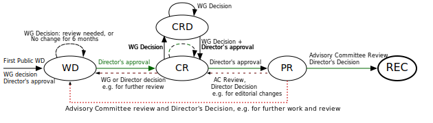](https://www.w3.org/Consortium/Process)

## CSS Cascading and Inheritance

### Cascading Order

1. Inherit styles.
2. User agent normal styles.
3. User normal styles.
4. Author `@layer` normal styles.
5. Author normal styles.
6. Animation styles.
7. Author `!important` styles.
8. Author `@layer` `!important` styles.
9. User `!important` styles.
10. User agent `!important` styles.
11. Transition styles.

> Transition > Animation > Normal > `@layer` > User > User Agent > Inherit

:::tip Important Styles Reversion

- 级联水平高的 styles 应用 !important 后, 其优先级变低.
- 级联水平低的 styles 应用 !important 后, 其优先级变高.

:::

[](https://developer.mozilla.org/docs/Web/CSS/Cascade)

### Layer

#### Layer Formal Syntax

[`@layer`](https://developer.mozilla.org/docs/Web/CSS/@layer) formal syntax:

```css
@layer [<layer-name># | <layer-name>?  {
  <stylesheet>
}]
```

```css
@layer base;
@layer theme, layout, components, utilities;

@layer base {
  html {
    font-size: 1rem;
  }
}

@layer {
  html {
    font-size: 1rem;
  }
}
```

#### Layer Specificity

```css
/* utilities > components > layout > theme */
@layer theme, layout, components, utilities;

/* c > c.d > a > a.b */
@layer a {
  p {
    color: red;
  }
  @layer b {
    p {
      color: green;
    }
  }
}
@layer c {
  p {
    color: orange;
  }
  @layer d {
    p {
      color: blue;
    }
  }
}
```

### Specificity

Specificity (`Selector Priority`) has 4 bits,
thousands, hundreds, tens, ones `0000`:

- Thousands: inline-style.
- Hundreds: ID selector (实际开发中一般用 `[id="Id"]` 代替优先级过高的 ID selector).
- Tens: class selector, attribute selector, pseudo class(`:`).
- Ones: type selector, pseudo element(`::`).

:::tip Zero Specificity

- Universal selector (`*`), combinators (`+`, `>`, `~`, `a b`) and `:where()`
  have no effect on specificity.
- `:not()` and `:is()` have no effect on specificity,
  but selectors in it have effect on specificity.

:::

```css
/* specificity: 0001 */
h1 {
  color: red;
}

/* specificity: 0100 */
#id {
  color: green;
}

/* specificity: 0003 */
h1 + p::first-letter {
  color: blue;
}

/* specificity: 0022 */
li > a[href*='link-url'] > .inline-warning {
  color: yellow;
}
```

```html
<!-- specificity: 1000; -->
<h1 style="color: black">Hello</h1>
```

```css
/* specificity: 0023 */
div li:nth-child(2) a:hover,
div li:nth-child(2) a:focus {
  border: 10px dashed black;
}

/* specificity: 0024 */
div div li:nth-child(2) a:hover,
div div li:nth-child(2) a:focus {
  border: 10px solid black;
}

/* specificity: 0033 */
div div .nav:nth-child(2) a:hover,
div div .nav:nth-child(2) a:focus {
  border: 10px double black;
}

/* specificity: 0101 */
#outer a {
  background-color: red;
}

/* specificity: 0104 */
#outer div ul li a {
  color: yellow;
}

/* specificity: 0113 */
#outer div ul .nav a {
  color: white;
}

/* specificity: 0201 */
#outer #inner a {
  background-color: blue;
}
```

Styles for a directly targeted element will
always take precedence over inherited styles,
regardless of the specificity of the inherited rule

```css
#parent {
  color: green;
}

/* <h1> element will be purple */
h1 {
  color: purple;
}
```

### Inheritance

- Most CSS properties that affect the text node are inherited properties:
  color, font-size, font-family, etc.
- Most CSS properties that affect the element node are non-inherited properties.
- When the `unset` value is set on an inherited property,
  it resets the property value to its inherited value.
- `unset` value resets a non-inherited property to its `initial` value.
- `revert` reverses the CSS default values to the browser user-agent styles.

#### Inherited CSS Property

- All elements: visibility, cursor.
- Inline elements:
  letter-spacing, word-spacing, white-space, line-height,
  color, font, font-family, font-size, font-style, font-variant, font-weight,
  text-decoration, text-transform, direction.
- Block elements: text-indent, text-align.
- List elements: list-style, list-style-type, list-style-position, list-style-image.
- Table elements: border-collapse.

## CSS Data Types

CSS [data types](https://developer.mozilla.org/docs/Web/CSS/CSS_Types)
define typical [values](https://github.com/frenic/csstype)
(including keywords and units)
accepted by CSS properties and functions:

- Textual data [types](https://developer.mozilla.org/docs/Web/CSS/CSS_Types#textual_data_types).
- Numeric data [types](https://developer.mozilla.org/docs/Web/CSS/CSS_Types#numeric_data_types).
- [Quantities](https://developer.mozilla.org/docs/Web/CSS/CSS_Types#quantities).
- Combinations of [types](https://developer.mozilla.org/docs/Web/CSS/CSS_Types#combinations_of_types).
- Color data [types](https://developer.mozilla.org/docs/Web/CSS/color_value).
- Image data [types](https://developer.mozilla.org/docs/Web/CSS/image).
- 2D [`<position>`](https://developer.mozilla.org/docs/Web/CSS/position_value).

CSS data types list:

- CSS [formal syntax](https://github.com/mdn/data/blob/main/css/syntaxes.json).
- CSS [values](https://www.zhangxinxu.com/wordpress/2019/11/css-value-type).
- CSS [units](https://developer.mozilla.org/docs/Web/CSS/CSS_Values_and_Units).
- CSS [functions](https://developer.mozilla.org/docs/Web/CSS/CSS_Functions).

## CSS Property Value

### Inherit Value

Inherit from parent.

### Initial Value

The initial value of a CSS property is its default value,
as listed in its **standard** definition table.

### Revert Value

Revert to **user agent** built in styles.

```css
@supports (-webkit-overflow-scrolling: touch) {
  progress {
    all: revert;
  }
}
```

### Unset Value

Reset to `inherit` or `initial` value.

```css
dialog {
  all: unset; /* Exclude `unicode-bidi`, `direction`, custom variables */
}
```

### Specified Value

The specified value of a CSS property is the value
it receives from the document's style sheet

### Computed Value

The computed value of a CSS property is the value that
is transferred from parent to child during inheritance.
It is calculated from the specified value by:

1. Handling the special values `inherit`, `initial`, `unset`, and `revert`
2. Doing the computation needed to reach the value described in the
   "Computed value" line in the property's definition table

```css
span {
  /* display computed to `block` */
  position: absolute;
}
```

### Used Value

The used value of a CSS property is its value after all calculations
have been performed on the computed value:

- The used values of dimensions (e.g., width, line-height) are in pixels
- The used values of shorthand properties (e.g., background)
  are consistent with those of their component properties
  (e.g., background-color or background-size) and with position and float

### Actual Value

The actual value of a CSS property is the used value of that property
after any necessary approximations have been applied

The user agent performs four steps to calculate a property's actual (final) value:

1. the specified value is determined based on the result of
   cascading, inheritance, or using the initial value.
2. the computed value is calculated according to the specification
   (for example, a span with position:
   absolute will have its computed display changed to block)
3. layout is calculated, resulting in the used value
4. the used value is transformed according to
   the limitations of the local environment,
   resulting in the actual value

:::tip CSS Value Transform

1. initial.
2. specified.
3. computed.
4. used.
5. actual value.

:::

## CSS Logical Properties and Values

### CSS Logical Basis

In `position`/`size`/`margin`/`padding`/`border`/`text alignment`:

- `block-start` for `top`.
- `block-end` for `bottom`.
- `block` for vertical.
- `inline-start` for `left`.
- `inline-end` for `right`.
- `inline` for horizontal.

```css
.logical {
  inline-size: fit-content;
  block-size: fit-content;
  min-inline-size: min-content;
  min-block-size: min-content;
  max-inline-size: max-content;
  max-block-size: max-content;
  padding-block-start: 1rem;
  padding-block-end: 1rem;
  padding-inline-start: 1rem;
  padding-inline-end: 1rem;
  margin-block-start: 1rem;
  margin-block-end: 1rem;
  margin-inline-start: 1rem;
  margin-inline-end: 1rem;
  border-block-start: 1px solid blue;
  border-block-end: 1px solid blue;
  border-inline-start: 1px solid blue;
  border-inline-end: 1px solid blue;
  inset-block-start: 0;
  inset-block-end: 0;
  inset-inline-start: 0;
  inset-inline-end: 0;
}
```

### CSS Logical Reference

- [W3C CSS Logical Draft](https://drafts.csswg.org/css-logical)
- [CSS Tricks CSS Logical Guide](https://css-tricks.com/css-logical-properties-and-values)

## CSS Variables

### Scope Variables

CSS Variables 本质上具有继承特性,
HTML 文档树中, 后代元素可以继承祖先元素的 CSS Variables:

```html
<div class="alert alert-info">
  <div class="alert-content">
    <h2 class="alert-title">Info</h2>
    <div class="alert-body">
      <p>Info Message.</p>
    </div>
  </div>
</div>
```

```css
.alert {
  --primary: #777;
  --secondary: #ccc;

  background-color: var(--secondary);
  border: 1px solid var(--primary);
}

.alert::before {
  background-color: var(--primary);
}

.alert-title {
  color: var(--primary);
}

.alert-success {
  --primary: #40c057;
  --secondary: #d3f9d8;
}

.alert-info {
  --primary: #228be6;
  --secondary: #d0ebff;
}

.alert-warning {
  --primary: #fab005;
  --secondary: #fff3bf;
}

.alert-error {
  --primary: #fa5252;
  --secondary: #ffe3e3;
}
```

```css
:root {
  --primary: hsl(260deg 95% 70%);
  --secondary: hsl(320deg 95% 60%);
}

.button {
  background-color: var(--button-background, transparent);
}

.button-primary {
  --button-background: var(--primary);
}

.button-secondary {
  --button-background: var(--secondary);
}
```

### Invalid and Empty Variables

- `--invalid-value: initial;` is `invalid` value
  leading to `var(--invalid-value)` called failed,
  `var(--invalid-value, backup-value)` get `backup-value`.
- `--empty-value: ;` is valid `empty` value
  leading to `var(--empty-value)` called succeeded,
  `var(--empty-value, backup-value)` get `unset` value
  (`inherit` or `initial` value).
- Use `invalid` and `empty` value to
  implement `if (true)` statement,
  you can see real world case on `tailwind.css`.

```css
:root {
  --on: initial;
  --off: ;
}

button {
  --is-raised: var(--off);

  border: 1px solid var(--is-raised, rgb(0 0 0 / 10%));
}

button:hover,
button:focus {
  --is-raised: var(--on);
}
```

```css
/**
 * css-media-vars
 * BSD 2-Clause License
 * Copyright (c) James0x57, PropJockey, 2020
 */

html {
  --media-print: initial;
  --media-screen: initial;
  --media-speech: initial;
  --media-xs: initial;
  --media-sm: initial;
  --media-md: initial;
  --media-lg: initial;
  --media-xl: initial;

  /* ... */
  --media-pointer-fine: initial;
  --media-pointer-none: initial;
}

/* 把当前变量变为空值 */
@media print {
  html {
    --media-print: ;
  }
}

@media screen {
  html {
    --media-screen: ;
  }
}

@media speech {
  html {
    --media-speech: ;
  }
}

/* 把当前变量变为空值 */
@media (max-width: 37.499em) {
  html {
    --media-xs: ;
    --media-lte-sm: ;
    --media-lte-md: ;
    --media-lte-lg: ;
  }
}

/** 移动优先的样式规则 */
.breakpoints-demo > * {
  /** 小于 37.5em, 宽度 100%  */
  --xs-width: var(--media-xs) 100%;

  /** 小于 56.249em, 宽度 49%  */
  --sm-width: var(--media-sm) 49%;
  --md-width: var(--media-md) 32%;
  --lg-width: var(--media-gte-lg) 24%;

  width: var(--xs-width, var(--sm-width, var(--md-width, var(--lg-width))));

  --sm-and-down-bg: var(--media-lte-sm) red;
  --md-and-up-bg: var(--media-gte-md) green;

  background: var(--sm-and-down-bg, var(--md-and-up-bg));
}
```

### Limit Variables

For some CSS values and units have limits (e.g `<color>`),
use variables to implement `if else` statement.

```css
:root {
  --red: 44;
  --green: 135;
  --blue: 255;

  /**
   * 亮度算法:
   * lightness = (red * 0.2126 + green * 0.7152 + blue * 0.0722) / 255
   */
  --lightness: calc(
    (var(--red) * 0.2126 + var(--green) * 0.7152 + var(--blue) * 0.0722) / 255
  );
}

.button {
  /* 文字颜色, 只可能是黑色或白色 */
  color: hsl(0% 0% calc((var(--lightness) - 0.5) * -999999%));

  /* 文字阴影, 黑色文字才会出现 */
  text-shadow: 1px 1px rgb(calc(var(--red) + 50) calc(var(--green) + 50) calc(
          var(--blue) + 50
        ) / calc((var(--lightness) - 0.5) * 9999));

  /* 背景颜色 */
  background: rgb(var(--red) var(--green) var(--blue));

  /* 固定样式 */
  border: 0.2em solid;

  /* 边框样式, 亮度大于 0.8 才出现 */
  border-color: rgb(
    calc(var(--red) - 50) calc(var(--green) - 50) calc(var(--blue) - 50) / calc((
            var(--lightness) - 0.8
          ) * 100)
  );
}
```

### Dark Mode Variables

```css
:root {
  /* Themes */
  --bg-light: #fff;
  --text-light: #000;
  --bg-dark: #000;
  --text-dark: #fff;

  /* Defaults */
  --bg: var(--bg-light);
  --text: var(--text-light);
}

@media (prefers-color-scheme: dark) {
  :root {
    --bg: var(--bg-dark);
    --text: var(--text-dark);
  }
}
```

### Variables API

```css
.element {
  height: 100vh; /* Fallback for browsers that do not support Custom Properties */
  height: calc(var(--vh, 1vh) * 100);
}
```

```ts
window.addEventListener('resize', () => {
  const vh = window.innerHeight * 0.01;
  document.documentElement.style.setProperty('--vh', `${vh}px`);
});
```

```ts
const root = document.documentElement;
const bgColor = getComputedStyle(root).getPropertyValue('--body-bg');
```

Change `--cursor-x` and `--cursor-y` via `JavaScript` API:

```css
:root::before {
  position: fixed;
  z-index: 1000;
  display: block;
  width: 100%;
  height: 100%;
  pointer-events: none;
  content: '';
  background: radial-gradient(
    circle 16vmax at var(--cursor-x) var(--cursor-y),
    rgb(0 0 0 / 0%) 0%,
    rgb(0 0 0 / 50%) 80%,
    rgb(0 0 0 / 80%) 100%
  );
}
```

Change `--percent` via `JavaScript` API:

```css
.bar {
  display: flex;
  height: 20px;
  background-color: #f5f5f5;
}

.bar::before {
  display: flex;
  justify-content: end;
  width: calc(var(--percent) * 1%);
  font-size: 12px;
  color: #fff;
  white-space: nowrap;
  content: counter(progress) '%\2002';
  counter-reset: progress var(--percent);
  background: #2486ff;
}
```

### Properties and Values API

[`@property`](https://developer.mozilla.org/docs/Web/CSS/@property):

```css
@property --property-name {
  syntax: '<color>';
  inherits: false;
  initial-value: #c0ffee;
}
```

[`CSS.registerProperty()`](https://developer.mozilla.org/docs/Web/API/CSS/RegisterProperty):

```ts
window.CSS.registerProperty({
  name: '--my-color',
  syntax: '<color>',
  inherits: false,
  initialValue: '#c0ffee',
});
```

## CSS Colors

### Current Color

[`currentcolor`](https://css-tricks.com/currentcolor):

- `currentcolor` 变量使用当前 `color` 计算值.
- `border-color`/`outline-color`/`caret-color`/`text-shadow`/`box-shadow`
  默认表现为 `currentcolor`.

### Accent Color

[`accent-color`](https://developer.mozilla.org/docs/Web/CSS/accent-color):

Change user-interface controls accent color.

### HSL Color

- H: hue.
- S: saturation (stay `50%` etc.).
- L: lightness (easy to theme colors).

```css
/* Hover Button */
:root {
  --primary-h: 221;
  --primary-s: 72%;
  --primary-l: 62%;
}

.button {
  background-color: hsl(var(--primary-h) var(--primary-s) var(--primary-l));
}

.button:hover,
.button:focus {
  --primary-l: 54%;
}
```

```css
/* Custom Buttons */
:root {
  --primary-h: 221;
  --primary-s: 72%;
  --primary-l: 62%;
}

.button {
  background-color: hsl(var(--primary-h) var(--primary-s) var(--primary-l));
}

.button-secondary {
  --primary-l: 90%;

  color: #222;
}

.button-ghost {
  --primary-l: 90%;

  background-color: transparent;
  border: 3px solid hsl(var(--primary-h) var(--primary-s) var(--primary-l));
}
```

```css
/* Change lightness to get gradient */
.section {
  background: linear-gradient(
    to left,
    hsl(var(--primary-h) var(--primary-s) var(--primary-l)),
    hsl(var(--primary-h) var(--primary-s) 95%)
  );
}

.section-2 {
  --primary-h: 167;
}
```

### HWB Color

[`hwb(H W B [/ A])`](https://developer.mozilla.org/docs/Web/CSS/color_value/hwb):

- `H`: hue (`<angle>`).
- `W`: whiteness (`<percentage>`).
- `B`: blackness (`<percentage>`).
- `A`: alpha (`<percentage>`).

### CSS Color Reference

- CSS color module level 5 [guide](https://blog.logrocket.com/exploring-css-color-module-level-5):
  - hwb.
  - lab.
  - lch.
  - color-mix.
  - color-contrast.
  - color.
  - accent-color.
- CSS `color` [value](https://developer.mozilla.org/docs/Web/CSS/color_value).

## CSS Math

### Calculation Function

[`calc()`](https://developer.mozilla.org/docs/Web/CSS/calc):

- 支持多种数据类型:
  `<length>`/`<frequency>`/`<angle>`/`<time>`/`<percentage>`/`<number>`/`<integer>`.
- 支持加减乘除 4 种运算.
- 运算符前后带单位或者带百分号的值只能进行加减运算, 不能进行乘除运算.
- 加号和减号两侧一定要有空格, 乘号和除号两侧无须空格.
- 结合 `CSS Variables`, 拥有强大功能与可维护性.

```css
html {
  font-size: calc(16px + 2 * (100vw - 375px) / 39);
}

.button {
  width: calc(100% - 20px);
}

.list {
  --size: calc(100% - 2rem);

  width: calc(var(--size) / 6);
}
```

### Min and Max Function

```css
.box {
  width: min(10vw, 5em, 80px);
  width: max(10px * 10, 10em);
  width: min(calc(10px * 10), 10em);
  width: max(10px * 10, var(--width));
}
```

```css
.legacy-container {
  width: 100%;
  max-width: 1024px;
}

.modern-container {
  width: min(100%, 1024px);
}
```

```css
.legacy-container {
  width: 100%;
  min-width: 768px;
}

.modern-container {
  width: max(100%, 768px);
}
```

### Clamp Function

[Fluid size](https://github.com/codeAdrian/modern-fluid-typography-editor):

```css
.clamp {
  width: max(75px, min(25vw, 125px));
  width: clamp(75px, 25vw, 125px);
  margin-bottom: clamp(4px, 6.5vh, 5.5rem);
  font-size: clamp(2.25rem, 2vw + 1.5rem, 3.25rem);
  text-indent: clamp(15px, 10%, 1.5rem);
  letter-spacing: clamp(0.1rem, 1.5vw, 0.5rem);
}
```

Generate fluid size for [`Tailwind.css`](https://davidhellmann.com/blog/development/tailwindcss-fluid-typography-with-css-clamp):

<!-- markdownlint-disable line-length -->

```ts
const settings = {
  typography: {
    fontSizeMin: 1.125,
    fontSizeMax: 1.25,
    msFactorMin: 1.125,
    msFactorMax: 1.2,
    lineHeight: 1.6,
  },
  screensRem: {
    min: 20,
    sm: 40,
    md: 48,
    lg: 64,
    xl: 80,
    '2xl': 96,
  },
  grid: {
    cols: 24,
  },
};

const remToPx = rem => `${rem * 16}px`;

const screens = {
  sm: remToPx(settings.screensRem.sm),
  md: remToPx(settings.screensRem.md),
  lg: remToPx(settings.screensRem.lg),
  xl: remToPx(settings.screensRem.xl),
  '2xl': remToPx(settings.screensRem['2xl']),
};

const fsMin = settings.typography.fontSizeMin;
const fsMax = settings.typography.fontSizeMax;
const msFactorMin = settings.typography.msFactorMin;
const msFactorMax = settings.typography.msFactorMax;
const screenMin = settings.screensRem.min;
const screenMax = settings.screensRem['2xl'];

const calcMulti = (multiMin = 0, multiMax = null) => {
  return {
    fsMin: fsMin * Math.pow(msFactorMin, multiMin),
    fsMax: fsMax * Math.pow(msFactorMax, multiMax || multiMin),
  };
};

const clamp = (multiMin = 0, multiMax = null) => {
  const _calcMulti = calcMulti(multiMin, multiMax || multiMin);
  const _fsMin = _calcMulti.fsMin;
  const _fsMax = _calcMulti.fsMax;
  return `clamp(${_fsMin}rem, calc(${_fsMin}rem + (${_fsMax} - ${_fsMin}) * ((100vw - ${screenMin}rem) / (${screenMax} - ${screenMin}))), ${_fsMax}rem)`;
};

const fontSize = {
  xs: clamp(-2),
  sm: clamp(-1),
  base: clamp(0),
  lg: clamp(1),
  xl: clamp(2),
  '2xl': clamp(3),
  '3xl': clamp(4),
  '4xl': clamp(5),
  '5xl': clamp(6),
  '6xl': clamp(7),
  '7xl': clamp(8),
  '8xl': clamp(9),
  '9xl': clamp(10),
};

module.exports = {
  theme: {
    screens,
    fontSize,
  },
};
```

<!-- markdownlint-enable line-length -->

## CSS Selectors

[](https://developer.mozilla.org/docs/Web/CSS/CSS_Selectors)

### Universal Selector

`*`:

- 不影响选择器优先级.
- 匹配自定义元素, `<script>`, `<style>`, `<title>`.
- 不匹配伪元素.

### Type Selector

```css
p {
  margin-bottom: 1em;
  line-height: 1.5em;
}
```

### Attribute Selector

`E[attr]`:

```css
/* 定位页面里所有具有必填属性 "required" 的 input */
input[required] {
  border: 1px solid #f00;
}
```

`E[attr=value]` match `value`:

```css
/* 定位页面里的密码输入框 */
input[type='password'] {
  border: 1px solid #aaa;
}
```

`E[attr|=value]` match `value`/`value-`:

```css
/**
 * 定位页面里所有的 pre 里具有 class 属性且属性值为 language 或是 language- 开头的
 * 比如 class="language", class="language-tsx"
 */
pre[class|='language'] {
  color: #333;
}
```

`E[attr~=value]` match `value`/`* value *`:

```css
/**
 * 定位页面里所有具有属性 title 且属性值里拥有完整单词 english 的 div 容器
 * 比如 title="english", title="a english"
 */
div[title~='english'] {
  color: #f88;
}
```

`E[attr^=value]` match `^value`:

```css
/**
 * 定位页面里具有属性 class 且属性值以 a 开头的 div 容器
 * 比如 class="a", class="ab"
 */
div[class^='a'] {
  color: #666;
}
```

`E[attr$=value]` match `value$`:

```css
/**
 * 定位页面里具有属性 class 且属性值以 a 结尾的 div 容器
 * 比如 class="nba", class="cba"
 */
div[class$='a'] {
  color: #f00;
}
```

`E[attr*=value]` match `*value*`:

```css
/* 定位所有 title 里具有 link 字符串的 a 链接 */
a[title*='link'] {
  text-decoration: underline;
}
```

### Descendant Combinator

`E F` 后代选择器:

```css
ul li {
  margin-bottom: 0.5em;
}
```

Using the descendant selector without more specificity can be really expensive.
The browser is going to check every descendant element for a match
because the relationship isn't restricted to parent and child.

For `.container ul li a` selector:

- match every `<a>` on the page
- find every `<a>` contained in a `<li>`
- use the previous matches and narrow down to
  the ones contained in a `<ul>`
- finally, filter down the above selection to
  the ones contained in an element with the class `.container`

### Child Combinator

`E > F` 子代选择器:

```css
ul > li {
  list-style: none;
} /* 仅限ul的直接子元素li, 忽略嵌套子元素 */
```

### General Sibling Combinator

`E ~ F` 一般兄弟选择器:

```css
/* p before h1 */
p {
  color: #fff;
}

/* 定位具有相同父元素的, h1标签之后的所有p标签 */
h1 ~ p {
  color: #f00;
}
```

Checkbox `input` as hidden `click` event listener:

```css
input.checkbox {
  visibility: hidden;
  opacity: 0;
}

nav {
  transform: scale(0);
}

input.checkbox:checked ~ nav {
  transform: scale(1);
}
```

### Adjacent Sibling Combinator

`E + F` 相邻兄弟选择器:

```css
* + * {
  margin-top: 1.5em;
}
```

```css
li + li {
  border-top: 1px solid #ddd;
}
```

### Location Pseudo Class

#### Link Pseudo Class

`:link`:

- 只匹配未访问的 `<a href>`.
- 可用 `a`/`[href]` 选择器代替.

#### Visited Pseudo Class

`:visited`:

- 只匹配访问过的 `<a href>`.
- 只支持设置颜色:
  `color`/`background-color`/`outline-color`/`border-color`/`column-rule-color`/`text-decoration-color`.
- 不支持颜色透明度 (`alpha`).
- 只支持重置已有颜色, 不能新增设置样式.
- `window.getComputedStyle` 无法获取到 `:visited` 设置颜色.

#### Any Link Pseudo Class

`:any-link`:

- 同时匹配 `:link` 与 `:visited` 元素.
- 匹配所有设置了 `[href]` 的链接元素: `<a href>`/`<link href>`/`<area href>`.

#### Target Pseudo Class

`:target`:

- 该选择器定位当前活动页面内定位点的目标元素 (#anchor-name) `#info:target {font-size:24px;}`.
- 可用于实现 `tab`/`carousel`/`gallery`/`slide`:
  - 利用 `display:none` 隐藏 `#id` 元素,
    不会触发页面滚动 (防止页面抖动),
    可以触发 `:target` 伪类匹配.
  - `:target ~ .content` 控制实际内容切换.

```html
<a href="#p1">p1</a>
<div id="p1">p1</div>

<style>
  div:target {
    background-color: purple;
  }
</style>
```

```css
.anchor {
  display: none;
}

.content {
  max-height: 0;
}

.anchor:target ~ .content {
  max-height: 100%;
}
```

`:target-within`:

- Selected when any children targeted.

### User Action Pseudo Class

#### Hover Pseudo Class

`:hover`:

- 鼠标移动到容器时的状态.
- 不仅限于链接, 可用于页面中的任何元素.

#### Active Pseudo Class

`:active`:

- **点击** (mouse click/screen touch) 时的状态.
- 键盘访问无法激活 `:active`.
- 不仅限于链接, 可用于任何具有 `tabindex` 属性的元素.

`:link` —> `:visited` —> `:hover` —> `:active` links:

```css
/* Unvisited links */
a:link {
  color: blue;
}

/* Visited links */
a:visited {
  color: purple;
}

/* Hovered links */
a:hover {
  background: yellow;
}

/* Active links */
a:active {
  color: red;
}
```

```css
[href]:active,
button:active,
[type='button']:active,
[type='reset']:active,
[type='submit']:active {
  clip-path: polygon(0 0, 100% 0, 100% 100%, 0 100%);
  background: linear-gradient(rgb(0 0 0 / 5%), rgb(0 0 0 / 5%));
  outline: 999px solid rgb(0 0 0 / 5%);
  outline-offset: -999px;
  box-shadow: inset 0 0 0 999px rgb(0 0 0 / 5%);
}
```

#### Focus Pseudo Class

`:focus`:

- 获得焦点时的状态 (包括键盘访问).
- 不仅限于 `<a href>`/`<button>`/`<input>`/`<select>`/`<area>`/`<summary>`,
  可用于任何具有 `tabindex`/`contenteditable` 属性的元素.

`:focus-visible`:

- Selected when `Tab` (keyboard) focused.
- 可用于区分鼠标与键盘激活样式.

Separate focus styles:

```css
/* Tab Focus Style */
.button:focus-visible {
  outline: 2px solid #416dea;
  outline-offset: 2px;
  box-shadow: 0 1px 1px #416dea;
}

/* Mouse Focus Style */
.button:focus:not(:focus-visible) {
  outline: none;
}
```

`:focus-within`:

- Selected when any children focused.
- 可用于实现 `dropdown`.

```css
.dropdown-list {
  display: none;
}

.dropdown:focus-within .dropdown-list {
  display: block;
}
```

### Input Pseudo Class

- `:autofill`.
- `:enabled`:
  匹配启用的界面元素, e.g `input`.
- `:disabled`:
  匹配禁用的界面元素 (`[disabled]`), e.g `input`.
- `:read-only`:
  匹配其内容无法供用户修改的元素 (`<div>`/`[readonly]`).
- `:read-write`:
  匹配其内容可供用户修改的元素 (`<div contenteditable>`/`<input>`).
- `:default`:
  匹配处于默认状态的表单元素, 可用于默认选项/推荐选项样式.
- `:checked`:
  匹配处于选中状态的表单元素, 可用于开关选框/多选框样式.
- `:indeterminate`:
  - 匹配处于未选状态的单选框元素 `<input type="radio">`.
  - 匹配处于半选状态的复选框元素 `<input type="checkbox">`.
  - 匹配处于未设置 `value` 的进度条元素 `<progress>`.
- `:valid`:
  匹配输入验证有效的表单元素 (`<input type>`/`<input pattern>`).
- `:invalid`:
  匹配输入验证无效的表单元素.
- `:user-invalid`:
  匹配用户交互后仍然验证无效的表单元素.
- `:in-range`:
  匹配具有范围限制的元素, 其中该值位于限制范围内,
  e.g 具有 `min` 和 `max` 属性的 `number` 和 `range` 输入框.
- `:out-of-range`:
  与 `:in-range` 选择相反, 其中该值位于限制范围外.
- `:required`:
  匹配具有必填属性 `[required]` 的表单元素.
- `:optional`:
  匹配没有必填属性 `[required]` 的表单元素.
- `:placeholder-shown`:
  select `input` with placeholder, 可用于控制输入样式.

```css
@media screen and (prefers-reduced-motion: reduce) {
  .msg {
    transition: none;
  }
}

.msg {
  opacity: 0;
  transition: opacity 0.2s ease-in-out;
}

.input:not(:placeholder-shown) ~ .label,
.input:focus ~ .label {
  opacity: 1;
}
```

### Structural Pseudo Class

- `:root`:
  - 根元素, 始终指 html 元素.
  - `:root` 选择器优先级高于 `html` 选择器.
  - 为了代码可读性, `:root` 用于设置全局变量, `html` 用于设置全局样式.
- `:empty`: 没有任何子元素的元素, 不能有注释节点与文本节点.
- `E F:nth-child(n)`:该选择器定位元素 E 的第 n 个子元素的元素 F,可省略 E.
- `E F:nth-last-child(n)`: 该选择器定位元素 E 的倒数第 n 个子元素的元素 F,可省略 E.
- `E F:first-child`: 第一个孩子.
- `E F:last-child`: 最后一个孩子.
- `E F:only-child`: 单一后代.
- `E F:nth-of-type(n)`: 该选择器定位元素 E 的第 n 个 **相同类型** 子元素,可省略 E.
- `E F:nth-lash-of-type(n)`: 该选择器定位元素 E 的导数第 n 个 **相同类型** 子元素,可省略 E.
- `E F:first-of-type`: **相同类型** 的第一个元素.
- `E F:last-of-type`: **相同类型** 的最后一个元素.
- `E F:only-of-type`: 孩子中只有一种该元素.

:::tip N Calculation

`n` start from `0`,
calculation result limit to `> 0`:

- `:nth-child(5n)`: `0, 5, 10, 15, ...` -> `5, 10, 15, ...`.
- `:nth-child(3n+4)`: `4, 7, 10, 13, ...` -> `4, 7, 10, 13, ...`.
- `:nth-child(-n+3)`: `3, 2, 1, 0, -1, ...` -> `3, 2, 1`.
- `:nth-child(n+4):nth-child(-n+10)`:
  `4, 5, 6, ...` + `10, 9, 8, ...` -> `4, 5, 6, 7, 8, 9, 10`.

:::

### Logical Pseudo Class

- `:not(<selector>)`:
  - Selector priority.
  - 选择与括号内的选择器不匹配的元素.
- `:is(<selector>)`:
  - Selector priority.
- `:where(<selector>)`:
  - 0 priority.
- [`<target_element>:has(<selector>)`](https://ishadeed.com/article/css-has-parent-selector):
  - `:has` normal priority.
  - A target element has child elements: `:has(> selector)`.
  - A target element has sibling elements: `:has(+ selector)`.

```css
:is(ol, ul) :is(ol, ul) li {
  margin-left: 2rem;
}
```

### Linguistic Pseudo Class

- `:dir(ltr)`/`:dir(rtl)`.
- `:lang(en)`: 具有使用双字母缩写 (`en`) 表示的语言的元素.

```css
:lang(en) > q {
  quotes: '\201C''\201D''\2018''\2019';
}

:lang(fr) > q {
  quotes: '<< ' ' >>';
}

:lang(de) > q {
  quotes: '>>' '<<' '\2039''\203A';
}
```

### Misc Pseudo Class

- `:fullscreen`.

### First Letter and Line Pseudo Element

`::first-letter`/`::first-line`:

- `::first-letter`: 匹配文本首字母.
- `::first-line`: 匹配文本首行.
- IE9 及以上版本浏览器支持双冒号, IE8 浏览器只支持单冒号写法.
- 只作用于块级元素:
  `display` `block`/`inline-block`/`list-item`/`table-cell`/`table-caption`.
- 只支持部分 CSS 属性:
  - `color` 属性.
  - 背景相关属性.
  - 文本相关属性.
  - 字体相关属性.

### Selection Pseudo Element

`::selection` 匹配突出显示的文本:

- `color`.
- `background-color`.
- `cursor`.
- `caret-color`.
- `outline`.
- `text-decoration`.
- `text-emphasis-color`.
- `text-shadow`.
- `stroke-color`.
- `fill-color`.
- `stroke-width`.

```css
/* 定义选中的文本颜色与背景色 */
::selection {
  color: #fff;
  background: #444;
}
```

### Before and After Pseudo Element

使用 `content` 属性生成额外的内容并插入在标记中:

```css
a::after {
  content: '↗';
}
```

`attr()` – 调用当前元素的属性:

```css
a::after {
  content: '(' attr(href) ')';
}

b::after {
  content: '(' attr(data-language) ')';
}
```

`url()`/`uri()` – 用于引用媒体文件:

```css
h1::before {
  content: url('logo.png');
}
```

`counter()` -
调用计数器, 可以不使用列表元素实现序号功能,
配合 CSS3 中`counter-increment`和`counter-reset`属性:

```css
h2::before {
  content: 'Chapter ' counter(chapter);
  counter-increment: chapter;
}
```

```css
div {
  counter-reset: tidbit-counter 58;
}

h2::before {
  content: counter(tidbit-counter, list-style-type) ': ';
  counter-increment: tidbit-counter 1;
}
```

```html
<div>
  <h2>HTML</h2>
  <h2>CSS</h2>
  <h2>JS</h2>
</div>

<!-- output
59: HTML
60: CSS
61: JS
output -->
```

### Shadow DOM Pseudo Class and Element

- `:host`: shadow DOM root element.
- `:host-context`: shadow DOM root parent element.
- `::part()`.
- `::slotted()`.

### Focusable Selector

```ts
const FOCUSABLE_SELECTOR = [
  '[contenteditable]',
  '[tabindex="0"]:not([disabled])',
  'a[href]',
  'audio[controls]',
  'button:not([disabled])',
  'iframe',
  'input:not([disabled]):not([type="hidden"])',
  'select:not([disabled])',
  'summary',
  'textarea:not([disabled])',
  'video[controls]',
].join(',');
```

## CSS Box

### Box Sizing

`box-sizing`:

- `content-box` (default).
- `padding-box`.
- `border-box`.

Box sizing:

- `Intrinsic Sizing` (内在尺寸):
  表示元素最终的尺寸表现是由内容决定的,
  e.g `fit-content`/`min-content`/`max-content`.
- `Extrinsic Sizing` (外在尺寸):
  表示元素最终的尺寸表现是由上下文决定的,
  e.g `stretch`/`-moz-available`/`-webkit-fill-available`.

### Box Width

#### Width Formal Syntax

`width`:

- `auto`: initial value.
- `<length>`.
- `<percentage>`.
- `min-content | max-content | fit-content | fit-content(<length-percentage>)`.

#### Min and Max Width

`min-width` > `max-width` > `width !important`:

```css
/* 480px */
.box-1 {
  min-width: 480px;
  max-width: 256px;
}

/* 256px */
.box-2 {
  width: 480px !important;
  max-width: 256px;
}
```

#### Percentage Width

`%` width calculate by `containing box` width:

- 普通元素的百分比宽度是相对于父元素 `content box` 宽度计算.
- 绝对定位元素的百分比宽度是相对于第一个 `position` 不为 `static` 的祖先元素 `padding box` 宽度计算.

#### Auto Flow Width

Auto flow with `css-sizing`:
present for `fit-content`/`min-content`/`max-content`/`stretch`
with `width`/`min-width`/`max-width`/`height`/`min-height`/`max-height`/
`grid-template-rows`/`grid-template-columns`/`flex-basis`.

```css
.content {
  width: fit-content;
  margin: auto;
}

.button {
  box-sizing: border-box;
  width: calc(100% - 30px);
  width: stretch;
  height: 40px;
  margin-right: 15px;
  margin-left: 15px;
}

.table {
  box-sizing: border-box;
  width: 100%;
  width: stretch;
  table-layout: fixed;
}
```

### Box Viewport Height

```css
.my-element {
  height: 100vh; /* Fallback for browsers that do not support Custom Properties */
  height: calc(var(--vh, 1vh) * 100);
}
```

```ts
window.addEventListener('resize', () => {
  // Get viewport height and multiple it by 1% to get a value for a vh unit
  const vh = window.innerHeight * 0.01;
  document.documentElement.style.setProperty('--vh', `${vh}px`);
});
```

### Box Padding

#### Percentage Padding

Auto flow percentage `padding` calculate by `width`:

```css
.box {
  position: relative;
  padding: 10% 50%;
}

.box > img {
  position: absolute;
  top: 0;
  left: 0;
  width: 100%;
  height: 100%;
}
```

### Box Margin

#### Auto Margin

CSS2 visual formatting model:

- If both margin-left and margin-right are auto,
  their used values are equal.
- If margin-top, or margin-bottom are auto,
  their used value is 0.

#### Negative Margin

Negative horizontal `margin` make `width` **stretch**:

```css
/* ul width = 100% + 20px */
ul {
  margin-right: -20px;
}

ul > li {
  float: left;
  width: 100px;
  margin-right: 20px;
}
```

Negative vertical `margin` change vertical flow:

```css
.column-box {
  overflow: hidden; /* hidden overflow background */
}

/* 视觉等高布局 */
.column-left,
.column-right {
  padding-bottom: 9999px;
  margin-bottom: -9999px;
}
```

#### Percentage Margin

Auto flow percentage `margin` calculate by `width`.

#### Collapse Margin

[`margin` collapsing](https://developer.mozilla.org/docs/Web/CSS/CSS_Box_Model/Mastering_margin_collapsing):

- Adjacent siblings: 1's margin-bottom with 2's margin-top.
- No content separating parent and descendants:
  - No border/padding/inline part/block formatting context created/clearance:
    can't separate parents margin-top from its descendant blocks margin-top.
  - No border/padding/inline content/height/min-height:
    can't separate parents margin-bottom from its descendant blocks margin-bottom.
  - Collapsed margin ends up **outside the parent**.
- Empty blocks:
  no border/padding/inline content/height/min-height
  to separate block's margin-top from its margin-bottom.

`margin` collapsing calculation:

- 正正取大值.
- 正负值相加.
- 负负最负值.

:::tip Never Collapse

Floating and absolutely positioned elements margin **never collapse**.

:::

#### Invalid Margin

- `display: inline` 非替换元素 `vertical margin` 无效: e.g ``.
- `display: table-cell`/`display: table-row` 元素 `margin` 无效: e.g `<tr>`, `<td>`.
- `position: absolute` 绝对定位元素未定位方向 (`auto`) `margin`:
  `.absolute { top: 10%; left: 30%; }` `margin-right` 与 `margin-bottom` 改变了外部尺寸,
  但无法影响兄弟元素布局.
- 定高容器**子元素**的 `margin-bottom` 或者定宽容器**子元素**的 `margin-right` 的定位作用失效.

### Box Overflow

[`overflow`](https://developer.mozilla.org/docs/Web/CSS/overflow):

- `visible`.
- `hidden`: 溢出隐藏基于 `padding box`.
- `clip`.
- `scroll`.
- `auto`.

### Box Line Height

#### Inline Element Line Height

行间距:

- 半行间距 = `(line-height * font-size - font-size) / 2`.
- 行间距 = 第一行下半行间距 + 第二行上半行间距.

#### Box Line Height Inheritance

`line-height` 继承:

- `%` 与 `em` 继承计算值, `number` 继承数值.
- `line-height` 最好使用 `number`, 使得子代继承 `line-height` 时文字正常排版,
  不会出现 `line-height` < `font-size` 导致文字重叠的现象.
- Inline level element:
  由于 `line-height` 可继承, 一般给父元素设置 `line-height` 即可,
  会自动作用至容器内所有内联元素.
- Block level element:
  由于行框盒子幽灵空白节点的存在,
  `line-height * font-size` 会决定 block level element 内部元素的最小高度,
  e.g `<div><span></span></div>` 高度不为 `0`.

### Box Vertical Align

#### Box Vertical Align Values

`vertical-align` 有效值:

- 线类: `baseline`, `top`, `middle`, `bottom`.
- 文本类: `text-top`, `text-bottom`.
- 上标下标类: `sub`, `super`.
- 数值: 基于 `baseline` 上移 (正数) / 下移 (负数).
- 百分比: calculate by `line-height`.

#### Box Vertical Align Applies

`vertical-align` 作用元素:

- [Inline level element](https://developer.mozilla.org/docs/Web/HTML/Inline_elements):
  - `<span>`/`<strong>`/`<em>`.
  - ``/`<button>`/`<input>`.
  - `::before`/`::after`.
- `display: table-cell` 元素.
- 用 `display: inline-*` 或 `display: table-cell` **以外**的方式
  创建 `Box Formatting Context` 后,
  `vertical-align` 不再起作用.
- 当 `line-height` 过小时, `vertical-align` 在视觉上失效,
  调整 `line-height` 至足够大时, `vertical-align` 正常起作用.

### Box Model

- Inline-level box:
  `display` 属性为 `inline`, `inline-block`, `inline-table` 的元素,
  会生成 inline-level box, 并且参与 `Inline Formatting Context` (IFC).
- Block-level box:
  `display` 属性为 `block`, `list-item`, `table` 的元素,
  会生成 block-level box, 并且参与 `Block Formatting Context` (BFC).
- `Flex Formatting Context` (FFC).
- `Grid Formatting Context` (GFC).

### Inline Box Model

#### Content Area

Character box/em-box/selection box):

一种围绕文字看不见的盒子,
其大小仅受字符本身特性控制,
一般将选中区域等价于此盒子.

#### Inline Box

- 内联元素形成外部内联盒子, 让元素不成块显示, 而是排成一行.
- 水平间距可通过 `padding-inline`/`border-inline`/`margin-inline` 调整,
  垂直间距可通过 `line-height`/`vertical-align` 调整,
  垂直间距**不受** `padding-block`/`border-block`/`margin-block` 影响.
- `<span>`/`<a>`/`<em>` tag 会产生一般内联盒子.
- Bare text 会产生匿名内联盒子.

```css
::first-line {
  color: white;
  background: red;
}
```

#### Line Box

- 每一行会形成一个行框盒子.
- 每个行框盒子的前面有一个[**幽灵空白节点**](https://www.w3.org/TR/CSS22/visudet.html#strut)
  (zero-width inline box with the element's `font` and `line height` properties).
  父元素的 `line-height` 会幽灵空白节点产生作用.
- 将内联元素设置为 `display: inline-block` 可以消除幽灵空白节点.

#### Lines containing Box

`<p>` tag 会形成一个包含盒子, 此盒子由一行一行的行框盒子组成.

:::tip Box Height

在很多情况下, 容器高度**莫名奇妙**变大,
都是行框盒子幽灵空白节点 (`Strut`), `line-height`, `vertical-align` 共同作用的结果:

- 容器内部除了显式的内联元素外, 每行还存在幽灵空白节点 (`Strut`).
- `line-height` 可继承, 且基于 `font-size` 进行计算.
- `vertical-align` 默认对齐方式为基线对齐 (`baseline`).

常见例子有:

- `<div><span></span></div>` 高度不为 `0`:
  `Strut` 撑高容器.
- `<div class="leading-8"><span class="text-2xl">文字</span></div>`
  高度不为 `32px` (`leading-8`):
  当 `Struct` `font-size` 与内联元素 `font-size` 差距过大时,
  进行文字对齐时会撑高容器.
- `<div></div>` 下边缘存在空隙:
  `Strut` 默认基于[基线对齐](#inline-element-baseline).

:::

### Block Formatting Context

#### Block Formatting Context Features

- 一个 BFC 包含创建该上下文元素的所有子元素, 但不包括创建了新 BFC 的子元素的内部元素.
- BFC 就是页面上的一个隔离的独立容器, 容器里面的子元素不会影响到外面的元素, 反之也如此.
- 一个元素不能同时存在于两个 BFC 中: 可让处于 BFC 内部的元素与外部的元素相互隔离.
- 每个元素的 margin box 的左边, 与包含块 border box 的左边相接触.
- 内部的 Box 会在垂直方向, 一个接一个地放置.
- Vertical margin collapsing.
- BFC 的区域不会与 float box 重叠: 自适应分栏布局, 清除外/内部浮动.
- 计算 BFC 的高度时, 浮动元素也参与计算:
  防止内边距塌陷 (margin-top collapse with margin-bottom).

#### Block Formatting Context Creation

- 根元素或其它包含它的元素.
- `overflow`: not visible (e.g `hidden`).
- `float`: not `none` (e.g `left`/`right`).
- `position`: not `relative`/`static` (e.g `absolute`/`fixed`).
- `display`: `inline-block`.
- `display`: `table-cell`/`table-caption`/`table-*h`.
- `display`: flow-root.
- direct children of `display: flex/inline-flex`.
- direct children of `display: grid/inline-grid`.

```css
.bfc-1 {
  overflow: hidden;
}

.bfc-2 {
  display: table-cell;
  *display: inline-block; /* For IE7 */
  width: 9999px;
  *width: auto; /* For IE7 */
}
```

### Box Stacking

#### Stacking Level

Positioned element (non-`static` `position`), `flex` box, `grid` box
can use the `z-index` property to adjust its stacking level:

数值越大, 处于可视的优先级越大.

#### Stacking Context

[Stacking context creation](https://developer.mozilla.org/docs/Web/CSS/CSS_Positioning/Understanding_z_index/The_stacking_context):

- The root element `<html>` forms the `root stacking context`.
- `absolute`/`relative` element with non-`auto` `z-index`.
- `fixed`/`sticky` element.
- `flex` children with non-`auto` `z-index`.
- `grid` children with non-`auto` `z-index`.
- `opacity` $<1$ element.
- non-`normal` `mix-blend-mode` element.
- `transform` element.
- `perspective` element.
- `filter` element.
- `backdrop-filter` element.
- `clip-path` element.
- `mask`/`mask-image`/`mask-border` element.
- `isolation: isolate` element.
- `will-change` above properties element.
- `contain` `strict`/`content`/`layout`/`paint` element.

The `z-index` of elements inside of a `stacking context`
are always **relative to parent** current order in its own `stacking context`.

```html
<!-- .bottom > .inner is on top -->
<div class="top">
  <div class="inner"></div>
</div>
<div class="bottom">
  <div class="inner"></div>
</div>

<style>
  .top,
  .bottom {
    position: relative;
    width: 250px;
    padding: 80px 20px;
  }

  .top {
    z-index: 1;
  }

  .bottom {
    z-index: 2;
  }

  .top > .inner {
    z-index: 999;
  }

  .bottom > .inner {
    z-index: 2;
  }
</style>
```

#### Stacking Order

- The background and borders of the root element.
- Descendant non-positioned blocks, in order of **appearance in the HTML**.
- Descendant positioned elements, in order of **appearance in the HTML**.

[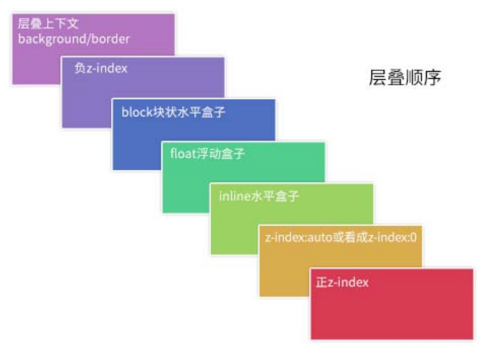](https://developer.mozilla.org/docs/Web/CSS/CSS_Positioning/Understanding_z_index/Stacking_without_z-index)

```css
.box {
  /* 创建层叠上下文 */
  position: relative;
  z-index: 0;
  background-image: url('1.png');
}

.box::before,
.box::after {
  position: absolute;
  z-index: -1;
  content: '';
}

.box::before {
  background-image: url('2.png');
}

.box::after {
  background-image: url('3.png');
}
```

```html
<div class="container">
  <div class="page">标题和内容</div>
</div>

<style>
  .container {
    /* 创建层叠上下文 */
    position: relative;
    z-index: 0;
    background-color: #666;
  }

  .page {
    position: relative;
    background-color: #f4f39e;
  }

  /* 边角卷边阴影 */
  .page::before,
  .page::after {
    /* 层叠上下文（灰色背景）之上, 定位元素（黄色纸张）之下 */
    position: absolute;
    z-index: -1;
    width: 90%;
    height: 20%;
    content: '';
    box-shadow: 0 8px 16px rgb(0 0 0 / 30%);
  }

  /* 边角卷边阴影定位和角度控制 */
  .page::before {
    bottom: 0;
    left: 0;
    transform: skew(-15deg) rotate(-5deg);
    transform-origin: left bottom;
  }

  .page::after {
    right: 0;
    bottom: 0;
    transform: skew(15deg) rotate(5deg);
    transform-origin: right bottom;
  }
</style>
```

## Position Pattern

### Static Position

`top`/`bottom`/`left`/`right`/`inset`/`z-index` are invalid.

### Relative Position

- 使元素相对于 `static` 布局.
- 可使用 `top`/`bottom`/`left`/`right`/`inset` 属性进行定位.
- 相对方向 (opposite) 的定位同时设置: `top` 覆盖 `bottom`, `left` 覆盖 `right`.
- 初始位置被保留, 不脱离文档流.

### Absolute Position

- 使元素相对于 `containing block` 布局:
  - Non-`static` `position` element.
  - `transform` element.
- 若祖先全为 `position: static`/`transform: none` 元素,
  则使元素相对于浏览器窗口布局.
- 可使用 `top`/`bottom`/`left`/`right`/`inset` 属性进行定位.
- 相对方向 (opposite) 的定位同时设置:
  若未显示设置该方向的元素大小, 则元素具有流动性, 受 `containing block` 影响其大小,
  `.fluid { position: absolute; left: 0; right: 0; }`.
- 初始位置不被保留, 脱离文档流.
- `float` computed to `float: none`.
- `display` `inline-table` computed to `table`.
- `display` `inline`/`inline-block`/`table-*` computed to `block`.

```css
.tooltip {
  position: absolute;
}

.form-alert,
.form-warning,
.form-info {
  position: absolute;
}

.overlay {
  position: absolute;
  top: 0;
  left: 0;
  z-index: -50;
  width: 100%;
  height: 100%;
  background: rgb(0 0 0 / 50%);
}
```

可以利用 `absolute` 模拟 `fixed` 布局:

```html
<html>
  <body>
    <div class="page">滚动内容区域</div>
    <div class="fixed">固定定位元素</div>
  </body>
  <style>
    html,
    body {
      height: 100%;
      overflow: hidden;
    }

    .page {
      height: 100%;
      overflow: auto;
    }

    .fixed {
      position: absolute;
    }
  </style>
</html>
```

### Fixed Position

- 使元素相对于浏览器窗口布局, 但不受滑动条影响.
- 可使用 `top`/`bottom`/`left`/`right`/`inset` 属性进行定位.
- `float` computed to `float: none`.
- `display` `inline-table` computed to `table`.
- `display` `inline`/`inline-block`/`table-*` computed to `block`.

### Sticky Position

`position: sticky` + `top: XXX`:

- 使元素相对于 `containing block` (`overflow: non-visible`) 布局.
- 若祖先全为 `overflow: visible` 元素, 则使元素相对于浏览器窗口与 `containing block` 布局:
  - 粘性定位元素在它距离视窗顶部大于 `XXX` 时, 会按照默认布局, 表现为 `relative` position.
  - 一旦其距离顶部的距离等于 `XXX`, 元素会固定在窗口顶部, 表现为 `fixed` position.
- 粘性定位元素不能超出**粘性约束矩形**范围的限制:
  - 当 `containing block` 移动到窗口外时,
    粘性定位元素也会[跟着消失](https://demo.cssworld.cn/new/3/4-2.php).
  - [黏性定位元素在同一个容器下会重叠, 在不同容器下则会依次推开](https://demo.cssworld.cn/new/3/4-3.php):
    黏性定位元素分布在一个容器时, 共用一个巨大的黏性约束矩形,
    黏性定位元素分布在不同容器时, 存在多个竖直排列的黏性约束矩形.
  - 若粘性定位元素父元素的高度和粘性定位元素的高度相同,
    则垂直滚动时, 粘性定位效果始终不会出现.
  - 可以利用这一特性, 实现层次滚动/视差滚动效果 (`Parallax`).

```css
.sticky {
  position: sticky;
  top: 0;
  margin-top: 50px;
}
```

### Percentage Position

Positioned elements percentage `top`/`bottom`/`left`/`right`/`inset`
calculate by containing block `height`:

If `containing block` `height` is `auto`, it calculated to `0`.

## Float Pattern

### Float Element

- 包裹性:
  - 宽度受子元素影响.
  - 宽度受 containing block 影响.
- 块状化并格式化上下文.
- 没有任何 `margin` 合并.
- 破坏文档流: 父级高度塌陷.
- 浮动元素与行框盒子不可重叠.
- 浮动元素的浮动参考 (`float reference`) 是行框盒子:
  浮动元素在当前行框盒子内定位.

### Float Block Formatting Context

`float` make element specified value of `display`:

- `inline-table` computed to `table`.
- `inline-flex` computed to `flex`.
- `inline-grid` computed to `grid`.
- `inline`/`inline-block`/`table-*` computed to `block`.

### Fixed Parent

Floating won't work inside `fixed` or `absolute` `div` unless specify width:

```css
.parent {
  position: fixed;
  top: 5px;
  left: 0;
  width: 100%;
}
```

### Float ClearFix

为父容器 (`.row`) 添加 `.clearfix`:

- `clear: both` 只能作用于 block level element:
  `::before`/`::after` 默认为 inline level element,
  `display: table` 将 `::before`/`::after` 设置为 block level element.
- `clear: both` 本质是让自身不和浮动元素在一行显示,
  并不是真正意义上的清除浮动.

```css
.row {
  width: 100%;
  max-width: --var(row-max-width);
  margin: 0 auto;
}

.clearfix::before,
.clearfix::after {
  display: table;
  content: '';
}

.clearfix::after {
  clear: both;
}

.clearfix {
  *zoom: 1; /* display: inline-block BFC creation for IE7 */
}
```

## Column Pattern

### Two Column Pattern

#### Block Two Column

- `inline-block` + `inline-block`.

#### Absolute Two Column

- `absolute` + `margin-left`:
  absolute element not in normal flow.
- 利用父元素 `relative` 与子元素 `absolute` 进行布局.

```css
.div-1 {
  position: relative;
}

.div-1a {
  position: absolute;
  top: 0;
  right: 0;
  width: 200px;
}

.div-1b {
  position: absolute;
  top: 0;
  left: 0;
  width: 200px;
}
```

#### Float Two Column

- `float` + `float`.
- `float` + `margin-left`:
  block element ignore float element,
  inline element surround float element.
- `float` + BFC.

```css
.container {
  overflow: hidden; /* BFC creation */
}

.left {
  float: left;
  width: 60px;
  height: 60px;
}

.right {
  margin-left: 70px;
}
```

### Three Column Pattern

#### Absolute Three Column

Position `.left` and `.right` with `absolute`,
add `margin-left` and `margin-right` to `.middle`.

#### Float Three Column

```html
<div class="left"></div>
<div class="right"></div>
<div class="middle"></div>
```

```css
.left {
  float: left;
}

.right {
  float: right;
}

.middle {
  margin: 0 right-width 0 left-width;
}
```

On a floated element,
a negative `margin` opposite the float direction
will decrease the float area,
causing adjacent elements to overlap the floated element.
A negative `margin` in the direction of the float
will pull the floated element in that direction.

1. HTML: `.middle` first.
2. `padding-left` and `padding-right` to `.container`,
   `min-width: 2 * (leftWidth + rightWidth)` to `.container`.
3. Float: `float: left` to `.left`, `.middle` and `.right`.
4. Negative Margin: `margin-left: -100%` to `.left`,
   `margin-right: -rightWidth px` to `.right`.
5. Move: `right: leftWidth px` to `.left`.

```html
<div class="container">
  <div class="middle"></div>
  <div class="left"></div>
  <div class="right"></div>
</div>
```

```css
.container {
  padding: 0 200px 0 300px; /* padding-left = .left width, same to .right */
}

.container .middle {
  float: left;
  width: 100%;
  background-color: violet;
}

.container .left {
  position: relative;
  right: 300px;
  float: left;
  width: 300px;
  margin-left: -100%;
  background-color: darkblue;
}

.container .right {
  position: relative;
  float: left;
  width: 200px;
  margin-right: -200px;
  background-color: red;
}
```

### Multiple Column Pattern

Multiple `column` layout:

- `columns`:
  - `<'column-width'> || <'column-count'>`.
  - 分栏实际数目 = $\min(\frac{\text{width}}{\text{column-width}}, \text{column-count})$.
- `column-width`:
  `auto | <length>`, 期望分栏宽度.
- `column-count`:
  `auto | <integer>`, 期望分栏数目.
- `column-gap`:
  `normal | <length-percentage>`, 分隔间隙.
- `column-rule`:
  `<'column-rule-width'> || <'column-rule-style'> || <'column-rule-color'>`, 分隔线.
- `column-rule-width` (`<line-width>`):
  `medium | thin | thick | <length>`.
- `column-rule-style` (`<line-style>`):
  `none | hidden | dotted | dashed | solid | double | groove | ridge | inset | outset`.
- `column-rule-color`:
  `currentcolor | <color>`.
- `column-span`: `none | all`, 子元素宽度.
- `column-fill`: `balance | balance-all | auto`, 子元素分布.
- [`break-inside`](https://developer.mozilla.org/docs/Web/CSS/break-inside):
  - `auto`: Allows break.
  - `avoid`: Avoids break.

```css
.three-column {
  column-gap: 1em;
  padding: 1em;
  column-count: 3;
}

.three-column > .last-child {
  column-span: all;
}
```

[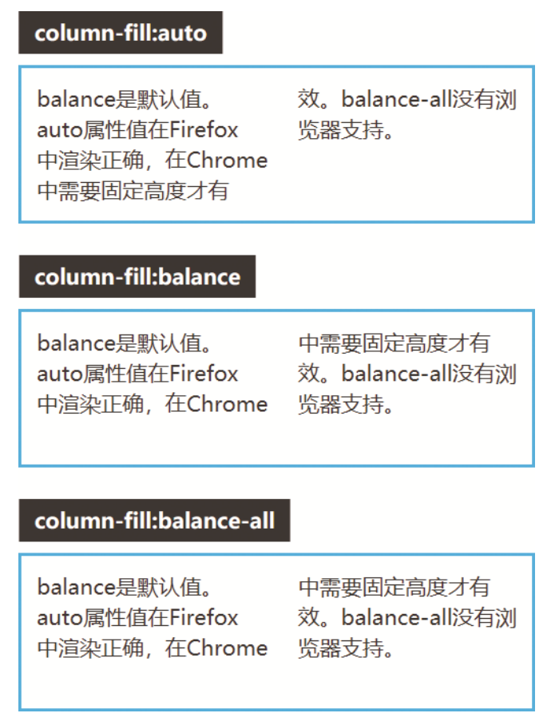](https://developer.mozilla.org/docs/Web/CSS/column-fill)

## Flex Pattern

### Flex Box Width

最终尺寸计算:

- 优先级: 最大最小尺寸 > 弹性增长或收缩 > 基础尺寸.
- When there is **free space left**:
  used size = $\text{flex-basis} + (\text{flex-grow}/\sum\text{flex-grow})$.
- When there is **not enough space**:
  used size = $\text{flex-basis} - (\text{flex-shrink}/\sum\text{flex-shrink})$.

| `flex-basis` | `width` | 基础尺寸     |
| ------------ | ------- | ------------ |
| set          | x       | `flex-basis` |
| auto         | set     | `width`      |
| auto         | auto    | 最大内容宽度 |

| `min-width` | `width` | 最小尺寸                   |
| ----------- | ------- | -------------------------- |
| set         | x       | `min-width`                |
| auto        | set     | min(`width`, 最小内容宽度) |
| auto        | auto    | 最小内容宽度               |

```css
.container {
  display: flex;
}

.initial {
  /* width: 100px~200px */
  flex: initial;
  width: 200px;
  min-width: 100px;
}

.none {
  /* width: 200px */
  flex: none;
  width: 200px;
}

.flex1 {
  /* width: left width * 1/3 */
  flex: 1;
}

.flex2 {
  /* width: left width * 2/3 */
  flex: 2;
}
```

### Flex Shorthand Property

[`flex`](https://developer.mozilla.org/docs/Web/CSS/flex)
= `none | [<'flex-grow'> <'flex-shrink'>? || <'flex-basis'>]`:

- `flex-grow`: `<number>`.
- `flex-shrink`: `<number>`.
- `flex-basis`: `content | <'width'>`.
- `flex: initial`:
  属性默认值, 元素会根据自身宽高设置尺寸.
  它会缩短自身以适应容器,
  但不会伸长并吸收 flex 容器中的额外自由空间来适应容器,
  equal to `flex: 0 1 auto`.
- `flex: none`:
  元素会根据自身宽高来设置尺寸.
  它是完全非弹性的: 既不会缩短, 也不会伸长来适应容器,
  equal to `flex: 0 0 auto`.
- `flex: auto | <'width'>`:
  元素会根据自身的宽度与高度来确定尺寸,
  但是会自行伸长以吸收 flex 容器中额外的自由空间,
  也会缩短至自身最小尺寸以适应容器,
  equal to `flex: 1 1 auto | 1 1 <'width'>`.
- `flex: <number>`:
  元素会被赋予一个容器中自由空间的指定占比,
  equal to `flex: <number> 1 0%`.

:::tip Flex Shorthand Property Usage

- `flex: none`: 适合设置在内容不能换行显示的小控件元素上, e.g `<button>`.
- `flex: auto`: 适合基于内容动态适配的布局.
- `flex: 0`: 适用场景较少, 适合设置在替换元素的父元素上.
- `flex: 1`: 适合等分布局.

:::

### Flex Children Display

Flexbox 会改变子元素 `display` 属性值:

| Initial Display                 | Flex Children Display |
| ------------------------------- | --------------------- |
| `inline`/`inline-block`/`block` | `block`               |
| `flow-root`                     | `flow-root`           |
| `list-item`                     | `list-item`           |
| `inline-table`/`table`          | `table`               |
| `table-*`                       | `block`               |
| `inline-flex`/`flex`            | `flex`                |
| `inline-grid`/`grid`            | `grid`                |

Flexbox 子元素:

- 均为块级元素:
  - `vertical-align` 无效化.
  - 裸文本子元素会变为匿名块级元素
    (Text nodes and pseudo elements can be flex children).
- `float` 无效化.
- `margin` 不合并.
- 支持 `z-index` (包括 `position: static` 子元素):
  `z-index` 不为 `auto` 时创建层叠上下文.
- `absolute` 定位子元素会脱离弹性布局.

### Flex Flow

`flex-flow`: `<'flex-direction'> || <'flex-wrap'>`.

#### Flex Direction

`flex-direction`:

- `row`.
- `row-reverse`.
- `column`.
- `column-reverse`.

#### Flex Wrap

`flex-wrap`:

- `nowrap`: 不换行.
- `wrap`: 换行.
- `wrap-reverse`.

### Flex Alignment

#### Flex Parent Alignment

- [`justify-content`](https://developer.mozilla.org/docs/Web/CSS/justify-content),
  defines alignment along main axis:
  - `normal`: items packed in default position.
  - `stretch`: behaves as `flex-start` (stretching in main axis controlled by `flex`).
  - `space-between`/`space-around`/`space-evenly`.
  - `center`/`start`/`end`/`flex-start`/`flex-end`.
  - `left`/`right`.
- [`align-items`](https://developer.mozilla.org/docs/Web/CSS/align-items),
  defines alignment (`align-self`) for cross axis:
  - `normal`: behaves as `stretch`/`start`.
  - `baseline`.
  - `stretch`.
  - `center`/`start`/`end`/`self-start`/`self-end`/`flex-start`/`flex-end`.
- [`align-content`](https://developer.mozilla.org/docs/Web/CSS/align-content),
  aligns flex container's lines within
  when there is extra space in the cross-axis:
  - `normal`: items packed in default position.
  - `baseline`.
  - `stretch`/`space-between`/`space-around`/`space-evenly`.
  - `center`/`start`/`end`/`flex-start`/`flex-end`.
- `*-content` adjust parent padding,
  `*-items` and `*-self` adjust children margin.

#### Flex Children Alignment

- [`align-self`](https://developer.mozilla.org/docs/Web/CSS/align-self):
  - `auto`: computes to parent `align-items` value.
  - `normal`: behaves as `stretch`/`start`.
  - `baseline`.
  - `stretch`.
  - `center`/`start`/`end`/`self-start`/`self-end`/`flex-start`/`flex-end`.
- `order`: `<number>`, 显示顺序.

#### Flex Margin Alignment

Alignment with `margin`:

```html
<div class="parent">
  <div class="child"></div>
</div>

<style>
  .parent {
    display: flex;
  }

  .child {
    /* This will push child to the right of parent border */
    margin-left: auto;
  }
</style>
```

最后一行左对齐:

```css
.container {
  display: flex;
  flex-wrap: wrap;
  justify-content: space-between;
}

.list {
  margin: 10px;
}

.list:last-child {
  margin-right: auto;
}
```

### Flex Centering

```css
/* 子元素全部居中对齐 */
.vertical-container {
  display: flex;
  align-items: center;
  justify-content: center;
  height: 300px;
}
```

```css
.layer {
  display: flex;
  flex-direction: row;
  flex-grow: 1;
  align-items: center;
  justify-content: flex-start;
  margin: 5px;
  background-color: #fff;
  border: 1px solid #000;
}
```

### Flexbox Pseudo Element

Set `flex` to pseudo elements of flex box
will change width of pseudo elements.

```css
.flex {
  display: flex;
}

.flex::before {
  position: relative; /* no need for absolute position */
  display: block;
}
```

### Fixed Sidebar Flexbox

```html
<body>
  <aside></aside>
  <main></main>
</body>
```

```css
body {
  display: flex;
  height: 100vh;
  margin: 0;
}

aside {
  flex: 0 0 auto; /* inflexible */
}

main {
  flex: 1 1 auto; /* auto flexible */
  overflow: auto;
}
```

### Flex Reference

- Flexbox complete [guide](https://css-tricks.com/snippets/css/a-guide-to-flexbox).

## Grid Pattern

### Grid Property

Parent property:

- [`grid`](https://developer.mozilla.org/docs/Web/CSS/grid):
  - [`grid-template`](https://developer.mozilla.org/docs/Web/CSS/grid-template):
    - `grid-template-rows`.
    - `grid-template-columns`.
    - `grid-template-areas`.
  - [`grid-auto-rows`](https://developer.mozilla.org/docs/Web/CSS/grid-auto-rows).
  - [`grid-auto-columns`](https://developer.mozilla.org/docs/Web/CSS/grid-auto-columns).
  - [`grid-auto-flow`](https://developer.mozilla.org/docs/Web/CSS/grid-auto-flow).
- [`gap`](https://developer.mozilla.org/docs/Web/CSS/gap):
  - `row-gap`.
  - `column-gap`.
- [`place-content`](https://developer.mozilla.org/docs/Web/CSS/place-content):
  - `align-content`.
  - `justify-content`.
- [`place-items`](https://developer.mozilla.org/docs/Web/CSS/place-items).
  - `align-items`.
  - `justify-items`.

Children property:

- [`grid-area`](https://developer.mozilla.org/docs/Web/CSS/grid-area):
  - `grid-row`:
    - `grid-row-start`.
    - `grid-row-end`.
  - `grid-column`:
    - `grid-column-start`.
    - `grid-column-end`.
- [`place-self`](https://developer.mozilla.org/docs/Web/CSS/place-self):
  - `align-self`.
  - `justify-self`.

```css
.container {
  grid-template-areas:
    'header header header'
    'advert content content'
    'footer footer footer';
  grid-template-rows: 1fr 1fr 1fr;
  grid-template-rows: minmax(90px, 1fr);
  grid-template-columns: 1fr 1fr 1fr;
  grid-template-columns: repeat(3, 1fr);
  gap: 10px;
  align-items: end;
  justify-items: center;
}

.item {
  grid-area: footer;
  grid-row: start / end; /* 2 / -1 */
  grid-column: start / end;
  align-self: end;
  justify-self: center;
}
```

### Grid Data Types

#### Grid Breadth Types

`<track-breadth>`:

- `<flex>`: `<number>fr`.
- `<length-percentage>`.
- `min-content`.
- `max-content`.
- `auto`.

`<inflexible-breadth>`:

- `<length-percentage>`.
- `min-content`.
- `max-content`.
- `auto`.

`<fixed-breadth>`:

- `<length-percentage>`.

#### Grid Size Types

`<track-size>`:

- `<track-breadth>` .
- `minmax(<inflexible-breadth>, <track-breadth>)`.
- `fit-content(<length-percentage>)`.

`<fixed-size>`:

- `<fixed-breadth>`.
- `minmax(<fixed-breadth>, <track-breadth>)`.
- `minmax(<inflexible-breadth>, <fixed-breadth>)`.

#### Grid Repeat Types

`<track-repeat>`:

- `repeat([<integer [1,∞]>], [<line-names>? <track-size>]+ <line-names>?)`.

`<fixed-repeat>`:

- `repeat([<integer [1,∞]>], [<line-names>? <fixed-size>]+ <line-names>?)`.

`<auto-repeat>`:

- `repeat([auto-fill | auto-fit], [<line-names>? <fixed-size>]+ <line-names>?)`.

`<name-repeat>`:

- `repeat([auto-fill | <integer [1,∞]>], <line-names>+)`.

#### Grid Line Types

`<grid-line>`:

- `auto`.
- `<custom-ident>`
- `[<integer> && <custom-ident>?]`.
- `[span && [<integer> || <custom-ident>]]`.

### Responsive Grid Layout

#### Explicit Responsive Grid Layout

- `fit-content(limit)`: `clamp([min-content | min-width], limit, max-content)`.
- `minmax([<fixed-breadth> | <inflexible-breadth>], [<track-breadth> | <fixed-breadth>])`.
- `repeat([<integer [1,∞]> | auto-fill | auto-fit], [<track-size> | <fixed-size>]+)`.

```css
.container {
  display: grid;
  grid-template-columns: repeat(auto-fit, minmax(400px, 1fr));
}
```

#### Implicit Responsive Grid Layout

`grid-auto-rows`/`grid-auto-columns`:

- `<track-size>+`.
- Control implicitly-created grid row/column track size.

```html
<div class="container">
  <item>1</item>
  <item>2</item>
  <item>3</item>
  <item>4</item>
  <item class="implicit">5</item>
</div>

<style>
  .container {
    display: grid;
    grid-template: 1fr 1fr / 1fr 1fr;

    /* 隐式网格高度为 60px */
    grid-auto-rows: 60px;
  }
</style>
```

```html
<div class="container">
  <item class="item-a">a</item>
  <item class="item-b">b</item>
</div>
<style>
  .container {
    display: grid;
    grid-template: 1fr 1fr / 1fr 1fr;

    /* 隐式网格宽度为 60px */
    grid-auto-columns: 60px;
  }

  .item-b {
    /* 超出网格列数, 隐式网格创建 */
    grid-column: 3 / 4;
    background-color: rgb(255 255 0 / 50%);
  }
</style>
```

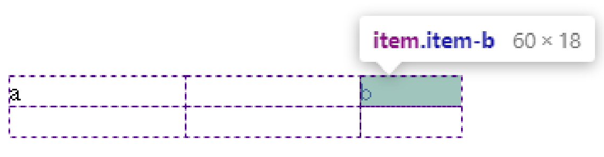

`grid-auto-flow`:

- `[row | column] || dense`.
- Change auto-placement algorithm:
  control exactly how auto-placed items get flowed into grid container,
  like `flex-direction` for flex container.

### Named Grid Layout

#### Grid Lines

`grid-row` and `grid-column`
change start and end of [`<grid-line>`](#grid-line-types)
will refactor grid item's size and location:

```css
.main {
  display: grid;
  grid-template-rows: [header] 100px [body] auto;
  grid-template-columns: [l-gutter] 1fr [sidebar] 4fr [content] 8fr [r-gutter] 1fr;
  gap: 1rem 2rem;
}

.header {
  grid-row: header;
  grid-column: sidebar / right-gutter;
}

.sidebar {
  grid-row: body;
  grid-column: sidebar;
}

.content {
  grid-row: body;
  grid-column: content;
}
```

隐式网格线:

- `<custom-ident>`:
  当 `<custom-ident>` 不存在时, 会尝试匹配 `<custom-ident-start>` 或者 `<custom-ident-end>`.
- `<integer> && <custom-ident>`:
  当第 `<integer>` 个 `<custom-ident>` 不存在时, 会在网格容器后方额外创建隐式网格.
- `span && <custom-ident>`:
  当 `<custom-ident>` 不存在时, 会在网格容器前方**或者**后方额外创建隐式网格.

```css
.container {
  display: grid;
  grid:
    '. . .' 1fr
    '. a .' 1fr
    '. . .' 1fr / 1fr 1fr 1fr;
}

.item {
  grid-area: a;
  grid-area: a / a / a / a;
  grid-area: a-start / a-start / a-end / a-end;
}
```

```css
.container {
  display: grid;
  grid-template-columns: [a] 80px [b] auto [c] 100px [d];
}

.item {
  /**
   * .container: [a] 80px [b] auto [c] 100px [d] auto [b] auto [b] auto [b]
   * .item: [c] 100px [d] auto [b] auto [b] auto [b]
   */
  grid-column: b 4 / c;
}
```

```css
.container {
  display: grid;
  grid-template-columns: [a] 80px [c] auto [c] 100px [d] auto auto;
}

.item {
  /**
   * .container: [b] auto [a] 80px [c] auto [c] 100px [d] auto auto
   * .item: [b] auto [a] 80px [c] auto [c] 100px [d]
   */
  grid-column: span b / 4;
}
```

#### Grid Areas

- 网格线自动命名: `areaName-start`/`areaName-end`.

```css
.container {
  grid-template: 1fr 1fr 1fr 1fr / 1fr 1fr 1fr;
  grid-template:
    'grape grape grape' 1fr
    'apple orange orange' 1fr
    'apple orange orange' 1fr
    'banana banana banana' 1fr
    / 1fr 1fr 1fr;
  grid-template:
    [row-name1-start] 'grape grape grape' 1fr [row-name1-end row-name2-start]
    'apple orange orange' 1fr [row-name2-end]
    'apple orange orange' 1fr [row-name3-end]
    [row-name4-start] 'banana banana banana' 1fr [row-name4-end]
    / [col-name-start] 1fr [col-name-end] 1fr 1fr;
  grid-template-areas:
    'grape grape grape'
    'apple orange orange'
    'apple orange orange'
    'banana banana banana';
}

.grape {
  grid-area: grape;
}

.apple {
  grid-area: apple;
}

.orange {
  grid-area: orange;
}

.banana {
  grid-area: banana;
}
```

### Grid Gap

[CSS Box Alignment Module Level 3](https://www.w3.org/TR/css-align-3)
统一了分栏布局, 弹性布局, 网格布局的 `gap` 属性:

- `gap`: `<'row-gap'> <'column-gap'>?`.
- `row-gap`: `normal | <length-percentage>`.
- `column-gap`: `normal | <length-percentage>`.

### Grid Alignment

- `justify-content`/`align-content` content within element,
  attach to **parent** css selector
  (effectively adjusts `padding` of parent)
- `justify-items`/`align-items` align items inside box,
  attach to **parent** css selector
  (effectively adjusts `margin` of children)
- `justify-self`/`align-self` align element within parent,
  attach to **children** css selector
  (effectively adjusts `margin` of children)
- `place-content`: `<'align-content'> <'justify-content'>?`.
- `place-items`: `<'align-items'> <'justify-items'>?`.
- `place-self`: `<'align-self'> <'justify-self'>?`.

:::tip Grid-Only Alignment Properties

- [`justify-items`](https://developer.mozilla.org/docs/Web/CSS/justify-items),
  defines the default `justify-self` for all items:
  - `normal`: behaves as `stretch`/`start`.
  - `baseline`.
  - `stretch`.
  - `center`/`start`/`end`/`self-start`/`self-end`/`flex-start`/`flex-end`.
  - `left`/`right`.
- [`justify-self`](https://developer.mozilla.org/docs/Web/CSS/justify-self):
  - `auto`: computes to parent `justify-items` value.
  - `normal`: behaves as `stretch`/`start`.
  - `baseline`.
  - `stretch`.
  - `center`/`start`/`end`/`self-start`/`self-end`/`flex-start`/`flex-end`.
  - `left`/`right`.

:::

### Grid Pseudo Element

```css
h1.lines {
  display: grid;
  grid-template-columns: 1fr auto 1fr;
  gap: 1em;
}

h1.lines::before,
h1.lines::after {
  align-self: center;
  content: '';
  border-top: 1px solid black;
}
```

### Grid Reference

- Grid complete [guide](https://css-tricks.com/snippets/css/complete-guide-grid).

## Alignment Pattern

### Height Alignment Pattern

- `border` simulation.
- Negative `margin`.
- `<table>` element:
  `display: table-cell` 默认等高.
- `absolute` element:
  `.absolute { top: 0; bottom: 0; }` 使所有子元素 (`absolute`) 与父元素 (`relative`) 等高.
- `flex` layout:
  `flex` 盒子中的子元素默认拉伸至盒子高度.
- `grid` layout:
  `grid` 布局元素默认等高.

#### Border Simulation Height Alignment

```css
/* 导航背景区 border 创建 */
.box {
  background-color: #f0f3f9;
  border-left: 150px solid #333;
}

/* 清除浮动影响 */
.box::after {
  display: block;
  clear: both;
  content: '';
}

/* 布局主结构 */
.box > nav {
  float: left;
  width: 150px;
  margin-left: -150px;
}

.box > section {
  overflow: hidden;
}
```

#### Negative Margin Height Alignment

```css
.column-box {
  overflow: hidden; /* hidden overflow background */
}

/* 视觉等高布局 */
.column-left,
.column-right {
  padding-bottom: 9999px;
  margin-bottom: -9999px;
}
```

## Centering Pattern

### Horizontal Centering Pattern

- inline: `text-align`, `flex`/`grid` box.

```css
.quote {
  text-align: center;
}
```

- block: auto `margin`, `flex`/`grid` box.

```css
.element {
  position: absolute;
  top: 0;
  right: 0;
  bottom: 0;
  left: 0;
  width: 300px;
  height: 200px;
  margin: auto;
}
```

- 父元素 float, 父子元素 relative.

```css
.container {
  position: relative;
  left: 50%;
  float: left;
}

.container ul {
  position: relative;
  left: -50%;
}
```

### Vertical Centering Pattern

#### Vertical Centering Inline element

- `line-height`.
- `vertical-align: middle`:
  - 作用机制: 对齐基线 (`baseline`) 往上 1/2 `x-height` 高度 (即小写字母 `x` 交叉点处).
  - 作用环境: parent element `line-height` === `height`.
  - 作用对象: children `inline`/`inline-block`/`table-cell` element.
- `flex`.
- `grid`.

Button label (`<a>`) vertical alignment:

```css
a.button::before {
  display: inline-block;
  height: 16px;
  vertical-align: middle;
  content: '';
}
```

#### Vertical Centering Block element

- `top` + `margin`.
- `top` + `translateY`.
- `vertical-align`.
- `flex`.
- `grid`.

```css
.form-item-label {
  display: flex;
  flex-direction: row;
  align-items: center;
}
```

### Mixing Centering Pattern

```css
.dialog {
  position: absolute;
  top: 0;
  right: 0;
  bottom: 0;
  left: 0;
  width: fit-content;
  height: fit-content;
  margin: auto;
}
```

### Centering Pattern Reference

- Centering CSS complete [guide](https://css-tricks.com/centering-css-complete-guide).

## Inline Pattern

### Inline Element Height

- 内联元素默认的高度完全受 `font-size` 大小控制.
- 内联元素没有可视宽度和可视高度 (`clientHeight`/`clientWidth` always `0`),
  垂直方向的行为表现完全受 `line-height` 和 `vertical-align` 的影响.

### Inline Element Baseline

#### Inline Block Element Baseline

`inline-block` element:

- 内部没有内联元素, 或者 `overflow` not visible:
  其基线为 `margin` 底边缘.
- 内部存在内联元素:
  其基线为最后一行内联元素的基线.

#### Vertical Align Baseline

Inline element 与父元素下边缘存在空隙,
原因在于文字排版的基线 (`baseline`) 对齐机制:

- 在标准模式中,
  `Inline Formatting Context` 总是会包含类似字母 'g'/'f' 尾巴伸出部分空间 (针对下行字母).
- ``/`<a>` inline element 与父元素底部若干像素间隙,
  实际上是此种情况下的**字母尾巴**预留机制:
  行框盒子存在幽灵空白节点, 默认基于 `baseline` 对齐 (小写字母 `x` 底部).

清除间隙的方法:

- 清除 `Strut` 高度:
  父元素 `font-size: 0` / `line-height: 0`,
  设置 `Inline Formatting Context` 高度为 `0`.
- 改变对齐方式:
  子元素 `vertical-align` 设置为 `top`/`middle`/`bottom`.
- 清除 `Strut` 节点:
  子元素 `display` 设置为 `inline-block`/`block`,
  创建 `Block Formatting Context`,
  直接清除幽灵空白节点.

可以用以上方法解决 `` image 5px problem 或相似问题.

### Inline Element Padding

可以在不影响当前布局的情况下,
通过增加垂直方向的 `padding`,
增加链接 (`inline`) 或按钮 (`inline-block`) 的点击区域大小:

```css
article a {
  padding: 0.25rem 0;
}
```

### Inline Element Margin

非主动触发位移的内联元素是不会位移至计算容器外面,
内联元素 `margin-top` 设置过大时 `margin-top` 会直接失效,
内联元素依然会处于基线对齐位置.

## CSS Text

### Text Alignment

[`text-align`](https://developer.mozilla.org/docs/Web/CSS/text-align):

- 对 block level element 无效.
- `start`/`end`/`left`/`right`/`center`/`match-parent`.
- `justify`: 自适应, 左右都无空格.

```css
.wrap {
  text-align: justify;
  text-align-last: justify; /* 一个块或行的最后一行对齐方式 */
  text-justify: distribute-all-lines; /* ie6-8 */
}
```

[`text-align-last`](https://developer.mozilla.org/docs/Web/CSS/text-align-last):

最后一行文字对齐方式.

[`text-justify`](https://developer.mozilla.org/docs/Web/CSS/text-justify):

- type of justification for `text-align: justify`.
- `none`: turn off `text-align: justify`.
- `auto`.
- `inter-word`.
- `inter-character`.

### Text Indent

[`text-indent`](https://developer.mozilla.org/docs/Web/CSS/text-indent):

- 作用于 block container, 但实际作用于第一行内联盒子内容.
- 对 `display: inline` 替换元素无效.
- 对 `display: inline-*` 替换元素有效.
- Percentage `text-indent` calculate by `containing block` width.

[`tab-size`](https://developer.mozilla.org/docs/Web/CSS/tab-size):

```css
pre {
  font-size: 100%;
  tab-size: 2;
  white-space: pre-wrap;
}
```

### Text Spacing

`letter-spacing`:

- 继承性.
- 默认值为 `normal`.
- 支持负值, 小数值.

`word-spacing`:

- 继承性.
- 默认值为 `normal`.
- 支持负值, 小数值, 百分比.
- 最终间隔距离会受 `text-align: justify` 影响.

```css
.paragraph {
  line-height: 1.5em; /* 行间距  */
  text-indent: 2em; /* 段落缩进 */
  letter-spacing: 50px; /* 字间距  */
  word-spacing: 50px; /* 词间距  */
}
```

### Text Transform

```css
p {
  font-variant: small-caps; /* 小型的大写字母 */
  text-transform: uppercase; /* 大写字母 */
  text-transform: lowercase; /* 小写字母 */
  text-transform: capitalize; /* 首字母大写 */
}
```

### Text Decoration

```css
.formal-syntax {
  text-decoration: < 'text-decoration-line' > || < 'text-decoration-style' > ||
    < 'text-decoration-color' > || < 'text-decoration-thickness' >;
}
```

```css
.line {
  text-decoration-line: overline; /* 上划线 */
  text-decoration-line: line-through; /* 中划线 */
  text-decoration-line: underline; /* 下划线 */
}

.text {
  text-decoration: underline;
  text-decoration: dotted underline;
  text-decoration: red underline dashed;
  text-decoration: wavy underline 3px red;
}

.wavy {
  display: block;
  height: 0.5rem;
  padding-top: 0.5rem;
  overflow: hidden;
  letter-spacing: 100vw;
  white-space: nowrap;
}

.wavy::before {
  text-decoration: overline; /* IE */
  text-decoration-style: wavy;
  content: '\2000\2000';
}
```

下划线样式:

- [`text-underline-position`](https://developer.mozilla.org/docs/Web/CSS/text-underline-position).
- [`text-underline-offset`](https://developer.mozilla.org/docs/Web/CSS/text-underline-offset).
- [`text-decoration-skip-ink`](https://developer.mozilla.org/docs/Web/CSS/text-decoration-skip-ink).

### Text Emphasis

[`text-emphasis`](https://developer.mozilla.org/docs/Web/CSS/text-emphasis):

- `<'text-emphasis-style'> || <'text-emphasis-color'>`.
- [`text-emphasis-style`](https://developer.mozilla.org/docs/Web/CSS/text-emphasis-style):
  - `none`.
  - `<character>`.
  - `[ filled | open ] || [ dot | circle | double-circle | triangle | sesame ]`.
- [`text-emphasis-color`](https://developer.mozilla.org/docs/Web/CSS/text-emphasis-color):
  `currentcolor | <color>`.
- 重点符号字号默认为文字字号的一半.

```css
/* Initial value */
text-emphasis: none;

/* <string> value */
text-emphasis: 'x';
text-emphasis: '点';
text-emphasis: '\25B2';
text-emphasis: '*' #555;

/* Keywords value */
text-emphasis: filled; /* filled dot */
text-emphasis: open; /* open dot */
text-emphasis: sesame; /* filled sesame */
text-emphasis: open sesame;

/* Keywords value combined with a color */
text-emphasis: filled sesame #555;
```

[`text-emphasis-position`](https://developer.mozilla.org/docs/Web/CSS/text-emphasis-position):

- `[ over | under ] && [ right | left ]`.
- `over`: draws marks over text in horizontal writing mode.
- `under`: draws marks under text in horizontal writing mode.
- `right`: draws marks to right of text in vertical writing mode.
- `left`: draws marks to left of text in vertical writing mode.
- 默认在顶部或右侧画重点符号.

```css
/* Initial value */
text-emphasis-position: over right;

/* Keywords value */
text-emphasis-position: over left;
text-emphasis-position: under right;
text-emphasis-position: left under;
text-emphasis-position: right over;
```

### Text Size Adjust

禁止 iOS 横屏字号自动调整:

```css
body {
  /* stylelint-disable-next-line property-no-vendor-prefix */
  -webkit-text-size-adjust: none;
}
```

### Text Overflow

- `clip`: 切除溢出部分.
- `ellipsis`: 省略号标志 (要设置 `width`).

```css
.truncation-article-container {
  width: 500px;
  overflow: hidden;
  text-overflow: ellipsis;
  white-space: nowrap;
}
```

```css
.article-container {
  display: box;
  overflow: hidden;
  text-overflow: ellipsis;
  word-break: break-all;
  -webkit-box-orient: vertical;
  -webkit-line-clamp: 4; /* 需要显示的行数 */
}
```

### White Space

Web default:

- 空格被解析为换行.
- 换行被解析为空格.
- 自动合并空格.

普通标签内自动忽略空格符,
并将其与空白符转换成一个空格进行输出,
可用 `white-space` 改变这一行为:

| White Space  | 换行符 | 空格和制表符 | 文字换行 | 行尾空格 |
| ------------ | ------ | ------------ | -------- | -------- |
| normal       | 合并   | 合并         | 换行     | 删除     |
| nowrap       | 合并   | 合并         | 不换行   | 删除     |
| pre          | 保留   | 保留         | 不换行   | 保留     |
| pre-wrap     | 保留   | 保留         | 换行     | 挂起     |
| pre-line     | 保留   | 合并         | 换行     | 删除     |
| break-spaces | 保留   | 保留         | 换行     | 换行     |

### Text Wrap

[Text wrapping and word breaking](https://codersblock.com/blog/deep-dive-into-text-wrapping-and-word-breaking):

- `word-break`:
  - `normal`:
    default line break rule.
  - `keep-all`:
    Word breaks should not be used for CJK text.
    Non-CJK text behavior is same as for `normal`.
  - `break-all`:
    word breaks should be inserted between any two characters (excluding CJK text).
  - `break-word` (**Deprecated**).
- `overflow-wrap` (`word-wrap`):
  - `normal`.
  - `anywhere`.
  - `break-word`.
- `line-break`: break lines of CJK text when working with punctuation and symbols.
  - `auto`.
  - `loose`.
  - `normal`.
  - `strict`.
  - `anywhere`.
- `hyphens`: how words should be hyphenated when text wraps across multiple lines.
  - `auto`: automatically break words at appropriate hyphenation points.
  - `manual`: words are broken for line-wrapping only where `-` or `&shy;`.
  - `none`: words are not broken at line breaks.
- `<wbr>`: word break opportunity.

```css
/* 不换行 */
.nowrap {
  white-space: nowrap;
}

/* 自动换行 */
.auto-wrap {
  word-break: normal;
  word-wrap: break-word;
  line-break: anywhere;
}

/* 自动换行 */
pre {
  word-wrap: break-word; /* IE 5.5-7 */
  white-space: pre-wrap; /* Modern Browsers */
  line-break: anywhere;
}

/* 强制换行 */
.force-wrap {
  word-break: break-all;
  line-break: anywhere;
}

/* IE not support <wbr> */
wbr::after {
  content: '\00200B';
}
```

:::tip Punctuation Types

- 避头标点: 不在行首显示的标点, e.g 逗号, 顿号, 句号, 问号, 叹号.
- 避尾标点: 不在行尾显示的标点, e.g 前引号, 前括号.

:::

### Text Horizontal Direction

#### Direction

Set direction of text, table columns, and horizontal overflow:

```css
.ltr {
  direction: ltr;
}

.rtl {
  direction: rtl;
}
```

#### Unicode Bidi

[`unicode-bidi`](https://developer.mozilla.org/docs/Web/CSS/unicode-bidi):

- `normal`.
- `plaintext`: 元素内文字 LTR.
- `embed`: 中英文字符 LTR, 标点符号 RLT.
- `isolate`: 中英文字符 LTR, 标点符号 RLT.
- `bidi-override`: 所有字符 RTL.
- `isolate-override`: 所有字符 RTL.

```html
<p><button>button按钮?</button><span>span标签?</span>匿名内联元素?</p>

<style>
  p {
    direction: rtl;
  }

  span {
    background-color: skyblue;
  }
</style>
```

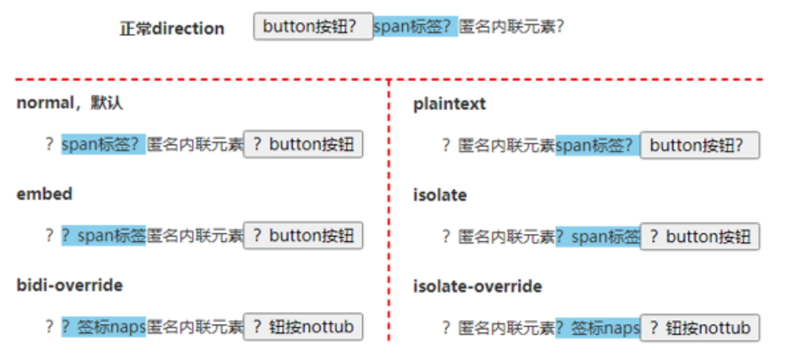

### Text Vertical Direction

#### Writing Mode

Set whether lines of text are laid out horizontally or **vertically**:

```css
/* 单列展示 */
.wrap-single {
  width: 25px;
  height: auto;
  padding: 8px 5px;
  font-size: 12px;
  line-height: 18px;
  word-wrap: break-word; /* 英文自动换行 */
}

/* 多列展示 */
.wrap-multiple {
  height: 200px;
  line-height: 30px;
  text-align: justify;
  writing-mode: horizontal-tb; /* 水平排列 */
  writing-mode: vertical-lr; /* 竖直从左向右 */
  writing-mode: vertical-rl; /* 竖直从右向左 */
  writing-mode: lr-tb; /* IE: 水平排列 */
  writing-mode: tb-lr; /* IE: 竖直从左向右 */
  writing-mode: tb-rl; /* IE: 竖直从右向左 */
}
```

#### Text Orientation

[`text-orientation`](https://developer.mozilla.org/docs/Web/CSS/text-orientation):

- `mixed`:
  中文字符正立, 英文字符旋转 90 度.
- `upright`:
  中文字符正立, 英文字符正立.
- `sideways`/`sideways-right`:
  中文字符旋转 90 度, 英文字符旋转 90 度.

#### Text Combine Upright

[`text-combine-upright`](https://developer.mozilla.org/docs/Web/CSS/text-combine-upright):

- `none`.
- `all`:
  横向合并所有类型字符.
- `digits <integer>?`:
  横向合并数字字符.

## CSS Font

### Font Family

#### Generic Font Family

- `serif`: 衬线字体族.
- `sans-serif`: 无衬线字体族.
- `monospace`: 等宽字体族.
- `cursive`: 手写字体族.
- `fantasy`: 奇幻字体族.
- `emoji`: 表情字体族.
- `math`: 数学表达式字体族.
- `fangsong`: 仿宋字体族.
- `system-ui`: 系统 UI 字体族.
- `ui-serif`: 系统衬线字体.
- `ui-sans-serif`: 系统无衬线字体.
- `ui-monospace`: 系统等宽字体.
- `ui-rounded`: 系统圆形字体.

#### English Font Family

- `Segoe UI`: Windows 从 Vista 版本开始默认的西文字体族.
- `Roboto`: Android 中的一款无衬线字体.
- `Helvetica`: macOS 和 iOS 中很常用的一款无衬线字体.
- `Arial`: 全平台都支持的一款无衬线字体.

```css
body {
  font-family: system-ui, -apple-system, 'Segoe UI', Roboto, Helvetica, Arial, sans-serif;
}
```

#### Emoji Font Family

- `Apple Color Emoji`:
  macOS and iOS.
- `Segoe UI Emoji`:
  Windows.
- `Segoe UI Symbol`:
  Windows 7 新增字体, 是一种 Unicode 编码字体,
  显示的是单色图案, 非彩色图形.
- `Noto Color Emoji`:
  谷歌出品的 emoji 字体,
  用于 Android 和 Linux.

```css
@font-face {
  font-family: Emoji;
  src: local('Apple Color Emoji'), local('Segoe UI Emoji'), local(
      'Segoe UI Symbol'
    ), local('Noto Color Emoji');
  font-display: swap;
  unicode-range: U+1F000-1F644, U+203C-3299;
}

body {
  font-family: system-ui, -apple-system, 'Segoe UI', Roboto, Emoji, Helvetica, Arial,
    sans-serif;
}
```

#### Math Font Family

- `Cambria Math`: Windows 中的数学字体.
- `Latin Modern Math`: macOS 中的数学字体.

```css
math {
  font-family: 'Cambria Math', 'Latin Modern Math', serif;
}
```

#### Chinese Font Family

```bash
宋体 SimSun
黑体 SimHei
微软雅黑 Microsoft YaHei
微软正黑体 Microsoft JhengHei
新宋体 NSimSun
新细明体 PMingLiU
细明体 MingLiU
标楷体 DFKai-SB
仿宋 FangSong
楷体 KaiTi
仿宋_GB2312 FangSong_GB2312
楷体_GB2312 KaiTi_GB2312

宋体: SimSun
华文细黑: STHeiti Light [STXihei]
华文黑体: STHeiti
华文楷体: STKaiti
华文宋体: STSong
华文仿宋: STFangsong
儷黑 Pro: LiHei Pro Medium
儷宋 Pro: LiSong Pro Light
標楷體: BiauKai
蘋果儷中黑: Apple LiGothic Medium
蘋果儷細宋: Apple LiSung Light

新細明體: PMingLiU
細明體: MingLiU
標楷體: DFKai-SB
黑体: SimHei
新宋体: NSimSun
仿宋: FangSong
楷体: KaiTi
仿宋_GB2312: FangSong_GB2312
楷体_GB2312: KaiTi_GB2312
微軟正黑體: Microsoft JhengHei
微软雅黑体: Microsoft YaHei

隶书: LiSu
幼圆: YouYuan
华文细黑: STXihei
华文楷体: STKaiti
华文宋体: STSong
华文中宋: STZhongsong
华文仿宋: STFangsong
方正舒体: FZShuTi
方正姚体: FZYaoti
华文彩云: STCaiyun
华文琥珀: STHupo
华文隶书: STLiti
华文行楷: STXingkai
华文新魏: STXinwei
```

#### Font Family Preset

[Font stack](https://github.com/tmcw/systemfontstack):

```css
.mi {
  font-family: Arial, 'Microsoft YaHei', '黑体', '宋体', sans-serif;
}

.tao-ux {
  font-family: Helvetica, 'Hiragino Sans GB', 'Microsoft Yahei', '微软雅黑',
    Arial, sans-serif;
}

.tao {
  font: 12px/1.5 Tahoma, Helvetica, Arial, '宋体', sans-serif;
}

.tao-ued {
  font: 12px/1 Tahoma, Helvetica, Arial, '\5b8b\4f53', sans-serif;
}

.one-plus {
  font: 14px/1.5 'Microsoft YaHei', Arial, Tahoma, '\5b8b\4f53', sans-serif;
}

.github {
  font-family: -apple-system, BlinkMacSystemFont, 'Segoe UI', Helvetica, Arial,
    sans-serif, 'Apple Color Emoji', 'Segoe UI Emoji';
}

.font-sans-serif {
  font-family: -apple-system, BlinkMacSystemFont, 'Avenir Next,' Avenir, 'Segoe UI',
    'Helvetica Neue', Helvetica, Cantarell, Ubuntu, Roboto, Noto, Arial, sans-serif;
}

.font-serif {
  font-family: Georgia, Cambria, 'Iowan Old Style', 'Apple Garamond',
    Baskerville, 'Times New Roman', 'Droid Serif', Times, 'Source Serif Pro',
    serif, 'Apple Color Emoji', 'Segoe UI Emoji', 'Segoe UI Symbol';
}

.font-mono {
  font-family: Menlo, Consolas, Monaco, 'Liberation Mono', 'Lucida Console',
    'Courier New', monospace;
}
```

### Font Size

- `ch`: calculate by `0` width.
- `ex`: calculate by `x` width.
- `em`: calculate by original `font-size`.
- `rem`: calculate by root `font-size`.

```css
html {
  /* 浏览器默认size为16px, 此时将html-size自动计算为10px */
  font-size: 62.5%;
}

small {
  /* 11px */
  font-size: 1.1rem;
}

strong {
  /* 18px */
  font-size: 1.8rem;
}
```

### Font Size Adjust

[`font-size-adjust`](https://developer.mozilla.org/docs/Web/CSS/font-size-adjust):

- 使字体保持大小, 不随字体类型改变而改变.
- 不同字体有不同的值 (`x-height`/字体尺寸).

### Font Stretch

[`font-stretch`](https://developer.mozilla.org/docs/Web/CSS/font-stretch#examples),
selects a normal, condensed, or expanded face from a font:

- `normal`.
- `ultra-condensed | extra-condensed | condensed | semi-condensed`.
- `semi-expanded | expanded | extra-expanded | ultra-expanded`.
- `<percentage>`.

| Keyword         | Percentage |
| --------------- | ---------- |
| ultra-condensed | 50%        |
| extra-condensed | 62.5%      |
| condensed       | 75%        |
| semi-condensed  | 87.5%      |
| normal          | 100%       |
| semi-expanded   | 112.5%     |
| expanded        | 125%       |
| extra-expanded  | 150%       |
| ultra-expanded  | 200%       |

### Font Kerning

[`font-kerning`](https://developer.mozilla.org/docs/Web/CSS/font-kerning),
字距调整:

- `auto`.
- `normal`: enable kerning.
- `none`: disable kerning.

### Font Style

[`font-style`](https://developer.mozilla.org/docs/Web/CSS/font-style):

- `normal`.
- `italic`.
- `oblique`.
- `oblique <angle>`.

### Font Synthesis

[`font-synthesis`](https://developer.mozilla.org/docs/Web/CSS/font-synthesis):

- Controls which **missing** typefaces, bold, italic, or small-caps
  may be synthesized by the browser.
- Initial value: `weight style`.
- Formal syntax: `none | [ weight || style || small-caps ]`.

```html
<em class="syn">Synthesize me! 站直。</em>
<br />
<em class="no-syn">Don't synthesize me! 站直。</em>

<style>
  em {
    font-weight: bold;
  }

  .syn {
    font-synthesis: style weight small-caps;
  }

  .no-syn {
    font-synthesis: none;
  }
</style>
```

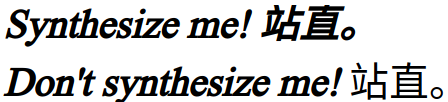

### Font Variant

[`font-variant`](https://developer.mozilla.org/docs/Web/CSS/font-variant):

- `normal`.
- `none`.
- [`font-variant-caps`](https://developer.mozilla.org/docs/Web/CSS/font-variant-caps):
  - `small-caps`: 小体型大写字母.
  - `all-small-caps`.
  - `petite-caps`: 特小型大写字母.
  - `all-petite-caps`.
  - `unicase`: 混合模式, 可以有小体型大写字母, 大写字母, 大体型小写字母.
  - `titling-caps`: 标题大写字母.
- [`font-variant-east-asian`](https://developer.mozilla.org/docs/Web/CSS/font-variant-east-asian):
  - `ruby`: 日文上标假名.
  - `jis78`/`jis83`/`jis90`/`jis04`: 使用对应年份的日语字符集.
  - `simplified`: 简体字形.
  - `traditional`: 繁体字形.
  - `proportional-width`: 不等宽字形.
  - `full-width`: 等宽字形.
- [`font-variant-ligatures`](https://developer.mozilla.org/docs/Web/CSS/font-variant-ligatures):
  - `common-ligatures`: 使用连字效果.
  - `discretionary-ligatures`: 使用特殊连字效果, 设计师设计具体效果表现.
  - `historical-ligatures`: 使用古代连字效果.
  - `contextual-ligatures`: 使用上下文连字效果, 前后字母影响具体效果表现.
- [`font-variant-numeric`](https://developer.mozilla.org/docs/Web/CSS/font-variant-numeric):
  - `ordinal`: 强制使用序数标记特殊的标志符号, e.g `1st`, `2nd`, `3rd`, `4th`.
  - `slashed-zero`: 强制使用带斜线的 `0`.
  - `lining-nums`: 沿基线对齐.
  - `oldstyle-nums`: 传统对齐方式.
  - `proportional-nums`: 不等宽数字.
  - `tabular-nums`: 等宽数字.
  - `diagonal-fractions`: 斜线分隔分子母
  - `stacked-fractions`: 水平线分隔分子母.

### Font Display

The font display timeline:

- block period: font face is not loaded,
  render an **invisible** fallback font face
  (use normally when loaded in this period)
- swap period: font face is not loaded,
  render a fallback font face
  (use normally when loaded in this period)
- failure period: the user agent treats it as a failed load
  causing normal font fallback

`font-display` - how a font face is displayed based on
whether and when it is downloaded and ready to use:

- auto: font display strategy defined by the user agent
- block: a short block period and an infinite swap period
- swap: an extremely small block period and an infinite swap period
- fallback: an extremely small block period and a short swap period
- optional: an extremely small block period and no swap period

```css
@font-face {
  font-family: ExampleFont;
  font-style: normal;
  font-weight: 400;
  src: url('/path/to/fonts/exampleFont.woff') format('woff'), url('/path/to/fonts/exampleFont.eot')
      format('eot');
  font-display: fallback;
}
```

### Custom Font Face

`@font-face` 使用户使用自定义字体:

```css
@font-face {
  font-family: mySpecialFont;
  font-style: inherit;
  font-weight: inherit;
  font-variant: inherit;
  src: url('./Colleen.ttf');
  font-display: swap;
}

.selector {
  font-family: mySpecialFont, sans-serif;
}
```

#### Custom Font Format

```css
@font-face {
  font-family: 'Open Sans Regular';
  font-style: normal;
  font-weight: 400;
  src: local('Open Sans Regular'), local('OpenSans-Regular'),
    url('open-sans/OpenSans-Regular-Cyrillic.woff2') format('woff2'), url('open-sans/OpenSans-Regular-Cyrillic.woff')
      format('woff'),
    url('open-sans/OpenSans-Regular-Cyrillic.eot') format('embedded-opentype'), url('open-sans/OpenSans-Regular-Cyrillic.ttf')
      format('truetype');
  font-display: swap;
  unicode-range: U+0400-045F, U+0490-0491, U+04B0-04B1;
}
```

#### Custom Font Style and Weight

```css
@font-face {
  font-family: myFont;
  font-weight: 400;
  src: local('Font 40S');
}

@font-face {
  font-family: myFont;
  font-weight: 500;
  src: local('Font 50S');
}

@font-face {
  font-family: myFont;
  font-weight: 600;
  src: local('Font 60S');
}

@font-face {
  font-family: myFont;
  font-style: italic;
  src: local('Font Italic');
}

.text-normal,
.text-medium,
.text-semibold,
.text-italic {
  font-family: myFont, sans-serif;
}

.text-normal {
  font-weight: 400;
}

.text-medium {
  font-weight: 500;
}

.text-semibold {
  font-weight: 600;
}

.text-italic {
  font-style: italic;
}
```

### Font Performance

- Compress fonts: better formats (e.g `woff2`/`woff`).
- Subset fonts: `unicode-range`.
- Local fonts: `local()`.

```css
@font-face {
  /* Single value */
  unicode-range: U+0026;
}

@font-face {
  /* Range */
  unicode-range: U+0000-007F;
}

@font-face {
  /* Wildcard Range */
  unicode-range: U+002?;
}

@font-face {
  /* Multiple Values */
  unicode-range: U+0000-007F, U+0100, U+02??;
}
```

## CSS Content

`content` replaces an element with a generated value:

- Objects inserted are `Anonymous Replaced Elements`.
- CSS-generated content is not included in the DOM,
  will not be represented in `accessibility tree`.

## CSS Counter

Adjust the appearance of content based on its location in a document.

```css
/* Set a counter named 'section', and its initial value is 0. */
body {
  counter-reset: section;
}

/* Increment the value of section counter by 1 */

/* Display the value of section counter */
h3::before {
  content: counter(section);
  counter-increment: section;
}
```

Nested counters `counters(counterName, hyphenString)`:

```css
ol {
  list-style-type: none;
  counter-reset: section; /* 为每个ol元素创建新的计数器实例 */
}

li::before {
  content: counters(section, '.') ' '; /* 为所有计数器实例增加以`.`分隔的值 */
  counter-increment: section; /* 只增加计数器的当前实例 */
}
```

```html
<ol>
  <li>item</li>
  <!-- 1     -->
  <li>
    item
    <!-- 2     -->
    <ol>
      <li>item</li>
      <!-- 2.1   -->
      <li>item</li>
      <!-- 2.2   -->
      <li>
        item
        <!-- 2.3   -->
        <ol>
          <li>item</li>
          <!-- 2.3.1 -->
          <li>item</li>
          <!-- 2.3.2 -->
        </ol>
        <ol>
          <li>item</li>
          <!-- 2.3.1 -->
          <li>item</li>
          <!-- 2.3.2 -->
          <li>item</li>
          <!-- 2.3.3 -->
        </ol>
      </li>
      <li>item</li>
      <!-- 2.4   -->
    </ol>
  </li>
  <li>item</li>
  <!-- 3     -->
  <li>item</li>
  <!-- 4     -->
</ol>
<ol>
  <li>item</li>
  <!-- 1     -->
  <li>item</li>
  <!-- 2     -->
</ol>
```

## CSS Border

### Border Radius

`border-radius`:

- 不支持负值.
- 圆角以外的区域不可点击, 无法响应 `click` 事件.
- 没有继承性:
  因此父元素设置 `border-radius`, 子元素依然是直角效果.
  可以给父元素设置 `overflow:hidden` 让子元素视觉上表现为圆角.
- 支持 `border-collapse` 设置为 `separate` 的
  `table`/`inline-table`/`table-cell` 元素.
- 每角都支持单独设置 `水平半径` `/` `垂直半径`:
  `<length-percentage>{1, 4} [/ <length-percentage>{1,4}]?`.

```css
.box {
  /* 左上 右上+左下 右下 / 左上 右上+左下 右下 */
  border-radius: 10px 5px 2em / 20px 25px 30%;

  /* 左上+右下 右上+左下 / 左上 右上 右下 左下 */
  border-radius: 10px 5% / 20px 25em 30px 35em;

  /* 水平半径 垂直半径 */
  border-top-left-radius: 30px 50%;

  /* 水平半径 垂直半径 */
  border-bottom-left-radius: 20% 15px;
}
```

圆角曲线重叠时, 所有圆角半径都缩小至 $f$ 倍:

$$
f =
\min\left(
  \frac{\text{Length}_{\text{horizontal}}}{\sum^{\text{horizontal}}_{\text{radius}}},
  \frac{\text{Length}_{\text{vertical}}}{\sum^{\text{vertical}}_{\text{radius}}}
\right)
$$

```css
.w-150px-h-100px {
  /* f = min(0.50, 0.50) = 0.50 */
  border-radius: 100%;
  border-radius: 75px / 50px;

  /* f = min(0.50, 0.33) = 0.33 */
  border-radius: 150px;
  border-radius: 50px;
}
```

### Border Color

利用 transparent border 扩大元素点击区域,
再结合 `background-clip: padding-box` 隐藏边框:

```css
.icon-clear {
  width: 16px;
  height: 16px;
  background-clip: padding-box;
  border: 11px solid transparent;
}
```

### Border Style

利用 `solid` border 模拟链接下划线:

```css
.link {
  padding-bottom: 5px;
  text-decoration: none;
  border-bottom: 1px solid;
}
```

### Border Image

[`border-image`](https://developer.mozilla.org/docs/Web/CSS/border-image):

- 以九宫格为基本模式, `content-box` 为九宫格中间格子.
- 可以结合 `clip-path` 裁剪边框.
- 可用于实现自定义边框: 渐变边框, 条纹边框, 虚线边框.
- `<'border-image-source'>`
  || `<'border-image-slice'> / <'border-image- width'> / <'border-image-outset'>`
  || `<'border-image-repeat'>`.

```css
.box {
  border-image: url('./grid-nine.svg') 54 33.33% 33.33% 54 / 10px 20px 30px 1 /
    1 30px 20px 10px round space;
}
```

```css
.border-linear-gradient {
  clip-path: inset(0 round 10px);
  border-style: solid;
  border-image: linear-gradient(deepskyblue, deeppink) 20 / 10px;
}

.border-radial-gradient {
  clip-path: inset(0 round 10px);
  border-style: solid;
  border-image: radial-gradient(deepskyblue, deeppink) 20 / 10px;
}

.border-stripe {
  border: 12px solid;
  border-image: repeating-linear-gradient(
      -45deg,
      red,
      red 5px,
      transparent 5px,
      transparent 10px
    ) 12;
}

.border-dashed {
  border: 1px dashed deepskyblue;
  border-image: repeating-linear-gradient(
      135deg,
      deepskyblue,
      deepskyblue 5px,
      transparent 5px,
      transparent 10px
    ) 1;
}
```

### Border Collapse

```css
table,
tr,
td {
  border: 1px solid #666;
}

table {
  border-collapse: collapse;
}
```

### Box Decoration Break

[`box-decoration-break`](https://developer.mozilla.org/docs/Web/CSS/box-decoration-break):

- Control `background`/`border`/`border-image`/`box-shadow`/`clip-path`/`margin`/`padding`
  styles when lines break.
- `slice`: initial value, 断开部分样式直接切割.
- `clone`: 断开部分样式独立渲染.

## CSS Outline

```css
.input {
  outline: none;
}

.input:focus {
  border-color: var(--highlight);
}

.button:focus-visible {
  outline: 1px solid #000;
  outline-offset: 3px;
}

.button:focus:not(:focus-visible) {
  outline: none;
}

.image:active {
  outline: 50px solid rgb(0 0 0 / 10%);
  outline-offset: -50px;
}
```

## CSS Shadow

### Text Shadow

[`text-shadow](https://developer.mozilla.org/docs/Web/CSS/text-shadow):

- `none`.
- `<shadow-text>#`: `<length>{2,3} && <color>?`.
  - 不支持内阴影.
  - `<length>{2,3}`: 不支持阴影扩展 `offset-x offset-y blur-radius`.
  - `<color>?`: default `revert` (user agent color).

```css
:root {
  --colo: #c0c0c0;
  --br-shadow: -6px 6px 15px rgb(0 0 0 / 50%);
  --tl-shadow: 6px -6px 15px rgb(255 255 255/ 80%);
}

body {
  background: var(--color);
}

.neumorphic-text {
  color: var(--color);
  text-shadow: var(--br-shadow), var(--tl-shadow);
}
```

### Box Shadow

[`box-shadow`](https://developer.mozilla.org/docs/Web/CSS/box-shadow):

- `none`.
- `<shadow>#`: `inset? && <length>{2,4} && <color>?`.
  - `inset?`: 支持内阴影.
  - `<length>{2,4}`: 支持阴影扩展 `offset-x offset-y blur-radius spread-radius`.
  - `<color>?`: default `currentcolor` (text computed color).

#### Basic Box Shadow

```css
.box {
  /* offset-x | offset-y | blur-radius | color */
  box-shadow: 10px 5px 5px black;

  /* offset-x | offset-y | blur-radius | spread-radius | color */
  box-shadow: 2px 2px 2px 1px rgb(0 0 0 / 20%);
}
```

#### Inset Box Shadow

模拟边框:

```css
.button-ghost {
  background-color: #fff;

  /* 模拟边框: 左 右 上 下 */
  box-shadow: inset 1px 0 #a2a9b6, inset -1px 0 #a2a9b6, inset 0 1px #a2a9b6, inset
      0 -1px #a2a9b6;
}
```

模拟背景:

```css
.button:active {
  box-shadow: inset 0 0 0 999px rgb(0 0 0 / 10%);
}
```

#### Neumorphic Box Shadow

[Neumorphic box shadow](https://codepen.io/myacode/pen/PoqQQNM):

```css
.neumorphic {
  box-shadow: -10px -10px 15px rgb(255 255 255 / 50%), 10px 10px 15px rgb(70 70
          70 / 12%);
}

.neumorphic:active {
  box-shadow: inset -10px -10px 15px rgb(255 255 255 / 50%), inset 10px 10px
      15px rgb(70 70 70 / 12%);
}
```

## CSS Background

### Background Image

- `url()`.
- `image-set([<image> <resolution>]#)`.
- `linear-gradient()`.
- `radial-gradient()`.
- `conic-gradient()`.

Image set background:

```css
.image-set {
  width: 128px;
  height: 96px;
  background: url('fallback.jpg');
  background: image-set(
    url('w128px.jpg') 1x,
    url('w256px.jpg') 2x,
    url('w512px.jpg') 3x
  );
  background-size: cover;
}
```

Gradient buttons:

```css
.btn:hover,
.btn:focus {
  background-position: right center; /* change the direction of the change here */
}

.btn-1 {
  background-image: linear-gradient(
    to right,
    #f6d365 0%,
    #fda085 51%,
    #f6d365 100%
  );
}

.btn-2 {
  background-image: linear-gradient(
    to right,
    #fbc2eb 0%,
    #a6c1ee 51%,
    #fbc2eb 100%
  );
}

.btn-3 {
  background-image: linear-gradient(
    to right,
    #84fab0 0%,
    #8fd3f4 51%,
    #84fab0 100%
  );
}

.btn-4 {
  background-image: linear-gradient(
    to right,
    #a1c4fd 0%,
    #c2e9fb 51%,
    #a1c4fd 100%
  );
}

.btn-5 {
  background-image: linear-gradient(
    to right,
    #ffecd2 0%,
    #fcb69f 51%,
    #ffecd2 100%
  );
}
```

### Background Repeat

```css
.background-repeat {
  /* Keyword values */
  background-repeat: repeat-x;
  background-repeat: repeat-y;
  background-repeat: repeat;
  background-repeat: space;
  background-repeat: round;
  background-repeat: no-repeat;

  /* Two-value syntax: horizontal | vertical */
  background-repeat: repeat space;
  background-repeat: repeat repeat;
  background-repeat: round space;
  background-repeat: no-repeat round;
}
```

### Background Position

Percentage background position (`<position> type`):

- X offset value = `(container width - image width) * (position x%)`.
- Y offset value = `(container height - image height) * (position y%)`.

```css
/* Keyword values */
background-position: top;
background-position: bottom;
background-position: left;
background-position: right;
background-position: center;

/* <percentage> values */
background-position: 25% 75%;

/* <length> values */
background-position: 0 0;
background-position: 1cm 2cm;
background-position: 10ch 8em;

/* Multiple images */
background-position: 0 0, center;

/* Edge offsets values */
background-position: bottom 10px right 20px;
background-position: right 3em bottom 10px;
background-position: bottom 10px right;
background-position: top right 10px;
```

[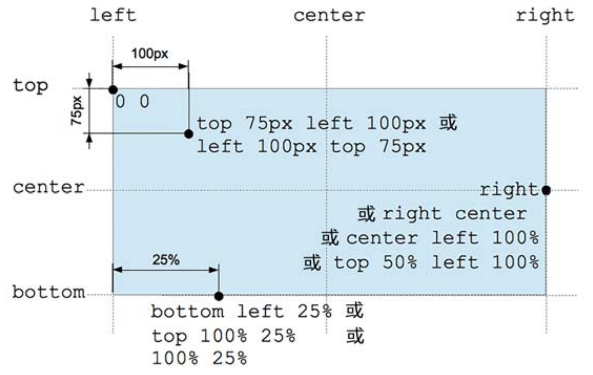](https://developer.mozilla.org/docs/Web/CSS/background-position)

### Background Clip

指定背景显示范围:

- `border-box`.
- `padding-box`.
- `content-box`.
- `text`: 可用于实现`渐变文字`/`镂空文字`/`背景蒙版文字`.

```css
@property --offset {
  syntax: '<length>';
  inherits: false;
  initial-value: 5px;
}

@keyframes move {
  to {
    --offset: 15px;
  }
}

p {
  color: #000;
}

/* 同心圆外扩动画 */
p:hover {
  color: transparent;
  background: repeating-radial-gradient(
    circle at 0 0,
    #000 calc(var(--offset) - 5px),
    #000 var(--offset),
    #fff var(--offset),
    #fff calc(var(--offset) + 5px)
  );
  background-clip: text; /* -webkit-background-clip: text; */
  animation: move 0.5s infinite linear;
}
```

### Background Origin

指定背景绘制起点:

- `padding-box`.
- `border-box`.
- `content-box`.
- 影响 `background-size: <percentage>` 计算.
- 影响**起点两侧**背景样式细节.

### Background Size

[`background-size`](https://developer.mozilla.org/docs/Web/CSS/background-size):

- `auto{1,2}`:
  - 具有 intrinsic size 的背景 (e.g 位图),
    computed to `[intrinsic size, intrinsic size]`.
  - 具有一个方向 intrinsic size, 具有 intrinsic ratio 的背景 (e.g 矢量图),
    computed to `[intrinsic size, intrinsic size * intrinsic ratio]`.
  - 具有一个方向 intrinsic size, 不具有 intrinsic ratio 的背景 (e.g 矢量图),
    computed to `[intrinsic size, extrinsic size]`.
  - 不具有 intrinsic size, 具有 intrinsic ratio 的背景 (e.g 矢量图),
    computed to `contain` (等比例缩放).
  - 不具有 intrinsic size, 不具有 intrinsic ratio 的背景 (e.g CSS gradient),
    computed to `[extrinsic size, extrinsic size]`.
- `cover`: 等比例裁剪, 部分图像会裁剪.
- `contain`: 等比例缩放, 部分区域会留白.
- `<length-percentage>{1,2}`:
  - `<percentage>`: calculate by extrinsic size and `background-origin` box.

```css
.background-size {
  background-size: cover;
  background-size: contain;
  background-size: 100%;
  background-size: 20px;
  background-size: auto 100%;
  background-size: auto 20px;
  background-size: 100% 100%;
  background-size: 20px 20px;
}

.video {
  min-width: 100%;
  min-height: 100%;
  overflow: hidden;
  background-size: cover;
}
```

### Background Attachment

- `scroll`: scrolls with the main view, but stays fixed inside the local view.
- `local`: scrolls both with the main view and the local view.
- `fixed`: stays fixed no matter what.
- 对于可以滚动的元素 (`overflow: scroll`),
  当 `background-attachment: scroll` 时, 背景图不会随元素内容的滚动而滚动.
- 对于可以滚动的元素 (`overflow: scroll`),
  当 `background-attachment: local` 时, 背景图会随元素内容的滚动而滚动.
- Parallax effect: `background-attachment: fixed`.

```css
.bg {
  background-attachment: scroll; /* 背景图相对于元素固定, 背景随页面滚动而移动, 即背景和内容绑定 */
  background-attachment: local; /* 背景图相对于视口固定, 所以随页面滚动背景不动, 相当于背景被设置在了 body 上 */
  background-attachment: fixed; /* 背景图相对于元素内容固定 */
}
```

```css
/* parallax effect */
body {
  box-sizing: border-box;
  width: 100%;
  height: 100vh;
  padding: 0;
  margin: 0;
}

.parallax {
  min-height: 60%; /* key */
  background-image: url('./images/bg.jpg');
  background-repeat: no-repeat;
  background-attachment: fixed; /* key */
  background-position: center;
  background-size: cover;
}
```

## CSS Object

### Object Fit

[`object-fit`](https://developer.mozilla.org/docs/Web/CSS/object-fit)
只对替换元素
([`Replaced Element`](https://developer.mozilla.org/docs/Web/CSS/Replaced_element))
有作用:

- `input`.
- `select`.
- `textarea`.
- `img`.
- `video`.
- `iframe`.
- `embed`.
- `object`.

`object-fit` (`fill | contain | cover | none | scale-down`)
类似于 `background-size`,
可以处理图片拉伸变形与 `Cumulative Layout Shift` 问题:

```css
.image-container {
  position: relative;
  padding-bottom: calc(2 / 3) * 100%; /* (height / width) ratio */
}

.image-container > img {
  position: absolute;
  width: 100%;
  height: 100%;
  object-fit: cover;
}
```

## CSS Gradient

### Color Stop List

`<color-stop-list>`,
`[<linear-color-stop> [, <linear-color-hint>]?]#, <linear-color-stop>`:

- `<linear-color-stop>`: `<color> <length-percentage>{1,2}?`.
- `<linear-color-hint>`: `<length-percentage>`, 改变颜色的转换点位置.
- `<length-percentage>`: `<length> | <percentage>`.

`<angular-color-stop-list>`,
`[<angular-color-stop> [, <angular-color-hint>]?]#, <angular-color-stop>`:

- `<angular-color-stop>`: `<color> && <angle-percentage>{1,2}?`.
- `<angular-color-hint>`: `<angle-percentage>`, 改变颜色的转换点位置.
- `<angle-percentage>`: `<angle> | <percentage>`.

### Linear Gradient

[Linear gradient](https://developer.mozilla.org/docs/Web/CSS/gradient/linear-gradient):

- `[<angle> | to <side-or-corner>]?, <color-stop-list>`.
- Default angle: `to bottom`.
- `0deg` angle: `to top`.
- `90deg` angle: `to right`.
- `-90deg` angle: `to left`.

```css
.linear-gradient {
  width: 300px;
  height: 150px;
  background-image: linear-gradient(
    45deg,
    white 100px,
    skyblue 100px 200px,
    white 200px
  );
  border: solid deepskyblue;
}
```

[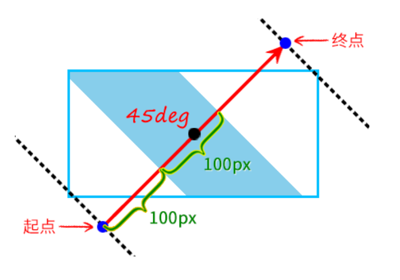](https://developer.mozilla.org/docs/Web/CSS/gradient/linear-gradient#composition_of_a_linear_gradient)

### Radial Gradient

[Radial gradient](https://developer.mozilla.org/docs/Web/CSS/gradient/radial-gradient):

- `[<ending-shape> || <size>]? [at <position>]?, <color-stop-list>`.
- `<ending-shape>`:
  - `ellipse` (initial value).
  - `circle`.
- `<size>`.
  - `closest-side`.
  - `farthest-side`.
  - `closest-corner`.
  - `farthest-corner`.
  - `<length>`: 单独一个值不能为 `<percentage>`.
  - `<length-percentage>{2}`.

[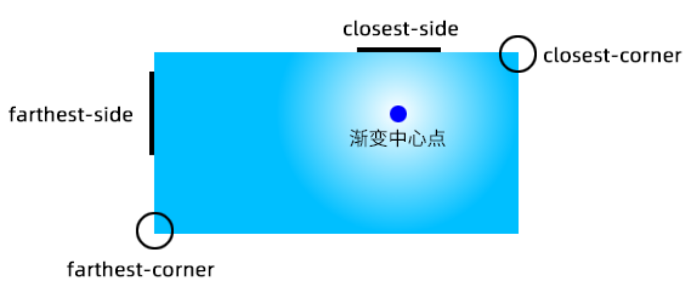](https://developer.mozilla.org/docs/Web/CSS/gradient/radial-gradient#size)

```css
.radial-gradient {
  background-image: radial-gradient(50px, white, deepskyblue);
  background-image: radial-gradient(50px 50%, white, deepskyblue);
  background-image: radial-gradient(50% 50%, white, deepskyblue);
  background-image: radial-gradient(100px at 0 0, white, deepskyblue);
  background-image: radial-gradient(100px at left top, white, deepskyblue);
  background-image: radial-gradient(
    100px at right 100px bottom 100px,
    white,
    deepskyblue
  );
  background-image: radial-gradient(
    farthest-corner circle at right 100px bottom 100px,
    white,
    deepskyblue
  );
}
```

[](https://developer.mozilla.org/docs/Web/CSS/gradient/radial-gradient#composition_of_a_radial_gradient)

### Conic Gradient

[Conic gradient](https://developer.mozilla.org/docs/Web/CSS/gradient/conic-gradient):

- `[from <angle>]? [at <position>]?, <angular-color-stop-list>`.
- Default angle: `0deg`.

```css
.pie {
  width: 150px;
  height: 150px;
  background: conic-gradient(yellowgreen 40%, gold 0deg 75%, deepskyblue 0deg);
  border-radius: 50%;
}

.color-picker-wheel {
  width: 150px;
  height: 150px;
  background: radial-gradient(closest-side circle, gray, transparent),
    conic-gradient(red, magenta, blue, aqua, lime, yellow, red);
  border-radius: 50%;
}
```

[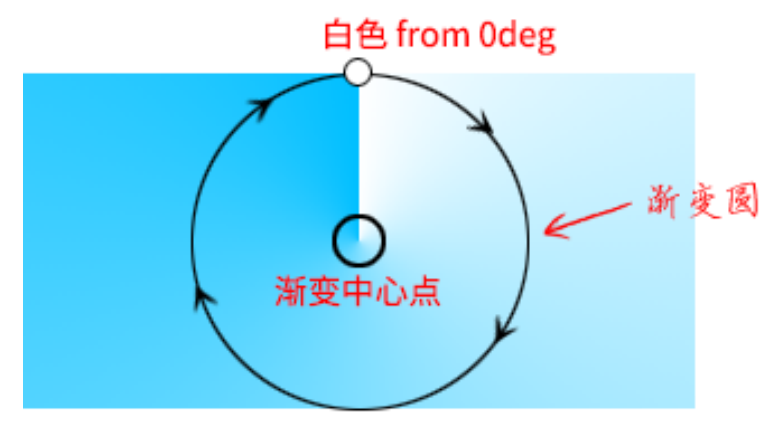](https://developer.mozilla.org/docs/Web/CSS/gradient/conic-gradient#composition_of_a_conic_gradient)

## CSS Filter and Blend

### Filter

[`filter`](https://developer.mozilla.org/docs/Web/CSS/filter):

```css
.filter {
  filter: blur(5px); /* 模糊 */
  filter: brightness(240%); /* 亮度 */
  filter: contrast(200%); /* 对比度 */
  filter: drop-shadow(16px 16px 20px blue); /* 投影 */
  filter: grayscale(50%); /* 灰度 */
  filter: hue-rotate(90deg); /* 色相旋转 */
  filter: invert(75%); /* 反相 (颜色翻转) */
  filter: opacity(25%); /* 透明度 */
  filter: saturate(30%); /* 饱和度 */
  filter: sepia(60%); /* 褐色 (老照片) */
  filter: url('resources.svg'); /* 引用 SVG filter 元素 */

  /* Apply multiple filters */
  filter: contrast(175%) brightness(3%);

  /* Global values */
  filter: inherit;
  filter: initial;
  filter: unset;
}
```

### Backdrop Filter

[`backdrop-filter`](https://developer.mozilla.org/docs/Web/CSS/backdrop-filter):

让当前元素所在区域后面的内容应用滤镜效果.

```css
.dropdown-list {
  background: hsl(0deg 0% 100% / 75%);
  backdrop-filter: blur(5px);
}
```

### Blend Mode

[`<blend-mode>`](https://developer.mozilla.org/docs/Web/CSS/blend-mode):

- `multiply`:
  - 正片叠底: $C=\frac{A \cdot B}{255}$.
  - 混合黑色变黑色.
  - 混合白色不变色.
  - 混合后颜色变暗.
- `screen`:
  - 滤色: $C=255-\frac{(255-A)(255-B)}{255}$.
  - 混合黑色不变色.
  - 混合白色变白色.
  - 混合后颜色变亮.
- `overlay`:
  - 叠加 ($A$ 为底图的色值):
    - $A\leqslant128$: $C=\frac{A \cdot B}{128}$.
    - $A\gt128$: $C=255-\frac{(255-A)(255-B)}{128}$.
  - 底图的阴影 (黑色)和高光 (白色) 的颜色会被保留,
    其他颜色的饱和度和对比度提高, 混合后的图像会更加鲜亮.
- `darken`/`lighten`:
  - 变暗: $C=\min(A, B)$.
  - 变亮: $C=\max(A, B)$.
  - 可用于实现渐变文字.
- `color-dodge`:
  - 颜色变淡: $C=A+\frac{A \cdot B}{255-B}$.
  - 可用于保护底图的高光, 适合处理高光下的人物照片:
    通过将照片和特定颜色混合, 可以改变整个照片的色调 (暖色调或是冷色调),
    同时不会影响人物高光区域的细节.
- `color-burn`:
  - 颜色加深: $C=A-\frac{(255-A)(255-B)}{B}$.
  - 可用于保护底图的阴影, 适合处理阴影丰富的照片:
    通过将照片和特定颜色混合, 可以营造更加幽深的氛围.
- `hard-light`:
  - 强光 ($A$ 为底图的色值):
    - $B\leqslant128$: $C=\frac{A \cdot B}{128}$.
    - $B\gt128$: $C=255-\frac{(255-A)(255-B)}{128}$.
  - 图像亮的地方更亮, 暗的地方更暗.
- `soft-light`:
  - 柔光 ($A$ 为底图的色值):
    - $B\leqslant128$: $C=\frac{A \cdot B}{128}+(\frac{A}{255})^2(255-2\cdot B)$.
    - $B\gt128$: $C=255-\frac{(255-A)(255-B)}{128}$.
  - 图像亮的地方轻微变亮, 暗的地方轻微变暗.
- `difference`:
  - 差值: $C=|A-B|$.
  - 若上层元素为 `white`, 则最终混合的颜色是底层元素颜色的反色.
- `exclusion`:
  - 排除: $C=A+B-\frac{A \cdot B}{128}$.
- `hue`:
  - 色调混合.
  - 混合后的颜色保留底图的饱和度和亮度, 使用顶图的色调.
  - 将照片和渐变色进行色调混合, 可让照片呈现出丰富多彩的色调效果.
- `saturation`:
  - 饱和度混合.
  - 混合后的颜色保留底图的色调和亮度, 使用顶图的饱和度.
- `luminosity`:
  - 亮度混合.
  - 混合后的颜色保留底图的色调和饱和度, 使用顶图的亮度.
  - 当底图是渐变图像或纯色图像, 上层元素是复杂图像时, 适合使用亮度混合模式.
- `color`:
  - 颜色混合.
  - 混合后的颜色保留底图的亮度, 使用顶图的色调和饱和度.
  - 通过使用 CSS 渐变让照片的色调变得丰富.

### Mix Blend Mode

[`mix-blend-mode`](https://developer.mozilla.org/docs/Web/CSS/mix-blend-mode):

- Used for multiple elements, e.g text styles.
- 通常把混合模式设置在顶层元素上:
  当元素应用了混合模式时,
  该元素会混合 `z` 轴上所有层叠顺序比其低的层叠元素.
- `multiply`: `black` is cutout (keep `black`).
- `screen`: `white` is cutout (keep `white`).

```html
<div class="background">
  <h1>Even More CSS Secrets</h1>
</div>

<style>
  .background {
    background-image: url('bg.png');
    background-repeat: no-repeat;
    background-position: center;
    background-size: cover;
  }

  .background h1 {
    color: white; /* keep white */
    background-color: black; /* mix with background */
    mix-blend-mode: screen; /* screen or multiply  */
  }
</style>
```

### Background Blend Mode

[`background-blend-mode`](https://developer.mozilla.org/docs/Web/CSS/background-blend-mode)

- Used for multiple `background-image`.
- 语法越靠后的背景图像的层级越低:
  `background` 一般设置为 `background-image# background-color`.

```css
.box {
  background: url('pic1.png'), url('pic2.png');
  background-size: cover;
  background-blend-mode: lighten; /* lighten, lighten */
}

.gradient-icon {
  background: linear-gradient(deepskyblue, deeppink), url('icon.png'), white;
  background-blend-mode: lighten, normal;
}
```

### Filter and Blend Reference

- Instagram [filters](https://github.com/una/CSSgram).
- Image [effects](https://github.com/bennettfeely/image-effects).

## CSS Shape

[CSS shapes](https://css-tricks.com/the-shapes-of-css):

- `aspect-ratio`.
- `border`.
- `box-shadow` (inset).
- Background: `color`/`size`/`image`/`gradient`/`clip-path`.
  In modern browsers `background`/`gradient`/`clip-path`
  with `transition`/`transform`
  better than `pseudo elements`.
- `filter`.
- `clip-path`
- `mask`
- SVG:
  - SVG icon.
  - SVG filter.
  - SVG clip-path.
  - SVG mask.
- pseudo elements.

### Shape Outside

[`shape-outside`](https://developer.mozilla.org/docs/Web/CSS/shape-outside)
provides a way to customize wrapping effect for `float` element,
combined with
[`shape-margin`](https://developer.mozilla.org/docs/Web/CSS/shape-margin)
[`shape-image-threshold](https://developer.mozilla.org/docs/Web/CSS/shape-image-threshold)
making it possible to wrap text around complex objects rather than simple boxes:

```css
.shape {
  float: left;
  shape-outside: polygon(50% 0, 100% 50%, 50% 100%, 0 50%);
  shape-margin: 20px;
  shape-image-threshold: 20%;
}
```

### Clip

[`clip`](https://developer.mozilla.org/docs/Web/CSS/clip)
属性只对 `absolute` 与 `fixed` 元素起作用,
是对 `overflow` 属性的有力补充
(`overflow` 对于上述两种元素的裁剪作用有限):

- `auto`.
- `rect(<top-length>, <right-length>, <bottom-length>, <left-length>)`.
- `clip` 元素 `clientWidth`, `clientHeight`, `computedStyle` 保持不变:
  仅视觉上裁剪, 元素尺寸仍为原本尺寸, 原始布局仍然保留.
- `clip` 元素非可见部分无法响应点击事件.

```css
.fixed-clip {
  position: fixed;
  clip: rect(30px 200px 200px 20px);
}
```

### Clip Path

[`clip-path`](https://developer.mozilla.org/docs/Web/CSS/clip-path):

- `none`.
- `<url>`.
- `<geometry-box> || <basic-shape>`:
  - `<geometry-box>`:
    - `border-box`.
    - `padding-box`.
    - `content-box`.
    - `margin-box`.
    - `fill-box`.
    - `stroke-box`.
    - `view-box`.
  - [`<basic-shape>`](https://developer.mozilla.org/docs/Web/CSS/basic-shape):
    - [`inset(<length-percentage>{1,4} [round <'border-radius'>]?)`](https://developer.mozilla.org/docs/Web/CSS/basic-shape/inset).
    - [`circle([<shape-radius>]? [at <position>]?)`](https://developer.mozilla.org/docs/Web/CSS/basic-shape/circle).
    - [`ellipse([<shape-radius>{2}]? [at <position>]?)`](https://developer.mozilla.org/docs/Web/CSS/basic-shape/ellipse).
    - [`polygon([<fill-rule>,]? [<length-percentage> <length-percentage>]#)`](https://developer.mozilla.org/docs/Web/CSS/basic-shape/polygon).
    - [`path([<fill-rule>,]? <string>)`](https://developer.mozilla.org/docs/Web/CSS/path).
- `clip-path` 元素 `clientWidth`, `clientHeight`, `computedStyle` 保持不变:
  仅视觉上裁剪, 元素尺寸仍为原本尺寸, 原始布局仍然保留.
- `clip-path` 元素非可见部分无法响应点击事件.
- [`<fill-rule>`](https://developer.mozilla.org/docs/Web/SVG/Attribute/fill-rule)
  用于确定复杂路径构成的图形的内部与外部, 内部填充, 外部透明.

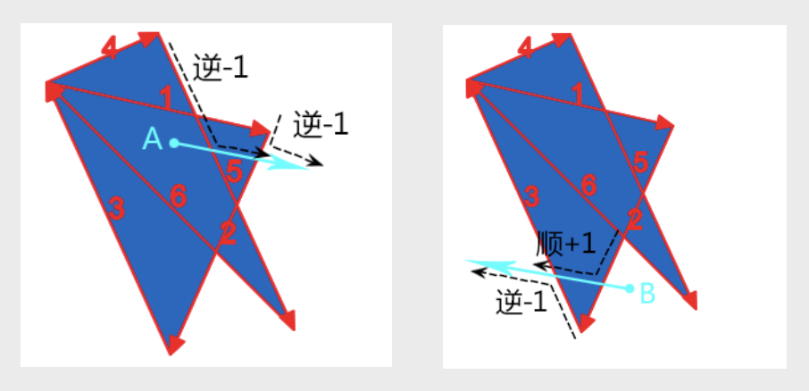

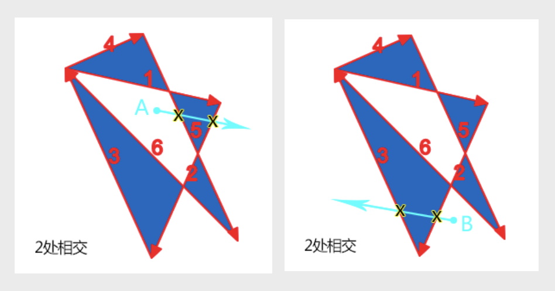

### Mask

[`mask`](https://developer.mozilla.org/docs/Web/CSS/mask):

- 元素应用 `mask` 属性遮罩效果后, 透明部分仍然可以响应点击事件.

#### Mask Image

[`mask-image`](https://developer.mozilla.org/docs/Web/CSS/mask-image):

- `none`.
- `<url>#`.
- `<gradient>#`.
- `<image()>`.
- `<image-set()>`.
- `<paint()>`.
- `<element()>`.
- `<cross-fade()>`.

#### Mask Mode

[`mask-mode`](https://developer.mozilla.org/docs/Web/CSS/mask-mode):

- `match-source`:
  根据 `mask-image` 类型自动选择模式,
  SVG `<mask>` 元素 (`url(#mask-id)`) 为 `luminance` 模式,
  其余场景 (包括 `url('mask.svg')`) 为 `alpha` 模式.
- `alpha`:
  基于透明度进行遮罩,
  `alpha(100%)` for show,
  `transparent` for hidden.
- `luminance`:
  基于亮度进行遮罩,
  `alpha(100%)` 且为亮色 for show,
  `alpha(100%)` 且为暗色 for hidden,
  `transparent` for hidden.

[](https://css-tricks.com/almanac/properties/m/mask-mode/#aa-alpha-masks)

[](https://css-tricks.com/almanac/properties/m/mask-mode/#aa-luminance-masks)

```css
img.alpha-mask {
  mask-image: linear-gradient(black, transparent);
  mask-mode: alpha;
}
```

[](https://css-tricks.com/almanac/properties/m/mask-mode/#aa-alpha-masks)

[](https://css-tricks.com/almanac/properties/m/mask-mode/#aa-luminance-masks)

#### Mask Type

[`mask-type`](https://developer.mozilla.org/docs/Web/CSS/mask-type),
用于设置 SVG `<mask>` 元素的遮罩模式:

- `luminance`.
- `mask`.

#### Mask Repeat

[`mask-repeat`](https://developer.mozilla.org/docs/Web/CSS/mask-repeat):

| Single Value | Two Value Equivalent  |
| ------------ | --------------------- |
| `no-repeat`  | `no-repeat no-repeat` |
| `repeat-x`   | `repeat no-repeat`    |
| `repeat-y`   | `no-repeat repeat`    |
| `repeat`     | `repeat repeat`       |
| `space`      | `space space`         |
| `round`      | `round round`         |

#### Mask Position

[`mask-position`](https://developer.mozilla.org/docs/Web/CSS/mask-position):

```css
.mask-position {
  /* Keyword values */
  mask-position: center;
  mask-position: top right;
  mask-position: bottom left;

  /* <length-percentage> values */
  mask-position: 25% 75%;
  mask-position: 0 0;
  mask-position: 10% 8em;
}
```

#### Mask Clip

[`mask-clip`](https://developer.mozilla.org/docs/Web/CSS/mask-clip):

- `border-box`.
- `padding-box`.
- `content-box`.
- `margin-box`.
- `fill-box`.
- `stroke-box`.
- `view-box`.
- `no-clip`.

#### Mask Origin

[`mask-origin`](https://developer.mozilla.org/docs/Web/CSS/mask-origin):

- `border-box`.
- `padding-box`.
- `content-box`.
- `margin-box`.
- `fill-box`.
- `stroke-box`.
- `view-box`.

#### Mask Size

[`mask-size`](https://developer.mozilla.org/docs/Web/CSS/mask-size)

- `auto{1,2}`.
- `cover`.
- `contain`.
- `<length-percentage>{12}`.

#### Mask Composite

[`mask-composite`](https://developer.mozilla.org/docs/Web/CSS/mask-composite):

- `add`:
  所有遮罩图片直接合成一个完整的遮罩.
- `subtract`:
  顶层遮罩图片中, 与底层遮罩图片重合的区域不显示遮罩.
- `intersect`:
  顶层遮罩图片中, 与底层遮罩图片重合的区域才显示遮罩.
- `exclude`:
  遮罩图片重合的区域被当作透明区域 (`transparent`),
  其余区域直接合成一个完整的遮罩 (`add`).
- `mask-image` 中语法越靠后的遮罩图片层级越低.

```css
.masked {
  width: 100px;
  height: 100px;
  background-color: #8cffa0;
  mask-image: url('https://mdn.mozillademos.org/files/12668/MDN.svg'),
    url('https://mdn.mozillademos.org/files/12676/star.svg');
  mask-size: 100% 100%;
  mask-composite: add;
}
```

## SVG

### SVG Fill

```html
<svg
  width="100px"
  height="100px"
  viewBox="0 0 100 100"
  version="1.1"
  xmlns="..."
>
  <title>My Awesome SVG</title>
  <circle class="circle" cx="50" cy="50" r="50" fill="#FFFF00" />
</svg>

<style>
  .circle {
    fill: currentcolor;
    fill-opacity: 50%;
    fill-rule: nonzero;
  }
</style>
```

### SVG Stroke

```css
circle {
  stroke: blue;
  stroke-dasharray: 14px 4px 4px 4px; /* 实色长度 透明长度 实色长度 透明长度 ... */
  stroke-dashoffset: 0;
  stroke-linecap: round;
  stroke-linejoin: round;
  stroke-opacity: 50%;
  stroke-width: 2px;
  paint-order: stroke;
  vector-effect: non-scaling-stroke;
}
```

[](https://developer.mozilla.org/docs/Web/SVG/Attribute/stroke-linecap)

[](https://developer.mozilla.org/docs/Web/SVG/Attribute/stroke-linejoin)

[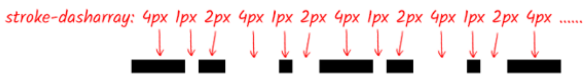](https://developer.mozilla.org/docs/Web/SVG/Attribute/stroke-dasharray)

### SVG Marker

[`<marker>`](https://developer.mozilla.org/docs/Web/SVG/Element/marker):

```css
polyline {
  marker-start: url('#marker-circle');
  marker-mid: url('#marker-circle');
  marker-end: url('#marker-arrow');
}
```

### SVG Shape Tag

- Rectangles and squares: `<rect>`.
- Circles: `<circle>`.
- Ellipse: `<ellipse>`.
- Line: `<line>`.
- Polyline: `<polyline>`.
- Polygon: `<polygon>`.
- Path: `<path>`.

### SVG Text Tag

The text tag `<text>` is used to create **selectable** and **accessible** text:

```css
text {
  /* SVG text vertical alignment */
  dominant-baseline: auto;
  dominant-baseline: middle;
  dominant-baseline: central;
  dominant-baseline: text-top;
  dominant-baseline: text-bottom;
  dominant-baseline: alphabetic;
  dominant-baseline: hanging;
  dominant-baseline: ideographic;
  dominant-baseline: mathematical;

  /* SVG text horizontal alignment */
  text-anchor: start;
  text-anchor: middle;
  text-anchor: end;
}
```

### SVG Accessibility Tag

The title `<title>` and description `<desc>` tags
are specifically for providing accessibility content.

### SVG Group Tag

The group tag `<g>` is used to group elements together
to add class names and apply animations, filters, patterns and effects
to a group of elements.

### SVG Defs Tag

The defs tag `<defs>` is used to define elements for later reuse.
This is where you create
**marker**, **patterns**, **filters**, **masks**
to be reused later.
This is also used to create **icon systems**.

```html
<svg width="0" height="0" style="position: absolute;">
  <defs>
    <marker
      id="marker-circle"
      markerWidth="8"
      markerHeight="8"
      refX="4"
      refY="4"
    >
      <circle cx="4" cy="4" r="2.5" />
    </marker>
    <marker
      id="marker-arrow"
      markerWidth="12"
      markerHeight="12"
      refX="2"
      refY="6"
      orient="auto"
    >
      <path d="M2,3 L2,10 L8,6 L2,3" />
    </marker>
  </defs>
</svg>
```

```html
<filter id="noise" y="0" x="0">
  <feTurbulence stitchTiles="stitch" baseFrequency=".75" type="fractalNoise" />
</filter>
```

```html
<pattern ...>
  ...
  <rect
    width="100%"
    height="100%"
    fill="white"
    filter="url(#noise)"
    opacity=".9"
  />
</pattern>
```

### SVG Filter

内投影滤镜:

```html
<svg
  width="300"
  height="300"
  viewBox="0 0 20 20"
  style="position:absolute;left:-999px;"
>
  <filter id="inset-shadow">
    <!-- 投影偏移 -->
    <feOffset dx="0" dy="0" />
    <!-- 投影模糊 -->
    <feGaussianBlur stdDeviation="6" result="offset-blur" />
    <!-- 反转投影使其变成内投影 -->
    <feComposite
      operator="out"
      in="SourceGraphic"
      in2="offset-blur"
      result="inverse"
    />
    <!-- 内投影附加黑色 -->
    <feFlood flood-color="black" flood-opacity=".95" result="color" />
    <feComposite operator="in" in="color" in2="inverse" result="shadow" />
    <!-- 把内投影显示在图像上 -->
    <feComposite operator="over" in="shadow" in2="SourceGraphic" />
  </filter>
</svg>
```

毛玻璃滤镜:

```html
<svg width="0" height="0" style="position:absolute;">
  <filter id="blur" color-interpolation-filters="sRGB">
    <feGaussianBlur stdDeviation="6" edgeMode="duplicate" />
    <feComponentTransfer>
      <feFuncA type="discrete" tableValues="0 1" />
    </feComponentTransfer>
  </filter>
</svg>
```

### SVG Clip Path

<!-- markdownlint-disable line-length -->

```html
<svg class="svg">
  <clipPath id="circle" clipPathUnits="objectBoundingBox">
    <path
      d="M0.5,0 C0.776,0,1,0.224,1,0.5 C1,0.603,0.969,0.7,0.915,0.779 C0.897,0.767,0.876,0.76,0.853,0.76 C0.794,0.76,0.747,0.808,0.747,0.867 C0.747,0.888,0.753,0.908,0.764,0.925 C0.687,0.972,0.597,1,0.5,1 C0.224,1,0,0.776,0,0.5 C0,0.224,0.224,0,0.5,0"
    />
  </clipPath>
</svg>
```

<!-- markdownlint-enable line-length -->

```css
.item {
  clip-path: url('#circle');
}
```

### SVG Mask

Avatar with circle status indicator:

```html
<svg role="none">
  <mask id="circle">
    <circle fill="white" cx="100" cy="100" r="100"></circle>
    <circle fill="black" cx="86%" cy="86%" r="18"></circle>
  </mask>
  <g mask="url(#circle)">
    <image
      x="0"
      y="0"
      width="100%"
      height="100%"
      xlink:href="avatar.jpg"
    ></image>
    <circle
      fill="none"
      cx="100"
      cy="100"
      r="100"
      stroke="rgb(0 0 0 / 10%)"
      stroke-width="2"
    ></circle>
  </g>
</svg>
```

### SVG Animation

```css
circle {
  animation: zoom-in-out 1s infinite alternate;
}

@keyframes zoom-in-out {
  from {
    r: 60px;
  }

  to {
    r: 75px;
  }
}
```

### SVG API

```ts
const svgElement = document.createElementNS(
  'http://www.w3.org/2000/svg',
  'svg'
);
const svgRectElement = document.createElementNS(
  'http://www.w3.org/2000/svg',
  'rect'
);
```

## CSS Interaction

### Cursor

[`cursor`](https://developer.mozilla.org/docs/Web/CSS/cursor):

- `auto`/`default`/`pointer`/`move`/`text`.
- `wait`/`help`/`crosshair`/`progress`.
- `not-allowed`/`no-drop`/`vertical-text`/`all-scroll`.
- `none`/`alias`/`cell`/`copy`/`context-menu`.
- `grab`/`grabbing`.
- `n-resize`/`e-resize`/`s-resize`/`w-resize`.
- `ne-resize`/`nw-resize`/`se-resize`/`sw-resize`.
- `col-resize`/`row-resize`.
- `ew-resize`/`ns-resize`/`nesw-resize`/`nwse-resize`.
- `zoom-in`/`zoom-out`.
- `url()`.

```css
.wrap {
  pointer-events: none;
  cursor: default;
}
```

### Pointer Events

[`pointer-events`](https://developer.mozilla.org/docs/Web/CSS/pointer-events):

- `auto`.
- `none`:
  - 不能阻止键盘行为: 元素依然可以通过 `Tab` 键被 `focus`.
  - 无法显示 `[title]` 等 `A11Y` 提示, 影响无障碍访问 (特别是移动端).
  - 综上所述, `none`
    不适合 `<a>`/`<button>` 等控件元素,
    适合作用在装饰性的或仅用作视觉表现的非控件元素.
- 具有继承性.

### Touch Action

[`touch-action`](https://developer.mozilla.org/docs/Web/CSS/touch-action):

- `auto`:
  enable all panning and zooming gestures.
- `none`:
  disable all panning and zooming gestures.
- `manipulation`:
  only enable panning and pinch zoom gestures (滚动, 持续缩放),
  remove click delay (300ms) for mobile device.
- `[pan-x | pan-left | pan-right ] || [ pan-y | pan-up | pan-down ] || pinch-zoom`.

```css
.box {
  touch-action: auto;
  touch-action: none;
  touch-action: manipulation;
  touch-action: pan-x;
  touch-action: pan-left;
  touch-action: pan-right;
  touch-action: pan-y;
  touch-action: pan-up;
  touch-action: pan-down;
  touch-action: pinch-zoom;
  touch-action: pan-left pan-up pan-zoom;
}
```

### Resize

[`resize`](https://developer.mozilla.org/docs/Web/CSS/resize):

- `none`.
- `both`.
- `horizontal`.
- `vertical`.
- `inline`.
- `block`.
- 不支持内联元素.
- 支持 `overflow` non-`visible` 块级元素.
- 可用 `min-width`/`min-height`/`max-width`/`max-height` 限制拉伸范围.

```css
.editable {
  overflow: hidden;
  resize: both;
}
```

### User Select

禁止图文被选中, 保持和原生 App 一样的文字选中体验:

```css
.body {
  -webkit-touch-callout: none;
  user-select: none;
}
```

点击任意位置实现全选效果:

```css
.box {
  user-select: all;
}
```

### Caret Color

输入框光标颜色:

```css
input {
  caret-color: red;
}
```

## CSS Scrolling

### Scroll Behavior

[`scroll-behavior`](https://developer.mozilla.org/docs/Web/CSS/scroll-behavior):

- `auto`.
- `smooth`.

```css
html,
body {
  scroll-behavior: smooth;
}
```

### Overscroll Behavior

[`overscroll-behavior`](https://developer.mozilla.org/docs/Web/CSS/overscroll-behavior):

- `auto{1,2}`.
- `contain{1,2}`: 嵌套滚动不会传导至相邻区域, 即嵌套滚动条滚动到底部便停止, 不会继续滚动外部滚动条.
- `none{1,2}`.

### Scroll Snap

[`scroll-snap`](https://developer.mozilla.org/docs/Web/CSS/CSS_Scroll_Snap):

- 可让网页容器滚动停止时, 自动平滑定位到指定元素的指定位置.
- Parent property:
  - [`scroll-snap-type`](https://developer.mozilla.org/docs/Web/CSS/scroll-snap-type).
  - [`scroll-padding`](https://developer.mozilla.org/docs/Web/CSS/scroll-padding).
- Children property:
  - [`scroll-snap-align`](https://developer.mozilla.org/docs/Web/CSS/scroll-snap-align).
  - [`scroll-snap-stop`](https://developer.mozilla.org/docs/Web/CSS/scroll-snap-stop).
  - [`scroll-margin`](https://developer.mozilla.org/docs/Web/CSS/scroll-margin).

```html
<div class="scroll-x">
  
  
  
  
</div>

<style>
  .scroll-x {
    max-width: 414px;
    height: 420px;
    scroll-snap-type: x mandatory;
    overflow: auto;
    white-space: nowrap;
  }

  .scroll-x img {
    scroll-snap-align: center;
  }
</style>
```

#### Scroll Snap Type

[`scroll-snap-type`](https://developer.mozilla.org/docs/Web/CSS/scroll-snap-type):

- `none`.
- `[ x | y | inline | block | both ] [ mandatory | proximity ]?`:
  - `x`: 捕捉水平定位点.
  - `y`: 捕捉垂直平定位点.
  - `inline`: 捕捉和内联元素排列一个滚动方向的定位点, 默认文档流下指的就是水平轴.
  - `block`: 捕捉和块状元素排列一个滚动方向的定位点, 默认文档流下指的就是垂直轴.
  - `both`: 横轴与纵轴都捕捉.
  - `mandatory`: 强制定位, 若存在有效的定位点位置, 则滚动容器必须在滚动结束时进行定位.
  - `proximity`: 大约定位, 让浏览器自己判断要不要定位.

#### Scroll Snap Align

[`scroll-snap-align`](https://developer.mozilla.org/docs/Web/CSS/scroll-snap-align):

- `none{1,2}`.
- `start{1,2}`: 起始位置对齐, 子元素对齐容器左边缘/上边缘.
- `end{1,2}`: 结束位置对齐, 子元素对齐容器右边缘/下边缘.
- `center{1,2}`: 居中对齐, 子元素中心和滚动容器中心一致.

#### Scroll Snap Stop

[`scroll-snap-stop`](https://developer.mozilla.org/docs/Web/CSS/scroll-snap-stop):

- `normal`: 可以忽略捕获位置.
- `always`: 不能忽略捕获位置, 且必须定位到第一个捕获元素的位置, 保证每次只滚动一屏或一个指定元.

#### Scroll Padding

[`scroll-padding`](https://developer.mozilla.org/docs/Web/CSS/scroll-padding):

- `auto{1,4}`.
- `<length-percentage>{1,4}`.

#### Scroll Margin

[`scroll-margin`](https://developer.mozilla.org/docs/Web/CSS/scroll-margin):

- `0`.
- `<length>{1,4}`.

### Overflow Anchor

[`overflow-anchor`](https://developer.mozilla.org/docs/Web/CSS/overflow-anchor):

- `auto`: 开启滚动锚定.
- `none`: 关闭滚动锚定.

### Overflow Scrolling

`overflow: scroll` 剪裁界线为 `padding box`.
但部分浏览器不符合这一标准.
实际项目开发时, 要尽量避免滚动容器设置 `padding-bottom` 值:

- 跨浏览器样式表现不一致.
- 跨浏览器 `scrollHeight` 值不一致.

### Horizontal Scrolling

[Horizontal Scrolling](https://designshack.net/articles/navigation/horizontal-scrolling-pros-cons):

- Avoid a full-screen horizontal scroll;
  ensure that users know there is also content
  that can be reached using a traditional method.
- Make scroll interactions obvious and provide instruction.
- To avoid accessibility issues,
  ensure that horizontal scrolling elements also work with keyboard navigation.
- Design horizontal scrolling elements in containers using HTML and CSS.
- Use visual cues, such as partial images,
  to show that there is a horizontal scroll action in effect.
- Use partial horizontal scrolling with a static design element for stability.
- Design horizontal scroll bars in the same manner as vertical scroll bars
  to create an element of familiarity for users.

Horizontal Scrolling Methods:

- Rotate 90 deg element.
- `display: flex; overflow-x: auto;`
- `grid-auto-flow: column;`
- `scroll-snap-type: x mandatory; scroll-snap-align: center;`

### Custom Scrollbar

#### Standard Custom Scrollbar

[`scrollbar-width`](https://developer.mozilla.org/docs/Web/CSS/scrollbar-width):

- `auto`.
- `thin`.
- `none`.

[`scrollbar-color`](https://developer.mozilla.org/docs/Web/CSS/scrollbar-color):

- `auto`.
- `<color>{2}`.

#### Chrome Custom Scrollbar

[WebKit scrollbar](https://developer.mozilla.org/docs/Web/CSS/::-webkit-scrollbar):

- 整体部分: `::-webkit-scrollbar`.
- 两端按钮: `::-webkit-scrollbar-button`.
- 外层轨道: `::-webkit-scrollbar-track`.
- 内层轨道: `::-webkit-scrollbar-track-piece`.
- 滚动滑块: `::-webkit-scrollbar-thumb`.
- 边角: `::-webkit-scrollbar-corner`.

```css
.demo::-webkit-scrollbar {
  /* 滚动条整体样式 */

  /* 高宽分别对应横竖滚动条的尺寸 */
  width: 10px;
  height: 1px;
}

.demo::-webkit-scrollbar-thumb {
  background-color: blue;
  background-image: linear-gradient(
    45deg,
    rgb(255 255 255 / 20%) 25%,
    transparent 25%,
    transparent 50%,
    rgb(255 255 255 / 20%) 50%,
    rgb(255 255 255 / 20%) 75%,
    transparent 75%,
    transparent
  );

  /* 滚动条方块 */
  border-radius: 10px;
}

.demo::-webkit-scrollbar-track {
  background-color: #ededed;

  /* 滚动条轨道 */
  border-radius: 10px;
  box-shadow: inset 0 0 5px rgb(0 0 0 / 20%);
}
```

#### Hidden Custom Scrollbar

```css
.scroll-none {
  scrollbar-width: none; /* FireFox */
  -ms-overflow-style: none; /* IE 10+ */
  overflow-x: hidden;
  overflow-y: auto;
}

.scroll-none::-webkit-scrollbar {
  /* Chrome Safari */
  display: none;
  width: 0;
  height: 0;
}
```

## CSS Transform

`transform`:

- No affect on the CSS box model layout (excepts [`overflow`](#transform-alignment)).
- No affect on `display: inline` element.
- Affect the visual rendering.
- Affect client rectangles exposed by
  `Element Interface Extensions` (`getClientRects()`/`getBoundingClientRect()`).
- Affect after `clip`/`clip-path`: first `clip`/`clip-path`, then `transform`.

### Translate Transform

`translate()`/`translateX()`/`translateY()`/`translateZ()`/`translate3d()`:

```css
.translate {
  /* 往右偏移10px, 往下偏移20px */
  transform: translate(10px, 20px);

  /* 往右偏移10px */
  transform: translateX(10px);

  /* 往下偏移20px */
  transform: translateY(20px);

  /* 往左偏移自身宽度的一半, 往上偏移自身高度的一半 */
  transform: translate(-50%, -50%);
}
```

### Scale Transform

`scale()`/`scaleX()`/`scaleY()`/`scaleZ()`/`scale3d()`:

```css
.scale {
  /* 水平放大 2 倍, 垂直缩小 1/2 */
  transform: scale(2, 0.5);

  /* 水平放大 2 倍 */
  transform: scaleX(2);

  /* 垂直缩小 1/2 */
  transform: scaleY(0.5);

  /* 水平翻转效果 */
  transform: scaleX(-1);

  /* 垂直翻转效果 */
  transform: scaleY(-1);
}
```

### Rotate Transform

`rotate()`/`rotateX()`/`rotateY()`/`rotateZ()`/`rotate3d()`:

- `deg`: degrees 角度 ($0$ ~ $360^{\circ}$).
- `grad`: grads 百分度 ($0$ ~ $400$).
- `rad`: radians 弧度 ($1^{\circ} = \frac{180}{\pi}$).
- `turn`: turns 圈数.

```css
.rotate {
  /* 正值顺时针, 负值逆时针 */
  transform: rotate(45deg);
  transform: rotate(50grad);
  transform: rotate(0.7854rad);
  transform: rotate(0.25turn);
}
```

### Skew Transform

`skew()`/`skewX()`/`skewY()`:

```css
.skew {
  /* 水平切斜 10 度, 垂直切斜 20 度 */
  transform: skew(10deg, 20deg);

  /* 水平切斜10度 */
  transform: skewX(10deg);

  /* 垂直切斜20度 */
  transform: skewY(20deg);
}
```

[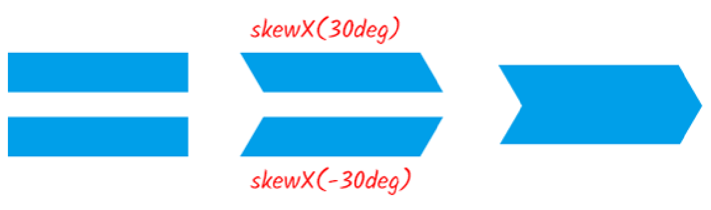](https://developer.mozilla.org/docs/Web/CSS/transform-function/skew)

### Matrix Transform

`matrix(a, b, c, d, e, f)`:

$$
\begin{bmatrix}
  a & c & e \\
  b & d & f \\
  0 & 0 & 1
\end{bmatrix}
\begin{bmatrix}
  x \\
  y \\
  1
\end{bmatrix}
\implies
\begin{bmatrix}
  ax + cy + e \\
  bx+ dy + f \\
  1
\end{bmatrix}
$$

$$
\begin{align}
   x' &= ax + cy + e  \\
   y' &= bx + dy + f
\end{align}
$$

Translate:

$$
\begin{align}
   x' &= 1 \cdot x + 0 \cdot y + e &= x + e \\
   y' &= 0 \cdot x + 1 \cdot y + f &= y + f
\end{align}
$$

Scale:

$$
\begin{align}
   x' &= a \cdot x + 0 \cdot y + 0  &= ax \\
   y' &= 0 \cdot x + d \cdot y + 0  &= dy
\end{align}
$$

Rotate:

$$
\begin{align}
   x' &= \cos\theta \cdot x - \sin\theta \cdot y \\
   y' &= \sin\theta \cdot x + \cos\theta \cdot y
\end{align}
$$

Skew:

$$
\begin{align}
   x' &= x + \tan{\theta x} \cdot y  \\
   y' &= \tan{\theta y} \cdot x + y
\end{align}
$$

```css
.matrix {
  transform: matrix(1, 0, 0, 1, var(--translate-x), var(--translate-y));
  transform: matrix(var(--scale-x), 0, 0, var(--scale-y), 0, 0);
  transform: matrix(var(--cos), var(--sin), var(--sin-minus), var(--cos), 0, 0);
  transform: matrix(1, var(--tan-y), var(--tan-x), 1, 0, 0);
}
```

### Transform Origin

[`transform-origin`](https://developer.mozilla.org/docs/Web/CSS/transform-origin)
change `transform` start point:

- X offset: `<length>`/`<percentage>`/`left`/`center`/`right`.
- Y offset: `<length>`/`<percentage>`/`top`/`center`/`bottom`.
- Z offset: `<length>`.

```css
.transform-origin {
  /* One-value syntax, the other is `50%`/`center` */
  transform-origin: 2px;
  transform-origin: bottom;

  /* x-offset | y-offset */
  transform-origin: 3cm 2px;
  transform-origin: left 2px;

  /* x-offset | y-offset | z-offset */
  transform-origin: 2px 30% 10px;
  transform-origin: left 5px -3px;
}
```

### Individual Transform

Individual transform [property](https://drafts.csswg.org/css-transforms-2/#individual-transforms):

- [`translate`](https://developer.mozilla.org/docs/Web/CSS/translate).
- [`scale`](https://developer.mozilla.org/docs/Web/CSS/scale).
- [`rotate`](https://developer.mozilla.org/docs/Web/CSS/rotate).

### Transform Style

`transform-style`:

- `flat`: initial value, 表示平面变换.
- `preserve-3d`: 表示 3D 透视变换.

### Transform Perspective

`perspective` 为 **3D** 转换元素定义透视视图:

```css
.parent {
  perspective: 201px;
}
```

- 设置的 `translateZ` 值越小, 则子元素大小越小 (因为元素远去, 我们眼睛看到的就会变小).
- `translateZ` 值越大, 该元素也会越来越大.
- 当 `translateZ` 值非常接近 201 像素, 但是不超过 201 像素的时候 (如 200 像素).
  该元素的大小就会撑满整个屏幕 (父辈元素没有 `overflow: hidden` 的限制).
- 当 `translateZ` 值再变大, 超过 201 像素的时候, 该元素看不见了.

[](https://developer.mozilla.org/docs/Web/CSS/perspective)

### Backface Visibility

```css
.element {
  backface-visibility: hidden;
}
```

当元素 `rotateY(180deg)` 时, 元素将被隐藏.

### Transform Container

- `:hover` should not add to transformed elements,
  `:hover` should add to parent element.
- 3D 变换一般需要在容器元素上加上以下样式:

```css
.transform-container {
  perspective: 1024px;
  transform-style: preserve-3d;
}

.front .back {
  backface-visibility: hidden;
}
```

### Transform Alignment

- Keep `translate(-50%, -50%)` in keyframe transform property list
  when using it for alignment.
- 父元素设置了 `transform` 变换,
  `position: fixed` 子元素固定定位失效.
- 父元素设置了 `transform` 变换 + `overflow: hidden`,
  `position: absolute` 子元素会被剪裁.
- 当变换绝对定位居中的元素时, 需要改变 `transform-origin`:

```css
.rotate {
  position: absolute;
  top: 200px;
  left: 50%;
  transform: translateX(-50%);
  transform-origin: left;
}
```

## CSS Transition

### Transition Property

- `transition-property`: `all` (initial value).
- `transition-duration`.
- `transition-delay`: 支持负值.
- `transition-timing-function`: `<easing-function>`.

```css
@media screen and (prefers-reduced-motion: reduce) {
  .element {
    transition: none;
  }
}

.element {
  transition: property duration timing-function delay;
  transition: transform 0.5s ease-in-out 0.2s;
}
```

### Transition Timing Function

[`<easing-function>`](https://developer.mozilla.org/docs/Web/CSS/easing-function):

- `liner`.
- `<cubic-bezier-timing-function>`:
  - `ease`: `cubic-bezier(0.25, 0.1, 0.25, 1.0)`.
  - `ease-in`: `cubic-bezier(0.42, 0, 1.0, 1.0)`.
  - `ease-out`: `cubic-bezier(0, 0, 0.58, 1.0)`.
  - `ease-in-out`: `cubic-bezier(0.42, 0, 0.58, 1.0)`.
  - `cubic-bezier(<number [0,1]>, <number>, <number [0,1]>, <number>)`.
- `<step-timing-function>`:
  - `step-start`.
  - `step-end`.
  - `steps(<integer>[, jump-start | jump-end | jump-none | jump-both | start | end]?)`.

```css
:root {
  --ease-in-quad: cubic-bezier(0.55, 0.085, 0.68, 0.53);
  --ease-in-cubic: cubic-bezier(0.55, 0.055, 0.675, 0.19);
  --ease-in-quart: cubic-bezier(0.895, 0.03, 0.685, 0.22);
  --ease-in-quint: cubic-bezier(0.755, 0.05, 0.855, 0.06);
  --ease-in-expo: cubic-bezier(0.95, 0.05, 0.795, 0.035);
  --ease-in-circ: cubic-bezier(0.6, 0.04, 0.98, 0.335);
  --ease-out-quad: cubic-bezier(0.25, 0.46, 0.45, 0.94);
  --ease-out-cubic: cubic-bezier(0.215, 0.61, 0.355, 1);
  --ease-out-quart: cubic-bezier(0.165, 0.84, 0.44, 1);
  --ease-out-quint: cubic-bezier(0.23, 1, 0.32, 1);
  --ease-out-expo: cubic-bezier(0.19, 1, 0.22, 1);
  --ease-out-circ: cubic-bezier(0.075, 0.82, 0.165, 1);
  --ease-in-out-quad: cubic-bezier(0.455, 0.03, 0.515, 0.955);
  --ease-in-out-cubic: cubic-bezier(0.645, 0.045, 0.355, 1);
  --ease-in-out-quart: cubic-bezier(0.77, 0, 0.175, 1);
  --ease-in-out-quint: cubic-bezier(0.86, 0, 0.07, 1);
  --ease-in-out-expo: cubic-bezier(l, 0, 0, 1);
  --ease-in-out-circ: cubic-bezier(0.785, 0.135, 0.15, 0.86);
}
```

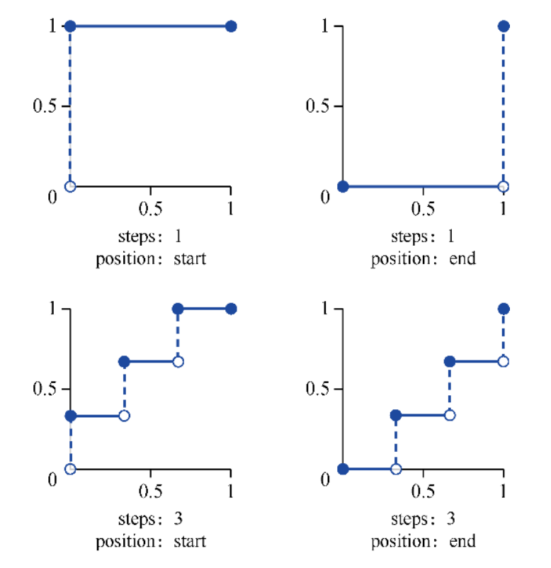

### Transition Direction

By specifying the transition on the element itself,
define the transition to occur in both directions
(hover on and hover off).

Change `transition` when `:hover` etc state bring magic effect:

```css
.menu-nav {
  visibility: hidden;
  transition: all 0.4s ease-in-out;
  transform: translateX(-100%);
}

.menu-link {
  opacity: 0;
  transition: opacity 0.4s ease-in-out;
}

.menu-toggle:checked ~ .menu-nav {
  visibility: visible;
  transform: translateX(0);
}

.menu-toggle:checked ~ .menu-nav .menu-link {
  opacity: 1;

  /* magic effect for delaying transition */
  transition: opacity 0.4s ease-in-out 0.4s;
}
```

### Transition Class Controls

With `transition: opacity 0.5s` set,
first add `.opacity-0` class,
then replace it with `.opacity-1` class.
Transition animation get trigger
as css style of element changed (class changed):

```css
@media screen and (prefers-reduced-motion: reduce) {
  .element {
    transition: none;
  }
}

.element {
  transition: opacity 0.5s;
}

/* before-enter -> enter -> before-leave -> leave */
.enter,
.before-leave {
  opacity: 1;
}

.leave,
.before-enter {
  opacity: 0;
}
```

```ts
div.classList.add('before-enter');

setTimeout(() => {
  div.classList.remove('before-enter');
  div.classList.add('enter');
}, 20);
```

### Transition Internals

`transition` take effect only when
browser detecting different styles between `style` stage.

```ts
// transition not working
panel.style.transform = 'scale(0)';
panel.style.transition = 'transform .5s';
// previous `transform` is empty
panel.style.transform = 'scale(1)';

// transition working
panel.style.transform = 'scale(0)';
panel.style.transition = 'transform .5s';
// previous `transform` is `scale(0)`
requestAnimationFrame(() => {
  panel.style.transform = 'scale(1)';
});

// transition working
panel.style.transform = 'scale(0)';
// `getComputedStyle(element).property` trigger a new `style` stage
const computedTransform = getComputedStyle(panel).transform;
panel.style.transition = 'transform .5s';
// previous `transform` is `scale(0)`
panel.style.transform = 'scale(1)';
```

## CSS Animation

### Animation Property

[`animation` formal syntax](https://developer.mozilla.org/docs/Web/CSS/animation#formal_syntax):

- `animation-name`.
- `animation-duration`.
- `animation-delay`:
  支持负值.
- `animation-timing-function`:
  [`<easing-function>`](#transition-timing-function).
- `animation-iteration-count`:
  - `infinite | <number>` 执行次数.
  - 支持 `0` 与小数.
  - 不支持负值.
- `animation-direction`:
  - `normal`: `0%->100%` 方向.
  - `alternate`/`alternate-reverse`: 不断交替方向.
  - `reverse`: `100%->0%` 方向.
- `animation-fill-mode`:
  `forwards`/`backwards`/`both`.
- `animation-play-state`:
  `paused`/`running`.

```css
@media screen and (prefers-reduced-motion: reduce) {
  .element {
    animation: none;
  }
}

.element {
  animation: name duration timing-function delay iteration-count direction;
}
```

### Animation Fill Mode

[`animation-fill-mode`](https://developer.mozilla.org/docs/Web/CSS/animation-fill-mode):

- `forwards`: 动画结束后, 应用动画最后一帧属性值.
- `backwards`: 动画开始前, 应用动画第一帧属性值.
- `both`: 同时应用上述两种效果.

| `animation-direction`         | `animation-iteration-count` | last keyframe |
| ----------------------------- | --------------------------- | ------------- |
| `normal`                      | even or odd                 | 100%          |
| `reverse`                     | even or odd                 | 0%            |
| `alternate`                   | even                        | 0%            |
| `alternate`                   | odd                         | 100%          |
| `alternate-reverse`           | even                        | 100%          |
| `alternate-reverse`           | odd                         | 0%            |
| `normal`/`alternate`          | 0                           | 0%            |
| `reverse`/`alternate-reverse` | 0                           | 100%          |

| animation-direction           | first keyframe |
| ----------------------------- | -------------- |
| `normal`/`alternate`          | 0%             |
| `reverse`/`alternate-reverse` | 100%           |

### Animation Play State

利用 `animation-paly-state`
与 JavaScript 添加 `.animate` 类控制动画开始和停止.

```css
div {
  animation-play-state: paused;
}

:checked ~ div {
  animation-play-state: running;
}
```

```css
@media screen and (prefers-reduced-motion: reduce) {
  .to-animate {
    animation: none;
  }
}

.to-animate {
  animation: animationName 1.5s linear;
  animation-play-state: paused;
  animation-iteration-count: infinite;
}

.animate {
  animation-iteration-count: running;
}
```

```ts
element.classList.add('animate');
setTimeout(() => element.classList.remove('animate'), duration);
```

### Offset Animation

[`offset`](https://developer.mozilla.org/docs/Web/CSS/offset),
animating an element along a defined path:

- [`offset-position`](https://developer.mozilla.org/docs/Web/CSS/offset-position).
- [`offset-path`](https://developer.mozilla.org/docs/Web/CSS/offset-path).
- [`offset-distance`](https://developer.mozilla.org/docs/Web/CSS/offset-distance).
- [`offset-rotate`](https://developer.mozilla.org/docs/Web/CSS/offset-rotate).
- [`offset-anchor`](https://developer.mozilla.org/docs/Web/CSS/offset-anchor).

```css
.path {
  /* Offset position */
  offset: auto;
  offset: 10px 30px;
  offset: none;

  /* Offset path */
  /* stylelint-disable-next-line function-no-unknown */
  offset: ray(45deg closest-side);
  offset: url('arc.svg');
  offset: path('M 100 100 L 300 100 L 200 300 z');

  /* Offset path with distance and/or rotation */
  offset: url('circle.svg') 100px;
  offset: url('circle.svg') 40%;
  offset: url('circle.svg') 30deg;
  offset: url('circle.svg') 50px 20deg;

  /* Including offset anchor */
  /* stylelint-disable-next-line function-no-unknown */
  offset: ray(45deg closest-side) / 40px 20px;
  offset: url('arc.svg') 2cm / 0.5cm 3cm;
  offset: url('arc.svg') 30deg / 50px 100px;
}
```

### Animation FLIP Pattern

- First: 初始状态.
- Last: 动画结束状态.
- Invert: last 至 first 的 `transform` 属性.
- Play: `transition: transform .2s linear`.

```css
@media screen and (prefers-reduced-motion: reduce) {
  .scale-up {
    transition: none;
  }
}

/* first: scale(1), last: scale(1.2) */
.scale-up {
  transition: transform 0.2s linear;
  transform: scale(0.8);
}

.scale-up:hover,
.scale-up:focus {
  transform: none;
}
```

### Animation Bounce Cache Pattern

- First `-100`.
- Then `+5`/`+20`.
- Finally `0`.
- 切换动画时, 需要先把之前的动画清除: 防止出现闪烁 Bug.

### Animation Helper

- `opacity`.
- `overflow: hidden`.
- `transform`: `scale`/`translate`.
- `transition`.
- `animation-delay`.
- `width`/`height`
- `max-width`/`max-height`.
- `margin`.
- `border-*`.
- `background`.
- `background-position`.
- `background` with multiple `gradient`.
- Single `box-shadow`
- Multiple `box-shadow`.
- `filter`.
- `backdrop-filter`.
- `*-clip-*`.
- `mask-*`.
- Pseudo element (`::before`/`::after`).
- Pseudo class (`:hover`/`:focus`/`:target`).
- Changing `top`/`right`/`bottom`/`left` of pseudo element
  can change animation start point:
  e.g `bottom: 0, right: 0` change `width`/`height` from `0` to `100%`,
  size animation will start from `bottom-right` corner.

```css
.animation-container {
  z-index: -1;
  overflow: hidden;
}
```

```css
/* 直接动画 */
.div {
  animation-name: name;
  animation-duration: 1s;
  animation-timing-function: cubic-bezier(0.42, 0, 0.58, 1);
  animation-delay: 0.5s;
}

/* hover 后再播放动画, 高级化 transform + transition */
.div:hover,
.div:focus {
  animation-name: name;
  animation-duration: 1s;
  animation-timing-function: cubic-bezier(0.42, 0, 0.58, 1);
  animation-delay: 0.5s;
}
```

### Animation API

DOM events:

- `animationiteration`: triggered after each animation iteration.
- `animationend`: triggered after an animation completes.
- `animationstart`: triggered at the start of an animation.

### GreenSock Library

#### TweenMax

```ts
TweenMax.fromTo(element, 1, { x: 0 }, { x: 100 });
```

#### TimelineMax

```ts
const tl = new TimelineMax();
tl.staggerFrom(
  [
    '#Cap_1 > g > path:nth-child(1)',
    '#Cap_1 > circle:nth-child(7)',
    '#Cap_1 > path:nth-child(6)',
    '#Cap_1 > circle:nth-child(5)',
  ],
  1,
  {
    scaleY: 0,
    scaleX: 0,
    transformOrigin: 'center',
    ease: Bounce.easeOut,
    stagger: 0.2,
  }
);
```

### Animation Reference

- Animation 101 [tutorial](https://github.com/cssanimation/css-animation-101)

## Responsive Design

### Responsive Font

- `em`/`rem` font-size

### Responsive Length

- `vw`
- `vh`
- `vmin`
- `vmax`

### Responsive Size

- Size in `em` if the property scales according to it's font-size.
- **Modular Font Size**:
  Size in `em` if the font-size should be modular
  (relative to it's context/parent).
- Size everything else in `rem` (include media queries).

```css
/* scales to self font-size */
.container {
  margin-top: 1.2em;
}
```

```css
/* modular font size */
.container {
  font-size: 1.2rem;
}

.container p {
  font-size: 1em;
}

.container small {
  font-size: 0.9em;
}
```

### Responsive Box

#### Responsive Width and Height

- `min-height`.
- `max-height`.
- `min-width`.
- `max-width`.

```css
/* responsive images */
img {
  display: block;
  max-width: 100%;
}
```

:::caution Image Display

Image `display` set to `inline` default.

:::

#### Responsive Inline Box

use `inline-box` with `width`

```css
.element {
  display: inline-box;
  width: 80%;
}
```

### Responsive Image

```css
.responsive-image {
  display: block;
  max-width: 100%;
  height: auto;
}
```

```html
<picture>
  <source srcset="mdn-logo-wide.png" media="(min-width: 600px)" />
  
</picture>
```

## Media Query

- Logical operators + media types + media features.
- Only for improving compatibility with older browsers.
- Definition order matters when media query with a different selector.
- JavaScript API: `window.matchMedia()`.

```css
/* screen size : 500px ~ 1000px */
@media screen and (min-width: 500px) and (max-width: 1000px) {
  .container {
    width: 750px;
  }
}
```

### Media Logical Query

[Logical operators](https://developer.mozilla.org/docs/Web/CSS/@media#logical_operators)

- `only`: only specific media type.
- `not`: negate entire media query.
- `and`: all.
- `,`: any.

### Media Type Query

[Media types](https://developer.mozilla.org/docs/Web/CSS/@media#media_types):

| Type                 | Query                                    |
| :------------------- | :--------------------------------------- |
| all                  | 所有设备                                 |
| print                | 文档打印或打印预览模式                   |
| screen               | 彩色电脑屏幕                             |
| **Deprecated Query** |                                          |
| braille              | 盲文                                     |
| embossed             | 盲文打印                                 |
| handheld             | 手持设备                                 |
| projection           | 项目演示, 比如幻灯                       |
| speech               | 演讲                                     |
| tty                  | 固定字母间距的网格的媒体, 比如电传打字机 |
| tv                   | 电视                                     |

### Media Feature Query

[Media features](https://developer.mozilla.org/docs/Web/CSS/@media#media_features):

| Feature             | Value                   | Min/Max | Query              |
| :------------------ | :---------------------- | :------ | :----------------- |
| grid                | `<integer>`             | no      | 是否基于格栅的设备 |
| orientation         | `portrait`/`landscape`  | no      | 横屏或竖屏         |
| aspect-ratio        | `<integer>`/`<integer>` | yes     | 渲染界面宽高比例   |
| device-aspect-ratio | `<integer>`/`<integer>` | yes     | 设备屏幕宽高比例   |
| monochrome          | `<integer>`             | yes     | 缓冲器中每像素字节 |
| resolution          | `<resolution>`          | yes     | 分辨率             |
| width               | `<length>`              | yes     | 渲染界面的宽度     |
| height              | `<length>`              | yes     | 渲染界面的高度     |
| device-width        | `<length>`              | yes     | 设备屏幕的输出宽度 |
| device-height       | `<length>`              | yes     | 设备屏幕的输出高度 |
| color               | `<integer>`             | yes     | 每种色彩的字节数   |
| color-index         | `<integer>`             | yes     | 色彩表中的色彩数   |

### Print Device Query

```css
@media print {
  header,
  footer {
    display: none;
  }

  table {
    color-adjust: exact;
  }

  h2 {
    break-before: page;
  }
}
```

- Page style standard [specification](https://developer.mozilla.org/docs/Web/CSS/@page).
- PDF style [tutorial](https://www.smashingmagazine.com/2015/01/designing-for-print-with-css).

### Hover and Pointer Device Query

| Hover Query | Pointer Query | Device                                 |
| ----------- | ------------- | -------------------------------------- |
| none        | coarse        | smartphones, touch screens             |
| none        | fine          | stylus-based screens                   |
| hover       | coarse        | smart TVs, video game consoles         |
| hover       | fine          | desktop computers, laptops, touch pads |

#### Hover Device Query

`hover`/`any-hover`:

- `none`.
- `hover`.

```html
<a href="#">Try hovering over me!</a>

<style>
  @media (hover: hover) {
    a:hover {
      background: yellow;
    }
  }

  @media (any-hover: hover) {
    a:hover {
      background: yellow;
    }
  }
</style>
```

#### Pointer Device Query

`pointer`/`any-pointer`:

- `none`: no pointer device (e.g phones).
- `coarse`: limited accuracy pointer device (e.g smart TV, video game consoles).
- `fine`: accurate pointer device (e.g mouse, touch pads, stylus).

```html
<input id="test" type="checkbox" /> <label for="test">Look at me!</label>

<style>
  input[type='checkbox'] {
    appearance: none;
    margin: 0;
    border: solid;
  }

  input[type='checkbox']:checked {
    background: gray;
  }

  @media (pointer: fine) {
    input[type='checkbox'] {
      width: 15px;
      height: 15px;
      border-color: blue;
      border-width: 1px;
    }
  }

  @media (pointer: coarse) {
    input[type='checkbox'] {
      width: 30px;
      height: 30px;
      border-color: red;
      border-width: 2px;
    }
  }

  @media (any-pointer: fine) {
    input[type='checkbox'] {
      appearance: none;
      width: 15px;
      height: 15px;
      border: 1px solid blue;
    }
  }

  @media (any-pointer: coarse) {
    input[type='checkbox'] {
      appearance: none;
      width: 30px;
      height: 30px;
      border: 2px solid red;
    }
  }
</style>
```

### Resolution Query

[`<resolution>`](https://developer.mozilla.org/docs/Web/CSS/resolution):

- `<number>dpi`.
- `<number>dpcm`.
- `<number>x`/`<number>dppx`: `1dppx` = `96dpi`.

```css
/* Exact resolution */
@media (resolution: 150dpi) {
  p {
    color: red;
  }
}

/* Minimum resolution */
@media (min-resolution: 72dpi) {
  p {
    text-decoration: underline;
  }
}

/* Maximum resolution */
@media (max-resolution: 300dpi) {
  p {
    background: yellow;
  }
}
```

### Contrast Query

`prefers-contrast`:

- `less`.
- `more`.

### Color Scheme Query

`prefers-color-scheme`:

- `no-preference`.
- `light`.
- `dark`.

```css
.day {
  color: black;
  background: #eee;
}

.night {
  color: white;
  background: #333;
}

@media (prefers-color-scheme: dark) {
  .day.dark-scheme {
    color: white;
    background: #333;
  }

  .night.dark-scheme {
    color: #ddd;
    background: black;
  }
}

@media (prefers-color-scheme: light) {
  .day.light-scheme {
    color: #555;
    background: white;
  }

  .night.light-scheme {
    color: black;
    background: #eee;
  }
}
```

### Reduced Motion Query

`prefers-reduced-motion`:

- `no-preference`.
- `reduce`.

```css
@media (prefers-reduced-motion) {
  .animated {
    animation: none;
  }
}
```

### Media Query Support Detection

Detecting media query support in CSS:

```css
/* stylelint-disable-next-line media-feature-name-no-unknown */
@media not all and (prefers-reduced-data), (prefers-reduced-data) {
  color: blue;
}
```

- No support:
  not all and (prefers-reduced-data): false,
  (prefers-reduced-data): false,
  Combined: false.
- Support, but off:
  not all and (prefers-reduced-data): true,
  (prefers-reduced-data): false,
  Combined: true.
- Support, and on:
  not all and (prefers-reduced-data): false,
  (prefers-reduced-data): true,
  Combined: true.

Detecting media query support in JavaScript:

```ts
const query = '(prefers-reduced-data)';

// window.matchMedia(query).media return 'not all' or original query string
const resolvedMediaQuery = window.matchMedia(query).media;

const isSupported = query === resolvedMediaQuery;
```

### Media Query API

Media query [`matchMedia`](https://developer.mozilla.org/docs/Web/API/Window/matchMedia):

```ts
// https://developer.mozilla.org/docs/Web/API/MediaQueryList
const mql = window.matchMedia(mediaQueryString);
```

```ts
if (window.matchMedia('(min-width: 400px)').matches) {
  /* the view port is at least 400 pixels wide */
} else {
  /* the view port is less than 400 pixels wide */
}
```

## Container Query

```css
.sidebar {
  /* stylelint-disable-next-line  property-no-unknown */
  container-type: inline-size;
  /* stylelint-disable-next-line  property-no-unknown */
  container-name: sidebar;
}

/* stylelint-disable-next-line at-rule-no-unknown */
@container sidebar (min-width: 400px) {
  .card {
    display: grid;
    grid-template-columns: 2fr 1fr;
  }
}
```

## Feature Query

[`@supports`](https://developer.mozilla.org/docs/Web/CSS/@supports):

```css
@supports (transform-origin: 5% 5%) {
  font-size: 1rem;
}

@supports selector(A > B) {
  font-size: 1rem;
}

@supports not (not (transform-origin: 2px)) {
  font-size: 1rem;
}

@supports (display: grid) and (not (display: inline-grid)) {
  font-size: 1rem;
}

@supports (display: table-cell) and (display: flex) and (display: contents) {
  font-size: 1rem;
}

@supports (transform-style: preserve) or (-moz-transform-style: preserve) or
  (-o-transform-style: preserve) or (-webkit-transform-style: preserve) {
  font-size: 1rem;
}
```

[`CSS.supports()`](https://developer.mozilla.org/docs/Web/API/CSS/supports):

```ts
const result = CSS.supports('text-decoration-style', 'blink');
const result = CSS.supports('display: flex');
const result = CSS.supports('(--foo: red)');
const result = CSS.supports(`
  (transform-style: preserve) or (-moz-transform-style: preserve) or
  (-o-transform-style: preserve) or (-webkit-transform-style: preserve)
`);
```

## CSS Accessibility

### Screen Reader Only

```css
.sr-only {
  position: absolute;
  width: 1px;
  height: 1px;
  padding: 0;
  margin: -1px;
  overflow: hidden;
  clip: rect(0 0 0 0);
  clip-path: polygon(0 0, 0 0, 0 0);
  white-space: nowrap;
  border-width: 0;
}

.not-sr-only {
  position: static;
  width: auto;
  height: auto;
  padding: 0;
  margin: 0;
  overflow: visible;
  clip: auto;
  clip-path: none;
  white-space: normal;
}
```

### Focusable Areas

Focusable areas:

- Elements whose `tabindex` value is not null.
- The shapes of area elements in an image map.
- The sub-widgets of elements: e.g video controls.
- The scrollable regions of elements.
- The viewport of a `Document`.
- User agent focusable area.

### Keyboard Styles

添加键盘访问样式:

- `outline`.
- `:focus-visible`.
- `:focus`.

## CSS Performance

### Will Change

告知浏览器该元素会有哪些变化的方法,
浏览器可在元素属性真正发生变化之前提前做好对应的优化准备工作:

```css
.will-change-parent:hover .will-change {
  will-change: auto;
  will-change: scroll-position;
  will-change: contents;

  /* <custom-ident> */
  will-change: transform;
  will-change: opacity;
  will-change: left, top;
}
```

### Contain

[CSS containment](https://developer.chrome.com/blog/css-containment):

- `contain` 属性允许开发者声明当前元素和它的内容尽可能的独立于 DOM 树的其他部分.
  这使得浏览器在重新计算布局/样式/绘图或它们的组合的时候, 只会影响到有限的 DOM 区域, 而不是整个页面.
- `size` containment:
  声明这个元素的尺寸会变化, 不需要去检查它依赖关系中的尺寸变化.
- `layout` containment:
  声明没有外部元素可以影响它内部的布局, 反之亦然.
- `style` containment:
  声明那些同时会影响这个元素和其子孙元素的属性, 都在这个元素的包含范围内.
- `paint` containment:
  声明这个元素的子孙节点不会在它边缘外显示.
  如果一个元素在视窗外或因其他原因导致不可见, 则同样保证它的子孙节点不会被显示.

```css
.box {
  /* 无布局包含 */
  contain: none;

  /* 布局包含 size/layout/style/paint */
  contain: strict;

  /* 布局包含 layout/style/paint */
  contain: content;

  /* 布局包含 size */
  contain: size;

  /* 布局包含 layout */
  contain: layout;

  /* 布局包含 style */
  contain: style;

  /* 布局包含 paint */
  contain: paint;
}

.content {
  /* Keyword values */
  content-visibility: visible;
  content-visibility: hidden;
  content-visibility: auto;

  /* <length> values */
  contain-intrinsic-size: 1000px;
  contain-intrinsic-size: 10rem;

  /* <percentage> value */
  contain-intrinsic-size: 10%;
}
```

### CSS Selectors Performance

减少选择器的复杂性, 与构造样式本身的其他工作相比,
选择器复杂性可以占用计算元素样式所需时间的 50%以上:

- 避免使用统配选择器:
  `*`.
- 避免使用后代选择器 (开销较高):
  `.anchor .link` -> `.anchor-link`.
- 避免使用标签子代选择器:
  `.list > li` -> `.list > .item` (better) -> `.list-item` (best).

### CSS Triggers Performance

- CSS triggers [list](https://github.com/GoogleChromeLabs/css-triggers).
- JavaScript triggers [list](https://gist.github.com/paulirish/5d52fb081b3570c81e3a).

Avoid to frequently change css property
or call JavaScript API triggering layout stage (reflow):

- `width`/`height`/`margin`/`left`/`top` in `Layout` stage.
- `box-shadow`/`border-radius`/`background`/`outline`/`color` in `Paint` stage.
- `cursor`/`z-index`/`transform`/`opacity` in `Composite Layers` stage.
- `top`/`left` has very large time to `paint` each frame.

### CSS Loading Performance

- Avoid `@import`:
  - In HTML.
  - In CSS especially;
  - Beware of oddities with the `PreLoad Scanner`.
- Be wary of synchronous CSS and JavaScript order:
  - JavaScript defined after CSS won't run until CSSOM is completed.
  - If JavaScript doesn't depend on CSS: load it before CSS.
  - If JavaScript does depend on CSS: load it after CSS.
- Load CSS as the DOM needs it:
  - Unblocks `Start Render` and allows progressive rendering.
  - Avoid **flash of un-styled content**.
  - Avoid **re-rendering and repaint** for initial page:
    put `Critical CSS` in HTML footer will lead to
    entire DOM re-rendering and repaint.
- Lazyload any CSS not needed for `Start Render`:
  - Only load `Critical CSS` in `<head>`.
  - Splitting CSS into `Media Queries`.

```html
<!-- Doesn't block rendering -->
<link rel="preload" href="/path/to/split.css" as="style" />

<!-- Loading media query -->
<link
  rel="stylesheet"
  href="/path/to/split.css"
  media="print"
  onload="this.media='all'"
/>
```

### Animation Performance

[High performance animations](https://www.html5rocks.com/en/tutorials/speed/high-performance-animations):

- CSS 高性能动画三要素:
  - `absolute` position: 脱离文档流, 不会导致其他元素重排或重绘.
  - `opacity`: high performance trigger.
  - `transform`: high performance trigger.
- All animation: `keyframe` animation or `transitions` is best.
- JS-based animation: `requestAnimationFrame` is better than `setTimeout`/`setInterval`.
- Position animation: `transform: translate(npx, npx)` is better than `top`/`right`/`bottom`/`left`.
- Scale animation: `transform: scale(n)` better than `width`/`height`.
- Rotation animation: `transform: rotate(deg)` is better.
- Opacity/visibility animation: `opacity: 0...1` is better.

#### Animation Frame

`window.requestAnimationFrame`:

- Reflow: `JavaScript -> Style -> Layout -> Paint -> Composite`.
- Repaint: `Paint -> Composite`.

告诉浏览器希望执行动画并请求浏览器在下一次重绘之前调用指定的函数来更新动画.
该方法使用一个回调函数作为参数, 这个回调函数会在浏览器重绘之前调用.

> 若想要在下次重绘时产生另一个动画画面, callback 必须调用 requestAnimationFrame.

```ts
let start = null;
const element = document.getElementById('SomeElementYouWantToAnimate');
element.style.position = 'absolute';

function step(timestamp) {
  if (!start) {
    start = timestamp;
  }

  const progress = timestamp - start;
  element.style.left = `${Math.min(progress / 10, 200)}px`;

  if (progress < 2000) {
    window.requestAnimationFrame(step);
  }
}

window.requestAnimationFrame(step);
```

#### Animation DevTools

- [DevTools for Animation Performance](https://calibreapp.com/blog/investigate-animation-performance-with-devtools).
- Slower CPU simulation in `performance` panel.
- Enable paint instrumentation in `performance` panel.
- FPS meter in `rendering` panel.
- Paint flashing in `rendering` panel.
- `layers` panel.

### CSS Imports Performance

`link` is parallel, `@import` isn't parallel.

### CSS Performance Reference

- CSS optimization [guide](https://kinsta.com/blog/optimize-css).

## CSS Hacks

### Property Hacks

利用低版本浏览器无法识别新的属性值:

```css
.loading {
  background: url('/images/loading.gif');
  background: url('/images/loading.png'), linear-gradient(transparent, transparent);
}

.shadow {
  border: 1px solid #ddd;
  border: 1px solid rgb(0 0 0 / 0%);
  box-shadow: 2px 2px;
}
```

### Selector Hacks

利用低版本浏览器无法识别新的选择器 (`,`):

```css
/* IE9+ */
:checked,
:disabled,
tag-not-found::before,
tag-not-found::after,
tag-not-found::selection,
.class {
  font-size: 1rem;
}

/* IE10+ */
:valid,
:invalid,
:required,
:optional,
.class {
  font-size: 1rem;
}

/* IE11+ */
tag-not-found::backdrop,
.class {
  font-size: 1rem;
}

/* Firefox */
tag-not-found::-moz-progress-bar,
.class {
  font-size: 1rem;
}

/* Webkit */
:-webkit-any(tag-not-found),
.class {
  font-size: 1rem;
}

/* Chromium Edge */
tag-not-found::-ms-any,
.class {
  font-size: 1rem;
}
```

### CSS Hacks Reference

- Browser [hacks](https://github.com/4ae9b8/browserhacks).

## CSS Tools

### PostCSS

- [PostCSS Preset Env](https://github.com/csstools/postcss-preset-env)
- [PostCSS Flexbox Checker](https://github.com/luisrudge/postcss-flexbugs-fixes)

#### CSS Vendor Prefix

CSS vendor prefix order:

- `-moz-` rule.
- `-ms-` rule.
- `-o-` rule.
- `-webkit-` rule.
- Standard rule.

#### CSS Normalize

```css
html,
body {
  box-sizing: border-box;
  height: 100%;
  padding: 0;
  margin: 0;
  font-size: 100%;
}

body {
  min-height: 100vh;
  line-height: 1.5;
}

input,
textarea,
img,
video,
object {
  box-sizing: border-box;
}
```

### StyleLint

`stylelint-config-mass` plugin `index.js`:

```ts
module.exports = {
  extends: ['stylelint-config-sass-guidelines'],
  rules: {
    'order/properties-order': [
      'position',
      'z-index',
      'top',
      'right',
      'bottom',
      'left',
      'box-sizing',
      'display',
      'visibility',
      'opacity',
      'mix-blend-mode',
      'isolation',
      'float',
      'clear',
      'flex',
      'flex-basis',
      'flex-direction',
      'flex-flow',
      'flex-grow',
      'flex-shrink',
      'flex-wrap',
      'grid',
      'grid-template',
      'grid-template-areas',
      'grid-template-rows',
      'grid-template-columns',
      'grid-area',
      'grid-row',
      'grid-row-start',
      'grid-row-end',
      'grid-column',
      'grid-column-start',
      'grid-column-end',
      'grid-auto-rows',
      'grid-auto-columns',
      'grid-auto-flow',
      'gap',
      'row-gap',
      'column-gap',
      'place-content',
      'place-items',
      'place-self',
      'align-content',
      'align-items',
      'align-self',
      'justify-content',
      'justify-items',
      'justify-self',
      'order',
      'columns',
      'column-gap',
      'column-fill',
      'column-rule',
      'column-rule-width',
      'column-rule-style',
      'column-rule-color',
      'column-span',
      'column-count',
      'column-width',
      'backface-visibility',
      'perspective',
      'perspective-origin',
      'transform',
      'transform-origin',
      'transform-style',
      'transition',
      'transition-delay',
      'transition-duration',
      'transition-property',
      'transition-timing-function',
      'width',
      'min-width',
      'max-width',
      'height',
      'min-height',
      'max-height',
      'overflow',
      'overflow-x',
      'overflow-y',
      'resize',
      'margin',
      'margin-top',
      'margin-right',
      'margin-bottom',
      'margin-left',
      'padding',
      'padding-top',
      'padding-right',
      'padding-bottom',
      'padding-left',
      'border',
      'border-top',
      'border-right',
      'border-bottom',
      'border-left',
      'border-width',
      'border-top-width',
      'border-right-width',
      'border-bottom-width',
      'border-left-width',
      'border-style',
      'border-top-style',
      'border-right-style',
      'border-bottom-style',
      'border-left-style',
      'border-radius',
      'border-top-left-radius',
      'border-top-right-radius',
      'border-bottom-left-radius',
      'border-bottom-right-radius',
      'border-color',
      'border-top-color',
      'border-right-color',
      'border-bottom-color',
      'border-left-color',
      'outline',
      'outline-offset',
      'outline-width',
      'outline-style',
      'outline-color',
      'box-shadow',
      'list-style',
      'list-style-type',
      'list-style-position',
      'list-style-image',
      'table-layout',
      'caption-side',
      'border-collapse',
      'border-spacing',
      'empty-cells',
      'animation',
      'animation-name',
      'animation-duration',
      'animation-timing-function',
      'animation-delay',
      'animation-iteration-count',
      'animation-direction',
      'animation-fill-mode',
      'animation-play-state',
      'background',
      'background-attachment',
      'background-clip',
      'background-color',
      'background-image',
      'background-origin',
      'background-position',
      'background-repeat',
      'background-size',
      'background-blend-mode',
      'cursor',
      'color',
      'font',
      'font-family',
      'font-kerning',
      'font-size',
      'font-size-adjust',
      'font-stretch',
      'font-weight',
      'font-smoothing',
      'osx-font-smoothing',
      'font-variant',
      'font-style',
      'tab-size',
      'text-align',
      'text-align-last',
      'text-justify',
      'text-indent',
      'text-transform',
      'text-decoration',
      'text-decoration-color',
      'text-decoration-line',
      'text-decoration-style',
      'text-decoration-thickness',
      'text-rendering',
      'text-shadow',
      'text-overflow',
      'line-height',
      'word-spacing',
      'letter-spacing',
      'white-space',
      'word-break',
      'word-wrap',
      'vertical-align',
      'content',
      'quotes',
      'counter-reset',
      'counter-increment',
      'page-break-before',
      'page-break-after',
      'page-break-inside',
      'pointer-events',
      'will-change',
    ],
    'order/properties-alphabetical-order': null,
    'selector-class-pattern': [
      '^[a-z0-9\\-\\_]+$',
      {
        message:
          'Selector should be written in lowercase with hyphens (selector-class-pattern)',
      },
    ],
  },
};
```

`StyleLint` plugins:

- Ignored invalid properties [checker](https://github.com/kristerkari/stylelint-declaration-block-no-ignored-properties).
- CSS syntax [validator](https://github.com/csstree/stylelint-validator).

### Tailwind

#### Tailwind Configuration

:::danger JIT Mode

Missing `.html`/`.tsx`/`.vue` directory
will lead to class purged.

:::

#### Tailwind Directives

```css
@layer base {
  h1 {
    @apply text-3xl;
  }
}

@layer components {
  .primary-btn {
    @apply bg-yellow-600 hover:bg-yellow-800 text-black font-bold py-4 px-6 shadow-md;
  }
}

@layer utilities {
  @variants hover {
    .padding-large {
      padding: 30px;
    }
  }

  @variants focus hover {
    .border-small {
      border: 1px solid #30485e;
    }

    .border-medium-dashed {
      border: 7px dashed #30485e;
    }
  }

  @responsive {
    /* generate for all breakpoints */
    .border-solid {
      border: 10px solid #30485e;
    }
  }

  @screen sm {
    /* generate for small screen breakpoint */
    .border-solid {
      border: 10px solid #30485e;
    }
  }
}
```

## CSS Style Guide

### CSS Property Order

> 显示属性 -> 自身属性 -> 文本属性.

#### Display Property Order

- position.
- z-index.
- top.
- right.
- bottom.
- left.
- box-sizing.
- display.
- visibility.
- float.
- clear.

#### Self Property Order

- width.
- min-width.
- max-width.
- height.
- min-height.
- max-height.
- overflow.
- padding.
- padding-top.
- padding-right.
- padding-bottom.
- padding-left.
- margin.
- margin-top.
- margin-right.
- margin-bottom.
- margin-left.
- border.
- border-width.
- border-top-width.
- border-right-width.
- border-bottom-width.
- border-left-width.
- border-style.
- border-top-style.
- border-right-style.
- border-bottom-style.
- border-left-style.
- border-color.
- border-top-color.
- border-right-color.
- border-bottom-color.
- border-left-color.
- border-collapse.
- border-spacing.
- outline.
- list-style.
- table-layout.
- caption-side.
- empty-cells.
- background.
- background-color.
- background-image.
- background-repeat.
- background-position.

#### Text Property Order

- color.
- font.
- font-family.
- font-size.
- font-weight.
- line-height.
- text-align.
- text-indent.
- text-transform.
- text-decoration.
- letter-spacing.
- word-spacing.
- white-space.
- vertical-align.
- opacity.
- cursor.
- content.
- quotes.

### CSS Naming Convention

#### Layout Structure Naming Convention

- 容器: container.
- 页头: header.
- 内容: content.
- 页面主体: main.
- 页尾: footer.
- 导航: nav.
- 侧栏: sidebar.
- 栏目: column.
- 页面外围控制整体佈局宽度: wrapper.
- 左右中: left right center.

#### Navigation Naming Convention

- 导航: nav.
- 主导航: main-nav.
- 子导航: sub-nav.
- 顶导航: top-nav.
- 边导航: sidebar.
- 左导航: left-sidebar.
- 右导航: right-sidebar.
- 菜单: menu.
- 子菜单: sub-menu.
- 标题: title.
- 摘要: summary.

#### Functional Component Naming Convention

- 标志: logo.
- 广告: banner.
- 登陆: login.
- 登录条: login-bar.
- 注册: register.
- 搜索: search.
- 功能区: shop.
- 标题: title.
- 加入: join us.
- 状态: status.
- 按钮: btn.
- 滚动: scroll.
- 标籤页: tab.
- 文章列表: list.
- 提示信息: msg.
- 当前的: current.
- 小技巧: tips.
- 图标: icon.
- 注释: note.
- 指南: guide.
- 服务: service.
- 热点: hot.
- 新闻: news.
- 下载: download.
- 投票: vote.
- 合作伙伴: partner.
- 友情链接: link.
- 版权: copyright.

#### CSS Files Naming Convention

- `abstracts`: `$variables`, `@mixin` function.
- `vendors`: external libraries (font-awesome, bootstrap).
- `base`: normalize.css, reset.css, utils.css, font.css, base.css.
  (margin-right, text-center, float-right).
- `components`: form.css, button.css, navbar.css, dropdown.css.
- `layout`: columns.css, grid.css, header.css, footer.css, section.css, navigation.css.
- `pages`: home.css, about.css.
- `themes`: color.css, font.css.
- main.css.

## CSS Components

### Resizable Class

[CodePen Demo](https://codepen.io/ZeroX-DG/pen/vjdoYe)

```ts
// bottom-right:
new_width = element_original_width + (mouseX - original_mouseX);
new_height = element_original_height + (mouseY - original_mouseY);

// bottom-left:
new_width = element_original_width - (mouseX - original_mouseX);
new_height = element_original_height + (mouseY - original_mouseY);
new_x = element_original_x - (mouseX - original_mouseX);

// top-right:
new_width = element_original_width + (mouseX - original_mouseX);
new_height = element_original_height - (mouseY - original_mouseY);
new_y = element_original_y + (mouseY - original_mouseY);

// top-left:
new_width = element_original_width - (mouseX - original_mouseX);
new_height = element_original_height - (mouseY - original_mouseY);
new_x = element_original_x + (mouseX - original_mouseX);
new_y = element_original_y + (mouseY - original_mouseY);
```

### Hidden Class

- `display: none`: 元素不在 DOM 流.
- `visibility: hidden`: 元素在 DOM 流, 隐藏不可见, 不可触发事件.
- `opacity: 0`: 元素在 DOM 流, 透明度为 0, 可触发事件.

```css
.hidden-overflow {
  max-height: 0;
  overflow: hidden;
}

.hidden-opacity {
  position: absolute;
  filter: opacity(0%);
  opacity: 0;
}

.hidden-stacking {
  position: relative;
  z-index: -1;
}

.hidden-clip {
  position: absolute;
  clip: rect(0 0 0 0);
}

.hidden-visibility {
  position: absolute;
  visibility: hidden; /* visibility 具有继承性 */
}

.hidden-display {
  display: none;
}
```

### Typography

#### Flexible Heading

```css
h1 {
  display: flex;
  align-items: center;
  width: 100%;
}

h1::before,
h1::after {
  flex: 1;
  height: 0.1em;
  margin: 0.2em;
  content: '';
  background-color: gray;
}
```

#### Text Preset

```css
.text-primary {
  font-family: sans-serif;
  font-size: 12px;
  font-weight: 400;
  line-height: 100px;
  color: black;
  text-decoration: none;
  text-transform: uppercase;
  letter-spacing: 1.3px;
  font-display: swap;
}
```

### Landing Page

#### Jumbotron Image

```css
h1 {
  background-image: url('bg.jpg');
  background-clip: text;
}

.jumbotron {
  min-height: 100%;
  background-image: url('');
  background-repeat: no-repeat;
  background-position: center center;
  background-size: cover;
  opacity: 0.8;
}
```

#### Muted Video

```css
.fullscreen-video {
  position: absolute;
  top: 0;
  left: 0;
  z-index: -100;
  width: 100%;
  height: 100vh;
  overflow: hidden;
  background-size: cover;
}

.fullscreen-video video {
  min-width: 100%;
  min-height: 100%;
}
```

#### Parallax Effect

```css
.parallax {
  min-height: 60%; /* key */
  background-image: url('./images/bg.jpg');
  background-repeat: no-repeat;
  background-attachment: fixed; /* key */
  background-position: center;
  background-size: cover;
}
```

#### Search Light Effect

```css
:root::before {
  position: fixed;
  z-index: 1000;
  display: block;
  width: 100%;
  height: 100%;
  pointer-events: none;
  content: '';
  background: radial-gradient(
    circle 16vmax at var(--cursor-x) var(--cursor-y),
    rgb(0 0 0 / 0%) 0%,
    rgb(0 0 0 / 50%) 80%,
    rgb(0 0 0 / 80%) 100%
  );
}
```

### Navigation

- `list-style-type`: 改变 `ul`/`ol` 前标记类型.
- `list-style-image`: 改变 `ul`/`ol` 前标记类型.
- 设置 `<a href="#">` 样式.

```css
ul {
  /* 垂直菜单设置宽度, 水平菜单不设置宽度 */
  list-style: none;
}

/* 水平菜单 */
li {
  float: left;
}

a {
  display: inline-block;
  text-decoration: none;
  cursor: pointer;
}
```

```css
ul {
  text-align: right;
}

li {
  display: inline-block;
}
```

Dropdown navigation:

```css
.anchor {
  display: none;
}

.content {
  max-height: 0;
}

.anchor:target ~ .content {
  max-height: 100%;
}
```

### Footer

#### Sticky Footer

- 如果页面内容不足够长时, 页脚固定在浏览器窗口的底部.
- 如果内容足够长时, 页脚固定在页面的最底部.

5 种方法:

- negative bottom margin content-wrapper with **fixed height** footer.

```html
<body>
  <main class="wrapper">
    content
    <div class="push"></div>
  </main>
  <footer class="footer"></footer>
</body>

<style>
  html,
  body {
    height: 100%;
    margin: 0;
  }

  .wrapper {
    min-height: 100%;

    /* Equal to height of footer */

    /* But also accounting for potential margin-bottom of last child */
    margin-bottom: -50px;
  }

  .footer,
  .push {
    height: 50px;
  }
</style>
```

- negative top margin on **fixed height** footer.

```html
<body>
  <main class="content">
    <section class="content-inside">content</section>
  </main>
  <footer class="footer"></footer>
</body>

<style>
  html,
  body {
    height: 100%;
    margin: 0;
  }

  .content {
    min-height: 100%;
  }

  .content-inside {
    padding: 20px;
    padding-bottom: 50px;
  }

  .footer {
    height: 50px;
    margin-top: -50px;
  }
</style>
```

- `calc` on **fixed height** footer.

```html
<body>
  <main class="content">content</main>
  <footer class="footer"></footer>
</body>

<style>
  .content {
    min-height: calc(100vh - 70px);
  }

  .footer {
    height: 50px;
  }
</style>
```

- Use `flex` on `body`.

```html
<body>
  <main class="content">content</main>
  <footer class="footer"></footer>
</body>

<style>
  html,
  body {
    height: 100%;
  }

  body {
    display: flex;
    flex-direction: column;
  }

  .content {
    flex: 1 0 auto;
  }

  .footer {
    flex-shrink: 0;
  }
</style>
```

- Use `grid` on `body`.

```html
<body>
  <main class="content">content</main>
  <footer class="footer"></footer>
</body>

<style>
  html {
    height: 100%;
  }

  body {
    display: grid;
    grid-template-rows: 1fr auto;
    min-height: 100%;
  }

  .footer {
    grid-row: 2 / 3;
  }
</style>
```

- Use `gird` with `min-content`.

```html
<body>
  <div class="grid">
    <header>
      <!-- ... -->
    </header>
    <main>
      <!-- ... -->
    </div>
    <footer>
      <!-- ... -->
    </footer>
  </div>
</body>

<style>
  .grid {
    display: grid;
    grid-template-rows: min-content auto min-content;
    height: 100vh;
  }
</style>
```

### Link

#### Hidden Link

```css
a {
  text-decoration: none;
  pointer-events: none;
  cursor: default;
  opacity: 0;
}
```

#### Animated Link

Change bottom border:

```css
a {
  position: relative;
  padding-bottom: 5px;
  color: #008080;
  text-decoration: none;
}

a::after {
  position: absolute;
  bottom: 0;
  left: 0;
  width: 0;
  height: 3px;
  content: '';
  background-color: #22313f;
  transform-origin: bottom-center;
}

a:hover,
a:focus {
  color: #22313f;
}

a:hover::after,
a:focus::after {
  width: 100%;
}
```

#### GitHub Link

<!-- markdownlint-disable line-length -->

```html
<a
  href="https://github.com/Trevald/WhatTheTag.com"
  class="github-corner"
  aria-label="View source on GitHub"
>
  <svg
    width="80"
    height="80"
    viewBox="0 0 250 250"
    style="position: absolute; top: 0; right: 0; color: #2d3748; border: 0; fill: #718096;"
    aria-hidden="true"
  >
    <path d="M0,0 L115,115 L130,115 L142,142 L250,250 L250,0 Z" />
    <path
      d="M128.3,109.0 C113.8,99.7 119.0,89.6 119.0,89.6 C122.0,82.7 120.5,78.6 120.5,78.6 C119.2,72.0 123.4,76.3 123.4,76.3 C127.3,80.9 125.5,87.3 125.5,87.3 C122.9,97.6 130.6,101.9 134.4,103.2"
      fill="currentColor"
      style="transform-origin: 130px 106px;"
      class="octo-arm"
    />
    <path
      d="M115.0,115.0 C114.9,115.1 118.7,116.5 119.8,115.4 L133.7,101.6 C136.9,99.2 139.9,98.4 142.2,98.6 C133.8,88.0 127.5,74.4 143.8,58.0 C148.5,53.4 154.0,51.2 159.7,51.0 C160.3,49.4 163.2,43.6 171.4,40.1 C171.4,40.1 176.1,42.5 178.8,56.2 C183.1,58.6 187.2,61.8 190.9,65.4 C194.5,69.0 197.7,73.2 200.1,77.6 C213.8,80.2 216.3,84.9 216.3,84.9 C212.7,93.1 206.9,96.0 205.4,96.6 C205.1,102.4 203.0,107.8 198.3,112.5 C181.9,128.9 168.3,122.5 157.7,114.1 C157.9,116.9 156.7,120.9 152.7,124.9 L141.0,136.5 C139.8,137.7 141.6,141.9 141.8,141.8 Z"
      fill="currentColor"
      class="octo-body"
    />
  </svg>
</a>
```

<!-- markdownlint-enable line-length -->

```css
.github-corner:focus .octo-arm,
.github-corner:hover .octo-arm {
  animation: none;
}

@media (prefers-reduced-motion: no-preference) {
  .github-corner:focus .octo-arm,
  .github-corner:hover .octo-arm {
    animation: octocat-wave 560ms ease-in-out;
  }
}

@keyframes octocat-wave {
  0%,
  100% {
    transform: rotate(0);
  }

  20%,
  60% {
    transform: rotate(-25deg);
  }

  40%,
  80% {
    transform: rotate(10deg);
  }
}
```

### Button

#### Link Button

```css
a.btn-custom {
  padding: 10px 40px;
  line-height: 100px;
  text-align: center;
  background-color: #000;
  border-radius: 0;
}
```

#### Gradient Button

Liner gradient button:

```css
@media screen and (prefers-reduced-motion: reduce) {
  a {
    transition: none;
  }
}

a {
  text-decoration: none;
  background-image: linear-gradient(currentcolor, currentcolor);
  background-repeat: no-repeat;
  background-position: 0% 100%;
  background-size: 0% 2px;
  transition: background-size 0.3s;
}

a:hover,
a:focus {
  background-size: 100% 2px;
}
```

```css
@media screen and (prefers-reduced-motion: reduce) {
  a {
    transition: none;
  }
}

a {
  display: inline-block;
  padding: 5px;
  color: #333;
  text-decoration: none;
  background-image: linear-gradient(to top, #333 50%, #fff 50%);
  background-size: 100% 200%;
  transition: all 0.3s;
}

a:hover,
a:focus {
  color: #fff;
  background-position: 0 100%;
}
```

Radial gradient button:

```css
.ripple-button {
  color: #fff;
  background-color: #2a80eb;
}

.ripple-button:active {
  background-image: radial-gradient(
    160% 100% at 50% 0%,
    hsl(0deg 0% 100% / 30%) 50%,
    hsl(0deg 0% 100% / 0%) 52%
  );
}

.colorful-button {
  color: #fff;
  background-color: #2a80eb;
  background-image: radial-gradient(
      farthest-side at bottom left,
      rgb(255 0 255/ 50%),
      transparent
    ), radial-gradient(farthest-corner at bottom right, rgb(255 255 50/ 50%), transparent);
}
```

#### 3D Shadow Button

```css
.shadow-3d-button {
  width: 100px;
  height: 36px;
  background-color: #f0f3f9;
  border: 1px solid #a0b3d6;
  box-shadow: 1px 1px #afc4ea, 2px 2px #afc4ea, 3px 3px #afc4ea;
}

.shadow-3d-button:active {
  box-shadow: 1px 1px #afc4ea, 2px 2px #afc4ea;
  transform: translate(1px, 1px);
}
```

### Table

- `margin-left: auto` to align-left.
- `border: 0` and `border-collapse: collapse` to remove border line.
- `table-layout: fixed` to contain cells with same width.
- Implement filter or pagination with `display: none` applied to `<tr>`.

```css
th,
td {
  padding: 12px 15px;
  text-align: left;
  border-bottom: 1px solid #e1e1e1;
}

th:first-child,
td:first-child {
  padding-left: 0;
}

th:last-child,
td:last-child {
  padding-right: 0;
}
```

### Form

[Form Design Pattern](https://adamsilver.io/articles/form-design-from-zero-to-hero-all-in-one-blog-post):

- 由于表单组件多为 `Replaced Element`, 通过 CSS 控制样式存在困难,
  一般利用 `label`/`span` 代替 `input` 的方式,
  对 `label` 与 `span` 进行[核心样式控制](#input-pseudo-class), 对 `input` 进行辅助样式控制:
  - `:disabled`.
  - `:checked`.
  - `:focus-visible`.
  - `:focus:not(:focus-visible)`.
  - `:active:not(:disabled)`.
  - `:indeterminate`.
- 隐藏 `input`, 用 `label` 模拟时, 需要注意表单元素的键盘可访问性:
  - 保持键盘访问:
    不应使用 `display: none`/`visibility: hidden` 隐藏 `input` (无法键盘访问),
    应使用 `[type="checkbox"] { position: absolute; clip: rect(0 0 0 0); }`.
  - 修饰键盘访问:
    应添加 `:focus`/`:focus-visible` 伪类样式,
    `input:focus ~ label { outline: 1px solid red; border: 1px solid red; }`.

```css
[type='radio'] {
  position: absolute;
  width: 1rem;
  height: 1rem;
  cursor: pointer;
  opacity: 0;
}

.radio-label {
  background-color: var(--color-transparent);
  border-color: var(--color-dark);
  border-radius: 999px;
}

:disabled ~ .radio-label {
  border-color: var(--color-ghost);
}

:checked ~ .radio-label {
  background-color: var(--color-primary);
  border-color: var(--color-primary);
}

:focus-visible ~ .radio-label {
  outline: 1px solid var(--color-primary);
}

:focus:not(:focus-visible) ~ .radio-label {
  border-color: var(--color-primary);
  outline: none;
}

:active:not(:disabled) ~ .radio-label {
  transform: scale(1.1);
}
```

#### Custom Form

```css
input[type='email'],
input[type='number'],
input[type='search'],
input[type='text'],
input[type='tel'],
input[type='url'],
input[type='password'],
textarea,
select {
  box-sizing: border-box;
  height: 38px;
  padding: 6px 10px;
  background-color: #fff;
  border: 1px solid #d1d1d1;
  border-radius: 4px;
  box-shadow: none;
}

/* Removes awkward default styles on some inputs for iOS */
input[type='email'],
input[type='number'],
input[type='search'],
input[type='text'],
input[type='tel'],
input[type='url'],
input[type='password'],
textarea {
  appearance: none;
}

textarea {
  min-height: 65px;
  padding-top: 6px;
  padding-bottom: 6px;
}

input[type='email']:focus,
input[type='number']:focus,
input[type='search']:focus,
input[type='text']:focus,
input[type='tel']:focus,
input[type='url']:focus,
input[type='password']:focus,
textarea:focus,
select:focus {
  /* Custom border color */
  border: 1px solid #33c3f0;

  /* Key point: remove default outline */
  outline: 2px solid transparent;
  outline-offset: 2px;
}

label,
legend {
  display: block;
  margin-bottom: 0.5rem;
  font-weight: 600;
}

fieldset {
  padding: 0;
  border-width: 0;
}

input[type='checkbox'],
input[type='radio'] {
  display: inline;
}

label > .label-body {
  display: inline-block;
  margin-left: 0.5rem;
  font-weight: normal;
}
```

#### Custom Form Button

隐藏 `<input>`, 添加样式至 `<label>`/`<span>`:

```html
<input id="submit" type="submit" />
<label class="btn" for="submit">Submit</label>

<style>
  [type='submit'] {
    position: absolute;
    clip: rect(0 0 0 0);
  }

  .btn {
    display: inline-block;
    padding: 2px 12px;
    font-size: 14px;
    color: #fff;
    cursor: pointer;
    background-color: #cd0000;
  }

  :focus + label.btn {
    outline: 1px dotted var(--highlight);
  }
</style>
```

#### Custom Checkbox Widget

Input itself as border shape,
pseudo elements as center shape (checked transform animation):

```css
input[type='checkbox'] + label::before {
  position: relative;
  display: inline-block;
  width: 20px;
  height: 20px;
  margin-right: 10px;
  content: '';
  background: white;
}

input[type='checkbox']:checked + label::before {
  background: #5ac5c9;
}

input[type='checkbox']:checked + label::after {
  position: absolute;
  top: 3px;
  left: 27px;
  width: 13px;
  height: 6px;
  content: '';
  border-bottom: 2px solid black;
  border-left: 2px solid black;
  transform: rotate(-45deg);
}

input[type='checkbox']:focus + label::before {
  outline: #5d9dd5 solid 1px;
  box-shadow: 0 0 8px #5e9ed6;
}

input[type='checkbox']:disabled + label {
  color: #575757;
}

input[type='checkbox']:disabled + label::before {
  background: #ddd;
}
```

#### Custom Select Widget

```css
.custom-select {
  width: 15%;
  height: 35px;
  margin-right: 20px;

  /* 文本属性 */
  text-align: center;
  text-align-last: center;

  /* 消除默认箭头 */
  text-indent: 0.01px;
  text-overflow: '';

  /* 将箭头图片移至右端 */
  background: url('images/arrow.png') no-repeat;
  background-color: #fff;
  background-position: right;

  /* 自定义边框 */
  border: 0;

  /* 消除默认样式 */
  appearance: none;
}

.custom-select:focus {
  border: 1px solid #e74f4d;
}

.custom-select option {
  width: 100%;
  height: 25px;
  padding-left: 30px;
  line-height: 25px;
  color: #323333;
  background-color: #fff;
  direction: rtl;
}

.custom-select option:hover,
.custom-select option:focus {
  color: #fff;
  background: url('./img/tick.png') no-repeat 8px center;
  background-color: #e74f4d;
}
```

#### Custom Switch Widget

Pseudo element switch from circle to circle:

- thumb-size: 2rem.
- track-width: `2 * thumb-size`.
- track-height: thumb-size.
- pseudo-element border-radius: 50%.
- track border-radius: track-size.
- checked transform:
  track `background-color`,
  pseudo element `translateX`.

```css
.gui-switch > input {
  appearance: none;
  display: grid;
  flex-shrink: 0;
  grid: [track] 1fr / [track] 1fr;
  align-items: center;
  inline-size: var(--track-size);
  block-size: var(--thumb-size);
  padding: var(--track-padding);
  border-radius: var(--track-size);
}

.gui-switch > input::before {
  grid-area: track;
  content: '';
  inline-size: var(--thumb-size);
  block-size: var(--thumb-size);
}
```

### Modal

#### Overlay Modal

```css
.overlay {
  position: absolute;
  width: 100%;
  height: 100%;
  background: rgb(0 0 0 / 50%);
}
```

#### Clip Modal

图片剪裁的矩形镂空效果:

```css
.crop {
  overflow: hidden;
}

.crop > .crop-area {
  width: 80px;
  height: 80px;
  cursor: move;
  outline: 256px solid rgb(0 0 0 / 50%);
}
```

#### Dialog Modal

```html
<div class="container">
  <div class="dialog">
    <div class="content">内容占位</div>
  </div>
</div>
```

```css
.container {
  position: fixed;
  top: 0;
  right: 0;
  bottom: 0;
  left: 0;
  z-index: 99;
  text-align: center;
  white-space: nowrap;

  /* for IE8 */
  background: url('data:image/png;base64,iVB...g==');

  /* for IE9+ */
  background: rgb(0 0 0 / 50%), none;
}

.container::after {
  display: inline-block;
  height: 100%;
  vertical-align: middle;
  content: '';
}

.dialog {
  display: inline-block;
  text-align: left;
  white-space: normal;
  vertical-align: middle;
  background-color: #fff;
  border-radius: 6px;
}
```

### Scroll Progress Indicator

```css
body {
  position: relative;
}

.indicator {
  position: absolute;
  top: 0;
  right: 0;
  bottom: 0;
  left: 0;
  z-index: 1;
  pointer-events: none;
  background: linear-gradient(to right top, teal 50%, transparent 50%) no-repeat;
  background-size: 100% calc(100% - 100vh);
  mix-blend-mode: darken;
}

/* use after element to hidden triangle background gradient */

/* only show 5px background */
.indicator::after {
  position: fixed;
  top: 5px;
  right: 0;
  bottom: 0;
  left: 0;
  z-index: 1;
  content: '';
  background: #fff;
}
```

### Slides

**锚点定位**本质上改变了 `scrollTop` 或 `scrollLeft` 值,
即使容器设置 `overflow: hidden` 也会发生滚动,
可以利用**锚点定位**实现 CSS-only slides:

- `position: absolute` to stack slides up.
- `id` + `:target` for style current slide (change z-index).
- Add animation to slide change: (prev, current, next)
  `.slide`, `.slide:target`, `.slide:target ~ slide`.
- Add `overflow: hidden` to container when animation.

```html
<main>
  <section class="slide" id="slide1">
    <a class="slide-link" href="#slide2">next</a>
  </section>
  <section class="slide" id="slide2">
    <a class="slide-link" href="#slide1">prev</a>
    <a class="slide-link" href="#slide3">next</a>
  </section>
  <section class="slide" id="slide3">
    <a class="slide-link" href="#slide2">prev</a>
    <a class="slide-link" href="#slide4">next</a>
  </section>
  <section class="slide" id="slide4">
    <a class="slide-link" href="#slide3">prev</a>
    <a class="slide-link" href="#slide5">next</a>
  </section>
  <section class="slide" id="slide5">
    <a class="slide-link" href="#slide4">prev</a>
  </section>
</main>
```

```css
body {
  overflow: hidden; /* key 1 */
}

.slide {
  position: absolute; /* key 2 */
  z-index: 0; /* key 3 */
  box-sizing: border-box;
  width: 100%;
  height: 100vh;
}

.slide:target {
  z-index: 1; /* key 4 */
}
```

```css
/* Rotate Fade-In Animation */
@media screen and (prefers-reduced-motion: reduce) {
  .slide {
    transition: none;
  }
}

.slide {
  z-index: 0;
  transition: transform 1s, opacity 0.8s;
  transform: rotate(90deg);
  transform-origin: 0 0;
}

.slide:target {
  z-index: 1;
  transform: rotate(0deg);
}

.slide:target ~ section {
  opacity: 0;
  transform: rotate(-90deg);
}
```

当两个 `width: 100%` slide 同时处于同一水平位置,
添加左进/右进动画, 当 slide 向右滑动时,
水平的 scrollX 会直接滑到最右边,
导致幻灯片浏览异常.
[解决办法](https://github.com/sabertazimi/hust-web/blob/master/css/target-slide/index.js)
如下:

```ts
const resetScrollX = () => {
  window.scrollTo(0, 0);
};
```

### Timeline and Steps

Use pseudo elements to construct circle and line:

```css
/* The separator line */
.c-timeline-item:not(:last-child) .c-timeline-content::before {
  position: absolute;
  top: 0;
  right: 100%;
  width: 2px;
  height: 100%;
  content: '';
  background-color: #d3d3d3;
}

/* The circle */
.c-timeline-content::after {
  position: absolute;
  top: 0;
  left: -12px;
  z-index: 1;
  width: 20px;
  height: 20px;
  content: '';
  background-color: #fff;
  border: 2px solid #d3d3d3;
  border-radius: 50%;
}
```

### Filter and Blend Effects

#### Fusion Effect

- Parent element: `background-color` + `filter: contrast()`.
- Child element: `filter: blur()`.
- Light/flame/rain drop emulation .

```html
<div class="container">
  <div class="circle circle-1"></div>
  <div class="circle circle-2"></div>
</div>

<style>
  .container {
    background: #fff; /* Required */
    filter: contrast(30);
  }

  .circle {
    filter: blur(10px);
  }
</style>
```

#### Frosted Glass Effect

毛玻璃效果 (`bg-white/30 shadow-lg backdrop-blur-sm`):

```css
body {
  background-image: url('https://images.unsplash.com/image');
  background-position: center;
}

.card {
  background-color: rgb(17 25 40 / 54%);
  border: 1px solid rgb(255 255 255 / 12.5%);
  border-radius: 12px;
  backdrop-filter: blur(12px) saturate(200%);
}

.hero {
  --inset-shadow: inset 0 0 1px 1px hsl(204deg 100% 90% / 100%);
  --shadow: 10px 10px 60px 20px hsl(194deg 100% 9% / 50%);

  background-color: hsl(27deg 10% 90% / 90%);
  border: 1px solid hsl(176deg 87% 7% / 60%);
  border-radius: 5px;
  box-shadow: var(--inset-shadow), var(--shadow);
}

@supports (backdrop-filter: blur(25px) brightness(170%)) {
  .hero {
    background-color: hsl(27deg 10% 90% / 50%);
    backdrop-filter: blur(25px) brightness(170%);
  }
}
```

#### Gradient Text Effect

```css
.gradient-text {
  position: relative;
  color: black;
  background: #fff;
}

.gradient-text::before {
  position: absolute;
  top: 0;
  right: 0;
  bottom: 0;
  left: 0;
  content: '';
  background: linear-gradient(to right, deepskyblue, deeppink);
  mix-blend-mode: lighten;
}
```

#### Night Effect

```css
.night {
  background: rgb(0 40 140 / 60%), url('./house-bed.jpg');
  filter: brightness(80%) grayscale(20%) contrast(1.2);
  background-size: 100%;
  background-blend-mode: darken;
}
```

#### Movie Effect

```css
.movie {
  filter: contrast(1.1);
  background-blend-mode: soft-light;
}
```

#### Old Effect

```css
.old-1977 {
  position: relative;
  filter: contrast(1.1) brightness(1.1) saturate(1.3);
}

.old-1977::after {
  position: absolute;
  top: 0;
  left: 0;
  width: 100%;
  height: 100%;
  pointer-events: none;
  content: '';
  background: rgb(243 106 188 / 30%);
  mix-blend-mode: screen;
}
```

#### Sketch Effect

```css
.sketch {
  width: 256px;
  height: 171px;
  background: url('10.jpg') -2px -2px, url('10.jpg');
  filter: brightness(3) invert(1) grayscale(1);
  background-size: 258px 173px;
  background-blend-mode: difference;
}
```

### Geometry and Shape

#### Pseudo Element Shape

[利用伪类画额外图形](https://css-tricks.com/examples/ShapesOfCSS):

```css
.first-details-intro::after {
  position: absolute;
  top: 50%;
  right: 0;
  width: 0;
  height: 0;
  content: '';
  border-top: 15px solid transparent;
  border-right: 25px solid #fff;
  border-bottom: 15px solid transparent;
}
```

#### Border Shape

Separate set horizontal and vertical radius to make well-designed shapes:

```css
.avatar-shape {
  border-radius: 70% 30% 30% 70% / 60% 40% 60% 40%;
}

.avatar {
  width: 100px;
  height: 100px;
  border: solid deepskyblue;
  border-radius: 50%;
  object-fit: cover;
  animation: morph 6s paused linear;
}

@keyframes morph {
  0% {
    border-radius: 40% 60% 60% 40% / 60% 30% 70% 40%;
    transform: rotate(-5deg);
  }

  100% {
    border-radius: 40% 60%;
    transform: rotate(5deg);
  }
}

.avatar:nth-child(4n) {
  animation-delay: -3.5s;
}

.avatar:nth-child(2n + 1) {
  animation-delay: -1s;
}

.avatar:nth-child(3n + 2) {
  animation-delay: -2s;
}

.avatar:nth-child(5n + 3) {
  animation-delay: -3s;
}

.avatar:nth-child(7n + 5) {
  animation-delay: -4s;
}

.avatar:nth-child(11n + 7) {
  animation-delay: -5s;
}
```

Mix `transparent` with `non-transparent` border to make shapes (e.g. triangle).

```css
.arrow-up {
  width: 0;
  height: 0;
  border-right: 16px solid transparent;
  border-bottom: 20px solid #8888e8;
  border-left: 16px solid transparent;
}

.arrow-right {
  width: 0;
  height: 0;
  border-top: 16px solid transparent;
  border-bottom: 16px solid transparent;
  border-left: 20px solid #e888a3;
}

.arrow-down {
  width: 0;
  height: 0;
  border-top: 20px solid #f7df6c;
  border-right: 16px solid transparent;
  border-left: 16px solid transparent;
}

.arrow-left {
  width: 0;
  height: 0;
  border-top: 16px solid transparent;
  border-right: 20px solid #8de698;
  border-bottom: 16px solid transparent;
}
```

#### Background Shape

```css
.btn-add,
.btn-sub {
  width: 1.5rem;
  height: 1.5rem;
  color: dimgray;
  background: linear-gradient(currentcolor, currentcolor) no-repeat center / 0.875em
      2px, linear-gradient(currentcolor, currentcolor) no-repeat center / 2px 0.875em;
  border: 1px solid gray;
}

.btn-sub {
  background-size: 0.875em 2px, 0;
}
```

```css
.square {
  width: 304px;
  height: 160px;
  background-color: #fff;
  background-image: linear-gradient(
      45deg,
      #eee 25%,
      transparent 25%,
      transparent 75%,
      #eee 75%
    ), linear-gradient(45deg, #eee 25%, transparent 25%, transparent 75%, #eee
        75%);
  background-position: 0 0, 8px 8px;
  background-size: 16px 16px;
}
```

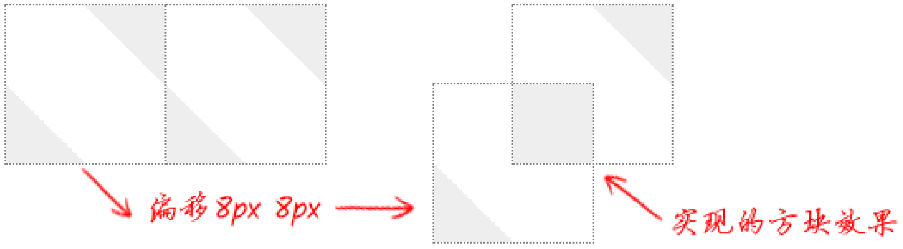

```css
.loading-ring {
  --mask: radial-gradient(closest-side, transparent 75%, black 76%);

  width: 100px;
  height: 100px;
  background: conic-gradient(deepskyblue, 30%, white);
  mask-image: var(--mask);
  border-radius: 50%;
  animation: spin 1s linear infinite reverse;
}

@keyframes spin {
  from {
    transform: rotate(0deg);
  }

  to {
    transform: rotate(360deg);
  }
}
```

#### Stretch Line

- background line
- border line
- pseudo element with `line-through` `text-decoration`

```css
.line {
  width: 70%;
  height: 10px;
  background-color: #000;
}

.line,
.line-background {
  background: linear-gradient(#000, #000) 50% / 70% 10px no-repeat;
}

.line,
.line-border {
  border-top: 10px solid #000;
}

.line,
.line::after {
  /* set thickness */
  font-size: 5em;

  /* hide content */
  color: transparent;
  text-decoration: line-through #000;

  /* control line length */
  content: '_______';
}
```

#### Dash Line

- Background dash line.
- Border dash line.
- Pseudo element with `dashed` `text-decoration`.

```css
.dash-background {
  background: linear-gradient(to left, #000 70%, transparent 0);
  background-repeat: repeat-x;
  background-size: 30px 10px;
}

.dash-border {
  border-top: 10px dashed #000;
}

.dash::after {
  text-decoration-style: dashed;
}
```

#### Menu Line

```css
.icon-menu {
  display: inline-block;
  width: 140px;
  height: 10px;

  /* Line gap */
  padding: 35px 0;

  /* Line 2 */
  background-color: currentcolor;
  background-clip: content-box;

  /* Line 1 */
  border-top: 10px solid;

  /* Line 3 */
  border-bottom: 10px solid;
}
```

#### Grid Line

```css
.grid-line {
  background-color: #fff;
  background-image: linear-gradient(var(--line-color) 1px, transparent 0),
    linear-gradient(90deg, var(--line-color) 1px, transparent 0);
  border-top: 1px solid #e5e8eb;
  border-bottom: 1px solid #e5e8eb;
  box-shadow: inset 0 15px 20px -15px #f6f7f9, inset -5px -15px 20px -15px
      #f6f7f9;
}
```

#### Dot

```css
.icon-dot {
  display: inline-block;
  width: 100px;
  height: 100px;

  /* Cycle gap */
  padding: 10px;

  /* Cycle shape */
  background-color: currentcolor;
  background-clip: content-box;

  /* Cycle ring */
  border: 10px solid;
  border-radius: 50%;
}
```

#### Circle

- `border` circle.
- `background` circle.
- `clip`/`clip-path` circle.
- Pseudo element circle.

```css
.circle-background {
  background-image: radial-gradient(#000 72%, transparent 0);
}

.circle-clip-path {
  clip-path: circle(50%);
}

.circle-border {
  overflow: hidden;
  border-radius: 50%;
}

.circle::after {
  font-size: 120vw;
  line-height: 0;
  content: '·';
}
```

#### Triangle

- `border` triangle.
- `background` triangle.
- `clip`/`clip-path` triangle.
- Pseudo element triangle.

```css
.triangle {
  background: linear-gradient(<deg>, #000 50%, transparent 0);
}

/* clip path */
.arrow-right {
  width: 20px;
  height: 32px;
  clip-path: polygon(0 0, 0 100%, 100% 50%);
  background-color: #e888a3;
}

/* transparent border */
.arrow-up {
  width: 0;
  height: 0;
  border-right: 16px solid transparent;
  border-bottom: 20px solid #8888e8;
  border-left: 16px solid transparent;
}

/* pseudo element + hidden overflow */
.arrow-down {
  position: relative;
  width: 40px;
  height: 40px;
  overflow: hidden;
}

.arrow-down::before {
  position: absolute;
  top: 0;
  left: 0;
  display: block;
  width: calc(40px / 1.41);
  height: calc(40px / 1.41);
  content: '';
  background: #f7df6c;
  transform: rotate(-45deg);
  transform-origin: 0 0;
}

/* HTML Entities */

/**
 * ◄ : &#9668;
 * ► : &#9658;
 * ▼ : &#9660;
 * ▲ : &#9650;
 */
.arrow::before {
  content: '&#9660';
}
```

#### Polygon

```ts
const polygon = (n = 3) => {
  const deg = (2 * Math.PI) / n;
  const points = [];

  for (let i = 0; i < n; ++i) {
    const theta = deg * i;
    const x = `${50 * Math.cos(theta) + 50}%`;
    const y = `${50 * Math.sin(theta) + 50}%`;
    points.push(`${x} ${y}`);
  }

  return `polygon(${points.join(',')})`;
};
```

```css
.polygon {
  clip-path: polygon(75% 0%, 100% 50%, 75% 100%, 0% 100%, 25% 50%, 0% 0%);
}
```

### Animation Effects

#### Animated Dots

```css
.dot {
  display: inline-block;
  height: 1em;
  overflow: hidden;
  line-height: 1;
  text-align: left;
  vertical-align: -0.25ex;
}

@media screen and (prefers-reduced-motion: no-preference) {
  .dot::before {
    animation: dot1 3s infinite step-start both;
  }
}

.dot::before {
  display: block;
  white-space: pre-wrap;
  content: '...\A..\A.';
}

@keyframes dot1 {
  33% {
    transform: translateY(-2em);
  }

  66% {
    transform: translateY(-1em);
  }
}
```

#### Hover Animation

- Hover button effects using [`background`](https://css-tricks.com/cool-hover-effects-using-background-properties).
- Hover button effects using [`text shadow`](https://css-tricks.com/cool-hover-effects-that-use-css-text-shadow).
- Hover button effects using [`clip` and `mask`](https://css-tricks.com/css-hover-effects-background-masks-3d).

#### Fade Animation

```css
@media screen and (prefers-reduced-motion: no-preference) {
  .enter,
  .leave {
    transition: opacity 0.5s;
  }
}

.before-enter,
.leave {
  opacity: 0;
}

.enter,
.before-leave {
  opacity: 1;
}
```

```ts
function enter(el, done) {
  el.classList.add('before-enter');

  setTimeout(() => {
    el.classList.remove('before-enter');
    el.classList.add('enter');
  }, 20);

  setTimeout(() => {
    el.classList.remove('enter');
    done();
  }, 500);
}

function leave(el, done) {
  el.classList.add('before-leave');

  setTimeout(() => {
    el.classList.remove('before-leave');
    el.classList.add('leave');
  }, 0);

  setTimeout(() => {
    el.classList.remove('leave');
    done();
  }, 500);
}
```

```css
@keyframes body-fade-in {
  from {
    opacity: 0;
  }

  to {
    opacity: 1;
  }
}

@media screen and (prefers-reduced-motion: reduce) {
  body {
    animation: none;
  }
}

body {
  animation-name: body-fade-in;
  animation-duration: 2.5s;
  animation-timing-function: ease;
  animation-iteration-count: 1;
}
```

#### Accordion Menu Animation

```css
@media screen and (prefers-reduced-motion: reduce) {
  .menu {
    transition: none;
  }
}

.menu {
  max-height: 0;
  overflow: hidden;
  transition: max-height, 0.3s;
}

.menu:focus-within,
.container:hover .menu {
  max-height: 1em;
}
```

#### Slides Animation

```css
.slide {
  width: 500%;
  overflow: hidden;
}

@keyframes slide {
  0% {
    margin-left: 0;
  }

  10% {
    margin-left: 0;
  }

  12% {
    margin-left: -100%;
  }

  22% {
    margin-left: -100%;
  }

  24% {
    margin-left: -200%;
  }

  34% {
    margin-left: -200%;
  }

  36% {
    margin-left: -300%;
  }

  46% {
    margin-left: -300%;
  }

  48% {
    margin-left: -400%;
  }

  58% {
    margin-left: -400%;
  }

  60% {
    margin-left: -300%;
  }

  70% {
    margin-left: -300%;
  }

  72% {
    margin-left: -200%;
  }

  82% {
    margin-left: -200%;
  }

  84% {
    margin-left: -100%;
  }

  94% {
    margin-left: -100%;
  }

  96% {
    margin-left: 0;
  }
}
```

#### Scale Up Animation

```css
@media screen and (prefers-reduced-motion: reduce) {
  .div {
    transition: none;
  }
}

.div {
  transition: transform 0.5s ease;
  transform: scaleX(0);
}

.div:hover,
.div:focus {
  transform: scaleX(1);
}
```

#### Clear Splash Animation

```css
.cube {
  backface-visibility: hidden;
  perspective: 1000;
  transform-style: preserve-3d;
  transform: translate3d(0, 0, 0);
}
```

#### Breath Animation

```css
.breath {
  animation: breath 7s infinite;
}

@keyframes breath {
  0%,
  100% {
    opacity: 0;
  }

  70% {
    opacity: 1;
  }
}
```

#### Clock Animation

```css
.clock-pendulum {
  transform-origin: top;
  animation: pendulum 1s infinite alternate ease-in-out;
}

@keyframes pendulum {
  0% {
    transform: rotate(-10deg);
  }

  100% {
    transform: rotate(10deg);
  }
}
```

### CSS Components Reference

- CSS [inspiration](https://github.com/chokcoco/CSS-Inspiration).
- Background patterns [gallery](https://github.com/LeaVerou/css3patterns).
- Pure CSS [icons](https://github.com/wentin/cssicon).

## CSS Reference

- MDN CSS value [formal syntax](https://developer.mozilla.org/docs/Web/CSS/Value_definition_syntax).
- CSS quick [reference](https://cssreference.io).
- CSS [houdini](https://developer.mozilla.org/docs/Web/CSS/CSS_Houdini).
- New CSS features in 2021: [Hover 2021](https://2021-hover-conf-new-in-css.netlify.app).
- New CSS features in 2022: [State of CSS 2022](https://web.dev/state-of-css-2022).
