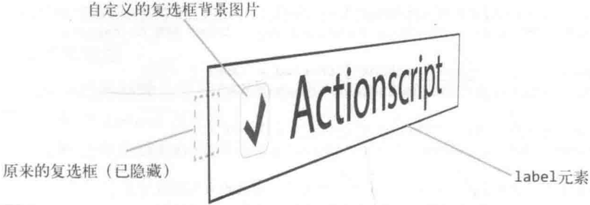
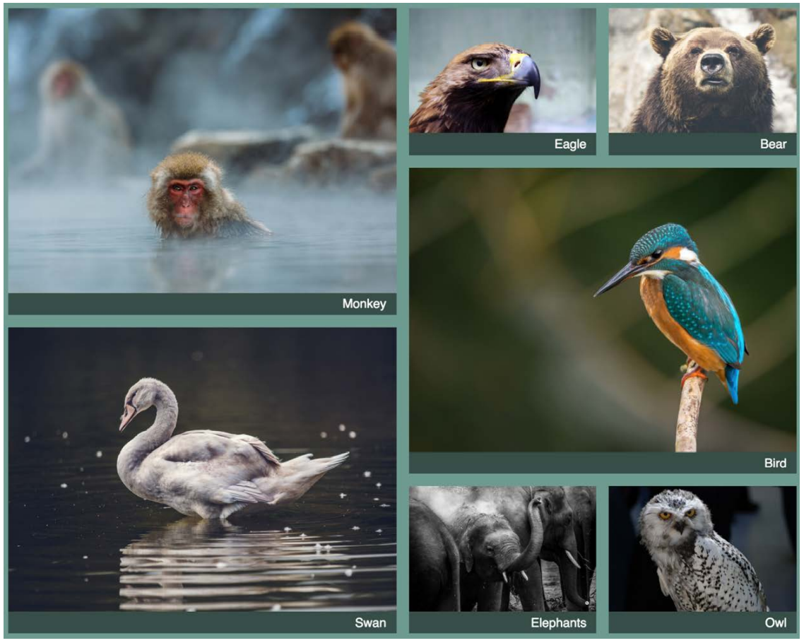
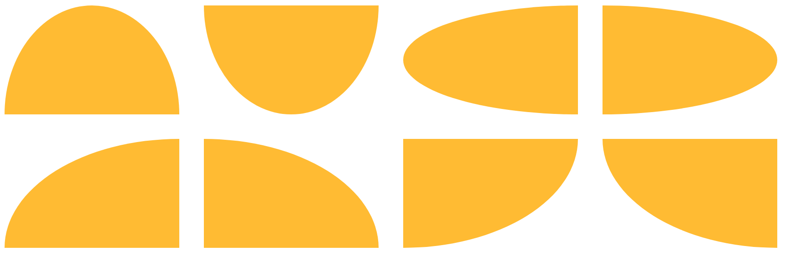

# CSS Components Notes

## Utilities

### Resizable Class

[Resizable `div`](https://codepen.io/ZeroX-DG/pen/vjdoYe):

```ts
// bottom-right:
new_width = element_original_width + (mouseX - original_mouseX);
new_height = element_original_height + (mouseY - original_mouseY);

// bottom-left:
new_width = element_original_width - (mouseX - original_mouseX);
new_height = element_original_height + (mouseY - original_mouseY);
new_x = element_original_x - (mouseX - original_mouseX);

// top-right:
new_width = element_original_width + (mouseX - original_mouseX);
new_height = element_original_height - (mouseY - original_mouseY);
new_y = element_original_y + (mouseY - original_mouseY);

// top-left:
new_width = element_original_width - (mouseX - original_mouseX);
new_height = element_original_height - (mouseY - original_mouseY);
new_x = element_original_x + (mouseX - original_mouseX);
new_y = element_original_y + (mouseY - original_mouseY);
```

### Hidden Class

- `display: none`: 元素不在 DOM 流.
- `visibility: hidden`: 元素在 DOM 流, 隐藏不可见, 不可触发事件.
- `opacity: 0`: 元素在 DOM 流, 透明度为 0, 可触发事件.

```css
.hidden-overflow {
  max-height: 0;
  overflow: hidden;
}

.hidden-opacity {
  position: absolute;
  filter: opacity(0%);
  opacity: 0;
}

.hidden-stacking {
  position: relative;
  z-index: -1;
}

.hidden-clip {
  position: absolute;
  clip: rect(0 0 0 0);
}

.hidden-visibility {
  position: absolute;
  visibility: hidden; /* visibility 具有继承性 */
}

.hidden-display {
  display: none;
}
```

## Typography

### Flexible Heading

```css
h1 {
  display: flex;
  align-items: center;
  width: 100%;
}

h1::before,
h1::after {
  flex: 1;
  height: 0.1em;
  margin: 0.2em;
  content: '';
  background-color: gray;
}
```

### Text Preset

```css
.text-primary {
  font-family: sans-serif;
  font-size: 12px;
  font-weight: 400;
  line-height: 100px;
  color: black;
  text-decoration: none;
  text-transform: uppercase;
  letter-spacing: 1.3px;
  font-display: swap;
}
```

## Landing Page

### Jumbotron Background Image

```css
h1 {
  background-image: url('bg.jpg');
  background-clip: text;
}

.jumbotron {
  min-height: 100%;
  background-image: url('');
  background-repeat: no-repeat;
  background-position: center center;
  background-size: cover;
  opacity: 0.8;
}
```

### Muted Video

```css
.fullscreen-video {
  position: absolute;
  top: 0;
  left: 0;
  z-index: -100;
  width: 100%;
  height: 100vh;
  overflow: hidden;
  background-size: cover;
}

.fullscreen-video video {
  min-width: 100%;
  min-height: 100%;
}
```

### Parallax Effect

```css
.parallax {
  min-height: 60%; /* key */
  background-image: url('./images/bg.jpg');
  background-repeat: no-repeat;
  background-attachment: fixed; /* key */
  background-position: center;
  background-size: cover;
}
```

### Search Light Effect

```css
:root::before {
  position: fixed;
  z-index: 1000;
  display: block;
  width: 100%;
  height: 100%;
  pointer-events: none;
  content: '';
  background: radial-gradient(
    circle 16vmax at var(--cursor-x) var(--cursor-y),
    rgb(0 0 0 / 0%) 0%,
    rgb(0 0 0 / 50%) 80%,
    rgb(0 0 0 / 80%) 100%
  );
}
```

## Navigation

### Float Navigation

- `list-style-type`: 改变 `ul`/`ol` 前标记类型.
- `list-style-image`: 改变 `ul`/`ol` 前标记类型.
- 设置 `<a href="#">` 样式.

```css
ul {
  /* 垂直菜单设置宽度, 水平菜单不设置宽度 */
  list-style: none;
}

/* 水平菜单 */
li {
  float: left;
}

a {
  display: inline-block;
  text-decoration: none;
  cursor: pointer;
}
```

### Inline Block Navigation

```css
ul {
  text-align: right;
}

li {
  display: inline-block;
}
```

### Dropdown Navigation

```css
.anchor {
  display: none;
}

.content {
  max-height: 0;
  overflow: hidden;
  opacity: 0;
  transition: max-height 0.3s, opacity 0.3s;
}

.anchor:target ~ .content {
  max-height: 100%;
  opacity: 1;
}
```

### Tab Navigation

```css
.tab > a {
  position: relative;
  display: inline-block;
  padding: 0.3em 1em 0;
}

.tab > a::before {
  position: absolute;
  top: 0;
  right: 0;
  bottom: 0;
  left: 0;
  z-index: -1;
  background: #ccc;
  background-image: linear-gradient(
    hsl(0deg 0% 100% / 60%),
    hsl(0deg 0% 100% / 0%)
  );
  border: 1px solid rgb(0 0 0 / 40%);
  border-bottom: none;
  border-radius: 0.5em 0.5em 0 0;
  box-shadow: 0 0.15em white inset;
  transform: perspective(0.5em) rotateX(5deg);
  transform-origin: bottom;
}
```

## Footer

### Sticky Footer

- 如果页面内容不足够长时, 页脚固定在浏览器窗口的底部.
- 如果内容足够长时, 页脚固定在页面的最底部.

#### Negative Margin Sticky Footer

Negative bottom `margin` content-wrapper with **fixed `height`** footer:

```html
<body>
  <main class="wrapper">
    content
    <div class="push"></div>
  </main>
  <footer class="footer"></footer>
</body>

<style>
  html,
  body {
    height: 100%;
    margin: 0;
  }

  .wrapper {
    min-height: 100%;

    /* Equal to height of footer */

    /* But also accounting for potential margin-bottom of last child */
    margin-bottom: -50px;
  }

  .footer,
  .push {
    height: 50px;
  }
</style>
```

Negative top `margin` on **fixed `height`** footer:

```html
<body>
  <main class="content">
    <section class="content-inside">content</section>
  </main>
  <footer class="footer"></footer>
</body>

<style>
  html,
  body {
    height: 100%;
    margin: 0;
  }

  .content {
    min-height: 100%;
  }

  .content-inside {
    padding: 20px;
    padding-bottom: 50px;
  }

  .footer {
    height: 50px;
    margin-top: -50px;
  }
</style>
```

#### Calculation Sticky Footer

`calc` on **fixed height** footer:

```html
<body>
  <main class="content">content</main>
  <footer class="footer"></footer>
</body>

<style>
  .content {
    min-height: calc(100vh - 70px);
  }

  .footer {
    height: 50px;
  }
</style>
```

#### Flex Sticky Footer

Use `flex` on `body`:

```html
<body>
  <main class="content">content</main>
  <footer class="footer"></footer>
</body>

<style>
  html,
  body {
    height: 100%;
  }

  body {
    display: flex;
    flex-direction: column;
    min-height: 100vh;
  }

  .content {
    flex: 1 0 auto;
  }

  .footer {
    flex-shrink: 0;
  }
</style>
```

#### Grid Sticky Footer

Use `grid` on `body`:

```html
<body>
  <main class="content">content</main>
  <footer class="footer"></footer>
</body>

<style>
  html {
    height: 100%;
  }

  body {
    display: grid;
    grid-template-rows: 1fr auto;
    min-height: 100%;
  }

  .footer {
    grid-row: 2 / 3;
  }
</style>
```

Use `gird` with `min-content`:

```html
<body>
  <div class="grid">
    <header>
      <!-- ... -->
    </header>
    <main>
      <!-- ... -->
    </div>
    <footer>
      <!-- ... -->
    </footer>
  </div>
</body>

<style>
  .grid {
    display: grid;
    grid-template-rows: min-content auto min-content;
    height: 100vh;
  }
</style>
```

## Link

### Hidden Link

```css
a {
  text-decoration: none;
  pointer-events: none;
  cursor: default;
  opacity: 0;
}
```

### Animated Link

Change bottom border:

```css
a {
  position: relative;
  padding-bottom: 5px;
  color: #008080;
  text-decoration: none;
}

a::after {
  position: absolute;
  bottom: 0;
  left: 0;
  width: 0;
  height: 3px;
  content: '';
  background-color: #22313f;
  transform-origin: bottom-center;
}

a:hover,
a:focus {
  color: #22313f;
}

a:hover::after,
a:focus::after {
  width: 100%;
}
```

### GitHub Link

<!-- markdownlint-disable line-length -->

```html
<a
  href="https://github.com/Trevald/WhatTheTag.com"
  class="github-corner"
  aria-label="View source on GitHub"
>
  <svg
    width="80"
    height="80"
    viewBox="0 0 250 250"
    style="position: absolute; top: 0; right: 0; color: #2d3748; border: 0; fill: #718096;"
    aria-hidden="true"
  >
    <path d="M0,0 L115,115 L130,115 L142,142 L250,250 L250,0 Z" />
    <path
      d="M128.3,109.0 C113.8,99.7 119.0,89.6 119.0,89.6 C122.0,82.7 120.5,78.6 120.5,78.6 C119.2,72.0 123.4,76.3 123.4,76.3 C127.3,80.9 125.5,87.3 125.5,87.3 C122.9,97.6 130.6,101.9 134.4,103.2"
      fill="currentColor"
      style="transform-origin: 130px 106px;"
      class="octo-arm"
    />
    <path
      d="M115.0,115.0 C114.9,115.1 118.7,116.5 119.8,115.4 L133.7,101.6 C136.9,99.2 139.9,98.4 142.2,98.6 C133.8,88.0 127.5,74.4 143.8,58.0 C148.5,53.4 154.0,51.2 159.7,51.0 C160.3,49.4 163.2,43.6 171.4,40.1 C171.4,40.1 176.1,42.5 178.8,56.2 C183.1,58.6 187.2,61.8 190.9,65.4 C194.5,69.0 197.7,73.2 200.1,77.6 C213.8,80.2 216.3,84.9 216.3,84.9 C212.7,93.1 206.9,96.0 205.4,96.6 C205.1,102.4 203.0,107.8 198.3,112.5 C181.9,128.9 168.3,122.5 157.7,114.1 C157.9,116.9 156.7,120.9 152.7,124.9 L141.0,136.5 C139.8,137.7 141.6,141.9 141.8,141.8 Z"
      fill="currentColor"
      class="octo-body"
    />
  </svg>
</a>
```

<!-- markdownlint-enable line-length -->

```css
.github-corner:focus .octo-arm,
.github-corner:hover .octo-arm {
  animation: none;
}

@media (prefers-reduced-motion: no-preference) {
  .github-corner:focus .octo-arm,
  .github-corner:hover .octo-arm {
    animation: octocat-wave 560ms ease-in-out;
  }
}

@keyframes octocat-wave {
  0%,
  100% {
    transform: rotate(0);
  }

  20%,
  60% {
    transform: rotate(-25deg);
  }

  40%,
  80% {
    transform: rotate(10deg);
  }
}
```

## Button

### Link Button

```css
a.btn-custom {
  padding: 10px 40px;
  line-height: 100px;
  text-align: center;
  background-color: #000;
  border-radius: 0;
}
```

### Gradient Button

#### Linear Gradient Button

```css
.btn {
  display: inline-block;
  padding: 5px;
  color: #333;
  text-decoration: none;
  background-image: linear-gradient(to top, #333 50%, #fff 50%);
  background-size: 100% 200%;
  transition: all 0.3s;
}

.btn:hover,
.btn:focus {
  color: #fff;
  background-position: 0 100%;
}
```

```css
.btn-1 {
  background-image: linear-gradient(
    to right,
    #f6d365 0%,
    #fda085 51%,
    #f6d365 100%
  );
}

.btn-2 {
  background-image: linear-gradient(
    to right,
    #fbc2eb 0%,
    #a6c1ee 51%,
    #fbc2eb 100%
  );
}

.btn-3 {
  background-image: linear-gradient(
    to right,
    #84fab0 0%,
    #8fd3f4 51%,
    #84fab0 100%
  );
}

.btn-4 {
  background-image: linear-gradient(
    to right,
    #a1c4fd 0%,
    #c2e9fb 51%,
    #a1c4fd 100%
  );
}

.btn-5 {
  background-image: linear-gradient(
    to right,
    #ffecd2 0%,
    #fcb69f 51%,
    #ffecd2 100%
  );
}

.btn:hover,
.btn:focus {
  background-position: right center; /* change the direction of the change here */
}
```

#### Radial Gradient Button

```css
.ripple-button {
  color: #fff;
  background-color: #2a80eb;
}

.ripple-button:active {
  background-image: radial-gradient(
    160% 100% at 50% 0%,
    hsl(0deg 0% 100% / 30%) 50%,
    hsl(0deg 0% 100% / 0%) 52%
  );
}

.colorful-button {
  color: #fff;
  background-color: #2a80eb;
  background-image: radial-gradient(
      farthest-side at bottom left,
      rgb(255 0 255/ 50%),
      transparent
    ), radial-gradient(farthest-corner at bottom right, rgb(255 255 50/ 50%), transparent);
}
```

### 3D Shadow Button

```css
.shadow-3d-button {
  width: 100px;
  height: 36px;
  background-color: #f0f3f9;
  border: 1px solid #a0b3d6;
  box-shadow: 1px 1px #afc4ea, 2px 2px #afc4ea, 3px 3px #afc4ea;
}

.shadow-3d-button:active {
  box-shadow: 1px 1px #afc4ea, 2px 2px #afc4ea;
  transform: translate(1px, 1px);
}
```

## Table

- `margin-left: auto` to align-left.
- `border: 0` and `border-collapse: collapse` to remove border line.
- `table-layout: fixed` to contain cells with same width.
- Implement filter or pagination with `display: none` applied to `<tr>`.

```css
th,
td {
  padding: 12px 15px;
  text-align: left;
  border-bottom: 1px solid #e1e1e1;
}

th:first-child,
td:first-child {
  padding-left: 0;
}

th:last-child,
td:last-child {
  padding-right: 0;
}
```

## Form

[Form Design Pattern](https://adamsilver.io/articles/form-design-from-zero-to-hero-all-in-one-blog-post):

- 由于表单组件多为 `Replaced Element`, 通过 CSS 控制样式存在困难,
  一般利用 `label`/`span` 代替 `input` 的方式,
  对 `label` 与 `span` 进行[核心样式控制](https://developer.mozilla.org/docs/Web/CSS/Pseudo-classes#user_action_pseudo-classes),
  对 `input` 进行[辅助样式控制](https://developer.mozilla.org/docs/Web/CSS/Pseudo-classes#the_input_pseudo-classes):
  - `:disabled`.
  - `:checked`.
  - `:focus-visible`.
  - `:focus:not(:focus-visible)`.
  - `:active:not(:disabled)`.
  - `:indeterminate`.
- 隐藏 `input`, 用 `label` 模拟时, 需要注意表单元素的键盘可访问性:
  - 保持键盘访问:
    不应使用 `display: none`/`visibility: hidden` 隐藏 `input` (无法键盘访问),
    应使用 `[type="checkbox"] { position: absolute; clip: rect(0 0 0 0); }`.
  - 修饰键盘访问:
    应添加 `:focus`/`:focus-visible` 伪类样式,
    `input:focus ~ label { outline: 1px solid red; border: 1px solid red; }`.

```css
[type='radio'] {
  position: absolute;
  width: 1rem;
  height: 1rem;
  cursor: pointer;
  opacity: 0;
}

.radio-label {
  background-color: var(--color-transparent);
  border-color: var(--color-dark);
  border-radius: 999px;
}

:disabled ~ .radio-label {
  border-color: var(--color-ghost);
}

:checked ~ .radio-label {
  background-color: var(--color-primary);
  border-color: var(--color-primary);
}

:focus-visible ~ .radio-label {
  outline: 1px solid var(--color-primary);
}

:focus:not(:focus-visible) ~ .radio-label {
  border-color: var(--color-primary);
  outline: none;
}

:active:not(:disabled) ~ .radio-label {
  transform: scale(1.1);
}
```

[](https://css-tricks.com/html-inputs-and-labels-a-love-story)

### Reset Form Styles

```css
input[type='email'],
input[type='number'],
input[type='search'],
input[type='text'],
input[type='tel'],
input[type='url'],
input[type='password'],
textarea,
select {
  box-sizing: border-box;
  height: 38px;
  padding: 6px 10px;
  background-color: #fff;
  border: 1px solid #d1d1d1;
  border-radius: 4px;
  box-shadow: none;
}

/* Removes awkward default styles on some inputs for iOS */
input[type='email'],
input[type='number'],
input[type='search'],
input[type='text'],
input[type='tel'],
input[type='url'],
input[type='password'],
textarea {
  appearance: none;
}

textarea {
  min-height: 65px;
  padding-top: 6px;
  padding-bottom: 6px;
}

input[type='email']:focus,
input[type='number']:focus,
input[type='search']:focus,
input[type='text']:focus,
input[type='tel']:focus,
input[type='url']:focus,
input[type='password']:focus,
textarea:focus,
select:focus {
  /* Custom border color */
  border: 1px solid #33c3f0;

  /* Key point: remove default outline */
  outline: 2px solid transparent;
  outline-offset: 2px;
}

label,
legend {
  display: block;
  padding: 0;
  margin-bottom: 0.5rem;
  font-weight: bold;
}

fieldset {
  min-width: 0;
  padding: 0;
  margin: 0;
  border-width: 0;
}

input[type='checkbox'],
input[type='radio'] {
  display: inline;
}

label > .label-body {
  display: inline-block;
  margin-left: 0.5rem;
  font-weight: normal;
}
```

### Custom Form Button

隐藏 `<input>`, 添加样式至 `<label>`/`<span>`:

```html
<input id="submit" type="submit" />
<label class="btn" for="submit">Submit</label>

<style>
  [type='submit'] {
    position: absolute;
    clip: rect(0 0 0 0);
  }

  .btn {
    display: inline-block;
    padding: 2px 12px;
    font-size: 14px;
    color: #fff;
    cursor: pointer;
    background-color: #cd0000;
  }

  :focus + label.btn {
    outline: 1px dotted var(--highlight);
  }
</style>
```

### Custom Form Checkbox

Input itself as border shape,
pseudo elements as center shape (checked transform animation):

```css
input[type='checkbox'] + label::before {
  position: relative;
  display: inline-block;
  width: 20px;
  height: 20px;
  margin-right: 10px;
  content: '';
  background: white;
}

input[type='checkbox']:checked + label::before {
  background: #5ac5c9;
}

input[type='checkbox']:checked + label::after {
  position: absolute;
  top: 3px;
  left: 27px;
  width: 13px;
  height: 6px;
  content: '';
  border-bottom: 2px solid black;
  border-left: 2px solid black;
  transform: rotate(-45deg);
}

input[type='checkbox']:focus + label::before {
  outline: #5d9dd5 solid 1px;
  box-shadow: 0 0 8px #5e9ed6;
}

input[type='checkbox']:disabled + label {
  color: #575757;
}

input[type='checkbox']:disabled + label::before {
  background: #ddd;
}
```

### Custom Form Switch

Pseudo element switch from circle to circle:

- thumb-size: 2rem.
- track-width: `2 * thumb-size`.
- track-height: thumb-size.
- pseudo-element border-radius: 50%.
- track border-radius: track-size.
- checked transform:
  track `background-color`,
  pseudo element `translateX`.

```css
.gui-switch > input {
  appearance: none;
  display: grid;
  flex-shrink: 0;
  grid: [track] 1fr / [track] 1fr;
  align-items: center;
  inline-size: var(--track-size);
  block-size: var(--thumb-size);
  padding: var(--track-padding);
  border-radius: var(--track-size);
}

.gui-switch > input::before {
  grid-area: track;
  content: '';
  inline-size: var(--thumb-size);
  block-size: var(--thumb-size);
}
```

### Custom Form Select

```css
.custom-select {
  width: 15%;
  height: 35px;
  margin-right: 20px;

  /* 文本属性 */
  text-align: center;
  text-align-last: center;

  /* 消除默认箭头 */
  text-indent: 0.01px;
  text-overflow: '';

  /* 将箭头图片移至右端 */
  background: url('images/arrow.png') no-repeat;
  background-color: #fff;
  background-position: right;

  /* 自定义边框 */
  border: 0;

  /* 消除默认样式 */
  appearance: none;
}

.custom-select:focus {
  border: 1px solid #e74f4d;
}

.custom-select option {
  width: 100%;
  height: 25px;
  padding-left: 30px;
  line-height: 25px;
  color: #323333;
  background-color: #fff;
  direction: rtl;
}

.custom-select option:hover,
.custom-select option:focus {
  color: #fff;
  background: url('./img/tick.png') no-repeat 8px center;
  background-color: #e74f4d;
}
```

## Modal

### Overlay Modal

```css
.overlay {
  position: fixed;
  width: 100%;
  height: 100%;
  background: rgb(0 0 0 / 50%);
}
```

### Box Shadow Modal

```css
.modal {
  box-shadow: 0 0 0 50vmax rgb(0 0 0 / 80%);
}
```

### Dialog Modal

```html
<div class="container">
  <div class="dialog">
    <div class="content">内容占位</div>
  </div>
</div>
```

```css
.container {
  position: fixed;
  top: 0;
  right: 0;
  bottom: 0;
  left: 0;
  z-index: 99;
  text-align: center;
  white-space: nowrap;

  /* for IE8 */
  background: url('data:image/png;base64,iVB...g==');

  /* for IE9+ */
  background: rgb(0 0 0 / 50%), none;
}

.container::after {
  display: inline-block;
  height: 100%;
  vertical-align: middle;
  content: '';
}

.dialog {
  display: inline-block;
  text-align: left;
  white-space: normal;
  vertical-align: middle;
  background-color: #fff;
  border-radius: 6px;
}
```

### Clip Modal

图片剪裁的矩形镂空效果:

```css
.crop {
  overflow: hidden;
}

.crop > .crop-area {
  width: 80px;
  height: 80px;
  cursor: move;
  outline: 256px solid rgb(0 0 0 / 50%);
}
```

## Scroll Progress Indicator

```css
body {
  position: relative;
}

.indicator {
  position: absolute;
  top: 0;
  right: 0;
  bottom: 0;
  left: 0;
  z-index: 1;
  pointer-events: none;
  background: linear-gradient(to right top, teal 50%, transparent 50%) no-repeat;
  background-size: 100% calc(100% - 100vh);
  mix-blend-mode: darken;
}

/* use after element to hidden triangle background gradient */

/* only show 5px background */
.indicator::after {
  position: fixed;
  top: 5px;
  right: 0;
  bottom: 0;
  left: 0;
  z-index: 1;
  content: '';
  background: #fff;
}
```

## Slides

**锚点定位**本质上改变了 `scrollTop` 或 `scrollLeft` 值,
即使容器设置 `overflow: hidden` 也会发生滚动,
可以利用**锚点定位**实现 CSS-only slides:

- `position: absolute` to stack slides up.
- `id` + `:target` for style current slide (change z-index).
- Add animation to slide change: (prev, current, next)
  `.slide`, `.slide:target`, `.slide:target ~ slide`.
- Add `overflow: hidden` to container when animation.

```html
<main>
  <section class="slide" id="slide1">
    <a class="slide-link" href="#slide2">next</a>
  </section>
  <section class="slide" id="slide2">
    <a class="slide-link" href="#slide1">prev</a>
    <a class="slide-link" href="#slide3">next</a>
  </section>
  <section class="slide" id="slide3">
    <a class="slide-link" href="#slide2">prev</a>
    <a class="slide-link" href="#slide4">next</a>
  </section>
  <section class="slide" id="slide4">
    <a class="slide-link" href="#slide3">prev</a>
    <a class="slide-link" href="#slide5">next</a>
  </section>
  <section class="slide" id="slide5">
    <a class="slide-link" href="#slide4">prev</a>
  </section>
</main>
```

```css
body {
  overflow: hidden; /* key 1 */
}

.slide {
  position: absolute; /* key 2 */
  z-index: 0; /* key 3 */
  box-sizing: border-box;
  width: 100%;
  height: 100vh;
}

.slide:target {
  z-index: 1; /* key 4 */
}
```

```css
/* Rotate Fade-In Animation */
@media only screen and (prefers-reduced-motion: reduce) {
  .slide {
    transition: none;
  }
}

.slide {
  z-index: 0;
  transition: transform 1s, opacity 0.8s;
  transform: rotate(90deg);
  transform-origin: 0 0;
}

.slide:target {
  z-index: 1;
  transform: rotate(0deg);
}

.slide:target ~ section {
  opacity: 0;
  transform: rotate(-90deg);
}
```

当两个 `width: 100%` slide 同时处于同一水平位置,
添加左进/右进动画, 当 slide 向右滑动时,
水平的 scrollX 会直接滑到最右边,
导致幻灯片浏览异常.
[解决办法](https://github.com/sabertazimi/hust-web/blob/master/css/target-slide/index.js)
如下:

```ts
const resetScrollX = () => {
  window.scrollTo(0, 0);
};
```

## Gallery

```css
.gallery {
  display: grid;
  grid-template-columns: repeat(auto-fill, minmax(200px, 1fr));
  grid-auto-rows: 1fr;
  grid-auto-flow: dense;
  grid-gap: 1em;
}

.gallery .featured {
  grid-row: span 2;
  grid-column: span 2;
}

.gallery figure {
  display: flex;
  flex-direction: column;
  margin: 0;
}

.gallery img {
  flex: 1;
  object-fit: cover;
  max-width: 100%;
}
```



## Timeline and Steps

Use pseudo elements to construct circle and line:

```css
/* The separator line */
.c-timeline-item:not(:last-child) .c-timeline-content::before {
  position: absolute;
  top: 0;
  right: 100%;
  width: 2px;
  height: 100%;
  content: '';
  background-color: #d3d3d3;
}

/* The circle */
.c-timeline-content::after {
  position: absolute;
  top: 0;
  left: -12px;
  z-index: 1;
  width: 20px;
  height: 20px;
  content: '';
  background-color: #fff;
  border: 2px solid #d3d3d3;
  border-radius: 50%;
}
```

## Geometry and Shape

### Pseudo Element Shape

[利用伪类画额外图形](https://css-tricks.com/examples/ShapesOfCSS):

```css
.first-details-intro::after {
  position: absolute;
  top: 50%;
  right: 0;
  width: 0;
  height: 0;
  content: '';
  border-top: 15px solid transparent;
  border-right: 25px solid #fff;
  border-bottom: 15px solid transparent;
}
```

### Border Shape

#### Horizontal and Vertical Border

Separate set horizontal and vertical radius to make well-designed shapes:

```css
.avatar-shape {
  border-radius: 70% 30% 30% 70% / 60% 40% 60% 40%;
}

.avatar {
  width: 100px;
  height: 100px;
  border: solid deepskyblue;
  border-radius: 50%;
  object-fit: cover;
  animation: morph 6s paused linear;
}

@keyframes morph {
  0% {
    border-radius: 40% 60% 60% 40% / 60% 30% 70% 40%;
    transform: rotate(-5deg);
  }

  100% {
    border-radius: 40% 60%;
    transform: rotate(5deg);
  }
}

.avatar:nth-child(4n) {
  animation-delay: -3.5s;
}

.avatar:nth-child(2n + 1) {
  animation-delay: -1s;
}

.avatar:nth-child(3n + 2) {
  animation-delay: -2s;
}

.avatar:nth-child(5n + 3) {
  animation-delay: -3s;
}

.avatar:nth-child(7n + 5) {
  animation-delay: -4s;
}

.avatar:nth-child(11n + 7) {
  animation-delay: -5s;
}
```

#### Transparent Border

Mix `transparent` with non-`transparent` border to make shapes (e.g. triangle):

```css
.arrow-up {
  width: 0;
  height: 0;
  border-right: 16px solid transparent;
  border-bottom: 20px solid #8888e8;
  border-left: 16px solid transparent;
}

.arrow-right {
  width: 0;
  height: 0;
  border-top: 16px solid transparent;
  border-bottom: 16px solid transparent;
  border-left: 20px solid #e888a3;
}

.arrow-down {
  width: 0;
  height: 0;
  border-top: 20px solid #f7df6c;
  border-right: 16px solid transparent;
  border-left: 16px solid transparent;
}

.arrow-left {
  width: 0;
  height: 0;
  border-top: 16px solid transparent;
  border-right: 20px solid #8de698;
  border-bottom: 16px solid transparent;
}
```

### Background Shape

```css
.btn-add,
.btn-sub {
  width: 1.5rem;
  height: 1.5rem;
  color: dimgray;
  background: linear-gradient(currentcolor, currentcolor) no-repeat center / 0.875em
      2px, linear-gradient(currentcolor, currentcolor) no-repeat center / 2px 0.875em;
  border: 1px solid gray;
}

.btn-sub {
  background-size: 0.875em 2px, 0;
}
```

```css
.square {
  width: 304px;
  height: 160px;
  background-color: #fff;
  background-image: linear-gradient(
      45deg,
      #eee 25%,
      transparent 25%,
      transparent 75%,
      #eee 75%
    ), linear-gradient(45deg, #eee 25%, transparent 25%, transparent 75%, #eee
        75%);
  background-position: 0 0, 8px 8px;
  background-size: 16px 16px;
}
```


### Stretch Line

- `background` line.
- `border` line.
- Pseudo element with `line-through` `text-decoration`.

```css
.line {
  width: 70%;
  height: 10px;
  background-color: #000;
}

.line,
.line-background {
  background: linear-gradient(#000, #000) 50% / 70% 10px no-repeat;
}

.line,
.line-border {
  border-top: 10px solid #000;
}

.line,
.line::after {
  /* set thickness */
  font-size: 5em;

  /* hide content */
  color: transparent;
  text-decoration: line-through #000;

  /* control line length */
  content: '_______';
}
```

### Dash Line

- `background` dash line.
- `border` dash line.
- Pseudo element with `dashed` `text-decoration`.

```css
.dash-background {
  background: linear-gradient(to left, #000 70%, transparent 0);
  background-repeat: repeat-x;
  background-size: 30px 10px;
}

.dash-border {
  border-top: 10px dashed #000;
}

.dash::after {
  text-decoration-style: dashed;
}
```

### Menu Line

```css
.icon-menu {
  display: inline-block;
  width: 140px;
  height: 10px;

  /* Line gap */
  padding: 35px 0;

  /* Line 2 */
  background-color: currentcolor;
  background-clip: content-box;

  /* Line 1 */
  border-top: 10px solid;

  /* Line 3 */
  border-bottom: 10px solid;
}
```

### Grid Line

- `background-image` for line color,
- `background-size` for line gap.

```css
.grid-line {
  background-color: #fff;
  background-image: linear-gradient(var(--line-color) 1px, transparent 0),
    linear-gradient(90deg, var(--line-color) 1px, transparent 0);
  background-size: 10px 10px;
  border-top: 1px solid #e5e8eb;
  border-bottom: 1px solid #e5e8eb;
  box-shadow: inset 0 15px 20px -15px #f6f7f9, inset -5px -15px 20px -15px
      #f6f7f9;
}

/**
 * @see {@link play.csssecrets.io/blueprint}
 */
.nest-grid-line {
  background: #58a;
  background-image: linear-gradient(
      var(--primary-line-color) 2px,
      transparent 0
    ), linear-gradient(90deg, var(--primary-line-color) 2px, transparent 0),
    linear-gradient(var(--secondary-line-color) 1px, transparent 0),
    linear-gradient(90deg, var(--secondary-line-color) 1px, transparent 0);
  background-size: 75px 75px, 75px 75px, 15px 15px, 15px 15px;
}
```

### Spinner

Background gradient [loading spinner](https://css-tricks.com/single-element-loaders-the-spinner):

```css
.loading-ring {
  --mask: radial-gradient(closest-side, transparent 75%, black 76%);

  width: 100px;
  height: 100px;
  background: conic-gradient(deepskyblue, 30%, white);
  mask-image: var(--mask);
  border-radius: 50%;
  animation: spin 1s linear infinite reverse;
}

@keyframes spin {
  from {
    transform: rotate(0deg);
  }

  to {
    transform: rotate(360deg);
  }
}
```

### Dot

#### Border Dot

`background` and `border` dot:

```css
.icon-dot {
  display: inline-block;
  width: 100px;
  height: 100px;

  /* Cycle gap */
  padding: 10px;

  /* Cycle shape */
  background-color: currentcolor;
  background-clip: content-box;

  /* Cycle ring */
  border: 10px solid;
  border-radius: 50%;
}
```

#### Gradient Dot

`radial-gradient` dot:

```css
/**
 * @see {@link play.csssecrets.io/polka}
 */
.dot {
  background: #655;
  background-image: radial-gradient(tan 30%, transparent 0);
  background-size: 30px 30px;
}
```

### Circle

- `background` circle.
- `border` circle.
- `clip-path` circle.
- Pseudo element circle.

```css
.circle-background {
  background-image: radial-gradient(#000 72%, transparent 0);
}

.circle-background-corner {
  background: #58a;
  background: radial-gradient(circle at top left, transparent 15px, #58a 0) top left,
    radial-gradient(circle at top right, transparent 15px, #58a 0) top right,
    radial-gradient(circle at bottom right, transparent 15px, #58a 0) bottom right,
    radial-gradient(circle at bottom left, transparent 15px, #58a 0) bottom left;
  background-repeat: no-repeat;
  background-size: 50% 50%;
}

.circle-border {
  overflow: hidden;
  border-radius: 50%;
}

.circle-clip-path {
  clip-path: circle(50%);
}

.circle::after {
  font-size: 120vw;
  line-height: 0;
  content: '·';
}
```

### Ellipse

```css
/**
 * @see {@link play.csssecrets.io/half-ellipse}
 * @see {@link play.csssecrets.io/quarter-ellipse}
 */
.ellipse {
  border-radius: 50% / 50%;
  border-radius: 50% / 100% 100% 0 0;
  border-radius: 50% / 0 0 100% 100%;
  border-radius: 100% 0 0 100% / 50%;
  border-radius: 0 100% 100% 0 / 50%;
  border-radius: 100% 0 0;
  border-radius: 0 100% 0 0;
  border-radius: 0 0 100%;
  border-radius: 0 0 0 100%;
}
```

]

### Triangle

- `background` triangle.
- `border` triangle.
- `clip-path` triangle.
- Pseudo element triangle.

```css
.triangle {
  background: linear-gradient(45deg, #000 50%, transparent 0);
}

/* transparent border */
.arrow-up {
  width: 0;
  height: 0;
  border-right: 16px solid transparent;
  border-bottom: 20px solid #8888e8;
  border-left: 16px solid transparent;
}

/* clip path */
.arrow-right {
  width: 20px;
  height: 32px;
  clip-path: polygon(0 0, 0 100%, 100% 50%);
  background-color: #e888a3;
}

/* pseudo element + hidden overflow */
.arrow-down {
  position: relative;
  width: 40px;
  height: 40px;
  overflow: hidden;
}

.arrow-down::before {
  position: absolute;
  top: 0;
  left: 0;
  display: block;
  width: calc(40px / 1.41);
  height: calc(40px / 1.41);
  content: '';
  background: #f7df6c;
  transform: rotate(-45deg);
  transform-origin: 0 0;
}

/**
 * pseudo element + HTML5 entities:
 * ◄ : &#9668;
 * ► : &#9658;
 * ▼ : &#9660;
 * ▲ : &#9650;
 */
.arrow::before {
  content: '&#9660';
}
```

```css
/**
 * @see {@link play.csssecrets.io/folded-corner-realistic}
 */
.note {
  position: relative;
  background: #58a; /* 回退样式 */
  background: linear-gradient(-150deg, transparent 1.5em, #58a 0);
}

.note::before {
  position: absolute;
  top: 0;
  right: 0;
  width: 1.73em;
  height: 3em;
  content: '';
  background: linear-gradient(
      to left bottom,
      transparent 50%,
      rgb(0 0 0 / 20%) 0,
      rgb(0 0 0 / 40%)
    ) 100% 0 no-repeat;
  transform: translateY(-1.3em) rotate(-30deg);
  transform-origin: bottom right;
}
```

### Square

Background gradient square shape:

```css
.checkerboard-linear-gradient {
  background: #eee;
  background-image: linear-gradient(
      45deg,
      rgb(0 0 0 / 25%) 25%,
      transparent 0 75%,
      rgb(0 0 0 / 25%) 0
    ), linear-gradient(45deg, rgb(0 0 0 / 25%) 25%, transparent 0 75%, rgb(
          0 0 0 / 25%
        ) 0);
  background-position: 0 0, 15px 15px;
  background-size: 30px 30px;
}

.checkerboard-conic-gradient {
  background: repeating-conic-gradient(#bbb 0, #bbb 25%, #eee 0, #eee 50%);
  background-size: 30px 30px;
}
```

### Polygon

#### Gradient Polygon

Background gradient polygon:

```css
/**
 * @see {@link play.csssecrets.io/bevel-corners-gradients}
 */
.polygon-background-corner {
  background: #58a;
  background: linear-gradient(135deg, transparent 15px, #58a 0) top left, linear-gradient(
        -135deg,
        transparent 15px,
        #58a 0
      ) top right,
    linear-gradient(-45deg, transparent 15px, #58a 0) bottom right, linear-gradient(
        45deg,
        transparent 15px,
        #58a 0
      ) bottom left;
  background-repeat: no-repeat;
  background-size: 50% 50%;
}
```

#### Clip Path Polygon

`clip-path` polygon:

```css
.polygon {
  /* 菱形 */
  clip-path: polygon(50% 0, 100% 50%, 50% 100%, 0 50%);

  /* 矩形箭头 */
  clip-path: polygon(75% 0%, 100% 50%, 75% 100%, 0% 100%, 25% 50%, 0% 0%);

  /* 八边形 */
  clip-path: polygon(
    20px 0,
    calc(100% - 20px) 0,
    100% 20px,
    100% calc(100% - 20px),
    calc(100% - 20px) 100%,
    20px 100%,
    0 calc(100% - 20px),
    0 20px
  );
}
```

```ts
const polygon = (n = 3) => {
  const deg = (2 * Math.PI) / n;
  const points = [];

  for (let i = 0; i < n; ++i) {
    const theta = deg * i;
    const x = `${50 * Math.cos(theta) + 50}%`;
    const y = `${50 * Math.sin(theta) + 50}%`;
    points.push(`${x} ${y}`);
  }

  return `polygon(${points.join(',')})`;
};
```

#### Transform Polygon

`transform` polygon:

```css
/* 平行四边形 */
.button::before {
  position: absolute;
  top: 0;
  right: 0;
  bottom: 0;
  left: 0;
  z-index: -1;
  content: ''; /* 用伪元素来生成一个矩形 */
  background: #58a;
  transform: skew(45deg);
}

/* 梯形 */
.tab::before {
  position: absolute;
  top: 0;
  right: 0;
  bottom: 0;
  left: 0;
  z-index: -1;
  content: ''; /* 用伪元素来生成一个矩形 */
  background: #58a;
  transform: scaleY(1.3) perspective(0.5em) rotateX(5deg);
  transform-origin: bottom;
}
```

## Filter and Blend Effects

### Fusion Effect

- Parent element: `background-color` + `filter: contrast()`.
- Child element: `filter: blur()`.
- Light/flame/rain drop emulation .

```html
<div class="container">
  <div class="circle circle-1"></div>
  <div class="circle circle-2"></div>
</div>

<style>
  .container {
    background: #fff; /* Required */
    filter: contrast(30);
  }

  .circle {
    filter: blur(10px);
  }
</style>
```

### Frosted Glass Effect

毛玻璃效果 (`bg-white/30 shadow-lg backdrop-blur-sm`):

```css
body {
  background-image: url('https://images.unsplash.com/image');
  background-position: center;
}

.card {
  background-color: rgb(17 25 40 / 54%);
  border: 1px solid rgb(255 255 255 / 12.5%);
  border-radius: 12px;
  backdrop-filter: blur(12px) saturate(200%);
}

.hero {
  --inset-shadow: inset 0 0 1px 1px hsl(204deg 100% 90% / 100%);
  --shadow: 10px 10px 60px 20px hsl(194deg 100% 9% / 50%);

  background-color: hsl(27deg 10% 90% / 90%);
  border: 1px solid hsl(176deg 87% 7% / 60%);
  border-radius: 5px;
  box-shadow: var(--inset-shadow), var(--shadow);
}

@supports (backdrop-filter: blur(25px) brightness(170%)) {
  .hero {
    background-color: hsl(27deg 10% 90% / 50%);
    backdrop-filter: blur(25px) brightness(170%);
  }
}
```

### Gradient Text Effect

```css
.gradient-text {
  position: relative;
  color: black;
  background: #fff;
}

.gradient-text::before {
  position: absolute;
  top: 0;
  right: 0;
  bottom: 0;
  left: 0;
  content: '';
  background: linear-gradient(to right, deepskyblue, deeppink);
  mix-blend-mode: lighten;
}

.gradient-stroked-text {
  position: relative;
  color: #191325;
  text-shadow: 1px 1px #fff, -1px -1px #fff, 1px -1px #fff, -1px 1px #fff;
  background: #191325;
}

.gradient-stroked-text::after {
  position: absolute;
  top: 0;
  right: 0;
  bottom: 0;
  left: 0;
  content: '';
  background: linear-gradient(315deg, #78e56c, #127ac9);
  mix-blend-mode: darken;
}
```

### Sun Effect

```css
.sun-rise {
  filter: contrast(0.34) brightness(1.6) sepia(1) hue-rotate(10deg);
  filter: sepia(1) saturate(4) hue-rotate(295deg);
}
```

### Night Effect

```css
.night {
  background: rgb(0 40 140 / 60%), url('./house-bed.jpg');
  filter: brightness(80%) grayscale(20%) contrast(1.2);
  background-size: 100%;
  background-blend-mode: darken;
}
```

### Movie Effect

```css
.movie {
  filter: contrast(1.1);
  background-blend-mode: soft-light;
}
```

### Old Effect

```css
.old-1977 {
  position: relative;
  filter: contrast(1.1) brightness(1.1) saturate(1.3);
}

.old-1977::after {
  position: absolute;
  top: 0;
  left: 0;
  width: 100%;
  height: 100%;
  pointer-events: none;
  content: '';
  background: rgb(243 106 188 / 30%);
  mix-blend-mode: screen;
}
```

### Sketch Effect

```css
.sketch {
  width: 256px;
  height: 171px;
  background: url('10.jpg') -2px -2px, url('10.jpg');
  filter: brightness(3) invert(1) grayscale(1);
  background-size: 258px 173px;
  background-blend-mode: difference;
}
```

## Animation

### Animated Dots

```css
.dot {
  display: inline-block;
  height: 1em;
  overflow: hidden;
  line-height: 1;
  text-align: left;
  vertical-align: -0.25ex;
}

@media only screen and (prefers-reduced-motion: no-preference) {
  .dot::before {
    animation: dot1 3s infinite step-start both;
  }
}

.dot::before {
  display: block;
  white-space: pre-wrap;
  content: '...\A..\A.';
}

@keyframes dot1 {
  33% {
    transform: translateY(-2em);
  }

  66% {
    transform: translateY(-1em);
  }
}
```

### Hover Animation

- Hover button effects using [background](https://css-tricks.com/cool-hover-effects-using-background-properties).
- Hover button effects using [text shadow](https://css-tricks.com/cool-hover-effects-that-use-css-text-shadow).
- Hover button effects using [clip and mask](https://css-tricks.com/css-hover-effects-background-masks-3d).

### Fade Animation

#### Visual Fade Animation

```css
.dropdown-drawer {
  visibility: hidden;
  opacity: 0;
  transition: opacity 0.2s linear, visibility 0s linear 0.2s;
}

.is-open .dropdown-drawer {
  visibility: visible;
  opacity: 1;
  transition-delay: 0s;
}
```

#### Fade In Animation

```css
@keyframes fade-in {
  from {
    opacity: 0;
    transform: rotateX(-90deg);
  }

  to {
    opacity: 1;
    transform: rotateX(0deg);
  }
}
```

#### Fade In Out Animation

```css
@keyframes fade-in-out {
  0% {
    opacity: 0;
  }

  50% {
    opacity: 1;
  }

  100% {
    opacity: 0;
  }
}
```

### Bounce Animation

```css
/* transform-origin: top center */
@keyframes bounce-in {
  0% {
    opacity: 0;
    transform: scale(0.5) translateY(-30px);
  }

  80% {
    opacity: 1;
    transform: scale(1.2);
  }

  100% {
    opacity: 1;
    transform: rotateY(0) translateY(0);
  }
}
```

### Rotate Animation

```css
/* transform-origin: top center */
@keyframes horizontal-rotate-in {
  0% {
    opacity: 0;
    transform: rotateY(-90deg) translateY(30px);
  }

  100% {
    opacity: 1;
    transform: rotateY(0) translateY(0);
  }
}

/* transform-origin: top right */
@keyframes rotate-right-in {
  0% {
    opacity: 0;
    transform: rotate(-30deg) translateX(30px);
  }

  100% {
    opacity: 1;
    transform: rotate(0) translateX(0);
  }
}
```

### Fold Flip Animation

```css
/* transform-origin: top center */
@keyframes fold-flip {
  0% {
    opacity: 0;
    transform: rotateX(-90deg);
  }

  60% {
    transform: rotateX(50deg);
  }

  100% {
    opacity: 1;
    transform: rotateX(0);
  }
}
```

### Accordion Animation

```css
@media only screen and (prefers-reduced-motion: reduce) {
  .menu {
    transition: none;
  }
}

.menu {
  max-height: 0;
  overflow: hidden;
  opacity: 0;
  transition: max-height 0.3s, opacity 0.3s;
}

.menu:focus-within,
.container:hover .menu {
  max-height: 1em;
  opacity: 1;
}
```

### Slides Animation

```css
.slide {
  width: 500%;
  overflow: hidden;
}

@keyframes slide {
  0% {
    margin-left: 0;
  }

  10% {
    margin-left: 0;
  }

  12% {
    margin-left: -100%;
  }

  22% {
    margin-left: -100%;
  }

  24% {
    margin-left: -200%;
  }

  34% {
    margin-left: -200%;
  }

  36% {
    margin-left: -300%;
  }

  46% {
    margin-left: -300%;
  }

  48% {
    margin-left: -400%;
  }

  58% {
    margin-left: -400%;
  }

  60% {
    margin-left: -300%;
  }

  70% {
    margin-left: -300%;
  }

  72% {
    margin-left: -200%;
  }

  82% {
    margin-left: -200%;
  }

  84% {
    margin-left: -100%;
  }

  94% {
    margin-left: -100%;
  }

  96% {
    margin-left: 0;
  }
}
```

### Scale Up Animation

```css
@media only screen and (prefers-reduced-motion: reduce) {
  .div {
    transition: none;
  }
}

.div {
  transition: transform 0.5s ease;
  transform: scaleX(0);
}

.div:hover,
.div:focus {
  transform: scaleX(1);
}
```

### Clear Splash Animation

```css
.cube {
  backface-visibility: hidden;
  perspective: 1000;
  transform-style: preserve-3d;
  transform: translate3d(0, 0, 0);
}
```

### Tooltip Animation

```css
@keyframes tooltip {
  0% {
    opacity: 0;
    transform: scale(0.1) rotate(30deg) translateY(50px) rotateX(90deg);
  }

  50% {
    opacity: 1;
    transform: rotate(-10deg) rotateX(-2deg);
  }

  70% {
    transform: rotate(3deg);
  }

  100% {
    transform: scale(1);
  }
}
```

### Breath Animation

```css
.breath {
  animation: breath 7s infinite;
}

@keyframes breath {
  0%,
  100% {
    opacity: 0;
  }

  70% {
    opacity: 1;
  }
}
```

### Pulse Animation

```css
@keyframes radial-pulse {
  0% {
    box-shadow: 0 0 0 0 rgb(0 0 0 / 50%);
  }

  100% {
    box-shadow: 0 0 0 30px rgb(0 0 0 / 0%);
  }
}

/* origin opacity is 0 */
@keyframes pulse {
  0% {
    opacity: 1;
    transform: scale(0);
  }

  100% {
    opacity: 0;
    transform: scale(1.3);
  }
}
```

### Clock Animation

```css
.clock-pendulum {
  transform-origin: top;
  animation: pendulum 1s infinite alternate ease-in-out;
}

@keyframes pendulum {
  0% {
    transform: rotate(-10deg);
  }

  100% {
    transform: rotate(10deg);
  }
}
```

### Typing Animation

```css
@keyframes typing {
  from {
    width: 0;
  }
}

@keyframes caret {
  50% {
    border-right-color: transparent;
  }
}

h1 {
  width: 15ch;
  overflow: hidden;
  font: bold 200% Consolas, Monaco, monospace;
  white-space: nowrap;
  border-right: 0.05em solid;
  animation: typing 8s steps(15), caret 1s steps(1) infinite;
}
```

## CSS Components Reference

- CSS [inspiration](https://github.com/chokcoco/CSS-Inspiration).
- Background patterns [gallery](https://github.com/LeaVerou/css3patterns).
- Pure CSS [icons](https://github.com/wentin/cssicon).
