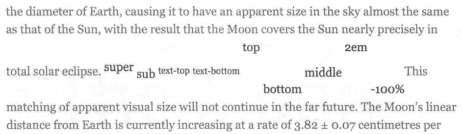
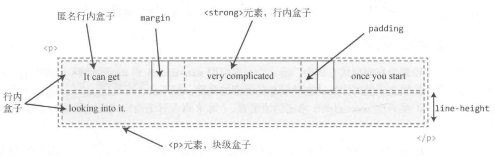
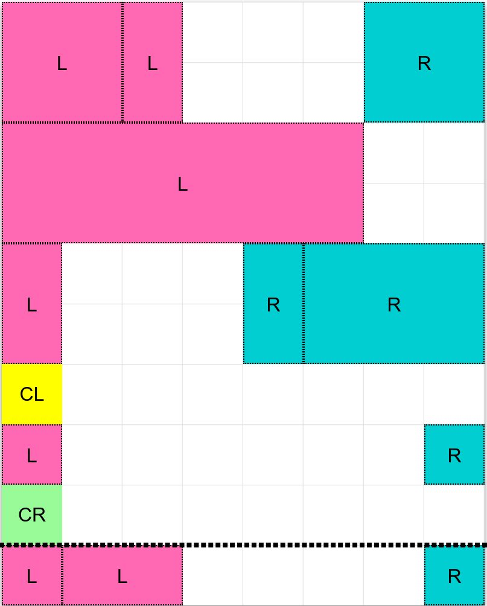
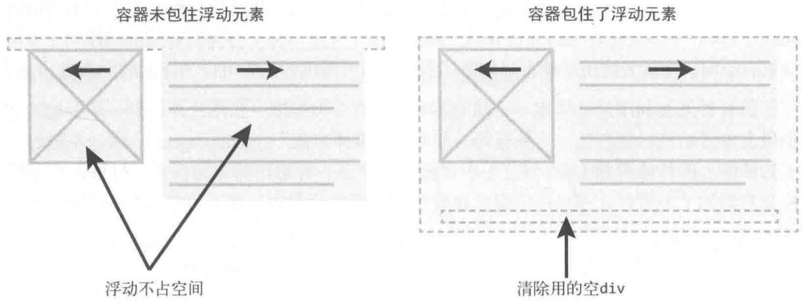

# CSS Layout Notes

## Box Pattern

### Box Sizing

`box-sizing`:

- `content-box` (`initial` value).
- `padding-box`.
- `border-box`.

```css
:root {
  box-sizing: border-box;
}

*,
::before,
::after {
  box-sizing: inherit;
}
```

Box sizing:

- `Intrinsic Sizing` (内在尺寸):
  表示元素最终的尺寸表现是由内容决定的,
  e.g `fit-content`/`min-content`/`max-content`.
- `Extrinsic Sizing` (外在尺寸):
  表示元素最终的尺寸表现是由上下文决定的,
  e.g `stretch`/`-moz-available`/`-webkit-fill-available`.

### Box Width

#### Width Formal Syntax

`width`:

- `auto`: initial value.
- `<length>`.
- `<percentage>`.
- `min-content | max-content | fit-content | fit-content(<length-percentage>)`.

#### Percentage Width

`%` width calculate by `containing box` width:

- 普通元素的百分比宽度是相对于父元素 `content box` 宽度计算.
- 绝对定位元素的百分比宽度是相对于第一个 `position` 不为 `static` 的祖先元素 `padding box` 宽度计算.

#### Auto Flow Width

Auto flow with `css-sizing`,
`fit-content`/`min-content`/`max-content`/`stretch`
for `width`/`min-width`/`max-width`/`height`/`min-height`/`max-height`/
`grid-template-rows`/`grid-template-columns`/`flex-basis`:

- `fit-content`: grow but not overflow.

```css
.content {
  width: fit-content;
  margin: auto;
}

.button {
  box-sizing: border-box;
  width: calc(100% - 30px);
  width: stretch;
  height: 40px;
  margin-right: 15px;
  margin-left: 15px;
}

.table {
  box-sizing: border-box;
  width: 100%;
  width: stretch;
  table-layout: fixed;
}
```

#### Min and Max Width

`min-width` > `max-width` > `width !important`:

```css
/* 480px */
.box-1 {
  min-width: 480px;
  max-width: 256px;
}

/* 256px */
.box-2 {
  width: 480px !important;
  max-width: 256px;
}
```

### Box Height

#### Flow Height

普通文档流是为限定的宽度和无限的高度设计的 (网页元素的默认布局行为):

- 行内元素跟随文字的方向从左到右排列, 当到达容器边缘时会换行.
- 块级元素会占据完整的一行, 前后都有换行.

这导致处理元素高度的方式跟处理宽度不一样:

`box-sizing` 仍然会影响高度, 但最好避免给元素指定明确的高度.
容器的高度由内容 (子元素) 天然地决定, 而不是容器自己决定.

#### Percentage Height

`%` height calculate by `containing box` height:

- 容器高度为 `auto` (`initial` value) 时, 其高度通常由子元素高度决定:
  浏览器为避免高度计算死循环, 会忽略子元素百分比高度声明.
- 容器高度为一个明确值时, 子元素百分比高度才会生效.

#### Viewport Height

```css
.my-element {
  height: 100vh; /* Fallback for browsers that do not support Custom Properties */
  height: calc(var(--vh, 1vh) * 100);
}
```

```ts
window.addEventListener('resize', () => {
  // Get viewport height and multiple it by 1% to get a value for a vh unit
  const vh = window.innerHeight * 0.01;
  document.documentElement.style.setProperty('--vh', `${vh}px`);
});
```

### Box Margin

#### Auto Margin

CSS2 visual formatting model:

- If both margin-left and margin-right are auto,
  their used values are equal.
- If margin-top, or margin-bottom are auto,
  their used value is 0.

#### Negative Margin

Negative `margin` change layout flow:

- Negative `margin-top`/`margin-left`: pull self up/left.
- Negative `margin-bottom`/`margin-right`: pull sibling up/left, overlapping self.
- Negative `margin` along `float` direction: pull self.
- Negative `margin` opposite `float` direction: pull sibling.

```css
.content {
  float: left;
  width: 100%;
  margin-right: -200px;
}

.sidebar {
  float: left;
  width: 200px;
}
```

Negative horizontal `margin` on `initial` width element make `width` **stretch**
(just like positive `padding`):

```css
/* ul width = 100% + 20px */
ul {
  margin-right: -20px;
}

ul > li {
  float: left;
  width: 100px;
  margin-right: 20px;
}

.blockquote {
  margin: 2rem -2rem;
}
```

#### Percentage Margin

Auto flow percentage `margin` calculate by `width`.

#### Collapse Margin

[`margin` collapsing occasion](https://developer.mozilla.org/docs/Web/CSS/CSS_Box_Model/Mastering_margin_collapsing):

- Adjacent siblings: 1's `margin-bottom` with 2's `margin-top`.
- No content separating parent and descendants:
  - No `border`/`padding`/`inline part`/`BFC created`/`clear`:
    can't separate parents `margin-top` from its descendant blocks `margin-top`.
  - No `border`/`padding`/`inline content`/`height`/`min-height`:
    can't separate parents `margin-bottom` from its descendant blocks `margin-bottom`.
  - Collapsed `margin` ends up **outside the parent**.
- Empty blocks:
  no `border`/`padding`/`inline content`/`height`/`min-height`
  to separate block's `margin-top` from its `margin-bottom`.

`margin` collapsing calculation:

- 正正取大值.
- 正负值相加.
- 负负最负值.

`margin` collapsing prevention:

- BFC creation: add `overflow: auto` to container.
- Add `padding`.
- Add `border`.

:::tip Never Collapse

Margin collapsing only happen to **normal** block box **vertical** direction:

- [Line box](#line-box) margin **never collapse**.
- `float` box margin **never collapse**.
- `absolute`/`fixed` positioned box margin **never collapse**.
- `flex` children.
- `grid` children.

:::

#### Invalid Margin

- `display: inline` 非替换元素 `vertical margin` 无效: e.g ``.
- `display: table-cell`/`display: table-row` 元素 `margin` 无效: e.g `<tr>`, `<td>`.
- `position: absolute` 绝对定位元素未定位方向 (`auto`) `margin`:
  `.absolute { top: 10%; left: 30%; }` `margin-right` 与 `margin-bottom` 改变了外部尺寸,
  但无法影响兄弟元素布局.
- 定高容器**子元素**的 `margin-bottom` 或者定宽容器**子元素**的 `margin-right` 的定位作用失效.

### Box Padding

#### Percentage Padding

Auto flow percentage `padding` calculate by `width`:

```css
.box {
  position: relative;
  padding: 10% 50%;
}

.box > img {
  position: absolute;
  top: 0;
  left: 0;
  width: 100%;
  height: 100%;
}
```

### Box Overflow

[`overflow`](https://developer.mozilla.org/docs/Web/CSS/overflow):

- `visible`.
- `hidden`: 溢出隐藏基于 `padding box`.
- `clip`.
- `scroll`.
- `auto`.

### Box Line Height

#### Inline Element Line Height

行间距:

- 半行间距 = `(line-height * font-size - font-size) / 2`.
- 行间距 = 第一行下半行间距 + 第二行上半行间距.

#### Box Line Height Inheritance

`line-height` 继承:

- `%` 与 `em` 继承计算值, `number` 继承数值.
- `line-height` 最好使用 `number`, 使得子代继承 `line-height` 时文字正常排版,
  不会出现 `line-height` `<` `font-size` 导致文字重叠的现象.
- Inline level element:
  由于 `line-height` 可继承, 一般给父元素设置 `line-height` 即可,
  会自动作用至容器内所有内联元素.
- Block level element:
  由于行框盒子幽灵空白节点的存在,
  `line-height * font-size` 会决定 block level element 内部元素的最小高度,
  e.g `<div><span></span></div>` 高度不为 `0`.

### Box Vertical Align

#### Box Vertical Align Values

`vertical-align` 有效值:

- 线类: `baseline`, `top`, `middle`, `bottom`.
- 文本类: `text-top`, `text-bottom`.
- 上标下标类: `sub`, `super`.
- 数值: 基于 `baseline` 上移 (正数) / 下移 (负数).
- 百分比: calculate by `line-height`.

[](https://developer.mozilla.org/docs/Web/CSS/vertical-align)

#### Box Vertical Align Applies

`vertical-align` 作用元素:

- [Inline level element](https://developer.mozilla.org/docs/Web/HTML/Inline_elements):
  - `<span>`/`<strong>`/`<em>`.
  - ``/`<button>`/`<input>`.
  - `::before`/`::after`.
- `display: table-cell` 元素.
- 用 `display: inline-*` 或 `display: table-cell` **以外**的方式
  创建 `Box Formatting Context` 后,
  `vertical-align` 不再起作用.
- 当 `line-height` 过小时, `vertical-align` 在视觉上失效,
  调整 `line-height` 至足够大时, `vertical-align` 正常起作用.

### Box Model

- Inline-level box:
  `display` 属性为 `inline`, `inline-block`, `inline-table` 的元素,
  会生成 inline-level box, 并且参与 `Inline Formatting Context` (IFC).
- Block-level box:
  `display` 属性为 `block`, `list-item`, `table` 的元素,
  会生成 block-level box, 并且参与 `Block Formatting Context` (BFC).
- `Flex Formatting Context` (FFC).
- `Grid Formatting Context` (GFC).

### Inline Box Model

[](https://developer.mozilla.org/docs/Web/CSS/CSS_Flow_Layout/Intro_to_formatting_contexts#inline_formatting_contexts)

#### Content Area

Character box/em-box/selection box):

一种围绕文字看不见的盒子,
其大小仅受字符本身特性控制,
一般将选中区域等价于此盒子.

#### Inline Box

- 内联元素形成外部内联盒子, 让元素不成块显示, 而是排成一行.
- 水平间距可通过 `padding-inline`/`border-inline`/`margin-inline` 调整,
  垂直间距可通过 `line-height`/`vertical-align` 调整,
  垂直间距**不受** `padding-block`/`border-block`/`margin-block` 影响.
- `<span>`/`<a>`/`<em>` tag 会产生一般内联盒子.
- Bare text 会产生匿名内联盒子.

```css
::first-line {
  color: white;
  background: red;
}
```

#### Line Box

- 每一行会形成一个行框盒子.
- 每个行框盒子的前面有一个[**幽灵空白节点**](https://www.w3.org/TR/CSS22/visudet.html#strut)
  (zero-width inline box with the element's `font` and `line height` properties).
  父元素的 `line-height` 会幽灵空白节点产生作用.
- 将内联元素设置为 `display: inline-block` 可以消除幽灵空白节点.

#### Lines containing Box

`<p>` tag 会形成一个包含盒子, 此盒子由一行一行的行框盒子组成.

:::tip Box Height

在很多情况下, 容器高度**莫名奇妙**变大,
都是行框盒子幽灵空白节点 (`Strut`), `line-height`, `vertical-align` 共同作用的结果:

- 容器内部除了显式的内联元素外, 每行还存在幽灵空白节点 (`Strut`).
- `line-height` 可继承, 且基于 `font-size` 进行计算.
- `vertical-align` 默认对齐方式为基线对齐 (`baseline`).

常见例子有:

- `<div><span></span></div>` 高度不为 `0`:
  `Strut` 撑高容器.
- `<div class="leading-8"><span class="text-2xl">文字</span></div>`
  高度不为 `32px` (`leading-8`):
  当 `Struct` `font-size` 与内联元素 `font-size` 差距过大时,
  进行文字对齐时会撑高容器.
- `<div></div>` 下边缘存在空隙:
  `Strut` 默认基于[基线对齐](#inline-element-baseline).

:::

### Block Formatting Context

#### Block Formatting Context Features

- 一个 BFC 包含创建该上下文元素的所有子元素, 但不包括创建了新 BFC 的子元素的内部元素.
- BFC 就是页面上的一个隔离的独立容器, 容器里面的子元素不会影响到外面的元素, 反之也如此.
- 一个元素不能同时存在于两个 BFC 中: 可让处于 BFC 内部的元素与外部的元素相互隔离.
- 每个元素的 margin box 的左边, 与包含块 border box 的左边相接触.
- 内部的 Box 会在垂直方向, 一个接一个地放置.
- Vertical margin collapsing.
- BFC 的区域不会与 float box 重叠: 自适应分栏布局, 清除外/内部浮动.
- 计算 BFC 的高度时, 浮动元素也参与计算:
  防止内边距塌陷 (margin-top collapse with margin-bottom).

#### Block Formatting Context Creation

- 根元素或其它包含它的元素.
- `overflow`: not visible (e.g `hidden`).
- `float`: not `none` (e.g `left`/`right`).
- `position`: not `relative`/`static` (e.g `absolute`/`fixed`).
- `display`: `inline-block`.
- `display`: `table-cell`/`table-caption`/`table-*h`.
- `display`: flow-root.
- direct children of `display: flex/inline-flex`.
- direct children of `display: grid/inline-grid`.

```css
.bfc-1 {
  overflow: hidden;
}

.bfc-2 {
  display: table-cell;
  *display: inline-block; /* For IE7 */
  width: 9999px;
  *width: auto; /* For IE7 */
}
```

### Box Stacking

#### Stacking Level

Positioned element (non-`static` `position`), `flex` box, `grid` box
can use the `z-index` property to adjust its stacking level:

数值越大, 处于可视的优先级越大.

#### Stacking Context

[Stacking context creation](https://developer.mozilla.org/docs/Web/CSS/CSS_Positioning/Understanding_z_index/The_stacking_context):

- The root element `<html>` forms the `root stacking context`.
- `absolute`/`relative` element with non-`auto` `z-index`.
- `fixed`/`sticky` element.
- `flex` children with non-`auto` `z-index`.
- `grid` children with non-`auto` `z-index`.
- `opacity` `<` $100\%$ element.
- non-`normal` `mix-blend-mode` element.
- `transform` element.
- `perspective` element.
- `clip-path` element.
- `mask`/`mask-image`/`mask-border` element.
- `filter` element.
- `backdrop-filter` element.
- `isolation: isolate` element.
- `will-change` above properties element.
- `contain` `strict`/`content`/`layout`/`paint` element.

The `z-index` of elements inside of a `stacking context`
are always **relative to parent** current order in its own `stacking context`.

```html
<!-- .bottom > .inner is on top -->
<div class="top">
  <div class="inner"></div>
</div>
<div class="bottom">
  <div class="inner"></div>
</div>

<style>
  .top,
  .bottom {
    position: relative;
    width: 250px;
    padding: 80px 20px;
  }

  .top {
    z-index: 1;
  }

  .bottom {
    z-index: 2;
  }

  .top > .inner {
    z-index: 999;
  }

  .bottom > .inner {
    z-index: 2;
  }
</style>
```

#### Stacking Order

- The background and borders of the root element.
- Descendant non-positioned blocks, in order of **appearance in the HTML**.
- Descendant positioned elements, in order of **appearance in the HTML**.

[](https://developer.mozilla.org/docs/Web/CSS/CSS_Positioning/Understanding_z_index/Stacking_without_z-index)

```css
.box {
  /* 创建层叠上下文 */
  position: relative;
  z-index: 0;
  background-image: url('1.png');
}

.box::before,
.box::after {
  position: absolute;
  z-index: -1;
  content: '';
}

.box::before {
  background-image: url('2.png');
}

.box::after {
  background-image: url('3.png');
}
```

```html
<div class="container">
  <div class="page">标题和内容</div>
</div>

<style>
  .container {
    /* 创建层叠上下文 */
    position: relative;
    z-index: 0;
    background-color: #666;
  }

  .page {
    position: relative;
    background-color: #f4f39e;
  }

  /* 边角卷边阴影 */
  .page::before,
  .page::after {
    /* 层叠上下文（灰色背景）之上, 定位元素（黄色纸张）之下 */
    position: absolute;
    z-index: -1;
    width: 90%;
    height: 20%;
    content: '';
    box-shadow: 0 8px 16px rgb(0 0 0 / 30%);
  }

  /* 边角卷边阴影定位和角度控制 */
  .page::before {
    bottom: 0;
    left: 0;
    transform: skew(-15deg) rotate(-5deg);
    transform-origin: left bottom;
  }

  .page::after {
    right: 0;
    bottom: 0;
    transform: skew(15deg) rotate(5deg);
    transform-origin: right bottom;
  }
</style>
```

## Inline Pattern

### Inline Element Height

- 内联元素默认的高度完全受 `font-size` 大小控制.
- 内联元素没有可视宽度和可视高度 (`clientHeight`/`clientWidth` always `0`),
  垂直方向的行为表现完全受 `line-height` 和 `vertical-align` 的影响.

### Inline Element Baseline

#### Inline Block Element Baseline

`inline-block` element:

- 内部没有内联元素, 或者 `overflow` not visible:
  其基线为 `margin` 底边缘.
- 内部存在内联元素:
  其基线为最后一行内联元素的基线.

#### Vertical Align Baseline

Inline element 与父元素下边缘存在空隙,
原因在于文字排版的基线 (`baseline`) 对齐机制:

- 在标准模式中,
  `Inline Formatting Context` 总是会包含类似字母 'g'/'f' 尾巴伸出部分空间 (针对下行字母).
- ``/`<a>` inline element 与父元素底部若干像素间隙,
  实际上是此种情况下的**字母尾巴**预留机制:
  行框盒子存在幽灵空白节点, 默认基于 `baseline` 对齐 (小写字母 `x` 底部).

清除间隙的方法:

- 清除 `Strut` 高度:
  父元素 `font-size: 0` / `line-height: 0`,
  设置 `Inline Formatting Context` 高度为 `0`.
- 改变对齐方式:
  子元素 `vertical-align` 设置为 `top`/`middle`/`bottom`.
- 清除 `Strut` 节点:
  子元素 `display` 设置为 `inline-block`/`block`,
  创建 `Block Formatting Context`,
  直接清除幽灵空白节点.

可以用以上方法解决 `` image 5px problem 或相似问题.

### Inline Element Padding

可以在不影响当前布局的情况下,
通过增加垂直方向的 `padding`,
增加链接 (`inline`) 或按钮 (`inline-block`) 的点击区域大小:

```css
article a {
  padding: 0.25rem 0;
}
```

### Inline Element Margin

非主动触发位移的内联元素是不会位移至计算容器外面,
内联元素 `margin-top` 设置过大时 `margin-top` 会直接失效,
内联元素依然会处于基线对齐位置.

## Position Pattern

### Static Position

- `top`/`bottom`/`left`/`right`/`inset`/`z-index` have **no effect**.
- Normal flow.

### Relative Position

- 使元素相对于 `static` 布局.
- 可使用 `top`/`bottom`/`left`/`right`/`inset` 属性进行定位.
- 相对方向 (opposite) 的定位同时设置: `top` 覆盖 `bottom`, `left` 覆盖 `right`.
- 初始位置被保留 (仍占用原始空间), 不脱离文档流.

### Absolute Position

- 使元素相对于 [`containing block`](https://developer.mozilla.org/en-US/docs/Web/CSS/Containing_block#identifying_the_containing_block)
  布局:
  - Non-`static` `position` element.
  - `transform` element.
  - `perspective` element.
  - `will-change: transform`/`will-change: perspective` element.
  - `filter` element.
  - `backdrop-filter` element.
  - `contain` `strict`/`content`/`paint` element.
- 若祖先全为无法构成 `containing block` 的元素, 则使元素相对于浏览器窗口布局.
- 可使用 `top`/`bottom`/`left`/`right`/`inset` 属性进行定位.
- 相对方向 (opposite) 的定位同时设置:
  若未显示设置该方向的元素大小, 则元素具有流动性, 受 `containing block` 影响其大小,
  `.fluid { position: absolute; left: 0; right: 0; }`.
- 初始位置不被保留, 脱离文档流.
- `float` computed to `float: none`.
- `display` `inline-table` computed to `table`.
- `display` `inline`/`inline-block`/`table-*` computed to `block`.

```css
.tooltip {
  position: absolute;
}

.form-alert,
.form-warning,
.form-info {
  position: absolute;
}

.overlay {
  position: absolute;
  top: 0;
  left: 0;
  z-index: -50;
  width: 100%;
  height: 100%;
  background: rgb(0 0 0 / 50%);
}
```

可以利用 `absolute` 模拟 `fixed` 布局:

```html
<html>
  <body>
    <div class="page">滚动内容区域</div>
    <div class="fixed">固定定位元素</div>
  </body>
  <style>
    html,
    body {
      height: 100%;
      overflow: hidden;
    }

    .page {
      height: 100%;
      overflow: auto;
    }

    .fixed {
      position: absolute;
    }
  </style>
</html>
```

### Fixed Position

- 使元素相对于 [`containing block`](https://developer.mozilla.org/en-US/docs/Web/CSS/Containing_block#identifying_the_containing_block)
  布局:
  - Initial `containing block`: 浏览器窗口, 且不受滑动条影响.
  - `transform` element.
  - `perspective` element.
  - `will-change: transform`/`will-change: perspective` element.
  - `filter` element.
  - `backdrop-filter` element.
  - `contain` `strict`/`content`/`paint` element.
- 可使用 `top`/`bottom`/`left`/`right`/`inset` 属性进行定位.
- 初始位置不被保留, 脱离文档流.
- `float` computed to `float: none`.
- `display` `inline-table` computed to `table`.
- `display` `inline`/`inline-block`/`table-*` computed to `block`.

### Sticky Position

`position: sticky` + `top: XXX`:

- 使元素相对于 non-`visible` `overflow` 祖先 (nearest **scrolling** ancestor) 布局:
  要利用 `position: sticky` 实现视窗定位效果, 最好保证祖先全为 `overflow: visible` 元素,
  使得视窗成为其 nearest **scrolling** ancestor.
- 若祖先全为 `overflow: visible` 元素, 则使元素相对于浏览器窗口与 `containing block` 布局:
  - `containing block` 为 BFC creation element:
    - Block container.
    - Table container.
    - Flex container.
    - Grid container.
  - 粘性定位元素在它距离视窗顶部大于 `XXX` 时, 会按照默认布局, 表现为 `relative` position.
  - 一旦其距离顶部的距离等于 `XXX`, 元素会固定在窗口顶部, 表现为 `fixed` position.
- 粘性定位元素不能超出**粘性约束矩形**范围的限制:
  - 当 `containing block` 移动到窗口外时,
    粘性定位元素也会[跟着消失](https://demo.cssworld.cn/new/3/4-2.php).
  - [黏性定位元素在同一个容器下会重叠, 在不同容器下则会依次推开](https://demo.cssworld.cn/new/3/4-3.php):
    黏性定位元素分布在一个容器时, 共用一个巨大的黏性约束矩形,
    黏性定位元素分布在不同容器时, 存在多个竖直排列的黏性约束矩形.
  - 若粘性定位元素父元素的高度和粘性定位元素的高度相同,
    则垂直滚动时, 粘性定位效果始终不会出现.
  - 可以利用这一特性, 实现层次滚动/视差滚动效果 (`Parallax`).

```css
.sticky {
  position: sticky;
  top: 0;
  margin-top: 50px;
}
```

### Percentage Position

Positioned elements percentage `top`/`bottom`/`left`/`right`/`inset`
calculate by containing block `height`:

If `containing block` `height` is `auto`, it calculated to `0`.

## Float Pattern

### Float Element

- 包裹性:
  - 宽度受子元素影响.
  - 宽度受 containing block 影响.
- 块状化并格式化上下文.
- 没有任何 `margin` 合并.
- 破坏文档流: 父级高度塌陷.
- 浮动元素的浮动参考 (`float reference`) 是行框盒子:
  浮动元素在当前行框盒子内定位.
- 浮动元素与行框盒子不可重叠:
  行框盒子会缩短以容纳浮动盒子, 会形成文字环绕效果.
- 浮动元素与 BFC:
  BFC 会收缩以容纳浮动盒子, 此时会忽略自己的边界必须接触包含块边界的规则.
  可用此特性创建[自适应布局](#column-pattern).

[](https://developer.mozilla.org/docs/Web/CSS/CSS_Flow_Layout/Intro_to_formatting_contexts)

### Float Block Formatting Context

`float` make element specified value of `display`:

- `inline-table` computed to `table`.
- `inline-flex` computed to `flex`.
- `inline-grid` computed to `grid`.
- `inline`/`inline-block`/`table-*` computed to `block`.

### Fixed Parent

Floating won't work inside `fixed` or `absolute` `div` unless specify width:

```css
.parent {
  position: fixed;
  top: 5px;
  left: 0;
  width: 100%;
}
```

### Float Clear Fix

为父容器 (`.row`) 添加 `.clearfix`:

- [`clear`](https://developer.mozilla.org/docs/Web/CSS/clear)
  只能作用于 block level element:
  `::before`/`::after` 默认为 inline level element,
  `display: table` 将 `::before`/`::after` 转换为 block level element.
- [`clear: both`](https://css-tricks.com/snippets/css/clear-fix)
  本质是让自身不和浮动元素在同一行排列,
  并没有真正意义上地清除浮动元素的 `float` (仍然脱离文档流):
  `::after` 伪元素不与浮动元素在同一行,
  其形成的盒子自然而然地撑起了父容器的高度,
  使得**因浮动元素脱离文档流而塌陷**的父容器恢复正常高度.

```css
.clearfix::before,
.clearfix::after {
  display: table;
  content: '';
}

.clearfix::after {
  clear: both;
}

.clearfix {
  *zoom: 1; /* display: inline-block BFC creation for IE7 */
}
```



## Column Pattern

### Two Column Pattern

#### Block Two Column

- `inline-block` + `inline-block`.

#### Absolute Two Column

- `absolute` + `margin-left`:
  absolute element not in normal flow.
- 利用父元素 `relative` 与子元素 `absolute` 进行布局.

```css
.div-1 {
  position: relative;
}

.div-1a {
  position: absolute;
  top: 0;
  right: 0;
  width: 200px;
}

.div-1b {
  position: absolute;
  top: 0;
  left: 0;
  width: 200px;
}
```

#### Float Two Column

- `float` + `float`.
- `float` + `margin-left`:
  block element ignore float element,
  inline element surround float element.
- `float` + BFC.

```css
.container {
  overflow: hidden; /* BFC creation */
}

.left {
  float: left;
  width: 60px;
  height: 60px;
}

.right {
  margin-left: 70px;
}
```

### Three Column Pattern

#### Absolute Three Column

Position `.left` and `.right` with `absolute`,
add `margin-left` and `margin-right` to `.middle`.

#### Float Three Column

```html
<div class="left"></div>
<div class="right"></div>
<div class="middle"></div>
```

```css
.left {
  float: left;
}

.right {
  float: right;
}

.middle {
  margin: 0 right-width 0 left-width;
}
```

On a floated element,
a negative `margin` opposite the float direction
will decrease the float area,
causing adjacent elements to overlap the floated element.
A negative `margin` in the direction of the float
will pull the floated element in that direction.

1. HTML: `.middle` first.
2. `padding-left` and `padding-right` to `.container`,
   `min-width: 2 * (leftWidth + rightWidth)` to `.container`.
3. Float: `float: left` to `.left`, `.middle` and `.right`.
4. Negative margin: `margin-left: -100%` to `.left`,
   `margin-right: -rightWidth px` to `.right`.
5. Move: `right: leftWidth px` to `.left`.

```html
<div class="container">
  <div class="middle"></div>
  <div class="left"></div>
  <div class="right"></div>
</div>
```

```css
.container {
  padding: 0 200px 0 300px; /* padding-left = .left width, same to .right */
}

.container .middle {
  float: left;
  width: 100%;
  background-color: violet;
}

.container .left {
  position: relative;
  right: 300px;
  float: left;
  width: 300px;
  margin-left: -100%;
  background-color: darkblue;
}

.container .right {
  position: relative;
  float: left;
  width: 200px;
  margin-right: -200px;
  background-color: red;
}
```

### Multiple Column Pattern

Multiple `column` layout:

- `columns`:
  - `<'column-width'> || <'column-count'>`.
  - 分栏实际数目 = $\min(\frac{\text{width}}{\text{column-width}}, \text{column-count})$.
- `column-width`:
  `auto | <length>`, 期望分栏宽度.
- `column-count`:
  `auto | <integer>`, 期望分栏数目.
- `column-gap`:
  `normal | <length-percentage>`, 分隔间隙.
- `column-rule`:
  `<'column-rule-width'> || <'column-rule-style'> || <'column-rule-color'>`, 分隔线.
- `column-rule-width` (`<line-width>`):
  `medium | thin | thick | <length>`.
- `column-rule-style` (`<line-style>`):
  `none | hidden | dotted | dashed | solid | double | groove | ridge | inset | outset`.
- `column-rule-color`:
  `currentcolor | <color>`.
- `column-span`: `none | all`, 子元素宽度.
- `column-fill`: `balance | balance-all | auto`, 子元素分布.
- [`break-inside`](https://developer.mozilla.org/docs/Web/CSS/break-inside):
  - `auto`: Allows break.
  - `avoid`: Avoids break.

```css
.three-column {
  column-gap: 1em;
  padding: 1em;
  column-count: 3;
}

.three-column > .last-child {
  column-span: all;
}
```

[](https://developer.mozilla.org/docs/Web/CSS/column-fill)

## Flex Pattern

### Flex Box Width

最终尺寸计算:

- 优先级: 最大最小尺寸 > 弹性增长或收缩 > 基础尺寸.
- When there is **free space left**:
  used size = $\text{flex-basis} + (\text{flex-grow}/\sum\text{flex-grow})$.
- When there is **not enough space**:
  used size = $\text{flex-basis} - (\text{flex-shrink}/\sum\text{flex-shrink})$.

| `flex-basis` | `width` | 基础尺寸     |
| ------------ | ------- | ------------ |
| set          | x       | `flex-basis` |
| auto         | set     | `width`      |
| auto         | auto    | 最大内容宽度 |

| `min-width` | `width` | 最小尺寸                   |
| ----------- | ------- | -------------------------- |
| set         | x       | `min-width`                |
| auto        | set     | min(`width`, 最小内容宽度) |
| auto        | auto    | 最小内容宽度               |

```css
.container {
  display: flex;
}

.initial {
  /* width: 100px~200px */
  flex: initial;
  width: 200px;
  min-width: 100px;
}

.none {
  /* width: 200px */
  flex: none;
  width: 200px;
}

.flex1 {
  /* width: left width * 1/3 */
  flex: 1;
}

.flex2 {
  /* width: left width * 2/3 */
  flex: 2;
}
```

### Flex Shorthand Property

[`flex`](https://developer.mozilla.org/docs/Web/CSS/flex)
= `none | [<'flex-grow'> <'flex-shrink'>? || <'flex-basis'>]`:

- `flex-grow`: `<number>`.
- `flex-shrink`: `<number>`.
- `flex-basis`: `content | <'width'>`.
- `flex: initial`:
  属性默认值, 元素会根据自身宽高设置尺寸.
  它会缩短自身以适应容器,
  但不会伸长并吸收 flex 容器中的额外自由空间来适应容器,
  equal to `flex: 0 1 auto`.
- `flex: none`:
  元素会根据自身宽高来设置尺寸.
  它是完全非弹性的: 既不会缩短, 也不会伸长来适应容器,
  equal to `flex: 0 0 auto`.
- `flex: auto | <'width'>`:
  元素会根据自身的宽度与高度来确定尺寸,
  但是会自行伸长以吸收 flex 容器中额外的自由空间,
  也会缩短至自身最小尺寸以适应容器,
  equal to `flex: 1 1 auto | 1 1 <'width'>`.
- `flex: <number>`:
  元素会被赋予一个容器中自由空间的指定占比,
  equal to `flex: <number> 1 0%`.

:::tip Flex Shorthand Property Usage

- `flex: none`: 适合设置在内容不能换行显示的小控件元素上, e.g `<button>`.
- `flex: auto`: 适合基于内容动态适配的布局.
- `flex: 0`: 适用场景较少, 适合设置在替换元素的父元素上.
- `flex: 1`: 适合等分布局.

:::

### Flex Children Display

Flexbox 会改变子元素 `display` 属性值:

| Initial Display                 | Flex Children Display |
| ------------------------------- | --------------------- |
| `inline`/`inline-block`/`block` | `block`               |
| `flow-root`                     | `flow-root`           |
| `list-item`                     | `list-item`           |
| `inline-table`/`table`          | `table`               |
| `table-*`                       | `block`               |
| `inline-flex`/`flex`            | `flex`                |
| `inline-grid`/`grid`            | `grid`                |

Flexbox 子元素:

- 均为块级元素:
  - `vertical-align` 无效化.
  - 裸文本子元素会变为匿名块级元素
    (Text nodes and pseudo elements can be flex children).
- `float` 无效化.
- `margin` 不合并.
- 支持 `z-index` (包括 `position: static` 子元素):
  `z-index` 不为 `auto` 时创建层叠上下文.
- `absolute` 定位子元素会脱离弹性布局.

### Flex Flow

`flex-flow`: `<'flex-direction'> || <'flex-wrap'>`.

#### Flex Direction

`flex-direction`:

- `row`.
- `row-reverse`.
- `column`.
- `column-reverse`.

#### Flex Wrap

`flex-wrap`:

- `nowrap`: 不换行.
- `wrap`: 换行.
- `wrap-reverse`.

### Flex Alignment

#### Flex Parent Alignment

- [`justify-content`](https://developer.mozilla.org/docs/Web/CSS/justify-content),
  defines alignment along main axis:
  - `normal`: items packed in default position.
  - `stretch`: behaves as `flex-start` (stretching in main axis controlled by `flex`).
  - `space-between`/`space-around`/`space-evenly`.
  - `center`/`start`/`end`/`flex-start`/`flex-end`.
  - `left`/`right`.
- [`align-items`](https://developer.mozilla.org/docs/Web/CSS/align-items),
  defines alignment (`align-self`) for cross axis:
  - `normal`: behaves as `stretch`/`start`.
  - `baseline`.
  - `stretch`.
  - `center`/`start`/`end`/`self-start`/`self-end`/`flex-start`/`flex-end`.
- [`align-content`](https://developer.mozilla.org/docs/Web/CSS/align-content),
  aligns flex container's lines within
  when there is extra space in the cross-axis:
  - `normal`: items packed in default position.
  - `baseline`.
  - `stretch`/`space-between`/`space-around`/`space-evenly`.
  - `center`/`start`/`end`/`flex-start`/`flex-end`.
- `*-content` adjust parent padding,
  `*-items` and `*-self` adjust children margin.

#### Flex Children Alignment

- [`align-self`](https://developer.mozilla.org/docs/Web/CSS/align-self):
  - `auto`: computes to parent `align-items` value.
  - `normal`: behaves as `stretch`/`start`.
  - `baseline`.
  - `stretch`.
  - `center`/`start`/`end`/`self-start`/`self-end`/`flex-start`/`flex-end`.
- `order`: `<number>`, 显示顺序.

#### Flex Margin Alignment

Alignment with `margin`:

```html
<div class="parent">
  <div class="child"></div>
</div>

<style>
  .parent {
    display: flex;
  }

  .child {
    /* This will push child to the right of parent border */
    margin-left: auto;
  }
</style>
```

最后一行左对齐:

```css
.container {
  display: flex;
  flex-wrap: wrap;
  justify-content: space-between;
}

.list {
  margin: 10px;
}

.list:last-child {
  margin-right: auto;
}
```

### Flex Centering

```css
/* 子元素全部居中对齐 */
.vertical-container {
  display: flex;
  align-items: center;
  justify-content: center;
  height: 300px;
}
```

```css
.layer {
  display: flex;
  flex-direction: row;
  flex-grow: 1;
  align-items: center;
  justify-content: flex-start;
  margin: 5px;
  background-color: #fff;
  border: 1px solid #000;
}
```

### Flexbox Pseudo Element

Set `flex` to pseudo elements of flex box
will change width of pseudo elements.

```css
.flex {
  display: flex;
}

.flex::before {
  position: relative; /* no need for absolute position */
  display: block;
}
```

### Fixed Sidebar Flexbox

```html
<body>
  <aside></aside>
  <main></main>
</body>
```

```css
body {
  display: flex;
  height: 100vh;
  margin: 0;
}

aside {
  flex: 0 0 auto; /* inflexible */
}

main {
  flex: 1 1 auto; /* auto flexible */
  overflow: auto;
}
```

### Flex Reference

- Flexbox complete [guide](https://css-tricks.com/snippets/css/a-guide-to-flexbox).

## Grid Pattern

### Grid Property

Parent property:

- [`grid`](https://developer.mozilla.org/docs/Web/CSS/grid):
  - [`grid-template`](https://developer.mozilla.org/docs/Web/CSS/grid-template):
    - `grid-template-rows`.
    - `grid-template-columns`.
    - `grid-template-areas`.
  - [`grid-auto-rows`](https://developer.mozilla.org/docs/Web/CSS/grid-auto-rows).
  - [`grid-auto-columns`](https://developer.mozilla.org/docs/Web/CSS/grid-auto-columns).
  - [`grid-auto-flow`](https://developer.mozilla.org/docs/Web/CSS/grid-auto-flow).
- [`gap`](https://developer.mozilla.org/docs/Web/CSS/gap):
  - `row-gap`.
  - `column-gap`.
- [`place-content`](https://developer.mozilla.org/docs/Web/CSS/place-content):
  - `align-content`.
  - `justify-content`.
- [`place-items`](https://developer.mozilla.org/docs/Web/CSS/place-items).
  - `align-items`.
  - `justify-items`.

Children property:

- [`grid-area`](https://developer.mozilla.org/docs/Web/CSS/grid-area):
  - `grid-row`:
    - `grid-row-start`.
    - `grid-row-end`.
  - `grid-column`:
    - `grid-column-start`.
    - `grid-column-end`.
- [`place-self`](https://developer.mozilla.org/docs/Web/CSS/place-self):
  - `align-self`.
  - `justify-self`.

```css
.container {
  grid-template-areas:
    'header header header'
    'advert content content'
    'footer footer footer';
  grid-template-rows: 1fr 1fr 1fr;
  grid-template-rows: minmax(90px, 1fr);
  grid-template-columns: 1fr 1fr 1fr;
  grid-template-columns: repeat(3, 1fr);
  gap: 10px;
  align-items: end;
  justify-items: center;
}

.item {
  grid-area: footer;
  grid-row: start / end; /* 2 / -1 */
  grid-column: start / end;
  align-self: end;
  justify-self: center;
}
```

### Grid Data Types

#### Grid Breadth Types

`<track-breadth>`:

- `<flex>`: `<number>fr`, fraction.
- `<length-percentage>`.
- `min-content`.
- `max-content`.
- `auto`.

`<inflexible-breadth>`:

- `<length-percentage>`.
- `min-content`.
- `max-content`.
- `auto`.

`<fixed-breadth>`:

- `<length-percentage>`.

#### Grid Size Types

`<track-size>`:

- `<track-breadth>` .
- `minmax(<inflexible-breadth>, <track-breadth>)`.
- `fit-content(<length-percentage>)`.

`<fixed-size>`:

- `<fixed-breadth>`.
- `minmax(<fixed-breadth>, <track-breadth>)`.
- `minmax(<inflexible-breadth>, <fixed-breadth>)`.

#### Grid Repeat Types

`<track-repeat>`:

- `repeat([<integer [1,∞]>], [<line-names>? <track-size>]+ <line-names>?)`.

`<fixed-repeat>`:

- `repeat([<integer [1,∞]>], [<line-names>? <fixed-size>]+ <line-names>?)`.

`<auto-repeat>`:

- `repeat([auto-fill | auto-fit], [<line-names>? <fixed-size>]+ <line-names>?)`.

`<name-repeat>`:

- `repeat([auto-fill | <integer [1,∞]>], <line-names>+)`.

#### Grid Line Types

`<grid-line>`:

- `auto`.
- `<custom-ident>`
- `[<integer> && <custom-ident>?]`.
- `[span && [<integer> || <custom-ident>]]`.

### Responsive Grid Layout

#### Explicit Responsive Grid Layout

- `fit-content(limit)`: `clamp([min-content | min-width], limit, max-content)`.
- `minmax([<fixed-breadth> | <inflexible-breadth>], [<track-breadth> | <fixed-breadth>])`.
- `repeat([<integer [1,∞]> | auto-fill | auto-fit], [<track-size> | <fixed-size>]+)`.

```css
.container {
  display: grid;
  grid-template-columns: fit-content(var(--sidebar-max, 20ch)) minmax(50%, 1fr);
  grid-template-columns: repeat(auto-fit, minmax(400px, 1fr));
  grid-template-columns: repeat(
    auto-fit,
    minmax(min(100%, var(--grid-min, 30ch)), 1fr)
  );
}
```

#### Implicit Responsive Grid Layout

`grid-auto-rows`/`grid-auto-columns`:

- `<track-size>+`.
- Control implicitly-created grid row/column track size.

```html
<div class="container">
  <item>1</item>
  <item>2</item>
  <item>3</item>
  <item>4</item>
  <item class="implicit">5</item>
</div>

<style>
  .container {
    display: grid;
    grid-template: 1fr 1fr / 1fr 1fr;

    /* 隐式网格高度为 60px */
    grid-auto-rows: 60px;
  }
</style>
```

```html
<div class="container">
  <item class="item-a">a</item>
  <item class="item-b">b</item>
</div>
<style>
  .container {
    display: grid;
    grid-template: 1fr 1fr / 1fr 1fr;

    /* 隐式网格宽度为 60px */
    grid-auto-columns: 60px;
  }

  .item-b {
    /* 超出网格列数, 隐式网格创建 */
    grid-column: 3 / 4;
    background-color: rgb(255 255 0 / 50%);
  }
</style>
```


`grid-auto-flow`:

- `[row | column] || dense`.
- Change auto-placement algorithm:
  control exactly how auto-placed items get flowed into grid container,
  like `flex-direction` for flex container.

### Named Grid Layout

#### Grid Lines

`grid-row` and `grid-column`
change start and end of [`<grid-line>`](#grid-line-types)
will refactor grid item's size and location:

```css
.main {
  display: grid;
  grid-template-rows: [header] 100px [body] auto;
  grid-template-columns: [l-gutter] 1fr [sidebar] 4fr [content] 8fr [r-gutter] 1fr;
  gap: 1rem 2rem;
}

.header {
  grid-row: header;
  grid-column: sidebar / right-gutter;
}

.sidebar {
  grid-row: body;
  grid-column: sidebar;
}

.content {
  grid-row: body;
  grid-column: content;
}
```

隐式网格线:

- `<custom-ident>`:
  当 `<custom-ident>` 不存在时, 会尝试匹配 `<custom-ident-start>` 或者 `<custom-ident-end>`.
- `<integer> && <custom-ident>`:
  当第 `<integer>` 个 `<custom-ident>` 不存在时, 会在网格容器后方额外创建隐式网格.
- `span && <custom-ident>`:
  当 `<custom-ident>` 不存在时, 会在网格容器前方**或者**后方额外创建隐式网格.

```css
.container {
  display: grid;
  grid:
    '. . .' 1fr
    '. a .' 1fr
    '. . .' 1fr / 1fr 1fr 1fr;
}

.item {
  grid-area: a;
  grid-area: a / a / a / a;
  grid-area: a-start / a-start / a-end / a-end;
}
```

```css
.container {
  display: grid;
  grid-template-columns: [a] 80px [b] auto [c] 100px [d];
}

.item {
  /**
   * .container: [a] 80px [b] auto [c] 100px [d] auto [b] auto [b] auto [b]
   * .item: [c] 100px [d] auto [b] auto [b] auto [b]
   */
  grid-column: b 4 / c;
}
```

```css
.container {
  display: grid;
  grid-template-columns: [a] 80px [c] auto [c] 100px [d] auto auto;
}

.item {
  /**
   * .container: [b] auto [a] 80px [c] auto [c] 100px [d] auto auto
   * .item: [b] auto [a] 80px [c] auto [c] 100px [d]
   */
  grid-column: span b / 4;
}
```

#### Grid Areas

- 网格线自动命名: `areaName-start`/`areaName-end`.

```css
.container {
  grid-template: 1fr 1fr 1fr 1fr / 1fr 1fr 1fr;
  grid-template:
    'grape grape grape' 1fr
    'apple orange orange' 1fr
    'apple orange orange' 1fr
    'banana banana banana' 1fr
    / 1fr 1fr 1fr;
  grid-template:
    [row-name1-start] 'grape grape grape' 1fr [row-name1-end row-name2-start]
    'apple orange orange' 1fr [row-name2-end]
    'apple orange orange' 1fr [row-name3-end]
    [row-name4-start] 'banana banana banana' 1fr [row-name4-end]
    / [col-name-start] 1fr [col-name-end] 1fr 1fr;
  grid-template-areas:
    'grape grape grape'
    'apple orange orange'
    'apple orange orange'
    'banana banana banana';
}

.grape {
  grid-area: grape;
}

.apple {
  grid-area: apple;
}

.orange {
  grid-area: orange;
}

.banana {
  grid-area: banana;
}
```

### Grid Gap

[CSS Box Alignment Module Level 3](https://www.w3.org/TR/css-align-3)
统一了分栏布局, 弹性布局, 网格布局的 `gap` 属性:

- `gap`: `<'row-gap'> <'column-gap'>?`.
- `row-gap`: `normal | <length-percentage>`.
- `column-gap`: `normal | <length-percentage>`.

### Grid Alignment

- `justify-content`/`align-content` content within element,
  attach to **parent** css selector
  (effectively adjusts `padding` of parent)
- `justify-items`/`align-items` align items inside box,
  attach to **parent** css selector
  (effectively adjusts `margin` of children)
- `justify-self`/`align-self` align element within parent,
  attach to **children** css selector
  (effectively adjusts `margin` of children)
- `place-content`: `<'align-content'> <'justify-content'>?`.
- `place-items`: `<'align-items'> <'justify-items'>?`.
- `place-self`: `<'align-self'> <'justify-self'>?`.

:::tip Grid-Only Alignment Properties

- [`justify-items`](https://developer.mozilla.org/docs/Web/CSS/justify-items),
  defines the default `justify-self` for all items:
  - `normal`: behaves as `stretch`/`start`.
  - `baseline`.
  - `stretch`.
  - `center`/`start`/`end`/`self-start`/`self-end`/`flex-start`/`flex-end`.
  - `left`/`right`.
- [`justify-self`](https://developer.mozilla.org/docs/Web/CSS/justify-self):
  - `auto`: computes to parent `justify-items` value.
  - `normal`: behaves as `stretch`/`start`.
  - `baseline`.
  - `stretch`.
  - `center`/`start`/`end`/`self-start`/`self-end`/`flex-start`/`flex-end`.
  - `left`/`right`.

:::

### Grid Pseudo Element

```css
h1.lines {
  display: grid;
  grid-template-columns: 1fr auto 1fr;
  gap: 1em;
}

h1.lines::before,
h1.lines::after {
  align-self: center;
  content: '';
  border-top: 1px solid black;
}
```

### Grid Reference

- Grid complete [guide](https://css-tricks.com/snippets/css/complete-guide-grid).

## Alignment Pattern

### Height Alignment Pattern

- `border` simulation.
- Negative `margin`.
- `<table>` element:
  `display: table-cell` 默认等高.
- `absolute` element:
  `.absolute { top: 0; bottom: 0; }` 使所有子元素 (`absolute`) 与父元素 (`relative`) 等高.
- `flex` layout:
  `flex` 盒子中的子元素默认拉伸至盒子高度.
- `grid` layout:
  `grid` 布局元素默认等高.

#### Border Simulation Height Alignment

```css
/* 导航背景区 border 创建 */
.box {
  background-color: #f0f3f9;
  border-left: 150px solid #333;
}

/* 清除浮动影响 */
.box::after {
  display: block;
  clear: both;
  content: '';
}

/* 布局主结构 */
.box > nav {
  float: left;
  width: 150px;
  margin-left: -150px;
}

.box > section {
  overflow: hidden;
}
```

#### Negative Margin Height Alignment

```css
.column-box {
  overflow: hidden; /* hidden overflow background */
}

/* 视觉等高布局 */
.column-left,
.column-right {
  padding-bottom: 9999px;
  margin-bottom: -9999px;
}
```

## Centering Pattern

### Horizontal Centering Pattern

#### Horizontal Centering Inline Element

- `text-align: center`.
- `flex`.
- `grid`.

```css
.quote {
  text-align: center;
}
```

#### Horizontal Centering Block Element

- Auto `margin`.
- `flex`.
- `grid`.

```css
.row {
  width: 100%;
  max-width: --var(row-max-width);
  margin: 0 auto;
}

.container {
  max-width: 1024px;
  margin: 0 auto;
}
```

父元素 `float`, 父子元素 `relative`:

```css
.container {
  position: relative;
  left: 50%;
  float: left;
}

.container ul {
  position: relative;
  left: -50%;
}
```

### Vertical Centering Pattern

#### Vertical Centering Inline element

- `line-height`.
- `vertical-align: middle`:
  - 作用机制: 对齐基线 (`baseline`) 往上 1/2 `x-height` 高度 (即小写字母 `x` 交叉点处).
  - 作用环境: parent element `line-height` === `height`.
  - 作用对象: children `inline`/`inline-block`/`table-cell` element.
- Vertical `padding`.
- `flex`.
- `grid`.

Button label (`<a>`) vertical alignment:

```css
a.button::before {
  display: inline-block;
  height: 16px;
  vertical-align: middle;
  content: '';
}
```

#### Vertical Centering Block element

- `top` + `margin`.
- `top` + `translateY`.
- `vertical-align: middle` + `display: table-cell`.
- Vertical `padding`.
- `flex`.
- `grid`.

```css
.form-item-label {
  display: flex;
  flex-direction: row;
  align-items: center;
}
```

### Mixing Centering Pattern

```css
.dialog {
  position: absolute;
  top: 0;
  right: 0;
  bottom: 0;
  left: 0;
  width: fit-content;
  height: fit-content;
  margin: auto;
}
```

### Centering Pattern Reference

- Centering CSS complete [guide](https://css-tricks.com/centering-css-complete-guide).
