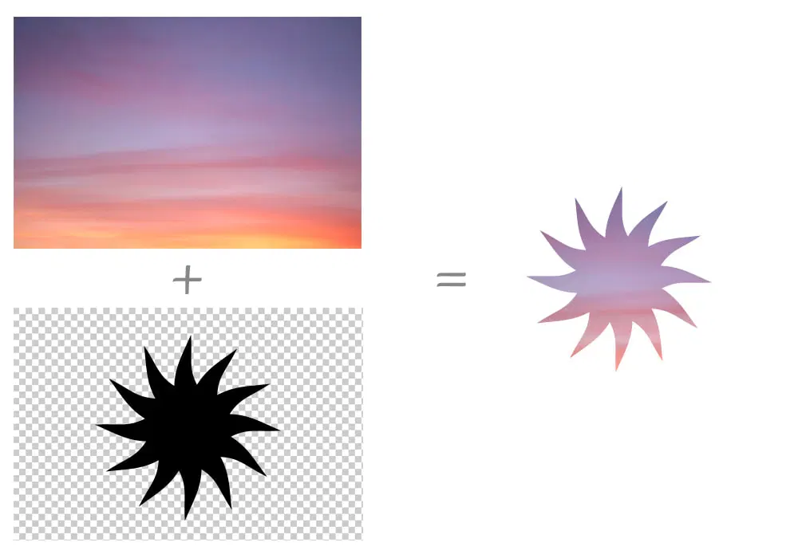
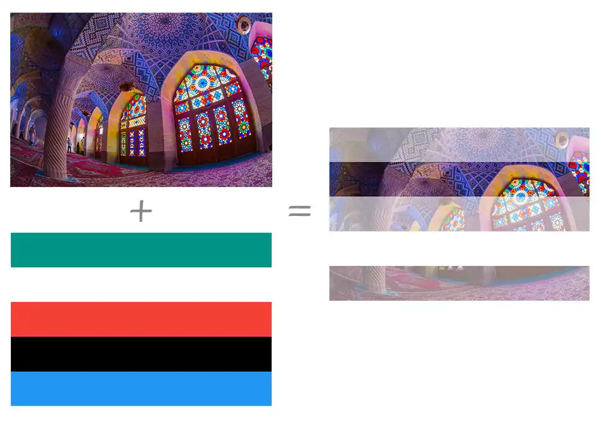

# Shape

[CSS shapes](https://css-tricks.com/the-shapes-of-css):

- `aspect-ratio`.
- `border`.
- `box-shadow` (inset).
- Background:
  `position`/`size`/`color`/`image`/[`gradient`](https://css-tricks.com/drawing-images-with-css-gradients).
  In modern browsers,
  background shapes with `transition`/`transform` are better than pseudo elements.
- [`clip-path`](https://css-tricks.com/using-css-clip-path-create-interactive-effects).
- `mask`
- `filter`.
- SVG:
  - SVG icon.
  - SVG filter.
  - SVG clip-path.
  - SVG mask.
- [Pseudo elements](https://css-tricks.com/pseudo-element-roundup).

## Shape Outside

[`shape-outside`](https://developer.mozilla.org/docs/Web/CSS/shape-outside)
provides a way to customize wrapping effect for `float` element,
combined with
[`shape-margin`](https://developer.mozilla.org/docs/Web/CSS/shape-margin)
[`shape-image-threshold](https://developer.mozilla.org/docs/Web/CSS/shape-image-threshold)
making it possible to wrap text around complex objects rather than simple boxes:

```css
.shape {
  float: left;
  shape-outside: polygon(50% 0, 100% 50%, 50% 100%, 0 50%);
  shape-image-threshold: 20%;
  shape-margin: 20px;
}
```

## Clip

[`clip`](https://developer.mozilla.org/docs/Web/CSS/clip)
属性只对 `absolute` 与 `fixed` 元素起作用,
是对 `overflow` 属性的有力补充
(`overflow` 对于上述两种元素的裁剪作用有限):

- `auto`.
- `rect(<top-length>, <right-length>, <bottom-length>, <left-length>)`.
- `clip` 元素 `clientWidth`, `clientHeight`, `computedStyle` 保持不变:
  仅视觉上裁剪, 元素尺寸仍为原本尺寸, 原始布局仍然保留.
- `clip` 元素非可见部分无法响应点击事件.

```css
.fixed-clip {
  position: fixed;
  clip-path: rect(30px 200px 200px 20px);
}
```

## Clip Path

[`clip-path`](https://developer.mozilla.org/docs/Web/CSS/clip-path):

- `none`.
- `<url>`.
- `<geometry-box> || <basic-shape>`:
  - `<geometry-box>`:
    - `border-box`.
    - `padding-box`.
    - `content-box`.
    - `margin-box`.
    - `fill-box`.
    - `stroke-box`.
    - `view-box`.
  - [`<basic-shape>`](https://developer.mozilla.org/docs/Web/CSS/basic-shape):
    - [`inset(<length-percentage>{1,4} [round <'border-radius'>]?)`](https://developer.mozilla.org/docs/Web/CSS/basic-shape/inset).
    - [`circle([<shape-radius>]? [at <position>]?)`](https://developer.mozilla.org/docs/Web/CSS/basic-shape/circle).
    - [`ellipse([<shape-radius>{2}]? [at <position>]?)`](https://developer.mozilla.org/docs/Web/CSS/basic-shape/ellipse).
    - [`polygon([<fill-rule>,]? [<length-percentage> <length-percentage>]#)`](https://developer.mozilla.org/docs/Web/CSS/basic-shape/polygon).
    - [`path([<fill-rule>,]? <string>)`](https://developer.mozilla.org/docs/Web/CSS/path).
- `clip-path` 元素 `clientWidth`, `clientHeight`, `computedStyle` 保持不变:
  仅视觉上裁剪, 元素尺寸仍为原本尺寸, 原始布局仍然保留.
- `clip-path` 元素非可见部分无法响应点击事件.
- [`<fill-rule>`](https://developer.mozilla.org/docs/Web/SVG/Attribute/fill-rule)
  用于确定复杂路径构成的图形的内部与外部, 内部填充, 外部透明.


```css
.clip-path {
  clip-path: inset(10% 20% 30% 40%);
  clip-path: circle(50% at 50% 50%);
  clip-path: ellipse(50% 25% at 50% 50%);
  clip-path: polygon(0 0, 100% 0, 100% 100%, 0 100%);
  clip-path: path('M 0 0 L 100 0 L 100 100 L 0 100 Z');
}
```

## Mask

[`mask`](https://developer.mozilla.org/docs/Web/CSS/mask):

- 元素应用 `mask` 属性遮罩效果后, 透明部分仍然可以响应点击事件.

### Mask Image

[`mask-image`](https://developer.mozilla.org/docs/Web/CSS/mask-image):

- `none`.
- `<url>#`.
- `<gradient>#`.
- `<image()>`.
- `<image-set()>`.
- `<paint()>`.
- `<element()>`.
- `<cross-fade()>`.

### Mask Mode

[`mask-mode`](https://developer.mozilla.org/docs/Web/CSS/mask-mode):

- `match-source`:
  根据 `mask-image` 类型自动选择模式,
  SVG `<mask>` 元素 (`url(#mask-id)`) 为 `luminance` 模式,
  其余场景 (包括 `url('mask.svg')`) 为 `alpha` 模式.
- `alpha`:
  基于透明度进行遮罩,
  `alpha(100%)` for show,
  `transparent` for hidden.
- `luminance`:
  基于亮度进行遮罩,
  `alpha(100%)` 且为亮色 for show,
  `alpha(100%)` 且为暗色 for hidden,
  `transparent` for hidden.

[](https://css-tricks.com/almanac/properties/m/mask-mode/#aa-alpha-masks)

[](https://css-tricks.com/almanac/properties/m/mask-mode/#aa-luminance-masks)

```css
img.alpha-mask {
  mask-image: linear-gradient(black, transparent);
  mask-mode: alpha;
}
```

[](https://css-tricks.com/almanac/properties/m/mask-mode/#aa-alpha-masks)

[](https://css-tricks.com/almanac/properties/m/mask-mode/#aa-luminance-masks)

### Mask Type

[`mask-type`](https://developer.mozilla.org/docs/Web/CSS/mask-type),
用于设置 SVG `<mask>` 元素的遮罩模式:

- `luminance`.
- `mask`.

### Mask Repeat

[`mask-repeat`](https://developer.mozilla.org/docs/Web/CSS/mask-repeat):

| Single Value | Two Value Equivalent  |
| ------------ | --------------------- |
| `no-repeat`  | `no-repeat no-repeat` |
| `repeat-x`   | `repeat no-repeat`    |
| `repeat-y`   | `no-repeat repeat`    |
| `repeat`     | `repeat repeat`       |
| `space`      | `space space`         |
| `round`      | `round round`         |

### Mask Position

[`mask-position`](https://developer.mozilla.org/docs/Web/CSS/mask-position):

```css
.mask-position {
  /* Keyword values */
  mask-position: center;
  mask-position: top right;
  mask-position: bottom left;

  /* <length-percentage> values */
  mask-position: 25% 75%;
  mask-position: 0 0;
  mask-position: 10% 8em;
}
```

### Mask Clip

[`mask-clip`](https://developer.mozilla.org/docs/Web/CSS/mask-clip):

- `border-box`.
- `padding-box`.
- `content-box`.
- `margin-box`.
- `fill-box`.
- `stroke-box`.
- `view-box`.
- `no-clip`.

### Mask Origin

[`mask-origin`](https://developer.mozilla.org/docs/Web/CSS/mask-origin):

- `border-box`.
- `padding-box`.
- `content-box`.
- `margin-box`.
- `fill-box`.
- `stroke-box`.
- `view-box`.

### Mask Size

[`mask-size`](https://developer.mozilla.org/docs/Web/CSS/mask-size)

- `auto{1,2}`.
- `cover`.
- `contain`.
- `<length-percentage>{12}`.

### Mask Composite

[`mask-composite`](https://developer.mozilla.org/docs/Web/CSS/mask-composite):

- `add`:
  所有遮罩图片直接合成一个完整的遮罩.
- `subtract`:
  顶层遮罩图片中, 与底层遮罩图片重合的区域不显示遮罩.
- `intersect`:
  顶层遮罩图片中, 与底层遮罩图片重合的区域才显示遮罩.
- `exclude`:
  遮罩图片重合的区域被当作透明区域 (`transparent`),
  其余区域直接合成一个完整的遮罩 (`add`).
- `mask-image` 中语法越靠后的遮罩图片层叠等级越低.

```css
.masked {
  width: 100px;
  height: 100px;
  background-color: #8cffa0;
  mask-image:
    url('https://mdn.mozillademos.org/files/12668/MDN.svg'), url('https://mdn.mozillademos.org/files/12676/star.svg');
  mask-size: 100% 100%;
  mask-composite: add;
}
```
