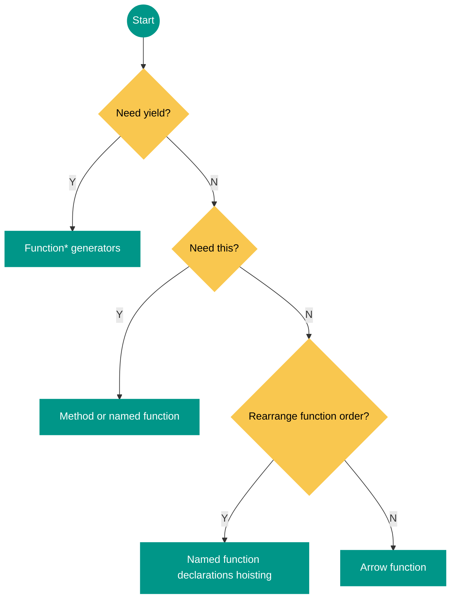

# Function

- 函数是对象.
- 函数提供局部作用域.
- Object 是 Function 的实例对象, **Function.prototype**是 Object 的实例对象.

```ts
const truthy = Object[[proto]] === Function.prototype // true
const truthy = Function[[proto]] === Function.prototype // true
const truthy = Function[[proto]][[proto]] === Object.prototype // true
```

## Implicit Invocation

- `Function Invocation` 普通调用模式: `this` 绑定至全局对象/`undefined` (`strict mode`)
  - setTimeout 和 setInterval 中传入的 Callbacks
    会自动转变为 `Function Invocation`,
    `this` bind to global/undefined object.
  - React Class Component 中传入的 Event Handlers
    会自动转变为 `Function Invocation`,
    需要显式地 `this.handleClick = this.handleClick.bind(this);`
- `Method Invocation` 方法调用模式: `this` 绑定至此方法所属的对象.

```ts
// Non-strict mode:
window.identity = 'The Window'

const object = {
  identity: 'My Object',
  getIdentityFunc() {
    return function () {
      return this.identity
    }
  },
}

// Function invocation:
// Anonymous closure function `this` bind to `window`.
console.log(object.getIdentityFunc()()) // 'The Window'
```

```ts
add(1, 2) // `this` -> `global`

const obj = {
  value: 1,
  foo() {
    // 若不将 `this` 赋值给 `that`, 而在内部函数中直接使用 `this.value`,
    // 则会发生错误: 内部函数的 `this` 指向全局对象而不是 `obj`.
    const that = this

    function inner() {
      return that.value
    }

    return inner()
  },
}

obj.foo() // 1
```

```ts
class Hero {
  constructor(heroName) {
    this.heroName = heroName
  }

  logName() {
    console.log(this.heroName)
  }
}

const batman = new Hero('Batman')
setTimeout(batman.logName, 1000)
// after 1 second logs "undefined"
```

## Explicit Invocation

`Apply`/`Bind`/`Call` Invocation:
函数引用不可以改变函数定义作用域 (scope), 但可以改变函数执行作用域 (context).

```ts
this.construct = Foo
this.construct(options)
// =>
Foo.call(this, options)
```

- `Function.call(contextObj, arg1, arg2, ...)`
- `Function.apply(contextArray, [arg1, arg2, ...]/arguments)`
- call 效率高于 apply.

```ts
window.function.call()
window.function.apply()
// js解释器临时将数组/字符串包装成对象原型.
;[].arrayStaticFunction.call()
;[].arrayStaticFunction.apply()
Array.prototype.arrayStaticFunction.call()
Array.prototype.arrayStaticFunction.apply()
''.stringStaticFunction.call()
''.stringStaticFunction.apply()
String.prototype.stringStaticFunction.call()
String.prototype.stringStaticFunction.apply()
```

相当于:

```ts
context.function(arguments)
```

### Explicit Bind Invocation

- Change function runtime context (ignore innovation pattern `function/method/new/call/apply`).
- Curry function.
- Can't change `this` in arrow function.

```ts
const boundFunc = func.bind(context, arg1, arg2, argN)
```

### Explicit Call and Apply Invocation

```ts
function bind(o, m) {
  return function (...args) {
    return m.apply(o, args)
  }
}
```

```ts
const one = {
  name: 'object',
  say(greet) {
    return `${greet}, ${this.name}`
  },
}
const two = { name: 'another object' }
const twoSay = bind(two, one.say)

twoSay('yo') // "yo, another object"
```

## Constructor Invocation

Constructor invocation (`new` call):

- `this` 绑定至传入的空对象.
- `new.target` 引用构造函数.

```ts
function newConstructor(Func, ...args) {
  // 1. 创建一个新对象
  const obj = {}
  // 2. 新对象原型指向构造函数原型对象
  obj[[proto]] = Func.prototype
  // 3. 将构建函数的 `this` 指向新对象
  const result = Func.apply(obj, args)
  // 4. 返回对象
  return result instanceof Object ? result : obj
}
```

:::tip[Function Invocation Priority]

`new` constructor invocation >
explicit invocation >
implicit invocation >
default invocation.

:::

## Arrow Function Invocation

- No `this` binding (**lexical scope**):
  - `this` defined where arrow function defined (not called).
  - Not suited as method:
    `this` in arrow function bound to lexical scope, not bound to method receiver.
  - `apply`/`call`/`bind` can't change `this` in arrow function.
- No `arguments` binding (**lexical scope**).
- Not suited as `new` constructor:
  - No `super` binding (**lexical scope**).
  - No `new.target` binding (**lexical scope**).
- No `function.prototype`: arrow function `prototype` property is `undefined`.
- No `yield` binding: 箭头函数不能用作 Generator 函数.

```ts
const obj = {
  foo() {
    const inner = () => {
      return this.value
    }

    return inner()
  },
}

const func = obj.foo

obj.foo() // `this` in `inner` function refer to `obj`
func() // `this` in `inner` function refer to `window`
```

[Difference](https://jrsinclair.com/articles/2025/whats-the-difference-between-named-functions-and-arrow-functions 'What’s the difference between named functions and arrow functions?')
between named functions and arrow functions:



## This Binding Invocation

|                                 | `function` Call | Method Call | `new` Call  |
| ------------------------------- | --------------- | ----------- | ----------- |
| Traditional `function` (sloppy) | `window`        | receiver    | instance    |
| Traditional `function` (strict) | `undefined`     | receiver    | instance    |
| Method (sloppy)                 | `window`        | receiver    | `TypeError` |
| Method (strict)                 | `undefined`     | receiver    | `TypeError` |
| Generator `function` (sloppy)   | `window`        | receiver    | `TypeError` |
| Generator `function` (strict)   | `undefined`     | receiver    | `TypeError` |
| Generator method (sloppy)       | `window`        | receiver    | `TypeError` |
| Generator method (strict)       | `undefined`     | receiver    | `TypeError` |
| Arrow `function`                | lexical         | lexical     | `TypeError` |
| Class                           | `TypeError`     | `TypeError` | SC protocol |

## Context and Scope

[执行上下文](https://juejin.cn/post/6844903682283143181):

- 每个上下文都有一个关联的变量对象 (**Variable Object**),
  这个上下文中定义的所有变量和函数都存在于这个对象上.
- 每个执行环境拥有独立的作用域链, 例如独立**活动对象** -> 独立全局对象:
  - `scope chain` -> `(list) [0]活动对象` -> `[1]全局对象`.
  - ES6 Block Scope -> Function Scope -> Global Scope.
- 全局上下文中关联的变量对象 (**Variable Object**), 会在代码执行期间始终存在.
- 函数上下文将其活动对象 (**Activation Object**) 用作变量对象 (**Variable Object**):
  - 函数每次运行时,
    都会新建执行环境上下文与作用域链,
    执行完后销毁上下文与作用域链.
  - 存在闭包时, 函数上下文关联的作用域链中被引用的活动对象不会被销毁.
- 可动态改变作用域链的语句:
  - `with`.
  - `try catch`: 异常对象入列, 位于作用域链链首.

```ts
function createComparisonFunction(propertyName) {
  return function (object1, object2) {
    const value1 = object1[propertyName]
    const value2 = object2[propertyName]

    if (value1 < value2)
      return -1
    else if (value1 > value2)
      return 1
    else
      return 0
  }
}

const compare = createComparisonFunction('name')
const result = compare({ name: 'Nicholas' }, { name: 'Matt' })
```

执行上述代码后的上下文栈与作用域链如下图所示:


`createComparisonFunction()` 的活动对象并不能在它执行完毕后销毁,
因为匿名函数的作用域链中仍然存在对它的引用.
在 `createComparisonFunction()` 执行完毕后,
其执行上下文的作用域链会销毁,
但它的活动对象仍然会保留在内存中,
直到匿名函数被销毁后才会被销毁.

## Function Name

- 所有函数对象都会暴露一个只读的 `name` 属性, 其中包含关于函数的信息.
- The spec operation
  [`SetFunctionName(F, name, [, prefix])`](https://tc39.es/ecma262/multipage/ordinary-and-exotic-objects-behaviours.html#sec-setfunctionname)
  sets up function `name`:
  - Getters and setters get prefixes `get` and `set`.
  - `Function.prototype.bind()` get prefix `bound`.
  - Function declaration name are set up when entering a scope (hoisted).
  - Named function expression name are set up via `SetFunctionName()`.
  - Arrow function and anonymous function expression name aren't set up
    (`SetFunctionName()` is not invoked).

```ts
function foo() {}
const bar = function () {}
function baz() {}

console.log(foo.name) // foo
console.log(bar.name) // bar
console.log(baz.name) // baz
console.log((() => {}).name) // (空字符串)
console.log(new Function().name) // anonymous
console.log(foo.bind(null).name) // bound foo

const dog = {
  years: 1,

  get age() {
    return this.years
  },

  set age(newAge) {
    this.years = newAge
  },
}

const propertyDescriptor = Object.getOwnPropertyDescriptor(dog, 'age')
console.log(propertyDescriptor.get.name) // get age
console.log(propertyDescriptor.set.name) // set age
```

## Function Prototype

- **实例化对象没有 prototype 属性**.
- 每个函数都有 `prototype` 属性.
- `prototype` 属性指向函数的原型对象 (由 JS 引擎自动创建).
- 每个函数的 `__proto__` 都指向 `Function.prototype`.

## Function Arguments

- 函数的参数在内部表现为一个数组:
  函数不关心参数个数与参数类型, 不存在验证命名参数的机制.
- `arguments` 不是真正的数组, 但有 `length` 属性 (实参个数).

### Arguments Callee

- 引用 arguments 所属 function, 可以利用 callee 实现匿名递归函数.
- `arguments.callee.length`: 即 `function.length`, 形参个数.
- 严格模式下禁止使用 `arguments.callee`.

```ts
try {
  // eslint-disable-next-line no-caller -- arguments.callee is deprecated
  if (arguments.length !== arguments.callee.length)
    throw new Error('传递的参数个数不匹配')
} catch (err) {
  console.log(err)
  return this
}
```

## Function Parameters

- 所有函数参数都是按值传递 (复制原子值/引用值).
- `function.length`:
  **number of parameters** before the first one with a default value.
- **无副作用**的函数: 注意是否需要拷贝传入对象, 使原有对象不受函数影响, 并返回新对象.

```ts
const obj = {
  value: 2,
}

function setValueEffect(obj, val) {
  obj.value = val
  return obj
}

function setValuePure(obj, val) {
  const instance = extend({}, obj, { value: val })
  return instance
}
```

### Default Parameter

默认参数:

- 默认参数可以使用原子值/对象值/函数返回值.
- 函数调用且未传参时, 默认参数才会进行求值.
- 默认参数按照从左往右的顺序进行求值.

```ts
// Mark required parameters via a function that throws an exception
function foo(required = throwException()) {}
```

### Rest Parameter

- Rest parameter is array containing all remaining arguments.
- Rest parameter can only be **last** parameter.

```ts
// Enforcing a maximum parameters
function f(x, y, ...empty) {
  if (empty.length > 0)
    throw new Error('Redundant parameters!')
}
```

## Function Declaration

- 函数声明提升: 函数声明会在代码执行之前获得定义.

```ts
console.log(foo.name)

// Function Declaration 函数声明:
function foo() {}

const obj = {
  say: function say() {},
}
```

- 函数声明对于函数内部而言无法修改:

```ts
const b = 10
;(function b() {
  b = 20
  console.log(b)
})()

// print out function b { ... }
```

## Function Expression

任何时候,
只要函数被当作值来使用,
它就是一个函数表达式:

```ts
// 函数表达式:
const foo = function foo() {}

// `function f() {}` 是命名函数表达式:
const factorial = function f(num) {
  if (num <= 1)
    return 1
  else
    return num * f(num - 1)
}
```

The name `funcExpr` only exists inside the function body:

```ts
const func = function funcExpr() {
  return funcExpr
}

assert.equal(func(), func)
assert.throws(() => funcExpr(), ReferenceError)
```

## Immediately Invoked Function Expression

### IIFE Pattern

立即函数模式, 通过调用立即匿名函数,
返回一个对象, 暴露公共接口 (Exposed to Public):

- IIFE Syntax:
  - 函数表达式.
  - 末尾添加括号(传参), 使函数立即执行.
  - 将整个函数置于括号内.
- 闭包: 定义私有变量与特权方法.
- 返回对象: 即使通过外部代码改变返回对象的接口, 也不会影响原接口.

```ts
;(function () {
  console.log('watch out')
})()
```

### IIFE Return Value

Left hand side 不被赋予 function 值, 而被赋予函数执行后的返回值:
此返回值可设为函数, 可产生闭包.

```ts
const getResult = (function () {
  const res = 2 + 2
  return function () {
    return res
  }
})()
```

### IIFE Usage

- 使得匿名函数内部的代码能够立即执行.
- 不泄漏只使用一次的局部变量与方法.
- 创建命名空间, 防止变量命名冲突.

```ts
const obj = (function () {
  // private member
  let name = 'tazimi'

  // private method
  // excluded in return object

  // privileged method
  function getName() {
    return name
  }

  function setName(n) {
    if (typeof n === 'string')
      name = n

    return this
  }

  // public method
  function logName() {
    console.log(name)
  }

  // 闭包
  // 公共接口: 特权/公共方法
  return {
    // 特权方法
    getName,
    setName,

    // 公共方法
    log: logName,
  }
})()
```

```ts
const App = App || {}
App.utils = {}
;(function () {
  let val = 5

  this.getValue = function () {
    return val
  }

  this.setValue = function (newVal) {
    val = newVal
  }

  // also introduce a new sub-namespace
  this.tools = {}
}).apply(App.utils)

// inject new behavior into the tools namespace
// which we defined via the utilities module
;(function () {
  this.diagnose = function () {
    return 'diagnosis'
  }
}).apply(App.utils.tools)
```

## Tail Call Optimization

- Tail call optimization only work in strict mode
  due to `func.arguments` and `func.caller` (forbidden in strict mode):
  `func.arguments` and `func.caller` will reference outer function stack frame,
  so can't reduce outer function stack frame.
- Tail call optimization reduce function stack frame.

```ts
// Following function is not tail recursive:
function factorial(x) {
  if (x <= 0)
    return 1
  else
    return x * factorial(x - 1) // (A): Not tail position.
}

function factorial(n) {
  return facRec(n, 1)
}

// Following function is tail recursive:
function facRec(x, acc) {
  if (x <= 1)
    return acc
  else
    return facRec(x - 1, x * acc) // (A): Tail position.
}
```

## Closure

Closure is a **function**
that remembers the variables from the place where it is defined (lexical scope),
regardless of where it is executed later:

- 函数外部不可对函数内部进行赋值或引用.
- 函数中的闭包函数可对函数进行赋值或引用 (函数对于闭包来说是外部, 即内部引用外部).
- 特权性质 (Private Getter): 从外部通过闭包方法访问内部 (函数作用域) 局部变量.
- Local Scope -> Outer Functions Scope -> Global Scope.
- 闭包中的变量全部保存在堆内存中, 防止函数结束后变量内存被自动回收.

```ts
// global scope
const e = 10

function sum(a) {
  return function (b) {
    return function (c) {
      // outer functions scope
      return function (d) {
        // local scope
        return a + b + c + d + e
      }
    }
  }
}

console.log(sum(1)(2)(3)(4)) // log 20
```

```ts
// BAD
function MyObject(name, message) {
  this.name = name.toString()
  this.message = message.toString()
  this.getName = function () {
    return this.name
  }

  this.getMessage = function () {
    return this.message
  }
}

// GOOD: avoid unnecessary
function MyObject(name, message) {
  this.name = name.toString()
  this.message = message.toString()
}
MyObject.prototype.getName = function () {
  return this.name
}
MyObject.prototype.getMessage = function () {
  return this.message
}
```

### Closure Structure

- 优先级: this > 局部变量 > 形参 > arguments > 函数名.
- `innerFunc()` has access to `outerVar` from its lexical scope,
  even being **executed outside of its lexical scope**.

```ts
function outerFunc() {
  const outerVar = 'I am outside!'

  function innerFunc() {
    console.log(outerVar) // => logs "I am outside!"
  }

  return innerFunc
}

const myInnerFunc = outerFunc()
myInnerFunc()
```

### Closure Usage

- 闭包实现封装.
- 闭包实现私有属性与方法.
- 闭包实现工厂方法.
- 闭包实现对象缓存.

```ts
const createLoginLayer = (function (creator) {
  let singleton

  return function () {
    if (!singleton)
      singleton = creator()
    return singleton
  }
})(loginCreator)
```

```ts
const { called } = new (class {
  count = 0
  called = () => {
    this.count++
    console.log(`Called : ${this.count}`)
  }
})()

called() // Called : 1
called() // Called : 2
```

## Callback Function

```ts
// check if callback is callable
if (typeof callback !== 'function')
  callback = false

// now callback:
if (callback)
  callback()
```

```ts
function findNodes(callback) {
  let i = 100000
  const nodes = []
  let found

  // check if callback is callable
  if (typeof callback !== 'function')
    callback = false

  while (i) {
    i -= 1

    // now callback:
    if (callback)
      callback(found)

    nodes.push(found)
  }

  return nodes
}
```

当回调函数为对象方法时 (特别时方法中使用 this 指针),
需同时传入对象参数,
并利用 `apply/call` 改变执行环境.

```ts
function findNodes(callbackObj, callback) {
  if (typeof callback === 'function')
    callback.call(callbackObj, found)
}

function findNodes(callbackObj, callback) {
  if (typeof callback === 'string')
    callback = callbackObj[callback]

  if (typeof callback === 'function')
    callback.call(callbackObj, found)
}
```

## Lazy Function Definition

Lazy Function Definition (Self-Defining Function):

- 第一次执行时,进行初始化并重新定义函数变量.
- 第二次执行时,不再进行初始化(函数被重定义至真正函数).
- 第一次执行为 promise, 将重复使用的部分进行初始化, 之后的调用不再浪费新空间, **提升性能**.

```ts
// definition
let foo = function () {
  // initialize code;
  const t = new Date()

  foo = function () {
    return t
  }

  // 使得第一次调用可以产生预期值,保证每次调用的行为保持一致
  return foo()
}

// first run: same behavior as second run
console.log(foo()) // t
// second run
console.log(foo()) // t
```

```ts
let addEvent = function (el, type, handle) {
  addEvent = el.addEventListener
    ? function (el, type, handle) {
      el.addEventListener(type, handle, false)
    }
    : function (el, type, handle) {
      el.attachEvent(`on${type}`, handle)
    }

  // 保持每次调用对外表现行为一致
  addEvent(el, type, handle)
}
```

## Polymorphism Function

```ts
function greet(options, ...rest) {
  // 运用 if/switch 方法分情况调用函数, 实现多态方法.
  if (typeof options === 'string' && typeof methods[options] === 'function') {
    // 方法集中含有此方法:
    return methods[options](...rest)
  }
}
```

:::tip[多态与面向对象]

多态最根本的作用:
通过把过程化的条件分支语句转化为对象的多态性,
从而消除条件分支语句.

每个对象的职责, 成为该对象的属性与方法,
被安装在对象内部, 每个对象负责它们自己的行为.
这些对象可以根据同一个消息, 有条不紊地分别进行各自的工作.

:::

## Eval Function

- 不要使用`eval()`函数
- 不要使用字符串作参数 new Function();(会调用`eval`函数)
- 不要使用字符串作`setTimeOut`/`setInterval`的第一个参数(会调用`eval`函数)

```ts
// Anti-pattern:
const property = 'name'
// eslint-disable-next-line no-eval -- eval is dangerous
alert(eval(`obj.${property}`))
// Preferred:
const property = 'name'
alert(obj[property])

// Anti-pattern:
// eslint-disable-next-line no-implied-eval -- eval is dangerous
setTimeout('myFunc()', 1000)
// eslint-disable-next-line no-implied-eval -- eval is dangerous
setTimeout('myFunc(1, 2, 3)', 1000)

// Preferred:
setTimeout(myFunc, 1000)
setTimeout(() => {
  myFunc(1, 2, 3)
}, 1000)
```
