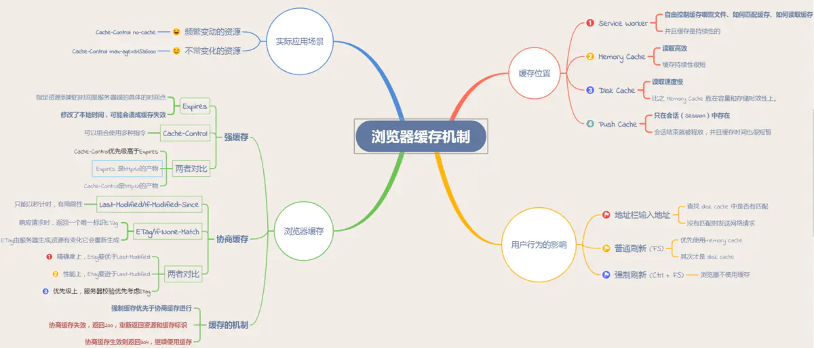

# JavaScript Performance Notes

## Effective JavaScript

### Memory Leak

- Useless global vars (bind to window or document).
- Useless DOM reference.
- Incorrect closure.
  - Unnecessary closure creation:
    闭包会保留它们包含函数的作用域, 所以比其他函数更占用内存.
  - Useless callback functions.
  - Forgotten timer from `setTimeout`/`setInterval`:
    clear with `clearTimeout`/`clearInterval`.
- Forgotten tick timer.
- Forgotten event listener:
  clear with `removeEventListener`.
- Forgotten subscriber:
  clear with `unsubscribe(id)`.
- Forgotten console log:
  clear with `babel`/`tsc`.
- Forgotten `Set`/`Map`:
  `WeakSet`/`WeakMap` don't bother GC.
- Circular reference.
- Bad `delete` Operator:
  `delete` 操作符并不会释放内存,
  而且会使得附加到对象上的
  `hidden class` (`V8` 为了优化属性访问时间而创建的隐藏类) 失效,
  让对象变成 `slow object`.

### Danger Features

- `eval()`.
- `with () {}`.
- `new Function()`.

### Function Performance

#### Local Variables Performance

- 局部变量引用全局变量/全局变量作为参数传入函数: 加快符号解析.
- 局部变量缓存 DOM 元素.
- 局部变量缓存布局信息.
- 局部变量引用嵌套成员: 加快原型链查找.
- 局部变量引用方法时, 应注意会动态改变 this 指针.

```ts
const DOM = tazimi.util.Dom

DOM.method.call(/* 关注 this 指针 */)
```

#### Scope Chain Performance

由于作用域链的关系, 标识符解析时,
寻找局部变量速度远快于寻找全局变量速度 (作用域链越长, 查找变量所需时间越长).
故应将全局变量作为参数传入函数进行调用, 不但效率高, 而且易于维护与测试.
即**利用局部变量引用全局变量, 加快标识符解析**.

#### Memoization Function

```ts
function memoize(fn) {
  return (
    (cache = Object.create(null)) =>
      (...args) => {
        return cache[args] || (cache[args] = fn(...args))
      }
  )()
}

const memoizedGetDistance = memoize(getDistance)

memoizedGetDistance('Murcia', 'Madrid') // => computed, slow
memoizedGetDistance('Murcia', 'Madrid') // => cached, fast!
```

### Loop Performance

倒序循环可提升性能:

```ts
for (let i = item.length; i--;)
  process(items[i])

let j = items.length
while (j--)
  process(items[i])

let k = items.length
do
  process(items[k])
while (k--)
```

Duff's Device:

```ts
let i = items.length % 8

while (i)
  process(items[i--])

i = Math.floor(items.length / 8)

while (i) {
  process(items[i--])
  process(items[i--])
  process(items[i--])
  process(items[i--])
  process(items[i--])
  process(items[i--])
  process(items[i--])
  process(items[i--])
}
```

### Math Performance

#### Bit Operators

- `i%2` => `i&0x1`.
- 位掩码

```ts
const OPTION_A = 1
const OPTION_B = 2
const OPTION_C = 4
const OPTION_D = 8
const OPTION_E = 16

const options = OPTION_A | OPTION_C | OPTION_D
```

### Reduce Repeat Manipulation

- 特性/浏览器检测代码只运行一次.
- 惰性定义模式/自定义模式.

### Timer Performance

JavaScript 代码与 UI 共享线程.

`setTimeout`/`setInterval`:

- 第二个参数: 不是执行时间, 是加入执行队列时间.
- 若其他位于执行队列中的函数执行时间超过延时, 则用户感觉不到延时的存在.
- 模拟有间隙的循环, 使得 UI 更新得以进入浏览器线程的执行队列中.
- 通过 MicroTask/MicroTask 实现时间分片调度器,
  使得长任务不阻塞页面操作 (60 FPS):
  e.g React Scheduler and Reconciler, Vue `nextTick` API.

```ts
const button = document.getElementById('myButton')

button.onclick = function () {
  oneMethod()

  setTimeout(() => {
    document.getElementById('notice').style.color = 'red'
  }, 250)
}
```

```ts
/*
 * usage: start -> stop -> getTime
 */
const Timer = {
  _data: {},
  start(key) {
    Timer._data[key] = new Date()
  },
  stop(key) {
    const time = Timer._data[key]

    if (time)
      Timer._data[key] = new Date() - time
  },
  getTime(key) {
    return Timer._data[key]
  },
}
```

```ts
function pollTimerTask(time) {
  if (timerQueue.length === 0)
    return

  while (timerQueue[0] && time >= timerQueue[0].time) {
    const timer = timerQueue.shift()

    while (timer.tickerQueue.length) {
      const { id, callback, delay, loop, defer } = timer.tickerQueue.shift()

      callback(time)

      if (loop && idPool[id].exist) {
        let nextTime = timer.time + delay

        // 当回调函数执行时间超过多个执行周期时
        if (time - nextTime > delay) {
          nextTime = nextTime + Math.floor((time - nextTime) / delay) * delay

          // 延迟执行时, 将 nextTime 推迟至下一个执行周期
          defer && (nextTime += delay)
        }

        registerTimerWithId({
          id,
          callback,
          time: nextTime,
          delay,
          loop,
          defer,
        })
      } else {
        // 当回调函数不需要周期执行或在回调函数中执行 unregister 时
        delete idPool[id]
      }
    }
  }
}
```

#### Time Slicing

```ts
function saveDocument(id) {
  // 利用闭包封装待执行任务
  const tasks = [openDocument, writeText, closeDocument, updateUI]

  setTimeout(function sliceTask() {
    // 执行下一个任务
    const task = tasks.shift()
    task(id)

    // 检查是否还有其他任务
    if (tasks.length > 0) {
      // 递归调用(每次参数不同)
      setTimeout(sliceTask, 25)
    }
  }, 25)
}
```

```ts
function processArray(items, process, callback) {
  // 克隆原数组
  const todo = items.concat()

  setTimeout(function sliceTask() {
    process(todo.shift())

    if (todo.length > 0)
      setTimeout(sliceTask, 25)
    else
      callback(items)
  }, 25)
}
```

#### Task Batching and Scheduling

[Prioritized task scheduler API](https://developer.mozilla.org/en-US/docs/Web/API/Prioritized_Task_Scheduling_API):

```ts
async function saveSettings() {
  const tasks = [
    validateForm,
    showSpinner,
    saveToDatabase,
    updateUI,
    sendAnalytics,
  ]

  let deadline = performance.now() + 50

  while (tasks.length > 0) {
    if (
      navigator.scheduling?.isInputPending()
      || performance.now() >= deadline
    ) {
      // 1. Pending user input.
      // 2. deadline has been reached.
      // Yield here:
      await yieldToMain()

      // Extend the deadline.
      deadline += 50
      continue
    }

    // Run task.
    const task = tasks.shift()
    task()
  }
}

function yieldToMain() {
  return new Promise((resolve) => {
    setTimeout(resolve, 0)
  })
}
```

#### Debounce and Throttle

防抖动和节流本质是不一样的:

- `debounce`:
  防抖动是将多次执行变为最后一次执行 (可用于检测某个连续的 DOM 操作结束, 如 `resize`/`scroll` 停止).
- `throttle`:
  节流是将多次执行变成每隔一段时间执行 (保证一定时间内只执行一次).

Simple debounce:

```ts
function debounce(action, delay) {
  let timer = null

  return function () {
    if (timer)
      clearTimeout(timer)
    timer = setTimeout(() => {
      action()
    }, delay)
  }
}
```

Simple throttle:

```ts
function throttle(action) {
  let isRunning = false

  return function () {
    if (isRunning)
      return

    isRunning = true

    window.requestAnimationFrame(() => {
      action()
      isRunning = false
    })
  }
}

function throttle(func, timeFrame) {
  let lastTime = 0

  return function (...args) {
    const now = new Date()

    if (now - lastTime >= timeFrame) {
      func(...args)
      lastTime = now
    }
  }
}
```

Lodash debounce:

```ts
// 这个是用来获取当前时间戳的
function now() {
  return +new Date()
}

/**
 * 防抖函数, 返回函数连续调用时, 空闲时间必须大于或等于 wait, func 才会执行
 *
 * @param  {Function} func        回调函数
 * @param  {number}   wait        表示时间窗口的间隔
 * @param  {boolean}  immediate   设置为 true 时, 是否立即调用函数
 * @return {Function}             返回客户调用函数
 */
function debounce(func, wait = 50, immediate = true) {
  let timer, context, args

  // 延迟执行函数
  const later = () =>
    setTimeout(() => {
      // 延迟函数执行完毕, 清空缓存的定时器序号
      timer = null
      // 延迟执行的情况下, 函数会在延迟函数中执行
      // 使用到之前缓存的参数和上下文
      if (!immediate) {
        func.apply(context, args)
        context = args = null
      }
    }, wait)

  // 这里返回的函数是每次实际调用的函数
  return function (...params) {
    // 如果没有创建延迟执行函数 (later), 就创建一个
    if (!timer) {
      timer = later()
      // 如果是立即执行, 调用函数
      // 否则缓存参数和调用上下文
      if (immediate) {
        func.apply(this, params)
      } else {
        context = this
        args = params
      }
    } else {
      // 如果已有延迟执行函数 (later), 调用的时候清除原来的并重新设定一个
      // 这样做延迟函数会重新计时
      clearTimeout(timer)
      timer = later()
    }
  }
}
```

Lodash throttle:

```ts
/**
 * Lodash 节流函数, 返回函数连续调用时, func 执行频率限定为 次 / wait
 *
 * @param  {Function}   func      回调函数
 * @param  {number}     wait      表示时间窗口的间隔
 * @param  {object}     options   如果想忽略开始函数的的调用, 传入{leading: false}.
 *                                如果想忽略结尾函数的调用, 传入{trailing: false}
 *                                两者不能共存, 否则函数不能执行
 * @return {Function}             返回客户调用函数
 */
_.throttle = function (func, wait, options) {
  let context, args, result
  let timeout = null
  // 之前的时间戳
  let previous = 0
  // 如果 options 没传则设为空对象
  if (!options)
    options = {}

  // 定时器回调函数
  const later = function () {
    // 如果设置了 leading, 就将 previous 设为 0
    // 用于下面函数的第一个 if 判断
    previous = options.leading === false ? 0 : _.now()
    // 置空一是为了防止内存泄漏, 二是为了下面的定时器判断
    timeout = null
    result = func.apply(context, args)
    if (!timeout)
      context = args = null
  }

  return function (...original_args) {
    // 获得当前时间戳
    const now = _.now()

    // 首次进入前者肯定为 true
    // 如果需要第一次不执行函数
    // 就将上次时间戳设为当前的
    // 这样在接下来计算 remaining 的值时会大于0
    if (!previous && options.leading === false)
      previous = now

    // 计算剩余时间
    const remaining = wait - (now - previous)
    context = this
    args = original_args

    // 如果当前调用已经大于上次调用时间 + wait
    // 或者用户手动调了时间
    // 如果设置了 trailing, 只会进入这个条件
    // 如果没有设置 leading, 那么第一次会进入这个条件
    // 还有一点, 你可能会觉得开启了定时器那么应该不会进入这个 if 条件了
    // 其实还是会进入的, 因为定时器的延时
    // 并不是准确的时间, 很可能你设置了2秒
    // 但是他需要2.2秒才触发, 这时候就会进入这个条件
    if (remaining <= 0 || remaining > wait) {
      // 如果存在定时器就清理掉否则会调用二次回调
      if (timeout) {
        clearTimeout(timeout)
        timeout = null
      }

      previous = now
      result = func.apply(context, args)
      if (!timeout)
        context = args = null
    } else if (!timeout && options.trailing !== false) {
      // 判断是否设置了定时器和 trailing
      // 没有的话就开启一个定时器
      // 并且不能不能同时设置 leading 和 trailing
      timeout = setTimeout(later, remaining)
    }

    return result
  }
}
```

#### Animation Frame Throttling

```ts
function useAnimation() {
  const frameId = useRef(0)
  const ticking = useRef(false)

  const handleResize = (event) => {
    if (ticking.current)
      return
    ticking.current = true
    frameId.current = requestAnimationFrame(() => handleUpdate(event))
  }

  const handleUpdate = (event) => {
    console.log('resize update')
    ticking.current = false
  }

  useMount(() => {
    window.addEventListener('resize', handleResize)
    handleUpdate()

    return () => {
      window.removeEventListener('resize', handleResize)
      cancelAnimationFrame(frameId.current)
    }
  })
}
```

### Event Delegation

- 事件委托利用的是事件冒泡机制, 只制定一事件处理程序, 就可以管理某一类型的所有事件.
- Increases performance and reduces memory consumption:
  - 使用事件委托, 只需在 DOM 树中尽量最高的层次上添加一个事件处理程序.
  - No need to register new event listeners for newer children.
- DOM Event:
  Event Capturing (default false) ->
  Event Target ->
  Event Bubbling (default true).

```ts
window.onload = function () {
  const oUl = document.getElementById('ul')
  const aLi = oUl.getElementsByTagName('li')

  oUl.onmouseover = function (e) {
    const e = e || window.event
    const target = e.target || e.srcElement

    // alert(target.innerHTML);

    if (target.nodeName.toLowerCase() === 'li')
      target.style.background = 'red'

    // 阻止默认行为并取消冒泡
    if (typeof e.preventDefault === 'function') {
      e.preventDefault()
      e.stopPropagation()
    } else {
      e.returnValue = false
      e.cancelBubble = true
    }
  }

  oUl.onmouseout = function (e) {
    const e = e || window.event
    const target = e.target || e.srcElement

    // alert(target.innerHTML);

    if (target.nodeName.toLowerCase() === 'li')
      target.style.background = ''

    // 阻止默认行为并取消冒泡
    if (typeof e.preventDefault === 'function') {
      e.preventDefault()
      e.stopPropagation()
    } else {
      e.returnValue = false
      e.cancelBubble = true
    }
  }
}
```

## DOM Performance

- 局部变量缓存 DOM 元素.
- 局部变量缓存布局信息.

```ts
const btn = document.getElementById('btn')
```

- HTML Collection 转化成数组再操作.

```ts
function toArray(coll) {
  for (let i = 0, a = [], len = coll.length; i < len; i++)
    a[i] = coll[i]

  return a
}
```

- `children` 优于 `childNodes`.
- `childElementCount` 优于 `childNodes.length`.
- `firstElementChild` 优于 `firstChild`.
- `lastElementChild` 优于 `lastChild`.
- `nextElementSibling` 优于 `nextSibling` 优于 `childNodes[next]`.
- `previousElementSibling` 优于 `previousSibling`.

### Layout and Paint Performance

- 重排 (`reflow`): 重新构造渲染树, 从 `layout` 阶段开始.
- 重绘 (`repaint`): 重新绘制受影响部分, 从 `paint` 或 `composite` 阶段开始.

**获取**或改变布局的操作会导致渲染树**变化队列**刷新,
执行渲染队列中的**待处理变化**,
重排 DOM 元素.

### DOM Manipulation Performance

- 先 `display="none"`, 修改完成后, `display=""`.
- 使待修改 DOM 元素脱离标准文档流(改变布局／定位方式), 可减少其他元素的重绘次数.
- `document.createDocumentFragment()`.

```ts
const fragment = document.createDocumentFragment()
appendDataToElement(fragment, data)
document.getElementById('myList').appendChild(fragment)
```

- oldNode.cloneNode(true);

```ts
const old = document.getElementById('myList')
const clone = old.cloneNode(true)

appendDataToElement(clone, data)
old.parentNode.replaceChild(clone, old)
```

### Animation Frame Performance

run scripts as early as possible:
`requestAnimationFrame()` runs after the CPU work is done (UI events and JS scripts),
and just before the frame is rendered (layout, paint, composite etc.).

### CSSOM Performance

在 js 中(除定位属性) 外, 不直接操作 element.style.attr/element.cssText:

```ts
element.classList.add('className')
element.className += ' className'
```

:::tip Pipeline

Script -> Style -> Layout -> Paint -> Composite.

:::

Make `script` stage become: read then write.
Interleaved read and write will trigger multiple times
of re-layout/repaint/re-composite.

:::danger Forced Synchronous Layout

read css -> write css (re-layout/paint/composite)
-> read css -> write css (re-layout/paint/composite)
-> read css -> write css (re-layout/paint/composite).

:::

:::tip High Performance

read css -> write css (only re-layout/paint/composite once).

:::

## Browser Caches

[Browser caches](https://github.com/ljianshu/Blog/issues/23)
从缓存位置上来说分为四种, 并且各自有优先级,
当依次查找缓存且都没有命中的时候, 才会去请求网络:

- Service Worker: PWA.
- (In-) Memory Cache: reload Tab page.
- (On-) Disk Cache: big files.
- Push Cache: HTTP/2.

[](https://web.dev/service-worker-caching-and-http-caching)

```ts
globalThis.addEventListener('install', (event) => {
  async function buildCache() {
    const cache = await caches.open(cacheName)
    return cache.addAll(['/main.css', '/main.mjs', '/offline.html'])
  }
  event.waitUntil(buildCache())
})

globalThis.addEventListener('fetch', (event) => {
  async function cachedFetch(event) {
    const cache = await caches.open(cacheName)
    let response = await cache.match(event.request)
    if (response)
      return response
    response = await fetch(event.request)
    cache.put(event.request, response.clone())
    return response
  }
  event.respondWith(cachedFetch(event))
})
```

### HTTP Cache

浏览器缓存, 也称 [HTTP 缓存](https://web.dev/http-cache),
分为强缓存和协商缓存.
优先级较高的是强缓存,
在命中强缓存失败的情况下或者
`Cache-Control: no-cache` (`no-cache` allows caches but requires revalidate) 时,
才会走协商缓存.

[](https://developer.mozilla.org/docs/Web/HTTP/Caching)

#### Local Cache

强缓存是利用 HTTP 头中的 `Expires` 和 `Cache-Control` 两个字段来控制的.
强缓存中, 当请求再次发出时, 浏览器会根据其中的 `Expires` 和 `Cache-Control` 判断目标资源是否 `命中` 强缓存,
若命中则直接从缓存中获取资源, 不会再与服务端发生通信.
`Cache-Control` 相对于 `Expires` 更加准确, 它的优先级也更高,
当 `Cache-Control` 与 `Expires` 同时出现时, 以 `Cache-Control` 为准.

```bash
Expires: Wed, 12 Sep 2019 06:12:18 GMT
Cache-Control: max-age=31536000
```

`Cache-Control` directives:

- `public`: 允许代理服务器缓存资源.
- `private`: 不允许代理服务器缓存资源, 只有浏览器可以缓存.
- `immutable`: 就算过期了也不用协商, 资源就是不变的.
- `max-age=<time>`: 资源过期时间 (浏览器计算), 比 `Expires` 精准 (服务器计算).
- `s-maxage=<time>`: 代理服务器的资源过期时间.
- `max-stale=<time>`: 允许使用过期资源, 指定允许时间.
- `stale-while-revalidate=<time>`:
  在验证 (协商) 期间, 返回过期的资源.
  If the cached page has expired,
  then it will send a stale version while it revalidate the page in the background.
  The page load is never blocked for the user,
  though it won't be perfectly fresh for everyone.
- `stale-if-error=<time>`: 验证 (协商) 出错的话, 返回过期的资源.
- `must-revalidate`: 强缓存过期后, 强制等待协商缓存, 不允许使用过期资源.
- `no-store`: 禁止强缓存和协商缓存.
- `no-cache`: 禁止强缓存, 允许协商缓存.


Cache the response of the API request, serve the cached version to any visitor,
but automatically [revalidate the cached object in the background](https://developers.netlify.com/guides/how-to-make-edge-rendering-fast):

```ts
export default async () => {
  const resp = await fetch('https://hacker-news.firebaseio.com/v0/topstories.json')
  const ids = await resp.json()

  const stories = await Promise.all(
    ids.slice(0, 100).map(async (id) => {
      const story = await fetch(`https://hacker-news.firebaseio.com/v0/item/${id}.json`)
      return story.json()
    })
  )

  return new Response(JSON.stringify(stories), {
    headers: {
      'content-type': 'application/json',
      'netlify-cdn-cache-control': 'public, max-age=0, stale-while-revalidate=86400',
    },
  })
}
```

Page is stale after 5 minutes,
but tells the CDN to return the stale response
and [regenerate it in the background unless it’s over a week old](https://developers.netlify.com/guides/how-to-do-advanced-caching-and-isr-with-astro).
A popular page will always be fresh, but a rarely-visited one will not keep re-rendering:

```ts
// Tell the browser to always check the freshness of the cache
Astro.response.headers.set('Cache-Control', 'public, max-age=0, must-revalidate')

// Tell the CDN to treat it as fresh for 5 minutes,
// then return a stale version while it revalidate.
Astro.response.headers.set(
  'Netlify-CDN-Cache-Control',
  'public, s-maxage=604800, stale-while-revalidate=604800'
)
```

#### Server Cache

协商缓存机制下,
浏览器需要向服务器去询问缓存的相关信息,
进而判断是重新发起请求/下载完整的响应,
还是从本地获取缓存的资源.
如果服务端提示缓存资源未改动 (`Not Modified`),
资源会被重定向到浏览器缓存,
这种情况下网络请求对应的状态码是 `304`.

`Last-Modified` 是一个时间戳,
如果启用了协商缓存,
它会在首次请求时随着 response headers 返回:

```bash
Last-Modified: Fri, 27 Oct 2017 06:35:57 GMT
```

随后每次请求时, 会带上一个叫 `If-Modified-Since` 的时间戳字段,
它的值正是上一次 response 返回给它的 `Last-Modified` 值:

```bash
If-Modified-Since: Fri, 27 Oct 2017 06:35:57 GMT
```

服务器可能无法正确感知文件的变化 (未实际改动或改动过快),
为了解决这样的问题, `Etag` 作为 `Last-Modified` 的补充出现了.
`Etag` 是由服务器为每个资源生成的唯一的标识字符串,
这个标识字符串可以是基于文件内容编码的,
因此 `Etag` 能够精准地感知文件的变化.

```bash
GET /i/example.gif HTTP 1.1
Host: image.example.com

------

HTTP 1.1 200 OK
Last-Modified: Tue, 12 Dec 2022 03:03:03 GMT
ETag: "10c24bc-4ab-457e1c1f"
Content-Length: 1195
```

```bash
GET /i/example.gif HTTP 1.1
Host: image.example.com
If-Modified-Since: Tue, 12 Dec 2022 03:03:03 GMT
If-None-Match: "10c24bc-4ab-457e1c1f"

------

HTTP 1.1 304 Not Modified
```

### Code Cache

- cold run: `download -> compile -> store into on-disk cache`
- warm run: `fetch from browser cache -> compile -> store metadata`
- hot run: `fetch scripts and metadata from browser cache -> skip compile`
- positive case: IIFE function heuristics
- passive case: too small (`< 1KB`) and inline scripts

## Render Blocking Resources

### Render Blocking Resources Type

Render blocking resources are files that 'press pause'
on the critical rendering path.
They interrupt one or more of the steps:

- HTML is technically render blocking resources
  (but not usually the cause of rendering performance problem)
- CSS is render blocking:
  render tree can't continue until both the CSSOM and DOM are created.
- JavaScript can be render blocking:
  when browser encounters a script meant to run synchronously,
  it will stop DOM creation until script finished.
- If CSS appears before a script,
  the script will not be executed until the CSSOM is created:
  CSSOM -> CSS block JS -> JS block HTML parser.
- Images and fonts are not render blocking.

[](https://sia.codes/posts/render-blocking-resources/#critical-render-path-js)

### Render Blocking Resources Performance

- Reduce CSS and JavaScript bytes.
- Lazy loading non-critical CSS and JavaScript.
- Use the `defer`, `async`, or `module` attribute on scripts.

## Images Performance

- Responsive images with `srcset` (LCP):
  - Modern format: WebP/SVG.
  - Correspond size.
- Hero images pre-fetch loading (LCP).
- Offscreen images lazy loading (INP).
- Critical render path blocking images (INP):
  - Images compression and minification.
  - Images CDN.
- Images placeholder with `aspect-ratio` (CLS).

### Responsive Images

[Responsive images](https://danburzo.ro/responsive-images-html)
provide 3 ~ 5 different sizes reduce image transfer sizes by average of **~20%**:

```html
<picture>
  <source
    srcset="/media/filename.avif 300w, /media/filename.avif 500w, /media/filename.avif 2000w"
    type="image/avif"
    sizes="(max-width: 360px) 300px, (max-width: 720px) 500px, 2000px"
  />
  <source
    srcset="/media/filename.webp 300w, /media/filename.webp 500w, /media/filename.webp 2000w"
    type="image/webp"
    sizes="(max-width: 360px) 300px, (max-width: 720px) 500px, 2000px"
  />
  <source
    srcset="/media/filename.jpg 300w, /media/filename.jpg 500w, /media/filename.jpg 2000w"
    type="image/jpeg"
    sizes="(max-width: 360px) 300px, (max-width: 720px) 500px, 2000px"
  />
  
</picture>
```

```html

```

### Pre-fetch Loading Images

```html
<link
  rel="preload"
  as="image"
  href="keyboard.jpg"
  imagesrcset="poster_400px.jpg 400w, poster_800px.jpg 800w, poster_1600px.jpg 1600w"
  imagesizes="50vw"
/>
```

### Lazy Loading Images

```html

```

### Placeholder Images

```html

```

### Images Format

`mp4` smaller than `gif` (`ffmpeg`):

```html
<!-- ffmpeg -i dog.gif dog.mp4 -->
<video autoplay loop muted playsinline>
  <source src="dog.mp4" type="video/mp4" />
</video>
```

`WebP` 25~35% smaller than `jpg`/`png`:

```html
<picture>
  <source type="image/webp" srcset="flower.webp" />
  <source type="image/jpeg" srcset="flower.jpg" />
  
</picture>
```

### Images Compression and Minification

- [Sharp](https://github.com/lovell/sharp)
- [Jimp](https://github.com/oliver-moran/jimp)
- [Imagemin](https://github.com/Klathmon/imagemin-webpack-plugin)

### Images Performance Reference

- Images format [guide](https://evilmartians.com/chronicles/images-done-right-web-graphics-good-to-the-last-byte-optimization-techniques).
- Low effort images optimization [tips](https://blog.sentry.io/low-effort-image-optimization-tips).
- Images optimization [guide](https://www.keycdn.com/blog/optimize-images-for-web).
- Images optimization [blog](https://stackoverflow.blog/2022/03/28/picture-perfect-images-with-the-modern-element).
- Images optimization [book](https://www.smashingmagazine.com/printed-books/image-optimization).

:::danger CSS/Image Sprites

- Use image sprites **only on HTTP/1** to improve page-load times.
- Avoid using image sprites on HTTP/2.

Legacy sprites optimization:

- 按颜色合并.
- 水平排列合并.
- 避免不必要空白.
- 限制颜色种类.
- 先优化单独图像, 再优化合并图像

:::

## Web Loading Performance

### Data Preloading

- Generally, preloads will load in order parser gets to them for anything >= `Medium`.
- Font preloads are probably best towards end of `<head>` or beginning of `<body>`.
- Import preloads should be done after `<script>` tag that needs the import.
- Image preloads will have a low priority (async scripts).

Role of [preload scanner](https://web.dev/preload-scanner) is speculative,
meaning that it examines **raw markup** (not scan CSS)
in order to find resources to opportunistically fetch
before the primary HTML parser would otherwise discover them.

The preload scanner discovers the `` element
even while rendering and document parsing is blocked,
the preload scanner will discover and fetch the image resource more quickly.

```html
<link rel="modulepreload" href="critical-module.mjs" />
<link rel="preload" as="script" href="critical.js" />
<link rel="preload" as="fetch" href="..." crossorigin />
<link rel="preload" as="font" href="myFont.woff2" type="font/woff2" crossorigin />
<link
  rel="preload"
  as="image"
  href="keyboard.jpg"
  imagesrcset="poster_400px.jpg 400w, poster_800px.jpg 800w, poster_1600px.jpg 1600w"
  imagesizes="50vw"
/>
<link rel="preload" as="video" href="https://cdn.com/small-file.mp4" />
```

Preload scanner can be defeated (can't discover resources quickly):

- Injecting resources (scripts/images/styles) into DOM with JavaScript.
- Lazy-loading above-the-fold images or iframes using JavaScript solution.
- Rendering markup on client that contain document sub-resources using JavaScript.

### Data PreFetching

[Quick Link](https://github.com/GoogleChromeLabs/quicklink)
prefetch:

```html
<link rel="prefetch" href="hero.jpg" as="image" />
```

Pre-fetch and pre-render
[pitfalls](https://addyosmani.com/blog/what-not-to-prefetch-prerender):

- Avoid prefetching pages for authentication.
- Avoid over-prefetching to limit accidental DOS.
- Avoid prefetching pages key to checkout.
- Avoid prefetching large resources.
- Avoid prefetching cross-origin resources.

### Loading Priority

- [Fetch Priority](https://web.dev/priority-hints)
- [Resources Priority](https://web.dev/prioritize-resources)

```html
<!-- link: initiate an early fetch but de-prioritize the script -->
<link href="/js/script.js" rel="preload" as="script" fetchpriority="low" />

<!-- img: de-prioritize an image in viewport -->
<!-- that could be otherwise prioritized by the browser -->


<!-- script: prioritize critical script -->
<script src="/js/live-chat.js" fetchpriority="high"></script>

<!-- iframe: de-prioritize a third-party embed that’s not essential -->
<iframe src="https://example.com" width="400" height="400" fetchpriority="low"></iframe>

<script>
  // Critical Fetch request for article content
  fetch('/api/articles.json', { priority: 'high' }).then(/*...*/)

  // Request for related content now reduced in priority
  fetch('/api/related.json', { priority: 'low' }).then(/*...*/)
</script>
```

### Images Lazy Loading

Lazy Loading Polyfill:

```html

```

```ts
window.addEventListener('scroll', (event) => {
  Array.from(document.querySelectorAll('.lazyload')).forEach((image) => {
    if (image.slideIntoView(event.getBoundingClientRect()))
      image.setAttribute('src', image.dataset.src)
  })
})
```

Observer Lazy Loading:

```ts
const observer = new IntersectionObserver((nodes) => {
  nodes.forEach((v) => {
    if (v.isIntersecting) {
      v.target.src = v.target.dataset.src
      observer.unobserve(v.target)
    }
  })
})

const images = document.querySelectorAll('img.lazyload')
images.forEach(v => observer.observe(v))
```

Native Lazy Loading:

```html


```

### JavaScript Lazy Loading

- [Script Priorities](https://addyosmani.com/blog/script-priorities)
- `async`:
  downloads script during parsing document,
  but will **pause** parser to execute script.
- `defer`:
  downloads script during parsing document,
  and waits until document has finished parsing before executing it.
- If the script is independent, use `async`.
- If the scripts rely on each other, use `defer`.
- If put JavaScript in `<head>`,
  in such script can't access DOM directly
  (DOM haven't get parsed).
- Lazy loading scripts not execute immediately (**Chrome coverage devtools**).

[](https://sia.codes/posts/render-blocking-resources/#deep-dive%3A-optimizing-javascript-for-the-critical-rendering-path)

```html
<script src="myScript.js"></script>
<script src="myScript.js" async></script>
<script src="myScript.js" defer></script>
```

```tsx
const DetailsComponent = lazy(() => import('./details'))

export default function PageComponent() {
  return (
    <Suspense fallback={<div>Loading...</div>}>
      <DetailsComponent />
    </Suspense>
  )
}
```

#### Script Lazy Loading

```html
<html>
  <body>
    ... The full body of the page ...
    <script>
      window.onload = function () {
        const script = document.createElement('script')
        script.src = 'all_lazy_20100426.js'
        script.async = true
        document.documentElement.firstChild.appendChild(script)
      }
    </script>
  </body>
</html>
```

#### Script Dynamic Loading

```ts
function requireScript(file, callback) {
  const script = document.getElementsByTagName('script')[0]
  const newJS = document.createElement('script')

  // IE
  newJS.onreadystatechange = function () {
    if (newJS.readyState === 'loaded' || newJS.readyState === 'complete') {
      newJS.onreadystatechange = null
      callback()
    }
  }
  // others
  newJS.onload = function () {
    callback()
  }

  // 添加至 HTML 页面
  newJS.src = file
  newJS.async = true
  script.parentNode.insertBefore(newJS, script)
}

requireScript('the_rest.js', () => {
  Application.init()
})
```

#### Babel Configuration

- `modules`: always `false`, keep `esm` for bundler (e.g webpack) tree shaking.
- `useBuiltIns`:
  - `entry`: 将 `core-js import` 替换为特性列表.
  - `usage`: 按使用引入用到的特性列表.

```json
{
  "presets": [
    [
      "@babel/preset-env",
      {
        "targets": {
          "esmodules": true,
          "node": ">= 8",
          "browsers": "> 0.25%"
        },
        "modules": false,
        "useBuiltIns": "usage"
      }
    ]
  ]
}
```

```html
<script type="module" src="main.mjs"></script>
<script nomodule src="legacy.js"></script>
```

### Data Loading Best Practice

- 非必要静态资源上传 CDN: Client -> CDN Server -> CDN 骨干网络 (极度优化) -> CDN Server -> Server.
- 冷启动开启数据预拉取.
- 页面路由切换时进行数据预拉取 (并缓存数据).

### Data Loading Reference

- Fetch priority [guide](https://web.dev/priority-hints).
- Resources priority [guide](https://web.dev/prioritize-resources).
- 3rd-party scripts loading [guide](https://www.patterns.dev/posts/third-party).

## Performance Monitoring

前端性能监控分为两种方式,
一种叫做合成监控 (Synthetic Monitoring, SYN),
另一种是真实用户监控 (Real User Monitoring, RUM).

### Synthetic Monitoring

在一个模拟场景里, 去提交一个需要做性能审计的页面,
通过一系列的工具/规则去运行你的页面, 提取一些性能指标, 得出一个审计报告.

常见的工具有 Google 的 Lighthouse, WebPageTest, PageSpeed 等

| 优点                                   |             缺点             |
| :------------------------------------- | :--------------------------: |
| 实现简单                               |     无法还原全部真实场景     |
| 能采集到丰富的数据, 如硬件指标或瀑布图 |    登录等场景需要额外解决    |
| 不影响真实用户的访问性能               |       单次数据不够稳定       |
| 可以提供页面加载幻灯片等可视化分析途径 | 数据量较小, 无法发挥更大价值 |

### Real User Monitoring

用户在页面访问之后就会产生各种各样的性能指标,
之后会将这些性能指标上传的我们的日志服务器上,
进行数据的提起清洗加工,
最后在监控平台上进行展示和分析的一个过程.

- 真实用户监控的优缺点

| 优点                                   | 缺点                             |
| :------------------------------------- | :------------------------------- |
| 无需配置模拟条件, 完全还原真实场景     | 影响真实用户的访问性能及流量消耗 |
| 不存在登录等需要额外解决的场景         | 无法采集硬件相关指标             |
| 数据样本足够庞大, 可以减少统计误差     | 无法采集完整的资源加载瀑布图     |
| 新年数据可与其它数据关联, 产生更大价值 | 无法可视化展示加载过程           |

### SYN and RUM

| 对比项         | 合成监控               | 真实用户监控               |
| :------------- | :--------------------- | :------------------------- |
| 实现难度及成本 | 较低                   | 较高                       |
| 采集数据丰富度 | 丰富                   | 基础                       |
| 数据样本量     | 较小                   | 大(视业务体量)             |
| 适合场景       | 定性分析, 小数据量分析 | 定量分析, 业务数据深度挖掘 |

### Monitoring Methods

在真实用户性能数据采集时, 要关注四个方面的东西:

- 使用标准的 API.
- 定义合适的指标.
- 采集正确的数据.
- 上报关联的维度.

### Monitoring Standard API

采集性能数据时先抹平 Navigation Timing spec 差异
优先使用 PerformanceTimeline API
(在复杂场景, 亦可考虑优先使用 PerformanceObserver):

- 重定向耗时 = redirectEnd - redirectStart.
- DNS 查询耗时 = domainLookupEnd - domainLookupStart.
- TCP 链接耗时 = connectEnd - connectStart.
- HTTP 请求耗时 = responseEnd - responseStart.
- 解析 DOM 树耗时 = domComplete - domInteractive.
- 白屏时间 = responseStart - navigationStart.
- DOMReady 时间 = domContentLoadedEventEnd - navigationStart.
- onload 时间 = loadEventEnd - navigationStart.

### Monitoring Statistics Data

First Meaningful Paint: 首次有效渲染时长,
它的一个核心的想法是渲染并不一定代表着用户看到了主要内容,
Load 也不一定代表用户看到主要内容.
假设当一个网页的 DOM 结构发生剧烈的变化的时候,
就是这个网页主要内容出现的时候,
那么在这样的一个时间点上,
就是用户看到主要内容的一个时间点.

它的优点是相对校准的估算出内容渲染时间, 贴近用户感知.
但缺点是无原生 API 支持, 算法推导时 DOM 节点含权重.

- First Paint (FP): 0 ~ 1 ~ 2.5s.
- First Meaningful Paint (FMP)
- First Contentful Paint (FCP): 0 ~ 2 ~ 4s.
- Largest Contentful Paint (LCP): 0 ~ 2.5 ~ 4s.
- Interaction to Next Paint (INP): 0 ~ 0.2 ~ 0.5s.
- Cumulative Layout Shift (CLS): 0 ~ 0.1 ~ 0.25.
- Time to Interactive (TTI): 0 ~ 3.8 ~ 7.3s.

### Monitoring Report Dimension

不同的页面操作/页面打开方式/浏览器环境都会对我们页面加载的性能会有影响,
需要上报这些维度的数据, 以便深入性能分析:

- 当前页面是否可见.
- 页面加载方式: 直接打开/刷新打开/前进后退打开.
- 是否启用 HTTP2.
- 是否启用 Service Worker.

### Monitoring Report Performance

解决上报对性能的影响问题有以下方案:

- 延迟合并上报: 延迟到 `onload` 事件后, 并合并多个上报请求.
- 使用 [Beacon API](https://developer.mozilla.org/docs/Web/API/Beacon_API):
  - Sent reliably (even if page unload).
  - Sent asynchronously.
  - Not impact loading of next page.
- 使用 `post` 上报.
- Prefer `visibilitychange`/`pagehide` event.
  `unload`/`beforeunload` event not precise for mobile users:
  e.g switch to another app not trigger `unload` event.

```ts
document.addEventListener('DOMContentLoaded', () => {
  console.log('DOM 挂载时间: ', Date.now() - timerStart)

  // 性能日志上报...
})

window.addEventListener('load', () => {
  console.log('所有资源加载完成时间: ', Date.now() - timerStart)

  // 性能日志上报...
})

document.addEventListener('visibilitychange', () => {
  if (document.visibilityState === 'hidden') {
    const obj = { user: 1 }
    const blob = new Blob([JSON.stringify(obj, null, 2)], {
      type: 'application/json',
    })
    navigator.sendBeacon('/log', blob)
  }
})
```

### GIF Image Beacon

使用 `GIF` 图片进行前端监控上报:

- 跨域友好: `img` 天然支持跨域.
- 节省网络资源:
  - 图片请求不占用 AJAX 请求限额.
  - `GIF` 简单安全, 体积小, 对网页内容几乎无影响,
    相较 `BMP`/`PNG`, 可以节约 `41%`/`35%` 网络资源.
- 不会阻塞页面加载, 不影响用户体验:
  只需 `new Image()` 对象,
  通过 `onerror` 和 `onload` 事件来检测发送状态,
  一般情况下无需 `append` 到 `DOM` 中.

```ts
const thisPage = window.location.href
const referringPage = document.referrer ? document.referrer : 'none'
const beacon = new Image()
beacon.src = `http://www.example.com/logger/beacon.gif?page=${encodeURI(
  thisPage,
)}&ref=${encodeURI(referringPage)}`
```

### Performance Monitoring Reference

- Performance monitoring data collection and report [case](https://zhuanlan.zhihu.com/p/420330110).
- Performance monitoring real world [case](https://juejin.cn/post/7078512301665419295).
- Dangerous performance cheating [hacks](https://performance.shopify.com/blogs/blog/don-t-get-scammed-by-fake-performance-experts-and-apps).

## Web Vitals

### Web Performance API

```ts
performance.mark('mainThread-start')
expensiveCalculation()
performance.mark('mainThread-stop')
performance.measure('mainThread', 'mainThread-start', 'mainThread-stop')
```

```ts
// 计算加载时间.
function getPerformanceTiming() {
  const performance = window.performance

  if (!performance) {
    // 当前浏览器不支持.
    console.log('你的浏览器不支持 performance 接口')
    return
  }

  const t = performance.timing
  const times = {}

  // 【重要】页面加载完成的时间.
  // 【原因】几乎代表了用户等待页面可用的时间.
  times.loadPage = t.loadEventEnd - t.navigationStart

  // 【重要】解析 DOM 树结构的时间.
  // 【原因】DOM 树嵌套过多.
  times.domReady = t.domComplete - t.responseEnd

  // 【重要】重定向的时间.
  // 【原因】拒绝重定向. e.g http://example.com/ 不应写成 http://example.com.
  times.redirect = t.redirectEnd - t.redirectStart

  // 【重要】DNS 查询时间.
  // 【原因】DNS 预加载做了么? 页面内是不是使用了太多不同的域名导致域名查询的时间太长?
  // 可使用 HTML5 Prefetch 预查询 DNS, 见: [HTML5 prefetch](http://segmentfault.com/a/1190000000633364).
  times.lookupDomain = t.domainLookupEnd - t.domainLookupStart

  // 【重要】读取页面第一个字节的时间.
  // 【原因】这可以理解为用户拿到你的资源占用的时间, 加异地机房了么, 加CDN 处理了么? 加带宽了么? 加 CPU 运算速度了么?
  // TTFB 即 Time To First Byte 的意思.
  // 维基百科: https://en.wikipedia.org/wiki/Time_To_First_Byte.
  times.ttfb = t.responseStart - t.navigationStart

  // 【重要】内容加载完成的时间.
  // 【原因】页面内容经过 gzip 压缩了么, 静态资源 `CSS`/`JS` 等压缩了么?
  times.request = t.responseEnd - t.requestStart

  // 【重要】执行 onload 回调函数的时间.
  // 【原因】是否太多不必要的操作都放到 onload 回调函数里执行了, 考虑过延迟加载/按需加载的策略么?
  times.loadEvent = t.loadEventEnd - t.loadEventStart

  // DNS 缓存时间.
  times.appCache = t.domainLookupStart - t.fetchStart

  // 卸载页面的时间.
  times.unloadEvent = t.unloadEventEnd - t.unloadEventStart

  // TCP 建立连接完成握手的时间.
  times.connect = t.connectEnd - t.connectStart
  return times
}
```

```ts
const [pageNav] = performance.getEntriesByType('navigation')

// Measuring DNS lookup time.
const totalLookupTime = pageNav.domainLookupEnd - pageNav.domainLookupStart

// Quantifying total connection time.
const connectionTime = pageNav.connectEnd - pageNav.connectStart
let tlsTime = 0 // <-- Assume 0 to start with

// Was there TLS negotiation?
if (pageNav.secureConnectionStart > 0) {
  // Awesome! Calculate it!
  tlsTime = pageNav.connectEnd - pageNav.secureConnectionStart
}

// Cache seek plus response time of the current document.
const fetchTime = pageNav.responseEnd - pageNav.fetchStart

// Service worker time plus response time.
let workerTime = 0

if (pageNav.workerStart > 0)
  workerTime = pageNav.responseEnd - pageNav.workerStart

// Request time only (excluding redirects, DNS, and connection/TLS time).
const requestTime = pageNav.responseStart - pageNav.requestStart

// Response time only (download).
const responseTime = pageNav.responseEnd - pageNav.responseStart

// Request + response time.
const requestResponseTime = pageNav.responseEnd - pageNav.requestStart
```

### FP

First paint time:

```ts
function entryHandler(list) {
  for (const entry of list.getEntries()) {
    if (entry.name === 'first-paint')
      observer.disconnect()

    console.log(entry)
  }
}

const observer = new PerformanceObserver(entryHandler)
observer.observe({ type: 'paint', buffered: true })

// {
//   duration: 0,
//   entryType: "paint",
//   name: "first-paint",
//   startTime: 359,
// }
```

### FCP

First Contentful Paint:

- Add the `defer` or `async` attributes to `<script>` tags.
- Minify the JavaScript and CSS files.
- Remove unused CSS (e.g Tailwind.css JIT mode).
- Lazy importing components not for first page.
- Server side rendering.
- Reduce server response time (e.g CDN).
- TBT (Total Blocking Time) = TTI (Time to Interactive) - FCP (First Contentful Paint).

```ts
function entryHandler(list) {
  for (const entry of list.getEntries()) {
    if (entry.name === 'first-contentful-paint')
      observer.disconnect()

    console.log(entry)
  }
}

const observer = new PerformanceObserver(entryHandler)
observer.observe({ type: 'paint', buffered: true })

// {
//   duration: 0,
//   entryType: "paint",
//   name: "first-contentful-paint",
//   startTime: 459,
// }
```

### LCP

Largest Contentful Paint:

- Use a CDN for assets like images and video.
- Compress images:
  - Minify images.
  - Convert images from JPEG/PNG to WebP.
- Responsive images:
  size image based on device size with `srcset` on `` or `<picture>`.
- 渐进渲染是提高 `SpeedIndex` 关键: 结合 `Suspense` 优先渲染已准备好的视图, 渐进渲染等待数据的视图.
- LCP optimization [checklist](https://calibreapp.com/blog/largest-contentful-paint).
- LCP optimization [guide](https://csswizardry.com/2022/03/optimising-largest-contentful-paint).

```ts
function entryHandler(list) {
  if (observer)
    observer.disconnect()

  for (const entry of list.getEntries())
    console.log(entry)
}

const observer = new PerformanceObserver(entryHandler)
observer.observe({ type: 'largest-contentful-paint', buffered: true })

// {
//   duration: 0,
//   element: p,
//   entryType: 'largest-contentful-paint',
//   id: '',
//   loadTime: 0,
//   name: '',
//   renderTime: 1021.299,
//   size: 37932,
//   startTime: 1021.299,
//   url: '',
// }
```

Emulate slow third-party resources with [Playwright](https://www.checklyhq.com/blog/how-playwright-can-monitor-third-party-resources):

```ts
import { expect, test } from '@playwright/test'

test('works with slows resources', async ({ page }) => {
  page.route(
    '**',
    route =>
      new Promise((resolve) => {
        const requestURL = route.request().url()

        if (requestURL.match(/http:\/\/localhost:8080/)) {
          resolve(route.continue())
        } else {
          setTimeout(() => {
            console.log(`Delaying ${requestURL}`)
            resolve(route.continue())
          }, 10000)
        }
      }),
  )
  await page.goto('http://localhost:8080')

  const largestContentfulPaint = await page.evaluate(() => {
    return new Promise((resolve) => {
      new PerformanceObserver((l) => {
        const entries = l.getEntries()
        // the last entry is the largest contentful paint
        const largestPaintEntry = entries.at(-1)
        resolve(largestPaintEntry.startTime)
      }).observe({
        type: 'largest-contentful-paint',
        buffered: true,
      })
    })
  })

  console.log(`CLP: ${Number.parseFloat(largestContentfulPaint)}ms`)

  // Expect a title "to contain" a substring.
  await expect(page).toHaveTitle(/Frontend downtime/)
})
```

### INP

[](https://frontendmasters.com/blog/understanding-inp)

Interaction to Next Paint (INP) 已取代 FID,
[成为 Core Web Vitals 的一部分](https://web.dev/blog/inp-cwv-launch):

- It considers the time between user's interaction and the next paint.
- Input delay: callback queue blocked by other higher priority tasks.
- Processing time: event handler execution time.
- Presentation delay: rendering and compositing time.

Improve INP for Vanilla.js:

- Reduce:
  减少不必要的代码,
  e.g Useless polyfills, redundant animation and transition effects.
- Defer:
  推迟不需要在下一个绘制之前运行的代码,
  e.g Lazy loading, code splitting,
  defer irrelevant expensive calculations (`requestIdleCallback()`).
- Optimize:
  优化必须在下一个绘制之前运行的代码,
  e.g Debounce, throttle, virtualized Window, time slicing (`yieldToMain()`).

Improve INP in [Next.js](https://www.thisdot.co/blog/improving-inp-in-react-and-next-js):

- Concurrent rendering with `useTransition` hook.
- Leverage automatic batching.
- Selective hydration [pattern](https://www.patterns.dev/react/react-selective-hydration).
- Leverage SSG and ISR for static content.
- Offloading heavy computations to [Web Workers](https://partytown.builder.io/nextjs).
- Prevent unnecessary re-renders with `Forget Compiler` and state management library.

### CLS

Cumulative Layout Shift:

- Set `height` and `width` attributes of image or video,
  so that it won’t move content around it once it’s loaded.
- Avoid using `popups` or `overlays`
  unless they appear when the user interacts with the page.
- When it’s necessary to move elements, use `transform` animations.

```ts
let sessionValue = 0
let sessionEntries = []
const cls = {
  subType: 'layout-shift',
  name: 'layout-shift',
  type: 'performance',
  pageURL: getPageURL(),
  value: 0,
}

function entryHandler(list) {
  for (const entry of list.getEntries()) {
    // Only count layout shifts without recent user input.
    if (!entry.hadRecentInput) {
      const firstSessionEntry = sessionEntries[0]
      const lastSessionEntry = sessionEntries[sessionEntries.length - 1]

      // If the entry occurred less than 1 second after the previous entry and
      // less than 5 seconds after the first entry in the session, include the
      // entry in the current session. Otherwise, start a new session.
      if (
        sessionValue
        && entry.startTime - lastSessionEntry.startTime < 1000
        && entry.startTime - firstSessionEntry.startTime < 5000
      ) {
        sessionValue += entry.value
        sessionEntries.push(formatCLSEntry(entry))
      } else {
        sessionValue = entry.value
        sessionEntries = [formatCLSEntry(entry)]
      }

      // If the current session value is larger than the current CLS value,
      // update CLS and the entries contributing to it.
      if (sessionValue > cls.value) {
        cls.value = sessionValue
        cls.entries = sessionEntries
        cls.startTime = performance.now()
        lazyReportCache(deepCopy(cls))
      }
    }
  }
}

const observer = new PerformanceObserver(entryHandler)
observer.observe({ type: 'layout-shift', buffered: true })

// {
//   duration: 0,
//   entryType: "layout-shift",
//   hadRecentInput: false,
//   lastInputTime: 0,
//   name: "",
//   sources: (2) [LayoutShiftAttribution, LayoutShiftAttribution],
//   startTime: 1176.199999999255,
//   value: 0.000005752046026677329,
// }
```

### Core Web Vitals

Google [Core Web Vitals](https://web.dev/articles/vitals):

- 加载 (Loading): LCP.
- 交互 (Interactivity): INP.
- 视觉稳定 (Visual Stability): CLS.

### Web Vitals Reference

- LCP optimization [guide](https://web.dev/optimize-lcp).
- INP optimization [guide](https://web.dev/explore/how-to-optimize-inp).
- CLS optimization [guide](https://web.dev/optimize-cls).
- Web latency [guide](https://vercel.com/blog/latency-numbers-every-web-developer-should-know).
- Web vitals measurement [best practices](https://web.dev/vitals-field-measurement-best-practices).
- Web vitals field data debugging [guide](https://web.dev/debug-web-vitals-in-the-field).
- Web vitals real world [case](https://mp.weixin.qq.com/s/zJMM4SF7pc6LZPCsQfWOxw).

## PRPL Pattern

`PRPL` pattern focuses on 4 main performance considerations:

- Pushing critical resources efficiently:
  minimize amount of round trips to server and reducing loading time.
- Rendering initial route soon as possible:
  improve user experience.
- Pre-caching assets in the background for frequently visited routes:
  minimize amount of requests to server and enable better offline experience.
- Lazily loading routes and assets that aren’t requested as frequently.

## Performance Best Practice

- Code optimization:
  - Fast CSS styles: `CSS Performance`.
  - Fast JavaScript code (`Effective JavaScript`):
    - DOM performance.
    - React performance.
    - Concurrency: asynchronous/web worker.
    - Use monomorphic objects due to shape and inline caches.
    - Use monomorphic function in hot code paths.
- Resources optimization (HTML/CSS/JS/Images/Audio/Video/Fonts):
  - Remove useless files: Chrome devtool code coverage panel.
  - Code splitting: Webpack `splitChunks`.
  - Tree shaking.
  - Gzip/Brotli (`Accept-Encoding`/`Content-Encoding`).
  - CDN: faster resources.
- Loading performance:
  - PreFetch/PreLoad/PreRendering (SSR).
  - Lazy loading: HTML/CSS/JS/Images/Audio/Video/Fonts.
  - Resources priority hints.
  - Resources loading hints.
- Web caching:
  - Offline caching: PWA.
  - HTTP caching: 强缓存与协商缓存.
  - CDN: shared public caches.
- Network protocols performance:
  - Reducing HTTP requests.
    - 重用 TCP 连接.
    - 多路复用.
    - 减少传输冗余资源.
  - Caching and reducing DNS lookups:
    - Remove too much domains.
    - HTML5 DNS prefetch.
  - Avoid HTTP redirects.
  - CDN: minimize RTT.

## Performance Tools

Speed tools [list](https://web.dev/speed-tools):

- [WebPageTest](https://www.webpagetest.org)
- [PageSpeed Insights](https://pagespeed.web.dev)
- Chrome UX [report](https://developer.chrome.com/docs/crux).
- Chrome [DevTools](https://developer.chrome.com/docs/devtools)
- LightHouse CI [action](https://github.com/treosh/lighthouse-ci-action).
- Chrome audit [tab](https://github.com/GoogleChrome/lighthouse):
  - Performance [audit](https://web.dev/lighthouse-performance).
  - PWA [audit](https://web.dev/lighthouse-pwa).
  - Best practices [audit](https://web.dev/lighthouse-best-practices).
  - Accessibility [audit](https://web.dev/lighthouse-accessibility).
  - SEO [audit](https://web.dev/lighthouse-seo).
- Chrome inspector: `chrome://inspect/#devices` to start inspecting.

## Performance Reference

- `web.dev` performance optimization [guide](https://web.dev/explore/fast).
- `web.dev` performance newbie [course](https://web.dev/learn/performance).
- Performance [budgets](https://www.speedcurve.com/blog/performance-budgets).
- Next.js SEO [course](https://nextjs.org/learn/seo).
- The [anatomy](https://calendar.perfplanet.com/2025/the-anatomy-of-a-web-performance-report) of a web performance report.
