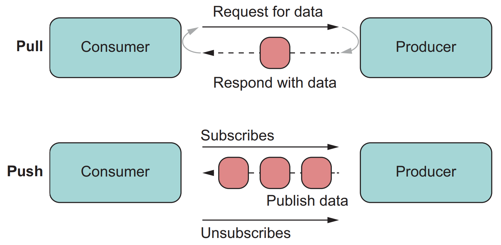

# JavaScript Advanced Notes

## Iterator

### Iteration Protocol

Iteration [protocol](https://developer.mozilla.org/docs/Web/JavaScript/Reference/Iteration_protocols):

- 一个数据结构只要实现了 `[Symbol.iterator]()` 接口, 便可成为可迭代数据结构 (`Iterable`):
  - String: `StringIterator`.
  - Array: `ArrayIterator`.
  - Map: `MapIterator`.
  - Set: `SetIterator`.
  - `arguments` 对象.
  - DOM collection (`NodeList`): `ArrayIterator`.
- 接收可迭代对象的原生语言特性:
  - `for...in`/`for...of`.
  - Destructing: 数组解构.
  - `...`: 扩展操作符 (`Spread Operator`).
  - `Array.from()`.
  - `new Map()`.
  - `new Set()`.
  - `Promise.all()`.
  - `Promise.race()`.
  - `yield *` 操作符.
- `for...in`/`for...of` 隐形调用迭代器的方式, 称为内部迭代器, 使用方便, 不可自定义迭代过程.
- `{ next, done, value }` 显式调用迭代器的方式, 称为外部迭代器, 使用复杂, 可以自定义迭代过程.
- All built-in ES6 iterators are `Self Iterable Iterator`.

```ts
interface Iterable<T> {
  [Symbol.iterator](): Iterator<T>;
}

interface Iterator<T> {
  next(...args: []): IteratorResult<T>;
  return?(value?: T): IteratorResult<T>; // Closable iterator
  throw?(e?: any): IteratorResult<T>;
}

interface IterableIterator<T> extends Iterator<T> {
  [Symbol.iterator](): IterableIterator<T>;
}

interface AsyncIterable<T> {
  [Symbol.asyncIterator](): AsyncIterator<T>;
}

interface AsyncIterator<T> {
  next(...args: []): Promise<IteratorResult<T>>;
  return?(value?: T | PromiseLike<T>): Promise<IteratorResult<T>>; // Closable iterator
  throw?(e?: any): Promise<IteratorResult<T>>;
}

interface AsyncIterableIterator<T> extends AsyncIterator<T> {
  [Symbol.asyncIterator](): AsyncIterableIterator<T>;
}

interface IteratorResult<T> {
  done: boolean;
  value: T;
}
```

### Synchronous Iterator

#### Iterable Object

```ts
function methodsIterator() {
  let index = 0;
  const methods = Object.keys(this)
    .filter(key => {
      return typeof this[key] === 'function';
    })
    .map(key => this[key]);

  // iterator object
  return {
    next: () => ({
      // Conform to Iterator protocol
      done: index >= methods.length,
      value: methods[index++],
    }),
  };
}

const myMethods = {
  toString() {
    return '[object myMethods]';
  },
  sumNumbers(a, b) {
    return a + b;
  },
  numbers: [1, 5, 6],
  [Symbol.iterator]: methodsIterator, // Conform to Iterable Protocol
};

for (const method of myMethods) {
  console.log(method); // logs methods `toString` and `sumNumbers`
}
```

```ts
function zip(...iterables) {
  const iterators = iterables.map(i => i[Symbol.iterator]());
  let done = false;

  return {
    [Symbol.iterator]() {
      return this;
    },
    next() {
      if (!done) {
        const items = iterators.map(i => i.next());
        done = items.some(item => item.done);

        if (!done) {
          return { value: items.map(i => i.value) };
        }

        // Done for the first time: close all iterators
        for (const iterator of iterators) {
          if (typeof iterator.return === 'function') {
            iterator.return();
          }
        }
      }

      // We are done
      return { done: true };
    },
  };
}

const zipped = zip(['a', 'b', 'c'], ['d', 'e', 'f', 'g']);

for (const x of zipped) {
  console.log(x);
}
// Output:
// ['a', 'd']
// ['b', 'e']
// ['c', 'f']
```

#### Iterable Class

```ts
class Counter {
  constructor(limit) {
    this.limit = limit;
  }

  [Symbol.iterator]() {
    let count = 1;
    const limit = this.limit;

    return {
      next() {
        if (count <= limit) {
          return { done: false, value: count++ };
        } else {
          return { done: true };
        }
      },
      return() {
        console.log('Exiting early');
        return { done: true };
      },
    };
  }
}

const counter1 = new Counter(5);
for (const i of counter1) {
  if (i > 2) {
    break;
  }
  console.log(i);
}
// 1
// 2
// Exiting early

const counter2 = new Counter(5);
try {
  for (const i of counter2) {
    if (i > 2) {
      throw new Error('err');
    }

    console.log(i);
  }
} catch (e) {}
// 1
// 2
// Exiting early

const counter3 = new Counter(5);
const [a, b] = counter3;
// Exiting early
```

#### Class Iterator

```ts
// Class Iterator:
class MatrixIterator {
  constructor(matrix) {
    this.x = 0;
    this.y = 0;
    this.matrix = matrix;
  }

  next() {
    if (this.y === this.matrix.height) return { done: true };

    const value = {
      x: this.x,
      y: this.y,
      value: this.matrix.get(this.x, this.y),
    };

    this.x++;

    if (this.x === this.matrix.width) {
      this.x = 0;
      this.y++;
    }

    return { value, done: false };
  }
}

// Iterable Class:
class Matrix {
  constructor(width, height, element = (x, y) => undefined) {
    this.width = width;
    this.height = height;
    this.content = [];

    for (let y = 0; y < height; y++) {
      for (let x = 0; x < width; x++) {
        this.content[y * width + x] = element(x, y);
      }
    }
  }

  get(x, y) {
    return this.content[y * this.width + x];
  }

  set(x, y, value) {
    this.content[y * this.width + x] = value;
  }

  [Symbol.iterator]() {
    return new MatrixIterator(this);
  }
}

const matrix = new Matrix(2, 2, (x, y) => `value ${x},${y}`);

for (const { x, y, value } of matrix) {
  console.log(x, y, value);
}
// → 0 0 value 0, 0
// → 1 0 value 1, 0
// → 0 1 value 0, 1
// → 1 1 value 1, 1
```

### Asynchronous Iterator

```ts
const AsyncIterable = {
  [Symbol.asyncIterator]() {
    return AsyncIterator;
  },
};

const AsyncIterator = {
  next() {
    return Promise.resolve(IteratorResult);
  },
  return() {
    return Promise.resolve(IteratorResult);
  },
  throw(e) {
    return Promise.reject(e);
  },
};

const IteratorResult = {
  value: any,
  done: boolean,
};

// Tasks will chained:
ait
  .next()
  .then(({ value, done }) => ait.next())
  .then(({ value, done }) => ait.next())
  .then(({ done }) => done);

// Tasks will run in parallel:
ait.next().then();
ait.next().then();
ait.next().then();
```

```ts
function remotePostsAsyncIteratorsFactory() {
  let i = 1;
  let done = false;

  const asyncIterableIterator = {
    // the next method will always return a Promise
    async next() {
      // do nothing if we went out-of-bounds
      if (done) {
        return Promise.resolve({
          done: true,
          value: undefined,
        });
      }

      const res = await fetch(
        `https://jsonplaceholder.typicode.com/posts/${i++}`
      ).then(r => r.json());

      // the posts source is ended
      if (Object.keys(res).length === 0) {
        done = true;
        return Promise.resolve({
          done: true,
          value: undefined,
        });
      } else {
        return Promise.resolve({
          done: false,
          value: res,
        });
      }
    },
    [Symbol.asyncIterator]() {
      return this;
    },
  };

  return asyncIterableIterator;
}

(async () => {
  const ait = remotePostsAsyncIteratorsFactory();

  await ait.next(); // { done:false, value:{id: 1, ...} }
  await ait.next(); // { done:false, value:{id: 2, ...} }
  await ait.next(); // { done:false, value:{id: 3, ...} }
  // ...
  await ait.next(); // { done:false, value:{id: 100, ...} }
  await ait.next(); // { done:true, value:undefined }
})();
```

### Closable Iterator

- An iterator is closable if it has a method `return()`.

```ts
interface ClosableIterator {
  next(): IteratorResult;
  return(value?: any): IteratorResult;
}
```

- Not all iterators are closable: e.g `Array Iterator`.

```ts
const iterable = ['a', 'b', 'c'];
const iterator = iterable[Symbol.iterator]();
console.log('return' in iterator);
// => false
```

- If an iterator is not closable,
  you can continue iterating over it after an abrupt exit.
- If an iterator is closable,
  you can't continue iterating over it after an abrupt exit.

```ts
function* elements() {
  yield 'a';
  yield 'b';
  yield 'c';
}

function twoLoops(iterator) {
  // eslint-disable-next-line no-unreachable-loop
  for (const x of iterator) {
    console.log(x);
    break;
  }

  for (const x of iterator) {
    console.log(x);
  }
}

class PreventReturn {
  constructor(iterator) {
    this.iterator = iterator;
  }

  [Symbol.iterator]() {
    return this;
  }

  next() {
    return this.iterator.next();
  }

  return(value = undefined) {
    return { done: false, value };
  }
}

twoLoops(elements());
// Output:
// a

twoLoops(new PreventReturn(elements()));
// Output:
// a
// b
// c

twoLoops(['a', 'b', 'c'][Symbol.iterator]());
// Output:
// a
// b
// c
```

- Manually call `iterator.return()`:

```ts
function take(n, iterable) {
  const iter = iterable[Symbol.iterator]();

  return {
    [Symbol.iterator]() {
      return this;
    },
    next() {
      if (n > 0) {
        n--;
        return iter.next();
      } else {
        iter?.return();
        return { done: true };
      }
    },
    return() {
      n = 0;
      iter?.return();
    },
  };
}
```

## Generator

### Generator Definition

- 函数名称前面加一个星号 (`*`) 表示它是一个生成器函数.
- 箭头函数不能用来定义生成器函数.
- 调用生成器函数会产生一个生成器对象, 其是一个**自引用可迭代对象**:
  其本身是一个迭代器, 同时实现了 `Iterable` 接口 (返回 `this`).

```ts
interface GeneratorFunction {
  (...args: any[]): Generator;
  readonly length: number;
  readonly name: string;
  readonly prototype: Generator;
}

interface Generator<T> extends Iterator<T> {
  next(...args: []): IteratorResult<T>;
  return(value: T): IteratorResult<T>; // Required
  throw(e: any): IteratorResult<T>; // Required
  [Symbol.iterator](): Generator<T>;
}

interface AsyncGeneratorFunction {
  (...args: any[]): AsyncGenerator;
  readonly length: number;
  readonly name: string;
  readonly prototype: AsyncGenerator;
}

interface AsyncGenerator<T> extends AsyncIterator<T> {
  next(...args: []): Promise<IteratorResult<T>>;
  return(value: T | PromiseLike<T>): Promise<IteratorResult<T>>; // Required
  throw(e: any): Promise<IteratorResult<T>>; // Required
  [Symbol.asyncIterator](): AsyncGenerator<T>;
}
```

```ts
function* generatorFn() {}
console.log(generatorFn);
// f* generatorFn() {}

console.log(generatorFn()[Symbol.iterator]);
// f [Symbol.iterator]() {native code}

console.log(generatorFn());
// generatorFn {<suspended>}

console.log(generatorFn()[Symbol.iterator]());
// generatorFn {<suspended>}

const g = generatorFn(); // IterableIterator
console.log(g === g[Symbol.iterator]());
// true
```

### Generator Roles

Generators can play 3 roles:

- Iterators (data producers):
  generators can produce sequences of values via loops and recursion.
- Observers (data consumers):
  generators become data consumers that pause
  until a new value is pushed into them via `next(value)`
  (`yield` can receive a value from `next(value)`).
- Coroutines (data producers and consumers):
  generators are pauseable and can be both data producers and data consumers,
  generators can be coroutines (cooperatively multi-tasked tasks).

### Generator Basic Usage

```ts
function* gen() {
  yield 1;
  yield 2;
  yield 3;
}

const g = gen();

g.next(); // { value: 1, done: false }
g.next(); // { value: 2, done: false }
g.next(); // { value: 3, done: false }
g.next(); // { value: undefined, done: true }
g.return(); // { value: undefined, done: true }
g.return(1); // { value: 1, done: true }
```

#### Default Iterator Generator

生成器函数和默认迭代器**被调用**之后都产生迭代器
(生成器对象是**自引用可迭代对象**, 自身是一个迭代器),
所以生成器适合作为默认迭代器:

```ts
const users = {
  james: false,
  andrew: true,
  alexander: false,
  daisy: false,
  luke: false,
  clare: true,

  *[Symbol.iterator]() {
    // this === 'users'
    for (const key in this) {
      if (this[key]) yield key;
    }
  },
};

for (const key of users) {
  console.log(key);
}
// andrew
// clare

class Foo {
  constructor() {
    this.values = [1, 2, 3];
  }

  *[Symbol.iterator]() {
    yield* this.values;
  }
}

const f = new Foo();

for (const x of f) {
  console.log(x);
}
// 1
// 2
// 3
```

#### Early Return Generator

- `return()` 方法会强制生成器进入关闭状态.
- 提供给 `return()` 的值, 就是终止迭代器对象的值.

```ts
function* gen() {
  yield 1;
  yield 2;
  yield 3;
}

const g = gen();

g.next(); // { value: 1, done: false }
g.return('foo'); // { value: "foo", done: true }
g.next(); // { value: undefined, done: true }
```

#### Error Handling Generator

- `throw()` 方法会在暂停的时候将一个提供的错误注入到生成器对象中.
  如果错误未被处理, 生成器就会关闭.
- 假如生成器函数内部处理了这个错误, 那么生成器就不会关闭, 可以恢复执行.
  错误处理会跳过对应的 yield (跳过一个值).

```ts
function* generator() {
  try {
    yield 1;
  } catch (e) {
    console.log(e);
  }

  yield 2;
  yield 3;
  yield 4;
  yield 5;
}

const it = generator();

it.next(); // {value: 1, done: false}

// the error will be handled and printed ("Error: Handled!"),
// then the flow will continue, so we will get the
// next yielded value as result.
it.throw(Error('Handled!')); // {value: 2, done: false}

it.next(); // {value: 3, done: false}

// now the generator instance is paused on the
// third yield that is not inside a try-catch.
// the error will be re-thrown out
it.throw(Error('Not handled!')); // !!! Uncaught Error: Not handled! !!!

// now the iterator is exhausted
it.next(); // {value: undefined, done: true}
```

### Generator Advanced Usage

#### Next Value Generator

当为 `next` 传递值进行调用时,
传入的值会被当作上一次生成器函数暂停时 `yield` 关键字的返回值处理.
第一次调用 `g.next()` 传入参数是毫无意义,
因为首次调用 `next` 函数时,
生成器函数并没有在 `yield` 关键字处暂停:

```ts
function* lazyCalculator(operator) {
  const firstOperand = yield;
  const secondOperand = yield;

  switch (operator) {
    case '+':
      yield firstOperand + secondOperand;
      return;
    case '-':
      yield firstOperand - secondOperand;
      return;
    case '*':
      yield firstOperand * secondOperand;
      return;
    case '/':
      yield firstOperand / secondOperand;
      return;
    default:
      throw new Error('Unsupported operation!');
  }
}

const g = gen('*');
g.next(); // { value: undefined, done: false }
g.next(10); // { value: undefined, done: false }
g.next(2); // { value: 20, done: false }
g.next(); // { value: undefined, done: true }
```

#### Default Asynchronous Iterator Generator

Default asynchronous iterator:

```ts
const asyncSource = {
  async *[Symbol.asyncIterator]() {
    yield await new Promise(resolve => setTimeout(resolve, 1000, 1));
  },
};

for await (const chunk of asyncSource) {
  console.log(chunk);
}
```

#### Asynchronous Generator

```ts
async function* remotePostsAsyncGenerator() {
  let i = 1;

  while (true) {
    const res = await fetch(
      `https://jsonplaceholder.typicode.com/posts/${i++}`
    ).then(r => r.json());

    // when no more remote posts will be available,
    // it will break the infinite loop.
    // the async iteration will end
    if (Object.keys(res).length === 0) {
      break;
    }

    yield res;
  }
}

for await (const chunk of remotePostsAsyncGenerator()) {
  console.log(chunk);
}
```

#### Asynchronous Events Stream

Asynchronous UI events stream (RxJS):

```ts
class Observable {
  constructor() {
    this.promiseQueue = [];
    // 保存用于队列下一个 promise 的 resolve 方法
    this.resolve = null;
    // 把最初的 promise 推到队列, 该 promise 会 resolve 为第一个观察到的事件
    this.enqueue();
  }

  // 创建新 promise, 保存其 resolve 方法, 并把它保存到队列中
  enqueue() {
    this.promiseQueue.push(new Promise(resolve => (this.resolve = resolve)));
  }

  // 从队列前端移除 promise, 并返回它
  dequeue() {
    return this.promiseQueue.shift();
  }

  async *fromEvent(element, eventType) {
    // 在有事件生成时, 用事件对象来 resolve 队列头部的 promise
    // 同时把另一个 promise 加入队列
    element.addEventListener(eventType, event => {
      this.resolve(event);
      this.enqueue();
    });

    // 每次 resolve 队列头部的 promise 后, 都会向异步迭代器返回相应的事件对象
    while (true) {
      yield await this.dequeue();
    }
  }
}

const observable = new Observable();
const button = document.querySelector('button');
const mouseClickIterator = observable.fromEvent(button, 'click');

for await (const clickEvent of mouseClickIterator) {
  console.log(clickEvent);
}
```

Generator based asynchronous control flow goodness for nodejs and the browser,
using promises, letting you write non-blocking code in a nice-ish way
(just like [tj/co](https://github.com/tj/co)).

```ts
function coroutine(generatorFunc) {
  const generator = generatorFunc();

  function nextResponse(value) {
    const response = generator.next(value);

    if (response.done) {
      return;
    }

    if (value instanceof Promise) {
      value.then(nextResponse);
    } else {
      nextResponse(response.value);
    }
  }

  nextResponse();
}

coroutine(function* bounce() {
  yield bounceUp;
  yield bounceDown;
});
```

利用 `async`/`await` 可以实现相同效果:

```ts
function co(gen) {
  return new Promise((resolve, reject) => {
    const g = gen();

    function next(param) {
      const { done, value } = g.next(param);

      if (!done) {
        // Resolve chain.
        Promise.resolve(value).then(res => next(res));
      } else {
        resolve(value);
      }
    }

    // First invoke g.next() without params.
    next();
  });
}

function promise1() {
  return new Promise(resolve => {
    setTimeout(() => {
      resolve('1');
    }, 1000);
  });
}

function promise2(value) {
  return new Promise(resolve => {
    setTimeout(() => {
      resolve(`value:${value}`);
    }, 1000);
  });
}

function* readFileGenerator() {
  const value = yield promise1();
  const result = yield promise2(value);
  return result;
}

async function readFile() {
  const value = await promise1();
  const result = await promise2(value);
  return result;
}

co(readFileGenerator).then(res => console.log(res));
// const g = readFileGenerator();
// const value = g.next();
// const result = g.next(value);
// resolve(result);

readFile().then(res => console.log(res));
```

#### Delegating Generator

`yield *` 能够迭代一个可迭代对象 (`yield* iterable`):

- 可以迭代标准库提供的 `Iterable` 集合.
- 生成器函数产生的生成器对象是一个**自引用可迭代对象**,
  可以使用 `yield *` 聚合生成器 (`Delegating Generator`).

```ts
function* generatorFn() {
  console.log('iter value:', yield* [1, 2, 3]);
}

for (const x of generatorFn()) {
  console.log('value:', x);
}
// value: 1
// value: 2
// value: 3
// iter value: undefined
```

```ts
function* innerGeneratorFn() {
  yield 'foo';
  return 'bar';
}

function* outerGeneratorFn(genObj) {
  console.log('iter value:', yield* innerGeneratorFn());
}

for (const x of outerGeneratorFn()) {
  console.log('value:', x);
}
// value: foo
// iter value: bar
```

```ts
function* chunkify(array, n) {
  yield array.slice(0, n);
  array.length > n && (yield* chunkify(array.slice(n), n));
}

async function* getRemoteData() {
  let hasMore = true;
  let page;

  while (hasMore) {
    const { next_page, results } = await fetch(URL, { params: { page } }).then(
      r => r.json()
    );

    // Return 5 elements with each iteration.
    yield* chunkify(results, 5);

    hasMore = next_page !== null;
    page = next_page;
  }
}

for await (const chunk of getRemoteData()) {
  console.log(chunk);
}
```

#### Recursive Generator

在生成器函数内部,
用 `yield *` 去迭代自身产生的生成器对象,
实现递归算法.

Tree traversal:

```ts
// Tree traversal
class BinaryTree {
  constructor(value, left = null, right = null) {
    this.value = value;
    this.left = left;
    this.right = right;
  }

  *[Symbol.iterator]() {
    yield this.value;

    if (this.left) {
      // Short for: yield* this.left[Symbol.iterator]()
      yield* this.left;
    }

    if (this.right) {
      // Short for: yield* this.right[Symbol.iterator]()
      yield* this.right;
    }
  }
}

const tree = new BinaryTree(
  'a',
  new BinaryTree('b', new BinaryTree('c'), new BinaryTree('d')),
  new BinaryTree('e')
);

for (const x of tree) {
  console.log(x);
}
// Output:
// a
// b
// c
// d
// e
```

Graph traversal:

```ts
// Graph traversal
function* graphTraversal(nodes) {
  for (const node of nodes) {
    if (!visitedNodes.has(node)) {
      yield node;
      yield* graphTraversal(node.neighbors);
    }
  }
}
```

DOM traversal:

```ts
function* domTraversal(element) {
  yield element;
  element = element.firstElementChild;

  while (element) {
    yield* domTraversal(element);
    element = element.nextElementSibling;
  }
}

for (const element of domTraversal(document.getElementById('subTree'))) {
  console.log(element.nodeName);
}
```

结合 `Promise`/`async`/`await` 可以实现异步递归算法:

```ts
import { promises as fs } from 'node:fs';
import { basename, dirname, join } from 'node:path';

async function* walk(dir: string): AsyncGenerator<string> {
  for await (const d of await fs.opendir(dir)) {
    const entry = join(dir, d.name);

    if (d.isDirectory()) {
      yield* walk(entry);
    } else if (d.isFile()) {
      yield entry;
    }
  }
}

async function run(arg = '.') {
  if ((await fs.lstat(arg)).isFile()) {
    return runTestFile(arg);
  }

  for await (const file of walk(arg)) {
    if (
      !dirname(file).includes('node_modules') &&
      (basename(file) === 'test.js' || file.endsWith('.test.js'))
    ) {
      console.log(file);
      await runTestFile(file);
    }
  }
}
```

## Promise

Callback style asynchronous programming:

- Callback hell.
- Complicated error handling.
- Complicated composition.

Promise style asynchronous programming:

- Avoid callback hell:
  - Return `new Promise()`/`Promise.resolve()`.
  - Return `promise.then((value) => {})`.
- Simple error handling:
  - Catch error: `promise.catch((err) => {})`.
  - Cleanup: `promise.finally(() => {})`.
- Simple composition:
  - `Promise.all`: Converts an `Array` of `Promises` to a `Promise` for an `Array`.
  - `Promise.race`.

### Promise Resolve

Resolve only accept **one** value:

```ts
return new Promise(resolve => resolve([a, b]));
```

```ts
const thenable = {
  then(resolve, reject) {
    resolve(42);
  },
};
const promise = Promise.resolve(thenable);
promise.then(value => {
  console.log(value); // 42
});
```

`Promise.resolve` 是一个幂等方法 (状态机幂等):

```ts
const p = Promise.resolve(7);
setTimeout(console.log, 0, p === Promise.resolve(p));
// true
setTimeout(console.log, 0, p === Promise.resolve(Promise.resolve(p)));
// true

const p = new Promise(() => {});
setTimeout(console.log, 0, p);
// Promise <pending>
setTimeout(console.log, 0, Promise.resolve(p));
// Promise <pending>
setTimeout(console.log, 0, p === Promise.resolve(p));
// true
```

### Promise Reject

```ts
let p1 = Promise.resolve('foo');
let p2 = p1.then();
stetTimeout(console.log, 0, p2); // Promise <resolved>: foo

// eslint-disable-next-line prefer-promise-reject-errors
p1 = Promise.reject('foo');
p2 = p1.then();
// Uncaught (in promise) foo
setTimeout(console.log, 0, p2); // Promise <rejected>: foo

const p3 = p1.then(null, () => undefined);
const p4 = p1.then(null, () => {});
const p5 = p1.then(null, () => Promise.resolve());
setTimeout(console.log, 0, p3); // Promise <resolved>: undefined
setTimeout(console.log, 0, p4); // Promise <resolved>: undefined
setTimeout(console.log, 0, p5); // Promise <resolved>: undefined

const p6 = p1.then(null, () => 'bar');
const p7 = p1.then(null, () => Promise.resolve('bar'));
setTimeout(console.log, 0, p6); // Promise <resolved>: bar
setTimeout(console.log, 0, p7); // Promise <resolved>: bar

const p8 = p1.then(null, () => new Promise(() => {}));
// eslint-disable-next-line prefer-promise-reject-errors
const p9 = p1.then(null, () => Promise.reject());
// Uncaught (in promise): undefined
setTimeout(console.log, 0, p8); // Promise <pending>
setTimeout(console.log, 0, p9); // Promise <rejected>: undefined

const p10 = p1.then(null, () => {
  // eslint-disable-next-line no-throw-literal
  throw 'bar';
});
// Uncaught (in promise) bar
setTimeout(console.log, 0, p10); // Promise <rejected>: bar

const p11 = p1.then(null, () => Error('bar'));
setTimeout(console.log, 0, p11); // Promise <resolved>: Error: bar
```

### Promise Catch

```ts
// eslint-disable-next-line prefer-promise-reject-errors
const p = Promise.reject();
const onRejected = function (e) {
  setTimeout(console.log, 0, 'rejected');
};
// 语法糖:
p.then(null, onRejected); // rejected
p.catch(onRejected); // rejected
```

```ts
const p1 = new Promise(() => {});
const p2 = p1.catch();
setTimeout(console.log, 0, p1); // Promise <pending>
setTimeout(console.log, 0, p2); // Promise <pending>
setTimeout(console.log, 0, p1 === p2); // false
```

### Promise Finally

```ts
const p1 = new Promise(() => {});
const p2 = p1.finally();
setTimeout(console.log, 0, p1); // Promise <pending>
setTimeout(console.log, 0, p2); // Promise <pending>
setTimeout(console.log, 0, p1 === p2); // false
```

```ts
const p1 = Promise.resolve('foo');

// 原样后传:
const p2 = p1.finally();
const p3 = p1.finally(() => undefined);
const p4 = p1.finally(() => {});
const p5 = p1.finally(() => Promise.resolve());
const p6 = p1.finally(() => 'bar');
const p7 = p1.finally(() => Promise.resolve('bar'));
const p8 = p1.finally(() => Error('bar'));
setTimeout(console.log, 0, p2); // Promise <resolved>: foo
setTimeout(console.log, 0, p3); // Promise <resolved>: foo
setTimeout(console.log, 0, p4); // Promise <resolved>: foo
setTimeout(console.log, 0, p5); // Promise <resolved>: foo
setTimeout(console.log, 0, p6); // Promise <resolved>: foo
setTimeout(console.log, 0, p7); // Promise <resolved>: foo
setTimeout(console.log, 0, p8); // Promise <resolved>: foo

// 特殊处理:
const p9 = p1.finally(() => new Promise(() => {}));
setTimeout(console.log, 0, p9); // Promise <pending>
// eslint-disable-next-line prefer-promise-reject-errors
const p10 = p1.finally(() => Promise.reject());
// Uncaught (in promise): undefined
setTimeout(console.log, 0, p10); // Promise <rejected>: undefined
const p11 = p1.finally(() => {
  // eslint-disable-next-line no-throw-literal
  throw 'bar';
});
// Uncaught (in promise) baz
setTimeout(console.log, 0, p11); // Promise <rejected>: bar
```

Any value or resolved promises returned
from `finally()` is ignored:

```ts
const promise = Promise.resolve(42);

promise
  .finally(() => {
    // Settlement handler
    return 43; // Ignored!
  })
  .then(value => {
    // Fulfillment handler
    console.log(value); // 42
  });

promise
  .finally(() => {
    // Settlement handler
    return Promise.resolve(44); // Ignored!
  })
  .then(value => {
    // Fulfillment handler
    console.log(value); // 42
  });
```

Returning rejected promise from `finally()`
equivalent to throwing an error:

```ts
const promise = Promise.resolve(42);

promise
  .finally(() => {
    // eslint-disable-next-line prefer-promise-reject-errors
    return Promise.reject(43);
  })
  .catch(reason => {
    console.error(reason); // 43
  });
```

```ts
// eslint-disable-next-line prefer-promise-reject-errors
const promise = Promise.reject(43);

promise
  .finally(() => {
    // eslint-disable-next-line prefer-promise-reject-errors
    return Promise.reject(45);
  })
  .catch(reason => {
    console.log(reason); // 45
  });
```

### Promise Thenable and Catch

The main difference between the forms
`promise.then(success, error)` and
`promise.then(success).catch(error)`:
in case if success callback returns a rejected promise,
then only the second form is going to catch that rejection.

正常情况下, 在通过 `throw()` 关键字抛出错误时,
JavaScript 运行时的错误处理机制会停止执行抛出错误之后的任何指令.
但在 `Promise` 中抛出错误时, 因为错误实际上是从消息队列中异步抛出的,
所以并不会阻止运行时继续执行同步指令 (`Node.js` 中仍然会停止执行任何指令).

```ts
throw new Error('foo');
console.log('bar'); // 这一行不会执行
// Uncaught Error: foo
```

```ts
Promise.reject(Error('foo'));
console.log('bar');
// bar
// Uncaught (in promise) Error: foo

const p1 = new Promise((resolve, reject) => reject(Error('foo'))); // 1.
const p2 = new Promise((resolve, reject) => {
  throw new Error('foo'); // 2.
});
const p3 = Promise.resolve().then(() => {
  throw new Error('foo'); // 4.
});
const p4 = Promise.reject(Error('foo')); // 3.
// Uncaught (in promise) Error: foo
//   at Promise (test.html:1)
//   at new Promise (<anonymous>)
//   at test.html:1
// Uncaught (in promise) Error: foo
//   at Promise (test.html:2)
//   at new Promise (<anonymous>)
//   at test.html:2
// Uncaught (in promise) Error: foo
//   at test.html:4
// Uncaught (in promise) Error: foo
//   at Promise.resolve.then (test.html:3)
```

### Promise Chain

- Promises on the same chain execute orderly.
- Promises on two separate chains execute in random order.

```ts
const users = ['User1', 'User2', 'User3', 'User4'];

const response = [];

const getUser = user => () => {
  return axios.get(`/users/userId=${user}`).then(res => response.push(res));
};

const getUsers = users => {
  const [getFirstUser, getSecondUser, getThirdUser, getFourthUser] =
    users.map(getUser);

  getFirstUser()
    .then(getSecondUser)
    .then(getThirdUser)
    .then(getFourthUser)
    .catch(console.log);
};
```

```ts
const users = ['User1', 'User2', 'User3', 'User4'];

let response = [];

function getUsers(users) {
  const promises = [];
  promises[0] = axios.get(`/users/userId=${users[0]}`);
  promises[1] = axios.get(`/users/userId=${users[1]}`);
  promises[2] = axios.get(`/users/userId=${users[2]}`);
  promises[3] = axios.get(`/users/userId=${users[3]}`);

  Promise.all(promises)
    .then(userDataArr => (response = userDataArr))
    .catch(err => console.log(err));
}
```

### Promise Combinator Array Functions

- `Promise.all(iterable)` fail-fast:
  If at least one promise in the promises array rejects,
  then the promise returned rejects too.
  Short-circuits when an input value is rejected.
- `Promise.any(iterable)`:
  Resolves if any of the given promises are resolved.
  Short-circuits when an input value is fulfilled.
- `Promise.race(iterable)`:
  Short-circuits when an input value is settled
  (fulfilled or rejected).
- `Promise.allSettled(iterable)`:
  Returns when all given promises are settled
  (fulfilled or rejected).

```ts
Promise.all(urls.map(fetch))
  .then(responses => Promise.all(responses.map(res => res.text())))
  .then(texts => {
    //
  });

const loadData = async () => {
  try {
    const urls = ['...', '...'];

    const results = await Promise.all(urls.map(fetch));
    const dataPromises = await results.map(result => result.json());
    const finalData = Promise.all(dataPromises);

    return finalData;
  } catch (err) {
    console.log(err);
  }
};

const data = loadData().then(data => console.log(data));
```

### Promise Polyfill

```ts
class Promise {
  // `executor` takes 2 parameters, `resolve()` and `reject()`. The executor
  // function is responsible for calling `resolve()` or `reject()` to say that
  // the async operation succeeded (resolved) or failed (rejected).
  constructor(executor) {
    if (typeof executor !== 'function') {
      throw new TypeError('Executor must be a function');
    }

    // Internal state. `$state` is the state of the promise, and `$chained` is
    // an array of the functions we need to call once this promise is settled.
    this.$state = 'PENDING';
    this.$chained = [];

    // Implement `resolve()` and `reject()` for the executor function to use
    const resolve = res => {
      // A promise is considered "settled" when it is no longer
      // pending, that is, when either `resolve()` or `reject()`
      // was called once. Calling `resolve()` or `reject()` twice
      // or calling `reject()` after `resolve()` was already called
      // are no-ops.
      if (this.$state !== 'PENDING') {
        return;
      }

      // If `res` is a "thenable", lock in this promise to match the
      // resolved or rejected state of the thenable.
      const then = res !== null ? res.then : null;
      if (typeof then === 'function') {
        // In this case, the promise is "resolved", but still in the 'PENDING'
        // state. This is what the ES6 spec means when it says "A resolved promise
        // may be pending, fulfilled or rejected" in
        // http://www.ecma-international.org/ecma-262/6.0/#sec-promise-objects
        return then(resolve, reject);
      }

      this.$state = 'FULFILLED';
      this.$internalValue = res;

      // If somebody called `.then()` while this promise was pending, need
      // to call their `onFulfilled()` function
      for (const { onFulfilled } of this.$chained) {
        onFulfilled(res);
      }

      return res;
    };

    const reject = err => {
      if (this.$state !== 'PENDING') {
        return;
      }

      this.$state = 'REJECTED';
      this.$internalValue = err;

      for (const { onRejected } of this.$chained) {
        onRejected(err);
      }
    };

    // Call the executor function with `resolve()` and `reject()` as in the spec.
    try {
      // If the executor function throws a sync exception, we consider that
      // a rejection. Keep in mind that, since `resolve()` or `reject()` can
      // only be called once, a function that synchronously calls `resolve()`
      // and then throws will lead to a fulfilled promise and a swallowed error
      executor(resolve, reject);
    } catch (err) {
      reject(err);
    }
  }

  // `onFulfilled` is called if the promise is fulfilled, and `onRejected`
  // if the promise is rejected. For now, you can think of 'fulfilled' and
  // 'resolved' as the same thing.
  then(onFulfilled, onRejected) {
    return new Promise((resolve, reject) => {
      // Ensure that errors in `onFulfilled()` and `onRejected()` reject the
      // returned promise, otherwise they'll crash the process. Also, ensure
      // that the promise
      const _onFulfilled = res => {
        try {
          // If `onFulfilled()` returns a promise, trust `resolve()` to handle
          // it correctly.
          // store new value to new Promise
          resolve(onFulfilled(res));
        } catch (err) {
          reject(err);
        }
      };

      const _onRejected = err => {
        try {
          // store new value to new Promise
          reject(onRejected(err));
        } catch (_err) {
          reject(_err);
        }
      };

      switch (this.$state) {
        case 'FULFILLED':
          _onFulfilled(this.$internalValue);
          break;
        case 'REJECTED':
          _onRejected(this.$internalValue);
          break;
        default:
          this.$chained.push({
            onFulfilled: _onFulfilled,
            onRejected: _onRejected,
          });
      }
    });
  }

  catch(onRejected) {
    return this.then(null, onRejected);
  }

  finally(callback) {
    return this.then(
      value => {
        return Promise.resolve(callBack()).then(() => value);
      },
      reason => {
        return Promise.resolve(callBack()).then(() => {
          throw reason;
        });
      }
    );
  }

  static all(iterable) {
    return new Promise((resolve, reject) => {
      let index = 0;
      let pendingCount = 0;
      const result = new Array(iterable.length);

      for (const promise of iterable) {
        const currentIndex = index;
        promise.then(
          // eslint-disable-next-line no-loop-func
          value => {
            result[currentIndex] = value;
            pendingCount++;

            if (pendingCount === iterable.length) {
              resolve(result);
            }
          },
          err => {
            reject(err);
          }
        );
        index++;
      }

      if (index === 0) {
        resolve([]);
      }
    });
  }

  static any(iterable) {
    return new Promise((resolve, reject) => {
      let index = 0;
      let pendingCount = 0;
      const error = new Error('All promise were rejected');
      error.errors = new Array(iterable.length);

      for (const promise of iterable) {
        const currentIndex = index;
        promise.then(
          value => {
            resolve(value);
          },
          // eslint-disable-next-line no-loop-func
          err => {
            error.errors[currentIndex] = err;
            pendingCount++;

            if (pendingCount === iterable.length) {
              reject(error);
            }
          }
        );
        index++;
      }

      if (index === 0) {
        resolve([]);
      }
    });
  }

  static race(iterable) {
    return new Promise((resolve, reject) => {
      for (const promise of iterable) {
        promise.then(
          value => {
            resolve(value);
          },
          err => {
            reject(err);
          }
        );
      }
    });
  }

  static allSettled(iterable) {
    return new Promise((resolve, reject) => {
      let index = 0;
      let pendingCount = 0;
      let result;

      function addElementToResult(i, elem) {
        result[i] = elem;
        pendingCount++;

        if (pendingCount === result.length) {
          resolve(result);
        }
      }

      for (const promise of iterable) {
        const currentIndex = index;
        promise.then(
          value =>
            addElementToResult(currentIndex, {
              status: 'fulfilled',
              value,
            }),
          reason =>
            addElementToResult(currentIndex, {
              status: 'rejected',
              reason,
            })
        );
        index++;
      }

      if (index === 0) {
        resolve([]);
        return;
      }

      result = new Array(index);
    });
  }
}
```

### Memorize Async Function

```ts
const memo = {};
const progressQueues = {};

function memoProcessData(key) {
  return new Promise((resolve, reject) => {
    if (Object.prototype.hasOwnProperty.call(memo, key)) {
      resolve(memo[key]);
      return;
    }

    if (!Object.prototype.hasOwnProperty.call(progressQueues, key)) {
      // Called for a new key
      // Create an entry for it in progressQueues
      progressQueues[key] = [[resolve, reject]];
    } else {
      // Called for a key that's still being processed
      // Enqueue it's handlers and exit.
      progressQueues[key].push([resolve, reject]);
      return;
    }

    processData(key)
      .then(data => {
        memo[key] = data;
        for (const [resolver] of progressQueues[key]) resolver(data);
      })
      .catch(error => {
        for (const [, rejector] of progressQueues[key]) rejector(error);
      })
      .finally(() => {
        delete progressQueues[key];
      });
  });
}
```

## Async and Await

### Await Features

- `async` 异步函数如果不包含 `await` 关键字, 其执行 (除返回值外) 基本上跟普通函数没有什么区别.
- JavaScript 运行时在碰到 `await` 关键字时, 会记录在哪里暂停执行.
- 等到 `await` 右边的值可用了, JavaScript 运行时会向消息队列中推送一个任务, 这个任务会恢复异步函数的执行.
- 即使 `await` 后面跟着一个立即可用的值, 函数的其余部分也会被异步求值.

```ts
async function foo() {
  console.log(2);
}

console.log(1);
foo();
console.log(3);
// 1
// 2
// 3

async function bar() {
  console.log(2);
  await null;
  console.log(4);
}

console.log(1);
bar();
console.log(3);
// 1
// 2
// 3
// 4
```

- Await `thenable` object (implements `then` interface):

```ts
async function bar() {
  const thenable = {
    then(callback) {
      callback('bar');
    },
  };
  return thenable;
}

bar().then(console.log);
// bar

async function baz() {
  const thenable = {
    then(callback) {
      callback('baz');
    },
  };
  console.log(await thenable);
}

baz();
// baz
```

- `async`/`await` implement generator based asynchronous control flow:

```ts
const fetchJson = co.wrap(function* (url) {
  try {
    const response = yield fetch(url);
    const text = yield response.text();
    return JSON.parse(text);
  } catch (error) {
    console.log(`ERROR: ${error.stack}`);
  }
});

async function fetchJson(url) {
  try {
    const response = await fetch(url);
    const text = await response.text();
    return JSON.parse(text);
  } catch (error) {
    console.log(`ERROR: ${error.stack}`);
  }
}
```

- `async` 函数自动将返回值包装为 `Promise`:

```ts
// BAD.
async function downloadContent(urls) {
  const promiseArray = urls.map(fetch);
  return await Promise.all(promiseArray);
}

// GOOD.
async function downloadContent(urls) {
  const promiseArray = urls.map(fetch);
  return Promise.all(promiseArray);
}
```

### Await Arrays

- If you want to execute await calls in series,
  use a for-loop (or any loop without a callback).
- Don't ever use await with `forEach` (`forEach` is not promise-aware),
  use a for-loop (or any loop without a callback) instead.
- Don't await inside filter and reduce,
  always await an array of promises with map, then filter or reduce accordingly.
- Avoid wrong parallel logic (too sequential):

```ts
// Wrong:
const books = await bookModel.fetchAll();
const author = await authorModel.fetch(authorId);

// Correct:
const bookPromise = bookModel.fetchAll();
const authorPromise = authorModel.fetch(authorId);
const book = await bookPromise;
const author = await authorPromise;

async function getAuthors(authorIds) {
  // WRONG, this will cause sequential calls
  // const authors = authorIds.map(id => await authorModel.fetch(id));
  // CORRECT:
  const promises = authorIds.map(id => authorModel.fetch(id));
  const authors = await Promise.all(promises);
}
```

```ts
async function randomDelay(id) {
  const delay = Math.random() * 1000;
  return new Promise(resolve =>
    setTimeout(() => {
      console.log(`${id} finished`);
      resolve(id);
    }, delay)
  );
}

async function sequential() {
  const t0 = Date.now();

  for (let i = 0; i < 5; ++i) {
    await randomDelay(i);
  }

  console.log(`${Date.now() - t0}ms elapsed`);
}

sequential();
// 0 finished
// 1 finished
// 2 finished
// 3 finished
// 4 finished
// 2877ms elapsed

async function parallel() {
  const t0 = Date.now();
  const promises = Array(5)
    .fill(null)
    .map((_, i) => randomDelay(i));

  for (const p of promises) {
    console.log(`awaited ${await p}`);
  }

  console.log(`${Date.now() - t0}ms elapsed`);
}

parallel();
// 4 finished
// 2 finished
// 1 finished
// 0 finished
// 3 finished
// awaited 0
// awaited 1
// awaited 2
// awaited 3
// awaited 4
// 645ms elapsed
```

## Asynchronous JavaScript

### Sleep Function

```ts
function sleep(time) {
  return new Promise(resolve => setTimeout(resolve, time));
}
```

```ts
sleep(2000).then(() => {
  // do something after 2000 milliseconds
  console.log('resolved');
});

async function add(n1, n2) {
  await sleep(2222);
  console.log(n1 + n2);
}

add(1, 2);
```

### Race Condition

- Keep latest updates.
- Recover from failures.
- Online and offline sync ([PouchDB](https://github.com/pouchdb/pouchdb)).
- Tools: [redux-saga](https://github.com/redux-saga/redux-saga).

```ts
// eslint-disable-next-line import/no-anonymous-default-export
export default {
  data() {
    return {
      text: '',
      results: [],
      nextRequestId: 1,
      displayedRequestId: 0,
    };
  },
  watch: {
    async text(value) {
      const requestId = this.nextRequestId++;
      const results = await search(value);

      // guarantee display latest search results (when input keep changing)
      if (requestId < this.displayedRequestId) {
        return;
      }

      this.displayedRequestId = requestId;
      this.results = results;
    },
  },
};
```

### Web Worker

- 多线程并行执行.
- 利用 [BroadcastChannel API](https://developer.mozilla.org/docs/Web/API/BroadcastChannel)
  可以创建 Shared Worker, 即共享 Workers 在同一源 (origin) 下面的各种进程都可以访问它,
  包括: `iframe`/浏览器中的不同 Tab 页 (`Browsing Context`).
- Use Case:
  - Graphic App (Ray Tracing).
  - Encryption.
  - Prefetching Data.
  - PWA (Service Worker).
  - Spell Checking.

```html
<button onclick="startComputation()">Start computation</button>

<script>
  const worker = new Worker('worker.js');

  worker.addEventListener(
    'message',
    function (e) {
      console.log(e.data);
    },
    false
  );

  function startComputation() {
    worker.postMessage({ cmd: 'average', data: [1, 2, 3, 4] });
  }
</script>
```

```ts
// worker.js
// eslint-disable-next-line no-restricted-globals
self.addEventListener(
  'message',
  function (e) {
    const data = e.data;
    switch (data.cmd) {
      case 'average': {
        const result = calculateAverage(data);
        // eslint-disable-next-line no-restricted-globals
        self.postMessage(result);
        break;
      }
      default:
        // eslint-disable-next-line no-restricted-globals
        self.postMessage('Unknown command');
    }
  },
  false
);
```

#### Web Worker Runtime

- Web Worker 无法访问一些非常关键的 JavaScript 特性:
  DOM (线程不安全), `window` 对象, `document` 对象, `parent` 对象.
- `self` 上可用的属性是 `window` 对象上属性的严格子集,
  [`WorkerGlobalScope`](https://developer.mozilla.org/docs/Web/API/WorkerGlobalScope):
  - `navigation` 对象: `appName`, `appVersion`, `userAgent`, `platform`.
  - `location` 对象: 所有属性只读.
  - ECMAScript 对象: `Object`/`Array`/`Date`.
  - `console` 对象.
  - `setTimeout`/`setInterval` 方法.
  - `XMLHttpRequest` 方法.
  - `fetch` 方法.
  - `caches` 对象: `ServicerWorker` `CacheStorage` 对象.
  - `self` 对象: 指向全局 worker 对象.
  - `close` 方法: 停止 worker.
  - `importScripts` 方法: 加载外部依赖.
  - [`MessagePort`](https://developer.mozilla.org/docs/Web/API/MessagePort)
    方法: `postMessage`/`onmessage`/`onmessageerror`.
- 工作者线程的脚本文件只能从与父页面相同的源加载,
  从其他源加载工作者线程的脚本文件会导致错误.
  在工作者线程内部可以使用 `importScripts()` 可以加载其他源的脚本.

#### Web Worker Basic Usage

- 先 `on`, 后 `post`.
- `main.js`/`worker.js` 的 `onmessage` 与 `postMessage` 相互触发.
- 有两种方法可以停止 Worker:
  从主页调用 `worker.terminate()` 或在 worker 内部调用 `self.close()`.

```ts
/*
 * JSONParser.js
 */
// eslint-disable-next-line no-restricted-globals
self.onmessage = function (event) {
  const jsonText = event.data;
  const jsonData = JSON.parse(jsonText);

  // eslint-disable-next-line no-restricted-globals
  self.postMessage(jsonData);
};
```

```ts
/*
 * main.js
 */
const worker = new Worker('JSONParser.js');

worker.onmessage = function (event) {
  const jsonData = event.data;
  evaluateData(jsonData);
};

worker.postMessage(jsonText);
```

```ts
// main.js
function work() {
  onmessage = ({ data: { jobId, message } }) => {
    console.log(`I am worker, I receive:-----${message}`);
    postMessage({ jobId, result: 'message from worker' });
  };
}

const makeWorker = f => {
  const pendingJobs = {};
  const workerScriptBlobUrl = URL.createObjectURL(
    new Blob([`(${f.toString()})()`])
  );
  const worker = new Worker(workerScriptBlobUrl);

  worker.onmessage = ({ data: { result, jobId } }) => {
    // 调用 resolve, 改变 Promise 状态
    pendingJobs[jobId](result);
    delete pendingJobs[jobId];
  };

  return (...message) =>
    new Promise(resolve => {
      const jobId = String(Math.random());
      pendingJobs[jobId] = resolve;
      worker.postMessage({ jobId, message });
    });
};

const testWorker = makeWorker(work);

testWorker('message from main thread').then(message => {
  console.log(`I am main thread, I receive:-----${message}`);
});
```

#### Web Worker Pool

```ts
class TaskWorker extends Worker {
  constructor(notifyAvailable, ...workerArgs) {
    super(...workerArgs);

    // 初始化为不可用状态
    this.available = false;
    this.resolve = null;
    this.reject = null;

    // 线程池会传递回调
    // 以便工作者线程发出它需要新任务的信号
    this.notifyAvailable = notifyAvailable;

    // 线程脚本在完全初始化之后
    // 会发送一条"ready"消息
    this.onmessage = () => this.setAvailable();
  }

  // 由线程池调用, 以分派新任务
  dispatch({ resolve, reject, postMessageArgs }) {
    this.available = false;
    this.onmessage = ({ data }) => {
      resolve(data);
      this.setAvailable();
    };
    this.onerror = e => {
      reject(e);
      this.setAvailable();
    };
    this.postMessage(...postMessageArgs);
  }

  setAvailable() {
    this.available = true;
    this.resolve = null;
    this.reject = null;
    this.notifyAvailable();
  }
}

class WorkerPool {
  constructor(poolSize, ...workerArgs) {
    this.taskQueue = [];
    this.workers = [];

    // 初始化线程池
    for (let i = 0; i < poolSize; ++i) {
      this.workers.push(
        new TaskWorker(() => this.dispatchIfAvailable(), ...workerArgs)
      );
    }
  }

  // 把任务推入队列
  enqueue(...postMessageArgs) {
    return new Promise((resolve, reject) => {
      this.taskQueue.push({ resolve, reject, postMessageArgs });
      this.dispatchIfAvailable();
    });
  }

  // 把任务发送给下一个空闲的线程
  dispatchIfAvailable() {
    if (!this.taskQueue.length) {
      return;
    }

    for (const worker of this.workers) {
      if (worker.available) {
        const a = this.taskQueue.shift();
        worker.dispatch(a);
        break;
      }
    }
  }

  // 终止所有工作者线程
  close() {
    for (const worker of this.workers) {
      worker.terminate();
    }
  }
}
```

<!-- eslint-disable no-restricted-globals -->

```ts
// worker.js
self.onmessage = ({ data }) => {
  const view = new Float32Array(data.arrayBuffer);
  let sum = 0;
  // 求和
  for (let i = data.startIdx; i < data.endIdx; ++i) {
    // 不需要原子操作, 因为只需要读
    sum += view[i];
  }
  // 把结果发送给工作者线程
  self.postMessage(sum);
};
// 发送消息给 TaskWorker
// 通知工作者线程准备好接收任务了
self.postMessage('ready');

// main.js
const totalFloats = 1e8;
const numTasks = 20;
const floatsPerTask = totalFloats / numTasks;
const numWorkers = 4;

// 创建线程池
const pool = new WorkerPool(numWorkers, './worker.js');

// 填充浮点值数组
const arrayBuffer = new SharedArrayBuffer(4 * totalFloats);
const view = new Float32Array(arrayBuffer);

for (let i = 0; i < totalFloats; ++i) {
  view[i] = Math.random();
}

const partialSumPromises = [];

for (let i = 0; i < totalFloats; i += floatsPerTask) {
  partialSumPromises.push(
    pool.enqueue({
      startIdx: i,
      endIdx: i + floatsPerTask,
      arrayBuffer,
    })
  );
}

// 求和
Promise.all(partialSumPromises)
  .then(partialSums => partialSums.reduce((x, y) => x + y))
  .then(console.log);
// (在这个例子中, 和应该约等于 1E8/2)
// 49997075.47203197
```

<!-- eslint-enable no-restricted-globals -->

#### Web Worker Performance

- Web Worker performance [guide](https://mp.weixin.qq.com/s/IJHI9JB3nMQPi46b6yGVWw).

### Abort Controller

#### Abort Fetching

```ts
import { useParams } from 'react-router-dom';
import { useEffect, useState } from 'react';

interface Post {
  id: number;
  title: string;
  body: string;
}

function usePostLoading() {
  const { postId } = useParams<{ postId: string }>();
  const [isLoading, setIsLoading] = useState(false);
  const [post, setPost] = useState<Post | null>(null);

  useEffect(() => {
    const abortController = new AbortController();

    setIsLoading(true);
    fetch(`https://jsonplaceholder.typicode.com/posts/${postId}`, {
      signal: abortController.signal,
    })
      .then(response => {
        if (response.ok) {
          return response.json();
        }

        return Promise.reject(Error('The request failed.'));
      })
      .then((fetchedPost: Post) => {
        setPost(fetchedPost);
      })
      .catch(err => {
        if (abortController.signal.aborted) {
          console.log('The user aborted the request');
        } else {
          console.error(err.message);
        }
      })
      .finally(() => {
        setIsLoading(false);
      });

    return () => {
      abortController.abort();
    };
  }, [postId]);

  return {
    post,
    isLoading,
  };
}

export default usePostLoading;
```

#### Abort Promise

```ts
function wait(time: number, signal?: AbortSignal) {
  return new Promise<void>((resolve, reject) => {
    const timeoutId = setTimeout(() => {
      resolve();
    }, time);
    signal?.addEventListener('abort', () => {
      clearTimeout(timeoutId);
      reject(Error('Aborted.'));
    });
  });
}

const abortController = new AbortController();

setTimeout(() => {
  abortController.abort();
}, 1000);

wait(5000, abortController.signal)
  .then(() => {
    console.log('5 seconds passed');
  })
  .catch(() => {
    console.log('Waiting was interrupted');
  });
```

#### Abort Controller Helpers

Abort controller [helpers polyfill](https://whistlr.info/2022/abortcontroller-is-your-friend):

```ts
if (!timeout in AbortSignal) {
  AbortSignal.timeout = function abortTimeout(ms) {
    const controller = new AbortController();
    setTimeout(() => controller.abort(), ms);
    return controller.signal;
  };
}

if (!any in AbortSignal) {
  AbortSignal.any = function abortAny(signals) {
    const controller = new AbortController();
    signals.forEach(signal => {
      if (signal.aborted) {
        controller.abort();
      } else {
        signal.addEventListener('abort', () => controller.abort());
      }
    });
    return controller.signal;
  };
}
```

### Asynchronous API Comparison

- `promise` 和 `async/await` 专门用于处理异步操作.
- `generator` 并不是专门为异步设计, 它还有其他功能 (对象迭代/控制输出/Iterator Interface/etc).
- `promise` 编写代码相比 `generator/async/await` 更为复杂化, 且可读性也稍差.
- `generator/async/await` 需要与 `promise` 对象搭配处理异步情况.
- `async/await` 使用上更为简洁, 将异步代码以同步的形式进行编写, 是处理异步编程的最终方案.

## Module

### CRUST Principles

- Consistent: ES6 API design `Array.XXX(fn)`.
- Resilient: jQuery sizzle API design `$(element)`/`$(selector)`/`$(selector, context)`.
- Unambiguous.
- Simple: Simple `fetch` API design.
- Tiny: Tiny surface areas.

### Namespace Module Pattern

#### Namespace Module Constructor

- 命名空间.
- 依赖模式.
- 私有属性/特权方法.
- 初始化模式.
- 揭示模式: 公共接口.
- 即时函数模式.

```ts
APP.namespace = function (namespaceString) {
  let parts = namespaceString.split('.');
  let parent = APP;
  let i;
  // strip redundant leading global
  if (parts[0] === 'APP') {
    // remove leading global
    parts = parts.slice(1);
  }
  for (i = 0; i < parts.length; i += 1) {
    // create a property if it doesn't exist
    if (typeof parent[parts[i]] === 'undefined') {
      parent[parts[i]] = {};
    }
    // 关键: 向内嵌套
    parent = parent[parts[i]];
  }
  // 返回最内层模块名
  return parent;
};
```

```ts
// assign returned value to a local var
const module2 = APP.namespace('APP.modules.module2');
const truthy = module2 === APP.modules.module2; // true
// skip initial `APP`
APP.namespace('modules.module51');
// long namespace
APP.namespace('once.upon.a.time.there.was.this.long.nested.property');
```

#### Namespace Module Usage

通过传参匿名函数, 创建命名空间, 进行模块包裹:

```ts
const app = {};

(function (exports) {
  (function (exports) {
    const api = {
      moduleExists: function test() {
        return true;
      },
    };
    // 闭包式继承,扩展exports对象为api对象
    $.extend(exports, api);
  })(typeof exports === 'undefined' ? window : exports);
  // 将api对象绑定至app对象上
})(app);
```

```ts
// global object
const APP = {};
// constructors
APP.Parent = function () {};
APP.Child = function () {};
// a variable
APP.some_var = 1;
// an object container
APP.modules = {};
// nested objects
APP.modules.module1 = {};
APP.modules.module1.data = { a: 1, b: 2 };
APP.modules.module2 = {};
```

```ts
// 命名空间模式
APP.namespace('APP.utilities.array');

// 形参: 导入全局变量
APP.utilities.array = (function (app, global) {
  // 依赖模式
  const uObj = app.utilities.object;
  const uLang = app.utilities.lang;

  // 私有属性
  const arrStr = '[object Array]';
  const toStr = Object.prototype.toString;

  // 私有方法
  const inArray = function (haystack, needle) {
    for (let i = 0, max = haystack.length; i < max; i += 1) {
      if (haystack[i] === needle) {
        return i;
      }
    }

    return -1;
  };
  const isArray = function (a) {
    return toStr.call(a) === arrayString;
  };

  // 初始化模式:
  // 初始化代码, 只执行一次.

  // 揭示公共接口.
  return {
    isArray,
    indexOf: inArray,
  };
})(APP, this);
```

### Sandbox Module Pattern

#### Sandbox Module Constructor

- 私有属性绑定至 this/prototype.
- 特权方法绑定至 modules/prototype.

```ts
function Sandbox(...args) {
  // the last argument is the callback
  const callback = args.pop();
  // modules can be passed as an array or as individual parameters
  let modules = args[0] && typeof args[0] === 'string' ? args : args[0];

  // make sure the function is called
  // as a constructor
  if (!(this instanceof Sandbox)) {
    return new Sandbox(modules, callback);
  }

  // add properties to `this` as needed:
  this.a = 1;
  this.b = 2;

  // now add modules to the core `this` object
  // no modules or "*" both mean "use all modules"
  if (!modules || modules === '*') {
    modules = [];
    for (const i in Sandbox.modules) {
      if (Object.prototype.hasOwnProperty.call(Sandbox.modules, i)) {
        modules.push(i);
      }
    }
  }

  // initialize the required modules
  for (let i = 0; i < modules.length; i += 1) {
    Sandbox.modules[modules[i]](this);
  }

  // call the callback
  callback(this);
}
```

```ts
// any prototype properties as needed
Sandbox.prototype = {
  name: 'My Application',
  version: '1.0',
  getName() {
    return this.name;
  },
};
```

静态属性: 使用添加的方法/模块:

```ts
Sandbox.modules = {};
Sandbox.modules.dom = function (box) {
  box.getElement = function () {};
  box.getStyle = function () {};
  box.foo = 'bar';
};
Sandbox.modules.event = function (box) {
  // access to the Sandbox prototype if needed:
  // box.constructor.prototype.m = "mmm";
  box.attachEvent = function () {};
  box.detachEvent = function () {};
};
Sandbox.modules.ajax = function (box) {
  box.makeRequest = function () {};
  box.getResponse = function () {};
};
```

#### Sandbox Module Usage

```ts
Sandbox(['ajax', 'event'], function (box) {
  // console.log(box);
});

Sandbox('*', function (box) {
  // console.log(box);
});
Sandbox(function (box) {
  // console.log(box);
});

Sandbox('dom', 'event', function (box) {
  // work with dom and event
  Sandbox('ajax', function (box) {
    // another "box" object
    // this "box" is not the same as
    // the "box" outside this function
    // ...
    // done with Ajax
  });
  // no trace of Ajax module here
});
```

### CommonJS Pattern

- 无论一个模块在 `require()` 中被引用多少次, 模块永远是单例, 只会被加载一次.
- 模块第一次加载后会被缓存, 后续加载会取得缓存的模块.
- 模块加载是模块系统执行的同步操作, `require()` 可以位于条件语句中.

[Minimal CJS bundler](https://github.com/sabertazimi/hust-web/blob/v2.7.0/js/bundler/index.js):

```ts
require.cache = Object.create(null);

// Construct 'require', 'module' and 'exports':
function require(moduleId) {
  if (!(moduleId in require.cache)) {
    const code = readFile(moduleId);
    const module = { exports: {} };
    require.cache[moduleId] = module;
    // eslint-disable-next-line no-new-func
    const wrapper = Function('require, exports, module', code);
    // Bind code to module.exports:
    wrapper(require, module.exports, module);
  }
  return require.cache[moduleId].exports;
}
```

### AMD Pattern

Asynchronous module definition:

```ts
// ID 为 'moduleA' 的模块定义:
// moduleA 依赖 moduleB.
// moduleB 会异步加载.
define('moduleA', ['moduleB'], function (moduleB) {
  return {
    stuff: moduleB.doStuff(),
  };
});
```

```ts
define('moduleA', ['require', 'exports'], function (require, exports) {
  const moduleB = require('moduleB');

  if (condition) {
    const moduleC = require('moduleC');
  }

  exports.stuff = moduleB.doStuff();
});
```

### UMD Pattern

Universal module definition:

- 判断是否支持 AMD (define), 存在则使用 AMD 方式加载模块.
- 判断是否支持 Node.js 的模块 (exports), 存在则使用 Node.js 模块模式.

```ts
/**
 * UMD Boilerplate.
 */
(function (root, factory) {
  if (typeof define === 'function' && define.amd) {
    define([], function () {
      return factory(root);
    });
  } else if (typeof exports === 'object') {
    module.exports = factory(root);
  } else {
    root.myPlugin = factory(root);
  }
})(
  typeof global !== 'undefined'
    ? global
    : typeof window !== 'undefined'
    ? window
    : this,
  function (window) {
    'use strict';

    // Module code goes here...
    return {};
  }
);
```

### ES6 Module

#### ES6 Module Features

- Singleton:
  - 模块是单例.
  - 模块只能加载一次:
    同一个模块无论在一个页面中被加载多少次,
    也不管它是如何加载的, 实际上都只会加载一次.
- Imports:
  - 模块可以请求加载其他模块.
  - 模块支持循环依赖.
  - `Static` and `Read-only` imports.
- Exports:
  - 模块可以定义公共接口.
  - 其他模块可以基于这个公共接口观察和交互.
- Local Scope:
  - 模块不共享全局命名空间.
  - 模块顶级 `this` 的值是 `undefined` (传统脚本中是 `window`).
  - 模块中的 `var` 声明不会添加到 `window` 对象.
- Async:
  - 模块在浏览器中是异步加载和执行的.
  - 模块代码只在加载后执行.
  - 解析到 `<script type="module">` 标签后会立即下载模块文件,
    但**执行会延迟**到 HTML 文档解析完成 (`<script defer>`).
- Strict:
  - 模块代码默认在严格模式下执行.
- Static:
  - `Static` and `Read-only` imports: 模块是静态结构.
    - Imported module is `Pre-parsed`:
      imported modules get run first,
      code which imports module gets executed after.
    - Imported module is `Read-only`:
      code which imports module cannot modify imported module,
      only module which exports them can change its value.
  - Static analysis.
  - Tree shaking.
  - Compact bundling.
  - Faster imports lookup.

```html
<!-- 支持模块的浏览器会执行这段脚本 -->
<!-- 不支持模块的浏览器不会执行这段脚本 -->
<script type="module" src="module.js"></script>

<!-- 支持模块的浏览器不会执行这段脚本 -->
<!-- 不支持模块的浏览器会执行这段脚本 -->
<script nomodule src="script.js"></script>
```

#### ES6 Module Syntax

```ts
import { lastName as surname } from './profile.js';
import module from './module.js';
import * as Bar from './bar.js'; // Object.freeze(Bar)
import './foo.js'; // Load effects
```

```ts
export const firstName = 'Michael';
export const lastName = 'Jackson';
export const year = 1958;
export function foo() {}
export function* bar() {}
export class Foo {}
```

```ts
// profile.js
const firstName = 'Michael';
const lastName = 'Jackson';
const year = 1958;

export { firstName, lastName, year };
```

```ts
// 接口改名
export { foo as myFoo } from 'node:module';
export { default as Article } from './Article';

// 整体输出
export * from 'utils';
```

#### ES6 Module Imports

Import meta `import.meta`:

```ts
// index.mjs
import './index2.mjs?someURLInfo=5';

// index2.mjs
new URL(import.meta.url).searchParams.get('someURLInfo'); // 5
```

```ts
const urlOfData = new URL('data.txt', import.meta.url);
```

Import assertion:

```ts
import data from './data.json' assert { type: 'json' };

console.log(data);
```

Import map `importmap`:

```html
<script type="importmap">
  {
    "imports": {
      "ms": "https://cdn.skypack.dev/ms"
      "lodash": "https://cdn.skypack.dev/lodash",
      "lodash": "https://cdn.skypack.dev/lodash/",
    }
  }
</script>
<script type="module">
  import get from 'lodash/get.js';
  import lodash from 'lodash';
  import('lodash').then(_ => {});
</script>
```

:::tip Imports Order

- Polyfills: `import 'reflect-metadata';`.
- Node builtin modules: `import fs from 'node:fs';`.
- External modules: `import { motion } from 'framer-motion';`.
- Internal modules: `import { UserService } from 'src/services/userService';`.
- Parent directory modules: `import foo from '../foo'; import qux from '../../foo/qux';`.
- Same/Sibling directory modules: `import bar from './bar'; import baz from './bar/baz';`.

:::

#### ES6 Module Exports

- CommonJS 模块是运行时加载, ES6 模块是编译时输出接口.
- CommonJS 是单个值导出, ES6 Module 可以导出多个.
- CommonJS 是动态语法可以写在判断里, ES6 Module 是静态语法只能写在顶层.
- CommonJS 的 `this` 是当前模块, ES6 Module 的 `this` 是 `undefined`.
- CommonJS 模块输出的是一个值的拷贝,
  ES6 模块 `export` 分多种情况:
  1. `export default xxx` 输出 `value`:
     `defaultThing` and `anotherDefaultThing` shows ES6 export default value,
  2. `export xxx` 输出 `reference`:
     `importedThing` and `module.thing` shows ES6 export live reference,
  3. **`Destructuring`** behavior create a brand new value.
  4. function/class special case:
     `export default function/class thing() {}; // function/class expressions`
     export live reference,
     `function/class thing() {}; export default thing; // function/class statements`
     export default value.

Export default value:

<!-- eslint-disable -->

```ts
// module.js
let thing = 'initial';

export { thing };
export default thing;

setTimeout(() => {
  thing = 'changed';
}, 500);
```

<!-- eslint-disable -->

```ts
// main.js
import { default as defaultThing, thing } from './module.js';
import anotherDefaultThing from './module.js';

setTimeout(() => {
  console.log(thing); // "changed"
  console.log(defaultThing); // "initial"
  console.log(anotherDefaultThing); // "initial"
}, 1000);
```

Export live reference:

<!-- eslint-disable -->

```ts
// module.js
export let thing = 'initial';

setTimeout(() => {
  thing = 'changed';
}, 500);
```

<!-- eslint-disable -->

```ts
// main.js
import { thing as importedThing } from './module.js';
const module = await import('./module.js');
let { thing } = await import('./module.js'); // Destructuring behavior

setTimeout(() => {
  console.log(importedThing); // "changed"
  console.log(module.thing); // "changed"
  console.log(thing); // "initial"
}, 1000);
```

To sum up:

<!-- eslint-disable -->

```ts
// Live reference:
import { thing } from './module.js';
import { thing as otherName } from './module.js';

// Current value:
const { thing } = await import('./module.js');

// Live reference:
export { thing };
export { thing as otherName };
export { thing as default };
export default function thing() {}

// Current value:
export default thing;
export default 'hello!';
```

<!-- eslint-enable -->

## Proxy and Reflect

Modify default object behavior with `Proxy` and `Reflect`:

- `new Proxy(target, handler)`.
- `Proxy.revocable(target, handler)`.

```ts
Proxy(target, {
  set(target, name, value, receiver) {
    const success = Reflect.set(target, name, value, receiver);
    if (success) {
      log(`property ${name} on ${target} set to ${value}`);
    }
    return success;
  },
});
```

### Proxy

- Change original object will change proxy object.
- change proxy object will change original object via `set` related API.
- `Proxy.prototype` 为 `undefined`.
- `target !== proxy`.

```ts
const target = {
  id: 'target',
};
const handler = {};
const proxy = new Proxy(target, handler);

// Proxy.prototype 是 undefined
console.log(target instanceof Proxy); // TypeError
console.log(proxy instanceof Proxy); // TypeError
// 严格相等可以用来区分代理和目标
console.log(target === proxy); // false
```

`this` binding should process carefully:

```ts
const proxy = new Proxy(new Date(), {});
proxy.getDate(); // `getDate` rely on internal slots
// TypeError: `this` is not a Date object.

const handler = {
  get(target, propKey, receiver) {
    if (propKey === 'getDate') {
      return target.getDate.bind(target);
    }

    return Reflect.get(target, propKey, receiver);
  },
};
const proxy = new Proxy(new Date('2020-12-24'), handler);
proxy.getDate(); // 24
```

### Reflect

- `Reflect.get(target, propKey)`.
- `Reflect.set(target, propKey, value)`.
- `Reflect.has(target, propKey)`:
  `in` operator.
- `Reflect.defineProperty(target, propKey, attributes)`.
- `Reflect.getOwnPropertyDescriptor(target, propKey)`.
- `Reflect.deleteProperty(target, propKey)`:
  `delete` operator.
- `Reflect.ownKeys(target)`:
  `Object.keys()` + `Object.getOwnPropertyNames()` + `Object.getOwnPropertySymbols()`,
  all keys.
- `Reflect.getPrototypeOf(target)`.
- `Reflect.setPrototypeOf(target, prototype)`.
- `Reflect.isExtensible(target)`.
- `Reflect.preventExtensions(target)`.
- `Reflect.apply(target, thisArgument, argumentsList)`:
  function call.
- `Reflect.construct(target, argumentsList)`:
  `new target(...argumentsList)` operator.

| Proxy Behavior                       | Overrides Behavior                  |
| ------------------------------------ | ----------------------------------- |
| `Reflect.get()`                      | Reading a property value            |
| `Reflect.set()`                      | Writing to a property               |
| `Reflect.has()`                      | `in` operator                       |
| `Reflect.deleteProperty()`           | `delete` operator                   |
| `Reflect.getPrototypeOf()`           | `Object.getPrototypeOf()`           |
| `Reflect.setPrototypeOf()`           | `Object.setPrototypeOf()`           |
| `Reflect.isExtensible()`             | `Object.isExtensible()`             |
| `Reflect.preventExtensions()`        | `Object.preventExtensions()`        |
| `Reflect.getOwnPropertyDescriptor()` | `Object.getOwnPropertyDescriptor()` |
| `Reflect.defineProperty()`           | `Object.defineProperty()`           |
| `Reflect.ownKeys()`                  | All `Object` keys methods           |
| `Reflect.apply()`                    | Calling a function                  |
| `Reflect.construct()`                | Calling a function with `new`       |

```ts
const target = {
  foo: 'bar',
};
const proxy = new Proxy(target, Reflect);
console.log(proxy.foo); // bar
console.log(target.foo); // bar
```

```ts
Reflect.ownKeys({ z: 3, y: 2, x: 1 }); // [ "z", "y", "x" ]
Reflect.ownKeys([]); // ["length"]

const sym = Symbol.for('comet');
const sym2 = Symbol.for('meteor');
const obj = {
  [sym]: 0,
  str: 0,
  '773': 0,
  '0': 0,
  [sym2]: 0,
  '-1': 0,
  '8': 0,
  'second str': 0,
};

Reflect.ownKeys(obj);
// [ "0", "8", "773", "str", "-1", "second str", Symbol(comet), Symbol(meteor) ]
// Indexes in numeric order,
// strings in insertion order,
// symbols in insertion order.
```

CommonJS (`CJS`) to ES Module (`ESM`) exports:

```ts
const esm$1 = { exports: {} };

(function (module, exports) {
  module.exports = () => {};
  exports.a = 3;
  exports.b = 4;
})(esm$1, esm$1.exports);

const esm = esm$1.exports;

export { esm as default };
```

### Proxy Usage

#### Default Zero Value Protection

```ts
const withZeroValue = (target, zeroValue = 0) =>
  new Proxy(target, {
    get: (obj, prop) => (prop in obj ? obj[prop] : zeroValue),
  });

let pos = { x: 4, y: 19 };
console.log(pos.z); // => undefined
pos = withZeroValue(pos);
console.log(pos.z); // => 0
```

#### Hiding Properties Protection

```ts
const hide = (target, prefix = '_') =>
  new Proxy(target, {
    has: (obj, prop) => !prop.startsWith(prefix) && prop in obj,
    ownKeys: obj =>
      Reflect.ownKeys(obj).filter(
        prop => typeof prop !== 'string' || !prop.startsWith(prefix)
      ),
    get: (obj, prop, rec) => (prop in rec ? obj[prop] : undefined),
  });

const userData = hide({
  firstName: 'Tom',
  mediumHandle: '@bar',
  _favoriteRapper: 'Drake',
});

const falsy = '_favoriteRapper' in userData; // has: false
const keys = Object.keys(userData); // ownKeys: ['firstName', 'mediumHandle']
console.log(userData._favoriteRapper); // get: undefined
```

#### Read Only Object Protection

```ts
const NOPE = () => {
  throw new Error("Can't modify read-only object");
};

const NOPE_HANDLER = {
  set: NOPE,
  defineProperty: NOPE,
  deleteProperty: NOPE,
  preventExtensions: NOPE,
  setPrototypeOf: NOPE,
  get: (obj, prop) => {
    if (prop in obj) {
      return Reflect.get(obj, prop);
    }

    throw new ReferenceError(`Unknown prop "${prop}"`);
  },
};

const readOnly = target => new Proxy(target, NODE_HANDLER);
```

#### Range Validation

`in` operator capture:

```ts
const range = (min, max) =>
  new Proxy(Object.create(null), {
    has: (_, prop) => +prop >= min && +prop <= max,
  });

const X = 10.5;
const nums = [1, 5, X, 50, 100];

if (X in range(1, 100)) {
  // => true
}

nums.filter(n => n in range(1, 10));
// => [1, 5]
```

#### Property Validation

`set` operator capture:

```ts
const target = {
  onlyNumbersGoHere: 0,
};

const proxy = new Proxy(target, {
  set(target, property, value) {
    if (typeof value !== 'number') {
      return false;
    } else {
      return Reflect.set(target, property, value);
    }
  },
});

proxy.onlyNumbersGoHere = 1;
console.log(proxy.onlyNumbersGoHere); // 1
proxy.onlyNumbersGoHere = '2';
console.log(proxy.onlyNumbersGoHere); // 1
```

#### Function Parameter Validation

`apply` operator capture:

```ts
function median(...nums) {
  return nums.sort()[Math.floor(nums.length / 2)];
}

const proxy = new Proxy(median, {
  apply(target, thisArg, argumentsList) {
    for (const arg of argumentsList) {
      if (typeof arg !== 'number') {
        throw new TypeError('Non-number argument provided');
      }
    }

    return Reflect.apply(target, thisArg, argumentsList);
  },
});

console.log(proxy(4, 7, 1)); // 4
console.log(proxy(4, '7', 1));
// TypeError: Non-number argument provided

class Person {
  constructor(name) {
    this.name = name;
  }
}

const PersonProxy = new Proxy(Person, {
  apply(TrapTarget, thisArg, argumentList) {
    return new TrapTarget(...argumentList);
  },
});

const me = PersonProxy('Nicholas');
console.log(me.name); // "Nicholas"
console.log(me instanceof Person); // true
console.log(me instanceof PersonProxy); // true
```

#### Constructor Parameter Validation

`new` operator capture:

```ts
class User {
  constructor(id) {
    this.id_ = id;
  }
}

const ProxyUser = new Proxy(User, {
  construct(target, argumentsList, newTarget) {
    if (argumentsList[0] === undefined) {
      throw new Error('User cannot be instantiated without id');
    } else {
      return Reflect.construct(target, argumentsList, newTarget);
    }
  },
});

const obj = new ProxyUser(1);
const throwError = new ProxyUser();
// Error: User cannot be instantiated without id
```

#### Negative Array Indices Protection

```ts
const negativeArray = els =>
  new Proxy(target, {
    get: (target, propKey, receiver) =>
      Reflect.get(
        target,
        +propKey < 0 ? String(target.length + +propKey) : propKey,
        receiver
      ),
  });
```

#### Array Manipulation Protection

```ts
function toUint32(value) {
  return Math.floor(Math.abs(Number(value))) % 2 ** 32;
}

function isArrayIndex(key) {
  const numericKey = toUint32(key);
  return String(numericKey) === key && numericKey < 2 ** 32 - 1;
}

class MyArray {
  constructor(length = 0) {
    this.length = length;

    return new Proxy(this, {
      set(trapTarget, key, value) {
        const currentLength = Reflect.get(trapTarget, 'length');

        // the special case
        if (isArrayIndex(key)) {
          const numericKey = Number(key);

          if (numericKey >= currentLength) {
            Reflect.set(trapTarget, 'length', numericKey + 1);
          }
        } else if (key === 'length') {
          if (value < currentLength) {
            for (let index = currentLength - 1; index >= value; index--) {
              Reflect.deleteProperty(trapTarget, index);
            }
          }
        }

        // always do this regardless of key type
        return Reflect.set(trapTarget, key, value);
      },
    });
  }
}

const colors = new MyArray(3);
console.log(colors instanceof MyArray); // true
console.log(colors.length); // 3

colors[0] = 'red';
colors[1] = 'green';
colors[2] = 'blue';
colors[3] = 'black';
console.log(colors.length); // 4

colors.length = 2;
console.log(colors.length); // 2
console.log(colors[3]); // undefined
console.log(colors[2]); // undefined
console.log(colors[1]); // "green"
console.log(colors[0]); // "red"
```

#### Exception Protection

```ts
function createExceptionProxy(target) {
  return new Proxy(target, {
    get: (target, prop) => {
      if (!(prop in target)) {
        return;
      }

      if (typeof target[prop] === 'function') {
        return createExceptionZone(target, prop);
      }

      return target[prop];
    },
  });
}

function createExceptionZone(target, prop) {
  return (...args) => {
    let result;
    ExceptionsZone.run(() => {
      result = target[prop](...args);
    });
    return result;
  };
}

class ExceptionsZone {
  static exceptionHandler = new ExceptionHandler();

  static run(callback) {
    try {
      callback();
    } catch (e) {
      this.exceptionHandler.handle(e);
    }
  }
}

class ExceptionHandler {
  handle(exception) {
    console.log('记录错误: ', exception.message, exception.stack);
  }
}
```

```ts
const obj = {
  name: 'obj',
  say() {
    console.log(`Hi, I'm ${this.name}`);
  },
  coding() {
    // xxx.
    throw new Error('bug');
  },
  coding2() {
    // xxx.
    throw new Error('bug2');
  },
};

const proxy = createProxy(obj);

proxy.say();
proxy.coding();
```

#### Proxy Pattern Implementation

- Remote mock and placeholder:
  - Data mock.
  - Image placeholder.
- Cache:
  - Database objects access caching.
  - Memoized functions.
- Profiling.
- Observer and watcher: Vue 3 reactivity, ImmerJS draft state.

### Proxy and DefineProperty

- Simple: `Proxy` 使用上比 `Object.defineProperty` 方便.
  - `Object.defineProperty` 只能监听对象, 导致 `Vue 2` `data` 属性必须通过一个返回对象的函数方式初始化,
  - `Vue 3` 更加多元化, 可以监听任意数据.
- Performant: `Proxy` 代理整个对象, `Object.defineProperty` 只代理对象上的某个属性.
  - `Object.defineProperty` 由于每次只能监听对象一个键的 `get`/`set`, 导致需要循环监听浪费性能.
  - `Proxy` 可以一次性监听到所有属性.
- Lazy: `Proxy` 性能优于 `Object.defineProperty`.
  - 如果对象内部要全部递归代理, 则 `Proxy` 可以只在调用时递归.
  - `Object.defineProperty` 需要在一开始就全部递归.
- Feature:
  - 对象上定义新属性时, 只有 `Proxy` 可以监听到:
    - Vue2: 提供 `Vue.set`/`Vue.delete` 等辅助方法.
    - Vue3: `Proxy` 监听新属性.
  - 数组新增删除修改时, 只有 `Proxy` 可以监听到:
    - `Object.defineProperty` 无法监听数组, `Proxy` 则可以直接监听数组变化.
    - Vue2: 重写数组方法监听数组变化.
    - Vue3: `Proxy` 监听数组变化.
- `Proxy` 不兼容 IE, `Object.defineProperty` 不兼容 IE8 及以下.

## Error and Exception

### Error

#### Error Type

- Error.
- EvalError.
- RangeError.
- ReferenceError.
- SyntaxError.
- TypeError.
- URIError.
- AggregateError.
- 自定义错误.

```ts
class Error {
  // Instance properties
  message: string;
  cause?: any; // ES2022
  stack: string; // non-standard but widely supported

  constructor(message = '', options?: ErrorOptions) {
    this.name = 'Error';
    this.message = message;
    this.cause = options?.cause; // ES2022: error chain.
  }
}

interface ErrorOptions {
  cause?: string | Error; // ES2022
}

class CustomError extends Error {
  constructor(message, options) {
    super(message, options);
    this.name = 'CustomError';
  }
}
```

#### Error Object

```ts
const err = {
  name: 'XXError',
  message: 'something wrong',
  extra: 'This was rather embarrassing',
  remedy: genericErrorHandler, // 处理错误的函数名.
};

try {
  throwError();
} catch (e) {
  console.log(e.message);
  e.remedy(); // genericErrorHandler.
}
```

### Exception

#### Call Stack Overflow

调用栈尺寸限制异常, 应立即定位在代码中的递归实例上:

```ts
try {
  recursion();
} catch (ex) {
  console.error('error info');
}
```

#### Exception Handling

- `try catch`.
- `Promise.catch`.
- `window.addEventListener('error', handler, true)`.
- `window.addEventListener('unhandledrejection', handler, true)`.
- Web Worker heartbeat monitoring.
- `process.on('uncaughtException', handleError)`.
- `process.on('SIGHUP', handleExit)`.
- `process.on('SIGINT', handleExit)`.
- `process.on('SIGQUIT', handleExit)`.
- `process.on('SIGTERM', handleExit)`.
- AOP (Aspect Oriented Programming): Middleware/Interceptor/Monkey Patch.
- 在可能失败的地方抛出异常, 对失败处做标签, 易于**调试与测试**.
- 修复 bug 后, 可考虑是否在此处抛出异常.
- Avoid using try-catch inside a loop:

```ts
const object = ['foo', 'bar'];

try {
  for (let i = 0; i < object.length; i++) {
    // do something that throws an exception
  }
} catch (e) {
  // handle exception
}
```

```ts
// 监听捕获阶段的异常事件
window.addEventListener(
  'error',
  error => {
    handleError(error);
    error.preventDefault();
  },
  true
);

// Un-catch `Promise` handler
window.addEventListener(
  'unhandledrejection',
  error => {
    handleError(error);
    error.preventDefault();
  },
  true
);
```

```ts
const instance = axios.create({
  baseURL: 'https://api.test.com',
  timeout: 15000,
  headers: {
    'Content-Type': 'application/json',
  },
});

instance.interceptors.response.use(
  response => {
    return response.data;
  },
  error => {
    // 发生异常会走到这里
    if (error.response) {
      const response = error.response;

      if (response.status >= 400) {
        handleError(response);
      }
    } else {
      handleError(null);
    }

    return Promise.reject(error);
  }
);
```

```ts
globalThis.onunhandledrejection = event => {
  console.log(event.type);
  // "unhandledrejection"
  console.log(event.reason.message);
  // "Oops!"
  console.log(rejected === event.promise);
  // true
};

globalThis.onrejectionhandled = event => {
  console.log(event.type);
  // "rejectionhandled"
  console.log(event.reason.message);
  // "Oops!"
  console.log(rejected === event.promise);
  // true
};

const possiblyUnhandledRejections = new Map();

// when a rejection is unhandled, add it to the map
globalThis.onunhandledrejection = event => {
  // prevents the console warning
  event.preventDefault();
  possiblyUnhandledRejections.set(event.promise, event.reason);
};

// when a rejection is handled, remove it from the map
globalThis.onrejectionhandled = event => {
  possiblyUnhandledRejections.delete(event.promise);
};

setInterval(() => {
  possiblyUnhandledRejections.forEach((reason, promise) => {
    console.error('Unhandled rejection');
    console.error(promise);
    console.error(reason.message ? reason.message : reason);
    // do something to handle these rejections
  });
  possiblyUnhandledRejections.clear();
}, 60000);

const rejected = Promise.reject(new Error('Oops!'));

process.on('unhandledRejection', (reason, promise) => {
  console.log(reason.message);
  // "Oops!"
  console.log(rejected === promise);
  // true
});

const rejected = Promise.reject(new Error('Oops!'));

setTimeout(() => {
  // "rejectionhandled" triggered here
  rejected.catch(
    reason => console.error(reason.message) // "Oops!"
  );
}, 500);

process.on('rejectionHandled', promise => {
  console.log(rejected === promise); // true
});

const possiblyUnhandledRejections = new Map();

// when a rejection is unhandled, add it to the map
process.on('unhandledRejection', (reason, promise) => {
  possiblyUnhandledRejections.set(promise, reason);
});

process.on('rejectionHandled', promise => {
  possiblyUnhandledRejections.delete(promise);
});

setInterval(() => {
  possiblyUnhandledRejections.forEach((reason, promise) => {
    console.error('Unhandled rejection');
    console.error(promise);
    console.error(reason.message ? reason.message : reason);
    // do something to handle these rejections
  });
  possiblyUnhandledRejections.clear();
}, 60000);
```

## Regular Expression

```ts
const re = /pattern/gim;
```

### RegExp Flags

[Flags](https://developer.mozilla.org/docs/Web/JavaScript/Guide/Regular_Expressions#advanced_searching_with_flags):

- `g` (global): 全局匹配.
- `i` (ignoreCase): 大小写不敏感匹配.
- `m` (multiline): 多行匹配.
- `y` (sticky): 粘附模式, 修饰符号隐含了头部匹配的标志.
- `u` (unicode): Unicode 模式.
- `s` (dotAll): Allows `.` to match `newline` characters.

```ts
function codePointLength(text) {
  const result = text.match(/[\s\S]/gu);
  return result ? result.length : 0;
}

const s = '𠮷𠮷';
const length = s.length; // 4
codePointLength(s); // 2
```

### RegExp Character Classes

[Character classes](https://developer.mozilla.org/docs/Web/JavaScript/Guide/Regular_Expressions/Character_Classes):

| Characters            | Meaning               |
| :-------------------- | :-------------------- |
| `.`                   | `[^\n\r\u2020\u2029]` |
| `\d`                  | `[0-9]`               |
| `\D`                  | `[^0-9]`              |
| `\w`                  | `[0-9a-zA-Z_]`        |
| `\W`                  | `[^0-9a-zA-Z_]`       |
| `\s`                  | `[\r\n\f\t\v]`        |
| `\S`                  | `[^\r\n\f\t\v]`       |
| `\b`                  | start/end of word     |
| `\B`                  | not start/end of word |
| `\p{UnicodeProperty}` | match unicode         |
| `\P{UnicodeProperty}` | not match unicode     |
| `^`                   | start of string       |
| `$`                   | end of string         |

### RegExp Quantifiers

[Quantifiers](https://developer.mozilla.org/docs/Web/JavaScript/Guide/Regular_Expressions/Quantifiers):

| Quantifiers | Repeat Times |
| :---------- | :----------- |
| `*`         | 0+           |
| `+`         | 1+           |
| `?`         | 0 ~ 1        |
| `{n}`       | n            |
| `{n,}`      | n+           |
| `{n,m}`     | n ~ m        |

| Lazy Quantifiers | Repeat Times (As **Less** As Possible) |
| :--------------- | :------------------------------------- |
| `*?`             | 0+                                     |
| `+?`             | 1+                                     |
| `??`             | 0 ~ 1                                  |
| `{n,}?`          | n+                                     |
| `{n,m}?`         | n ~ m                                  |

### RegExp Group and Ranges

- [Groups](https://developer.mozilla.org/docs/Web/JavaScript/Guide/Regular_Expressions/Groups_and_Ranges).
- 零宽断言: lookahead [assertion](https://developer.mozilla.org/docs/Web/JavaScript/Guide/Regular_Expressions/Assertions).

| 分类     | 代码/语法      | 说明                                            |
| :------- | :------------- | :---------------------------------------------- |
| 捕获     | `(exp)`        | 匹配 exp,并捕获文本到自动命名的组里             |
|          | `(?<name>exp)` | 匹配 exp,并捕获文本到名称为 name 的组里         |
|          | `(?:exp)`      | 匹配 exp,不捕获匹配的文本, 也不给此分组分配组号 |
| 零宽断言 | `(?<=exp)`     | 匹配左侧是 exp 的位置                           |
|          | `(?<!exp)`     | 匹配左侧不是 exp 的位置                         |
|          | `(?=exp)`      | 匹配右侧是 exp 的位置                           |
|          | `(?!exp)`      | 匹配右侧不是 exp 的位置                         |
| 注释     | `(?#comment)`  | 用于提供注释让人阅读                            |

- `(?<=\d)th` -> `9th`.
- `(?<!\d)th` -> `health`.
- `six(?=\d)` -> `six6`.
- `hi(?!\d)` -> `high`.

```ts
const string = 'Favorite GitHub Repos: tc39/ecma262 v8/v8.dev';
const regex = /\b(?<owner>[a-z0-9]+)\/(?<repo>[a-z0-9\.]+)\b/g;

for (const match of string.matchAll(regex)) {
  console.log(`${match[0]} at ${match.index} with '${match.input}'`);
  console.log(`owner: ${match.groups.owner}`);
  console.log(`repo: ${match.groups.repo}`);
}
```

### RegExp Back Reference

- `$1 $2 $3`: 第 n 个子表达式匹配的结果字符.
- 位置编号 (左括号的顺序): `\1 \2 \3`: 第 n 个子表达式匹配的结果字符.
- Named capture group back reference: `\k<Name>`.
- 反向引用可以解决正则表达式回溯失控的问题 (ReDoS).

```ts
const regExp = /((<\/?\w+>.*)\2)/g;
```

```ts
const text = 'ooo111ooo222ooo333ooo123';
const regExp = /(\d)\1\1/g;
const result = text.match(regExp);
console.log(result); // [111, 222, 333]
```

:::danger RegExp Static Property

Most `RegExp.XXX`/`RegExp.$X` static property aren't standard.
Avoid use them in production:

- `RegExp.input ($_)`.
- `RegExp.lastMatch ($&)`.
- `RegExp.lastParen ($+)`.
- `RegExp.leftContext`.
- `RegExp.rightContext ($')`.
- `RegExp.$1-$9`.

:::

### RegExp Functions

RegExp [functions](https://exploringjs.com/impatient-js/ch_regexps.html#methods-for-working-with-regular-expressions):

- String:
  - `split`.
  - `match`.
  - `search`.
  - `replace`.
- RegExp:
  - `test`.
  - `exec`.

#### RegExp Test

```ts
/[a-z|A-Z|0-9]/gim.test(str);
```

```ts
const ignoreList = [
  // # All
  '^npm-debug\\.log$', // Error log for npm
  '^\\..*\\.swp$', // Swap file for vim state

  // # macOS
  '^\\.DS_Store$', // Stores custom folder attributes
  '^\\.AppleDouble$', // Stores additional file resources
  '^\\.LSOverride$', // Contains the absolute path to the app to be used
  '^Icon\\r$', // Custom Finder icon: http://superuser.com/questions/298785/icon-file-on-os-x-desktop
  '^\\._.*', // Thumbnail
  '^\\.Spotlight-V100(?:$|\\/)', // Directory that might appear on external disk
  '\\.Trashes', // File that might appear on external disk
  '^__MACOSX$', // Resource fork

  // # Linux
  '~$', // Backup file

  // # Windows
  '^Thumbs\\.db$', // Image file cache
  '^ehthumbs\\.db$', // Folder config file
  '^Desktop\\.ini$', // Stores custom folder attributes
  '@eaDir$', // "hidden" folder where the server stores thumbnails
];

export const junkRegex = new RegExp(ignoreList.join('|'));

export function isJunk(filename) {
  return junkRegex.test(filename);
}
```

#### RexExp Exec

[`exec()`](https://developer.mozilla.org/docs/Web/JavaScript/Reference/Global_Objects/RegExp/exec):

- Search starts at substring specified by `lastIndex` property.

```ts
const input = 'A string with 3 numbers in it... 42 and 88.';
const number = /\b\d+\b/g;

for (
  let match = number.exec(input);
  match !== null;
  match = number.exec(input)
) {
  console.log('Found', match[0], 'at', match.index);
}
// Found 3 at 14
// Found 42 at 33
// Found 88 at 40
```

#### RegExp Replace

```ts
str.replace(regExp, str / func);
```

##### RegExp Replace Arguments

第二个参数若为函数式参数, `replace` 方法会向它传递一系列参数:

- 第一个参数: 匹配结果字符串.
- 第 n 个参数: 子表达式匹配结果字符串.
- 倒数第二个参数: 匹配文本在源字符串中的下标位置.
- 最后一个参数: 源字符串自身.

```ts
function upper(all, letter) {
  return letter.toUpperCase();
}

assert(
  'border-bottom-width'.replace(/-(\w)/g, upper) === 'borderBottomWidth',
  'Camel cased a hyphenated string.'
);
```

```ts
const RE_DATE = /(?<year>[0-9]{4})-(?<month>[0-9]{2})-(?<day>[0-9]{2})/;
console.log('1999-12-31'.replace(RE_DATE, '$<month>/$<day>/$<year>'));
// 12/31/1999

const RE_DATE = /(?<year>[0-9]{4})-(?<month>[0-9]{2})-(?<day>[0-9]{2})/;
console.log(
  '1999-12-31'.replace(
    RE_DATE,
    (g0, y, m, d, offset, input, { year, month, day }) =>
      `${month}/${day}/${year}`
  )
);
// 12/31/1999
```

##### RegExp Replace Performance

- 使用 2 个子表达式修剪字符串, 字符串总长度影响性能.
- 使用循环修剪字符串 (分别用 正/负循环 修剪 首/尾空白符), 空白字符长度影响性能.

```ts
if (!String.prototype.trim) {
  // eslint-disable-next-line no-extend-native
  String.prototype.trim = function () {
    return this.replace(/^\s+/, '').replace(/\s+$/, '');
  };
}
```

```ts
if (!String.prototype.trim) {
  // eslint-disable-next-line no-extend-native
  String.prototype.trim = function () {
    const str = this.replace(/^\s+/, '');
    let end = str.length - 1;
    const ws = /\s/;

    while (ws.test(str.charAt(end))) {
      end--;
    }

    return str.slice(0, end + 1);
  };
}
```

### RegExp Best Practice

- 不使用 new RegExp(),使用正则表达式字面量
- 将正则表达式赋值给变量, 防止正则表达式重复创建
- 以简单(唯一性)字元开始, 如 `^/$ x \u363A [a-z] \b`, 避免以分组表达式开始:
  e.g `\s\s*` 优于 `\s{1,}`.
- 减少表达式的重叠匹配.
- 减少分支表达式,并将最常用的分支放在最前面.
- 无需反向引用时, 使用非捕获组:
  e.g `(?:...)` 优于 `(...)`.

### RegExp Use Case

#### Common Pattern

- `/abc/`: Characters sequence.
- `/[abc]/`: Characters set.
- `/[^abc]/`: Non characters set.
- `/[0-9]/`: Characters range.
- `/x+/`: 1+ (Greedy).
- `/x+?/`: 1+ (Lazy).
- `/x*/`: 0+.
- `/x?/`: 0/1.
- `/x{2,4}/`: 2 ~ 4.
- `/(abc)/`: Captured group.
- `/a|b|c/`: Or patterns.
- `/\d/`: Digit character.
- `/\w/`: Alphanumeric character ("word character").
- `/\s/`: Whitespace character.
- `/./`: Character except `newlines`.
- `/\b/`: Word boundary.
- `/^/`: Start of input.
- `/$/`: End of input.
- `非X捕获组` + `特征字符` + `非Y捕获组`:

```ts
// URLSearchParams [key, value]
const pattern = /([^&=]+)=([^&]*)/g;
```

#### 中英文

`/^[\u4e00-\u9fa5a-zA-Z]+$/i`

#### 数字

`/^[1-9]*$/i`

#### 空字符与空格字符

`/[(^\s+)(\s+$)]/g`

#### Markdown Table

`/(?<=\|\w+) /g`: second place to insert `|`.

## JavaScript API

### Strict Mode

[Strict Mode](https://developer.mozilla.org/docs/Web/JavaScript/Reference/Strict_mode):

- `this` is `null` in non-method functions.
- Variables must be declared (`Reference Error`).
- Functions must be declared at the top level of a scope (`Syntax Error`).
- Forbidden unqualified identifiers deletion (`Type Error`).
- Forbidden setting and deleting immutable properties (`Type Error`).
- Forbidden access `arguments.callee`/`arguments.caller` (`Type Error`).
- Forbidden variables escaped from `eval()` (`Reference Error`).
- Forbidden set `eval`/`arguments` to variable identifiers (`Syntax Error`).
- Forbidden `with` statement (`Syntax Error`).
- Forbidden octal numbers (`Syntax Error`).
- ES6 classes are automatically in strict mode.
- ES6 modules are automatically in strict mode.

### Timer

- setTimeout.
- setImmediate.
- setInterval: 完全无法保证两个 timer 执行时间间隔 (可能连续执行, 也可能间隔过长).
- requestAnimationFrame.
- requestIdleCallback.

Combine `setInterval`/`setTimeout` function with closure function,
implement **time slicing scheduler**.

```ts
function processArray(items, process, done) {
  const todo = items.slice();

  setTimeout(function task() {
    process(todo.shift());

    if (todo.length > 0) {
      setTimeout(task, 25);
    } else {
      done(items);
    }
  }, 25);
}
```

:::tips `this` Binding in Timer Function
所有超时执行的代码 (函数) 都会在全局作用域中的一个匿名函数中运行,
因此函数中的 `this` 值在非严格模式下始终指向 `window`, 在严格模式下是 `undefined`.
若给 `setTimeout()` 提供了一个箭头函数, 则 `this` 会保留为定义它时所在的词汇作用域.
:::

`requestAnimationFrame` game loop:

```ts
function runAnimation(frameFunc) {
  let lastTime = null;

  function frame(time) {
    if (lastTime !== null) {
      const timeStep = Math.min(time - lastTime, 100) / 1000;
      if (frameFunc(timeStep) === false) return;
    }

    lastTime = time;
    requestAnimationFrame(frame);
  }

  requestAnimationFrame(frame);
}
```

### Math

- `Math.max`.
- `Math.min()`.
- `Math.ceil()`: 向上舍入为最接近的整数.
- `Math.floor()`: 向下舍入为最接近的整数.
- `Math.round()`: 四舍五入.
- `Math.fround()`: 返回数值最接近的单精度 (32 位) 浮点值表示.
- `Math.abs(x)`: 返回 x 的绝对值.
- `Math.exp(x)`: 返回 `Math.E` 的 x 次幂.
- `Math.expm1(x)`: 等于 `Math.exp(x) - 1`.
- `Math.log(x)`: 返回 x 的自然对数.
- `Math.log1p(x)`: 等于 `1 + Math.log(x)`.
- `Math.pow(x, power)`: 返回 x 的 power 次幂.
- `Math.hypot(...nums)`: 返回 nums 中每个数平方和的平方根.
- `Math.clz32(x)`: 返回 32 位整数 x 的前置零的数量.
- `Math.sign(x)`: 返回表示 x 符号的 `1`/`0`/`-0`/`-1`.
- `Math.trunc(x)`: 返回 x 的整数部分, 删除所有小数.
- `Math.sqrt(x)`: 返回 x 的平方根.
- `Math.cbrt(x)`: 返回 x 的立方根.
- `Math.acos(x)`: 返回 x 的反余弦.
- `Math.acosh(x)`: 返回 x 的反双曲余弦.
- `Math.asin(x)`: 返回 x 的反正弦.
- `Math.asinh(x)`: 返回 x 的反双曲正弦.
- `Math.atan(x)`: 返回 x 的反正切.
- `Math.atanh(x)`: 返回 x 的反双曲正切.
- `Math.atan2(y, x)`: 返回 `y/x` 的反正切.
- `Math.cos(x)`: 返回 x 的余弦.
- `Math.sin(x)`: 返回 x 的正弦.
- `Math.tan(x)`: 返回 x 的正切.

```ts
const epsilon = Math.E;
const log10 = Math.LN10;
const log2 = Math.LN2;
const log2e = Math.LOG2E;
const log10e = Math.LOG10E;
const pi = Math.PI;
const squareRoot = Math.SQRT1_2;
const squareRoot2 = Math.SQRT2;

Math.abs(num);
Math.exp(num);
Math.log(num);
Math.sqrt(num);
Math.acos(x);
Math.asin(x);
Math.atan(x);
Math.atan2(y, x);
Math.cos(x);
Math.sin(x);
Math.tan(x);
```

```ts
console.log(Math.max(3, 54, 32, 16)); // 54
console.log(Math.min(3, 54, 32, 16)); // 3
console.log(Math.ceil(25.9)); // 26
console.log(Math.ceil(25.5)); // 26
console.log(Math.ceil(25.1)); // 26
console.log(Math.round(25.9)); // 26
console.log(Math.round(25.5)); // 26
console.log(Math.round(25.1)); // 25
console.log(Math.fround(0.4)); // 0.4000000059604645
console.log(Math.fround(0.5)); // 0.5
console.log(Math.fround(25.9)); // 25.899999618530273
console.log(Math.floor(25.9)); // 25
console.log(Math.floor(25.5)); // 25
console.log(Math.floor(25.1)); // 25
```

```ts
const random = (a = 1, b = 0) => {
  const lower = Math.min(a, b);
  const upper = Math.max(a, b);
  return lower + Math.random() * (upper - lower);
};

const randomInt = (a = 1, b = 0) => {
  const lower = Math.ceil(Math.min(a, b));
  const upper = Math.floor(Math.max(a, b));
  return Math.floor(lower + Math.random() * (upper - lower + 1));
};
```

|              | -2.9 | -2.5 | -2.1 | 2.1 | 2.5 | 2.9 |
| ------------ | ---- | ---- | ---- | --- | --- | --- |
| `Math.floor` | -3   | -3   | -3   | 2   | 2   | 2   |
| `Math.ceil`  | -2   | -2   | -2   | 3   | 3   | 3   |
| `Math.round` | -3   | -2   | -2   | 2   | 3   | 3   |
| `Math.trunc` | -2   | -2   | -2   | 2   | 2   | 2   |

### Atomics

[Atomics API](https://developer.mozilla.org/docs/Web/JavaScript/Reference/Global_Objects/Atomics):

```ts
const sharedArrayBuffer = new SharedArrayBuffer(4);
const dataView = new Uint32Array(sharedArrayBuffer);

const index = 0;
const increment = 5;

Atomics.add(dataView, index, increment);
Atomics.sub(dataView, index, increment);
Atomics.or(dataView, index, 0b1111);
Atomics.and(dataView, index, 0b1100);
Atomics.xor(dataView, index, 0b1111);
Atomics.load(dataView, index);
Atomics.store(dataView, index, 3);
Atomics.exchange(dataView, index, 4);
Atomics.compareExchange(dataView, index, expect, 6);
```

### URI and URL

- `encodeURI()`: 不会编码属于 URL 组件的特殊字符, 比如冒号/斜杠/问号.
- `encodeURIComponent()`: 编码它发现的所有非标准字符.

```ts
const uri = 'http://www.foo.com/illegal value.js#start';
// "http://www.foo.com/illegal%20value.js#start"
console.log(encodeURI(uri));
// "http%3A%2F%2Fwww.foo.com%2Fillegal%20value.js%23start"
console.log(encodeURIComponent(uri));
```

```ts
const uri = 'http%3A%2F%2Fwww.foo.com%2Fillegal%20value.js%23start';
// http%3A%2F%2Fwww.foo.com%2Fillegal value.js%23start
console.log(decodeURI(uri));
// http:// www.foo.com/illegal value.js#start
console.log(decodeURIComponent(uri));
```

[URL](https://developer.mozilla.org/docs/Web/API/URL):

- `hash`.
- `host`.
- `hostname`.
- `href`.
- `pathname`.
- `port`.
- `protocol`.
- `search`: [USVString](https://developer.mozilla.org/docs/Web/API/USVString).
- `searchParams`: URL search map.
- `username`.
- `password`.
- `origin`: read only.

```ts
const href = new URL('other.mjs', 'https://example.com/code/main.mjs').href;
// 'https://example.com/code/other.mjs'
const href = new URL('../other.mjs', 'https://example.com/code/main.mjs').href;
// 'https://example.com/other.mjs'

const blob = new Blob(['export const itsAModule = true'], {
  type: 'text/javascript',
});

const blobUrl = URL.createObjectURL(blob);
```

[URLSearchParams](https://developer.mozilla.org/docs/Web/API/URLSearchParams):

```ts
// window.location.search
const qs = '?q=javascript&num=10';
const searchParams = new URLSearchParams(qs);

for (const param of searchParams) {
  console.log(param);
}
// ["q", "javascript"]
// ["num", "10"]

alert(searchParams.toString()); // " q=javascript&num=10"
searchParams.has('num'); // true
searchParams.get('num'); // 10
searchParams.set('page', '3');
alert(searchParams.toString()); // " q=javascript&num=10&page=3"
searchParams.delete('q');
alert(searchParams.toString()); // " num=10&page=3"
```

### Encoding and Decoding

[TextEncoder API](https://developer.mozilla.org/docs/Web/API/TextEncoder):

```ts
const textEncoder = new TextEncoder();
const decodedText = 'foo';
const encodedText = textEncoder.encode(decodedText);
// f 的 UTF-8 编码是 0x66 (即十进制 102)
// o 的 UTF-8 编码是 0x6F (即二进制 111)
console.log(encodedText); // Uint8Array(3) [102, 111, 111]
```

```ts
const textEncoder = new TextEncoder();
const fooArr = new Uint8Array(3);
const fooResult = textEncoder.encodeInto('foo', fooArr);
console.log(fooArr); // Uint8Array(3) [102, 111, 111]
console.log(fooResult); // { read: 3, written: 3 }
```

```ts
async function* chars() {
  const decodedText = 'foo';
  for (const char of decodedText) {
    yield await new Promise(resolve => setTimeout(resolve, 1000, char));
  }
}

const decodedTextStream = new ReadableStream({
  async start(controller) {
    for await (const chunk of chars()) {
      controller.enqueue(chunk);
    }

    controller.close();
  },
});

const encodedTextStream = decodedTextStream.pipeThrough(
  new TextEncoderStream()
);

const readableStreamDefaultReader = encodedTextStream.getReader();

while (true) {
  const { done, value } = await readableStreamDefaultReader.read();

  if (done) {
    break;
  } else {
    console.log(value);
  }
}
// Uint8Array[102]
// Uint8Array[111]
// Uint8Array[111]
```

[TextDecoder API](https://developer.mozilla.org/docs/Web/API/TextDecoder):

```ts
const textDecoder = new TextDecoder();
// f 的 UTF-8 编码是 0x66 (即十进制 102)
// o 的 UTF-8 编码是 0x6F (即二进制 111)
const encodedText = Uint8Array.of(102, 111, 111);
const decodedText = textDecoder.decode(encodedText);
console.log(decodedText); // foo
```

```ts
const response = await fetch(url);
const stream = response.body.pipeThrough(new TextDecoderStream());
const decodedStream = stream.getReader();

for await (const decodedChunk of decodedStream) {
  console.log(decodedChunk);
}
```

### Web Stream

- Web streams [API](https://2ality.com/2022/06/web-streams-nodejs.html).

### Internationalization

#### Number i18n

```ts
const nfFrench = new Intl.NumberFormat('fr');
nf.format(12345678901234567890n);
// => 12 345 678 901 234 567 890
```

#### String i18n

```ts
const lfEnglish = new Intl.ListFormat('en');
// const lfEnglish = new Intl.ListFormat('en', { type: 'disjunction' }); => 'or'

lfEnglish.format(['Ada', 'Grace', 'Ida']);
// => 'Ada, Grace and Ida'

const formatter = new Intl.ListFormat('en', {
  style: 'long',
  type: 'conjunction',
});
console.log(formatter.format(vehicles));
// expected output: "Motorcycle, Bus, and Car"

const formatter2 = new Intl.ListFormat('de', {
  style: 'short',
  type: 'disjunction',
});
console.log(formatter2.format(vehicles));
// expected output: "Motorcycle, Bus oder Car"

const formatter3 = new Intl.ListFormat('en', { style: 'narrow', type: 'unit' });
console.log(formatter3.format(vehicles));
// expected output: "Motorcycle Bus Car"
```

#### Time i18n

```ts
const rtfEnglish = new Intl.RelativeTimeFormat('en', { numeric: 'auto' });

rtf.format(-1, 'day'); // 'yesterday'
rtf.format(0, 'day'); // 'today'
rtf.format(1, 'day'); // 'tomorrow'
rtf.format(-1, 'week'); // 'last week'
rtf.format(0, 'week'); // 'this week'
rtf.format(1, 'week'); // 'next week'
```

```ts
const dtfEnglish = new Intl.DateTimeFormat('en', {
  year: 'numeric',
  month: 'long',
  day: 'numeric',
});

dtfEnglish.format(new Date()); // => 'May 7, 2019'
dtfEnglish.formatRange(start, end); // => 'May 7 - 9, 2019'
```

## Functional JavaScript

- Predictable (pure and immutable).
- Safe (pure and immutable).
- Transparent (pure and immutable).
- Modular (composite).

:::tip Functional JavaScript
Functional programming is the art of composing higher-order functions
to advance the state of a program in a pure manner.
:::

### Functional JavaScript Pros

- Type safe and state safe.
- Explicit flow of data.
- Concurrency safety.

### Functional JavaScript Cons

- Verbose.
- More object creation.
- More garbage collection.
- More memory usage.

With help of `immutable.js`/`immer.js`,
object creation/garbage collection/memory usage can be alleviated.

For example, in vanilla.js, `map2 === map1` become `false`,
but in immutable.js `map2 === map1` become `true`
(copy free due to immutable data).

```ts
const map1 = { b: 2 };
const map2 = map1.set('b', 2);
```

### Partial Application

```ts
const partialFromBind = (fn, ...args) => {
  return fn.bind(null, ...args);
};

const partial = (fn, ...args) => {
  return (...rest) => {
    return fn(...args, ...rest);
  };
};
```

### Currying

Chain of multiple single argument functions:

```ts
function curry(fn, ...stored_args) {
  return function (...new_args) {
    const args = stored_args.concat(new_args);
    return fn(...args);
  };
}

const add = x => y => x + y;

const addOne = curry(add, 1);
// addOne(3) === 4;
const addFive = curry(addOne, 1, 3);
// addFive(4) === 9;
```

### Compose

```ts
const compose =
  (...fns) =>
  x =>
    fns.reduceRight((promise, fn) => promise.then(fn), Promise.resolve(x));

const addTwo = x => x + 2;
const addThree = x => x + 3;
const addFive = x => x + 5;
const addTen = compose(addTwo, addThree, addFive);

addTen(8).then(console.log); // 18
```

### Flow

```ts
const flow =
  (...fns) =>
  x =>
    fns.reduce((promise, fn) => promise.then(fn), Promise.resolve(x));

const addTwo = x => x + 2;
const addThree = x => x + 3;
const addFive = x => x + 5;
const addTen = flow(addTwo, addThree, addFive);

addTen(8).then(console.log); // 18
```

### Pipe

```ts
const pipe = (x, ...fns) =>
  fns.reduce((promise, fn) => promise.then(fn), Promise.resolve(x));

const addTwo = x => x + 2;
const addThree = x => x + 3;
const addFive = x => x + 5;
const addTen = pipe(8, addTwo, addThree, addFive);

addTen.then(console.log); // 18
```

### Immutable

Immutable data structure:

- Reused reference: one address represent one data.
- Quick comparison: different address represent different data.
- Fast recovery and snapshot: reuse previous data.

#### Immutable Array

```ts
const RE_INDEX_PROP_KEY = /^[0-9]+$/;
const ALLOWED_PROPERTIES = new Set([
  'length',
  'constructor',
  'slice',
  'concat',
]);

function createImmutableArray(arrayLike, mapFn) {
  const arr = Array.from(arrayLike, mapFn);

  const handler = {
    get(target, propKey, receiver) {
      if (RE_INDEX_PROP_KEY.test(propKey) || ALLOWED_PROPERTIES.has(propKey)) {
        return Reflect.get(target, propKey, receiver);
      }

      throw new TypeError(`Property "${propKey}" can’t be accessed`);
    },
    set(target, propKey, value, receiver) {
      throw new TypeError('Setting is not allowed');
    },
    deleteProperty(target, propKey) {
      throw new TypeError('Deleting is not allowed');
    },
  };

  return new Proxy(arr, handler);
}

const array = createImmutableArray(['a', 'b', 'c']);

// Non-destructive operations are allowed:
assert.deepEqual(array.slice(1), ['b', 'c']);
assert.equal(array[1], 'b');

// Destructive operations are not allowed:
assert.throws(() => (array[1] = 'x'), /^TypeError: Setting is not allowed$/);
assert.throws(
  () => array.shift(),
  /^TypeError: Property "shift" can’t be accessed$/
);
```

#### Immutable Map

```ts
class ImmutableMap {
  #map;

  constructor(iterable) {
    this.#map = new Map(iterable);
  }

  static _setUpPrototype() {
    // Only forward non-destructive methods to the map:
    for (const methodName of ['get', 'has', 'keys', 'size']) {
      ImmutableMap.prototype[methodName] = function (...args) {
        return this.#map[methodName](...args);
      };
    }
  }
}

ImmutableMap._setUpPrototype();

const map = new ImmutableMap([
  [false, 'no'],
  [true, 'yes'],
]);

// Non-destructive operations work as usual:
assert.equal(map.get(true), 'yes');
assert.equal(map.has(false), true);
assert.deepEqual([...map.keys()], [false, true]);

// Destructive operations are not available:
assert.throws(
  () => map.set(false, 'never!'),
  /^TypeError: map.set is not a function$/
);
assert.throws(() => map.clear(), /^TypeError: map.clear is not a function$/);
```

#### Immutable Class

Copying class instances without side effects:

```ts
class Point {
  constructor(x, y) {
    this.x = x;
    this.y = y;
  }

  clone() {
    return new Point(this.x, this.y);
  }

  static from(other) {
    return new Point(other.x, other.y);
  }
}

class Color {
  constructor(name) {
    this.name = name;
  }

  clone() {
    return new Color(this.name);
  }

  static from(other) {
    return new Color(other.name);
  }
}

class ColorPoint extends Point {
  constructor(x, y, color) {
    super(x, y);
    this.color = color;
  }

  clone() {
    return new ColorPoint(this.x, this.y, this.color.clone());
  }

  static from(other) {
    return new ColorPoint(other.x, other.y, Color.from(other.color));
  }
}
```

### Lodash

- chunk.
- shuffle.
- take.
- difference.
- intersection.
- isEmpty.
- orderBy.
- merge.
- cloneDeep.
- debounce.
- throttle.
- startCase.
- kebabCase.
- snakeCase.
- camelCase.

### RxJS

- Async iteration: pull streams and single consumers.
- Reactive programming: push streams and potentially multiple consumers.



#### Stream

```ts
class PushArray extends Array {
  static EVENT_NAME = 'new_value';
  #eventEmitter = new EventEmitter();

  push(value) {
    this.#eventEmitter.emit(PushArray.EVENT_NAME, value);
    return super.push(value);
  }

  subscribe({ next }) {
    this.#eventEmitter.on(PushArray.EVENT_NAME, value => {
      next(value);
    });
  }

  unsubscribe() {
    this.#eventEmitter.removeAllListeners(PushArray.EVENT_NAME);
  }
}

// Source
const pushArray = new PushArray(1, 2, 3);

// Consumer
pushArray.subscribe({
  next(value) {
    console.log('New value:', value);
  },
});

// Producer
pushArray.push(4);
pushArray.push(5);
pushArray.unsubscribe();
pushArray.push(6);
```

#### Observable

```ts
interface Observer<T> {
  next(value: T): void;
  error?(error: Error): void;
  complete?(): void;
}

interface Subscription {
  unsubscribe(): void;
}

interface Observable<T> {
  // eslint-disable-next-line @typescript-eslint/no-misused-new
  new (subscriber: (observer: Observer<T>) => Subscription): Observable<T>;
  observable(): this;
  readonly species: this;

  static of(...items: Array<mixed>): Observable<T>;
  static from(x: Observable<T> | Iterable<T>): Observable<T>;

  map<Z>(fn: (value: T) => Z): Observable<Z>;
  reduce<Z>(
    acc: (accumulator: Z, value: T, index?: number, array?: Array<T>) => Z,
    startsWith?: T
  ): Observable<T>;
  filter(predicate: (value: T) => boolean): Observable<T>;
  skip(count: number): Observable<T>;

  subscribe(observer: Function | Observer<T>): Subscription;
}
```

```ts
const map = curry(
  (fn, stream) =>
    new Observable(observer => {
      const subs = stream.subscribe({
        next(value) {
          try {
            observer.next(fn(value));
          } catch (err) {
            observer.error(err);
          }
        },
        error(e) {
          observer.error(e);
        },
        complete() {
          observer.complete();
        },
      });

      return () => subs.unsubscribe();
    })
);

const reduce = curry((accumulator, initialValue, stream) => {
  let result = initialValue ?? {};

  return new Observable(observer => {
    const subs = stream.subscribe({
      next(value) {
        result = accumulator(result, value);
      },
      error(e) {
        observer.error(e);
      },
      complete() {
        observer.next(result);
        observer.complete();
      },
    });

    return () => subs.unsubscribe();
  });
});

const filter = curry(
  (predicate, stream) =>
    new Observable(observer => {
      const subs = stream.subscribe({
        next(value) {
          if (predicate(value)) {
            observer.next(value);
          }
        },
        error(e) {
          observer.error(e);
        },
        complete() {
          observer.complete();
        },
      });

      return () => subs.unsubscribe();
    })
);

const skip = curry((count, stream) => {
  let skipped = 0;

  return new Observable(observer => {
    const subs = stream.subscribe({
      next(value) {
        if (skipped++ >= count) {
          observer.next(value);
        }
      },
      error(e) {
        observer.error(e);
      },
      complete() {
        observer.complete();
      },
    });

    return () => subs.unsubscribe();
  });
});

class Observable {
  map(fn) {
    return map(fn, this);
  }

  reduce(accumulator, initialValue = {}) {
    return reduce(accumulator, initialValue, this);
  }

  filter(predicate) {
    return filter(predicate, this);
  }

  skip(count) {
    return skip(count, this);
  }
}
```

```ts
Observable.of(1, 2, 3, 4)
  .skip(1)
  .filter(isEven)
  .map(square)
  .reduce(add, 0)
  .subscribe({
    next: console.log,
  });
```

## JavaScript Style Guide

### ESLint

- [Promise](https://github.com/xjamundx/eslint-plugin-promise)
- [Import](https://github.com/import-js/eslint-plugin-import)
- [Unicorn](https://github.com/sindresorhus/eslint-plugin-unicorn)
- [SonarJS: Bug and Code Smell Detection](https://github.com/SonarSource/eslint-plugin-sonarjs)
- [Functional](https://github.com/jonaskello/eslint-plugin-functional)
- [JSX A11Y](https://github.com/jsx-eslint/eslint-plugin-jsx-a11y)
- [Browser Compatibility](https://github.com/amilajack/eslint-plugin-compat)
- [JSDoc](https://github.com/gajus/eslint-plugin-jsdoc)
- [TSDoc](https://github.com/microsoft/tsdoc)
- [Node](https://github.com/weiran-zsd/eslint-plugin-node)
- [Node Security](https://github.com/nodesecurity/eslint-plugin-security)
- [TypeScript Import Resolver](https://github.com/alexgorbatchev/eslint-import-resolver-typescript)

```json
{
  "env": {
    "browser": true,
    "es2021": true,
    "node": true,
    "jest": true
  },
  "extends": [
    "eslint:recommended",
    "plugin:import/recommended",
    "plugin:jsx-a11y/recommended",
    "plugin:react/recommended",
    "plugin:react-hooks/recommended",
    "plugin:unicorn/recommended",
    "plugin:promise/recommended",
    "plugin:@typescript-eslint/recommended",
    "plugin:prettier/recommended"
  ],
  "parser": "@typescript-eslint/parser",
  "parserOptions": {
    "ecmaFeatures": {
      "jsx": true
    },
    "ecmaVersion": 12,
    "sourceType": "module"
  },
  "plugins": [
    "import",
    "jsx-a11y",
    "react",
    "react-hooks",
    "@typescript-eslint"
  ],
  "settings": {
    "react": {
      "version": "detect"
    },
    "import/parsers": {
      "@typescript-eslint/parser": [".ts", ".tsx"]
    },
    "import/resolver": {
      "typescript": {
        "alwaysTryTypes": true,
        "project": "./"
      }
    }
  },
  "rules": {
    "react/prop-types": 0,
    "react/jsx-props-no-spreading": 0
  }
}
```

### Naming Style

- 变量: 名词前缀.
- 方法 / 函数: 动词前缀.
- `_method`: 表示私有化方法.
- 普通函数: 驼峰命名法 (camelCase).
- 构造函数: 帕斯卡命名法 (PascalCase).
- 缩略词和缩写都必须是全部大写 / 小写.
- 对于 `jQuery` 对象的变量使用 `$` 作为前缀.

### Variable Style

- No single `let/const` for multiple variables.
- Sort `let/const`.
- No chains assignment (create implicit global variable).
- Prefer `()` wrap multiple line.

### Object Style

- Prefer literal not `Object()` constructor.
- Prefer object-shorthand.
- Prefer `Object.prototype.XX` not `object.xx`.
- Prefer object spread (`...`) not `object.assign`:

```ts
// very bad
const original = { a: 1, b: 2 };
const copy = Object.assign(original, { c: 3 }); // 变异的 `original` ಠ_ಠ
delete copy.a; // 这....

// bad
const original = { a: 1, b: 2 };
const copy = Object.assign({}, original, { c: 3 });

// good
const original = { a: 1, b: 2 };
const copy = { ...original, c: 3 }; // copy => { a: 1, b: 2, c: 3 }

const { a, ...noA } = copy; // noA => { b: 2, c: 3 }
```

- Prefer `.` for static name, prefer `[]` for variable name:

```ts
// good
const isJedi = luke.jedi;

function getProp(prop) {
  return luke[prop];
}
```

### Array Style

- Prefer literal.
- Prefer `push` not `[]`.
- Prefer array spread (`...`) (best) or `Array.from` (good):

```ts
const foo = document.querySelectorAll('.foo');

// good
const nodes = Array.from(foo);

// best
const nodes = [...foo];
```

### Destruct Style

对于多个返回值使用对象解构, 而不是数组解构:

```ts
// bad
function processInputBad(input) {
  // 处理代码...
  return [left, right, top, bottom];
}

// 调用者需要考虑返回数据的顺序.
const [left, __, top] = processInputBad(input);

// good
function processInput(input) {
  // 处理代码 ...
  process();

  return { left, right, top, bottom };
}

// 调用者只选择他们需要的数据.
const { left, top } = processInput(input);
```

### String Style

- Prefer `'` not `"`.
- Prefer template literals not `'str1' + 'str2'`.

### Function Style

- No reassign parameters (implicit side effect and bad performance).
- Prefer `...args` not `arguments`.
- Prefer ES6 default parameters not default expression pattern.

### Arrow Function Style

- Prefer `()` wrap multiple line return value.

### Module Style

- No duplicated export path:

```ts
// bad
// import foo from 'foo';
// import { named1, named2 } from 'foo';

// good
import foo, { named1, named2 } from 'foo';
```

- No export `let`:

```ts
// bad
// let foo = 3;
// export { foo };

// good
const foo = 3;
export { foo };
```

### Iterator and Generator Style

- 使用 `Object.keys() / Object.values() / Object.entries()` 迭代对象生成数组.
- 使用 `map/reduce/filter/any/every/some/find/findIndex/ ...` 遍历数组.
- Prefer functional style iterator:

```ts
const numbers = [1, 2, 3, 4, 5];

// bad
let sum = 0;
for (const num of numbers) {
  sum += num;
}
console.log(sum === 15);

// good
let sum = 0;
numbers.forEach(num => {
  sum += num;
});
console.log(sum === 15);

// best (use the functional force)
const sum = numbers.reduce((total, num) => total + num, 0);
console.log(sum === 15);

// bad
const increasedByOne = [];
for (let i = 0; i < numbers.length; i++) {
  increasedByOne.push(numbers[i] + 1);
}

// good
const increasedByOne = [];
numbers.forEach(num => {
  increasedByOne.push(num + 1);
});

// best (keeping it functional)
const increasedByOne = numbers.map(num => num + 1);
```

### Expression Style

`if` 语句使用 ToBoolean 的抽象方法来计算表达式的结果:

- `Object`: `true`.
- `undefined`: `false`.
- `null`: `false`.
- `boolean`: 布尔值的取值.
- `number`: 如果为 `+0`/`-0`/`NaN` 值为 `false`, 否则为 `true`.
- `string`: 如果是一个空字符串 `''` 值为 `false`, 否则为 `true`.

对于布尔值使用简写, 但是对于字符串和数字进行显式比较:

```ts
// bad
if (isValid === true) {
  // ...
}

// good
if (isValid) {
  // ...
}

// bad
if (someName) {
  // ...
}

// good
if (someName !== '') {
  // ...
}

// bad
if (collection.length) {
  // ...
}

// good
if (collection.length > 0) {
  // ...
}
```

- Prefer `{}` warp `case` when exists `const`/`let`/`function`/`class` declaration:

```ts
// good
switch (foo) {
  case 1: {
    const x = 1;
    break;
  }
  case 2: {
    const y = 2;
    break;
  }
  case 3: {
    function f() {
      // ...
    }
    break;
  }
  case 4:
    bar();
    break;
  default: {
    class C {}
  }
}
```

### Space Style

- 键入最后一个运算符后再换行, 运算符置于行尾可使 `Automatic Semicolon Insertion` 机制失效.
- 换行后保持 2 个缩进层次.
- Good places to use a white space include:
  - `,`/`;` 后.
  - `+`,`-`,`*`,`/`,`<`,`>`,`=` 前后.
  - `function () {}`.
  - `function foo() {}`.
  - `} if/for/while () {}`.
  - `} else {}`.
  - inner `{}`.
  - No space inner `()` `[]`.

```ts
let d = 0;
let a = b + 1;

if (a && b && c) {
  d = a % c;
  a += d;
}
```

### Comments Style

- 上方插入空行.
- 与下方语句统一缩进.

```ts
/**
 * comments
 * comments
 */

/**
 * @module app
 * @namespace APP
 */

/**
 * @class mathStuff
 */

/**
 * @property propertyName
 * @type {import('@jest/types').Config}
 */

/**
 * @constructor
 * @method sum
 * @param {number} id
 * @param {string} instructions
 * @returns {number} result
 */
```

## JavaScript Engine

### Variables Lifecycle

- Creation phase (**Hoisting**)
  - Declaration phase: 在作用域中注册变量
  - Initialization phase: 分配内存, 在作用域中绑定变量 (`undefined`)
- Execution phase/Assignment phase

### Execution Context

#### Global Execution Context

- Create global object (`window`).
- Create `this` object (refer to `window`).
- Declare and initialize variable/function (`undefined`),
  setup memory space for them.

#### Function Execution Context

- Create arguments object.
- Create `this` object.
- Declare and initialize variable(`undefined`)/function, store them into memory.

如果 JavaScript 引擎在函数执行上下文中找不到变量,
它会在最近的父级执行上下文中查找该变量.
这个查找链将会一直持续, 直到引擎查找到全局执行上下文.
这种情况下, 如果全局执行上下文也没有该变量, 那么将会抛出引用错误 (Reference Error).
子函数**包含**它父级函数的变量环境, 把这个概念称为**闭包(Closure)**,
即使父级函数执行环境已经从执行栈弹出了, 子函数还是可以访问父级函数变量 x (通过作用域链).


### Event Loop

#### Browser Event Loop


The job of the **event loop** is to look into the call stack
and determine if the call stack is empty or not.
If the **call stack** is empty,
it looks into the **ES6 job queue** and **message queue** to see
if there’s any pending call back waiting to be executed:

- ES6 job queue: used by `Promises` (higher priority).
- Message queue: used by `setTimeout`, `DOM events`.
- 微任务 MicroTask (Jobs), 有特权, 可以插队:
  - `process.nextTick`.
  - `Promises.then` (**Promise 构造函数是同步函数**).
  - `Object.observer`, `MutationObserver`.
  - `catch finally`.
- 宏任务 MacroTask (Tasks), 没有特权:
  - `scripts`: 整体脚本视作一个宏任务.
  - `MessageChannel`, `postMessage`.
  - `setImmediate`, `I/O`.
  - `setTimeout`, `setInterval`.
  - `XHR` callback function.
  - `requestAnimationFrame`.
  - UI interaction `events` callback function.
  - UI rendering.
- MicroTask 优先于 MacroTask.
- 浏览器为了能够使得 JS 内部 (macro)task 与 DOM 任务能够有序的执行,
  会在一个 (macro)task 执行结束后, 在下一个 (macro)task 执行开始前, 对页面进行重新渲染.
  当 JS 引擎从任务队列中取出一个宏任务来执行, 如果执行过程中有遇到微任务,
  那么执行完该宏任务就会去执行宏任务内的所有微任务, 然后更新 UI.
  后面就是再从任务队列中取出下一个宏任务来继续执行, 以此类推.
- `Event Loop` 与 `Call Stack` 有且仅有一个, `Task/Job/Message Queue` 可以有多个.

:::tip Event Loop
宏任务队列取宏任务 -> 执行 1 个宏任务 -> 检查微任务队列并执行所有微任务
-> requestAnimationFrame -> 浏览器重排/重绘 -> requestIdleCallback
-> 宏任务队列取宏任务
:::

`Event Loop` simple model:

```ts
for (const macroTask of macroTaskQueue) {
  // 1. Handle current MacroTask.
  runTask(macroTask);

  // 2. Handle all MicroTasks.
  for (const microTask of microTaskQueue) {
    runTask(microTask);
  }

  // 3. Handle Animation Frame.
  if (shouldRepaint()) {
    if (!animationFrameCallbackQueue.isEmpty()) {
      const animationTasks = animationFrameCallbackQueue.copyTasks();

      for (const animationTask of animationTasks) {
        runTask(animationTask);
      }
    }

    repaint();
  }
}
```

Using `setTimeout` with `0` seconds timer
helps to defer execution of `Promise` and `bar` until the **stack** is **empty**.

```ts
const bar = () => {
  console.log('bar');
};

const baz = () => {
  console.log('baz');
};

const foo = () => {
  console.log('foo');
  setTimeout(bar, 0);
  new Promise((resolve, reject) => {
    resolve('Promise resolved');
  })
    .then(res => console.log(res))
    .catch(err => console.log(err));
  baz();
};

foo();

// foo
// baz
// Promised resolved
// bar
```

`process.nextTick()` run before `Promise.then()`:

```ts
console.log('1');

setTimeout(() => {
  console.log(2);
  Promise.resolve().then(() => {
    console.log(3);
    process.nextTick(function foo() {
      console.log(4);
    });
  });
});

Promise.resolve().then(() => {
  console.log(5);
  setTimeout(() => {
    console.log(6);
  });
  Promise.resolve().then(() => {
    console.log(7);
  });
});

process.nextTick(function foo() {
  console.log(8);
  process.nextTick(function foo() {
    console.log(9);
  });
});

console.log('10');
// 1 10 8 9 5 7 2 3 4 6
```

Promise 构造函数本身是同步函数:

```ts
console.log('script start');

const promise1 = new Promise(function (resolve) {
  console.log('promise1');
  resolve();
  console.log('promise1 end');
}).then(function () {
  console.log('promise2');
});

setTimeout(function () {
  console.log('setTimeout');
});

console.log('script end');

// 输出顺序:
// script start
// promise1
// promise1 end
// script end
// promise2
// setTimeout.
```

`await a(); b()` 等价于 `Promise(a()).then(b())`,
`a` 是同步执行, `b` 是 MicroTask:

```ts
async function async1() {
  console.log('async1 start');
  await async2();
  console.log('async1 end');
}

async function async2() {
  console.log('async2');
}

console.log('script start');

setTimeout(function () {
  console.log('setTimeout');
}, 0);

async1();

new Promise(function (resolve) {
  console.log('promise1');
  resolve();
}).then(function () {
  console.log('promise2');
});

console.log('script end');

// script start
// async1 start
// async2
// promise1
// script end
// async1 end
// promise2
// setTimeout
```

当调用栈没有同步函数时, 清空 MicroTask 任务队列里的函数,
再从 MacroTask 任务队列里取出一个函数执行 (第二次 Event Loop):

```ts
function test() {
  console.log('start');

  setTimeout(() => {
    console.log('children2');
    Promise.resolve().then(() => {
      console.log('children2-1');
    });
  }, 0);

  setTimeout(() => {
    console.log('children3');
    Promise.resolve().then(() => {
      console.log('children3-1');
    });
  }, 0);

  Promise.resolve().then(() => {
    console.log('children1');
  });

  console.log('end');
}

test();

// start
// end
// children1
// children2
// children2-1
// children3
// children3-1
```

#### Node Event Loop

Node.js can run I/O operations in a non-blocking way,
meaning other code (and even other I/O operations) can be executed
while an I/O operation is in progress.

Instead of having to **wait** for an I/O operation to complete
(and essentially waste CPU cycles sitting idle),
Node.js can use the time to execute other tasks.

When the I/O operation completes,
**event loop** give back control to the piece of code
that is waiting for the result of that I/O operation.

The Node.js execution model was designed to cater to the needs of most web servers,
which tend to be **I/O-intensive** (due to non-blocking I/O).

```ts
console.log('glob1');

setTimeout(function () {
  console.log('timeout1');
  process.nextTick(function () {
    console.log('timeout1_nextTick');
  });
  new Promise(function (resolve) {
    console.log('timeout1_promise');
    resolve();
  }).then(function () {
    console.log('timeout1_then');
  });
});

setImmediate(function () {
  console.log('immediate1');
  process.nextTick(function () {
    console.log('immediate1_nextTick');
  });
  new Promise(function (resolve) {
    console.log('immediate1_promise');
    resolve();
  }).then(function () {
    console.log('immediate1_then');
  });
});

process.nextTick(function () {
  console.log('glob1_nextTick');
});
new Promise(function (resolve) {
  console.log('glob1_promise');
  resolve();
}).then(function () {
  console.log('glob1_then');
});

setTimeout(function () {
  console.log('timeout2');
  process.nextTick(function () {
    console.log('timeout2_nextTick');
  });
  new Promise(function (resolve) {
    console.log('timeout2_promise');
    resolve();
  }).then(function () {
    console.log('timeout2_then');
  });
});

process.nextTick(function () {
  console.log('glob2_nextTick');
});
new Promise(function (resolve) {
  console.log('glob2_promise');
  resolve();
}).then(function () {
  console.log('glob2_then');
});

setImmediate(function () {
  console.log('immediate2');
  process.nextTick(function () {
    console.log('immediate2_nextTick');
  });
  new Promise(function (resolve) {
    console.log('immediate2_promise');
    resolve();
  }).then(function () {
    console.log('immediate2_then');
  });
});

console.log('glob2');

// glob1
// glob1_promise
// glob2_promise
// glob2
// glob1_nextTick
// glob2_nextTick
// glob1_then
// glob2_then
// timeout1
// timeout1_promise
// timeout1_nextTick
// timeout1_then
// timeout2
// timeout2_promise
// timeout2_nextTick
// timeout2_then
// immediate1
// immediate1_promise
// immediate1_nextTick
// immediate1_then
// immediate2
// immediate2_promise
// immediate2_nextTick
// immediate2_then
```

### V8

- source code (parser) AST (interpreter) bytecode
- send profiling data from bytecode to optimizing compiler, generate optimized code
- **Ignition** interpreter
- **TurboFan** optimizing compiler (2 for SpiderMonkey/Edge, 3 for Safari)
- JavaScript implementation [list](https://notes.eatonphil.com/javascript-implementations.html).

#### V8 Object Shape

[Shapes ICS](https://mathiasbynens.be/notes/shapes-ics):

```ts
// o1 and o2 have the same shape
// JSObject(1, 2) => Shape('x', 'y')
// JSObject(3, 4) => Shape('x', 'y')
// 'x' => 0 Offset, Writable, Enumerable, Configurable
// 'y' => 1 Offset, Writable, Enumerable, Configurable
const o1 = { x: 1, y: 2 };
const o2 = { x: 3, y: 4 };
```

Shape transform:

```ts
// Shape chain: Shape(empty) => Shape(x) => Shape(x, y)
const o = {};
o.x = 1;
o.y = 2;

// Shape chain: Shape(empty) => Shape(y) => Shape(y, x)
const o = {};
o.y = 2;
o.x = 1;

// Shape chain: Shape(x)
const o = { x: 1 };
```

Array shape: `Shape('length'), 'length' => 0 Offset, Writable`.

#### V8 Inline Cache

V8 use ICs to memorize information (same shape) where to find properties on objects:

- always initialize objects in the same way (generate the same shape)
- don't add property to objects dynamically (invalid inline cache)
- don't mess with property attributes of array elements

V8 为了提高对象属性的访问效率, 将属性分为[多种类型](https://v8.dev/blog/fast-properties):

- 排序属性 (elements): 符合数组索引类型的属性 (正整数), 存储为线性结构, 可快速访问.
- 常规属性 (properties): 字符串类型的属性 (包括负数/浮点数/Symbol), 存储为线性结构, 可快速访问.
- 慢属性: 属性需要反复增删时, 会将属性存储类型从线性结构 (快属性) 改为字典结构 (慢属性).

#### V8 Garbage Collection

- [Introduction](https://mp.weixin.qq.com/s/VbAUPGt3sUVzEQHxWYmlBw)
  to V8 garbage collection.

V8 分代垃圾回收算法, 将堆分为两个空间:

- 新生代: 存放短周期对象, 空间小, 使用 `Scavenge` 回收算法, 副垃圾回收器.
- 老生代: 存放长周期对象, 空间大, 使用 `Mark-Sweep-Compact` 回收算法, 主垃圾回收器.

#### V8 Scavenge GC Algorithm

- 空间换时间算法 (复制算法).
- 标记活动对象和非活动对象.
- 复制 from-space 中的活动对象到 to-space 中并进行排序.
- 清除 from-space 中的所有对象.
- 将 from-space 和 to-space 进行角色互换, 等待下一次 GC.
- 新生代对象晋升 (计算存活周期, 初始为 nursery 子代):
  allocation -> nursery 子代 -> intermediate 子代 -> 老生代.

#### V8 Mark-Sweep-Compact GC Algorithm

- 老生代空间大, 无法使用空间换时间 (复制) 算法.
- 标记阶段: 对老生代对象进行第一次扫描, 对活动对象进行标记.
- 清理阶段: 对老生代对象进行第二次扫描, 清除未标记的对象.
- 压缩阶段: 每次清理完非活动对象, 把剩下活动对象整理到内存的一侧, 回收掉边界上的内存 (以备后续大对象老生代).

#### V8 GC Stop-The-World

垃圾回收优先于代码执行, 会先停止代码的执行,
等到垃圾回收完毕, 再执行 JS 代码, 成为全停顿.

Orinoco 优化 (优化全停顿现象):

- Incremental marking (time slice): `JS + Mark + JS + Mark ...`.
- Lazy sweeping.
- Concurrent GC.
- Parallel GC.

#### V8 Performance Tools

- [Deoptigate](https://github.com/thlorenz/deoptigate)
- [Turbolizer](https://github.com/thlorenz/turbolizer)
- [v8 map processor](https://github.com/thlorenz/v8-map-processor)
- [v8 perf](https://github.com/thlorenz/v8-perf)

## Browser Engine

- Chrome: Blink (fork of `WebCore` component from `WebKit`) + V8.
- Edge: Trident/EdgeHTML + Chakra -> Chromium.
- Firefox: Gecko + SpiderMonkey.
- Safari: Webkit (fork of `KHTML` and `KJS` from `KDE`) + JavaScriptCore (Nitro).

### Browser Process Architecture

- 浏览器进程:
  - Singleton.
  - 浏览器界面显示, 提供用户交互, e.g 前进/后退.
  - 子进程管理.
  - 网络资源管理.
  - 存储管理.
- 网络进程:
  - Singleton.
  - 主要负责页面的网络资源加载.
- [`Viz` process](https://developer.chrome.com/articles/renderingng-architecture/#viz-process):
  - Singleton.
  - 实现 3D CSS, 绘制 UI 界面.
  - GPU main thread:
    rasters display lists and video frames into GPU texture tiles,
    draws compositor frames to screen using GPU,
    Out-of-Process display compositor, raster and iframes (OOP-D, OOP-R, OOPIFs).
  - Display compositor thread:
    **aggregates and optimizes** compositing from render processes and browser process.
- 渲染进程:
  - 核心任务是将 HTML/CSS 和 JavaScript 转换为用户可以与之交互的网页 (页面渲染, 脚本执行, 事件处理).
  - 排版引擎 Blink 和 JavaScript 引擎 V8 都是运行在该进程中.
  - 默认情况下, Chrome 会为每个 Tab 标签创建一个渲染进程.
  - Within a single browser tab,
    frames (`<iframe>`) from different sites are always in different render processes
    (OOPIFs, [Out-of-Process iframes](https://www.chromium.org/developers/design-documents/oop-iframes)),
    but frames (`<iframe>`) from same site are always in same render process.
  - 出于安全考虑, 渲染进程都是运行在沙箱模式下.
- 插件进程:
  主要是负责插件的运行, 因插件易崩溃, 所以需要通过隔离以保证插件进程崩溃不会对浏览器和页面造成影响.

### Chromium Rendering Engine

#### RenderingNG Architecture

[](https://developer.chrome.com/articles/renderingng)

`RenderingNG` key goals:

- [Reliability](https://developer.chrome.com/articles/renderingng/#reliability)
- [Scalable Performance](https://developer.chrome.com/articles/renderingng/#scalable-performance)
- [Extensibility](https://developer.chrome.com/articles/renderingng/#extensibility-the-right-tools-for-the-job)

`RenderingNG` key changes:

- Uniform point of entry:
  always enter the pipeline at the beginning
  (no longer possible to enter the pipeline starting at an intermediate phase).
- **Functional** stages:
  each stage should have well-defined inputs and outputs,
  and its behavior should be functional.
- Constant inputs:
  inputs should be effectively constant while the stage is running.
- Immutable outputs:
  outputs should be immutable for the remainder of the rendering update.
- Checkpoint consistency:
  rendering data produced thus far should be in a self-consistent state
  at the end of each stage.
- De-duplication of work:
  only compute each thing once.

#### RenderingNG Pipeline

[RenderingNG](https://developer.chrome.com/articles/renderingng-architecture)
[pipeline](https://developer.chrome.com/articles/renderingng-architecture/#the-pipeline-stages)
(green `main` thread -> yellow `compositor` thread -> orange `Viz` process):

- Animate.
- Style.
- Layout.
- [Pre-paint](https://developer.chrome.com/articles/blinkng/#the-pre-paint-phase).
- Scroll.
- Paint.
- Commit.
- Layerize.
- Raster, decode and paint worklet (GPU hardware acceleration).
- Activate.
- Aggregate (GPU hardware acceleration).
- Draw (GPU hardware acceleration).

[](https://developer.chrome.com/articles/renderingng-architecture/#rendering-pipeline-structure)

Stages of the rendering pipeline can be skipped if they aren't needed:
Scrolling and visual effects animation can skip `layout`, `pre-paint` and `paint`.
If `layout`, `pre-paint`, and `paint` can be skipped for visual effects,
they can be run entirely on `compositor` thread and **skip `main` thread**.

#### RenderingNG Render Process

Render process:

- Download HTML.
- Parser/Script.
- DOM and CSSOM Construction.
- Render Tree = DOM Tree + Styled Tree.
- Layout.
- Paint.
- Composite.

[](https://developer.chrome.com/articles/renderingng-architecture/#threads)

- GUI 渲染线程 ([`main` thread](https://developer.chrome.com/articles/renderingng-architecture/#render-process-main-thread-components)):
  - Parse `HTML`/`CSS`.
  - Construct `DOM` tree, `CSSOM` tree and `RenderObject` tree.
  - Layout render tree.
  - Paint render tree.
  - Send information to GPU (Composite render tree):
    separating
    [`main`](https://developer.chrome.com/articles/renderingng-architecture/#render-process-main-thread-components)
    and
    [`compositor`](https://developer.chrome.com/articles/renderingng-architecture/#render-process-compositor-thread-structure)
    threads is critically important for
    `performance isolation` of animation and scrolling from main thread work.
- JS 引擎线程:
  - JS 内核运行线程, 负责解析 `JavaScript` 脚本, 运行代码.
  - 一个 Tab 页 (渲染进程) 中只有一个 JS 引擎线程在运行 JS 程序.
  - JS 引擎一直等待着任务队列中任务的到来, 然后加以处理.
- 事件触发线程:
  - 负责控制事件循环.
  - JS 引擎线程触发 MacroTask/MicroTask, 事件线程将任务添加到任务队列, 等待 JS 引擎线程执行.
- 定时触发器线程:
  - `setInterval` 与 `setTimeout` 执行线程.
  - 此线程计时并触发定时器任务, 计时完毕后, 事件线程将定时器任务添加到任务队列, 等待 JS 引擎线程执行.
- 异步 HTTP 请求线程:
  - `XMLHttpRequest` 连接后, 通过浏览器产生一个新的异步 HTTP 请求线程.
  - 当检测到 HTTP 请求状态变更时, 此线程产生状态变更事件,
    并将 HTTP 响应处理函数 (用户回调函数) 添加到任务队列, 等待 JS 引擎线程执行.

:::danger GUI and JS Thread

GUI 渲染线程与 JS 引擎线程互斥.

:::

:::tip Multi-threads Architecture

Threads help achieve:

- Performance isolation and responsiveness in spite of slow tasks.
- Helper threads:
  sending long-running subtasks off to additional threads,
  to keep parent thread responsive to other requests happening simultaneously.
- Multiple buffering:
  showing previously rendered content while rendering new content,
  to hide latency of rendering.
- Pipeline parallelization:
  running rendering pipeline in multiple places simultaneously
  (fast scrolling and animation).

:::

#### RenderingNG HTML Parser

DTD is context-sensitive grammar.
Use State Machine pattern to implement a tokenizer:

:::tip Tokenizer
Data -> Tag Open -> Tag Name -> Tag Close -> Data.
:::

tokenizer send tokens to constructor, constructing DOM tree:

:::tip DOM Tree Constructor
initial -> before HTML -> before head -> in head -> after head
-> in body -> after body -> after after body -> EOF token.
:::

HTML parser performance:

- `<= 1500` DOM nodes.
- `<= 60` children nodes.
- `<= 32` levels.

#### RenderingNG CSS Parser

CSS is context-free grammar.
Webkit use flex/bison (bottom-to-up), Gecko use up-to-bottom.

```bash
ruleSet
  : selector [ ',' S* selector ]*
    '{' S* declaration [ ';' S* declaration ]* '}' S*
  ;
selector
  : simple_selector [ combinator selector | S+ [ combinator? selector ]? ]?
  ;
simple_selector
  : element_name [ HASH | class | attrib | pseudo ]*
  | [ HASH | class | attrib | pseudo ]+
  ;
class
  : '.' IDENT
  ;
element_name
  : IDENT | '*'
  ;
attrib
  : '[' S* IDENT S* [ [ '=' | INCLUDES | DASHMATCH ] S*
    [ IDENT | STRING ] S* ] ']'
  ;
pseudo
  : ':' [ IDENT | FUNCTION S* [IDENT S*] ')' ]
  ;
```

#### RenderingNG Layout Engine

为避免对所有细小更改都进行整体布局, 浏览器采用了一种 `dirty bit` 系统.
如果某个呈现器发生了更改, 或者将自身及其子代标注为 `dirty`, 则需要进行布局:

- 父呈现器确定自己的宽度.
- 父呈现器依次处理子呈现器, 并且:
  - 放置子呈现器 (设置 `(x, y)` 坐标).
  - 如果有必要, 调用子呈现器的布局 (如果子呈现器是 dirty 的, 或者这是全局布局, 或出于其他某些原因),
    这会计算子呈现器的高度.
- 父呈现器根据子呈现器的累加高度以及边距和补白的高度来设置自身高度, 此值也可供父呈现器的父呈现器使用.
- 将其 `dirty 位` 设置为 `false`.

`RenderingNG` [layout engine](https://developer.chrome.com/articles/layoutng)
generate
[immutable fragment tree](https://developer.chrome.com/articles/renderingng-data-structures/#the-immutable-fragment-tree)
and
[immutable flat list](https://developer.chrome.com/articles/renderingng-data-structures/#inline-fragment-items).
It helps mitigate layout bugs including:

- [Correctness](https://developer.chrome.com/articles/layoutng/#correctness).
- [Under-invalidation](https://developer.chrome.com/articles/layoutng/#under-invalidation).
- [Over-invalidation](https://developer.chrome.com/articles/layoutng/#over-invalidation-and-performance).
- [Hysteresis](https://developer.chrome.com/articles/layoutng/#hysteresis).

#### RenderingNG Paint Engine

Paint order:

- 背景颜色.
- 背景图片.
- 边框.
- 子代.
- 轮廓.

[Property trees](https://developer.chrome.com/articles/renderingng-data-structures/#property-trees)
are data structures that explain how visual and scrolling effects apply to DOM elements.
Every web document has four separate property trees:

- Transform tree represents CSS transforms and scrolling.
- Clip tree represents overflow clips.
- Effect tree represents all other visual effects:
  opacity, filters, masks, blend modes, and other kinds of clips such as clip-path.
- Scroll tree represents information about scrolling,.
  such as how scrolls chain together

JavaScript 阻塞渲染:

- 渲染进程 (`Render` process) 中主线程 (`main` thread) `Layout` 阶段与 `Paint` 阶段不负责实际的绘制操作:
  `Layout` 阶段执行 `Update Layer Tree`, 更新每层信息,
  `Paint` 阶段整理每层页面的绘制信息, 构建绘制列表.
- 以上阶段的数据最终会交给
  渲染进程 (`Render` process) 中合成线程 (`compositor` thread) 与 `Viz` process 执行实际的绘制操作.
- JavaScript 阻塞了同在主线程的 `Layout` 阶段与 `Paint` 阶段,
  间接阻塞了 `compositor` thread 与 `Viz` process 的绘制操作.

#### RenderingNG Video Engine

[](https://developer.chrome.com/articles/videong)

- Each video talks directly to `Viz` process:
  video rendering is largely decoupled from `RenderingNG` main rendering pipeline.

#### RenderingNG Scrolling Performance

- Cached GPU textures and display lists:
  help battery life and animation frame rate for scrolling.
- Every possible scroll is threaded:
  don't have to depend on the JavaScript and layout thread.

#### RenderingNG Animation Performance

[](https://developer.chrome.com/articles/renderingng-architecture/#an-example-in-practice)

CSS transform animation only runs on `compositor` thread and `Viz` process.

### Browser Engine Reference

- Chromium rendering engine: [RenderingNG](https://developer.chrome.com/blog/renderingng).
- Chromium `RenderingNG` [architecture](https://developer.chrome.com/blog/renderingng-architecture).
- Chromium `RenderingNG` [key data structures](https://developer.chrome.com/blog/renderingng-data-structures).
- Chromium [video engine architecture](https://developer.chrome.com/blog/videong).
- Chromium [layout engine architecture](https://developer.chrome.com/articles/layoutng).
- Chromium `Blink` [architecture](https://developer.chrome.com/articles/blinkng).
- Web platform [tests](https://wpt.fyi).
- Google Chrome platform feature [status](https://github.com/GoogleChrome/chromium-dashboard).
- Mozilla Firefox platform feature [status](https://github.com/mozilla/standards-positions).
