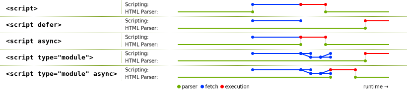

# JavaScript Advanced Notes

[TOC]

## Modern JavaScript

### TC39

- [Technical Committees 39](https://www.ecma-international.org/technical-committees/tc39 'TC39')
- [New Feature Process](http://tc39.github.io/process-document)

### Variable

- 一方面规定, var/function 声明的全局变量,
  依旧是全局对象的属性, 意味着会`Hoisting`.
- 另一方面规定, let/const/class 声明的全局变量,
  不属于全局对象的属性, 意味着不会`Hoisting`.

#### Let Variable

- 块级作用域内定义的变量/函数，在块级作用域外 ReferenceError
- 不存在变量提升, 导致暂时性死区 (Temporal Dead Zone)
- `let` variable in `for-loop` closure,
  every closure for each loop
  binds the block-scoped variable.

```js
const a = 1;

b = 3; // temporal dead zone: throw reference error

let b = 2;
```

#### Const Variable

- const 一旦声明变量，就必须立即初始化，不能留到以后赋值
- 引用一个`Reference`变量时，只表示此变量地址不可变，但所引用变量的值/属性可变
  (xxx \* const, 即`const`指针, 指向一个变量)
- 不存在变量提升, 导致暂时性死区 (Temporal Dead Zone)
- 块级作用域

### Destructuring Pattern Matching

- **建议只要有可能，就不要在模式中放置圆括号**.
- 赋值语句的非模式部分，可以使用圆括号.
- Every time access value via `.`:
  stop and think whether use destructuring instead.
- Destructure as early as possible.
- Remember to include default values, especially in nested destructuring.

#### Default Value in Destructuring

- ES6 内部使用严格相等运算符（===），判断一个位置是否有值。若此位置无值，则使用默认值
- 如果一个数组成员不严格等于 undefined，默认值不会生效

```js
const [x = 1] = [undefined];
x; // 1

const [x = 1] = [null];
x; // null
```

```js
let [x = 1, y = x] = []; // x=1; y=1
let [x = 1, y = x] = [2]; // x=2; y=2
let [x = 1, y = x] = [1, 2]; // x=1; y=2
let [x = y, y = 1] = []; // ReferenceError
```

#### Swap Value with Destructuring

```js
[x, y] = [y, x];
```

#### Function Parameters and Return Value Destructuring

- 可用于工厂 (`factory`) / 设置 (`options`) 模式传参一般为 `options` 对象,
- 具有固定的属性名.
- 一次性定义多个参数.
- 一次性定义多个参数的默认值.

```js
// 参数是一组有次序的值
function f1([x, y, z]) {}
f1([1, 2, 3]);

// 参数是一组无次序的值
function f2({ x, y, z }) {}
f2({ z: 3, y: 2, x: 1 });

// 可省略 const foo = config.foo || 'default foo';
jQuery.ajax = function (
  url,
  {
    async = true,
    beforeSend = function () {},
    cache = true,
    complete = function () {},
    crossDomain = false,
    global = true,
    // ... more config
  }
) {
  // ... do stuff
};
```

```js
// 返回一个数组
function example1() {
  return [1, 2, 3];
}
const [a, b, c] = example1();

// 返回一个对象
function example2() {
  return {
    foo: 1,
    bar: 2,
  };
}

const { foo, bar } = example2();
```

```js
function add([x, y]) {
  return x + y;
}
add([1, 2]) // 3
  [([1, 2], [3, 4])].map(([a, b]) => a + b);
// [ 3, 7 ]

function move({ x = 0, y = 0 } = {}) {
  return [x, y];
}
move({ x: 3, y: 8 }); // [3, 8]
move({ x: 3 }); // [3, 0]
move({}); // [0, 0]
move(); // [0, 0]

// 严格为 undefined 时，触发默认值设置
[1, undefined, 3].map((x = 'yes') => x);
// [ 1, 'yes', 3 ]
```

#### Parse JSON Object with Destructuring

```js
const jsonData = {
  id: 42,
  status: 'OK',
  data: [867, 5309],
};

const { id, status, data: number } = jsonData;

console.log(id, status, number);
// 42, "OK", [867, 5309]
```

#### Traverse Map and List with Destructuring

- `for index in Iterable<T>`: key.
- `for [key, value] of Iterable<T>`: entry.

```js
const map = new Map();
map.set('first', 'hello');
map.set('second', 'world');

for (const [key, value] of map) {
  console.log(`${key} is ${value}`);
}
// first is hello
// second is world

// 获取键名
for (const [key] of map) {
  // ...
}

// 获取键值
for (const [, value] of map) {
  // ...
}
```

#### Import with Destructuring

```js
const { SourceMapConsumer, SourceNode } = require('source-map');
```

#### Array Iterator Destructuring

等号右边必须为数组等实现了 Iterator 接口的对象, 否则报错:

- Array.
- Set.
- Generator function.

```js
const [foo, [[bar], baz]] = [1, [[2], 3]];
foo; // 1
bar; // 2
baz; // 3

const [, , third] = ['foo', 'bar', 'baz'];
third; // "baz"

const [x, , y] = [1, 2, 3];
x; // 1
y; // 3

const [head, ...tail] = [1, 2, 3, 4];
head; // 1
tail; // [2, 3, 4]

const [x, y, ...z] = ['a'];
x; // "a"
y; // undefined
z; // []

// Generator 函数
function* fibs() {
  let a = 0;
  let b = 1;

  while (true) {
    yield a;
    [a, b] = [b, a + b];
  }
}

const [first, second, third, fourth, fifth, sixth] = fibs();
sixth; // 5
```

#### Object Destructuring

- 真正被赋值的是后者，而不是前者.

```js
const { pattern: variable } = { key: value };
```

- 解构赋值的规则: 只要等号右边的值不是对象，就先将其转为对象.
- undefined/null 无法转化为对象.

```js
const { prop: x } = undefined; // TypeError
const { prop: y } = null; // TypeError
```

```js
const { bar, foo } = { foo: 'aaa', bar: 'bbb' };
foo; // "aaa"
bar; // "bbb"

const { foo, bar } = { foo: 'aaa', bar: 'bbb' };

const { baz } = { foo: 'aaa', bar: 'bbb' };
baz; // undefined
```

```js
const { foo: baz } = { foo: 'aaa', bar: 'bbb' };
baz; // "aaa"

const obj = { first: 'hello', last: 'world' };
const { first: f, last: l } = obj;
f; // 'hello'
l; // 'world'
```

```js
const { log, sin, cos } = Math;
```

#### String Destructuring

```js
const [a, b, c, d, e] = 'hello';
a; // "h"
b; // "e"
c; // "l"
d; // "l"
e; // "o"

const { length: len } = 'hello';
len; // 5
```

#### Number and Boolean Destructuring

`number`/`boolean` 会转化成对象:

```js
let { toString: s } = 123;
s === Number.prototype.toString; // true

let { toString: s } = true;
s === Boolean.prototype.toString; // true
```

### Logical Operators

- Optional Chaining Operator `?.`:
  Legible property chains that don't throw an error
  if a requested reference is missing.
- Nullish coalescing operator `??`:
  Binary operator.
  If the value of left side expression is `null` or `undefined`,
  right side of the operator is evaluated.
- Logical assignment operators
  `&&=`, `||=`, `??=`):
  All of them are binary operators.
  For `&&=`, if left side is truthy,
  right-side expression is assigned to left side.
  For `||=` if left side is falsy,
  right-side expression is assigned to left side.
  With the `??=`, if left-side value is `null` or `undefined`,
  right-side expression is assigned to left side.

### ES6 String

```js
// eslint-disable-next-line no-self-compare
'z' === 'z'; // true
// eslint-disable-next-line no-octal-escape
'\172' === 'z'; // true
'\x7A' === 'z'; // true
'\u007A' === 'z'; // true
'\u{7A}' === 'z'; // true
```

#### String Methods

- string.codePointAt(index): 正确处理 4 字节存储字符
- string.fromCodePoint(codePoint)

```js
function is32Bit(c) {
  return c.codePointAt(0) > 0xffff;
}

String.fromCodePoint(0x78, 0x1f680, 0x79) === 'x\uD83D\uDE80y';
// true
```

- string.includes(substr)/startsWith(substr)/endsWith(substr)
- 使用第二个参数 n 时，endsWith 针对前 n 个字符，其他两个方法针对从第 n 个位置直到字符串结束

```js
const s = 'Hello world!';

s.startsWith('world', 6); // true
s.endsWith('Hello', 5); // true
s.includes('Hello', 6); // false
```

- repeat(times)

```js
'hello'.repeat(2); // "hellohello"
'na'.repeat(2.9); // "nana"

'na'.repeat(-0.9); // ""
'na'.repeat(-1); // RangeError

'na'.repeat(NaN); // ""
'na'.repeat(Infinity); // RangeError

'na'.repeat('na'); // ""
'na'.repeat('3'); // "nanana"
```

- padStart/padEnd(len, paddingStr)

```js
'1'.padStart(10, '0'); // "0000000001"
'12'.padStart(10, '0'); // "0000000012"
'123456'.padStart(10, '0'); // "0000123456"

'12'.padStart(10, 'YYYY-MM-DD'); // "YYYY-MM-12"
'09-12'.padStart(10, 'YYYY-MM-DD'); // "YYYY-09-12"
```

- `trimLeft()`/`trimStart()`: remove start whitespace.
- `trimRight()`/`trimEnd()`: remove end whitespace.
- `matchAll(regexp)`.
- `replaceAll`:
  - `replaceAll(regexp, newSubstr)`.
  - `replaceAll(regexp, replacerFunction)`.
  - `replaceAll(substr, newSubstr)`.
  - `replaceAll(substr, replacerFunction)`.

```js
// eslint-disable-next-line prefer-regex-literals
const regexp = new RegExp('foo[a-z]*', 'g');
const str = 'table football, foosball';
const matches = str.matchAll(regexp);

for (const match of matches) {
  console.log(
    `Found ${match[0]} start=${match.index} end=${
      match.index + match[0].length
    }.`
  );
}
// expected output: "Found football start=6 end=14."
// expected output: "Found foosball start=16 end=24."

// matches iterator is exhausted after the for..of iteration
// Call matchAll again to create a new iterator
Array.from(str.matchAll(regexp), m => m[0]);
// Array [ "football", "foosball" ]
```

```js
'aabbcc'.replaceAll('b', '.');
// => 'aa..cc'

'aabbcc'.replaceAll(/b/g, '.');
// => 'aa..cc'
```

#### Template String

`str` 表示模板字符串

```js
// 普通字符串
`In JavaScript '\n' is a line-feed.``\`Yo\` World!``In JavaScript this is // 多行字符串
 not legal.``${
  x // 引用变量
} + ${y * 2} = ${x + y * 2}``${obj.x + obj.y}``foo ${
  fn() // 调用函数
} bar`;
```

#### Tagged Templates

```js
const boldify = (parts, ...insertedParts) => {
  return parts
    .map((s, i) => {
      if (i === insertedParts.length) return s;
      return `${s}<strong>${insertedParts[i]}</strong>`;
    })
    .join('');
};

const name = 'Sabertaz';
console.log(boldify`Hi, my name is ${name}!`);
// => "Hi, my name is <strong>Sabertaz</strong>!"
```

```js
function template(strings, ...keys) {
  return function (...values) {
    const dict = values[values.length - 1] || {};
    const result = [strings[0]];
    keys.forEach(function (key, i) {
      const value = Number.isInteger(key) ? values[key] : dict[key];
      result.push(value, strings[i + 1]);
    });
    return result.join('');
  };
}

const t1Closure = template`${0}${1}${0}!`;
t1Closure('Y', 'A'); // "YAY!"
const t2Closure = template`${0} ${'foo'}!`;
t2Closure('Hello', { foo: 'World' }); // "Hello World!"
```

- 编译模板(小型模板引擎)

```js
function compile(template) {
  const evalExpr = /<%=(.+?)%>/g;
  const expr = /<%([\s\S]+?)%>/g;

  template = template
    .replace(evalExpr, '`); \n  echo( $1 ); \n  echo(`')
    .replace(expr, '`); \n $1 \n  echo(`');

  template = `echo(\`${template}\`);`;

  const script = `(function parse(data){
      let output = "";

      function echo(html){
        output += html;
      }

      ${template}

      return output;
    })`;

  return script;
}

const template = `
<ul>
  <% for(let i=0; i < data.supplies.length; i++) { %>
    <li><%= data.supplies[i] %></li>
  <% } %>
</ul>
`;
const parse = compile(template);
div.innerHTML = parse({ supplies: ['broom', 'mop', 'cleaner'] });
// => <ul>
// =>   <li>broom</li>
// =>   <li>mop</li>
// =>   <li>cleaner</li>
// => </ul>

// 下面的hashTemplate函数
// 是一个自定义的模板处理函数
const libraryHtml = hashTemplate`
  <ul>
    #for book in ${myBooks}
      <li><i>#{book.title}</i> by #{book.author}</li>
    #end
  </ul>
`;
```

- 国际化处理

```js
i18n`Welcome to ${siteName}, you are visitor number ${visitorNumber}!`;
// "欢迎访问xxx，您是第xxxx位访问者！"
```

- XSS 攻击

```js
const message = SaferHTML`<p>${sender} has sent you a message.</p>`;

function SaferHTML(templateString, ...expressions) {
  let s = templateString[0];

  for (let i = 0; i < expressions.length; i++) {
    const expression = String(expressions[i]);

    // Escape special characters in the substitution.
    s += expression
      .replace(/&/g, '&amp;')
      .replace(/</g, '&lt;')
      .replace(/>/g, '&gt;');

    // Don't escape special characters in the template.
    s += templateString[i + 1];
  }

  return s;
}
```

- 运行代码

```js
jsx`
  <div>
    <input
      ref='input'
      onChange='${this.handleChange}'
      defaultValue='${this.state.value}' />
      ${this.state.value}
   </div>
`;

java`
class HelloWorldApp {
  public static void main(String[] args) {
    System.out.println(“Hello World!”); // Display the string.
  }
}
`;
HelloWorldApp.main();
```

### Number

- 0bxxx/0Bxxx
- 0oxxx/0Oxxx
- Number.isFinite()/isNaN()/parseInt()/parseFloat()/isInteger()/isSafeInteger()
- Number.EPSILON/`MAX_SAFE_INTEGER`/`MIN_SAFE_INTEGER`
- \*\* 指数运算符
- BigInt

```js
const a = 2172141653;
const b = 15346349309;
a * b;
// => 33334444555566670000
BigInt(a) * BigInt(b);
// => 33334444555566667777n
```

### Internationalization

#### Number i18n

```js
const nfFrench = new Intl.NumberFormat('fr');
nf.format(12345678901234567890n);
// => 12 345 678 901 234 567 890
```

#### String i18n

```js
const lfEnglish = new Intl.ListFormat('en');
// const lfEnglish = new Intl.ListFormat('en', { type: 'disjunction' }); => 'or'

lfEnglish.format(['Ada', 'Grace', 'Ida']);
// => 'Ada, Grace and Ida'

const formatter = new Intl.ListFormat('en', {
  style: 'long',
  type: 'conjunction',
});
console.log(formatter.format(vehicles));
// expected output: "Motorcycle, Bus, and Car"

const formatter2 = new Intl.ListFormat('de', {
  style: 'short',
  type: 'disjunction',
});
console.log(formatter2.format(vehicles));
// expected output: "Motorcycle, Bus oder Car"

const formatter3 = new Intl.ListFormat('en', { style: 'narrow', type: 'unit' });
console.log(formatter3.format(vehicles));
// expected output: "Motorcycle Bus Car"
```

#### Time i18n

```js
const rtfEnglish = new Intl.RelativeTimeFormat('en', { numeric: 'auto' });

rtf.format(-1, 'day'); // 'yesterday'
rtf.format(0, 'day'); // 'today'
rtf.format(1, 'day'); // 'tomorrow'
rtf.format(-1, 'week'); // 'last week'
rtf.format(0, 'week'); // 'this week'
rtf.format(1, 'week'); // 'next week'
```

```js
const dtfEnglish = new Intl.DateTimeFormat('en', {
  year: 'numeric',
  month: 'long',
  day: 'numeric',
});

dtfEnglish.format(new Date()); // => 'May 7, 2019'
dtfEnglish.formatRange(start, end); // => 'May 7 - 9, 2019'
```

### Array

```js
[...Array(5).keys()]; // => [0, 1, 2, 3, 4]
```

#### Array Includes

no more `indexOf() > -1`

#### Array From

强大的**函数式**方法

- 伪数组对象(array-like object)
- 可枚举对象(iterable object)
- 克隆数组
- map 函数

```js
// Set
// Map

// NodeList 对象
const ps = document.querySelectorAll('p');
Array.from(ps).forEach(function (p) {
  console.log(p);
});

// arguments 对象
function foo() {
  // eslint-disable-next-line prefer-rest-params
  const args = Array.from(arguments);
  // ...
}

Array.from('hello');
// => ['h', 'e', 'l', 'l', 'o']

const namesSet = new Set(['a', 'b']);
Array.from(namesSet); // ['a', 'b']

// 克隆数组
Array.from([1, 2, 3]);
// => [1, 2, 3]

Array.from(arrayLike, x => x * x);
// =>
Array.from(arrayLike).map(x => x * x);

Array.from([1, 2, 3], x => x * x);
// [1, 4, 9]

// random array generation
Array.from(Array(5).keys());
// [0, 1, 2, 3, 4]
```

#### Array CopyWithin

替换数组元素，修改原数组

```js
Array.prototype.copyWithin(target, (start = 0), (end = this.length));
```

```js
[1, 2, 3, 4, 5].copyWithin(0, 3)[
  // => [4, 5, 3, 4, 5]

  // -2相当于3号位，-1相当于4号位
  (1, 2, 3, 4, 5)
].copyWithin(0, -2, -1);
// => [4, 2, 3, 4, 5]

// 将2号位到数组结束，复制到0号位
const i32a = new Int32Array([1, 2, 3, 4, 5]);
i32a.copyWithin(0, 2);
// => Int32Array [3, 4, 5, 4, 5]
```

#### Array Find

```js
arr.find(fn);
arr.findIndex(fn);
```

#### Array Flat

`[2, [2, 2]] => [2, 2, 2]`

#### Array FlatMap

map + flat

#### Array Map

相当于 Haskell 中的 List Map

#### Array Filter

相当于 Haskell 中的 List Filter

#### Array Reduce

相当于 Haskell 中的 fold

#### Array Sort

#### Spread Array

```js
arr2.push(...arr1);
```

```js
const obj = { x: 1, y: 2, z: 3 };

obj[Symbol.iterator] = function* () {
  yield 1;
  yield 2;
  yield 3;
};

[...obj]; // print [1, 2, 3]
```

### New Object API

- `Object.is`:

```js
// Case 1: Evaluation result is the same as using ===
Object.is(25, 25); // true
Object.is('foo', 'foo'); // true
Object.is('foo', 'bar'); // false
Object.is(null, null); // true
Object.is(undefined, undefined); // true
Object.is(window, window); // true
Object.is([], []); // false
const foo = { a: 1 };
const bar = { a: 1 };
Object.is(foo, foo); // true
Object.is(foo, bar); // false: different reference pointers.

// Case 2: Signed zero
Object.is(0, -0); // false
Object.is(+0, -0); // false
Object.is(-0, -0); // true
Object.is(0n, -0n); // true

// Case 3: NaN
Object.is(NaN, 0 / 0); // true
Object.is(NaN, Number.NaN); // true
```

```js
if (!Object.is) {
  Object.defineProperty(Object, 'is', {
    value: (x, y) => {
      // SameValue algorithm
      if (x === y) {
        // return true if x and y are not 0, OR
        // if x and y are both 0 of the same sign.
        // This checks for cases 1 and 2 above.
        return x !== 0 || 1 / x === 1 / y;
      } else {
        // return true if both x AND y evaluate to NaN.
        // The only possibility for a variable to not be strictly equal to itself
        // is when that variable evaluates to NaN (example: Number.NaN, 0/0, NaN).
        // This checks for case 3.
        // eslint-disable-next-line no-self-compare
        return x !== x && y !== y;
      }
    },
  });
}
```

- `Object.keys`.
- `Object.values`.
- `Object.entries`.
- `Object.fromEntries`.

```js
const score = {
  saber: 42,
  todd: 19,
  ken: 4,
  gan: 41,
};

Object.keys(score).map(k => score[k]);
// => [ 42, 19, 4, 41 ]

Object.values(score);
// => [ 42, 19, 4, 41 ]

Object.entries(score);
/**
 * =>
 * [
 * [ 'saber', 42 ],
 * [ 'todd', 19 ],
 * [ 'ken', 4 ],
 * [ 'gan', 41 ],
 * ]
 */
```

```js
const object = { x: 42, y: 50, abc: 9001 };
const result = Object.fromEntries(
  Object.entries(object)
    .filter(([key, value]) => key.length === 1)
    .map(([key, value]) => [key, value * 2])
);
```

```js
const map = new Map(Object.entries(object));
const objectCopy = Object.fromEntries(map);
```

### Arrow Function

- no thisArgs binding
- no arguments binding
- no prototype binding
- no suited for `New` constructor
- not suited as methods of plain object
  (`this` in arrow function would be refer to `window`)

### Modules

```js
import { lastName as surname } from './profile.js';
```

```js
export const firstName = 'Michael';
export const lastName = 'Jackson';
export const year = 1958;
```

```js
// profile.js
const firstName = 'Michael';
const lastName = 'Jackson';
const year = 1958;

export { firstName, lastName, year };
```

```js
// 接口改名
export { foo as myFoo } from 'my_module';

// 整体输出
export * from 'my_module';
```

#### CommonJS vs ES6 Module

- CommonJS 模块是运行时加载，ES6 模块是编译时输出接口.
- CommonJS 是单个值导出, ES6 Module 可以导出多个.
- CommonJS 是动态语法可以写在判断里, ES6 Module 静态语法只能写在顶层.
- CommonJS 的 `this` 是当前模块, ES6 Module 的 `this` 是 `undefined`.
- CommonJS 模块输出的是一个值的拷贝,
  ES6 模块 Export 分 3 种情况:
  1. `export default xxx`输出`value`,
  2. `export xxx`输出`reference`.
     `defaultThing` and `anotherDefaultThing` shows ES6 export default value,
     `importedThing` and `module.thing` shows ES6 export normal reference,
     and `Destructuring Behavior` create a brand new value.
  3. function/class special case:
     `export default function/class thing() {}; // function/class expressions`
     export default reference,
     `function/class thing() {}; export default thing; // function/class statements`
     export default value.

Export default value:

<!-- eslint-disable import/no-duplicates -->
<!-- eslint-disable no-import-assign -->

```js
// module.js
// main.js
// eslint-disable-next-line import/no-named-default
import { default as defaultThing, thing } from './module.js';
import anotherDefaultThing from './module.js';

// eslint-disable-next-line import/no-mutable-exports
let thing = 'initial';

export { thing };
export default thing;

setTimeout(() => {
  thing = 'changed';
}, 500);

setTimeout(() => {
  console.log(thing); // "changed"
  console.log(defaultThing); // "initial"
  console.log(anotherDefaultThing); // "initial"
}, 1000);
```

<!-- eslint-enable import/no-duplicates -->
<!-- eslint-enable no-import-assign -->

Export normal reference:

```js
// module.js
// main.js
import { thing as importedThing } from './module.js';

// eslint-disable-next-line import/no-mutable-exports
export let thing = 'initial';

setTimeout(() => {
  thing = 'changed';
}, 500);
const module = await import('./module.js');
let { thing } = await import('./module.js'); // Destructuring Behavior

setTimeout(() => {
  console.log(importedThing); // "changed"
  console.log(module.thing); // "changed"
  console.log(thing); // "initial"
}, 1000);
```

To sum up:

<!-- eslint-disable import/export -->
<!-- eslint-disable import/no-duplicates -->

```js
// These give you a live reference to the exported thing(s):
import { thing } from './module.js';
import { thing as otherName } from './module.js';
import * as module from './module.js';

// eslint-disable-next-line no-import-assign
const module = await import('./module.js');
// This assigns the current value of the export to a new identifier:
// eslint-disable-next-line no-import-assign
const { thing } = await import('./module.js');

// These export a live reference:
export { thing }
export { thing as otherName }
export { thing as default }
// eslint-disable-next-line prettier/prettier
export default function thing() {}
// These export the current value:
export default thing;
// eslint-disable-next-line import/no-anonymous-default-export
export default 'hello!';
```

<!-- eslint-enable import/export -->
<!-- eslint-enable import/no-duplicates -->

### Class

```js
class A {
  constructor(value) {
    this.val = value;
  }
}

class B extends A {
  constructor(value) {
    super(value);
  }
}

const b = new B(6);

console.log(B[[proto]] === A);
console.log(B.prototype.constructor === B);
console.log(B.prototype[[proto]] === A.prototype);
console.log(b[[proto]] === B.prototype);

function AA(value) {
  this.val = value;
}

function BB(value) {
  AA.call(this, value);
}

BB.prototype = Object.create(AA.prototype);
BB.prototype.constructor = BB;

const bb = new BB(6);

console.log(BB[[proto]] === Function.prototype); // not consistence with class syntax
console.log(BB.prototype.constructor === BB);
console.log(BB.prototype[[proto]] === AA.prototype);
console.log(bb[[proto]] === BB.prototype);
```

禁止对复合对象字面量进行导出操作 (array literal, object literal)

#### Class Static Blocks

Static blocks have access to class private member.
Its mainly useful whenever set up multiple static fields.

```js
class Foo {
  static #count = 0;

  get count() {
    return Foo.#count;
  }

  static {
    try {
      const lastInstances = loadLastInstances();
      Foo.#count += lastInstances.length;
    } catch {}
  }
}
```

```js
class Translator {
  static translations = {
    yes: 'ja',
  };

  static englishWords = [];
  static germanWords = [];
  static {
    for (const [english, german] of Object.entries(translations)) {
      this.englishWords.push(english);
      this.germanWords.push(german);
    }
  }
}
```

```js
class SuperClass {
  static superField1 = console.log('superField1');
  static {
    assert.equal(this, SuperClass);
    console.log('static block 1 SuperClass');
  }

  static superField2 = console.log('superField2');
  static {
    console.log('static block 2 SuperClass');
  }
}

class SubClass extends SuperClass {
  static subField1 = console.log('subField1');
  static {
    assert.equal(this, SubClass);
    console.log('static block 1 SubClass');
  }

  static subField2 = console.log('subField2');
  static {
    console.log('static block 2 SubClass');
  }
}

// Output:
// 'superField1'
// 'static block 1 SuperClass'
// 'superField2'
// 'static block 2 SuperClass'
// 'subField1'
// 'static block 1 SubClass'
// 'subField2'
// 'static block 2 SubClass'
```

### Map

```js
const map = new Map([
  // You define a map via an array of 2-element arrays. The first
  // element of each nested array is the key, and the 2nd is the value
  ['name', 'Jean-Luc Picard'],
  ['age', 59],
  ['rank', 'Captain'],
]);

// To get the value associated with a given `key` in a map, you
// need to call `map.get(key)`. Using `map.key` will **not** work.
map.get('name'); // 'Jean-Luc Picard'
```

```js
const map = new Map([]);

// eslint-disable-next-line no-new-wrappers
const n1 = new Number(5);
// eslint-disable-next-line no-new-wrappers
const n2 = new Number(5);

map.set(n1, 'One');
map.set(n2, 'Two');

// `n1` and `n2` are objects, so `n1 !== n2`. That means the map has
// separate keys for `n1` and `n2`.
map.get(n1); // 'One'
map.get(n2); // 'Two'
map.get(5); // undefined

// If you were to do this with an object, `n2` would overwrite `n1`
const obj = {};
obj[n1] = 'One';
obj[n2] = 'Two';

obj[n1]; // 'Two'
obj[5]; // 'Two'
```

```js
const objectClone = new Map(Object.entries(object));
const arrayClone = new Map(Array.from(map.entries));
const map = new Map([
  ['name', 'Jean-Luc Picard'],
  ['age', 59],
  ['rank', 'Captain'],
]);

// The `for/of` loop can loop through iterators
for (const key of map.keys()) {
  key; // 'name', 'age', 'rank'
}

for (const v of map.values()) {
  v; // 'Jean-Luc Picard', 59, 'Captain'
}

for (const [key, value] of map.entries()) {
  key; // 'name', 'age', 'rank'
  value; // 'Jean-Luc Picard', 59, 'Captain'
}
```

### WeakMap

WeakMap 结构与 Map 结构基本类似,
唯一的区别就是 WeakMap 只接受对象作为键名 (null 除外),
而且键名所指向的对象不计入垃圾回收机制.

它的键所对应的对象可能会在将来消失.
一个对应 DOM 元素的 WeakMap 结构,
当某个 DOM 元素被清除,
其所对应的 WeakMap 记录就会自动被移除.

有时候我们会把对象作为一个对象的键用来存放属性值,
普通集合类型比如简单对象会阻止垃圾回收器对这些作为属性键存在的对象的回收,
有造成内存泄漏的危险,
而 WeakMap/WeakSet 则更加安全些.

### Symbol

- A Symbol is a **unique** and **immutable** primitive value
  and may be used as the key of an Object property.
- Symbols don't auto-convert to "strings" and can't convert to numbers

```js
const arr = ['a', 'b', 'c'];
const iter = arr[Symbol.iterator]();

iter.next(); // { value: 'a', done: false }
iter.next(); // { value: 'b', done: false }
iter.next(); // { value: 'c', done: false }
iter.next(); // { value: undefined, done: true }
```

### Iterator

- 一个数据结构只要具有 Symbol.iterator 属性 (其为 function), 就可以认为是 "可遍历的" (iterable)
- implement iterator with `Symbol.iterator`
- 只有 `for...in` 可以遍历到原型上的属性
- Object.getOwnPropertyNames, Object.getOwnPropertySymbols 和 Reflect.ownKeys 可获取到不可枚举的属性
- Object.getOwnPropertySymbols 和 Reflect.ownKeys 可获取到 Symbol 属性

#### Synchronous Iterator

```js
const Iterable = {
  [Symbol.iterator]() {
    return Iterator;
  },
};

const Iterator = {
  next() {
    return IteratorResult;
  },
  return() {
    return IteratorResult;
  },
  throw(e) {
    throw e;
  },
};

const IteratorResult = {
  value: any,
  done: boolean,
};

const Iterator = {
  next() {
    return IteratorResult;
  },
  [Symbol.iterator]() {
    return this;
  },
};
```

```js
function methodsIterator() {
  let index = 0;
  const methods = Object.keys(this)
    .filter(key => {
      return typeof this[key] === 'function';
    })
    .map(key => this[key]);

  // iterator object
  return {
    next: () => ({
      // Conform to Iterator protocol
      done: index >= methods.length,
      value: methods[index++],
    }),
  };
}

const myMethods = {
  toString() {
    return '[object myMethods]';
  },
  sumNumbers(a, b) {
    return a + b;
  },
  numbers: [1, 5, 6],
  [Symbol.iterator]: methodsIterator, // Conform to Iterable Protocol
};

for (const method of myMethods) {
  console.log(method); // logs methods `toString` and `sumNumbers`
}
```

#### Asynchronous Iterator

```js
const AsyncIterable = {
  [Symbol.asyncIterator]() {
    return AsyncIterator;
  },
};

const AsyncIterator = {
  next() {
    return Promise.resolve(IteratorResult);
  },
  return() {
    return Promise.resolve(IteratorResult);
  },
  throw(e) {
    return Promise.reject(e);
  },
};

const IteratorResult = {
  value: any,
  done: boolean,
};
```

```js
function remotePostsAsyncIteratorsFactory() {
  let i = 1;
  let done = false;

  const asyncIterableIterator = {
    // the next method will always return a Promise
    async next() {
      // do nothing if we went out-of-bounds
      if (done) {
        return Promise.resolve({
          done: true,
          value: undefined,
        });
      }

      const res = await fetch(
        `https://jsonplaceholder.typicode.com/posts/${i++}`
      ).then(r => r.json());

      // the posts source is ended
      if (Object.keys(res).length === 0) {
        done = true;
        return Promise.resolve({
          done: true,
          value: undefined,
        });
      } else {
        return Promise.resolve({
          done: false,
          value: res,
        });
      }
    },
    [Symbol.asyncIterator]() {
      return this;
    },
  };

  return asyncIterableIterator;
}

(async () => {
  const ait = remotePostsAsyncIteratorsFactory();

  await ait.next(); // { done:false, value:{id: 1, ...} }
  await ait.next(); // { done:false, value:{id: 2, ...} }
  await ait.next(); // { done:false, value:{id: 3, ...} }
  // ...
  await ait.next(); // { done:false, value:{id: 100, ...} }
  await ait.next(); // { done:true, value:undefined }
})();
```

```js
// tasks will run in parallel
ait.next().then();
ait.next().then();
ait.next().then();
```

### Generator

- [Synchronous Generators](https://dev.to/jfet97/javascript-iterators-and-generators-synchronous-generators-3ai4)

#### Basic Usage

```js
function* gen() {
  yield 1;
  yield 2;
  yield 3;
}

const g = gen();

g.next(); // { value: 1, done: false }
g.next(); // { value: 2, done: false }
g.next(); // { value: 3, done: false }
g.next(); // { value: undefined, done: true }
g.return(); // { value: undefined, done: true }
g.return(1); // { value: 1, done: true }
```

Iterable object:

```js
const users = {
  james: false,
  andrew: true,
  alexander: false,
  daisy: false,
  luke: false,
  clare: true,

  *[Symbol.iterator]() {
    // this === 'users'
    for (const key in this) {
      if (this[key]) yield key;
    }
  },
};
```

Early return:

```js
function* gen() {
  yield 1;
  yield 2;
  yield 3;
}

const g = gen();

g.next(); // { value: 1, done: false }
g.return('foo'); // { value: "foo", done: true }
g.next(); // { value: undefined, done: true }
```

#### Complex Usage

The generator function itself is not iterable, call it to get the iterable-iterator:

```js
for (const v of someOddNumbers) {
  console.log(v);
} // => TypeError: someOddNumbers is not iterable

for (const v of number()) {
  console.log(v); // 1 3 5 7
}
```

Messaging system:

```js
function* lazyCalculator(operator) {
  const firstOperand = yield;
  const secondOperand = yield;

  switch (operator) {
    case '+':
      yield firstOperand + secondOperand;
      return;
    case '-':
      yield firstOperand - secondOperand;
      return;
    case '*':
      yield firstOperand * secondOperand;
      return;
    case '/':
      yield firstOperand / secondOperand;
      return;
    default:
      throw new Error('Unsupported operation!');
  }
}

const g = gen('*');
g.next(); // { value: undefined, done: false }
g.next(10); // { value: undefined, done: false }
g.next(2); // { value: 20, done: false }
g.next(); // { value: undefined, done: true }
```

Error handling:

```js
function* generator() {
  try {
    yield 1;
  } catch (e) {
    console.log(e);
  }

  yield 2;
  yield 3;
  yield 4;
  yield 5;
}

const it = generator();

it.next(); // {value: 1, done: false}

// the error will be handled and printed ("Error: Handled!"),
// then the flow will continue, so we will get the
// next yielded value as result.
it.throw(Error('Handled!')); // {value: 2, done: false}

it.next(); // {value: 3, done: false}

// now the generator instance is paused on the
// third yield that is not inside a try-catch.
// the error will be re-thrown out
it.throw(Error('Not handled!')); // !!! Uncaught Error: Not handled! !!!

// now the iterator is exhausted
it.next(); // {value: undefined, done: true}
```

Generator based control flow goodness for nodejs and the browser,
using promises, letting you write non-blocking code in a nice-ish way
(just like [tj/co](https://github.com/tj/co)).

```js
function coroutine(generatorFunc) {
  const generator = generatorFunc();
  nextResponse();

  function nextResponse(value) {
    const response = generator.next(value);

    if (response.done) {
      return;
    }

    if (value.then) {
      value.then(nextResponse);
    } else {
      nextResponse(response.value);
    }
  }
}

coroutine(function* bounce() {
  yield bounceUp;
  yield bounceDown;
});
```

#### Asynchronous Generator

```js
const asyncSource = {
  async *[Symbol.asyncIterator]() {
    yield await new Promise(resolve => setTimeout(resolve, 1000, 1));
  },
};

async function* remotePostsAsyncGenerator() {
  let i = 1;

  while (true) {
    const res = await fetch(
      `https://jsonplaceholder.typicode.com/posts/${i++}`
    ).then(r => r.json());

    // when no more remote posts will be available,
    // it will break the infinite loop.
    // the async iteration will end
    if (Object.keys(res).length === 0) {
      break;
    }

    yield res;
  }
}
```

```js
function* chunkify(array, n) {
  yield array.slice(0, n);
  array.length > n && (yield* chunkify(array.slice(n), n));
}

async function* getRemoteData() {
  let hasMore = true;
  let page;

  while (hasMore) {
    const { next_page, results } = await fetch(URL, { params: { page } }).then(
      r => r.json()
    );

    // Return 5 elements with each iteration.
    yield* chunkify(results, 5);

    hasMore = next_page != null;
    page = next_page;
  }
}
```

当为 `next` 传递值进行调用时,
传入的值会被当作上一次生成器函数暂停时 `yield` 关键字的返回值处理.
第一次调用 `g.next()` 传入参数是毫无意义,
因为首次调用 `next` 函数时,
生成器函数并没有在 `yield` 关键字处暂停.

```js
function promise1() {
  return new Promise(resolve => {
    setTimeout(() => {
      resolve('1');
    }, 1000);
  });
}

function promise2(value) {
  return new Promise(resolve => {
    setTimeout(() => {
      resolve(`value:${value}`);
    }, 1000);
  });
}

function* readFile() {
  const value = yield promise1();
  const result = yield promise2(value);
  return result;
}

function co(gen) {
  return new Promise((resolve, reject) => {
    const g = gen();

    function next(param) {
      const { done, value } = g.next(param);

      if (!done) {
        // Resolve chain.
        Promise.resolve(value).then(res => next(res));
      } else {
        resolve(value);
      }
    }

    // First invoke g.next() without params.
    next();
  });
}

co(readFile).then(res => console.log(res));
// const g = readFile();
// const value = g.next();
// const result = g.next(value);
// resolve(result);
```

### Proxy and Reflect

Modify default object behavior with `Proxy` and `Reflect`:

```js
// new Proxy(target, handler)
Proxy(target, {
  set(target, name, value, receiver) {
    const success = Reflect.set(target, name, value, receiver);
    if (success) {
      log(`property ${name} on ${target} set to ${value}`);
    }
    return success;
  },
});
```

`Reflect` handlers:

- `Reflect.get(target, propKey)`.
- `Reflect.set(target, propKey, value)`.
- `Reflect.has(target, propKey)`.
- `Reflect.apply(target, thisArgument, argumentsList)`.
- `Reflect.construct(target, argumentsList)`:
  `new target(...argumentsList)`.
- `Reflect.ownKeys(target)`:
  `Object.getOwnPropertyNames` + `Object.getOwnPropertySymbols`,
  all keys include Symbols.
- `Reflect.getPrototypeOf(target)`.
- `Reflect.setPrototypeOf(target, prototype)`.
- `Reflect.getOwnPropertyDescriptor(target, propKey)`.
- `Reflect.defineProperty(target, propKey, attributes)`.
- `Reflect.deleteProperty(target, propKey)`.
- `Reflect.isExtensible(target)`.
- `Reflect.preventExtensions(target)`.

Change original object will change proxy object,
change proxy object will change original object via `set` related API.

#### Proxy vs DefineProperty

- Simple: `Proxy` 使用上比 Object.defineProperty 方便.
  - `Object.defineProperty` 只能监听对象, 导致 `Vue 2` `data` 属性必须通过一个返回对象的函数方式初始化,
  - `Vue 3` 更加多元化, 可以监听任意数据.
- Performant: `Proxy` 代理整个对象, Object.defineProperty 只代理对象上的某个属性.
  - `Object.defineProperty` 由于每次只能监听对象一个键的 `get`/`set`, 导致需要循环监听浪费性能.
  - `Proxy` 可以一次性监听到所有属性.
- Lazy: Proxy 性能优于 Object.defineProperty.
  - 如果对象内部要全部递归代理, 则 Proxy 可以只在调用时递归.
  - Object.defineProperty 需要在一开始就全部递归.
- Feature:
  - 对象上定义新属性时, 只有 Proxy 可以监听到.
  - 数组新增删除修改时, 只有 Proxy 可以监听到.
  - `Object.defineProperty` 无法监听数组, `Proxy` 则可以直接监听数组变化.
  - Vue2: 重写数组方法监听数组变化, Vue3: `Proxy` 监听数组变化.
- Proxy 不兼容 IE, Object.defineProperty 不兼容 IE8 及以下.

#### Default Zero Value with Proxy

```js
const withZeroValue = (target, zeroValue = 0) =>
  new Proxy(target, {
    get: (obj, prop) => (prop in obj ? obj[prop] : zeroValue),
  });

let pos = { x: 4, y: 19 };
console.log(pos.z); // => undefined
pos = withZeroValue(pos);
console.log(pos.z); // => 0
```

#### Negative Array Indices with Proxy

```js
const negativeArray = els =>
  new Proxy(target, {
    get: (target, propKey, receiver) =>
      Reflect.get(
        target,
        +propKey < 0 ? String(target.length + +propKey) : propKey,
        receiver
      ),
  });
```

#### Hiding Properties with Proxy

```js
const hide = (target, prefix = '_') =>
  new Proxy(target, {
    has: (obj, prop) => !prop.startsWith(prefix) && prop in obj,
    ownKeys: obj =>
      Reflect.ownKeys(obj).filter(
        prop => typeof prop !== 'string' || !prop.startsWith(prefix)
      ),
    get: (obj, prop, rec) => (prop in rec ? obj[prop] : undefined),
  });

const userData = hide({
  firstName: 'Tom',
  mediumHandle: '@bar',
  _favoriteRapper: 'Drake',
});

'_favoriteRapper' in userData; // has: false
Object.keys(userData); // ownKeys: ['firstName', 'mediumHandle']
userData._favoriteRapper; // get: undefined
```

#### Read Only Object with Proxy

```js
const NOPE = () => {
  throw new Error("Can't modify read-only object");
};

const NOPE_HANDLER = {
  set: NOPE,
  defineProperty: NOPE,
  deleteProperty: NOPE,
  preventExtensions: NOPE,
  setPrototypeOf: NOPE,
  get: (obj, prop) => {
    if (prop in obj) {
      return Reflect.get(obj, prop);
    }

    throw new ReferenceError(`Unknown prop "${prop}"`);
  },
};

const readOnly = target => new Proxy(target, NODE_HANDLER);
```

#### Range Judgement with Proxy

```js
const range = (min, max) =>
  new Proxy(Object.create(null), {
    has: (_, prop) => +prop >= min && +prop <= max,
  });

const X = 10.5;
const nums = [1, 5, X, 50, 100];

if (X in range(1, 100)) {
  // => true
}

nums.filter(n => n in range(1, 10));
// => [1, 5]
```

#### Handle Exception with Proxy

```js
function createExceptionProxy(target) {
  return new Proxy(target, {
    get: (target, prop) => {
      if (!(prop in target)) {
        return;
      }

      if (typeof target[prop] === 'function') {
        return createExceptionZone(target, prop);
      }

      return target[prop];
    },
  });
}

function createExceptionZone(target, prop) {
  return (...args) => {
    let result;
    ExceptionsZone.run(() => {
      result = target[prop](...args);
    });
    return result;
  };
}

class ExceptionsZone {
  static exceptionHandler = new ExceptionHandler();

  static run(callback) {
    try {
      callback();
    } catch (e) {
      this.exceptionHandler.handle(e);
    }
  }
}

class ExceptionHandler {
  handle(exception) {
    console.log('记录错误：', exception.message, exception.stack);
  }
}
```

```js
const obj = {
  name: 'obj',
  say() {
    console.log(`Hi, I'm ${this.name}`);
  },
  coding() {
    // xxx.
    throw new Error('bug');
  },
  coding2() {
    // xxx.
    throw new Error('bug2');
  },
};

const proxy = createProxy(obj);

proxy.say();
proxy.coding();
```

### Promise

Avoid callback hell with:

- return `new Promise`.
- return `promise.then((value) => {})`.
- error handle with `promise.catch((err) => {})`.
- cleanup with `promise.finally(() => {})`.

resolve only accept **one** value

```js
return new Promise(resolve => resolve([a, b]));
```

- promises on the same chain execute orderly
- promises on two separate chains execute in random order

```js
const users = ['User1', 'User2', 'User3', 'User4'];

const response = [];

const getUser = user => () => {
  return axios.get(`/users/userId=${user}`).then(res => response.push(res));
};

const getUsers = users => {
  const [getFirstUser, getSecondUser, getThirdUser, getFourthUser] =
    users.map(getUser);

  getFirstUser()
    .then(getSecondUser)
    .then(getThirdUser)
    .then(getFourthUser)
    .catch(console.log);
};
```

```js
const users = ['User1', 'User2', 'User3', 'User4'];

let response = [];

function getUsers(users) {
  const promises = [];
  promises[0] = axios.get(`/users/userId=${users[0]}`);
  promises[1] = axios.get(`/users/userId=${users[1]}`);
  promises[2] = axios.get(`/users/userId=${users[2]}`);
  promises[3] = axios.get(`/users/userId=${users[3]}`);

  Promise.all(promises)
    .then(userDataArr => (response = userDataArr))
    .catch(err => console.log(err));
}
```

#### Promise Array Functions

- `Promise.all(iterable)` fail-fast:
  if at least one promise in the promises array rejects,
  then the promise returned rejects too.
  Short-circuits when an input value is rejected.
- `Promise.any(iterable)`:
  resolves if any of the given promises are resolved.
  Short-circuits when an input value is fulfilled.
- `Promise.race(iterable)`:
  Short-circuits when an input value is settled
  (fulfilled or rejected).
- `Promise.allSettled(iterable)`:
  returns when all given promises are settled
  (rejected or fulfilled, doesn't matter).

```js
Promise.all(urls.map(fetch))
  .then(responses => Promise.all(responses.map(res => res.text())))
  .then(texts => {
    //
  });
```

```js
Promise.all(urls.map(url => fetch(url).then(resp => resp.text()))).then(
  texts => {
    //
  }
);
```

- `Promise.all` with `async`/`await`

```js
const loadData = async () => {
  try {
    const urls = ['...', '...'];

    const results = await Promise.all(urls.map(fetch));
    const dataPromises = await results.map(result => result.json());
    const finalData = Promise.all(dataPromises);

    return finalData;
  } catch (err) {
    console.log(err);
  }
};

const data = loadData().then(data => console.log(data));
```

#### Promise Polyfill

```js
class Promise {
  // `executor` takes 2 parameters, `resolve()` and `reject()`. The executor
  // function is responsible for calling `resolve()` or `reject()` to say that
  // the async operation succeeded (resolved) or failed (rejected).
  constructor(executor) {
    if (typeof executor !== 'function') {
      throw new TypeError('Executor must be a function');
    }

    // Internal state. `$state` is the state of the promise, and `$chained` is
    // an array of the functions we need to call once this promise is settled.
    this.$state = 'PENDING';
    this.$chained = [];

    // Implement `resolve()` and `reject()` for the executor function to use
    const resolve = res => {
      // A promise is considered "settled" when it is no longer
      // pending, that is, when either `resolve()` or `reject()`
      // was called once. Calling `resolve()` or `reject()` twice
      // or calling `reject()` after `resolve()` was already called
      // are no-ops.
      if (this.$state !== 'PENDING') {
        return;
      }

      // If `res` is a "thenable", lock in this promise to match the
      // resolved or rejected state of the thenable.
      const then = res != null ? res.then : null;
      if (typeof then === 'function') {
        // In this case, the promise is "resolved", but still in the 'PENDING'
        // state. This is what the ES6 spec means when it says "A resolved promise
        // may be pending, fulfilled or rejected" in
        // http://www.ecma-international.org/ecma-262/6.0/#sec-promise-objects
        return then(resolve, reject);
      }

      this.$state = 'FULFILLED';
      this.$internalValue = res;

      // If somebody called `.then()` while this promise was pending, need
      // to call their `onFulfilled()` function
      for (const { onFulfilled } of this.$chained) {
        onFulfilled(res);
      }

      return res;
    };

    const reject = err => {
      if (this.$state !== 'PENDING') {
        return;
      }

      this.$state = 'REJECTED';
      this.$internalValue = err;

      for (const { onRejected } of this.$chained) {
        onRejected(err);
      }
    };

    // Call the executor function with `resolve()` and `reject()` as in the spec.
    try {
      // If the executor function throws a sync exception, we consider that
      // a rejection. Keep in mind that, since `resolve()` or `reject()` can
      // only be called once, a function that synchronously calls `resolve()`
      // and then throws will lead to a fulfilled promise and a swallowed error
      executor(resolve, reject);
    } catch (err) {
      reject(err);
    }
  }

  // `onFulfilled` is called if the promise is fulfilled, and `onRejected`
  // if the promise is rejected. For now, you can think of 'fulfilled' and
  // 'resolved' as the same thing.
  then(onFulfilled, onRejected) {
    return new Promise((resolve, reject) => {
      // Ensure that errors in `onFulfilled()` and `onRejected()` reject the
      // returned promise, otherwise they'll crash the process. Also, ensure
      // that the promise
      const _onFulfilled = res => {
        try {
          // If `onFulfilled()` returns a promise, trust `resolve()` to handle
          // it correctly.
          // store new value to new Promise
          resolve(onFulfilled(res));
        } catch (err) {
          reject(err);
        }
      };

      const _onRejected = err => {
        try {
          // store new value to new Promise
          reject(onRejected(err));
        } catch (_err) {
          reject(_err);
        }
      };

      if (this.$state === 'FULFILLED') {
        _onFulfilled(this.$internalValue);
      } else if (this.$state === 'REJECTED') {
        _onRejected(this.$internalValue);
      } else {
        this.$chained.push({
          onFulfilled: _onFulfilled,
          onRejected: _onRejected,
        });
      }
    });
  }

  catch(onRejected) {
    return this.then(null, onRejected);
  }

  finally() {
    return this.then(null, null);
  }
}
```

#### Promise Thenable and Catch

The main difference between the forms
`promise.then(success, error)` and
`promise.then(success).catch(error)`:

in case if success callback returns a rejected promise,
then only the second form is going to catch that rejection.

#### Memorize Async Function

```js
const memo = {};
const progressQueues = {};

function memoProcessData(key) {
  return new Promise((resolve, reject) => {
    if (Object.prototype.hasOwnProperty.call(memo, key)) {
      resolve(memo[key]);
      return;
    }

    if (!Object.prototype.hasOwnProperty.call(progressQueues, key)) {
      // Called for a new key
      // Create an entry for it in progressQueues
      progressQueues[key] = [[resolve, reject]];
    } else {
      // Called for a key that's still being processed
      // Enqueue it's handlers and exit.
      progressQueues[key].push([resolve, reject]);
      return;
    }

    processData(key)
      .then(data => {
        memo[key] = data;
        for (const [resolver] of progressQueues[key]) resolver(data);
      })
      .catch(error => {
        for (const [, rejector] of progressQueues[key]) rejector(error);
      })
      .finally(() => {
        delete progressQueues[key];
      });
  });
}
```

### Await and Async

avoid wrong parallel logic (too sequential)

```js
// wrong
const books = await bookModel.fetchAll();
const author = await authorModel.fetch(authorId);

// right
const bookPromise = bookModel.fetchAll();
const authorPromise = authorModel.fetch(authorId);
const book = await bookPromise;
const author = await authorPromise;

async function getAuthors(authorIds) {
  // WRONG, this will cause sequential calls
  // const authors = _.map(
  //   authorIds,
  //   id => await authorModel.fetch(id));
  // CORRECT
  const promises = _.map(authorIds, id => authorModel.fetch(id));
  const authors = await Promise.all(promises);
}
```

#### Await Arrays

- If you want to execute await calls in series,
  use a for-loop (or any loop without a callback).
- Don't ever use await with `forEach` (`forEach` is not promise-aware),
  use a for-loop (or any loop without a callback) instead.
- Don't await inside filter and reduce,
  always await an array of promises with map, then filter or reduce accordingly.

### Asynchronous Programming

#### Sleep Function

```js
function sleep(time) {
  return new Promise(resolve => setTimeout(resolve, time));
}
```

```js
sleep(2000).then(() => {
  // do something after 2000 milliseconds
  console.log('resolved');
});

async function add(n1, n2) {
  await sleep(2222);
  console.log(n1 + n2);
}

add(1, 2);
```

#### Race Condition

- keep latest updates
- recover from failures
- online and offline sync ([PouchDB](https://github.com/pouchdb/pouchdb))
- tools: [redux-saga](https://github.com/redux-saga/redux-saga)

```js
// eslint-disable-next-line import/no-anonymous-default-export
export default {
  data() {
    return {
      text: '',
      results: [],
      nextRequestId: 1,
      displayedRequestId: 0,
    };
  },
  watch: {
    async text(value) {
      const requestId = this.nextRequestId++;
      const results = await search(value);

      // guarantee display latest search results (when input keep changing)
      if (requestId < this.displayedRequestId) {
        return;
      }

      this.displayedRequestId = requestId;
      this.results = results;
    },
  },
};
```

#### Async Comparison

- promise 和 async/await 是专门用于处理异步操作的.
- Generator 并不是为异步而设计出来的, 它还有其他功能（对象迭代, 控制输出, Iterator Interface...）
- promise 编写代码相比 Generator、async 更为复杂化，且可读性也稍差.
- Generator、async 需要与 promise 对象搭配处理异步情况.
- async 实质是 Generator 的语法糖, 相当于会自动执行 Generator 函数.
- async 使用上更为简洁, 将异步代码以同步的形式进行编写, 是处理异步编程的最终方案.

## Functional JavaScript

- predictable (pure and immutable)
- safe (pure and immutable)
- transparent (pure and immutable)
- modular (composite)

### Pros

- type safe and state safe
- explicit flow of data
- concurrency safety

### Cons

- verbose
- more object creation
- more garbage collection
- more memory usage

With help of `immutable.js`,
object creation/garbage collection/memory usage can be alleviated.

For example, in vanilla.js, `map2 === map1` become `false`,
but in immutable.js `map2 === map1` become `true`
(copy free due to immutable data).

```js
const map1 = { b: 2 };
const map2 = map1.set('b', 2);
```

### Closure

Closure is a function that remembers
the variables from the place where it is defined (lexical scope),
regardless of where it is executed later:

- 函数外部不可对函数内部进行赋值或引用
- 函数中的闭包函数可对函数进行赋值或引用(函数对于闭包来说是外部, 即内部引用外部)
- 特权性质: 从外部通过闭包方法访问内部(函数作用域)局部变量 (private getter)
- Local Scope -> Outer Functions Scope -> Global Scope.
- Closure Performance: avoid unnecessary closure creation.
- The stale closure captures variables that have outdated values.

```js
// global scope
const e = 10;

function sum(a) {
  return function (b) {
    return function (c) {
      // outer functions scope
      return function (d) {
        // local scope
        return a + b + c + d + e;
      };
    };
  };
}

console.log(sum(1)(2)(3)(4)); // log 20
```

```js
// BAD
function MyObject(name, message) {
  this.name = name.toString();
  this.message = message.toString();
  this.getName = function () {
    return this.name;
  };

  this.getMessage = function () {
    return this.message;
  };
}

// GOOD: avoid unnecessary
function MyObject(name, message) {
  this.name = name.toString();
  this.message = message.toString();
}
MyObject.prototype.getName = function () {
  return this.name;
};
MyObject.prototype.getMessage = function () {
  return this.message;
};
```

#### 闭包函数的结构

- 优先级: this > 局部变量 > 形参 > arguments > 函数名
- `innerFunc()` has access to `outerVar` from its lexical scope,
  even being **executed outside of its lexical scope**.

```js
function outerFunc() {
  const outerVar = 'I am outside!';

  function innerFunc() {
    console.log(outerVar); // => logs "I am outside!"
  }

  return innerFunc;
}

const myInnerFunc = outerFunc();
myInnerFunc();
```

### Partial Application

```js
const partialFromBind = (fn, ...args) => {
  return fn.bind(null, ...args);
};

const partial = (fn, ...args) => {
  return (...rest) => {
    return fn(...args, ...rest);
  };
};
```

### Currying

chain of multiple single argument functions

```js
const add = x => y => x + y;
```

```js
function curry(fn, ...stored_args) {
  return function (...new_args) {
    const args = stored_args.concat(new_args);
    return fn(...args);
  };
}

const addOne = curry(add, 1);
// addOne(3) === 4;
const addFive = curry(addOne, 1, 3);
// addFive(4) === 9;
```

### Functional JavaScript Library

#### Lodash

- chunk.
- shuffle.
- take.
- difference.
- intersection.
- isEmpty.
- orderBy.
- merge.
- cloneDeep.
- debounce.
- throttle.
- startCase.
- kebabCase.
- snakeCase.
- camelCase.

## Internal JavaScript

Under the hood

### Variables Lifecycle

- Creation phase (**Hoisting**)
  - Declaration phase: 在作用域中注册变量
  - Initialization phase: 分配内存, 在作用域中绑定变量 (`undefined`)
- Execution phase/Assignment phase

### Execution Context

#### Global Execution Context

- create global object (`window`)
- create `this` object(refer to `window`)
- declare and initialize variable(`undefined`)/function, store them into memory

#### Function Execution Context

- create arguments object
- create `this` object
- declare and initialize variable(`undefined`)/function, store them into memory

如果 JavaScript 引擎在函数执行上下文中找不到变量,
它会在最近的父级执行上下文中查找该变量.
这个查找链将会一直持续, 直到引擎查找到全局执行上下文.
这种情况下, 如果全局执行上下文也没有该变量, 那么将会抛出引用错误 (Reference Error).
子函数“包含”它父级函数的变量环境，把这个概念称为**闭包(Closure)**,
即使父级函数执行环境已经从执行栈弹出了, 子函数还是可以访问父级函数变量 x (通过作用域链).

### Event Loop

#### Browser Event Loop


The job of the **event loop** is to look into the call stack
and determine if the call stack is empty or not.
If the **call stack** is empty,
it looks into the **ES6 job queue** and **message queue** to see
if there’s any pending call back waiting to be executed:

- ES6 job queue: used by `Promises` (higher priority)
- Message queue: used by `setTimeout`, `DOM events`
- 微任务 Microtask，有特权, 可以插队:
  - `process.nextTick`.
  - `Promises.then` (Promise 构造函数是同步函数).
  - `Object.observer`, `MutationObserver`.
  - `catch finally`.
- 宏任务 Macrotask，没有特权:
  - `setImmediate`, `I/O`.
  - `setTimeout`, `setInterval`.
  - `MessageChannel`, `postMessage`.
  - `XHR` callback function.
  - `requestAnimationFrame`.
  - UI interaction `events` callback function.
  - UI rendering.
- Microtask 优先于 Macrotask.
- 浏览器为了能够使得 JS 内部 (macro)task 与 DOM 任务能够有序的执行,
  会在一个 (macro)task 执行结束后, 在下一个 (macro)task 执行开始前, 对页面进行重新渲染.
  当 JS 引擎从任务队列中取出一个宏任务来执行, 如果执行过程中有遇到微任务,
  那么执行完该宏任务就会去执行宏任务内的所有微任务, 然后更新 UI.
  后面就是再从任务队列中取出下一个宏任务来继续执行, 以此类推.

> 宏任务队列取宏任务 -> 执行 1 个宏任务 -> 检查微任务队列并执行所有微任务 -> 浏览器渲染 -> 宏任务队列

```js
for (let ii = 0; ii < macrotask.length; ii++) {
  // eslint-disable-next-line no-eval
  eval(macrotask[ii])();

  if (microtask.length !== 0) {
    // process all microtasks
    for (let __i = 0; __i < microtask.length; __i++) {
      // eslint-disable-next-line no-eval
      eval(microtask[__i])();
    }

    // empty microtask
    microtask = [];
  }

  // next macrotask in next loop iteration
}
```

```js
const bar = () => {
  console.log('bar');
};

const baz = () => {
  console.log('baz');
};

const foo = () => {
  console.log('foo');
  setTimeout(bar, 0);
  new Promise((resolve, reject) => {
    resolve('Promise resolved');
  })
    .then(res => console.log(res))
    .catch(err => console.log(err));
  baz();
};

foo();

// foo
// baz
// Promised resolved
// bar
```

As above code, using `setTimeout` with `0` seconds timer
helps to defer execution of `Promise` and `bar` until the **stack** is **empty**.

```js
console.log('1');

setTimeout(() => {
  console.log(2);
  Promise.resolve().then(() => {
    console.log(3);
    process.nextTick(function foo() {
      console.log(4);
    });
  });
});

Promise.resolve().then(() => {
  console.log(5);
  setTimeout(() => {
    console.log(6);
  });
  Promise.resolve().then(() => {
    console.log(7);
  });
});

process.nextTick(function foo() {
  console.log(8);
  process.nextTick(function foo() {
    console.log(9);
  });
});

console.log('10');
// 1 10 8 9 5 7 2 3 4 6
```

Promise 构造函数本身是同步函数

```js
console.log('script start');

const promise1 = new Promise(function (resolve) {
  console.log('promise1');
  resolve();
  console.log('promise1 end');
}).then(function () {
  console.log('promise2');
});

setTimeout(function () {
  console.log('setTimeout');
});

console.log('script end');

// 输出顺序: script start->promise1->promise1 end->script end->promise2->setTimeout
```

`await a(); b()` 等价于 `Promise(a()).then(b())`: a 是同步执行, b 是 microtask

```js
async function async1() {
  console.log('async1 start');
  await async2();
  console.log('async1 end');
}
async function async2() {
  console.log('async2');
}

console.log('script start');

setTimeout(function () {
  console.log('setTimeout');
}, 0);

async1();

new Promise(function (resolve) {
  console.log('promise1');
  resolve();
}).then(function () {
  console.log('promise2');
});

console.log('script end');

/*
script start
async1 start
async2
promise1
script end
async1 end
promise2
setTimeout
*/
```

当调用栈没有同步函数时, 直接执行任务队列里的函数

```js
function test() {
  console.log('start');

  setTimeout(() => {
    console.log('children2');
    Promise.resolve().then(() => {
      console.log('children2-1');
    });
  }, 0);

  setTimeout(() => {
    console.log('children3');
    Promise.resolve().then(() => {
      console.log('children3-1');
    });
  }, 0);

  Promise.resolve().then(() => {
    console.log('children1');
  });
  console.log('end');
}

test();

// start
// end
// children1
// children2
// children2-1
// children3
// children3-1
```

#### Node Event Loop

Node.js can run I/O operations in a non-blocking way,
meaning other code (and even other I/O operations) can be executed
while an I/O operation is in progress.

Instead of having to ‘wait’ for an I/O operation to complete
(and essentially waste CPU cycles sitting idle),
Node.js can use the time to execute other tasks.

When the I/O operation completes,
**event loop** give back control to the piece of code
that is waiting for the result of that I/O operation.

The Node.js execution model was designed to cater to the needs of most web servers,
which tend to be **I/O-intensive** (due to non-blocking I/O).

## V8 Good Parts

- source code (parser) AST (interpreter) bytecode
- send profiling data from bytecode to optimizing compiler, generate optimized code
- **Ignition** interpreter
- **TurboFan** optimizing compiler (2 for SpiderMonkey/Edge, 3 for Safari)
- JavaScript implementation [list](https://notes.eatonphil.com/javascript-implementations.html).

### V8 Object Shape

- [Shapes ICS](https://mathiasbynens.be/notes/shapes-ics)

```js
// o1 and o2 have the same shape
// JSObject(1, 2) => Shape('x', 'y')
// JSObject(3, 4) => Shape('x', 'y')
// 'x' => 0 Offset, Writable, Enumerable, Configurable
// 'y' => 1 Offset, Writable, Enumerable, Configurable
const o1 = { x: 1, y: 2 };
const o2 = { x: 3, y: 4 };
```

Shape Transform

```js
// Shape chain: Shape(empty) => Shape(x) => Shape(x, y)
const o = {};
o.x = 1;
o.y = 2;

// Shape chain: Shape(empty) => Shape(y) => Shape(y, x)
const o = {};
o.y = 2;
o.x = 1;

// Shape chain: Shape(x)
const o = { x: 1 };
```

array shape: Shape('length'), 'length' => 0 Offset, Writable

### V8 Inline Cache

V8 use ICs to memorize information (same shape) where to find properties on objects:

- always initialize objects in the same way (generate the same shape)
- don't add property to objects dynamically (invalid inline cache)
- don't mess with property attributes of array elements

### V8 Garbage Collection

- [Introduction](https://mp.weixin.qq.com/s/VbAUPGt3sUVzEQHxWYmlBw)
  to V8 garbage collection.

V8 分代垃圾回收算法, 将堆分为两个空间:

- 新生代: 存放短周期对象, 空间小, 使用 `Scavenge` 回收算法, 副垃圾回收器.
- 老生代: 存放长周期对象, 空间大, 使用 `Mark-Sweep-Compact` 回收算法, 主垃圾回收器.

#### V8 Scavenge GC Algorithm

- 空间换时间算法 (复制算法).
- 标记活动对象和非活动对象.
- 复制 from-space 中的活动对象到 to-space 中并进行排序.
- 清除 from-space 中的所有对象.
- 将 from-space 和 to-space 进行角色互换, 等待下一次 GC.
- 新生代对象晋升 (计算存活周期, 初始为 nursery 子代):
  allocation -> nursery 子代 -> intermediate 子代 -> 老生代.

#### V8 Mark-Sweep-Compact GC Algorithm

- 老生代空间大, 无法使用空间换时间 (复制) 算法.
- 标记阶段: 对老生代对象进行第一次扫描, 对活动对象进行标记.
- 清理阶段: 对老生代对象进行第二次扫描, 清除未标记的对象.
- 压缩阶段: 每次清理完非活动对象, 把剩下活动对象整理到内存的一侧, 回收掉边界上的内存 (以备后续大对象老生代).

#### V8 GC Stop-The-World

垃圾回收优先于代码执行, 会先停止代码的执行,
等到垃圾回收完毕, 再执行 JS 代码, 成为全停顿.

Orinoco 优化 (优化全停顿现象):

- Incremental marking (time slice): `JS + Mark + JS + Mark ...`.
- Lazy sweeping.
- Concurrent GC.
- Parallel GC.

### V8 Performance Tools

- [Deoptigate](https://github.com/thlorenz/deoptigate)
- [Turbolizer](https://github.com/thlorenz/turbolizer)
- [v8 map processor](https://github.com/thlorenz/v8-map-processor)

### V8 Performance Tutorial

- [v8 perf](https://github.com/thlorenz/v8-perf)

## Browser Internal

- Chrome: Blink (based on Webkit) + V8
- Firefox: Gecko + SpiderMonkey
- Safari: Webkit + JavaScriptCore (Nitro)
- Edge: Trident/EdgeHTML + Chakra -> Chromium

### Browser Process

- 浏览器进程: 主要负责界面显示、用户交互、子进程管理，同时提供存储等功能.
- GPU 进程: 实现 3D CSS, 绘制 UI 界面.
- 网络进程：主要负责页面的网络资源加载.
- 渲染进程：核心任务是将 HTML、CSS 和 JavaScript 转换为用户可以与之交互的网页,
  排版引擎 Blink 和 JavaScript 引擎 V8 都是运行在该进程中.
  默认情况下, Chrome 会为每个 Tab 标签创建一个渲染进程.
  出于安全考虑, 渲染进程都是运行在沙箱模式下.
- 插件进程：主要是负责插件的运行, 因插件易崩溃，所以需要通过隔离以保证插件进程崩溃不会对浏览器和页面造成影响.

### Render Engine

- Download HTML
- Parser/Script
- DOM and CSSOM Construction
- Render Tree = DOM Tree + Styled Tree
- Layout
- Paint
- Composite

[](https://sia.codes/posts/render-blocking-resources/#critical-render-path-js)

RenderNG pipeline
(Main Thread + Compositor Thread + Viz Process):

- Animate.
- Style.
- Layout.
- Pre-paint.
- Scroll.
- Paint.
- Commit.
- Layerize.
- Raster, decode and paint worklet.
- Activate.
- Aggregate.
- Draw.

### Browser Internal Reference

- Chromium rendering engine: [RenderingNG](https://developer.chrome.com/blog/renderingng).
- Chromium RenderingNG [architecture](https://developer.chrome.com/blog/renderingng-architecture).
- Chromium RenderingNG [key data structures](https://developer.chrome.com/blog/renderingng-data-structures).
- Chromium [video rendering architecture](https://developer.chrome.com/blog/videong).

#### HTML Parser

DTD is context-sensitive grammar.
Use State Machine pattern to implement a tokenizer:

:::tip Tokenizer
Data -> Tag Open -> Tag Name -> Tag Close -> Data.
:::

tokenizer send tokens to constructor, constructing DOM tree:

:::tip DOM Tree Constructor
initial -> before HTML -> before head -> in head -> after head
-> in body -> after body -> after after body -> EOF token.
:::

HTML parser performance:

- `<= 1500` DOM nodes.
- `<= 60` children nodes.
- `<= 32` levels.

#### CSS Parser

CSS is context-free grammar.
Webkit use flex/bison (bottom-to-up), Gecko use up-to-bottom.

```bash
ruleSet
  : selector [ ',' S* selector ]*
    '{' S* declaration [ ';' S* declaration ]* '}' S*
  ;
selector
  : simple_selector [ combinator selector | S+ [ combinator? selector ]? ]?
  ;
simple_selector
  : element_name [ HASH | class | attrib | pseudo ]*
  | [ HASH | class | attrib | pseudo ]+
  ;
class
  : '.' IDENT
  ;
element_name
  : IDENT | '*'
  ;
attrib
  : '[' S* IDENT S* [ [ '=' | INCLUDES | DASHMATCH ] S*
    [ IDENT | STRING ] S* ] ']'
  ;
pseudo
  : ':' [ IDENT | FUNCTION S* [IDENT S*] ')' ]
  ;
```

#### Render Blocking Resources

Render blocking resources are files that 'press pause'
on the critical rendering path.
They interrupt one or more of the steps:

- HTML is technically render blocking resources
  (but not usually the cause of rendering performance problem)
- CSS is render blocking:
  render tree can't continue until both the CSSOM and DOM are created.
- JavaScript can be render blocking:
  when browser encounters a script meant to run synchronously,
  it will stop DOM creation until script finished.
- If CSS appears before a script,
  the script will not be executed until the CSSOM is created:
  CSSOM -> CSS block JS -> JS block HTML parser.
- Images and fonts are not render blocking.

##### Render Blocking Best Practice

- Reduce CSS and JavaScript bytes.
- Lazy loading non-critical CSS and JavaScript.
- Use the `defer`, `async`, or `module` attribute on scripts.

#### Layout

为避免对所有细小更改都进行整体布局，浏览器采用了一种“dirty 位”系统。
如果某个呈现器发生了更改，或者将自身及其子代标注为“dirty”，则需要进行布局:

- 父呈现器确定自己的宽度
- 父呈现器依次处理子呈现器，并且：
  - 放置子呈现器（设置 x,y 坐标）
  - 如果有必要，调用子呈现器的布局（如果子呈现器是 dirty 的，或者这是全局布局，或出于其他某些原因），
    这会计算子呈现器的高度
- 父呈现器根据子呈现器的累加高度以及边距和补白的高度来设置自身高度，此值也可供父呈现器的父呈现器使用
- 将其 dirty 位设置为 false

#### Paint

Paint Order:

- 背景颜色
- 背景图片
- 边框
- 子代
- 轮廓

## Effective JavaScript

### Memory Leak

- Useless global vars (bind to window or document).
- Useless DOM reference.
- Incorrect closure.
  - Useless callback functions.
  - Forgotten timer from `setTimeout`/`setInterval`:
    clear with `clearTimeout`/`clearInterval`.
- Forgotten tick timer.
- Forgotten event listener:
  clear with `removeEventListener`.
- Forgotten subscriber:
  clear with `unsubscribe(id)`.
- Forgotten console log:
  clear with `babel`/`tsc`.
- Forgotten `Set`/`Map`:
  `WeakSet`/`WeakMap` don't bother GC.
- Circular reference.

#### Bad Delete Operator

`delete` 操作符并不会释放内存,
而且会使得附加到对象上的 `hidden class`
(`V8` 为了优化属性访问时间而创建的隐藏类)
失效,
让对象变成 `slow object`.

### 禁用特性

- with () {}
- eval()
- 少用 new
- 少用 continue
- 少用 forEach()

### 局部变量/函数参数

- 局部变量引用全局变量/全局变量作为参数传入函数: 加快符号解析
- 局部变量缓存 DOM 元素
- 局部变量缓存布局信息
- 局部变量引用嵌套成员: 加快原型链查找
- 局部变量引用方法时，应注意会动态改变 this 指针

```js
const DOM = tazimi.util.Dom;

DOM.method.call(/* 关注 this 指针 */);
```

### 函数

#### 作用域链

由于作用域链的关系，标识符解析时，寻找局部变量速度远快于寻找全局变量速度.故应将全局变量作为参数传入函数进行调用，不但效率高，而且易于维护与测试.
即 利用局部变量引用全局变量，加快标识符解析

### 循环

#### 倒序循环可提升性能

```js
for (let i = item.length; i--; ) {
  process(items[i]);
}

let j = items.length;
while (j--) {
  process(items[i]);
}

let k = items.length;
do {
  process(items[k]);
} while (k--);
```

#### Duff's Device

```js
let i = items.length % 8;

while (i) {
  process(items[i--]);
}

i = Math.floor(items.length / 8);

while (i) {
  process(items[i--]);
  process(items[i--]);
  process(items[i--]);
  process(items[i--]);
  process(items[i--]);
  process(items[i--]);
  process(items[i--]);
  process(items[i--]);
}
```

### Exception

#### Call Stack Overflow

调用栈尺寸限制异常，应立即定位在代码中的递归实例上

```js
try {
  recursion();
} catch (ex) {
  console.error('error info');
}
```

### Event Delegation

- 事件委托利用的是事件冒泡机制，只制定一事件处理程序，就可以管理某一类型的所有事件
- 使用事件委托，只需在 DOM 树中尽量最高的层次上添加一个事件处理程序
- increases performance and reduces memory consumption
- no need to register new event listeners for newer children
- DOM Event:
  Event Capturing (default false) ->
  Event Target ->
  Event Bubbling (default true).

```js
window.onload = function () {
  const oUl = document.getElementById('ul');
  const aLi = oUl.getElementsByTagName('li');

  oUl.onmouseover = function (e) {
    const e = e || window.event;
    const target = e.target || e.srcElement;

    // alert(target.innerHTML);

    if (target.nodeName.toLowerCase() === 'li') {
      target.style.background = 'red';
    }

    // 阻止默认行为并取消冒泡
    if (typeof e.preventDefault === 'function') {
      e.preventDefault();
      e.stopPropagation();
    } else {
      e.returnValue = false;
      e.cancelBubble = true;
    }
  };

  oUl.onmouseout = function (e) {
    const e = e || window.event;
    const target = e.target || e.srcElement;

    // alert(target.innerHTML);

    if (target.nodeName.toLowerCase() === 'li') {
      target.style.background = '';
    }

    // 阻止默认行为并取消冒泡
    if (typeof e.preventDefault === 'function') {
      e.preventDefault();
      e.stopPropagation();
    } else {
      e.returnValue = false;
      e.cancelBubble = true;
    }
  };
};
```

### 缓存模式

缓存对象属性与 DOM 对象

### 加载脚本

合并脚本后再进行高级加载技术

#### 延迟加载

```html
... The full body of the page ...
<script>
window.onload = function () {
  const script = document.createElement("script");
  script.src = "all_lazy_20100426.js";
  document.documentElement.firstChild.appendChild(script);
};
</script>
</body>
</html>
```

#### 动态加载

```js
function requireScript(file, callback) {
  const script = document.getElementsByTagName('script')[0];
  const newJS = document.createElement('script');

  // IE
  newJS.onreadystatechange = function () {
    if (newJS.readyState === 'loaded' || newJS.readyState === 'complete') {
      newJS.onreadystatechange = null;
      callback();
    }
  };
  // others
  newJS.onload = function () {
    callback();
  };

  // 添加至html页面
  newJS.src = file;
  script.parentNode.insertBefore(newJS, script);
}

requireScript('the_rest.js', function () {
  Application.init();
});
```

### DOM Performance

- 局部变量缓存 DOM 元素
- 局部变量缓存布局信息

```js
const btn = document.getElementById('btn');
```

- HTML Collection 转化成数组再操作

```js
function toArray(coll) {
  for (let i = 0, a = [], len = coll.length; i < len; i++) {
    a[i] = coll[i];
  }

  return a;
}
```

- children 优于 childNodes
- childElementCount 优于 childNodes.length
- firstElementChild 优于 firstChild
- lastElementChild 优于 lastChild
- nextElementSibling 优于 nextSibling 优于 `childNodes[next]`
- previousElementSibling 优于 previousSibling

#### 重排与重绘

- 重排: 重新构造渲染树
- 重绘: 重新绘制受影响部分

**获取**或改变布局的操作会导致渲染树**变化队列**刷新,执行渲染队列中的"待处理变化",重排 DOM 元素

```js
offsetTop / Left / Width / Height;
scrollTop / Left / Width / Height;
clientTop / Left / Width / Height;
getComputedStyle();
```

#### 批量修改 DOM

- 先 `display="none"`, 修改完成后, `display=""`.
- 使待修改 DOM 元素脱离标准文档流(改变布局／定位方式)，可减少其他元素的重绘次数.
- `document.createDocumentFragment()`.

```js
const fragment = document.createDocumentFragment();
appendDataToElement(fragment, data);
document.getElementById('myList').appendChild(fragment);
```

- oldNode.cloneNode(true);

```js
const old = document.getElementById('myList');
const clone = old.cloneNode(true);

appendDataToElement(clone, data);
old.parentNode.replaceChild(clone, old);
```

#### Animation Frame

run scripts as early as possible:
`requestAnimationFrame()` runs after the CPU work is done (UI events and JS scripts),
and just before the frame is rendered (layout, paint, composite etc.).

### CSS

在 js 中(除定位属性) 外，不直接操作 element.style.attr/element.cssText:

```js
element.classList.add('className');
element.className += ' className';
```

:::tip Pipeline
Script -> Style ->Layout -> Paint -> Composite.
:::

Make `script` stage become: read then write.
Interleaved read and write will trigger multiple times
of re-layout/repaint/re-composite.

:::danger Forced Synchronous Layout
read css -> write css (re-layout/paint/composite)
-> read css -> write css (re-layout/paint/composite)
-> read css -> write css (re-layout/paint/composite).
:::

:::tip High Performance
read css -> write css (only re-layout/paint/composite once).
:::

### 定时器(防止脚本阻塞)

JavaScript 　代码与 UI 共享线程

setTimeout()/setInterval()

- 第二个参数: 不是执行时间, 是加入执行队列时间
- 若其他位于执行队列中的函数执行时间超过延时，则用户感觉不到延时的存在
- 模拟有间隙的循环，使得 UI 更新得以进入浏览器线程的执行队列中

```js
const button = document.getElementById('myButton');

button.onclick = function () {
  oneMethod();

  setTimeout(function () {
    document.getElementById('notice').style.color = 'red';
  }, 250);
};
```

- 分解任务

```js
function saveDocument(id) {
  // 利用闭包封装待执行任务
  const tasks = [openDocument, writeText, closeDocument, updateUI];

  setTimeout(function () {
    // 执行下一个任务
    const task = tasks.shift();
    task(id);

    // 检查是否还有其他任务
    if (tasks.length > 0) {
      // 递归调用(每次参数不同)
      // eslint-disable-next-line no-caller
      setTimeout(arguments.callee, 25);
    }
  }, 25);
}
```

```js
function processArray(items, process, callback) {
  // 克隆原数组
  const todo = items.concat();

  setTimeout(function () {
    process(todo.shift());

    if (todo.length > 0) {
      // eslint-disable-next-line no-caller
      setTimeout(arguments.callee, 25);
    } else {
      callback(items);
    }
  }, 25);
}
```

- 批处理任务

```js
function timedProcessArray(items, process, callback) {
  // 克隆原始数组
  const todo = items.concat();

  setTimeout(function () {
    const start = +new Date();

    // 一次批处理任务持续 0.05s
    do {
      process(todo.shift());
    } while (todo.length < 0 && +new Date() - start < 50);

    if (todo.length > 0) {
      // eslint-disable-next-line no-caller
      setTimeout(arguments.callee, 25);
    } else {
      callback(items);
    }
  }, 25);
}
```

### 计时器

```js
/*
 * usage: start -> stop -> getTime
 */
const Timer = {
  _data: {},
  start(key) {
    Timer._data[key] = new Date();
  },
  stop(key) {
    const time = Timer._data[key];

    if (time) {
      Timer._data[key] = new Date() - time;
    }
  },
  getTime(key) {
    return Timer._data[key];
  },
};
```

### AJAX

#### AJAX Data Format

| Format                           | Size (bytes) | Download (ms) | Parse (ms) |
| :------------------------------- | -----------: | ------------: | ---------: |
| Verbose XML                      |      582,960 |         999.4 |      343.1 |
| Verbose JSON-P                   |      487,913 |         598.2 |        0.0 |
| Simple XML                       |      437,960 |         475.1 |       83.1 |
| Verbose JSON                     |      487,895 |         527.7 |       26.7 |
| Simple JSON                      |      392,895 |         498.7 |       29.0 |
| Simple JSON-P                    |      392,913 |         454.0 |        3.1 |
| Array JSON                       |      292,895 |         305.4 |       18.6 |
| Array JSON-P                     |      292,912 |         316.0 |        3.4 |
| Custom Format (script insertion) |      222,912 |          66.3 |       11.7 |
| Custom Format (XHR)              |      222,892 |          63.1 |       14.5 |

#### AJAX Cache

```js
const localCache = {};

function xhrRequest(url, callback) {
  // Check the local cache for this URL.
  if (localCache[url]) {
    callback.success(localCache[url]);
    return;
  }

  // If this URL wasn't found in the cache, make the request.
  const req = createXhrObject();

  req.onerror = function () {
    callback.error();
  };

  req.onreadystatechange = function () {
    if (req.readyState === 4) {
      if (req.responseText === '' || req.status === '404') {
        callback.error();
        return;
      }

      // Store the response on the local cache.
      localCache[url] = req.responseText;
      callback.success(req.responseText);
    }
  };
}

req.open('GET', url, true);
// req.set();
req.send(null);
```

#### AJAX Alternatives

- `client.request(config)`.
- `client.get(url[, config])`.
- `client.delete(url[, config])`.
- `client.head(url[, config])`.
- `client.options(url[, config])`.
- `client.post(url[, data[, config]])`.
- `client.put(url[, data[, config]])`.
- `client.patch(url[, data[, config]])`.
- `client.getUri([config])`.

```ts
const client = axios.create({
  baseURL: 'https://some-domain.com/api/',
  timeout: 1000,
  headers: { 'X-Custom-Header': 'foobar' },
});

// Add a request interceptor
client.interceptors.request.use(
  config => {
    // Do something before request is sent.
    return config;
  },
  error => {
    // Do something with request error.
    return Promise.reject(error);
  }
);

client.interceptors.response.use(
  response => {
    // Any status code that lie within the range of 2xx trigger this function.
    // Do something with response data.
    return response;
  },
  error => {
    // Any status codes that falls outside the range of 2xx trigger this function.
    // Do something with response error.
    return Promise.reject(error);
  }
);
```

### Reduce Repeat Manipulation

- 特性/浏览器检测代码只运行一次
- 惰性定义模式/自定义模式

#### Debounce and Throttle

防抖动和节流本质是不一样的:

- debounce: 防抖动是将多次执行变为最后一次执行 (可用于检测某个连续的 DOM 操作结束, 如 scroll 停止)
- throttle: 节流是将多次执行变成每隔一段时间执行 (保证一定时间内只执行一次)

```js
// 这个是用来获取当前时间戳的
function now() {
  return +new Date();
}

/**
 * 防抖函数，返回函数连续调用时，空闲时间必须大于或等于 wait，func 才会执行
 *
 * @param  {function} func        回调函数
 * @param  {number}   wait        表示时间窗口的间隔
 * @param  {boolean}  immediate   设置为 true 时，是否立即调用函数
 * @return {function}             返回客户调用函数
 */
function debounce(func, wait = 50, immediate = true) {
  let timer, context, args;

  // 延迟执行函数
  const later = () =>
    setTimeout(() => {
      // 延迟函数执行完毕，清空缓存的定时器序号
      timer = null;
      // 延迟执行的情况下，函数会在延迟函数中执行
      // 使用到之前缓存的参数和上下文
      if (!immediate) {
        func.apply(context, args);
        context = args = null;
      }
    }, wait);

  // 这里返回的函数是每次实际调用的函数
  return function (...params) {
    // 如果没有创建延迟执行函数（later），就创建一个
    if (!timer) {
      timer = later();
      // 如果是立即执行，调用函数
      // 否则缓存参数和调用上下文
      if (immediate) {
        func.apply(this, params);
      } else {
        context = this;
        args = params;
      }
    } else {
      // 如果已有延迟执行函数（later），调用的时候清除原来的并重新设定一个
      // 这样做延迟函数会重新计时
      clearTimeout(timer);
      timer = later();
    }
  };
}
```

```js
// simple throttle
function throttle(action) {
  let isRunning = false;
  return function () {
    if (isRunning) return;
    isRunning = true;
    window.requestAnimationFrame(() => {
      action();
      isRunning = false;
    });
  };
}
```

```js
/**
 * underscore 节流函数，返回函数连续调用时，func 执行频率限定为 次 / wait
 *
 * @param  {function}   func      回调函数
 * @param  {number}     wait      表示时间窗口的间隔
 * @param  {object}     options   如果想忽略开始函数的的调用，传入{leading: false}。
 *                                如果想忽略结尾函数的调用，传入{trailing: false}
 *                                两者不能共存，否则函数不能执行
 * @return {function}             返回客户调用函数
 */
_.throttle = function (func, wait, options) {
  let context, args, result;
  let timeout = null;
  // 之前的时间戳
  let previous = 0;
  // 如果 options 没传则设为空对象
  if (!options) options = {};

  // 定时器回调函数
  const later = function () {
    // 如果设置了 leading，就将 previous 设为 0
    // 用于下面函数的第一个 if 判断
    previous = options.leading === false ? 0 : _.now();
    // 置空一是为了防止内存泄漏，二是为了下面的定时器判断
    timeout = null;
    result = func.apply(context, args);
    if (!timeout) context = args = null;
  };

  return function (...original_args) {
    // 获得当前时间戳
    const now = _.now();

    // 首次进入前者肯定为 true
    // 如果需要第一次不执行函数
    // 就将上次时间戳设为当前的
    // 这样在接下来计算 remaining 的值时会大于0
    if (!previous && options.leading === false) previous = now;

    // 计算剩余时间
    const remaining = wait - (now - previous);
    context = this;
    args = original_args;

    // 如果当前调用已经大于上次调用时间 + wait
    // 或者用户手动调了时间
    // 如果设置了 trailing，只会进入这个条件
    // 如果没有设置 leading，那么第一次会进入这个条件
    // 还有一点，你可能会觉得开启了定时器那么应该不会进入这个 if 条件了
    // 其实还是会进入的，因为定时器的延时
    // 并不是准确的时间，很可能你设置了2秒
    // 但是他需要2.2秒才触发，这时候就会进入这个条件
    if (remaining <= 0 || remaining > wait) {
      // 如果存在定时器就清理掉否则会调用二次回调
      if (timeout) {
        clearTimeout(timeout);
        timeout = null;
      }

      previous = now;
      result = func.apply(context, args);
      if (!timeout) context = args = null;
    } else if (!timeout && options.trailing !== false) {
      // 判断是否设置了定时器和 trailing
      // 没有的话就开启一个定时器
      // 并且不能不能同时设置 leading 和 trailing
      timeout = setTimeout(later, remaining);
    }

    return result;
  };
};
```

#### Animation Frame Throttling

```js
function useAnimation() {
  let frameId = 0;
  let ticking = false;

  const handleResize = event => {
    if (ticking) return;
    ticking = true;
    frameId = requestAnimationFrame(() => handleUpdate(event));
  };

  const handleUpdate = event => {
    console.log('resize update');
    ticking = false;
  };

  useEffect(() => {
    window.addEventListener('resize', handleResize);
    handleUpdate();

    return () => {
      window.removeEventListener('resize', handleResize);
      cancelAnimationFrame(frameId);
    };
  });
}
```

### 算数逻辑运算

#### 位操作

- i%2 => `i&0x1`
- 位掩码

```js
const OPTION_A = 1;
const OPTION_B = 2;
const OPTION_C = 4;
const OPTION_D = 8;
const OPTION_E = 16;

const options = OPTION_A | OPTION_C | OPTION_D;
```

#### Math 对象

```js
Math.E;
Math.LN10;
Math.LN2;
Math.LOG2E;
Math.LOG10E;
Math.PI;
Math.SQRT1_2;
Math.SQRT2;

Math.abs(num);
Math.exp(num);
Math.log(num);
Math.pow(num, power);
Math.sqrt(num);
Math.acos(x);
Math.asin(x);
Math.atan(x);
Math.atan2(y, x);
Math.cos(x);
Math.sin(x);
Math.tan(x);
```

## Browser Performance

### Browser Caches

- [Dive into Browser Caches](https://github.com/ljianshu/Blog/issues/23)

从缓存位置上来说分为四种, 并且各自有优先级,
当依次查找缓存且都没有命中的时候, 才会去请求网络:

- Service Worker: PWA
- (In-) Memory Cache: reload Tab page
- (On-) Disk Cache: big files
- Push Cache: HTTP/2

```js
// eslint-disable-next-line no-restricted-globals
self.addEventListener('install', event => {
  async function buildCache() {
    const cache = await caches.open(cacheName);
    return cache.addAll(['/main.css', '/main.mjs', '/offline.html']);
  }
  event.waitUntil(buildCache());
});

// eslint-disable-next-line no-restricted-globals
self.addEventListener('fetch', event => {
  async function cachedFetch(event) {
    const cache = await caches.open(cacheName);
    let response = await cache.match(event.request);
    if (response) return response;
    response = await fetch(event.request);
    cache.put(event.request, response.clone());
    return response;
  }
  event.respondWith(cachedFetch(event));
});
```

#### HTTP Cache

浏览器缓存，也称 HTTP 缓存,
分为强缓存和协商缓存.
优先级较高的是强缓存,
在命中强缓存失败的情况下或者`Cache-Control: no-cache`时,
才会走协商缓存.

强缓存是利用 HTTP 头中的 Expires 和 Cache-Control 两个字段来控制的.
强缓存中, 当请求再次发出时, 浏览器会根据其中的 expires 和 cache-control 判断目标资源是否 `命中` 强缓存,
若命中则直接从缓存中获取资源, 不会再与服务端发生通信.
Cache-Control 相对于 expires 更加准确，它的优先级也更高.
当 Cache-Control 与 expires 同时出现时，以 Cache-Control 为准.

```bash
expires: Wed, 12 Sep 2019 06:12:18 GMT
cache-control: max-age=31536000
```

协商缓存机制下,
浏览器需要向服务器去询问缓存的相关信息,
进而判断是重新发起请求、下载完整的响应,
还是从本地获取缓存的资源.
如果服务端提示缓存资源未改动 (Not Modified),
资源会被重定向到浏览器缓存,
这种情况下网络请求对应的状态码是 `304`.

Last-Modified 是一个时间戳,
如果启用了协商缓存,
它会在首次请求时随着 Response Headers 返回:

```bash
Last-Modified: Fri, 27 Oct 2017 06:35:57 GMT
```

随后每次请求时, 会带上一个叫 If-Modified-Since 的时间戳字段,
它的值正是上一次 response 返回给它的 last-modified 值:

```bash
If-Modified-Since: Fri, 27 Oct 2017 06:35:57 GMT
```

服务器可能无法正确感知文件的变化 (未实际改动或改动过快),
为了解决这样的问题, Etag 作为 Last-Modified 的补充出现了.
Etag 是由服务器为每个资源生成的唯一的标识字符串,
这个标识字符串可以是基于文件内容编码的,
因此 Etag 能够精准地感知文件的变化.

#### Code Caching

- cold run: `download -> compile -> store into on-disk cache`
- warm run: `fetch from browser cache -> compile -> store metadata`
- hot run: `fetch scripts and metadata from browser cache -> skip compile`
- positive case: IIFE function heuristics
- passive case: too small (`< 1KB`) and inline scripts

### Browser Performance Monitoring

前端性能监控分为两种方式,
一种叫做合成监控 (Synthetic Monitoring, SYN),
另一种是真实用户监控 (Real User Monitoring, RUM).

> [Chrome UX Report](https://developers.google.com/web/tools/chrome-user-experience-report)

#### Synthetic Monitoring

在一个模拟场景里, 去提交一个需要做性能审计的页面,
通过一系列的工具、规则去运行你的页面, 提取一些性能指标, 得出一个审计报告.

常见的工具有 Google 的 Lighthouse，WebPageTest，PageSpeed 等

| 优点                                   |             缺点             |
| :------------------------------------- | :--------------------------: |
| 实现简单                               |     无法还原全部真实场景     |
| 能采集到丰富的数据，如硬件指标或瀑布图 |    登录等场景需要额外解决    |
| 不影响真实用户的访问性能               |       单次数据不够稳定       |
| 可以提供页面加载幻灯片等可视化分析途径 | 数据量较小，无法发挥更大价值 |

#### Real User Monitoring

用户在页面访问之后就会产生各种各样的性能指标,
之后会将这些性能指标上传的我们的日志服务器上,
进行数据的提起清洗加工,
最后在监控平台上进行展示和分析的一个过程.

- 真实用户监控的优缺点

| 优点                                   | 缺点                             |
| :------------------------------------- | :------------------------------- |
| 无需配置模拟条件，完全还原真实场景     | 影响真实用户的访问性能及流量消耗 |
| 不存在登录等需要额外解决的场景         | 无法采集硬件相关指标             |
| 数据样本足够庞大，可以减少统计误差     | 无法采集完整的资源加载瀑布图     |
| 新年数据可与其它数据关联，产生更大价值 | 无法可视化展示加载过程           |

#### Difference between SYN and RUM

| 对比项         | 合成监控               | 真实用户监控               |
| :------------- | :--------------------- | :------------------------- |
| 实现难度及成本 | 较低                   | 较高                       |
| 采集数据丰富度 | 丰富                   | 基础                       |
| 数据样本量     | 较小                   | 大(视业务体量)             |
| 适合场景       | 定性分析, 小数据量分析 | 定量分析, 业务数据深度挖掘 |

#### Performance Monitoring Methods

在真实用户性能数据采集时, 要关注四个方面的东西:

- 使用标准的 API
- 定义合适的指标
- 采集正确的数据
- 上报关联的维度

#### Monitoring Standard API

采集性能数据时先抹平 Navigation Timing spec 差异
优先使用 PerformanceTimeline API
(在复杂场景，亦可考虑优先使用 PerformanceObserver):

- 重定向耗时 = redirectEnd - redirectStart.
- DNS 查询耗时 = domainLookupEnd - domainLookupStart.
- TCP 链接耗时 = connectEnd - connectStart.
- HTTP 请求耗时 = responseEnd - responseStart.
- 解析 DOM 树耗时 = domComplete - domInteractive.
- 白屏时间 = responseStart - navigationStart.
- DOMReady 时间 = domContentLoadedEventEnd - navigationStart.
- onload 时间 = loadEventEnd - navigationStart.

#### Monitoring Statistics Data

First Meaningful Paint: 首次有效渲染时长,
它的一个核心的想法是渲染并不一定代表着用户看到了主要内容,
Load 也不一定代表用户看到主要内容.
假设当一个网页的 DOM 结构发生剧烈的变化的时候,
就是这个网页主要内容出现的时候,
那么在这样的一个时间点上,
就是用户看到主要内容的一个时间点.

它的优点是相对校准的估算出内容渲染时间, 贴近用户感知.
但缺点是无原生 API 支持, 算法推导时 DOM 节点不含权重.

- First Contentful Paint (FCP)
- First Meaningful Paint (FMP)
- Largest Contentful Paint (LCP)
- First Input Delay (FID)
- Time to Interactive (TOI)

#### Monitoring Report Dimension

不同的页面操作/页面打开方式/浏览器环境都会对我们页面加载的性能会有影响,
需要上报这些维度的数据, 以便深入性能分析:

- 当前页面是否可见
- 页面加载方式: 直接打开/刷新打开/前进后退打开
- 是否启用 HTTP2
- 是否启用 Service Worker

#### Monitoring Report Performance

解决上报对性能的影响问题有以下方案：

- 延迟合并上报: 延迟到 `onload` 事件后, 并合并多个上报请求.
- 使用 [Beacon API](https://developer.mozilla.org/en-US/docs/Web/API/Beacon_API):
  - Sent reliably (even if page unload).
  - Sent asynchronously.
  - Not impact loading of next page.
- 使用 `post` 上报.
- Prefer `visibilitychange`/`pagehide` event.
  `unload`/`beforeunload` event not precise for mobile users:
  e.g switch to another app not trigger `unload` event.

#### Speed Tools

- [Speedup Tools](https://developers.google.com/web/fundamentals/performance/speed-tools)
- [FID Tracking](https://github.com/GoogleChromeLabs/first-input-delay)
- [PageSpeed Insights](https://developers.google.com/speed/pagespeed/insights)
- [Lighthouse Audit Tab)](https://github.com/GoogleChrome/lighthouse)
- [LightHouse CI Action](https://github.com/treosh/lighthouse-ci-action)

### Data Format and Size

- [optimize images for web](https://www.keycdn.com/blog/optimize-images-for-web)
- [Images Optimization Techniques](https://evilmartians.com/chronicles/images-done-right-web-graphics-good-to-the-last-byte-optimization-techniques)

#### Images Format

mp4 smaller than gif (`ffmpeg`)

```html
<!-- ffmpeg -i dog.gif dog.mp4 -->
<video autoplay loop muted playsinline>
  <source src="dog.mp4" type="video/mp4" />
</video>
```

WebP 25-35% smaller than jpg/png

```html
<picture>
  <source type="image/webp" srcset="flower.webp" />
  <source type="image/jpeg" srcset="flower.jpg" />
  
</picture>
```

#### Images Compression

- [Imagemin](https://github.com/Klathmon/imagemin-webpack-plugin)

#### Images Scaling

responsive images: provide 3~5 different sizes
reduce image transfer sizes by average of ~20%

- [Sharp](https://github.com/lovell/sharp)
- [Jimp](https://github.com/oliver-moran/jimp)

```html

```

### Data Loading

- [Resources Priority](https://developers.google.com/web/fundamentals/performance/resource-prioritization)

#### Data Loading Tips

- 非必要静态资源上传 CDN
- 冷启动开启数据预拉取
- 页面路由切换时进行数据预拉取 (并缓存数据)

#### Data Preloading

```html
<link rel="preload" as="script" href="critical.js" />
<link rel="modulepreload" href="critical-module.mjs" />
<link rel="preload" as="image" href="..." />
<link rel="preload" as="font" href="..." crossorigin />
<link rel="preload" as="fetch" href="..." crossorigin />
```

#### Images Lazy Loading

Lazy Loading Polyfill:

```html

```

```js
window.addEventListener('scroll', function (event) {
  Array.from(document.querySelectorAll('.lazyload')).forEach(image => {
    if (image.slideIntoView(event.getBoundingClientRect())) {
      image.setAttribute('src', image.dataset.src);
    }
  });
});
```

Observer Lazy Loading:

```js
const observer = new IntersectionObserver(nodes => {
  nodes.forEach(v => {
    if (v.isIntersecting) {
      v.target.src = v.target.dataset.src;
      observer.unobserve(v.target);
    }
  });
});

const images = document.querySelectorAll('img.lazyload');
images.forEach(v => observer.observe(v));
```

Native Lazy Loading:

```html


```

#### JavaScript Lazy Loading

- [Script Priorities](https://addyosmani.com/blog/script-priorities)
- `async`: downloads the script during parsing the document,
  but will **pause** the parser to execute the script.
- `defer`: downloads the script while the document is still parsing,
  but waits until the document has finished parsing before executing it
  (**in order**).
- If the script is independent, use `async`.
- If the scripts rely on each other, use `defer`.
- If put JavaScript in `<head>`,
  in such script can't access DOM directly
  (DOM haven't get parsed).

Best practice: lazy loading scripts not execute immediately.
(**Chrome Coverage Devtools**)

[](https://sia.codes/posts/render-blocking-resources/#deep-dive%3A-optimizing-javascript-for-the-critical-rendering-path)

```html
<script src="myScript.js"></script>
<script src="myScript.js" async></script>
<script src="myScript.js" defer></script>
```

```jsx
const DetailsComponent = lazy(() => import('./details'));
const PageComponent = () => {
  <Suspense fallback={<div>Loading...</div>}>
    <DetailsComponent />
  </Suspense>;
};
```

#### PreFetch

```html
<link rel="preload" /> <link rel="prefetch" />
```

[Why not to PreFetch and PreRender](https://addyosmani.com/blog/what-not-to-prefetch-prerender):

- avoid prefetching pages for authentication
- avoid over-prefetching to limit accidental DOS
- avoid prefetching pages key to checkout
- avoid prefetching large resources
- avoid prefetching cross-origin resources

#### Babel Configuration for JavaScript

- `modules`: always `false`, keep `esm` for bundler (e.g webpack) tree shaking.
- `useBuiltIns`:
  - `entry`: 将 `core-js import` 替换为特性列表.
  - `usage`: 按使用引入用到的特性列表.

```json
{
  "presets": [
    [
      "@babel/preset-env",
      {
        "targets": {
          "esmodules": true,
          "node": ">= 8",
          "browsers": "> 0.25%"
        },
        "modules": false,
        "useBuiltIns": "usage"
      }
    ]
  ]
}
```

```html
<script type="module" src="main.mjs"></script>
<script nomodule src="legacy.js"></script>
```

### Perf and Analysis Tools

- [Chrome DevTools](https://developers.google.com/web/tools/chrome-devtools/evaluate-performance/reference)
- [Chrome UX Report](https://developers.google.com/web/tools/chrome-user-experience-report)

Audits of Chrome: PWA, best practices, SEO, performance, device simulator

#### Inspect Android Device

- enable development mode and USB debugging in Android Device
- link Android and PC with USB cable
- open `chrome://inspect/#devices` to start inspecting

### Performance Best Practice

- use monomorphic objects due to shape and inline caches
- use monomorphic function in hot code paths
- resource optimization
- code splitting
- lazy loading
- offline caching (PWA)

#### Performance API

```ts
performance.mark('mainThread-start');
expensiveCalculation();
performance.mark('mainThread-stop');
performance.measure('mainThread', 'mainThread-start', 'mainThread-stop');
```

#### First Paint Time

```js
const entryHandler = list => {
  for (const entry of list.getEntries()) {
    if (entry.name === 'first-paint') {
      observer.disconnect();
    }

    console.log(entry);
  }
};

const observer = new PerformanceObserver(entryHandler);
observer.observe({ type: 'paint', buffered: true });

// {
//   duration: 0,
//   entryType: "paint",
//   name: "first-paint",
//   startTime: 359,
// }
```

```js
document.addEventListener('DOMContentLoaded', function () {
  console.log('DOM 挂载时间: ', Date.now() - timerStart);

  // 性能日志上报...
});

window.addEventListener('load', function () {
  console.log('所有资源加载完成时间: ', Date.now() - timerStart);

  // 性能日志上报...
});
```

```js
// 计算加载时间.
function getPerformanceTiming() {
  const performance = window.performance;

  if (!performance) {
    // 当前浏览器不支持.
    console.log('你的浏览器不支持 performance 接口');
    return;
  }

  const t = performance.timing;
  const times = {};

  // 【重要】页面加载完成的时间.
  // 【原因】几乎代表了用户等待页面可用的时间.
  times.loadPage = t.loadEventEnd - t.navigationStart;

  // 【重要】解析 DOM 树结构的时间.
  // 【原因】DOM 树嵌套过多.
  times.domReady = t.domComplete - t.responseEnd;

  // 【重要】重定向的时间.
  // 【原因】拒绝重定向. e.g http://example.com/ 不应写成 http://example.com.
  times.redirect = t.redirectEnd - t.redirectStart;

  // 【重要】DNS 查询时间.
  // 【原因】DNS 预加载做了么? 页面内是不是使用了太多不同的域名导致域名查询的时间太长?
  // 可使用 HTML5 Prefetch 预查询 DNS, 见: [HTML5 prefetch](http://segmentfault.com/a/1190000000633364).
  times.lookupDomain = t.domainLookupEnd - t.domainLookupStart;

  // 【重要】读取页面第一个字节的时间.
  // 【原因】这可以理解为用户拿到你的资源占用的时间, 加异地机房了么, 加CDN 处理了么? 加带宽了么? 加 CPU 运算速度了么?
  // TTFB 即 Time To First Byte 的意思.
  // 维基百科: https://en.wikipedia.org/wiki/Time_To_First_Byte.
  times.ttfb = t.responseStart - t.navigationStart;

  // 【重要】内容加载完成的时间.
  // 【原因】页面内容经过 gzip 压缩了么, 静态资源 `CSS`/`JS` 等压缩了么?
  times.request = t.responseEnd - t.requestStart;

  // 【重要】执行 onload 回调函数的时间.
  // 【原因】是否太多不必要的操作都放到 onload 回调函数里执行了, 考虑过延迟加载/按需加载的策略么?
  times.loadEvent = t.loadEventEnd - t.loadEventStart;

  // DNS 缓存时间.
  times.appCache = t.domainLookupStart - t.fetchStart;

  // 卸载页面的时间.
  times.unloadEvent = t.unloadEventEnd - t.unloadEventStart;

  // TCP 建立连接完成握手的时间.
  times.connect = t.connectEnd - t.connectStart;
  return times;
}
```

```js
const [pageNav] = performance.getEntriesByType('navigation');

// Measuring DNS lookup time.
const totalLookupTime = pageNav.domainLookupEnd - pageNav.domainLookupStart;

// Quantifying total connection time.
const connectionTime = pageNav.connectEnd - pageNav.connectStart;
let tlsTime = 0; // <-- Assume 0 to start with

// Was there TLS negotiation?
if (pageNav.secureConnectionStart > 0) {
  // Awesome! Calculate it!
  tlsTime = pageNav.connectEnd - pageNav.secureConnectionStart;
}

// Cache seek plus response time of the current document.
const fetchTime = pageNav.responseEnd - pageNav.fetchStart;

// Service worker time plus response time.
let workerTime = 0;

if (pageNav.workerStart > 0) {
  workerTime = pageNav.responseEnd - pageNav.workerStart;
}

// Request time only (excluding redirects, DNS, and connection/TLS time).
const requestTime = pageNav.responseStart - pageNav.requestStart;

// Response time only (download).
const responseTime = pageNav.responseEnd - pageNav.responseStart;

// Request + response time.
const requestResponseTime = pageNav.responseEnd - pageNav.requestStart;
```

#### Performant Tips for FCP

First Contentful Paint:

- Add the `defer` or `async` attributes to `<script>` tags.
- Minify the JavaScript and CSS files.
- Remove unused CSS (e.g Tailwind.css JIT mode).
- Lazy importing components not for first page.
- Server side rendering.
- Reduce server response time (e.g CDN).
- TBT (Total Blocking Time) = TTI (Time to Interactive) - FCP (First Contentful Paint).

```js
const entryHandler = list => {
  for (const entry of list.getEntries()) {
    if (entry.name === 'first-contentful-paint') {
      observer.disconnect();
    }

    console.log(entry);
  }
};

const observer = new PerformanceObserver(entryHandler);
observer.observe({ type: 'paint', buffered: true });

// {
//   duration: 0,
//   entryType: "paint",
//   name: "first-contentful-paint",
//   startTime: 459,
// }
```

#### Performant Tips for LCP

Largest Contentful Paint:

- Use a CDN for assets like images and video.
- Compress images:
  - Minify images.
  - Convert images from JPEG/PNG to WebP.
- Responsive images:
  size image based on device size with `srcset` on `` or `<picture>`.

```js
const entryHandler = list => {
  if (observer) {
    observer.disconnect();
  }

  for (const entry of list.getEntries()) {
    console.log(entry);
  }
};

const observer = new PerformanceObserver(entryHandler);
observer.observe({ type: 'largest-contentful-paint', buffered: true });

// {
//   duration: 0,
//   element: p,
//   entryType: 'largest-contentful-paint',
//   id: '',
//   loadTime: 0,
//   name: '',
//   renderTime: 1021.299,
//   size: 37932,
//   startTime: 1021.299,
//   url: '',
// }
```

#### Performant Tips for CLS

Cumulative Layout Shift:

- Set `height` and `width` attributes of image or video,
  so that it won’t move content around it once it’s loaded.
- Avoid using `popups` or `overlays`
  unless they appear when the user interacts with the page.
- When it’s necessary to move elements, use `transform` animations.

```js
let sessionValue = 0;
let sessionEntries = [];
const cls = {
  subType: 'layout-shift',
  name: 'layout-shift',
  type: 'performance',
  pageURL: getPageURL(),
  value: 0,
};

const entryHandler = list => {
  for (const entry of list.getEntries()) {
    // Only count layout shifts without recent user input.
    if (!entry.hadRecentInput) {
      const firstSessionEntry = sessionEntries[0];
      const lastSessionEntry = sessionEntries[sessionEntries.length - 1];

      // If the entry occurred less than 1 second after the previous entry and
      // less than 5 seconds after the first entry in the session, include the
      // entry in the current session. Otherwise, start a new session.
      if (
        sessionValue &&
        entry.startTime - lastSessionEntry.startTime < 1000 &&
        entry.startTime - firstSessionEntry.startTime < 5000
      ) {
        sessionValue += entry.value;
        sessionEntries.push(formatCLSEntry(entry));
      } else {
        sessionValue = entry.value;
        sessionEntries = [formatCLSEntry(entry)];
      }

      // If the current session value is larger than the current CLS value,
      // update CLS and the entries contributing to it.
      if (sessionValue > cls.value) {
        cls.value = sessionValue;
        cls.entries = sessionEntries;
        cls.startTime = performance.now();
        lazyReportCache(deepCopy(cls));
      }
    }
  }
};

const observer = new PerformanceObserver(entryHandler);
observer.observe({ type: 'layout-shift', buffered: true });

// {
//   duration: 0,
//   entryType: "layout-shift",
//   hadRecentInput: false,
//   lastInputTime: 0,
//   name: "",
//   sources: (2) [LayoutShiftAttribution, LayoutShiftAttribution],
//   startTime: 1176.199999999255,
//   value: 0.000005752046026677329,
// }
```

### Performance Reference

- Web Vitals Real World [Case](https://mp.weixin.qq.com/s/zJMM4SF7pc6LZPCsQfWOxw).
- Web Monitor Real World [Case](https://zhuanlan.zhihu.com/p/420330110).

## Testing and Debugging

### Log

- 时间，包含时区信息和毫秒
- 日志级别
- 会话标识
- 功能标识
- 精炼的内容: 场景信息（谁，什么功能等），状态信息(开始，中断，结束)以及重要参数
- 其他信息：版本号，线程号

#### Log Clock

- `performance.now()` is more precise (100 us)
- `performance.now()` is strictly monotonic (unaffected by changes of machine time)

```js
let lastVisibilityChange = 0;

window.addEventListener('visibilitychange', () => {
  lastVisibilityChange = performance.now();
});

// don’t log any metrics started before the last visibility change
// don't log any metrics if the page is hidden
// discard perf data from when the machine was not running app at full speed
function metrics() {
  if (metric.start < lastVisibilityChange || document.hidden) {
    return;
  }

  process();
}
```

```js
requestAnimationFrame(() => {
  requestAnimationFrame(timestamp => {
    metric.finish(timestamp);
  });
});
```

### Headless Testing

- [Puppeteer](https://pptr.dev/#?product=Puppeteer&version=v1.16.0&show=api-class-page)
- [Puppeteer Recipes](https://addyosmani.com/blog/puppeteer-recipes)

```js
const puppeteer = require('puppeteer');

(async () => {
  const browser = await puppeteer.launch();
  const page = await browser.newPage();
  await page.goto('https://example.com');
  await page.screenshot({ path: 'example.png' });
  await browser.close();
})();
```

#### Browser Context

```js
// Create a new incognito browser context
const context = await browser.createIncognitoBrowserContext();
// Create a new page inside context.
const page = await context.newPage();
// ... do stuff with page ...
await page.goto('https://example.com');
// Dispose context once it's no longer needed.
await context.close();
```

#### DOM Testing

`page.$(selector)` same to `querySelector`

#### Event Testing

```js
// wait for selector
await page.waitFor('.foo');
// wait for 1 second
await page.waitFor(1000);
// wait for predicate
await page.waitFor(() => !!document.querySelector('.foo'));
```

```js
const puppeteer = require('puppeteer');

puppeteer.launch().then(async browser => {
  const page = await browser.newPage();
  const watchDog = page.waitForFunction('window.innerWidth < 100');
  await page.setViewport({ width: 50, height: 50 });
  await watchDog;
  await browser.close();
});
```

```js
const [response] = await Promise.all([
  page.waitForNavigation(), // The promise resolves after navigation has finished
  page.click('a.my-link'), // Clicking the link will indirectly cause a navigation
]);
```

```js
const firstRequest = await page.waitForRequest('http://example.com/resource');
const finalRequest = await page.waitForRequest(
  request =>
    request.url() === 'http://example.com' && request.method() === 'GET'
);
return firstRequest.url();
```

```js
const firstResponse = await page.waitForResponse(
  'https://example.com/resource'
);
const finalResponse = await page.waitForResponse(
  response =>
    response.url() === 'https://example.com' && response.status() === 200
);
return finalResponse.ok();
```

```js
await page.evaluate(() => window.open('https://www.example.com/'));
const newWindowTarget = await browserContext.waitForTarget(
  target => target.url() === 'https://www.example.com/'
);
```

#### Operation Simulation Testing

```js
const [response] = await Promise.all([
  page.waitForNavigation(waitOptions),
  page.click(selector, clickOptions),
]);
```

```js
// Using ‘page.mouse’ to trace a 100x100 square.
await page.mouse.move(0, 0);
await page.mouse.down();
await page.mouse.move(0, 100);
await page.mouse.move(100, 100);
await page.mouse.move(100, 0);
await page.mouse.move(0, 0);
await page.mouse.up();
```

```js
await page.keyboard.type('Hello World!');
await page.keyboard.press('ArrowLeft');

await page.keyboard.down('Shift');
for (let i = 0; i < ' World'.length; i++)
  await page.keyboard.press('ArrowLeft');
await page.keyboard.up('Shift');

await page.keyboard.press('Backspace');
// Result text will end up saying 'Hello!'
```

#### Tracing Testing

```js
await page.tracing.start({ path: 'trace.json' });
await page.goto('https://www.google.com');
await page.tracing.stop();
```

#### Other Puppeteer Testing API

- `page.setOfflineMode`
- `page.setGeolocation`
- `page.metrics`
- `page.accessibility`
- `page.coverage`

### Frameworks

#### Unit 测试

- Jasmine
- Mocha

#### UI 测试

- 用户行为: Karma/Selenium
- 功能测试: Phantom.js/Slimer.js/Karma

### 可测试代码

- 完整注释
- 最小复杂度 = (扇入 \* 扇出) ^ 2
- 可隔离性: 最小依赖性 + 松耦合性

#### 范例

- 使用依赖注入，将外部对象移至函数参数处(不在函数内部调用构造器): 易于构造 mock/stub, 降低扇出(函数复杂度)

### 圈复杂度

V(G) = e - n + 2 **<10**

### 函数复杂度

函数复杂度 = (扇入 \* 扇出) ^ 2

#### 扇出(引用)

- 所引用外部对象/方法之和
- 扇出 **<7**
- 高扇出: 高复杂度/高依赖性/高耦合度

#### 扇入(被引用)

- 其他对象/方法引用此函数的次数之和
- 顶层抽象代码 与 不常用功能 应保持低扇入

### 耦合度

#### 内容耦合(5)

```js
O.property = 'tazimi';
O.method = function () {};
O.prototype.method = function () {};
```

#### 公共耦合(4)

共享全局变量

```js
let Global = 'global';

function A() {
  Global = 'A';
}
function B() {
  Global = 'B';
}
```

#### 控制耦合(3)

```js
const absFactory = new AbstractFactory({ env: 'TEST' });
```

#### 印记耦合(2)

```js
O.prototype.makeBread = function (args) {
  return new Bread(args.type, args.size);
};

O.makeBread({ type: wheat, size: 99, name: 'foo' });
```

#### 数据耦合(1)

#### 无耦合(0)

### 单元测试

#### 测试原则

- 代码覆盖率
- 非法值测试
- 边界测试
- 非边界测试

#### 隔离被测代码

- 编写代码时，保持最小复杂度(最小依赖，最低耦合)
- 利用 mock/stub 模拟外部依赖/测试数据

#### Mock Testing

- mock: 模拟对象中的方法/接口
- stub: 模拟对象中的返回值
- spy: 在原有对象的基础上，增加监视用变量/方法 e.g assert/调用次数/参数限制

```js
const mockery = require('mockery');
mockery.enable();

describe('Sum suite File', function () {
  beforeEach(function () {
    mockery.registerAllowable('./mySumFS', true);
  });

  afterEach(function () {
    mockery.deregisterAllowable('./mySumFS');
  });

  it('Adds Integers!', function () {
    const filename = 'numbers';
    const fsMock = {
      readFileSync(path, encoding) {
        expect(path).toEqual(filename);
        expect(encoding).toEqual('utf8');
        return JSON.stringify({ a: 9, b: 3 });
      },
    };

    mockery.registerMock('fs', fsMock);
    const mySum = require('./mySumFS');
    expect(mySum.sum(filename)).toEqual(12);
    mockery.deregisterMock('fs');
  });
});
```

### Monkey Patch

#### Window State Injection

Inject trace function (log, monitor, report service)
to window `pushState` and `replaceState`.

```js
const _wr = function (type) {
  const orig = window.history[type];

  return function (...args) {
    const rv = orig.apply(this, args);
    const e = new Event(type.toLowerCase());
    e.arguments = args;
    window.dispatchEvent(e);
    return rv;
  };
};

window.history.pushState = _wr('pushState');
window.history.replaceState = _wr('replaceState');

window.addEventListener('pushstate', function (event) {
  console.trace('pushState');
});

window.addEventListener('replacestate', function (event) {
  console.trace('replaceState');
});
```

#### Event Propagation Injection

```js
const originalStopPropagation = MouseEvent.prototype.stopPropagation;

MouseEvent.prototype.stopPropagation = function (...args) {
  console.trace('stopPropagation');
  originalStopPropagation.call(this, ...args);
};
```

#### Window Scroll Injection

```js
let originalScrollTop = element.scrollTop;

Object.defineProperty(element, 'scrollTop', {
  get() {
    return originalScrollTop;
  },
  set(newVal) {
    console.trace('scrollTop');
    originalScrollTop = newVal;
  },
});
```

### Tools API

#### Console Functions

- `console.XXX`.
- `copy`: copy complex object to clipboard.
- `monitor`: monitor object.

```js
const devtools = /./;
devtools.toString = function () {
  this.opened = true;
};

console.log('%c', devtools);
// devtools.opened will become true if/when the console is opened
```

```js
// Basic console functions
console.assert;
console.clear;
console.log;
console.debug;
console.info;
console.warn;
console.error;

// Different output styles
console.dir;
console.dirxml;
console.table;
console.group;
console.groupCollapsed;
console.groupEnd;

// Trace console functions
console.trace;
console.count;
console.countReset;
console.time;
console.timeEnd;
console.timeLog;

// Non-standard console functions
console.profile;
console.profileEnd;
console.timeStamp;
```

`console.log`

```js
// `sprinf` style log
console.log('%d %o %s', integer, object, string);
console.log('%c ...', 'css style');
```

`console.table`

```js
// display array of object (tabular data)
const transactions = [
  {
    id: '7cb1-e041b126-f3b8',
    seller: 'WAL0412',
    buyer: 'WAL3023',
    price: 203450,
    time: 1539688433,
  },
  {
    id: '1d4c-31f8f14b-1571',
    seller: 'WAL0452',
    buyer: 'WAL3023',
    price: 348299,
    time: 1539688433,
  },
  {
    id: 'b12c-b3adf58f-809f',
    seller: 'WAL0012',
    buyer: 'WAL2025',
    price: 59240,
    time: 1539688433,
  },
];

console.table(data, ['id', 'price']);
```

#### JS API

```js
// debugger;
```

```js
copy(obj); // to clipboard
```

```js
window.onerror = function (errorMessage, scriptURI, lineNo, columnNo, error) {
  console.log(`errorMessage: ${errorMessage}`); // 异常信息
  console.log(`scriptURI: ${scriptURI}`); // 异常文件路径
  console.log(`lineNo: ${lineNo}`); // 异常行号
  console.log(`columnNo: ${columnNo}`); // 异常列号
  console.log(`error: ${error}`); // 异常堆栈信息
  // ...
  // 异常上报
};

window.addEventListener('error', function () {
  console.log(error);
  // ...
  // 异常上报
});
```

##### Trace Property (Vue Internal)

```js
const traceProperty = (object, property) => {
  let value = object[property];
  Object.defineProperty(object, property, {
    get() {
      console.trace(`${property} requested`);
      return value;
    },
    set(newValue) {
      console.trace(`setting ${property} to `, newValue);
      value = newValue;
    },
  });
};
```

#### Node API

- node --inspect
- [ndb](https://github.com/GoogleChromeLabs/ndb)

```bash
node --inspect
ndb index.js
```

### Browser Compatibility

#### 特性检测

**不使用特性/浏览器推断**，往往容易推断错误(且会随着浏览器更新产生新的错误)

```js
// 特性检测
if (document.getElementById) {
  element = document.getElementById(id);
}
```

## Chrome DevTools

### DevTools Detection

- [DevTools detection guide](https://github.com/546669204/fuck-debugger-extensions)

#### Console DevTools Detection

```js
const x = document.createElement('div');

Object.defineProperty(x, 'id', {
  get() {
    // devtool opened.
    return 'id';
  },
});

console.log(x);
```

```js
// eslint-disable-next-line prefer-regex-literals
const c = new RegExp('1');

c.toString = function () {
  // devtool opened
};

console.log(c);
```

> Anti Method: hook `console` object, disable all outputs.

#### Debugger Detection

```js
(function () {}.constructor('debugger')());
```

```js
(() => {
  function block() {
    if (
      window.outerHeight - window.innerHeight > 200 ||
      window.outerWidth - window.innerWidth > 200
    ) {
      document.body.innerHTML = 'Debug detected, please reload page!';
    }

    setInterval(() => {
      (function () {
        return false;
      }
        .constructor('debugger')
        .call());
    }, 50);
  }

  try {
    block();
  } catch (err) {}
})();
```

```js
const startTime = new Date();
// debugger;
const endTime = new Date();
const isDev = endTime - startTime > 100;

while (true) {
  // debugger;
}
```

> Anti Method: use chrome protocol to block all `debugger` request.
> Anti Method: hook `Function.prototype.constructor` and replace `debugger` string.

### Chrome DevTools Shortcuts

- c-d: go to next word
- c-f in `Elements` panel: search DOM node
- c-m: go to next bracket
- c-p: go to files
- cs-p: go to anywhere
- cs-o: go to functions

long click reload: multiple reload options e.g clean cache

### Elements Panel

- Break on elements.
- Inspect elements a11y.

#### Style Tab

- color picker
- filter: class filter, pseudo filter, css style filter

### Console Panel

- getEventListeners(dom)
- monitorEvents(dom, events)
- unmonitorEvents(dom)
- debug(fn)
- undebug(fn)
- monitor(fn)
- unmonitor(fn)

#### Console Settings

- preserve log
- show timestamps
- Verbose: additional performance log
- click filename, filter error messages
- add folder to workspace

#### Capture Default Event Listener

> \$0: the reference to the currently selected element in the Elements panel

```js
const listener = getEventListeners($0).click[0].listener;
$0.removeEventListener('click', listener);
$0.addEventListener('click', e => {
  // do something
  // ...

  // then
  listener(e);
});
```

### Source Panel

- Add log points.
- Multiple breakpoints: source, XHR/fetch, DOM, global/event listeners.
- Open a source file, right click code, `Blackbox script` item.
- [Local Overrides](https://developers.google.com/web/updates/2018/01/devtools#overrides)
  for persistent changes to css styles.

Same thing in `VSCode` debug panel (log points, break points etc).

### Network Panel

- throttling: simulate different network environment
- initiator：go to files

### Performance Panel

- `C+S+P`: performance monitor.
- `C+S+P`: FPS.
- Performance tips.
- Memory panel.
- Timeline events: `script -> style -> layout -> paint -> composite`.
- Timeline events [reference](https://developers.google.com/web/tools/chrome-devtools/evaluate-performance/performance-reference).
- Performance analysis [reference](https://developers.google.com/web/tools/chrome-devtools/evaluate-performance/reference).
- Performance tools [guide](https://zhuanlan.zhihu.com/p/41017888).

### Simulation DevTools

- cs-p: type `3G` (slow network)
- cs-p: type `sensor` (geolocation)

### Audit DevTool

- cs-p: type `audit`

### Coverage Tool

- cs-p: type `coverage`
- Use to eliminate **unused** CSS/JS code.

### Memory Panel

- Heap snapshot

### JS Profiler Panel

### Layer Panel

Tool for composite stage analysis

### Rendering Panel

- re-paint area
- FPS monitor
- scroll event
- paint flashing
- layout/layer border

### More Tools

- layers
- animations

## JavaScript Style Guide

- [Airbnb Guide](https://github.com/airbnb/javascript)

### ESLint

- [ESLint Promise](https://github.com/xjamundx/eslint-plugin-promise)
- [ESLint Import](https://github.com/import-js/eslint-plugin-import)
- [ESLint Unicorn](https://github.com/sindresorhus/eslint-plugin-unicorn)
- [ESLint JSX A11Y](https://github.com/jsx-eslint/eslint-plugin-jsx-a11y)
- [ESLint Node Security](https://github.com/nodesecurity/eslint-plugin-security)
- [ESLint TypeScript Import Resolver](https://github.com/alexgorbatchev/eslint-import-resolver-typescript)

```json
{
  "env": {
    "browser": true,
    "es2021": true,
    "node": true,
    "jest": true
  },
  "extends": [
    "eslint:recommended",
    "plugin:import/recommended",
    "plugin:jsx-a11y/recommended",
    "plugin:react/recommended",
    "plugin:react-hooks/recommended",
    "plugin:unicorn/recommended",
    "plugin:promise/recommended",
    "plugin:@typescript-eslint/recommended",
    "plugin:prettier/recommended"
  ],
  "parser": "@typescript-eslint/parser",
  "parserOptions": {
    "ecmaFeatures": {
      "jsx": true
    },
    "ecmaVersion": 12,
    "sourceType": "module"
  },
  "plugins": [
    "import",
    "jsx-a11y",
    "react",
    "react-hooks",
    "@typescript-eslint"
  ],
  "settings": {
    "react": {
      "version": "detect"
    },
    "import/parsers": {
      "@typescript-eslint/parser": [".ts", ".tsx"]
    },
    "import/resolver": {
      "typescript": {
        "alwaysTryTypes": true,
        "project": "./"
      }
    }
  },
  "rules": {
    "react/prop-types": 0,
    "react/jsx-props-no-spreading": 0
  }
}
```

### Naming Style

- 变量: 名词前缀.
- 方法 / 函数: 动词前缀.
- `_method`: 表示私有化方法.
- 普通函数: 驼峰命名法 (camelCase).
- 构造函数: 帕斯卡命名法 (PascalCase).
- 缩略词和缩写都必须是全部大写 / 小写.
- 对于 `jQuery` 对象的变量使用 `$` 作为前缀.

### Variable Style

- no single `let/const`
- sort `let/const`

```js
// bad
let i;
let len;
let dragonBall;
let items = getItems();
let goSportsTeam = true;

// bad
let i;
const items = getItems();
let dragonBall;
const goSportsTeam = true;
let len;

// good
const goSportsTeam = true;
const items = getItems();
let dragonBall;
let i;
let length;
```

- no chains assignment (create implicit global variable)

```js
// bad
(function example() {
  // JavaScript 把它解释为
  // let a = ( b = ( c = 1 ) );
  // let 关键词只适用于变量 a ；变量 b 和变量 c 则变成了全局变量。
  const a = (b = c = 1);
})();

console.log(a); // throws ReferenceError
console.log(b); // 1
console.log(c); // 1

// good
(function example() {
  const a = 1;
  const b = a;
  const c = a;
})();

console.log(a); // throws ReferenceError
console.log(b); // throws ReferenceError
console.log(c); // throws ReferenceError
```

- use `()` wrap multiple line

```js
// bad
const foo = superLongLongLongLongLongLongLongLongFunctionName();

// bad
const foo = 'superLongLongLongLongLongLongLongLongString';

// good
const foo = superLongLongLongLongLongLongLongLongFunctionName();

// good
const foo = 'superLongLongLongLongLongLongLongLongString';
```

### Object Style

- use literal

```js
// bad
// eslint-disable-next-line no-new-object
const item = new Object();

// good
const item = {};
```

- use object-shorthand

```js
// bad
const atom = {
  lukeSkyWalker,
  addValue(value) {
    return atom.value + value;
  },
};

// good
const atom = {
  lukeSkyWalker,
  addValue(value) {
    return atom.value + value;
  },
};
```

- use `Object.prototype.XX` not `object.xx`

```js
// bad
// 在模块范围内的缓存中查找一次
// eslint-disable-next-line no-prototype-builtins
console.log(object.hasOwnProperty(key));

// good
console.log(Object.prototype.hasOwnProperty.call(object, key));

// best
const has = Object.prototype.hasOwnProperty; // https://www.npmjs.com/package/has
console.log(has.call(object, key));
```

- use object spread not object.assign

```js
// very bad
const original = { a: 1, b: 2 };
const copy = Object.assign(original, { c: 3 }); // 变异的 `original` ಠ_ಠ
delete copy.a; // 这....

// bad
const original = { a: 1, b: 2 };
const copy = Object.assign({}, original, { c: 3 });

// good
const original = { a: 1, b: 2 };
const copy = { ...original, c: 3 }; // copy => { a: 1, b: 2, c: 3 }

const { a, ...noA } = copy; // noA => { b: 2, c: 3 }
```

- use `.` for static name, use `[]` for variable name

```js
// good
const isJedi = luke.jedi;

function getProp(prop) {
  return luke[prop];
}
```

### Array Style

- use literal
- use `push` not `[]`
- use array spread (best) or `Array.from` (good)

```js
const foo = document.querySelectorAll('.foo');

// good
const nodes = Array.from(foo);

// best
const nodes = [...foo];
```

### Destruct Style

对于多个返回值使用对象解构，而不是数组解构

```js
// bad
function processInputBad(input) {
  // 处理代码...
  return [left, right, top, bottom];
}

// 调用者需要考虑返回数据的顺序。
const [left, __, top] = processInputBad(input);

// good
function processInput(input) {
  // 处理代码 ...
  process();

  return { left, right, top, bottom };
}

// 调用者只选择他们需要的数据。
const { left, top } = processInput(input);
```

### String Style

- use `'` not `"`
- use \`\${}\` not `'str1' + 'str2'`

### Function Style

- use naming function expression not function declaration

```js
// bad
function foo() {
  // ...
}

// bad
const foo = function () {
  // ...
};

// good
// 从变量引用调用中区分的词汇名称
const short = function longUniqueMoreDescriptiveLexicalFoo() {
  // ...
};
```

- use `...args` not `arguments`

```js
// bad
function concatenateAll() {
  // eslint-disable-next-line prefer-rest-params
  const args = Array.prototype.slice.call(arguments);
  return args.join('');
}

// good
function concatenateAll(...args) {
  return args.join('');
}
```

- use default parameters not default expression pattern

```js
// bad
function handleThings(opts) {
  this.opts = opts || {};
}

// good
function handleThings(opts = {}) {
  this.opts = opts;
}
```

- no reassign parameters: side effect and bad performance

### Arrow Function Style

- `()` and `{}` should pair

```js
// bad
arr.map(x => x + 1);
arr.map((x, index) => x + index);
[1, 2, 3].map(x => {
  const y = x + 1;
  return x * y;
});

// good
arr.map(x => x + 1);
arr.map((x, index) => {
  return x + index;
});
[1, 2, 3].map(x => {
  const y = x + 1;
  return x * y;
});
```

- use `()` wrap multiple line return value

```js
// bad
['get', 'post', 'put'].map(httpMethod =>
  Object.prototype.hasOwnProperty.call(
    httpMagicObjectWithAVeryLongName,
    httpMethod
  )
);

// good
['get', 'post', 'put'].map(httpMethod =>
  Object.prototype.hasOwnProperty.call(
    httpMagicObjectWithAVeryLongName,
    httpMethod
  )
);
```

### Module Style

- Import first.
- No shorthand `export from`.

```js
// bad
// filename es6.js
export { es6 as default } from './AirbnbStyleGuide';
```

```js
// good
// filename es6.js
import { es6 } from './AirbnbStyleGuide';
export default es6;
```

- Path occurs once.

```js
// bad
// eslint-disable-next-line import/no-duplicates
import foo from 'foo';
// … 其他导入 … //
// eslint-disable-next-line import/no-duplicates
import { named1, named2 } from 'foo';
```

```js
// good
import foo, { named1, named2 } from 'foo';
```

- Not export `let`.

```js
// bad
// let foo = 3;
// export { foo };

// good
const foo = 3;
export { foo };
```

### Iterator and Generator Style

- no iterator, 应该使用 JavaScript 的高阶函数代替 for-in 或者 for-of:
  - 使用 `map/reduce/filter/any/every/some/find/findIndex/ ...` 遍历数组
  - 使用 `Object.keys() / Object.values() / Object.entries()` 迭代对象生成数组

```js
const numbers = [1, 2, 3, 4, 5];

// bad
let sum = 0;
for (const num of numbers) {
  // eslint-disable-next-line no-const-assign
  sum += num;
}
console.log(sum === 15);

// good
let sum = 0;
numbers.forEach(num => {
  // eslint-disable-next-line no-const-assign
  sum += num;
});
console.log(sum === 15);

// best (use the functional force)
const sum = numbers.reduce((total, num) => total + num, 0);
console.log(sum === 15);

// bad
const increasedByOne = [];
for (let i = 0; i < numbers.length; i++) {
  increasedByOne.push(numbers[i] + 1);
}

// good
const increasedByOne = [];
numbers.forEach(num => {
  increasedByOne.push(num + 1);
});

// best (keeping it functional)
const increasedByOne = numbers.map(num => num + 1);
```

- use `function*` for generator

```js
// bad
function* fooBad() {
  // ...
}

// bad
const bar = function* () {
  // ...
};

// good
function* foo() {
  // ...
}

// good
const foo = function* () {
  // ...
};
```

### Expression Style

if 语句使用 ToBoolean 的抽象方法来计算表达式的结果:

- Objects 的取值为： true
- Undefined 的取值为： false
- Null 的取值为： false
- Booleans 的取值为： 布尔值的取值
- Numbers 的取值为：如果为 +0, -0, or NaN 值为 false 否则为 true
- Strings 的取值为: 如果是一个空字符串 '' 值为 false 否则为 true

对于布尔值使用简写，但是对于字符串和数字进行显式比较

```js
// bad
if (isValid === true) {
  // ...
}

// good
if (isValid) {
  // ...
}

// bad
if (someName) {
  // ...
}

// good
if (someName !== '') {
  // ...
}

// bad
if (collection.length) {
  // ...
}

// good
if (collection.length > 0) {
  // ...
}
```

Use `{}` warp `case` when exists `const`/`let`/`function`/`class` declaration:

```js
// good
switch (foo) {
  case 1: {
    const x = 1;
    break;
  }
  case 2: {
    const y = 2;
    break;
  }
  case 3: {
    function f() {
      // ...
    }
    break;
  }
  case 4:
    bar();
    break;
  default: {
    class C {}
  }
}
```

### 换行 Style

- 键入最后一个运算符后再换行, 运算符置于行尾可使 automatic semicolon insertion 机制失效
- 换行后保持 2 个缩进层次

```js
// bad
const arr = [
  [0, 1],
  [2, 3],
  [4, 5],
];

const objectInArray = [
  {
    id: 1,
  },
  {
    id: 2,
  },
];

const numberInArray = [1, 2];

// good
const arr = [
  [0, 1],
  [2, 3],
  [4, 5],
];

const objectInArray = [
  {
    id: 1,
  },
  {
    id: 2,
  },
];

const numberInArray = [1, 2];
```

- use `()` wrap multiple line assignment or arguments

```js
// good
const foo = superLongLongLongLongLongLongLongLongFunctionName();

['get', 'post', 'put'].map(httpMethod =>
  Object.prototype.hasOwnProperty.call(
    httpMagicObjectWithAVeryLongName,
    httpMethod
  )
);
```

### 空格 Style

Good places to use a white space include:

- ,/; 后
- +,-,\*,/,<,>,= 前后
- function () {}
- function foo() {}
- } if/for/while () {}
- } else {}
- no space inner `()` `[]`
- use space inner `{}`

```js
let d = 0;
let a = b + 1;

if (a && b && c) {
  d = a % c;
  a += d;
}

// anti pattern
// missing or inconsistent spaces
// make the code confusing
let d = 0;
let a = b + 1;

if (a && b && c) {
  d = a % c;
  a += d;
}
```

### 注释 Style

- 上方插入空行
- 与下方语句统一缩进

```js
/*
 * comments
 * comments
 */
```

#### 模块

```js
/*
 * @module app
 * @namespace APP
 */
```

#### 对象

```js
/*
 * @class mathStuff
 */
```

#### 属性

```js
/*
 * @property propertyName
 * @type Number/String
 */
```

#### 方法/函数

```js
/*
 * @constructor
 * @method sum
 * @param {Number}/{String} instructions
 * @return {Number}/{String} instructions
 */
```

## PWA

Progressive Web Apps:

- served over `HTTPS`
- provide a manifest
- register a `ServiceWorker`
  (web cache for offline and performance)
- consists of website, web app manifest,
  service worker, expanded capabilities
  and OS integration

### Service Worker

#### SW Pros

- Cache.
- Offline.
- Background.
- Custom request to minimize network.
- [Notification API](https://developer.mozilla.org/en-US/docs/Web/API/ServiceWorkerRegistration/showNotification).

#### SW Costs

- Need startup time.

```js
// 20~100 ms for desktop
// 100 ms for mobile
const entry = performance.getEntriesByName(url)[0];
const swStartupTime = entry.requestStart - entry.workerStart;
```

- cache reads aren't always instant:
  - cache hit time = read time (only this case better than `NO SW`),
  - cache miss time = read time + network latency,
  - cache slow time = slow read time + network latency,
  - SW asleep = SW boot latency + read time ( + network latency),
  - NO SW = network latency.

```js
const entry = performance.getEntriesByName(url)[0];

// no remote request means this was handled by the cache
if (entry.transferSize === 0) {
  const cacheTime = entry.responseStart - entry.requestStart;
}
```

```js
function handleRequest(event) {
  const cacheStart = performance.now();
  const response = await caches.match(event.request);
  const cacheEnd = performance.now();
}
```

#### SW Demo

- SW Serving Strategy.
- SW Caching Strategy.

```js
// Check that service workers are registered
if ('serviceWorker' in navigator) {
  // Use the window load event to keep the page load performance
  window.addEventListener('load', () => {
    navigator.serviceWorker.register('/sw.js');
  });
}
```

#### SW for Broken Images

```js
function isImage(fetchRequest) {
  return fetchRequest.method === 'GET' && fetchRequest.destination === 'image';
}

// eslint-disable-next-line no-restricted-globals
self.addEventListener('fetch', e => {
  e.respondWith(
    fetch(e.request)
      .then(response => {
        if (response.ok) return response;

        // User is online, but response was not ok
        if (isImage(e.request)) {
          // Get broken image placeholder from cache
          return caches.match('/broken.png');
        }
      })
      .catch(err => {
        // User is probably offline
        if (isImage(e.request)) {
          // Get broken image placeholder from cache
          return caches.match('/broken.png');
        }
        process(err);
      })
  );
});

// eslint-disable-next-line no-restricted-globals
self.addEventListener('install', e => {
  // eslint-disable-next-line no-restricted-globals
  self.skipWaiting();
  e.waitUntil(
    caches.open('precache').then(cache => {
      // Add /broken.png to "precache"
      cache.add('/broken.png');
    })
  );
});
```

### PWA Library

- [Workbox](https://github.com/GoogleChrome/workbox)

### PWA Tutorials

- [Extensive Guide](https://www.smashingmagazine.com/2018/11/guide-pwa-progressive-web-applications)
- [Service Worker](https://developers.google.com/web/fundamentals/primers/service-workers).

## Web Observer API

- [Intersection Observer](https://developer.mozilla.org/en-US/docs/Web/API/IntersectionObserver)
- [Mutation Observer](https://developer.mozilla.org/en-US/docs/Web/API/MutationObserver)
- [Performance Observer](https://developer.mozilla.org/en-US/docs/Web/API/PerformanceObserver)
- [Resize Observer](https://developer.mozilla.org/en-US/docs/Web/API/ResizeObserver)
- [Reporting Observer](https://developer.mozilla.org/en-US/docs/Web/API/ReportingObserver)

### Intersection Observer

```js
// 
document.addEventListener('DOMContentLoaded', () => {
  const imageObserver = new IntersectionObserver((entries, imgObserver) => {
    entries.forEach(entry => {
      if (entry.isIntersecting) {
        const lazyImage = entry.target;
        console.log('Lazy loading ', lazyImage);
        lazyImage.src = lazyImage.dataset.src;

        // only load image once
        lazyImage.classList.remove('lzy');
        imgObserver.unobserve(lazyImage);
      }
    });
  });

  const lazyImages = document.querySelectorAll('img.lzy_img');
  lazyImages.forEach(lazyImage => imageObserver.observe(lazyImage));
});
```

## Web Animations API

- `KeyframeEffect`.
- `Animation`.

```js
const rabbitDownKeyframes = new KeyframeEffect(
  whiteRabbit, // element to animate
  [
    { transform: 'translateY(0%)' }, // keyframe
    { transform: 'translateY(100%)' }, // keyframe
  ],
  { duration: 3000, fill: 'forwards' } // keyframe options
);

const rabbitDownAnimation = new Animation(
  rabbitDownKeyFrames,
  document.timeline
);

whiteRabbit.addEventListener('click', downHandler);

function downHandler() {
  rabbitDownAnimation.play();
  whiteRabbit.removeEventListener('click', downHandler);
}
```

- `element.animate`.

```js
const animationKeyframes = [
  {
    transform: 'rotate(0)',
    color: '#000',
  },
  {
    color: '#431236',
    offset: 0.3,
  },
  {
    transform: 'rotate(360deg)',
    color: '#000',
  },
];

const animationTiming = {
  duration: 3000,
  iterations: Infinity,
};

const animation = document
  .querySelector('alice')
  .animate(animationKeyframes, animationTiming);
```

- `animation.currentTime`.
- `animation.playState`.
- `animation.effect`.
- `animation.pause()/play()/reverse()/finish()/cancel()`.

```js
animation.pause();
animation.currentTime = animation.effect.getComputedTiming().duration / 2;

function currentTime(time = 0) {
  animations.forEach(function (animation) {
    if (typeof animation.currentTime === 'function') {
      animation.currentTime(time);
    } else {
      animation.currentTime = time;
    }
  });
}

function createPlayer(animations) {
  return Object.freeze({
    play() {
      animations.forEach(animation => animation.play());
    },
    pause() {
      animations.forEach(animation => animation.pause());
    },
    currentTime(time = 0) {
      animations.forEach(animation => (animation.currentTime = time));
    },
  });
}
```

## Web Canvas API

### Canvas Basic Usage

- 绘制路径 beginPath() -> draw() -> closePath()
- Path2D 对象
- 绘制样式: 颜色、渐变、变换、阴影
- 绘制图形: fill/stroke/clip

```js
const context = canvas.getContext('2d');
```

```js
// 根据参数画线
function drawLine(fromX, fromY, toX, toY) {
  context.moveTo(fromX, fromY);
  context.lineTo(toX, toY);
  context.stroke();
}

// 根据参数画圆
function drawCircle(x, y, radius, color) {
  context.fillStyle = color;
  context.beginPath();
  context.arc(x, y, radius, 0, Math.PI * 2, true);
  context.closePath();
  context.fill();
  context.stroke();
}

// 改变 canvas 中图形颜色
function changeColor(color) {
  context.fillStyle = color;
  context.fill();
}
```

### Canvas Game Loop

for all objects:

- constructor: `position{x, y}`, `speed{x, y}`, `size{x, y}`
- update(deltaTime): change position or speed
- draw(ctx): use canvas api and object properties (position/size) to render objects

```js
const canvas = document.getElementById('gameScreen');
const ctx = canvas.getContext('2d');

const GAME_WIDTH = 800;
const GAME_HEIGHT = 600;

const game = new Game(GAME_WIDTH, GAME_HEIGHT);

let lastTime = 0;
function gameLoop(timestamp) {
  const deltaTime = timestamp - lastTime;
  lastTime = timestamp;

  ctx.clearRect(0, 0, GAME_WIDTH, GAME_HEIGHT);

  game.update(deltaTime);
  game.draw(ctx);

  requestAnimationFrame(gameLoop);
}

requestAnimationFrame(gameLoop);
```

### Canvas Performance

Canvas buffer:

```js
frontCanvasContext.drawImage(bufferCanvas, 0, 0);
```

- multiple canvas: top layer, background layer, interactive layer
- disable alpha path

```js
const ctx = canvas.getContext('2d', { alpha: false });
```

Offscreen canvas:

```ts
// index.js
const offscreenCanvas = document.querySelector('#frame2');
const offscreen = offscreenCanvas.transferControlToOffscreen();
const worker = new Worker('./worker.js');
worker.postMessage({ canvas: offscreen }, [offscreen]);

// worker.js
onmessage = function (event) {
  canvas = event.data.canvas;
  context = canvas.getContext('2d');
};
```

### Canvas Reference

- [Canvas on MDN](https://developer.mozilla.org/zh-CN/docs/Web/API/Canvas_API)
- [Canvas Cheat Sheet](https://simon.html5.org/dump/html5-canvas-cheat-sheet.html)
- [Canvas Perf Tips 1](https://developer.mozilla.org/zh-CN/docs/Web/API/Canvas_API/Tutorial/Optimizing_canvas)
- [Canvas Perf Tips 2](https://www.html5rocks.com/en/tutorials/canvas/performance)
- [Canvas Deep Live](https://joshondesign.com/p/books/canvasdeepdive/toc.html)
- [Canvas Real World Case](https://zhuanlan.zhihu.com/p/438142235)

## Web Audio API

### From Oscillator

```bash
                         -3  -1   1       4   6       9   11
                       -4  -2   0   2   3   5   7   8   10  12
  .___________________________________________________________________________.
  :  | |  |  | | | |  |  | | | | | |  |  | | | |  |  | | | | | |  |  | | | |  :
  :  | |  |  | | | |  |  | | | | | |  |  | | | |  |  | | | | | |  |  | | | |  :
  :  | |  |  | | | |  |  | | | | | |  |  | | | |  |  | | | | | |  |  | | | |  :
<-:  |_|  |  |_| |_|  |  |_| |_| |_|  |  |_| |_|  |  |_| |_| |_|  |  |_| |_|  :->
  :   |   |   |   |   |   |   |   |   |   |   |   |   |   |   |   |   |   |   :
  : A | B | C | D | E | F | G | A | B | C | D | E | F | G | A | B | C | D | E :
  :___|___|___|___|___|___|___|___|___|___|___|___|___|___|___|___|___|___|___:
    ^                           ^           ^               ^           ^
  220 Hz                      440 Hz      523.25 Hz       880 Hz     1174.65 Hz
(-1 Octave)                 (middle A)                 (+1 Octave)
```

```js
const audioContext = new AudioContext();

const baseFrequency = 440;
const getNoteFreq = (base, pitch) => base * Math.pow(2, pitch / 12);
// oscillator.frequency.value = getNoteFreq(440, 7);

const getNoteDetune = pitch => pitch * 100;
// oscillator.detune.value = getNoteDetune(7);

const play = (type, delay, pitch, duration) => {
  const oscillator = audioContext.createOscillator();
  oscillator.connect(audioContext.destination);

  oscillator.type = type;
  oscillator.detune.value = getNoteDetune(pitch);

  const startTime = audioContext.currentTime + delay;
  const stopTime = startTime + duration;
  oscillator.start(startTime);
  oscillator.stop(stopTime);
};
```

### From Music Data

```js
const sampleSize = 1024; // number of samples to collect before analyzing data
const audioUrl = 'viper.mp3';

let audioData = null;
let audioPlaying = false;

const audioContext = new AudioContext();
const sourceNode = audioContext.createBufferSource();
const analyserNode = audioContext.createAnalyser();
const javascriptNode = audioContext.createScriptProcessor(sampleSize, 1, 1);

// Create the array for the data values
const amplitudeArray = new Uint8Array(analyserNode.frequencyBinCount);

// Now connect the nodes together
sourceNode.connect(audioContext.destination);
sourceNode.connect(analyserNode);
analyserNode.connect(javascriptNode);
javascriptNode.connect(audioContext.destination);

// setup the event handler that is triggered
// every time enough samples have been collected
// trigger the audio analysis and draw the results
javascriptNode.onaudioprocess = function () {
  // get the Time Domain data for this sample
  analyserNode.getByteTimeDomainData(amplitudeArray);

  // draw the display if the audio is playing
  // if (audioPlaying == true) {
  // requestAnimFrame(drawTimeDomain);
  // }
};

// Load the audio from the URL via Ajax and store it in global variable audioData
// Note that the audio load is asynchronous
function loadSound(url) {
  fetch(url)
    .then(response => {
      audioContext.decodeAudioData(response, buffer => {
        audioData = buffer;
        playSound(audioData);
      });
    })
    .catch(error => {
      console.error(error);
    });
}

// Play the audio and loop until stopped
function playSound(buffer) {
  sourceNode.buffer = buffer;
  sourceNode.start(0); // Play the sound now
  sourceNode.loop = true;
  audioPlaying = true;
}

function stopSound() {
  sourceNode.stop(0);
  audioPlaying = false;
}
```

### Audio Bar Chart with Canvas

- [AnalyserNode.getByteFrequencyData API](https://developer.mozilla.org/zh-CN/docs/Web/API/AnalyserNode/getByteFrequencyData)
- [Github Demo](https://github.com/bogdan-cornianu/swave/blob/master/src/visualizer.ts)

```js
const WIDTH = this.canvas.clientWidth;
const HEIGHT = this.canvas.clientHeight;
this.analyserNode.fftSize = 256;
const bufferLengthAlt = this.analyserNode.frequencyBinCount;
const dataArrayAlt = new Uint8Array(bufferLengthAlt);

this.ctx.clearRect(0, 0, WIDTH, HEIGHT);

const draw = () => {
  const drawVisual = requestAnimationFrame(draw);
  this.analyserNode.getByteFrequencyData(dataArrayAlt);

  this.ctx.fillStyle = 'rgb(255, 255, 255)';
  this.ctx.fillRect(0, 0, WIDTH, HEIGHT);

  const barWidth = (WIDTH / bufferLengthAlt) * 2.5;
  let barHeight;
  let x = 0;

  for (let i = 0; i < bufferLengthAlt; i++) {
    barHeight = dataArrayAlt[i];

    this.ctx.fillStyle = `rgb(${barHeight + 100},15,156)`;
    this.ctx.fillRect(x, HEIGHT - barHeight / 2, barWidth, barHeight / 2);

    x += barWidth + 1;
  }
};

draw();
```

## Media Session API

- [W3C Media Session Specification](https://w3c.github.io/mediasession/)
- [MDN Media Session Documentation](https://developer.mozilla.org/en-US/docs/Web/API/MediaSession/)
- [Google Media Session Blog](https://web.dev/media-session/)

## Web Storage API

- Cookie for session state.
- DOM storage for Web Component state.
- Web Storage for simple UI options (dark mode, sidebar size, etc.).
- IndexedDB for large binary objects and data dumps.
- Cache API for offline and quick file access.
- JavaScript variables for everything else.

### Local Storage API

- 协同 cookies
- 对于复杂对象的读取与存储,
  需要借助 `JSON.parse` 与 `JSON.stringify`

```js
if (!localStorage.getItem('bgColor')) {
  populateStorage();
} else {
  setStyles();
}

function populateStorage() {
  localStorage.setItem('bgColor', document.getElementById('bgColor').value);
  localStorage.setItem('font', document.getElementById('font').value);
  localStorage.setItem('image', document.getElementById('image').value);

  setStyles();
}

function setStyles() {
  const currentColor = localStorage.getItem('bgColor');
  const currentFont = localStorage.getItem('font');
  const currentImage = localStorage.getItem('image');

  document.getElementById('bgColor').value = currentColor;
  document.getElementById('font').value = currentFont;
  document.getElementById('image').value = currentImage;

  htmlElem.style.backgroundColor = `#${currentColor}`;
  pElem.style.fontFamily = currentFont;
  imgElem.setAttribute('src', currentImage);
}
```

### IndexDB API

```js
export class IndexedDB {
  constructor(dbName, dbVersion, dbUpgrade) {
    return new Promise((resolve, reject) => {
      this.db = null;

      if (!('indexedDB' in window)) {
        reject(new Error('not supported'));
      }

      const dbOpen = indexedDB.open(dbName, dbVersion);

      if (dbUpgrade) {
        dbOpen.onupgradeneeded = e => {
          dbUpgrade(dbOpen.result, e.oldVersion, e.newVersion);
        };
      }

      dbOpen.onsuccess = () => {
        this.db = dbOpen.result;
        resolve(this);
      };

      dbOpen.onerror = e => {
        reject(new Error(`IndexedDB error: ${e.target.errorCode}`));
      };
    });
  }

  get(storeName, name) {
    return new Promise((resolve, reject) => {
      const transaction = this.db.transaction(storeName, 'readonly');
      const store = transaction.objectStore(storeName);
      const request = store.get(name);

      request.onsuccess = () => {
        resolve(request.result);
      };

      request.onerror = () => {
        reject(request.error);
      };
    });
  }

  set(storeName, name, value) {
    return new Promise((resolve, reject) => {
      const transaction = this.db.transaction(storeName, 'readwrite');
      const store = transaction.objectStore(storeName);

      store.put(value, name);

      transaction.oncomplete = () => {
        resolve(true);
      };

      transaction.onerror = () => {
        reject(transaction.error);
      };
    });
  }
}
```

```js
// IndexedDB usage
import { IndexedDB } from './indexedDB.js';

export class State {
  static dbName = 'stateDB';
  static dbVersion = 1;
  static storeName = 'state';
  static DB = null;
  static target = new EventTarget();

  constructor(observed, updateCallback) {
    this.updateCallback = updateCallback;
    this.observed = new Set(observed);

    // subscribe `set` event with `updateCallback`
    State.target.addEventListener('set', e => {
      if (this.updateCallback && this.observed.has(e.detail.name)) {
        this.updateCallback(e.detail.name, e.detail.value);
      }
    });
  }

  async dbConnect() {
    State.DB =
      State.DB ||
      (await new IndexedDB(
        State.dbName,
        State.dbVersion,
        (db, oldVersion, newVersion) => {
          // upgrade database
          switch (oldVersion) {
            case 0: {
              db.createObjectStore(State.storeName);
              break;
            }
            default:
              throw new Error('Unsupported version!');
          }
        }
      ));

    return State.DB;
  }

  async get(name) {
    this.observedSet.add(name);
    const db = await this.dbConnect();
    return await db.get(State.storeName, name);
  }

  async set(name, value) {
    this.observed.add(name);
    const db = await this.dbConnect();
    await db.set(State.storeName, name, value);

    // publish event to subscriber
    const event = new CustomEvent('set', { detail: { name, value } });
    State.target.dispatchEvent(event);
  }
}
```

### Web Files API

## Web Navigator API

```js
navigator.connection.effectiveType; // 2G - 5G
```

## Web Sockets API

### Web Sockets Message Header

Request Header:

```bash
GET /chat HTTP/1.1
Host: example.com
Upgrade: websocket
Connection: Upgrade
Sec-WebSocket-Key: 16-byte, base64 encoded
Sec-WebSocket-Version: 13
Sec-Websocket-Protocol: protocol [,protocol]*
Sec-Websocket-Extension: extension [,extension]*
```

Response Header:

```bash
HTTP/1.1 101 "Switching Protocols" or other description
Upgrade: websocket
Connection: Upgrade
Sec-WebSocket-Accept: 20-byte, MD5 hash in base64
Sec-Websocket-Protocol: protocol [,protocol]*
Sec-Websocket-Extension: extension [,extension]*
```

### Web Sockets Basic Usage

通信功能

```js
function WebSocketTest() {
  if ('WebSocket' in window) {
    alert('WebSocket is supported by your Browser!');
    // Let us open a web socket
    const ws = new WebSocket('ws://localhost:9998/echo');

    ws.onopen = function () {
      // Web Socket is connected, send data using send()
      ws.send('Message to send');
      alert('Message is sent...');
    };

    ws.onmessage = function (evt) {
      const received_msg = evt.data;
      alert('Message is received...');
    };

    ws.onclose = function () {
      // websocket is closed.
      alert('Connection is closed...');
    };
  } else {
    // The browser doesn't support WebSocket
    alert('WebSocket NOT supported by your Browser!');
  }
}
```

### Web Socket HeartBeat Mechanism

连接终止时，Web Socket 不会自动恢复,
需要自己实现, 通常为了保持连接状态，需要增加心跳机制.

每隔一段时间会向服务器发送一个数据包, 告诉服务器自己 Alive,
服务器端如果 Alive, 就会回传一个数据包给客户端.
主要在一些**长时间连接**的应用场景需要考虑心跳机制及重连机制,
以保证长时间的连接及数据交互.

## Web RTC API

- [WebRTC Security List](https://dzone.com/articles/webrtc-security-vulnerabilities-you-should-know-ab)

## Web Workers API

- 多线程处理
- 有两种方法可以停止 Worker:
  从主页调用 `worker.terminate()` 或在 worker 内部调用 `self.close()`
- 利用 [BroadcastChannel API](https://developer.mozilla.org/en-US/docs/Web/API/BroadcastChannel)
  可以创建 Shared Worker, 即共享 Workers 在同一源 (origin) 下面的各种进程都可以访问它，
  包括：iframes、浏览器中的不同 tab 页 (browsing context)
- Web Workers 无法访问一些非常关键的 JavaScript 特性:
  DOM(它会造成线程不安全), window 对象, document 对象, parent 对象.
- Use Case: Graphic App (Ray Tracing), Encryption, Prefetching Data,
  PWA (Service Worker), Spell Checking

```html
<button onclick="startComputation()">Start computation</button>

<script>
  const worker = new Worker('worker.js');

  worker.addEventListener(
    'message',
    function (e) {
      console.log(e.data);
    },
    false
  );

  function startComputation() {
    worker.postMessage({ cmd: 'average', data: [1, 2, 3, 4] });
  }
</script>
```

```js
// worker.js
// eslint-disable-next-line no-restricted-globals
self.addEventListener(
  'message',
  function (e) {
    const data = e.data;
    switch (data.cmd) {
      case 'average': {
        const result = calculateAverage(data);
        // eslint-disable-next-line no-restricted-globals
        self.postMessage(result);
        break;
      }
      default:
        // eslint-disable-next-line no-restricted-globals
        self.postMessage('Unknown command');
    }
  },
  false
);
```

### Web Worker Runtime

- navigation 对象: appName, appVersion, userAgent, platform
- location 对象: 所有属性只读
- ECMAScript 对象: Object/Array/Date
- XMLHttpRequest 方法
- setTimeout/setInterval 方法
- self 对象: 指向全局 worker 对象
- importScripts 方法: 加载外部依赖
- close 方法: 停止 worker

### Web Worker Loader

```js
// 文件名为index.js
function work() {
  onmessage = ({ data: { jobId, message } }) => {
    console.log(`i am worker, receive:-----${message}`);
    postMessage({ jobId, result: 'message from worker' });
  };
}

const makeWorker = f => {
  const pendingJobs = {};

  const worker = new Worker(
    URL.createObjectURL(new Blob([`(${f.toString()})()`]))
  );

  worker.onmessage = ({ data: { result, jobId } }) => {
    // 调用 resolve, 改变 Promise 状态
    pendingJobs[jobId](result);
    delete pendingJobs[jobId];
  };

  return (...message) =>
    new Promise(resolve => {
      const jobId = String(Math.random());
      pendingJobs[jobId] = resolve;
      worker.postMessage({ jobId, message });
    });
};

const testWorker = makeWorker(work);

testWorker('message from main thread').then(message => {
  console.log(`i am main thread, i receive:-----${message}`);
});
```

### Web Worker Use Case

- 先 on ,后 post
- main.js/worker.js 的 onmessage 与 postMessage 相互触发

```js
/*
 * JSONParser.js
 */
// eslint-disable-next-line no-restricted-globals
self.onmessage = function (event) {
  const jsonText = event.data;
  const jsonData = JSON.parse(jsonText);

  // eslint-disable-next-line no-restricted-globals
  self.postMessage(jsonData);
};
```

```js
/*
 * main.js
 */
const worker = new Worker('JSONParser.js');

worker.onmessage = function (event) {
  const jsonData = event.data;
  evaluateData(jsonData);
};

worker.postMessage(jsonText);
```

### Web Worker Performance

- Web Worker performance [guide](https://mp.weixin.qq.com/s/IJHI9JB3nMQPi46b6yGVWw).

## Web Gamepad API

[Gamepad API Tutorials](https://developer.mozilla.org/zh-CN/docs/Games/Techniques/Controls_Gamepad_API)

```js
const gamepads = {};

function gamepadHandler(event, connecting) {
  // gamepad === navigator.getGamepads()[gamepad.index]
  const { gamepad } = event;

  if (connecting) {
    gamepads[gamepad.index] = gamepad;
  } else {
    delete gamepads[gamepad.index];
  }
}

window.addEventListener('gamepadconnected', e => {
  gamepadHandler(e, true);
});

window.addEventListener('gamepaddisconnected', e => {
  gamepadHandler(e, false);
});
```

## Web Geolocation API

```js
if (window.navigator.geolocation) {
  // getCurrentPosition第三个参数为可选参数
  navigator.geolocation.getCurrentPosition(locationSuccess, locationError, {
    // 指示浏览器获取高精度的位置，默认为false
    enableHighAccuracy: true,
    // 指定获取地理位置的超时时间，默认不限时，单位为毫秒
    timeout: 5000,
    // 最长有效期，在重复获取地理位置时，此参数指定多久再次获取位置。
    maximumAge: 3000,
  });
} else {
  alert('Your browser does not support Geolocation!');
}
```

locationError 为获取位置信息失败的回调函数，可以根据错误类型提示信息：

```js
function locationError(error) {
  switch (error.code) {
    case error.TIMEOUT:
      showError('A timeout occurred! Please try again!');
      break;
    case error.POSITION_UNAVAILABLE:
      showError("We can't detect your location. Sorry!");
      break;
    case error.PERMISSION_DENIED:
      showError('Please allow geolocation access for this to work.');
      break;
    case error.UNKNOWN_ERROR:
      showError('An unknown error occurred!');
      break;
    default:
      throw new Error('Unsupported error!');
  }
}
```

locationSuccess 为获取位置信息成功的回调函数，返回的数据中包含经纬度等信息，结合 Google Map API 即可在地图中显示当前用户的位置信息，如下：

```js
function locationSuccess(position) {
  const coords = position.coords;
  const latlng = new google.maps.LatLng(
    // 维度
    coords.latitude,
    // 精度
    coords.longitude
  );
  const myOptions = {
    // 地图放大倍数
    zoom: 12,
    // 地图中心设为指定坐标点
    center: latlng,
    // 地图类型
    mapTypeId: google.maps.MapTypeId.ROADMAP,
  };

  // 创建地图并输出到页面
  const myMap = new google.maps.Map(document.getElementById('map'), myOptions);

  // 创建标记
  const marker = new google.maps.Marker({
    // 标注指定的经纬度坐标点
    position: latlng,
    // 指定用于标注的地图
    map: myMap,
  });

  // 创建标注窗口
  const infoWindow = new google.maps.InfoWindow({
    content: `您在这里<br/>纬度: ${coords.latitude}<br/>经度：${coords.longitude}`,
  });

  // 打开标注窗口
  infoWindow.open(myMap, marker);
}
```

```js
navigator.geolocation.watchPosition(
  locationSuccess,
  locationError,
  positionOption
);
```

自动更新地理位置

## Web Fetch API

- GET: read resources
- POST: create resources
- PUT: fully update resources
- PATCH: partially update resources
- DELETE: delete resources

Get and Post:

```js
const response = await fetch('/api/names', {
  headers: {
    Accept: 'application/json',
  },
});

const response = await fetch('/api/names', {
  method: 'POST',
  body: JSON.stringify(object),
  headers: {
    'Content-Type': 'application/json',
  },
});
```

Request object:

```js
const request = new Request('/api/names', {
  method: 'POST',
  body: JSON.stringify(object),
  headers: {
    'Content-Type': 'application/json',
  },
});

const response = await fetch(request);
```

## Web URL API

- [URLSearchParams](https://developer.mozilla.org/zh-CN/docs/Web/API/URLSearchParams)

## RESTful API

- Client - Server architecture
- Stateless
- Cacheable
- Layer system
- Code via need
- Isomorphic interface

## JamStack

JamStack 指的是一套用于构建现代网站的技术栈:

- JavaScript: enhancing with JavaScript.
- APIs: supercharging with services.
- Markup: pre-rendering.

CSR (Client Side Rendering): SPA
-> SSR (Server Side Rendering): SPA with SEO
-> SSG (Static Site Generation): SPA with pre-rendering
-> ISR (Incremental Static Regeneration) = SSG + SSR.

- SSR + CSR: HomePage with SSR, dynamic with CSR.
- SSG + CSR: HomePage with SSG, dynamic with CSR.
- SSG + SSR: static with SSG, dynamic with SSR.

### CSR

- CSR hit API after the page loads (LOADING indicator).
- Data is fetched on every page request.

```tsx
import { TimeSection } from '@components';

export default function CSRPage() {
  const [dateTime, setDateTime] = React.useState<string>();

  React.useEffect(() => {
    axios
      .get('https://worldtimeapi.org/api/ip')
      .then(res => {
        setDateTime(res.data.datetime);
      })
      .catch(error => console.error(error));
  }, []);

  return (
    <main>
      <TimeSection dateTime={dateTime} />
    </main>
  );
}
```

### SSR

- [Server Side Rendering with Puppeteer](https://developers.google.com/web/tools/puppeteer/articles/ssr)
- [Rendering on the Web](https://developers.google.com/web/updates/2019/02/rendering-on-the-web)

```js
if (isBotAgent) {
  // return pre-rendering static html to search engine crawler
  // like Gatsby
} else {
  // server side rendering at runtime for real interactive users
  // ReactDOMServer.renderToString()
}
```

- SSR hit API before the page loads (DELAY before render, and no LOADING indicator).
- Data is fetched on every page request.

```tsx
import { TimeSection } from '@components';

export default function SSRPage({ dateTime }: SSRPageProps) {
  return (
    <main>
      <TimeSection dateTime={dateTime} />
    </main>
  );
}

export const getServerSideProps: GetServerSideProps = async () => {
  const res = await axios.get('https://worldtimeapi.org/api/ip');

  return {
    props: { dateTime: res.data.datetime },
  };
};
```

### SSG

- Reloading did not change anything.
- Hit API when running `npm run build`.
- Data will not change because no further fetch.

```tsx
import { TimeSection } from '@components';

export default function SSGPage({ dateTime }: SSGPageProps) {
  return (
    <main>
      <TimeSection dateTime={dateTime} />
    </main>
  );
}

export const getStaticProps: GetStaticProps = async () => {
  const res = await axios.get('https://worldtimeapi.org/api/ip');

  return {
    props: { dateTime: res.data.datetime },
  };
};
```

### ISR

- Based on SSG, with **revalidate limit**.
- Cooldown state: reloading doesn't trigger changes and pages rebuilds.
- First person that visits when cooldown state is off,
  is going to trigger a rebuild.
  That person won't be seeing changes.
  But, the changes will be served for the next full reload.

```tsx
import { TimeSection } from '@components';

export default function ISR20Page({ dateTime }: ISR20PageProps) {
  return (
    <main>
      <TimeSection dateTime={dateTime} />
    </main>
  );
}

export const getStaticProps: GetStaticProps = async () => {
  const res = await axios.get('https://worldtimeapi.org/api/ip');

  return {
    props: { dateTime: res.data.datetime },
    revalidate: 20,
  };
};
```

## SEO

### SEO Tutorials

- [SEO Basics](https://developers.google.com/search/docs/guides/javascript-seo-basics)
- [SPA SEO Basics](https://snipcart.com/spa-seo)

### SEO Tips

- [Server side rendering](https://css-tricks.com/server-side-react-rendering)
  (e.g Next.js).
- [Pre-Rendering](https://github.com/chrisvfritz/prerender-spa-plugin)
- Mobile performance optimization
  (e.g minify resources, code splitting, CDN, lazy loading, minimize reflows).
- SEO-friendly [routing](https://reacttraining.com/react-router) and URL management.
- [Google webmaster tools](https://www.google.com/webmasters)
- `<title>` and `<meta>` in `<head>` (with tool like `react-helmet`).
- Includes a `robots.txt` file.

#### SEO Metadata

```jsx
import Helmet from 'react-helmet';

function App() {
  const seo = {
    title: 'About',
    description:
      'This is an awesome site that you definitely should check out.',
    url: 'https://www.mydomain.com/about',
    image: 'https://mydomain.com/images/home/logo.png',
  };

  return (
    <Helmet
      title={`${seo.title} | Code Mochi`}
      meta={[
        {
          name: 'description',
          property: 'og:description',
          content: seo.description,
        },
        { property: 'og:title', content: `${seo.title} | Code Mochi` },
        { property: 'og:url', content: seo.url },
        { property: 'og:image', content: seo.image },
        { property: 'og:image:type', content: 'image/jpeg' },
        { property: 'twitter:image:src', content: seo.image },
        { property: 'twitter:title', content: `${seo.title} | Code Mochi` },
        { property: 'twitter:description', content: seo.description },
      ]}
    />
  );
}
```

## Network

### HTTPS

HyperText Transfer Protocol (HTTP) + Transport Layer Security (TLS):

- 验证身份: 通过证书认证客户端访问的是自己的服务器.
- 内容加密: 采用混合加密技术 (结合对称加密和非对称加密技术), 中间者无法直接查看明文内容.
- 保护数据完整性: 防止传输的内容被中间人冒充或者篡改.
- CA (Certificate Authority) 认证体系是 HTTPS 防止中间人攻击 (HTTP 明文传输) 的核心,
  客户端需要对服务器发来的证书进行安全性校验 (使得中间人无法替换证书和公私钥).
- 通过 CA 认证体系避免了中间人窃取 AES 密钥并发起拦截和修改 HTTP 通讯的报文.

#### HTTPS 通信过程

证书获取及验证过程 (CA 认证体系)：

- 浏览器发起一个 HTTPS 的请求.
- 服务器接收到请求, 返回一个 HTTPS 证书, 该证书内包含服务器私钥对应的公钥信息.
- 浏览器通过 CA 认证体系 (CA 服务器) 验证证书是否合法 (浏览器地址栏进行相应提示).

加密密钥传输 (B 端加密 - 传输 - S 端解密):

- 浏览器端生成一个随机数并通过公钥加密, 传输给服务器.
- 服务器使用私钥对随机数进行解密, 并存储随机数作为对称加密的密钥.

加密报文传输 (S 端加密 - 传输 - B 端解密):

- 服务器使用随机数对数据进行对称加密, 并将加密信息返回给客户端.
- 客户端获得加密数据, 使用随机数作为密钥基于对称加密算法对报文进行解密.

#### HTTPS 安全性

- 当浏览器获验证假公钥不合法时, 会对用户进行风险提示, 但用户仍可以授权信任证书继续操作.
- HTTPS 重点关注传输安全, 无法保证本地随机数的存储安全 (木马, 浏览器漏洞).

### HTTP 2

在 HTTP/1.x 中，每次请求都会建立一次 HTTP 连接:

- 串行的文件传输. 当请求 a 文件时, b 文件只能等待.
- 连接数过多.

HTTP/2 的多路复用就是为了解决上述的两个性能问题.
在 HTTP/2 中, 有两个非常重要的概念, 分别是帧（frame）和流（stream）.
帧代表着最小的数据单位, 每个帧会标识出该帧属于哪个流, 流也就是多个帧组成的数据流.
多路复用, 就是在一个 TCP 连接中可以存在多条流, 避免队头阻塞问题和连接数过多问题.

HTTP/2 = `HTTP` + `HPack / Stream` + `TLS 1.2+` + `TCP`:

- 二进制传输 (乱序二进制帧 Stream).
- Header 压缩 (HPack).
- 多路复用.
- Server Push.
- 事实加密 (Chrome/Firefox 只支持 HTTP/2 over TLS 1.2+).

HTTP/2 虽然通过多路复用解决了 HTTP 层的队头阻塞, 但仍然存在 TCP 层的队头阻塞.

### HTTP 3

HTTP/3 = `HTTP` + `QPack / Stream` + `QUIC / TLS 1.3+` + `UDP`:

- 解决多次握手高延迟问题.
- 解决队头 (数据重传) 阻塞 (后续数据) 问题.
- QUIC 协议保证传输可靠、实现快速握手、集成 TLS 加密、实现多路复用.
- QUIC 给每个请求流 (Stream ID) 都分配一个独立的滑动窗口, 实现无队头阻塞的多路复用, 解决 TCP 层的队头阻塞.

### HTTP Response Status Codes

[RFC 2616](https://developer.mozilla.org/en-US/docs/Web/HTTP/Status):

- Informational responses: 100–199.
- Successful responses: 200–299.
  - 200 OK.
  - 201 Created.
  - 202 Accepted.
- Redirects: 300–399.
  - 301 Moved Permanently.
  - 302 Found.
  - 304 Not Modified.
  - 307 Temporary Redirect.
  - 308 Permanent Redirect.
- Client errors: 400–499.
  - 400 Bad Request.
  - 401 Unauthorized.
  - 403 Forbidden.
  - 404 Not Found.
  - 405 Method Not Allowed.
  - 406 Not Acceptable.
- Server errors: 500–599.
  - 500 Internal Server Error.
  - 501 Not Implemented.
  - 502 Bad Gateway.
  - 503 Service Unavailable.
  - 504 Gateway Timeout.

Use reasonable HTTP status codes:

- 200: general success.
- 201: successful creation.
- 400: bad requests from client.
- 401: unauthorized requests.
- 403: missing permissions.
- 404: missing resources.
- 429: too many requests.
- 5xx: internal errors (these should be avoided at all costs).

### CORS

Cross Origin Resource Sharing:

- Same origin:
  URLs (Uniform Resource Locator) with same `protocol + host + port`.
- CORS-safeListed response header:
  `Cache-Control`, `Content-Language`, `Content-Length`, `Content-Type`,
  `Expires`, `Last-Modified`, `Pragma`.

```bash
Access-Control-Allow-Origin: *
```

```bash
Access-Control-Expose-Headers: X-Custom-Header, Content-Encoding
Access-Control-Expose-Headers: *
```

```bash
Access-Control-Allow-Credentials: true
Access-Control-Allow-Origin: https://example.com
Vary: Cookie, Origin
```

```bash
Access-Control-Max-Age: 600
Access-Control-Allow-Methods: Custom-Method, CUSTOM-METHOD
Access-Control-Allow-Headers: X-Custom-Header
```

## Web Authentication

### HTTP Basic Authentication

HTTP basic authentication is 401 authentication:

- 客户端向服务器请求数据:

```http
Get /index.html HTTP/1.0
Host:www.google.com
```

- 服务器向客户端发送验证请求代码 `401` `WWW-Authenticate: Basic realm=”google.com”`

```http
HTTP/1.0 401 Unauthorized
Server: SokEvo/1.0
WWW-Authenticate: Basic realm=”google.com”
Content-Type: text/html
Content-Length: xxx
```

- 当符合 HTTP/1.0 或 HTTP/1.1 的客户端收到 401 返回值时,
  将自动弹出一个登录窗口, 要求用户输入用户名和密码.
- 用户输入用户名和密码后, 将用户名及密码以 BASE64 加密方式加密, 并将密文放入前一条请求信息中
- 服务器收到上述请求信息后, 将 Authorization 字段后的用户信息取出、解密,
  将解密后的用户名及密码与用户数据库进行比较验证

```http
Get /index.html HTTP/1.0
Host:www.google.com
Authorization: Basic d2FuZzp3YW5n
```

### Session Cookie

#### Session Cookie Basis

HTTP 协议是一个无状态的协议,
服务器不会知道到底是哪一台浏览器访问了它,
因此需要一个标识用来让服务器区分不同的浏览器.
Cookie 就是这个管理服务器与客户端之间状态的标识.
Response header with `Set-Cookie`, Request header with `Cookie`.

浏览器第一次访问服务端, 服务端就会创建一次 Session, 在会话中保存标识该浏览器的信息.
Session 缓存在服务端, Cookie 缓存在客户端,
他们都由服务端生成, 实现 HTTP 协议的状态.

- 客户端发送登录信息 (ID, Password).
- 服务器收到客户端首次请求并验证成功后,
  会在服务器端创建 Session 并保存唯一的标识字符串 Session ID (Key-Value Store)，
  在 Response Header 中设置 `Set-Cookie: <Session ID>`.
- 客户端后续发送请求都需在 Request Header 中设置: `Cookie: <Session ID>`.
- 服务器根据 `<Session ID>` 进行用户验证,
  利用 Session Cookie 机制可以简单地实现**用户登录状态验证**,
  保护需要登录权限才能访问的路由服务.
- `Max-Age` priority higher than `Expires`.
  When both to `null`, cookie become **session cookie**.

```http
Set-Cookie: username=tazimi; domain=tazimi.dev; Expires=Wed, 21 Oct 2022 08:00:00
Set-Cookie: username=tazimi; domain=tazimi.dev; path=/blog
Set-Cookie: username=tazimi; domain=tazimi.dev; path=/blog; Secure; HttpOnly
Set-Cookie: username=tazimi; domain=github.com
Set-Cookie: height=100; domain=me.github.com
Set-Cookie: weight=100; domain=me.github.com
```

#### Session Cookie Cons

- 认证方式局限于在浏览器 (Cookie).
- 非 HTTPS 协议下使用 Cookie, 容易受到 CSRF 跨站点请求伪造攻击.
- Session ID 不包含具体用户信息, 需要 Key-Value Store (e.g **Redis**) 持久化,
  在分布式环境下需要在每个服务器上都备份, 占用了大量的存储空间.

### Token Authentication

#### Token Authentication Basis

- 客户端发送登录信息 (ID, Password).
- 服务端收到请求验证成功后, 服务端会签发一个 Token (包含用户信息) 并发送给客户端.
- 客户端收到 Token 后存储到 Cookie 或 Local Storage,
  客户端每次向服务端请求都需在 Request Header 中设置: `Authorization: <Token>`.
- 服务端收到请求并验证 Token, 成功发送资源 (鉴权成功), 不成功发送 401 错误代码 (鉴权失败).

#### Token Authentication Pros

- Token 认证不局限于浏览器 (Cookie).
- 不使用 Cookie 可以规避 CSRF 攻击.
- Token 中包含了用户信息, 不需要 Key-Value Store 持久化, 分布式友好.
  服务器端变成无状态, 服务器端只需要根据定义的规则校验 Token 合法性.
  上述两点使得 Token Authentication 具有更好的扩展性.

#### Token Authentication Cons

- Token 认证 (加密解密过程) 比 Session Cookie 更消耗性能.
- Token (包含用户信息) 比 Session ID 大, 更占带宽.
- 不保存 Session 状态, 无法中止或更改 Token 权限, Token 到期前会始终有效, 存在盗用风险:
  - Token 有效期应短.
  - Token 应使用 HTTPS 协议.
  - 对于重要权限， 需使用二次验证 (Two Factor Authentication).

### JSON Web Token

#### JSON Web Token Basis

- 基于 Token 的解决方案中最常用的是 JWT.
- 服务器认证用户密码以后, 生成一个 JSON 对象并签名加密后作为 Token 返回给用户.
- JSON 对象包含用户信息, 用户身份, 令牌过期时间等:
  - Header: 明文 Base64 编码 JSON 对象, 描述 JWT 的元数据.
    一般为 Token 的加密算法和 Token 的类型, 如 `{"alg": "HS256","typ": "JWT"}`.
  - Payload: 明文 Base64 编码 JSOn 对象，存放实际数据.
    有 7 个官方字段和部分定义私有字段, 一般存放用户名, 用户身份, JWT 描述字段.
  - Signature: 对 Header 和 Payload 的签名, 利用签名验证信息的正确性, 防止数据篡改. 签名需要服务端保存的密钥.
- 把三个部分拼成一个字符串, 每个部分之间用 `.` 分隔: `HeaderBase64.PayloadBase64.Signature`.
- 业务接口用来鉴权的 token 为 `access token`.
  越是权限敏感的业务, `access token` 有效期足够短, 以避免被盗用.
- 一个专门生成 `access token` 的 token, 称为 `refresh token`.
  `refresh token` 用来获取 `access token`, 有效期更长,
  通过独立服务和严格的请求方式增加安全性.

#### JSON Web TOken Pros

- JWT 默认是不加密.
- JWT 不加密的情况下, 不能将秘密数据写入 JWT.
- JWT 可以加密, 生成原始 Token 以后, 可以用密钥再加密一次.
- JWT 不仅可用于认证, 也可用于交换信息.
  有效使用 JWT, 可以降低服务器查询数据库的次数.

#### JSON Web Token Cons

- 不保存 Session 状态, 无法中止或更改 Token 权限, Token 到期前会始终有效, 存在盗用风险:
  - JWT 有效期应短.
  - JWT 应使用 HTTPS 协议.
  - 对于重要权限， 需使用二次验证 (Two Factor Authentication).

#### JWT Client

- HTTP request with credential data (email/password) for first request,
  get token data or error code from first response.
- Intercept token to `fetch`/`axios` request headers for rest requests
  - Sent requests with token data.
  - Logout whenever token data inspire or deleted.
- Store token in `Redux`/`Vuex` global state.
- Store token in `localStorage`/`sessionStorage`.

### OAuth Authentication

OAuth (Open Authorization) 是一个开放标准, 作用于第三方授权和第三方访问.
用户数据的所有者告诉系统, 同意授权第三方应用进入系统, 获取这些数据.
系统从而产生一个短期进入令牌 (Token), 用来代替密码供第三方应用使用.

第三方应用申请令牌之前, 都必须先到系统备案, 说明自己的身份, 然后会拿到两个身份识别码:
Client ID 和 Client Secret. 这是为了防止令牌被滥用, 没有备案过的第三方应用拿不到令牌 (Token).

OAuth Token 特征:

1. 授权短 (Short Expire Time)
2. 可撤销 (Revoke)
3. 权限小 (Scope)

#### OAuth Authentication Basis

- 在 GitHub Developer Settings 中备案第三方应用,
  拿到属于它的客户端 ID 和客户端密钥
  (3rd-Party Server vs Resource Owner)
- 在自己的第三方网站提供一个 GitHub 登录链接,
  用户点击该链接后会跳转到 GitHub OAuth API
  `https://github.com/login/oauth/authorize/?client_id=${clientID}`.
- 用户跳转到 GitHub, 通过验证并同意使用 GitHub 身份登录第三方网站,
  此时就会带着授权码 Code 跳回第三方网站.
- 第三方网站收到授权码, 利用授权码, 客户端 ID, 客户端密钥向 GitHub 请求 `access_token`令牌
  `https://github.com/login/oauth/access_token?client_id=${clientID}&client_secret=${clientSecret}&code=${code}`
  (3rd-Party Server vs Authorization Server)
- 第三方网站收到令牌, 可以暂时拥有 GitHub 一些请求的权限比如用户信息,
  `https://api.github.com/user?access_token=${accessToken}`
  或者 Request Header `Authorization: token ${accessToken}`.
  可以构建第三方网站自己的 Token, 做进一步相关鉴权操作 (如 Session Cookie).
  (3rd-Party Server vs Resource Server)

#### OAuth 2.0

OAuth 2.0 允许自动更新令牌.
资源所有者颁发令牌时一次性颁发两个令牌,
一个用于获取数据 (Access Token),
另一个用于获取新的令牌 (Refresh Token）.
令牌到期前, 第三方网站使用 Refresh Token 发请求更新令牌:

```http
https://github.com/login/oauth/access_token
?client_id=CLIENT_ID
&client_secret=CLIENT_SECRET
&grant_type=refresh_token
&refresh_token=REFRESH_TOKEN
```

### Single Sign On

`SSO`:
单点登录要求不同域下的系统**一次登录，全线通用**,
通常由独立的 `SSO` 系统记录登录状态, 下发 `ticket`,
各业务系统配合存储和认证 `ticket`.

## Security

- [Web Security Checklist](https://eggjs.org/zh-cn/core/security.html)
- [ESLint Node Security Tool](https://github.com/nodesecurity/eslint-plugin-security)
- [Defensive Design and Programming](https://mp.weixin.qq.com/s/G4pME9xFHdWnFckgytnofQ)

### Content Security Policy Level 3

CSP help prevent from XSS

```bash
{
  "header": {
    "Content-Security-Policy":
      script-src 'nonce-random123' 'strict-dynamic' 'unsafe-eval';
      object-src 'none';
      base-uri 'none'
  }
}
```

```html
<script>
  alert('xss');
</script>
// XSS injected by attacker - blocked by CSP
<script nonce="random123">
  alert('this is fine!)
</script>
<script nonce="random123" src="https://cdnjs.com/lib.js"></script>
```

nonce only CSP block 3rd scripts and dynamic scripts generate by trusted users,
'strict-dynamic' can tackle it.

```html
<!-- Content-Security-Policy: script-src 'nonce-random123' 'strict-dynamic' -->
<script nonce="random123">
  const s = document.createElement('script)
  s.src = '/path/to/script.js';
  document.head.appendChild(s); // can execute correctly
</script>
```

```html
<!-- Given this CSP header -->
Content-Security-Policy: script-src https://example.com/

<!-- The following third-party script will not be loaded or executed -->
<script src="https://not-example.com/js/library.js"></script>
```

### Trusted Types

- TrustedURL
- TrustedHTML
- TrustedScript
- TrustedScriptURL

```js
// fallback policy
TrustedTypes.createPolicy(
  'default',
  {
    createHTML(s) {
      console.error('Please fix! Insecure string assignment detected:', s);
      return s;
    },
  },
  true
);
```

```ts
// Content-Security-Policy-Report-Only: trusted-types myPolicy; report-uri /cspReport
const SanitizingPolicy = TrustedTypes.createPolicy(
  'myPolicy',
  {
    createHTML: (s: string) => myCustomSanitizer(s),
  },
  false
);

const trustedHTML = SanitizingPolicy.createHTML(foo);
element.innerHTML = trustedHTML;
```

### CSRF

- 确保 `GET request` 没有副作用.
- 确保 `request` 正常渠道发起 (Hidden token check in form).
- 开启同源策略 (**Same Origin Policy**).
- Addition Authentication: input password again.

```python
# Reject cross-origin requests to protect from
# CSRF, XSSI & other bugs
def allow_request(req):
  # Allow requests from browsers which don't send Fetch Metadata
  if not req['sec-fetch-site']:
    return True

  # Allow same-site and browser-initiated requests
  if req['sec-fetch-site'] in ('same-origin', 'same-site', 'none'):
    return True

  # Allow simple top-level navigation from anywhere
  if req['sec-fetch-mode'] == 'navigate' and req.method == 'GET':
    return True

  return False
```

### Sandbox

```js
// 简化伪代码示例
const frame = document.body.appendChild(
  document.createElement('iframe', {
    src: 'about:blank',
    sandbox:
      'allow-scripts allow-same-origin allow-popups allow-presentation allow-top-navigation',
    style: 'display: none;',
  })
);

const window = new Proxy(frame.contentWindow, {});
const document = new Proxy(document, {});
const location = new Proxy(window.location);
const history = new Proxy(window.history);

// eslint-disable-next-line no-new-func
const sandbox = new Function(`
  return function ({ window, location, history, document }, code){
    with(window) {
      ${code}
    }
}`);

sandbox().call(window, { window, location, history, document }, code);
```

### User Privacy

- [Browser Leaks](https://browserleaks.com)

#### User Fingerprint

- Use Canvas or WebGL to generate user
  [fingerprint](https://yinzhicao.org/TrackingFree/crossbrowsertracking_NDSS17.pdf).
- Location information:
  - Country.
  - Region.
  - City.
  - Zip code.
  - Latitude.
  - Longitude.
  - Timezone.
- Connection information:
  - IP address.
  - Internet service provider.
  - Organization.
  - ASN.
  - Tor browser detection.
- Software information:
  - Browser.
  - Browser plugins detection.
  - Operation system.
  - User agent.
  - Preferred language.
  - Cookies enabled detection.
  - Java enabled detection.
  - DNT header enabled detection.
  - Automated browser detection.
  - Content filters detection: Adblock detection.
- Hardware information:
  - Screen resolution.
  - Color resolution.
  - Device type.
  - Device memory.
  - CPU cores.
  - Max touch points.
  - WebGL vendor.
  - WebGL renderer.
  - Battery level.
  - Batter status.

```js
function getCanvasFingerprint() {
  const canvas = document.createElement('canvas');
  const context = canvas.getContext('2d');
  context.font = '18pt Arial';
  context.textBaseline = 'top';
  context.fillText('Hello, user.', 2, 2);
  return canvas.toDataURL('image/jpeg');
}

getCanvasFingerprint();
```

## DevOps

### Static Assets

Fingerprinting is a technique that makes the name of a file,
dependent on the **contents** of the file,
not on the **timestamp** differ from servers.
When the file contents change,
the filename is also changed.
For content that is static or infrequently changed,
this provides an easy way to tell whether two versions of a file are identical,
even across different servers or deployment dates.

When a filename is unique and based on its content, HTTP headers
can be set to encourage **caches**(code: `200`) everywhere
(whether at CDNs, at ISPs, in networking equipment, or in web browsers)
to keep their own copy of the content.
When the content is updated(),
the fingerprint will change.
This will cause the remote clients to request a new copy of the content.
This is generally known as cache busting.

### CI System

- Full builds upon continuous deployment.
- Incremental builds are a product of time.

### Release System

### Blue Green Deployment

两套系统, 一套稳定的绿色系统, 一套即将发布的蓝色系统.
不断切换并迭代发布到生产环境中.

### Rolling Update

多个集群实例的服务中, 在不影响服务的情况下,
停止一个或多个实例, 逐步进行版本更新.

### Gray Release

#### Gray Release Introduction

Canary Release: 全量或增量部署新文件, 并逐步把流量切换至新 CDN URL.
根据灰度白名单, 将灰度测试用户的 CDN Assets
更换至不同 Version Number 或者 Fingerprint 的新版本前端页面文件.

#### Gray Release Solution

通过灰度发布收集用户反馈 (转化率等指标),
决定后续是否全面将所有流量切至新版本,
或者完全放弃新版本,
亦或是通过 FLAGS 结合用户特征图像,
(如用户级别, UA, Cookie
Location, IP,
Feature List 等)
只向部分流量投放新版本.
可以实现千人千页,
每个用户获得由不同的功能 (FLAGS 开启关闭) 组成的不同页面.

业界成熟的灰度方案:

- 简单灰度逻辑通过 Nginx 配置做规则判断(路由, 参数, IP, Cookie 等), upstream 到不同的服务器:
  - 新代码部署到 A 边.
  - 符合灰度策略的小部分流量切到 A 边, 剩余大部分流量仍去往 B 边
  - 验证 A 边功能是否正常可用/好用
  - 验证无误后, 大部分流量转到 A 边, 灰度流量去往 B 边
  - 验证 B 边功能是否正常可用/好用
  - 验证无误后, 流量像往常一样均分到 AB 边

```bash
# Canary Deployment
map $COOKIE\_canary $group {
  # canary account
  ~\*devui$ server\_canary;
  default server\_default;
}

# 流量均分, 注释掉其中某一边, 另一边为灰度流量访问边
upstream server\_canary {
  server 11.11.11.11:8000 weight=1 max\_fails=1 fail\_timeout=30s;
  server 22.22.22.22 weight=1 max\_fails=1 fail\_timeout=30s;
}

# 流量均分, 注释掉其中某一边, 另一边为正常流量访问边
upstream server\_default {
  server 11.11.11.11:8000 weight=2 max\_fails=1 fail\_timeout=30s;
  server 22.22.22.22 weight=2 max\_fails=1 fail\_timeout=30s;
}

# 配置 8000 端口的转发规则, 并且 expose port
server {
  listen 8000;
  server\_name \_;
  root /var/canaryDemo;

  # Load configuration files for the default server block.
  include /etc/nginx/default.d/\*.conf;

  location / {
    root /var/canaryDemo;
    index index.html;
    try_files $uri $uri/ /index.html;
  }
}

server {
  listen 80 default\_server;
  listen \[::\]:80 default\_server;
  server\_name \_;
  # root /usr/share/nginx/html;
  root /var/canaryDemo;

  # Load configuration files for the default server block.
  include /etc/nginx/default.d/\*.conf;

  location / {
    proxy\_pass http://$group;
    # root /var/canaryDemo;
    # index index.html;
  }

  error\_page 404 /404.html;
    location = /40x.html {
  }

  error\_page 500 502 503 504 /50x.html;
  location = /50x.h
}
```

- 复杂灰度逻辑通过 Nginx + Lua 新增一个灰度中心服务,
  结合业务来做流量的灰度与切换, 控制 HTML 入口文件,
  使灰度规则与业务代码解耦.

#### Gray Release Performance

- 前端优化:
  每一个页面都需要去获取灰度规则，这个灰度请求将阻塞页面.
  可以使用 localStorage 存储这个用户是否为灰度用户,
  然后定期的更新 localStorage,
  取代大量的请求造成的体验问题.

- 后端优化:
  利用 MemCache 在内存中缓存灰度规则与灰度用户列表,
  提升灰度发布性能.

### Zero Trust Access Control

从防御的角度来讲, 内部风险是外部风险的超集:
当攻击者攻陷任何一个内部人员 (合法用户或员工) 的设备后,
攻击者便成了内部人员.
[零信任](https://zchn.github.io/j/ztcn)
从这个角度看就是假设任何一台主机都有可能被攻陷.

#### Chain of Trust

零信任并不是完全没有信任,
而是几个基本的最小化的信任根 (Root of Trust),
重构信任链 (Chain of Trust).
通过一系列的标准化流程 (Standard Process) 建立的一个完整的信任链
(信任树 Tree of Trust 或者信任网 Web of Trust).

几个典型的例子包括:

- 多因子认证 (MFA, Multi-Factor Authentication):
  人的身份的信任根.
- 可信平台模块 (TPM, Trusted Platform Module)和可信启动 (Trusted Boot):
  机器的身份的信任根.
- 源代码和可信编译 (Trusted Build):
  软件的信任根.

#### Identity 2.0

身份 2.0 是对于以上的信任链的标准化,
以便于在安全访问策略中使用这些在建立信任过程中收集到的信息.

在身份 2.0 中, 一切本体 (Entity) 都有身份.
用户有用户身份, 员工有员工身份, 机器有机器身份, 软件有软件身份.

在身份 2.0 中, 一切访问 (Access) 都带有访问背景 (Access Context):

- 目的: 为了帮助用户解决一个技术问题
- 访问者: 员工 A
- 授权者: 用户 B
- 访问方式: 软件 C
- 访问地点: 机器 D

#### Continuous Access Control

持续访问控制会在软件开发和运行的各个环节持续地进行访问控制:

- 在员工登录时要求提供多因子认证.
- 在部署软件时要求软件是从信任的源码库在安全的环境中编译而来,
  并经过代码评估 (Code Review).
- 在主机之间建立连接时要求双方提供主机完整性证明.
- 在微服务获取特定用户数据时要求提供该用户的授权令牌 (Authorization Token).

#### Zero Trust Basement

零信任的实施依赖于扎实的基础安全架构, 没有基础就没有上层建筑.
谷歌零信任依赖于以下基础设施提供的基本安全保障:

- 数据加密和密钥管理 (Encryption and Key Management)
- 身份和访问管理 (Identity and Access Management)
- 数字化人力资源管理 (Digital Human Resource)
- 数字化设备管理 (Digital Device Management)
- 数据中心安全 (Data Center Security)
- 网络安全 (Network Security)
- 主机安全 (Host Security)
- 容器隔离 (Container Isolation, gVisor)
- 可信启动 (Trusted Boot)
- 可验证编译 (Verifiable Build)
- 软件完整性验证 (Software Integrity Verification)
- 双向 TLS (mTLS)
- 基于服务的访问策略 (Service Access Policy)
- 终端用户令牌 (End User Context Tokens)
- 配置即代码 (Configuration as Code)
- 标准化开发和部署 (Standard Development and Deployment)

## Babel

```bash
babel example.js -o compiled.js
babel src -d lib -s
```

### Babel Node

A read-eval-print loop(REPL) can replace node REPL.

### Babel Core

提供 babel 转码 API

```bash
npm install babel-core --save
```

```js
const babel = require('babel-core');

// 字符串转码
babel.transform('code();', options);
// => { code, map, ast }

// 文件转码（异步）
babel.transformFile('filename.js', options, function (err, result) {
  process(err);
  return result; // => { code, map, ast }
});

// 文件转码（同步）
babel.transformFileSync('filename.js', options);
// => { code, map, ast }

// Babel AST转码
babel.transformFromAst(ast, code, options);
// => { code, map, ast }
```

### CodeMod Tool

Use Babel to refactor code,
like [jscodeshift](https://github.com/facebook/jscodeshift).

### Babel Transform Plugin

- Visitor pattern with Babel.
- Named `babel-plugin-transform-xxx`.

```json
{
  "main": "index.js"
}
```

```js
// index.js
module.exports = babel => {
  const t = babel.types;
  let isJSXExisted = false;
  let isMeactContextEnabled = false;

  return {
    visitor: {
      Program: {
        exit(path) {
          if (isJSXExisted === true && isMeactContextEnabled === false) {
            throw path.buildCodeFrameError(`Meact isn't in current context!`);
          }
        },
      },
      ImportDeclaration(path, state) {
        if (path.node.specifiers[0].local.name === 'Meact') {
          isMeactContextEnabled = true;
        }
      },
      MemberExpression(path, state) {
        if (
          path.node.object.name === 'React' &&
          path.node.property.name === 'createElement'
        ) {
          isJSXExisted = true;
          path.replaceWith(
            t.MemberExpression(
              t.identifier('Meact'),
              t.identifier('createElement')
            )
          );
        }
      },
    },
  };
};
```

### Babel Preset Plugin

- Just like `.babelrc.js`.
- Named `babel-preset-xxx`.

```json
// package.json
{
  "main": "index.js",
  "dependencies": {
    "babel-plugin-transform-meact-jsx": "^0.1.2",
    "@babel/plugin-proposal-object-rest-spread": "^7.0.0",
    "@babel/plugin-transform-react-jsx": "^7.0.0",
    "@babel/plugin-transform-runtime": "^7.0.0",
    "@babel/preset-env": "^7.0.0"
  }
}
```

```js
// index.js
const defaultTargets = {
  android: 30,
  chrome: 35,
  edge: 14,
  explorer: 9,
  firefox: 52,
  safari: 8,
  ucandroid: 1,
};

const buildTargets = options => {
  return Object.assign({}, defaultTargets, options.additionalTargets);
};

module.exports = function buildMeactPreset(context, options) {
  const transpileTargets =
    (options && options.targets) || buildTargets(options || {});

  return {
    presets: [
      require('@babel/preset-env').default(null, {
        targets: transpileTargets,
        modules: false,
      }),
    ],
    plugins: [
      require('@babel/plugin-proposal-object-rest-spread'),
      require('@babel/plugin-transform-react-jsx'),
      require('babel-plugin-transform-meact-jsx'),
      require('@babel/plugin-transform-runtime'),
    ].filter(Boolean),
  };
};
```

## Webpack

### Webpack Internals

- [Webpack source code guide](https://segmentfault.com/a/1190000039956437)

### Webpack Configuration Intellisense

Enable webpack configuration types intellisense:

```bash
npm i -D webpack webpack-cli webpack-dev-server
```

Enable `devServer` type intellisense:

```bash
# Add `devServer` type to `webpack.Configuration`
npm i -D @types/webpack-dev-server
```

```js
/** @type {import('webpack').Configuration} */
module.exports = {
  entry: {
    main: './src/index.ts',
  },
  output: {
    filename: devMode ? '[name].js' : '[name].[contenthash].js',
    path: path.resolve(__dirname, 'build'),
  },
  mode: devMode ? 'development' : 'production',
  devServer: {
    hot: true,
    open: true,
    port: 2333,
  },
};
```

### Webpack Hot Module Replacement

HMR:

- 使用 WDS 托管静态资源, 同时以 Runtime 方式注入 HMR 客户端代码.
- 浏览器加载页面后，与 WDS 建立 WebSocket 连接.
- Webpack 监听到文件变化后, 增量构建发生变更的模块, 并通过 WebSocket 发送 hash 事件.
- 浏览器接收到 hash 事件后, 请求 manifest (`[hash].hot-update.json`) 资源文件, 确认增量变更范围.
- 浏览器加载发生变更的增量模块.
- Webpack 运行时触发变更模块的 `module.hot.accept` 回调, 执行代码变更逻辑.

`module.hot.accept` 有两种调用模式:

- 无参调用模式 `module.hot.accept()`: 当前文件修改后, 重头执行当前文件代码.
- 回调调用模式 `module.hot.accept(path, callback)`: 常用模式, 监听模块变更, 执行代码变更逻辑.

```ts
// 该模块修改后, `console.log('bar')` 会重新执行
console.log('bar');
module.hot.accept();
```

```ts
import component from './component';

let demoComponent = component();
document.body.appendChild(demoComponent);

if (module.hot) {
  module.hot.accept('./component', () => {
    const nextComponent = component();
    document.body.replaceChild(nextComponent, demoComponent);
    demoComponent = nextComponent;
  });
}
```

`react-refresh-webpack-plugin`/`vue-loader`/`style-loader`
利用 `module.hot.accept` 实现了 HMR (forceUpdate), 无需开发者编写热模块更新逻辑.

### Webpack Watch Options

```bash
echo fs.notify.max_user_watches=524288 | sudo tee -a /etc/sysctl.conf
sudo sysctl -p
```

### Webpack Resolve Path Options

```js
const TsconfigPathsPlugin = require('tsconfig-paths-webpack-plugin');

module.exports = {
  resolve: {
    alias: {
      '#': path.resolve(__dirname, '/'),
      '~': path.resolve(__dirname, 'src'),
      '@': path.resolve(__dirname, 'src'),
      '~@': path.resolve(__dirname, 'src'),
      vendor: path.resolve(__dirname, 'src/vendor'),
      '~component': path.resolve(__dirname, 'src/components'),
      '~config': path.resolve(__dirname, 'config'),
    },
    extensions: ['.tsx', '.ts', '.jsx', '.js'],
    plugins: [new TsconfigPathsPlugin({ configFile: './tsconfig.json' })],
  },
};
```

get `baseUrl`and `paths` from `tsconfig.json`:

```js
const TsconfigPathsPlugin = require('tsconfig-paths-webpack-plugin');

module.exports = {
  resolve: {
    plugins: [new TsconfigPathsPlugin({ configFile: './tsconfig.json' })],
  },
};
```

`jsconfig.json` for vscode resolve path:

```json
{
  "compilerOptions": {
    // This must be specified if "paths" is set
    "baseUrl": ".",
    // Relative to "baseUrl"
    "paths": {
      "*": ["*", "src/*"]
    }
  }
}
```

```json
{
  "compilerOptions": {
    "target": "es2017",
    "allowSyntheticDefaultImports": false,
    "baseUrl": "./",
    "paths": {
      "Config/*": ["src/config/*"],
      "Components/*": ["src/components/*"],
      "Ducks/*": ["src/ducks/*"],
      "Shared/*": ["src/shared/*"],
      "App/*": ["src/*"]
    }
  },
  "exclude": ["node_modules", "dist"]
}
```

### Webpack Flag Options

- --progress
- --colors
- -p

### Webpack Devtool Source Map Configuration

| devtool                      | build   | rebuild | production | quality      |
| ---------------------------- | ------- | ------- | ---------- | ------------ |
| (none) / false               | fastest | fastest | yes        | bundle       |
| eval                         | fast    | fastest | no         | generated    |
| eval-cheap-source-map        | ok      | fast    | no         | transformed  |
| eval-cheap-module-source-map | slow    | fast    | no         | lines only   |
| eval-source-map              | slowest | ok      | no         | lines + rows |

### Webpack Cache Configuration

#### Build Cache

`cache` is set to `type: 'memory'` in development mode
and disabled in production mode.
`cache: true` is an alias to `cache: { type: 'memory' }`.

Accelerate second build time:

```js
module.exports = {
  cache: {
    type: 'filesystem',
  },
};
```

#### Browser Caching

- [Webpack caching guide](https://webpack.js.org/guides/caching).
- Use `[contenthash]` and long-term browser cache to improve second access time.

### Webpack Library Configuration

```js
const path = require('path');

module.exports = {
  entry: {
    'bod-cli.min': path.join(__dirname, './src/index.js'),
    'bod-cli': path.join(__dirname, './src/index.js'),
  },
  output: {
    path: path.join(__dirname, './dist'),
    filename: '[name].[contenthash].js',
    library: 'bod',
    libraryExport: 'default',
    libraryTarget: 'esm',
    globalObject: 'this',
  },
};
```

### Webpack Loader Configuration

#### Webpack Babel Loader

```js
const config = {
  test: /\.(js|mjs|jsx|ts|tsx)$/,
  include: path.resolve('src'),
  use: [
    'thread-loader',
    {
      loader: require.resolve('babel-loader'),
    },
  ],
  options: {
    customize: require.resolve('babel-preset-react-app/webpack-overrides'),
    plugins: [
      [
        require.resolve('babel-plugin-named-asset-import'),
        {
          loaderMap: {
            svg: {
              ReactComponent: '@svgr/webpack?-svgo,+titleProp,+ref![path]',
            },
          },
        },
      ],
      ['lodash'],
    ],
    cacheDirectory: true,
    cacheCompression: false,
    compact: isEnvProduction,
  },
};
```

#### Webpack CSS Loader

```js
const MiniCssExtractPlugin = require('mini-css-extract-plugin');
const CssMinimizerPlugin = require('css-minimizer-webpack-plugin');

const devMode = process.env.NODE_ENV !== 'production';

module.exports = {
  module: {
    rules: [
      {
        test: /.s?css$/,
        exclude: /node_modules$/,
        use: [
          devMode ? 'style-loader' : MiniCssExtractPlugin.loader,
          {
            loader: 'css-loader',
            options: {
              modules: {
                compileType: 'module',
                localIdentName: '[local]__[hash:base64:5]',
              },
            },
          },
          'sass-loader',
          {
            loader: 'postcss-loader',
            options: {
              postcssOptions: {
                plugins: [['autoprefixer']],
              },
            },
          },
        ],
      },
    ],
  },
  optimization: {
    minimizer: [
      // `...`,
      new CssMinimizerPlugin(),
    ],
  },
};
```

#### Webpack Static Assets Loader

- [ImageMin Loader](https://github.com/tcoopman/image-webpack-loader)
- `asset/resource` emits separate file and exports the URL
  (`file-loader`).
- `asset/inline` exports data URI of the asset
  (url-loader).
- `asset/source` exports source code of the asset
  (raw-loader).
- `asset` automatically chooses between exporting data URI and separate file
  (`url-loader` with asset size limit, default `8kb`).

```js
const config = {
  rules: [
    {
      test: /\.(png|jpg|gif|jpeg|webp|svg|eot|ttf|woff|woff2)$/,
      type: 'asset',
      parser: {
        dataUrlCondition: {
          maxSize: 4 * 1024, // 4kb
        },
      },
    },
  ],
};
```

##### Webpack Resource Assets

```js
const path = require('path');

module.exports = {
  entry: './src/index.js',
  output: {
    filename: 'main.js',
    path: path.resolve(__dirname, 'dist'),
    assetModuleFilename: 'images/[hash][ext][query]',
  },
  module: {
    rules: [
      {
        test: /\.png/,
        type: 'asset/resource',
      },
      {
        test: /\.html/,
        type: 'asset/resource',
        generator: {
          filename: 'static/[hash][ext][query]',
        },
      },
    ],
  },
};
```

```js
import mainImage from './images/main.png';

img.src = mainImage; // '/dist/151cfcfa1bd74779aadb.png'
```

##### Webpack Inline Assets

```js
const path = require('path');
const svgToMiniDataURI = require('mini-svg-data-uri');

module.exports = {
  entry: './src/index.js',
  output: {
    filename: 'main.js',
    path: path.resolve(__dirname, 'dist'),
  },
  module: {
    rules: [
      {
        test: /\.svg/,
        type: 'asset/inline',
        generator: {
          dataUrl: content => {
            content = content.toString();
            return svgToMiniDataURI(content);
          },
        },
      },
    ],
  },
};
```

```js
import metroMap from './images/metro.svg';

block.style.background = `url(${metroMap})`;
// => url(data:image/svg+xml;base64,PHN2ZyB4bW0iaHR0cDo...vc3ZnPgo=)
```

##### Webpack Source Assets

```js
const path = require('path');

module.exports = {
  entry: './src/index.js',
  output: {
    filename: 'main.js',
    path: path.resolve(__dirname, 'dist'),
  },
  module: {
    rules: [
      {
        test: /\.txt/,
        type: 'asset/source',
      },
    ],
  },
};
```

```js
import exampleText from './example.txt';

block.textContent = exampleText; // 'Hello world'
```

#### Webpack Thread Loader

```js
[
  {
    loader: 'thread-loader',
    // loaders with equal options will share worker pools
    options: {
      // the number of spawned workers, defaults to (number of cpus - 1) or
      // fallback to 1 when require('os').cpus() is undefined
      workers: 2,

      // number of jobs a worker processes in parallel
      // defaults to 20
      workerParallelJobs: 50,

      // additional node.js arguments
      workerNodeArgs: ['--max-old-space-size=1024'],

      // Allow to respawn a dead worker pool
      // respawning slows down the entire compilation
      // and should be set to false for development
      poolRespawn: false,

      // timeout for killing the worker processes when idle
      // defaults to 500 (ms)
      // can be set to Infinity for watching builds to keep workers alive
      poolTimeout: 2000,

      // number of jobs the poll distributes to the workers
      // defaults to 200
      // decrease of less efficient but more fair distribution
      poolParallelJobs: 50,

      // name of the pool
      // can be used to create different pools with elseWise identical options
      name: 'my-pool',
    },
  },
  // your expensive loader (e.g babel-loader)
];
```

```js
const threadLoader = require('thread-loader');

threadLoader.warmup(
  {
    // pool options, like passed to loader options
    // must match loader options to boot the correct pool
  },
  [
    // modules to load
    // can be any module, i. e.
    'babel-loader',
    'babel-preset-es2015',
    'sass-loader',
  ]
);
```

#### Webpack Web Worker Loader

[Worker Loader](https://github.com/Webpack-contrib/worker-loader):

```bash
npm i -D worker-loader
```

```js
module.exports = {
  module: {
    rules: [
      {
        test: /\.worker\.js$/,
        use: { loader: 'worker-loader' },
      },
    ],
  },
};
```

### Webpack Optimization

- CDN
- 服务器端渲染
- 提取公共库
- 代码压缩
- 代码分割: Chunks
- 代码分割: 按需加载
- 多核构建
- 构建缓存
- [优化构建速度](https://webpack.js.org/guides/build-performance).
- [JD Webpack optimization guide](https://jelly.jd.com/article/61179aa26bea510187770aa3).

#### Common Libraries

```json
{
  "externals": {
    "moment": "window.moment",
    "antd": "window.antd",
    "lodash": "window._",
    "react": "window.React",
    "react-dom": "window.ReactDOM"
  }
}
```

#### Common Chunks

```js
const config = new webpack.optimize.CommonsChunkPlugin({
  name: string, // or
  names: [string],
  // The chunk name of the commons chunk.
  // An existing chunk can be selected by passing a name of an existing chunk.
  // If an array of strings is passed this is equal to
  // invoking the plugin multiple times for each chunk name.
  // If omitted and `options.async` or `options.children`
  // is set all chunks are used, otherwise `options.filename`
  // is used as chunk name.
  // When using `options.async` to create common chunks
  // from other async chunks you must specify an entry-point
  // chunk name here instead of omitting the `option.name`.

  filename: string,
  // The filename template for the commons chunk.
  // Can contain the same placeholders as `output.filename`.
  // If omitted the original filename is not modified
  // (usually `output.filename` or `output.chunkFilename`).
  // This option is not permitted if you're using `options.async` as well,
  // see below for more details.

  minChunks: number | Infinity | fn,
  // (module, count) => boolean,
  // The minimum number of chunks which need to contain a module
  // before it's moved into the commons chunk.
  // The number must be greater than or equal 2
  // and lower than or equal to the number of chunks.
  // Passing `Infinity` creates the commons chunk, but moves no modules into it.
  // By providing a `function` you can add custom logic.
  // (Defaults to the number of chunks)

  chunks: [string],
  // Select the source chunks by chunk names.
  // The chunk must be a child of the commons chunk.
  // If omitted all entry chunks are selected.

  children: boolean,
  // If `true` all children of the commons chunk are selected

  deepChildren: boolean,
  // If `true` all descendants of the commons chunk are selected

  async: boolean | string,
  // If `true` a new async commons chunk is created
  // as child of `options.name` and sibling of `options.chunks`.
  // It is loaded in parallel with `options.chunks`.
  // Instead of using `option.filename`,
  // it is possible to change the name of the output file by providing
  // the desired string here instead of `true`.

  minSize: number,
  // Minimum size of all common module before a commons chunk is created.
});
```

#### Code Minimization

```js
const TerserPlugin = require('terser-webpack-plugin');
const MiniCssExtractPlugin = require('mini-css-extract-plugin');
const CssMinimizerPlugin = require('css-minimizer-webpack-plugin');

const isEnvProduction = process.env.NODE_ENV === 'production';
const isEnvProductionProfile =
  isEnvProduction && process.argv.includes('--profile');
const shouldUseSourceMap = process.env.GENERATE_SOURCEMAP !== 'false';

module.exports = {
  module: {
    rules: [
      {
        test: /\.(js|mjs|jsx|ts|tsx)$/,
        include: path.resolve('src'),
        use: [
          'thread-loader',
          {
            loader: require.resolve('babel-loader'),
          },
        ],
      },
      {
        test: /.s?css$/,
        use: [MiniCssExtractPlugin.loader, 'css-loader', 'sass-loader'],
      },
    ],
  },
  optimization: {
    minimize: true,
    minimizer: [
      new TerserPlugin({
        parallel: true,
        terserOptions: {
          parse: {
            ecma: 8,
          },
          compress: {
            ecma: 5,
            warnings: false,
            drop_console: true,
            comparisons: false,
            inline: 2,
          },
          mangle: {
            safari10: true,
          },
          keep_classnames: isEnvProductionProfile,
          keep_fnames: isEnvProductionProfile,
          output: {
            ecma: 5,
            comments: false,
            ascii_only: true,
          },
        },
      }),
      new CssMinimizerPlugin(),
    ],
  },
};
```

#### Code Splitting

- `require.ensure([], () => {});`.
- async/await `import`.
- `React.Suspense` and `React.lazy`.
- Route-based [code splitting](https://reactjs.org/docs/code-splitting.html#route-based-code-splitting).
- `vendor.[hash].chunk.js`:
  splitting vendor and application code
  is to enable long term caching techniques
  Since vendor code tends to change less often than the actual application code,
  browser will be able to cache them separately,
  and won't re-download them each time the app code changes.

Split chunks configuration:

- chunks:
  - async: 只提取异步加载的模块出来打包到一个文件中.
  - initial: 提取同步加载和异步加载模块, 分别打包到不同的文件中.
  - all: 不管异步加载还是同步加载的模块都提取出来, 打包到一个文件中.
- minSize: 超过 minSize 才会被提取.
- maxSize: 超过 maxSize 会被进一步分割.
- minChunks: 引用次数 >= minChunks 值才被提取.
- maxAsyncRequests: 最大的按需 (异步) 加载次数 (default: 6).
- maxInitialRequests: 入口文件加载最大数 (default: 4).
- automaticNameDelimiter: 文件名分割符.
- name: chunk 文件名.
- cacheGroups: 配置提取模块的方案, 里面每一项代表一个提取模块的方案.
  - priority: 值越大优先级越大.
  - test：匹配模块路径或名称.
  - reuseExistingChunk: `true` / `false`.
  - enforce：`true` / `false`.

```js
module.exports = {
  optimization: {
    runtimeChunk: true,
    splitChunks: {
      chunks: 'async',
      minSize: 30000,
      maxSize: 200000,
      minChunks: 1,
      maxAsyncRequests: 6,
      maxInitialRequests: 4,
      automaticNameDelimiter: '-',
      cacheGroups: {
        vendors: {
          name: 'chunk-vendors',
          priority: -10,
          chunks: 'initial',
          test: /[\\/]node_modules[\\/]/,
        },
        common: {
          name: 'chunk-common',
          priority: -20,
          chunks: 'initial',
          minChunks: 2,
          reuseExistingChunk: true,
        },
        element: {
          name: 'element-ui',
          priority: 0,
          chunks: 'all',
          test: /[\\/]element-ui[\\/]/,
        },
        api: {
          name: 'api',
          priority: 0,
          test: /[\\/]api[\\/]/,
        },
        subApi: {
          name: 'subApi',
          priority: 10,
          minChunks: 2,
          test: /[\\/]api[\\/]subApi[\\/]/,
        },
        mixin: {
          name: 'mixin',
          priority: 0,
          test: /[\\/]mixin[\\/]/,
        },
      },
    },
  },
};
```

#### Tree Shaking

Live code inclusion (AST analysis) + dead code elimination:

- 避免无意义的赋值.
- 尽量不写带有副作用的代码: 诸如编写了立即执行函数, 在函数里又使用了外部变量等.
- 如果对 ES6 语义特性要求不是特别严格, 可以开启 babel 的 loose 模式 etc. 是否真的要不可枚举 class 的属性
  (babel 将 Class 转化为 ES5 过程中会产生 Side Effect, 导致 Tree Shaking 失效).
- 禁止 Babel 将模块导入导出语句转译成 `CommonJS` 形式.
  - `@babel/preset-env`: always `{ "modules": false }`.
  - Babel 作为编译器不应该处理 `modules` 类型的转换.
  - Webpack 要依赖 `esm` 模块进行 tree shaking.
- 如果是开发 JavaScript 库, 使用 `rollup` (ES6 module export + code flow static analysis),
  并且提供 ES6 module 的版本, 入口文件地址设置到 `package.json` 的 module 字段.
- 如果 JavaScript 库开发中, 难以避免的产生各种副作用代码,
  可以将功能函数或者组件, 打包成单独的文件或目录, 以便于用户可以通过目录去加载.
  如有条件，也可为自己的库开发单独的 webpack-loader, 便于用户按需加载.
- 优化导出粒度, 保持导出值颗粒度和原子性:
  `export { foo, bar }` better than `export default alls`.
- 使用支持 `Tree Shaking` 的包: `lodash-es` or `babel-plugin-lodash`.

#### Building Caches

```js
const config = new HardSourceWebpackPlugin({
  // Either an absolute path or relative to webpack options.context.
  cacheDirectory: 'node_modules/.cache/hard-source/[confighash]',
  // Either a string of object hash function given a webpack config.
  configHash: webpackConfig => {
    // node-object-hash on npm can be used to build this.
    return require('node-object-hash')({ sort: false }).hash(webpackConfig);
  },
  // Either false, a string, an object, or a project hashing function.
  environmentHash: {
    root: process.cwd(),
    directories: [],
    files: ['package-lock.json', 'yarn.lock'],
  },
  // An object.
  info: {
    // 'none' or 'test'.
    mode: 'none',
    // 'debug', 'log', 'info', 'warn', or 'error'.
    level: 'debug',
  },
  // Clean up large, old caches automatically.
  cachePrune: {
    // Caches younger than `maxAge` are not considered for deletion. They must
    // be at least this (default: 2 days) old in milliseconds.
    maxAge: 2 * 24 * 60 * 60 * 1000,
    // All caches together must be larger than `sizeThreshold` before any
    // caches will be deleted. Together they must be at least this
    // (default: 50 MB) big in bytes.
    sizeThreshold: 50 * 1024 * 1024,
  },
});
```

Webpack 5

```js
const config = {
  cache: {
    type: 'memory',
  },
};
```

```js
const config = {
  cache: {
    type: 'filesystem',
    buildDependencies: {
      config: [__filename],
    },
  },
};
```

#### Webpack Perf Profiling

```js
const SpeedMeasurePlugin = require('speed-measure-webpack-plugin');

const smp = new SpeedMeasurePlugin();

const webpackConfig = smp.wrap({
  plugins: [new MyPlugin(), new MyOtherPlugin()],
});
```

```bash
npx webpack --mode production --profile --json > stats.json
```

- [Optimize Helper](https://github.com/jakoblind/webpack-optimize-helper)
- [Statics Chart](https://github.com/alexkuz/webpack-chart)

#### Commit Linter

```json
{
  "husky": {
    "hooks": {
      "commit-msg": "commitlint -e -V",
      "pre-commit": "lint-staged"
    }
  },
  "lint-staged": {
    "src/**/*.{js,jsx, ts, tsx}": ["eslint --fix", "git add"],
    "src/**/*.{css, scss}": ["stylelint --fix", "git add"]
  }
}
```

### Webpack Plugins

#### Webpack HTML Plugins

- [HTML Plugin](https://github.com/jantimon/html-webpack-plugin)

#### Webpack JavaScript Plugins

- [UglifyJS Terser Plugin](https://github.com/webpack-contrib/terser-webpack-plugin)
- [JavaScript Obfuscator](https://github.com/javascript-obfuscator/webpack-obfuscator)
- [Circular Dependency Plugin](https://github.com/aackerman/circular-dependency-plugin)

#### Webpack CSS Plugins

- [Mini CSS Extract Plugin](https://github.com/webpack-contrib/mini-css-extract-plugin)
- [CSS Minimizer Plugin](https://github.com/webpack-contrib/css-minimizer-webpack-plugin)
- [CSS Tree Shaking](https://github.com/FullHuman/purgecss)

#### Webpack Images Plugins

- [ImageMin Plugin](https://github.com/Klathmon/imagemin-webpack-plugin)

#### Webpack Building Work Plugins

- [Thread Loader](https://github.com/webpack-contrib/thread-loader)
- [Hard Source Plugin](https://github.com/mzgoddard/hard-source-webpack-plugin)
- [Speed Measure Plugin](https://github.com/stephencookdev/speed-measure-webpack-plugin)
- [Compression Plugin](https://github.com/webpack-contrib/compression-webpack-plugin)

#### Webpack Bundles UI Plugins

- [Bundle Analyzer](https://github.com/webpack-contrib/webpack-bundle-analyzer)
- [Monitor](https://github.com/webpackmonitor/webpackmonitor)
- [WebpackBar: elegant progressbar and profiler](https://github.com/unjs/webpackbar)
- [Browser UI](https://github.com/zouhir/jarvis)
- [CLI UI](https://github.com/unjs/webpackbar)

#### Webpack DLL Plugins

Webpack 5 support out of box cache.

#### Webpack Other Plugins

- Commons Chunk Plugin
- PreLoad plugin
- PreFetch plugin
- Define Plugin
- Provide Plugin
- CleanUp Plugin
- [Webpack Merge](https://github.com/survivejs/webpack-merge)

#### Webpack Custom Plugin

```js
module.exports = {
  plugins: [
    function () {
      this.hooks.done.tap('done', stats => {
        if (
          stats.compilation.errors &&
          stats.compilation.errors.length &&
          !process.argv.includes('--watch')
        ) {
          // Process build errors.
          process.exit(1);
        }
      });
    },
  ],
};
```

```js
const childProcess = require('child_process');
const HtmlWebpackPlugin = require('html-webpack-plugin');
const branch = childProcess
  .execSync('git rev-parse --abbrev-ref HEAD')
  .toString()
  .replace(/\s+/, '');
const version = branch.split('/')[1];
const scripts = [
  'https://cdn.bootcss.com/react-dom/16.9.0-rc.0/umd/react-dom.production.min.js',
  'https://cdn.bootcss.com/react/16.9.0/umd/react.production.min.js',
];

class HotLoad {
  apply(compiler) {
    compiler.hooks.beforeRun.tap('UpdateVersion', compilation => {
      compilation.options.output.publicPath = `./${version}/`;
    });

    compiler.hooks.compilation.tap('HotLoadPlugin', compilation => {
      HtmlWebpackPlugin.getHooks(compilation).alterAssetTags.tapAsync(
        'HotLoadPlugin',
        (data, cb) => {
          scripts.forEach(src => [
            data.assetTags.scripts.unshift({
              tagName: 'script',
              voidTag: false,
              attributes: { src },
            }),
          ]);
          cb(null, data);
        }
      );
    });
  }
}

module.exports = HotLoad;
```

Typed webpack plugin from `laravel-mix/`:

```js
const readline = require('readline');
const _ = require('lodash');
const chalk = require('chalk');
const Table = require('cli-table3');
const stripAnsi = require('strip-ansi');
const { formatSize } = require('webpack/lib/SizeFormatHelpers');
const { version } = require('../../package.json');

/**
 * @typedef {object} BuildOutputOptions
 * @property {boolean} clearConsole
 * @property {boolean} showRelated
 **/

/**
 * @typedef {object} StatsAsset
 * @property {string} name
 * @property {number} size
 * @property {StatsAsset[]|{}} related
 **/

/**
 * @typedef {object} StatsData
 * @property {StatsAsset[]} assets
 **/

class BuildOutputPlugin {
  /**
   *
   * @param {BuildOutputOptions} options
   */
  constructor(options) {
    this.options = options;
    this.patched = false;
  }

  /**
   * Apply the plugin.
   *
   * @param {import('webpack').Compiler} compiler
   */
  apply(compiler) {
    if (process.env.NODE_ENV === 'test') {
      return;
    }

    compiler.hooks.done.tap('BuildOutputPlugin', stats => {
      if (stats.hasErrors()) {
        return false;
      }

      if (this.options.clearConsole) {
        this.clearConsole();
      }

      const data = stats.toJson({
        assets: true,
        builtAt: true,
        hash: true,
        performance: true,
        relatedAssets: this.options.showRelated,
      });

      this.heading(`Laravel Mix v${version}`);

      console.log(
        chalk.green.bold(`✔ Compiled Successfully in ${data.time}ms`)
      );

      if (data.assets.length) {
        console.log(this.statsTable(data));
      }
    });
  }

  /**
   * Print a block section heading.
   *
   * @param {string} text
   */
  heading(text) {
    console.log();

    console.log(chalk.bgBlue.white.bold(this.section(text)));

    console.log();
  }

  /**
   * Create a block section.
   *
   * @param {string} text
   */
  section(text) {
    const padLength = 3;
    const padding = ' '.repeat(padLength);

    text = `${padding}${text}${padding}`;

    const line = ' '.repeat(text.length);

    return `${line}\n${text}\n${line}`;
  }

  /**
   * Generate the stats table.
   *
   * @param {StatsData} data
   * @returns {string}
   */
  statsTable(data) {
    const assets = this.sortAssets(data);

    const table = new Table({
      head: [chalk.bold('File'), chalk.bold('Size')],
      colWidths: [35],
      colAligns: ['right'],
      style: {
        head: [],
        compact: true,
      },
    });

    for (const asset of assets) {
      table.push([chalk.green(asset.name), formatSize(asset.size)]);
    }

    this.extendTableWidth(table);
    this.monkeyPatchTruncate();

    return table.toString();
  }

  /**
   *
   * @param {StatsData} data
   */
  sortAssets(data) {
    let assets = data.assets;

    assets = _.flatMap(assets, asset => [
      asset,
      ...(Array.isArray(asset.related) ? asset.related : []),
    ]);

    assets = _.orderBy(assets, ['name', 'size'], ['asc', 'asc']);

    return assets;
  }

  /**
   * Clear the entire screen.
   */
  clearConsole() {
    const blank = '\n'.repeat(process.stdout.rows);
    console.log(blank);

    readline.cursorTo(process.stdout, 0, 0);
    readline.clearScreenDown(process.stdout);
  }

  /**
   * Extend the width of the table
   *
   * Currently only increases the file column size
   *
   * @param {import('cli-table3').Table} table
   * @param {number|null} targetWidth
   * @param {number} maxWidth
   */
  extendTableWidth(table, targetWidth = null, maxWidth = Infinity) {
    targetWidth = targetWidth === null ? process.stdout.columns : targetWidth;

    if (!targetWidth) {
      return;
    }

    const tableWidth = this.calculateTableWidth(table);
    const fileColIncrease = Math.min(
      targetWidth - tableWidth,
      maxWidth - tableWidth
    );

    if (fileColIncrease <= 0) {
      return;
    }

    // @ts-expect-error Should error
    table.options.colWidths[0] += fileColIncrease;
  }

  monkeyPatchTruncate() {
    if (this.patched) {
      return;
    }

    this.patched = true;

    // @ts-expect-error Should error
    const utils = require('cli-table3/src/utils');
    const oldTruncate = utils.truncate;

    /**
     *
     * @param {string} str
     * @param {number} desiredLength
     * @param {string} truncateChar
     */
    utils.truncate = (str, desiredLength, truncateChar) => {
      if (stripAnsi(str).length > desiredLength) {
        str = `…${str.substr(-desiredLength + 2)}`;
      }

      return oldTruncate(str, desiredLength, truncateChar);
    };
  }

  /**
   * Calculate the width of the CLI Table
   *
   * `table.width` does not report the correct width
   * because it includes ANSI control characters
   *
   * @internal
   * @param {import('cli-table3').Table} table
   */
  calculateTableWidth(table) {
    const firstRow = table.toString().split('\n')[0];

    return stripAnsi(firstRow).length;
  }
}

module.exports = BuildOutputPlugin;
```

### Webpack Migrate to 5

[Migrate 5 Guide](https://webpack.js.org/migrate/5):

Make sure there's no webpack deprecation warnings.

```bash
node --trace-deprecation node_modules/webpack/bin/webpack.js
```

### Webpack Reference

- [Webpack 4 Tutorial](https://nystudio107.com/blog/an-annotated-webpack-4-config-for-frontend-web-development)
- [Custom Plugin](https://juejin.cn/post/6870055445034172424)

## Jest Testing

### Jest Installation

```bash
npm i -D jest ts-jest @types/jest react-test-renderer
```

### Jest Configuration

`jest.config.js`:

```js
const { pathsToModuleNameMapper } = require('ts-jest/utils');
const { compilerOptions } = require('./tsconfig.json');
const paths = pathsToModuleNameMapper(compilerOptions.paths, {
  prefix: '<rootDir>/',
});

/** @type {import('ts-jest/dist/types').InitialOptionsTsJest} */
module.exports = {
  roots: ['<rootDir>/src'],
  collectCoverage: true,
  coverageDirectory: 'coverage',
  transform: {
    '^.+\\.jsx?$': '<rootDir>/jest.transformer.js',
    '^.+\\.tsx?$': 'ts-jest',
  },
  transformIgnorePatterns: ['node_modules/(?!(gatsby)/)'],
  moduleFileExtensions: ['ts', 'tsx', 'js', 'jsx', 'json', 'node'],
  moduleNameMapper: {
    '.+\\.(css|styl|less|sass|scss)$': 'identity-obj-proxy',
    '.+\\.(jpg|jpeg|png|gif|eot|otf|webp|svg|ttf|woff|woff2|mp4|webm|wav|mp3|m4a|aac|oga)$':
      '<rootDir>/__mocks__/jest.mock.js',
    ...paths,
    '^@components/(.*)$': '<rootDir>/src/components/$1',
    '^@hooks/(.*)$': '<rootDir>/src/hooks/$1',
    '^@layouts/(.*)$': '<rootDir>/src/layouts/$1',
    '^@types/(.*)$': '<rootDir>/src/types/$1',
  },
  testPathIgnorePatterns: ['node_modules', '\\.cache', '<rootDir>.*/build'],
  testRegex: '(/__tests__/.*|(\\.|/)(test|spec))\\.(jsx?|tsx?)$',
  globals: {
    window: {},
    'ts-jest': {
      tsConfig: './tsconfig.json',
    },
  },
  testURL: 'http://localhost',
  testEnvironment: 'jsdom',
  setupFiles: ['<rootDir>/jest.env.setup.js'],
  setupFilesAfterEnv: ['<rootDir>/jest.setup.js'],
  setupTestFrameworkScriptFile: '<rootDir>/src/setupEnzyme.ts',
};
```

`jest.env.setup.js`:

```js
import path from 'path';
import dotenv from 'dotenv';

console.log(`============ env-setup Loaded ===========`);
dotenv.config({
  path: path.resolve(process.cwd(), 'tests', 'settings', '.test.env'),
});
```

`jest.setup.js`:

- Mock missing JSDOM functions.
- Inject more expect DOM assertion.
- [Jest DOM Expect API](https://github.com/testing-library/jest-dom)

```js
import '@testing-library/jest-dom/extend-expect';

// Global/Window object Stubs for Jest
window.matchMedia =
  window.matchMedia ||
  function () {
    return {
      matches: false,
      addListener() {},
      removeListener() {},
    };
  };

Object.defineProperty(window, 'matchMedia', {
  writable: true,
  value: jest.fn().mockImplementation(query => ({
    matches: false,
    media: query,
    onchange: null,
    addListener: jest.fn(), // deprecated
    removeListener: jest.fn(), // deprecated
    addEventListener: jest.fn(),
    removeEventListener: jest.fn(),
    dispatchEvent: jest.fn(),
  })),
});

window.requestAnimationFrame = function (callback) {
  setTimeout(callback);
};

window.cancelAnimationFrame = window.clearTimeout;

window.localStorage = {
  getItem() {},
  setItem() {},
};

Object.values = () => [];
```

`setupEnzyme.ts`:

```ts
import { configure } from 'enzyme';
import * as EnzymeAdapter from 'enzyme-adapter-react-16';

configure({ adapter: new EnzymeAdapter() });
```

### Jest Basic Testing

- `describe` block.
- `test` statement.
- `it` statement.
- `test.todo`:
  - Skip empty todo tests.
  - Skip temporary broken tests.

```tsx
import * as React from 'react';
import { shallow } from 'enzyme';
import { Checkbox } from './Checkbox';

describe('Checkbox should', () => {
  test('changes the text after click', () => {
    const checkbox = shallow(<Checkbox labelOn="On" labelOff="Off" />);
    expect(checkbox.text()).toEqual('Off');
    checkbox.find('input').simulate('change');
    expect(checkbox.text()).toEqual('On');
  });
});
```

### Jest Snapshot Testing

- When you run jest first time,
  it will produce an snapshot file.
- The next time run the tests,
  rendered output will be compared to previously created snapshot.
- If change is expected,
  use `jest -u` to overwrite existing snapshot.

```tsx
// Link.react.test.js
import React from 'react';
import renderer from 'react-test-renderer';
import Link from '@components/Link';

describe('Link should', () => {
  test('changes the class when hovered', () => {
    const component = renderer.create(
      <Link page="http://www.facebook.com">Facebook</Link>
    );

    let tree = component.toJSON();
    expect(tree).toMatchSnapshot();

    // manually trigger the callback
    tree.props.onMouseEnter();
    // re-rendering
    tree = component.toJSON();
    expect(tree).toMatchSnapshot();

    // manually trigger the callback
    tree.props.onMouseLeave();
    // re-rendering
    tree = component.toJSON();
    expect(tree).toMatchSnapshot();
  });
});
```

### Jest Async Testing

Jest async [guide](https://jestjs.io/docs/tutorial-async):

```js
await expect(asyncCall()).resolves.toEqual('Expected');
await expect(asyncCall()).rejects.toThrowError();
```

### Jest Mocks

`__mocks__`:

- `jest.createMockFromModule('moduleName')`.
- `jest.requireActual('moduleName')`.

```js
// react-dom.js
import React from 'react';
const reactDom = jest.requireActual('react-dom');

function mockCreatePortal(element, target) {
  return (
    <div>
      <div id="content">{element}</div>
      <div id="target" data-target-tag-name={target.tagName}></div>
    </div>
  );
}

reactDom.createPortal = mockCreatePortal;

module.exports = reactDom;
```

```js
// gatsby.js
import React from 'react';
const gatsby = jest.requireActual('gatsby');

module.exports = {
  ...gatsby,
  graphql: jest.fn(),
  Link: jest
    .fn()
    .mockImplementation(
      ({
        activeClassName,
        activeStyle,
        getProps,
        innerRef,
        partiallyActive,
        ref,
        replace,
        to,
        ...rest
      }) =>
        React.createElement('a', {
          ...rest,
          href: to,
        })
    ),
  StaticQuery: jest.fn(),
  useStaticQuery: jest.fn(),
};
```

### Jest Internal

A simple
[test runner](https://github.com/typicode/xv)
implementation:

```ts
import { promises as fs } from 'fs';
import { basename, dirname, join } from 'path';
import { pathToFileURL } from 'url';

async function* walk(dir: string): AsyncGenerator<string> {
  for await (const d of await fs.opendir(dir)) {
    const entry = join(dir, d.name);
    if (d.isDirectory()) yield* walk(entry);
    else if (d.isFile()) yield entry;
  }
}

async function runTestFile(file: string): Promise<void> {
  for (const value of Object.values(
    await import(pathToFileURL(file).toString())
  )) {
    if (typeof value === 'function') {
      try {
        await value();
      } catch (e) {
        console.error(e instanceof Error ? e.stack : e);
        process.exit(1);
      }
    }
  }
}

async function run(arg = '.') {
  if ((await fs.lstat(arg)).isFile()) {
    return runTestFile(arg);
  }
  for await (const file of walk(arg)) {
    if (
      !dirname(file).includes('node_modules') &&
      (basename(file) === 'test.js' || file.endsWith('.test.js'))
    ) {
      console.log(file);
      await runTestFile(file);
    }
  }
}

run(process.argv[2]);
```

## Enzyme

### Enzyme Mindset

`React Internals`:

- Enzyme tests ultimately prevent from modifying component without changing the test.
- Enzyme tests slowed down development speed and productivity,
  since every small change requires rewriting some part of tests.
- Enzyme provide access the DOM of the component.
  So using enzyme,
  we are not bound to test the internals
  but we can test the DOM too.

### Enzyme Installation

```bash
npm i -D enzyme enzyme-adapter-react-16 @types/enzyme
```

## React Testing Library

### React Testing Library Mindset

`User behavior` and `A11Y`:

- Rather than tests focusing on the **implementation** (props and state) (Enzyme),
  tests are more focused on **user behavior** (react-testing-library).
- React testing library enforce to
  use `placeholder`, `aria`, `test-ids` to access elements,
  benefiting for a11y components
  (write tests > build accessible components > tests pass).

But sometimes may need to test the internals of the component
when just testing the DOM from user’s perspective may not make sense.

So depending on the use cases,
we can choose between these two libraries
or just install them all for individual use cases.

> Enzyme for Internal API, React testing library for user behavior.

### React Testing Library Installation

<!-- markdownlint-disable line-length -->

```bash
npm i -D @testing-library/react @testing-library/dom @testing-library/jest-dom @testing-library/user-event
```

<!-- markdownlint-enable line-length -->

### React Testing Library Basis

```tsx
import React from 'react';

/**
 * render: render the component
 * screen: finding elements along with user
 **/
import { render, screen } from '@testing-library/react';
import userEvent from '@testing-library/user-event';
import { Checkbox, Welcome } from './';

describe('Welcome should', () => {
  test('has correct welcome message', () => {
    render(<Welcome firstName="John" lastName="Doe" />);
    expect(screen.getByRole('heading')).toHaveTextContent('Welcome, John Doe');
  });

  test('has correct input value', () => {
    render(<Welcome firstName="John" lastName="Doe" />);
    expect(screen.getByRole('form')).toHaveFormValues({
      firstName: 'John',
      lastName: 'Doe',
    });
  });

  test('handles click correctly', () => {
    render(<Checkbox />);
    userEvent.click(screen.getByText('Check'));
    expect(screen.getByLabelText('Check')).toBeChecked();
  });
});
```

```tsx
import React from 'react';
import { fireEvent, render, wait } from '@testing-library/react';

import { App } from './App';
import { api } from './api';

// Normally you can mock entire module using jest.mock('./api);
const mockCreateItem = (api.createItem = jest.fn());

test('allows users to add items to their list', async () => {
  const todoText = 'Learn spanish';
  mockCreateItem.mockResolvedValueOnce({ id: 123, text: todoText });

  const { getByText, getByLabelText } = render(<App />);

  const input = getByLabelText('What needs to be done?');
  const button = getByText('Add #1');

  fireEvent.change(input, { target: { value: todoText } });
  fireEvent.click(button);

  await wait(() => getByText(todoText));

  expect(mockCreateItem).toBeCalledTimes(1);
  expect(mockCreateItem).toBeCalledWith(
    '/items',
    expect.objectContaining({ text: todoText })
  );
});
```

### React Testing Library Events

#### FireEvent API

- `fireEvent` trigger DOM event: `fireEvent(node, event)`.
- `fireEvent.*` helpers for default event types:
  - click fireEvent.click(node).
  - See [all supported events](https://github.com/testing-library/dom-testing-library/blob/main/src/event-map.js).

#### UserEvent API

[User Event](https://testing-library.com/docs/ecosystem-user-event)
provides more advanced simulation of browser interactions
than the built-in `fireEvent method`.

```bash
npm i -D @testing-library/user-event @testing-library/dom
```

```js
import React from 'react';
import { render, screen } from '@testing-library/react';
import userEvent from '@testing-library/user-event';

test('click', () => {
  render(
    <div>
      <label htmlFor="checkbox">Check</label>
      <input id="checkbox" type="checkbox" />
    </div>
  );

  userEvent.click(screen.getByText('Check'));
  expect(screen.getByLabelText('Check')).toBeChecked();
});
```

### React Hooks Testing Library

#### Basic Hook Testing

```js
import { useCallback, useState } from 'react';

export default function useCounter(initialValue = 0) {
  const [count, setCount] = useState(initialValue);
  const increment = useCallback(() => setCount(x => x + 1), []);
  const reset = useCallback(() => setCount(initialValue), [initialValue]);
  return { count, increment, reset };
}
```

```js
import { act, renderHook } from '@testing-library/react-hooks';
import useCounter from './useCounter';

test('should reset counter to updated initial value', () => {
  const { result, rerender } = renderHook(
    ({ initialValue }) => useCounter(initialValue),
    {
      initialProps: { initialValue: 0 },
    }
  );

  rerender({ initialValue: 10 });

  act(() => {
    result.current.reset();
  });

  expect(result.current.count).toBe(10);
});
```

#### Async Hook Testing

```js
import React, { useCallback, useContext, useState } from 'react';

export default function useCounter(initialValue = 0) {
  const [count, setCount] = useState(initialValue);
  const step = useContext(CounterStepContext);
  const increment = useCallback(() => setCount(x => x + step), [step]);
  const incrementAsync = useCallback(
    () => setTimeout(increment, 100),
    [increment]
  );
  const reset = useCallback(() => setCount(initialValue), [initialValue]);
  return { count, increment, incrementAsync, reset };
}
```

```js
import { renderHook } from '@testing-library/react-hooks';
import useCounter from './useCounter';

test('should increment counter after delay', async () => {
  const { result, waitForNextUpdate } = renderHook(() => useCounter());
  result.current.incrementAsync();
  await waitForNextUpdate();
  expect(result.current.count).toBe(1);
});
```

#### Error Hook Testing

```js
import React, { useCallback, useContext, useState } from 'react';

export default function useCounter(initialValue = 0) {
  const [count, setCount] = useState(initialValue);
  const step = useContext(CounterStepContext);
  const increment = useCallback(() => setCount(x => x + step), [step]);
  const incrementAsync = useCallback(
    () => setTimeout(increment, 100),
    [increment]
  );
  const reset = useCallback(() => setCount(initialValue), [initialValue]);

  if (count > 9000) {
    throw new Error("It's over 9000!");
  }

  return { count, increment, incrementAsync, reset };
}
```

```js
import { act, renderHook } from '@testing-library/react-hooks';
import { useCounter } from './useCounter';

it('should throw when over 9000', () => {
  const { result } = renderHook(() => useCounter(9000));

  act(() => {
    result.current.increment();
  });

  expect(result.error).toEqual(Error("It's over 9000!"));
});
```

### React Testing Library API

- `getByXXX` queries: common use case.
- `queryByXXX` queries: not throw error when nothing match.
- `findByXXX` queries: `getBy` queries + `waitFor`.

| API        | No Match | 1 Match | 1+ Match | Await |
| ---------- | -------- | ------- | -------- | ----- |
| getBy      | throw    | return  | throw    | No    |
| queryBy    | null     | return  | throw    | No    |
| findBy     | throw    | return  | throw    | Yes   |
| getAllBy   | throw    | array   | array    | No    |
| queryAllBy | []       | array   | array    | No    |
| findAllBy  | throw    | array   | array    | Yes   |

```jsx
import { render, screen } from '@testing-library/react';
import userEvent from '@testing-library/user-event';
import TransactionCreateStepTwo from './TransactionCreateStepTwo';

test('if amount and note is entered, pay button becomes enabled', async () => {
  render(
    <TransactionCreateStepTwo sender={{ id: '5' }} receiver={{ id: '5' }} />
  );

  expect(await screen.findByRole('button', { name: /pay/i })).toBeDisabled();

  userEvent.type(screen.getByPlaceholderText(/amount/i), '50');
  userEvent.type(screen.getByPlaceholderText(/add a note/i), 'dinner');
  expect(await screen.findByRole('button', { name: /pay/i })).toBeEnabled();
});
```

### React Testing Library Reference

- [React testing library cheat sheet](https://testing-library.com/docs/react-testing-library/cheatsheet)

## E2E Testing

When it comes to test heavy visual features,
(e.g fixed navigation based on window scroll event),
E2E testing helps a lot.

### Cypress Installation

```bash
mkdir e2e
cd e2e
npm init -y
npm install cypress webpack @cypress/webpack-preprocessor typescript ts-loader
npx cypress open
```

`cypress open` will initialize the cypress folder structure for us.

### Cypress Configuration

`e2e/plugins/index.js`: setup TypeScript to transpile tests:

```js
const wp = require('@cypress/webpack-preprocessor');

module.exports = on => {
  const options = {
    webpackOptions: {
      resolve: {
        extensions: ['.ts', '.tsx', '.js', '.jsx'],
      },
      module: {
        rules: [
          {
            test: /\.tsx?$/,
            loader: 'ts-loader',
            options: { transpileOnly: true },
          },
        ],
      },
    },
  };

  on('file:preprocessor', wp(options));
};
```

`e2e/tsconfig.json`:

```json
{
  "compilerOptions": {
    "strict": true,
    "sourceMap": true,
    "module": "commonjs",
    "target": "es5",
    "lib": ["DOM", "ES6"],
    "jsx": "react",
    "experimentalDecorators": true
  },
  "compileOnSave": false
}
```

`e2e/package.json`:

```json
{
  "scripts": {
    "cypress:open": "cypress open",
    "cypress:run": "cypress run"
  }
}
```

### Basic Cypress Testing

`support/commands.ts`:

```ts
import '@testing-library/cypress/add-commands';
```

`integration/component.spec.ts`:

```ts
/// <reference types="cypress"/>

describe('component', () => {
  it('should work', () => {
    cy.visit('http://localhost:8000');
    cy.get('#onOff')
      .should('have.text', 'off')
      .click()
      .should('have.text', 'on');
  });
});
```

`integration/payment.spec.ts`:

```ts
import { v4 as uuid } from 'uuid';

describe('payment', () => {
  it('user can make payment', () => {
    //  Login.
    cy.visit('/');
    cy.findByRole('textbox', { name: /username/i }).type('sabertaz');
    cy.findByLabelText(/password/i).type('secret');
    cy.findByRole('checkbox', { name: /remember me/i }).check();
    cy.findByRole('button', { name: /sign in/i }).click();

    // Check account balance.
    let oldBalance;
    cy.get('[data-test=nav-user-balance]').then(
      $balance => (oldBalance = $balance.text())
    );

    // Click on new button.
    cy.findByRole('button', { name: /new/i }).click();

    // Search for user.
    cy.findByRole('textbox').type('devon becker');
    cy.findByText(/devon becker/i).click();

    // Add amount and note and click pay.
    const paymentAmount = '5.00';
    cy.findByPlaceholderText(/amount/i).type(paymentAmount);
    const note = uuid();
    cy.findByPlaceholderText(/add a note/i).type(note);
    cy.findByRole('button', { name: /pay/i }).click();

    // Return to transactions.
    cy.findByRole('button', { name: /return to transactions/i }).click();

    // Go to personal payments.
    cy.findByRole('tab', { name: /mine/i }).click();

    // Click on payment.
    cy.findByText(note).click({ force: true });

    // Verify if payment was made.
    cy.findByText(`-$${paymentAmount}`).should('be.visible');
    cy.findByText(note).should('be.visible');

    // Verify if payment amount was deducted.
    cy.get('[data-test=nav-user-balance]').then($balance => {
      const convertedOldBalance = parseFloat(oldBalance.replace(/\$|,/g, ''));
      const convertedNewBalance = parseFloat(
        $balance.text().replace(/\$|,/g, '')
      );
      expect(convertedOldBalance - convertedNewBalance).to.equal(
        parseFloat(paymentAmount)
      );
    });
  });
});
```

### Cypress Reference

- Blank page [testing](https://glebbahmutov.com/blog/visit-blank-page-between-tests).
- Cypress CI [action](https://github.com/cypress-io/github-action).
