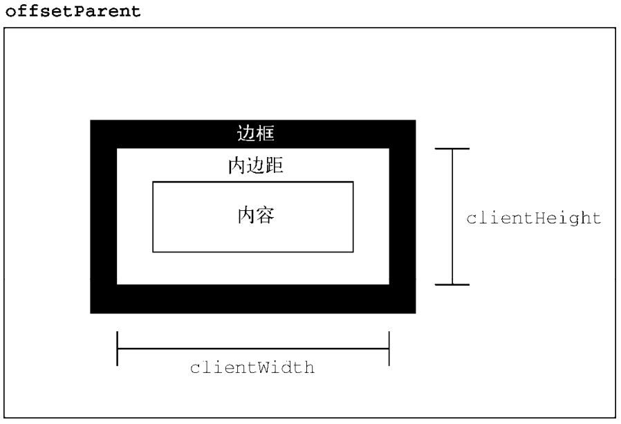
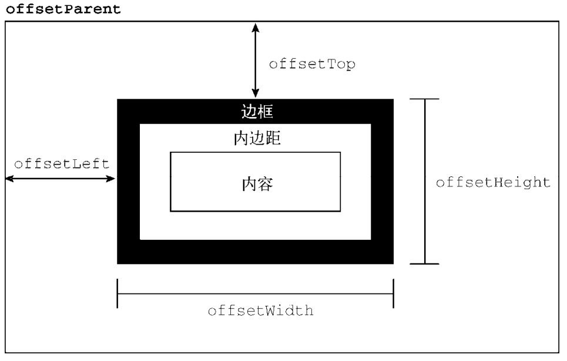
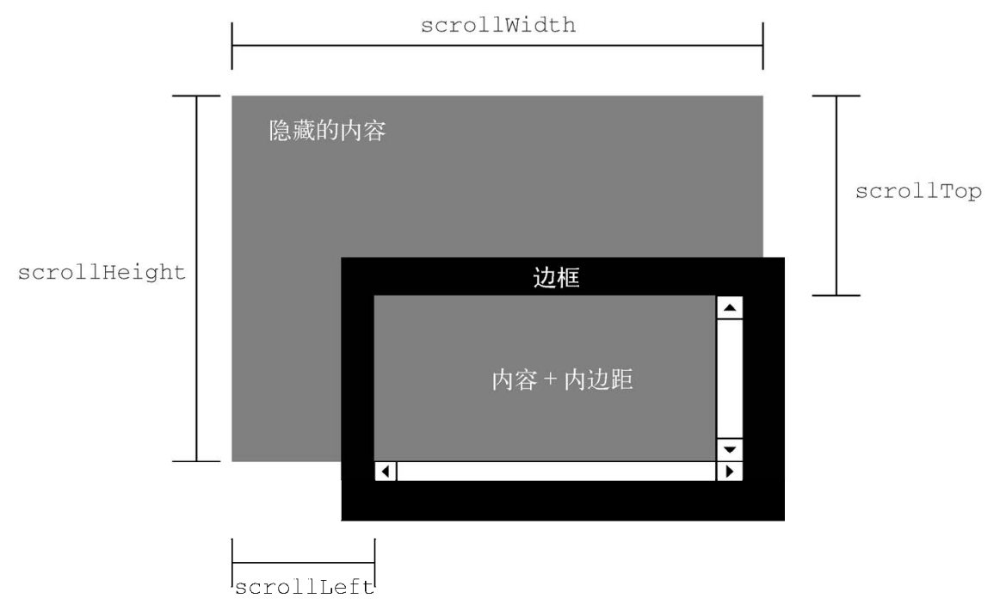

# JavaScript Advanced Notes

## BOM

### Window

```ts
const selfWindow = window.self;
const topWindow = window.top;
const parentWindow = window.parent;
const grandParentWindow = window.parent.parent;
```

```ts
// eslint-disable-next-line no-restricted-globals
if (confirm('Are you sure?')) {
  alert("I'm so glad you're sure!");
} else {
  alert("I'm sorry to hear you're not sure.");
}

const result = prompt('What is your name? ', 'James');
if (result !== null) {
  alert(`Welcome, ${result}`);
}

// 显示打印对话框
window.print();

// 显示查找对话框
window.find();

// 显式打印机
window.print();
```

弹窗有非常多的安全限制:

- 禁止隐藏状态栏与地址栏.
- 弹窗默认不能移动或缩放.
- 只允许用户操作下 (鼠标/键盘) 创建弹窗.
- 屏蔽弹窗.

```ts
const newWin = window.open(
  'https://www.new.com/',
  'newWindow',
  'height=400,width=400,top=10,left=10,resizable=yes'
);
newWin.resizeTo(500, 500);
newWin.moveTo(100, 100);
alert(newWin.opener === window); // true
newWin.close();
alert(newWin.closed); // true

let blocked = false;
try {
  const newWin = window.open('https://www.new.com/', '_blank');
  if (newWin === null) {
    blocked = true;
  }
} catch (ex) {
  blocked = true;
}
if (blocked) {
  alert('The popup was blocked!');
}
```

### Location

| 属性     | 描述                                       |
| :------- | :----------------------------------------- |
| hash     | 设置或返回从井号 (#) 开始的 URL (锚)       |
| host     | 设置或返回主机名和当前 URL 的端口号        |
| hostname | 设置或返回当前 URL 的主机名                |
| href     | 设置或返回完整的 URL                       |
| pathname | 设置或返回当前 URL 的路径部分              |
| port     | 设置或返回当前 URL 的端口号                |
| protocol | 设置或返回当前 URL 的协议                  |
| search   | 设置或返回从问号 (?) 开始的 URL (查询部分) |
| username | 设置或返回域名前指定的用户名               |
| password | 设置或返回域名前指定的密码                 |
| origin   | 返回 URL 的源地址                          |

```ts
function getQueryStringArgs(location) {
  // 取得没有开头问号的查询字符串
  const qs = location.search.length > 0 ? location.search.substring(1) : '';
  // 保存数据的对象
  const args = {};

  // 把每个参数添加到 args 对象
  for (const item of qs.split('&').map(kv => kv.split('='))) {
    const name = decodeURIComponent(item[0]);
    const value = decodeURIComponent(item[1]);

    if (name.length) {
      args[name] = value;
    }
  }

  return args;
}
```

```ts
window.location.assign('https://www.new.com');
window.location = 'https://www.new.com';
window.location.href = 'https://www.new.com';
window.location.replace('https://www.new.com'); // No new history
window.location.reload(); // 重新加载, 可能是从缓存加载
window.location.reload(true); // 重新加载, 从服务器加载
```

```ts
window.addEventListener(
  'hashchange',
  event => {
    // event.oldURL
    // event.nweURL
    if (window.location.hash === '#someCoolFeature') {
      someCoolFeature();
    }
  },
  false
);
```

### Navigator

`navigator` 对象包含以下接口定义的属性和方法:

- NavigatorID.
- NavigatorLanguage.
- NavigatorOnLine.
- NavigatorContentUtils.
- NavigatorStorage.
- NavigatorStorageUtils.
- NavigatorConcurrentHardware.
- NavigatorPlugins.
- NavigatorUserMedia.

| Property/Method           |                                                   |
| ------------------------- | ------------------------------------------------- |
| battery                   | BatteryManager (Battery Status API)               |
| clipboard                 | Clipboard API                                     |
| connection                | NetworkInformation (Network Information API)      |
| cookieEnabled             | Boolean, 是否启用了 cookie                        |
| credentials               | CredentialsContainer (Credentials Management API) |
| deviceMemory              | 单位为 GB 的设备内存容量                          |
| doNotTrack                | 用户的`不跟踪` (`do-not-track`) 设置              |
| geolocation               | Geolocation (Geolocation API)                     |
| hardwareConcurrency       | 设备的处理器核心数量                              |
| language                  | 浏览器的主语言                                    |
| languages                 | 浏览器偏好的语言数组                              |
| locks                     | LockManager (Web Locks API)                       |
| mediaCapabilities         | MediaCapabilities (Media Capabilities API)        |
| mediaDevices              | 可用的媒体设备                                    |
| maxTouchPoints            | 设备触摸屏支持的最大触点数                        |
| onLine                    | Boolean, 表示浏览器是否联网                       |
| pdfViewerEnabled          | Boolean, 是否启用了 PDF 功能                      |
| permissions               | Permissions (Permissions API)                     |
| serviceWorker             | ServiceWorkerContainer                            |
| storage                   | StorageManager (Storage API)                      |
| userAgent                 | 浏览器的用户代理字符串 (**默认只读**)             |
| vendor                    | 浏览器的厂商名称                                  |
| webdriver                 | 浏览器当前是否被自动化程序控制                    |
| xr                        | XRSystem (WebXR Device API)                       |
| registerProtocolHandler() | 将一个网站注册为特定协议的处理程序                |
| sendBeacon()              | 异步传输一些小数据                                |
| share()                   | 当前平台的原生共享机制                            |
| vibrate()                 | 触发设备振动                                      |

#### Web Online API

```ts
const connectionStateChange = () => console.log(navigator.onLine);
window.addEventListener('online', connectionStateChange);
window.addEventListener('offline', connectionStateChange);
// 设备联网时:
// true
// 设备断网时:
// false
```

#### Web Connection API

```ts
const downlink = navigator.connection.downlink;
const downlinkMax = navigator.connection.downlinkMax;
const rtt = navigator.connection.rtt;
const type = navigator.connection.type; // wifi/bluetooth/cellular/ethernet/mixed/unknown/none.
const networkType = navigator.connection.effectiveType; // 2G - 5G.
const saveData = navigator.connection.saveData; // Boolean: Reduced data mode.

navigator.connection.addEventListener('change', changeHandler);
```

#### Web Protocol Handler API

```ts
navigator.registerProtocolHandler(
  'mailto',
  'http://www.somemailclient.com?cmd=%s',
  'Some Mail Client'
);
```

#### Web Battery Status API

```ts
navigator.getBattery().then(battery => {
  // 添加充电状态变化时的处理程序
  const chargingChangeHandler = () => console.log(battery.charging);
  battery.addEventListener('chargingchange', chargingChangeHandler);
  // 添加充电时间变化时的处理程序
  const chargingTimeChangeHandler = () => console.log(battery.chargingTime);
  battery.addEventListener('chargingtimechange', chargingTimeChangeHandler);
  // 添加放电时间变化时的处理程序
  const dischargingTimeChangeHandler = () =>
    console.log(battery.dischargingTime);
  battery.addEventListener(
    'dischargingtimechange',
    dischargingTimeChangeHandler
  );
  // 添加电量百分比变化时的处理程序
  const levelChangeHandler = () => console.log(battery.level * 100);
  battery.addEventListener('levelchange', levelChangeHandler);
});
```

#### Web Geolocation API

```ts
if (window.navigator.geolocation) {
  // getCurrentPosition第三个参数为可选参数
  navigator.geolocation.getCurrentPosition(locationSuccess, locationError, {
    // 指示浏览器获取高精度的位置, 默认为false
    enableHighAccuracy: true,
    // 指定获取地理位置的超时时间, 默认不限时, 单位为毫秒
    timeout: 5000,
    // 最长有效期, 在重复获取地理位置时, 此参数指定多久再次获取位置.
    maximumAge: 3000,
  });
} else {
  alert('Your browser does not support Geolocation!');
}
```

locationError 为获取位置信息失败的回调函数, 可以根据错误类型提示信息:

```ts
function locationError(error) {
  switch (error.code) {
    case error.TIMEOUT:
      showError('A timeout occurred! Please try again!');
      break;
    case error.POSITION_UNAVAILABLE:
      showError("We can't detect your location. Sorry!");
      break;
    case error.PERMISSION_DENIED:
      showError('Please allow geolocation access for this to work.');
      break;
    case error.UNKNOWN_ERROR:
      showError('An unknown error occurred!');
      break;
    default:
      throw new Error('Unsupported error!');
  }
}
```

locationSuccess 为获取位置信息成功的回调函数,
返回的数据中包含经纬度等信息:

- `position.timestamp`.
- `position.coords`:
  - `latitude`: 维度.
  - `longitude`: 经度.
  - `accuracy`.
  - `altitude`: 海拔高度.
  - `altitudeAccuracy`.

结合 Google Map API 即可在地图中显示当前用户的位置信息:

```ts
function locationSuccess(position) {
  const coords = position.coords;
  const latlng = new google.maps.LatLng(
    // 维度
    coords.latitude,
    // 精度
    coords.longitude
  );
  const myOptions = {
    // 地图放大倍数
    zoom: 12,
    // 地图中心设为指定坐标点
    center: latlng,
    // 地图类型
    mapTypeId: google.maps.MapTypeId.ROADMAP,
  };

  // 创建地图并输出到页面
  const myMap = new google.maps.Map(document.getElementById('map'), myOptions);

  // 创建标记
  const marker = new google.maps.Marker({
    // 标注指定的经纬度坐标点
    position: latlng,
    // 指定用于标注的地图
    map: myMap,
  });

  // 创建标注窗口
  const infoWindow = new google.maps.InfoWindow({
    content: `您在这里<br/>纬度: ${coords.latitude}<br/>经度: ${coords.longitude}`,
  });

  // 打开标注窗口
  infoWindow.open(myMap, marker);
}
```

```ts
navigator.geolocation.watchPosition(
  locationSuccess,
  locationError,
  positionOption
);
```

#### Navigator User Agent

`navigator.userAgent` 特别复杂:

- 历史兼容问题: Netscape -> IE -> Firefox -> Safari -> Chrome -> Edge.
- 每一个新的浏览器厂商必须保证旧网站的检测脚本能正常识别自家浏览器,
  从而正常打开网页, 导致 `navigator.userAgent` 不断变长.
- [UserAgent Data Parser](https://github.com/faisalman/ua-parser-js)

```ts
console.log(navigator.userAgent);
// 'Mozilla/5.0 (X11; Linux x86_64) AppleWebKit/537.36 (KHTML, like Gecko)
// Chrome/101.0.4922.0 Safari/537.36 Edg/101.0.1198.0'
```

### Screen

浏览器窗口外面的客户端显示器的信息:

| Property    |                                          |
| ----------- | ---------------------------------------- |
| availHeight | 屏幕像素高度减去系统组件高度 (只读)      |
| availWidth  | 屏幕像素宽度减去系统组件宽度 (只读)      |
| colorDepth  | 表示屏幕颜色的位数: 多数系统是 32 (只读) |
| height      | 屏幕像素高度                             |
| width       | 屏幕像素宽度                             |
| pixelDepth  | 屏幕的位深 (只读)                        |
| orientation | Screen Orientation API 中屏幕的朝向      |

```ts
const screen = window.screen;

console.log(screen.colorDepth); // 24
console.log(screen.pixelDepth); // 24

// 垂直看
console.log(screen.orientation.type); // portrait-primary
console.log(screen.orientation.angle); // 0
// 向左转
console.log(screen.orientation.type); // landscape-primary
console.log(screen.orientation.angle); // 90
// 向右转
console.log(screen.orientation.type); // landscape-secondary
console.log(screen.orientation.angle); // 270
```

### History

#### History Navigation

```ts
const history = window.history;

// 后退一页
history.go(-1);
// 前进一页
history.go(1);
// 前进两页
history.go(2);
// 导航到最近的 new.com 页面
history.go('new.com');
// 导航到最近的 example.net 页面
history.go('example.net');
// 后退一页
history.back();
// 前进一页
history.forward();

if (history.length === 1) {
  console.log('这是用户窗口中的第一个页面');
}
```

#### History State Management

```ts
const history = window.history;

const stateObject = { foo: 'bar' };
history.pushState(stateObject, 'My title', 'baz.html');

history.replaceState({ newFoo: 'newBar' }, 'New title'); // No new history state.

window.addEventListener('popstate', event => {
  const state = event.state;

  if (state) {
    // 第一个页面加载时状态是 null
    processState(state);
  }
});
```

### Browser Compatibility

#### User Agent Detection

```ts
class BrowserDetector {
  constructor() {
    // 测试条件编译
    // IE6~10 支持
    // eslint-disable-next-line spaced-comment
    this.isIE_Gte6Lte10 = /*@cc_on!@*/ false;
    // 测试 documentMode
    // IE7~11 支持
    this.isIE_Gte7Lte11 = !!document.documentMode;
    // 测试 StyleMedia 构造函数
    // Edge 20 及以上版本支持
    this.isEdge_Gte20 = !!window.StyleMedia;
    // 测试 Firefox 专有扩展安装 API
    // 所有版本的 Firefox 都支持
    this.isFirefox_Gte1 = typeof InstallTrigger !== 'undefined';
    // 测试 chrome 对象及其 webstore 属性
    // Opera 的某些版本有 window.chrome, 但没有 window.chrome.webstore
    // 所有版本的 Chrome 都支持
    this.isChrome_Gte1 = !!window.chrome && !!window.chrome.webstore;
    // Safari 早期版本会给构造函数的标签符追加 "Constructor"字样, 如:
    // window.Element.toString(); // [object ElementConstructor]
    // Safari 3~9.1 支持
    this.isSafari_Gte3Lte9_1 = /constructor/i.test(window.Element);
    // 推送通知 API 暴露在 window 对象上
    // 使用 IIFE 默认参数值以避免对 undefined 调用 toString()
    // Safari 7.1 及以上版本支持
    this.isSafari_Gte7_1 = (({ pushNotification = {} } = {}) =>
      pushNotification.toString() === '[object SafariRemoteNotification]')(
      window.safari
    );
    // 测试 addons 属性
    // Opera 20 及以上版本支持
    this.isOpera_Gte20 = !!window.opr && !!window.opr.addons;
  }

  isIE() {
    return this.isIE_Gte6Lte10 || this.isIE_Gte7Lte11;
  }

  isEdge() {
    return this.isEdge_Gte20 && !this.isIE();
  }

  isFirefox() {
    return this.isFirefox_Gte1;
  }

  isChrome() {
    return this.isChrome_Gte1;
  }

  isSafari() {
    return this.isSafari_Gte3Lte9_1 || this.isSafari_Gte7_1;
  }

  isOpera() {
    return this.isOpera_Gte20;
  }
}
```

#### Browser Feature Detection

**不使用特性/浏览器推断**, 往往容易推断错误 (且会随着浏览器更新产生新的错误).

```ts
// 检测浏览器是否支持 Netscape 式的插件
const hasNSPlugins = !!(navigator.plugins && navigator.plugins.length);
// 检测浏览器是否具有 DOM Level 1 能力
const hasDOM1 = !!(
  document.getElementById &&
  document.createElement &&
  document.getElementsByTagName
);

// 特性检测
if (document.getElementById) {
  element = document.getElementById(id);
}
```

## DOM

- DOM Level 0.
- DOM Level 1:
  - DOM Core.
  - DOM XML.
  - DOM HTML.
- DOM Level 2:
  - DOM2 Core.
  - DOM2 XML.
  - DOM2 HTML.
  - DOM2 Views.
  - DOM2 StyleSheets.
  - DOM2 CSS.
  - DOM2 CSS 2.
  - DOM2 Events.
  - DOM2 UIEvents.
  - DOM2 MouseEvents.
  - DOM2 MutationEvents (Deprecated).
  - DOM2 HTMLEvents.
  - DOM2 Range.
  - DOM2 Traversal.
- DOM Level 3:
  - DOM3 Core.
  - DOM3 XML.
  - DOM3 Events.
  - DOM3 UIEvents.
  - DOM3 MouseEvents.
  - DOM3 MutationEvents (Deprecated).
  - DOM3 MutationNameEvents.
  - DOM3 TextEvents.
  - DOM3 Load and Save.
  - DOM3 Load and Save Async.
  - DOM3 Validation.
  - DOM3 XPath.

```ts
const hasXmlDom = document.implementation.hasFeature('XML', '1.0');
const hasHtmlDom = document.implementation.hasFeature('HTML', '1.0');
```

### DOM Core

```ts
document.createElement('nodeName');
document.createTextNode('String');

document.getElementById(id);
// eslint-disable-next-line no-restricted-globals
document.getElementsByName(name);
document.getElementsByTagName(tagName);
document.getElementsByClassName(className); // HTML5
document.querySelector(cssSelector); // Selectors API
document.querySelectorAll(cssSelector); // Selectors API

element.getAttribute(attrName);
element.setAttribute(attrName, attrValue);
element.removeAttribute(attrName);

element.compareDocumentPosition(element);
element.contains(element);
element.isSameNode(element); // Same node reference
element.isEqualNode(element); // Same nodeName/nodeValue/attributes/childNodes
element.matches(cssSelector);
element.closest(cssSelector); // Returns closest ancestor matching selector
element.cloneNode();
element.normalize();
element.before(...elements);
element.after(...elements);
element.replaceWith(...elements);
element.remove();

parentElement.hasChildNodes();
parentElement.appendChild(childElement);
parentElement.append(childElements);
parentElement.insertBefore(newChild, targetChild);
parentElement.replaceChild(newChild, targetChild);
parentElement.replaceChildren(children);
parentElement.removeChild(child);
```

```ts
const showAlert = (type, message, duration = 3) => {
  const div = document.createElement('div');
  div.className = type;
  div.appendChild(document.createTextNode(message));
  container.insertBefore(div, form);
  setTimeout(() => div.remove(), duration * 1000);
};
```

#### DOM Node Type

Node 除包括元素结点 (tag) 外,
包括许多其它结点 (甚至空格符视作一个结点),
需借助 `nodeType` 找出目标结点.

| Node Type | Node Representation      | Node Name            | Node Value    |
| :-------- | :----------------------- | :------------------- | :------------ |
| 1         | `ELEMENT_NODE`           | Tag Name             | null          |
| 2         | `ATTRIBUTE_NODE`         | Attr Name            | Attr Value    |
| 3         | `TEXT_NODE`              | `#text`              | Text          |
| 4         | `CDATA_SECTION_NODE`     | `#cdata-section`     | CDATA Section |
| 5         | `ENTITY_REFERENCE_NODE`  |                      |               |
| 6         | `ENTITY_NODE`            |                      |               |
| 8         | `COMMENT_NODE`           | `#comment`           | Comment       |
| 9         | `DOCUMENT_NODE`          | `#document`          | null          |
| 10        | `DOCUMENT_TYPE_NODE`     | `html`/`xml`         | null          |
| 11        | `DOCUMENT_FRAGMENT_NODE` | `#document-fragment` | null          |
| 12        | `NOTATION_NODE`          |                      |               |

```ts
const type = node.nodeType;
const name = node.nodeName;
const value = node.nodeValue;

if (someNode.nodeType === Node.ELEMENT_NODE) {
  alert('Node is an element.');
}
```

#### DOM Attribute Node

```ts
const id = element.attributes.getNamedItem('id').nodeValue;
const id = element.attributes.id.nodeValue;
element.attributes.id.nodeValue = 'someOtherId';
const oldAttr = element.attributes.removeNamedItem('id');
element.attributes.setNamedItem(newAttr);
```

```ts
const attr = document.createAttribute('align');
attr.value = 'left';
element.setAttributeNode(attr);

alert(element.attributes.align.value); // "left"
alert(element.getAttributeNode('align').value); // "left"
alert(element.getAttribute('align')); // "left"
```

#### DOM Text Node

Text node methods:

- appendData(text): 向节点末尾添加文本 text.
- deleteData(offset, count): 从位置 offset 开始删除 count 个字符.
- insertData(offset, text): 在位置 offset 插入 text.
- replaceData(offset, count, text): 用 text 替换从位置 offset 到 offset + count 的文本.
- splitText(offset): 在位置 offset 将当前文本节点拆分为两个文本节点.
- substringData(offset, count): 提取从位置 offset 到 offset + count 的文本.

Normalize text nodes:

```ts
const element = document.createElement('div');
element.className = 'message';

const textNode = document.createTextNode('Hello world!');
const anotherTextNode = document.createTextNode('Yippee!');

element.appendChild(textNode);
element.appendChild(anotherTextNode);
document.body.appendChild(element);
alert(element.childNodes.length); // 2

element.normalize();
alert(element.childNodes.length); // 1
alert(element.firstChild.nodeValue); // "Hello world!Yippee!"
```

Split text nodes:

```ts
const element = document.createElement('div');
element.className = 'message';

const textNode = document.createTextNode('Hello world!');
element.appendChild(textNode);
document.body.appendChild(element);

const newNode = element.firstChild.splitText(5);
alert(element.firstChild.nodeValue); // "Hello"
alert(newNode.nodeValue); // " world!"
alert(element.childNodes.length); // 2
```

:::tip TextContent vs InnerText vs InnerHTML

- `textContent`:
  - **Security**: Doesn’t parse HTML.
  - **Performance**: Including `<script>` and `<style>` text content.
- `innerText`:
  - Doesn't parse HTML.
  - Only show **human-readable** text content
  - `innerText` care CSS styles, read `innerText` value will trigger `reflow`.
- `innerHTML`:
  - Do parse HTML.

```ts
const textContent = element.textContent;
const innerText = element.innerText;
const innerHTML = element.innerHTML;
```

:::

#### DOM Document Node

`document` node (`#document`):

```ts
alert(document.nodeType); // 9
alert(document.nodeName); // "#document"
alert(document.nodeValue); // null
```

```ts
const html = document.documentElement;
const doctype = document.doctype;
const head = document.head; // HTML5 head.
const body = document.body;

const title = document.title; // 可修改.
const domain = document.domain; // 可设置同源域名.
const url = document.URL;
const referer = document.referer;
const charSet = document.characterSet; // HTML5 characterSet.

const anchors = documents.anchors;
const images = documents.images;
const links = documents.links;
const forms = documents.forms;
const formElements = documents.forms[0].elements; // 第一个表单内的所有字段

// HTML5 compatMode:
if (document.compatMode === 'CSS1Compat') {
  console.log('Standards mode');
} else if (document.compatMode === 'BackCompat') {
  console.log('Quirks mode');
}
```

```ts
document.getElementById(id);
// eslint-disable-next-line no-restricted-globals
document.getElementsByName(name);
document.getElementsByTagName(tagName);
document.getElementsByClassName(className); // HTML5
document.querySelector(cssSelector); // Selectors API
document.querySelectorAll(cssSelector); // Selectors API
document.write();
document.writeln();
```

#### DOM Document Type Node

```html
<!DOCTYPE html PUBLIC "-// W3C// DTD HTML 4.01// EN" "http:// www.w3.org/TR/html4/strict.dtd">
```

```ts
console.log(document.doctype.name); // "html"
console.log(document.nodeType); // 10
console.log(document.doctype.nodeName); // "html"
console.log(document.doctype.nodeValue); // null
console.log(document.doctype.publicId); // "-// W3C// DTD HTML 4.01// EN"
console.log(document.doctype.systemId); // "http://www.w3.org/TR/html4/strict.dtd"

const doctype = document.implementation.createDocumentType(
  'html',
  '-// W3C// DTD HTML 4.01// EN',
  'http://www.w3.org/TR/html4/strict.dtd'
);
const doc = document.implementation.createDocument(
  'http://www.w3.org/1999/xhtml',
  'html',
  doctype
);
```

#### DOM Document Fragment Node

减少 DOM 操作次数, 减少页面渲染次数:

```ts
const frag = document.createDocumentFragment();

let p;
let t;

p = document.createElement('p');
t = document.createTextNode('first paragraph');
p.appendChild(t);
frag.appendChild(p);

p = document.createElement('p');
t = document.createTextNode('second paragraph');
p.appendChild(t);
frag.appendChild(p);

// 只渲染一次HTML页面
document.body.appendChild(frag);
```

```ts
const oldNode = document.getElementById('result');
const clone = oldNode.cloneNode(true);
// work with the clone

// when you're done:
oldNode.parentNode.replaceChild(clone, oldNode);
```

### DOM Programming

#### Append DOM Node

| Method             | Node | HTML | Text | IE  | Event Listeners | Secure  |
| ------------------ | ---- | ---- | ---- | --- | --------------- | ------- |
| append             | Yes  | No   | Yes  | No  | Preserves       | Yes     |
| appendChild        | Yes  | No   | No   | Yes | Preserves       | Yes     |
| innerHTML          | No   | Yes  | Yes  | Yes | Loses           | Careful |
| insertAdjacentHTML | No   | Yes  | Yes  | Yes | Preserves       | Careful |

```ts
const testDiv = document.getElementById('testDiv');

const para = document.createElement('p');
testDiv.appendChild(para);

const txt = document.createTextNode('Hello World');
para.appendChild(txt);
```

`innerHTML`: non-concrete, including all types of childNodes:

```ts
div.innerHTML = '<p>Test<em>test</em>Test.</p>';
// <div>
//   <p>Test<em>test</em>Test.</p>
// </div>
```

`innerHTML` performance:

```ts
// BAD
for (const value of values) {
  ul.innerHTML += `<li>${value}</li>`; // 别这样做！
}

// GOOD
let itemsHtml = '';
for (const value of values) {
  itemsHtml += `<li>${value}</li>`;
}
ul.innerHTML = itemsHtml;

// BEST
ul.innerHTML = values.map(value => `<li>${value}</li>`).join('');
```

#### Insert DOM Node

```ts
function insertAfter(newElement, targetElement) {
  const parent = targetElement.parentNode;
  if (parent.lastChild === targetElement) {
    parent.appendChild(newElement);
  } else {
    parent.insertBefore(newElement, targetElement.nextSibling);
  }
}
```

`insertAdjacentHTML`/`insertAdjacentText`:

- beforebegin: 插入前一个兄弟节点.
- afterbegin: 插入第一个子节点.
- beforeend: 插入最后一个子节点.
- afterend: 插入下一个兄弟节点.

```ts
// 4 positions:
//
// <!-- beforebegin -->
// <p>
// <!-- afterbegin -->
// foo
// <!-- beforeend -->
// </p>
// <!-- afterend -->
const p = document.querySelector('p');

p.insertAdjacentHTML('beforebegin', '<a></a>');
p.insertAdjacentText('afterbegin', 'foo');

// simply be moved element, not copied element
p.insertAdjacentElement('beforebegin', link);
```

#### Replace DOM Node

```ts
node.replaceChild(document.createTextNode(text), node.firstChild);
node.replaceChildren(...nodeList);
```

#### Remove DOM Node

```ts
// 删除第一个子节点
const formerFirstChild = someNode.removeChild(someNode.firstChild);
// 删除最后一个子节点
const formerLastChild = someNode.removeChild(someNode.lastChild);
```

#### Traverse DOM Node

```ts
const parent = node.parentNode;
const children = node.childNodes;
const first = node.firstChild;
const last = node.lastChild;
const previous = node.previousSibling;
const next = node.nextSibling;
```

[Element Traversal API](https://www.w3.org/TR/ElementTraversal):
navigation properties listed above refer to all nodes.
For instance,
in `childNodes` can see both text nodes, element nodes, and even comment nodes.

```ts
const count = node.childElementCount;
const parent = node.parentElement;
const children = node.children;
const first = node.firstElementChild;
const last = node.lastElementChild;
const previous = node.previousElementSibling;
const next = node.nextElementSibling;
```

[Node Iterator](https://developer.mozilla.org/en-US/docs/Web/API/NodeIterator):

```ts
const div = document.getElementById('div1');
const filter = function (node) {
  return node.tagName.toLowerCase() === 'li'
    ? NodeFilter.FILTER_ACCEPT
    : NodeFilter.FILTER_SKIP;
};
const iterator = document.createNodeIterator(
  div,
  NodeFilter.SHOW_ELEMENT,
  filter,
  false
);

for (
  let node = iterator.nextNode();
  node !== null;
  node = iterator.nextNode()
) {
  console.log(node.tagName); // 输出标签名
}
```

[Tree Walker](https://developer.mozilla.org/en-US/docs/Web/API/TreeWalker):

```ts
const div = document.getElementById('div1');
const walker = document.createTreeWalker(
  div,
  NodeFilter.SHOW_ELEMENT,
  null,
  false
);

walker.firstChild(); // 前往<p>
walker.nextSibling(); // 前往<ul>

for (
  let node = walker.firstChild();
  node !== null;
  node = walker.nextSibling()
) {
  console.log(node.tagName); // 遍历 <li>
}
```

:::tip NodeIterator vs TreeWalker

- `NodeFilter.acceptNode()` `FILTER_REJECT`:
  - For `NodeIterator`, this flag is synonymous with `FILTER_SKIP`.
  - For `TreeWalker`, child nodes are also rejected.
- `TreeWalker` has more methods:
  - `firstChild`.
  - `lastChild`.
  - `previousSibling`.
  - `nextSibling`.

:::

#### Attributes DOM Node

```ts
alert(div.getAttribute('id')); // "myDiv"
alert(div.getAttribute('class')); // "bd"
div.setAttribute('id', 'someOtherId');
div.setAttribute('class', 'ft');
div.removeAttribute('id');
div.removeAttribute('class');
```

#### Select DOM Node

[Range API](https://developer.mozilla.org/en-US/docs/Web/API/Range):

- `startContainer`: 范围起点所在的节点 (选区中第一个子节点的父节点).
- `startOffset`: 范围起点在 startContainer 中的偏移量.
- `endContainer`: 范围终点所在的节点 (选区中最后一个子节点的父节点).
- `endOffset`: 范围起点在 startContainer 中的偏移量.
- `commonAncestorContainer`:
  文档中以 `startContainer` 和 `endContainer` 为后代的最深的节点.
- `setStartBefore(refNode)`:
  把范围的起点设置到 refNode 之前,
  从而让 refNode 成为选区的第一个子节点.
- `setStartAfter(refNode)`:
  把范围的起点设置到 refNode 之后,
  从而将 refNode 排除在选区之外,
  让其下一个同胞节点成为选区的第一个子节点.
- `setEndBefore(refNode)`:
  把范围的终点设置到 refNode 之前,
  从而将 refNode 排除在选区之外,
  让其上一个同胞节点成为选区的最后一个子节点.
- `setEndAfter(refNode)`:
  把范围的终点设置到 refNode 之后,
  从而让 refNode 成为选区的最后一个子节点.
- `setStart(refNode, offset)`.
- `setEnd(refNode, offset)`.
- `deleteContents()`: remove.
- `extractContents()`: remove and return.
- `cloneContents()`: clone.
- `insertNode(node)`: 在范围选区的开始位置插入一个节点.
- `surroundContents(node)`: 插入包含范围的内容.
- `collapse(boolean)`: 范围折叠.
- `compareBoundaryPoints(Range.HOW, sourceRange)`: 确定范围之间是否存在公共的边界 (起点或终点).

```html
<!DOCTYPE html>
<html>
  <body>
    <p id="p1"><b>Hello</b> world!</p>
  </body>
</html>
```

```ts
const p1 = document.getElementById('p1');
const helloNode = p1.firstChild.firstChild;
const worldNode = p1.lastChild;
const range = document.createRange();

range.setStart(helloNode, 2);
range.setEnd(worldNode, 3);
const fragment1 = range.cloneContents(); // clone
const fragment2 = range.extractContents(); // remove and return

p1.parentNode.appendChild(fragment1);
p1.parentNode.appendChild(fragment2);
```

```ts
const p1 = document.getElementById('p1');
const helloNode = p1.firstChild.firstChild;
const worldNode = p1.lastChild;
const range = document.createRange();

const span = document.createElement('span');
span.style.color = 'red';
span.appendChild(document.createTextNode('Inserted text'));

range.setStart(helloNode, 2);
range.setEnd(worldNode, 3);
range.insertNode(span);
// <p id="p1"><b>He<span style="color: red">Inserted text</span>llo</b> world</p>
```

```ts
const p1 = document.getElementById('p1');
const helloNode = p1.firstChild.firstChild;
const worldNode = p1.lastChild;
const range = document.createRange();

const span = document.createElement('span');
span.style.backgroundColor = 'yellow';

range.selectNode(helloNode);
range.surroundContents(span);
// <p><b><span style="background-color:yellow">Hello</span></b> world!</p>
```

#### Dynamic Scripts Loading

```ts
function loadScript(url) {
  const script = document.createElement('script');
  script.src = url;
  document.body.appendChild(script);
}
```

```ts
function loadScriptString(code) {
  const script = document.createElement('script');
  script.type = 'text/javascript';

  try {
    script.appendChild(document.createTextNode(code));
  } catch (ex) {
    script.text = code;
  }

  document.body.appendChild(script);
}
```

:::caution InnerHTML Script
所有现代浏览器中, 通过 `innerHTML` 属性创建的 `<script>` 元素永远不会执行.
:::

#### Dynamic Styles Loading

```ts
function loadStyles(url) {
  const link = document.createElement('link');
  link.rel = 'stylesheet';
  link.type = 'text/css';
  link.href = url;

  const head = document.getElementsByTagName('head')[0];
  head.appendChild(link);
}
```

```ts
function loadStyleString(css) {
  const style = document.createElement('style');
  style.type = 'text/css';

  try {
    style.appendChild(document.createTextNode(css));
  } catch (ex) {
    style.styleSheet.cssText = css;
  }

  const head = document.getElementsByTagName('head')[0];
  head.appendChild(style);
}
```

:::danger StyleSheet CSSText

- 若重用同一个 `<style>` 元素并设置该属性超过一次, 则可能导致浏览器崩溃.
- 将 `cssText` 设置为空字符串也可能导致浏览器崩溃.

:::

#### Table Manipulation

`<table>` 元素添加了以下属性和方法:

- `caption`: 指向 `<caption>` 元素的指针 (如果存在).
- `tBodies`: 包含 `<tbody>` 元素的 HTMLCollection.
- `tFoot`: 指向 `<tfoot>` 元素 (如果存在).
- `tHead`: 指向 `<thead>` 元素 (如果存在).
- `rows`: 包含表示所有行的 HTMLCollection.
- `createTHead()`: 创建 `<thead>` 元素, 放到表格中, 返回引用.
- `createTFoot()`: 创建 `<tfoot>` 元素, 放到表格中, 返回引用.
- `createCaption()`: 创建 `<caption>` 元素, 放到表格中, 返回引用.
- `deleteTHead()`: 删除 `<thead>` 元素.
- `deleteTFoot()`: 删除 `<tfoot>` 元素.
- `deleteCaption()`: 删除 `<caption>` 元素.
- `deleteRow(pos)`: 删除给定位置的行.
- `insertRow(pos)`: 在行集合中给定位置插入一行.

`<tbody>` 元素添加了以下属性和方法:

- `rows`: 包含 `<tbody>` 元素中所有行的 HTMLCollection.
- `deleteRow(pos)`: 删除给定位置的行.
- `insertRow(pos)`: 在行集合中给定位置插入一行, 返回该行的引用.

`<tr>` 元素添加了以下属性和方法:

- `cells`: 包含 `<tr>` 元素所有表元的 HTMLCollection.
- `deleteCell(pos)`: 删除给定位置的表元.
- `insertCell(pos)`: 在表元集合给定位置插入一个表元, 返回该表元的引用.

```ts
// 创建表格
const table = document.createElement('table');
table.border = 1;
table.width = '100%';

// 创建表体
const tbody = document.createElement('tbody');
table.appendChild(tbody);

// 创建第一行
tbody.insertRow(0);
tbody.rows[0].insertCell(0);
tbody.rows[0].cells[0].appendChild(document.createTextNode('Cell 1, 1'));
tbody.rows[0].insertCell(1);
tbody.rows[0].cells[1].appendChild(document.createTextNode('Cell 2, 1'));

// 创建第二行
tbody.insertRow(1);
tbody.rows[1].insertCell(0);
tbody.rows[1].cells[0].appendChild(document.createTextNode('Cell 1, 2'));
tbody.rows[1].insertCell(1);
tbody.rows[1].cells[1].appendChild(document.createTextNode('Cell 2, 2'));

// 把表格添加到文档主体
document.body.appendChild(table);
```

### CSSOM

The CSS Object Model is a set of APIs allowing the manipulation of CSS from JavaScript.
It is much like the DOM, but for the CSS rather than the HTML.
It allows users to read and modify CSS style dynamically.

#### Inline Styles

```ts
interface Element {
  style: CSSStyleDeclaration;
}

const style = element.style.XX;
const font = element.style.fontFamily;
const mt = element.style.marginTopWidth;
```

#### Styles Getter and Setter

- `cssText`: 一次生效.
- `length`.
- `getPropertyValue(name)`.
- `getPropertyPriority`: return `''` or `important`
- `item(index)`.
- `setProperty(name, value, priority)`.
- `removeProperty(name)`.

```ts
const box = document.querySelector('.box');

box.style.setProperty('color', 'orange');
box.style.setProperty('font-family', 'Georgia, serif');
op.innerHTML = box.style.getPropertyValue('color');
op2.innerHTML = `${box.style.item(0)}, ${box.style.item(1)}`;

box.style.setProperty('font-size', '1.5em');
box.style.item(0); // "font-size"

document.body.style.removeProperty('font-size');
document.body.style.item(0); // ""

myDiv.style.cssText = 'width: 25px; height: 100px; background-color: green';

for (let i = 0, len = myDiv.style.length; i < len; i++) {
  console.log(myDiv.style[i]); // 或者用 myDiv.style.item(i)
}
```

#### Computed Styles

- Shorthand style for full property.
- Longhand style for specific property.
- `getPropertyValue` can get css variables.
- 在所有浏览器中计算样式都是**只读**的, 不能修改 `getComputedStyle()` 方法返回的对象.

```ts
const background = window.getComputedStyle(document.body).background;

// dot notation, same as above
const backgroundColor = window.getComputedStyle(el).backgroundColor;

// square bracket notation
const backgroundColor = window.getComputedStyle(el)['background-color'];

// using getPropertyValue()
// can get css variables property too
window.getComputedStyle(el).getPropertyValue('background-color');
```

#### CSS Class List

```ts
element.classList.add('class');
element.classList.remove('class');
element.classList.toggle('class');
element.classList.contains('class');
```

```ts
function addClassPolyfill(element, value) {
  if (!element.className) {
    element.className = value;
  } else {
    newClassName = element.className;
    newClassName += ' ';
    newClassName += value;
    element.className = newClassName;
  }
}
```

#### DOM StyleSheets API

以下是 CSSStyleSheet 从 StyleSheet 继承的属性:

- disabled: Boolean, 表示样式表是否被禁用了 (设置为 true 会禁用样式表).
- href: `<link>` URL/null.
- media: 样式表支持的媒体类型集合.
- ownerNode: 指向拥有当前样式表的节点 `<link>`/`<style>`/null (`@import`).
- title: ownerNode 的 title 属性.
- parentStyleSheet: `@import` parent.
- type: 样式表的类型 (`'text/css'`).
- cssRules: 当前样式表包含的样式规则的集合.
- ownerRule: 如果样式表是使用 `@import` 导入的, 则指向导入规则.
- `deleteRule(index)`: 在指定位置删除 cssRules 中的规则.
- `insertRule(rule, index)`: 在指定位置向 cssRules 中插入规则.

##### CSS Rules Definition

`CSSRule`:

- type of `CSSRule`:
  STYLE_RULE (1), IMPORT_RULE (3), MEDIA_RULE (4), KEYFRAMES_RULE (7).
- cssText: 返回整条规则的文本.
- selectorText: 返回规则的选择符文本.
- style: 返回 CSSStyleDeclaration 对象, 可以设置和获取当前规则中的样式.
- parentRule: 如果这条规则被其他规则 (如 `@media`) 包含, 则指向包含规则.
- parentStyleSheet: 包含当前规则的样式表.

```ts
const myRules = document.styleSheets[0].cssRules;
const p = document.querySelector('p');

for (i of myRules) {
  if (i.type === 1) {
    p.innerHTML += `<code>${i.selectorText}</code><br>`;
  }

  if (i.selectorText === 'a:hover') {
    i.selectorText = 'a:hover, a:active';
  }

  const myStyle = i.style;

  // Set the bg color on the body
  myStyle.setProperty('background-color', 'peachPuff');

  // Get the font size of the body
  myStyle.getPropertyValue('font-size');

  // Get the 5th item in the body's style rule
  myStyle.item(5);

  // Log the current length of the body style rule (8)
  console.log(myStyle.length);

  // Remove the line height
  myStyle.removeProperty('line-height');

  // log the length again (7)
  console.log(myStyle.length);

  // Check priority of font-family (empty string)
  myStyle.getPropertyPriority('font-family');
}
```

##### Media Rules

- `conditionText` property of media rule.
- Nested `cssRules`.

```ts
const myRules = document.styleSheets[0].cssRules;
const p = document.querySelector('.output');

for (i of myRules) {
  if (i.type === 4) {
    p.innerHTML += `<code>${i.conditionText}</code><br>`;

    for (j of i.cssRules) {
      p.innerHTML += `<code>${j.selectorText}</code><br>`;
    }
  }
}
```

##### Keyframe Rules

- `name` property of keyframe rule
- `keyText` property of keyframe rule.
- Nested `cssRules`.

```ts
const myRules = document.styleSheets[0].cssRules;
const p = document.querySelector('.output');

for (i of myRules) {
  if (i.type === 7) {
    p.innerHTML += `<code>${i.name}</code><br>`;

    for (j of i.cssRules) {
      p.innerHTML += `<code>${j.keyText}</code><br>`;
    }
  }
}
```

##### Manipulate CSS Rules

```ts
const myStylesheet = document.styleSheets[0];
console.log(myStylesheet.cssRules.length); // 8

document.styleSheets[0].insertRule(
  'article { line-height: 1.5; font-size: 1.5em; }',
  myStylesheet.cssRules.length
);
console.log(document.styleSheets[0].cssRules.length); // 9
```

```ts
const myStylesheet = document.styleSheets[0];
console.log(myStylesheet.cssRules.length); // 8

myStylesheet.deleteRule(3);
console.log(myStylesheet.cssRules.length); // 7
```

### DOM Events

- `event.preventDefault()`.
- `event.stopPropagation()`.
- Default `bubble` mode, can change to `capture` mode.
- `element.dispatchEvent(event)` to trigger events.

#### Events Object

| Property/Method            | Type         |                                |
| -------------------------- | ------------ | ------------------------------ |
| type                       | String       | 被触发的事件类型               |
| trusted                    | Boolean      | 浏览器生成/JavaScript 创建     |
| View                       | AbstractView | 事件所发生的 window 对象       |
| currentTarget              | Element      | Event handler binding          |
| target                     | Element      | Event truly target             |
| bubbles                    | Boolean      | 事件是否冒泡                   |
| cancelable                 | Boolean      | 是否可以取消事件的默认行为     |
| eventPhase                 | Number       | 捕获阶段/到达目标/冒泡阶段     |
| defaultPrevented           | Boolean      | `preventDefault()` called      |
| preventDefault()           | Function     | 用于取消事件的默认行为         |
| stopPropagation()          | Function     | 用于取消所有后续事件捕获或冒泡 |
| stopImmediatePropagation() | Function     | 用于取消所有后续事件捕获或冒泡 |

#### Events Checking

```ts
function handleEvent(event) {
  node.matches(event.target); // return false or true
  node.contains(event.target); // return false or true
}
```

#### Global UI Events

`DOMContentLoaded` event:

- 当文档中没有脚本时, 浏览器解析完文档便能触发 DOMContentLoaded 事件.
- 如果文档中包含脚本, 则脚本会阻塞文档的解析,
  而脚本需要等 CSSOM 构建完成才能执行:
  - 在 DOM/CSSOM 构建完毕, `defer` 脚本执行完成之后, DOMContentLoaded 事件触发.
  - HTML 文档构建不受 `async` 脚本影响,
    不需要等待 async 脚本执行与样式表加载,
    HTML 解析完毕后, DOMContentLoaded 立即触发.
- 在任何情况下, DOMContentLoaded 的触发不需要等待图片等其他资源加载完成.
- 当 HTML 文档解析完成就会触发 DOMContentLoaded,
  而所有资源加载完成之后, **load** 事件才会被触发.

```ts
document.addEventListener('DOMContentLoaded', event => {
  console.log('DOM fully loaded and parsed.');
});
```

`visibilitychange` event, 切换标签页时改变网页标题/声音/视频:

```ts
window.addEventListener('visibilitychange', () => {
  switch (document.visibilityState) {
    case 'hidden':
      console.log('Tab隐藏');
      break;
    case 'visible':
      console.log('Tab被聚焦');
      break;
    default:
      throw new Error('Unsupported visibility!');
  }
});
```

```ts
const videoElement = document.getElementById('videoElement');

// AutoPlay the video if application is visible
if (document.visibilityState === 'visible') {
  videoElement.play();
}

// Handle page visibility change events
function handleVisibilityChange() {
  if (document.visibilityState === 'hidden') {
    videoElement.pause();
  } else {
    videoElement.play();
  }
}

document.addEventListener('visibilitychange', handleVisibilityChange, false);
```

`readystatechange` event:

```ts
document.addEventListener('readystatechange', event => {
  // HTML5 readyState
  if (
    document.readyState === 'interactive' ||
    document.readyState === 'complete'
  ) {
    console.log('Content loaded');
  } else if (document.readyState === 'loading') {
    console.log('Loading');
  }
});
```

`load` event, 加载完成:

```ts
window.addEventListener('load', () => {
  const image = document.createElement('img');
  image.addEventListener('load', event => {
    console.log(event.target.src);
  });
  document.body.appendChild(image);
  image.src = 'smile.gif';

  const script = document.createElement('script');
  script.addEventListener('load', event => {
    console.log('Loaded');
  });
  script.src = 'example.js';
  document.body.appendChild(script);

  const link = document.createElement('link');
  link.type = 'text/css';
  link.rel = 'stylesheet';
  link.addEventListener('load', event => {
    console.log('css loaded');
  });
  link.href = 'example.css';
  document.getElementsByTagName('head')[0].appendChild(link);
});
```

- `beforeunload` event.
- `unload` event: 卸载完成.
- `abort` event: 提前终止.
- `error` event.
- `select` event: 在文本框 (`<input>` 或 `textarea`) 上选择字符.
- `resize` event: 缩放.
- `scroll` event: 滚动.

#### Form Events

- `submit`/`reset` event.
- [FromData API](https://developer.mozilla.org/docs/Web/API/FormData)
- [CheckValidity API](https://developer.mozilla.org/docs/Web/API/HTMLSelectElement/checkValidity)

```ts
// <form className='validated-form' noValidate onSubmit={onSubmit}>

const onSubmit = event => {
  event.preventDefault();

  const form = event.target;
  const isValid = form.checkValidity(); // returns true or false
  const formData = new FormData(form);

  const validationMessages = Array.from(formData.keys()).reduce((acc, key) => {
    acc[key] = form.elements[key].validationMessage;
    return acc;
  }, {});

  setErrors(validationMessages);

  console.log({
    validationMessages,
    data,
    isValid,
  });

  if (isValid) {
    // here you do what you need to do if is valid
    const data = Array.from(formData.keys()).reduce((acc, key) => {
      acc[key] = formData.get(key);
      return acc;
    }, {});
  } else {
    // apply invalid class
    Array.from(form.elements).forEach(i => {
      if (i.checkValidity()) {
        // field is valid
        i.parentElement.classList.remove('invalid');
      } else {
        // field is invalid
        i.parentElement.classList.add('invalid');
        console.log(i.validity);
      }
    });
  }
};
```

```ts
document.querySelector('form').addEventListener('submit', event => {
  const form = event.target;
  const url = new URL(form.action || window.location.href);
  const formData = new FormData(form);
  const searchParameters = new URLSearchParams(formData);

  const options = {
    method: form.method,
  };

  if (options.method === 'post') {
    // Modify request body to include form data
    options.body =
      form.enctype === 'multipart/form-data' ? formData : searchParameters;
  } else {
    // Modify URL to include form data
    url.search = searchParameters;
  }

  fetch(url, options);
  event.preventDefault();
});
```

#### Input Events

- `blur`/`focus`/`focusin`/`focusout` event.
- `input`/`change` event.
- `select` event: 在文本框 (`<input>` 或 `textarea`) 上选择字符.

```ts
const input = document.querySelector('input');

input.addEventListener('select', event => {
  const log = document.getElementById('log');
  const selection = event.target.value.substring(
    event.target.selectionStart,
    event.target.selectionEnd
  );
  log.textContent = `You selected: ${selection}`;
});
```

HTML5 focus management:

- 在页面完全加载之前, `document.activeElement` 为 null.
- 默认情况下, `document.activeElement` 在页面刚加载完之后会设置为 `document.body`.

```ts
document.getElementById('myButton').focus();
console.log(document.activeElement === button); // true
console.log(document.hasFocus()); // true
```

:::tip Focus Events

当焦点从页面中的一个元素移到另一个元素上时, 会依次发生如下事件:

1. `focusout`: 在失去焦点的元素上触发.
2. `focusin`: 在获得焦点的元素上触发
3. `blur`: 在失去焦点的元素上触发
4. `DOMFocusOut`: 在失去焦点的元素上触发
5. `focus`: 在获得焦点的元素上触发
6. `DOMFocusIn`: 在获得焦点的元素上触发.

:::

#### Clipboard Events

[Clipboard API](https://developer.mozilla.org/en-US/docs/Web/API/Clipboard_API)
(modern alternative for `document.execCommand(command)`):

- `copy` event.
- `cut` event.
- `paste` event.

```ts
const source = document.querySelector('div.source');

source.addEventListener('copy', event => {
  const selection = document.getSelection();
  event.clipboardData.setData(
    'text/plain',
    selection.toString().concat('copyright information')
  );
  event.preventDefault();
});
```

#### Mouse Events

- `mousedown` event.
- `mouseup` event.
- `click` event:
  - `mousedown` 与 `mouseup` 都触发后, 触发此事件.
  - `event.clientX`/`event.clientY`.
  - `event.pageX`/`event.pageY`.
  - `event.screenX`/`event.screenY`.
  - `event.shiftKey`/`event.ctrlKey`/`event.altKey`/`event.metaKey`.
- `dbclick` event: `click` 两次触发后, 触发此事件.
- `mousemove` event.
- `mouseenter` event.
- `mouseleave` event:
  pointer has exited the element and all of its descendants.
- `mouseout` event:
  pointer leaves the element or leaves one of the element's descendants.
- `mouseover` event.
- `wheel` event (replace deprecated `mousewheel` event).

For `click` event, no need for X/Y to judge internal/outside state.
Use `element.contains` to check is a better way.

```ts
window.addEventListener('click', event => {
  if (document.getElementById('main').contains(event.target)) {
    process();
  }
});
```

[Drag Event](https://developer.mozilla.org/en-US/docs/Web/API/DragEvent):

- dragstart: start point.
- dragend
- dragenter: call `event.preventDefault()` in drop zone.
- dragover: call `event.preventDefault()` in drop zone.
- dragleave
- drop: end point.

Key point for implementing DnD widget is
[DataTransfer](https://developer.mozilla.org/en-US/docs/Web/API/DataTransfer):

- Bindings between Drag Zone and Drop Zone.
- `DataTransfer.dropEffect` and `DataTransfer.effectAllowed` to define DnD UI type.
- `DataTransfer.getData` and `DataTransfer.setData` to transfer data.
- `DataTransfer.files` and `DataTransfer.items` to transfer data.

[Context Menu Event](https://developer.mozilla.org/en-US/docs/Web/API/Element/contextmenu_event):

```ts
const noContext = document.getElementById('noContextMenu');

noContext.addEventListener('contextmenu', e => {
  e.preventDefault();
});
```

#### Keyboard Events

`keydown`/`keypress`/`keyup` event:

```ts
const textbox = document.getElementById('myText');

textbox.addEventListener('keyup', event => {
  console.log(event.charCode || event.keyCode);
});
```

[`event.key`](https://developer.mozilla.org/en-US/docs/Web/API/KeyboardEvent/key/Key_Values)
(replace deprecated `event.keyCode`):

```ts
'Alt';
'CapsLock';
'Control';
'Fn';
'Numlock';
'Shift';
'Enter';
'Tab';
' '; // space bar

'ArrowDown';
'ArrowLeft';
'ArrowRight';
'ArrowUp';
'Home';
'End';
'PageDOwn';
'PageUp';

'Backspace';
'Delete';
'Redo';
'Undo';
```

#### Device Events

- `deviceorientation` event.
- `devicemotion` event.
- `touchstart` event.
- `touchmove` event.
- `touchend` event.
- `touchcancel` event.

#### Dispatch Events

Dispatch `MouseEvent`:

```ts
const btn = document.getElementById('myBtn');

// 创建 event 对象
const event = new MouseEvent('click', {
  bubbles: true,
  cancelable: true,
  view: document.defaultView,
});

// 触发事件
btn.dispatchEvent(event);
```

Dispatch `KeyboardEvent`:

```ts
const textbox = document.getElementById('myTextbox');

// 按照 DOM3 的方式创建 event 对象
if (document.implementation.hasFeature('KeyboardEvents', '3.0')) {
  // 初始化 event 对象
  const event = new KeyboardEvent('keydown', {
    bubbles: true,
    cancelable: true,
    view: document.defaultView,
    key: 'a',
    location: 0,
    shiftKey: true,
  });

  // 触发事件
  textbox.dispatchEvent(event);
}
```

Dispatch `CustomEvent`:

```ts
const div = document.getElementById('myDiv');
div.addEventListener('myEvent', event => {
  console.log(`DIV: ${event.detail}`);
});
document.addEventListener('myEvent', event => {
  console.log(`DOCUMENT: ${event.detail}`);
});

if (document.implementation.hasFeature('CustomEvents', '3.0')) {
  const event = new CustomEvent('myEvent', {
    bubbles: true,
    cancelable: true,
    detail: 'Hello world!',
  });
  div.dispatchEvent(event);
}
```

#### Events Util

```ts
class EventUtil {
  static getEvent(event) {
    return event || window.event;
  }

  static getTarget(event) {
    return event.target || event.srcElement;
  }

  static getRelatedTarget(event) {
    // For `mouseover` and `mouseout` event:
    if (event.relatedTarget) {
      return event.relatedTarget;
    } else if (event.toElement) {
      return event.toElement;
    } else if (event.fromElement) {
      return event.fromElement;
    } else {
      return null;
    }
  }

  static preventDefault(event) {
    if (event.preventDefault) {
      event.preventDefault();
    } else {
      event.returnValue = false;
    }
  }

  static stopPropagation(event) {
    if (event.stopPropagation) {
      event.stopPropagation();
    } else {
      event.cancelBubble = true;
    }
  }

  static addHandler(element, type, handler) {
    if (element.addEventListener) {
      element.addEventListener(type, handler, false);
    } else if (element.attachEvent) {
      element.attachEvent(`on${type}`, handler);
    } else {
      element[`on${type}`] = handler;
    }
  }

  static removeHandler(element, type, handler) {
    if (element.removeEventListener) {
      element.removeEventListener(type, handler, false);
    } else if (element.detachEvent) {
      element.detachEvent(`on${type}`, handler);
    } else {
      element[`on${type}`] = null;
    }
  }
}
```

### DOM Rect

#### DOM Width and Height

- outerHeight: 整个浏览器窗口的大小, 包括窗口标题/工具栏/状态栏等.
- innerHeight: DOM 视口的大小, 包括滚动条.
- offsetHeight: 整个可视区域大小, 包括 border 和 scrollbar 在内 (content + padding + border).
- clientHeight: 内部可视区域大小 (content + padding).
- scrollHeight: 元素内容的高度, 包括溢出部分.



```ts
// const supportInnerWidth = window.innerWidth !== undefined;
// const supportInnerHeight = window.innerHeight !== undefined;
// const isCSS1Compat = (document.compatMode || '') === 'CSS1Compat';
const width =
  window.innerWidth ||
  document.documentElement.clientWidth ||
  document.body.clientWidth;
const height =
  window.innerHeight ||
  document.documentElement.clientHeight ||
  document.body.clientHeight;
```

```ts
// 缩放到 100×100
window.resizeTo(100, 100);
// 缩放到 200×150
window.resizeBy(100, 50);
// 缩放到 300×300
window.resizeTo(300, 300);
```

:::tip DOM Rect API
In case of transforms,
the offsetWidth and offsetHeight returns the layout width and height (all the same),
while getBoundingClientRect() returns the rendering width and height.
:::

`getBoundingClientRect`:

[](https://developer.mozilla.org/en-US/docs/Web/API/Element/getBoundingClientRect)

```ts
const isElementInViewport = el => {
  const { top, height, left, width } = el.getBoundingClientRect();
  const w =
    window.innerWidth ||
    document.documentElement.clientWidth ||
    document.body.clientWidth;
  const h =
    window.innerHeight ||
    document.documentElement.clientHeight ||
    document.body.clientHeight;

  return top <= h && top + height >= 0 && left <= w && left + width >= 0;
};
```

#### DOM Left and Top

- offsetLeft/offsetTop: 表示该元素的左上角 (边框外边缘) 与已定位的父容器 (offsetParent 对象) 左上角的距离.
- scrollLeft/scrollTop: 元素滚动条位置, 被隐藏的内容区域左侧/上方的像素位置.



```ts
function getElementLeft(element) {
  let actualLeft = element.offsetLeft;
  let current = element.offsetParent;

  while (current !== null) {
    actualLeft += current.offsetLeft;
    current = current.offsetParent;
  }

  return actualLeft;
}

function getElementTop(element) {
  let actualTop = element.offsetTop;
  let current = element.offsetParent;

  while (current !== null) {
    actualTop += current.offsetTop;
    current = current.offsetParent;
  }

  return actualTop;
}
```

```ts
// 把窗口移动到左上角
window.moveTo(0, 0);
// 把窗口向下移动 100 像素
window.moveBy(0, 100);
// 把窗口移动到坐标位置 (200, 300)
window.moveTo(200, 300);
// 把窗口向左移动 50 像素
window.moveBy(-50, 0);
```

#### DOM Scroll Size

- scrollLeft/scrollX/PageXOffset: 元素内容向右滚动了多少像素, 如果没有滚动则为 0.
- scrollTop/scrollY/pageYOffset: 元素内容向上滚动了多少像素, 如果没有滚动则为 0.



```ts
// const supportPageOffset = window.pageXOffset !== undefined;
// const isCSS1Compat = (document.compatMode || '') === 'CSS1Compat';
const x =
  window.pageXOffset ||
  document.documentElement.scrollLeft ||
  document.body.scrollLeft;
const y =
  window.pageYOffset ||
  document.documentElement.scrollTop ||
  document.body.scrollTop;
```

```ts
if (window.innerHeight + window.pageYOffset === document.body.scrollHeight) {
  console.log('Scrolled to Bottom!');
}
```

```ts
// 相对于当前视口向下滚动 100 像素
window.scrollBy(0, 100);
// 相对于当前视口向右滚动 40 像素
window.scrollBy(40, 0);

// 滚动到页面左上角
window.scrollTo(0, 0);
// 滚动到距离屏幕左边及顶边各 100 像素的位置
window.scrollTo(100, 100);
// 正常滚动
window.scrollTo({
  left: 100,
  top: 100,
  behavior: 'auto',
});
// 平滑滚动
window.scrollTo({
  left: 100,
  top: 100,
  behavior: 'smooth',
});

document.forms[0].scrollIntoView(); // 窗口滚动后, 元素底部与视口底部对齐.
document.forms[0].scrollIntoView(true); // 窗口滚动后, 元素顶部与视口顶部对齐.
document.forms[0].scrollIntoView({ block: 'start' });
document.forms[0].scrollIntoView({ behavior: 'smooth', block: 'start' });
```

### DOM Observer

- [Intersection Observer](https://developer.mozilla.org/en-US/docs/Web/API/IntersectionObserver)
- [Mutation Observer](https://developer.mozilla.org/en-US/docs/Web/API/MutationObserver)
- [Resize Observer](https://developer.mozilla.org/en-US/docs/Web/API/ResizeObserver)
- [Performance Observer](https://developer.mozilla.org/en-US/docs/Web/API/PerformanceObserver)
- [Reporting Observer](https://developer.mozilla.org/en-US/docs/Web/API/ReportingObserver)

#### Intersection Observer

```ts
// 
document.addEventListener('DOMContentLoaded', () => {
  const imageObserver = new IntersectionObserver((entries, imgObserver) => {
    entries.forEach(entry => {
      if (entry.isIntersecting) {
        const lazyImage = entry.target;
        console.log('Lazy loading ', lazyImage);
        lazyImage.src = lazyImage.dataset.src;

        // only load image once
        lazyImage.classList.remove('lzy');
        imgObserver.unobserve(lazyImage);
      }
    });
  });

  const lazyImages = document.querySelectorAll('img.lzy_img');
  lazyImages.forEach(lazyImage => imageObserver.observe(lazyImage));
});
```

#### Mutation Observer

如果文档中连续插入 1000 个 `<li>` 元素, 就会连续触发 1000 个插入事件,
执行每个事件的回调函数, 这很可能造成浏览器的卡顿;
Mutation Observer 只会在 1000 个段落都插入结束后才会触发, 且只触发一次.

Mutation Observer 有以下特点:

- 它等待所有脚本任务完成后, 才会运行, 即采用异步方式.
- 它把 DOM 变动记录封装成一个数组进行处理, 而不是一条条地个别处理 DOM 变动.
- 记录队列和回调处理的默认行为是耗尽这个队列, 处理每个 MutationRecord, 然后让它们超出作用域并被垃圾回收.
- MutationObserver 实例拥有被观察目标节点的弱引用, 不会妨碍垃圾回收程序回收目标节点.
- 它即可以观察发生在 DOM 节点的所有变动, 也可以观察某一类变动.
- 被观察子树中的节点 (`{ subtree: true }`) 被移出子树之后仍然能够触发变化事件.

```ts
const mutationObserver = new MutationObserver(mutations => {
  mutations.forEach(mutation => {
    console.log(mutation);
  });
});

// 开始侦听页面的根 HTML 元素中的更改.
mutationObserver.observe(document.documentElement, {
  attributes: true,
  characterData: true,
  childList: true,
  subtree: true,
  attributeOldValue: true,
  characterDataOldValue: true,
});
```

```ts
const target = document.querySelector('#container');
const callback = (mutations, observer) => {
  mutations.forEach(mutation => {
    switch (mutation.type) {
      case 'attributes':
        // the name of the changed attribute is in
        // mutation.attributeName
        // and its old value is in mutation.oldValue
        // the current value can be retrieved with
        // target.getAttribute(mutation.attributeName)
        break;
      case 'childList':
        // any added nodes are in mutation.addedNodes
        // any removed nodes are in mutation.removedNodes
        break;
      default:
        throw new Error('Unsupported mutation!');
    }
  });
};

const observer = new MutationObserver(callback);
observer.observe(target, {
  attributes: true,
  attributeFilter: ['foo'], // only observe attribute 'foo'
  attributeOldValue: true,
  childList: true,
});
```

```ts
const observer = new MutationObserver(mutationRecords =>
  console.log(mutationRecords)
);

// 创建两个初始子节点
document.body.appendChild(document.createElement('div'));
document.body.appendChild(document.createElement('span'));

observer.observe(document.body, { childList: true });

// 交换子节点顺序
document.body.insertBefore(document.body.lastChild, document.body.firstChild);
// 发生了两次变化: 第一次是节点被移除, 第二次是节点被添加
// [
//   {
//     addedNodes: NodeList[],
//     attributeName: null,
//     attributeNamespace: null,
//     oldValue: null,
//     nextSibling: null,
//     previousSibling: div,
//     removedNodes: NodeList[span],
//     target: body,
//     type: childList,
//   },
//   {
//     addedNodes: NodeList[span],
//     attributeName: null,
//     attributeNamespace: null,
//     oldValue: null,
//     nextSibling: div,
//     previousSibling: null,
//     removedNodes: NodeList[],
//     target: body,
//     type: "childList",
//   }
// ]
```

### XML Namespace

XML 命名空间可以实现在一个格式规范的文档中混用不同的 XML 语言,
避免元素命名冲突 (`tagName`/`localName`/`namespaceURI`):

```html
<html xmlns="http://www.w3.org/1999/xhtml">
  <head>
    <title>Example XHTML page</title>
  </head>
  <body>
    <s:svg
      xmlns:s="http://www.w3.org/2000/svg"
      version="1.1"
      viewBox="0 0 100 100"
      style="width:100%; height:100%"
    >
      <s:rect x="0" y="0" width="100" height="100" style="fill:red" />
    </s:svg>
  </body>
</html>
```

```ts
console.log(document.body.isDefaultNamespace('http://www.w3.org/1999/xhtml'));
console.log(svg.lookupPrefix('http://www.w3.org/2000/svg')); // "s"
console.log(svg.lookupNamespaceURI('s')); // "http://www.w3.org/2000/svg"

const newSvg = document.createElementNS('http://www.w3.org/2000/svg', 'svg');
const newAttr = document.createAttributeNS(
  'http://www.somewhere.com',
  'random'
);
const elems = document.getElementsByTagNameNS(
  'http://www.w3.org/1999/xhtml',
  '*'
);
```

## JavaScript Engine

### Variables Lifecycle

- Creation phase (**Hoisting**)
  - Declaration phase: 在作用域中注册变量
  - Initialization phase: 分配内存, 在作用域中绑定变量 (`undefined`)
- Execution phase/Assignment phase

### Execution Context

#### Global Execution Context

- Create global object (`window`).
- Create `this` object(refer to `window`).
- Declare and initialize variable(`undefined`)/function, store them into memory.

#### Function Execution Context

- Create arguments object.
- Create `this` object.
- Declare and initialize variable(`undefined`)/function, store them into memory.

如果 JavaScript 引擎在函数执行上下文中找不到变量,
它会在最近的父级执行上下文中查找该变量.
这个查找链将会一直持续, 直到引擎查找到全局执行上下文.
这种情况下, 如果全局执行上下文也没有该变量, 那么将会抛出引用错误 (Reference Error).
子函数**包含**它父级函数的变量环境, 把这个概念称为**闭包(Closure)**,
即使父级函数执行环境已经从执行栈弹出了, 子函数还是可以访问父级函数变量 x (通过作用域链).


### Event Loop

#### Browser Event Loop


The job of the **event loop** is to look into the call stack
and determine if the call stack is empty or not.
If the **call stack** is empty,
it looks into the **ES6 job queue** and **message queue** to see
if there’s any pending call back waiting to be executed:

- ES6 job queue: used by `Promises` (higher priority)
- Message queue: used by `setTimeout`, `DOM events`
- 微任务 MicroTask (Jobs), 有特权, 可以插队:
  - `process.nextTick`.
  - `Promises.then` (**Promise 构造函数是同步函数**).
  - `Object.observer`, `MutationObserver`.
  - `catch finally`.
- 宏任务 MacroTask (Tasks), 没有特权:
  - `scripts`: 整体脚本视作一个宏任务.
  - `MessageChannel`, `postMessage`.
  - `setImmediate`, `I/O`.
  - `setTimeout`, `setInterval`.
  - `XHR` callback function.
  - `requestAnimationFrame`.
  - UI interaction `events` callback function.
  - UI rendering.
- MicroTask 优先于 MacroTask.
- 浏览器为了能够使得 JS 内部 (macro)task 与 DOM 任务能够有序的执行,
  会在一个 (macro)task 执行结束后, 在下一个 (macro)task 执行开始前, 对页面进行重新渲染.
  当 JS 引擎从任务队列中取出一个宏任务来执行, 如果执行过程中有遇到微任务,
  那么执行完该宏任务就会去执行宏任务内的所有微任务, 然后更新 UI.
  后面就是再从任务队列中取出下一个宏任务来继续执行, 以此类推.
- `Event Loop` 与 `Call Stack` 有且仅有一个, `Task/Job/Message Queue` 可以有多个.

:::tip Event Loop
宏任务队列取宏任务 -> 执行 1 个宏任务 -> 检查微任务队列并执行所有微任务
-> requestAnimationFrame -> 浏览器重排/重绘 -> requestIdleCallback
-> 宏任务队列取宏任务
:::

`Event Loop` simple model:

```ts
for (macroTask of macroTaskQueue) {
  // 1. Handle current MacroTask.
  handleMacroTask(macroTask);

  // 2. Handle all MicroTasks.
  for (microTask of microTaskQueue) {
    handleMicroTask(microTask);
  }
}
```

Using `setTimeout` with `0` seconds timer
helps to defer execution of `Promise` and `bar` until the **stack** is **empty**.

```ts
const bar = () => {
  console.log('bar');
};

const baz = () => {
  console.log('baz');
};

const foo = () => {
  console.log('foo');
  setTimeout(bar, 0);
  new Promise((resolve, reject) => {
    resolve('Promise resolved');
  })
    .then(res => console.log(res))
    .catch(err => console.log(err));
  baz();
};

foo();

// foo
// baz
// Promised resolved
// bar
```

`process.nextTick()` run before `Promise.then()`:

```ts
console.log('1');

setTimeout(() => {
  console.log(2);
  Promise.resolve().then(() => {
    console.log(3);
    process.nextTick(function foo() {
      console.log(4);
    });
  });
});

Promise.resolve().then(() => {
  console.log(5);
  setTimeout(() => {
    console.log(6);
  });
  Promise.resolve().then(() => {
    console.log(7);
  });
});

process.nextTick(function foo() {
  console.log(8);
  process.nextTick(function foo() {
    console.log(9);
  });
});

console.log('10');
// 1 10 8 9 5 7 2 3 4 6
```

Promise 构造函数本身是同步函数:

```ts
console.log('script start');

const promise1 = new Promise(function (resolve) {
  console.log('promise1');
  resolve();
  console.log('promise1 end');
}).then(function () {
  console.log('promise2');
});

setTimeout(function () {
  console.log('setTimeout');
});

console.log('script end');

// 输出顺序:
// script start
// promise1
// promise1 end
// script end
// promise2
// setTimeout.
```

`await a(); b()` 等价于 `Promise(a()).then(b())`: a 是同步执行, b 是 MicroTask:

```ts
async function async1() {
  console.log('async1 start');
  await async2();
  console.log('async1 end');
}
async function async2() {
  console.log('async2');
}

console.log('script start');

setTimeout(function () {
  console.log('setTimeout');
}, 0);

async1();

new Promise(function (resolve) {
  console.log('promise1');
  resolve();
}).then(function () {
  console.log('promise2');
});

console.log('script end');

// script start
// async1 start
// async2
// promise1
// script end
// async1 end
// promise2
// setTimeout
```

当调用栈没有同步函数时, 清空 MicroTask 任务队列里的函数,
再从 MacroTask 任务队列里取出一个函数执行 (第二次 Event Loop):

```ts
function test() {
  console.log('start');

  setTimeout(() => {
    console.log('children2');
    Promise.resolve().then(() => {
      console.log('children2-1');
    });
  }, 0);

  setTimeout(() => {
    console.log('children3');
    Promise.resolve().then(() => {
      console.log('children3-1');
    });
  }, 0);

  Promise.resolve().then(() => {
    console.log('children1');
  });

  console.log('end');
}

test();

// start
// end
// children1
// children2
// children2-1
// children3
// children3-1
```

#### Node Event Loop

Node.js can run I/O operations in a non-blocking way,
meaning other code (and even other I/O operations) can be executed
while an I/O operation is in progress.

Instead of having to ‘wait’ for an I/O operation to complete
(and essentially waste CPU cycles sitting idle),
Node.js can use the time to execute other tasks.

When the I/O operation completes,
**event loop** give back control to the piece of code
that is waiting for the result of that I/O operation.

The Node.js execution model was designed to cater to the needs of most web servers,
which tend to be **I/O-intensive** (due to non-blocking I/O).

```ts
console.log('glob1');

setTimeout(function () {
  console.log('timeout1');
  process.nextTick(function () {
    console.log('timeout1_nextTick');
  });
  new Promise(function (resolve) {
    console.log('timeout1_promise');
    resolve();
  }).then(function () {
    console.log('timeout1_then');
  });
});

setImmediate(function () {
  console.log('immediate1');
  process.nextTick(function () {
    console.log('immediate1_nextTick');
  });
  new Promise(function (resolve) {
    console.log('immediate1_promise');
    resolve();
  }).then(function () {
    console.log('immediate1_then');
  });
});

process.nextTick(function () {
  console.log('glob1_nextTick');
});
new Promise(function (resolve) {
  console.log('glob1_promise');
  resolve();
}).then(function () {
  console.log('glob1_then');
});

setTimeout(function () {
  console.log('timeout2');
  process.nextTick(function () {
    console.log('timeout2_nextTick');
  });
  new Promise(function (resolve) {
    console.log('timeout2_promise');
    resolve();
  }).then(function () {
    console.log('timeout2_then');
  });
});

process.nextTick(function () {
  console.log('glob2_nextTick');
});
new Promise(function (resolve) {
  console.log('glob2_promise');
  resolve();
}).then(function () {
  console.log('glob2_then');
});

setImmediate(function () {
  console.log('immediate2');
  process.nextTick(function () {
    console.log('immediate2_nextTick');
  });
  new Promise(function (resolve) {
    console.log('immediate2_promise');
    resolve();
  }).then(function () {
    console.log('immediate2_then');
  });
});

console.log('glob2');

// glob1
// glob1_promise
// glob2_promise
// glob2
// glob1_nextTick
// glob2_nextTick
// glob1_then
// glob2_then
// timeout1
// timeout1_promise
// timeout1_nextTick
// timeout1_then
// timeout2
// timeout2_promise
// timeout2_nextTick
// timeout2_then
// immediate1
// immediate1_promise
// immediate1_nextTick
// immediate1_then
// immediate2
// immediate2_promise
// immediate2_nextTick
// immediate2_then
```

## V8 Good Parts

- source code (parser) AST (interpreter) bytecode
- send profiling data from bytecode to optimizing compiler, generate optimized code
- **Ignition** interpreter
- **TurboFan** optimizing compiler (2 for SpiderMonkey/Edge, 3 for Safari)
- JavaScript implementation [list](https://notes.eatonphil.com/javascript-implementations.html).

### V8 Object Shape

- [Shapes ICS](https://mathiasbynens.be/notes/shapes-ics)

```ts
// o1 and o2 have the same shape
// JSObject(1, 2) => Shape('x', 'y')
// JSObject(3, 4) => Shape('x', 'y')
// 'x' => 0 Offset, Writable, Enumerable, Configurable
// 'y' => 1 Offset, Writable, Enumerable, Configurable
const o1 = { x: 1, y: 2 };
const o2 = { x: 3, y: 4 };
```

Shape Transform

```ts
// Shape chain: Shape(empty) => Shape(x) => Shape(x, y)
const o = {};
o.x = 1;
o.y = 2;

// Shape chain: Shape(empty) => Shape(y) => Shape(y, x)
const o = {};
o.y = 2;
o.x = 1;

// Shape chain: Shape(x)
const o = { x: 1 };
```

array shape: Shape('length'), 'length' => 0 Offset, Writable

### V8 Inline Cache

V8 use ICs to memorize information (same shape) where to find properties on objects:

- always initialize objects in the same way (generate the same shape)
- don't add property to objects dynamically (invalid inline cache)
- don't mess with property attributes of array elements

### V8 Garbage Collection

- [Introduction](https://mp.weixin.qq.com/s/VbAUPGt3sUVzEQHxWYmlBw)
  to V8 garbage collection.

V8 分代垃圾回收算法, 将堆分为两个空间:

- 新生代: 存放短周期对象, 空间小, 使用 `Scavenge` 回收算法, 副垃圾回收器.
- 老生代: 存放长周期对象, 空间大, 使用 `Mark-Sweep-Compact` 回收算法, 主垃圾回收器.

#### V8 Scavenge GC Algorithm

- 空间换时间算法 (复制算法).
- 标记活动对象和非活动对象.
- 复制 from-space 中的活动对象到 to-space 中并进行排序.
- 清除 from-space 中的所有对象.
- 将 from-space 和 to-space 进行角色互换, 等待下一次 GC.
- 新生代对象晋升 (计算存活周期, 初始为 nursery 子代):
  allocation -> nursery 子代 -> intermediate 子代 -> 老生代.

#### V8 Mark-Sweep-Compact GC Algorithm

- 老生代空间大, 无法使用空间换时间 (复制) 算法.
- 标记阶段: 对老生代对象进行第一次扫描, 对活动对象进行标记.
- 清理阶段: 对老生代对象进行第二次扫描, 清除未标记的对象.
- 压缩阶段: 每次清理完非活动对象, 把剩下活动对象整理到内存的一侧, 回收掉边界上的内存 (以备后续大对象老生代).

#### V8 GC Stop-The-World

垃圾回收优先于代码执行, 会先停止代码的执行,
等到垃圾回收完毕, 再执行 JS 代码, 成为全停顿.

Orinoco 优化 (优化全停顿现象):

- Incremental marking (time slice): `JS + Mark + JS + Mark ...`.
- Lazy sweeping.
- Concurrent GC.
- Parallel GC.

### V8 Performance Tools

- [Deoptigate](https://github.com/thlorenz/deoptigate)
- [Turbolizer](https://github.com/thlorenz/turbolizer)
- [v8 map processor](https://github.com/thlorenz/v8-map-processor)

### V8 Performance Reference

- [v8 perf](https://github.com/thlorenz/v8-perf)

## Browser Engine

- Chrome: Blink (based on Webkit) + V8.
- Firefox: Gecko + SpiderMonkey.
- Safari: Webkit + JavaScriptCore (Nitro).
- Edge: Trident/EdgeHTML + Chakra -> Chromium.

### Browser Process

- 浏览器进程: 主要负责界面显示/用户交互/子进程管理, 同时提供存储等功能.
- GPU 进程: 实现 3D CSS, 绘制 UI 界面.
- 网络进程: 主要负责页面的网络资源加载.
- 渲染进程: 核心任务是将 HTML/CSS 和 JavaScript 转换为用户可以与之交互的网页,
  排版引擎 Blink 和 JavaScript 引擎 V8 都是运行在该进程中.
  默认情况下, Chrome 会为每个 Tab 标签创建一个渲染进程.
  出于安全考虑, 渲染进程都是运行在沙箱模式下.
- 插件进程: 主要是负责插件的运行, 因插件易崩溃, 所以需要通过隔离以保证插件进程崩溃不会对浏览器和页面造成影响.

### Render Engine

- Download HTML
- Parser/Script
- DOM and CSSOM Construction
- Render Tree = DOM Tree + Styled Tree
- Layout
- Paint
- Composite

[](https://sia.codes/posts/render-blocking-resources/#critical-render-path-js)

RenderNG pipeline
(Main Thread + Compositor Thread + Viz Process):

- Animate.
- Style.
- Layout.
- Pre-paint.
- Scroll.
- Paint.
- Commit.
- Layerize.
- Raster, decode and paint worklet.
- Activate.
- Aggregate.
- Draw.

#### HTML Parser

DTD is context-sensitive grammar.
Use State Machine pattern to implement a tokenizer:

:::tip Tokenizer
Data -> Tag Open -> Tag Name -> Tag Close -> Data.
:::

tokenizer send tokens to constructor, constructing DOM tree:

:::tip DOM Tree Constructor
initial -> before HTML -> before head -> in head -> after head
-> in body -> after body -> after after body -> EOF token.
:::

HTML parser performance:

- `<= 1500` DOM nodes.
- `<= 60` children nodes.
- `<= 32` levels.

#### CSS Parser

CSS is context-free grammar.
Webkit use flex/bison (bottom-to-up), Gecko use up-to-bottom.

```bash
ruleSet
  : selector [ ',' S* selector ]*
    '{' S* declaration [ ';' S* declaration ]* '}' S*
  ;
selector
  : simple_selector [ combinator selector | S+ [ combinator? selector ]? ]?
  ;
simple_selector
  : element_name [ HASH | class | attrib | pseudo ]*
  | [ HASH | class | attrib | pseudo ]+
  ;
class
  : '.' IDENT
  ;
element_name
  : IDENT | '*'
  ;
attrib
  : '[' S* IDENT S* [ [ '=' | INCLUDES | DASHMATCH ] S*
    [ IDENT | STRING ] S* ] ']'
  ;
pseudo
  : ':' [ IDENT | FUNCTION S* [IDENT S*] ')' ]
  ;
```

#### Render Blocking Resources Type

Render blocking resources are files that 'press pause'
on the critical rendering path.
They interrupt one or more of the steps:

- HTML is technically render blocking resources
  (but not usually the cause of rendering performance problem)
- CSS is render blocking:
  render tree can't continue until both the CSSOM and DOM are created.
- JavaScript can be render blocking:
  when browser encounters a script meant to run synchronously,
  it will stop DOM creation until script finished.
- If CSS appears before a script,
  the script will not be executed until the CSSOM is created:
  CSSOM -> CSS block JS -> JS block HTML parser.
- Images and fonts are not render blocking.

#### Render Blocking Resources Performance

- Reduce CSS and JavaScript bytes.
- Lazy loading non-critical CSS and JavaScript.
- Use the `defer`, `async`, or `module` attribute on scripts.

#### Layout

为避免对所有细小更改都进行整体布局, 浏览器采用了一种 `dirty bit` 系统.
如果某个呈现器发生了更改, 或者将自身及其子代标注为 `dirty`, 则需要进行布局:

- 父呈现器确定自己的宽度.
- 父呈现器依次处理子呈现器, 并且:
  - 放置子呈现器 (设置 `(x, y)` 坐标).
  - 如果有必要, 调用子呈现器的布局 (如果子呈现器是 dirty 的, 或者这是全局布局, 或出于其他某些原因),
    这会计算子呈现器的高度.
- 父呈现器根据子呈现器的累加高度以及边距和补白的高度来设置自身高度, 此值也可供父呈现器的父呈现器使用.
- 将其 `dirty 位` 设置为 `false`.

#### Paint

Paint Order:

- 背景颜色
- 背景图片
- 边框
- 子代
- 轮廓

### Browser Engine Reference

- Chromium rendering engine: [RenderingNG](https://developer.chrome.com/blog/renderingng).
- Chromium RenderingNG [architecture](https://developer.chrome.com/blog/renderingng-architecture).
- Chromium RenderingNG [key data structures](https://developer.chrome.com/blog/renderingng-data-structures).
- Chromium [video rendering architecture](https://developer.chrome.com/blog/videong).

## Effective JavaScript

### Memory Leak

- Useless global vars (bind to window or document).
- Useless DOM reference.
- Incorrect closure.
  - Unnecessary closure creation:
    闭包会保留它们包含函数的作用域, 所以比其他函数更占用内存.
  - Useless callback functions.
  - Forgotten timer from `setTimeout`/`setInterval`:
    clear with `clearTimeout`/`clearInterval`.
- Forgotten tick timer.
- Forgotten event listener:
  clear with `removeEventListener`.
- Forgotten subscriber:
  clear with `unsubscribe(id)`.
- Forgotten console log:
  clear with `babel`/`tsc`.
- Forgotten `Set`/`Map`:
  `WeakSet`/`WeakMap` don't bother GC.
- Circular reference.
- Bad Delete Operator:
  `delete` 操作符并不会释放内存,
  而且会使得附加到对象上的 `hidden class`
  (`V8` 为了优化属性访问时间而创建的隐藏类)失效,
  让对象变成 `slow object`.

### Danger Features

- `eval()`.
- `with () {}`.
- `new Function()`.

### Function Performance

#### Local Variables Performance

- 局部变量引用全局变量/全局变量作为参数传入函数: 加快符号解析.
- 局部变量缓存 DOM 元素.
- 局部变量缓存布局信息.
- 局部变量引用嵌套成员: 加快原型链查找.
- 局部变量引用方法时, 应注意会动态改变 this 指针.

```ts
const DOM = tazimi.util.Dom;

DOM.method.call(/* 关注 this 指针 */);
```

#### Scope Chain Performance

由于作用域链的关系, 标识符解析时,
寻找局部变量速度远快于寻找全局变量速度 (作用域链越长, 查找变量所需时间越长).
故应将全局变量作为参数传入函数进行调用, 不但效率高, 而且易于维护与测试.
即**利用局部变量引用全局变量, 加快标识符解析**.

### Loop Performance

倒序循环可提升性能:

```ts
for (let i = item.length; i--; ) {
  process(items[i]);
}

let j = items.length;
while (j--) {
  process(items[i]);
}

let k = items.length;
do {
  process(items[k]);
} while (k--);
```

Duff's Device:

```ts
let i = items.length % 8;

while (i) {
  process(items[i--]);
}

i = Math.floor(items.length / 8);

while (i) {
  process(items[i--]);
  process(items[i--]);
  process(items[i--]);
  process(items[i--]);
  process(items[i--]);
  process(items[i--]);
  process(items[i--]);
  process(items[i--]);
}
```

### Event Delegation

- 事件委托利用的是事件冒泡机制, 只制定一事件处理程序, 就可以管理某一类型的所有事件.
- Increases performance and reduces memory consumption:
  - 使用事件委托, 只需在 DOM 树中尽量最高的层次上添加一个事件处理程序.
  - No need to register new event listeners for newer children.
- DOM Event:
  Event Capturing (default false) ->
  Event Target ->
  Event Bubbling (default true).

```ts
window.onload = function () {
  const oUl = document.getElementById('ul');
  const aLi = oUl.getElementsByTagName('li');

  oUl.onmouseover = function (e) {
    const e = e || window.event;
    const target = e.target || e.srcElement;

    // alert(target.innerHTML);

    if (target.nodeName.toLowerCase() === 'li') {
      target.style.background = 'red';
    }

    // 阻止默认行为并取消冒泡
    if (typeof e.preventDefault === 'function') {
      e.preventDefault();
      e.stopPropagation();
    } else {
      e.returnValue = false;
      e.cancelBubble = true;
    }
  };

  oUl.onmouseout = function (e) {
    const e = e || window.event;
    const target = e.target || e.srcElement;

    // alert(target.innerHTML);

    if (target.nodeName.toLowerCase() === 'li') {
      target.style.background = '';
    }

    // 阻止默认行为并取消冒泡
    if (typeof e.preventDefault === 'function') {
      e.preventDefault();
      e.stopPropagation();
    } else {
      e.returnValue = false;
      e.cancelBubble = true;
    }
  };
};
```

### Cache Pattern

缓存对象属性与 DOM 对象.

### Script Loading Performance

合并脚本后再进行高级加载技术.

#### Script Lazy Loading

```html
... The full body of the page ...
<script>
window.onload = function () {
  const script = document.createElement("script");
  script.src = "all_lazy_20100426.js";
  document.documentElement.firstChild.appendChild(script);
};
</script>
</body>
</html>
```

#### Script Dynamic Loading

```ts
function requireScript(file, callback) {
  const script = document.getElementsByTagName('script')[0];
  const newJS = document.createElement('script');

  // IE
  newJS.onreadystatechange = function () {
    if (newJS.readyState === 'loaded' || newJS.readyState === 'complete') {
      newJS.onreadystatechange = null;
      callback();
    }
  };
  // others
  newJS.onload = function () {
    callback();
  };

  // 添加至html页面
  newJS.src = file;
  script.parentNode.insertBefore(newJS, script);
}

requireScript('the_rest.js', function () {
  Application.init();
});
```

### DOM Performance

- 局部变量缓存 DOM 元素.
- 局部变量缓存布局信息.

```ts
const btn = document.getElementById('btn');
```

- HTML Collection 转化成数组再操作.

```ts
function toArray(coll) {
  for (let i = 0, a = [], len = coll.length; i < len; i++) {
    a[i] = coll[i];
  }

  return a;
}
```

- `children` 优于 `childNodes`.
- `childElementCount` 优于 `childNodes.length`.
- `firstElementChild` 优于 `firstChild`.
- `lastElementChild` 优于 `lastChild`.
- `nextElementSibling` 优于 `nextSibling` 优于 `childNodes[next]`.
- `previousElementSibling` 优于 `previousSibling`.

#### Layout and Paint Performance

- 重排: 重新构造渲染树.
- 重绘: 重新绘制受影响部分.

**获取**或改变布局的操作会导致渲染树**变化队列**刷新,
执行渲染队列中的**待处理变化**,
重排 DOM 元素.

#### DOM Manipulation Performance

- 先 `display="none"`, 修改完成后, `display=""`.
- 使待修改 DOM 元素脱离标准文档流(改变布局／定位方式), 可减少其他元素的重绘次数.
- `document.createDocumentFragment()`.

```ts
const fragment = document.createDocumentFragment();
appendDataToElement(fragment, data);
document.getElementById('myList').appendChild(fragment);
```

- oldNode.cloneNode(true);

```ts
const old = document.getElementById('myList');
const clone = old.cloneNode(true);

appendDataToElement(clone, data);
old.parentNode.replaceChild(clone, old);
```

#### Animation Frame Performance

run scripts as early as possible:
`requestAnimationFrame()` runs after the CPU work is done (UI events and JS scripts),
and just before the frame is rendered (layout, paint, composite etc.).

### CSS Performance

在 js 中(除定位属性) 外, 不直接操作 element.style.attr/element.cssText:

```ts
element.classList.add('className');
element.className += ' className';
```

:::tip Pipeline
Script -> Style ->Layout -> Paint -> Composite.
:::

Make `script` stage become: read then write.
Interleaved read and write will trigger multiple times
of re-layout/repaint/re-composite.

:::danger Forced Synchronous Layout
read css -> write css (re-layout/paint/composite)
-> read css -> write css (re-layout/paint/composite)
-> read css -> write css (re-layout/paint/composite).
:::

:::tip High Performance
read css -> write css (only re-layout/paint/composite once).
:::

### Timer Performance

JavaScript 代码与 UI 共享线程.

`setTimeout`/`setInterval`:

- 第二个参数: 不是执行时间, 是加入执行队列时间.
- 若其他位于执行队列中的函数执行时间超过延时, 则用户感觉不到延时的存在.
- 模拟有间隙的循环, 使得 UI 更新得以进入浏览器线程的执行队列中.
- 通过 MicroTask/MicroTask 实现时间分片调度器,
  使得长任务不阻塞页面操作 (60 FPS):
  e.g React Scheduler and Reconciler, Vue `nextTick` API.

```ts
const button = document.getElementById('myButton');

button.onclick = function () {
  oneMethod();

  setTimeout(function () {
    document.getElementById('notice').style.color = 'red';
  }, 250);
};
```

```ts
/*
 * usage: start -> stop -> getTime
 */
const Timer = {
  _data: {},
  start(key) {
    Timer._data[key] = new Date();
  },
  stop(key) {
    const time = Timer._data[key];

    if (time) {
      Timer._data[key] = new Date() - time;
    }
  },
  getTime(key) {
    return Timer._data[key];
  },
};
```

#### Time Slicing Pattern

```ts
function saveDocument(id) {
  // 利用闭包封装待执行任务
  const tasks = [openDocument, writeText, closeDocument, updateUI];

  setTimeout(function sliceTask() {
    // 执行下一个任务
    const task = tasks.shift();
    task(id);

    // 检查是否还有其他任务
    if (tasks.length > 0) {
      // 递归调用(每次参数不同)
      setTimeout(sliceTask, 25);
    }
  }, 25);
}
```

```ts
function processArray(items, process, callback) {
  // 克隆原数组
  const todo = items.concat();

  setTimeout(function sliceTask() {
    process(todo.shift());

    if (todo.length > 0) {
      setTimeout(sliceTask, 25);
    } else {
      callback(items);
    }
  }, 25);
}
```

#### Task Batching Pattern

```ts
function timedProcessArray(items, process, callback) {
  // 克隆原始数组
  const todo = items.concat();

  setTimeout(function sliceTask() {
    const start = +new Date();

    // 一次批处理任务持续 0.05s
    do {
      process(todo.shift());
    } while (todo.length < 0 && +new Date() - start < 50);

    if (todo.length > 0) {
      setTimeout(sliceTask, 25);
    } else {
      callback(items);
    }
  }, 25);
}
```

### Reduce Repeat Manipulation

- 特性/浏览器检测代码只运行一次.
- 惰性定义模式/自定义模式.

#### Debounce and Throttle

防抖动和节流本质是不一样的:

- `debounce`:
  防抖动是将多次执行变为最后一次执行 (可用于检测某个连续的 DOM 操作结束, 如 `resize`/`scroll` 停止).
- `throttle`:
  节流是将多次执行变成每隔一段时间执行 (保证一定时间内只执行一次).

```ts
// 这个是用来获取当前时间戳的
function now() {
  return +new Date();
}

/**
 * 防抖函数, 返回函数连续调用时, 空闲时间必须大于或等于 wait, func 才会执行
 *
 * @param  {function} func        回调函数
 * @param  {number}   wait        表示时间窗口的间隔
 * @param  {boolean}  immediate   设置为 true 时, 是否立即调用函数
 * @return {function}             返回客户调用函数
 */
function debounce(func, wait = 50, immediate = true) {
  let timer, context, args;

  // 延迟执行函数
  const later = () =>
    setTimeout(() => {
      // 延迟函数执行完毕, 清空缓存的定时器序号
      timer = null;
      // 延迟执行的情况下, 函数会在延迟函数中执行
      // 使用到之前缓存的参数和上下文
      if (!immediate) {
        func.apply(context, args);
        context = args = null;
      }
    }, wait);

  // 这里返回的函数是每次实际调用的函数
  return function (...params) {
    // 如果没有创建延迟执行函数 (later), 就创建一个
    if (!timer) {
      timer = later();
      // 如果是立即执行, 调用函数
      // 否则缓存参数和调用上下文
      if (immediate) {
        func.apply(this, params);
      } else {
        // eslint-disable-next-line @typescript-eslint/no-this-alias
        context = this;
        args = params;
      }
    } else {
      // 如果已有延迟执行函数 (later), 调用的时候清除原来的并重新设定一个
      // 这样做延迟函数会重新计时
      clearTimeout(timer);
      timer = later();
    }
  };
}
```

```ts
// simple throttle
function throttle(action) {
  let isRunning = false;
  return function () {
    if (isRunning) return;
    isRunning = true;
    window.requestAnimationFrame(() => {
      action();
      isRunning = false;
    });
  };
}
```

```ts
/**
 * underscore 节流函数, 返回函数连续调用时, func 执行频率限定为 次 / wait
 *
 * @param  {function}   func      回调函数
 * @param  {number}     wait      表示时间窗口的间隔
 * @param  {object}     options   如果想忽略开始函数的的调用, 传入{leading: false}.
 *                                如果想忽略结尾函数的调用, 传入{trailing: false}
 *                                两者不能共存, 否则函数不能执行
 * @return {function}             返回客户调用函数
 */
_.throttle = function (func, wait, options) {
  let context, args, result;
  let timeout = null;
  // 之前的时间戳
  let previous = 0;
  // 如果 options 没传则设为空对象
  if (!options) options = {};

  // 定时器回调函数
  const later = function () {
    // 如果设置了 leading, 就将 previous 设为 0
    // 用于下面函数的第一个 if 判断
    previous = options.leading === false ? 0 : _.now();
    // 置空一是为了防止内存泄漏, 二是为了下面的定时器判断
    timeout = null;
    result = func.apply(context, args);
    if (!timeout) context = args = null;
  };

  return function (...original_args) {
    // 获得当前时间戳
    const now = _.now();

    // 首次进入前者肯定为 true
    // 如果需要第一次不执行函数
    // 就将上次时间戳设为当前的
    // 这样在接下来计算 remaining 的值时会大于0
    if (!previous && options.leading === false) previous = now;

    // 计算剩余时间
    const remaining = wait - (now - previous);
    // eslint-disable-next-line @typescript-eslint/no-this-alias
    context = this;
    args = original_args;

    // 如果当前调用已经大于上次调用时间 + wait
    // 或者用户手动调了时间
    // 如果设置了 trailing, 只会进入这个条件
    // 如果没有设置 leading, 那么第一次会进入这个条件
    // 还有一点, 你可能会觉得开启了定时器那么应该不会进入这个 if 条件了
    // 其实还是会进入的, 因为定时器的延时
    // 并不是准确的时间, 很可能你设置了2秒
    // 但是他需要2.2秒才触发, 这时候就会进入这个条件
    if (remaining <= 0 || remaining > wait) {
      // 如果存在定时器就清理掉否则会调用二次回调
      if (timeout) {
        clearTimeout(timeout);
        timeout = null;
      }

      previous = now;
      result = func.apply(context, args);
      if (!timeout) context = args = null;
    } else if (!timeout && options.trailing !== false) {
      // 判断是否设置了定时器和 trailing
      // 没有的话就开启一个定时器
      // 并且不能不能同时设置 leading 和 trailing
      timeout = setTimeout(later, remaining);
    }

    return result;
  };
};
```

#### Animation Frame Throttling

```ts
function useAnimation() {
  const frameId = useRef(0);
  const ticking = useRef(false);

  const handleResize = event => {
    if (ticking.current) return;
    ticking.current = true;
    frameId.current = requestAnimationFrame(() => handleUpdate(event));
  };

  const handleUpdate = event => {
    console.log('resize update');
    ticking.current = false;
  };

  useMount(() => {
    window.addEventListener('resize', handleResize);
    handleUpdate();

    return () => {
      window.removeEventListener('resize', handleResize);
      cancelAnimationFrame(frameId.current);
    };
  });
}
```

### Math Performance

#### Bit Operators

- `i%2` => `i&0x1`.
- 位掩码

```ts
const OPTION_A = 1;
const OPTION_B = 2;
const OPTION_C = 4;
const OPTION_D = 8;
const OPTION_E = 16;

const options = OPTION_A | OPTION_C | OPTION_D;
```

## Browser Performance

### Browser Caches

[Dive into Browser Caches](https://github.com/ljianshu/Blog/issues/23):
从缓存位置上来说分为四种, 并且各自有优先级,
当依次查找缓存且都没有命中的时候, 才会去请求网络:

- Service Worker: PWA
- (In-) Memory Cache: reload Tab page
- (On-) Disk Cache: big files
- Push Cache: HTTP/2

```ts
// eslint-disable-next-line no-restricted-globals
self.addEventListener('install', event => {
  async function buildCache() {
    const cache = await caches.open(cacheName);
    return cache.addAll(['/main.css', '/main.mjs', '/offline.html']);
  }
  event.waitUntil(buildCache());
});

// eslint-disable-next-line no-restricted-globals
self.addEventListener('fetch', event => {
  async function cachedFetch(event) {
    const cache = await caches.open(cacheName);
    let response = await cache.match(event.request);
    if (response) return response;
    response = await fetch(event.request);
    cache.put(event.request, response.clone());
    return response;
  }
  event.respondWith(cachedFetch(event));
});
```

#### HTTP Cache

浏览器缓存, 也称 HTTP 缓存,
分为强缓存和协商缓存.
优先级较高的是强缓存,
在命中强缓存失败的情况下或者`Cache-Control: no-cache`时,
才会走协商缓存.

强缓存是利用 HTTP 头中的 Expires 和 Cache-Control 两个字段来控制的.
强缓存中, 当请求再次发出时, 浏览器会根据其中的 expires 和 cache-control 判断目标资源是否 `命中` 强缓存,
若命中则直接从缓存中获取资源, 不会再与服务端发生通信.
Cache-Control 相对于 expires 更加准确, 它的优先级也更高.
当 Cache-Control 与 expires 同时出现时, 以 Cache-Control 为准.

```bash
expires: Wed, 12 Sep 2019 06:12:18 GMT
cache-control: max-age=31536000
```

协商缓存机制下,
浏览器需要向服务器去询问缓存的相关信息,
进而判断是重新发起请求/下载完整的响应,
还是从本地获取缓存的资源.
如果服务端提示缓存资源未改动 (Not Modified),
资源会被重定向到浏览器缓存,
这种情况下网络请求对应的状态码是 `304`.

Last-Modified 是一个时间戳,
如果启用了协商缓存,
它会在首次请求时随着 Response Headers 返回:

```bash
Last-Modified: Fri, 27 Oct 2017 06:35:57 GMT
```

随后每次请求时, 会带上一个叫 If-Modified-Since 的时间戳字段,
它的值正是上一次 response 返回给它的 last-modified 值:

```bash
If-Modified-Since: Fri, 27 Oct 2017 06:35:57 GMT
```

服务器可能无法正确感知文件的变化 (未实际改动或改动过快),
为了解决这样的问题, Etag 作为 Last-Modified 的补充出现了.
Etag 是由服务器为每个资源生成的唯一的标识字符串,
这个标识字符串可以是基于文件内容编码的,
因此 Etag 能够精准地感知文件的变化.

#### Code Cache

- cold run: `download -> compile -> store into on-disk cache`
- warm run: `fetch from browser cache -> compile -> store metadata`
- hot run: `fetch scripts and metadata from browser cache -> skip compile`
- positive case: IIFE function heuristics
- passive case: too small (`< 1KB`) and inline scripts

### Performance Monitoring

前端性能监控分为两种方式,
一种叫做合成监控 (Synthetic Monitoring, SYN),
另一种是真实用户监控 (Real User Monitoring, RUM).

> [Chrome UX Report](https://developers.google.com/web/tools/chrome-user-experience-report)

#### Synthetic Monitoring

在一个模拟场景里, 去提交一个需要做性能审计的页面,
通过一系列的工具/规则去运行你的页面, 提取一些性能指标, 得出一个审计报告.

常见的工具有 Google 的 Lighthouse, WebPageTest, PageSpeed 等

| 优点                                   |             缺点             |
| :------------------------------------- | :--------------------------: |
| 实现简单                               |     无法还原全部真实场景     |
| 能采集到丰富的数据, 如硬件指标或瀑布图 |    登录等场景需要额外解决    |
| 不影响真实用户的访问性能               |       单次数据不够稳定       |
| 可以提供页面加载幻灯片等可视化分析途径 | 数据量较小, 无法发挥更大价值 |

#### Real User Monitoring

用户在页面访问之后就会产生各种各样的性能指标,
之后会将这些性能指标上传的我们的日志服务器上,
进行数据的提起清洗加工,
最后在监控平台上进行展示和分析的一个过程.

- 真实用户监控的优缺点

| 优点                                   | 缺点                             |
| :------------------------------------- | :------------------------------- |
| 无需配置模拟条件, 完全还原真实场景     | 影响真实用户的访问性能及流量消耗 |
| 不存在登录等需要额外解决的场景         | 无法采集硬件相关指标             |
| 数据样本足够庞大, 可以减少统计误差     | 无法采集完整的资源加载瀑布图     |
| 新年数据可与其它数据关联, 产生更大价值 | 无法可视化展示加载过程           |

#### SYN and RUM

| 对比项         | 合成监控               | 真实用户监控               |
| :------------- | :--------------------- | :------------------------- |
| 实现难度及成本 | 较低                   | 较高                       |
| 采集数据丰富度 | 丰富                   | 基础                       |
| 数据样本量     | 较小                   | 大(视业务体量)             |
| 适合场景       | 定性分析, 小数据量分析 | 定量分析, 业务数据深度挖掘 |

#### Monitoring Methods

在真实用户性能数据采集时, 要关注四个方面的东西:

- 使用标准的 API
- 定义合适的指标
- 采集正确的数据
- 上报关联的维度

#### Monitoring Standard API

采集性能数据时先抹平 Navigation Timing spec 差异
优先使用 PerformanceTimeline API
(在复杂场景, 亦可考虑优先使用 PerformanceObserver):

- 重定向耗时 = redirectEnd - redirectStart.
- DNS 查询耗时 = domainLookupEnd - domainLookupStart.
- TCP 链接耗时 = connectEnd - connectStart.
- HTTP 请求耗时 = responseEnd - responseStart.
- 解析 DOM 树耗时 = domComplete - domInteractive.
- 白屏时间 = responseStart - navigationStart.
- DOMReady 时间 = domContentLoadedEventEnd - navigationStart.
- onload 时间 = loadEventEnd - navigationStart.

#### Monitoring Statistics Data

First Meaningful Paint: 首次有效渲染时长,
它的一个核心的想法是渲染并不一定代表着用户看到了主要内容,
Load 也不一定代表用户看到主要内容.
假设当一个网页的 DOM 结构发生剧烈的变化的时候,
就是这个网页主要内容出现的时候,
那么在这样的一个时间点上,
就是用户看到主要内容的一个时间点.

它的优点是相对校准的估算出内容渲染时间, 贴近用户感知.
但缺点是无原生 API 支持, 算法推导时 DOM 节点含权重.

- First Paint (FP): 0 ~ 1 ~ 2.5s.
- First Contentful Paint (FCP): 0 ~ 2 ~ 4s.
- First Meaningful Paint (FMP)
- Largest Contentful Paint (LCP): 0 ~ 2.5 ~ 4s.
- Time to Interactive (TTI): 0 ~ 3.8 ~ 7.3s.
- First Input Delay (FID): 0 ~ 0.1 ~ 0.3s.

Google Core Web Vitals:

- 加载 (Loading): LCP.
- 交互 (Interactivity): FID.
- 视觉稳定 (Visual Stability): CLS.

#### Monitoring Report Dimension

不同的页面操作/页面打开方式/浏览器环境都会对我们页面加载的性能会有影响,
需要上报这些维度的数据, 以便深入性能分析:

- 当前页面是否可见.
- 页面加载方式: 直接打开/刷新打开/前进后退打开.
- 是否启用 HTTP2.
- 是否启用 Service Worker.

#### Monitoring Report Performance

解决上报对性能的影响问题有以下方案:

- 延迟合并上报: 延迟到 `onload` 事件后, 并合并多个上报请求.
- 使用 [Beacon API](https://developer.mozilla.org/en-US/docs/Web/API/Beacon_API):
  - Sent reliably (even if page unload).
  - Sent asynchronously.
  - Not impact loading of next page.
- 使用 `post` 上报.
- Prefer `visibilitychange`/`pagehide` event.
  `unload`/`beforeunload` event not precise for mobile users:
  e.g switch to another app not trigger `unload` event.

### Data Format and Size

- [optimize images for web](https://www.keycdn.com/blog/optimize-images-for-web)
- [Images Optimization Techniques](https://evilmartians.com/chronicles/images-done-right-web-graphics-good-to-the-last-byte-optimization-techniques)

#### Images Format

mp4 smaller than gif (`ffmpeg`)

```html
<!-- ffmpeg -i dog.gif dog.mp4 -->
<video autoplay loop muted playsinline>
  <source src="dog.mp4" type="video/mp4" />
</video>
```

WebP 25-35% smaller than jpg/png

```html
<picture>
  <source type="image/webp" srcset="flower.webp" />
  <source type="image/jpeg" srcset="flower.jpg" />
  
</picture>
```

#### Images Compression

- [Imagemin](https://github.com/Klathmon/imagemin-webpack-plugin)

#### Images Scaling

responsive images: provide 3~5 different sizes
reduce image transfer sizes by average of ~20%

- [Sharp](https://github.com/lovell/sharp)
- [Jimp](https://github.com/oliver-moran/jimp)

```html

```

### Data Loading

- [Fetch Priority](https://web.dev/priority-hints)
- [Resources Priority](https://web.dev/prioritize-resources)

#### Data Loading Best Practice

- 非必要静态资源上传 CDN.
- 冷启动开启数据预拉取.
- 页面路由切换时进行数据预拉取 (并缓存数据).

#### Data Preloading

```html
<link rel="preload" as="script" href="critical.js" />
<link rel="modulepreload" href="critical-module.mjs" />
<link rel="preload" as="image" href="..." />
<link rel="preload" as="font" href="..." crossorigin />
<link rel="preload" as="fetch" href="..." crossorigin />
```

#### Images Lazy Loading

Lazy Loading Polyfill:

```html

```

```ts
window.addEventListener('scroll', function (event) {
  Array.from(document.querySelectorAll('.lazyload')).forEach(image => {
    if (image.slideIntoView(event.getBoundingClientRect())) {
      image.setAttribute('src', image.dataset.src);
    }
  });
});
```

Observer Lazy Loading:

```ts
const observer = new IntersectionObserver(nodes => {
  nodes.forEach(v => {
    if (v.isIntersecting) {
      v.target.src = v.target.dataset.src;
      observer.unobserve(v.target);
    }
  });
});

const images = document.querySelectorAll('img.lazyload');
images.forEach(v => observer.observe(v));
```

Native Lazy Loading:

```html


```

#### JavaScript Lazy Loading

- [Script Priorities](https://addyosmani.com/blog/script-priorities)
- `async`: downloads the script during parsing the document,
  but will **pause** the parser to execute the script.
- `defer`: downloads the script while the document is still parsing,
  but waits until the document has finished parsing before executing it
  (**in order**).
- If the script is independent, use `async`.
- If the scripts rely on each other, use `defer`.
- If put JavaScript in `<head>`,
  in such script can't access DOM directly
  (DOM haven't get parsed).

Best practice: lazy loading scripts not execute immediately.
(**Chrome Coverage Devtools**)

[](https://sia.codes/posts/render-blocking-resources/#deep-dive%3A-optimizing-javascript-for-the-critical-rendering-path)

```html
<script src="myScript.js"></script>
<script src="myScript.js" async></script>
<script src="myScript.js" defer></script>
```

```tsx
const DetailsComponent = lazy(() => import('./details'));
const PageComponent = () => {
  <Suspense fallback={<div>Loading...</div>}>
    <DetailsComponent />
  </Suspense>;
};
```

#### PreFetch

```html
<link rel="preload" /> <link rel="prefetch" />
```

[Why not to PreFetch and PreRender](https://addyosmani.com/blog/what-not-to-prefetch-prerender):

- avoid prefetching pages for authentication
- avoid over-prefetching to limit accidental DOS
- avoid prefetching pages key to checkout
- avoid prefetching large resources
- avoid prefetching cross-origin resources

#### Babel Configuration for JavaScript

- `modules`: always `false`, keep `esm` for bundler (e.g webpack) tree shaking.
- `useBuiltIns`:
  - `entry`: 将 `core-js import` 替换为特性列表.
  - `usage`: 按使用引入用到的特性列表.

```json
{
  "presets": [
    [
      "@babel/preset-env",
      {
        "targets": {
          "esmodules": true,
          "node": ">= 8",
          "browsers": "> 0.25%"
        },
        "modules": false,
        "useBuiltIns": "usage"
      }
    ]
  ]
}
```

```html
<script type="module" src="main.mjs"></script>
<script nomodule src="legacy.js"></script>
```

### Performance API

```ts
performance.mark('mainThread-start');
expensiveCalculation();
performance.mark('mainThread-stop');
performance.measure('mainThread', 'mainThread-start', 'mainThread-stop');
```

#### First Paint Time

```ts
const entryHandler = list => {
  for (const entry of list.getEntries()) {
    if (entry.name === 'first-paint') {
      observer.disconnect();
    }

    console.log(entry);
  }
};

const observer = new PerformanceObserver(entryHandler);
observer.observe({ type: 'paint', buffered: true });

// {
//   duration: 0,
//   entryType: "paint",
//   name: "first-paint",
//   startTime: 359,
// }
```

```ts
document.addEventListener('DOMContentLoaded', function () {
  console.log('DOM 挂载时间: ', Date.now() - timerStart);

  // 性能日志上报...
});

window.addEventListener('load', function () {
  console.log('所有资源加载完成时间: ', Date.now() - timerStart);

  // 性能日志上报...
});
```

```ts
// 计算加载时间.
function getPerformanceTiming() {
  const performance = window.performance;

  if (!performance) {
    // 当前浏览器不支持.
    console.log('你的浏览器不支持 performance 接口');
    return;
  }

  const t = performance.timing;
  const times = {};

  // 【重要】页面加载完成的时间.
  // 【原因】几乎代表了用户等待页面可用的时间.
  times.loadPage = t.loadEventEnd - t.navigationStart;

  // 【重要】解析 DOM 树结构的时间.
  // 【原因】DOM 树嵌套过多.
  times.domReady = t.domComplete - t.responseEnd;

  // 【重要】重定向的时间.
  // 【原因】拒绝重定向. e.g http://example.com/ 不应写成 http://example.com.
  times.redirect = t.redirectEnd - t.redirectStart;

  // 【重要】DNS 查询时间.
  // 【原因】DNS 预加载做了么? 页面内是不是使用了太多不同的域名导致域名查询的时间太长?
  // 可使用 HTML5 Prefetch 预查询 DNS, 见: [HTML5 prefetch](http://segmentfault.com/a/1190000000633364).
  times.lookupDomain = t.domainLookupEnd - t.domainLookupStart;

  // 【重要】读取页面第一个字节的时间.
  // 【原因】这可以理解为用户拿到你的资源占用的时间, 加异地机房了么, 加CDN 处理了么? 加带宽了么? 加 CPU 运算速度了么?
  // TTFB 即 Time To First Byte 的意思.
  // 维基百科: https://en.wikipedia.org/wiki/Time_To_First_Byte.
  times.ttfb = t.responseStart - t.navigationStart;

  // 【重要】内容加载完成的时间.
  // 【原因】页面内容经过 gzip 压缩了么, 静态资源 `CSS`/`JS` 等压缩了么?
  times.request = t.responseEnd - t.requestStart;

  // 【重要】执行 onload 回调函数的时间.
  // 【原因】是否太多不必要的操作都放到 onload 回调函数里执行了, 考虑过延迟加载/按需加载的策略么?
  times.loadEvent = t.loadEventEnd - t.loadEventStart;

  // DNS 缓存时间.
  times.appCache = t.domainLookupStart - t.fetchStart;

  // 卸载页面的时间.
  times.unloadEvent = t.unloadEventEnd - t.unloadEventStart;

  // TCP 建立连接完成握手的时间.
  times.connect = t.connectEnd - t.connectStart;
  return times;
}
```

```ts
const [pageNav] = performance.getEntriesByType('navigation');

// Measuring DNS lookup time.
const totalLookupTime = pageNav.domainLookupEnd - pageNav.domainLookupStart;

// Quantifying total connection time.
const connectionTime = pageNav.connectEnd - pageNav.connectStart;
let tlsTime = 0; // <-- Assume 0 to start with

// Was there TLS negotiation?
if (pageNav.secureConnectionStart > 0) {
  // Awesome! Calculate it!
  tlsTime = pageNav.connectEnd - pageNav.secureConnectionStart;
}

// Cache seek plus response time of the current document.
const fetchTime = pageNav.responseEnd - pageNav.fetchStart;

// Service worker time plus response time.
let workerTime = 0;

if (pageNav.workerStart > 0) {
  workerTime = pageNav.responseEnd - pageNav.workerStart;
}

// Request time only (excluding redirects, DNS, and connection/TLS time).
const requestTime = pageNav.responseStart - pageNav.requestStart;

// Response time only (download).
const responseTime = pageNav.responseEnd - pageNav.responseStart;

// Request + response time.
const requestResponseTime = pageNav.responseEnd - pageNav.requestStart;
```

#### FCP

First Contentful Paint:

- Add the `defer` or `async` attributes to `<script>` tags.
- Minify the JavaScript and CSS files.
- Remove unused CSS (e.g Tailwind.css JIT mode).
- Lazy importing components not for first page.
- Server side rendering.
- Reduce server response time (e.g CDN).
- TBT (Total Blocking Time) = TTI (Time to Interactive) - FCP (First Contentful Paint).

```ts
const entryHandler = list => {
  for (const entry of list.getEntries()) {
    if (entry.name === 'first-contentful-paint') {
      observer.disconnect();
    }

    console.log(entry);
  }
};

const observer = new PerformanceObserver(entryHandler);
observer.observe({ type: 'paint', buffered: true });

// {
//   duration: 0,
//   entryType: "paint",
//   name: "first-contentful-paint",
//   startTime: 459,
// }
```

#### LCP

Largest Contentful Paint:

- Use a CDN for assets like images and video.
- Compress images:
  - Minify images.
  - Convert images from JPEG/PNG to WebP.
- Responsive images:
  size image based on device size with `srcset` on `` or `<picture>`.
- LCP optimization [guide](https://csswizardry.com/2022/03/optimising-largest-contentful-paint).

```ts
const entryHandler = list => {
  if (observer) {
    observer.disconnect();
  }

  for (const entry of list.getEntries()) {
    console.log(entry);
  }
};

const observer = new PerformanceObserver(entryHandler);
observer.observe({ type: 'largest-contentful-paint', buffered: true });

// {
//   duration: 0,
//   element: p,
//   entryType: 'largest-contentful-paint',
//   id: '',
//   loadTime: 0,
//   name: '',
//   renderTime: 1021.299,
//   size: 37932,
//   startTime: 1021.299,
//   url: '',
// }
```

#### CLS

Cumulative Layout Shift:

- Set `height` and `width` attributes of image or video,
  so that it won’t move content around it once it’s loaded.
- Avoid using `popups` or `overlays`
  unless they appear when the user interacts with the page.
- When it’s necessary to move elements, use `transform` animations.

```ts
let sessionValue = 0;
let sessionEntries = [];
const cls = {
  subType: 'layout-shift',
  name: 'layout-shift',
  type: 'performance',
  pageURL: getPageURL(),
  value: 0,
};

const entryHandler = list => {
  for (const entry of list.getEntries()) {
    // Only count layout shifts without recent user input.
    if (!entry.hadRecentInput) {
      const firstSessionEntry = sessionEntries[0];
      const lastSessionEntry = sessionEntries[sessionEntries.length - 1];

      // If the entry occurred less than 1 second after the previous entry and
      // less than 5 seconds after the first entry in the session, include the
      // entry in the current session. Otherwise, start a new session.
      if (
        sessionValue &&
        entry.startTime - lastSessionEntry.startTime < 1000 &&
        entry.startTime - firstSessionEntry.startTime < 5000
      ) {
        sessionValue += entry.value;
        sessionEntries.push(formatCLSEntry(entry));
      } else {
        sessionValue = entry.value;
        sessionEntries = [formatCLSEntry(entry)];
      }

      // If the current session value is larger than the current CLS value,
      // update CLS and the entries contributing to it.
      if (sessionValue > cls.value) {
        cls.value = sessionValue;
        cls.entries = sessionEntries;
        cls.startTime = performance.now();
        lazyReportCache(deepCopy(cls));
      }
    }
  }
};

const observer = new PerformanceObserver(entryHandler);
observer.observe({ type: 'layout-shift', buffered: true });

// {
//   duration: 0,
//   entryType: "layout-shift",
//   hadRecentInput: false,
//   lastInputTime: 0,
//   name: "",
//   sources: (2) [LayoutShiftAttribution, LayoutShiftAttribution],
//   startTime: 1176.199999999255,
//   value: 0.000005752046026677329,
// }
```

### Performance Best Practice

- Use monomorphic objects due to shape and inline caches.
- Use monomorphic function in hot code paths.
- Code optimization:
  - Fast CSS styles (`CSS Performance`):
  - Fast JavaScript code (`Effective JavaScript`) (DOM/React/Concurrency).
- Resource optimization: HTML/CSS/JS/Images/Audio/Video/Fonts:
  - Remove useless files.
  - Tree shaking.
  - Zip.
  - CDN.
- Lazy loading: HTML/CSS/JS/Images/Audio/Video/Fonts.
- Code splitting: Webpack `splitChunks`.
- Offline caching (PWA).
- PreFetch/PreLoad/PreRendering (SSR).

### Performance and Analysis Tools

- [Chrome DevTools](https://developers.google.com/web/tools/chrome-devtools/evaluate-performance/reference)
- [Chrome UX Report](https://developers.google.com/web/tools/chrome-user-experience-report)
- [Speedup Tools](https://developers.google.com/web/fundamentals/performance/speed-tools)
- [FID Tracking](https://github.com/GoogleChromeLabs/first-input-delay)
- [PageSpeed Insights](https://developers.google.com/speed/pagespeed/insights)
- [Lighthouse Audit Tab)](https://github.com/GoogleChrome/lighthouse)
- [LightHouse CI Action](https://github.com/treosh/lighthouse-ci-action)
- Audits Chrome: PWA, SEO, performance, device simulator.

#### Inspect Android Device

- Enable development mode and USB debugging in Android Device.
- Link Android and PC with USB cable.
- Open `chrome://inspect/#devices` to start inspecting.

### Performance Reference

- `web.dev` performance complete [guide](https://web.dev/fast).
- Fetch priority [guide](https://web.dev/priority-hints).
- Resources priority [guide](https://web.dev/prioritize-resources).
- Web vitals real world [case](https://mp.weixin.qq.com/s/zJMM4SF7pc6LZPCsQfWOxw).
- Web monitor real world [case](https://zhuanlan.zhihu.com/p/420330110).

## Testing and Debugging

### Log

- 时间, 包含时区信息和毫秒.
- 日志级别.
- 会话标识.
- 功能标识.
- 精炼的内容: 场景信息, 状态信息 (开始/中断/结束), 重要参数.
- 其他信息: 版本号, 线程号.

#### Log Clock

- `performance.now()` is more precise (100 us)
- `performance.now()` is strictly monotonic (unaffected by changes of machine time)

```ts
let lastVisibilityChange = 0;

window.addEventListener('visibilitychange', () => {
  lastVisibilityChange = performance.now();
});

// don’t log any metrics started before the last visibility change
// don't log any metrics if the page is hidden
// discard perf data from when the machine was not running app at full speed
function metrics() {
  if (metric.start < lastVisibilityChange || document.hidden) {
    return;
  }

  process();
}
```

```ts
requestAnimationFrame(() => {
  requestAnimationFrame(timestamp => {
    metric.finish(timestamp);
  });
});
```

### Headless Testing

- [Puppeteer](https://pptr.dev/#?product=Puppeteer&version=v1.16.0&show=api-class-page)
- [Puppeteer Recipes](https://addyosmani.com/blog/puppeteer-recipes)

```ts
const puppeteer = require('puppeteer');

(async () => {
  const browser = await puppeteer.launch();
  const page = await browser.newPage();
  await page.goto('https://example.com');
  await page.screenshot({ path: 'example.png' });
  await browser.close();
})();
```

#### Browser Context

```ts
// Create a new incognito browser context
const context = await browser.createIncognitoBrowserContext();
// Create a new page inside context.
const page = await context.newPage();
// ... do stuff with page ...
await page.goto('https://example.com');
// Dispose context once it's no longer needed.
await context.close();
```

#### DOM Testing

`page.$(selector)` same to `querySelector`

#### Event Testing

```ts
// wait for selector
await page.waitFor('.foo');
// wait for 1 second
await page.waitFor(1000);
// wait for predicate
await page.waitFor(() => !!document.querySelector('.foo'));
```

```ts
const puppeteer = require('puppeteer');

puppeteer.launch().then(async browser => {
  const page = await browser.newPage();
  const watchDog = page.waitForFunction('window.innerWidth < 100');
  await page.setViewport({ width: 50, height: 50 });
  await watchDog;
  await browser.close();
});
```

```ts
const [response] = await Promise.all([
  page.waitForNavigation(), // The promise resolves after navigation has finished
  page.click('a.my-link'), // Clicking the link will indirectly cause a navigation
]);
```

```ts
const firstRequest = await page.waitForRequest('http://example.com/resource');
const finalRequest = await page.waitForRequest(
  request =>
    request.url() === 'http://example.com' && request.method() === 'GET'
);
return firstRequest.url();
```

```ts
const firstResponse = await page.waitForResponse(
  'https://example.com/resource'
);
const finalResponse = await page.waitForResponse(
  response =>
    response.url() === 'https://example.com' && response.status() === 200
);
return finalResponse.ok();
```

```ts
await page.evaluate(() => window.open('https://www.example.com/'));
const newWindowTarget = await browserContext.waitForTarget(
  target => target.url() === 'https://www.example.com/'
);
```

#### Operation Simulation Testing

```ts
const [response] = await Promise.all([
  page.waitForNavigation(waitOptions),
  page.click(selector, clickOptions),
]);
```

```ts
// Using ‘page.mouse’ to trace a 100x100 square.
await page.mouse.move(0, 0);
await page.mouse.down();
await page.mouse.move(0, 100);
await page.mouse.move(100, 100);
await page.mouse.move(100, 0);
await page.mouse.move(0, 0);
await page.mouse.up();
```

```ts
await page.keyboard.type('Hello World!');
await page.keyboard.press('ArrowLeft');

await page.keyboard.down('Shift');
for (let i = 0; i < ' World'.length; i++)
  await page.keyboard.press('ArrowLeft');
await page.keyboard.up('Shift');

await page.keyboard.press('Backspace');
// Result text will end up saying 'Hello!'
```

#### Tracing Testing

```ts
await page.tracing.start({ path: 'trace.json' });
await page.goto('https://www.google.com');
await page.tracing.stop();
```

#### Puppeteer Testing API

- `page.setOfflineMode`
- `page.setGeolocation`
- `page.metrics`
- `page.accessibility`
- `page.coverage`

### Testing Frameworks

#### Unit Testing Frameworks

- Jasmine
- Mocha

#### UI Testing Frameworks

- 用户行为: Karma/Selenium.
- 功能测试: Phantom.js/Slimer.js/Karma.

### Testable Code

- 完整注释.
- 最小复杂度 = (扇入 `*` 扇出) ^ 2.
- 可隔离性: 最小依赖性 + 松耦合性.
- 使用依赖注入, 将外部对象移至函数参数处(不在函数内部调用构造器): 易于构造 mock/stub, 降低扇出(函数复杂度).

### 圈复杂度

V(G) = e - n + 2 **<10**

### 函数复杂度

函数复杂度 = (扇入 `*` 扇出) ^ 2.

#### 扇出

引用:

- 所引用外部对象/方法之和.
- 扇出 **<7**.
- 高扇出: 高复杂度/高依赖性/高耦合度.

#### 扇入

被引用:

- 其他对象/方法引用此函数的次数之和.
- 顶层抽象代码 与 不常用功能 应保持低扇入.

### 耦合度

#### 内容耦合

5 级耦合度:

```ts
O.property = 'tazimi';
O.method = function () {};
O.prototype.method = function () {};
```

#### 公共耦合

4 级耦合度, 共享全局变量:

```ts
let Global = 'global';

function A() {
  Global = 'A';
}
function B() {
  Global = 'B';
}
```

#### 控制耦合

3 级耦合度:

```ts
const absFactory = new AbstractFactory({ env: 'TEST' });
```

#### 印记耦合

2 级耦合度:

```ts
O.prototype.makeBread = function (args) {
  return new Bread(args.type, args.size);
};

O.makeBread({ type: wheat, size: 99, name: 'foo' });
```

#### 数据耦合

1 级耦合度.

#### 无耦合

0 级耦合度.

### Unit Testing

#### Unit Testing Principles

- 代码覆盖率.
- 非法值测试.
- 边界测试.
- 非边界测试.

#### Testing Code Isolation

- 编写代码时, 保持最小复杂度(最小依赖, 最低耦合).
- 利用 mock/stub 模拟外部依赖/测试数据.

#### Mock Testing

- mock: 模拟对象中的方法/接口
- stub: 模拟对象中的返回值
- spy: 在原有对象的基础上, 增加监视用变量/方法 e.g assert/调用次数/参数限制

```ts
const mockery = require('mockery');
mockery.enable();

describe('Sum suite File', function () {
  beforeEach(function () {
    mockery.registerAllowable('./mySumFS', true);
  });

  afterEach(function () {
    mockery.deregisterAllowable('./mySumFS');
  });

  it('Adds Integers!', function () {
    const filename = 'numbers';
    const fsMock = {
      readFileSync(path, encoding) {
        expect(path).toEqual(filename);
        expect(encoding).toEqual('utf8');
        return JSON.stringify({ a: 9, b: 3 });
      },
    };

    mockery.registerMock('fs', fsMock);
    const mySum = require('./mySumFS');
    expect(mySum.sum(filename)).toEqual(12);
    mockery.deregisterMock('fs');
  });
});
```

### Monkey Patch

#### Window State Injection

Inject trace function (log, monitor, report service)
to window `pushState` and `replaceState`.

```ts
const _wr = function (type) {
  const orig = window.history[type];

  return function (...args) {
    const rv = orig.apply(this, args);
    const e = new Event(type.toLowerCase());
    e.arguments = args;
    window.dispatchEvent(e);
    return rv;
  };
};

window.history.pushState = _wr('pushState');
window.history.replaceState = _wr('replaceState');

window.addEventListener('pushstate', function (event) {
  console.trace('pushState');
});

window.addEventListener('replacestate', function (event) {
  console.trace('replaceState');
});
```

#### Event Propagation Injection

```ts
const originalStopPropagation = MouseEvent.prototype.stopPropagation;

MouseEvent.prototype.stopPropagation = function (...args) {
  console.trace('stopPropagation');
  originalStopPropagation.call(this, ...args);
};
```

#### Window Scroll Injection

```ts
let originalScrollTop = element.scrollTop;

Object.defineProperty(element, 'scrollTop', {
  get() {
    return originalScrollTop;
  },
  set(newVal) {
    console.trace('scrollTop');
    originalScrollTop = newVal;
  },
});
```

### Console API

- `console.XXX`.
- `copy`: copy complex object to clipboard.
- `monitor`: monitor object.

```ts
const devtools = /./;
devtools.toString = function () {
  this.opened = true;
};

console.log('%c', devtools);
// devtools.opened will become true if/when the console is opened
```

```ts
// Basic console functions
console.assert();
console.clear();
console.log();
console.debug();
console.info();
console.warn();
console.error();

// Different output styles
console.dir();
console.dirxml();
console.table();
console.group();
console.groupCollapsed();
console.groupEnd();

// Trace console functions
console.trace();
console.count();
console.countReset();
console.time();
console.timeEnd();
console.timeLog();

// Non-standard console functions
console.profile();
console.profileEnd();
console.timeStamp();
```

`console.log`

```ts
// `sprinf` style log
console.log('%d %o %s', integer, object, string);
console.log('%c ...', 'css style');
```

`console.table`

```ts
// display array of object (tabular data)
const transactions = [
  {
    id: '7cb1-e041b126-f3b8',
    seller: 'WAL0412',
    buyer: 'WAL3023',
    price: 203450,
    time: 1539688433,
  },
  {
    id: '1d4c-31f8f14b-1571',
    seller: 'WAL0452',
    buyer: 'WAL3023',
    price: 348299,
    time: 1539688433,
  },
  {
    id: 'b12c-b3adf58f-809f',
    seller: 'WAL0012',
    buyer: 'WAL2025',
    price: 59240,
    time: 1539688433,
  },
];

console.table(data, ['id', 'price']);
```

### JavaScript Testing and Tracing API

`debugger`:

```ts
// debugger;
```

```ts
copy(obj); // to clipboard
```

```ts
window.onerror = function (errorMessage, scriptURI, lineNo, columnNo, error) {
  console.log(`errorMessage: ${errorMessage}`); // 异常信息
  console.log(`scriptURI: ${scriptURI}`); // 异常文件路径
  console.log(`lineNo: ${lineNo}`); // 异常行号
  console.log(`columnNo: ${columnNo}`); // 异常列号
  console.log(`error: ${error}`); // 异常堆栈信息
  // ...
  // 异常上报
};

window.addEventListener('error', function () {
  console.log(error);
  // ...
  // 异常上报
});
```

#### Trace Property

```ts
const traceProperty = (object, property) => {
  let value = object[property];
  Object.defineProperty(object, property, {
    get() {
      console.trace(`${property} requested`);
      return value;
    },
    set(newValue) {
      console.trace(`setting ${property} to `, newValue);
      value = newValue;
    },
  });
};
```

### Node Testing API

- node --inspect
- [ndb](https://github.com/GoogleChromeLabs/ndb)

```bash
node --inspect
ndb index.js
```

## Jest Testing

### Jest Installation

```bash
npm i -D jest ts-jest @types/jest react-test-renderer
```

### Jest Configuration

`jest.config.js`:

```ts
const { pathsToModuleNameMapper } = require('ts-jest/utils');
const { compilerOptions } = require('./tsconfig.json');
const paths = pathsToModuleNameMapper(compilerOptions.paths, {
  prefix: '<rootDir>/',
});

/** @type {import('ts-jest/dist/types').InitialOptionsTsJest} */
module.exports = {
  roots: ['<rootDir>/src'],
  collectCoverage: true,
  coverageDirectory: 'coverage',
  transform: {
    '^.+\\.jsx?$': '<rootDir>/jest.transformer.js',
    '^.+\\.tsx?$': 'ts-jest',
  },
  transformIgnorePatterns: ['node_modules/(?!(gatsby)/)'],
  moduleFileExtensions: ['ts', 'tsx', 'js', 'jsx', 'json', 'node'],
  moduleNameMapper: {
    '.+\\.(css|styl|less|sass|scss)$': 'identity-obj-proxy',
    '.+\\.(jpg|jpeg|png|gif|eot|otf|webp|svg|ttf|woff|woff2|mp4|webm|wav|mp3|m4a|aac|oga)$':
      '<rootDir>/__mocks__/jest.mock.js',
    ...paths,
    '^@components/(.*)$': '<rootDir>/src/components/$1',
    '^@hooks/(.*)$': '<rootDir>/src/hooks/$1',
    '^@layouts/(.*)$': '<rootDir>/src/layouts/$1',
    '^@types/(.*)$': '<rootDir>/src/types/$1',
  },
  testPathIgnorePatterns: ['node_modules', '\\.cache', '<rootDir>.*/build'],
  testRegex: '(/__tests__/.*|(\\.|/)(test|spec))\\.(jsx?|tsx?)$',
  globals: {
    window: {},
    'ts-jest': {
      tsConfig: './tsconfig.json',
    },
  },
  testURL: 'http://localhost',
  testEnvironment: 'jsdom',
  setupFiles: ['<rootDir>/jest.env.setup.js'],
  setupFilesAfterEnv: ['<rootDir>/jest.setup.js'],
  setupTestFrameworkScriptFile: '<rootDir>/src/setupEnzyme.ts',
};
```

`jest.env.setup.js`:

```ts
import path from 'path';
import dotenv from 'dotenv';

console.log(`============ env-setup Loaded ===========`);
dotenv.config({
  path: path.resolve(process.cwd(), 'tests', 'settings', '.test.env'),
});
```

`jest.setup.js`:

- Mock missing JSDOM functions.
- Inject more expect DOM assertion.
- [Jest DOM Expect API](https://github.com/testing-library/jest-dom)

```ts
import '@testing-library/jest-dom/extend-expect';

// Global/Window object Stubs for Jest
window.matchMedia =
  window.matchMedia ||
  function () {
    return {
      matches: false,
      addListener() {},
      removeListener() {},
    };
  };

Object.defineProperty(window, 'matchMedia', {
  writable: true,
  value: jest.fn().mockImplementation(query => ({
    matches: false,
    media: query,
    onchange: null,
    addListener: jest.fn(), // deprecated
    removeListener: jest.fn(), // deprecated
    addEventListener: jest.fn(),
    removeEventListener: jest.fn(),
    dispatchEvent: jest.fn(),
  })),
});

window.requestAnimationFrame = function (callback) {
  setTimeout(callback);
};

window.cancelAnimationFrame = window.clearTimeout;

window.localStorage = {
  getItem() {},
  setItem() {},
};

Object.values = () => [];
```

`setupEnzyme.ts`:

```ts
import { configure } from 'enzyme';
import * as EnzymeAdapter from 'enzyme-adapter-react-16';

configure({ adapter: new EnzymeAdapter() });
```

### Jest Basic Testing

- `describe` block.
- `test` statement.
- `it` statement.
- `test.todo`:
  - Skip empty todo tests.
  - Skip temporary broken tests.

```tsx
import * as React from 'react';
import { shallow } from 'enzyme';
import { Checkbox } from './Checkbox';

describe('Checkbox should', () => {
  test('changes the text after click', () => {
    const checkbox = shallow(<Checkbox labelOn="On" labelOff="Off" />);
    expect(checkbox.text()).toEqual('Off');
    checkbox.find('input').simulate('change');
    expect(checkbox.text()).toEqual('On');
  });
});
```

### Jest Snapshot Testing

- When you run jest first time,
  it will produce an snapshot file.
- The next time run the tests,
  rendered output will be compared to previously created snapshot.
- If change is expected,
  use `jest -u` to overwrite existing snapshot.

```tsx
// Link.react.test.js
import React from 'react';
import renderer from 'react-test-renderer';
import Link from '@components/Link';

describe('Link should', () => {
  test('changes the class when hovered', () => {
    const component = renderer.create(
      <Link page="http://www.facebook.com">Facebook</Link>
    );

    let tree = component.toJSON();
    expect(tree).toMatchSnapshot();

    // manually trigger the callback
    tree.props.onMouseEnter();
    // re-rendering
    tree = component.toJSON();
    expect(tree).toMatchSnapshot();

    // manually trigger the callback
    tree.props.onMouseLeave();
    // re-rendering
    tree = component.toJSON();
    expect(tree).toMatchSnapshot();
  });
});
```

### Jest Async Testing

Jest async [guide](https://jestjs.io/docs/tutorial-async):

```ts
await expect(asyncCall()).resolves.toEqual('Expected');
await expect(asyncCall()).rejects.toThrowError();
```

### Jest Mocks

`__mocks__`:

- `jest.createMockFromModule('moduleName')`.
- `jest.requireActual('moduleName')`.

```tsx
// react-dom.js
import React from 'react';
const reactDom = jest.requireActual('react-dom');

function mockCreatePortal(element, target) {
  return (
    <div>
      <div id="content">{element}</div>
      <div id="target" data-target-tag-name={target.tagName}></div>
    </div>
  );
}

reactDom.createPortal = mockCreatePortal;

module.exports = reactDom;
```

```ts
// gatsby.js
import React from 'react';
const gatsby = jest.requireActual('gatsby');

module.exports = {
  ...gatsby,
  graphql: jest.fn(),
  Link: jest
    .fn()
    .mockImplementation(
      ({
        activeClassName,
        activeStyle,
        getProps,
        innerRef,
        partiallyActive,
        ref,
        replace,
        to,
        ...rest
      }) =>
        React.createElement('a', {
          ...rest,
          href: to,
        })
    ),
  StaticQuery: jest.fn(),
  useStaticQuery: jest.fn(),
};
```

### Jest Internals

A simple
[test runner](https://github.com/typicode/xv)
implementation:

```ts
import { promises as fs } from 'fs';
import { basename, dirname, join } from 'path';
import { pathToFileURL } from 'url';

async function* walk(dir: string): AsyncGenerator<string> {
  for await (const d of await fs.opendir(dir)) {
    const entry = join(dir, d.name);

    if (d.isDirectory()) {
      yield* walk(entry);
    } else if (d.isFile()) {
      yield entry;
    }
  }
}

async function runTestFile(file: string): Promise<void> {
  for (const value of Object.values(
    await import(pathToFileURL(file).toString())
  )) {
    if (typeof value === 'function') {
      try {
        await value();
      } catch (e) {
        console.error(e instanceof Error ? e.stack : e);
        process.exit(1);
      }
    }
  }
}

async function run(arg = '.') {
  if ((await fs.lstat(arg)).isFile()) {
    return runTestFile(arg);
  }

  for await (const file of walk(arg)) {
    if (
      !dirname(file).includes('node_modules') &&
      (basename(file) === 'test.js' || file.endsWith('.test.js'))
    ) {
      console.log(file);
      await runTestFile(file);
    }
  }
}

run(process.argv[2]);
```

## E2E Testing

When it comes to test heavy visual features,
(e.g fixed navigation based on window scroll event),
E2E testing helps a lot.

### Cypress Installation

```bash
mkdir e2e
cd e2e
npm init -y
npm install cypress webpack @cypress/webpack-preprocessor typescript ts-loader
npx cypress open
```

`cypress open` will initialize the cypress folder structure for us.

### Cypress Configuration

`e2e/plugins/index.js`: setup TypeScript to transpile tests:

```ts
const wp = require('@cypress/webpack-preprocessor');

module.exports = on => {
  const options = {
    webpackOptions: {
      resolve: {
        extensions: ['.ts', '.tsx', '.js', '.jsx'],
      },
      module: {
        rules: [
          {
            test: /\.tsx?$/,
            loader: 'ts-loader',
            options: { transpileOnly: true },
          },
        ],
      },
    },
  };

  on('file:preprocessor', wp(options));
};
```

`e2e/tsconfig.json`:

```json
{
  "compilerOptions": {
    "strict": true,
    "sourceMap": true,
    "module": "commonjs",
    "target": "es5",
    "lib": ["DOM", "ES6"],
    "jsx": "react",
    "experimentalDecorators": true
  },
  "compileOnSave": false
}
```

`e2e/package.json`:

```json
{
  "scripts": {
    "cypress:open": "cypress open",
    "cypress:run": "cypress run"
  }
}
```

### Basic Cypress Testing

`support/commands.ts`:

```ts
import '@testing-library/cypress/add-commands';
```

`integration/component.spec.ts`:

```ts
/// <reference types="cypress"/>

describe('component', () => {
  it('should work', () => {
    cy.visit('http://localhost:8000');
    cy.get('#onOff')
      .should('have.text', 'off')
      .click()
      .should('have.text', 'on');
  });
});
```

`integration/payment.spec.ts`:

```ts
import { v4 as uuid } from 'uuid';

describe('payment', () => {
  it('user can make payment', () => {
    //  Login.
    cy.visit('/');
    cy.findByRole('textbox', { name: /username/i }).type('sabertaz');
    cy.findByLabelText(/password/i).type('secret');
    cy.findByRole('checkbox', { name: /remember me/i }).check();
    cy.findByRole('button', { name: /sign in/i }).click();

    // Check account balance.
    let oldBalance;
    cy.get('[data-test=nav-user-balance]').then(
      $balance => (oldBalance = $balance.text())
    );

    // Click on new button.
    cy.findByRole('button', { name: /new/i }).click();

    // Search for user.
    cy.findByRole('textbox').type('devon becker');
    cy.findByText(/devon becker/i).click();

    // Add amount and note and click pay.
    const paymentAmount = '5.00';
    cy.findByPlaceholderText(/amount/i).type(paymentAmount);
    const note = uuid();
    cy.findByPlaceholderText(/add a note/i).type(note);
    cy.findByRole('button', { name: /pay/i }).click();

    // Return to transactions.
    cy.findByRole('button', { name: /return to transactions/i }).click();

    // Go to personal payments.
    cy.findByRole('tab', { name: /mine/i }).click();

    // Click on payment.
    cy.findByText(note).click({ force: true });

    // Verify if payment was made.
    cy.findByText(`-$${paymentAmount}`).should('be.visible');
    cy.findByText(note).should('be.visible');

    // Verify if payment amount was deducted.
    cy.get('[data-test=nav-user-balance]').then($balance => {
      const convertedOldBalance = parseFloat(oldBalance.replace(/\$|,/g, ''));
      const convertedNewBalance = parseFloat(
        $balance.text().replace(/\$|,/g, '')
      );
      expect(convertedOldBalance - convertedNewBalance).to.equal(
        parseFloat(paymentAmount)
      );
    });
  });
});
```

### Cypress Reference

- Cypress official [guide](https://learn.cypress.io).
- Blank page testing [example](https://glebbahmutov.com/blog/visit-blank-page-between-tests).
- Cypress CI [action](https://github.com/cypress-io/github-action).

## Chrome DevTools

### DevTools Detection

- [DevTools detection guide](https://github.com/546669204/fuck-debugger-extensions)

#### Console DevTools Detection

```ts
const x = document.createElement('div');

Object.defineProperty(x, 'id', {
  get() {
    // devtool opened.
    return 'id';
  },
});

console.log(x);
```

```ts
// eslint-disable-next-line prefer-regex-literals
const c = new RegExp('1');

c.toString = function () {
  // devtool opened
};

console.log(c);
```

> Anti Method: hook `console` object, disable all outputs.

#### Debugger Detection

```ts
(function () {}.constructor('debugger')());
```

```ts
(() => {
  function block() {
    if (
      window.outerHeight - window.innerHeight > 200 ||
      window.outerWidth - window.innerWidth > 200
    ) {
      document.body.innerHTML = 'Debug detected, please reload page!';
    }

    setInterval(() => {
      (function () {
        return false;
      }
        .constructor('debugger')
        .call());
    }, 50);
  }

  try {
    block();
  } catch (err) {}
})();
```

```ts
const startTime = new Date();
// debugger;
const endTime = new Date();
const isDev = endTime - startTime > 100;

while (true) {
  // debugger;
}
```

> Anti Method: use chrome protocol to block all `debugger` request.
> Anti Method: hook `Function.prototype.constructor` and replace `debugger` string.

### Chrome DevTools Shortcuts

- c-d: go to next word
- c-f in `Elements` panel: search DOM node
- c-m: go to next bracket
- c-p: go to files
- cs-p: go to anywhere
- cs-o: go to functions

long click reload: multiple reload options e.g clean cache

### Elements Panel

- Break on elements.
- Inspect elements a11y.

#### Style Tab

- color picker
- filter: class filter, pseudo filter, css style filter

### Console Panel

- getEventListeners(dom)
- monitorEvents(dom, events)
- unmonitorEvents(dom)
- debug(fn)
- undebug(fn)
- monitor(fn)
- unmonitor(fn)

#### Console Settings

- preserve log
- show timestamps
- Verbose: additional performance log
- click filename, filter error messages
- add folder to workspace

#### Capture Default Event Listener

`$0`: the reference to the currently selected element in the Elements panel.

```ts
const listener = getEventListeners($0).click[0].listener;
$0.removeEventListener('click', listener);
$0.addEventListener('click', e => {
  // do something
  // ...

  // then
  listener(e);
});
```

### Source Panel

- Add log points.
- Multiple breakpoints: source, XHR/fetch, DOM, global/event listeners.
- Open a source file, right click code, `Blackbox script` item.
- [Local Overrides](https://developers.google.com/web/updates/2018/01/devtools#overrides)
  for persistent changes to css styles.

Same thing in `VSCode` debug panel (log points, break points etc).

### Network Panel

- throttling: simulate different network environment.
- initiator: go to files.

### Performance Panel

- `C+S+P`: performance monitor.
- `C+S+P`: FPS.
- Performance tips.
- Memory panel.
- Timeline events: `script -> style -> layout -> paint -> composite`.
- Timeline events [reference](https://developers.google.com/web/tools/chrome-devtools/evaluate-performance/performance-reference).
- Performance analysis [reference](https://developers.google.com/web/tools/chrome-devtools/evaluate-performance/reference).
- Performance tools [guide](https://zhuanlan.zhihu.com/p/41017888).

### Simulation DevTools

- cs-p: type `3G` (slow network)
- cs-p: type `sensor` (geolocation)

### Audit DevTool

- cs-p: type `audit`

### Coverage Tool

- cs-p: type `coverage`
- Use to eliminate **unused** CSS/JS code.

### Memory Panel

- Heap snapshot

### JS Profiler Panel

### Layer Panel

Tool for composite stage analysis:

- layers

### Rendering Panel

- re-paint area
- FPS monitor
- scroll event
- paint flashing
- layout/layer border

### Animation Panel

- animations

## JavaScript Style Guide

- [Airbnb Guide](https://github.com/airbnb/javascript)

### ESLint

- [ESLint Promise](https://github.com/xjamundx/eslint-plugin-promise)
- [ESLint Import](https://github.com/import-js/eslint-plugin-import)
- [ESLint Unicorn](https://github.com/sindresorhus/eslint-plugin-unicorn)
- [ESLint JSX A11Y](https://github.com/jsx-eslint/eslint-plugin-jsx-a11y)
- [ESLint Node Security](https://github.com/nodesecurity/eslint-plugin-security)
- [ESLint TypeScript Import Resolver](https://github.com/alexgorbatchev/eslint-import-resolver-typescript)

```json
{
  "env": {
    "browser": true,
    "es2021": true,
    "node": true,
    "jest": true
  },
  "extends": [
    "eslint:recommended",
    "plugin:import/recommended",
    "plugin:jsx-a11y/recommended",
    "plugin:react/recommended",
    "plugin:react-hooks/recommended",
    "plugin:unicorn/recommended",
    "plugin:promise/recommended",
    "plugin:@typescript-eslint/recommended",
    "plugin:prettier/recommended"
  ],
  "parser": "@typescript-eslint/parser",
  "parserOptions": {
    "ecmaFeatures": {
      "jsx": true
    },
    "ecmaVersion": 12,
    "sourceType": "module"
  },
  "plugins": [
    "import",
    "jsx-a11y",
    "react",
    "react-hooks",
    "@typescript-eslint"
  ],
  "settings": {
    "react": {
      "version": "detect"
    },
    "import/parsers": {
      "@typescript-eslint/parser": [".ts", ".tsx"]
    },
    "import/resolver": {
      "typescript": {
        "alwaysTryTypes": true,
        "project": "./"
      }
    }
  },
  "rules": {
    "react/prop-types": 0,
    "react/jsx-props-no-spreading": 0
  }
}
```

### Naming Style

- 变量: 名词前缀.
- 方法 / 函数: 动词前缀.
- `_method`: 表示私有化方法.
- 普通函数: 驼峰命名法 (camelCase).
- 构造函数: 帕斯卡命名法 (PascalCase).
- 缩略词和缩写都必须是全部大写 / 小写.
- 对于 `jQuery` 对象的变量使用 `$` 作为前缀.

### Variable Style

- no single `let/const`
- sort `let/const`

```ts
// bad
let i;
let len;
let dragonBall;
let items = getItems();
let goSportsTeam = true;

// bad
let i;
const items = getItems();
let dragonBall;
const goSportsTeam = true;
let len;

// good
const goSportsTeam = true;
const items = getItems();
let dragonBall;
let i;
let length;
```

- no chains assignment (create implicit global variable)

```ts
// bad
(function example() {
  // JavaScript 把它解释为
  // let a = ( b = ( c = 1 ) );
  // let 关键词只适用于变量 a; 变量 b 和变量 c 则变成了全局变量.
  const a = (b = c = 1);
})();

console.log(a); // throws ReferenceError
console.log(b); // 1
console.log(c); // 1

// good
(function example() {
  const a = 1;
  const b = a;
  const c = a;
})();

console.log(a); // throws ReferenceError
console.log(b); // throws ReferenceError
console.log(c); // throws ReferenceError
```

- use `()` wrap multiple line

```ts
// bad
const foo = superLongLongLongLongLongLongLongLongFunctionName();

// bad
const foo = 'superLongLongLongLongLongLongLongLongString';

// good
const foo = superLongLongLongLongLongLongLongLongFunctionName();

// good
const foo = 'superLongLongLongLongLongLongLongLongString';
```

### Object Style

- use literal

```ts
// bad
// eslint-disable-next-line no-new-object
const item = new Object();

// good
const item = {};
```

- use object-shorthand

```ts
// bad
const atom = {
  lukeSkyWalker,
  addValue(value) {
    return atom.value + value;
  },
};

// good
const atom = {
  lukeSkyWalker,
  addValue(value) {
    return atom.value + value;
  },
};
```

- use `Object.prototype.XX` not `object.xx`

```ts
// bad
// 在模块范围内的缓存中查找一次
// eslint-disable-next-line no-prototype-builtins
console.log(object.hasOwnProperty(key));

// good
console.log(Object.prototype.hasOwnProperty.call(object, key));

// best
const has = Object.prototype.hasOwnProperty; // https://www.npmjs.com/package/has
console.log(has.call(object, key));
```

- use object spread not object.assign

```ts
// very bad
const original = { a: 1, b: 2 };
const copy = Object.assign(original, { c: 3 }); // 变异的 `original` ಠ_ಠ
delete copy.a; // 这....

// bad
const original = { a: 1, b: 2 };
const copy = Object.assign({}, original, { c: 3 });

// good
const original = { a: 1, b: 2 };
const copy = { ...original, c: 3 }; // copy => { a: 1, b: 2, c: 3 }

const { a, ...noA } = copy; // noA => { b: 2, c: 3 }
```

- use `.` for static name, use `[]` for variable name

```ts
// good
const isJedi = luke.jedi;

function getProp(prop) {
  return luke[prop];
}
```

### Array Style

- use literal
- use `push` not `[]`
- use array spread (best) or `Array.from` (good)

```ts
const foo = document.querySelectorAll('.foo');

// good
const nodes = Array.from(foo);

// best
const nodes = [...foo];
```

### Destruct Style

对于多个返回值使用对象解构, 而不是数组解构.

```ts
// bad
function processInputBad(input) {
  // 处理代码...
  return [left, right, top, bottom];
}

// 调用者需要考虑返回数据的顺序.
const [left, __, top] = processInputBad(input);

// good
function processInput(input) {
  // 处理代码 ...
  process();

  return { left, right, top, bottom };
}

// 调用者只选择他们需要的数据.
const { left, top } = processInput(input);
```

### String Style

- Use `'` not `"`.
- Use \``${}`\` not `'str1' + 'str2'`.

### Function Style

- use naming function expression not function declaration

```ts
// bad
function foo() {
  // ...
}

// bad
const foo = function () {
  // ...
};

// good
// 从变量引用调用中区分的词汇名称
const short = function longUniqueMoreDescriptiveLexicalFoo() {
  // ...
};
```

- use `...args` not `arguments`

```ts
// bad
function concatenateAll() {
  // eslint-disable-next-line prefer-rest-params
  const args = Array.prototype.slice.call(arguments);
  return args.join('');
}

// good
function concatenateAll(...args) {
  return args.join('');
}
```

- use default parameters not default expression pattern

```ts
// bad
function handleThings(opts) {
  this.opts = opts || {};
}

// good
function handleThings(opts = {}) {
  this.opts = opts;
}
```

- no reassign parameters: side effect and bad performance

### Arrow Function Style

- `()` and `{}` should pair

```ts
// bad
arr.map(x => x + 1);
arr.map((x, index) => x + index);
[1, 2, 3].map(x => {
  const y = x + 1;
  return x * y;
});

// good
arr.map(x => x + 1);
arr.map((x, index) => {
  return x + index;
});
[1, 2, 3].map(x => {
  const y = x + 1;
  return x * y;
});
```

- use `()` wrap multiple line return value

```ts
// bad
['get', 'post', 'put'].map(httpMethod =>
  Object.prototype.hasOwnProperty.call(
    httpMagicObjectWithAVeryLongName,
    httpMethod
  )
);

// good
['get', 'post', 'put'].map(httpMethod =>
  Object.prototype.hasOwnProperty.call(
    httpMagicObjectWithAVeryLongName,
    httpMethod
  )
);
```

### Module Style

- Import first.
- No shorthand `export from`.

```ts
// bad
// filename es6.js
export { es6 as default } from './AirbnbStyleGuide';
```

```ts
// good
// filename es6.js
import { es6 } from './AirbnbStyleGuide';
export default es6;
```

- Path occurs once.

```ts
// bad
// eslint-disable-next-line import/no-duplicates
import foo from 'foo';
// … 其他导入 … //
// eslint-disable-next-line import/no-duplicates
import { named1, named2 } from 'foo';
```

```ts
// good
import foo, { named1, named2 } from 'foo';
```

- Not export `let`.

```ts
// bad
// let foo = 3;
// export { foo };

// good
const foo = 3;
export { foo };
```

### Iterator and Generator Style

- no iterator, 应该使用 JavaScript 的高阶函数代替 for-in 或者 for-of:
  - 使用 `map/reduce/filter/any/every/some/find/findIndex/ ...` 遍历数组
  - 使用 `Object.keys() / Object.values() / Object.entries()` 迭代对象生成数组

```ts
const numbers = [1, 2, 3, 4, 5];

// bad
let sum = 0;
for (const num of numbers) {
  // eslint-disable-next-line no-const-assign
  sum += num;
}
console.log(sum === 15);

// good
let sum = 0;
numbers.forEach(num => {
  // eslint-disable-next-line no-const-assign
  sum += num;
});
console.log(sum === 15);

// best (use the functional force)
const sum = numbers.reduce((total, num) => total + num, 0);
console.log(sum === 15);

// bad
const increasedByOne = [];
for (let i = 0; i < numbers.length; i++) {
  increasedByOne.push(numbers[i] + 1);
}

// good
const increasedByOne = [];
numbers.forEach(num => {
  increasedByOne.push(num + 1);
});

// best (keeping it functional)
const increasedByOne = numbers.map(num => num + 1);
```

- use `function*` for generator

```ts
// bad
function* fooBad() {
  // ...
}

// bad
const bar = function* () {
  // ...
};

// good
function* foo() {
  // ...
}

// good
const foo = function* () {
  // ...
};
```

### Expression Style

if 语句使用 ToBoolean 的抽象方法来计算表达式的结果:

- Objects 的取值为: true.
- Undefined 的取值为: false.
- Null 的取值为: false.
- Booleans 的取值为: 布尔值的取值.
- Numbers 的取值为: 如果为 +0, -0, or NaN 值为 false 否则为 true.
- Strings 的取值为: 如果是一个空字符串 `''` 值为 false 否则为 true.

对于布尔值使用简写, 但是对于字符串和数字进行显式比较:

```ts
// bad
if (isValid === true) {
  // ...
}

// good
if (isValid) {
  // ...
}

// bad
if (someName) {
  // ...
}

// good
if (someName !== '') {
  // ...
}

// bad
if (collection.length) {
  // ...
}

// good
if (collection.length > 0) {
  // ...
}
```

Use `{}` warp `case` when exists `const`/`let`/`function`/`class` declaration:

```ts
// good
switch (foo) {
  case 1: {
    const x = 1;
    break;
  }
  case 2: {
    const y = 2;
    break;
  }
  case 3: {
    function f() {
      // ...
    }
    break;
  }
  case 4:
    bar();
    break;
  default: {
    class C {}
  }
}
```

### Lines Style

- 键入最后一个运算符后再换行, 运算符置于行尾可使 automatic semicolon insertion 机制失效
- 换行后保持 2 个缩进层次

```ts
// bad
const arr = [
  [0, 1],
  [2, 3],
  [4, 5],
];

const objectInArray = [
  {
    id: 1,
  },
  {
    id: 2,
  },
];

const numberInArray = [1, 2];

// good
const arr = [
  [0, 1],
  [2, 3],
  [4, 5],
];

const objectInArray = [
  {
    id: 1,
  },
  {
    id: 2,
  },
];

const numberInArray = [1, 2];
```

- use `()` wrap multiple line assignment or arguments

```ts
// good
const foo = superLongLongLongLongLongLongLongLongFunctionName();

['get', 'post', 'put'].map(httpMethod =>
  Object.prototype.hasOwnProperty.call(
    httpMagicObjectWithAVeryLongName,
    httpMethod
  )
);
```

### Space Style

Good places to use a white space include:

- `,`/`;` 后.
- `+`,`-`,`*`,`/`,`<`,`>`,`=` 前后.
- `function () {}`.
- `function foo() {}`.
- `} if/for/while () {}`.
- `} else {}`.
- No space inner `()` `[]`.
- Use space inner `{}`.

```ts
let d = 0;
let a = b + 1;

if (a && b && c) {
  d = a % c;
  a += d;
}

// anti pattern
// missing or inconsistent spaces
// make the code confusing
let d = 0;
let a = b + 1;

if (a && b && c) {
  d = a % c;
  a += d;
}
```

### Comments Style

- 上方插入空行
- 与下方语句统一缩进

```ts
/*
 * comments
 * comments
 */
```

#### Module Comments Style

```ts
/*
 * @module app
 * @namespace APP
 */
```

#### Object Comments Style

```ts
/*
 * @class mathStuff
 */
```

#### Property Comments Style

```ts
/*
 * @property propertyName
 * @type Number/String
 */
```

#### Method Comments Style

```ts
/*
 * @constructor
 * @method sum
 * @param {Number}/{String} instructions
 * @return {Number}/{String} instructions
 */
```

## Web Animations

- `KeyframeEffect`.
- `Animation`.

```ts
const rabbitDownKeyframes = new KeyframeEffect(
  whiteRabbit, // element to animate
  [
    { transform: 'translateY(0%)' }, // keyframe
    { transform: 'translateY(100%)' }, // keyframe
  ],
  { duration: 3000, fill: 'forwards' } // keyframe options
);

const rabbitDownAnimation = new Animation(
  rabbitDownKeyFrames,
  document.timeline
);

whiteRabbit.addEventListener('click', downHandler);

function downHandler() {
  rabbitDownAnimation.play();
  whiteRabbit.removeEventListener('click', downHandler);
}
```

- `element.animate`.

```ts
const animationKeyframes = [
  {
    transform: 'rotate(0)',
    color: '#000',
  },
  {
    color: '#431236',
    offset: 0.3,
  },
  {
    transform: 'rotate(360deg)',
    color: '#000',
  },
];

const animationTiming = {
  duration: 3000,
  iterations: Infinity,
};

const animation = document
  .querySelector('alice')
  .animate(animationKeyframes, animationTiming);
```

- `animation.currentTime`.
- `animation.playState`.
- `animation.effect`.
- `animation.pause()/play()/reverse()/finish()/cancel()`.

```ts
animation.pause();
animation.currentTime = animation.effect.getComputedTiming().duration / 2;

function currentTime(time = 0) {
  animations.forEach(function (animation) {
    if (typeof animation.currentTime === 'function') {
      animation.currentTime(time);
    } else {
      animation.currentTime = time;
    }
  });
}

function createPlayer(animations) {
  return Object.freeze({
    play() {
      animations.forEach(animation => animation.play());
    },
    pause() {
      animations.forEach(animation => animation.pause());
    },
    currentTime(time = 0) {
      animations.forEach(animation => (animation.currentTime = time));
    },
  });
}
```

## Web Canvas

### Canvas Basic Usage

- 绘制路径 beginPath() -> draw() -> closePath().
- Path2D 对象.
- 绘制样式: 颜色/渐变/变换/阴影.
- 绘制图形: fill/stroke/clip.

```ts
const context = canvas.getContext('2d');
```

```ts
// 根据参数画线
function drawLine(fromX, fromY, toX, toY) {
  context.moveTo(fromX, fromY);
  context.lineTo(toX, toY);
  context.stroke();
}

// 根据参数画圆
function drawCircle(x, y, radius, color) {
  context.fillStyle = color;
  context.beginPath();
  context.arc(x, y, radius, 0, Math.PI * 2, true);
  context.closePath();
  context.fill();
  context.stroke();
}

// 改变 canvas 中图形颜色
function changeColor(color) {
  context.fillStyle = color;
  context.fill();
}
```

### Canvas Game Loop

for all objects:

- constructor: `position{x, y}`, `speed{x, y}`, `size{x, y}`
- update(deltaTime): change position or speed
- draw(ctx): use canvas api and object properties (position/size) to render objects

```ts
const canvas = document.getElementById('gameScreen');
const ctx = canvas.getContext('2d');

const GAME_WIDTH = 800;
const GAME_HEIGHT = 600;

const game = new Game(GAME_WIDTH, GAME_HEIGHT);

let lastTime = 0;
function gameLoop(timestamp) {
  const deltaTime = timestamp - lastTime;
  lastTime = timestamp;

  ctx.clearRect(0, 0, GAME_WIDTH, GAME_HEIGHT);

  game.update(deltaTime);
  game.draw(ctx);

  requestAnimationFrame(gameLoop);
}

requestAnimationFrame(gameLoop);
```

### Canvas Performance

Canvas buffer:

```ts
frontCanvasContext.drawImage(bufferCanvas, 0, 0);
```

- multiple canvas: top layer, background layer, interactive layer
- disable alpha path

```ts
const ctx = canvas.getContext('2d', { alpha: false });
```

Offscreen canvas:

```ts
// index.js
const offscreenCanvas = document.querySelector('#frame2');
const offscreen = offscreenCanvas.transferControlToOffscreen();
const worker = new Worker('./worker.js');
worker.postMessage({ canvas: offscreen }, [offscreen]);

// worker.js
onmessage = function (event) {
  canvas = event.data.canvas;
  context = canvas.getContext('2d');
};
```

### Canvas Reference

- [Canvas API](https://developer.mozilla.org/en-US/docs/Web/API/Canvas_API)
- [Canvas Tutorial](https://developer.mozilla.org/en-US/docs/Web/API/Canvas_API/Tutorial)
- [Canvas Deep Dive](https://joshondesign.com/p/books/canvasdeepdive/toc.html)
- [Canvas Cheat Sheet](https://devhints.io/canvas)
- [Canvas Performance](https://developer.mozilla.org/en-US/docs/Web/API/Canvas_API/Tutorial/Optimizing_canvas)
- [Canvas Real World Case](https://zhuanlan.zhihu.com/p/438142235)

## Web Audio

### Oscillator

```bash
                         -3  -1   1       4   6       9   11
                       -4  -2   0   2   3   5   7   8   10  12
  .___________________________________________________________________________.
  :  | |  |  | | | |  |  | | | | | |  |  | | | |  |  | | | | | |  |  | | | |  :
  :  | |  |  | | | |  |  | | | | | |  |  | | | |  |  | | | | | |  |  | | | |  :
  :  | |  |  | | | |  |  | | | | | |  |  | | | |  |  | | | | | |  |  | | | |  :
<-:  |_|  |  |_| |_|  |  |_| |_| |_|  |  |_| |_|  |  |_| |_| |_|  |  |_| |_|  :->
  :   |   |   |   |   |   |   |   |   |   |   |   |   |   |   |   |   |   |   :
  : A | B | C | D | E | F | G | A | B | C | D | E | F | G | A | B | C | D | E :
  :___|___|___|___|___|___|___|___|___|___|___|___|___|___|___|___|___|___|___:
    ^                           ^           ^               ^           ^
  220 Hz                      440 Hz      523.25 Hz       880 Hz     1174.65 Hz
(-1 Octave)                 (middle A)                 (+1 Octave)
```

```ts
const audioContext = new AudioContext();

const baseFrequency = 440;
const getNoteFreq = (base, pitch) => base * Math.pow(2, pitch / 12);
// oscillator.frequency.value = getNoteFreq(440, 7);

const getNoteDetune = pitch => pitch * 100;
// oscillator.detune.value = getNoteDetune(7);

const play = (type, delay, pitch, duration) => {
  const oscillator = audioContext.createOscillator();
  oscillator.connect(audioContext.destination);

  oscillator.type = type;
  oscillator.detune.value = getNoteDetune(pitch);

  const startTime = audioContext.currentTime + delay;
  const stopTime = startTime + duration;
  oscillator.start(startTime);
  oscillator.stop(stopTime);
};
```

### Music Data

```ts
const sampleSize = 1024; // number of samples to collect before analyzing data
const audioUrl = 'viper.mp3';

let audioData = null;
let audioPlaying = false;

const audioContext = new AudioContext();
const sourceNode = audioContext.createBufferSource();
const analyserNode = audioContext.createAnalyser();
const javascriptNode = audioContext.createScriptProcessor(sampleSize, 1, 1);

// Create the array for the data values
const amplitudeArray = new Uint8Array(analyserNode.frequencyBinCount);

// Now connect the nodes together
sourceNode.connect(audioContext.destination);
sourceNode.connect(analyserNode);
analyserNode.connect(javascriptNode);
javascriptNode.connect(audioContext.destination);

// setup the event handler that is triggered
// every time enough samples have been collected
// trigger the audio analysis and draw the results
javascriptNode.onaudioprocess = function () {
  // get the Time Domain data for this sample
  analyserNode.getByteTimeDomainData(amplitudeArray);

  // draw the display if the audio is playing
  // if (audioPlaying == true) {
  // requestAnimFrame(drawTimeDomain);
  // }
};

// Load the audio from the URL via Ajax and store it in global variable audioData
// Note that the audio load is asynchronous
function loadSound(url) {
  fetch(url)
    .then(response => {
      audioContext.decodeAudioData(response, buffer => {
        audioData = buffer;
        playSound(audioData);
      });
    })
    .catch(error => {
      console.error(error);
    });
}

// Play the audio and loop until stopped
function playSound(buffer) {
  sourceNode.buffer = buffer;
  sourceNode.start(0); // Play the sound now
  sourceNode.loop = true;
  audioPlaying = true;
}

function stopSound() {
  sourceNode.stop(0);
  audioPlaying = false;
}
```

### Audio Bar Chart

- [AnalyserNode.getByteFrequencyData API](https://developer.mozilla.org/zh-CN/docs/Web/API/AnalyserNode/getByteFrequencyData)
- [Github Demo](https://github.com/bogdan-cornianu/swave/blob/master/src/visualizer.ts)

```ts
const WIDTH = this.canvas.clientWidth;
const HEIGHT = this.canvas.clientHeight;
this.analyserNode.fftSize = 256;
const bufferLengthAlt = this.analyserNode.frequencyBinCount;
const dataArrayAlt = new Uint8Array(bufferLengthAlt);

this.ctx.clearRect(0, 0, WIDTH, HEIGHT);

const draw = () => {
  const drawVisual = requestAnimationFrame(draw);
  this.analyserNode.getByteFrequencyData(dataArrayAlt);

  this.ctx.fillStyle = 'rgb(255, 255, 255)';
  this.ctx.fillRect(0, 0, WIDTH, HEIGHT);

  const barWidth = (WIDTH / bufferLengthAlt) * 2.5;
  let barHeight;
  let x = 0;

  for (let i = 0; i < bufferLengthAlt; i++) {
    barHeight = dataArrayAlt[i];

    this.ctx.fillStyle = `rgb(${barHeight + 100},15,156)`;
    this.ctx.fillRect(x, HEIGHT - barHeight / 2, barWidth, barHeight / 2);

    x += barWidth + 1;
  }
};

draw();
```

## Media Session

- [W3C Media Session Specification](https://w3c.github.io/mediasession/)
- [MDN Media Session Documentation](https://developer.mozilla.org/en-US/docs/Web/API/MediaSession/)
- [Google Media Session Blog](https://web.dev/media-session/)

## Web Storage

- Cookie for session state.
- DOM storage for Web Component state.
- Web Storage for simple UI options (dark mode, sidebar size, etc.).
- IndexedDB for large binary objects and data dumps.
- Cache API for offline and quick file access.
- JavaScript variables for everything else.

### Cookie

- `name=value`..
- `expires=expiration_time`.
- `path=domain_path`.
- `domain=domain_name`.
- `secure`.

```bash
HTTP/1.1 200 OK
Content-type: text/html
Set-Cookie: name=value; expires=Mon, 22-Jan-07 07:10:24 GMT; domain=.foo.com
Other-header: other-header-value
```

```bash
HTTP/1.1 200 OK
Content-type: text/html
Set-Cookie: name=value; domain=.foo.com; path=/; secure
Other-header: other-header-value
```

```ts
class CookieUtil {
  static get(name) {
    const cookieName = `${encodeURIComponent(name)}=`;
    const cookieStart = document.cookie.indexOf(cookieName);
    let cookieValue = null;

    if (cookieStart > -1) {
      let cookieEnd = document.cookie.indexOf(';', cookieStart);

      if (cookieEnd === -1) {
        cookieEnd = document.cookie.length;
      }

      cookieValue = decodeURIComponent(
        document.cookie.substring(cookieStart + cookieName.length, cookieEnd)
      );
    }

    return cookieValue;
  }

  static set(name, value, { expires, path, domain, secure }) {
    let cookieText = `${encodeURIComponent(name)}=${encodeURIComponent(value)}`;

    if (expires instanceof Date) {
      cookieText += `; expires=${expires.toGMTString()}`;
    }

    if (path) {
      cookieText += `; path=${path}`;
    }

    if (domain) {
      cookieText += `; domain=${domain}`;
    }

    if (secure) {
      cookieText += '; secure';
    }

    document.cookie = cookieText;
  }

  static unset(name, { path, domain, secure }) {
    CookieUtil.set(name, '', new Date(0), path, domain, secure);
  }
}
```

### Local Storage

- 协同 Cookie.
- 对于复杂对象的读取与存储,
  需要借助 `JSON.parse` 与 `JSON.stringify`.
- [`Storage` object](https://developer.mozilla.org/en-US/docs/Web/API/Storage):
  - `Storage.length`.
  - `Storage.key()`.
  - `Storage.getItem()`.
  - `Storage.setItem()`.
  - `Storage.removeItem()`.
  - `Storage.clear()`.
- `storage` event: 每当 `Storage` 对象发生变化时, 都会在文档上触发 `storage` 事件.
  - `event.domain`: 存储变化对应的域.
  - `event.key`: 被设置或删除的键.
  - `event.newValue`: 键被设置的新值, 若键被删除则为 null.
  - `event.oldValue`: 键变化之前的值.

```ts
if (!localStorage.getItem('bgColor')) {
  populateStorage();
} else {
  setStyles();
}

function populateStorage() {
  localStorage.setItem('bgColor', document.getElementById('bgColor').value);
  localStorage.setItem('font', document.getElementById('font').value);
  localStorage.setItem('image', document.getElementById('image').value);

  setStyles();
}

function setStyles() {
  const currentColor = localStorage.getItem('bgColor');
  const currentFont = localStorage.getItem('font');
  const currentImage = localStorage.getItem('image');

  document.getElementById('bgColor').value = currentColor;
  document.getElementById('font').value = currentFont;
  document.getElementById('image').value = currentImage;

  htmlElem.style.backgroundColor = `#${currentColor}`;
  pElem.style.fontFamily = currentFont;
  imgElem.setAttribute('src', currentImage);
}
```

### IndexDB

```ts
class IndexedDB {
  constructor(dbName, dbVersion, dbUpgrade) {
    return new Promise((resolve, reject) => {
      this.db = null;

      if (!('indexedDB' in window)) {
        reject(new Error('not supported'));
      }

      const dbOpen = indexedDB.open(dbName, dbVersion);

      if (dbUpgrade) {
        dbOpen.onupgradeneeded = e => {
          dbUpgrade(dbOpen.result, e.oldVersion, e.newVersion);
        };
      }

      dbOpen.onsuccess = () => {
        this.db = dbOpen.result;
        resolve(this);
      };

      dbOpen.onerror = e => {
        reject(new Error(`IndexedDB error: ${e.target.errorCode}`));
      };
    });
  }

  get(storeName, name) {
    return new Promise((resolve, reject) => {
      const transaction = this.db.transaction(storeName, 'readonly');
      const store = transaction.objectStore(storeName);
      const request = store.get(name);

      request.onsuccess = () => {
        resolve(request.result);
      };

      request.onerror = () => {
        reject(request.error);
      };
    });
  }

  set(storeName, name, value) {
    return new Promise((resolve, reject) => {
      const transaction = this.db.transaction(storeName, 'readwrite');
      const store = transaction.objectStore(storeName);

      store.put(value, name);

      transaction.oncomplete = () => {
        resolve(true);
      };

      transaction.onerror = () => {
        reject(transaction.error);
      };
    });
  }
}

export class State {
  static dbName = 'stateDB';
  static dbVersion = 1;
  static storeName = 'state';
  static DB = null;
  static target = new EventTarget();

  constructor(observed, updateCallback) {
    this.updateCallback = updateCallback;
    this.observed = new Set(observed);

    // subscribe `set` event with `updateCallback`
    State.target.addEventListener('set', e => {
      if (this.updateCallback && this.observed.has(e.detail.name)) {
        this.updateCallback(e.detail.name, e.detail.value);
      }
    });
  }

  async dbConnect() {
    State.DB =
      State.DB ||
      (await new IndexedDB(
        State.dbName,
        State.dbVersion,
        (db, oldVersion, newVersion) => {
          // upgrade database
          switch (oldVersion) {
            case 0: {
              db.createObjectStore(State.storeName);
              break;
            }
            default:
              throw new Error('Unsupported version!');
          }
        }
      ));

    return State.DB;
  }

  async get(name) {
    this.observedSet.add(name);
    const db = await this.dbConnect();
    return await db.get(State.storeName, name);
  }

  async set(name, value) {
    this.observed.add(name);
    const db = await this.dbConnect();
    await db.set(State.storeName, name, value);

    // publish event to subscriber
    const event = new CustomEvent('set', { detail: { name, value } });
    State.target.dispatchEvent(event);
  }
}
```

```ts
const store = db.transaction('users').objectStore('users');
const index = store.createIndex('username', 'username', { unique: true });
const range = IDBKeyRange.bound('007', 'ace');

const request = store.openCursor(range, 'next');
const request = index.openCursor(range, 'next');

request.onsuccess = function (event) {
  const cursor = event.target.result;

  if (cursor) {
    // 永远要检查
    console.log(`Key: ${cursor.key}, Value: ${JSON.stringify(cursor.value)}`);
    cursor.continue(); // 移动到下一条记录
  } else {
    console.log('Done!');
  }
};
```

### Web Files

## Web RTC

- [WebRTC Security List](https://dzone.com/articles/webrtc-security-vulnerabilities-you-should-know-ab)

## Web Gamepad

[Gamepad API](https://developer.mozilla.org/zh-CN/docs/Games/Techniques/Controls_Gamepad_API):

```ts
const gamepads = {};

function gamepadHandler(event, connecting) {
  // gamepad === navigator.getGamepads()[gamepad.index]
  const { gamepad } = event;

  if (connecting) {
    gamepads[gamepad.index] = gamepad;
  } else {
    delete gamepads[gamepad.index];
  }
}

window.addEventListener('gamepadconnected', e => {
  gamepadHandler(e, true);
});

window.addEventListener('gamepaddisconnected', e => {
  gamepadHandler(e, false);
});
```

## PWA

Progressive Web Apps:

- Served over `HTTPS`.
- Provide a manifest.
- Register a `ServiceWorker`
  (web cache for offline and performance).
- Consists of website, web app manifest,
  service worker, expanded capabilities
  and OS integration.

### Service Worker

#### Service Worker Pros

- Cache.
- Offline.
- Background.
- Custom request to minimize network.
- [Notification API](https://developer.mozilla.org/en-US/docs/Web/API/ServiceWorkerRegistration/showNotification).

#### Service Worker Costs

- Need startup time.

```ts
// 20~100 ms for desktop
// 100 ms for mobile
const entry = performance.getEntriesByName(url)[0];
const swStartupTime = entry.requestStart - entry.workerStart;
```

- cache reads aren't always instant:
  - cache hit time = read time (only this case better than `NO SW`),
  - cache miss time = read time + network latency,
  - cache slow time = slow read time + network latency,
  - SW asleep = SW boot latency + read time ( + network latency),
  - NO SW = network latency.

```ts
const entry = performance.getEntriesByName(url)[0];

// no remote request means this was handled by the cache
if (entry.transferSize === 0) {
  const cacheTime = entry.responseStart - entry.requestStart;
}

async function handleRequest(event) {
  const cacheStart = performance.now();
  const response = await caches.match(event.request);
  const cacheEnd = performance.now();
}
```

- 服务工作者线程缓存不自动缓存任何请求, 所有缓存都必须明确指定.
- 服务工作者线程缓存没有到期失效的概念.
- 服务工作者线程缓存必须手动更新和删除.
- 缓存版本必须手动管理:
  每次服务工作者线程更新, 新服务工作者线程负责提供新的缓存键以保存新缓存.
- 唯一的浏览器强制逐出策略基于服务工作者线程缓存占用的空间.
  缓存超过浏览器限制时, 浏览器会基于 LRU 原则为新缓存腾出空间.

#### Service Worker Caching Strategy

5 caching strategy in [workbox](https://developer.chrome.com/docs/workbox/caching-strategies-overview).

Stale-While-Revalidate:

```ts
// eslint-disable-next-line no-restricted-globals
self.addEventListener('fetch', function (event) {
  event.respondWith(
    caches.open(cacheName).then(function (cache) {
      cache.match(event.request).then(function (cacheResponse) {
        fetch(event.request).then(function (networkResponse) {
          cache.put(event.request, networkResponse);
        });

        return cacheResponse || networkResponse;
      });
    })
  );
});
```

Cache first, then Network:

```ts
// eslint-disable-next-line no-restricted-globals
self.addEventListener('fetch', function (event) {
  event.respondWith(
    caches.open(cacheName).then(function (cache) {
      cache.match(event.request).then(function (cacheResponse) {
        if (cacheResponse) return cacheResponse;

        return fetch(event.request).then(function (networkResponse) {
          cache.put(event.request, networkResponse.clone());
          return networkResponse;
        });
      });
    })
  );
});
```

Network first, then Cache:

```ts
// eslint-disable-next-line no-restricted-globals
self.addEventListener('fetch', function (event) {
  event.respondWith(
    fetch(event.request).catch(function () {
      return caches.match(event.request);
    })
  );
});
```

Cache only:

```ts
// eslint-disable-next-line no-restricted-globals
self.addEventListener('fetch', function (event) {
  event.respondWith(
    caches.open(cacheName).then(function (cache) {
      cache.match(event.request).then(function (cacheResponse) {
        return cacheResponse;
      });
    })
  );
});
```

Network only:

```ts
// eslint-disable-next-line no-restricted-globals
self.addEventListener('fetch', function (event) {
  event.respondWith(
    fetch(event.request).then(function (networkResponse) {
      return networkResponse;
    })
  );
});
```

#### Service Worker Usage

```ts
// Check that service workers are registered
if ('serviceWorker' in navigator) {
  // Use the window load event to keep the page load performance
  window.addEventListener('load', () => {
    navigator.serviceWorker.register('/sw.js');
  });
}
```

Broken images use case:

```ts
function isImage(fetchRequest) {
  return fetchRequest.method === 'GET' && fetchRequest.destination === 'image';
}

// eslint-disable-next-line no-restricted-globals
self.addEventListener('fetch', e => {
  e.respondWith(
    fetch(e.request)
      .then(response => {
        if (response.ok) return response;

        // User is online, but response was not ok
        if (isImage(e.request)) {
          // Get broken image placeholder from cache
          return caches.match('/broken.png');
        }
      })
      .catch(err => {
        // User is probably offline
        if (isImage(e.request)) {
          // Get broken image placeholder from cache
          return caches.match('/broken.png');
        }
        process(err);
      })
  );
});

// eslint-disable-next-line no-restricted-globals
self.addEventListener('install', e => {
  // eslint-disable-next-line no-restricted-globals
  self.skipWaiting();
  e.waitUntil(
    caches.open('precache').then(cache => {
      // Add /broken.png to "precache"
      cache.add('/broken.png');
    })
  );
});
```

### PWA Library

- [Workbox](https://github.com/GoogleChrome/workbox)

### PWA Reference

- [Offline Cookbook](https://web.dev/offline-cookbook)
- [Extensive Guide](https://www.smashingmagazine.com/2018/11/guide-pwa-progressive-web-applications)
- [Service Worker](https://developers.google.com/web/fundamentals/primers/service-workers).

## JamStack

JamStack 指的是一套用于构建现代网站的技术栈:

- JavaScript: enhancing with JavaScript.
- APIs: supercharging with services.
- Markup: pre-rendering.

CSR (Client Side Rendering): SPA
-> SSR (Server Side Rendering): SPA with SEO
-> SSG (Static Site Generation): SPA with pre-rendering
-> ISR (Incremental Static Regeneration) = SSG + SSR.

- SSR + CSR: HomePage with SSR, dynamic with CSR.
- SSG + CSR: HomePage with SSG, dynamic with CSR.
- SSG + SSR: static with SSG, dynamic with SSR.

### CSR

- CSR hit API after the page loads (LOADING indicator).
- Data is fetched on every page request.

```tsx
import { TimeSection } from '@components';

export default function CSRPage() {
  const [dateTime, setDateTime] = React.useState<string>();

  React.useEffect(() => {
    axios
      .get('https://worldtimeapi.org/api/ip')
      .then(res => {
        setDateTime(res.data.datetime);
      })
      .catch(error => console.error(error));
  }, []);

  return (
    <main>
      <TimeSection dateTime={dateTime} />
    </main>
  );
}
```

### SSR

- [Server Side Rendering with Puppeteer](https://developers.google.com/web/tools/puppeteer/articles/ssr)
- [Rendering on the Web](https://developers.google.com/web/updates/2019/02/rendering-on-the-web)

```ts
if (isBotAgent) {
  // return pre-rendering static html to search engine crawler
  // like Gatsby
} else {
  // server side rendering at runtime for real interactive users
  // ReactDOMServer.renderToString()
}
```

- SSR hit API before the page loads (DELAY before render, and no LOADING indicator).
- Data is fetched on every page request.

```tsx
import { TimeSection } from '@components';

export default function SSRPage({ dateTime }: SSRPageProps) {
  return (
    <main>
      <TimeSection dateTime={dateTime} />
    </main>
  );
}

export const getServerSideProps: GetServerSideProps = async () => {
  const res = await axios.get('https://worldtimeapi.org/api/ip');

  return {
    props: { dateTime: res.data.datetime },
  };
};
```

### SSG

- Reloading did not change anything.
- Hit API when running `npm run build`.
- Data will not change because no further fetch.

```tsx
import { TimeSection } from '@components';

export default function SSGPage({ dateTime }: SSGPageProps) {
  return (
    <main>
      <TimeSection dateTime={dateTime} />
    </main>
  );
}

export const getStaticProps: GetStaticProps = async () => {
  const res = await axios.get('https://worldtimeapi.org/api/ip');

  return {
    props: { dateTime: res.data.datetime },
  };
};
```

### ISR

- Based on SSG, with **revalidate limit**.
- Cooldown state: reloading doesn't trigger changes and pages rebuilds.
- First person that visits when cooldown state is off,
  is going to trigger a rebuild.
  That person won't be seeing changes.
  But, the changes will be served for the next full reload.

```tsx
import { TimeSection } from '@components';

export default function ISR20Page({ dateTime }: ISR20PageProps) {
  return (
    <main>
      <TimeSection dateTime={dateTime} />
    </main>
  );
}

export const getStaticProps: GetStaticProps = async () => {
  const res = await axios.get('https://worldtimeapi.org/api/ip');

  return {
    props: { dateTime: res.data.datetime },
    revalidate: 20,
  };
};
```

## SEO

### SEO Metadata

```tsx
import { Helmet } from 'react-helmet';

function App() {
  const seo = {
    title: 'About',
    description:
      'This is an awesome site that you definitely should check out.',
    url: 'https://www.mydomain.com/about',
    image: 'https://mydomain.com/images/home/logo.png',
  };

  return (
    <Helmet
      title={`${seo.title} | Code Mochi`}
      meta={[
        {
          name: 'description',
          property: 'og:description',
          content: seo.description,
        },
        { property: 'og:title', content: `${seo.title} | Code Mochi` },
        { property: 'og:url', content: seo.url },
        { property: 'og:image', content: seo.image },
        { property: 'og:image:type', content: 'image/jpeg' },
        { property: 'twitter:image:src', content: seo.image },
        { property: 'twitter:title', content: `${seo.title} | Code Mochi` },
        { property: 'twitter:description', content: seo.description },
      ]}
    />
  );
}
```

### SEO Best Practice

- [Server side rendering](https://css-tricks.com/server-side-react-rendering)
  (e.g Next.js).
- [Pre-Rendering](https://github.com/chrisvfritz/prerender-spa-plugin)
- Mobile performance optimization
  (e.g minify resources, code splitting, CDN, lazy loading, minimize reflows).
- SEO-friendly [routing](https://reacttraining.com/react-router) and URL management.
- [Google webmaster tools](https://www.google.com/webmasters)
- `<title>` and `<meta>` in `<head>` (with tool like `react-helmet`).
- Includes a `robots.txt` file.

### SEO Reference

- [SEO Basics](https://developers.google.com/search/docs/guides/javascript-seo-basics)
- [SPA SEO Basics](https://snipcart.com/spa-seo)

## Network

### JSON

JSON (JavaScript Object Notation) methods:

```ts
const obj = JSON.parse(json);
const json = JSON.stringify(obj);
```

`JSON.stringify(value, filter, space)`:

- `Symbol`/`function`/`NaN`/`Infinity`/`undefined`: `null`/ignored.
- `BitInt`: throw `TypeError`.
- Circular reference object: throw `TypeError`.
- `toJSON` method:

```ts
const obj = {
  name: 'zc',
  toJSON() {
    return 'return toJSON';
  },
};

// return toJSON
console.log(JSON.stringify(obj));

// "2022-03-06T08:24:56.138Z"
JSON.stringify(new Date());
```

### AJAX

#### AJAX Data Format

| Format                           | Size (bytes) | Download (ms) | Parse (ms) |
| :------------------------------- | -----------: | ------------: | ---------: |
| Verbose XML                      |      582,960 |         999.4 |      343.1 |
| Verbose JSON-P                   |      487,913 |         598.2 |        0.0 |
| Simple XML                       |      437,960 |         475.1 |       83.1 |
| Verbose JSON                     |      487,895 |         527.7 |       26.7 |
| Simple JSON                      |      392,895 |         498.7 |       29.0 |
| Simple JSON-P                    |      392,913 |         454.0 |        3.1 |
| Array JSON                       |      292,895 |         305.4 |       18.6 |
| Array JSON-P                     |      292,912 |         316.0 |        3.4 |
| Custom Format (script insertion) |      222,912 |          66.3 |       11.7 |
| Custom Format (XHR)              |      222,892 |          63.1 |       14.5 |

#### Ajax Usage

```ts
const XHR = (function () {
  const standard = {
    createXHR() {
      return new XMLHttpRequest();
    },
  };
  const newActionXObject = {
    createXHR() {
      return new ActionXObject('Msxml12.XMLHTTP');
    },
  };
  const oldActionXObject = {
    createXHR() {
      return new ActionXObject('Microsoft.XMLHTTP');
    },
  };

  // 根据兼容性返回对应的工厂对象
  // 此立即函数运行一次即可完成兼容性检查, 防止重复检查
  if (standard.createXHR()) {
    return standard;
  } else {
    try {
      newActionXObject.createXHR();
      return newActionXObject;
    } catch (o) {
      oldActionXObject.createXHR();
      return oldActionXObject;
    }
  }
})();

const request = XHR.createXHR();

// 3rd argument : async mode
request.open('GET', 'example.txt', true);

request.onreadystatechange = function () {
  // do something
  /*
  switch(request.readyState) {
    case 0: initialize
    case 1: loading
    case 2: loaded
    case 3: transaction
    case 4: complete
  }
  */
  if (request.readyState === 4) {
    const para = document.createElement('p');
    const txt = document.createTextNode(request.responseText);
    para.appendChild(txt);
    document.getElementById('new').appendChild(para);
  }
};

request.send(null);
```

```ts
ajax({
  url: './TestXHR.aspx', // 请求地址
  type: 'POST', // 请求方式
  data: { name: 'super', age: 20 }, // 请求参数
  dataType: 'json',
  success(response, xml) {
    // 此处放成功后执行的代码
  },
  fail(status) {
    // 此处放失败后执行的代码
  },
});

function ajax(options) {
  options = options || {};
  options.type = (options.type || 'GET').toUpperCase();
  options.dataType = options.dataType || 'json';
  const params = formatParams(options.data);
  let xhr;

  // 创建 - 非IE6 - 第一步
  if (window.XMLHttpRequest) {
    xhr = new XMLHttpRequest();
  } else {
    // IE6及其以下版本浏览器
    xhr = new ActiveXObject('Microsoft.XMLHTTP');
  }

  // 接收 - 第三步
  xhr.onreadystatechange = function () {
    if (xhr.readyState === 4) {
      const status = xhr.status;
      if (status >= 200 && status < 300) {
        options.success && options.success(xhr.responseText, xhr.responseXML);
      } else {
        options.fail && options.fail(status);
      }
    }
  };

  // 连接 和 发送 - 第二步
  if (options.type === 'GET') {
    xhr.open('GET', `${options.url}?${params}`, true);
    xhr.send(null);
  } else if (options.type === 'POST') {
    xhr.open('POST', options.url, true);
    // 设置表单提交时的内容类型
    xhr.setRequestHeader('Content-Type', 'application/x-www-form-urlencoded');
    xhr.send(params);
  }
}

// 格式化参数
function formatParams(data) {
  const arr = [];

  for (const name in data) {
    arr.push(`${encodeURIComponent(name)}=${encodeURIComponent(data[name])}`);
  }

  arr.push(`v=${Math.random()}`.replace('.', ''));
  return arr.join('&');
}
```

#### Ajax Cross Origin Request

```html
<!-- HTML -->
<meta http-equiv="Access-Control-Allow-Origin" content="*" />
```

```ts
Response.Headers.Add('Access-Control-Allow-Origin', '*');
```

```ts
$.ajax({
  url: 'http://map.oicqzone.com/gpsApi.php?lat=22.502412986242&lng=113.93832783228',
  type: 'GET',
  dataType: 'JSONP', // 处理Ajax 跨域问题.
  success(data) {
    $('body').append(`Name: ${data}`);
  },
});
```

#### AJAX Alternatives

- `client.request(config)`.
- `client.get(url[, config])`.
- `client.delete(url[, config])`.
- `client.head(url[, config])`.
- `client.options(url[, config])`.
- `client.post(url[, data[, config]])`.
- `client.put(url[, data[, config]])`.
- `client.patch(url[, data[, config]])`.
- `client.getUri([config])`.

```ts
const client = axios.create({
  baseURL: 'https://some-domain.com/api/',
  timeout: 1000,
  headers: { 'X-Custom-Header': 'foobar' },
});

// Add a request interceptor
client.interceptors.request.use(
  config => {
    // Do something before request is sent.
    return config;
  },
  error => {
    // Do something with request error.
    return Promise.reject(error);
  }
);

client.interceptors.response.use(
  response => {
    // Any status code that lie within the range of 2xx trigger this function.
    // Do something with response data.
    return response;
  },
  error => {
    // Any status codes that falls outside the range of 2xx trigger this function.
    // Do something with response error.
    return Promise.reject(error);
  }
);
```

### Fetch

- GET: read resources.
- POST: create resources.
- PUT: fully update resources.
- PATCH: partially update resources.
- DELETE: delete resources.

#### Fetch Basis Usage

```ts
const response = await fetch('/api/names', {
  headers: {
    Accept: 'application/json',
  },
});

const response = await fetch('/api/names', {
  method: 'POST',
  body: JSON.stringify(object),
  headers: {
    'Content-Type': 'application/json',
  },
});
```

#### Fetch Form Data

```ts
const imageFormData = new FormData();
const imageInput = document.querySelector('input[type="file"][multiple]');
const imageFiles = imageInput.files;

for (const file of imageFiles) {
  imageFormData.append('image', file);
}

fetch('/img-upload', {
  method: 'POST',
  body: imageFormData,
});
```

#### Fetch Aborting

```ts
const abortController = new AbortController();

fetch('wikipedia.zip', { signal: abortController.signal }).catch(() =>
  console.log('Aborted!')
);

// 10 毫秒后中断请求
setTimeout(() => abortController.abort(), 10);
```

#### Fetch Objects API

[`Headers` object](https://developer.mozilla.org/en-US/docs/Web/API/Headers):

```ts
const myHeaders = new Headers();
myHeaders.append('Content-Type', 'text/xml');
myHeaders.get('Content-Type'); // should return 'text/xml'
```

[`Request` object](https://developer.mozilla.org/en-US/docs/Web/API/Request):

```ts
const request = new Request('/api/names', {
  method: 'POST',
  body: JSON.stringify(object),
  headers: {
    'Content-Type': 'application/json',
  },
});

const response = await fetch(request);
```

[`Response` object](https://developer.mozilla.org/en-US/docs/Web/API/Response):

```ts
fetch('//foo.com').then(console.log);
// Response {
//   body: (...)
//   bodyUsed: false
//   headers: Headers {}
//   ok: true
//   redirected: false
//   status: 200
//   statusText: "OK"
//   type: "basic"
//   url: "https://foo.com/"
// }

fetch('//foo.com/redirect-me').then(console.log);
// Response {
//   body: (...)
//   bodyUsed: false
//   headers: Headers {}
//   ok: true
//   redirected: true
//   status: 200
//   statusText: "OK"
//   type: "basic"
//   url: "https://foo.com/redirected-url/"
// }

fetch('//foo.com/does-not-exist').then(console.log);
// Response {
//   body: (...)
//   bodyUsed: false
//   headers: Headers {}
//   ok: false
//   redirected: true
//   status: 404
//   statusText: "Not Found"
//   type: "basic"
//   url: "https://foo.com/does-not-exist/"
// }

fetch('//foo.com/throws-error').then(console.log);
// Response {
//   body: (...)
//   bodyUsed: false
//   headers: Headers {}
//   ok: false
//   redirected: true
//   status: 500
//   statusText: "Internal Server Error"
//   type: "basic"
//   url: "https://foo.com/throws-error/"
// }
```

#### Fetch Streaming

`Request`/`Response` `body` (`ReadableStream`) methods:

- `text()`.
- `json()`.
- `formData()`.
- `arrayBuffer()`.
- `blob()`.
- `bodyUsed`: 布尔值, 表示 `ReadableStream` 是否已摄受 (`disturbed`).

```ts
fetch('https://fetch.spec.whatwg.org/')
  .then(response => response.body)
  .then(body => {
    const reader = body.getReader();

    function processNextChunk({ value, done }) {
      if (done) {
        return;
      }

      console.log(value);
      return reader.read().then(processNextChunk);
    }

    return reader.read().then(processNextChunk);
  });
// { value: Uint8Array{}, done: false }
// { value: Uint8Array{}, done: false }
// { value: Uint8Array{}, done: false }
// ...

fetch('https://fetch.spec.whatwg.org/')
  .then(response => response.body)
  .then(async body => {
    const reader = body.getReader();

    while (true) {
      const { value, done } = await reader.read();

      if (done) {
        break;
      }

      console.log(value);
    }
  });
// { value: Uint8Array{}, done: false }
// { value: Uint8Array{}, done: false }
// { value: Uint8Array{}, done: false }
// ...
```

```ts
fetch('https://fetch.spec.whatwg.org/')
  .then(response => response.body)
  .then(async body => {
    const reader = body.getReader();
    const asyncIterable = {
      [Symbol.asyncIterator]() {
        return {
          next() {
            return reader.read();
          },
        };
      },
    };

    for await (const chunk of asyncIterable) {
      console.log(chunk);
    }
  });
// { value: Uint8Array{}, done: false }
// { value: Uint8Array{}, done: false }
// { value: Uint8Array{}, done: false }
// ...
```

```ts
async function* streamGenerator(stream) {
  const reader = stream.getReader();

  try {
    while (true) {
      const { value, done } = await reader.read();

      if (done) {
        break;
      }

      yield value;
    }
  } finally {
    reader.releaseLock();
  }
}

const decoder = new TextDecoder();

fetch('https://fetch.spec.whatwg.org/')
  .then(response => response.body)
  .then(async body => {
    for await (const chunk of streamGenerator(body)) {
      console.log(decoder.decode(chunk, { stream: true }));
    }
  });
// <!doctype html><html lang="en"> ...
// whether a <a data-link-type="dfn" href="#concept-header" ...
// result to <var>rangeValue</var>. ...
// ...
```

```ts
fetch('https://fetch.spec.whatwg.org/')
  .then(response => response.body)
  .then(body => {
    const reader = body.getReader();
    // 创建第二个流
    return new ReadableStream({
      async start(controller) {
        try {
          while (true) {
            const { value, done } = await reader.read();

            if (done) {
              break;
            }

            // 将主体流的块推到第二个流
            controller.enqueue(value);
          }
        } finally {
          controller.close();
          reader.releaseLock();
        }
      },
    });
  })
  .then(secondaryStream => new Response(secondaryStream))
  .then(response => response.text())
  .then(console.log);
// <!doctype html><html lang="en"><head><meta charset="utf-8"> ...
```

### Web Socket

#### Web Socket Message Header

Request Header:

```bash
GET /chat HTTP/1.1
Host: example.com
Upgrade: websocket
Connection: Upgrade
Sec-WebSocket-Key: 16-byte, base64 encoded
Sec-WebSocket-Version: 13
Sec-Websocket-Protocol: protocol [,protocol]*
Sec-Websocket-Extension: extension [,extension]*
```

Response Header:

```bash
HTTP/1.1 101 "Switching Protocols" or other description
Upgrade: websocket
Connection: Upgrade
Sec-WebSocket-Accept: 20-byte, MD5 hash in base64
Sec-Websocket-Protocol: protocol [,protocol]*
Sec-Websocket-Extension: extension [,extension]*
```

#### Web Socket Basic Usage

通信功能:

- `data`:
  - `string`.
  - `ArrayBuffer`.
  - `Blob`.
- `readyState`:
  - `WebSocket.OPENING`: `0`, 连接正在建立.
  - `WebSocket.OPEN`: `1`, 连接已经建立.
  - `WebSocket.CLOSING`: `2`, 连接正在关闭.
  - `WebSocket.CLOSE`: `3`, 连接已经关闭.

```ts
function WebSocketTest() {
  if ('WebSocket' in window) {
    alert('WebSocket is supported by your Browser!');
    // Let us open a web socket
    const ws = new WebSocket('ws://localhost:9998/echo');

    ws.onopen = function () {
      // Web Socket is connected, send data using send()
      ws.send('Message to send');
      alert('Message is sent...');
    };

    ws.onmessage = function (event) {
      const receivedMessage = event.data;
      alert('Message is received...');
    };

    ws.onclose = function (event) {
      // websocket is closed.
      console.log(
        `As clean? ${event.wasClean} Code=${event.code} Reason=${event.reason}`
      );
    };

    ws.onerror = function () {
      alert('Connection error.');
    };
  } else {
    // The browser doesn't support WebSocket
    alert('WebSocket NOT supported by your Browser!');
  }
}
```

#### Web Socket HeartBeat Mechanism

连接终止时, Web Socket 不会自动恢复,
需要自己实现, 通常为了保持连接状态, 需要增加心跳机制.

每隔一段时间会向服务器发送一个数据包, 告诉服务器自己 Alive,
服务器端如果 Alive, 就会回传一个数据包给客户端.
主要在一些**长时间连接**的应用场景需要考虑心跳机制及重连机制,
以保证长时间的连接及数据交互.

### RESTful

- Client - Server architecture
- Stateless
- Cacheable
- Layer system
- Code via need
- Isomorphic interface

### HTTPS

HyperText Transfer Protocol (HTTP) + Transport Layer Security (TLS):

- 验证身份: 通过证书认证客户端访问的是自己的服务器.
- 内容加密: 采用混合加密技术 (结合对称加密和非对称加密技术), 中间者无法直接查看明文内容.
- 保护数据完整性: 防止传输的内容被中间人冒充或者篡改.
- CA (Certificate Authority) 认证体系是 HTTPS 防止中间人攻击 (HTTP 明文传输) 的核心,
  客户端需要对服务器发来的证书进行安全性校验 (使得中间人无法替换证书和公私钥).
- 通过 CA 认证体系避免了中间人窃取 AES 密钥并发起拦截和修改 HTTP 通讯的报文.

#### HTTPS 通信过程

证书获取及验证过程 (CA 认证体系):

- 浏览器发起一个 HTTPS 的请求.
- 服务器接收到请求, 返回一个 HTTPS 证书, 该证书内包含服务器私钥对应的公钥信息.
- 浏览器通过 CA 认证体系 (CA 服务器) 验证证书是否合法 (浏览器地址栏进行相应提示).

加密密钥传输 (B 端加密 - 传输 - S 端解密):

- 浏览器端生成一个随机数并通过公钥加密, 传输给服务器.
- 服务器使用私钥对随机数进行解密, 并存储随机数作为对称加密的密钥.

加密报文传输 (S 端加密 - 传输 - B 端解密):

- 服务器使用随机数对数据进行对称加密, 并将加密信息返回给客户端.
- 客户端获得加密数据, 使用随机数作为密钥基于对称加密算法对报文进行解密.

#### HTTPS 安全性

- 当浏览器获验证假公钥不合法时, 会对用户进行风险提示, 但用户仍可以授权信任证书继续操作.
- HTTPS 重点关注传输安全, 无法保证本地随机数的存储安全 (木马, 浏览器漏洞).

### HTTP 2

在 HTTP/1.x 中, 每次请求都会建立一次 HTTP 连接:

- 串行的文件传输. 当请求 a 文件时, b 文件只能等待.
- 连接数过多.

HTTP/2 的多路复用就是为了解决上述的两个性能问题.
在 HTTP/2 中, 有两个非常重要的概念, 分别是帧 (frame) 和流 (stream).
帧代表着最小的数据单位, 每个帧会标识出该帧属于哪个流, 流也就是多个帧组成的数据流.
多路复用, 就是在一个 TCP 连接中可以存在多条流, 避免队头阻塞问题和连接数过多问题.

HTTP/2 = `HTTP` + `HPack / Stream` + `TLS 1.2+` + `TCP`:

- 二进制传输 (乱序二进制帧 Stream).
- Header 压缩 (HPack).
- 多路复用.
- Server Push.
- 事实加密 (Chrome/Firefox 只支持 HTTP/2 over TLS 1.2+).

HTTP/2 虽然通过多路复用解决了 HTTP 层的队头阻塞, 但仍然存在 TCP 层的队头阻塞.

### HTTP 3

HTTP/3 = `HTTP` + `QPack / Stream` + `QUIC / TLS 1.3+` + `UDP`:

- 解决多次握手高延迟问题.
- 解决队头 (数据重传) 阻塞 (后续数据) 问题.
- QUIC 协议保证传输可靠/实现快速握手/集成 TLS 加密/实现多路复用.
- QUIC 给每个请求流 (Stream ID) 都分配一个独立的滑动窗口, 实现无队头阻塞的多路复用, 解决 TCP 层的队头阻塞.

### HTTP Response Status Codes

[RFC 2616](https://developer.mozilla.org/en-US/docs/Web/HTTP/Status):

- Informational responses: 100–199.
- Successful responses: 200–299.
  - 200 OK.
  - 201 Created.
  - 202 Accepted.
- Redirects: 300–399.
  - 301 Moved Permanently.
  - 302 Found.
  - 304 Not Modified.
  - 307 Temporary Redirect.
  - 308 Permanent Redirect.
- Client errors: 400–499.
  - 400 Bad Request.
  - 401 Unauthorized.
  - 403 Forbidden.
  - 404 Not Found.
  - 405 Method Not Allowed.
  - 406 Not Acceptable.
- Server errors: 500–599.
  - 500 Internal Server Error.
  - 501 Not Implemented.
  - 502 Bad Gateway.
  - 503 Service Unavailable.
  - 504 Gateway Timeout.

Use reasonable HTTP status codes:

- 200: general success.
- 201: successful creation.
- 400: bad requests from client.
- 401: unauthorized requests.
- 403: missing permissions.
- 404: missing resources.
- 429: too many requests.
- 5xx: internal errors (these should be avoided at all costs).

### CORS

Cross Origin Resource Sharing:

- Same origin:
  URLs (Uniform Resource Locator) with same `protocol + host + port`.
- CORS-safeListed response header:
  `Cache-Control`, `Content-Language`, `Content-Length`, `Content-Type`,
  `Expires`, `Last-Modified`, `Pragma`.

```bash
Access-Control-Allow-Origin: *
```

```bash
Access-Control-Expose-Headers: X-Custom-Header, Content-Encoding
Access-Control-Expose-Headers: *
```

```bash
Access-Control-Allow-Credentials: true
Access-Control-Allow-Origin: https://example.com
Vary: Cookie, Origin
```

```bash
Access-Control-Max-Age: 600
Access-Control-Allow-Methods: Custom-Method, CUSTOM-METHOD
Access-Control-Allow-Headers: X-Custom-Header
```

## Web Authentication

### HTTP Basic Authentication

HTTP basic authentication is 401 authentication:

- 客户端向服务器请求数据:

```http
Get /index.html HTTP/1.0
Host:www.google.com
```

- 服务器向客户端发送验证请求代码 `401` `WWW-Authenticate: Basic realm="google.com"`

```http
HTTP/1.0 401 Unauthorized
Server: SokEvo/1.0
WWW-Authenticate: Basic realm="google.com"
Content-Type: text/html
Content-Length: xxx
```

- 当符合 HTTP/1.0 或 HTTP/1.1 的客户端收到 401 返回值时,
  将自动弹出一个登录窗口, 要求用户输入用户名和密码.
- 用户输入用户名和密码后, 将用户名及密码以 BASE64 加密方式加密, 并将密文放入前一条请求信息中
- 服务器收到上述请求信息后, 将 Authorization 字段后的用户信息取出/解密,
  将解密后的用户名及密码与用户数据库进行比较验证

```http
Get /index.html HTTP/1.0
Host:www.google.com
Authorization: Basic d2FuZzp3YW5n
```

### Session Cookie

#### Session Cookie Basis

HTTP 协议是一个无状态的协议,
服务器不会知道到底是哪一台浏览器访问了它,
因此需要一个标识用来让服务器区分不同的浏览器.
Cookie 就是这个管理服务器与客户端之间状态的标识.
Response header with `Set-Cookie`, Request header with `Cookie`.

浏览器第一次访问服务端, 服务端就会创建一次 Session, 在会话中保存标识该浏览器的信息.
Session 缓存在服务端, Cookie 缓存在客户端,
他们都由服务端生成, 实现 HTTP 协议的状态.

- 客户端发送登录信息 (ID, Password).
- 服务器收到客户端首次请求并验证成功后,
  会在服务器端创建 Session 并保存唯一的标识字符串 Session ID (Key-Value Store),
  在 Response Header 中设置 `Set-Cookie: <Session ID>`.
- 客户端后续发送请求都需在 Request Header 中设置: `Cookie: <Session ID>`.
- 服务器根据 `<Session ID>` 进行用户验证,
  利用 Session Cookie 机制可以简单地实现**用户登录状态验证**,
  保护需要登录权限才能访问的路由服务.
- `Max-Age` priority higher than `Expires`.
  When both to `null`, cookie become **session cookie**.

```http
Set-Cookie: username=tazimi; domain=tazimi.dev; Expires=Wed, 21 Oct 2022 08:00:00
Set-Cookie: username=tazimi; domain=tazimi.dev; path=/blog
Set-Cookie: username=tazimi; domain=tazimi.dev; path=/blog; Secure; HttpOnly
Set-Cookie: username=tazimi; domain=github.com
Set-Cookie: height=100; domain=me.github.com
Set-Cookie: weight=100; domain=me.github.com
```

#### Session Cookie Cons

- 认证方式局限于在浏览器 (Cookie).
- 非 HTTPS 协议下使用 Cookie, 容易受到 CSRF 跨站点请求伪造攻击.
- Session ID 不包含具体用户信息, 需要 Key-Value Store (e.g **Redis**) 持久化,
  在分布式环境下需要在每个服务器上都备份, 占用了大量的存储空间.

### Token Authentication

#### Token Authentication Basis

- 客户端发送登录信息 (ID, Password).
- 服务端收到请求验证成功后, 服务端会签发一个 Token (包含用户信息) 并发送给客户端.
- 客户端收到 Token 后存储到 Cookie 或 Local Storage,
  客户端每次向服务端请求都需在 Request Header 中设置: `Authorization: <Token>`.
- 服务端收到请求并验证 Token, 成功发送资源 (鉴权成功), 不成功发送 401 错误代码 (鉴权失败).

#### Token Authentication Pros

- Token 认证不局限于浏览器 (Cookie).
- 不使用 Cookie 可以规避 CSRF 攻击.
- Token 中包含了用户信息, 不需要 Key-Value Store 持久化, 分布式友好.
  服务器端变成无状态, 服务器端只需要根据定义的规则校验 Token 合法性.
  上述两点使得 Token Authentication 具有更好的扩展性.

#### Token Authentication Cons

- Token 认证 (加密解密过程) 比 Session Cookie 更消耗性能.
- Token (包含用户信息) 比 Session ID 大, 更占带宽.
- 不保存 Session 状态, 无法中止或更改 Token 权限, Token 到期前会始终有效, 存在盗用风险:
  - Token 有效期应短.
  - Token 应使用 HTTPS 协议.
  - 对于重要权限, 需使用二次验证 (Two Factor Authentication).

### JSON Web Token

#### JSON Web Token Basis

- 基于 Token 的解决方案中最常用的是 JWT.
- 服务器认证用户密码以后, 生成一个 JSON 对象并签名加密后作为 Token 返回给用户.
- JSON 对象包含用户信息, 用户身份, 令牌过期时间等:
  - Header: 明文 Base64 编码 JSON 对象, 描述 JWT 的元数据.
    一般为 Token 的加密算法和 Token 的类型, 如 `{"alg": "HS256","typ": "JWT"}`.
  - Payload: 明文 Base64 编码 JSOn 对象, 存放实际数据.
    有 7 个官方字段和部分定义私有字段, 一般存放用户名, 用户身份, JWT 描述字段.
  - Signature: 对 Header 和 Payload 的签名, 利用签名验证信息的正确性, 防止数据篡改. 签名需要服务端保存的密钥.
- 把三个部分拼成一个字符串, 每个部分之间用 `.` 分隔: `HeaderBase64.PayloadBase64.Signature`.
- 业务接口用来鉴权的 token 为 `access token`.
  越是权限敏感的业务, `access token` 有效期足够短, 以避免被盗用.
- 一个专门生成 `access token` 的 token, 称为 `refresh token`.
  `refresh token` 用来获取 `access token`, 有效期更长,
  通过独立服务和严格的请求方式增加安全性.

#### JSON Web TOken Pros

- JWT 默认是不加密.
- JWT 不加密的情况下, 不能将秘密数据写入 JWT.
- JWT 可以加密, 生成原始 Token 以后, 可以用密钥再加密一次.
- JWT 不仅可用于认证, 也可用于交换信息.
  有效使用 JWT, 可以降低服务器查询数据库的次数.

#### JSON Web Token Cons

- 不保存 Session 状态, 无法中止或更改 Token 权限, Token 到期前会始终有效, 存在盗用风险:
  - JWT 有效期应短.
  - JWT 应使用 HTTPS 协议.
  - 对于重要权限, 需使用二次验证 (Two Factor Authentication).

#### JWT Client

- HTTP request with credential data (email/password) for first request,
  get token data or error code from first response.
- Intercept token to `fetch`/`axios` request headers for rest requests
  - Sent requests with token data.
  - Logout whenever token data inspire or deleted.
- Store token in `Redux`/`Vuex` global state.
- Store token in `localStorage`/`sessionStorage`.

### OAuth Authentication

OAuth (Open Authorization) 是一个开放标准, 作用于第三方授权和第三方访问.
用户数据的所有者告诉系统, 同意授权第三方应用进入系统, 获取这些数据.
系统从而产生一个短期进入令牌 (Token), 用来代替密码供第三方应用使用.

第三方应用申请令牌之前, 都必须先到系统备案, 说明自己的身份, 然后会拿到两个身份识别码:
Client ID 和 Client Secret. 这是为了防止令牌被滥用, 没有备案过的第三方应用拿不到令牌 (Token).

OAuth Token 特征:

1. 授权短 (Short Expire Time).
2. 可撤销 (Revoke).
3. 权限小 (Scope).

#### OAuth Authentication Basis

- 在 GitHub Developer Settings 中备案第三方应用,
  拿到属于它的客户端 ID 和客户端密钥
  (3rd-Party Server vs Resource Owner)
- 在自己的第三方网站提供一个 GitHub 登录链接,
  用户点击该链接后会跳转到 GitHub OAuth API
  `https://github.com/login/oauth/authorize/?client_id=${clientID}`.
- 用户跳转到 GitHub, 通过验证并同意使用 GitHub 身份登录第三方网站,
  此时就会带着授权码 Code 跳回第三方网站.
- 第三方网站收到授权码, 利用授权码, 客户端 ID, 客户端密钥向 GitHub 请求 `access_token`令牌
  `https://github.com/login/oauth/access_token?client_id=${clientID}&client_secret=${clientSecret}&code=${code}`
  (3rd-Party Server vs Authorization Server)
- 第三方网站收到令牌, 可以暂时拥有 GitHub 一些请求的权限比如用户信息,
  `https://api.github.com/user?access_token=${accessToken}`
  或者 Request Header `Authorization: token ${accessToken}`.
  可以构建第三方网站自己的 Token, 做进一步相关鉴权操作 (如 Session Cookie).
  (3rd-Party Server vs Resource Server)

#### OAuth 2.0

OAuth 2.0 允许自动更新令牌.
资源所有者颁发令牌时一次性颁发两个令牌,
一个用于获取数据 (Access Token),
另一个用于获取新的令牌 (Refresh Token).
令牌到期前, 第三方网站使用 Refresh Token 发请求更新令牌:

```http
https://github.com/login/oauth/access_token
?client_id=CLIENT_ID
&client_secret=CLIENT_SECRET
&grant_type=refresh_token
&refresh_token=REFRESH_TOKEN
```

#### OAuth Usage

- Modern guide to [OAuth](https://fusionauth.io/learn/expert-advice/oauth/modern-guide-to-oauth).

### Single Sign On

`SSO`:
单点登录要求不同域下的系统**一次登录, 全线通用**,
通常由独立的 `SSO` 系统记录登录状态, 下发 `ticket`,
各业务系统配合存储和认证 `ticket`.

## Security

- [Web Security Checklist](https://eggjs.org/zh-cn/core/security.html)
- [ESLint Node Security Tool](https://github.com/nodesecurity/eslint-plugin-security)
- [Defensive Design and Programming](https://mp.weixin.qq.com/s/G4pME9xFHdWnFckgytnofQ)

### Content Security Policy Level 3

CSP help prevent from XSS

```bash
{
  "header": {
    "Content-Security-Policy":
      script-src 'nonce-random123' 'strict-dynamic' 'unsafe-eval';
      object-src 'none';
      base-uri 'none'
  }
}
```

```html
<script>
  alert('xss');
</script>
// XSS injected by attacker - blocked by CSP
<script nonce="random123">
  alert('this is fine!)
</script>
<script nonce="random123" src="https://cdnjs.com/lib.js"></script>
```

nonce only CSP block 3rd scripts and dynamic scripts generate by trusted users,
'strict-dynamic' can tackle it.

```html
<!-- Content-Security-Policy: script-src 'nonce-random123' 'strict-dynamic' -->
<script nonce="random123">
  const s = document.createElement('script)
  s.src = '/path/to/script.js';
  document.head.appendChild(s); // can execute correctly
</script>
```

```html
<!-- Given this CSP header -->
Content-Security-Policy: script-src https://example.com/

<!-- The following third-party script will not be loaded or executed -->
<script src="https://not-example.com/js/library.js"></script>
```

### Trusted Types

- TrustedURL
- TrustedHTML
- TrustedScript
- TrustedScriptURL

```ts
// fallback policy
TrustedTypes.createPolicy(
  'default',
  {
    createHTML(s) {
      console.error('Please fix! Insecure string assignment detected:', s);
      return s;
    },
  },
  true
);
```

```ts
// Content-Security-Policy-Report-Only: trusted-types myPolicy; report-uri /cspReport
const SanitizingPolicy = TrustedTypes.createPolicy(
  'myPolicy',
  {
    createHTML: (s: string) => myCustomSanitizer(s),
  },
  false
);

const trustedHTML = SanitizingPolicy.createHTML(foo);
element.innerHTML = trustedHTML;
```

### CSRF

- 确保 `GET request` 没有副作用.
- 确保 `request` 正常渠道发起 (Hidden token check in form).
- 开启同源策略 (**Same Origin Policy**).
- Addition Authentication: input password again.

```python
# Reject cross-origin requests to protect from
# CSRF, XSSI & other bugs
def allow_request(req):
  # Allow requests from browsers which don't send Fetch Metadata
  if not req['sec-fetch-site']:
    return True

  # Allow same-site and browser-initiated requests
  if req['sec-fetch-site'] in ('same-origin', 'same-site', 'none'):
    return True

  # Allow simple top-level navigation from anywhere
  if req['sec-fetch-mode'] == 'navigate' and req.method == 'GET':
    return True

  return False
```

### Sandbox

- `eval()`:
  它能访问执行上下文中的局部变量, 也能访问所有全局变量, 是一个非常危险的函数.
- `new Function()`:
  在全局作用域中被创建, 不会创建闭包.
  当运行函数时, 只能访问本地变量和全局变量,
  不能访问 Function 构造器被调用生成的上下文的作用域.
- `with () {}`:
  它首先会在传入的对象中查找对应的变量,
  如果找不到就会往更上层的全局作用域去查找,
  导致全局环境污染.

ProxySandbox:

```ts
function sandbox(code) {
  code = `with (sandbox) {${code}}`;
  // eslint-disable-next-line no-new-func
  const fn = new Function('sandbox', code);

  return function (sandbox) {
    const sandboxProxy = new Proxy(sandbox, {
      has(target, key) {
        return true;
      },
      get(target, key) {
        if (key === Symbol.unscopables) return undefined;
        return target[key];
      },
    });
    return fn(sandboxProxy);
  };
}
```

```ts
// 简化伪代码示例
const frame = document.body.appendChild(
  document.createElement('iframe', {
    src: 'about:blank',
    sandbox:
      'allow-scripts allow-same-origin allow-popups allow-presentation allow-top-navigation',
    style: 'display: none;',
  })
);

const window = new Proxy(frame.contentWindow, {});
const document = new Proxy(document, {});
const location = new Proxy(window.location);
const history = new Proxy(window.history);

// eslint-disable-next-line no-new-func
const sandbox = new Function(`
  return function ({ window, location, history, document }, code){
    with(window) {
      ${code}
    }
}`);

sandbox().call(window, { window, location, history, document }, code);
```

### User Privacy

- [Browser Leaks](https://browserleaks.com)

#### User Fingerprint

- Use Canvas or WebGL to generate user
  [fingerprint](https://yinzhicao.org/TrackingFree/crossbrowsertracking_NDSS17.pdf).
- Location information:
  - Country.
  - Region.
  - City.
  - Zip code.
  - Latitude.
  - Longitude.
  - Timezone.
- Connection information:
  - IP address.
  - Internet service provider.
  - Organization.
  - ASN.
  - Tor browser detection.
- Software information:
  - Browser.
  - Browser plugins detection.
  - Operation system.
  - User agent.
  - Preferred language.
  - Cookies enabled detection.
  - Java enabled detection.
  - DNT header enabled detection.
  - Automated browser detection.
  - Content filters detection: Adblock detection.
- Hardware information:
  - Screen resolution.
  - Color resolution.
  - Device type.
  - Device memory.
  - CPU cores.
  - Max touch points.
  - WebGL vendor.
  - WebGL renderer.
  - Battery level.
  - Batter status.

```ts
function getCanvasFingerprint() {
  const canvas = document.createElement('canvas');
  const context = canvas.getContext('2d');
  context.font = '18pt Arial';
  context.textBaseline = 'top';
  context.fillText('Hello, user.', 2, 2);
  return canvas.toDataURL('image/jpeg');
}

getCanvasFingerprint();
```

### Crypto

- [Web Crypto API](https://developer.mozilla.org/en-US/docs/Web/API/SubtleCrypto)
- 公钥加密私钥解密: 只有私钥拥有者可以获取信息.
- 公钥验证私钥签名: 只有私钥拥有者可以发布签名.

## DevOps

### Static Assets

Fingerprinting is a technique that makes the name of a file,
dependent on the **contents** of the file,
not on the **timestamp** differ from servers.
When the file contents change,
the filename is also changed.
For content that is static or infrequently changed,
this provides an easy way to tell whether two versions of a file are identical,
even across different servers or deployment dates.

When a filename is unique and based on its content, HTTP headers
can be set to encourage **caches**(code: `200`) everywhere
(whether at CDNs, at ISPs, in networking equipment, or in web browsers)
to keep their own copy of the content.
When the content is updated(),
the fingerprint will change.
This will cause the remote clients to request a new copy of the content.
This is generally known as cache busting.

### CI System

- Full builds upon continuous deployment.
- Incremental builds are a product of time.

### Release System

### Blue Green Deployment

两套系统, 一套稳定的绿色系统, 一套即将发布的蓝色系统.
不断切换并迭代发布到生产环境中.

### Rolling Update

多个集群实例的服务中, 在不影响服务的情况下,
停止一个或多个实例, 逐步进行版本更新.

### Gray Release

#### Gray Release Introduction

Canary Release: 全量或增量部署新文件, 并逐步把流量切换至新 CDN URL.
根据灰度白名单, 将灰度测试用户的 CDN Assets
更换至不同 Version Number 或者 Fingerprint 的新版本前端页面文件.

#### Gray Release Solution

通过灰度发布收集用户反馈 (转化率等指标),
决定后续是否全面将所有流量切至新版本,
或者完全放弃新版本,
亦或是通过 FLAGS 结合用户特征图像,
(如用户级别, UA, Cookie
Location, IP,
Feature List 等)
只向部分流量投放新版本.
可以实现千人千页,
每个用户获得由不同的功能 (FLAGS 开启关闭) 组成的不同页面.

业界成熟的灰度方案:

- 简单灰度逻辑通过 Nginx 配置做规则判断(路由, 参数, IP, Cookie 等), upstream 到不同的服务器:
  - 新代码部署到 A 边.
  - 符合灰度策略的小部分流量切到 A 边, 剩余大部分流量仍去往 B 边
  - 验证 A 边功能是否正常可用/好用
  - 验证无误后, 大部分流量转到 A 边, 灰度流量去往 B 边
  - 验证 B 边功能是否正常可用/好用
  - 验证无误后, 流量像往常一样均分到 AB 边

```bash
# Canary Deployment
map $COOKIE_canary $group {
  # canary account
  ~*devui$ server_canary;
  default server_default;
}

# 流量均分, 注释掉其中某一边, 另一边为灰度流量访问边
upstream server_canary {
  server 11.11.11.11:8000 weight=1 max_fails=1 fail_timeout=30s;
  server 22.22.22.22 weight=1 max_fails=1 fail_timeout=30s;
}

# 流量均分, 注释掉其中某一边, 另一边为正常流量访问边
upstream server_default {
  server 11.11.11.11:8000 weight=2 max_fails=1 fail_timeout=30s;
  server 22.22.22.22 weight=2 max_fails=1 fail_timeout=30s;
}

# 配置 8000 端口的转发规则, 并且 expose port
server {
  listen 8000;
  server_name _;
  root /var/canaryDemo;

  # Load configuration files for the default server block.
  include /etc/nginx/default.d/*.conf;

  location / {
    root /var/canaryDemo;
    index index.html;
    try_files $uri $uri/ /index.html;
  }
}

server {
  listen 80 default_server;
  listen [::]:80 default_server;
  server_name _;
  # root /usr/share/nginx/html;
  root /var/canaryDemo;

  # Load configuration files for the default server block.
  include /etc/nginx/default.d/*.conf;

  location / {
    proxy_pass http://$group;
    # root /var/canaryDemo;
    # index index.html;
  }

  error_page 404 /404.html;
    location = /40x.html {
  }

  error_page 500 502 503 504 /50x.html;
  location = /50x.h
}
```

- 复杂灰度逻辑通过 Nginx + Lua 新增一个灰度中心服务,
  结合业务来做流量的灰度与切换, 控制 HTML 入口文件,
  使灰度规则与业务代码解耦.

#### Gray Release Performance

- 前端优化:
  每一个页面都需要去获取灰度规则, 这个灰度请求将阻塞页面.
  可以使用 localStorage 存储这个用户是否为灰度用户,
  然后定期的更新 localStorage,
  取代大量的请求造成的体验问题.

- 后端优化:
  利用 MemCache 在内存中缓存灰度规则与灰度用户列表,
  提升灰度发布性能.

### Zero Trust Access Control

从防御的角度来讲, 内部风险是外部风险的超集:
当攻击者攻陷任何一个内部人员 (合法用户或员工) 的设备后,
攻击者便成了内部人员.
[零信任](https://zchn.github.io/j/ztcn)
从这个角度看就是假设任何一台主机都有可能被攻陷.

#### Chain of Trust

零信任并不是完全没有信任,
而是几个基本的最小化的信任根 (Root of Trust),
重构信任链 (Chain of Trust).
通过一系列的标准化流程 (Standard Process) 建立的一个完整的信任链
(信任树 Tree of Trust 或者信任网 Web of Trust).

几个典型的例子包括:

- 多因子认证 (MFA, Multi-Factor Authentication):
  人的身份的信任根.
- 可信平台模块 (TPM, Trusted Platform Module)和可信启动 (Trusted Boot):
  机器的身份的信任根.
- 源代码和可信编译 (Trusted Build):
  软件的信任根.

#### Identity 2.0

身份 2.0 是对于以上的信任链的标准化,
以便于在安全访问策略中使用这些在建立信任过程中收集到的信息.

在身份 2.0 中, 一切本体 (Entity) 都有身份.
用户有用户身份, 员工有员工身份, 机器有机器身份, 软件有软件身份.

在身份 2.0 中, 一切访问 (Access) 都带有访问背景 (Access Context):

- 目的: 为了帮助用户解决一个技术问题
- 访问者: 员工 A
- 授权者: 用户 B
- 访问方式: 软件 C
- 访问地点: 机器 D

#### Continuous Access Control

持续访问控制会在软件开发和运行的各个环节持续地进行访问控制:

- 在员工登录时要求提供多因子认证.
- 在部署软件时要求软件是从信任的源码库在安全的环境中编译而来,
  并经过代码评估 (Code Review).
- 在主机之间建立连接时要求双方提供主机完整性证明.
- 在微服务获取特定用户数据时要求提供该用户的授权令牌 (Authorization Token).

#### Zero Trust Basement

零信任的实施依赖于扎实的基础安全架构, 没有基础就没有上层建筑.
谷歌零信任依赖于以下基础设施提供的基本安全保障:

- 数据加密和密钥管理 (Encryption and Key Management)
- 身份和访问管理 (Identity and Access Management)
- 数字化人力资源管理 (Digital Human Resource)
- 数字化设备管理 (Digital Device Management)
- 数据中心安全 (Data Center Security)
- 网络安全 (Network Security)
- 主机安全 (Host Security)
- 容器隔离 (Container Isolation, gVisor)
- 可信启动 (Trusted Boot)
- 可验证编译 (Verifiable Build)
- 软件完整性验证 (Software Integrity Verification)
- 双向 TLS (mTLS)
- 基于服务的访问策略 (Service Access Policy)
- 终端用户令牌 (End User Context Tokens)
- 配置即代码 (Configuration as Code)
- 标准化开发和部署 (Standard Development and Deployment)

## Babel

```bash
babel example.js -o compiled.js
babel src -d lib -s
```

### Babel Node

A read-eval-print loop(REPL) can replace node REPL.

### Babel Core

提供 babel 转码 API

```bash
npm install babel-core --save
```

```ts
const babel = require('babel-core');

// 字符串转码
babel.transform('code();', options);
// => { code, map, ast }

// 文件转码 (异步)
babel.transformFile('filename.js', options, function (err, result) {
  process(err);
  return result; // => { code, map, ast }
});

// 文件转码 (同步)
babel.transformFileSync('filename.js', options);
// => { code, map, ast }

// Babel AST转码
babel.transformFromAst(ast, code, options);
// => { code, map, ast }
```

### CodeMod Tool

Use Babel to refactor code:

- [JSCodeshift](https://github.com/facebook/jscodeshift)
- [ReactCodemod](https://github.com/reactjs/react-codemod)

### Babel Transform Plugin

- Visitor pattern with Babel.
- Named `babel-plugin-transform-xxx`.

```json
{
  "main": "index.js"
}
```

```ts
// index.js
module.exports = babel => {
  const t = babel.types;
  let isJSXExisted = false;
  let isMeactContextEnabled = false;

  return {
    visitor: {
      Program: {
        exit(path) {
          if (isJSXExisted === true && isMeactContextEnabled === false) {
            throw path.buildCodeFrameError(`Meact isn't in current context!`);
          }
        },
      },
      ImportDeclaration(path, state) {
        if (path.node.specifiers[0].local.name === 'Meact') {
          isMeactContextEnabled = true;
        }
      },
      MemberExpression(path, state) {
        if (
          path.node.object.name === 'React' &&
          path.node.property.name === 'createElement'
        ) {
          isJSXExisted = true;
          path.replaceWith(
            t.MemberExpression(
              t.identifier('Meact'),
              t.identifier('createElement')
            )
          );
        }
      },
    },
  };
};
```

### Babel Preset Plugin

- Just like `.babelrc.js`.
- Named `babel-preset-xxx`.

```json
// package.json
{
  "main": "index.js",
  "dependencies": {
    "babel-plugin-transform-meact-jsx": "^0.1.2",
    "@babel/plugin-proposal-object-rest-spread": "^7.0.0",
    "@babel/plugin-transform-react-jsx": "^7.0.0",
    "@babel/plugin-transform-runtime": "^7.0.0",
    "@babel/preset-env": "^7.0.0"
  }
}
```

```ts
// index.js
const defaultTargets = {
  android: 30,
  chrome: 35,
  edge: 14,
  explorer: 9,
  firefox: 52,
  safari: 8,
  ucandroid: 1,
};

const buildTargets = options => {
  return Object.assign({}, defaultTargets, options.additionalTargets);
};

module.exports = function buildMeactPreset(context, options) {
  const transpileTargets =
    (options && options.targets) || buildTargets(options || {});

  return {
    presets: [
      require('@babel/preset-env').default(null, {
        targets: transpileTargets,
        modules: false,
      }),
    ],
    plugins: [
      require('@babel/plugin-proposal-object-rest-spread'),
      require('@babel/plugin-transform-react-jsx'),
      require('babel-plugin-transform-meact-jsx'),
      require('@babel/plugin-transform-runtime'),
    ].filter(Boolean),
  };
};
```

## Webpack

### Webpack Internals

- [Webpack source code guide](https://segmentfault.com/a/1190000039956437)

### Webpack Configuration Intellisense

Enable webpack configuration types intellisense:

```bash
npm i -D webpack webpack-cli webpack-dev-server
```

Enable `devServer` type intellisense:

```bash
# Add `devServer` type to `webpack.Configuration`
npm i -D @types/webpack-dev-server
```

```ts
/** @type {import('webpack').Configuration} */
module.exports = {
  entry: {
    main: './src/index.ts',
  },
  output: {
    filename: devMode ? '[name].js' : '[name].[contenthash].js',
    path: path.resolve(__dirname, 'build'),
  },
  mode: devMode ? 'development' : 'production',
  devServer: {
    hot: true,
    open: true,
    port: 2333,
  },
};
```

### Webpack Hot Module Replacement

HMR:

- 使用 WDS 托管静态资源, 同时以 Runtime 方式注入 HMR 客户端代码.
- 浏览器加载页面后, 与 WDS 建立 WebSocket 连接.
- Webpack 监听到文件变化后, 增量构建发生变更的模块, 并通过 WebSocket 发送 hash 事件.
- 浏览器接收到 hash 事件后, 请求 manifest (`[hash].hot-update.json`) 资源文件, 确认增量变更范围.
- 浏览器加载发生变更的增量模块.
- Webpack 运行时触发变更模块的 `module.hot.accept` 回调, 执行代码变更逻辑.

`module.hot.accept` 有两种调用模式:

- 无参调用模式 `module.hot.accept()`: 当前文件修改后, 重头执行当前文件代码.
- 回调调用模式 `module.hot.accept(path, callback)`: 常用模式, 监听模块变更, 执行代码变更逻辑.

```ts
// 该模块修改后, `console.log('bar')` 会重新执行
console.log('bar');
module.hot.accept();
```

```ts
import component from './component';

let demoComponent = component();
document.body.appendChild(demoComponent);

if (module.hot) {
  module.hot.accept('./component', () => {
    const nextComponent = component();
    document.body.replaceChild(nextComponent, demoComponent);
    demoComponent = nextComponent;
  });
}
```

`react-refresh-webpack-plugin`/`vue-loader`/`style-loader`
利用 `module.hot.accept` 实现了 HMR (forceUpdate), 无需开发者编写热模块更新逻辑.

### Webpack Watch Options

```bash
echo fs.notify.max_user_watches=524288 | sudo tee -a /etc/sysctl.conf
sudo sysctl -p
```

### Webpack Resolve Path Options

```ts
const TsconfigPathsPlugin = require('tsconfig-paths-webpack-plugin');

module.exports = {
  resolve: {
    alias: {
      '#': path.resolve(__dirname, '/'),
      '~': path.resolve(__dirname, 'src'),
      '@': path.resolve(__dirname, 'src'),
      '~@': path.resolve(__dirname, 'src'),
      vendor: path.resolve(__dirname, 'src/vendor'),
      '~component': path.resolve(__dirname, 'src/components'),
      '~config': path.resolve(__dirname, 'config'),
    },
    extensions: ['.tsx', '.ts', '.jsx', '.js'],
    plugins: [new TsconfigPathsPlugin({ configFile: './tsconfig.json' })],
  },
};
```

get `baseUrl`and `paths` from `tsconfig.json`:

```ts
const TsconfigPathsPlugin = require('tsconfig-paths-webpack-plugin');

module.exports = {
  resolve: {
    plugins: [new TsconfigPathsPlugin({ configFile: './tsconfig.json' })],
  },
};
```

`jsconfig.json` for vscode resolve path:

```json
{
  "compilerOptions": {
    // This must be specified if "paths" is set
    "baseUrl": ".",
    // Relative to "baseUrl"
    "paths": {
      "*": ["*", "src/*"]
    }
  }
}
```

```json
{
  "compilerOptions": {
    "target": "es2017",
    "allowSyntheticDefaultImports": false,
    "baseUrl": "./",
    "paths": {
      "Config/*": ["src/config/*"],
      "Components/*": ["src/components/*"],
      "Ducks/*": ["src/ducks/*"],
      "Shared/*": ["src/shared/*"],
      "App/*": ["src/*"]
    }
  },
  "exclude": ["node_modules", "dist"]
}
```

### Webpack Flag Options

- --progress
- --colors
- -p

### Webpack Devtool Source Map Configuration

| devtool                      | build   | rebuild | production | quality      |
| ---------------------------- | ------- | ------- | ---------- | ------------ |
| (none) / false               | fastest | fastest | yes        | bundle       |
| eval                         | fast    | fastest | no         | generated    |
| eval-cheap-source-map        | ok      | fast    | no         | transformed  |
| eval-cheap-module-source-map | slow    | fast    | no         | lines only   |
| eval-source-map              | slowest | ok      | no         | lines + rows |

### Webpack Cache Configuration

#### Webpack Build Cache

`cache` is set to `type: 'memory'` in development mode
and disabled in production mode.
`cache: true` is an alias to `cache: { type: 'memory' }`.

Accelerate second build time:

```ts
module.exports = {
  cache: {
    type: 'filesystem',
  },
};
```

#### Webpack Browser Cache

- [Webpack caching guide](https://webpack.js.org/guides/caching).
- Use `[contenthash]` and long-term browser cache to improve second access time.

### Webpack Library Configuration

```ts
const path = require('path');

module.exports = {
  entry: {
    'bod-cli.min': path.join(__dirname, './src/index.js'),
    'bod-cli': path.join(__dirname, './src/index.js'),
  },
  output: {
    path: path.join(__dirname, './dist'),
    filename: '[name].[contenthash].js',
    library: 'bod',
    libraryExport: 'default',
    libraryTarget: 'esm',
    globalObject: 'this',
  },
};
```

### Webpack Loader Configuration

#### Webpack Babel Loader

```ts
const config = {
  test: /\.(js|mjs|jsx|ts|tsx)$/,
  include: path.resolve('src'),
  use: [
    'thread-loader',
    {
      loader: require.resolve('babel-loader'),
    },
  ],
  options: {
    customize: require.resolve('babel-preset-react-app/webpack-overrides'),
    plugins: [
      [
        require.resolve('babel-plugin-named-asset-import'),
        {
          loaderMap: {
            svg: {
              ReactComponent: '@svgr/webpack?-svgo,+titleProp,+ref![path]',
            },
          },
        },
      ],
      ['lodash'],
    ],
    cacheDirectory: true,
    cacheCompression: false,
    compact: isEnvProduction,
  },
};
```

#### Webpack CSS Loader

```ts
const MiniCssExtractPlugin = require('mini-css-extract-plugin');
const CssMinimizerPlugin = require('css-minimizer-webpack-plugin');

const devMode = process.env.NODE_ENV !== 'production';

module.exports = {
  module: {
    rules: [
      {
        test: /.s?css$/,
        exclude: /node_modules$/,
        use: [
          devMode ? 'style-loader' : MiniCssExtractPlugin.loader,
          {
            loader: 'css-loader',
            options: {
              modules: {
                compileType: 'module',
                localIdentName: '[local]__[hash:base64:5]',
              },
            },
          },
          'sass-loader',
          {
            loader: 'postcss-loader',
            options: {
              postcssOptions: {
                plugins: [['autoprefixer']],
              },
            },
          },
        ],
      },
    ],
  },
  optimization: {
    minimizer: [
      // `...`,
      new CssMinimizerPlugin(),
    ],
  },
};
```

#### Webpack Static Assets Loader

- [ImageMin Loader](https://github.com/tcoopman/image-webpack-loader)
- `asset/resource` emits separate file and exports the URL
  (`file-loader`).
- `asset/inline` exports data URI of the asset
  (url-loader).
- `asset/source` exports source code of the asset
  (raw-loader).
- `asset` automatically chooses between exporting data URI and separate file
  (`url-loader` with asset size limit, default `8kb`).

```ts
const config = {
  rules: [
    {
      test: /\.(png|jpg|gif|jpeg|webp|svg|eot|ttf|woff|woff2)$/,
      type: 'asset',
      parser: {
        dataUrlCondition: {
          maxSize: 4 * 1024, // 4kb
        },
      },
    },
  ],
};
```

##### Webpack Resource Assets

```ts
const path = require('path');

module.exports = {
  entry: './src/index.js',
  output: {
    filename: 'main.js',
    path: path.resolve(__dirname, 'dist'),
    assetModuleFilename: 'images/[hash][ext][query]',
  },
  module: {
    rules: [
      {
        test: /\.png/,
        type: 'asset/resource',
      },
      {
        test: /\.html/,
        type: 'asset/resource',
        generator: {
          filename: 'static/[hash][ext][query]',
        },
      },
    ],
  },
};
```

```ts
import mainImage from './images/main.png';

img.src = mainImage; // '/dist/151cfcfa1bd74779aadb.png'
```

##### Webpack Inline Assets

```ts
const path = require('path');
const svgToMiniDataURI = require('mini-svg-data-uri');

module.exports = {
  entry: './src/index.js',
  output: {
    filename: 'main.js',
    path: path.resolve(__dirname, 'dist'),
  },
  module: {
    rules: [
      {
        test: /\.svg/,
        type: 'asset/inline',
        generator: {
          dataUrl: content => {
            content = content.toString();
            return svgToMiniDataURI(content);
          },
        },
      },
    ],
  },
};
```

```ts
import metroMap from './images/metro.svg';

block.style.background = `url(${metroMap})`;
// => url(data:image/svg+xml;base64,PHN2ZyB4bW0iaHR0cDo...vc3ZnPgo=)
```

##### Webpack Source Assets

```ts
const path = require('path');

module.exports = {
  entry: './src/index.js',
  output: {
    filename: 'main.js',
    path: path.resolve(__dirname, 'dist'),
  },
  module: {
    rules: [
      {
        test: /\.txt/,
        type: 'asset/source',
      },
    ],
  },
};
```

```ts
import exampleText from './example.txt';

block.textContent = exampleText; // 'Hello world'
```

#### Webpack Thread Loader

```ts
const config = {
  rules: [
    {
      loader: 'thread-loader',
      // loaders with equal options will share worker pools
      options: {
        // the number of spawned workers, defaults to (number of cpus - 1) or
        // fallback to 1 when require('os').cpus() is undefined
        workers: 2,

        // number of jobs a worker processes in parallel
        // defaults to 20
        workerParallelJobs: 50,

        // additional node.js arguments
        workerNodeArgs: ['--max-old-space-size=1024'],

        // Allow to respawn a dead worker pool
        // respawning slows down the entire compilation
        // and should be set to false for development
        poolRespawn: false,

        // timeout for killing the worker processes when idle
        // defaults to 500 (ms)
        // can be set to Infinity for watching builds to keep workers alive
        poolTimeout: 2000,

        // number of jobs the poll distributes to the workers
        // defaults to 200
        // decrease of less efficient but more fair distribution
        poolParallelJobs: 50,

        // name of the pool
        // can be used to create different pools with elseWise identical options
        name: 'my-pool',
      },
    },
    // your expensive loader (e.g babel-loader)
  ],
};
```

```ts
const threadLoader = require('thread-loader');

threadLoader.warmup(
  {
    // pool options, like passed to loader options
    // must match loader options to boot the correct pool
  },
  [
    // modules to load
    // can be any module, i. e.
    'babel-loader',
    'babel-preset-es2015',
    'sass-loader',
  ]
);
```

#### Webpack Web Worker Loader

[Worker Loader](https://github.com/Webpack-contrib/worker-loader):

```bash
npm i -D worker-loader
```

```ts
module.exports = {
  module: {
    rules: [
      {
        test: /\.worker\.js$/,
        use: { loader: 'worker-loader' },
      },
    ],
  },
};
```

### Webpack Optimization

- CDN
- 服务器端渲染
- 提取公共库
- 代码压缩
- 代码分割: Chunks
- 代码分割: 按需加载
- 多核构建
- 构建缓存
- [优化构建速度](https://webpack.js.org/guides/build-performance).
- [JD Webpack optimization guide](https://jelly.jd.com/article/61179aa26bea510187770aa3).

#### Common Libraries

```json
{
  "externals": {
    "moment": "window.moment",
    "antd": "window.antd",
    "lodash": "window._",
    "react": "window.React",
    "react-dom": "window.ReactDOM"
  }
}
```

#### Common Chunks

```ts
const config = new webpack.optimize.CommonsChunkPlugin({
  name: string, // or
  names: [string],
  // The chunk name of the commons chunk.
  // An existing chunk can be selected by passing a name of an existing chunk.
  // If an array of strings is passed this is equal to
  // invoking the plugin multiple times for each chunk name.
  // If omitted and `options.async` or `options.children`
  // is set all chunks are used, otherwise `options.filename`
  // is used as chunk name.
  // When using `options.async` to create common chunks
  // from other async chunks you must specify an entry-point
  // chunk name here instead of omitting the `option.name`.

  filename: string,
  // The filename template for the commons chunk.
  // Can contain the same placeholders as `output.filename`.
  // If omitted the original filename is not modified
  // (usually `output.filename` or `output.chunkFilename`).
  // This option is not permitted if you're using `options.async` as well,
  // see below for more details.

  minChunks: number | Infinity | fn,
  // (module, count) => boolean,
  // The minimum number of chunks which need to contain a module
  // before it's moved into the commons chunk.
  // The number must be greater than or equal 2
  // and lower than or equal to the number of chunks.
  // Passing `Infinity` creates the commons chunk, but moves no modules into it.
  // By providing a `function` you can add custom logic.
  // (Defaults to the number of chunks)

  chunks: [string],
  // Select the source chunks by chunk names.
  // The chunk must be a child of the commons chunk.
  // If omitted all entry chunks are selected.

  children: boolean,
  // If `true` all children of the commons chunk are selected

  deepChildren: boolean,
  // If `true` all descendants of the commons chunk are selected

  async: boolean | string,
  // If `true` a new async commons chunk is created
  // as child of `options.name` and sibling of `options.chunks`.
  // It is loaded in parallel with `options.chunks`.
  // Instead of using `option.filename`,
  // it is possible to change the name of the output file by providing
  // the desired string here instead of `true`.

  minSize: number,
  // Minimum size of all common module before a commons chunk is created.
});
```

#### Code Minimization

```ts
const TerserPlugin = require('terser-webpack-plugin');
const MiniCssExtractPlugin = require('mini-css-extract-plugin');
const CssMinimizerPlugin = require('css-minimizer-webpack-plugin');

const isEnvProduction = process.env.NODE_ENV === 'production';
const isEnvProductionProfile =
  isEnvProduction && process.argv.includes('--profile');
const shouldUseSourceMap = process.env.GENERATE_SOURCEMAP !== 'false';

module.exports = {
  module: {
    rules: [
      {
        test: /\.(js|mjs|jsx|ts|tsx)$/,
        include: path.resolve('src'),
        use: [
          'thread-loader',
          {
            loader: require.resolve('babel-loader'),
          },
        ],
      },
      {
        test: /.s?css$/,
        use: [MiniCssExtractPlugin.loader, 'css-loader', 'sass-loader'],
      },
    ],
  },
  optimization: {
    minimize: true,
    minimizer: [
      new TerserPlugin({
        parallel: true,
        terserOptions: {
          parse: {
            ecma: 8,
          },
          compress: {
            ecma: 5,
            warnings: false,
            drop_console: true,
            comparisons: false,
            inline: 2,
          },
          mangle: {
            safari10: true,
          },
          keep_classnames: isEnvProductionProfile,
          keep_fnames: isEnvProductionProfile,
          output: {
            ecma: 5,
            comments: false,
            ascii_only: true,
          },
        },
      }),
      new CssMinimizerPlugin(),
    ],
  },
};
```

#### Code Splitting

- `require.ensure([], () => {});`.
- async/await `import`.
- `React.Suspense` and `React.lazy`.
- Route-based [code splitting](https://reactjs.org/docs/code-splitting.html#route-based-code-splitting).
- `vendor.[hash].chunk.js`:
  splitting vendor and application code
  is to enable long term caching techniques
  Since vendor code tends to change less often than the actual application code,
  browser will be able to cache them separately,
  and won't re-download them each time the app code changes.

Split chunks configuration:

- chunks:
  - async: 只提取异步加载的模块出来打包到一个文件中.
  - initial: 提取同步加载和异步加载模块, 分别打包到不同的文件中.
  - all: 不管异步加载还是同步加载的模块都提取出来, 打包到一个文件中.
- minSize: 超过 minSize 才会被提取.
- maxSize: 超过 maxSize 会被进一步分割.
- minChunks: 引用次数 >= minChunks 值才被提取.
- maxAsyncRequests: 最大的按需 (异步) 加载次数 (default: 6).
- maxInitialRequests: 入口文件加载最大数 (default: 4).
- automaticNameDelimiter: 文件名分割符.
- name: chunk 文件名.
- cacheGroups: 配置提取模块的方案, 里面每一项代表一个提取模块的方案.
  - priority: 值越大优先级越大.
  - test: 匹配模块路径或名称.
  - reuseExistingChunk: `true` / `false`.
  - enforce: `true` / `false`.

```ts
module.exports = {
  optimization: {
    runtimeChunk: true,
    splitChunks: {
      chunks: 'async',
      minSize: 30000,
      maxSize: 200000,
      minChunks: 1,
      maxAsyncRequests: 6,
      maxInitialRequests: 4,
      automaticNameDelimiter: '-',
      cacheGroups: {
        vendors: {
          name: 'chunk-vendors',
          priority: -10,
          chunks: 'initial',
          test: /[\\/]node_modules[\\/]/,
        },
        common: {
          name: 'chunk-common',
          priority: -20,
          chunks: 'initial',
          minChunks: 2,
          reuseExistingChunk: true,
        },
        element: {
          name: 'element-ui',
          priority: 0,
          chunks: 'all',
          test: /[\\/]element-ui[\\/]/,
        },
        api: {
          name: 'api',
          priority: 0,
          test: /[\\/]api[\\/]/,
        },
        subApi: {
          name: 'subApi',
          priority: 10,
          minChunks: 2,
          test: /[\\/]api[\\/]subApi[\\/]/,
        },
        mixin: {
          name: 'mixin',
          priority: 0,
          test: /[\\/]mixin[\\/]/,
        },
      },
    },
  },
};
```

#### Tree Shaking

Live code inclusion (AST analysis) + dead code elimination:

- 避免无意义的赋值.
- 尽量不写带有副作用的代码: 诸如编写了立即执行函数, 在函数里又使用了外部变量等.
- 如果对 ES6 语义特性要求不是特别严格, 可以开启 babel 的 loose 模式 etc. 是否真的要不可枚举 class 的属性
  (babel 将 Class 转化为 ES5 过程中会产生 Side Effect, 导致 Tree Shaking 失效).
- 禁止 Babel 将模块导入导出语句转译成 `CommonJS` 形式.
  - `@babel/preset-env`: always `{ "modules": false }`.
  - Babel 作为编译器不应该处理 `modules` 类型的转换.
  - Webpack 要依赖 `esm` 模块进行 tree shaking.
- 如果是开发 JavaScript 库, 使用 `rollup` (ES6 module export + code flow static analysis),
  并且提供 ES6 module 的版本, 入口文件地址设置到 `package.json` 的 module 字段.
- 如果 JavaScript 库开发中, 难以避免的产生各种副作用代码,
  可以将功能函数或者组件, 打包成单独的文件或目录, 以便于用户可以通过目录去加载.
  如有条件, 也可为自己的库开发单独的 webpack-loader, 便于用户按需加载.
- 优化导出粒度, 保持导出值颗粒度和原子性:
  `export { foo, bar }` better than `export default alls`.
- 使用支持 `Tree Shaking` 的包: `lodash-es` or `babel-plugin-lodash`.

#### Building Caches

```ts
const config = new HardSourceWebpackPlugin({
  // Either an absolute path or relative to webpack options.context.
  cacheDirectory: 'node_modules/.cache/hard-source/[confighash]',
  // Either a string of object hash function given a webpack config.
  configHash: webpackConfig => {
    // node-object-hash on npm can be used to build this.
    return require('node-object-hash')({ sort: false }).hash(webpackConfig);
  },
  // Either false, a string, an object, or a project hashing function.
  environmentHash: {
    root: process.cwd(),
    directories: [],
    files: ['package-lock.json', 'yarn.lock'],
  },
  // An object.
  info: {
    // 'none' or 'test'.
    mode: 'none',
    // 'debug', 'log', 'info', 'warn', or 'error'.
    level: 'debug',
  },
  // Clean up large, old caches automatically.
  cachePrune: {
    // Caches younger than `maxAge` are not considered for deletion. They must
    // be at least this (default: 2 days) old in milliseconds.
    maxAge: 2 * 24 * 60 * 60 * 1000,
    // All caches together must be larger than `sizeThreshold` before any
    // caches will be deleted. Together they must be at least this
    // (default: 50 MB) big in bytes.
    sizeThreshold: 50 * 1024 * 1024,
  },
});
```

Webpack 5

```ts
const config = {
  cache: {
    type: 'memory',
  },
};
```

```ts
const config = {
  cache: {
    type: 'filesystem',
    buildDependencies: {
      config: [__filename],
    },
  },
};
```

#### Webpack Perf Profiling

```ts
const SpeedMeasurePlugin = require('speed-measure-webpack-plugin');

const smp = new SpeedMeasurePlugin();

const webpackConfig = smp.wrap({
  plugins: [new MyPlugin(), new MyOtherPlugin()],
});
```

```bash
npx webpack --mode production --profile --json > stats.json
```

- [Optimize Helper](https://github.com/jakoblind/webpack-optimize-helper)
- [Statics Chart](https://github.com/alexkuz/webpack-chart)

#### Commit Linter

```json
{
  "husky": {
    "hooks": {
      "commit-msg": "commitlint -e -V",
      "pre-commit": "lint-staged"
    }
  },
  "lint-staged": {
    "src/**/*.{js,jsx, ts, tsx}": ["eslint --fix", "git add"],
    "src/**/*.{css, scss}": ["stylelint --fix", "git add"]
  }
}
```

### Webpack Plugins

#### Webpack HTML Plugins

- [HTML Plugin](https://github.com/jantimon/html-webpack-plugin)

#### Webpack JavaScript Plugins

- [UglifyJS Terser Plugin](https://github.com/webpack-contrib/terser-webpack-plugin)
- [JavaScript Obfuscator](https://github.com/javascript-obfuscator/webpack-obfuscator)
- [Circular Dependency Plugin](https://github.com/aackerman/circular-dependency-plugin)

#### Webpack CSS Plugins

- [Mini CSS Extract Plugin](https://github.com/webpack-contrib/mini-css-extract-plugin)
- [CSS Minimizer Plugin](https://github.com/webpack-contrib/css-minimizer-webpack-plugin)
- [CSS Tree Shaking](https://github.com/FullHuman/purgecss)

#### Webpack Images Plugins

- [ImageMin Plugin](https://github.com/Klathmon/imagemin-webpack-plugin)

#### Webpack Building Work Plugins

- [Thread Loader](https://github.com/webpack-contrib/thread-loader)
- [Hard Source Plugin](https://github.com/mzgoddard/hard-source-webpack-plugin)
- [Speed Measure Plugin](https://github.com/stephencookdev/speed-measure-webpack-plugin)
- [Compression Plugin](https://github.com/webpack-contrib/compression-webpack-plugin)

#### Webpack Bundles UI Plugins

- [Bundle Analyzer](https://github.com/webpack-contrib/webpack-bundle-analyzer)
- [Monitor](https://github.com/webpackmonitor/webpackmonitor)
- [WebpackBar: elegant progressbar and profiler](https://github.com/unjs/webpackbar)
- [Browser UI](https://github.com/zouhir/jarvis)
- [CLI UI](https://github.com/unjs/webpackbar)

#### Webpack DLL Plugins

Webpack 5 support out of box cache.

#### Webpack Other Plugins

- Commons Chunk Plugin
- PreLoad plugin
- PreFetch plugin
- Define Plugin
- Provide Plugin
- CleanUp Plugin
- [Webpack Merge](https://github.com/survivejs/webpack-merge)

#### Webpack Custom Plugin

```ts
module.exports = {
  plugins: [
    function () {
      this.hooks.done.tap('done', stats => {
        if (
          stats.compilation.errors &&
          stats.compilation.errors.length &&
          !process.argv.includes('--watch')
        ) {
          // Process build errors.
          process.exit(1);
        }
      });
    },
  ],
};
```

```ts
const childProcess = require('child_process');
const HtmlWebpackPlugin = require('html-webpack-plugin');
const branch = childProcess
  .execSync('git rev-parse --abbrev-ref HEAD')
  .toString()
  .replace(/\s+/, '');
const version = branch.split('/')[1];
const scripts = [
  'https://cdn.bootcss.com/react-dom/16.9.0-rc.0/umd/react-dom.production.min.js',
  'https://cdn.bootcss.com/react/16.9.0/umd/react.production.min.js',
];

class HotLoad {
  apply(compiler) {
    compiler.hooks.beforeRun.tap('UpdateVersion', compilation => {
      compilation.options.output.publicPath = `./${version}/`;
    });

    compiler.hooks.compilation.tap('HotLoadPlugin', compilation => {
      HtmlWebpackPlugin.getHooks(compilation).alterAssetTags.tapAsync(
        'HotLoadPlugin',
        (data, cb) => {
          scripts.forEach(src => [
            data.assetTags.scripts.unshift({
              tagName: 'script',
              voidTag: false,
              attributes: { src },
            }),
          ]);
          cb(null, data);
        }
      );
    });
  }
}

module.exports = HotLoad;
```

Typed webpack plugin from `laravel-mix/`:

```ts
const readline = require('readline');
const _ = require('lodash');
const chalk = require('chalk');
const Table = require('cli-table3');
const stripAnsi = require('strip-ansi');
const { formatSize } = require('webpack/lib/SizeFormatHelpers');
const { version } = require('../../package.json');

/**
 * @typedef {object} BuildOutputOptions
 * @property {boolean} clearConsole
 * @property {boolean} showRelated
 **/

/**
 * @typedef {object} StatsAsset
 * @property {string} name
 * @property {number} size
 * @property {StatsAsset[]|{}} related
 **/

/**
 * @typedef {object} StatsData
 * @property {StatsAsset[]} assets
 **/

class BuildOutputPlugin {
  /**
   *
   * @param {BuildOutputOptions} options
   */
  constructor(options) {
    this.options = options;
    this.patched = false;
  }

  /**
   * Apply the plugin.
   *
   * @param {import('webpack').Compiler} compiler
   */
  apply(compiler) {
    if (process.env.NODE_ENV === 'test') {
      return;
    }

    compiler.hooks.done.tap('BuildOutputPlugin', stats => {
      if (stats.hasErrors()) {
        return false;
      }

      if (this.options.clearConsole) {
        this.clearConsole();
      }

      const data = stats.toJson({
        assets: true,
        builtAt: true,
        hash: true,
        performance: true,
        relatedAssets: this.options.showRelated,
      });

      this.heading(`Laravel Mix v${version}`);

      console.log(
        chalk.green.bold(`✔ Compiled Successfully in ${data.time}ms`)
      );

      if (data.assets.length) {
        console.log(this.statsTable(data));
      }
    });
  }

  /**
   * Print a block section heading.
   *
   * @param {string} text
   */
  heading(text) {
    console.log();

    console.log(chalk.bgBlue.white.bold(this.section(text)));

    console.log();
  }

  /**
   * Create a block section.
   *
   * @param {string} text
   */
  section(text) {
    const padLength = 3;
    const padding = ' '.repeat(padLength);

    text = `${padding}${text}${padding}`;

    const line = ' '.repeat(text.length);

    return `${line}\n${text}\n${line}`;
  }

  /**
   * Generate the stats table.
   *
   * @param {StatsData} data
   * @returns {string}
   */
  statsTable(data) {
    const assets = this.sortAssets(data);

    const table = new Table({
      head: [chalk.bold('File'), chalk.bold('Size')],
      colWidths: [35],
      colAligns: ['right'],
      style: {
        head: [],
        compact: true,
      },
    });

    for (const asset of assets) {
      table.push([chalk.green(asset.name), formatSize(asset.size)]);
    }

    this.extendTableWidth(table);
    this.monkeyPatchTruncate();

    return table.toString();
  }

  /**
   *
   * @param {StatsData} data
   */
  sortAssets(data) {
    let assets = data.assets;

    assets = _.flatMap(assets, asset => [
      asset,
      ...(Array.isArray(asset.related) ? asset.related : []),
    ]);

    assets = _.orderBy(assets, ['name', 'size'], ['asc', 'asc']);

    return assets;
  }

  /**
   * Clear the entire screen.
   */
  clearConsole() {
    const blank = '\n'.repeat(process.stdout.rows);
    console.log(blank);

    readline.cursorTo(process.stdout, 0, 0);
    readline.clearScreenDown(process.stdout);
  }

  /**
   * Extend the width of the table
   *
   * Currently only increases the file column size
   *
   * @param {import('cli-table3').Table} table
   * @param {number|null} targetWidth
   * @param {number} maxWidth
   */
  extendTableWidth(table, targetWidth = null, maxWidth = Infinity) {
    targetWidth = targetWidth === null ? process.stdout.columns : targetWidth;

    if (!targetWidth) {
      return;
    }

    const tableWidth = this.calculateTableWidth(table);
    const fileColIncrease = Math.min(
      targetWidth - tableWidth,
      maxWidth - tableWidth
    );

    if (fileColIncrease <= 0) {
      return;
    }

    // @ts-expect-error Should error
    table.options.colWidths[0] += fileColIncrease;
  }

  monkeyPatchTruncate() {
    if (this.patched) {
      return;
    }

    this.patched = true;

    // @ts-expect-error Should error
    const utils = require('cli-table3/src/utils');
    const oldTruncate = utils.truncate;

    /**
     *
     * @param {string} str
     * @param {number} desiredLength
     * @param {string} truncateChar
     */
    utils.truncate = (str, desiredLength, truncateChar) => {
      if (stripAnsi(str).length > desiredLength) {
        str = `…${str.substr(-desiredLength + 2)}`;
      }

      return oldTruncate(str, desiredLength, truncateChar);
    };
  }

  /**
   * Calculate the width of the CLI Table
   *
   * `table.width` does not report the correct width
   * because it includes ANSI control characters
   *
   * @internal
   * @param {import('cli-table3').Table} table
   */
  calculateTableWidth(table) {
    const firstRow = table.toString().split('\n')[0];

    return stripAnsi(firstRow).length;
  }
}

module.exports = BuildOutputPlugin;
```

### Webpack Migrate to 5

[Migrate 5 Guide](https://webpack.js.org/migrate/5):

Make sure there's no webpack deprecation warnings.

```bash
node --trace-deprecation node_modules/webpack/bin/webpack.js
```

### Webpack Reference

- [Webpack 4 Tutorial](https://nystudio107.com/blog/an-annotated-webpack-4-config-for-frontend-web-development)
- [Custom Plugin](https://juejin.cn/post/6870055445034172424)
