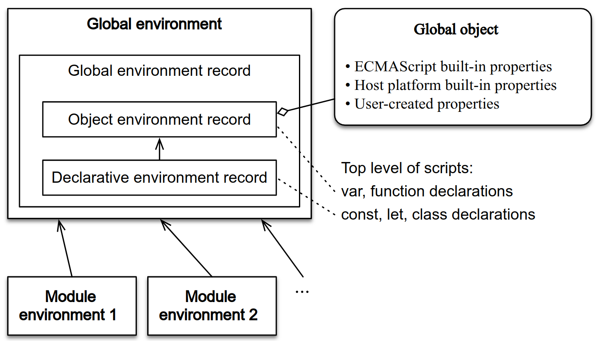

# JavaScript Basic Notes

## TC39

[](https://github.com/tc39/proposals)

- [Technical Committees 39](https://www.ecma-international.org/technical-committees/tc39 'TC39')
- [TC39 Process](http://tc39.github.io/process-document)
- [ES2015](https://exploringjs.com/es6/ch_overviews.html)
- [WinterCG: Web-interoperable Runtime Community Group](https://github.com/wintercg)

JavaScript = ECMAScript + DOM + BOM:

- ECMAScript: ECMA-262.
- DOM: DOM Core + DOM HTML (`document`).
- BOM: Browser Object Model API (HTML5)
  (`window`/`navigator`/`location`/`screen`/`performance` etc).

## Primitive Values

Primitive data types:

- Undefined.
- Null.
- Boolean.
- Number.
- String.
- Symbol.
- BigInt.

### Undefined

- 对象属性未定义时, 该属性值为 `undefined`.
- 未初始化变量的初值为 `undefined` (表示等待被赋值).

### Null

当引用为空或引用对象不存在时, 值为 `null`.
`null` 值表示一个空对象指针.

:::danger Null

`typeof null` -> `object`.

:::

### Boolean

#### Zero Value Expression

零值表达式:

- `undefined`.
- `null`.
- `false`.
- `NaN`.
- `0`
- `0n`.
- `''`.

#### Boolean Conversion

| `x`         | `Boolean(x)`                   |
| ----------- | ------------------------------ |
| `undefined` | `false`                        |
| `null`      | `false`                        |
| `boolean`   | `x`                            |
| `number`    | `0` → `false`, `NaN` → `false` |
|             | Other numbers → `true`         |
| `bigint`    | `0n` → `false`                 |
|             | Other numbers → `true`         |
| `string`    | `''` → `false`                 |
|             | Other strings → `true`         |
| `symbol`    | `true`                         |
| `object`    | `true`                         |

### Number

- Binary: `0b10`/`0B10`.
- Octal: `0o23`/`0O23`.
- Hex: `0xFF`.
- `**` 指数运算符.
- BigInt.

```ts
const a = 2172141653;
const b = 15346349309;
const c1 = a * b;
// => 33334444555566670000

const c2 = BigInt(a) * BigInt(b);
// => 33334444555566667777n

const inhabitantsOfLondon = 1_335_000;
const distanceEarthSunInKm = 149_600_000;

const fileSystemPermission = 0b111_111_000;
const bytes = 0b1111_10101011_11110000_00001101;
const words = 0xf3b_f00d;

const massOfElectronInKg = 9.109_383_56e-31;
const trillionInShortScale = 1e1_2;
```

#### Number Conversion

| `x`         | `Number(x)`                                                 |
| ----------- | ----------------------------------------------------------- |
| `undefined` | `NaN`                                                       |
| `null`      | `0`                                                         |
| `boolean`   | `false` → `0`, `true` → `1`                                 |
| `number`    | `x`                                                         |
| `bigint`    | `-1n` → `-1`, `1n` → `1`                                    |
| `string`    | `''` → `0`                                                  |
|             | Other → parsed number, ignoring leading/trailing whitespace |
| `symbol`    | Throws TypeError                                            |
| `object`    | Configurable (`[Symbol.toPrimitive]()`/`valueOf()`)         |

```ts
assert.equal(Number(123.45), 123.45);
assert.equal(Number(''), 0);
assert.equal(Number('\n 123.45 \t'), 123.45);
assert.equal(Number('xyz'), NaN);
assert.equal(Number(-123n), -123);
assert.equal(
  Number({
    valueOf() {
      return 123;
    },
  }),
  123
);
```

#### Number Static Properties

- `Number.NaN`.
- `Number.NEGATIVE_INFINITY`.
- `Number.POSITIVE_INFINITY`.
- `Number.MAX_SAFE_INTEGER`.
- `Number.MIN_SAFE_INTEGER`.
- `Number.EPSILON`.
- `Number.isNaN()`.
- `Number.isFinite()`.
- `Number.isInteger()`.
- `Number.isSafeInteger()`.
- `Number.toExponential()`.
- `Number.toFixed()`.
- `Number.toPrecision()`.
- `Number.parseInt(string, radix)`.
- `Number.parseFloat(string)`.

```ts
(1234).toExponential();
// '1.234e+3'
(1234).toExponential(5);
// '1.23400e+3'
(1234).toExponential(1);
// '1.2e+3'
(0.003).toExponential();
// '3e-3'

(0.00000012).toFixed(10);
// '0.0000001200'
(0.00000012).toFixed();
// '0'
(10 ** 21).toFixed();
// '1e+21'

(1234).toPrecision(3);
// '1.23e+3'
(1234).toPrecision(4);
// '1234'
(1234).toPrecision(5);
// '1234.0'
(1.234).toPrecision(3);
// '1.23'
```

#### Not A Number

```ts
const numberType = typeof NaN; // 'number'

Number.isFinite(NaN);
// false
Number.isNaN(NaN);
// true
Number.isNaN(123);
// false
Number.isNaN('abc');
// false

function isNumber(value) {
  return typeof value === 'number' && Number.isFinite(value);
}
```

:::danger NaN

`NaN === NaN` -> `false`.

:::

#### Infinity Number

Infinity represents all values greater than 1.7976931348623157e+308.
Infinity will be converted to `null` with `JSON.stringify()`.

```ts
const largeNumber = 1.7976931348623157e308;
// eslint-disable-next-line @typescript-eslint/no-loss-of-precision
const largerNumber = 1.7976931348623157e309;

console.log(largeNumber); // 1.7976931348623157e+308
console.log(largerNumber); // Infinity
console.log(46 / 0); // Infinity
console.log(Number.POSITIVE_INFINITY); // Infinity
console.log(Number.MAX_VALUE); // Infinity
// eslint-disable-next-line @typescript-eslint/no-loss-of-precision
console.log(-1.7976931348623157e309); // -Infinity
console.log(-46 / 0); // -Infinity
console.log(Number.NEGATIVE_INFINITY); // -Infinity
console.log(Number.MIN_VALUE); // -Infinity

console.log(Math.max()); // -Infinity
console.log(Math.min()); // Infinity

Number.isFinite(Infinity);
// false
Number.isFinite(-Infinity);
// false
Number.isFinite(NaN);
// false
Number.isFinite(123);
// true
```

#### Safe Number

- Safe integers:
  - Precision: 53 bits plus sign.
  - Range: (`−2^53`, `2^53`).
- Array indices:
  - Precision: 32 bits, unsigned
  - Range: [`0`, `2^32−1`).
  - Typed Arrays have a larger range of 53 bits (safe and unsigned).
- Bitwise operators:
  - Precision: 32 bits.
  - Range of unsigned right shift (`>>>`): unsigned, [`0`, `2^32`).
  - Range of all other bitwise operators: signed, [`−2^31`, `2^31`).

```ts
assert.equal(Number.MAX_SAFE_INTEGER, 2 ** 53 - 1);
assert.equal(Number.MIN_SAFE_INTEGER, -Number.MAX_SAFE_INTEGER);

assert.equal(Number.isSafeInteger(5), true);
assert.equal(Number.isSafeInteger('5'), false);
assert.equal(Number.isSafeInteger(5.1), false);
assert.equal(Number.isSafeInteger(Number.MAX_SAFE_INTEGER), true);
assert.equal(Number.isSafeInteger(Number.MAX_SAFE_INTEGER + 1), false);

Number.isInteger(-17);
// true
Number.isInteger(33);
// true
Number.isInteger(33.1);
// false
Number.isInteger('33');
// false
Number.isInteger(NaN);
// false
Number.isInteger(Infinity);
// false
```

#### Float Number

- 计算浮点数时, 应先计算整数, 再利用移位/乘法/除法转化为浮点数.
- 浮点值的精确度最高可达 17 位小数.

```ts
const a = (1 + 2) / 10; // a = 0.1 + 0.2;
```

### String

#### String Primitive Features

作为基本变量:

- `delete` 无法删除某位字符.

#### String Reference Features

- 赋值与传参: 传递 string 字符串常量的引用.
- 所有 string 字面量都是不可变量,
  当对 string 进行操作后, 将先会在堆区创建副本,
  再通过副本进行修改, 并返回副本的索引.
- `for...in`: 返回下标数字.
- `for...of`: 对字符串字符进行遍历.
- 没有被任何变量引用的 string: 垃圾回收.

```ts
const goodString = "I've been a good string";
console.log(typeof goodString); // string
console.log(goodString instanceof String); // false
console.log(Object.prototype.toString.call(goodString)); // [object String]

// eslint-disable-next-line no-new-wrappers
const badString = new String("I've been a naughty string");
console.log(typeof badString); // object
console.log(badString instanceof String); // true
console.log(Object.prototype.toString.call(badString)); // [object String]

const isPrimitiveString = value => typeof value === 'string';
console.log(isPrimitiveString(goodString)); // true
console.log(isPrimitiveString(badString)); // false

const isObjectWrappedString = value => value instanceof String;
console.log(isObjectWrappedString(goodString)); // false
console.log(isObjectWrappedString(badString)); // true

const isString = value => typeof value === 'string' || value instanceof String;
console.log(isString(goodString)); // true
console.log(isString(badString)); // true

const isStringAlternative = value =>
  Object.prototype.toString.call(badString) === '[object String]';
console.log(isStringAlternative(goodString)); // true
console.log(isStringAlternative(badString)); // true
```

#### String Conversion

| `x`         | `String(x)`                                             |
| ----------- | ------------------------------------------------------- |
| `undefined` | `'undefined'`                                           |
| `null`      | `'null'`                                                |
| `boolean`   | `false` → `'false'`, `true` → `'true'`                  |
| `number`    | `123` → `'123'`                                         |
| `bigint`    | `123n` → `'123'`                                        |
| `string`    | `x`                                                     |
| `symbol`    | `Symbol('abc')` → `'Symbol(abc)'`                       |
| `object`    | Configurable (`toPrimitive`/`toStringTag`/`toString()`) |

#### String Unicode

```ts
// eslint-disable-next-line no-self-compare
const truthy = 'z' === 'z'; // true
// eslint-disable-next-line no-octal-escape
const truthy = '\172' === 'z'; // true
const truthy = '\x7A' === 'z'; // true
const truthy = '\u007A' === 'z'; // true
const truthy = '\u{7A}' === 'z'; // true
```

#### String Char Code

- `string.charAt(index)`.
- `string.charCodeAt(index)`.
- `string.fromCharCode(charCode)`.
- `string.codePointAt(index)`: 正确处理 4 字节存储字符.
- `string.fromCodePoint(codePoint)`: 正确处理 4 字节存储字符.

```ts
function is32Bit(c) {
  return c.codePointAt(0) > 0xffff;
}

const truthy = String.fromCodePoint(0x78, 0x1f680, 0x79) === 'x\uD83D\uDE80y';

const after = before.charAt(0).toUpperCase() + before.slice(1);
```

#### String Slice and Merge

- `string.slice()`.
- `string.substring()`.
- `string.substr()`.
- `string.split(separator)`: 选择割断符, 返回字符串数组.
- `Array<string>.join(separator)`: 将字符串数组连接成字符串.

```ts
const stringValue = 'hello world';
console.log(stringValue.slice(3)); // "lo world"
console.log(stringValue.substring(3)); // "lo world"
console.log(stringValue.substr(3)); // "lo world"
console.log(stringValue.slice(3, 8)); // "lo wo"
console.log(stringValue.substring(3, 8)); // "lo wo"
console.log(stringValue.substr(3, 8)); // "lo world"
console.log(stringValue.slice(-3)); // "rld"
console.log(stringValue.substring(-3)); // "hello world"
console.log(stringValue.substr(-3)); // "rld"
console.log(stringValue.slice(3, -4)); // "lo w"
console.log(stringValue.substring(3, -4)); // "hel"
console.log(stringValue.substr(3, -4)); // "" (empty string)
```

#### String Query

- `string.includes(substr)`.
- `string.startsWith(substr)`.
- `string.endsWith(substr)`.
- 使用第二个参数 n 时, endsWith 针对前 n 个字符, 其他两个方法针对从第 n 个位置直到字符串结束.

```ts
const s = 'Hello world!';

s.startsWith('world', 6); // true
s.endsWith('Hello', 5); // true
s.includes('Hello', 6); // false

// Arrays difference
[
  [1, 2, 3, 4, 5],
  [5, 2, 10],
].reduce((a, b) => a.filter(c => !b.includes(c)));
// [1, 3, 4]

// Arrays intersection
[
  [1, 2, 3],
  [101, 2, 1, 10],
  [2, 1],
].reduce((a, b) => a.filter(c => b.includes(c)));
// [1, 2]
```

- `string.match(RegExp): string[] | null`.
- `string.matchAll(RegExp): string[] | null`.

```ts
interface RegExpMatchArray extends Array<string> {
  index: number;
  input: string;
  groups: Record<string, string> | undefined;
}
```

- `string.search(string | RegExp): number`.

```ts
'a2b'.search(/[0-9]/);
// 1
'a2b'.search('[0-9]');
// 1
```

#### String Replace

- `string.replace(string | RegExp, replaceValue | replacerFunction)`.
- `string.replaceAll(string | RegExp, replaceValue | replacerFunction)`.

```ts
// eslint-disable-next-line prefer-regex-literals
const regexp = new RegExp('foo[a-z]*', 'g');
const str = 'table football, foosball';
const matches = str.matchAll(regexp);

for (const match of matches) {
  console.log(
    `Found ${match[0]} start=${match.index} end=${
      match.index + match[0].length
    }.`
  );
}
// expected output: "Found football start=6 end=14."
// expected output: "Found foosball start=16 end=24."

// matches iterator is exhausted after the for..of iteration
// Call matchAll again to create a new iterator
Array.from(str.matchAll(regexp), m => m[0]);
// Array [ "football", "foosball" ]
```

```ts
'aabbcc'.replaceAll('b', '.');
// => 'aa..cc'

'aabbcc'.replaceAll(/b/g, '.');
// => 'aa..cc'
```

#### String Pad

- `string.repeat(times)`.

```ts
'hello'.repeat(2); // "hellohello"
'na'.repeat(2.9); // "nana"

'na'.repeat(-0.9); // ""
'na'.repeat(-1); // RangeError

'na'.repeat(NaN); // ""
'na'.repeat(Infinity); // RangeError

'na'.repeat('na'); // ""
'na'.repeat('3'); // "nanana"
```

- `string.padStart(len, paddingStr)`.
- `string.padEnd(len, paddingStr)`.

```ts
'1'.padStart(10, '0'); // "0000000001"
'12'.padStart(10, '0'); // "0000000012"
'123456'.padStart(10, '0'); // "0000123456"

'12'.padStart(10, 'YYYY-MM-DD'); // "YYYY-MM-12"
'09-12'.padStart(10, 'YYYY-MM-DD'); // "YYYY-09-12"
```

#### String Trim

- `string.trimLeft()`/`string.trimStart()`: remove start whitespace.
- `string.trimRight()`/`string.trimEnd()`: remove end whitespace.

#### String Template Literals

`str` 表示模板字符串:

```ts
// 普通字符串
`In JavaScript '\n' is a line-feed.``\`Yo\` World!``In JavaScript this is // 多行字符串
 not legal.``${
  x // 引用变量
} + ${y * 2} = ${x + y * 2}``${obj.x + obj.y}``foo ${
  fn() // 调用函数
} bar`;
```

#### Tagged Templates Literals

```ts
const boldify = (parts, ...insertedParts) => {
  return parts
    .map((s, i) => {
      if (i === insertedParts.length) return s;
      return `${s}<strong>${insertedParts[i]}</strong>`;
    })
    .join('');
};

const name = 'Sabertaz';
console.log(boldify`Hi, my name is ${name}!`);
// => "Hi, my name is <strong>Sabertaz</strong>!"
```

```ts
function template(strings, ...keys) {
  return function (...values) {
    const dict = values[values.length - 1] || {};
    const result = [strings[0]];
    keys.forEach(function (key, i) {
      const value = Number.isInteger(key) ? values[key] : dict[key];
      result.push(value, strings[i + 1]);
    });
    return result.join('');
  };
}

const t1Closure = template`${0}${1}${0}!`;
t1Closure('Y', 'A'); // "YAY!"
const t2Closure = template`${0} ${'foo'}!`;
t2Closure('Hello', { foo: 'World' }); // "Hello World!"
```

编译模板 (小型模板引擎):

```ts
function compile(template) {
  const evalExpr = /<%=(.+?)%>/g;
  const expr = /<%([\s\S]+?)%>/g;

  template = template
    .replace(evalExpr, '`); \n  echo( $1 ); \n  echo(`')
    .replace(expr, '`); \n $1 \n  echo(`');

  template = `echo(\`${template}\`);`;

  const script = `(function parse(data){
      let output = "";

      function echo(html){
        output += html;
      }

      ${template}

      return output;
    })`;

  return script;
}

const template = `
<ul>
  <% for(let i=0; i < data.supplies.length; i++) { %>
    <li><%= data.supplies[i] %></li>
  <% } %>
</ul>
`;
const parse = compile(template);
div.innerHTML = parse({ supplies: ['broom', 'mop', 'cleaner'] });
// => <ul>
// =>   <li>broom</li>
// =>   <li>mop</li>
// =>   <li>cleaner</li>
// => </ul>

// 下面的hashTemplate函数
// 是一个自定义的模板处理函数
const libraryHtml = hashTemplate`
  <ul>
    #for book in ${myBooks}
      <li><i>#{book.title}</i> by #{book.author}</li>
    #end
  </ul>
`;
```

国际化处理:

```ts
i18n`Welcome to ${siteName}, you are visitor number ${visitorNumber}!`;
// "欢迎访问xxx, 您是第xxxx位访问者！"
```

XSS protection:

```ts
const message = SaferHTML`<p>${sender} has sent you a message.</p>`;

function SaferHTML(templateString, ...expressions) {
  let s = templateString[0];

  for (let i = 0; i < expressions.length; i++) {
    const expression = String(expressions[i]);

    // Escape special characters in the substitution.
    s += expression
      .replace(/&/g, '&amp;')
      .replace(/</g, '&lt;')
      .replace(/>/g, '&gt;');

    // Don't escape special characters in the template.
    s += templateString[i + 1];
  }

  return s;
}
```

运行代码:

```ts
jsx`
  <div>
    <input
      ref='input'
      onChange='${this.handleChange}'
      defaultValue='${this.state.value}' />
      ${this.state.value}
   </div>
`;

java`
class HelloWorldApp {
  public static void main(String[] args) {
    System.out.println("Hello World!"); // Display the string.
  }
}
`;
HelloWorldApp.main();
```

#### Raw String

```ts
console.log(`\u00A9`); // ©
console.log(String.raw`\u00A9`); // \u00A9
```

```ts
console.log(`first line\nsecond line`);
// first line
// second line
console.log(String.raw`first line\nsecond line`);
// "first line\nsecond line"
```

```ts
function printRaw(strings) {
  console.log('Actual characters:');

  for (const string of strings) {
    console.log(string);
  }

  console.log('Escaped characters;');

  for (const rawString of strings.raw) {
    console.log(rawString);
  }
}

printRaw`\u00A9${'and'}\n`;
// Actual characters:
// ©
// (换行符)
// Escaped characters:
// \u00A9
// \n
```

#### String Utils

```ts
const ucWords = string => {
  return string.toLowerCase().replace(/\b[a-z]/g, l => l.toUpperCase());
};

const ucFirst = string => {
  return string[0].toUpperCase() + string.substr(1);
};

const studlyCase = string => {
  return string
    .replace('-', ' ')
    .replace('_', ' ')
    .split(' ')
    .map(str => str[0].toUpperCase() + str.substr(1).toLowerCase())
    .join('');
};

const snakeCase = (string, glue = '_') => {
  return string
    .replace(/\W+/g, ' ')
    .split(/ |\B(?=[A-Z])/)
    .map(word => word.toLowerCase())
    .join(glue);
};

const kebabCase = string => {
  return snakeCase(string, '-');
};

const objectToQueryString = obj => {
  return Object.keys(obj)
    .reduce((carry, key) => {
      if (obj[key] || obj[key] === 0) {
        return `${carry}${key}=${obj[key]}&`;
      }

      return carry;
    }, '')
    .replace(/&+$/, '');
};
```

### Symbol

- A Symbol is a **unique** and **immutable** primitive value
  and may be used as the key of an Object property.
- Symbols don't auto-convert to strings and can't convert to numbers.
- `Symbol.for(key)` create global Symbol registry.

```ts
// eslint-disable-next-line symbol-description
const genericSymbol = Symbol();
// eslint-disable-next-line symbol-description
const otherGenericSymbol = Symbol();
console.log(genericSymbol === otherGenericSymbol); // false

const fooSymbol = Symbol('foo');
const otherFooSymbol = Symbol('foo');
console.log(fooSymbol === otherFooSymbol); // false

const fooGlobalSymbol = Symbol.for('foobar'); // 创建新符号
const otherFooGlobalSymbol = Symbol.for('foobar'); // 重用已有符号
console.log(fooGlobalSymbol === otherFooGlobalSymbol); // true
```

#### Symbol Conversion

| Convert To | Explicit Conversion       | Coercion (Implicit Conversion) |
| ---------- | ------------------------- | ------------------------------ |
| `boolean`  | `Boolean(sym)` → OK       | `!sym` → OK                    |
| `number`   | `Number(sym)` → TypeError | `sym * 2` → TypeError          |
| `string`   | `String(sym)` → OK        | `'' + sym` → TypeError         |
|            | `sym.toString()` → OK     | `${sym}` → TypeError           |
| `object`   | `Object(sym)` → OK        | `Object.keys(sym)` → OK        |

#### Built-in Symbol Methods

[Symbol methods](https://developer.mozilla.org/docs/Web/JavaScript/Reference/Global_Objects/Symbol#static_properties):

- `[Symbol.iterator]()`: `for of`.
- `[Symbol.asyncIterator]()`: `for await of`.
- `[Symbol.match/replace/search/split](target)`: `string.match/replace/search/split(classWithSymbolFunction)`.
- `[Symbol.hasInstance](instance)`: `instance of`.
- `[Symbol.species]()`: constructor for making derived objects.
- `[Symbol.toPrimitive](hint)`: 强制类型转换.
- `[Symbol.toStringTag]()`: string used by `Object.prototype.toString()`.

`iterator`:

```ts
const arr = ['a', 'b', 'c'];
const iter = arr[Symbol.iterator]();

iter.next(); // { value: 'a', done: false }
iter.next(); // { value: 'b', done: false }
iter.next(); // { value: 'c', done: false }
iter.next(); // { value: undefined, done: true }
```

`hasInstance`:

```ts
class Bar {}
class Baz extends Bar {
  static [Symbol.hasInstance](instance) {
    return false;
  }
}

const b = new Baz();

console.log(Bar[Symbol.hasInstance](b)); // true
console.log(b instanceof Bar); // true
console.log(Baz[Symbol.hasInstance](b)); // false
console.log(b instanceof Baz); // false

const ReferenceType = {
  [Symbol.hasInstance](value) {
    return (
      value !== null &&
      (typeof value === 'object' || typeof value === 'function')
    );
  },
};

const obj1 = {};
console.log(obj1 instanceof Object); // true
console.log(obj1 instanceof ReferenceType); // true

const obj2 = Object.create(null);
console.log(obj2 instanceof Object); // false
console.log(obj2 instanceof ReferenceType); // true
```

`species`:

```ts
class MyClass {
  static get [Symbol.species]() {
    return this;
  }

  constructor(value) {
    this.value = value;
  }

  clone() {
    return new this.constructor[Symbol.species](this.value);
  }
}

class MyDerivedClass1 extends MyClass {
  // empty
}

class MyDerivedClass2 extends MyClass {
  static get [Symbol.species]() {
    return MyClass;
  }
}

const instance1 = new MyDerivedClass1('foo');
const instance2 = new MyDerivedClass2('bar');
const clone1 = instance1.clone();
const clone2 = instance2.clone();

console.log(clone1 instanceof MyClass); // true
console.log(clone1 instanceof MyDerivedClass1); // true
console.log(clone2 instanceof MyClass); // true
console.log(clone2 instanceof MyDerivedClass2); // false
```

`toPrimitive`:

```ts
class Temperature {
  constructor(degrees) {
    this.degrees = degrees;
  }

  [Symbol.toPrimitive](hint) {
    switch (hint) {
      case 'string':
        return `${this.degrees}\u00B0`; // degrees symbol
      case 'number':
        return this.degrees;
      case 'default':
        return `${this.degrees} degrees`;
    }
  }
}

const freezing = new Temperature(32);

console.log(`${freezing}!`); // "32 degrees!"
console.log(freezing / 2); // 16
console.log(String(freezing)); // "32째"
```

`toStringTag`:

```ts
class Person {
  constructor(name) {
    this.name = name;
  }

  get [Symbol.toStringTag]() {
    return 'Person';
  }
}

const me = new Person('Me');

console.log(me.toString()); // "[object Person]"
console.log(Object.prototype.toString.call(me)); // "[object Person]"
```

| Value                     | `toString` Tag |
| ------------------------- | -------------- |
| undefined                 | `Undefined`    |
| null                      | `Null`         |
| Array object              | `Array`        |
| string object             | `String`       |
| arguments                 | `Arguments`    |
| callable                  | `Function`     |
| error object              | `Error`        |
| boolean object            | `Boolean`      |
| number object             | `Number`       |
| date object               | `Date`         |
| regular expression object | `RegExp`       |
| (Otherwise)               | `Object`       |

### Bigint

- Decimal: `123n`.
- Binary: `0b1101n`.
- Octal: `0o777n`.
- Hexadecimal: `0xFFn`.

```ts
/**
 * Takes a bigint as an argument and returns a bigint
 */
function nthPrime(nth) {
  if (typeof nth !== 'bigint') {
    throw new TypeError('Not bigint');
  }

  function isPrime(p) {
    for (let i = 2n; i < p; i++) {
      if (p % i === 0n) return false;
    }

    return true;
  }

  for (let i = 2n; ; i++) {
    if (isPrime(i)) {
      if (--nth === 0n) return i;
    }
  }
}

assert.deepEqual(
  [1n, 2n, 3n, 4n, 5n].map(nth => nthPrime(nth)),
  [2n, 3n, 5n, 7n, 11n]
);
```

#### Bigint Conversion

| `x`         | `BigInt(x)`                                         |
| ----------- | --------------------------------------------------- |
| `undefined` | Throws TypeError                                    |
| `null`      | Throws TypeError                                    |
| `boolean`   | `false` → `0n`, `true` → `1n`                       |
| `number`    | `123` → `123n`                                      |
|             | Non-integer → throws RangeError                     |
| `bigint`    | `x`                                                 |
| `string`    | `'123'` → `123n`                                    |
|             | Unparsable → throws SyntaxError                     |
| `symbol`    | Throws TypeError                                    |
| `object`    | Configurable (`[Symbol.toPrimitive]()`/`valueOf()`) |

```ts
BigInt(undefined);
// TypeError: Cannot convert undefined to a BigInt
BigInt(null);
// TypeError: Cannot convert null to a BigInt
BigInt('abc');
// SyntaxError: Cannot convert abc to a BigInt
BigInt('123n');
// SyntaxError: Cannot convert 123n to a BigInt
BigInt('123');
// 123n
BigInt('0xFF');
// 255n
BigInt('0b1101');
// 13n
BigInt('0o777');
// 511n
BigInt(123.45);
// RangeError: The number 123.45 cannot be converted to a BigInt
BigInt(123);
// 123n
BigInt({
  valueOf() {
    return 123n;
  },
});
// 123n
```

| Convert To | Explicit Conversion     | Coercion (Implicit Conversion) |
| ---------- | ----------------------- | ------------------------------ |
| `boolean`  | `Boolean(0n)` → `false` | `!0n` → `true`                 |
|            | `Boolean(int)` → `true` | `!int` → `false`               |
| `number`   | `Number(7n)` → `7`      | `+int` → `TypeError`           |
| `string`   | `String(7n)` → `'7'`    | `''+7n` → `'7'`                |

#### Bigint Static Properties

- `BigInt.asIntN(width, theInt)`:
  Casts theInt to width bits (signed).
- `BigInt.asUintN(width, theInt)`:
  Casts theInt to width bits (unsigned).

```ts
const uint64a = BigInt.asUintN(64, 12345n);
const uint64b = BigInt.asUintN(64, 67890n);
const result = BigInt.asUintN(64, uint64a * uint64b);
```

### Wrapper Objects for Primitives

Using the wrapper function without the new keyword
is a useful way of coercing a value into a primitive type.

```ts
// Not recommended (primitive object wrapper):
// eslint-disable-next-line no-new-wrappers
const objectType = typeof new String(37); // object

// Safe (type coercion with wrapper function):
const stringType = typeof String(37); // string

// Primitive strings:
// eslint-disable-next-line no-self-compare
const truthy = '37' === '37'; // true

// Object-wrapped string:
// eslint-disable-next-line no-new-wrappers
const falsy = new String(37) === '37'; // false

// Type-coerced string:
const truthy = String(37) === '37'; // true

// BAD!
// eslint-disable-next-line no-new-wrappers
const falseObject = new Boolean(false);
const result = falseObject && true;
console.log(result); // true
console.log(typeof falseObject); // object
console.log(falseObject instanceof Boolean); // true

const prim = true;
assert.equal(typeof prim, 'boolean');
assert.equal(prim instanceof Boolean, false);

const wrapped = Object(prim);
assert.equal(typeof wrapped, 'object');
assert.equal(wrapped instanceof Boolean, true);
assert.equal(wrapped.valueOf(), prim); // unwrap
```

**Box and Unbox** for primitive values:

- 自动创建的原始值包装对象可以让原始值拥有对象的行为.
- 自动创建的原始值包装对象只存在于访问它的那行代码执行期间.
- 常数值**加括号**可转化为对象.
- 可以对 primitive values 进行 ES6 解构语法.

```ts
const s1 = 'some text';
const s2 = s1.substring(2); // Call method on primitive string.
// let _s1 = new String(s1);
// const s2 = _s1.substring(2);
// _s1 = null;

const s3 = 'some text';
s3.color = 'red';
console.log(s3.color); // undefined
```

```ts
// primitive string
const greet = 'Hello there';
// primitive is converted to an object
// in order to use the split() method
const hello = greet.split(' ')[0]; // "Hello"
// attempting to augment a primitive is not an error
greet.smile = true;
// but it doesn't actually work
const undef = typeof greet.smile; // "undefined"
```

不使用 new 关键字,包装类构造函数返回值为基本类型

```ts
const numberType = typeof Number(1); // "number"
const numberType = typeof Number('1'); // "number"
// eslint-disable-next-line no-new-wrappers
const numberType = typeof Number(new Number()); // "number"
const stringType = typeof String(1); // "string"
const booleanType = typeof Boolean(1); // "boolean"
```

## Reference Values

- Object e.g Date, RegExp.
- Function.
- Array.
- Map.
- Set.
- WeakMap.
- WeakSet.

### Array

- 与 Object 同源.
- 关联数组: `arrayName["string"] = value;` 实际为 Array 对象添加属性`{string:value}`.
- 缓存数组长度:`int l = list.length`(访问`length`造成运算).
- `[]`数组, `{}`对象.
- 数组在数值运算环境中转化为 0 (空数组)/ num (单一元素数组)/NaN (多元素数组/NaN 数组).

```ts
const array = [...Array(5).keys()]; // => [0, 1, 2, 3, 4]
```

#### Array Length

- 数组下标满足 [0, 2^32-1) 即可
- 运用大于 length 的下标, length 自动增大, 不会发生数组边界错误
- length 等于 数组最后一个整数属性名+1, length 不一定等于 数组中有效元素个数

#### Array Literals

不使用构造函数,使用数组字面量创建数组

```ts
const arr1 = new Array(3); // 数组长度
const arr2 = new Array(3.14); // RangeError
```

```ts
if (typeof Array.isArray === 'undefined') {
  Array.isArray = function (arg) {
    // 其余对象返回值 [object Object/Number/String/Boolean]
    return Object.prototype.toString.call(arg) === '[object Array]';
  };
}
```

#### Array Of

```ts
Array.of(1); // [1]
Array.of(1, 2, 3); // [1, 2, 3]
Array.of(undefined); // [undefined]
```

#### Array From

强大的**函数式**方法:

- 伪数组对象 (Array-like object).
- 可枚举对象 (Iterable object).
- 浅克隆数组 (Shallow Clone).
- `map` 函数.

```ts
interface ArrayLike<T> {
  length: number;
  [n: number]: T;
}

interface Array {
  from<T>(iterable: Iterable<T> | ArrayLike<T>): T[];
  from<T, U>(
    iterable: Iterable<T> | ArrayLike<T>,
    mapFunc: (v: T, i: number) => U,
    thisArg?: any
  ): U[];
}
```

```ts
// Set
// Map

// NodeList 对象
const ps = document.querySelectorAll('p');
Array.from(ps).forEach(function (p) {
  console.log(p);
});

// arguments 对象
function foo() {
  // eslint-disable-next-line prefer-rest-params
  const args = Array.from(arguments);
  // ...
}

Array.from('hello');
// => ['h', 'e', 'l', 'l', 'o']

const namesSet = new Set(['a', 'b']);
Array.from(namesSet); // ['a', 'b']

// 克隆数组
Array.from([1, 2, 3]);
// => [1, 2, 3]

Array.from(arrayLike, x => x * x);
// =>
Array.from(arrayLike).map(x => x * x);

Array.from([1, 2, 3], x => x * x);
// [1, 4, 9]

// random array generation
Array.from(Array(5).keys());
// [0, 1, 2, 3, 4]
```

#### Array Fill

```ts
const numbers = [1, 2, 3, 4];
numbers.fill(1, 2);
console.log(numbers.toString()); // 1, 2, 1, 1
numbers.fill(0, 1, 3);
console.log(numbers.toString()); // 1, 0, 0, 1
numbers.fill(1);
console.log(numbers.toString()); // 1, 1, 1, 1
```

#### Array CopyWithin

`copyWithin(dest, start, end)`, 替换数组元素, **修改原数组**:

```ts
[1, 2, 3, 4, 5].copyWithin(0, 3);
// => [4, 5, 3, 4, 5]
[1, 2, 3, 4, 5].copyWithin(0, -2, -1);
// -2相当于3号位, -1相当于4号位
// => [4, 2, 3, 4, 5]

// 将2号位到数组结束, 复制到0号位
const i32a = new Int32Array([1, 2, 3, 4, 5]);
i32a.copyWithin(0, 2);
// => Int32Array [3, 4, 5, 4, 5]
```

#### Array Stack

```ts
arr.unshift(value); // 添加数组首元素
arr.push(value); // 添加数组尾元素
arr.shift(); // 删除数组首元素
arr.pop(); // 删除数组尾元素
```

#### Array Slice and Merge

- slice 不改变原数组, splice 改变原数组.

```ts
[].slice(start, end); // [start] - [end - 1]
[].splice(startIndex, lengthToDelete, insertElements); // 功能强大的多态方法
[].concat(otherArray);
[].join(separator);
```

#### Array Query

```ts
[].at(index); // ES2022
[].includes(element); // boolean.
[].find(callback); // element.
[].findIndex(callback); // element index.
[].indexOf(element); // -1 or other.
[].lastIndexOf(element); // -1 or other.
```

```ts
// console.log([NaN].indexOf(NaN));
// -1

console.log([NaN].includes(NaN));
// true
```

#### Array Element Filter

相当于 Haskell 中的 List Filter:

```ts
const numbers = [1, 2, 3, 4, 5, 4, 3, 2, 1];
const filterResult = numbers.filter((item, index, array) => item > 2);
console.log(filterResult); // 3,4,5,4,3
```

#### Array Boolean Filter

- `Array.every(filer)`.
- `Array.some(filer)`.

```ts
const numbers = [1, 2, 3, 4, 5, 4, 3, 2, 1];
const everyResult = numbers.every((item, index, array) => item > 2);
const someResult = numbers.some((item, index, array) => item > 2);
console.log(everyResult); // false
console.log(someResult); // true
```

#### Array Map

相当于 Haskell 中的 List Map:

```ts
[].map(item => item + 1); // map over
```

#### Array Flat

`[2, [2, 2]] => [2, 2, 2]`

#### Array FlatMap

map + flat.

```ts
const flattenDeep = arr =>
  Array.isArray(arr)
    ? arr.reduce((a, b) => a.concat(flattenDeep(b)), [])
    : [arr];

flattenDeep([1, [[2], [3, [4]], 5]]);
// => [1, 2, 3, 4, 5]

// ES2019
[1, [2, [3, [4]], 5]].flat(Infinity);
// => [1, 2, 3, 4, 5]

const flattenDeep = arr =>
  arr.flatMap((subArray, index) =>
    Array.isArray(subArray) ? flattenDeep(subArray) : subArray
  );

flattenDeep([1, [[2], [3, [4]], 5]]);
// => [1, 2, 3, 4, 5]
```

#### Array Reduce

`reduce`/`reduceRight`:

- Implement array sets manipulation (`reduce`/`filter`/`includes`).
- Implement `XXXBy` functional methods.

```ts
[].reduce(
  (previous, current, currentIndex, arr) => current + previous,
  initial
); // fold function
```

Implement `groupBy`:

```ts
const groupByLength = ['one', 'two', 'three'].reduce(
  (acc, current, _index, _array) => {
    const key = current.length;
    (acc[key] || (acc[key] = [])).push(current);
    return acc;
  },
  {}
);
// {3: ["one", "two"], 5: ["three"]}

const groupByFunction = [1.3, 2.1, 2.4].reduce(
  (acc, current, _index, _array) => {
    const key = Math.floor(current);
    (acc[key] || (acc[key] = [])).push(current);
    return acc;
  },
  {}
);
// {1: [1.3], 2: [2.1, 2.4]}
```

#### Array Traversal

```ts
array.forEach(val => {}); // 遍历数组所有元素.
```

#### Array Sort

`toExchange`:

- `return 1`: a, b 交换位置.
- `return -1`: a, b 不交换位置.

```ts
arr.sort(toExchange);
strings.sort((a, b) => a.localeCompare(b));
strings.sort((a, b) => new Intl.Collator('en').compare(a, b));
```

#### Array Reverse

```ts
[].reverse();
```

```ts
// Tips
// 反转字符串
const reverseStr = normalizedStr.split('').reverse().join('');
```

#### Array Spread

- Shallow Clone.
- Iterable Consumer.

```ts
arr2.push(...arr1);
```

```ts
const obj = { x: 1, y: 2, z: 3 };

obj[Symbol.iterator] = function* () {
  yield 1;
  yield 2;
  yield 3;
};

const array = [...obj]; // print [1, 2, 3]
```

#### Array Deep Clone

```ts
const nestedArray = [1, [2], 3];
const arrayCopy = JSON.parse(JSON.stringify(nestedArray));

// Make some changes
arrayCopy[0] = '1'; // change shallow element
arrayCopy[1][0] = '3'; // change nested element
console.log(arrayCopy); // [ '1', [ '3' ], 3 ]

// Good: Nested array NOT affected
console.log(nestedArray); //  1, [ 2 ], 3 ]
```

#### Typed Array

[`Typed Array`](https://exploringjs.com/es6/ch_typed-arrays.html)
是 `ArrayBuffer` (用于 Web GL 高效率内存操作) 其中一种视图:

- File.
- XMLHttpRequest.
- Fetch.
- Web Worker.
- WebSocket.
- Canvas.
- WebGL.
- Web Audio.

```ts
// 第一个参数是应该返回的数组类型
// 其余参数是应该拼接在一起的定型数组
function typedArrayConcat(TypedArrayConstructor, ...typedArrays) {
  // 计算所有数组中包含的元素总数
  const numElements = typedArrays.reduce((x, y) => (x.length || x) + y.length);
  // 按照提供的类型创建一个数组, 为所有元素留出空间
  const resultArray = new TypedArrayConstructor(numElements);
  // 依次转移数组
  let currentOffset = 0;
  typedArrays.forEach(x => {
    resultArray.set(x, currentOffset);
    currentOffset += x.length;
  });
  return resultArray;
}

const concatArray = typedArrayConcat(
  Int32Array,
  Int8Array.of(1, 2, 3),
  Int16Array.of(4, 5, 6),
  Float32Array.of(7, 8, 9)
);

console.log(concatArray); // [1, 2, 3, 4, 5, 6, 7, 8, 9]
console.log(concatArray instanceof Int32Array); // true
```

```ts
const view = new Int16Array([25, 50]);
console.log(view instanceof Int16Array); // true
console.log(view instanceof Array); // false
console.log(Array.isArray(view)); // false
```

### Map

- `size`.
- `has()`.
- `get()`.
- `set()`.
- `delete()`.
- `clear()`.
- `keys()`.
- `values()`.
- `entries()`.

```ts
const map = new Map([
  // You define a map via an array of 2-element arrays. The first
  // element of each nested array is the key, and the 2nd is the value
  ['name', 'Jean-Luc Picard'],
  ['age', 59],
  ['rank', 'Captain'],
]);

// To get the value associated with a given `key` in a map, you
// need to call `map.get(key)`. Using `map.key` will **not** work.
map.get('name'); // 'Jean-Luc Picard'
```

```ts
const map = new Map([]);

// eslint-disable-next-line no-new-wrappers
const n1 = new Number(5);
// eslint-disable-next-line no-new-wrappers
const n2 = new Number(5);

map.set(n1, 'One');
map.set(n2, 'Two');

// `n1` and `n2` are objects, so `n1 !== n2`. That means the map has
// separate keys for `n1` and `n2`.
map.get(n1); // 'One'
map.get(n2); // 'Two'
map.get(5); // undefined

// If you were to do this with an object, `n2` would overwrite `n1`
const obj = {};
obj[n1] = 'One';
obj[n2] = 'Two';

const two1 = obj[n1]; // 'Two'
const two2 = obj[5]; // 'Two'
```

```ts
const objectClone = new Map(Object.entries(object));
const arrayClone = new Map(Array.from(map.entries));
const map = new Map([
  ['name', 'Jean-Luc Picard'],
  ['age', 59],
  ['rank', 'Captain'],
]);

// The `for/of` loop can loop through iterators
for (const key of map.keys()) {
  console.log(key); // 'name', 'age', 'rank'
}

for (const value of map.values()) {
  console.log(value); // 'Jean-Luc Picard', 59, 'Captain'
}

for (const [key, value] of map.entries()) {
  console.log(key); // 'name', 'age', 'rank'
  console.log(value); // 'Jean-Luc Picard', 59, 'Captain'
}
```

### Set

- `size`.
- `has()`.
- `add()`.
- `delete()`.
- `clear()`.
- `keys()`.
- `values()`.
- `entries()`.

```ts
class XSet extends Set {
  union(...sets) {
    return XSet.union(this, ...sets);
  }

  intersection(...sets) {
    return XSet.intersection(this, ...sets);
  }

  difference(set) {
    return XSet.difference(this, set);
  }

  symmetricDifference(set) {
    return XSet.symmetricDifference(this, set);
  }

  cartesianProduct(set) {
    return XSet.cartesianProduct(this, set);
  }

  powerSet() {
    return XSet.powerSet(this);
  }

  // 返回两个或更多集合的并集
  // new Set([...setA, ...setB]);
  static union(a, ...bSets) {
    const unionSet = new XSet(a);

    for (const b of bSets) {
      for (const bValue of b) {
        unionSet.add(bValue);
      }
    }

    return unionSet;
  }

  // 返回两个或更多集合的交集
  // new Set([...setA].filter(x => setB.has(x)))
  static intersection(a, ...bSets) {
    const intersectionSet = new XSet(a);

    for (const aValue of intersectionSet) {
      for (const b of bSets) {
        if (!b.has(aValue)) {
          intersectionSet.delete(aValue);
        }
      }
    }

    return intersectionSet;
  }

  // 返回两个集合的差集
  // new Set([...setA].filter(x => !setB.has(x)))
  static difference(a, b) {
    const differenceSet = new XSet(a);

    for (const bValue of b) {
      if (a.has(bValue)) {
        differenceSet.delete(bValue);
      }
    }

    return differenceSet;
  }

  // 返回两个集合的对称差集
  static symmetricDifference(a, b) {
    // 按照定义, 对称差集可以表达为:
    return a.union(b).difference(a.intersection(b));
  }

  // 返回两个集合 (数组对形式) 的笛卡儿积
  // 必须返回数组集合, 因为笛卡儿积可能包含相同值的对
  static cartesianProduct(a, b) {
    const cartesianProductSet = new XSet();

    for (const aValue of a) {
      for (const bValue of b) {
        cartesianProductSet.add([aValue, bValue]);
      }
    }

    return cartesianProductSet;
  }

  // 返回一个集合的幂集
  static powerSet(a) {
    const powerSet = new XSet().add(new XSet());

    for (const aValue of a) {
      for (const set of new XSet(powerSet)) {
        powerSet.add(new XSet(set).add(aValue));
      }
    }

    return powerSet;
  }
}
```

### WeakMap and WeakSet

WeakMap 结构与 Map 结构基本类似,
唯一的区别就是 WeakMap 只接受**非 null 对象**作为键名:

- 弱键: 键名构建的引用**无法阻止对象执行垃圾回收**.
- 不可迭代键: 键/值随时可能被垃圾回收, 无需提供迭代能力, 无 `clear()` 方法.

它的键所对应的对象可能会在将来消失.
一个对应 DOM 元素的 WeakMap 结构,
当某个 DOM 元素被清除,
其所对应的 WeakMap 记录就会自动被移除.

有时候我们会把对象作为一个对象的键用来存放属性值,
普通集合类型比如简单对象 (Object/Map/Set) 会阻止垃圾回收器对这些作为属性键存在的对象的回收,
有造成内存泄漏的危险,
WeakMap/WeakSet 则更加**内存安全**:

- Caching computed results.
- Managing listeners.
- Keeping private data.

### Date

- [Date and Temporal API CheatSheet](https://github.com/you-dont-need/You-Dont-Need-Momentjs)
- [Definitive Guide](https://css-tricks.com/everything-you-need-to-know-about-date-in-javascript)

```ts
const now = new Date();
now.getFullYear(); // 1-n
now.getMonth(); // Warn: 0-11
now.getDate(); // 1-n
now.getDay(); // Warn: 0-6
now.getHours();
now.getSeconds();
now.toString();
now.toDateString();
now.toTimeString();
now.toUTCString();
now.toLocaleString();
now.toLocaleDateString();
now.toLocaleTimeString();

const daysOfMonth = (year, month) => {
  // `0` for last month of next month
  return new Date(year, month + 1, 0).getDate();
};

const prevYear = year => {
  return new Date(year - 1, 0).getFullYear();
};

const nextYear = year => {
  return new Date(year + 1, 0).getFullYear();
};

const prevMonth = (year, month) => {
  return new Date(year, month - 1).getMonth();
};

const nextMonth = (year, month) => {
  return new Date(year, month + 1).getMonth();
};
```

```ts
const getDateItemList = (year, month) => {
  const days = daysOfMonth(year, month);
  const currentDateItemList = [...Array(days).keys()].map(index => {
    return DateItem(year, month, 1 + index);
  });

  const firstDayItem = DateItem(year, month, 1);
  const firstDayWeekday = firstDayItem.day;
  const lastMonthDays = daysOfMonth(year, month - 1);
  const prefixDays = firstDayWeekday === 0 ? 7 : firstDayWeekday;
  const prefixFirstDay = lastMonthDays - prefixDays + 1;
  const prefixYear = prevYear(year);
  const prefixMonth = prevMonth(year, month);
  const prefixDateItemList = [...Array(prefixDays).keys()].map(index => {
    return DateItem(prefixYear, prefixMonth, prefixFirstDay + index);
  });

  const lastDayItem = DateItem(year, month, days);
  const lastDayWeekday = lastDayItem.day;
  const suffixDays = lastDayWeekday === 6 ? 7 : 6 - lastDayWeekday;
  const suffixYear = nextYear(year);
  const suffixMonth = nextMonth(year, month);
  const suffixDateItemList = [...Array(suffixDays).keys()].map(index => {
    return DateItem(suffixYear, suffixMonth, 1 + index);
  });

  const dateItemList = [
    ...prefixDateItemList,
    ...currentDateItemList,
    ...suffixDateItemList,
  ];

  return dateItemList;
};
```

### Temporal

#### Temporal Basis

```ts
Temporal.ZonedDateTime.from({
  year,
  month,
  day,
  timeZone: Temporal.Now.timeZone(),
});

Temporal.ZonedDateTime.from({
  year,
  month,
  day,
  hour,
  minute,
  timeZone: Temporal.Now.timeZone(),
});

const second = Temporal.Now.zonedDateTimeISO().second;
const hour = Temporal.Now.zonedDateTimeISO().hour;
const day = Temporal.Now.zonedDateTimeISO().day;

Temporal.Now.zonedDateTimeISO().with({ second: 30 });
Temporal.Now.zonedDateTimeISO().with({ hour: 13 });
Temporal.Now.zonedDateTimeISO().with({ day: 1 });
Temporal.Now.zonedDateTimeISO().withPlainTime(
  new Temporal.PlainTime(23, 59, 59, 999, 999, 999)
);
```

#### Temporal Range

```ts
const dayOfWeek = Temporal.Now.zonedDateTimeISO().dayOfWeek;
const dayOfYear = Temporal.Now.zonedDateTimeISO().dayOfYear;
const daysInMonth = new Temporal.PlainYearMonth(2012, 2).daysInMonth;
const daysInMonth = Temporal.PlainYearMonth.from('2012-02').daysInMonth;
const weekOfYear = Temporal.Now.zonedDateTimeISO().weekOfYear;
const weekOfYear = Temporal.PlainDate.from({
  day: 31,
  month: 12,
  year: Temporal.Now.plainDateISO(),
}).weekOfYear;
const inLeapYear = Temporal.PlainDate.from('2000-01-01').inLeapYear;

Temporal.Now.zonedDateTimeISO().add(Temporal.Duration.from({ days: 7 }));
Temporal.Now.zonedDateTimeISO().subtract(Temporal.Duration.from({ days: 14 }));
Temporal.Now.zonedDateTimeISO()
  .with({ month: 1, day: 1 })
  .add(Temporal.Duration.from({ days: 256 }));
Temporal.Now.zonedDateTimeISO()
  .with({ month: 1, day: 1 })
  .add(Temporal.Duration.from({ weeks: 23 }));

Temporal.Instant.fromEpochMilliseconds(Math.max.apply(null, dateArrays));
Temporal.Instant.fromEpochMilliseconds(Math.min.apply(null, dateArrays));
```

#### Temporal Display

```ts
new Intl.DateTimeFormat('en-GB', {
  dateStyle: 'full',
  timeStyle: 'medium',
}).format(Temporal.Now.zonedDateTimeISO());
new Intl.DateTimeFormat('de-DE', { weekday: 'short', hour: 'numeric' }).format(
  Temporal.Now.zonedDateTimeISO()
);

Temporal.PlainDate.from('2007-01-27').until('2007-01-29');
Temporal.PlainDate.from('2007-01-27')
  .since('2007-01-29')
  .total({ unit: 'millisecond' });
Temporal.PlainDate.from('2007-01-27')
  .since('2007-01-29')
  .total({ unit: 'day' });
```

#### Temporal Query

```ts
const isBefore = Temporal.PlainDate.compare('2010-10-20', '2010-10-21') === -1;
const isAfter = Temporal.PlainDate.compare('2010-10-20', '2010-10-19') === 1;
const isEqual = Temporal.PlainDate.from('2010-10-20').equals('2010-10-21');
const isEqual = Temporal.PlainDate.from('2010-10-20').equals('2010-10-20');
const isEqual =
  Temporal.PlainDate.from('2010-10-20').month ===
  Temporal.PlainDate.from('2010-10-21').month;

const isPlainTime = Temporal.Now.plainTimeISO() instanceof Temporal.PlainTime;
const isPlainDate = Temporal.Now.plainDateISO() instanceof Temporal.PlainDate;
const isPlainDateTime =
  Temporal.Now.plainDateTimeISO() instanceof Temporal.PlainDateTime;
const isZonedDateTime =
  Temporal.Now.zonedDateTimeISO() instanceof Temporal.ZonedDateTime;
```

## Variable

### Variable Hoisting

- 一方面规定, `var`/`function` 声明的全局变量,
  依旧是全局对象的属性, 意味着会`Hoisting`.
- 另一方面规定, `let`/`const`/`class` 声明的全局变量,
  不属于全局对象的属性, 意味着不会`Hoisting`.
- `var` 只有函数作用域, `let`/`const` 拥有块级作用域.
- `var` 表达式和 `function` 声明都将会被提升到当前作用域 (**全局作用域/函数作用域**) 顶部,
  其余表达式顺序不变.

|            | Hoisting           | Scope         | Creates Global Properties |
| ---------- | ------------------ | ------------- | ------------------------- |
| `var`      | Declaration        | Function      | Yes                       |
| `let`      | Temporal dead zone | Block         | No                        |
| `const`    | Temporal dead zone | Block         | No                        |
| `class`    | Temporal dead zone | Block         | No                        |
| `function` | Complete           | Block         | Yes                       |
| `import`   | Complete           | Module-global | No                        |

<!-- eslint-disable -->

```ts
// 我们知道这个行不通 (假设没有未定义的全局变量)
function example() {
  console.log(notDefined); // => throws a ReferenceError
}

// 在引用变量后创建变量声明将会因变量提升而起作用.
// 注意: 真正的值 `true` 不会被提升.
function example() {
  console.log(declaredButNotAssigned); // => undefined
  var declaredButNotAssigned = true;
}

// 解释器将变量提升到函数的顶部
// 这意味着我们可以将上边的例子重写为:
function example() {
  let declaredButNotAssigned;
  console.log(declaredButNotAssigned); // => undefined
  declaredButNotAssigned = true;
}

// 使用 const 和 let
function example() {
  console.log(declaredButNotAssigned); // => throws a ReferenceError
  console.log(typeof declaredButNotAssigned); // => throws a ReferenceError
  const declaredButNotAssigned = true;
}
```

<!-- eslint-disable -->

```ts
function example() {
  console.log(named); // => undefined

  named(); // => TypeError named is not a function

  superPower(); // => ReferenceError superPower is not defined

  var named = function superPower() {
    console.log('Flying');
  };
}
```

<!-- eslint-enable -->

### Let Variable

- 块级作用域内定义的变量/函数, 在块级作用域外 ReferenceError.
- 不存在变量提升, 导致暂时性死区 (Temporal Dead Zone).
- `let` variable in `for-loop` closure,
  every closure for each loop
  binds the block-scoped variable.

```ts
const a = 1;

b = 3; // temporal dead zone: throw reference error

let b = 2;
```

`let` 变量拥有块级作用域 (每个 `setTimeout` 引用的都是不同的变量实例):

```ts
// for (var i = 0; i < 5; ++i) {
//   setTimeout(() => console.log(i), 0);
// }
// Output 5, 5, 5, 5, 5.
// 所有的 i 都是同一个变量, 输出同一个最终值.

for (let i = 0; i < 5; ++i) {
  setTimeout(() => console.log(i), 0);
}
// Output: 0, 1, 2, 3, 4.
// JavaScript 引擎会为每个迭代循环声明一个新的迭代变量.
// 每个 setTimeout 引用的都是不同的变量实例.
```

### Const Variable

- const 一旦声明变量, 就必须立即初始化, 不能留到以后赋值.
- 引用一个`Reference`变量时, 只表示此变量地址不可变, 但所引用变量的值/属性可变
  (`xxx *const`, 即`const`指针, 指向一个变量).
- 块级作用域.
- 不存在变量提升, 导致暂时性死区 (Temporal Dead Zone).

```ts
const f = () => g();
const g = () => 123;

// We call f() after g() was declared:
assert.equal(f(), 123);
```

```ts
funcDecl();

const MY_STR = 'abc';
function funcDecl() {
  assert.throws(() => MY_STR, ReferenceError);
}
```

### Type Detection

```ts
function typeOf(o) {
  const _toString = Object.prototype.toString;
  const _type = {
    undefined: 'undefined',
    number: 'number',
    boolean: 'boolean',
    string: 'string',
    '[object Function]': 'function',
    '[object GeneratorFunction]': 'function',
    '[object Array]': 'array',
    '[object Date]': 'date',
    '[object RegExp]': 'regexp',
    '[object Error]': 'error',
    '[object JSON]': 'json',
  };

  return _type[typeof o] || _type[_toString.call(o)] || (o ? 'object' : 'null');
}
```

```ts
function type(item) {
  const reTypeOf = /(?:^\[object\s(.*?)\]$)/;

  return Object.prototype.toString
    .call(item)
    .replace(reTypeOf, '$1')
    .toLowerCase();
}
```

#### Null Detection

不应使用 typeof 检测 null, 应使用 `===`/`!==`.

```ts
/*
 * ECMAScript 标准的重大 bug
 */
const objectType = typeof null; // => object
```

#### Property Detection

- 由于属性值可能为零值值表达式, 不应使用零值表达式(`0`/`NaN`/`''`/`null`/`undefined`) 检测属性值.
- 应使用 `for in` 进行属性检测.

#### Custom Object Detection

- `object instanceof Constructor`:
  查找原型链 `构造器`**原型对象** (`Constructor.prototype`).
- `prop in object`: 查找原型链属性名.

### Type Conversion

#### Type Conversion Context

- 字符串 -> 整数: `+string`/`Number(string)`/`parseInt(string, arg1)`.
- any -> `bool`: `!!any`.
- const -> `object`: `(const)`.
- `parseInt(str, base)`:
  - 遇到非数字字符立即停止运行, 返回当前转化值.
  - 将 0 开头字符串解析为八进制数, 0x 开头字符串解析为十六进制数.
- `boolean`在`数值运算`环境中 true => 1, false => 0.
- `数组`在`数值运算`环境中转化为 0 (空数组)/num (单一元素数组)/NaN (多元素数组/NaN 数组).
- `对象`在`逻辑运算`环境中转化为 true , 包括 false 的封装对象.
- `对象`在`数值运算`环境中先利用 valueOf(object), 再利用 toString() 转化为数字, 若转化失败, 则返回 NaN.
- `对象`与`数值`加号运算: 先数值加, (**失败后**)再字符串加.

```ts
// good
const totalScore = String(this.reviewScore);

// good
const val = Number(inputValue);

// good
const val = parseInt(inputValue, 10);

// good
const hasAge = Boolean(age);

// best
const hasAge = !!age;
```

#### Type Conversion Algorithms

```ts
function ToString(argument) {
  if (argument === undefined) {
    return 'undefined';
  } else if (argument === null) {
    return 'null';
  } else if (argument === true) {
    return 'true';
  } else if (argument === false) {
    return 'false';
  } else if (TypeOf(argument) === 'number') {
    return Number.toString(argument);
  } else if (TypeOf(argument) === 'string') {
    return argument;
  } else if (TypeOf(argument) === 'symbol') {
    return Symbol.toString(argument);
  } else if (TypeOf(argument) === 'bigint') {
    return BigInt.toString(argument);
  } else {
    // argument is an object
    const primValue = ToPrimitive(argument, 'string');
    return ToString(primValue);
  }
}
```

```ts
function ToPropertyKey(argument) {
  const key = ToPrimitive(argument, 'string'); // (A)

  if (TypeOf(key) === 'symbol') {
    return key;
  }

  return ToString(key);
}
```

```ts
function ToNumeric(value) {
  const primValue = ToPrimitive(value, 'number');

  if (TypeOf(primValue) === 'bigint') {
    return primValue;
  }

  return ToNumber(primValue);
}
```

```ts
function ToNumber(argument) {
  if (argument === undefined) {
    return NaN;
  } else if (argument === null) {
    return +0;
  } else if (argument === true) {
    return 1;
  } else if (argument === false) {
    return +0;
  } else if (TypeOf(argument) === 'number') {
    return argument;
  } else if (TypeOf(argument) === 'string') {
    return parseTheString(argument); // not shown here
  } else if (TypeOf(argument) === 'symbol') {
    throw new TypeError('Failed!');
  } else if (TypeOf(argument) === 'bigint') {
    throw new TypeError('Failed!');
  } else {
    // argument is an object
    const primValue = ToPrimitive(argument, 'number');
    return ToNumber(primValue);
  }
}
```

```ts
/**
 * @param hint Which type is preferred for the result string, number etc.
 */
function ToPrimitive(
  input: any,
  hint: 'string' | 'number' | 'default' = 'default'
) {
  if (TypeOf(input) === 'object') {
    const exoticToPrim = input[Symbol.toPrimitive]; // (A)

    if (exoticToPrim !== undefined) {
      const result = exoticToPrim.call(input, hint);

      if (TypeOf(result) !== 'object') {
        return result;
      }

      throw new TypeError('[Symbol.toPrimitive]() failed!');
    }

    if (hint === 'default') {
      hint = 'number';
    }

    return OrdinaryToPrimitive(input, hint);
  } else {
    // input is already primitive
    return input;
  }
}

function OrdinaryToPrimitive(O: object, hint: 'string' | 'number') {
  const methodNames =
    hint === 'string' ? ['toString', 'valueOf'] : ['valueOf', 'toString'];

  for (const name of methodNames) {
    const method = O[name];

    if (IsCallable(method)) {
      const result = method.call(O);

      if (TypeOf(result) !== 'object') {
        return result;
      }
    }
  }

  throw new TypeError('Conversion failed!');
}
```

## Operators

### Loose Comparison

`==` 与 `!=` [loose comparison](https://mp.weixin.qq.com/s/05m6vw__X4P7gwgKcGlhzw):

- Type conversion first, then comparison.
- Return comparison between `ToNumber(x)` and `ToPrimitive(y)`.

```ts
/** Loose equality (==) */
function abstractEqualityComparison(x, y) {
  if (TypeOf(x) === TypeOf(y)) {
    // Use strict equality (===)
    return strictEqualityComparison(x, y);
  }

  // Comparing null with undefined
  if (x === null && y === undefined) {
    return true;
  }
  if (x === undefined && y === null) {
    return true;
  }

  // Comparing a number and a string
  if (TypeOf(x) === 'number' && TypeOf(y) === 'string') {
    return abstractEqualityComparison(x, Number(y));
  }
  if (TypeOf(x) === 'string' && TypeOf(y) === 'number') {
    return abstractEqualityComparison(Number(x), y);
  }

  // Comparing a bigint and a string
  if (TypeOf(x) === 'bigint' && TypeOf(y) === 'string') {
    const n = StringToBigInt(y);

    if (Number.isNaN(n)) {
      return false;
    }

    return abstractEqualityComparison(x, n);
  }
  if (TypeOf(x) === 'string' && TypeOf(y) === 'bigint') {
    return abstractEqualityComparison(y, x);
  }

  // Comparing a boolean with a non-boolean
  if (TypeOf(x) === 'boolean') {
    return abstractEqualityComparison(Number(x), y);
  }
  if (TypeOf(y) === 'boolean') {
    return abstractEqualityComparison(x, Number(y));
  }

  // Comparing an object with a primitive
  // (other than undefined, null, a boolean)
  if (
    ['string', 'number', 'bigint', 'symbol'].includes(TypeOf(x)) &&
    TypeOf(y) === 'object'
  ) {
    return abstractEqualityComparison(x, ToPrimitive(y));
  }
  if (
    TypeOf(x) === 'object' &&
    ['string', 'number', 'bigint', 'symbol'].includes(TypeOf(y))
  ) {
    return abstractEqualityComparison(ToPrimitive(x), y);
  }

  // Comparing a bigint with a number
  if (
    (TypeOf(x) === 'bigint' && TypeOf(y) === 'number') ||
    (TypeOf(x) === 'number' && TypeOf(y) === 'bigint')
  ) {
    if (
      [NaN, +Infinity, -Infinity].includes(x) ||
      [NaN, +Infinity, -Infinity].includes(y)
    ) {
      return false;
    }
    if (isSameMathematicalValue(x, y)) {
      return true;
    } else {
      return false;
    }
  }

  return false;
}
```

### Strict Comparison

`===` 与 `!==`:

- Strings: same length, same characters in corresponding positions.
- Numbers: numerically equal.
- Objects: refer to same Object.
- Positive and negative `0` are equal to one another.
- `NaN` is not equal to anything, including `NaN`.
- `null` and `undefined` types are not equal with `===`, but equal with `==`.

<!-- eslint-disable eqeqeq -->

```ts
const true1 = 0 == false; // true
const false1 = 0 === false; // false
const true2 = 1 == '1'; // true
const false2 = 1 === '1'; // false
const true3 = undefined == null; // true
const false3 = undefined === null; // false
const true4 = '0' == false; // true
const false4 = '0' === false; // false
// eslint-disable-next-line no-self-compare
const false5 = [] == []; // false, refer different objects in memory
// eslint-disable-next-line no-self-compare
const false6 = [] === []; // false, refer different objects in memory
// eslint-disable-next-line no-self-compare
const false7 = {} == {}; // false, refer different objects in memory
// eslint-disable-next-line no-self-compare
const false8 = {} === {}; // false, refer different objects in memory
```

<!-- eslint-enable eqeqeq -->

`Object.is`:

```ts
// Case 1: Evaluation result is the same as using ===
Object.is(25, 25); // true
Object.is('foo', 'foo'); // true
Object.is('foo', 'bar'); // false
Object.is(null, null); // true
Object.is(undefined, undefined); // true
Object.is(window, window); // true
Object.is([], []); // false
const foo = { a: 1 };
const bar = { a: 1 };
Object.is(foo, foo); // true
Object.is(foo, bar); // false: different reference pointers.

// Case 2: Signed zero
Object.is(0, -0); // false
Object.is(+0, -0); // false
Object.is(-0, -0); // true
Object.is(0n, -0n); // true

// Case 3: NaN
Object.is(NaN, 0 / 0); // true
Object.is(NaN, Number.NaN); // true
```

```ts
if (!Object.is) {
  Object.defineProperty(Object, 'is', {
    value: (x, y) => {
      // SameValue algorithm
      if (x === y) {
        // return true if x and y are not 0, OR
        // if x and y are both 0 of the same sign.
        // This checks for cases 1 and 2 above.
        return x !== 0 || 1 / x === 1 / y;
      } else {
        // return true if both x AND y evaluate to NaN.
        // The only possibility for a variable to not be strictly equal to itself
        // is when that variable evaluates to NaN (example: Number.NaN, 0/0, NaN).
        // This checks for case 3.
        // eslint-disable-next-line no-self-compare
        return x !== x && y !== y;
      }
    },
  });
}
```

### Conditional Expression

养成使用分号结束句子的习惯, 需分行显示的语句必须确保单行不会形成完整语义:

```ts
const i = a ? 1 : b ? 2 : c ? 3 : 4;
```

### Add Operator

`a + b`:

- 如果有一个是对象, 则遵循对象对原始值的转换过程:
  - Date 对象直接调用 toString 完成转换.
  - 其他对象通过 valueOf 转化,
    如果转换不成功则调用 toString.
- 如果两个都是对象, 两个对象都遵循步骤 1 转换到字符串.
- 两个数字, 进行算数运算.
- 两个字符串, 直接拼接.
- 一个字符串一个数字, 直接拼接为字符串.

### Dot Operator

`.` 优先级高于 `=`:
`el.data` 优先求值, 引用 `old`, 指向 `old.data`.
`5` => `el`, `5` => `el.data` (`old.data`).

```ts
let el = { data: 1 };
const old = el;

el.data = el = 5;
console.log(el); // 5
console.log(el.data); // undefined
console.log(old); // { data: 5 }
console.log(old.data); // 5
```

### Logical Operators

- Optional Chaining Operator `?.`:
  Legible property chains that don't throw an error
  if a requested reference is missing.
- Nullish coalescing operator `??`:
  Binary operator.
  If the value of left side expression is `null` or `undefined`,
  right side of the operator is evaluated.
- Logical assignment operators: `&&=`, `||=`, `??=`.

| Assignment Operator | Equivalent To    | Only Assigns When `a` |
| ------------------- | ---------------- | --------------------- |
| `a \|\|= b`         | `a \|\| (a = b)` | Falsy                 |
| `a &&= b`           | `a && (a = b)`   | Truthy                |
| `a ??= b`           | `a ?? (a = b)`   | Nullish               |

### Operators Reference

- [Operator Lookup](https://www.joshwcomeau.com/operator-lookup)

## Destructuring Pattern Matching

- **建议只要有可能, 就不要在模式中放置圆括号**.
- 赋值语句的非模式部分, 可以使用圆括号.
- Every time access value via `.`:
  stop and think whether use destructuring instead.
- Destructure as early as possible.
- Remember to include default values, especially in nested destructuring.

### Destructuring Default Value

- ES6 内部使用严格相等运算符 (===), 判断一个位置是否有值. 若此位置无值, 则使用默认值.
- 如果一个数组成员不严格等于 undefined, 默认值不会生效.

```ts
const [x = 1] = [undefined];
console.log(x); // 1

const [x = 1] = [null];
console.log(x); // null
```

```ts
let [x = 1, y = x] = []; // x=1; y=1
let [x = 1, y = x] = [2]; // x=2; y=2
let [x = 1, y = x] = [1, 2]; // x=1; y=2
let [x = y, y = 1] = []; // ReferenceError
```

### Object Destructuring

- 解构赋值的规则: 只要等号右边的值不是对象, 就先将其**转为对象**.
- `undefined`/`null` 无法转化为对象:

```ts
const { prop: x } = undefined; // TypeError
const { prop: y } = null; // TypeError
```

```ts
const { bar, foo } = { foo: 'aaa', bar: 'bbb' };
console.log(foo); // "aaa"
console.log(bar); // "bbb"

const { baz } = { foo: 'aaa', bar: 'bbb' };
console.log(baz); // undefined
```

- 真正被赋值的是后者, 而不是前者:

```ts
const { foo: baz } = { foo: 'aaa', bar: 'bbb' };
console.log(baz); // "aaa"

const { first: f, last: l } = { first: 'hello', last: 'world' };
console.log(f); // 'hello'
console.log(l); // 'world'
```

- Left-hand side of a normal assignment:

```ts
const obj = {};
[first, ...obj.prop] = ['a', 'b', 'c'];
// first = 'a'; obj.prop = ['b', 'c']

const arr = [];
({ bar: arr[0] } = { bar: true });
console.log(arr); // [true]
```

#### JSON Object Destructuring

```ts
const jsonData = {
  id: 42,
  status: 'OK',
  data: [867, 5309],
};

const { id, status, data: number } = jsonData;

console.log(id, status, number);
// 42, "OK", [867, 5309]
```

#### Import Destructuring

```ts
const { SourceMapConsumer, SourceNode } = require('source-map');
```

#### Number and Boolean Destructuring

`number`/`boolean` 会自动构造原始值包装对象:

```ts
let { toString: s } = 123;
const truthy = s === Number.prototype.toString; // true

let { toString: s } = true;
const truthy = s === Boolean.prototype.toString; // true
```

### Iterator Destructuring

等号右边必须为数组等实现了 Iterator 接口的对象, 否则报错:

- Array.
- Set.
- Generator function.

```ts
const [foo, [[bar], baz]] = [1, [[2], 3]];
console.log(foo); // 1
console.log(bar); // 2
console.log(baz); // 3

const [, , third] = ['foo', 'bar', 'baz'];
console.log(third); // "baz"

const [x, , y] = [1, 2, 3];
console.log(x); // 1
console.log(y); // 3

const [head, ...tail] = [1, 2, 3, 4];
console.log(head); // 1
console.log(tail); // [2, 3, 4]

const [x, y, ...z] = ['a'];
console.log(x); // "a"
console.log(y); // undefined
console.log(z); // []

// Generator 函数
function* fibs() {
  let a = 0;
  let b = 1;

  while (true) {
    yield a;
    [a, b] = [b, a + b];
  }
}

const [first, second, third, fourth, fifth, sixth] = fibs();
console.log(sixth); // 5
```

- Left-hand side of a normal assignment:

```ts
let x = 1;
let y = 2;
[x, y] = [y, x];
```

#### Map and List Destructuring

- `for index in Iterable<T>`: key.
- `for [key, value] of Iterable<T>`: entry.

```ts
const map = new Map();
map.set('first', 'hello');
map.set('second', 'world');

for (const [key, value] of map) {
  console.log(`${key} is ${value}`);
}
// first is hello
// second is world

// 获取键名
for (const [key] of map) {
  // ...
}

// 获取键值
for (const [, value] of map) {
  // ...
}
```

#### String Destructuring

```ts
const [a, b, c, d, e] = 'hello';
console.log(a); // "h"
console.log(b); // "e"
console.log(c); // "l"
console.log(d); // "l"
console.log(e); // "o"

const { length: len } = 'hello';
console.log(len); // 5
```

### Function Parameters Destructuring

- 可用于工厂 (`factory`) / 设置 (`options`) 模式传参一般为 `options` 对象,
- 具有固定的属性名.
- 一次性定义多个参数.
- 一次性定义多个参数的默认值.

```ts
// 参数是一组有次序的值
function f1([x, y, z]) {}
f1([1, 2, 3]);

// 参数是一组无次序的值
function f2({ x, y, z }) {}
f2({ z: 3, y: 2, x: 1 });

// 可省略 const foo = config.foo || 'default foo';
jQuery.ajax = function (
  url,
  {
    async = true,
    beforeSend = function () {},
    cache = true,
    complete = function () {},
    crossDomain = false,
    global = true,
    // ... more config
  }
) {
  // ... do stuff
};
```

### Function Return Value Destructuring

返回多个值:

```ts
// 返回一个数组
function example1() {
  return [1, 2, 3];
}

const [a, b, c] = example1();

// 返回一个对象
function example2() {
  return {
    foo: 1,
    bar: 2,
  };
}

const { foo, bar } = example2();
```

## Control Flow

### Switch Case Statement

用 `Strategy Pattern` 代替 `switch`/`case` 语句:

```ts
function doAction(action) {
  const actions = {
    hack() {
      return 'hack';
    },

    slash() {
      return 'slash';
    },

    run() {
      return 'run';
    },
  };

  if (typeof actions[action] !== 'function') {
    throw new TypeError('Invalid action.');
  }

  // 闭包方法集
  return actions[action]();
}
```

## Object

### OOP Features

共用方法, 单独属性, 封装细节:

- 原型代理 (享元模式): 利用享元模式共享公有属性与通用方法.
- 实例状态 (原型克隆): 利用原型克隆拥有各自属性值.
- 封装性 (闭包式继承): 利用闭包方法实现属性私有化.

### Prototype Chain


- 实例化对象仅有属性`__proto__`, 没有属性`prototype`, 函数才具有属性 `prototype` (指向引擎为其自动创建的原型对象):
  `Instance.__proto__ === Constructor.prototype`.
- 所有引用类型 (包括对象/数组/函数/构造函数) 都有属性`__proto__`(隐式原型).
- 所有函数/构造函数的 `__proto__` 都指向 `Function.prototype`.
- 除`Object.prototype.__proto__`指向 null 外, 其余函数/构造函数的原型对象的`__proto__` 都指向 `Object.prototype`.
- 除`Object.create()`外, 所新建对象的 `__proto__` 指向构造该对象的构造函数的`原型对象(prototype)`.
- 除`typeof Function.prototype` 为 'function' 外, 其余函数/构造函数的原型对象都为 '对象'(`typeof` 为 'object').
- 先有`Object.prototype`(原型链顶端),
  `Function.prototype` 继承`Object.prototype`而产生,
  最后`Object/Function/Array/其它构造函数`继承`Function.prototype`而产生.

```ts
// True because of `Object` is `function Object()` and inherited from `Function.prototype`
// Object has its own `prototype` property refer to `Object.prototype`
const truthy = Object[[proto]] === Function.prototype;

// True because of `Array` is `function Array()` and inherited from `Function.prototype`
// Array has its own `prototype` property refer to `Array.prototype`
const truthy = Array[[proto]] === Function.prototype;

// True because of Function is `function Function()` and inherited from `Function.prototype`
// Function has its own `prototype` property refer to `Function.prototype`
const truthy = Function[[proto]] === Function.prototype;

// True because of Object.prototype is the top of inheritance chains (null is Object.prototype.__proto__)
// all `object/function/array instance`.__proto__......__proto__ refer to Object.prototype
const truthy = Function[[proto]][[proto]] === Object.prototype;

// True:
const truthy = Object instanceof Function;
const truthy = Function instanceof Object;
```

:::tip Prototype Chain

- `Object.__proto__` -> `Function.prototype`.
- `Function.prototype.__proto__` -> `Object.prototype`.
- `Object.prototype.__proto__` -> `null`.

:::

`__proto__`:

- `[[proto]]` getter is `Object.getPrototypeOf(object)`.
- `[[proto]]` setter is `Object.setPrototypeOf(object, prototype)`.

```ts
function Foo(value) {
  this.val = value;
}

// Auto create FooPrototype
// Foo.prototype -> FooPrototype
// FooPrototype.constructor -> [function Foo]
// foo.__proto__ -> FooPrototype
const foo = new Foo(2);
```

```ts
function Person() {}
const person1 = new Person();
const person2 = new Person();

console.log(person1 !== Person); // true
console.log(person1 !== Person.prototype); // true
console.log(Person.prototype !== Person); // true

// eslint-disable-next-line no-proto
console.log(person1.__proto__ === Person.prototype); // true
// eslint-disable-next-line no-proto
console.log(person1.__proto__.constructor === Person); // true
// eslint-disable-next-line no-proto
console.log(person1.__proto__ === person2.__proto__); // true

// eslint-disable-next-line no-prototype-builtins
console.log(Person.prototype.isPrototypeOf(person1)); // true
// eslint-disable-next-line no-prototype-builtins
console.log(Person.prototype.isPrototypeOf(person2)); // true
console.log(Object.getPrototypeOf(person1) === Person.prototype); // true

console.log(person1 instanceof Person); // true
console.log(person1 instanceof Object); // true
console.log(Person.prototype instanceof Object); // true
```

下面五种操作 (方法/属性/运算符) 可以触发 JS 引擎读取一个对象的原型,
可以触发 `getPrototypeOf()` 代理方法的运行:

```ts
const obj = {};
const p = new Proxy(obj, {
  getPrototypeOf(target) {
    return Array.prototype;
  },
});

console.log(
  Object.getPrototypeOf(p) === Array.prototype, // true
  Reflect.getPrototypeOf(p) === Array.prototype, // true
  // eslint-disable-next-line no-prototype-builtins
  Array.prototype.isPrototypeOf(p), // true
  // eslint-disable-next-line no-proto
  p.__proto__ === Array.prototype, // true
  p instanceof Array // true
);
```

Set the inherited property will **create own property**
(**overrides** value of inherited property):

```ts
const proto = {
  protoProp: 'a',
};

const obj = {
  __proto__: proto,
  objProp: 'b',
};

// In the beginning, obj has one own property:
assert.deepEqual(Object.keys(obj), ['objProp']);

obj.protoProp = 'x';

// Created a new own property:
assert.deepEqual(Object.keys(obj), ['objProp', 'protoProp']);

// The inherited property itself is unchanged:
assert.equal(proto.protoProp, 'a');

// The own property overrides the inherited property:
assert.equal(obj.protoProp, 'x');
```

### Object Conversion

对象转换为布尔值:

- 直接转换为 true (包装类型也一样), 不调用 valueOf 和 toString.

对象转换为数字:

- 如果对象具有 valueOf 方法 (返回原始值),
  则将该原始值转换为数字 (转换失败会返回 NaN), 并返回这个数字.
- 如果对象具有 toString 方法 (返回原始值),
  则将该原始值转换为数字 (转换失败会返回 NaN), 并返回这个数字.
- 转换失败, 抛出 `TypeError`.

对象转换为字符串:

- 如果对象具有 toString 方法 (返回原始值),
  则将该原始值转换为字符串, 并返回该字符串.
- 如果对象具有 valueOf 方法 (返回原始值),
  则将该原始值转换为字符串, 并返回该字符串.
- 转换失败, 抛出 `TypeError`.

| `x`         | `Object(x)`                                      |
| ----------- | ------------------------------------------------ |
| `undefined` | `{}`                                             |
| `null`      | `{}`                                             |
| `boolean`   | `new Boolean(x)`                                 |
| `number`    | `new Number(x)`                                  |
| `bigint`    | An instance of BigInt (`new` throws `TypeError`) |
| `string`    | `new String(x)`                                  |
| `symbol`    | An instance of Symbol (`new` throws `TypeError`) |
| `object`    | `x`                                              |

```ts
// 保存原始的valueOf
const valueOf = Object.prototype.valueOf;
const toString = Object.prototype.toString;

// 添加valueOf日志
// eslint-disable-next-line no-extend-native
Object.prototype.valueOf = function () {
  console.log('valueOf');
  return valueOf.call(this);
};
// 添加toString日志
// eslint-disable-next-line no-extend-native
Object.prototype.toString = function () {
  console.log('toString');
  return toString.call(this);
};
const a = {};
// eslint-disable-next-line no-new-wrappers
const b = new Boolean(false);

if (a) {
  console.log(1);
}

if (b) {
  console.log(2);
}

// output:
// 1
// 2
// 未调用valueOf和toString, 符合 [对象到布尔值] 的转换规则
```

```ts
// 保存原始的valueOf
const valueOf = Object.prototype.valueOf;
const toString = Object.prototype.toString;

// 添加valueOf日志
// eslint-disable-next-line no-extend-native
Object.prototype.valueOf = function () {
  console.log('valueOf');
  return valueOf.call(this);
};
// 添加toString日志
// eslint-disable-next-line no-extend-native
Object.prototype.toString = function () {
  console.log('toString');
  return toString.call(this);
};

let a = {};
console.log(++a);

// output:
// valueOf
// toString
// NaN
// 1. valueOf方法返回的是对象本身, 不是原始值, 继续执行
// 2. toString方法返回的是”[object Object]”, 是原始值(字符串), 将字符串转换为数字NaN
```

```ts
// 保存原始的valueOf
const valueOf = Object.prototype.valueOf;
const toString = Object.prototype.toString;

// 添加valueOf日志
// eslint-disable-next-line no-extend-native
Object.prototype.valueOf = function () {
  console.log('valueOf');
  return '1'; // 强制返回原始值
};
// 添加toString日志
// eslint-disable-next-line no-extend-native
Object.prototype.toString = function () {
  console.log('toString');
  return toString.call(this);
};

let a = {};
console.log(++a);

// output:
// valueOf
// 2
// valueOf 返回原始值(字符串), 直接将该字符串转换为数字, 得到 1
```

```ts
// 保存原始的valueOf
const valueOf = Object.prototype.valueOf;
const toString = Object.prototype.toString;

// 添加valueOf日志
// eslint-disable-next-line no-extend-native
Object.prototype.valueOf = function () {
  console.log('valueOf');
  return valueOf.call(this);
};
// 添加toString日志
// eslint-disable-next-line no-extend-native
Object.prototype.toString = function () {
  console.log('toString');
  return toString.call(this);
};

const a = {};
alert(a);

// output:
// toString
// 弹出 "[object Object]"
// 调用toString方法, 返回了字符串”[object Object]”, 对象最终转换为该字符串
```

```ts
// 保存原始的valueOf
const valueOf = Object.prototype.valueOf;
const toString = Object.prototype.toString;

// 添加valueOf日志
// eslint-disable-next-line no-extend-native
Object.prototype.valueOf = function () {
  console.log('valueOf');
  return valueOf.call(this);
};
// 添加toString日志
// eslint-disable-next-line no-extend-native
Object.prototype.toString = function () {
  console.log('toString');
  return this;
};

const a = {};
alert(a);

// output:
// toString
// valueOf
// Uncaught TypeError: Cannot convert object to primitive value
// 调用toString方法, 返回的不是 primitive value, 继续执行
// 调用valueOf方法, 返回的不是 primitive value, 继续执行
// 抛出 TypeError
```

### Object Constructor

- 首字母大写.
- 所有函数 (包括构造函数) 有 `prototype` 属性.

#### Object Literal Creation

对象字面量由 `Object` 构造函数隐式构造;

```ts
const obj = {
  name: 'sabertazimi',
};

console.log(obj[[proto]] === Object.prototype); // true
```

#### Object New Constructor

`new` 构造函数作用原理如下:

- 形成原型链: 隐式原型指向构造函数的原型对象 `obj.__proto__ = constructor.prototype`
- 构造函数对象 (Constructor) 与原型对象 (Prototype) 之间形成闭环:
  - `Constructor.prototype = Prototype`.
  - `Prototype.constructor = Constructor`.

```ts
function newInstance(constructor, ...args) {
  // var this = Object.create(Person.prototype);
  // this.__proto__ = F.prototype
  // F.prototype = Person.prototype
  // 即 this.__proto__ = Person.prototype;
  const obj = {};
  obj[[proto]] = constructor.prototype;
  constructor.apply(obj, args);
  return obj;
}

// =>
const instance = new Constructor(arguments);
```

```ts
function Employee(name) {
  this.name = name;
  this.getName = function () {
    return this.name;
  };
}

const employee = newInstance(Employee, 'Jack');
// =>
const employee = new Employee('Jack');
```

`new.target`:

```ts
function Foo() {
  if (!new.target) {
    throw new Error('Foo() must be called with new');
  }
}
```

```ts
function Waffle() {
  // 当未使用 `new` 关键字时, `this` 指向全局对象
  if (!(this instanceof Waffle)) {
    return new Waffle();
  }

  // 正常构造函数
  this.tastes = 'yummy';
}
```

#### Object Create Constructor

- 原型式继承非常适合不需要单独创建构造函数, 但仍然需要在对象间共享信息的场合.
- 属性中包含的引用值始终会在相关对象间共享.

```ts
Object.create = function (o) {
  if (arguments.length > 1) {
    throw new Error(
      'Object.create implementation only accepts the first parameter.'
    );
  }

  function F() {}
  F.prototype = o;
  return new F();
};
// 1. `F.prototype === o`.
// 2. `new F()` lead to `f.__proto__ === F.prototype`.
// Finally: `f.__proto__ === o`.
```

#### Constructor Return Value

- 返回 `this` 或 user-defined literal object.
- 当返回值为**基本类型**时, 仍然可得到 `this` 指针指向的原有对象.

```ts
const ObjectMaker = function () {
  this.name = 'This is it';
  // user-defined literal object
  // 直接忽略 this.name.
  const that = {};
  that.name = "And that's that";
  return that;
};
```

```ts
const MyClass = function () {
  this.name = 'sven';
  return 'anne'; // 返回 string.
};
const obj = new MyClass();
console.log(obj.name); // 输出: sven .
```

#### Constructor Instance Detection

若在实例对象的原型链 (`__proto__`) 中能找到构造函数的 `prototype` 属性 (Prototype 对象),
则返回`true`, 否则返回`false`:

```ts
// true only if
// 1. Foo.__proto__ === Bar.prototype
// 2. Foo.__proto__......__proto__ === Bar.prototype
console.log(Foo instanceof Bar);
```

### Object Property Descriptor

#### Property Descriptor Definition

对象的属性描述符:

- `Object.defineProperty(O, Prop, descriptor)`.
- `Object.defineProperties(O, descriptors)`.

数据描述符:

- `value`: 属性值, 默认 `undefined`.
- `writable`: 是否是只读 property, 默认 `false`.
- `enumerable`: 是否可以被枚举 (`for in`), 默认 `false`.
- `configurable`: 是否可以被删除与修改 descriptor, 默认 `false`.

存取描述符:

- `get`: 返回 property 值的方法, 默认 `undefined`.
- `set`: 为 property 设置值的方法, 默认 `undefined`.
- `enumerable`: 是否可以被枚举 (`for in`), 默认 `false`.
- `configurable`: 是否可以被删除与修改 descriptor, 默认 `false`.

```ts
interface DataPropertyDescriptor {
  value?: any;
  writable?: boolean;
  enumerable?: boolean;
  configurable?: boolean;
}

interface AccessorPropertyDescriptor {
  get?: (this: any) => any;
  set?: (this: any, v: any) => void;
  enumerable?: boolean;
  configurable?: boolean;
}

type PropertyDescriptor = DataPropertyDescriptor | AccessorPropertyDescriptor;
```

```ts
Object.defineProperty(o, 'age', {
  value: 24,
  writable: true,
  enumerable: true,
  configurable: true,
});

Object.defineProperty(o, 'sex', {
  value: 'male',
  writable: false, //  不可赋值
  enumerable: false, //  不可遍历/枚举
  configurable: false,
});

Object.defineProperties(o, {
  age: {
    value: 24,
    writable: true,
    enumerable: true,
    configurable: true,
  },
  sex: {
    value: 'male',
    writable: false,
    enumerable: false,
    configurable: false,
  },
});

Object.defineProperties(o, {
  kind: {
    value: 'Plate 1x3',
    writable: true,
    enumerable: true,
    configurable: true,
  },
  color: {
    value: 'yellow',
    writable: true,
    enumerable: true,
    configurable: true,
  },
  description: {
    get() {
      return `${this.kind} (${this.color})`;
    },
    enumerable: true,
    configurable: true,
  },
});
```

#### Property Descriptor Functions

- `Object.create(prototype[, descriptors])`.

```ts
const o = Object.create({
  say() {
    alert(this.name);
  },
  name: 'Byron',
});

const obj = Object.create(Object.prototype, {
  kind: {
    value: 'Plate 1x3',
    writable: true,
    enumerable: true,
    configurable: true,
  },
  color: {
    value: 'yellow',
    writable: true,
    enumerable: true,
    configurable: true,
  },
  description: {
    get() {
      return `${this.kind} (${this.color})`;
    },
    enumerable: true,
    configurable: true,
  },
});
```

- `Object.getOwnPropertyDescriptor(object, property)`.
- `Object.getOwnPropertyDescriptors(object)`.

```ts
Object.defineProperties(target, Object.getOwnPropertyDescriptors(source));

const clone = Object.create(
  Object.getPrototypeOf(obj),
  Object.getOwnPropertyDescriptors(obj)
);
```

- `Object.hasOwn(object, property)`: Boolean.
- `in` operator: 检测实例及其原型链上所有属性名.

```ts
// Arrays
const trees = ['redwood', 'bay', 'cedar', 'oak', 'maple'];
const truthy = 0 in trees;
const truthy = 3 in trees;
const falsy = 6 in trees;
const falsy = 'bay' in trees;
const truthy = 'length' in trees;
const truthy = Symbol.iterator in trees;

// Predefined objects
const truthy = 'PI' in Math;

// Custom objects
const car = { make: 'Honda', model: 'Accord', year: 1998 };
const truthy = 'make' in car;
const truthy = 'model' in car;
```

- `for...in`: 获取实例及其原型链上所有可枚举属性名.
- `Object.getOwnPropertySymbols(object)`: 获取实例上 Symbol 属性名.
- `Object.getOwnPropertyNames(object)`: 获取实例上非 Symbol 属性名 (包括不可枚举属性名).
- `Object.keys(object)`: 获取实例上可枚举属性名.

```ts
const k1 = Symbol('k1');
const k2 = Symbol('k2');
const o = {
  1: 1,
  first: 'first',
  [k1]: 'sym2',
  second: 'second',
  0: 0,
};
o[k2] = 'sym2';
o[3] = 3;
o.third = 'third';
o[2] = 2;

console.log(Object.getOwnPropertyNames(o));
// ['0', '1', '2', '3', 'first', 'second', 'third']
console.log(Object.getOwnPropertySymbols(o));
// [Symbol(k1), Symbol(k2)]
```

```ts
function Person() {}
Person.prototype.name = 'Nicholas';
Person.prototype.age = 29;
Person.prototype.job = 'Software Engineer';
Person.prototype.sayName = function () {
  console.log(this.name);
};

const keys = Object.keys(Person.prototype);
console.log(keys); // 'name, age, job, sayName'

const p1 = new Person();
p1.name = 'Rob';
p1.age = 31;
const p1keys = Object.keys(p1);
console.log(p1keys); // '[name, age]'
```

- `Object.values(O)`:
  object own enumerable property values.
- `Object.entries(O)`:
  object own enumerable **string-keyed** property `[key, value]` pairs.
- `Object.fromEntries()`.

```ts
const score = {
  saber: 42,
  todd: 19,
  ken: 4,
  gan: 41,
};

Object.keys(score).map(k => score[k]);
// => [ 42, 19, 4, 41 ]

Object.values(score);
// => [ 42, 19, 4, 41 ]

Object.entries(score);
/**
 * =>
 * [
 * [ 'saber', 42 ],
 * [ 'todd', 19 ],
 * [ 'ken', 4 ],
 * [ 'gan', 41 ],
 * ]
 */

function findKey(object, callback, thisValue) {
  for (const [key, value] of Object.entries(object)) {
    if (callback.call(thisValue, value, key, object)) {
      return key;
    }
  }

  return undefined;
}
```

```ts
const object = { x: 42, y: 50, abc: 9001 };
const result = Object.fromEntries(
  Object.entries(object)
    .filter(([key, value]) => key.length === 1)
    .map(([key, value]) => [key, value * 2])
);

const map = new Map(Object.entries(object));
const objectCopy = Object.fromEntries(map);

function pick(object, ...keys) {
  const filteredEntries = Object.entries(object).filter(([key, _value]) =>
    keys.includes(key)
  );

  return Object.fromEntries(filteredEntries);
}

function invert(object) {
  const mappedEntries = Object.entries(object).map(([key, value]) => [
    value,
    key,
  ]);

  return Object.fromEntries(mappedEntries);
}

function mapObject(object, callback, thisValue) {
  const mappedEntries = Object.entries(object).map(([key, value]) => {
    const mappedValue = callback.call(thisValue, value, key, object);
    return [key, mappedValue];
  });

  return Object.fromEntries(mappedEntries);
}
```

- `Object.preventExtensions(O)`/`Object.isExtensible(O)`:
  不可新增属性, 可删除/修改属性.
- `Object.seal(O)`/`Object.isSealed(O)`:
  设置 `configurable` 为 false (不可删除, 不可修改 descriptor), 可修改属性.
- `Object.freeze(O)`/`Object.isFrozen(O)`:
  不可新增/删除/修改属性 (Shallow).

```ts
const obj = Object.freeze({ foo: {} });

obj.bar = 123;
// TypeError: Can't add property bar, object is not extensible

obj.foo = {};
// TypeError: Cannot assign to read only property 'foo' of #<Object>

obj.foo.qux = 'abc';
console.log(obj.foo.qux);
// 'abc'
```

| Operation (**Only Enumerable**) | String Key | Symbol Key | Inherited |
| ------------------------------- | ---------- | ---------- | --------- |
| `Object.keys()`                 | ✔          | ✘          | ✘         |
| `Object.values()`               | ✔          | ✘          | ✘         |
| `Object.entries()`              | ✔          | ✘          | ✘         |
| `Object.assign()`               | ✔          | ✔          | ✘         |
| Spreading `{...x}`              | ✔          | ✔          | ✘         |
| `JSON.stringify()`              | ✔          | ✘          | ✘         |
| `for...in`                      | ✔          | ✘          | ✔         |

| Operation (**Include Non-enumerable**) | String Key | Symbol Key | Inherited |
| -------------------------------------- | ---------- | ---------- | --------- |
| `Object.getOwnPropertyNames()`         | ✔          | ✘          | ✘         |
| `Object.getOwnPropertySymbols()`       | ✘          | ✔          | ✘         |
| `Object.getOwnPropertyDescriptors()`   | ✔          | ✔          | ✘         |
| `Reflect.ownKeys()`                    | ✔          | ✔          | ✘         |

### Private Property and Method

#### Private Property

实现方式: 闭包

```ts
function Gadget() {
  // private member
  const name = 'iPod';
  // public function
  this.getName = function () {
    return name;
  };
}
```

#### Private Method

getter: 返回基本类型值/**引用**类型**深拷贝**(POLA 最低授权原则).

```ts
function Gadget() {
  // private member
  const pref = {};
  // public function
  this.getPref = function () {
    return pref.clone();
  };
}
```

**即使函数模式 + 揭示模式**:

- 实现私有属性与私有方法.
- 提供私有方法的公共(读/执行 not 写)接口,公共接口发生意外,私有方法仍安全.

```ts
// 匿名即时函数模式.
const obj = (function () {
  // private member
  const name = 'tazimi';
  // private method
  const getName = function getName() {
    return name;
  };
  // 闭包
  return {
    // 公共接口 - 私有方法
    getName,
  };
})();
```

### Static Property and Method

#### Static Property

实现方式: 闭包/原型代理

#### Static Method

直接向构造函数添加方法

```ts
Object.isArray = function () {};
```

### Object Property

编写函数时,一般用[]访问对象属性

### Object Method

为 prototype 添加方法,可以通过实现语法糖 method()简化代码(链模式)

```ts
if (typeof Function.prototype.method !== 'function') {
  // eslint-disable-next-line no-extend-native
  Function.prototype.method = function (name, implementation) {
    this.prototype[name] = implementation;
    return this;
  };
}
```

```ts
const Person = function (name) {
  this.name = name;
}
  .method('getName', function () {
    return this.name;
  })
  .method('setName', function (name) {
    this.name = name;
    return this;
  });
```

### Object Clone

#### Object Shallow Clone

`Object.assign`:

- Enumerable: **可枚举**属性扩展.
- Own: **自有**属性扩展.
- Shallow: **浅拷贝**扩展.
- Trigger `sourceObj.set` and change `sourceObj`.

```ts
const dest = {};
const src = { a: {} };
Object.assign(dest, src);

// 浅复制意味着只会复制对象的引用
console.log(dest); // { a :{} }
console.log(dest.a === src.a); // true
```

`...` object spread syntax:

- Enumerable: **可枚举**属性扩展.
- Own: **自有**属性扩展.
- Shallow: **浅拷贝**扩展.
- Not copy prototype (`__proto__`).
- Not copy getter and setter.
- Not trigger `sourceObj.set` and not change `sourceObj` (create new properties).

```ts
// Shallow copy
const foo = { a: 1 };
const bar = { b: 2, c: { d: 3 } };
const foobar = { ...foo, ...bar };
console.log(foobar.c === bar.c); // true

// Not copy prototype (`__proto__`)
class MyClass {}
const original = new MyClass();
assert.equal(original instanceof MyClass, true);
const copy = { ...original };
assert.equal(copy instanceof MyClass, false);
```

#### Object Deep Clone

```ts
function deepClone(original) {
  if (Array.isArray(original)) {
    return original.map(elem => deepClone(elem));
  } else if (typeof original === 'object' && original !== null) {
    return Object.fromEntries(
      Object.entries(original).map(([key, value]) => [key, deepClone(value)])
    );
  } else {
    // Primitive value: atomic, no need to copy
    return original;
  }
}
```

```ts
function deepUpdate(original, keys, value) {
  if (keys.length === 0) {
    return value;
  }

  const currentKey = keys[0];

  if (Array.isArray(original)) {
    return original.map((v, index) =>
      index === currentKey ? deepUpdate(v, keys.slice(1), value) : v
    );
  } else if (typeof original === 'object' && original !== null) {
    return Object.fromEntries(
      Object.entries(original).map(([k, v]) =>
        k === currentKey ? [k, deepUpdate(v, keys.slice(1), value)] : [k, v]
      )
    );
  } else {
    // Primitive value
    return original;
  }
}
```

### Object Inheritance

#### Prototype Proxy Inheritance

可用于所有继承模式中, 减少内存消耗:

```ts
const inherit = (function () {
  // 减少继承过程中父类的实例化,减少资源消耗
  // 实例化一个空类所需资源更少
  const F = function () {};
  return function (C, P) {
    // c.__proto__ = C.prototype = f
    // f.__proto__ = F.prototype
    // F.prototype = P.prototype
    // c.__proto__.__proto__ = f.__proto__ = P.prototype
    F.prototype = P.prototype; // f.__proto__ = F.prototype = P.prototype
    C.prototype = new F(); // C.prototype = f
    C.prototype.constructor = C;
    C.super = P.prototype; // 此句可提高代码的重用性
  };
})();

Child.prototype.add = function () {
  return Child.super.add.call(this);
};
```

#### Class Simulation Inheritance

复制式地继承, 将会消耗大量内存单元:

```ts
const classSim = function (Parent, props) {
  // 新的构造函数
  const Child = function (...args) {
    if (
      Child.uber &&
      Object.prototype.hasOwnProperty.call(Child.uber, '_construct')
    ) {
      Child.uber._construct.apply(this, args);
    }
    if (Object.prototype.hasOwnProperty.call(Child.prototype, '_construct')) {
      Child.prototype._construct.apply(this, args);
    }
  };

  // 类式继承
  Parent = Parent || Object;

  // 代理构造函数F
  const F = function () {};
  F.prototype = Parent.prototype;
  Child.prototype = new F();
  Child.prototype.constructor = Child;

  // 添加属性与方法
  for (const i in props) {
    if (Object.prototype.hasOwnProperty.call(props, i)) {
      Child.prototype[i] = props[i];
    }
  }

  // return the "class"
  return Child;
};

const SuperMan = classSim(Man, {
  _construct(what) {
    console.log("SuperMan's constructor");
  },
  getName() {
    const name = SuperMan.uber.getName.call(this);
    return `I am ${name}`;
  },
});
```

#### Composite Inheritance

原型继承 (**设置原型**)
与类式继承 (**借用构造函数**)
组合继承模式:

- `child.prototype = new Parent(); Child.prototype.constructor = Child`.
- `Parent.apply(this, arguments)`: 借用构造函数可以防止引用类型被迫共享.
- 此模式会调用两次父类构造函数, 使得子类属性继承两次, 存在一定的效率问题.

```ts
function Parent(name) {
  this.name = name || 'Adam';
}
// Adding functionality to the prototype
Parent.prototype.say = function () {
  return this.name;
};

// Child constructor
function Child(...args) {
  // 解决引用类型共享问题
  Parent.apply(this, args);
  this.childName = 'Child Name';
}

// Child.prototype = Object.create(Parent.prototype);
Child.prototype = new Parent(); // 设置原型链,建立继承关系
Child.prototype.constructor = Child; // 使得 Prototype 对象与 Constructor 对象形成闭环
```

### Class

#### Class Prototype

- `Class` 定义不能提升.
- `Class` 具有块作用域.
- `typeof Class`: `function`.

```ts
class A {
  constructor(value) {
    this.val = value;
  }
}

class B extends A {
  constructor(value) {
    super(value);
    console.log('New');
  }
}

const b = new B(6);

console.log(B[[proto]] === A); // true
console.log(B.prototype.constructor === B); // true
console.log(B.prototype[[proto]] === A.prototype); // true
console.log(b[[proto]] === B.prototype); // true

function AA(value) {
  this.val = value;
}

function BB(value) {
  AA.call(this, value);
}

BB.prototype = Object.create(AA.prototype);
BB.prototype.constructor = BB;

const bb = new BB(6);

console.log(BB[[proto]] === Function.prototype); // true (not consistence to Class)
console.log(BB.prototype.constructor === BB); // true
console.log(BB.prototype[[proto]] === AA.prototype); // true
console.log(bb[[proto]] === BB.prototype); // true
```

|                                        | Writable | Enumerable | Configurable |
| -------------------------------------- | -------- | ---------- | ------------ |
| `Foo.prototype`                        | false    | false      | false        |
| `Foo.prototype.constructor`            | false    | false      | true         |
| Static properties `Foo.*`              | true     | false      | true         |
| Prototype properties `Foo.prototype.*` | true     | false      | true         |

#### Class Inheritance

- 隔离: 添加到 `this` 的所有属性都会存在于不同的实例上.
- 共享:
  - 在类块中定义的所有方法都会定义在类的原型上.
  - 静态属性定义在类本身上.

```ts
class Person {
  constructor() {
    // 添加到 this 的所有内容都会存在于不同的实例上
    this.locate = () => console.log('instance', this);
  }

  // 在类块中定义的所有内容都会定义在类的原型上
  locate() {
    console.log('prototype', this);
  }

  // 定义在类本身上
  static locate() {
    console.log('class', this);
  }
}

const p = new Person();
p.locate(); // instance, Person {}
Person.prototype.locate(); // prototype, {constructor: ... }
Person.locate(); // class, class Person {}
```

[](https://exploringjs.com/es6/ch_classes.html#_prototype-chains)

| `Class` Definition | `Class` Prototype    | `Class.prototype` Prototype |
| ------------------ | -------------------- | --------------------------- |
| `C`                | `Function.prototype` | `Object.prototype`          |
| `C extends null`   | `Function.prototype` | `null`                      |
| `C extends Object` | `Object`             | `Object.prototype`          |
| `C extends B`      | `B`                  | `B.prototype`               |

##### Super Class

`super`:

- `super` 只能在派生类构造函数和静态方法中使用.
- 不能单独引用 `super` 关键字, 要么用它调用构造函数, 要么用它引用静态方法.
- 调用 `super()` 会调用父类构造函数, 并将返回的实例赋值给 `this`.
- 在类构造函数中, 不能在调用 `super()` 之前引用 `this`.
- `super()` 等价于调用构造函数, 若需给父类构造函数传参, 则需手动传入.
- 若没有显式定义派生类构造函数, 在实例化派生类时会自动调用 `super()`, 且会自动传入所有传给派生类的参数.
- 若显式定义了派生类构造函数, 则必须在其中调用 `super()` , 或返回一个对象.
- 实例化时检测 `new.target` 是不是抽象基类, 可以阻止对抽象基类的实例化.

##### Abstract Base Class

```ts
class Shape {
  constructor() {
    if (new.target === Shape) {
      throw new TypeError('This class cannot be instantiated directly.');
    }
  }
}

class Rectangle extends Shape {
  constructor(length, width) {
    super();
    this.length = length;
    this.width = width;
  }
}

const x = new Shape(); // throws error
const y = new Rectangle(3, 4); // no error
console.log(y instanceof Shape); // true
```

#### Class Expression

```ts
// Anonymous class expression
const Person = class {};

// Named class expression
const Person = class PersonName {
  identify() {
    console.log(Person.name, PersonName.name);
  }
};

const p = new Person();
p.identify(); // PersonName PersonName
console.log(Person.name); // PersonName
console.log(PersonName); // ReferenceError: PersonName is not defined
```

#### Class Constructor

```ts
class A {
  constructor() {
    console.log(new.target.name);
  }
}

class B extends A {
  constructor() {
    super();
    console.log('New');
  }
}

const a = new A(); // logs "A"
const b = new B(); // logs "B"

class C {
  constructor() {
    console.log(new.target);
  }
}

class D extends C {
  constructor() {
    super();
    console.log('New');
  }
}

const c = new C(); // logs class C{constructor(){console.log(new.target);}}
const d = new D(); // logs class D extends C{constructor(){super();}}
```

#### Class Private Member

- Private access.
- Aren't stored in `.prototype`.
- Aren't create instance own properties.

```ts
class Dong {
  constructor() {
    this.#name = 'dog';
    this.#age = 20;
    this.friend = 'cat';
  }

  hello() {
    return `I'm ${this.#name} ${this.#age} years old`;
  }
}
```

Private member can only be accessed inside body of its class,
can’t even access it from a subclass:

```ts
class SuperClass {
  #superProp = 'superProp';
}

class SubClass extends SuperClass {
  getSuperProp() {
    return this.#superProp;
  }
}
// SyntaxError: Private field '#superProp'
// must be declared in an enclosing class

class Color {
  #name;

  constructor(name) {
    this.#name = name;
  }

  static getName(obj) {
    return obj.#name;
  }
}

class Person {
  #name;

  constructor(name) {
    this.#name = name;
  }
}

// Can’t access the private slot #name of a Person:
assert.equal(Color.getName(new Color('green')), 'green');
assert.throws(() => Color.getName(new Person('Jane')), {
  name: 'TypeError',
  message:
    'Cannot read private member #name from' +
    ' an object whose class did not declare it',
});
```

Private member never clash,
they aren't stored in `.prototype` objects and aren't inherited:

```ts
class SuperClass {
  #privateField = 'super';

  getSuperPrivateField() {
    return this.#privateField;
  }
}

class SubClass extends SuperClass {
  #privateField = 'sub';

  getSubPrivateField() {
    return this.#privateField;
  }
}

const inst = new SubClass();
assert.equal(inst.getSuperPrivateField(), 'super');
assert.equal(inst.getSubPrivateField(), 'sub');
```

Private member can't be accessed by `Reflect.ownKeys()`:

```ts
class InstPrivateClass {
  #privateField1 = 'private field 1';
  #privateField2;
  constructor(value) {
    this.#privateField2 = value;
  }
}

// No instance properties were created
const inst = new InstPrivateClass('constructor argument');
assert.deepEqual(Reflect.ownKeys(inst), []);
```

Private member `WeakMap` polyfill:

```ts
const classPrivateFieldGet = (receiver, state) => {
  return state.get(receiver);
};

const classPrivateFieldSet = (receiver, state, value) => {
  state.set(receiver, value);
};

const dongName = new WeakMap();
const dongAge = new WeakMap();

class Dong {
  constructor() {
    classPrivateFieldSet(this, dongName, 'dong');
    classPrivateFieldSet(this, dongAge, 20);
  }

  hello() {
    return `I'm ${classPrivateFieldGet(this, dongName)}, ${classPrivateFieldGet(
      this,
      dongAge
    )} years old`;
  }
}
```

#### Class Public Fields

```ts
class SuperClass {
  superProp = console.log('superProp');

  constructor() {
    console.log('super-constructor');
  }
}

class SubClass extends SuperClass {
  subProp = console.log('subProp');

  constructor() {
    console.log('BEFORE super()');
    super();
    console.log('AFTER super()');
  }
}

const sub = new SubClass();
// Output:
// 'BEFORE super()'
// 'superProp'
// 'super-constructor'
// 'subProp'
// 'AFTER super()'
```

#### Class Static Blocks

Static blocks have access to class private member.
Its mainly useful whenever set up multiple static fields.

```ts
class Foo {
  static #count = 0;

  get count() {
    return Foo.#count;
  }

  static {
    try {
      const lastInstances = loadLastInstances();
      Foo.#count += lastInstances.length;
    } catch {}
  }
}
```

```ts
class Translator {
  static translations = {
    yes: 'ja',
  };

  static englishWords = [];
  static germanWords = [];
  static {
    for (const [english, german] of Object.entries(translations)) {
      this.englishWords.push(english);
      this.germanWords.push(german);
    }
  }
}
```

```ts
class SuperClass {
  static superField1 = console.log('superField1');
  static {
    assert.equal(this, SuperClass);
    console.log('static block 1 SuperClass');
  }

  static superField2 = console.log('superField2');
  static {
    console.log('static block 2 SuperClass');
  }
}

class SubClass extends SuperClass {
  static subField1 = console.log('subField1');
  static {
    assert.equal(this, SubClass);
    console.log('static block 1 SubClass');
  }

  static subField2 = console.log('subField2');
  static {
    console.log('static block 2 SubClass');
  }
}

// Output:
// 'superField1'
// 'static block 1 SuperClass'
// 'superField2'
// 'static block 2 SuperClass'
// 'subField1'
// 'static block 1 SubClass'
// 'subField2'
// 'static block 2 SubClass'
```

#### Class Best Practice

Avoid using `class` when:

- Singleton:
  - Only instantiate your class **once in a given runtime**.
- Stateless:
  - Data structure **no need for local state**.
  - Data structure **no need for extending**.
- Redundant:
  - Minimal public methods.
  - Constructors are only used for dependency injection.
  - Constructors are always called with same arguments.
- Want to avoid using `this`.

### Global Object

[](https://exploringjs.com/deep-js/ch_global-scope.html)

```ts
// 立即函数模式:
// 此时返回值不是函数本身, 而是函数执行后的 return 语句返回值.
const global = (function () {
  // 返回全局对象
  return this;
})();
```

Global Object 属性:

- undefined.
- NaN.
- Infinity.
- Object.
- Array.
- Function.
- Boolean.
- String.
- Number.
- Date.
- RegExp.
- Symbol.
- Error.
- EvalError.
- RangeError.
- ReferenceError.
- SyntaxError.
- TypeError.
- URIError.
- encodeURI.
- encodeURIComponent.
- decodeURI.
- decodeURIComponent.
- eval.

```ts
(function () {
  // Grab browser's default global variables.
  const iframe = window.document.createElement('iframe');
  iframe.src = 'about:blank';
  window.document.body.appendChild(iframe);
  const browserGlobals = Object.keys(iframe.contentWindow);
  window.document.body.removeChild(iframe);

  // Get the global variables added at runtime by filtering out the browser's
  // default global variables from the current window object.
  const runtimeGlobals = Object.keys(window).filter(key => {
    const isFromBrowser = browserGlobals.includes(key);
    return !isFromBrowser;
  });

  console.log('Runtime globals', runtimeGlobals);
})();
```

## Function

- 函数是对象.
- 函数提供局部作用域.
- Object 是 Function 的实例对象, **Function.prototype**是 Object 的实例对象.

```ts
const truthy = Object[[proto]] === Function.prototype; // true
const truthy = Function[[proto]] === Function.prototype; // true
const truthy = Function[[proto]][[proto]] === Object.prototype; // true
```

### Implicit Invocation

- `Function Invocation` 普通调用模式: `this` 绑定至全局对象/`undefined` (`strict mode`)
  - setTimeout 和 setInterval 中传入的 Callbacks
    会自动转变为 `Function Invocation`,
    `this` bind to global/undefined object.
  - React Class Component 中传入的 Event Handlers
    会自动转变为 `Function Invocation`,
    需要显式地 `this.handleClick = this.handleClick.bind(this);`
- `Method Invocation` 方法调用模式: `this` 绑定至此方法所属的对象.

```ts
// Non-strict mode:
window.identity = 'The Window';

const object = {
  identity: 'My Object',
  getIdentityFunc() {
    return function () {
      return this.identity;
    };
  },
};

// Function invocation:
// Anonymous closure function `this` bind to `window`.
console.log(object.getIdentityFunc()()); // 'The Window'
```

```ts
add(1, 2); // `this` -> `global`

const obj = {
  value: 1,
  foo() {
    // 若不将 `this` 赋值给 `that`, 而在内部函数中直接使用 `this.value`,
    // 则会发生错误: 内部函数的 `this` 指向全局对象而不是 `obj`.
    // eslint-disable-next-line @typescript-eslint/no-this-alias
    const that = this;

    function inner() {
      return that.value;
    }

    return inner();
  },
};

obj.foo(); // 1
```

```ts
class Hero {
  constructor(heroName) {
    this.heroName = heroName;
  }

  logName() {
    console.log(this.heroName);
  }
}

const batman = new Hero('Batman');
setTimeout(batman.logName, 1000);
// after 1 second logs "undefined"
```

### Explicit Invocation

`Apply`/`Bind`/`Call` Invocation:
函数引用不可以改变函数定义作用域 (scope), 但可以改变函数执行作用域 (context).

```ts
this.construct = Foo;
this.construct(options);
// =>
Foo.call(this, options);
```

- `Function.call(contextObj, arg1, arg2, ...)`
- `Function.apply(contextArray, [arg1, arg2, ...]/arguments)`
- call 效率高于 apply.

```ts
window.function.call();
window.function.apply();
// js解释器临时将数组/字符串包装成对象原型.
[].arrayStaticFunction.call();
[].arrayStaticFunction.apply();
Array.prototype.arrayStaticFunction.call();
Array.prototype.arrayStaticFunction.apply();
''.stringStaticFunction.call();
''.stringStaticFunction.apply();
String.prototype.stringStaticFunction.call();
String.prototype.stringStaticFunction.apply();
```

相当于:

```ts
context.function(arguments);
```

#### Explicit Bind Invocation

- Change function runtime context (ignore innovation pattern `function/method/new/call/apply`).
- Curry function.
- Can't change `this` in arrow function.

```ts
const boundFunc = func.bind(context, arg1, arg2, argN);
```

#### Explicit Call and Apply Invocation

```ts
function bind(o, m) {
  return function (...args) {
    return m.apply(o, args);
  };
}
```

```ts
const one = {
  name: 'object',
  say(greet) {
    return `${greet}, ${this.name}`;
  },
};
const two = { name: 'another object' };
const twoSay = bind(two, one.say);

twoSay('yo'); // "yo, another object"
```

### Constructor Invocation

Constructor invocation (`new` call):

- `this` 绑定至传入的空对象.
- `new.target` 引用构造函数.

### Arrow Function Invocation

- No `this` binding (**lexical scope**):
  - `this` defined where arrow function defined (not called).
  - Not suited as method:
    `this` in arrow function bound to lexical scope, not bound to method receiver.
  - `apply`/`call`/`bind` can't change `this` in arrow function.
- No `arguments` binding (**lexical scope**).
- Not suited as `new` constructor:
  - No `super` binding (**lexical scope**).
  - No `new.target` binding (**lexical scope**).
- No `function.prototype`.

```ts
const obj = {
  foo() {
    const inner = () => {
      return this.value;
    };

    return inner();
  },
};

const func = obj.foo;

obj.foo(); // `this` in `inner` function refer to `obj`
func(); // `this` in `inner` function refer to `window`
```

### This Binding Invocation

|                                 | `function` Call | Method Call | `new` Call  |
| ------------------------------- | --------------- | ----------- | ----------- |
| Traditional `function` (sloppy) | `window`        | receiver    | instance    |
| Traditional `function` (strict) | `undefined`     | receiver    | instance    |
| Method (sloppy)                 | `window`        | receiver    | `TypeError` |
| Method (strict)                 | `undefined`     | receiver    | `TypeError` |
| Generator `function` (sloppy)   | `window`        | receiver    | `TypeError` |
| Generator `function` (strict)   | `undefined`     | receiver    | `TypeError` |
| Generator method (sloppy)       | `window`        | receiver    | `TypeError` |
| Generator method (strict)       | `undefined`     | receiver    | `TypeError` |
| Arrow `function`                | lexical         | lexical     | `TypeError` |
| Class                           | `TypeError`     | `TypeError` | SC protocol |

### Context and Scope

- 每个上下文都有一个关联的变量对象 (**Variable Object**),
  这个上下文中定义的所有变量和函数都存在于这个对象上.
- 每个执行环境拥有独立的作用域链, 例如独立**活动对象** -> 独立全局对象:
  - `scope chain` -> `(list) [0]活动对象` -> `[1]全局对象`.
  - ES6 Block Scope -> Function Scope -> Global Scope.
- 全局上下文中关联的变量对象 (**Variable Object**), 会在代码执行期间始终存在.
- 函数上下文将其活动对象 (**Activation Object**) 用作变量对象 (**Variable Object**):
  - 函数每次运行时,
    都会新建执行环境上下文与作用域链,
    执行完后销毁上下文与作用域链.
  - 存在闭包时, 函数上下文关联的作用域链中被引用的活动对象不会被销毁.
- 可动态改变作用域链的语句:
  - `with`.
  - `try catch`: 异常对象入列, 位于作用域链链首.

```ts
function createComparisonFunction(propertyName) {
  return function (object1, object2) {
    const value1 = object1[propertyName];
    const value2 = object2[propertyName];

    if (value1 < value2) {
      return -1;
    } else if (value1 > value2) {
      return 1;
    } else {
      return 0;
    }
  };
}

const compare = createComparisonFunction('name');
const result = compare({ name: 'Nicholas' }, { name: 'Matt' });
```

执行上述代码后的上下文栈与作用域链如下图所示:


`createComparisonFunction()` 的活动对象并不能在它执行完毕后销毁,
因为匿名函数的作用域链中仍然存在对它的引用.
在 `createComparisonFunction()` 执行完毕后,
其执行上下文的作用域链会销毁,
但它的活动对象仍然会保留在内存中,
直到匿名函数被销毁后才会被销毁.

### Function Name

- 所有函数对象都会暴露一个只读的 `name` 属性, 其中包含关于函数的信息.
- The spec operation
  [`SetFunctionName(F, name, [, prefix])`](https://tc39.es/ecma262/multipage/ordinary-and-exotic-objects-behaviours.html#sec-setfunctionname)
  sets up function `name`:
  - Getters and setters get prefixes `get` and `set`.
  - `Function.prototype.bind()` get prefix `bound`.
  - Function declaration name are set up when entering a scope (hoisted).
  - Named function expression name are set up via `SetFunctionName()`.
  - Arrow function and anonymous function expression name aren't set up
    (`SetFunctionName()` is not invoked).

```ts
function foo() {}
const bar = function () {};
const baz = () => {};

console.log(foo.name); // foo
console.log(bar.name); // bar
console.log(baz.name); // baz
console.log((() => {}).name); // (空字符串)
// eslint-disable-next-line no-new-func
console.log(new Function().name); // anonymous
console.log(foo.bind(null).name); // bound foo

const dog = {
  years: 1,

  get age() {
    return this.years;
  },

  set age(newAge) {
    this.years = newAge;
  },
};

const propertyDescriptor = Object.getOwnPropertyDescriptor(dog, 'age');
console.log(propertyDescriptor.get.name); // get age
console.log(propertyDescriptor.set.name); // set age
```

### Function Prototype

- **实例化对象没有 prototype 属性**.
- 每个函数都有 `prototype` 属性.
- `prototype` 属性指向函数的原型对象 (由 JS 引擎自动创建).
- 每个函数的 `__proto__` 都指向 `Function.prototype`.

### Function Arguments

- 函数的参数在内部表现为一个数组:
  函数不关心参数个数与参数类型, 不存在验证命名参数的机制.
- `arguments` 不是真正的数组, 但有 `length` 属性 (实参个数).

#### Arguments Callee

- 引用 arguments 所属 function, 可以利用 callee 实现匿名递归函数.
- `arguments.callee.length`: 即 `function.length`, 形参个数.
- 严格模式下禁止使用 `arguments.callee`.

```ts
try {
  // eslint-disable-next-line no-caller
  if (arguments.length !== arguments.callee.length) {
    throw new Error('传递的参数个数不匹配');
  }
} catch (err) {
  console.log(err);
  return this;
}
```

### Function Parameters

- 所有函数参数都是按值传递 (复制原子值/引用值).
- `function.length`:
  **number of parameters** before the first one with a default value.
- **无副作用**的函数: 注意是否需要拷贝传入对象, 使原有对象不受函数影响, 并返回新对象.

```ts
const obj = {
  value: 2,
};

function setValueEffect(obj, val) {
  obj.value = val;
  return obj;
}

function setValuePure(obj, val) {
  const instance = extend({}, obj, { value: val });
  return instance;
}
```

默认参数:

- 默认参数可以使用原子值/对象值/函数返回值.
- 函数调用且未传参时, 默认参数才会进行求值.
- 默认参数按照从左往右的顺序进行求值.

```ts
// Mark required parameters via a function that throws an exception
function foo(required = throwException()) {}

// Enforcing a maximum parameters
function f(x, y, ...empty) {
  if (empty.length > 0) {
    throw new Error('Redundant parameters!');
  }
}
```

### Function Declaration

- 函数声明提升: 函数声明会在代码执行之前获得定义.

```ts
console.log(foo.name);

// Function Declaration 函数声明:
function foo() {}

const obj = {
  say: function say() {},
};
```

- 函数声明对于函数内部而言无法修改:

```ts
const b = 10;
(function b() {
  // eslint-disable-next-line no-func-assign
  b = 20;
  console.log(b);
})();

// print out function b { ... }
```

### Function Expression

任何时候,
只要函数被当作值来使用,
它就是一个函数表达式:

```ts
// 函数表达式:
const foo = function foo() {};

// `function f() {}` 是命名函数表达式:
const factorial = function f(num) {
  if (num <= 1) {
    return 1;
  } else {
    return num * f(num - 1);
  }
};
```

The name `funcExpr` only exists inside the function body:

```ts
const func = function funcExpr() {
  return funcExpr;
};

assert.equal(func(), func);
assert.throws(() => funcExpr(), ReferenceError);
```

### Immediately Invoked Function Expression

#### IIFE Pattern

立即函数模式, 通过调用立即匿名函数,
返回一个对象, 暴露公共接口 (Exposed to Public):

- IIFE Syntax:
  - 函数表达式.
  - 末尾添加括号(传参), 使函数立即执行.
  - 将整个函数置于括号内.
- 闭包: 定义私有变量与特权方法.
- 返回对象: 即使通过外部代码改变返回对象的接口, 也不会影响原接口.

```ts
(function () {
  console.log('watch out');
})();
```

#### IIFE Return Value

Left hand side 不被赋予 function 值, 而被赋予函数执行后的返回值:
此返回值可设为函数, 可产生闭包.

```ts
const getResult = (function () {
  const res = 2 + 2;
  return function () {
    return res;
  };
})();
```

#### IIFE Usage

- 使得匿名函数内部的代码能够立即执行.
- 不泄漏只使用一次的局部变量与方法.
- 创建命名空间, 防止变量命名冲突.

```ts
const obj = (function () {
  // private member
  let name = 'tazimi';

  // private method
  // excluded in return object

  // privileged method
  function getName() {
    return name;
  }

  function setName(n) {
    if (typeof n === 'string') {
      name = n;
    }
    return this;
  }

  // public method
  function logName() {
    console.log(name);
  }

  // 闭包
  // 公共接口: 特权/公共方法
  return {
    // 特权方法
    getName,
    setName,

    // 公共方法
    log: logName,
  };
})();
```

```ts
const App = App || {};
App.utils = {};

(function () {
  let val = 5;

  this.getValue = function () {
    return val;
  };

  this.setValue = function (newVal) {
    val = newVal;
  };

  // also introduce a new sub-namespace
  this.tools = {};
}.apply(App.utils));

// inject new behavior into the tools namespace
// which we defined via the utilities module

(function () {
  this.diagnose = function () {
    return 'diagnosis';
  };
}.apply(App.utils.tools));
```

### Tail Call Optimization

- Tail call optimization only work in strict mode
  due to `func.arguments` and `func.caller` (forbidden in strict mode):
  `func.arguments` and `func.caller` will reference outer function stack frame,
  so can't reduce outer function stack frame.
- Tail call optimization reduce function stack frame.

```ts
// Following function is not tail recursive:
function factorial(x) {
  if (x <= 0) {
    return 1;
  } else {
    return x * factorial(x - 1); // (A): Not tail position.
  }
}

function factorial(n) {
  return facRec(n, 1);
}

// Following function is tail recursive:
function facRec(x, acc) {
  if (x <= 1) {
    return acc;
  } else {
    return facRec(x - 1, x * acc); // (A): Tail position.
  }
}
```

### Closure

Closure is a **function**
that remembers the variables from the place where it is defined (lexical scope),
regardless of where it is executed later:

- 函数外部不可对函数内部进行赋值或引用.
- 函数中的闭包函数可对函数进行赋值或引用 (函数对于闭包来说是外部, 即内部引用外部).
- 特权性质 (Private Getter): 从外部通过闭包方法访问内部 (函数作用域) 局部变量.
- Local Scope -> Outer Functions Scope -> Global Scope.

```ts
// global scope
const e = 10;

function sum(a) {
  return function (b) {
    return function (c) {
      // outer functions scope
      return function (d) {
        // local scope
        return a + b + c + d + e;
      };
    };
  };
}

console.log(sum(1)(2)(3)(4)); // log 20
```

```ts
// BAD
function MyObject(name, message) {
  this.name = name.toString();
  this.message = message.toString();
  this.getName = function () {
    return this.name;
  };

  this.getMessage = function () {
    return this.message;
  };
}

// GOOD: avoid unnecessary
function MyObject(name, message) {
  this.name = name.toString();
  this.message = message.toString();
}
MyObject.prototype.getName = function () {
  return this.name;
};
MyObject.prototype.getMessage = function () {
  return this.message;
};
```

#### Closure Structure

- 优先级: this > 局部变量 > 形参 > arguments > 函数名.
- `innerFunc()` has access to `outerVar` from its lexical scope,
  even being **executed outside of its lexical scope**.

```ts
function outerFunc() {
  const outerVar = 'I am outside!';

  function innerFunc() {
    console.log(outerVar); // => logs "I am outside!"
  }

  return innerFunc;
}

const myInnerFunc = outerFunc();
myInnerFunc();
```

#### Closure Usage

- 闭包实现封装.
- 闭包实现私有属性与方法.
- 闭包实现工厂方法.
- 闭包实现对象缓存.

```ts
const createLoginLayer = (function (creator) {
  let singleton;

  return function () {
    if (!singleton) singleton = creator();
    return singleton;
  };
})(loginCreator);
```

```ts
const { called } = new (class {
  count = 0;
  called = () => {
    this.count++;
    console.log(`Called : ${this.count}`);
  };
})();

called(); // Called : 1
called(); // Called : 2
```

### Callback Function

```ts
// check if callback is callable
if (typeof callback !== 'function') {
  callback = false;
}

// now callback:
if (callback) {
  callback();
}
```

```ts
const findNodes = function (callback) {
  let i = 100000;
  const nodes = [];
  let found;

  // check if callback is callable
  if (typeof callback !== 'function') {
    callback = false;
  }

  while (i) {
    i -= 1;

    // now callback:
    if (callback) {
      callback(found);
    }

    nodes.push(found);
  }

  return nodes;
};
```

当回调函数为对象方法时 (特别时方法中使用 this 指针),
需同时传入对象参数,
并利用 `apply/call` 改变执行环境.

```ts
const findNodes = function (callbackObj, callback) {
  if (typeof callback === 'function') {
    callback.call(callbackObj, found);
  }
};

const findNodes = function (callbackObj, callback) {
  if (typeof callback === 'string') {
    callback = callbackObj[callback];
  }

  if (typeof callback === 'function') {
    callback.call(callbackObj, found);
  }
};
```

### Lazy Function Definition

Lazy Function Definition (Self-Defining Function):

- 第一次执行时,进行初始化并重新定义函数变量.
- 第二次执行时,不再进行初始化(函数被重定义至真正函数).
- 第一次执行为 promise, 将重复使用的部分进行初始化, 之后的调用不再浪费新空间, **提升性能**.

```ts
// definition
let foo = function () {
  // initialize code;
  const t = new Date();

  foo = function () {
    return t;
  };

  // 使得第一次调用可以产生预期值,保证每次调用的行为保持一致
  return foo();
};

// first run: same behavior as second run
console.log(foo()); // t
// second run
console.log(foo()); // t
```

```ts
let addEvent = function (el, type, handle) {
  addEvent = el.addEventListener
    ? function (el, type, handle) {
        el.addEventListener(type, handle, false);
      }
    : function (el, type, handle) {
        el.attachEvent(`on${type}`, handle);
      };

  // 保持每次调用对外表现行为一致
  addEvent(el, type, handle);
};
```

### Polymorphism Function

```ts
const greet = function greet(options, ...rest) {
  // 运用 if/switch 方法分情况调用函数, 实现多态方法.
  if (typeof options === 'string' && typeof methods[options] === 'function') {
    // 方法集中含有此方法:
    return methods[options](...rest);
  }
};
```

:::tip 多态与面向对象
多态最根本的作用:
通过把过程化的条件分支语句转化为对象的多态性,
从而消除条件分支语句.

每个对象的职责, 成为该对象的属性与方法,
被安装在对象内部, 每个对象负责它们自己的行为.
这些对象可以根据同一个消息, 有条不紊地分别进行各自的工作.
:::

### Eval Function

- 不要使用`eval()`函数
- 不要使用字符串作参数 new Function();(会调用`eval`函数)
- 不要使用字符串作`setTimeOut`/`setInterval`的第一个参数(会调用`eval`函数)

```ts
// Anti-pattern:
const property = 'name';
// eslint-disable-next-line no-eval
alert(eval(`obj.${property}`));
// Preferred:
const property = 'name';
alert(obj[property]);

// Anti-pattern:
// eslint-disable-next-line no-implied-eval
setTimeout('myFunc()', 1000);
// eslint-disable-next-line no-implied-eval
setTimeout('myFunc(1, 2, 3)', 1000);
// Preferred:
setTimeout(myFunc, 1000);
setTimeout(function () {
  myFunc(1, 2, 3);
}, 1000);
```
