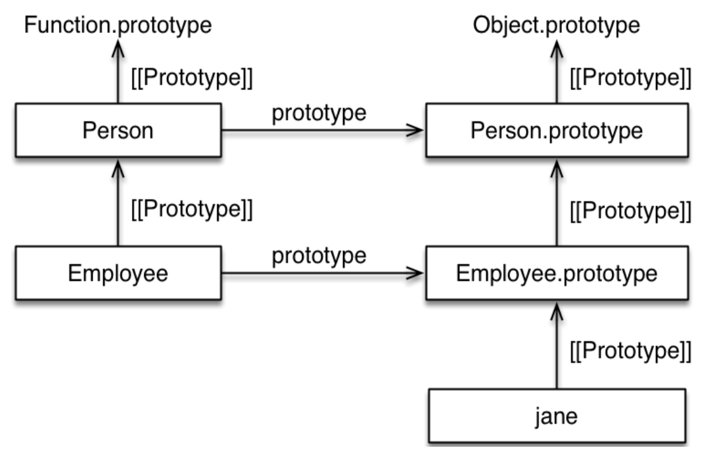
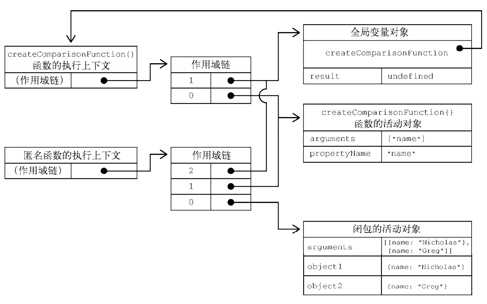

# JavaScript Basic Notes

## TC39

- [Technical Committees 39](https://www.ecma-international.org/technical-committees/tc39 'TC39')
- [New Feature Process](http://tc39.github.io/process-document)

JavaScript = ECMAScript + DOM + BOM:

- ECMAScript: ECMA-262.
- DOM: DOM Core + DOM HTML (`document`).
- BOM: Browser Object Model API (HTML5)
  (`window`/`navigator`/`location`/`screen`/`performance` etc).

## Primitive Values

Primitive data types:

- Null.
- Undefined.
- Boolean.
- Number.
- String.
- Symbol.
- BigInt.

### Undefined

- 对象属性未定义时, 该属性值为 `undefined`.
- 未初始化变量的初值为 `undefined` (表示等待被赋值).

### Null

当引用为空或引用对象不存在时, 值为 `null`.
`null` 值表示一个空对象指针.

:::danger Null

`typeof null` -> `object`.

:::

### Boolean

- 零值表达式:
  - `0`/`NaN`.
  - `''`.
  - `null`.
  - `undefined`.

### NaN

:::danger NaN

`NaN === NaN` -> `false`.

:::

```ts
const numberType = typeof NaN; // 'number'
Number.isNaN();
Number.isFinite();
```

```ts
function isNumber(value) {
  return typeof value === 'number' && Number.isFinite(value);
}
```

### Float

- 计算浮点数时, 应先计算整数, 再利用移位/乘法/除法转化为浮点数.
- 浮点值的精确度最高可达 17 位小数.

```ts
const a = (1 + 2) / 10; // a = 0.1 + 0.2;
```

### Number

- Binary: `0b10`/`0B10`.
- Octal: `0o23`/`0O23`.
- Hex: `0xFF`.
- `Number.isFinite()`.
- `Number.isNaN()`.
- `Number.isInteger()`.
- `Number.isSafeInteger()`.
- `Number.toFixed()`.
- `Number.toExponential()`.
- `Number.toPrecision()`.
- `Number.parseInt(string, radix)`.
- `Number.parseFloat(string)`.
- `Number.EPSILON`.
- `Number.MAX_SAFE_INTEGER`.
- `Number.MIN_SAFE_INTEGER`.
- `**` 指数运算符.
- BigInt.

```ts
const a = 2172141653;
const b = 15346349309;
const c1 = a * b;
// => 33334444555566670000
const c2 = BigInt(a) * BigInt(b);
// => 33334444555566667777n
```

#### Infinity

Infinity represents all values greater than 1.7976931348623157e+308.
Infinity will be converted to `null` with `JSON.stringify()`.

```ts
const largeNumber = 1.7976931348623157e308;
// eslint-disable-next-line @typescript-eslint/no-loss-of-precision
const largerNumber = 1.7976931348623157e309;

console.log(largeNumber); // 1.7976931348623157e+308
console.log(largerNumber); // Infinity
console.log(46 / 0); // Infinity
console.log(Number.POSITIVE_INFINITY); // Infinity
console.log(Number.MAX_VALUE); // Infinity
// eslint-disable-next-line @typescript-eslint/no-loss-of-precision
console.log(-1.7976931348623157e309); // -Infinity
console.log(-46 / 0); // -Infinity
console.log(Number.NEGATIVE_INFINITY); // -Infinity
console.log(Number.MIN_VALUE); // -Infinity

console.log(Math.max()); // -Infinity
console.log(Math.min()); // Infinity
```

### String

#### String Primitive Features

作为基本变量:

- `delete` 无法删除某位字符.

#### String Reference Features

- 赋值与传参: 传递 string 字符串常量的引用.
- 所有 string 字面量都是不可变量,
  当对 string 进行操作后, 将先会在堆区创建副本,
  再通过副本进行修改, 并返回副本的索引.
- `for...in`: 返回下标数字.
- `for...of`: 对字符串字符进行遍历.
- 没有被任何变量引用的 string: 垃圾回收.

```ts
const goodString = "I've been a good string";
console.log(typeof goodString); // string
console.log(goodString instanceof String); // false
console.log(Object.prototype.toString.call(goodString)); // [object String]

// eslint-disable-next-line no-new-wrappers
const badString = new String("I've been a naughty string");
console.log(typeof badString); // object
console.log(badString instanceof String); // true
console.log(Object.prototype.toString.call(badString)); // [object String]

const isPrimitiveString = value => typeof value === 'string';
console.log(isPrimitiveString(goodString)); // true
console.log(isPrimitiveString(badString)); // false

const isObjectWrappedString = value => value instanceof String;
console.log(isObjectWrappedString(goodString)); // false
console.log(isObjectWrappedString(badString)); // true

const isString = value => typeof value === 'string' || value instanceof String;
console.log(isString(goodString)); // true
console.log(isString(badString)); // true

const isStringAlternative = value =>
  Object.prototype.toString.call(badString) === '[object String]';
console.log(isStringAlternative(goodString)); // true
console.log(isStringAlternative(badString)); // true
```

#### String Unicode

```ts
// eslint-disable-next-line no-self-compare
const truthy = 'z' === 'z'; // true
// eslint-disable-next-line no-octal-escape
const truthy = '\172' === 'z'; // true
const truthy = '\x7A' === 'z'; // true
const truthy = '\u007A' === 'z'; // true
const truthy = '\u{7A}' === 'z'; // true
```

#### String Char Code

- `string.charAt(index)`.
- `string.charCodeAt(index)`.
- `string.fromCharCode(charCode)`.
- `string.codePointAt(index)`: 正确处理 4 字节存储字符.
- `string.fromCodePoint(codePoint)`: 正确处理 4 字节存储字符.

```ts
function is32Bit(c) {
  return c.codePointAt(0) > 0xffff;
}

const truthy = String.fromCodePoint(0x78, 0x1f680, 0x79) === 'x\uD83D\uDE80y';

const after = before.charAt(0).toUpperCase() + before.slice(1);
```

#### String Slice and Merge

- `string.slice()`.
- `string.substring()`.
- `string.substr()`.
- `string.split(separator)`: 选择割断符, 返回字符串数组.
- `Array<string>.join(separator)`: 将字符串数组连接成字符串.

```ts
const stringValue = 'hello world';
console.log(stringValue.slice(3)); // "lo world"
console.log(stringValue.substring(3)); // "lo world"
console.log(stringValue.substr(3)); // "lo world"
console.log(stringValue.slice(3, 8)); // "lo wo"
console.log(stringValue.substring(3, 8)); // "lo wo"
console.log(stringValue.substr(3, 8)); // "lo world"
console.log(stringValue.slice(-3)); // "rld"
console.log(stringValue.substring(-3)); // "hello world"
console.log(stringValue.substr(-3)); // "rld"
console.log(stringValue.slice(3, -4)); // "lo w"
console.log(stringValue.substring(3, -4)); // "hel"
console.log(stringValue.substr(3, -4)); // "" (empty string)
```

#### String Query

- `string.includes(substr)`.
- `string.startsWith(substr)`.
- `string.endsWith(substr)`.
- 使用第二个参数 n 时, endsWith 针对前 n 个字符, 其他两个方法针对从第 n 个位置直到字符串结束.

```ts
const s = 'Hello world!';

s.startsWith('world', 6); // true
s.endsWith('Hello', 5); // true
s.includes('Hello', 6); // false
```

#### String Replace

- `matchAll(regexp)`.
- `replaceAll`:
  - `replaceAll(regexp, newSubstr)`.
  - `replaceAll(regexp, replacerFunction)`.
  - `replaceAll(substr, newSubstr)`.
  - `replaceAll(substr, replacerFunction)`.

```ts
// eslint-disable-next-line prefer-regex-literals
const regexp = new RegExp('foo[a-z]*', 'g');
const str = 'table football, foosball';
const matches = str.matchAll(regexp);

for (const match of matches) {
  console.log(
    `Found ${match[0]} start=${match.index} end=${
      match.index + match[0].length
    }.`
  );
}
// expected output: "Found football start=6 end=14."
// expected output: "Found foosball start=16 end=24."

// matches iterator is exhausted after the for..of iteration
// Call matchAll again to create a new iterator
Array.from(str.matchAll(regexp), m => m[0]);
// Array [ "football", "foosball" ]
```

```ts
'aabbcc'.replaceAll('b', '.');
// => 'aa..cc'

'aabbcc'.replaceAll(/b/g, '.');
// => 'aa..cc'
```

#### String Pad

- `string.repeat(times)`.

```ts
'hello'.repeat(2); // "hellohello"
'na'.repeat(2.9); // "nana"

'na'.repeat(-0.9); // ""
'na'.repeat(-1); // RangeError

'na'.repeat(NaN); // ""
'na'.repeat(Infinity); // RangeError

'na'.repeat('na'); // ""
'na'.repeat('3'); // "nanana"
```

- `string.padStart(len, paddingStr)`.
- `string.padEnd(len, paddingStr)`.

```ts
'1'.padStart(10, '0'); // "0000000001"
'12'.padStart(10, '0'); // "0000000012"
'123456'.padStart(10, '0'); // "0000123456"

'12'.padStart(10, 'YYYY-MM-DD'); // "YYYY-MM-12"
'09-12'.padStart(10, 'YYYY-MM-DD'); // "YYYY-09-12"
```

#### String Trim

- `string.trimLeft()`/`string.trimStart()`: remove start whitespace.
- `string.trimRight()`/`string.trimEnd()`: remove end whitespace.

#### String Template Literals

`str` 表示模板字符串:

```ts
// 普通字符串
`In JavaScript '\n' is a line-feed.``\`Yo\` World!``In JavaScript this is // 多行字符串
 not legal.``${
  x // 引用变量
} + ${y * 2} = ${x + y * 2}``${obj.x + obj.y}``foo ${
  fn() // 调用函数
} bar`;
```

#### Tagged Templates Literals

```ts
const boldify = (parts, ...insertedParts) => {
  return parts
    .map((s, i) => {
      if (i === insertedParts.length) return s;
      return `${s}<strong>${insertedParts[i]}</strong>`;
    })
    .join('');
};

const name = 'Sabertaz';
console.log(boldify`Hi, my name is ${name}!`);
// => "Hi, my name is <strong>Sabertaz</strong>!"
```

```ts
function template(strings, ...keys) {
  return function (...values) {
    const dict = values[values.length - 1] || {};
    const result = [strings[0]];
    keys.forEach(function (key, i) {
      const value = Number.isInteger(key) ? values[key] : dict[key];
      result.push(value, strings[i + 1]);
    });
    return result.join('');
  };
}

const t1Closure = template`${0}${1}${0}!`;
t1Closure('Y', 'A'); // "YAY!"
const t2Closure = template`${0} ${'foo'}!`;
t2Closure('Hello', { foo: 'World' }); // "Hello World!"
```

编译模板 (小型模板引擎):

```ts
function compile(template) {
  const evalExpr = /<%=(.+?)%>/g;
  const expr = /<%([\s\S]+?)%>/g;

  template = template
    .replace(evalExpr, '`); \n  echo( $1 ); \n  echo(`')
    .replace(expr, '`); \n $1 \n  echo(`');

  template = `echo(\`${template}\`);`;

  const script = `(function parse(data){
      let output = "";

      function echo(html){
        output += html;
      }

      ${template}

      return output;
    })`;

  return script;
}

const template = `
<ul>
  <% for(let i=0; i < data.supplies.length; i++) { %>
    <li><%= data.supplies[i] %></li>
  <% } %>
</ul>
`;
const parse = compile(template);
div.innerHTML = parse({ supplies: ['broom', 'mop', 'cleaner'] });
// => <ul>
// =>   <li>broom</li>
// =>   <li>mop</li>
// =>   <li>cleaner</li>
// => </ul>

// 下面的hashTemplate函数
// 是一个自定义的模板处理函数
const libraryHtml = hashTemplate`
  <ul>
    #for book in ${myBooks}
      <li><i>#{book.title}</i> by #{book.author}</li>
    #end
  </ul>
`;
```

国际化处理:

```ts
i18n`Welcome to ${siteName}, you are visitor number ${visitorNumber}!`;
// "欢迎访问xxx, 您是第xxxx位访问者！"
```

XSS protection:

```ts
const message = SaferHTML`<p>${sender} has sent you a message.</p>`;

function SaferHTML(templateString, ...expressions) {
  let s = templateString[0];

  for (let i = 0; i < expressions.length; i++) {
    const expression = String(expressions[i]);

    // Escape special characters in the substitution.
    s += expression
      .replace(/&/g, '&amp;')
      .replace(/</g, '&lt;')
      .replace(/>/g, '&gt;');

    // Don't escape special characters in the template.
    s += templateString[i + 1];
  }

  return s;
}
```

运行代码:

```ts
jsx`
  <div>
    <input
      ref='input'
      onChange='${this.handleChange}'
      defaultValue='${this.state.value}' />
      ${this.state.value}
   </div>
`;

java`
class HelloWorldApp {
  public static void main(String[] args) {
    System.out.println("Hello World!"); // Display the string.
  }
}
`;
HelloWorldApp.main();
```

#### Raw String

```ts
console.log(`\u00A9`); // ©
console.log(String.raw`\u00A9`); // \u00A9
```

```ts
console.log(`first line\nsecond line`);
// first line
// second line
console.log(String.raw`first line\nsecond line`);
// "first line\nsecond line"
```

```ts
function printRaw(strings) {
  console.log('Actual characters:');

  for (const string of strings) {
    console.log(string);
  }

  console.log('Escaped characters;');

  for (const rawString of strings.raw) {
    console.log(rawString);
  }
}

printRaw`\u00A9${'and'}\n`;
// Actual characters:
// ©
// (换行符)
// Escaped characters:
// \u00A9
// \n
```

### Symbol

- A Symbol is a **unique** and **immutable** primitive value
  and may be used as the key of an Object property.
- Symbols don't auto-convert to strings and can't convert to numbers.
- `Symbol.for(key)` create global Symbol registry.

```ts
// eslint-disable-next-line symbol-description
const genericSymbol = Symbol();
// eslint-disable-next-line symbol-description
const otherGenericSymbol = Symbol();
console.log(genericSymbol === otherGenericSymbol); // false

const fooSymbol = Symbol('foo');
const otherFooSymbol = Symbol('foo');
console.log(fooSymbol === otherFooSymbol); // false

const fooGlobalSymbol = Symbol.for('foobar'); // 创建新符号
const otherFooGlobalSymbol = Symbol.for('foobar'); // 重用已有符号
console.log(fooGlobalSymbol === otherFooGlobalSymbol); // true
```

| To      | Explicit Conversion     | Coercion (Implicit Conversion) |
| ------- | ----------------------- | ------------------------------ |
| boolean | Boolean(sym) → OK       | `!sym` → OK                    |
| number  | Number(sym) → TypeError | `sym * 2` → TypeError          |
| string  | String(sym) → OK        | `'' + sym` → TypeError         |
|         | sym.toString() → OK     | `${sym}` → TypeError           |
| object  | Object(sym) → OK        | Object.keys(sym) → OK          |

#### Built-in Symbol Methods

[Symbol methods](https://developer.mozilla.org/en-US/docs/Web/JavaScript/Reference/Global_Objects/Symbol#static_properties):

- `[Symbol.iterator]()`: `for of`.
- `[Symbol.asyncIterator]()`: `for await of`.
- `[Symbol.match/replace/search/split](target)`: `string.match/replace/search/split(classWithSymbolFunction)`.
- `[Symbol.hasInstance](instance)`: `instance of`.
- `[Symbol.species]()`: constructor for making derived objects.
- `[Symbol.toPrimitive](hint)`: 强制类型转换.
- `[Symbol.toStringTag]()`: string used by `Object.prototype.toString()`.

`iterator`:

```ts
const arr = ['a', 'b', 'c'];
const iter = arr[Symbol.iterator]();

iter.next(); // { value: 'a', done: false }
iter.next(); // { value: 'b', done: false }
iter.next(); // { value: 'c', done: false }
iter.next(); // { value: undefined, done: true }
```

`hasInstance`:

```ts
class Bar {}
class Baz extends Bar {
  static [Symbol.hasInstance](instance) {
    return false;
  }
}

const b = new Baz();

console.log(Bar[Symbol.hasInstance](b)); // true
console.log(b instanceof Bar); // true
console.log(Baz[Symbol.hasInstance](b)); // false
console.log(b instanceof Baz); // false

const ReferenceType = {
  [Symbol.hasInstance](value) {
    return (
      value !== null &&
      (typeof value === 'object' || typeof value === 'function')
    );
  },
};

const obj1 = {};
console.log(obj1 instanceof Object); // true
console.log(obj1 instanceof ReferenceType); // true

const obj2 = Object.create(null);
console.log(obj2 instanceof Object); // false
console.log(obj2 instanceof ReferenceType); // true
```

`species`:

```ts
class MyClass {
  static get [Symbol.species]() {
    return this;
  }

  constructor(value) {
    this.value = value;
  }

  clone() {
    return new this.constructor[Symbol.species](this.value);
  }
}

class MyDerivedClass1 extends MyClass {
  // empty
}

class MyDerivedClass2 extends MyClass {
  static get [Symbol.species]() {
    return MyClass;
  }
}

const instance1 = new MyDerivedClass1('foo');
const instance2 = new MyDerivedClass2('bar');
const clone1 = instance1.clone();
const clone2 = instance2.clone();

console.log(clone1 instanceof MyClass); // true
console.log(clone1 instanceof MyDerivedClass1); // true
console.log(clone2 instanceof MyClass); // true
console.log(clone2 instanceof MyDerivedClass2); // false
```

`toPrimitive`:

```ts
class Temperature {
  constructor(degrees) {
    this.degrees = degrees;
  }

  [Symbol.toPrimitive](hint) {
    switch (hint) {
      case 'string':
        return `${this.degrees}\u00B0`; // degrees symbol
      case 'number':
        return this.degrees;
      case 'default':
        return `${this.degrees} degrees`;
    }
  }
}

const freezing = new Temperature(32);

console.log(`${freezing}!`); // "32 degrees!"
console.log(freezing / 2); // 16
console.log(String(freezing)); // "32째"
```

`toStringTag`:

```ts
class Person {
  constructor(name) {
    this.name = name;
  }

  get [Symbol.toStringTag]() {
    return 'Person';
  }
}

const me = new Person('Me');

console.log(me.toString()); // "[object Person]"
console.log(Object.prototype.toString.call(me)); // "[object Person]"
```

| Value                     | toString tag |
| ------------------------- | ------------ |
| undefined                 | `Undefined`  |
| null                      | `Null`       |
| Array object              | `Array`      |
| string object             | `String`     |
| arguments                 | `Arguments`  |
| callable                  | `Function`   |
| error object              | `Error`      |
| boolean object            | `Boolean`    |
| number object             | `Number`     |
| date object               | `Date`       |
| regular expression object | `RegExp`     |
| (Otherwise)               | `Object`     |

### Wrapper Objects for Primitives

Using the wrapper function without the new keyword
is a useful way of coercing a value into a primitive type.

```ts
// Not recommended (primitive object wrapper):
// eslint-disable-next-line no-new-wrappers
const objectType = typeof new String(37); // object

// Safe (type coercion with wrapper function):
const stringType = typeof String(37); // string

// Primitive strings:
// eslint-disable-next-line no-self-compare
const truthy = '37' === '37'; // true

// Object-wrapped string:
// eslint-disable-next-line no-new-wrappers
const falsy = new String(37) === '37'; // false

// Type-coerced string:
const truthy = String(37) === '37'; // true

// BAD!
// eslint-disable-next-line no-new-wrappers
const falseObject = new Boolean(false);
const result = falseObject && true;
console.log(result); // true
console.log(typeof falseObject); // object
console.log(falseObject instanceof Boolean); // true
```

**Box and Unbox** for primitive values:

- 自动创建的原始值包装对象可以让原始值拥有对象的行为.
- 自动创建的原始值包装对象只存在于访问它的那行代码执行期间.
- 常数值**加括号**可转化为对象.
- 可以对 primitive values 进行 ES6 解构语法.

```ts
const s1 = 'some text';
const s2 = s1.substring(2); // Call method on primitive string.
// let _s1 = new String(s1);
// const s2 = _s1.substring(2);
// _s1 = null;

const s3 = 'some text';
s3.color = 'red';
console.log(s3.color); // undefined
```

```ts
// primitive string
const greet = 'Hello there';
// primitive is converted to an object
// in order to use the split() method
const hello = greet.split(' ')[0]; // "Hello"
// attempting to augment a primitive is not an error
greet.smile = true;
// but it doesn't actually work
const undef = typeof greet.smile; // "undefined"
```

不使用 new 关键字,包装类构造函数返回值为基本类型

```ts
const numberType = typeof Number(1); // "number"
const numberType = typeof Number('1'); // "number"
// eslint-disable-next-line no-new-wrappers
const numberType = typeof Number(new Number()); // "number"
const stringType = typeof String(1); // "string"
const booleanType = typeof Boolean(1); // "boolean"
```

## Reference Values

- Object e.g Date, RegExp.
- Array.
- Function.
- Map.
- Set.
- WeakMap.
- WeakSet.

### Array

- 与 Object 同源.
- 关联数组: `arrayName["string"] = value;` 实际为 Array 对象添加属性`{string:value}`.
- 缓存数组长度:`int l = list.length`(访问`length`造成运算).
- `[]`数组, `{}`对象.
- 数组在数值运算环境中转化为 0 (空数组)/ num (单一元素数组)/NaN (多元素数组/NaN 数组).

```ts
const array = [...Array(5).keys()]; // => [0, 1, 2, 3, 4]
```

#### Array Length

- 数组下标满足 [0, 2^32-1) 即可
- 运用大于 length 的下标, length 自动增大, 不会发生数组边界错误
- length 等于 数组最后一个整数属性名+1, length 不一定等于 数组中有效元素个数

#### Array Literals

不使用构造函数,使用数组字面量创建数组

```ts
const arr1 = new Array(3); // 数组长度
const arr2 = new Array(3.14); // RangeError
```

```ts
if (typeof Array.isArray === 'undefined') {
  Array.isArray = function (arg) {
    // 其余对象返回值 [object Object/Number/String/Boolean]
    return Object.prototype.toString.call(arg) === '[object Array]';
  };
}
```

#### Array Of

```ts
Array.of(1); // [1]
Array.of(1, 2, 3); // [1, 2, 3]
Array.of(undefined); // [undefined]
```

#### Array From

强大的**函数式**方法:

- 伪数组对象 (Array-like object).
- 可枚举对象 (Iterable object).
- 克隆数组.
- `map` 函数.

```ts
// Set
// Map

// NodeList 对象
const ps = document.querySelectorAll('p');
Array.from(ps).forEach(function (p) {
  console.log(p);
});

// arguments 对象
function foo() {
  // eslint-disable-next-line prefer-rest-params
  const args = Array.from(arguments);
  // ...
}

Array.from('hello');
// => ['h', 'e', 'l', 'l', 'o']

const namesSet = new Set(['a', 'b']);
Array.from(namesSet); // ['a', 'b']

// 克隆数组
Array.from([1, 2, 3]);
// => [1, 2, 3]

Array.from(arrayLike, x => x * x);
// =>
Array.from(arrayLike).map(x => x * x);

Array.from([1, 2, 3], x => x * x);
// [1, 4, 9]

// random array generation
Array.from(Array(5).keys());
// [0, 1, 2, 3, 4]
```

#### Array Fill

```ts
const numbers = [1, 2, 3, 4];
numbers.fill(1, 2);
console.log(numbers.toString()); // 1, 2, 1, 1
numbers.fill(0, 1, 3);
console.log(numbers.toString()); // 1, 0, 0, 1
numbers.fill(1);
console.log(numbers.toString()); // 1, 1, 1, 1
```

#### Array CopyWithin

`copyWithin(dest, start, end)`, 替换数组元素, **修改原数组**:

```ts
[1, 2, 3, 4, 5].copyWithin(0, 3);
// => [4, 5, 3, 4, 5]
[1, 2, 3, 4, 5].copyWithin(0, -2, -1);
// -2相当于3号位, -1相当于4号位
// => [4, 2, 3, 4, 5]

// 将2号位到数组结束, 复制到0号位
const i32a = new Int32Array([1, 2, 3, 4, 5]);
i32a.copyWithin(0, 2);
// => Int32Array [3, 4, 5, 4, 5]
```

#### Array Stack

```ts
arr.unshift(value); // 添加数组首元素
arr.push(value); // 添加数组尾元素
arr.shift(); // 删除数组首元素
arr.pop(); // 删除数组尾元素
```

#### Array Slice and Merge

- slice 不改变原数组, splice 改变原数组.

```ts
[].slice(start, end); // [start] - [end - 1]
[].splice(startIndex, lengthToDelete, insertElements); // 功能强大的多态方法
[].concat(otherArray);
[].join(separator);
```

#### Array Replace

```ts
[].replace(oldSubStr, newStr);
```

#### Array Query

```ts
[].indexOf(element); // -1 or other.
[].lastIndexOf(element); // -1 or other.
[].includes(element); // boolean.
[].find(callback); // element.
[].findIndex(callback); // element index.
```

#### Array Find

```ts
arr.find(fn);
arr.findIndex(fn);
```

#### Array Includes

No more `indexOf() > -1`.

#### Array Flat

`[2, [2, 2]] => [2, 2, 2]`

#### Array Element Filter

相当于 Haskell 中的 List Filter:

```ts
const numbers = [1, 2, 3, 4, 5, 4, 3, 2, 1];
const filterResult = numbers.filter((item, index, array) => item > 2);
console.log(filterResult); // 3,4,5,4,3
```

#### Array Boolean Filter

- `Array.every(filer)`.
- `Array.some(filer)`.

```ts
const numbers = [1, 2, 3, 4, 5, 4, 3, 2, 1];
const everyResult = numbers.every((item, index, array) => item > 2);
const someResult = numbers.some((item, index, array) => item > 2);
console.log(everyResult); // false
console.log(someResult); // true
```

#### Array Map

相当于 Haskell 中的 List Map:

```ts
[].map(item => item + 1); // map over
```

#### Array FlatMap

map + flat.

#### Array Reduce

相当于 Haskell 中的 fold:

```ts
[].reduce(
  (previous, current, currentIndex, arr) => current + previous,
  initial
); // fold function
```

#### Array Traverse

```ts
array.forEach(val => {}); // 遍历数组所有元素.
```

#### Array Sort

`toExchange`:

- `return 1`: a, b 交换位置.
- `return -1`: a, b 不交换位置.

```ts
arr.sort(toExchange);
strings.sort((a, b) => a.localeCompare(b));
strings.sort((a, b) => new Intl.Collator('en').compare(a, b));
```

#### Array Reverse

```ts
[].reverse();
```

```ts
// Tips
// 反转字符串
const reverseStr = normalizedStr.split('').reverse().join('');
```

#### Array Deep Clone

```ts
const nestedArray = [1, [2], 3];
const arrayCopy = JSON.parse(JSON.stringify(nestedArray));

// Make some changes
arrayCopy[0] = '1'; // change shallow element
arrayCopy[1][0] = '3'; // change nested element
console.log(arrayCopy); // [ '1', [ '3' ], 3 ]

// Good: Nested array NOT affected
console.log(nestedArray); //  1, [ 2 ], 3 ]
```

#### Array Spread

```ts
arr2.push(...arr1);
```

```ts
const obj = { x: 1, y: 2, z: 3 };

obj[Symbol.iterator] = function* () {
  yield 1;
  yield 2;
  yield 3;
};

const array = [...obj]; // print [1, 2, 3]
```

#### Typed Array

`Typed Array` 是 `ArrayBuffer` (用于 Web GL 高效率内存操作) 其中一种视图:

- File API.
- XMLHttpRequest.
- Fetch API.
- Canvas.
- WebSockets.

```ts
// 第一个参数是应该返回的数组类型
// 其余参数是应该拼接在一起的定型数组
function typedArrayConcat(TypedArrayConstructor, ...typedArrays) {
  // 计算所有数组中包含的元素总数
  const numElements = typedArrays.reduce((x, y) => (x.length || x) + y.length);
  // 按照提供的类型创建一个数组, 为所有元素留出空间
  const resultArray = new TypedArrayConstructor(numElements);
  // 依次转移数组
  let currentOffset = 0;
  typedArrays.forEach(x => {
    resultArray.set(x, currentOffset);
    currentOffset += x.length;
  });
  return resultArray;
}

const concatArray = typedArrayConcat(
  Int32Array,
  Int8Array.of(1, 2, 3),
  Int16Array.of(4, 5, 6),
  Float32Array.of(7, 8, 9)
);

console.log(concatArray); // [1, 2, 3, 4, 5, 6, 7, 8, 9]
console.log(concatArray instanceof Int32Array); // true
```

```ts
const view = new Int16Array([25, 50]);
console.log(view instanceof Int16Array); // true
console.log(view instanceof Array); // false
console.log(Array.isArray(view)); // false
```

### Date

- [Definitive Guide](https://css-tricks.com/everything-you-need-to-know-about-date-in-javascript)

```ts
const now = new Date();
now.getFullYear(); // 1-n
now.getMonth(); // Warn: 0-11
now.getDate(); // 1-n
now.getDay(); // Warn: 0-6
now.toString();
now.toDateString();
now.toTimeString();
now.toUTCString();
now.toLocaleString();
now.toLocaleDateString();
now.toLocaleTimeString();

const daysOfMonth = (year, month) => {
  // `0` for last month of next month
  return new Date(year, month + 1, 0).getDate();
};

const prevYear = year => {
  return new Date(year - 1, 0).getFullYear();
};

const nextYear = year => {
  return new Date(year + 1, 0).getFullYear();
};

const prevMonth = (year, month) => {
  return new Date(year, month - 1).getMonth();
};

const nextMonth = (year, month) => {
  return new Date(year, month + 1).getMonth();
};
```

```ts
const getDateItemList = (year, month) => {
  const days = daysOfMonth(year, month);
  const currentDateItemList = [...Array(days).keys()].map(index => {
    return DateItem(year, month, 1 + index);
  });

  const firstDayItem = DateItem(year, month, 1);
  const firstDayWeekday = firstDayItem.day;
  const lastMonthDays = daysOfMonth(year, month - 1);
  const prefixDays = firstDayWeekday === 0 ? 7 : firstDayWeekday;
  const prefixFirstDay = lastMonthDays - prefixDays + 1;
  const prefixYear = prevYear(year);
  const prefixMonth = prevMonth(year, month);
  const prefixDateItemList = [...Array(prefixDays).keys()].map(index => {
    return DateItem(prefixYear, prefixMonth, prefixFirstDay + index);
  });

  const lastDayItem = DateItem(year, month, days);
  const lastDayWeekday = lastDayItem.day;
  const suffixDays = lastDayWeekday === 6 ? 7 : 6 - lastDayWeekday;
  const suffixYear = nextYear(year);
  const suffixMonth = nextMonth(year, month);
  const suffixDateItemList = [...Array(suffixDays).keys()].map(index => {
    return DateItem(suffixYear, suffixMonth, 1 + index);
  });

  const dateItemList = [
    ...prefixDateItemList,
    ...currentDateItemList,
    ...suffixDateItemList,
  ];

  return dateItemList;
};
```

### Map

- `size`.
- `has()`.
- `get()`.
- `set()`.
- `delete()`.
- `clear()`.
- `keys()`.
- `values()`.
- `entries()`.

```ts
const map = new Map([
  // You define a map via an array of 2-element arrays. The first
  // element of each nested array is the key, and the 2nd is the value
  ['name', 'Jean-Luc Picard'],
  ['age', 59],
  ['rank', 'Captain'],
]);

// To get the value associated with a given `key` in a map, you
// need to call `map.get(key)`. Using `map.key` will **not** work.
map.get('name'); // 'Jean-Luc Picard'
```

```ts
const map = new Map([]);

// eslint-disable-next-line no-new-wrappers
const n1 = new Number(5);
// eslint-disable-next-line no-new-wrappers
const n2 = new Number(5);

map.set(n1, 'One');
map.set(n2, 'Two');

// `n1` and `n2` are objects, so `n1 !== n2`. That means the map has
// separate keys for `n1` and `n2`.
map.get(n1); // 'One'
map.get(n2); // 'Two'
map.get(5); // undefined

// If you were to do this with an object, `n2` would overwrite `n1`
const obj = {};
obj[n1] = 'One';
obj[n2] = 'Two';

const two1 = obj[n1]; // 'Two'
const two2 = obj[5]; // 'Two'
```

```ts
const objectClone = new Map(Object.entries(object));
const arrayClone = new Map(Array.from(map.entries));
const map = new Map([
  ['name', 'Jean-Luc Picard'],
  ['age', 59],
  ['rank', 'Captain'],
]);

// The `for/of` loop can loop through iterators
for (const key of map.keys()) {
  console.log(key); // 'name', 'age', 'rank'
}

for (const value of map.values()) {
  console.log(value); // 'Jean-Luc Picard', 59, 'Captain'
}

for (const [key, value] of map.entries()) {
  console.log(key); // 'name', 'age', 'rank'
  console.log(value); // 'Jean-Luc Picard', 59, 'Captain'
}
```

### Set

- `size`.
- `has()`.
- `add()`.
- `delete()`.
- `clear()`.
- `keys()`.
- `values()`.
- `entries()`.

```ts
class XSet extends Set {
  union(...sets) {
    return XSet.union(this, ...sets);
  }

  intersection(...sets) {
    return XSet.intersection(this, ...sets);
  }

  difference(set) {
    return XSet.difference(this, set);
  }

  symmetricDifference(set) {
    return XSet.symmetricDifference(this, set);
  }

  cartesianProduct(set) {
    return XSet.cartesianProduct(this, set);
  }

  powerSet() {
    return XSet.powerSet(this);
  }

  // 返回两个或更多集合的并集
  // new Set([...setA, ...setB]);
  static union(a, ...bSets) {
    const unionSet = new XSet(a);

    for (const b of bSets) {
      for (const bValue of b) {
        unionSet.add(bValue);
      }
    }

    return unionSet;
  }

  // 返回两个或更多集合的交集
  // new Set([...setA].filter(x => setB.has(x)))
  static intersection(a, ...bSets) {
    const intersectionSet = new XSet(a);

    for (const aValue of intersectionSet) {
      for (const b of bSets) {
        if (!b.has(aValue)) {
          intersectionSet.delete(aValue);
        }
      }
    }

    return intersectionSet;
  }

  // 返回两个集合的差集
  // new Set([...setA].filter(x => !setB.has(x)))
  static difference(a, b) {
    const differenceSet = new XSet(a);

    for (const bValue of b) {
      if (a.has(bValue)) {
        differenceSet.delete(bValue);
      }
    }

    return differenceSet;
  }

  // 返回两个集合的对称差集
  static symmetricDifference(a, b) {
    // 按照定义, 对称差集可以表达为:
    return a.union(b).difference(a.intersection(b));
  }

  // 返回两个集合 (数组对形式) 的笛卡儿积
  // 必须返回数组集合, 因为笛卡儿积可能包含相同值的对
  static cartesianProduct(a, b) {
    const cartesianProductSet = new XSet();

    for (const aValue of a) {
      for (const bValue of b) {
        cartesianProductSet.add([aValue, bValue]);
      }
    }

    return cartesianProductSet;
  }

  // 返回一个集合的幂集
  static powerSet(a) {
    const powerSet = new XSet().add(new XSet());

    for (const aValue of a) {
      for (const set of new XSet(powerSet)) {
        powerSet.add(new XSet(set).add(aValue));
      }
    }

    return powerSet;
  }
}
```

### WeakMap and WeakSet

WeakMap 结构与 Map 结构基本类似,
唯一的区别就是 WeakMap 只接受**非 null 对象**作为键名:

- 弱键: 键名构建的引用**无法阻止对象执行垃圾回收**.
- 不可迭代键: 键/值随时可能被垃圾回收, 无需提供迭代能力, 无 `clear()` 方法.

它的键所对应的对象可能会在将来消失.
一个对应 DOM 元素的 WeakMap 结构,
当某个 DOM 元素被清除,
其所对应的 WeakMap 记录就会自动被移除.

有时候我们会把对象作为一个对象的键用来存放属性值,
普通集合类型比如简单对象 (Object/Map/Set) 会阻止垃圾回收器对这些作为属性键存在的对象的回收,
有造成内存泄漏的危险,
WeakMap/WeakSet 则更加**内存安全**:

- Caching computed results.
- Managing listeners.
- Keeping private data.

## Variable Hoisting

- 一方面规定, `var`/`function` 声明的全局变量,
  依旧是全局对象的属性, 意味着会`Hoisting`.
- 另一方面规定, `let`/`const`/`class` 声明的全局变量,
  不属于全局对象的属性, 意味着不会`Hoisting`.
- `var` 只有函数作用域, `let`/`const` 拥有块级作用域.
- `var` 表达式和 `function` 声明都将会被提升到当前作用域 (**全局作用域/函数作用域**) 顶部,
  其余表达式顺序不变.

|            | Hoisting           | Scope         | Creates global properties |
| ---------- | ------------------ | ------------- | ------------------------- |
| `var`      | Declaration        | Function      | Yes                       |
| `let`      | Temporal dead zone | Block         | No                        |
| `const`    | Temporal dead zone | Block         | No                        |
| `function` | Complete           | Block         | Yes                       |
| `class`    | No                 | Block         | No                        |
| `import`   | Complete           | Module-global | No                        |

<!-- eslint-disable vars-on-top -->
<!-- eslint-disable no-var -->

```ts
// 我们知道这个行不通 (假设没有未定义的全局变量)
function example() {
  console.log(notDefined); // => throws a ReferenceError
}

// 在引用变量后创建变量声明将会因变量提升而起作用.
// 注意: 真正的值 `true` 不会被提升.
function example() {
  console.log(declaredButNotAssigned); // => undefined
  var declaredButNotAssigned = true;
}

// 解释器将变量提升到函数的顶部
// 这意味着我们可以将上边的例子重写为:
function example() {
  let declaredButNotAssigned;
  console.log(declaredButNotAssigned); // => undefined
  declaredButNotAssigned = true;
}

// 使用 const 和 let
function example() {
  console.log(declaredButNotAssigned); // => throws a ReferenceError
  console.log(typeof declaredButNotAssigned); // => throws a ReferenceError
  const declaredButNotAssigned = true;
}
```

<!-- eslint-enable vars-on-top -->
<!-- eslint-enable no-var -->
<!-- eslint-disable vars-on-top -->
<!-- eslint-disable no-var -->

```ts
function example() {
  console.log(named); // => undefined

  named(); // => TypeError named is not a function

  superPower(); // => ReferenceError superPower is not defined

  var named = function superPower() {
    console.log('Flying');
  };
}
```

<!-- eslint-enable vars-on-top -->
<!-- eslint-enable no-var -->

### Let Variable

- 块级作用域内定义的变量/函数, 在块级作用域外 ReferenceError.
- 不存在变量提升, 导致暂时性死区 (Temporal Dead Zone).
- `let` variable in `for-loop` closure,
  every closure for each loop
  binds the block-scoped variable.

```ts
const a = 1;

b = 3; // temporal dead zone: throw reference error

let b = 2;
```

`let` 变量拥有块级作用域 (每个 `setTimeout` 引用的都是不同的变量实例):

```ts
// for (var i = 0; i < 5; ++i) {
//   setTimeout(() => console.log(i), 0);
// }
// Output 5, 5, 5, 5, 5.
// 所有的 i 都是同一个变量, 输出同一个最终值.

for (let i = 0; i < 5; ++i) {
  setTimeout(() => console.log(i), 0);
}
// Output: 0, 1, 2, 3, 4.
// JavaScript 引擎会为每个迭代循环声明一个新的迭代变量.
// 每个 setTimeout 引用的都是不同的变量实例.
```

### Const Variable

- const 一旦声明变量, 就必须立即初始化, 不能留到以后赋值.
- 引用一个`Reference`变量时, 只表示此变量地址不可变, 但所引用变量的值/属性可变
  (`xxx *const`, 即`const`指针, 指向一个变量).
- 块级作用域.
- 不存在变量提升, 导致暂时性死区 (Temporal Dead Zone).

## Type Detection and Conversion

### Type Detection

```ts
function typeOf(o) {
  const _toString = Object.prototype.toString;
  const _type = {
    undefined: 'undefined',
    number: 'number',
    boolean: 'boolean',
    string: 'string',
    '[object Function]': 'function',
    '[object Array]': 'array',
    '[object Date]': 'date',
    '[object RegExp]': 'regexp',
    '[object Error]': 'error',
    '[object JSON]': 'json',
  };

  return _type[typeof o] || _type[_toString.call(o)] || (o ? 'object' : 'null');
}
```

#### Null Detection

不应使用 typeof 检测 null, 应使用 `===`/`!==`.

```ts
/*
 * ECMAScript 标准的重大 bug
 */
const objectType = typeof null; // => object
```

#### Custom Object Detection

- `object instanceof Constructor`:
  查找原型链 `构造器`**原型对象** (`Constructor.prototype`).
- `prop in object`: 查找原型链属性名.

#### Property Detection

- 由于属性值可能为零值值表达式, 不应使用零值表达式(`0`/`NaN`/`''`/`null`/`undefined`) 检测属性值.
- 应使用 `for in` 进行属性检测.

### Type Conversion

- 字符串 -> 整数: `+string`/`Number(string)`/`parseInt(string, arg1)`.
- any -> `bool`: `!!any`.
- const -> `object`: `(const)`.
- `parseInt(str, base)`:
  - 遇到非数字字符立即停止运行, 返回当前转化值.
  - 将 0 开头字符串解析为八进制数, 0x 开头字符串解析为十六进制数.
- `boolean`在`数值运算`环境中 true => 1, false => 0.
- `数组`在`数值运算`环境中转化为 0(空数组)/num(单一元素数组)/NaN(多元素数组/NaN 数组).
- `对象`在`逻辑运算`环境中转化为 true , 包括 false 的封装对象.
- `对象`在`数值运算`环境中先利用 valueOf(object), 再利用 toString() 转化为数字, 若转化失败, 则返回 NaN.
- `对象`与`数值`加号运算: 先数值加, (**失败后**)再字符串加.

```ts
// good
const totalScore = String(this.reviewScore);

// good
const val = Number(inputValue);

// good
const val = parseInt(inputValue, 10);

// good
const hasAge = Boolean(age);

// best
const hasAge = !!age;
```

#### Object Conversion

对象转换为布尔值:

- 直接转换为 true (包装类型也一样), 不调用 valueOf 和 toString.

对象转换为数字:

- 如果对象具有 valueOf 方法且返回原始值(string/number/boolean/undefined/null),
  则将该原始值转换为数字(转换失败会返回 NaN), 并返回这个数字.
- 如果对象具有 toString 方法且返回原始值(string/number/boolean/undefined/null),
  则将该原始值转换为数字(转换失败会返回 NaN), 并返回这个数字.
- 转换失败, 抛出 `TypeError`.

对象转换为字符串:

- 如果对象具有 toString 方法且返回原始值(string/number/boolean/undefined/null),
  则将该原始值转换为字符串, 并返回该字符串.
- 如果对象具有 valueOf 方法且返回原始值(string/number/boolean/undefined/null),
  则将该原始值转换为字符串, 并返回该字符串.
- 转换失败, 抛出 `TypeError`.

```ts
// 保存原始的valueOf
const valueOf = Object.prototype.valueOf;
const toString = Object.prototype.toString;

// 添加valueOf日志
// eslint-disable-next-line no-extend-native
Object.prototype.valueOf = function () {
  console.log('valueOf');
  return valueOf.call(this);
};
// 添加toString日志
// eslint-disable-next-line no-extend-native
Object.prototype.toString = function () {
  console.log('toString');
  return toString.call(this);
};
const a = {};
// eslint-disable-next-line no-new-wrappers
const b = new Boolean(false);

if (a) {
  console.log(1);
}

if (b) {
  console.log(2);
}

// output:
// 1
// 2
// 未调用valueOf和toString, 符合 [对象到布尔值] 的转换规则
```

```ts
// 保存原始的valueOf
const valueOf = Object.prototype.valueOf;
const toString = Object.prototype.toString;

// 添加valueOf日志
// eslint-disable-next-line no-extend-native
Object.prototype.valueOf = function () {
  console.log('valueOf');
  return valueOf.call(this);
};
// 添加toString日志
// eslint-disable-next-line no-extend-native
Object.prototype.toString = function () {
  console.log('toString');
  return toString.call(this);
};

let a = {};
console.log(++a);

// output:
// valueOf
// toString
// NaN
// 1. valueOf方法返回的是对象本身, 不是原始值, 继续执行
// 2. toString方法返回的是”[object Object]”, 是原始值(字符串), 将字符串转换为数字NaN
```

```ts
// 保存原始的valueOf
const valueOf = Object.prototype.valueOf;
const toString = Object.prototype.toString;

// 添加valueOf日志
// eslint-disable-next-line no-extend-native
Object.prototype.valueOf = function () {
  console.log('valueOf');
  return '1'; // 强制返回原始值
};
// 添加toString日志
// eslint-disable-next-line no-extend-native
Object.prototype.toString = function () {
  console.log('toString');
  return toString.call(this);
};

let a = {};
console.log(++a);

// output:
// valueOf
// 2
// valueOf 返回原始值(字符串), 直接将该字符串转换为数字, 得到 1
```

```ts
// 保存原始的valueOf
const valueOf = Object.prototype.valueOf;
const toString = Object.prototype.toString;

// 添加valueOf日志
// eslint-disable-next-line no-extend-native
Object.prototype.valueOf = function () {
  console.log('valueOf');
  return valueOf.call(this);
};
// 添加toString日志
// eslint-disable-next-line no-extend-native
Object.prototype.toString = function () {
  console.log('toString');
  return toString.call(this);
};

const a = {};
alert(a);

// output:
// toString
// 弹出 "[object Object]"
// 调用toString方法, 返回了字符串”[object Object]”, 对象最终转换为该字符串
```

```ts
// 保存原始的valueOf
const valueOf = Object.prototype.valueOf;
const toString = Object.prototype.toString;

// 添加valueOf日志
// eslint-disable-next-line no-extend-native
Object.prototype.valueOf = function () {
  console.log('valueOf');
  return valueOf.call(this);
};
// 添加toString日志
// eslint-disable-next-line no-extend-native
Object.prototype.toString = function () {
  console.log('toString');
  return this;
};

const a = {};
alert(a);

// output:
// toString
// valueOf
// Uncaught TypeError: Cannot convert object to primitive value
// 调用toString方法, 返回的不是 primitive value, 继续执行
// 调用valueOf方法, 返回的不是 primitive value, 继续执行
// 抛出 TypeError
```

## Operators

### Loose Comparison

`==` 与 `!=`, [JS Loose Comparison](https://felix-kling.de/js-loose-comparison):

- Type conversion first, then comparison.
- Return comparison between `ToNumber(x)` and `ToPrimitive(y)`.

### Strict Comparison

`===` 与 `!==`:

- Strings: same length, same characters in corresponding positions.
- Numbers: numerically equal.
- Objects: refer to same Object.
- Positive and negative `0` are equal to one another.
- `NaN` is not equal to anything, including `NaN`.
- `null` and `undefined` types are not equal with `===`, but equal with `==`.

<!-- eslint-disable eqeqeq -->

```ts
const true1 = 0 == false; // true
const false1 = 0 === false; // false
const true2 = 1 == '1'; // true
const false2 = 1 === '1'; // false
const true3 = undefined == null; // true
const false3 = undefined === null; // false
const true4 = '0' == false; // true
const false4 = '0' === false; // false
// eslint-disable-next-line no-self-compare
const false5 = [] == []; // false, refer different objects in memory
// eslint-disable-next-line no-self-compare
const false6 = [] === []; // false, refer different objects in memory
// eslint-disable-next-line no-self-compare
const false7 = {} == {}; // false, refer different objects in memory
// eslint-disable-next-line no-self-compare
const false8 = {} === {}; // false, refer different objects in memory
```

<!-- eslint-enable eqeqeq -->

### Conditional Expression

养成使用分号结束句子的习惯, 需分行显示的语句必须确保单行不会形成完整语义:

```ts
const i = a ? 1 : b ? 2 : c ? 3 : 4;
```

### Add Operator

`a + b`:

- 如果有一个是对象, 则遵循对象对原始值的转换过程:
  - Date 对象直接调用 toString 完成转换.
  - 其他对象通过 valueOf 转化,
    如果转换不成功则调用 toString.
- 如果两个都是对象, 两个对象都遵循步骤 1 转换到字符串.
- 两个数字, 进行算数运算.
- 两个字符串, 直接拼接.
- 一个字符串一个数字, 直接拼接为字符串.

### Dot Operator

`.` 优先级高于 `=`:
`el.data` 优先求值, 引用 `old`, 指向 `old.data`.
`5` => `el`, `5` => `el.data` (`old.data`).

```ts
let el = { data: 1 };
const old = el;

el.data = el = 5;
console.log(el); // 5
console.log(el.data); // undefined
console.log(old); // { data: 5 }
console.log(old.data); // 5
```

### Logical Operators

- Optional Chaining Operator `?.`:
  Legible property chains that don't throw an error
  if a requested reference is missing.
- Nullish coalescing operator `??`:
  Binary operator.
  If the value of left side expression is `null` or `undefined`,
  right side of the operator is evaluated.
- Logical assignment operators
  `&&=`, `||=`, `??=`):
  All of them are binary operators.
  For `&&=`, if left side is truthy,
  right-side expression is assigned to left side.
  For `||=` if left side is falsy,
  right-side expression is assigned to left side.
  With the `??=`, if left-side value is `null` or `undefined`,
  right-side expression is assigned to left side.

## Flow Control

### Switch Case Statement

用方法查询代替 switch/case 语句

```ts
function doAction(action) {
  const actions = {
    hack() {
      return 'hack';
    },

    slash() {
      return 'slash';
    },

    run() {
      return 'run';
    },
  };

  if (typeof actions[action] !== 'function') {
    throw new TypeError('Invalid action.');
  }

  // 闭包方法集
  return actions[action]();
}
```

## Object

### OOP Features

共用方法, 单独属性, 封装细节:

- 原型代理 (享元模式): 利用享元模式共享公有属性与通用方法.
- 实例状态 (原型克隆): 利用原型克隆拥有各自属性值.
- 封装性 (闭包式继承): 利用闭包方法实现属性私有化.

### Prototype Chain


- 实例化对象仅有属性`__proto__`, 没有属性`prototype`, 函数才具有属性 `prototype` (指向引擎为其自动创建的原型对象):
  `Instance.__proto__ === Constructor.prototype`.
- 所有引用类型 (包括对象/数组/函数/构造函数) 都有属性`__proto__`(隐式原型).
- 所有函数/构造函数的 `__proto__` 都指向 `Function.prototype`.
- 除`Object.prototype.__proto__`指向 null 外, 其余函数/构造函数的原型对象的`__proto__` 都指向 `Object.prototype`.
- 除`Object.create()`外, 所新建对象的 `__proto__` 指向构造该对象的构造函数的`原型对象(prototype)`.
- 除`typeof Function.prototype` 为 'function' 外, 其余函数/构造函数的原型对象都为 '对象'(`typeof` 为 'object').
- 先有`Object.prototype`(原型链顶端),
  `Function.prototype` 继承`Object.prototype`而产生,
  最后`Object/Function/Array/其它构造函数`继承`Function.prototype`而产生.

```ts
// True because of `Object` is `function Object()` and inherited from `Function.prototype`
// Object has its own `prototype` property refer to `Object.prototype`
const truthy = Object[[proto]] === Function.prototype;

// True because of `Array` is `function Array()` and inherited from `Function.prototype`
// Array has its own `prototype` property refer to `Array.prototype`
const truthy = Array[[proto]] === Function.prototype;

// True because of Function is `function Function()` and inherited from `Function.prototype`
// Function has its own `prototype` property refer to `Function.prototype`
const truthy = Function[[proto]] === Function.prototype;

// True because of Object.prototype is the top of inheritance chains (null is Object.prototype.__proto__)
// all `object/function/array instance`.__proto__......__proto__ refer to Object.prototype
const truthy = Function[[proto]][[proto]] === Object.prototype;

// True:
const truthy = Object instanceof Function;
const truthy = Function instanceof Object;
```

:::tip Prototype Chain

- `Object.__proto__` -> `Function.prototype`.
- `Function.prototype.__proto__` -> `Object.prototype`.
- `Object.prototype.__proto__` -> `null`.

:::

`__proto__`:

- `[[proto]]` getter is `Object.getPrototypeOf(object)`.
- `[[proto]]` setter is `Object.setPrototypeOf(object, prototype)`.

```ts
function Foo(value) {
  this.val = value;
}

// Auto create FooPrototype
// Foo.prototype -> FooPrototype
// FooPrototype.constructor -> [function Foo]
// foo.__proto__ -> FooPrototype
const foo = new Foo(2);
```

```ts
function Person() {}
const person1 = new Person();
const person2 = new Person();

console.log(person1 !== Person); // true
console.log(person1 !== Person.prototype); // true
console.log(Person.prototype !== Person); // true

// eslint-disable-next-line no-proto
console.log(person1.__proto__ === Person.prototype); // true
// eslint-disable-next-line no-proto
console.log(person1.__proto__.constructor === Person); // true
// eslint-disable-next-line no-proto
console.log(person1.__proto__ === person2.__proto__); // true

// eslint-disable-next-line no-prototype-builtins
console.log(Person.prototype.isPrototypeOf(person1)); // true
// eslint-disable-next-line no-prototype-builtins
console.log(Person.prototype.isPrototypeOf(person2)); // true
console.log(Object.getPrototypeOf(person1) === Person.prototype); // true

console.log(person1 instanceof Person); // true
console.log(person1 instanceof Object); // true
console.log(Person.prototype instanceof Object); // true
```

下面五种操作 (方法/属性/运算符) 可以触发 JS 引擎读取一个对象的原型,
可以触发 `getPrototypeOf()` 代理方法的运行:

```ts
const obj = {};
const p = new Proxy(obj, {
  getPrototypeOf(target) {
    return Array.prototype;
  },
});

console.log(
  Object.getPrototypeOf(p) === Array.prototype, // true
  Reflect.getPrototypeOf(p) === Array.prototype, // true
  // eslint-disable-next-line no-prototype-builtins
  Array.prototype.isPrototypeOf(p), // true
  // eslint-disable-next-line no-proto
  p.__proto__ === Array.prototype, // true
  p instanceof Array // true
);
```

### Object Constructor

- 首字母大写.
- 所有函数 (包括构造函数) 有 `prototype` 属性.

#### Object Literal

对象字面量由 `Object` 构造函数隐式构造;

```ts
const obj = {
  name: 'sabertazimi',
};

console.log(obj[[proto]] === Object.prototype); // true
```

#### New Constructor

`new` 构造函数作用原理如下:

- 形成原型链: 隐式原型指向构造函数的原型对象 `obj.__proto__ = constructor.prototype`
- 构造函数对象 (Constructor) 与原型对象 (Prototype) 之间形成闭环:
  - `Constructor.prototype = Prototype`.
  - `Prototype.constructor = Constructor`.

```ts
function newInstance(constructor, ...args) {
  // var this = Object.create(Person.prototype);
  // this.__proto__ = F.prototype
  // F.prototype = Person.prototype
  // 即 this.__proto__ = Person.prototype;
  const obj = {};
  obj[[proto]] = constructor.prototype;
  constructor.apply(obj, args);
  return obj;
}

// =>
const instance = new Constructor(arguments);
```

```ts
function Employee(name) {
  this.name = name;
  this.getName = function () {
    return this.name;
  };
}

const employee = newInstance(Employee, 'Jack');
// =>
const employee = new Employee('Jack');
```

#### Object Create Constructor

- 原型式继承非常适合不需要单独创建构造函数, 但仍然需要在对象间共享信息的场合.
- 属性中包含的引用值始终会在相关对象间共享.

```ts
Object.create = function (o) {
  if (arguments.length > 1) {
    throw new Error(
      'Object.create implementation only accepts the first parameter.'
    );
  }

  function F() {}
  F.prototype = o;
  return new F();
};
// 1. `F.prototype === o`.
// 2. `new F()` lead to `f.__proto__ === F.prototype`.
// Finally: `f.__proto__ === o`.
```

#### Constructor Return Value

- 返回 `this` 或 user-defined literal object.
- 当返回值为**基本类型**时, 仍然可得到 `this` 指针指向的原有对象.

```ts
const ObjectMaker = function () {
  this.name = 'This is it';
  // user-defined literal object
  // 直接忽略 this.name.
  const that = {};
  that.name = "And that's that";
  return that;
};
```

```ts
const MyClass = function () {
  this.name = 'sven';
  return 'anne'; // 返回 string.
};
const obj = new MyClass();
console.log(obj.name); // 输出: sven .
```

#### Constructor Instance Detection

若在实例对象的原型链 (`__proto__`) 中能找到构造函数的 `prototype` 属性 (Prototype 对象),
则返回`true`, 否则返回`false`:

```ts
// true only if
// 1. Foo.__proto__ === Bar.prototype
// 2. Foo.__proto__......__proto__ === Bar.prototype
console.log(Foo instanceof Bar);
```

#### Constructor Best Practice

```ts
function Foo() {
  if (!new.target) {
    throw new Error('Foo() must be called with new');
  }
}
```

```ts
function Waffle() {
  // 当未使用 `new` 关键字时, `this` 指向全局对象
  if (!(this instanceof Waffle)) {
    return new Waffle();
  }

  // 正常构造函数
  this.tastes = 'yummy';
}
```

```ts
class A {
  constructor() {
    console.log(new.target.name);
  }
}

class B extends A {
  constructor() {
    super();
    console.log('New');
  }
}

const a = new A(); // logs "A"
const b = new B(); // logs "B"

class C {
  constructor() {
    console.log(new.target);
  }
}
class D extends C {
  constructor() {
    super();
    console.log('New');
  }
}

const c = new C(); // logs class C{constructor(){console.log(new.target);}}
const d = new D(); // logs class D extends C{constructor(){super();}}
```

### Object Descriptor

#### Property Descriptor

对象的属性描述符:

- `Object.defineProperty(O, Prop, descriptor)`.
- `Object.defineProperties(O, descriptors)`.

数据描述符:

- `configurable`: 是否可以被删除, 默认 false.
- `enumerable`: 是否可以被枚举(`for in`), 默认 false.
- `writable`: 是否是只读 property, 默认是 false.
- `value`: 属性值, 默认是 undefined.

存取描述符:

- `get`: 返回 property 值的方法, 默认是 undefined.
- `set`: 为 property 设置值的方法, 默认是 undefined.

```ts
Object.defineProperty(o, 'age', {
  value: 24,
  writable: true,
  enumerable: true,
  configurable: true,
});

Object.defineProperty(o, 'sex', {
  value: 'male',
  writable: false, //  不可赋值
  enumerable: false, //  不可遍历/枚举
  configurable: false,
});
```

```ts
Object.defineProperties(o, {
  age: {
    value: 24,
    writable: true,
    enumerable: true,
    configurable: true,
  },
  sex: {
    value: 'male',
    writable: false,
    enumerable: false,
    configurable: false,
  },
});
```

#### Descriptor Functions

- `Object.create(prototype[,descriptors])`.

```ts
const props = Object.getOwnPropertyDescriptor(o, 'age');
console.log(props);
// Object {value: 24, writable: true, enumerable: true, configurable: true}

console.log(Object.getOwnPropertyNames(o)); // ["age", "sex"]
console.log(Object.keys(o)); // ["age"]

const o = Object.create({
  say() {
    alert(this.name);
  },
  name: 'Byron',
});
```

- `Object.hasOwn(object, property)`: Boolean.
- `in` operator: 检测实例及其原型链上所有属性名.

```ts
// Arrays
const trees = ['redwood', 'bay', 'cedar', 'oak', 'maple'];
const truthy = 0 in trees;
const truthy = 3 in trees;
const falsy = 6 in trees;
const falsy = 'bay' in trees;
const truthy = 'length' in trees;
const truthy = Symbol.iterator in trees;

// Predefined objects
const truthy = 'PI' in Math;

// Custom objects
const car = { make: 'Honda', model: 'Accord', year: 1998 };
const truthy = 'make' in car;
const truthy = 'model' in car;
```

- `Object.getOwnPropertyDescriptor(object, property)`.
- `Object.getOwnPropertyDescriptors(object)`.
- `Object.getOwnPropertySymbols(object)`: 获取实例上 Symbol 属性名.
- `Object.getOwnPropertyNames(object)`: 获取实例上非 Symbol 属性名 (包括不可枚举属性名).
- `Object.keys(object)`: 获取实例上可枚举属性名.
- `for...in`: 获取实例及其原型链上所有可枚举属性名.

```ts
const k1 = Symbol('k1');
const k2 = Symbol('k2');
const o = {
  1: 1,
  first: 'first',
  [k1]: 'sym2',
  second: 'second',
  0: 0,
};
o[k2] = 'sym2';
o[3] = 3;
o.third = 'third';
o[2] = 2;

console.log(Object.getOwnPropertyNames(o));
// ['0', '1', '2', '3', 'first', 'second', 'third']
console.log(Object.getOwnPropertySymbols(o));
// [Symbol(k1), Symbol(k2)]
```

```ts
function Person() {}
Person.prototype.name = 'Nicholas';
Person.prototype.age = 29;
Person.prototype.job = 'Software Engineer';
Person.prototype.sayName = function () {
  console.log(this.name);
};

const keys = Object.keys(Person.prototype);
console.log(keys); // 'name,age,job,sayName'

const p1 = new Person();
p1.name = 'Rob';
p1.age = 31;
const p1keys = Object.keys(p1);
console.log(p1keys); // '[name,age]'
```

```ts
(function () {
  // Grab browser's default global variables.
  const iframe = window.document.createElement('iframe');
  iframe.src = 'about:blank';
  window.document.body.appendChild(iframe);
  const browserGlobals = Object.keys(iframe.contentWindow);
  window.document.body.removeChild(iframe);

  // Get the global variables added at runtime by filtering out the browser's
  // default global variables from the current window object.
  const runtimeGlobals = Object.keys(window).filter(key => {
    const isFromBrowser = browserGlobals.includes(key);
    return !isFromBrowser;
  });

  console.log('Runtime globals', runtimeGlobals);
})();
```

- `Object.values(O)`:
  object own enumerable property values.
- `Object.entries(O)`:
  object own enumerable **string-keyed** property `[key, value]` pairs.

```ts
const score = {
  saber: 42,
  todd: 19,
  ken: 4,
  gan: 41,
};

Object.keys(score).map(k => score[k]);
// => [ 42, 19, 4, 41 ]

Object.values(score);
// => [ 42, 19, 4, 41 ]

Object.entries(score);
/**
 * =>
 * [
 * [ 'saber', 42 ],
 * [ 'todd', 19 ],
 * [ 'ken', 4 ],
 * [ 'gan', 41 ],
 * ]
 */
```

- `Object.fromEntries()`.

```ts
const object = { x: 42, y: 50, abc: 9001 };
const result = Object.fromEntries(
  Object.entries(object)
    .filter(([key, value]) => key.length === 1)
    .map(([key, value]) => [key, value * 2])
);
```

```ts
const map = new Map(Object.entries(object));
const objectCopy = Object.fromEntries(map);
```

- `Object.preventExtensions(O)`/`Object.isExtensible(O)`: 不可新增属性, 可删除/修改属性.
- `Object.seal(O)`/`Object.isSealed(O)`: 不可新增/删除属性, 可修改属性.
- `Object.freeze(O)`/`Object.isFrozen(O)`: 不可新增/删除/修改属性 (Shallow).

```ts
const obj = Object.freeze({ foo: {} });

obj.bar = 123;
// TypeError: Can't add property bar, object is not extensible

obj.foo = {};
// TypeError: Cannot assign to read only property 'foo' of #<Object>

obj.foo.qux = 'abc';
console.log(obj.foo.qux);
// 'abc'
```

- `Object.is`:

```ts
// Case 1: Evaluation result is the same as using ===
Object.is(25, 25); // true
Object.is('foo', 'foo'); // true
Object.is('foo', 'bar'); // false
Object.is(null, null); // true
Object.is(undefined, undefined); // true
Object.is(window, window); // true
Object.is([], []); // false
const foo = { a: 1 };
const bar = { a: 1 };
Object.is(foo, foo); // true
Object.is(foo, bar); // false: different reference pointers.

// Case 2: Signed zero
Object.is(0, -0); // false
Object.is(+0, -0); // false
Object.is(-0, -0); // true
Object.is(0n, -0n); // true

// Case 3: NaN
Object.is(NaN, 0 / 0); // true
Object.is(NaN, Number.NaN); // true
```

```ts
if (!Object.is) {
  Object.defineProperty(Object, 'is', {
    value: (x, y) => {
      // SameValue algorithm
      if (x === y) {
        // return true if x and y are not 0, OR
        // if x and y are both 0 of the same sign.
        // This checks for cases 1 and 2 above.
        return x !== 0 || 1 / x === 1 / y;
      } else {
        // return true if both x AND y evaluate to NaN.
        // The only possibility for a variable to not be strictly equal to itself
        // is when that variable evaluates to NaN (example: Number.NaN, 0/0, NaN).
        // This checks for case 3.
        // eslint-disable-next-line no-self-compare
        return x !== x && y !== y;
      }
    },
  });
}
```

### Private Property and Method

#### Private Property

实现方式: 闭包

```ts
function Gadget() {
  // private member
  const name = 'iPod';
  // public function
  this.getName = function () {
    return name;
  };
}
```

#### Private Method

getter: 返回基本类型值/**引用**类型**深拷贝**(POLA 最低授权原则).

```ts
function Gadget() {
  // private member
  const pref = {};
  // public function
  this.getPref = function () {
    return pref.clone();
  };
}
```

**即使函数模式 + 揭示模式**:

- 实现私有属性与私有方法.
- 提供私有方法的公共(读/执行 not 写)接口,公共接口发生意外,私有方法仍安全.

```ts
// 匿名即时函数模式.
const obj = (function () {
  // private member
  const name = 'tazimi';
  // private method
  const getName = function getName() {
    return name;
  };
  // 闭包
  return {
    // 公共接口 - 私有方法
    getName,
  };
})();
```

### Static Property and Method

#### Static Property

实现方式: 闭包/原型代理

#### Static Method

直接向构造函数添加方法

```ts
Object.isArray = function () {};
```

### Object Property

编写函数时,一般用[]访问对象属性

### Object Method

为 prototype 添加方法,可以通过实现语法糖 method()简化代码(链模式)

```ts
if (typeof Function.prototype.method !== 'function') {
  // eslint-disable-next-line no-extend-native
  Function.prototype.method = function (name, implementation) {
    this.prototype[name] = implementation;
    return this;
  };
}
```

```ts
const Person = function (name) {
  this.name = name;
}
  .method('getName', function () {
    return this.name;
  })
  .method('setName', function (name) {
    this.name = name;
    return this;
  });
```

### Object Clone

#### Object Shallow Clone

`Object.assign`:

- Enumerable: **可枚举**属性扩展.
- Own: **自有**属性扩展.
- Shallow: **浅拷贝**扩展.

```ts
const dest = {};
const src = { a: {} };
Object.assign(dest, src);

// 浅复制意味着只会复制对象的引用
console.log(dest); // { a :{} }
console.log(dest.a === src.a); // true
```

`...` object spread syntax:

- Enumerable: **可枚举**属性扩展.
- Own: **自有**属性扩展.
- Shallow: **浅拷贝**扩展.

```ts
const foo = { a: 1 };
const bar = { b: 2, c: { d: 3 } };
const foobar = { ...foo, ...bar };
console.log(foobar.c === bar.c); // true
```

#### Object Deep Clone

```ts
function extendDeep(parent, child) {
  let i;
  const toStr = Object.prototype.toString;
  const astr = '[object Array]';
  child = child || {};

  for (i in parent) {
    if (Object.prototype.hasOwnProperty.call(parent, i)) {
      // 若属性为对象,则进行深克隆
      if (typeof parent[i] === 'object') {
        child[i] = toStr.call(parent[i]) === astr ? [] : {};
        extendDeep(parent[i], child[i]);
      } else {
        child[i] = parent[i];
      }
    }
  }

  return child;
}
```

### Object Inheritance

#### Prototype Proxy Inheritance

可用于所有继承模式中, 减少内存消耗:

```ts
const inherit = (function () {
  // 减少继承过程中父类的实例化,减少资源消耗
  // 实例化一个空类所需资源更少
  const F = function () {};
  return function (C, P) {
    // c.__proto__ = C.prototype = f
    // f.__proto__ = F.prototype
    // F.prototype = P.prototype
    // c.__proto__.__proto__ = f.__proto__ = P.prototype
    F.prototype = P.prototype; // f.__proto__ = F.prototype = P.prototype
    C.prototype = new F(); // C.prototype = f
    C.prototype.constructor = C;
    C.super = P.prototype; // 此句可提高代码的重用性
  };
})();

Child.prototype.add = function () {
  return Child.super.add.call(this);
};
```

#### Class Simulation Inheritance

复制式地继承, 将会消耗大量内存单元:

```ts
const classSim = function (Parent, props) {
  // 新的构造函数
  const Child = function (...args) {
    if (
      Child.uber &&
      Object.prototype.hasOwnProperty.call(Child.uber, '_construct')
    ) {
      Child.uber._construct.apply(this, args);
    }
    if (Object.prototype.hasOwnProperty.call(Child.prototype, '_construct')) {
      Child.prototype._construct.apply(this, args);
    }
  };

  // 类式继承
  Parent = Parent || Object;

  // 代理构造函数F
  const F = function () {};
  F.prototype = Parent.prototype;
  Child.prototype = new F();
  Child.prototype.constructor = Child;

  // 添加属性与方法
  for (const i in props) {
    if (Object.prototype.hasOwnProperty.call(props, i)) {
      Child.prototype[i] = props[i];
    }
  }

  // return the "class"
  return Child;
};

const SuperMan = classSim(Man, {
  _construct(what) {
    console.log("SuperMan's constructor");
  },
  getName() {
    const name = SuperMan.uber.getName.call(this);
    return `I am ${name}`;
  },
});
```

#### Composite Inheritance

原型继承 (**设置原型**)
与类式继承 (**借用构造函数**)
组合继承模式:

- `child.prototype = new Parent(); Child.prototype.constructor = Child`.
- `Parent.apply(this, arguments)`: 借用构造函数可以防止引用类型被迫共享.
- 此模式会调用两次父类构造函数, 使得子类属性继承两次, 存在一定的效率问题.

```ts
function Parent(name) {
  this.name = name || 'Adam';
}
// adding functionality to the prototype
Parent.prototype.say = function () {
  return this.name;
};

// Child constructor
function Child(...args) {
  // 解决引用类型共享问题
  Parent.apply(this, args);
}

Child.prototype = new Parent(); // 设置原型链,建立继承关系
Child.prototype.constructor = Child; // 使得 Prototype 对象与 Constructor 对象形成闭环
```

### Class

- `Class` 定义不能提升.
- `Class` 具有块作用域.
- `typeof Class`: `function`.

```ts
class A {
  constructor(value) {
    this.val = value;
  }
}

class B extends A {
  constructor(value) {
    super(value);
    console.log('New');
  }
}

const b = new B(6);

console.log(B[[proto]] === A); // true
console.log(B.prototype.constructor === B); // true
console.log(B.prototype[[proto]] === A.prototype); // true
console.log(b[[proto]] === B.prototype); // true

function AA(value) {
  this.val = value;
}

function BB(value) {
  AA.call(this, value);
}

BB.prototype = Object.create(AA.prototype);
BB.prototype.constructor = BB;

const bb = new BB(6);

console.log(BB[[proto]] === Function.prototype); // true (not consistence to Class)
console.log(BB.prototype.constructor === BB); // true
console.log(BB.prototype[[proto]] === AA.prototype); // true
console.log(bb[[proto]] === BB.prototype); // true
```

|                                        | writable | enumerable | configurable |
| -------------------------------------- | -------- | ---------- | ------------ |
| `Foo.prototype`                        | false    | false      | false        |
| `Foo.prototype.constructor`            | false    | false      | true         |
| Static properties `Foo.*`              | true     | false      | true         |
| Prototype properties `Foo.prototype.*` | true     | false      | true         |

#### Class Inheritance

- 隔离: 添加到 `this` 的所有属性都会存在于不同的实例上.
- 共享:
  - 在类块中定义的所有方法都会定义在类的原型上.
  - 静态属性定义在类本身上.

```ts
class Person {
  constructor() {
    // 添加到 this 的所有内容都会存在于不同的实例上
    this.locate = () => console.log('instance', this);
  }

  // 在类块中定义的所有内容都会定义在类的原型上
  locate() {
    console.log('prototype', this);
  }

  // 定义在类本身上
  static locate() {
    console.log('class', this);
  }
}

const p = new Person();
p.locate(); // instance, Person {}
Person.prototype.locate(); // prototype, {constructor: ... }
Person.locate(); // class, class Person {}
```

[](https://exploringjs.com/es6/ch_classes.html#_prototype-chains)

| `Class` definition | `Class` prototype    | `Class.prototype` prototype |
| ------------------ | -------------------- | --------------------------- |
| `C`                | `Function.prototype` | `Object.prototype`          |
| `C extends null`   | `Function.prototype` | `null`                      |
| `C extends Object` | `Object`             | `Object.prototype`          |
| `C extends B`      | `B`                  | `B.prototype`               |

`super`:

- `super` 只能在派生类构造函数和静态方法中使用.
- 不能单独引用 `super` 关键字, 要么用它调用构造函数, 要么用它引用静态方法.
- 调用 `super()` 会调用父类构造函数, 并将返回的实例赋值给 `this`.
- 在类构造函数中, 不能在调用 `super()` 之前引用 `this`.
- `super()` 等价于调用构造函数, 若需给父类构造函数传参, 则需手动传入.
- 若没有显式定义派生类构造函数, 在实例化派生类时会自动调用 `super()`, 且会自动传入所有传给派生类的参数.
- 若显式定义了派生类构造函数, 则必须在其中调用 `super()` , 或返回一个对象.
- 实例化时检测 `new.target` 是不是抽象基类, 可以阻止对抽象基类的实例化.

```ts
// Abstract base class
class Shape {
  constructor() {
    if (new.target === Shape) {
      throw new Error('This class cannot be instantiated directly.');
    }
  }
}

class Rectangle extends Shape {
  constructor(length, width) {
    super();
    this.length = length;
    this.width = width;
  }
}

const x = new Shape(); // throws error
const y = new Rectangle(3, 4); // no error
console.log(y instanceof Shape); // true
```

#### Class Expression

```ts
const Person = class PersonName {
  identify() {
    console.log(Person.name, PersonName.name);
  }
};

const p = new Person();
p.identify(); // PersonName PersonName
console.log(Person.name); // PersonName
console.log(PersonName); // ReferenceError: PersonName is not defined
```

#### Class Private Member

```ts
class Dong {
  constructor() {
    this.#name = 'dog';
    this.#age = 20;
    this.friend = 'cat';
  }

  hello() {
    return `I'm ${this.#name} ${this.#age} years old`;
  }
}
```

```ts
const classPrivateFieldGet = (receiver, state) => {
  return state.get(receiver);
};

const classPrivateFieldSet = (receiver, state, value) => {
  state.set(receiver, value);
};

const dongName = new WeakMap();
const dongAge = new WeakMap();

class Dong {
  constructor() {
    classPrivateFieldSet(this, dongName, 'dong');
    classPrivateFieldSet(this, dongAge, 20);
  }

  hello() {
    return `I'm ${classPrivateFieldGet(this, dongName)}, ${classPrivateFieldGet(
      this,
      dongAge
    )} years old`;
  }
}
```

#### Class Static Blocks

Static blocks have access to class private member.
Its mainly useful whenever set up multiple static fields.

```ts
class Foo {
  static #count = 0;

  get count() {
    return Foo.#count;
  }

  static {
    try {
      const lastInstances = loadLastInstances();
      Foo.#count += lastInstances.length;
    } catch {}
  }
}
```

```ts
class Translator {
  static translations = {
    yes: 'ja',
  };

  static englishWords = [];
  static germanWords = [];
  static {
    for (const [english, german] of Object.entries(translations)) {
      this.englishWords.push(english);
      this.germanWords.push(german);
    }
  }
}
```

```ts
class SuperClass {
  static superField1 = console.log('superField1');
  static {
    assert.equal(this, SuperClass);
    console.log('static block 1 SuperClass');
  }

  static superField2 = console.log('superField2');
  static {
    console.log('static block 2 SuperClass');
  }
}

class SubClass extends SuperClass {
  static subField1 = console.log('subField1');
  static {
    assert.equal(this, SubClass);
    console.log('static block 1 SubClass');
  }

  static subField2 = console.log('subField2');
  static {
    console.log('static block 2 SubClass');
  }
}

// Output:
// 'superField1'
// 'static block 1 SuperClass'
// 'superField2'
// 'static block 2 SuperClass'
// 'subField1'
// 'static block 1 SubClass'
// 'subField2'
// 'static block 2 SubClass'
```

#### Class Best Practice

Avoid using `class` when:

- Singleton:
  - Only instantiate your class **once in a given runtime**.
- Stateless:
  - Data structure **no need for local state**.
  - Data structure **no need for extending**.
- Redundant:
  - Minimal public methods.
  - Constructors are only used for dependency injection.
  - Constructors are always called with same arguments.
- Want to avoid using `this`.

### Global Object

```ts
// 立即函数模式:
// 此时返回值不是函数本身,而是函数执行后的return语句返回值
const global = (function () {
  // 返回全局对象
  return this;
})();
```

Global Object 属性:

- undefined.
- NaN.
- Infinity.
- Object.
- Array.
- Function.
- Boolean.
- String.
- Number.
- Date.
- RegExp.
- Symbol.
- Error.
- EvalError.
- RangeError.
- ReferenceError.
- SyntaxError.
- TypeError.
- URIError.
- encodeURI.
- encodeURIComponent.
- decodeURI.
- decodeURIComponent.
- eval.

## Function

- 函数是对象.
- 函数提供局部作用域.
- Object 是 Function 的实例对象, **Function.prototype**是 Object 的实例对象.

```ts
const truthy = Object[[proto]] === Function.prototype; // true
const truthy = Function[[proto]] === Function.prototype; // true
const truthy = Function[[proto]][[proto]] === Object.prototype; // true
```

### Implicit Invocation

- `Function Invocation` 普通调用模式: `this` 绑定至全局对象/`undefined` (`strict mode`)
  - setTimeout 和 setInterval 中传入的 Callbacks
    会自动转变为 `Function Invocation`,
    `this` bind to global/undefined object.
  - React Class Component 中传入的 Event Handlers
    会自动转变为 `Function Invocation`,
    需要显式地 `this.handleClick = this.handleClick.bind(this);`
- `Method Invocation` 方法调用模式: `this` 绑定至此方法所属的对象.

```ts
// Non-strict mode:
window.identity = 'The Window';

const object = {
  identity: 'My Object',
  getIdentityFunc() {
    return function () {
      return this.identity;
    };
  },
};

// Function invocation:
// Anonymous closure function `this` bind to `window`.
console.log(object.getIdentityFunc()()); // 'The Window'
```

```ts
add(1, 2); // `this` -> `global`

const obj = {
  value: 1,
  foo() {
    // 若不将 `this` 赋值给 `that`, 而在内部函数中直接使用 `this.value`,
    // 则会发生错误: 内部函数的 `this` 指向全局对象而不是 `obj`.
    // eslint-disable-next-line @typescript-eslint/no-this-alias
    const that = this;

    function inner() {
      return that.value;
    }

    return inner();
  },
};

obj.foo(); // 1
```

```ts
class Hero {
  constructor(heroName) {
    this.heroName = heroName;
  }

  logName() {
    console.log(this.heroName);
  }
}

const batman = new Hero('Batman');
setTimeout(batman.logName, 1000);
// after 1 second logs "undefined"
```

### Explicit Invocation

`Apply`/`Bind`/`Call` Invocation:
函数引用不可以改变函数定义作用域 (scope), 但可以改变函数执行作用域 (context).

```ts
this.construct = Foo;
this.construct(options);
// =>
Foo.call(this, options);
```

- `Function.call(contextObj, arg1, arg2, ...)`
- `Function.apply(contextArray, [arg1, arg2, ...]/arguments)`
- call 效率高于 apply.

```ts
window.function.call();
window.function.apply();
// js解释器临时将数组/字符串包装成对象原型.
[].arrayStaticFunction.call();
[].arrayStaticFunction.apply();
Array.prototype.arrayStaticFunction.call();
Array.prototype.arrayStaticFunction.apply();
''.stringStaticFunction.call();
''.stringStaticFunction.apply();
String.prototype.stringStaticFunction.call();
String.prototype.stringStaticFunction.apply();
```

相当于:

```ts
context.function(arguments);
```

#### Explicit Bind Invocation

- Change function runtime context (ignore innovation pattern `function/method/new/call/apply`).
- Curry function.
- Can't change `this` in arrow function.

```ts
const boundFunc = func.bind(context, arg1, arg2, argN);
```

#### Explicit Call and Apply Invocation

```ts
function bind(o, m) {
  return function (...args) {
    return m.apply(o, args);
  };
}
```

```ts
const one = {
  name: 'object',
  say(greet) {
    return `${greet}, ${this.name}`;
  },
};
const two = { name: 'another object' };
const twoSay = bind(two, one.say);

twoSay('yo'); // "yo, another object"
```

### Constructor Invocation

Constructor invocation (`new` call):

- `this` 绑定至传入的空对象.
- `new.target` 引用构造函数.

### Arrow Function Invocation

- No `this` binding (**lexical scope**):
  - `this` defined where arrow function defined (not called).
  - Not suited as method:
    `this` in arrow function bound to lexical scope, not bound to method receiver.
  - `apply`/`call`/`bind` can't change `this` in arrow function.
- No `arguments` binding (**lexical scope**).
- Not suited as `new` constructor:
  - No `super` binding (**lexical scope**).
  - No `new.target` binding (**lexical scope**).
- No `function.prototype`.

```ts
const obj = {
  foo() {
    const inner = () => {
      return this.value;
    };

    return inner();
  },
};

const func = obj.foo;

obj.foo(); // `this` in `inner` function refer to `obj`
func(); // `this` in `inner` function refer to `window`
```

### This Binding Invocation

|                                 | `function` call | Method call | `new`       |
| ------------------------------- | --------------- | ----------- | ----------- |
| Traditional `function` (sloppy) | `window`        | receiver    | instance    |
| Traditional `function` (strict) | `undefined`     | receiver    | instance    |
| Method (sloppy)                 | `window`        | receiver    | `TypeError` |
| Method (strict)                 | `undefined`     | receiver    | `TypeError` |
| Generator `function` (sloppy)   | `window`        | receiver    | `TypeError` |
| Generator `function` (strict)   | `undefined`     | receiver    | `TypeError` |
| Generator method (sloppy)       | `window`        | receiver    | `TypeError` |
| Generator method (strict)       | `undefined`     | receiver    | `TypeError` |
| Arrow `function`                | lexical         | lexical     | `TypeError` |
| Class                           | `TypeError`     | `TypeError` | SC protocol |

### Context and Scope

- 每个上下文都有一个关联的变量对象 (**Variable Object**),
  这个上下文中定义的所有变量和函数都存在于这个对象上.
- 每个执行环境拥有独立的作用域链, 例如独立**活动对象** -> 独立全局对象:
  - `scope chain` -> `(list) [0]活动对象` -> `[1]全局对象`.
  - ES6 Block Scope -> Function Scope -> Global Scope.
- 全局上下文中关联的变量对象 (**Variable Object**), 会在代码执行期间始终存在.
- 函数上下文将其活动对象 (**Activation Object**) 用作变量对象 (**Variable Object**):
  - 函数每次运行时,
    都会新建执行环境上下文与作用域链,
    执行完后销毁上下文与作用域链.
  - 存在闭包时, 函数上下文关联的作用域链中被引用的活动对象不会被销毁.
- 可动态改变作用域链的语句:
  - `with`.
  - `try catch`: 异常对象入列, 位于作用域链链首.

```ts
function createComparisonFunction(propertyName) {
  return function (object1, object2) {
    const value1 = object1[propertyName];
    const value2 = object2[propertyName];

    if (value1 < value2) {
      return -1;
    } else if (value1 > value2) {
      return 1;
    } else {
      return 0;
    }
  };
}

const compare = createComparisonFunction('name');
const result = compare({ name: 'Nicholas' }, { name: 'Matt' });
```

执行上述代码后的上下文栈与作用域链如下图所示:



`createComparisonFunction()` 的活动对象并不能在它执行完毕后销毁,
因为匿名函数的作用域链中仍然存在对它的引用.
在 `createComparisonFunction()` 执行完毕后,
其执行上下文的作用域链会销毁,
但它的活动对象仍然会保留在内存中,
直到匿名函数被销毁后才会被销毁.

### Function Name

- 所有函数对象都会暴露一个只读的 `name` 属性, 其中包含关于函数的信息.
- The spec operation
  [`SetFunctionName(F, name, [, prefix])`](https://tc39.es/ecma262/multipage/ordinary-and-exotic-objects-behaviours.html#sec-setfunctionname)
  sets up function `name`:
  - Getters and setters get prefixes `get` and `set`.
  - `Function.prototype.bind()` get prefix `bound`.
  - Function declaration name are set up when entering a scope (hoisted).
  - Named function expression name are set up via `SetFunctionName()`.
  - Arrow function and anonymous function expression name aren't set up
    (`SetFunctionName()` is not invoked).

```ts
function foo() {}
const bar = function () {};
const baz = () => {};

console.log(foo.name); // foo
console.log(bar.name); // bar
console.log(baz.name); // baz
console.log((() => {}).name); // (空字符串)
// eslint-disable-next-line no-new-func
console.log(new Function().name); // anonymous
console.log(foo.bind(null).name); // bound foo

const dog = {
  years: 1,

  get age() {
    return this.years;
  },

  set age(newAge) {
    this.years = newAge;
  },
};

const propertyDescriptor = Object.getOwnPropertyDescriptor(dog, 'age');
console.log(propertyDescriptor.get.name); // get age
console.log(propertyDescriptor.set.name); // set age
```

### Function Prototype

- **实例化对象没有 prototype 属性**.
- 每个函数都有 `prototype` 属性.
- `prototype` 属性指向函数的原型对象 (由 JS 引擎自动创建).
- 每个函数的 `__proto__` 都指向 `Function.prototype`.

### Function Arguments

- 函数的参数在内部表现为一个数组:
  函数不关心参数个数与参数类型, 不存在验证命名参数的机制.
- `arguments` 不是真正的数组, 但有 `length` 属性 (实参个数).

#### Arguments Callee

- 引用 arguments 所属 function, 可以利用 callee 实现匿名递归函数.
- `arguments.callee.length`: 即 `function.length`, 形参个数.
- 严格模式下禁止使用 `arguments.callee`.

```ts
try {
  // eslint-disable-next-line no-caller
  if (arguments.length !== arguments.callee.length) {
    throw new Error('传递的参数个数不匹配');
  }
} catch (err) {
  console.log(err);
  return this;
}
```

### Function Parameters

- 所有函数参数都是按值传递 (复制原子值/引用值).
- 默认参数:
  - 默认参数可以使用原子值/对象值/函数返回值.
  - 函数调用且未传参时, 默认参数才会进行求值.
  - 默认参数按照从左往右的顺序进行求值.
- **无副作用**的函数: 注意是否需要拷贝传入对象, 使原有对象不受函数影响, 并返回新对象.

```ts
const obj = {
  value: 2,
};

function setValueEffect(obj, val) {
  obj.value = val;
  return obj;
}

function setValuePure(obj, val) {
  const instance = extend({}, obj, { value: val });
  return instance;
}
```

### Function Declaration

- 函数声明提升: 函数声明会在代码执行之前获得定义.

```ts
console.log(foo.name);

// Function Declaration 函数声明:
function foo() {}

const obj = {
  say: function say() {},
};
```

- 函数声明对于函数内部而言无法修改:

```ts
const b = 10;
(function b() {
  // eslint-disable-next-line no-func-assign
  b = 20;
  console.log(b);
})();

// print out function b { ... }
```

### Function Expression

任何时候,
只要函数被当作值来使用,
它就是一个函数表达式:

```ts
// Function Expression 函数表达式:
const foo = function foo() {};

// `function f() {}` 是命名函数表达式:
const factorial = function f(num) {
  if (num <= 1) {
    return 1;
  } else {
    return num * f(num - 1);
  }
};
```

### Immediately Invoked Function Expression

即时函数自动执行 (定义即执行): 匿名包装器.

#### IIFE Pattern

- 函数表达式.
- 末尾添加括号(传参), 使函数立即执行.
- 将整个函数置于括号内.

```ts
(function () {
  console.log('watch out');
})();
```

- 使得匿名函数内部的代码能够立即执行.
- 不泄漏只使用一次的局部变量与方法.
- 创建命名空间, 防止变量命名冲突.

#### IIFE Return Value

```ts
const foo = (function () {})();
```

foo 不被赋予 function 值, 而被赋予函数执行后的返回值:
此返回值可设为函数, 可产生闭包.

```ts
const getResult = (function () {
  const res = 2 + 2;
  return function () {
    return res;
  };
})();
```

### Tail Call Optimization

- Tail call optimization only work in strict mode
  due to `func.arguments` and `func.caller` (forbidden in strict mode):
  `func.arguments` and `func.caller` will reference outer function stack frame,
  so can't reduce outer function stack frame.
- Tail call optimization reduce function stack frame.

```ts
// Following function is not tail recursive:
function factorial(x) {
  if (x <= 0) {
    return 1;
  } else {
    return x * factorial(x - 1); // (A): Not tail position.
  }
}

function factorial(n) {
  return facRec(n, 1);
}

// Following function is tail recursive:
function facRec(x, acc) {
  if (x <= 1) {
    return acc;
  } else {
    return facRec(x - 1, x * acc); // (A): Tail position.
  }
}
```

### Closure

Closure is a **function**
that remembers the variables from the place where it is defined (lexical scope),
regardless of where it is executed later:

- 函数外部不可对函数内部进行赋值或引用.
- 函数中的闭包函数可对函数进行赋值或引用 (函数对于闭包来说是外部, 即内部引用外部).
- 特权性质 (Private Getter): 从外部通过闭包方法访问内部 (函数作用域) 局部变量.
- Local Scope -> Outer Functions Scope -> Global Scope.

```ts
// global scope
const e = 10;

function sum(a) {
  return function (b) {
    return function (c) {
      // outer functions scope
      return function (d) {
        // local scope
        return a + b + c + d + e;
      };
    };
  };
}

console.log(sum(1)(2)(3)(4)); // log 20
```

```ts
// BAD
function MyObject(name, message) {
  this.name = name.toString();
  this.message = message.toString();
  this.getName = function () {
    return this.name;
  };

  this.getMessage = function () {
    return this.message;
  };
}

// GOOD: avoid unnecessary
function MyObject(name, message) {
  this.name = name.toString();
  this.message = message.toString();
}
MyObject.prototype.getName = function () {
  return this.name;
};
MyObject.prototype.getMessage = function () {
  return this.message;
};
```

#### Closure Structure

- 优先级: this > 局部变量 > 形参 > arguments > 函数名.
- `innerFunc()` has access to `outerVar` from its lexical scope,
  even being **executed outside of its lexical scope**.

```ts
function outerFunc() {
  const outerVar = 'I am outside!';

  function innerFunc() {
    console.log(outerVar); // => logs "I am outside!"
  }

  return innerFunc;
}

const myInnerFunc = outerFunc();
myInnerFunc();
```

#### Closure Usage

- 闭包实现封装.
- 闭包实现私有属性与方法.
- 闭包实现工厂方法.
- 闭包实现对象缓存.

```ts
const createLoginLayer = (function (creator) {
  let singleton;

  return function () {
    if (!singleton) singleton = creator();
    return singleton;
  };
})(loginCreator);
```

### Callback Function

```ts
// check if callback is callable
if (typeof callback !== 'function') {
  callback = false;
}

// now callback:
if (callback) {
  callback();
}
```

```ts
const findNodes = function (callback) {
  let i = 100000;
  const nodes = [];
  let found;

  // check if callback is callable
  if (typeof callback !== 'function') {
    callback = false;
  }

  while (i) {
    i -= 1;

    // now callback:
    if (callback) {
      callback(found);
    }

    nodes.push(found);
  }

  return nodes;
};
```

当回调函数为对象方法时 (特别时方法中使用 this 指针),
需同时传入对象参数,
并利用 `apply/call` 改变执行环境.

```ts
const findNodes = function (callbackObj, callback) {
  if (typeof callback === 'function') {
    callback.call(callbackObj, found);
  }
};

const findNodes = function (callbackObj, callback) {
  if (typeof callback === 'string') {
    callback = callbackObj[callback];
  }

  if (typeof callback === 'function') {
    callback.call(callbackObj, found);
  }
};
```

### Lazy Function Definition

Lazy Function Definition (Self-Defining Function):

- 第一次执行时,进行初始化并重新定义函数变量.
- 第二次执行时,不再进行初始化(函数被重定义至真正函数).
- 第一次执行为 promise, 将重复使用的部分进行初始化, 之后的调用不再浪费新空间, **提升性能**.

```ts
// definition
let foo = function () {
  // initialize code;
  const t = new Date();

  foo = function () {
    return t;
  };

  // 使得第一次调用可以产生预期值,保证每次调用的行为保持一致
  return foo();
};

// first run: same behavior as second run
console.log(foo()); // t
// second run
console.log(foo()); // t
```

```ts
let addEvent = function (el, type, handle) {
  addEvent = el.addEventListener
    ? function (el, type, handle) {
        el.addEventListener(type, handle, false);
      }
    : function (el, type, handle) {
        el.attachEvent(`on${type}`, handle);
      };

  // 保持每次调用对外表现行为一致
  addEvent(el, type, handle);
};
```

### Polymorphism Function

```ts
const greet = function greet(options, ...rest) {
  // 运用 if/switch 方法分情况调用函数, 实现多态方法.
  if (typeof options === 'string' && typeof methods[options] === 'function') {
    // 方法集中含有此方法:
    return methods[options](...rest);
  }
};
```

:::tip 多态与面向对象
多态最根本的作用:
通过把过程化的条件分支语句转化为对象的多态性,
从而消除条件分支语句.

每个对象的职责, 成为该对象的属性与方法,
被安装在对象内部, 每个对象负责它们自己的行为.
这些对象可以根据同一个消息, 有条不紊地分别进行各自的工作.
:::

### Eval Function

- 不要使用`eval()`函数
- 不要使用字符串作参数 new Function();(会调用`eval`函数)
- 不要使用字符串作`setTimeOut`/`setInterval`的第一个参数(会调用`eval`函数)

```ts
// Anti-pattern:
const property = 'name';
// eslint-disable-next-line no-eval
alert(eval(`obj.${property}`));
// Preferred:
const property = 'name';
alert(obj[property]);

// Anti-pattern:
// eslint-disable-next-line no-implied-eval
setTimeout('myFunc()', 1000);
// eslint-disable-next-line no-implied-eval
setTimeout('myFunc(1, 2, 3)', 1000);
// Preferred:
setTimeout(myFunc, 1000);
setTimeout(function () {
  myFunc(1, 2, 3);
}, 1000);
```

## Iterator

- 一个数据结构只要实现了 `[Symbol.iterator]()` 接口, 便可成为可迭代数据结构 (`Iterable`):
  - String: `StringIterator`.
  - Array: `ArrayIterator`.
  - Map: `MapIterator`.
  - Set: `SetIterator`.
  - `arguments` 对象.
  - DOM collection (`NodeList`): `ArrayIterator`.
- 接收可迭代对象的原生语言特性:
  - `for...in`/`for...of`.
  - Destructing: 数组解构.
  - `...`: 扩展操作符 (`Spread Syntax`).
  - `Array.from()`.
  - `new Map()`.
  - `new Set()`.
  - `Promise.all()`.
  - `Promise.race()`.
  - `yield *` 操作符.
- 只有 `for...in` 可以遍历到原型上的属性.
- `for...in`/`for...of` 隐形调用迭代器的方式, 称为内部迭代器, 使用方便, 不可自定义迭代过程.
- `{ next, done, value }` 显式调用迭代器的方式, 称为外部迭代器, 使用复杂, 可以自定义迭代过程.
- Object.getOwnPropertyNames, Object.getOwnPropertySymbols 和 Reflect.ownKeys 可获取到不可枚举的属性.
- Object.getOwnPropertySymbols 和 Reflect.ownKeys 可获取到 Symbol 属性.

```ts
const IteratorResult = {
  value: any,
  done: boolean,
};

const Iterator = {
  next() {
    return IteratorResult;
  },
  return() {
    // 迭代器提前提出: break/continue/throw/destructing.
    return IteratorResult;
  },
  throw(e) {
    throw e;
  },
};

const Iterable = {
  [Symbol.iterator]() {
    return new Iterator();
  },
};

const IterableIterator = {
  next() {
    return IteratorResult;
  },
  return() {
    return IteratorResult;
  },
  [Symbol.iterator]() {
    return this;
  },
};
```

### Synchronous Iterator

#### Iterable Object

```ts
function methodsIterator() {
  let index = 0;
  const methods = Object.keys(this)
    .filter(key => {
      return typeof this[key] === 'function';
    })
    .map(key => this[key]);

  // iterator object
  return {
    next: () => ({
      // Conform to Iterator protocol
      done: index >= methods.length,
      value: methods[index++],
    }),
  };
}

const myMethods = {
  toString() {
    return '[object myMethods]';
  },
  sumNumbers(a, b) {
    return a + b;
  },
  numbers: [1, 5, 6],
  [Symbol.iterator]: methodsIterator, // Conform to Iterable Protocol
};

for (const method of myMethods) {
  console.log(method); // logs methods `toString` and `sumNumbers`
}
```

#### Iterable Class

```ts
class Counter {
  constructor(limit) {
    this.limit = limit;
  }

  [Symbol.iterator]() {
    let count = 1;
    const limit = this.limit;

    return {
      next() {
        if (count <= limit) {
          return { done: false, value: count++ };
        } else {
          return { done: true };
        }
      },
      return() {
        console.log('Exiting early');
        return { done: true };
      },
    };
  }
}

const counter1 = new Counter(5);
for (const i of counter1) {
  if (i > 2) {
    break;
  }
  console.log(i);
}
// 1
// 2
// Exiting early

const counter2 = new Counter(5);
try {
  for (const i of counter2) {
    if (i > 2) {
      throw new Error('err');
    }

    console.log(i);
  }
} catch (e) {}
// 1
// 2
// Exiting early

const counter3 = new Counter(5);
const [a, b] = counter3;
// Exiting early
```

#### Class Iterator

```ts
// Class Iterator:
class MatrixIterator {
  constructor(matrix) {
    this.x = 0;
    this.y = 0;
    this.matrix = matrix;
  }

  next() {
    if (this.y === this.matrix.height) return { done: true };

    const value = {
      x: this.x,
      y: this.y,
      value: this.matrix.get(this.x, this.y),
    };

    this.x++;

    if (this.x === this.matrix.width) {
      this.x = 0;
      this.y++;
    }

    return { value, done: false };
  }
}

// Iterable Class:
class Matrix {
  constructor(width, height, element = (x, y) => undefined) {
    this.width = width;
    this.height = height;
    this.content = [];

    for (let y = 0; y < height; y++) {
      for (let x = 0; x < width; x++) {
        this.content[y * width + x] = element(x, y);
      }
    }
  }

  get(x, y) {
    return this.content[y * this.width + x];
  }

  set(x, y, value) {
    this.content[y * this.width + x] = value;
  }

  [Symbol.iterator]() {
    return new MatrixIterator(this);
  }
}

const matrix = new Matrix(2, 2, (x, y) => `value ${x},${y}`);

for (const { x, y, value } of matrix) {
  console.log(x, y, value);
}
// → 0 0 value 0, 0
// → 1 0 value 1, 0
// → 0 1 value 0, 1
// → 1 1 value 1, 1
```

### Asynchronous Iterator

```ts
const AsyncIterable = {
  [Symbol.asyncIterator]() {
    return AsyncIterator;
  },
};

const AsyncIterator = {
  next() {
    return Promise.resolve(IteratorResult);
  },
  return() {
    return Promise.resolve(IteratorResult);
  },
  throw(e) {
    return Promise.reject(e);
  },
};

const IteratorResult = {
  value: any,
  done: boolean,
};
```

```ts
function remotePostsAsyncIteratorsFactory() {
  let i = 1;
  let done = false;

  const asyncIterableIterator = {
    // the next method will always return a Promise
    async next() {
      // do nothing if we went out-of-bounds
      if (done) {
        return Promise.resolve({
          done: true,
          value: undefined,
        });
      }

      const res = await fetch(
        `https://jsonplaceholder.typicode.com/posts/${i++}`
      ).then(r => r.json());

      // the posts source is ended
      if (Object.keys(res).length === 0) {
        done = true;
        return Promise.resolve({
          done: true,
          value: undefined,
        });
      } else {
        return Promise.resolve({
          done: false,
          value: res,
        });
      }
    },
    [Symbol.asyncIterator]() {
      return this;
    },
  };

  return asyncIterableIterator;
}

(async () => {
  const ait = remotePostsAsyncIteratorsFactory();

  await ait.next(); // { done:false, value:{id: 1, ...} }
  await ait.next(); // { done:false, value:{id: 2, ...} }
  await ait.next(); // { done:false, value:{id: 3, ...} }
  // ...
  await ait.next(); // { done:false, value:{id: 100, ...} }
  await ait.next(); // { done:true, value:undefined }
})();
```

```ts
// tasks will run in parallel
ait.next().then();
ait.next().then();
ait.next().then();
```

## Generator

- 函数名称前面加一个星号 (`*`) 表示它是一个生成器.
- 箭头函数不能用来定义生成器函数.
- 调用生成器函数会产生一个生成器对象, 其是一个 IterableIterator 对象 (自引用可迭代对象).
- [Synchronous Generators](https://dev.to/jfet97/javascript-iterators-and-generators-synchronous-generators-3ai4)

```ts
function* generatorFn() {}
console.log(generatorFn);
// f* generatorFn() {}

console.log(generatorFn()[Symbol.iterator]);
// f [Symbol.iterator]() {native code}

console.log(generatorFn());
// generatorFn {<suspended>}

console.log(generatorFn()[Symbol.iterator]());
// generatorFn {<suspended>}

const g = generatorFn(); // IterableIterator
console.log(g === g[Symbol.iterator]());
// true
```

### Generator Basic Usage

```ts
function* gen() {
  yield 1;
  yield 2;
  yield 3;
}

const g = gen();

g.next(); // { value: 1, done: false }
g.next(); // { value: 2, done: false }
g.next(); // { value: 3, done: false }
g.next(); // { value: undefined, done: true }
g.return(); // { value: undefined, done: true }
g.return(1); // { value: 1, done: true }
```

#### Default Iterator Generator

因为生成器对象实现了 Iterable 接口,
生成器函数和默认迭代器**被调用**之后都产生迭代器,
所以生成器适合作为默认迭代器:

```ts
const users = {
  james: false,
  andrew: true,
  alexander: false,
  daisy: false,
  luke: false,
  clare: true,

  *[Symbol.iterator]() {
    // this === 'users'
    for (const key in this) {
      if (this[key]) yield key;
    }
  },
};

for (const key of users) {
  console.log(key);
}
// andrew
// clare

class Foo {
  constructor() {
    this.values = [1, 2, 3];
  }

  *[Symbol.iterator]() {
    yield* this.values;
  }
}

const f = new Foo();

for (const x of f) {
  console.log(x);
}
// 1
// 2
// 3
```

#### Early Return Generator

- `return()` 方法会强制生成器进入关闭状态.
- 提供给 `return()` 的值, 就是终止迭代器对象的值.

```ts
function* gen() {
  yield 1;
  yield 2;
  yield 3;
}

const g = gen();

g.next(); // { value: 1, done: false }
g.return('foo'); // { value: "foo", done: true }
g.next(); // { value: undefined, done: true }
```

#### Error Handling Generator

- `throw()` 方法会在暂停的时候将一个提供的错误注入到生成器对象中.
  如果错误未被处理, 生成器就会关闭.
- 假如生成器函数内部处理了这个错误, 那么生成器就不会关闭, 可以恢复执行.
  错误处理会跳过对应的 yield (跳过一个值).

```ts
function* generator() {
  try {
    yield 1;
  } catch (e) {
    console.log(e);
  }

  yield 2;
  yield 3;
  yield 4;
  yield 5;
}

const it = generator();

it.next(); // {value: 1, done: false}

// the error will be handled and printed ("Error: Handled!"),
// then the flow will continue, so we will get the
// next yielded value as result.
it.throw(Error('Handled!')); // {value: 2, done: false}

it.next(); // {value: 3, done: false}

// now the generator instance is paused on the
// third yield that is not inside a try-catch.
// the error will be re-thrown out
it.throw(Error('Not handled!')); // !!! Uncaught Error: Not handled! !!!

// now the iterator is exhausted
it.next(); // {value: undefined, done: true}
```

### Generator Complex Usage

#### Next Value Generator

当为 `next` 传递值进行调用时,
传入的值会被当作上一次生成器函数暂停时 `yield` 关键字的返回值处理.
第一次调用 `g.next()` 传入参数是毫无意义,
因为首次调用 `next` 函数时,
生成器函数并没有在 `yield` 关键字处暂停:

```ts
function* lazyCalculator(operator) {
  const firstOperand = yield;
  const secondOperand = yield;

  switch (operator) {
    case '+':
      yield firstOperand + secondOperand;
      return;
    case '-':
      yield firstOperand - secondOperand;
      return;
    case '*':
      yield firstOperand * secondOperand;
      return;
    case '/':
      yield firstOperand / secondOperand;
      return;
    default:
      throw new Error('Unsupported operation!');
  }
}

const g = gen('*');
g.next(); // { value: undefined, done: false }
g.next(10); // { value: undefined, done: false }
g.next(2); // { value: 20, done: false }
g.next(); // { value: undefined, done: true }
```

#### Asynchronous Generator

Asynchronous iterable iterator:

```ts
const asyncSource = {
  async *[Symbol.asyncIterator]() {
    yield await new Promise(resolve => setTimeout(resolve, 1000, 1));
  },
};

for await (const chunk of asyncSource) {
  console.log(chunk);
}
```

Asynchronous generator (`yield`):

```ts
async function* remotePostsAsyncGenerator() {
  let i = 1;

  while (true) {
    const res = await fetch(
      `https://jsonplaceholder.typicode.com/posts/${i++}`
    ).then(r => r.json());

    // when no more remote posts will be available,
    // it will break the infinite loop.
    // the async iteration will end
    if (Object.keys(res).length === 0) {
      break;
    }

    yield res;
  }
}

for await (const chunk of remotePostsAsyncGenerator()) {
  console.log(chunk);
}
```

Asynchronous generator (`yield *`):

```ts
function* chunkify(array, n) {
  yield array.slice(0, n);
  array.length > n && (yield* chunkify(array.slice(n), n));
}

async function* getRemoteData() {
  let hasMore = true;
  let page;

  while (hasMore) {
    const { next_page, results } = await fetch(URL, { params: { page } }).then(
      r => r.json()
    );

    // Return 5 elements with each iteration.
    yield* chunkify(results, 5);

    hasMore = next_page !== null;
    page = next_page;
  }
}

for await (const chunk of getRemoteData()) {
  console.log(chunk);
}
```

Asynchronous UI events stream (RxJS):

```ts
class Observable {
  constructor() {
    this.promiseQueue = [];
    // 保存用于队列下一个 promise 的 resolve 方法
    this.resolve = null;
    // 把最初的 promise 推到队列, 该 promise 会 resolve 为第一个观察到的事件
    this.enqueue();
  }

  // 创建新 promise, 保存其 resolve 方法, 并把它保存到队列中
  enqueue() {
    this.promiseQueue.push(new Promise(resolve => (this.resolve = resolve)));
  }

  // 从队列前端移除 promise, 并返回它
  dequeue() {
    return this.promiseQueue.shift();
  }

  async *fromEvent(element, eventType) {
    // 在有事件生成时, 用事件对象来 resolve 队列头部的 promise
    // 同时把另一个 promise 加入队列
    element.addEventListener(eventType, event => {
      this.resolve(event);
      this.enqueue();
    });

    // 每次 resolve 队列头部的 promise 后, 都会向异步迭代器返回相应的事件对象
    while (true) {
      yield await this.dequeue();
    }
  }
}

const observable = new Observable();
const button = document.querySelector('button');
const mouseClickIterator = observable.fromEvent(button, 'click');

for await (const clickEvent of mouseClickIterator) {
  console.log(clickEvent);
}
```

Generator based control flow goodness for nodejs and the browser,
using promises, letting you write non-blocking code in a nice-ish way
(just like [tj/co](https://github.com/tj/co)).

```ts
function coroutine(generatorFunc) {
  const generator = generatorFunc();

  function nextResponse(value) {
    const response = generator.next(value);

    if (response.done) {
      return;
    }

    if (value instanceof Promise) {
      value.then(nextResponse);
    } else {
      nextResponse(response.value);
    }
  }

  nextResponse();
}

coroutine(function* bounce() {
  yield bounceUp;
  yield bounceDown;
});
```

利用 `async`/`await` 可以实现相同效果:

```ts
function co(gen) {
  return new Promise((resolve, reject) => {
    const g = gen();

    function next(param) {
      const { done, value } = g.next(param);

      if (!done) {
        // Resolve chain.
        Promise.resolve(value).then(res => next(res));
      } else {
        resolve(value);
      }
    }

    // First invoke g.next() without params.
    next();
  });
}

function promise1() {
  return new Promise(resolve => {
    setTimeout(() => {
      resolve('1');
    }, 1000);
  });
}

function promise2(value) {
  return new Promise(resolve => {
    setTimeout(() => {
      resolve(`value:${value}`);
    }, 1000);
  });
}

function* readFileGenerator() {
  const value = yield promise1();
  const result = yield promise2(value);
  return result;
}

async function readFile() {
  const value = await promise1();
  const result = await promise2(value);
  return result;
}

co(readFileGenerator).then(res => console.log(res));
// const g = readFileGenerator();
// const value = g.next();
// const result = g.next(value);
// resolve(result);

readFile().then(res => console.log(res));
```

#### Recursive Generator

`yield *` 能够迭代一个可迭代对象 (Delegating Generators):

```ts
function* generatorFn() {
  console.log('iter value:', yield* [1, 2, 3]);
}

for (const x of generatorFn()) {
  console.log('value:', x);
}
// value: 1
// value: 2
// value: 3
// iter value: undefined

function* innerGeneratorFn() {
  yield 'foo';
  return 'bar';
}

function* outerGeneratorFn(genObj) {
  console.log('iter value:', yield* innerGeneratorFn());
}

for (const x of outerGeneratorFn()) {
  console.log('value:', x);
}
// value: foo
// iter value: bar
```

在生成器函数内部,
用 `yield *` 去迭代自身产生的生成器对象
(Generator Object -> IterableIterator),
实现递归算法:

```ts
// Graph traverse.
function* traverse(nodes) {
  for (const node of nodes) {
    if (!visitedNodes.has(node)) {
      yield node;
      yield* traverse(node.neighbors);
    }
  }
}

function* DomTraversal(element) {
  yield element;
  element = element.firstElementChild;

  while (element) {
    yield* DomTraversal(element);
    element = element.nextElementSibling;
  }
}

for (const element of DomTraversal(document.getElementById('subTree'))) {
  console.log(element.nodeName);
}
```

结合 `Promise`/`async`/`await` 可以实现异步递归算法:

```ts
import { promises as fs } from 'fs';
import { basename, dirname, join } from 'path';

async function* walk(dir: string): AsyncGenerator<string> {
  for await (const d of await fs.opendir(dir)) {
    const entry = join(dir, d.name);

    if (d.isDirectory()) {
      yield* walk(entry);
    } else if (d.isFile()) {
      yield entry;
    }
  }
}

async function run(arg = '.') {
  if ((await fs.lstat(arg)).isFile()) {
    return runTestFile(arg);
  }

  for await (const file of walk(arg)) {
    if (
      !dirname(file).includes('node_modules') &&
      (basename(file) === 'test.js' || file.endsWith('.test.js'))
    ) {
      console.log(file);
      await runTestFile(file);
    }
  }
}
```

## Destructuring Pattern Matching

- **建议只要有可能, 就不要在模式中放置圆括号**.
- 赋值语句的非模式部分, 可以使用圆括号.
- Every time access value via `.`:
  stop and think whether use destructuring instead.
- Destructure as early as possible.
- Remember to include default values, especially in nested destructuring.

### Destructuring Default Value

- ES6 内部使用严格相等运算符 (===), 判断一个位置是否有值. 若此位置无值, 则使用默认值.
- 如果一个数组成员不严格等于 undefined, 默认值不会生效.

```ts
const [x = 1] = [undefined];
console.log(x); // 1

const [x = 1] = [null];
console.log(x); // null
```

```ts
let [x = 1, y = x] = []; // x=1; y=1
let [x = 1, y = x] = [2]; // x=2; y=2
let [x = 1, y = x] = [1, 2]; // x=1; y=2
let [x = y, y = 1] = []; // ReferenceError
```

### Object Destructuring

- 解构赋值的规则: 只要等号右边的值不是对象, 就先将其**转为对象**.
- `undefined`/`null` 无法转化为对象:

```ts
const { prop: x } = undefined; // TypeError
const { prop: y } = null; // TypeError
```

```ts
const { bar, foo } = { foo: 'aaa', bar: 'bbb' };
console.log(foo); // "aaa"
console.log(bar); // "bbb"

const { baz } = { foo: 'aaa', bar: 'bbb' };
console.log(baz); // undefined
```

- 真正被赋值的是后者, 而不是前者:

```ts
const { foo: baz } = { foo: 'aaa', bar: 'bbb' };
console.log(baz); // "aaa"

const { first: f, last: l } = { first: 'hello', last: 'world' };
console.log(f); // 'hello'
console.log(l); // 'world'
```

- Left-hand side of a normal assignment:

```ts
const obj = {};
[first, ...obj.prop] = ['a', 'b', 'c'];
// first = 'a'; obj.prop = ['b', 'c']

const arr = [];
({ bar: arr[0] } = { bar: true });
console.log(arr); // [true]
```

#### JSON Object Destructuring

```ts
const jsonData = {
  id: 42,
  status: 'OK',
  data: [867, 5309],
};

const { id, status, data: number } = jsonData;

console.log(id, status, number);
// 42, "OK", [867, 5309]
```

#### Import Destructuring

```ts
const { SourceMapConsumer, SourceNode } = require('source-map');
```

#### Number and Boolean Destructuring

`number`/`boolean` 会自动构造原始值包装对象:

```ts
let { toString: s } = 123;
const truthy = s === Number.prototype.toString; // true

let { toString: s } = true;
const truthy = s === Boolean.prototype.toString; // true
```

### Iterator Destructuring

等号右边必须为数组等实现了 Iterator 接口的对象, 否则报错:

- Array.
- Set.
- Generator function.

```ts
const [foo, [[bar], baz]] = [1, [[2], 3]];
console.log(foo); // 1
console.log(bar); // 2
console.log(baz); // 3

const [, , third] = ['foo', 'bar', 'baz'];
console.log(third); // "baz"

const [x, , y] = [1, 2, 3];
console.log(x); // 1
console.log(y); // 3

const [head, ...tail] = [1, 2, 3, 4];
console.log(head); // 1
console.log(tail); // [2, 3, 4]

const [x, y, ...z] = ['a'];
console.log(x); // "a"
console.log(y); // undefined
console.log(z); // []

// Generator 函数
function* fibs() {
  let a = 0;
  let b = 1;

  while (true) {
    yield a;
    [a, b] = [b, a + b];
  }
}

const [first, second, third, fourth, fifth, sixth] = fibs();
console.log(sixth); // 5
```

- Left-hand side of a normal assignment:

```ts
let x = 1;
let y = 2;
[x, y] = [y, x];
```

#### Map and List Destructuring

- `for index in Iterable<T>`: key.
- `for [key, value] of Iterable<T>`: entry.

```ts
const map = new Map();
map.set('first', 'hello');
map.set('second', 'world');

for (const [key, value] of map) {
  console.log(`${key} is ${value}`);
}
// first is hello
// second is world

// 获取键名
for (const [key] of map) {
  // ...
}

// 获取键值
for (const [, value] of map) {
  // ...
}
```

#### String Destructuring

```ts
const [a, b, c, d, e] = 'hello';
console.log(a); // "h"
console.log(b); // "e"
console.log(c); // "l"
console.log(d); // "l"
console.log(e); // "o"

const { length: len } = 'hello';
console.log(len); // 5
```

### Function Parameters and Return Value Destructuring

- 可用于工厂 (`factory`) / 设置 (`options`) 模式传参一般为 `options` 对象,
- 具有固定的属性名.
- 一次性定义多个参数.
- 一次性定义多个参数的默认值.

```ts
// 参数是一组有次序的值
function f1([x, y, z]) {}
f1([1, 2, 3]);

// 参数是一组无次序的值
function f2({ x, y, z }) {}
f2({ z: 3, y: 2, x: 1 });

// 可省略 const foo = config.foo || 'default foo';
jQuery.ajax = function (
  url,
  {
    async = true,
    beforeSend = function () {},
    cache = true,
    complete = function () {},
    crossDomain = false,
    global = true,
    // ... more config
  }
) {
  // ... do stuff
};
```

```ts
// 返回一个数组
function example1() {
  return [1, 2, 3];
}
const [a, b, c] = example1();

// 返回一个对象
function example2() {
  return {
    foo: 1,
    bar: 2,
  };
}

const { foo, bar } = example2();
```

```ts
function add([x, y]) {
  return x + y;
}
add([1, 2]) // 3
  [([1, 2], [3, 4])].map(([a, b]) => a + b);
// [ 3, 7 ]

function move({ x = 0, y = 0 } = {}) {
  return [x, y];
}
move({ x: 3, y: 8 }); // [3, 8]
move({ x: 3 }); // [3, 0]
move({}); // [0, 0]
move(); // [0, 0]

// 严格为 undefined 时, 触发默认值设置
[1, undefined, 3].map((x = 'yes') => x);
// [ 1, 'yes', 3 ]
```

## Proxy and Reflect

Modify default object behavior with `Proxy` and `Reflect`:

- `new Proxy(target, handler)`.
- `Proxy.revocable(target, handler)`.

```ts
Proxy(target, {
  set(target, name, value, receiver) {
    const success = Reflect.set(target, name, value, receiver);
    if (success) {
      log(`property ${name} on ${target} set to ${value}`);
    }
    return success;
  },
});
```

### Proxy

- Change original object will change proxy object.
- change proxy object will change original object via `set` related API.
- `Proxy.prototype` 为 `undefined`.
- `target !== proxy`.

```ts
const target = {
  id: 'target',
};
const handler = {};
const proxy = new Proxy(target, handler);

// Proxy.prototype 是 undefined
console.log(target instanceof Proxy); // TypeError
console.log(proxy instanceof Proxy); // TypeError
// 严格相等可以用来区分代理和目标
console.log(target === proxy); // false
```

### Reflect

- `Reflect.get(target, propKey)`.
- `Reflect.set(target, propKey, value)`.
- `Reflect.has(target, propKey)`:
  `in` operator.
- `Reflect.defineProperty(target, propKey, attributes)`.
- `Reflect.getOwnPropertyDescriptor(target, propKey)`.
- `Reflect.deleteProperty(target, propKey)`:
  `delete` operator.
- `Reflect.ownKeys(target)`:
  `Object.keys()` + `Object.getOwnPropertyNames()` + `Object.getOwnPropertySymbols()`,
  all keys.
- `Reflect.getPrototypeOf(target)`.
- `Reflect.setPrototypeOf(target, prototype)`.
- `Reflect.isExtensible(target)`.
- `Reflect.preventExtensions(target)`.
- `Reflect.apply(target, thisArgument, argumentsList)`:
  function call.
- `Reflect.construct(target, argumentsList)`:
  `new target(...argumentsList)` operator.

| Proxy Behavior                       | Overrides Behavior                  |
| ------------------------------------ | ----------------------------------- |
| `Reflect.get()`                      | Reading a property value            |
| `Reflect.set()`                      | Writing to a property               |
| `Reflect.has()`                      | `in` operator                       |
| `Reflect.deleteProperty()`           | `delete` operator                   |
| `Reflect.getPrototypeOf()`           | `Object.getPrototypeOf()`           |
| `Reflect.setPrototypeOf()`           | `Object.setPrototypeOf()`           |
| `Reflect.isExtensible()`             | `Object.isExtensible()`             |
| `Reflect.preventExtensions()`        | `Object.preventExtensions()`        |
| `Reflect.getOwnPropertyDescriptor()` | `Object.getOwnPropertyDescriptor()` |
| `Reflect.defineProperty()`           | `Object.defineProperty()`           |
| `Reflect.ownKeys()`                  | All `Object` keys methods           |
| `Reflect.apply()`                    | Calling a function                  |
| `Reflect.construct()`                | Calling a function with `new`       |

```ts
const target = {
  foo: 'bar',
};
const proxy = new Proxy(target, Reflect);
console.log(proxy.foo); // bar
console.log(target.foo); // bar
```

```ts
Reflect.ownKeys({ z: 3, y: 2, x: 1 }); // [ "z", "y", "x" ]
Reflect.ownKeys([]); // ["length"]

const sym = Symbol.for('comet');
const sym2 = Symbol.for('meteor');
const obj = {
  [sym]: 0,
  str: 0,
  '773': 0,
  '0': 0,
  [sym2]: 0,
  '-1': 0,
  '8': 0,
  'second str': 0,
};
Reflect.ownKeys(obj);
// [ "0", "8", "773", "str", "-1", "second str", Symbol(comet), Symbol(meteor) ]
// Indexes in numeric order,
// strings in insertion order,
// symbols in insertion order.
```

### Proxy Usage

#### Default Zero Value Protection

```ts
const withZeroValue = (target, zeroValue = 0) =>
  new Proxy(target, {
    get: (obj, prop) => (prop in obj ? obj[prop] : zeroValue),
  });

let pos = { x: 4, y: 19 };
console.log(pos.z); // => undefined
pos = withZeroValue(pos);
console.log(pos.z); // => 0
```

#### Hiding Properties Protection

```ts
const hide = (target, prefix = '_') =>
  new Proxy(target, {
    has: (obj, prop) => !prop.startsWith(prefix) && prop in obj,
    ownKeys: obj =>
      Reflect.ownKeys(obj).filter(
        prop => typeof prop !== 'string' || !prop.startsWith(prefix)
      ),
    get: (obj, prop, rec) => (prop in rec ? obj[prop] : undefined),
  });

const userData = hide({
  firstName: 'Tom',
  mediumHandle: '@bar',
  _favoriteRapper: 'Drake',
});

const falsy = '_favoriteRapper' in userData; // has: false
const keys = Object.keys(userData); // ownKeys: ['firstName', 'mediumHandle']
console.log(userData._favoriteRapper); // get: undefined
```

#### Read Only Object Protection

```ts
const NOPE = () => {
  throw new Error("Can't modify read-only object");
};

const NOPE_HANDLER = {
  set: NOPE,
  defineProperty: NOPE,
  deleteProperty: NOPE,
  preventExtensions: NOPE,
  setPrototypeOf: NOPE,
  get: (obj, prop) => {
    if (prop in obj) {
      return Reflect.get(obj, prop);
    }

    throw new ReferenceError(`Unknown prop "${prop}"`);
  },
};

const readOnly = target => new Proxy(target, NODE_HANDLER);
```

#### Property and Parameter Validation

`in` operator capture for range validation:

```ts
const range = (min, max) =>
  new Proxy(Object.create(null), {
    has: (_, prop) => +prop >= min && +prop <= max,
  });

const X = 10.5;
const nums = [1, 5, X, 50, 100];

if (X in range(1, 100)) {
  // => true
}

nums.filter(n => n in range(1, 10));
// => [1, 5]
```

`set` operator capture for property validation:

```ts
const target = {
  onlyNumbersGoHere: 0,
};

const proxy = new Proxy(target, {
  set(target, property, value) {
    if (typeof value !== 'number') {
      return false;
    } else {
      return Reflect.set(target, property, value);
    }
  },
});

proxy.onlyNumbersGoHere = 1;
console.log(proxy.onlyNumbersGoHere); // 1
proxy.onlyNumbersGoHere = '2';
console.log(proxy.onlyNumbersGoHere); // 1
```

`apply` operator capture for parameter validation:

```ts
function median(...nums) {
  return nums.sort()[Math.floor(nums.length / 2)];
}

const proxy = new Proxy(median, {
  apply(target, thisArg, argumentsList) {
    for (const arg of argumentsList) {
      if (typeof arg !== 'number') {
        throw new TypeError('Non-number argument provided');
      }
    }

    return Reflect.apply(target, thisArg, argumentsList);
  },
});

console.log(proxy(4, 7, 1)); // 4
console.log(proxy(4, '7', 1));
// TypeError: Non-number argument provided

class Person {
  constructor(name) {
    this.name = name;
  }
}

const PersonProxy = new Proxy(Person, {
  apply(TrapTarget, thisArg, argumentList) {
    return new TrapTarget(...argumentList);
  },
});

const me = PersonProxy('Nicholas');
console.log(me.name); // "Nicholas"
console.log(me instanceof Person); // true
console.log(me instanceof PersonProxy); // true
```

`new` operator capture for parameter validation:

```ts
class User {
  constructor(id) {
    this.id_ = id;
  }
}

const ProxyUser = new Proxy(User, {
  construct(target, argumentsList, newTarget) {
    if (argumentsList[0] === undefined) {
      throw new Error('User cannot be instantiated without id');
    } else {
      return Reflect.construct(target, argumentsList, newTarget);
    }
  },
});

const obj = new ProxyUser(1);
const throwError = new ProxyUser();
// Error: User cannot be instantiated without id

class AbstractNumbers {
  constructor(...values) {
    if (new.target === AbstractNumbers) {
      throw new TypeError('This function must be inherited from.');
    }

    this.values = values;
  }
}

class Numbers extends AbstractNumbers {}

const instance = new Numbers(1, 2, 3, 4);
console.log(instance.values); // [1,2,3,4]

// throws error
const error = new AbstractNumbers(1, 2, 3, 4);
```

#### Negative Array Indices Protection

```ts
const negativeArray = els =>
  new Proxy(target, {
    get: (target, propKey, receiver) =>
      Reflect.get(
        target,
        +propKey < 0 ? String(target.length + +propKey) : propKey,
        receiver
      ),
  });
```

#### Array Manipulation Protection

```ts
function toUint32(value) {
  return Math.floor(Math.abs(Number(value))) % Math.pow(2, 32);
}

function isArrayIndex(key) {
  const numericKey = toUint32(key);
  return String(numericKey) === key && numericKey < Math.pow(2, 32) - 1;
}

class MyArray {
  constructor(length = 0) {
    this.length = length;

    return new Proxy(this, {
      set(trapTarget, key, value) {
        const currentLength = Reflect.get(trapTarget, 'length');

        // the special case
        if (isArrayIndex(key)) {
          const numericKey = Number(key);

          if (numericKey >= currentLength) {
            Reflect.set(trapTarget, 'length', numericKey + 1);
          }
        } else if (key === 'length') {
          if (value < currentLength) {
            for (let index = currentLength - 1; index >= value; index--) {
              Reflect.deleteProperty(trapTarget, index);
            }
          }
        }

        // always do this regardless of key type
        return Reflect.set(trapTarget, key, value);
      },
    });
  }
}

const colors = new MyArray(3);
console.log(colors instanceof MyArray); // true
console.log(colors.length); // 3

colors[0] = 'red';
colors[1] = 'green';
colors[2] = 'blue';
colors[3] = 'black';
console.log(colors.length); // 4

colors.length = 2;
console.log(colors.length); // 2
console.log(colors[3]); // undefined
console.log(colors[2]); // undefined
console.log(colors[1]); // "green"
console.log(colors[0]); // "red"
```

#### Exception Protection

```ts
function createExceptionProxy(target) {
  return new Proxy(target, {
    get: (target, prop) => {
      if (!(prop in target)) {
        return;
      }

      if (typeof target[prop] === 'function') {
        return createExceptionZone(target, prop);
      }

      return target[prop];
    },
  });
}

function createExceptionZone(target, prop) {
  return (...args) => {
    let result;
    ExceptionsZone.run(() => {
      result = target[prop](...args);
    });
    return result;
  };
}

class ExceptionsZone {
  static exceptionHandler = new ExceptionHandler();

  static run(callback) {
    try {
      callback();
    } catch (e) {
      this.exceptionHandler.handle(e);
    }
  }
}

class ExceptionHandler {
  handle(exception) {
    console.log('记录错误: ', exception.message, exception.stack);
  }
}
```

```ts
const obj = {
  name: 'obj',
  say() {
    console.log(`Hi, I'm ${this.name}`);
  },
  coding() {
    // xxx.
    throw new Error('bug');
  },
  coding2() {
    // xxx.
    throw new Error('bug2');
  },
};

const proxy = createProxy(obj);

proxy.say();
proxy.coding();
```

### Proxy and DefineProperty

- Simple: `Proxy` 使用上比 `Object.defineProperty` 方便.
  - `Object.defineProperty` 只能监听对象, 导致 `Vue 2` `data` 属性必须通过一个返回对象的函数方式初始化,
  - `Vue 3` 更加多元化, 可以监听任意数据.
- Performant: `Proxy` 代理整个对象, `Object.defineProperty` 只代理对象上的某个属性.
  - `Object.defineProperty` 由于每次只能监听对象一个键的 `get`/`set`, 导致需要循环监听浪费性能.
  - `Proxy` 可以一次性监听到所有属性.
- Lazy: `Proxy` 性能优于 `Object.defineProperty`.
  - 如果对象内部要全部递归代理, 则 `Proxy` 可以只在调用时递归.
  - `Object.defineProperty` 需要在一开始就全部递归.
- Feature:
  - 对象上定义新属性时, 只有 `Proxy` 可以监听到.
  - 数组新增删除修改时, 只有 `Proxy` 可以监听到.
  - `Object.defineProperty` 无法监听数组, `Proxy` 则可以直接监听数组变化.
  - Vue2: 重写数组方法监听数组变化, Vue3: `Proxy` 监听数组变化.
- `Proxy` 不兼容 IE, `Object.defineProperty` 不兼容 IE8 及以下.

## Promise

Avoid callback hell with:

- Return `new Promise`.
- Return `promise.then((value) => {})`.
- Error handle with `promise.catch((err) => {})`.
- Cleanup with `promise.finally(() => {})`.

### Promise Resolve

Resolve only accept **one** value:

```ts
return new Promise(resolve => resolve([a, b]));
```

```ts
const thenable = {
  then(resolve, reject) {
    resolve(42);
  },
};
const promise = Promise.resolve(thenable);
promise.then(value => {
  console.log(value); // 42
});
```

`Promise.resolve` 是一个幂等方法 (状态机幂等):

```ts
const p = Promise.resolve(7);
setTimeout(console.log, 0, p === Promise.resolve(p));
// true
setTimeout(console.log, 0, p === Promise.resolve(Promise.resolve(p)));
// true

const p = new Promise(() => {});
setTimeout(console.log, 0, p);
// Promise <pending>
setTimeout(console.log, 0, Promise.resolve(p));
// Promise <pending>
setTimeout(console.log, 0, p === Promise.resolve(p));
// true
```

### Promise Reject

```ts
let p1 = Promise.resolve('foo');
let p2 = p1.then();
stetTimeout(console.log, 0, p2); // Promise <resolved>: foo

// eslint-disable-next-line prefer-promise-reject-errors
p1 = Promise.reject('foo');
p2 = p1.then();
// Uncaught (in promise) foo
setTimeout(console.log, 0, p2); // Promise <rejected>: foo

const p3 = p1.then(null, () => undefined);
const p4 = p1.then(null, () => {});
const p5 = p1.then(null, () => Promise.resolve());
setTimeout(console.log, 0, p3); // Promise <resolved>: undefined
setTimeout(console.log, 0, p4); // Promise <resolved>: undefined
setTimeout(console.log, 0, p5); // Promise <resolved>: undefined

const p6 = p1.then(null, () => 'bar');
const p7 = p1.then(null, () => Promise.resolve('bar'));
setTimeout(console.log, 0, p6); // Promise <resolved>: bar
setTimeout(console.log, 0, p7); // Promise <resolved>: bar

const p8 = p1.then(null, () => new Promise(() => {}));
// eslint-disable-next-line prefer-promise-reject-errors
const p9 = p1.then(null, () => Promise.reject());
// Uncaught (in promise): undefined
setTimeout(console.log, 0, p8); // Promise <pending>
setTimeout(console.log, 0, p9); // Promise <rejected>: undefined

const p10 = p1.then(null, () => {
  // eslint-disable-next-line no-throw-literal
  throw 'bar';
});
// Uncaught (in promise) bar
setTimeout(console.log, 0, p10); // Promise <rejected>: bar

const p11 = p1.then(null, () => Error('bar'));
setTimeout(console.log, 0, p11); // Promise <resolved>: Error: bar
```

### Promise Catch

```ts
// eslint-disable-next-line prefer-promise-reject-errors
const p = Promise.reject();
const onRejected = function (e) {
  setTimeout(console.log, 0, 'rejected');
};
// 语法糖:
p.then(null, onRejected); // rejected
p.catch(onRejected); // rejected
```

```ts
const p1 = new Promise(() => {});
const p2 = p1.catch();
setTimeout(console.log, 0, p1); // Promise <pending>
setTimeout(console.log, 0, p2); // Promise <pending>
setTimeout(console.log, 0, p1 === p2); // false
```

### Promise Finally

```ts
const p1 = new Promise(() => {});
const p2 = p1.finally();
setTimeout(console.log, 0, p1); // Promise <pending>
setTimeout(console.log, 0, p2); // Promise <pending>
setTimeout(console.log, 0, p1 === p2); // false
```

```ts
const p1 = Promise.resolve('foo');

// 原样后传:
const p2 = p1.finally();
const p3 = p1.finally(() => undefined);
const p4 = p1.finally(() => {});
const p5 = p1.finally(() => Promise.resolve());
const p6 = p1.finally(() => 'bar');
const p7 = p1.finally(() => Promise.resolve('bar'));
const p8 = p1.finally(() => Error('bar'));
setTimeout(console.log, 0, p2); // Promise <resolved>: foo
setTimeout(console.log, 0, p3); // Promise <resolved>: foo
setTimeout(console.log, 0, p4); // Promise <resolved>: foo
setTimeout(console.log, 0, p5); // Promise <resolved>: foo
setTimeout(console.log, 0, p6); // Promise <resolved>: foo
setTimeout(console.log, 0, p7); // Promise <resolved>: foo
setTimeout(console.log, 0, p8); // Promise <resolved>: foo

// 特殊处理:
const p9 = p1.finally(() => new Promise(() => {}));
setTimeout(console.log, 0, p9); // Promise <pending>
// eslint-disable-next-line prefer-promise-reject-errors
const p10 = p1.finally(() => Promise.reject());
// Uncaught (in promise): undefined
setTimeout(console.log, 0, p10); // Promise <rejected>: undefined
const p11 = p1.finally(() => {
  // eslint-disable-next-line no-throw-literal
  throw 'bar';
});
// Uncaught (in promise) baz
setTimeout(console.log, 0, p11); // Promise <rejected>: bar
```

### Promise Thenable and Catch

The main difference between the forms
`promise.then(success, error)` and
`promise.then(success).catch(error)`:
in case if success callback returns a rejected promise,
then only the second form is going to catch that rejection.

正常情况下, 在通过 `throw()` 关键字抛出错误时,
JavaScript 运行时的错误处理机制会停止执行抛出错误之后的任何指令.
但在 `Promise` 中抛出错误时, 因为错误实际上是从消息队列中异步抛出的,
所以并不会阻止运行时继续执行同步指令 (`Node.js` 中仍然会停止执行任何指令).

```ts
throw new Error('foo');
console.log('bar'); // 这一行不会执行
// Uncaught Error: foo
```

```ts
Promise.reject(Error('foo'));
console.log('bar');
// bar
// Uncaught (in promise) Error: foo

const p1 = new Promise((resolve, reject) => reject(Error('foo'))); // 1.
const p2 = new Promise((resolve, reject) => {
  throw new Error('foo'); // 2.
});
const p3 = Promise.resolve().then(() => {
  throw new Error('foo'); // 4.
});
const p4 = Promise.reject(Error('foo')); // 3.
// Uncaught (in promise) Error: foo
//   at Promise (test.html:1)
//   at new Promise (<anonymous>)
//   at test.html:1
// Uncaught (in promise) Error: foo
//   at Promise (test.html:2)
//   at new Promise (<anonymous>)
//   at test.html:2
// Uncaught (in promise) Error: foo
//   at test.html:4
// Uncaught (in promise) Error: foo
//   at Promise.resolve.then (test.html:3)
```

### Promise Chain

- Promises on the same chain execute orderly.
- Promises on two separate chains execute in random order.

```ts
const users = ['User1', 'User2', 'User3', 'User4'];

const response = [];

const getUser = user => () => {
  return axios.get(`/users/userId=${user}`).then(res => response.push(res));
};

const getUsers = users => {
  const [getFirstUser, getSecondUser, getThirdUser, getFourthUser] =
    users.map(getUser);

  getFirstUser()
    .then(getSecondUser)
    .then(getThirdUser)
    .then(getFourthUser)
    .catch(console.log);
};
```

```ts
const users = ['User1', 'User2', 'User3', 'User4'];

let response = [];

function getUsers(users) {
  const promises = [];
  promises[0] = axios.get(`/users/userId=${users[0]}`);
  promises[1] = axios.get(`/users/userId=${users[1]}`);
  promises[2] = axios.get(`/users/userId=${users[2]}`);
  promises[3] = axios.get(`/users/userId=${users[3]}`);

  Promise.all(promises)
    .then(userDataArr => (response = userDataArr))
    .catch(err => console.log(err));
}
```

### Promise Array Functions

- `Promise.all(iterable)` fail-fast:
  if at least one promise in the promises array rejects,
  then the promise returned rejects too.
  Short-circuits when an input value is rejected.
- `Promise.any(iterable)`:
  resolves if any of the given promises are resolved.
  Short-circuits when an input value is fulfilled.
- `Promise.race(iterable)`:
  Short-circuits when an input value is settled
  (fulfilled or rejected).
- `Promise.allSettled(iterable)`:
  returns when all given promises are settled
  (fulfilled or rejected).

```ts
Promise.all(urls.map(fetch))
  .then(responses => Promise.all(responses.map(res => res.text())))
  .then(texts => {
    //
  });
```

```ts
Promise.all(urls.map(url => fetch(url).then(resp => resp.text()))).then(
  texts => {
    //
  }
);
```

- `Promise.all` with `async`/`await`

```ts
const loadData = async () => {
  try {
    const urls = ['...', '...'];

    const results = await Promise.all(urls.map(fetch));
    const dataPromises = await results.map(result => result.json());
    const finalData = Promise.all(dataPromises);

    return finalData;
  } catch (err) {
    console.log(err);
  }
};

const data = loadData().then(data => console.log(data));
```

### Promise Polyfill

```ts
class Promise {
  // `executor` takes 2 parameters, `resolve()` and `reject()`. The executor
  // function is responsible for calling `resolve()` or `reject()` to say that
  // the async operation succeeded (resolved) or failed (rejected).
  constructor(executor) {
    if (typeof executor !== 'function') {
      throw new TypeError('Executor must be a function');
    }

    // Internal state. `$state` is the state of the promise, and `$chained` is
    // an array of the functions we need to call once this promise is settled.
    this.$state = 'PENDING';
    this.$chained = [];

    // Implement `resolve()` and `reject()` for the executor function to use
    const resolve = res => {
      // A promise is considered "settled" when it is no longer
      // pending, that is, when either `resolve()` or `reject()`
      // was called once. Calling `resolve()` or `reject()` twice
      // or calling `reject()` after `resolve()` was already called
      // are no-ops.
      if (this.$state !== 'PENDING') {
        return;
      }

      // If `res` is a "thenable", lock in this promise to match the
      // resolved or rejected state of the thenable.
      const then = res != null ? res.then : null;
      if (typeof then === 'function') {
        // In this case, the promise is "resolved", but still in the 'PENDING'
        // state. This is what the ES6 spec means when it says "A resolved promise
        // may be pending, fulfilled or rejected" in
        // http://www.ecma-international.org/ecma-262/6.0/#sec-promise-objects
        return then(resolve, reject);
      }

      this.$state = 'FULFILLED';
      this.$internalValue = res;

      // If somebody called `.then()` while this promise was pending, need
      // to call their `onFulfilled()` function
      for (const { onFulfilled } of this.$chained) {
        onFulfilled(res);
      }

      return res;
    };

    const reject = err => {
      if (this.$state !== 'PENDING') {
        return;
      }

      this.$state = 'REJECTED';
      this.$internalValue = err;

      for (const { onRejected } of this.$chained) {
        onRejected(err);
      }
    };

    // Call the executor function with `resolve()` and `reject()` as in the spec.
    try {
      // If the executor function throws a sync exception, we consider that
      // a rejection. Keep in mind that, since `resolve()` or `reject()` can
      // only be called once, a function that synchronously calls `resolve()`
      // and then throws will lead to a fulfilled promise and a swallowed error
      executor(resolve, reject);
    } catch (err) {
      reject(err);
    }
  }

  // `onFulfilled` is called if the promise is fulfilled, and `onRejected`
  // if the promise is rejected. For now, you can think of 'fulfilled' and
  // 'resolved' as the same thing.
  then(onFulfilled, onRejected) {
    return new Promise((resolve, reject) => {
      // Ensure that errors in `onFulfilled()` and `onRejected()` reject the
      // returned promise, otherwise they'll crash the process. Also, ensure
      // that the promise
      const _onFulfilled = res => {
        try {
          // If `onFulfilled()` returns a promise, trust `resolve()` to handle
          // it correctly.
          // store new value to new Promise
          resolve(onFulfilled(res));
        } catch (err) {
          reject(err);
        }
      };

      const _onRejected = err => {
        try {
          // store new value to new Promise
          reject(onRejected(err));
        } catch (_err) {
          reject(_err);
        }
      };

      if (this.$state === 'FULFILLED') {
        _onFulfilled(this.$internalValue);
      } else if (this.$state === 'REJECTED') {
        _onRejected(this.$internalValue);
      } else {
        this.$chained.push({
          onFulfilled: _onFulfilled,
          onRejected: _onRejected,
        });
      }
    });
  }

  catch(onRejected) {
    return this.then(null, onRejected);
  }

  finally() {
    return this.then(null, null);
  }
}
```

### Memorize Async Function

```ts
const memo = {};
const progressQueues = {};

function memoProcessData(key) {
  return new Promise((resolve, reject) => {
    if (Object.prototype.hasOwnProperty.call(memo, key)) {
      resolve(memo[key]);
      return;
    }

    if (!Object.prototype.hasOwnProperty.call(progressQueues, key)) {
      // Called for a new key
      // Create an entry for it in progressQueues
      progressQueues[key] = [[resolve, reject]];
    } else {
      // Called for a key that's still being processed
      // Enqueue it's handlers and exit.
      progressQueues[key].push([resolve, reject]);
      return;
    }

    processData(key)
      .then(data => {
        memo[key] = data;
        for (const [resolver] of progressQueues[key]) resolver(data);
      })
      .catch(error => {
        for (const [, rejector] of progressQueues[key]) rejector(error);
      })
      .finally(() => {
        delete progressQueues[key];
      });
  });
}
```

## Async and Await

### Await Features

- `async` 异步函数如果不包含 `await` 关键字, 其执行 (除返回值外) 基本上跟普通函数没有什么区别.
- JavaScript 运行时在碰到 `await` 关键字时, 会记录在哪里暂停执行.
- 等到 `await` 右边的值可用了, JavaScript 运行时会向消息队列中推送一个任务, 这个任务会恢复异步函数的执行.
- 即使 `await` 后面跟着一个立即可用的值, 函数的其余部分也会被异步求值.

```ts
async function foo() {
  console.log(2);
}
console.log(1);
foo();
console.log(3);
// 1
// 2
// 3

async function bar() {
  console.log(2);
  await null;
  console.log(4);
}
console.log(1);
bar();
console.log(3);
// 1
// 2
// 3
// 4
```

- Await `thenable` object (implements `then` interface):

```ts
async function bar() {
  const thenable = {
    then(callback) {
      callback('bar');
    },
  };
  return thenable;
}

bar().then(console.log);
// bar

async function baz() {
  const thenable = {
    then(callback) {
      callback('baz');
    },
  };
  console.log(await thenable);
}

baz();
// baz
```

### Await Arrays

- If you want to execute await calls in series,
  use a for-loop (or any loop without a callback).
- Don't ever use await with `forEach` (`forEach` is not promise-aware),
  use a for-loop (or any loop without a callback) instead.
- Don't await inside filter and reduce,
  always await an array of promises with map, then filter or reduce accordingly.
- Avoid wrong parallel logic (too sequential):

```ts
// Wrong:
const books = await bookModel.fetchAll();
const author = await authorModel.fetch(authorId);

// Correct:
const bookPromise = bookModel.fetchAll();
const authorPromise = authorModel.fetch(authorId);
const book = await bookPromise;
const author = await authorPromise;

async function getAuthors(authorIds) {
  // WRONG, this will cause sequential calls
  // const authors = authorIds.map(id => await authorModel.fetch(id));
  // CORRECT:
  const promises = authorIds.map(id => authorModel.fetch(id));
  const authors = await Promise.all(promises);
}
```

```ts
async function randomDelay(id) {
  const delay = Math.random() * 1000;
  return new Promise(resolve =>
    setTimeout(() => {
      console.log(`${id} finished`);
      resolve(id);
    }, delay)
  );
}

async function sequential() {
  const t0 = Date.now();
  for (let i = 0; i < 5; ++i) {
    await randomDelay(i);
  }
  console.log(`${Date.now() - t0}ms elapsed`);
}
sequential();
// 0 finished
// 1 finished
// 2 finished
// 3 finished
// 4 finished
// 2877ms elapsed

async function parallel() {
  const t0 = Date.now();
  const promises = Array(5)
    .fill(null)
    .map((_, i) => randomDelay(i));
  for (const p of promises) {
    console.log(`awaited ${await p}`);
  }
  console.log(`${Date.now() - t0}ms elapsed`);
}
parallel();
// 4 finished
// 2 finished
// 1 finished
// 0 finished
// 3 finished
// awaited 0
// awaited 1
// awaited 2
// awaited 3
// awaited 4
// 645ms elapsed
```

## Asynchronous JavaScript

### Sleep Function

```ts
function sleep(time) {
  return new Promise(resolve => setTimeout(resolve, time));
}
```

```ts
sleep(2000).then(() => {
  // do something after 2000 milliseconds
  console.log('resolved');
});

async function add(n1, n2) {
  await sleep(2222);
  console.log(n1 + n2);
}

add(1, 2);
```

### Race Condition

- Keep latest updates.
- Recover from failures.
- Online and offline sync ([PouchDB](https://github.com/pouchdb/pouchdb)).
- Tools: [redux-saga](https://github.com/redux-saga/redux-saga).

```ts
// eslint-disable-next-line import/no-anonymous-default-export
export default {
  data() {
    return {
      text: '',
      results: [],
      nextRequestId: 1,
      displayedRequestId: 0,
    };
  },
  watch: {
    async text(value) {
      const requestId = this.nextRequestId++;
      const results = await search(value);

      // guarantee display latest search results (when input keep changing)
      if (requestId < this.displayedRequestId) {
        return;
      }

      this.displayedRequestId = requestId;
      this.results = results;
    },
  },
};
```

### Web Worker

- 多线程并行执行.
- 利用 [BroadcastChannel API](https://developer.mozilla.org/en-US/docs/Web/API/BroadcastChannel)
  可以创建 Shared Worker, 即共享 Workers 在同一源 (origin) 下面的各种进程都可以访问它,
  包括: `iframe`/浏览器中的不同 Tab 页 (`Browsing Context`).
- Use Case:
  - Graphic App (Ray Tracing).
  - Encryption.
  - Prefetching Data.
  - PWA (Service Worker).
  - Spell Checking.

```html
<button onclick="startComputation()">Start computation</button>

<script>
  const worker = new Worker('worker.js');

  worker.addEventListener(
    'message',
    function (e) {
      console.log(e.data);
    },
    false
  );

  function startComputation() {
    worker.postMessage({ cmd: 'average', data: [1, 2, 3, 4] });
  }
</script>
```

```ts
// worker.js
// eslint-disable-next-line no-restricted-globals
self.addEventListener(
  'message',
  function (e) {
    const data = e.data;
    switch (data.cmd) {
      case 'average': {
        const result = calculateAverage(data);
        // eslint-disable-next-line no-restricted-globals
        self.postMessage(result);
        break;
      }
      default:
        // eslint-disable-next-line no-restricted-globals
        self.postMessage('Unknown command');
    }
  },
  false
);
```

#### Web Worker Runtime

- Web Worker 无法访问一些非常关键的 JavaScript 特性:
  DOM (线程不安全), `window` 对象, `document` 对象, `parent` 对象.
- `self` 上可用的属性是 `window` 对象上属性的严格子集,
  [`WorkerGlobalScope`](https://developer.mozilla.org/en-US/docs/Web/API/WorkerGlobalScope):
  - `navigation` 对象: `appName`, `appVersion`, `userAgent`, `platform`.
  - `location` 对象: 所有属性只读.
  - ECMAScript 对象: `Object`/`Array`/`Date`.
  - `console` 对象.
  - `setTimeout`/`setInterval` 方法.
  - `XMLHttpRequest` 方法.
  - `fetch` 方法.
  - `caches` 对象: `ServicerWorker` `CacheStorage` 对象.
  - `self` 对象: 指向全局 worker 对象.
  - `close` 方法: 停止 worker.
  - `importScripts` 方法: 加载外部依赖.
  - [`MessagePort`](https://developer.mozilla.org/en-US/docs/Web/API/MessagePort)
    方法: `postMessage`/`onmessage`/`onmessageerror`.
- 工作者线程的脚本文件只能从与父页面相同的源加载,
  从其他源加载工作者线程的脚本文件会导致错误.
  在工作者线程内部可以使用 `importScripts()` 可以加载其他源的脚本.

#### Web Worker Basic Usage

- 先 `on`, 后 `post`.
- `main.js`/`worker.js` 的 `onmessage` 与 `postMessage` 相互触发.
- 有两种方法可以停止 Worker:
  从主页调用 `worker.terminate()` 或在 worker 内部调用 `self.close()`.

```ts
/*
 * JSONParser.js
 */
// eslint-disable-next-line no-restricted-globals
self.onmessage = function (event) {
  const jsonText = event.data;
  const jsonData = JSON.parse(jsonText);

  // eslint-disable-next-line no-restricted-globals
  self.postMessage(jsonData);
};
```

```ts
/*
 * main.js
 */
const worker = new Worker('JSONParser.js');

worker.onmessage = function (event) {
  const jsonData = event.data;
  evaluateData(jsonData);
};

worker.postMessage(jsonText);
```

```ts
// main.js
function work() {
  onmessage = ({ data: { jobId, message } }) => {
    console.log(`I am worker, I receive:-----${message}`);
    postMessage({ jobId, result: 'message from worker' });
  };
}

const makeWorker = f => {
  const pendingJobs = {};
  const workerScriptBlobUrl = URL.createObjectURL(
    new Blob([`(${f.toString()})()`])
  );
  const worker = new Worker(workerScriptBlobUrl);

  worker.onmessage = ({ data: { result, jobId } }) => {
    // 调用 resolve, 改变 Promise 状态
    pendingJobs[jobId](result);
    delete pendingJobs[jobId];
  };

  return (...message) =>
    new Promise(resolve => {
      const jobId = String(Math.random());
      pendingJobs[jobId] = resolve;
      worker.postMessage({ jobId, message });
    });
};

const testWorker = makeWorker(work);

testWorker('message from main thread').then(message => {
  console.log(`I am main thread, I receive:-----${message}`);
});
```

#### Web Worker Pool

```ts
class TaskWorker extends Worker {
  constructor(notifyAvailable, ...workerArgs) {
    super(...workerArgs);

    // 初始化为不可用状态
    this.available = false;
    this.resolve = null;
    this.reject = null;

    // 线程池会传递回调
    // 以便工作者线程发出它需要新任务的信号
    this.notifyAvailable = notifyAvailable;

    // 线程脚本在完全初始化之后
    // 会发送一条"ready"消息
    this.onmessage = () => this.setAvailable();
  }

  // 由线程池调用, 以分派新任务
  dispatch({ resolve, reject, postMessageArgs }) {
    this.available = false;
    this.onmessage = ({ data }) => {
      resolve(data);
      this.setAvailable();
    };
    this.onerror = e => {
      reject(e);
      this.setAvailable();
    };
    this.postMessage(...postMessageArgs);
  }

  setAvailable() {
    this.available = true;
    this.resolve = null;
    this.reject = null;
    this.notifyAvailable();
  }
}

class WorkerPool {
  constructor(poolSize, ...workerArgs) {
    this.taskQueue = [];
    this.workers = [];

    // 初始化线程池
    for (let i = 0; i < poolSize; ++i) {
      this.workers.push(
        new TaskWorker(() => this.dispatchIfAvailable(), ...workerArgs)
      );
    }
  }

  // 把任务推入队列
  enqueue(...postMessageArgs) {
    return new Promise((resolve, reject) => {
      this.taskQueue.push({ resolve, reject, postMessageArgs });
      this.dispatchIfAvailable();
    });
  }

  // 把任务发送给下一个空闲的线程
  dispatchIfAvailable() {
    if (!this.taskQueue.length) {
      return;
    }

    for (const worker of this.workers) {
      if (worker.available) {
        const a = this.taskQueue.shift();
        worker.dispatch(a);
        break;
      }
    }
  }

  // 终止所有工作者线程
  close() {
    for (const worker of this.workers) {
      worker.terminate();
    }
  }
}
```

<!-- eslint-disable no-restricted-globals -->

```ts
// worker.js
self.onmessage = ({ data }) => {
  const view = new Float32Array(data.arrayBuffer);
  let sum = 0;
  // 求和
  for (let i = data.startIdx; i < data.endIdx; ++i) {
    // 不需要原子操作, 因为只需要读
    sum += view[i];
  }
  // 把结果发送给工作者线程
  self.postMessage(sum);
};
// 发送消息给 TaskWorker
// 通知工作者线程准备好接收任务了
self.postMessage('ready');

// main.js
const totalFloats = 1e8;
const numTasks = 20;
const floatsPerTask = totalFloats / numTasks;
const numWorkers = 4;

// 创建线程池
const pool = new WorkerPool(numWorkers, './worker.js');

// 填充浮点值数组
const arrayBuffer = new SharedArrayBuffer(4 * totalFloats);
const view = new Float32Array(arrayBuffer);

for (let i = 0; i < totalFloats; ++i) {
  view[i] = Math.random();
}

const partialSumPromises = [];

for (let i = 0; i < totalFloats; i += floatsPerTask) {
  partialSumPromises.push(
    pool.enqueue({
      startIdx: i,
      endIdx: i + floatsPerTask,
      arrayBuffer,
    })
  );
}

// 求和
Promise.all(partialSumPromises)
  .then(partialSums => partialSums.reduce((x, y) => x + y))
  .then(console.log);
// (在这个例子中, 和应该约等于 1E8/2)
// 49997075.47203197
```

<!-- eslint-enable no-restricted-globals -->

#### Web Worker Performance

- Web Worker performance [guide](https://mp.weixin.qq.com/s/IJHI9JB3nMQPi46b6yGVWw).

### Asynchronous API Comparison

- `promise` 和 `async/await` 专门用于处理异步操作.
- `generator` 并不是专门为异步设计, 它还有其他功能 (对象迭代/控制输出/Iterator Interface/etc).
- `promise` 编写代码相比 `generator/async/await` 更为复杂化, 且可读性也稍差.
- `generator/async/await` 需要与 `promise` 对象搭配处理异步情况.
- `async/await` 使用上更为简洁, 将异步代码以同步的形式进行编写, 是处理异步编程的最终方案.

## Functional JavaScript

- Predictable (pure and immutable).
- Safe (pure and immutable).
- Transparent (pure and immutable).
- Modular (composite).

### Functional JavaScript Pros

- Type safe and state safe.
- Explicit flow of data.
- Concurrency safety.

### Functional JavaScript Cons

- Verbose.
- More object creation.
- More garbage collection.
- More memory usage.

With help of `immutable.js`,
object creation/garbage collection/memory usage can be alleviated.

For example, in vanilla.js, `map2 === map1` become `false`,
but in immutable.js `map2 === map1` become `true`
(copy free due to immutable data).

```ts
const map1 = { b: 2 };
const map2 = map1.set('b', 2);
```

### Partial Application

```ts
const partialFromBind = (fn, ...args) => {
  return fn.bind(null, ...args);
};

const partial = (fn, ...args) => {
  return (...rest) => {
    return fn(...args, ...rest);
  };
};
```

### Currying

Chain of multiple single argument functions:

```ts
function curry(fn, ...stored_args) {
  return function (...new_args) {
    const args = stored_args.concat(new_args);
    return fn(...args);
  };
}

const add = x => y => x + y;

const addOne = curry(add, 1);
// addOne(3) === 4;
const addFive = curry(addOne, 1, 3);
// addFive(4) === 9;
```

### Compose

```ts
const compose =
  (...fns) =>
  x =>
    fns.reduceRight((promise, fn) => promise.then(fn), Promise.resolve(x));

const addTwo = x => x + 2;
const addThree = x => x + 3;
const addFive = x => x + 5;
const addTen = compose(addTwo, addThree, addFive);

addTen(8).then(console.log); // 18
```

### Flow

```ts
const flow =
  (...fns) =>
  x =>
    fns.reduce((promise, fn) => promise.then(fn), Promise.resolve(x));

const addTwo = x => x + 2;
const addThree = x => x + 3;
const addFive = x => x + 5;
const addTen = flow(addTwo, addThree, addFive);

addTen(8).then(console.log); // 18
```

### Pipe

```ts
const pipe = (x, ...fns) =>
  fns.reduce((promise, fn) => promise.then(fn), Promise.resolve(x));

const addTwo = x => x + 2;
const addThree = x => x + 3;
const addFive = x => x + 5;
const addTen = pipe(8, addTwo, addThree, addFive);

addTen.then(console.log); // 18
```

### Functional JavaScript Library

#### Lodash

- chunk.
- shuffle.
- take.
- difference.
- intersection.
- isEmpty.
- orderBy.
- merge.
- cloneDeep.
- debounce.
- throttle.
- startCase.
- kebabCase.
- snakeCase.
- camelCase.

#### RxJS

## Module

### Namespace Module Pattern

#### Namespace Module Constructor

- 命名空间.
- 依赖模式.
- 私有属性/特权方法.
- 初始化模式.
- 揭示模式: 公共接口.
- 即时函数模式.

```ts
APP.namespace = function (namespaceString) {
  let parts = namespaceString.split('.');
  let parent = APP;
  let i;
  // strip redundant leading global
  if (parts[0] === 'APP') {
    // remove leading global
    parts = parts.slice(1);
  }
  for (i = 0; i < parts.length; i += 1) {
    // create a property if it doesn't exist
    if (typeof parent[parts[i]] === 'undefined') {
      parent[parts[i]] = {};
    }
    // 关键: 向内嵌套
    parent = parent[parts[i]];
  }
  // 返回最内层模块名
  return parent;
};
```

```ts
// assign returned value to a local var
const module2 = APP.namespace('APP.modules.module2');
const truthy = module2 === APP.modules.module2; // true
// skip initial `APP`
APP.namespace('modules.module51');
// long namespace
APP.namespace('once.upon.a.time.there.was.this.long.nested.property');
```

#### Namespace Module Usage

通过传参匿名函数, 创建命名空间, 进行模块包裹:

```ts
const app = {};

(function (exports) {
  (function (exports) {
    const api = {
      moduleExists: function test() {
        return true;
      },
    };
    // 闭包式继承,扩展exports对象为api对象
    $.extend(exports, api);
  })(typeof exports === 'undefined' ? window : exports);
  // 将api对象绑定至app对象上
})(app);
```

```ts
// global object
const APP = {};
// constructors
APP.Parent = function () {};
APP.Child = function () {};
// a variable
APP.some_var = 1;
// an object container
APP.modules = {};
// nested objects
APP.modules.module1 = {};
APP.modules.module1.data = { a: 1, b: 2 };
APP.modules.module2 = {};
```

```ts
// 命名空间模式
APP.namespace('APP.utilities.array');

// 形参: 导入全局变量
APP.utilities.array = (function (app, global) {
  // 依赖模式
  const uObj = app.utilities.object;
  const uLang = app.utilities.lang;

  // 私有属性
  const arrStr = '[object Array]';
  const toStr = Object.prototype.toString;

  // 私有方法
  const inArray = function (haystack, needle) {
    for (let i = 0, max = haystack.length; i < max; i += 1) {
      if (haystack[i] === needle) {
        return i;
      }
    }

    return -1;
  };
  const isArray = function (a) {
    return toStr.call(a) === arrayString;
  };

  // 初始化模式:
  // 初始化代码, 只执行一次.

  // 揭示公共接口.
  return {
    isArray,
    indexOf: inArray,
  };
})(APP, this);
```

### Sandbox Module Pattern

#### Sandbox Module Constructor

- 私有属性绑定至 this/prototype.
- 特权方法绑定至 modules/prototype.

```ts
function Sandbox(...args) {
  // the last argument is the callback
  const callback = args.pop();
  // modules can be passed as an array or as individual parameters
  let modules = args[0] && typeof args[0] === 'string' ? args : args[0];

  // make sure the function is called
  // as a constructor
  if (!(this instanceof Sandbox)) {
    return new Sandbox(modules, callback);
  }

  // add properties to `this` as needed:
  this.a = 1;
  this.b = 2;

  // now add modules to the core `this` object
  // no modules or "*" both mean "use all modules"
  if (!modules || modules === '*') {
    modules = [];
    for (const i in Sandbox.modules) {
      if (Object.prototype.hasOwnProperty.call(Sandbox.modules, i)) {
        modules.push(i);
      }
    }
  }

  // initialize the required modules
  for (let i = 0; i < modules.length; i += 1) {
    Sandbox.modules[modules[i]](this);
  }

  // call the callback
  callback(this);
}
```

```ts
// any prototype properties as needed
Sandbox.prototype = {
  name: 'My Application',
  version: '1.0',
  getName() {
    return this.name;
  },
};
```

静态属性: 使用添加的方法/模块:

```ts
Sandbox.modules = {};
Sandbox.modules.dom = function (box) {
  box.getElement = function () {};
  box.getStyle = function () {};
  box.foo = 'bar';
};
Sandbox.modules.event = function (box) {
  // access to the Sandbox prototype if needed:
  // box.constructor.prototype.m = "mmm";
  box.attachEvent = function () {};
  box.detachEvent = function () {};
};
Sandbox.modules.ajax = function (box) {
  box.makeRequest = function () {};
  box.getResponse = function () {};
};
```

#### Sandbox Module Usage

```ts
Sandbox(['ajax', 'event'], function (box) {
  // console.log(box);
});

Sandbox('*', function (box) {
  // console.log(box);
});
Sandbox(function (box) {
  // console.log(box);
});

Sandbox('dom', 'event', function (box) {
  // work with dom and event
  Sandbox('ajax', function (box) {
    // another sandbox "box" object
    // this "box" is not the same as
    // the "box" outside this function
    // ...
    // done with Ajax
  });
  // no trace of Ajax module here
});
```

### CommonJS Pattern

- 无论一个模块在 `require()` 中被引用多少次, 模块永远是单例, 只会被加载一次.
- 模块第一次加载后会被缓存, 后续加载会取得缓存的模块.
- 模块加载是模块系统执行的同步操作, `require()` 可以位于条件语句中.

[Minimal CJS bundler](https://github.com/sabertazimi/hust-web/blob/v2.7.0/js/bundler/index.js):

```ts
require.cache = Object.create(null);

// Construct 'require', 'module' and 'exports':
function require(moduleId) {
  if (!(moduleId in require.cache)) {
    const code = readFile(moduleId);
    const module = { exports: {} };
    require.cache[moduleId] = module;
    // eslint-disable-next-line no-new-func
    const wrapper = Function('require, exports, module', code);
    // Bind code to module.exports:
    wrapper(require, module.exports, module);
  }
  return require.cache[moduleId].exports;
}
```

### AMD Pattern

Asynchronous module definition:

```ts
// ID 为 'moduleA' 的模块定义:
// moduleA 依赖 moduleB.
// moduleB 会异步加载.
define('moduleA', ['moduleB'], function (moduleB) {
  return {
    stuff: moduleB.doStuff(),
  };
});
```

```ts
define('moduleA', ['require', 'exports'], function (require, exports) {
  const moduleB = require('moduleB');

  if (condition) {
    const moduleC = require('moduleC');
  }

  exports.stuff = moduleB.doStuff();
});
```

### UMD Pattern

Universal module definition:

```ts
/**
 * UMD Boilerplate.
 */
(function (root, factory) {
  if (typeof define === 'function' && define.amd) {
    define([], function () {
      return factory(root);
    });
  } else if (typeof exports === 'object') {
    module.exports = factory(root);
  } else {
    root.myPlugin = factory(root);
  }
})(
  typeof global !== 'undefined'
    ? global
    : typeof window !== 'undefined'
    ? window
    : this,
  function (window) {
    'use strict';

    // Module code goes here...
    return {};
  }
);
```

### ES6 Module

#### ES6 Module Features

- 解析到 `<script type="module">` 标签后会立即下载模块文件,
  但执行会延迟到文档解析完成 (类似 `<script defer>`).
- 同一个模块无论在一个页面中被加载多少次,
  也不管它是如何加载的, 实际上都只会加载一次.
- 模块只能加载一次.
- 模块是单例.
- 模块可以请求加载其他模块.
- 模块支持循环依赖.
- 模块在浏览器中是异步加载和执行的.
- 模块代码只在加载后执行.
- 模块默认在严格模式下执行.
- 模块可以定义公共接口, 其他模块可以基于这个公共接口观察和交互.
- 模块不共享全局命名空间.
  - 模块顶级 `this` 的值是 `undefined` (传统脚本中是 `window`).
  - 模块中的 `var` 声明不会添加到 `window` 对象.
- 模块是静态结构 (`Static` and `Read-only` imports):
  - Static analysis.
  - Tree shaking.
  - Compact bundling.
  - Faster imports lookup.

```html
<!-- 支持模块的浏览器会执行这段脚本 -->
<!-- 不支持模块的浏览器不会执行这段脚本 -->
<script type="module" src="module.js"></script>

<!-- 支持模块的浏览器不会执行这段脚本 -->
<!-- 不支持模块的浏览器会执行这段脚本 -->
<script nomodule src="script.js"></script>
```

#### ES6 Module Syntax

```ts
import { lastName as surname } from './profile.js';
import module from './module.js';
import * as Bar from './bar.js'; // Object.freeze(Bar)
import './foo.js'; // Load effects
```

```ts
export const firstName = 'Michael';
export const lastName = 'Jackson';
export const year = 1958;
export function foo() {}
export function* bar() {}
export class Foo {}
```

```ts
// profile.js
const firstName = 'Michael';
const lastName = 'Jackson';
const year = 1958;

export { firstName, lastName, year };
```

```ts
// 接口改名
export { foo as myFoo } from 'module';
export { default as Article } from './Article';

// 整体输出
export * from 'utils';
```

#### ES6 Module Exports

- CommonJS 模块是运行时加载, ES6 模块是编译时输出接口.
- CommonJS 是单个值导出, ES6 Module 可以导出多个.
- CommonJS 是动态语法可以写在判断里, ES6 Module 是静态语法只能写在顶层.
- CommonJS 的 `this` 是当前模块, ES6 Module 的 `this` 是 `undefined`.
- CommonJS 模块输出的是一个值的拷贝,
  ES6 模块 `export` 分多种情况:
  1. `export default xxx` 输出 `value`:
     `defaultThing` and `anotherDefaultThing` shows ES6 export default value,
  2. `export xxx` 输出 `reference`:
     `importedThing` and `module.thing` shows ES6 export live reference,
  3. **`Destructuring`** behavior create a brand new value.
  4. function/class special case:
     `export default function/class thing() {}; // function/class expressions`
     export default reference,
     `function/class thing() {}; export default thing; // function/class statements`
     export default value.

Export default value:

<!-- eslint-disable -->

```ts
// module.js
let thing = 'initial';

export { thing };
export default thing;

setTimeout(() => {
  thing = 'changed';
}, 500);
```

<!-- eslint-disable -->

```ts
// main.js
import { default as defaultThing, thing } from './module.js';
import anotherDefaultThing from './module.js';

setTimeout(() => {
  console.log(thing); // "changed"
  console.log(defaultThing); // "initial"
  console.log(anotherDefaultThing); // "initial"
}, 1000);
```

Export live reference:

<!-- eslint-disable -->

```ts
// module.js
export let thing = 'initial';

setTimeout(() => {
  thing = 'changed';
}, 500);
```

<!-- eslint-disable -->

```ts
// main.js
import { thing as importedThing } from './module.js';
const module = await import('./module.js');
let { thing } = await import('./module.js'); // Destructuring behavior

setTimeout(() => {
  console.log(importedThing); // "changed"
  console.log(module.thing); // "changed"
  console.log(thing); // "initial"
}, 1000);
```

To sum up:

<!-- eslint-disable -->

```ts
// Live reference:
import { thing } from './module.js';
import { thing as otherName } from './module.js';

// Current value:
const { thing } = await import('./module.js');

// Live reference:
export { thing };
export { thing as otherName };
export { thing as default };
export default function thing() {}

// Current value:
export default thing;
export default 'hello!';
```

<!-- eslint-enable -->

## Error and Exception

### Error

#### Error Type

- Error.
- EvalError.
- RangeError.
- ReferenceError.
- SyntaxError.
- TypeError.
- URIError.
- 自定义错误.

```ts
class CustomError extends Error {
  constructor(message) {
    super(message);
    this.name = 'CustomError';
    this.message = message;
  }
}
```

#### Error Object

```ts
const err = {
  name: 'XXError',
  message: 'something wrong',
  extra: 'This was rather embarrassing',
  remedy: genericErrorHandler, // 处理错误的函数名.
};

try {
  throwError();
} catch (e) {
  console.log(e.message);
  e.remedy(); // genericErrorHandler.
}
```

### Exception

#### Call Stack Overflow

调用栈尺寸限制异常, 应立即定位在代码中的递归实例上:

```ts
try {
  recursion();
} catch (ex) {
  console.error('error info');
}
```

#### Exception Handling

- `try catch`.
- `Promise.catch`.
- `window.addEventListener('error', handler, true)`.
- `window.addEventListener('unhandledrejection', handler, true)`.
- Web Worker heartbeat monitoring.
- `process.on('uncaughtException', handleError)`.
- `process.on('SIGHUP', handleExit)`.
- `process.on('SIGINT', handleExit)`.
- `process.on('SIGQUIT', handleExit)`.
- `process.on('SIGTERM', handleExit)`.
- AOP (Aspect Oriented Programming): Middleware/Interceptor/Monkey Patch.
- 在可能失败的地方抛出异常, 对失败处做标签, 易于**调试与测试**.
- 修复 bug 后, 可考虑是否在此处抛出异常.
- Avoid using try-catch inside a loop:

```ts
const object = ['foo', 'bar'];

try {
  for (let i = 0; i < object.length; i++) {
    // do something that throws an exception
  }
} catch (e) {
  // handle exception
}
```

## Regular Expression

```ts
const re = /pattern/gim;
```

### RegExp Flags

[Flags](https://developer.mozilla.org/en-US/docs/Web/JavaScript/Guide/Regular_Expressions#advanced_searching_with_flags):

- `g` (global): 全局匹配.
- `i` (ignoreCase): 大小写不敏感匹配.
- `m` (multiline): 多行匹配.
- `y` (sticky): 粘附模式, 修饰符号隐含了头部匹配的标志.
- `u` (unicode): Unicode 模式.
- `s` (dotAll): Allows `.` to match `newline` characters.

```ts
function codePointLength(text) {
  const result = text.match(/[\s\S]/gu);
  return result ? result.length : 0;
}

const s = '𠮷𠮷';
const length = s.length; // 4
codePointLength(s); // 2
```

### RegExp Character Classes

[Character classes](https://developer.mozilla.org/en-US/docs/Web/JavaScript/Guide/Regular_Expressions/Character_Classes):

| Characters            | Meaning               |
| :-------------------- | :-------------------- |
| `.`                   | `[^\n\r\u2020\u2029]` |
| `\d`                  | `[0-9]`               |
| `\D`                  | `[^0-9]`              |
| `\w`                  | `[0-9a-zA-Z_]`        |
| `\W`                  | `[^0-9a-zA-Z_]`       |
| `\s`                  | `[\r\n\f\t\v]`        |
| `\S`                  | `[^\r\n\f\t\v]`       |
| `\b`                  | start/end of word     |
| `\B`                  | not start/end of word |
| `\p{UnicodeProperty}` | match unicode         |
| `\P{UnicodeProperty}` | not match unicode     |
| `^`                   | start of string       |
| `$`                   | end of string         |

### RegExp Quantifiers

[Quantifiers](https://developer.mozilla.org/en-US/docs/Web/JavaScript/Guide/Regular_Expressions/Quantifiers):

| Quantifiers | Repeat Times |
| :---------- | :----------- |
| `*`         | 0+           |
| `+`         | 1+           |
| `?`         | 0 ~ 1        |
| `{n}`       | n            |
| `{n,}`      | n+           |
| `{n,m}`     | n ~ m        |

| Lazy Quantifiers | Repeat Times (As **Less** As Possible) |
| :--------------- | :------------------------------------- |
| `*?`             | 0+                                     |
| `+?`             | 1+                                     |
| `??`             | 0 ~ 1                                  |
| `{n,}?`          | n+                                     |
| `{n,m}?`         | n ~ m                                  |

### RegExp Group and Ranges

- [Groups](https://developer.mozilla.org/en-US/docs/Web/JavaScript/Guide/Regular_Expressions/Groups_and_Ranges).
- 零宽断言: lookahead [assertion](https://developer.mozilla.org/en-US/docs/Web/JavaScript/Guide/Regular_Expressions/Assertions).

| 分类     | 代码/语法      | 说明                                            |
| :------- | :------------- | :---------------------------------------------- |
| 捕获     | `(exp)`        | 匹配 exp,并捕获文本到自动命名的组里             |
|          | `(?<name>exp)` | 匹配 exp,并捕获文本到名称为 name 的组里         |
|          | `(?:exp)`      | 匹配 exp,不捕获匹配的文本, 也不给此分组分配组号 |
| 零宽断言 | `(?<=exp)`     | 匹配左侧是 exp 的位置                           |
|          | `(?<!exp)`     | 匹配左侧不是 exp 的位置                         |
|          | `(?=exp)`      | 匹配右侧是 exp 的位置                           |
|          | `(?!exp)`      | 匹配右侧不是 exp 的位置                         |
| 注释     | `(?#comment)`  | 用于提供注释让人阅读                            |

- `(?<=\d)th` -> `9th`.
- `(?<!\d)th` -> `health`.
- `six(?=\d)` -> `six6`.
- `hi(?!\d)` -> `high`.

```ts
const string = 'Favorite GitHub Repos: tc39/ecma262 v8/v8.dev';
const regex = /\b(?<owner>[a-z0-9]+)\/(?<repo>[a-z0-9\.]+)\b/g;

for (const match of string.matchAll(regex)) {
  console.log(`${match[0]} at ${match.index} with '${match.input}'`);
  console.log(`owner: ${match.groups.owner}`);
  console.log(`repo: ${match.groups.repo}`);
}
```

### RegExp Back Reference

- `$1 $2 $3`: 第 n 个子表达式匹配的结果字符.
- 位置编号 (左括号的顺序): `\1 \2 \3`: 第 n 个子表达式匹配的结果字符.
- Named capture group back reference: `\k<Name>`.
- 反向引用可以解决正则表达式回溯失控的问题 (ReDoS).

```ts
const regExp = /((<\/?\w+>.*)\2)/g;
```

```ts
const text = 'ooo111ooo222ooo333ooo123';
const regExp = /(\d)\1\1/g;
const result = text.match(regExp);
console.log(result); // [111, 222, 333]
```

:::danger RegExp Static Property

Most `RegExp.XXX`/`RegExp.$X` static property aren't standard.
Avoid use them in production:

- `RegExp.input ($_)`.
- `RegExp.lastMatch ($&)`.
- `RegExp.lastParen ($+)`.
- `RegExp.leftContext`.
- `RegExp.rightContext ($')`.
- `RegExp.$1-$9`.

:::

### RegExp Best Practice

- 不使用 new RegExp(),使用正则表达式字面量
- 将正则表达式赋值给变量, 防止正则表达式重复创建
- 以简单(唯一性)字元开始, 如 `^/$ x \u363A [a-z] \b`, 避免以分组表达式开始:
  e.g `\s\s*` 优于 `\s{1,}`.
- 减少表达式的重叠匹配.
- 减少分支表达式,并将最常用的分支放在最前面.
- 无需反向引用时, 使用非捕获组:
  e.g `(?:...)` 优于 `(...)`.

### RegExp Functions

- String:
  - `split`.
  - `match`.
  - `search`.
  - `replace`.
- RegExp:
  - `test`.
  - `exec`.

#### RegExp Test

```ts
/[a-z|A-Z|0-9]/gim.test(str);
```

```ts
const ignoreList = [
  // # All
  '^npm-debug\\.log$', // Error log for npm
  '^\\..*\\.swp$', // Swap file for vim state

  // # macOS
  '^\\.DS_Store$', // Stores custom folder attributes
  '^\\.AppleDouble$', // Stores additional file resources
  '^\\.LSOverride$', // Contains the absolute path to the app to be used
  '^Icon\\r$', // Custom Finder icon: http://superuser.com/questions/298785/icon-file-on-os-x-desktop
  '^\\._.*', // Thumbnail
  '^\\.Spotlight-V100(?:$|\\/)', // Directory that might appear on external disk
  '\\.Trashes', // File that might appear on external disk
  '^__MACOSX$', // Resource fork

  // # Linux
  '~$', // Backup file

  // # Windows
  '^Thumbs\\.db$', // Image file cache
  '^ehthumbs\\.db$', // Folder config file
  '^Desktop\\.ini$', // Stores custom folder attributes
  '@eaDir$', // "hidden" folder where the server stores thumbnails
];

export const junkRegex = new RegExp(ignoreList.join('|'));

export function isJunk(filename) {
  return junkRegex.test(filename);
}
```

#### RexExp Exec

[`exec()`](https://developer.mozilla.org/en-US/docs/Web/JavaScript/Reference/Global_Objects/RegExp/exec):

- Search starts at substring specified by `lastIndex` property.

```ts
const input = 'A string with 3 numbers in it... 42 and 88.';
const number = /\b\d+\b/g;

for (
  let match = number.exec(input);
  match !== null;
  match = number.exec(input)
) {
  console.log('Found', match[0], 'at', match.index);
}
// Found 3 at 14
// Found 42 at 33
// Found 88 at 40
```

#### RegExp Replace

```ts
str.replace(regExp, str / func);
```

##### RegExp Replace Arguments

第二个参数若为函数式参数, `replace` 方法会向它传递一系列参数:

- 第一个参数: 匹配结果字符串.
- 第 n 个参数: 子表达式匹配结果字符串.
- 倒数第二个参数: 匹配文本在源字符串中的下标位置.
- 最后一个参数: 源字符串自身.

```ts
function upper(all, letter) {
  return letter.toUpperCase();
}

assert(
  'border-bottom-width'.replace(/-(\w)/g, upper) === 'borderBottomWidth',
  'Camel cased a hyphenated string.'
);
```

##### RegExp Replace Best Practice

- 使用 2 个子表达式修剪字符串, 字符串总长度影响性能.
- 使用循环修剪字符串 (分别用 正/负循环 修剪 首/尾空白符), 空白字符长度影响性能.

```ts
if (!String.prototype.trim) {
  // eslint-disable-next-line no-extend-native
  String.prototype.trim = function () {
    return this.replace(/^\s+/, '').replace(/\s+$/, '');
  };
}
```

```ts
if (!String.prototype.trim) {
  // eslint-disable-next-line no-extend-native
  String.prototype.trim = function () {
    const str = this.replace(/^\s+/, '');
    let end = str.length - 1;
    const ws = /\s/;

    while (ws.test(str.charAt(end))) {
      end--;
    }

    return str.slice(0, end + 1);
  };
}
```

### RegExp Use Case

#### Common Pattern

- `/abc/`: Characters sequence.
- `/[abc]/`: Characters set.
- `/[^abc]/`: Non characters set.
- `/[0-9]/`: Characters range.
- `/x+/`: 1+ (Greedy).
- `/x+?/`: 1+ (Lazy).
- `/x*/`: 0+.
- `/x?/`: 0/1.
- `/x{2,4}/`: 2 ~ 4.
- `/(abc)/`: Captured group.
- `/a|b|c/`: Or patterns.
- `/\d/`: Digit character.
- `/\w/`: Alphanumeric character ("word character").
- `/\s/`: Whitespace character.
- `/./`: Character except `newlines`.
- `/\b/`: Word boundary.
- `/^/`: Start of input.
- `/$/`: End of input.
- `非X捕获组` + `特征字符` + `非Y捕获组`:

```ts
// URLSearchParams [key, value]
const pattern = /([^&=]+)=([^&]*)/g;
```

#### 中英文

`/^[\u4e00-\u9fa5a-zA-Z]+$/i`

#### 数字

`/^[1-9]*$/i`

#### 空字符与空格字符

`/[(^\s+)(\s+$)]/g`

#### Markdown Table

`/(?<=\|\w+) /g`: second place to insert `|`.

## JavaScript API

### Strict Mode

[Strict Mode](https://developer.mozilla.org/en-US/docs/Web/JavaScript/Reference/Strict_mode):

- `this` is `null` in non-method functions.
- Variables must be declared (`Reference Error`).
- Functions must be declared at the top level of a scope (`Syntax Error`).
- Forbidden unqualified identifiers deletion (`Type Error`).
- Forbidden setting and deleting immutable properties (`Type Error`).
- Forbidden access `arguments.callee`/`arguments.caller` (`Type Error`).
- Forbidden variables escaped from `eval()` (`Reference Error`).
- Forbidden set `eval`/`arguments` to variable identifiers (`Syntax Error`).
- Forbidden `with` statement (`Syntax Error`).
- Forbidden octal numbers (`Syntax Error`).
- ES6 classes are automatically in strict mode.
- ES6 modules are automatically in strict mode.

### Timer

- setTimeout.
- setImmediate.
- setInterval: 完全无法保证两个 timer 执行时间间隔 (可能连续执行, 也可能间隔过长).
- requestAnimationFrame.
- requestIdleCallback.

Combine `setInterval`/`setTimeout` function with closure function,
implement **time slicing scheduler**.

```ts
function processArray(items, process, done) {
  const todo = items.slice();

  setTimeout(function task() {
    process(todo.shift());

    if (todo.length > 0) {
      setTimeout(task, 25);
    } else {
      done(items);
    }
  }, 25);
}
```

:::tips `this` Binding in Timer Function
所有超时执行的代码 (函数) 都会在全局作用域中的一个匿名函数中运行,
因此函数中的 `this` 值在非严格模式下始终指向 `window`, 在严格模式下是 `undefined`.
若给 `setTimeout()` 提供了一个箭头函数, 则 `this` 会保留为定义它时所在的词汇作用域.
:::

`requestAnimationFrame` game loop:

```ts
function runAnimation(frameFunc) {
  let lastTime = null;

  function frame(time) {
    if (lastTime !== null) {
      const timeStep = Math.min(time - lastTime, 100) / 1000;
      if (frameFunc(timeStep) === false) return;
    }

    lastTime = time;
    requestAnimationFrame(frame);
  }

  requestAnimationFrame(frame);
}
```

### Math

- `Math.max`.
- `Math.min()`.
- `Math.ceil()`: 向上舍入为最接近的整数.
- `Math.floor()`: 向下舍入为最接近的整数.
- `Math.round()`: 四舍五入.
- `Math.fround()`: 返回数值最接近的单精度 (32 位) 浮点值表示.
- `Math.abs(x)`: 返回 x 的绝对值.
- `Math.exp(x)`: 返回 `Math.E` 的 x 次幂.
- `Math.expm1(x)`: 等于 `Math.exp(x) - 1`.
- `Math.log(x)`: 返回 x 的自然对数.
- `Math.log1p(x)`: 等于 `1 + Math.log(x)`.
- `Math.pow(x, power)`: 返回 x 的 power 次幂.
- `Math.hypot(...nums)`: 返回 nums 中每个数平方和的平方根.
- `Math.clz32(x)`: 返回 32 位整数 x 的前置零的数量.
- `Math.sign(x)`: 返回表示 x 符号的 `1`/`0`/`-0`/`-1`.
- `Math.trunc(x)`: 返回 x 的整数部分, 删除所有小数.
- `Math.sqrt(x)`: 返回 x 的平方根.
- `Math.cbrt(x)`: 返回 x 的立方根.
- `Math.acos(x)`: 返回 x 的反余弦.
- `Math.acosh(x)`: 返回 x 的反双曲余弦.
- `Math.asin(x)`: 返回 x 的反正弦.
- `Math.asinh(x)`: 返回 x 的反双曲正弦.
- `Math.atan(x)`: 返回 x 的反正切.
- `Math.atanh(x)`: 返回 x 的反双曲正切.
- `Math.atan2(y, x)`: 返回 `y/x` 的反正切.
- `Math.cos(x)`: 返回 x 的余弦.
- `Math.sin(x)`: 返回 x 的正弦.
- `Math.tan(x)`: 返回 x 的正切.

```ts
const epsilon = Math.E;
const log10 = Math.LN10;
const log2 = Math.LN2;
const log2e = Math.LOG2E;
const log10e = Math.LOG10E;
const pi = Math.PI;
const squareRoot = Math.SQRT1_2;
const squareRoot2 = Math.SQRT2;

Math.abs(num);
Math.exp(num);
Math.log(num);
Math.pow(num, power);
Math.sqrt(num);
Math.acos(x);
Math.asin(x);
Math.atan(x);
Math.atan2(y, x);
Math.cos(x);
Math.sin(x);
Math.tan(x);
```

```ts
console.log(Math.max(3, 54, 32, 16)); // 54
console.log(Math.min(3, 54, 32, 16)); // 3
console.log(Math.ceil(25.9)); // 26
console.log(Math.ceil(25.5)); // 26
console.log(Math.ceil(25.1)); // 26
console.log(Math.round(25.9)); // 26
console.log(Math.round(25.5)); // 26
console.log(Math.round(25.1)); // 25
console.log(Math.fround(0.4)); // 0.4000000059604645
console.log(Math.fround(0.5)); // 0.5
console.log(Math.fround(25.9)); // 25.899999618530273
console.log(Math.floor(25.9)); // 25
console.log(Math.floor(25.5)); // 25
console.log(Math.floor(25.1)); // 25
```

### Atomics

[Atomics API](https://developer.mozilla.org/en-US/docs/Web/JavaScript/Reference/Global_Objects/Atomics):

```ts
const sharedArrayBuffer = new SharedArrayBuffer(4);
const dataView = new Uint32Array(sharedArrayBuffer);

const index = 0;
const increment = 5;

Atomics.add(dataView, index, increment);
Atomics.sub(dataView, index, increment);
Atomics.or(dataView, index, 0b1111);
Atomics.and(dataView, index, 0b1100);
Atomics.xor(dataView, index, 0b1111);
Atomics.load(dataView, index);
Atomics.store(dataView, index, 3);
Atomics.exchange(dataView, index, 4);
Atomics.compareExchange(dataView, index, expect, 6);
```

### URI and URL

- `encodeURI()`: 不会编码属于 URL 组件的特殊字符, 比如冒号/斜杠/问号.
- `encodeURIComponent()`: 编码它发现的所有非标准字符.

```ts
const uri = 'http://www.foo.com/illegal value.js#start';
// "http://www.foo.com/illegal%20value.js#start"
console.log(encodeURI(uri));
// "http%3A%2F%2Fwww.foo.com%2Fillegal%20value.js%23start"
console.log(encodeURIComponent(uri));
```

```ts
const uri = 'http%3A%2F%2Fwww.foo.com%2Fillegal%20value.js%23start';
// http%3A%2F%2Fwww.foo.com%2Fillegal value.js%23start
console.log(decodeURI(uri));
// http:// www.foo.com/illegal value.js#start
console.log(decodeURIComponent(uri));
```

[URL](https://developer.mozilla.org/en-US/docs/Web/API/URL):

- `hash`.
- `host`.
- `hostname`.
- `href`.
- `pathname`.
- `port`.
- `protocol`.
- `search`: [USVString](https://developer.mozilla.org/en-US/docs/Web/API/USVString).
- `searchParams`: URL search map.
- `username`.
- `password`.
- `origin`: read only.

```ts
// index.mjs
import './index2.mjs?someURLInfo=5';

// index2.mjs
new URL(import.meta.url).searchParams.get('someURLInfo'); // 5
```

```ts
const blob = new Blob(['export const itsAModule = true'], {
  type: 'text/javascript',
});

const blobUrl = URL.createObjectURL(blob);
```

[URLSearchParams](https://developer.mozilla.org/zh-CN/docs/Web/API/URLSearchParams):

```ts
// window.location.search
const qs = '?q=javascript&num=10';
const searchParams = new URLSearchParams(qs);

for (const param of searchParams) {
  console.log(param);
}
// ["q", "javascript"]
// ["num", "10"]

alert(searchParams.toString()); // " q=javascript&num=10"
searchParams.has('num'); // true
searchParams.get('num'); // 10
searchParams.set('page', '3');
alert(searchParams.toString()); // " q=javascript&num=10&page=3"
searchParams.delete('q');
alert(searchParams.toString()); // " num=10&page=3"
```

### Encoding

[TextEncoder API](https://developer.mozilla.org/en-US/docs/Web/API/TextEncoder):

```ts
const textEncoder = new TextEncoder();
const decodedText = 'foo';
const encodedText = textEncoder.encode(decodedText);
// f 的 UTF-8 编码是 0x66 (即十进制 102)
// o 的 UTF-8 编码是 0x6F (即二进制 111)
console.log(encodedText); // Uint8Array(3) [102, 111, 111]
```

```ts
const textEncoder = new TextEncoder();
const fooArr = new Uint8Array(3);
const fooResult = textEncoder.encodeInto('foo', fooArr);
console.log(fooArr); // Uint8Array(3) [102, 111, 111]
console.log(fooResult); // { read: 3, written: 3 }
```

```ts
async function* chars() {
  const decodedText = 'foo';
  for (const char of decodedText) {
    yield await new Promise(resolve => setTimeout(resolve, 1000, char));
  }
}

const decodedTextStream = new ReadableStream({
  async start(controller) {
    for await (const chunk of chars()) {
      controller.enqueue(chunk);
    }

    controller.close();
  },
});

const encodedTextStream = decodedTextStream.pipeThrough(
  new TextEncoderStream()
);

const readableStreamDefaultReader = encodedTextStream.getReader();

while (true) {
  const { done, value } = await readableStreamDefaultReader.read();

  if (done) {
    break;
  } else {
    console.log(value);
  }
}
// Uint8Array[102]
// Uint8Array[111]
// Uint8Array[111]
```

[TextDecoder API](https://developer.mozilla.org/en-US/docs/Web/API/TextDecoder):

```ts
const textDecoder = new TextDecoder();
// f 的 UTF-8 编码是 0x66 (即十进制 102)
// o 的 UTF-8 编码是 0x6F (即二进制 111)
const encodedText = Uint8Array.of(102, 111, 111);
const decodedText = textDecoder.decode(encodedText);
console.log(decodedText); // foo
```

```ts
const response = await fetch(url);
const stream = response.body.pipeThrough(new TextDecoderStream());
const decodedStream = stream.getReader();

for await (const decodedChunk of decodedStream) {
  console.log(decodedChunk);
}
```

### Internationalization

#### Number i18n

```ts
const nfFrench = new Intl.NumberFormat('fr');
nf.format(12345678901234567890n);
// => 12 345 678 901 234 567 890
```

#### String i18n

```ts
const lfEnglish = new Intl.ListFormat('en');
// const lfEnglish = new Intl.ListFormat('en', { type: 'disjunction' }); => 'or'

lfEnglish.format(['Ada', 'Grace', 'Ida']);
// => 'Ada, Grace and Ida'

const formatter = new Intl.ListFormat('en', {
  style: 'long',
  type: 'conjunction',
});
console.log(formatter.format(vehicles));
// expected output: "Motorcycle, Bus, and Car"

const formatter2 = new Intl.ListFormat('de', {
  style: 'short',
  type: 'disjunction',
});
console.log(formatter2.format(vehicles));
// expected output: "Motorcycle, Bus oder Car"

const formatter3 = new Intl.ListFormat('en', { style: 'narrow', type: 'unit' });
console.log(formatter3.format(vehicles));
// expected output: "Motorcycle Bus Car"
```

#### Time i18n

```ts
const rtfEnglish = new Intl.RelativeTimeFormat('en', { numeric: 'auto' });

rtf.format(-1, 'day'); // 'yesterday'
rtf.format(0, 'day'); // 'today'
rtf.format(1, 'day'); // 'tomorrow'
rtf.format(-1, 'week'); // 'last week'
rtf.format(0, 'week'); // 'this week'
rtf.format(1, 'week'); // 'next week'
```

```ts
const dtfEnglish = new Intl.DateTimeFormat('en', {
  year: 'numeric',
  month: 'long',
  day: 'numeric',
});

dtfEnglish.format(new Date()); // => 'May 7, 2019'
dtfEnglish.formatRange(start, end); // => 'May 7 - 9, 2019'
```
