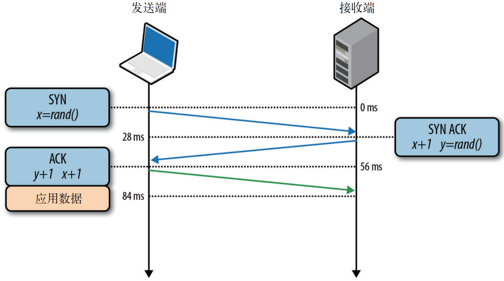
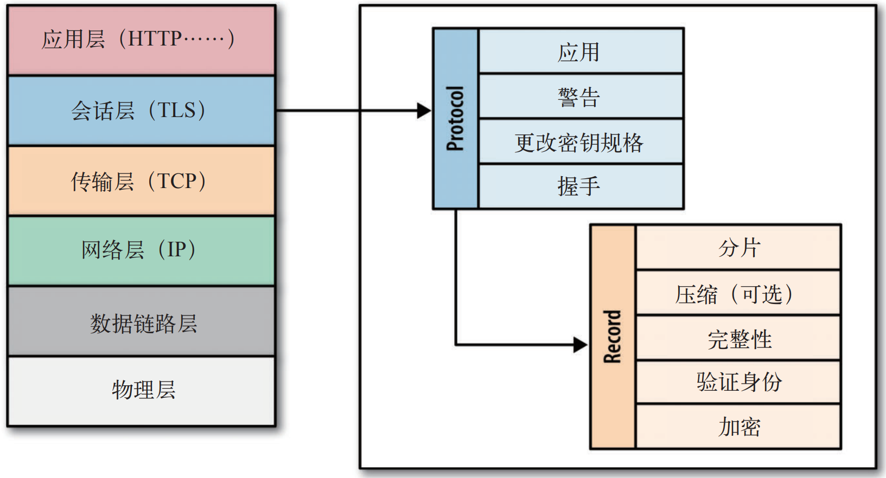
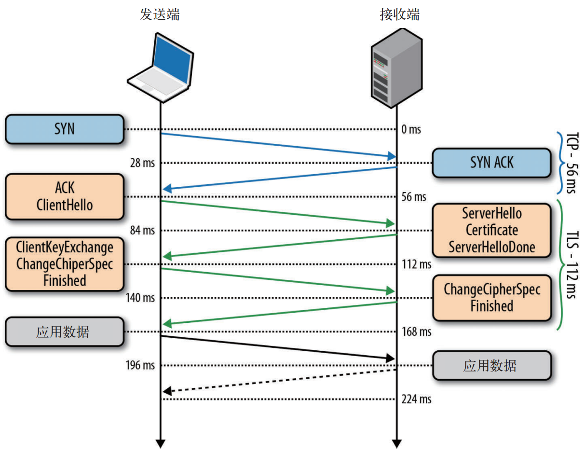
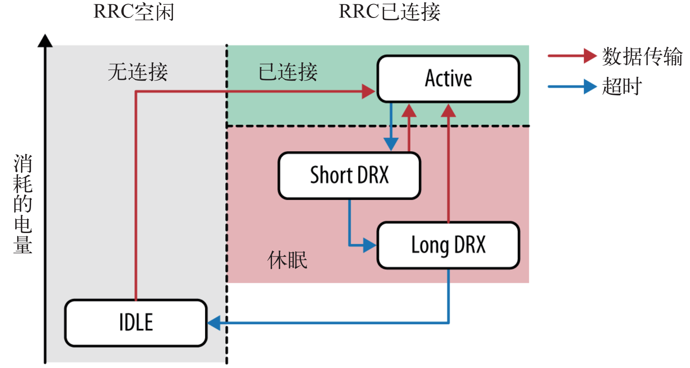
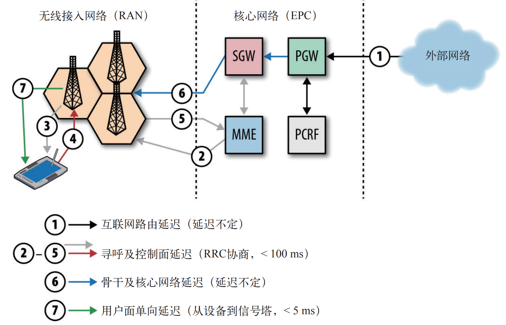
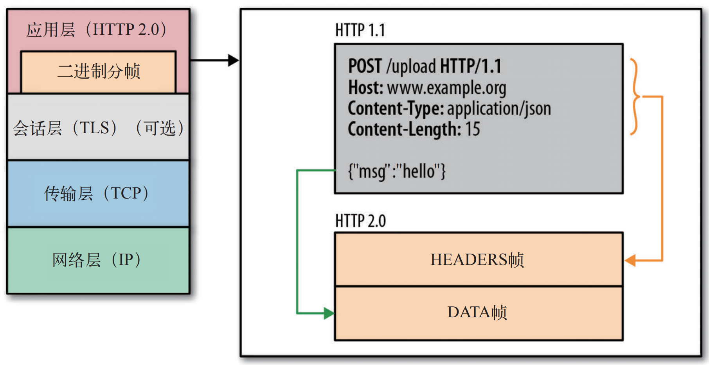
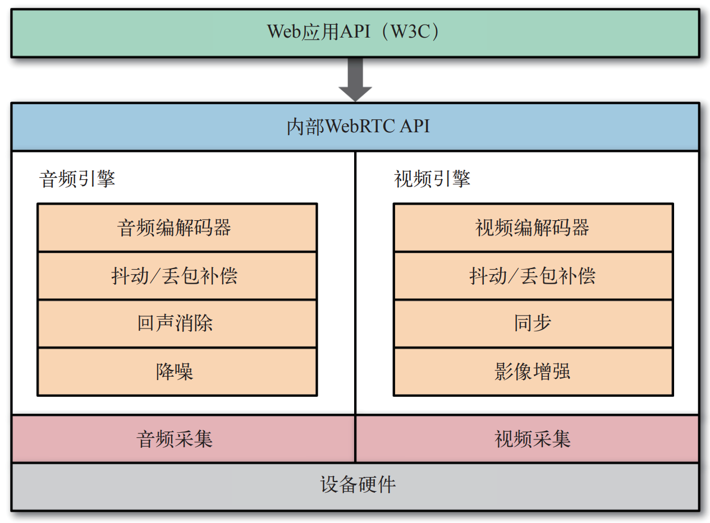
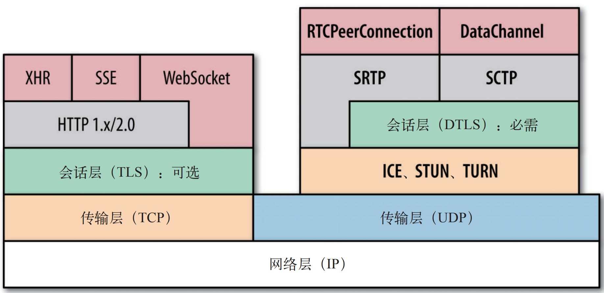
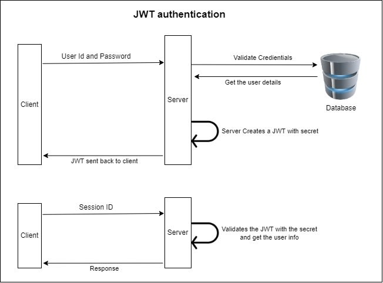

# JavaScript DevOps Notes

## PWA

Progressive Web Apps:

- Served over `HTTPS`.
- Provide a manifest.
- Register a `ServiceWorker`
  (web cache for offline and performance).
- Consists of website, web app manifest,
  service worker, expanded capabilities
  and OS integration.

### Service Worker Pros

- Cache.
- Offline.
- Background.
- Custom request to minimize network.
- [Notification API](https://developer.mozilla.org/docs/Web/API/ServiceWorkerRegistration/showNotification).

### Service Worker Costs

- Need startup time.

```ts
// 20~100 ms for desktop
// 100 ms for mobile
const entry = performance.getEntriesByName(url)[0];
const swStartupTime = entry.requestStart - entry.workerStart;
```

- cache reads aren't always instant:
  - cache hit time = read time (only this case better than `NO SW`),
  - cache miss time = read time + network latency,
  - cache slow time = slow read time + network latency,
  - SW asleep = SW boot latency + read time ( + network latency),
  - NO SW = network latency.

```ts
const entry = performance.getEntriesByName(url)[0];

// no remote request means this was handled by the cache
if (entry.transferSize === 0) {
  const cacheTime = entry.responseStart - entry.requestStart;
}

async function handleRequest(event) {
  const cacheStart = performance.now();
  const response = await caches.match(event.request);
  const cacheEnd = performance.now();
}
```

- 服务工作者线程缓存不自动缓存任何请求, 所有缓存都必须明确指定.
- 服务工作者线程缓存没有到期失效的概念.
- 服务工作者线程缓存必须手动更新和删除.
- 缓存版本必须手动管理:
  每次服务工作者线程更新, 新服务工作者线程负责提供新的缓存键以保存新缓存.
- 唯一的浏览器强制逐出策略基于服务工作者线程缓存占用的空间.
  缓存超过浏览器限制时, 浏览器会基于 LRU 原则为新缓存腾出空间.

### Service Worker Caching Strategy

5 caching strategy in [workbox](https://developer.chrome.com/docs/workbox/caching-strategies-overview).

Stale-While-Revalidate:

```ts
// eslint-disable-next-line no-restricted-globals
self.addEventListener('fetch', function (event) {
  event.respondWith(
    caches.open(cacheName).then(function (cache) {
      cache.match(event.request).then(function (cacheResponse) {
        fetch(event.request).then(function (networkResponse) {
          cache.put(event.request, networkResponse);
        });

        return cacheResponse || networkResponse;
      });
    })
  );
});
```

Cache first, then Network:

```ts
// eslint-disable-next-line no-restricted-globals
self.addEventListener('fetch', function (event) {
  event.respondWith(
    caches.open(cacheName).then(function (cache) {
      cache.match(event.request).then(function (cacheResponse) {
        if (cacheResponse) return cacheResponse;

        return fetch(event.request).then(function (networkResponse) {
          cache.put(event.request, networkResponse.clone());
          return networkResponse;
        });
      });
    })
  );
});
```

Network first, then Cache:

```ts
// eslint-disable-next-line no-restricted-globals
self.addEventListener('fetch', function (event) {
  event.respondWith(
    fetch(event.request).catch(function () {
      return caches.match(event.request);
    })
  );
});
```

Cache only:

```ts
// eslint-disable-next-line no-restricted-globals
self.addEventListener('fetch', function (event) {
  event.respondWith(
    caches.open(cacheName).then(function (cache) {
      cache.match(event.request).then(function (cacheResponse) {
        return cacheResponse;
      });
    })
  );
});
```

Network only:

```ts
// eslint-disable-next-line no-restricted-globals
self.addEventListener('fetch', function (event) {
  event.respondWith(
    fetch(event.request).then(function (networkResponse) {
      return networkResponse;
    })
  );
});
```

### Service Worker Usage

#### Register Service Worker

```ts
// Check that service workers are registered
if ('serviceWorker' in navigator) {
  // Use the window load event to keep the page load performance
  window.addEventListener('load', () => {
    navigator.serviceWorker.register('/sw.js');
  });
}
```

#### Broken Images Service Worker

```ts
function isImage(fetchRequest) {
  return fetchRequest.method === 'GET' && fetchRequest.destination === 'image';
}

// eslint-disable-next-line no-restricted-globals
self.addEventListener('fetch', e => {
  e.respondWith(
    fetch(e.request)
      .then(response => {
        if (response.ok) return response;

        // User is online, but response was not ok
        if (isImage(e.request)) {
          // Get broken image placeholder from cache
          return caches.match('/broken.png');
        }
      })
      .catch(err => {
        // User is probably offline
        if (isImage(e.request)) {
          // Get broken image placeholder from cache
          return caches.match('/broken.png');
        }
        process(err);
      })
  );
});

// eslint-disable-next-line no-restricted-globals
self.addEventListener('install', e => {
  // eslint-disable-next-line no-restricted-globals
  self.skipWaiting();
  e.waitUntil(
    caches.open('precache').then(cache => {
      // Add /broken.png to "precache"
      cache.add('/broken.png');
    })
  );
});
```

#### Caches Version Service Worker

```ts
// eslint-disable-next-line no-restricted-globals
self.addEventListener('activate', function (event) {
  const cacheWhitelist = ['v2'];

  event.waitUntil(
    caches.keys().then(function (keyList) {
      return Promise.all([
        keyList.map(function (key) {
          return cacheWhitelist.includes(key) ? caches.delete(key) : null;
        }),
        // eslint-disable-next-line no-restricted-globals
        self.clients.claim(),
      ]);
    })
  );
});
```

### PWA Reference

- [Workbox](https://github.com/GoogleChrome/workbox)
- [Offline Cookbook](https://web.dev/offline-cookbook)
- [Extensive Guide](https://www.smashingmagazine.com/2018/11/guide-pwa-progressive-web-applications)
- [Service Worker](https://developers.google.com/web/fundamentals/primers/service-workers)

## JamStack

JamStack 指的是一套用于构建现代网站的技术栈:

- JavaScript: enhancing with JavaScript.
- APIs: supercharging with services.
- Markup: pre-rendering.

### Rendering Patterns

- CSR (Client Side Rendering): SPA.
- SSR (Server Side Rendering): SPA with SEO.
- SSG (Static Site Generation): SPA with pre-rendering.
- ISR (Incremental Static Regeneration): SSG + SSR.
- SSR + CSR: HomePage with SSR, dynamic with CSR.
- SSG + CSR: HomePage with SSG, dynamic with CSR.
- SSG + SSR: static with SSG, dynamic with SSR.

[](https://www.patterns.dev/posts/rendering-patterns)

### CSR

- CSR hit API after the page loads (LOADING indicator).
- Data is fetched on every page request.

```tsx
import { TimeSection } from '@components';

export default function CSRPage() {
  const [dateTime, setDateTime] = React.useState<string>();

  React.useEffect(() => {
    axios
      .get('https://worldtimeapi.org/api/ip')
      .then(res => {
        setDateTime(res.data.datetime);
      })
      .catch(error => console.error(error));
  }, []);

  return (
    <main>
      <TimeSection dateTime={dateTime} />
    </main>
  );
}
```

### SSR

- [Server Side Rendering with Puppeteer](https://developers.google.com/web/tools/puppeteer/articles/ssr)
- [Rendering on the Web](https://developers.google.com/web/updates/2019/02/rendering-on-the-web)

[](https://www.patterns.dev/posts/ssr)

```ts
if (isBotAgent) {
  // return pre-rendering static html to search engine crawler
  // like Gatsby
} else {
  // server side rendering at runtime for real interactive users
  // ReactDOMServer.renderToString()
}
```

- SSR hit API before the page loads (DELAY before render, and no LOADING indicator).
- Data is fetched on every page request.

```tsx
import { TimeSection } from '@components';

export default function SSRPage({ dateTime }: SSRPageProps) {
  return (
    <main>
      <TimeSection dateTime={dateTime} />
    </main>
  );
}

export const getServerSideProps: GetServerSideProps = async () => {
  const res = await axios.get('https://worldtimeapi.org/api/ip');

  return {
    props: { dateTime: res.data.datetime },
  };
};
```

### SSG

- Reloading did not change anything.
- Hit API when running `npm run build`.
- Data will not change because no further fetch.

```tsx
import { TimeSection } from '@components';

export default function SSGPage({ dateTime }: SSGPageProps) {
  return (
    <main>
      <TimeSection dateTime={dateTime} />
    </main>
  );
}

export const getStaticProps: GetStaticProps = async () => {
  const res = await axios.get('https://worldtimeapi.org/api/ip');

  return {
    props: { dateTime: res.data.datetime },
  };
};
```

### ISR

- Based on SSG, with **revalidate limit**.
- Cooldown state: reloading doesn't trigger changes and pages rebuilds.
- First person that visits when cooldown state is off,
  is going to trigger a rebuild.
  That person won't be seeing changes.
  But, the changes will be served for the next full reload.

```tsx
import { TimeSection } from '@components';

export default function ISR20Page({ dateTime }: ISR20PageProps) {
  return (
    <main>
      <TimeSection dateTime={dateTime} />
    </main>
  );
}

export const getStaticProps: GetStaticProps = async () => {
  const res = await axios.get('https://worldtimeapi.org/api/ip');

  return {
    props: { dateTime: res.data.datetime },
    revalidate: 20,
  };
};
```

### JamStack Reference

- Build your own [Next.js](https://hire.jonasgalvez.com.br/2022/may/18/building-a-mini-next-js).
- Modern websites building [patterns](https://dev.to/this-is-learning/patterns-for-building-javascript-websites-in-2022-5a93).

## SEO

### SEO Metadata

```tsx
import { Helmet } from 'react-helmet';

function App() {
  const seo = {
    title: 'About',
    description:
      'This is an awesome site that you definitely should check out.',
    url: 'https://www.mydomain.com/about',
    image: 'https://mydomain.com/images/home/logo.png',
  };

  return (
    <Helmet
      title={`${seo.title} | Code Mochi`}
      meta={[
        {
          name: 'description',
          property: 'og:description',
          content: seo.description,
        },
        { property: 'og:title', content: `${seo.title} | Code Mochi` },
        { property: 'og:url', content: seo.url },
        { property: 'og:image', content: seo.image },
        { property: 'og:image:type', content: 'image/jpeg' },
        { property: 'twitter:image:src', content: seo.image },
        { property: 'twitter:title', content: `${seo.title} | Code Mochi` },
        { property: 'twitter:description', content: seo.description },
      ]}
    />
  );
}
```

### SEO Best Practice

- [Server side rendering](https://css-tricks.com/server-side-react-rendering)
  (e.g Next.js).
- [Pre-Rendering](https://github.com/chrisvfritz/prerender-spa-plugin)
- Mobile performance optimization
  (e.g minify resources, code splitting, CDN, lazy loading, minimize reflows).
- SEO-friendly [routing](https://reacttraining.com/react-router) and URL management.
- [Google webmaster tools](https://www.google.com/webmasters)
- `<title>` and `<meta>` in `<head>` (with tool like `react-helmet`).
- Includes a `robots.txt` file.

### SEO Reference

- [SEO Basics](https://developers.google.com/search/docs/guides/javascript-seo-basics)
- [SPA SEO Basics](https://snipcart.com/spa-seo)

## Network

### TCP

#### Transmission Control Protocol



Transmission Control Protocol (RFC 793):

三次握手带来的延迟 (RTT: Round-trip Delay) 使得每创建一个新 TCP 连接都要付出很大代价.
这决定了提高 TCP 应用性能的关键, 在于**重用连接**.

#### TCP Congestion Control

- 流量控制:
  TCP 连接的每一方都要通告自己的接收窗口 (`rwnd` 字段),
  两端动态调整数据流速,
  使之适应发送端和接收端的容量及处理能力.
  客户端与服务器最大可传输数据量为 min(`rwnd`, `cwnd`),
  即接口窗口与拥塞窗口的最小值.
- 慢启动:
  `cwnd` 初始值为 1/4/10 个 TCP 段 (1460 字节).
  慢启动导致客户端与服务器之间经过几百 ms 才能达到接近最大速度.
- 指数增长:
  每收到一个 ACK 报文, `cwnd` 翻倍.
- 拥塞预防:
  拥塞预防算法把丢包作为网络拥塞的标志, 重置拥塞窗口,
  之后拥塞预防机制按照自己的算法来增大窗口以尽量避免丢包.
  e.g TCP Tahoe, TCP Reno, TCP Vegas, TCP New Reno, TCP BIC, TCP CUBIC.
  AIMD (Multiplicative Decrease and Additive Increase, 倍减加增),
  PRR (Proportional Rate Reduction, 比例降速).
- 快速重传.
- 快速恢复.

:::tip 理想窗口大小

WindowSize = BandWidth `*` RTT (带宽延迟积)

:::

#### TCP Performance

- Upgrade kernel version.
- 增大 TCP 的初始拥塞窗口 (`cwnd` >= 10).
- 禁用空闲后的慢启动.
- 启用窗口缩放, 增大最大接收窗口大小.
- TCP 快速打开 (TCP Fast Open): 允许在第一个 SYN 分组中发送应用程序数据.
- 减少传输冗余资源.
- 压缩要传输的资源.
- CDN: 降低 RTT.
- 重用 TCP 连接.

### UDP

#### User Datagram Protocol

User Datagram Protocol (RFC 768):

- 数据报是一个完整, 独立的数据实体,
  携带着从源节点到目的地节点的足够信息,
  对这些节点间之前的数据交换和传输网络没有任何依赖.
- 无协议服务:
  UDP 仅仅是在 IP 层 (IP 源地址/目标地址) 之上通过嵌入应用程序的源端口和目标端口,
  提供了一个`应用程序多路复用`机制.
- 不可靠的服务传输:
  - 不保证消息交付: 不确认, 不重传, 无超时.
  - 不保证交付顺序: 不设置包序号, 不重排, 不会发生队头阻塞.
  - 不跟踪连接状态: 不必建立连接或重启状态机.
  - 不需要拥塞控制: 不内置客户端或网络反馈机制.

#### UDP Performance

基于 UDP 的应用程序:

- 必须容忍各种因特网路径条件.
- 应该控制传输速度.
- 应该对所有流量进行拥塞控制.
- 应该使用与 TCP 相近的带宽.
- 应该准备基于丢包的重发计数器.
- 应该不发送大于路径 MTU 的数据报.
- 应该处理数据报丢失, 重复与重排.
- 应该足够稳定以支持 2 分钟以上的交付延迟.
- 应该支持 IPv4 UDP 校验和, 必须支持 IPv6 校验和.
- 可以在需要时使用 `Keep-Alive` (最小间隔 15 秒).
- 基于 UDP 的 P2P 程序必须考虑 NAT (Network Address Translator) 穿透:
  - ICE: Interactive Connectivity Establishment.
  - STUN: Session Traversal Utilities for NAT.
  - TURN: Traversal Using Relays around NAT.

:::tip WebRTC

WebRTC 是符合上述要求的框架.

:::

### TLS



#### Transport Layer Security

- SSL 1.0 (Security Sockets Layer) (Netscape).
- SSL 2.0.
- SSL 3.0.
- TLS 1.0 (RFC 2246).
- TLS 1.1.
- TLS 1.2.
- 加密:
  通过密钥协商, 混淆数据的机制.
- 身份验证:
  通过建立认证机构信任链 (Chain of Trust and Certificate Authorities), 验证身份标识有效性的机制.
- 完整性:
  通过 MAC (Message Authentication Code) 签署消息, 检测消息是否被篡改或伪造的机制.



#### TLS Performance

- 在支持的客户端中使用会话记录单 (Session Ticket, RFC 5077),
  在不支持的客户端中使用会话标识符 (Session Identifier, RFC 5246).
- 支持多进程或工作进程的服务器应该使用共享的会话缓存.
- 共享的会话缓存的大小应该根据流量调整.
- 应该设置会话超时时间.
- 在多台服务器并存的情况下,
  把相同的客户端 IP 或相同的 TLS 会话 ID 路由到同一台服务器可以最好地利用会话缓存.
- 在不适宜使用单一负载均衡策略的情况下,
  应该为多台服务器配置共享缓存, 以便最好地利用会话缓存.
- 检查和监控 SSL/TLS 会话缓存的使用情况, 以之作为性能调优的依据.
- 小记录会造成浪费, 大记录会导致延迟:
  一方面不要让 TLS 记录分成多个 TCP 分组, 另一方面又要尽量在一条记录中多发送数据
  (e.g 1400 bytes).
- 尽量减少中间证书颁发机构的数量 (确保证书链不会超过拥塞窗口的大小):
  理想情况下, 发送的证书链应该只包含两个证书,
  即站点证书和中间证书颁发机构的书 (根证书颁发机构的证书由浏览器内置提供).
- 禁用 TLS 压缩: 防止 `CRIME` 攻击 (2012), 防止双重压缩 (Gzip).
- 启用服务器对 SNI (Server Name Indication) 的支持.
- 启用服务器的 OCSP (Online Certificate Status Protocol) 封套功能.
- 追加 HTTP 严格传输 (HSTS, HTTP Strict Transport Security) 安全首部.
- 降低 TLS 延迟:
  - 服务器应该通过 ALPN (Application Layer Protocol Negotiation) 协商支持 TLS.
  - 服务器应该支持 TLS 恢复以最小化握手延迟.
- TLS testing [tool](https://www.ssllabs.com/ssltest/index.html).

```bash
openssl s_client -state -CAfile start-ssl.ca.crt -connect server.com:443
```

### Wireless Network

#### Wireless Network Basis

影响数据传输速度因素:

- 可用带宽 (Hz).
- 信号强度 (SNR, Signal Noise Ratio).

#### Wireless NetWork Types

无线标准:

- WLAN (Wireless LAN):
  IEEE 802.11, CSMA/CA (Carrier Sense Multiple Access/Collision Avoidance).
- LTE (Long Term Evolution) / HSPA+ (High Speed Packet Access): 4G.






#### Wireless Network Performance

Battery power save optimization:

- 轮询在移动网络中代价极高 (Energy Tail), 少用: e.g heart beat, round beacon.
- 尽可能使用推送和通知.
- 消除不必要的长连接.
- 出站和入站请求应该合并和汇总.
- 非关键性请求应该推迟到无线模块活动时进行.
- 把请求分组, 尽可能多和快地下载数据, 然后让无线模块转为空闲:
  既可以获得最大的网络吞吐量, 也能节约电量.
- 把负载转移到 Wi-Fi 网络:
  可以建议用户打开 Wi-Fi 连接, 以提升体验和节省电量.

Offline optimization:

- 不要缓存或试图猜测网络状态.
- 调度请求, 监听并诊断错误.
- 瞬态错误总会发生, 不可忽视, 可以采取重试策略.
- 监听连接状态, 以便采用最佳请求方式.
- 对重试请求采用补偿算法, 不要永远循环.
- 离线时, 尽可能记录并在将来发送请求.
- 利用 Web Storage API (App Cache/Local Storage/Service Worker) 实现离线应用.

### HTTP 1

#### Hypertext Transfer Protocol

Hypertext Transfer Protocol (RFC 2068):

- HTTP/1.0 默认不开启长连接: 客户端与服务端必须同时发送 `Connection: Keep-Alive`.
- HTTP/1.1 默认开启长连接.

#### HTTP 1.x Performance

限制 Web 性能的主要因素是客户端与服务器之间的网络往返延迟 (RTT):

- 持久化连接以支持连接重用: `N` 次 HTTP 请求节省的总延迟时间为 `(N-1) * RTT`.
- 分块传输编码以支持流式响应.
- 请求管道以支持并行请求处理 (局限性较大):
  - FIFO 管道, 队头请求会阻塞后续请求.
  - 应用必须处理中断的连接并恢复.
  - 应用必须处理中断请求的幂等问题.
  - 应用必须保护自身不受出问题的代理的影响.
- 模拟多路复用: 并行使用多个 TCP 连接 (大多数现代浏览器支持每个主机打开 6 个连接).
- 利用多个 TCP 连接进行域名分区.
- Resources bundling and inlining (但一定程度上放弃缓存粒度).
- 改进的更好的缓存机制.

### HTTP 2

#### HTTP 2 Upside

在 HTTP/1.x 中, 每次请求都会建立一次 HTTP 连接:

- 串行的文件传输. 当请求 a 文件时, b 文件只能等待.
- 连接数过多.

HTTP/2 的多路复用就是为了解决上述的两个性能问题.
在 HTTP/2 中, 有两个非常重要的概念, 分别是帧 (frame) 和流 (stream).
帧代表着最小的数据单位, 每个帧会标识出该帧属于哪个流, 流也就是多个帧组成的数据流.
多路复用, 就是在一个 TCP 连接中可以存在多条流, 避免队头阻塞问题和连接数过多问题.




HTTP/2 = `HTTP` + `HPack / Stream` + `TLS 1.2+` + `TCP`:

- HTTP 2.0 的主要目标是改进传输性能, 实现低延迟和高吞吐量.
- 二进制传输 (乱序二进制帧 Stream).
- Multiplexing (多路复用): more parallelized requests.
- Header compression (HPack): 降低协议字节开销占比 (尤其是 `Cookie` 带来的性能瓶颈).
- 双向流量控制 (`WINDOW_UPDATE` 帧更新).
- Server push:
  - 客户端可以缓存推送过来的资源.
  - 客户端可以拒绝推送过来的资源.
  - 推送资源可以由不同的页面共享.
  - 服务器可以按照优先级推送资源.
- HTTPS guaranteed: 事实加密 (Chrome/Firefox 只支持 HTTP/2 over TLS 1.2+).

#### HTTP 2 Downside

HTTP/2 虽然通过多路复用解决了 HTTP 层的队头阻塞,
但仍然存在 TCP 层的队头阻塞 (`Head-of-line Blocking`):

- 由于 TCP 不支持乱序确认, 当没有收到队头 (滑动窗口最左端) 的 ACK 确认报文时,
  发送窗口无法往前移动, 此时发送方将无法继续发送后面的数据, 产生发送窗口的队头阻塞问题.
- 同样地, 当接收窗口接收有序数据时, 当没有收到队头 (滑动窗口最左端) 的数据时,
  接收窗口无法往前移动, 此时接收方将直接丢弃所有滑动窗口右侧的数据, 产生接收窗口的队头阻塞问题.

QUIC (基于 UDP 的可靠协议)
给每一个 Stream 都分配了一个独立的滑动窗口,
使得一个连接上的多个 Stream 之间没有依赖关系,
拥有相互独立各自控制的滑动窗口.

#### HTTP 2 Optimization

HTTP 2 performance:

- Reducing HTTP requests:
  - 重用 TCP 连接.
  - 多路复用.
  - 减少传输冗余资源.
- Caching and reducing DNS lookups:
  - Remove too much domains.
  - HTML5 DNS prefetch.
- Avoid HTTP redirects.
- CDN: minimize RTT.
- Web caches.
- Resources minification.

Due to asset granularity and **caching effectiveness**:

- No need for 域名分区 (no need for multiple HTTP connection).
- No need for CSS/Image sprites.
- Less need for resources bundling and inlining.

### HTTP 3

HTTP/3 = `HTTP` + `QPack / Stream` + `QUIC / TLS 1.3+` + `UDP`:

- 解决多次握手高延迟问题.
- 解决队头 (数据重传) 阻塞 (后续数据) 问题.
- QUIC 协议保证传输可靠/实现快速握手/集成 TLS 加密/实现多路复用.
- QUIC 给每个请求流 (Stream ID) 都分配一个独立的滑动窗口, 实现无队头阻塞的多路复用, 解决 TCP 层的队头阻塞.

### HTTP Response Status Codes

[RFC 2616](https://developer.mozilla.org/docs/Web/HTTP/Status):

- Informational responses: 100–199.
- Successful responses: 200–299.
  - 200 OK.
  - 201 Created.
  - 202 Accepted.
- Redirects: 300–399.
  - 301 Moved Permanently.
  - 302 Found.
  - 304 Not Modified.
  - 307 Temporary Redirect.
  - 308 Permanent Redirect.
- Client errors: 400–499.
  - 400 Bad Request.
  - 401 Unauthorized.
  - 403 Forbidden.
  - 404 Not Found.
  - 405 Method Not Allowed.
  - 406 Not Acceptable.
- Server errors: 500–599.
  - 500 Internal Server Error.
  - 501 Not Implemented.
  - 502 Bad Gateway.
  - 503 Service Unavailable.
  - 504 Gateway Timeout.

Use reasonable HTTP status codes:

- 200: general success.
- 201: successful creation.
- 400: bad requests from client.
- 401: unauthorized requests.
- 403: missing permissions.
- 404: missing resources.
- 429: too many requests.
- 5xx: internal errors (these should be avoided at all costs).

### HTTPS

HyperText Transfer Protocol (HTTP) + Transport Layer Security (TLS):

- 验证身份: 通过证书认证客户端访问的是自己的服务器.
- 内容加密: 采用混合加密技术 (结合对称加密和非对称加密技术), 中间者无法直接查看明文内容.
- 保护数据完整性: 防止传输的内容被中间人冒充或者篡改.
- CA (Certificate Authority) 认证体系是 HTTPS 防止中间人攻击 (HTTP 明文传输) 的核心,
  客户端需要对服务器发来的证书进行安全性校验 (使得中间人无法替换证书和公私钥).
- 通过 CA 认证体系避免了中间人窃取 AES 密钥并发起拦截和修改 HTTP 通讯的报文.

#### HTTPS 通信过程

证书获取及验证过程 (CA 认证体系):

- 浏览器发起一个 HTTPS 的请求.
- 服务器接收到请求, 返回一个 HTTPS 证书, 该证书内包含服务器私钥对应的公钥信息.
- 浏览器通过 CA 认证体系 (CA 服务器) 验证证书是否合法 (浏览器地址栏进行相应提示).

加密密钥传输 (B 端加密 - 传输 - S 端解密):

- 浏览器端生成一个随机数并通过公钥加密, 传输给服务器.
- 服务器使用私钥对随机数进行解密, 并存储随机数作为对称加密的密钥.

加密报文传输 (S 端加密 - 传输 - B 端解密):

- 服务器使用随机数对数据进行对称加密, 并将加密信息返回给客户端.
- 客户端获得加密数据, 使用随机数作为密钥基于对称加密算法对报文进行解密.

#### HTTPS 安全性

- 当浏览器获验证假公钥不合法时, 会对用户进行风险提示, 但用户仍可以授权信任证书继续操作.
- HTTPS 重点关注传输安全, 无法保证本地随机数的存储安全 (木马, 浏览器漏洞).

### CORS

Cross Origin Resource Sharing:

- Same origin:
  URLs (Uniform Resource Locator) with same `protocol + host + port`.
- CORS-safeListed response header:
  `Cache-Control`, `Content-Language`, `Content-Length`, `Content-Type`,
  `Expires`, `Last-Modified`, `Pragma`.

```bash
OPTIONS /resource.js HTTP/1.1
Host: third-party.com
Origin: http://example.com
Access-Control-Request-Method: POST
Access-Control-Request-Headers: My-Custom-Header

------

HTTP/1.1 200 OK
Access-Control-Allow-Origin: http://example.com
Access-Control-Allow-Methods: GET, POST, PUT
Access-Control-Allow-Headers: My-Custom-Header
```

```bash
Access-Control-Allow-Origin: *
```

```bash
Access-Control-Expose-Headers: X-Custom-Header, Content-Encoding
Access-Control-Expose-Headers: *
```

```bash
Access-Control-Allow-Credentials: true
Access-Control-Allow-Origin: https://example.com
Vary: Cookie, Origin
```

```bash
Access-Control-Max-Age: 600
Access-Control-Allow-Methods: Custom-Method, CUSTOM-METHOD
Access-Control-Allow-Headers: X-Custom-Header
```

### JSON

JSON (JavaScript Object Notation) methods:

```ts
const obj = JSON.parse(json);
const json = JSON.stringify(obj);
```

[`JSON.stringify(value, filter, space)`](https://exploringjs.com/impatient-js/ch_json.html#json-replacers-revivers):

- `Symbol`/`function`/`NaN`/`Infinity`/`undefined`: `null`/ignored.
- `BitInt`: throw `TypeError`.
- Circular reference object: throw `TypeError`.
- `toJSON` method:

```ts
const obj = {
  name: 'zc',
  toJSON() {
    return 'return toJSON';
  },
};

// return toJSON
console.log(JSON.stringify(obj));

// "2022-03-06T08:24:56.138Z"
JSON.stringify(new Date());
```

### AJAX

#### AJAX Data Format

| Format                           | Size (bytes) | Download (ms) | Parse (ms) |
| :------------------------------- | -----------: | ------------: | ---------: |
| Verbose XML                      |      582,960 |         999.4 |      343.1 |
| Verbose JSON-P                   |      487,913 |         598.2 |        0.0 |
| Simple XML                       |      437,960 |         475.1 |       83.1 |
| Verbose JSON                     |      487,895 |         527.7 |       26.7 |
| Simple JSON                      |      392,895 |         498.7 |       29.0 |
| Simple JSON-P                    |      392,913 |         454.0 |        3.1 |
| Array JSON                       |      292,895 |         305.4 |       18.6 |
| Array JSON-P                     |      292,912 |         316.0 |        3.4 |
| Custom Format (script insertion) |      222,912 |          66.3 |       11.7 |
| Custom Format (XHR)              |      222,892 |          63.1 |       14.5 |

#### Ajax Usage

```ts
const XHR = (function () {
  const standard = {
    createXHR() {
      return new XMLHttpRequest();
    },
  };
  const newActionXObject = {
    createXHR() {
      return new ActionXObject('Msxml12.XMLHTTP');
    },
  };
  const oldActionXObject = {
    createXHR() {
      return new ActionXObject('Microsoft.XMLHTTP');
    },
  };

  // 根据兼容性返回对应的工厂对象
  // 此立即函数运行一次即可完成兼容性检查, 防止重复检查
  if (standard.createXHR()) {
    return standard;
  } else {
    try {
      newActionXObject.createXHR();
      return newActionXObject;
    } catch (o) {
      oldActionXObject.createXHR();
      return oldActionXObject;
    }
  }
})();

const request = XHR.createXHR();

// 3rd argument : async mode
request.open('GET', 'example.txt', true);

request.onreadystatechange = function () {
  // do something
  /*
  switch(request.readyState) {
    case 0: initialize
    case 1: loading
    case 2: loaded
    case 3: transaction
    case 4: complete
  }
  */
  if (request.readyState === 4) {
    const para = document.createElement('p');
    const txt = document.createTextNode(request.responseText);
    para.appendChild(txt);
    document.getElementById('new').appendChild(para);
  }
};

request.send(null);
```

```ts
ajax({
  url: './TestXHR.aspx', // 请求地址
  type: 'POST', // 请求方式
  data: { name: 'super', age: 20 }, // 请求参数
  dataType: 'json',
  success(response, xml) {
    // 此处放成功后执行的代码
  },
  fail(status) {
    // 此处放失败后执行的代码
  },
});

function ajax(options) {
  options = options || {};
  options.type = (options.type || 'GET').toUpperCase();
  options.dataType = options.dataType || 'json';
  const params = formatParams(options.data);
  let xhr;

  // 创建 - 非IE6 - 第一步
  if (window.XMLHttpRequest) {
    xhr = new XMLHttpRequest();
  } else {
    // IE6及其以下版本浏览器
    xhr = new ActiveXObject('Microsoft.XMLHTTP');
  }

  // 接收 - 第三步
  xhr.onreadystatechange = function () {
    if (xhr.readyState === 4) {
      const status = xhr.status;
      if (status >= 200 && status < 300) {
        options.success && options.success(xhr.responseText, xhr.responseXML);
      } else {
        options.fail && options.fail(status);
      }
    }
  };

  // 连接 和 发送 - 第二步
  if (options.type === 'GET') {
    xhr.open('GET', `${options.url}?${params}`, true);
    xhr.send(null);
  } else if (options.type === 'POST') {
    xhr.open('POST', options.url, true);
    // 设置表单提交时的内容类型
    xhr.setRequestHeader('Content-Type', 'application/x-www-form-urlencoded');
    xhr.send(params);
  }
}

// 格式化参数
function formatParams(data) {
  const arr = [];

  for (const name in data) {
    arr.push(`${encodeURIComponent(name)}=${encodeURIComponent(data[name])}`);
  }

  arr.push(`v=${Math.random()}`.replace('.', ''));
  return arr.join('&');
}
```

```ts
function getJSON(url) {
  return new Promise((resolve, reject) => {
    const request = new XMLHttpRequest();

    request.open('GET', url);

    request.onload = function () {
      try {
        if (this.status === 200) {
          resolve(JSON.parse(this.response));
        } else {
          reject(Error(`${this.status} ${this.statusText}`));
        }
      } catch (e) {
        reject(e.message);
      }
    };

    request.onerror = function () {
      reject(Error(`${this.status} ${this.statusText}`));
    };

    request.send();
  });
}

getJSON('data/sample.json')
  .then(ninjas => {
    assert(ninjas !== null, 'Get data');
  })
  .catch(e => handleError(`Error: ${e}`));
```

#### Ajax Cross Origin Request

```html
<!-- HTML -->
<meta http-equiv="Access-Control-Allow-Origin" content="*" />
```

```ts
Response.Headers.Add('Access-Control-Allow-Origin', '*');
```

```ts
$.ajax({
  url: 'http://map.oicqzone.com/gpsApi.php?lat=22.502412986242&lng=113.93832783228',
  type: 'GET',
  dataType: 'JSONP', // 处理Ajax 跨域问题.
  success(data) {
    $('body').append(`Name: ${data}`);
  },
});
```

#### AJAX Alternatives

- `client.request(config)`.
- `client.get(url[, config])`.
- `client.delete(url[, config])`.
- `client.head(url[, config])`.
- `client.options(url[, config])`.
- `client.post(url[, data[, config]])`.
- `client.put(url[, data[, config]])`.
- `client.patch(url[, data[, config]])`.
- `client.getUri([config])`.

```ts
const client = axios.create({
  baseURL: 'https://some-domain.com/api/',
  timeout: 1000,
  headers: { 'X-Custom-Header': 'foobar' },
});

// Add a request interceptor
client.interceptors.request.use(
  config => {
    // Do something before request is sent.
    return config;
  },
  error => {
    // Do something with request error.
    return Promise.reject(error);
  }
);

client.interceptors.response.use(
  response => {
    // Any status code that lie within the range of 2xx trigger this function.
    // Do something with response data.
    return response;
  },
  error => {
    // Any status codes that falls outside the range of 2xx trigger this function.
    // Do something with response error.
    return Promise.reject(error);
  }
);
```

### Fetch

- GET: read resources.
- POST: create resources.
- PUT: fully update resources.
- PATCH: partially update resources.
- DELETE: delete resources.

#### Fetch Basis Usage

```ts
const response = await fetch('/api/names', {
  headers: {
    Accept: 'application/json',
  },
});

const response = await fetch('/api/names', {
  method: 'POST',
  body: JSON.stringify(object),
  headers: {
    'Content-Type': 'application/json',
  },
});
```

#### Fetch Form Data

```ts
const imageFormData = new FormData();
const imageInput = document.querySelector('input[type="file"][multiple]');
const imageFiles = imageInput.files;

for (const file of imageFiles) {
  imageFormData.append('image', file);
}

fetch('/img-upload', {
  method: 'POST',
  body: imageFormData,
});
```

#### Fetch Aborting

```ts
const abortController = new AbortController();

fetch('wikipedia.zip', { signal: abortController.signal }).catch(() =>
  console.log('Aborted!')
);

// 10 毫秒后中断请求
setTimeout(() => abortController.abort(), 10);
```

#### Fetch Objects API

[`Headers` object](https://developer.mozilla.org/docs/Web/API/Headers):

```ts
const myHeaders = new Headers();
myHeaders.append('Content-Type', 'text/xml');
myHeaders.get('Content-Type'); // should return 'text/xml'
```

[`Request` object](https://developer.mozilla.org/docs/Web/API/Request):

```ts
const request = new Request('/api/names', {
  method: 'POST',
  body: JSON.stringify(object),
  headers: {
    'Content-Type': 'application/json',
  },
});

const response = await fetch(request);
```

[`Response` object](https://developer.mozilla.org/docs/Web/API/Response):

```ts
fetch('//foo.com').then(console.log);
// Response {
//   body: (...)
//   bodyUsed: false
//   headers: Headers {}
//   ok: true
//   redirected: false
//   status: 200
//   statusText: "OK"
//   type: "basic"
//   url: "https://foo.com/"
// }

fetch('//foo.com/redirect-me').then(console.log);
// Response {
//   body: (...)
//   bodyUsed: false
//   headers: Headers {}
//   ok: true
//   redirected: true
//   status: 200
//   statusText: "OK"
//   type: "basic"
//   url: "https://foo.com/redirected-url/"
// }

fetch('//foo.com/does-not-exist').then(console.log);
// Response {
//   body: (...)
//   bodyUsed: false
//   headers: Headers {}
//   ok: false
//   redirected: true
//   status: 404
//   statusText: "Not Found"
//   type: "basic"
//   url: "https://foo.com/does-not-exist/"
// }

fetch('//foo.com/throws-error').then(console.log);
// Response {
//   body: (...)
//   bodyUsed: false
//   headers: Headers {}
//   ok: false
//   redirected: true
//   status: 500
//   statusText: "Internal Server Error"
//   type: "basic"
//   url: "https://foo.com/throws-error/"
// }
```

#### Fetch Streaming

`Request`/`Response` `body` (`ReadableStream`) methods:

- `text()`.
- `json()`.
- `formData()`.
- `arrayBuffer()`.
- `blob()`.
- `bodyUsed`: 布尔值, 表示 `ReadableStream` 是否已摄受 (`disturbed`).

```ts
fetch('https://fetch.spec.whatwg.org/')
  .then(response => response.body)
  .then(body => {
    const reader = body.getReader();

    function processNextChunk({ value, done }) {
      if (done) {
        return;
      }

      console.log(value);
      return reader.read().then(processNextChunk);
    }

    return reader.read().then(processNextChunk);
  });
// { value: Uint8Array{}, done: false }
// { value: Uint8Array{}, done: false }
// { value: Uint8Array{}, done: false }
// ...

fetch('https://fetch.spec.whatwg.org/')
  .then(response => response.body)
  .then(async body => {
    const reader = body.getReader();

    while (true) {
      const { value, done } = await reader.read();

      if (done) {
        break;
      }

      console.log(value);
    }
  });
// { value: Uint8Array{}, done: false }
// { value: Uint8Array{}, done: false }
// { value: Uint8Array{}, done: false }
// ...
```

```ts
fetch('https://fetch.spec.whatwg.org/')
  .then(response => response.body)
  .then(async body => {
    const reader = body.getReader();
    const asyncIterable = {
      [Symbol.asyncIterator]() {
        return {
          next() {
            return reader.read();
          },
        };
      },
    };

    for await (const chunk of asyncIterable) {
      console.log(chunk);
    }
  });
// { value: Uint8Array{}, done: false }
// { value: Uint8Array{}, done: false }
// { value: Uint8Array{}, done: false }
// ...
```

```ts
async function* streamGenerator(stream) {
  const reader = stream.getReader();

  try {
    while (true) {
      const { value, done } = await reader.read();

      if (done) {
        break;
      }

      yield value;
    }
  } finally {
    reader.releaseLock();
  }
}

const decoder = new TextDecoder();

fetch('https://fetch.spec.whatwg.org/')
  .then(response => response.body)
  .then(async body => {
    for await (const chunk of streamGenerator(body)) {
      console.log(decoder.decode(chunk, { stream: true }));
    }
  });
// <!doctype html><html lang="en"> ...
// whether a <a data-link-type="dfn" href="#concept-header" ...
// result to <var>rangeValue</var>. ...
// ...
```

```ts
fetch('https://fetch.spec.whatwg.org/')
  .then(response => response.body)
  .then(body => {
    const reader = body.getReader();
    // 创建第二个流
    return new ReadableStream({
      async start(controller) {
        try {
          while (true) {
            const { value, done } = await reader.read();

            if (done) {
              break;
            }

            // 将主体流的块推到第二个流
            controller.enqueue(value);
          }
        } finally {
          controller.close();
          reader.releaseLock();
        }
      },
    });
  })
  .then(secondaryStream => new Response(secondaryStream))
  .then(response => response.text())
  .then(console.log);
// <!doctype html><html lang="en"><head><meta charset="utf-8"> ...
```

### RESTful

- Client/Server architecture.
- Stateless.
- Cacheable.
- Layer system.
- Code via need.
- Isomorphic interface.
- Design [reference](https://github.com/aisuhua/restful-api-design-references).

### Server-Sent Events

- Event source [API](https://developer.mozilla.org/docs/Web/API/EventSource).
- Server-sent events [API](https://developer.mozilla.org/docs/Web/API/Server-sent_events/Using_server-sent_events).

```ts
const source = new EventSource('/path/to/stream-url');

source.onopen = function () {};

source.onerror = function () {};

source.addEventListener('foo', function (event) {
  processFoo(event.data);
});

source.addEventListener('ping', function (event) {
  processPing(JSON.parse(event.data).time);
});

source.onmessage = function (event) {
  log(event.id, event.data);
  if (event.id === 'CLOSE') {
    source.close();
  }
};
```

### WebSocket

#### WebSocket Message Header

Request Header:

```bash
GET /chat HTTP/1.1
Host: example.com
Upgrade: websocket
Connection: Upgrade
Sec-WebSocket-Key: 16-byte, base64 encoded
Sec-WebSocket-Version: 13
Sec-Websocket-Protocol: protocol [,protocol]*
Sec-Websocket-Extension: extension [,extension]*
```

Response Header:

```bash
HTTP/1.1 101 "Switching Protocols" or other description
Upgrade: websocket
Connection: Upgrade
Sec-WebSocket-Accept: 20-byte, MD5 hash in base64
Sec-Websocket-Protocol: protocol [,protocol]*
Sec-Websocket-Extension: extension [,extension]*
```

#### WebSocket Extensions

WebSocket 存在与 HTTP/1.1 类似的性能瓶颈: 队头阻塞, 无法多路复用.

WebSocket 规范允许对协议进行扩展,
数据格式和 WebSocket 协议的语义可以通过新的操作码和数据字段扩展:

- 多路复用扩展 (WebSocket Multiplexing Extension):
  使用`信道 ID`扩展每个 WebSocket 帧, 实现多个虚拟的 WebSocket 信道共享一个 TCP 连接.
- 压缩扩展 (WebSocket Compression Extension):
  给 WebSocket 协议增加了压缩功能.

#### WebSocket Basic Usage

通信功能:

- `data`:
  - `string`.
  - `ArrayBuffer`.
  - `Blob`.
- `readyState`:
  - `WebSocket.OPENING`: `0`, 连接正在建立.
  - `WebSocket.OPEN`: `1`, 连接已经建立.
  - `WebSocket.CLOSING`: `2`, 连接正在关闭.
  - `WebSocket.CLOSE`: `3`, 连接已经关闭.

```ts
function WebSocketTest() {
  if ('WebSocket' in window) {
    alert('WebSocket is supported by your Browser!');
    // Let us open a web socket
    const ws = new WebSocket('ws://localhost:9998/echo');

    ws.onopen = function () {
      // WebSocket is connected, send data using send()
      ws.send('Message to send');
      alert('Message is sent...');
    };

    ws.onmessage = function (event) {
      const receivedMessage = event.data;
      alert('Message is received...');
    };

    ws.onclose = function (event) {
      // websocket is closed.
      console.log(
        `As clean? ${event.wasClean} Code=${event.code} Reason=${event.reason}`
      );
    };

    ws.onerror = function () {
      alert('Connection error.');
    };
  } else {
    // The browser doesn't support WebSocket
    alert('WebSocket NOT supported by your Browser!');
  }
}
```

#### WebSocket HeartBeat Mechanism

连接终止时, WebSocket 不会自动恢复,
需要自己实现, 通常为了保持连接状态, 需要增加心跳机制.

每隔一段时间会向服务器发送一个数据包, 告诉服务器自己 Alive,
服务器端如果 Alive, 就会回传一个数据包给客户端.
主要在一些**长时间连接**的应用场景需要考虑心跳机制及重连机制,
以保证长时间的连接及数据交互.

#### WebSocket Performance

- 使用安全 WebSocket (基于 TLS 的 WSS) 实现可靠的部署, 绕过中间代理.
- 密切关注腻子脚本的性能.
- 利用子协议协商确定应用协议.
- 优化二进制净荷以最小化传输数据.
- 考虑压缩 UTF-8 内容以最小化传输数据.
- 设置正确的二进制类型以接收二进制净荷.
- 监控客户端缓冲数据的量.
- 切分应用消息以避免队首阻塞.
- 合用的情况下利用其他传输机制.
- 对于无线设备, 注意节能:
  消除周期性无效数据, 减少冗余数据, 消除不必要的长连接.

#### WebSocket Reference

- [WebSocket Guide](https://hpbn.co/websocket)
- [WebSocket vs Long Polling](https://ably.com/blog/websockets-vs-long-polling)

### WebRTC

#### Web Real-Time Communication

[Web Real-Time Communication](https://developer.mozilla.org/docs/Web/API/WebRTC_API)
(Web 实时通信, WebRTC) 由一组标准, 协议和 JavaScript API 组成,
用于实现浏览器之间 (端到端, P2P) 的音频/视频/数据共享:

- [MediaStream](https://developer.mozilla.org/docs/Web/API/MediaStream).
- [RTCPeerConnection](https://developer.mozilla.org/docs/Web/API/RTCPeerConnection):
  - 管理穿透 NAT 的完整 ICE 工作流.
  - 发送自动 (STUN) 持久化信号.
  - 跟踪本地流.
  - 跟踪远程流.
  - 按需触发自动流协商.
  - 生成连接提议, 接收应答, 允许查询连接的当前状态等.
- [RTCDataChannel](https://developer.mozilla.org/docs/Web/API/RTCDataChannel):
  DataChannel API 用于实现端到端之间的任意应用数据交换 (端到端交换版本的 WebSocket).



#### WebRTC Layer Protocol



- WebRTC 使用 UDP 作为传输层协议: 低延迟和及时性才是关键.
- ICE: Interactive Connectivity Establishment (RFC 5245).
  - STUN: Session Traversal Utilities for NAT (RFC 5389).
  - TURN: Traversal Using Relays around NAT (RFC 5766).
- SDP: Session Description Protocol (RFC 4566).
- DTLS: Datagram Transport Layer Security (RFC 6347).
- SCTP: Stream Control Transport Protocol (RFC 4960).
- SRTP: Secure Real-Time Transport Protocol (RFC 3711).

#### WebRTC Basic Usage

```ts
const ice = {
  iceServers: [
    { url: 'stun:stun.l.google.com:19302' },
    { url: 'turn:user@turnserver.com', credential: 'pass' },
  ],
};
const signalingChannel = new SignalingChannel();
const pc = new RTCPeerConnection(ice);

navigator.getUserMedia({ audio: true }, getStream, logError);

function getStream(evt) {
  pc.addstream(evt.stream);

  const localVideo = document.querySelector('#local-video');
  localVideo.src = window.URL.createObjectURL(evt.stream);

  pc.createOffer(function (offer) {
    pc.setLocalDescription(offer);
    signalingChannel.send(offer.sdp);
  });
}

pc.onicecandidate = function (evt) {
  if (evt.candidate) {
    signalingChannel.send(evt.candidate);
  }
};

pc.oniceconnectionstatechange = function (evt) {
  logStatus(`ICE connection state change: ${evt.target.iceConnectionState}`);
};

pc.onaddstream = function (evt) {
  const remoteVideo = document.querySelector('#remote-video');
  remoteVideo.src = window.URL.createObjectURL(evt.stream);
};

signalingChannel.onmessage = function (msg) {
  if (msg.candidate) {
    pc.addIceCandidate(msg.candidate);
  }
};
```

#### WebRTC Performance

- 发信服务:
  - 使用低延迟传输机制.
  - 提供足够的容量.
  - 建立连接后, 考虑使用 DataChannel 发信.
- 防火墙和 NAT 穿透:
  - 初始化 RTCPeerConnection 时提供 STUN 服务器.
  - 尽可能使用增量 ICE, 虽然发信次数多, 但建立连接速度快.
  - 提供 STUN 服务器, 以备端到端连接失败后转发数据.
  - 预计并保证 TURN 转发时容量足够用.
- 数据分发:
  - 对于大型多方通信, 考虑使用超级节点或专用的中间设备.
  - 中间设备在转发数据前, 考虑先对其进行优化或压缩.
- 数据效率:
  - 对音频和视频流指定适当的媒体约束.
  - 优化通过 DataChannel 发送的二进制净荷.
  - 考虑压缩通过 DataChannel 发送的 UTF-8 数据.
  - 监控 DataChannel 缓冲数据的量, 同时注意适应网络条件变化.
- 交付及可靠性:
  - 使用乱序交付避免队首阻塞.
  - 如果使用有序交付, 把消息大小控制到最小, 以降低队首阻塞的影响.
  - 发送小消息 (<1150 字节), 以便将分段应用消息造成的丢包损失降至最低.
  - 对部分可靠交付:
    - 设置适当的重传次数和超时间隔.
    - 正确的设置取决于消息大小, 应用数据类型, 端与端之间的延迟.

#### WebRTC Reference

- [WebRTC Guide](https://hpbn.co/webrtc)
- [WebRTC Security List](https://dzone.com/articles/webrtc-security-vulnerabilities-you-should-know-ab)

## Web Authentication

### HTTP Basic Authentication

HTTP basic authentication is 401 authentication:

- 客户端向服务器请求数据:

```http
Get /index.html HTTP/1.0
Host:www.google.com
```

- 服务器向客户端发送验证请求代码 `401` `WWW-Authenticate: Basic realm="google.com"`

```http
HTTP/1.0 401 Unauthorized
Server: SokEvo/1.0
WWW-Authenticate: Basic realm="google.com"
Content-Type: text/html
Content-Length: xxx
```

- 当符合 HTTP/1.0 或 HTTP/1.1 的客户端收到 401 返回值时,
  将自动弹出一个登录窗口, 要求用户输入用户名和密码.
- 用户输入用户名和密码后, 将用户名及密码以 BASE64 加密方式加密, 并将密文放入前一条请求信息中
- 服务器收到上述请求信息后, 将 Authorization 字段后的用户信息取出/解密,
  将解密后的用户名及密码与用户数据库进行比较验证

```http
Get /index.html HTTP/1.0
Host:www.google.com
Authorization: Basic d2FuZzp3YW5n
```

### Session Cookie

#### Session Cookie Basis

HTTP 协议是一个无状态的协议,
服务器不会知道到底是哪一台浏览器访问了它,
因此需要一个标识用来让服务器区分不同的浏览器.
Cookie 就是这个管理服务器与客户端之间状态的标识.
Response header with `Set-Cookie`, Request header with `Cookie`.

浏览器第一次访问服务端, 服务端就会创建一次 Session, 在会话中保存标识该浏览器的信息.
Session 缓存在服务端, Cookie 缓存在客户端,
他们都由服务端生成, 实现 HTTP 协议的状态.

- 客户端发送登录信息 (ID, Password).
- 服务器收到客户端首次请求并验证成功后,
  会在服务器端创建 Session 并保存唯一的标识字符串 Session ID (Key-Value Store),
  在 Response Header 中设置 `Set-Cookie: <Session ID>`.
- 客户端后续发送请求都需在 Request Header 中设置: `Cookie: <Session ID>`.
- 服务器根据 `<Session ID>` 进行用户验证,
  利用 Session Cookie 机制可以简单地实现**用户登录状态验证**,
  保护需要登录权限才能访问的路由服务.
- `Max-Age` priority higher than `Expires`.
  When both to `null`, cookie become **session cookie**.

```http
Set-Cookie: username=tazimi; domain=tazimi.dev; Expires=Wed, 21 Oct 2022 08:00:00
Set-Cookie: username=tazimi; domain=tazimi.dev; path=/blog
Set-Cookie: username=tazimi; domain=tazimi.dev; path=/blog; Secure; HttpOnly
Set-Cookie: username=tazimi; domain=github.com
Set-Cookie: height=100; domain=me.github.com
Set-Cookie: weight=100; domain=me.github.com
```

[](https://developer.mozilla.org/docs/Web/HTTP/Cookies#define_the_lifetime_of_a_cookie)

#### Session Cookie Cons

- 认证方式局限于在浏览器 (Cookie).
- 非 HTTPS 协议下使用 Cookie, 容易受到 CSRF 跨站点请求伪造攻击.
- Session ID 不包含具体用户信息, 需要 Key-Value Store (e.g **Redis**) 持久化,
  在分布式环境下需要在每个服务器上都备份, 占用了大量的存储空间.

### Token Authentication

#### Token Authentication Basis

- 客户端发送登录信息 (ID, Password).
- 服务端收到请求验证成功后, 服务端会签发一个 Token (包含用户信息) 并发送给客户端.
- 客户端收到 Token 后存储到 Cookie 或 Local Storage,
  客户端每次向服务端请求都需在 Request Header 中设置: `Authorization: <Token>`.
- 服务端收到请求并验证 Token, 成功发送资源 (鉴权成功), 不成功发送 401 错误代码 (鉴权失败).

#### Token Authentication Pros

- Token 认证不局限于浏览器 (Cookie).
- 不使用 Cookie 可以规避 CSRF 攻击.
- Token 中包含了用户信息, 不需要 Key-Value Store 持久化, 分布式友好.
  服务器端变成无状态, 服务器端只需要根据定义的规则校验 Token 合法性.
  上述两点使得 Token Authentication 具有更好的扩展性.

#### Token Authentication Cons

- Token 认证 (加密解密过程) 比 Session Cookie 更消耗性能.
- Token (包含用户信息) 比 Session ID 大, 更占带宽.
- 不保存 Session 状态, 无法中止或更改 Token 权限, Token 到期前会始终有效, 存在盗用风险:
  - Token 有效期应短.
  - Token 应使用 HTTPS 协议.
  - 对于重要权限, 需使用二次验证 (Two Factor Authentication).

### JSON Web Token

JSON Web Tokens is small, object-friendly
(compared to SAML, Security Assertion Markup Language Tokens)
and security for public/private key pair
(compared to SWT, Simple Web Tokens).

#### JSON Web Token Basis

- 基于 Token 的解决方案中最常用的是 JWT.
- 服务器认证用户密码以后, 生成一个 JSON 对象并签名加密后作为 Token 返回给用户.
- JSON 对象包含用户信息, 用户身份, 令牌过期时间等:
  - Header: 明文 Base64 编码 JSON 对象, 描述 JWT 的元数据.
    一般为 Token 的加密算法和 Token 的类型, 如 `{"alg": "HS256","typ": "JWT"}`.
  - Payload: 明文 Base64 编码 JSOn 对象, 存放实际数据.
    有 7 个官方字段和部分定义私有字段, 一般存放用户名, 用户身份, JWT 描述字段.
  - Signature: 对 Header 和 Payload 的签名, 利用签名验证信息的正确性, 防止数据篡改. 签名需要服务端保存的密钥.
- 把三个部分拼成一个字符串, 每个部分之间用 `.` 分隔: `HeaderBase64.PayloadBase64.Signature`.
- 业务接口用来鉴权的 token 为 `access token`.
  越是权限敏感的业务, `access token` 有效期足够短, 以避免被盗用.
- 一个专门生成 `access token` 的 token, 称为 `refresh token`.
  `refresh token` 用来获取 `access token`, 有效期更长,
  通过独立服务和严格的请求方式增加安全性.

[](https://jwt.io/introduction)

#### JSON Web TOken Pros

- JWT 默认是不加密.
- JWT 不加密的情况下, 不能将秘密数据写入 JWT.
- JWT 可以加密, 生成原始 Token 以后, 可以用密钥再加密一次.
- JWT 不仅可用于认证, 也可用于交换信息.
  有效使用 JWT, 可以降低服务器查询数据库的次数.

#### JSON Web Token Cons

- 不保存 Session 状态, 无法中止或更改 Token 权限, Token 到期前会始终有效, 存在盗用风险:
  - JWT 有效期应短.
  - JWT 应使用 HTTPS 协议.
  - 对于重要权限, 需使用二次验证 (Two Factor Authentication).

#### JWT Client

- HTTP request with credential data (email/password) for first request,
  get token data or error code from first response.
- Intercept token to `fetch`/`axios` request headers for rest requests
  - Sent requests with token data.
  - Logout whenever token data inspire or deleted.
- Store token in `Redux`/`Vuex` global state.
- Store token in `localStorage`/`sessionStorage`.

### OAuth Authentication

OAuth (Open Authorization) 是一个开放标准, 作用于第三方授权和第三方访问.
用户数据的所有者告诉系统, 同意授权第三方应用进入系统, 获取这些数据.
系统从而产生一个短期进入令牌 (Token), 用来代替密码供第三方应用使用.

第三方应用申请令牌之前, 都必须先到系统备案, 说明自己的身份, 然后会拿到两个身份识别码:
Client ID 和 Client Secret. 这是为了防止令牌被滥用, 没有备案过的第三方应用拿不到令牌 (Token).

OAuth Token 特征:

1. 授权短 (Short Expire Time).
2. 可撤销 (Revoke).
3. 权限小 (Scope).

#### OAuth Authentication Basis

- 在 GitHub Developer Settings 中备案第三方应用,
  拿到属于它的客户端 ID 和客户端密钥
  (3rd-Party Server vs Resource Owner)
- 在自己的第三方网站提供一个 GitHub 登录链接,
  用户点击该链接后会跳转到 GitHub OAuth API
  `https://github.com/login/oauth/authorize/?client_id=${clientID}`.
- 用户跳转到 GitHub, 通过验证并同意使用 GitHub 身份登录第三方网站,
  此时就会带着授权码 Code 跳回第三方网站.
- 第三方网站收到授权码, 利用授权码, 客户端 ID, 客户端密钥向 GitHub 请求 `access_token`令牌
  `https://github.com/login/oauth/access_token?client_id=${clientID}&client_secret=${clientSecret}&code=${code}`
  (3rd-Party Server vs Authorization Server)
- 第三方网站收到令牌, 可以暂时拥有 GitHub 一些请求的权限比如用户信息,
  `https://api.github.com/user?access_token=${accessToken}`
  或者 Request Header `Authorization: token ${accessToken}`.
  可以构建第三方网站自己的 Token, 做进一步相关鉴权操作 (如 Session Cookie).
  (3rd-Party Server vs Resource Server)

#### OAuth 2.0

OAuth 2.0 允许自动更新令牌.
资源所有者颁发令牌时一次性颁发两个令牌,
一个用于获取数据 (Access Token),
另一个用于获取新的令牌 (Refresh Token).
令牌到期前, 第三方网站使用 Refresh Token 发请求更新令牌:

```http
https://github.com/login/oauth/access_token
?client_id=CLIENT_ID
&client_secret=CLIENT_SECRET
&grant_type=refresh_token
&refresh_token=REFRESH_TOKEN
```

#### OAuth Usage

- Modern guide to [OAuth](https://fusionauth.io/learn/expert-advice/oauth/modern-guide-to-oauth).

### Single Sign On

`SSO`:
单点登录要求不同域下的系统**一次登录, 全线通用**,
通常由独立的 `SSO` 系统记录登录状态, 下发 `ticket`,
各业务系统配合存储和认证 `ticket`.

## Web Security

- [Web Security Checklist](https://eggjs.org/zh-cn/core/security.html)
- [ESLint Node Security Tool](https://github.com/nodesecurity/eslint-plugin-security)
- [Defensive Design and Programming](https://mp.weixin.qq.com/s/G4pME9xFHdWnFckgytnofQ)

### Content Security Policy Level 3

CSP help prevent from XSS:

```bash
{
  "header": {
    "Content-Security-Policy":
      script-src 'nonce-random123' 'strict-dynamic' 'unsafe-eval';
      object-src 'none';
      base-uri 'none'
  }
}
```

```html
<script>
  alert('xss');
</script>
// XSS injected by attacker - blocked by CSP
<script nonce="random123">
  alert('this is fine!)
</script>
<script nonce="random123" src="https://cdnjs.com/lib.js"></script>
```

nonce only CSP block 3rd scripts and dynamic scripts generate by trusted users,
'strict-dynamic' can tackle it.

```html
<!-- Content-Security-Policy: script-src 'nonce-random123' 'strict-dynamic' -->
<script nonce="random123">
  const s = document.createElement('script)
  s.src = '/path/to/script.js';
  s.async = true;
  document.head.appendChild(s); // can execute correctly
</script>
```

```html
<!-- Given this CSP header -->
Content-Security-Policy: script-src https://example.com/

<!-- The following third-party script will not be loaded or executed -->
<script src="https://not-example.com/js/library.js"></script>
```

### Security HTTP Headers

- [X-Content-Type-Options](https://developer.mozilla.org/docs/Web/HTTP/Headers/X-Content-Type-Options)
- [X-Frame-Options](https://developer.mozilla.org/docs/Web/HTTP/Headers/X-Frame-Options)
- [X-XSS-Protection](https://developer.mozilla.org/docs/Web/HTTP/Headers/X-XSS-Protection)
- [Helmet: Secure Express Apps with Various HTTP Headers](https://github.com/helmetjs/helmet)

### Trusted Types

- TrustedURL.
- TrustedHTML.
- TrustedScript.
- TrustedScriptURL.

```ts
// fallback policy
TrustedTypes.createPolicy(
  'default',
  {
    createHTML(s) {
      console.error('Please fix! Insecure string assignment detected:', s);
      return s;
    },
  },
  true
);
```

```ts
// Content-Security-Policy-Report-Only: trusted-types myPolicy; report-uri /cspReport
const SanitizingPolicy = TrustedTypes.createPolicy(
  'myPolicy',
  {
    createHTML: (s: string) => myCustomSanitizer(s),
  },
  false
);

const trustedHTML = SanitizingPolicy.createHTML(foo);
element.innerHTML = trustedHTML;
```

### CSRF

- 确保 `GET request` 没有副作用.
- 确保 `request` 正常渠道发起 (Hidden token check in form).
- 开启同源策略 (**Same Origin Policy**).
- Addition Authentication: input password again.

```python
# Reject cross-origin requests to protect from
# CSRF, XSSI & other bugs
def allow_request(req):
  # Allow requests from browsers which don't send Fetch Metadata
  if not req['sec-fetch-site']:
    return True

  # Allow same-site and browser-initiated requests
  if req['sec-fetch-site'] in ('same-origin', 'same-site', 'none'):
    return True

  # Allow simple top-level navigation from anywhere
  if req['sec-fetch-mode'] === 'navigate' and req.method === 'GET':
    return True

  return False
```

### Sandbox

[`sandbox`](https://developer.51cto.com/article/710911.html):

- `eval()`:
  它能访问执行上下文中的局部变量, 也能访问所有全局变量, 是一个非常危险的函数.
- `new Function()`:
  在全局作用域中被创建, 不会创建闭包.
  当运行函数时, 只能访问本地变量和全局变量,
  不能访问 Function 构造器被调用生成的上下文的作用域.
- `with () {}`:
  它首先会在传入的对象中查找对应的变量,
  如果找不到就会往更上层的全局作用域去查找,
  导致全局环境污染.

`ProxySandbox`:

```ts
function sandbox(code) {
  code = `with (sandbox) {${code}}`;
  // eslint-disable-next-line no-new-func
  const fn = new Function('sandbox', code);

  return function (sandbox) {
    const sandboxProxy = new Proxy(sandbox, {
      has(target, key) {
        return true;
      },
      get(target, key) {
        if (key === Symbol.unscopables) return undefined;
        return target[key];
      },
    });
    return fn(sandboxProxy);
  };
}
```

```ts
// 简化伪代码示例
const frame = document.body.appendChild(
  document.createElement('iframe', {
    src: 'about:blank',
    sandbox:
      'allow-scripts allow-same-origin allow-popups allow-presentation allow-top-navigation',
    style: 'display: none;',
  })
);

const window = new Proxy(frame.contentWindow, {});
const document = new Proxy(document, {});
const location = new Proxy(window.location);
const history = new Proxy(window.history);

// eslint-disable-next-line no-new-func
const sandbox = new Function(`
  return function ({ window, location, history, document }, code){
    with(window) {
      ${code}
    }
}`);

sandbox().call(window, { window, location, history, document }, code);
```

### User Privacy

- [Browser Leaks](https://browserleaks.com)

#### User Fingerprint

- Use Canvas or WebGL to generate user
  [fingerprint](https://yinzhicao.org/TrackingFree/crossbrowsertracking_NDSS17.pdf).
- Location information:
  - Country.
  - Region.
  - City.
  - Zip code.
  - Latitude.
  - Longitude.
  - Timezone.
- Connection information:
  - IP address.
  - Internet service provider.
  - Organization.
  - ASN.
  - Tor browser detection.
- Software information:
  - Browser.
  - Browser plugins detection.
  - Operation system.
  - User agent.
  - Preferred language.
  - Cookies enabled detection.
  - Java enabled detection.
  - DNT header enabled detection.
  - Automated browser detection.
  - Content filters detection: Adblock detection.
- Hardware information:
  - Screen resolution.
  - Color resolution.
  - Device type.
  - Device memory.
  - CPU cores.
  - Max touch points.
  - WebGL vendor.
  - WebGL renderer.
  - Battery level.
  - Batter status.

```ts
function getCanvasFingerprint() {
  const canvas = document.createElement('canvas');
  const context = canvas.getContext('2d');
  context.font = '18pt Arial';
  context.textBaseline = 'top';
  context.fillText('Hello, user.', 2, 2);
  return canvas.toDataURL('image/jpeg');
}

getCanvasFingerprint();
```

### Crypto

- [Web Crypto API](https://developer.mozilla.org/docs/Web/API/SubtleCrypto)
- 公钥加密私钥解密: 只有私钥拥有者可以获取信息.
- 公钥验证私钥签名: 只有私钥拥有者可以发布签名.

### Zero Trust Access Control

从防御的角度来讲, 内部风险是外部风险的超集:
当攻击者攻陷任何一个内部人员 (合法用户或员工) 的设备后,
攻击者便成了内部人员.
[零信任](https://zchn.github.io/j/ztcn)
从这个角度看就是假设任何一台主机都有可能被攻陷.

#### Chain of Trust

零信任并不是完全没有信任,
而是几个基本的最小化的信任根 (Root of Trust),
重构信任链 (Chain of Trust).
通过一系列的标准化流程 (Standard Process) 建立的一个完整的信任链
(信任树 Tree of Trust 或者信任网 Web of Trust).

几个典型的例子包括:

- 多因子认证 (MFA, Multi-Factor Authentication):
  人的身份的信任根.
- 可信平台模块 (TPM, Trusted Platform Module)和可信启动 (Trusted Boot):
  机器的身份的信任根.
- 源代码和可信编译 (Trusted Build):
  软件的信任根.

#### Identity 2.0

身份 2.0 是对于以上的信任链的标准化,
以便于在安全访问策略中使用这些在建立信任过程中收集到的信息.

在身份 2.0 中, 一切本体 (Entity) 都有身份.
用户有用户身份, 员工有员工身份, 机器有机器身份, 软件有软件身份.

在身份 2.0 中, 一切访问 (Access) 都带有访问背景 (Access Context):

- 目的: 为了帮助用户解决一个技术问题
- 访问者: 员工 A
- 授权者: 用户 B
- 访问方式: 软件 C
- 访问地点: 机器 D

#### Continuous Access Control

持续访问控制会在软件开发和运行的各个环节持续地进行访问控制:

- 在员工登录时要求提供多因子认证.
- 在部署软件时要求软件是从信任的源码库在安全的环境中编译而来,
  并经过代码评估 (Code Review).
- 在主机之间建立连接时要求双方提供主机完整性证明.
- 在微服务获取特定用户数据时要求提供该用户的授权令牌 (Authorization Token).

#### Zero Trust Basement

零信任的实施依赖于扎实的基础安全架构, 没有基础就没有上层建筑.
谷歌零信任依赖于以下基础设施提供的基本安全保障:

- 数据加密和密钥管理 (Encryption and Key Management)
- 身份和访问管理 (Identity and Access Management)
- 数字化人力资源管理 (Digital Human Resource)
- 数字化设备管理 (Digital Device Management)
- 数据中心安全 (Data Center Security)
- 网络安全 (Network Security)
- 主机安全 (Host Security)
- 容器隔离 (Container Isolation, gVisor)
- 可信启动 (Trusted Boot)
- 可验证编译 (Verifiable Build)
- 软件完整性验证 (Software Integrity Verification)
- 双向 TLS (mTLS)
- 基于服务的访问策略 (Service Access Policy)
- 终端用户令牌 (End User Context Tokens)
- 配置即代码 (Configuration as Code)
- 标准化开发和部署 (Standard Development and Deployment)

## Web Operation and Deployment

### Static Assets

Fingerprinting is a technique that makes the name of a file,
dependent on the **contents** of the file,
not on the **timestamp** differ from servers.
When the file contents change,
the filename is also changed.
For content that is static or infrequently changed,
this provides an easy way to tell whether two versions of a file are identical,
even across different servers or deployment dates.

When a filename is unique and based on its content, HTTP headers
can be set to encourage **caches**(code: `200`) everywhere
(whether at CDNs, at ISPs, in networking equipment, or in web browsers)
to keep their own copy of the content.
When the content is updated(),
the fingerprint will change.
This will cause the remote clients to request a new copy of the content.
This is generally known as cache busting.

### CI System

- Full builds upon continuous deployment.
- Incremental builds are a product of time.

### Docker Deployment

```dockerfile
FROM node:16-alpine as builder

WORKDIR /code

ADD package.json package-lock.json /code/
RUN npm install

ADD . /code
RUN npm run build

# 选择更小体积的基础镜像
FROM nginx:alpine

# 将构建产物移至 Nginx
COPY --from=builder code/build/ /usr/share/nginx/html/
```

### Blue Green Deployment

两套系统, 一套稳定的绿色系统, 一套即将发布的蓝色系统.
不断切换并迭代发布到生产环境中.

### Rolling Update

多个集群实例的服务中, 在不影响服务的情况下,
停止一个或多个实例, 逐步进行版本更新.

### Gray Release

#### Gray Release Introduction

Canary Release: 全量或增量部署新文件, 并逐步把流量切换至新 CDN URL.
根据灰度白名单, 将灰度测试用户的 CDN Assets
更换至不同 Version Number 或者 Fingerprint 的新版本前端页面文件.

#### Gray Release Solution

通过灰度发布收集用户反馈 (转化率等指标),
决定后续是否全面将所有流量切至新版本,
或者完全放弃新版本,
亦或是通过 FLAGS 结合用户特征图像,
(如用户级别, UA, Cookie
Location, IP,
Feature List 等)
只向部分流量投放新版本.
可以实现千人千页,
每个用户获得由不同的功能 (FLAGS 开启关闭) 组成的不同页面.

业界成熟的灰度方案:

- 简单灰度逻辑通过 Nginx 配置做规则判断(路由, 参数, IP, Cookie 等), upstream 到不同的服务器:
  - 新代码部署到 A 边.
  - 符合灰度策略的小部分流量切到 A 边, 剩余大部分流量仍去往 B 边
  - 验证 A 边功能是否正常可用/好用
  - 验证无误后, 大部分流量转到 A 边, 灰度流量去往 B 边
  - 验证 B 边功能是否正常可用/好用
  - 验证无误后, 流量像往常一样均分到 AB 边

```bash
# Canary Deployment
map $COOKIE_canary $group {
  # canary account
  ~*devui$ server_canary;
  default server_default;
}

# 流量均分, 注释掉其中某一边, 另一边为灰度流量访问边
upstream server_canary {
  server 11.11.11.11:8000 weight=1 max_fails=1 fail_timeout=30s;
  server 22.22.22.22 weight=1 max_fails=1 fail_timeout=30s;
}

# 流量均分, 注释掉其中某一边, 另一边为正常流量访问边
upstream server_default {
  server 11.11.11.11:8000 weight=2 max_fails=1 fail_timeout=30s;
  server 22.22.22.22 weight=2 max_fails=1 fail_timeout=30s;
}

# 配置 8000 端口的转发规则, 并且 expose port
server {
  listen 8000;
  server_name _;
  root /var/canaryDemo;

  # Load configuration files for the default server block.
  include /etc/nginx/default.d/*.conf;

  location / {
    root /var/canaryDemo;
    index index.html;
    try_files $uri $uri/ /index.html;
  }
}

server {
  listen 80 default_server;
  listen [::]:80 default_server;
  server_name _;
  # root /usr/share/nginx/html;
  root /var/canaryDemo;

  # Load configuration files for the default server block.
  include /etc/nginx/default.d/*.conf;

  location / {
    proxy_pass http://$group;
    # root /var/canaryDemo;
    # index index.html;
  }

  error_page 404 /404.html;
    location = /40x.html {
  }

  error_page 500 502 503 504 /50x.html;
  location = /50x.h
}
```

- 复杂灰度逻辑通过 Nginx + Lua 新增一个灰度中心服务,
  结合业务来做流量的灰度与切换, 控制 HTML 入口文件,
  使灰度规则与业务代码解耦.

#### Gray Release Performance

- 前端优化:
  每一个页面都需要去获取灰度规则, 这个灰度请求将阻塞页面.
  可以使用 localStorage 存储这个用户是否为灰度用户,
  然后定期的更新 localStorage,
  取代大量的请求造成的体验问题.

- 后端优化:
  利用 MemCache 在内存中缓存灰度规则与灰度用户列表,
  提升灰度发布性能.

### DevOps Reference

- SaaS/PaaS/IaaS [list](https://github.com/ripienaar/free-for-dev).
- Free budget [stack](https://github.com/255kb/stack-on-a-budget).

## Babel

```bash
babel example.js -o compiled.js
babel src -d lib -s
```

### Babel Node

A read-eval-print loop(REPL) can replace node REPL.

### Babel Core

提供 babel 转码 API

```bash
npm install babel-core --save
```

```ts
const babel = require('babel-core');

// 字符串转码
babel.transform('code();', options);
// => { code, map, ast }

// 文件转码 (异步)
babel.transformFile('filename.js', options, function (err, result) {
  process(err);
  return result; // => { code, map, ast }
});

// 文件转码 (同步)
babel.transformFileSync('filename.js', options);
// => { code, map, ast }

// Babel AST转码
babel.transformFromAst(ast, code, options);
// => { code, map, ast }
```

### CodeMod Tool

Use Babel to refactor code:

- [JSCodeshift](https://github.com/facebook/jscodeshift)
- [ReactCodemod](https://github.com/reactjs/react-codemod)

### Babel Transform Plugin

- Visitor pattern with Babel.
- Named `babel-plugin-transform-xxx`.

```json
{
  "main": "index.js"
}
```

```ts
// index.js
module.exports = babel => {
  const t = babel.types;
  let isJSXExisted = false;
  let isMeactContextEnabled = false;

  return {
    visitor: {
      Program: {
        exit(path) {
          if (isJSXExisted === true && isMeactContextEnabled === false) {
            throw path.buildCodeFrameError(`Meact isn't in current context!`);
          }
        },
      },
      ImportDeclaration(path, state) {
        if (path.node.specifiers[0].local.name === 'Meact') {
          isMeactContextEnabled = true;
        }
      },
      MemberExpression(path, state) {
        if (
          path.node.object.name === 'React' &&
          path.node.property.name === 'createElement'
        ) {
          isJSXExisted = true;
          path.replaceWith(
            t.MemberExpression(
              t.identifier('Meact'),
              t.identifier('createElement')
            )
          );
        }
      },
    },
  };
};
```

### Babel Preset Plugin

- Just like `.babelrc.js`.
- Named `babel-preset-xxx`.

```json
// package.json
{
  "main": "index.js",
  "dependencies": {
    "babel-plugin-transform-meact-jsx": "^0.1.2",
    "@babel/plugin-proposal-object-rest-spread": "^7.0.0",
    "@babel/plugin-transform-react-jsx": "^7.0.0",
    "@babel/plugin-transform-runtime": "^7.0.0",
    "@babel/preset-env": "^7.0.0"
  }
}
```

```ts
// index.js
const defaultTargets = {
  android: 30,
  chrome: 35,
  edge: 14,
  explorer: 9,
  firefox: 52,
  safari: 8,
  ucandroid: 1,
};

const buildTargets = options => {
  return Object.assign({}, defaultTargets, options.additionalTargets);
};

module.exports = function buildMeactPreset(context, options) {
  const transpileTargets =
    (options && options.targets) || buildTargets(options || {});

  return {
    presets: [
      require('@babel/preset-env').default(null, {
        targets: transpileTargets,
        modules: false,
      }),
    ],
    plugins: [
      require('@babel/plugin-proposal-object-rest-spread'),
      require('@babel/plugin-transform-react-jsx'),
      require('babel-plugin-transform-meact-jsx'),
      require('@babel/plugin-transform-runtime'),
    ].filter(Boolean),
  };
};
```

## Webpack

### Webpack Internals

- [Webpack source code guide](https://segmentfault.com/a/1190000039956437)

### Webpack Configuration Intellisense

Enable webpack configuration types intellisense:

```bash
npm i -D webpack webpack-cli webpack-dev-server
```

Enable `devServer` type intellisense:

```bash
# Add `devServer` type to `webpack.Configuration`
npm i -D @types/webpack-dev-server
```

```ts
/** @type {import('webpack').Configuration} */
module.exports = {
  entry: {
    main: './src/index.ts',
  },
  output: {
    filename: devMode ? '[name].js' : '[name].[contenthash].js',
    path: path.resolve(__dirname, 'build'),
  },
  mode: devMode ? 'development' : 'production',
  devServer: {
    hot: true,
    open: true,
    port: 2333,
  },
};
```

### Webpack Hot Module Replacement

HMR:

- 使用 WDS 托管静态资源, 同时以 Runtime 方式注入 HMR 客户端代码.
- 浏览器加载页面后, 与 WDS 建立 WebSocket 连接.
- Webpack 监听到文件变化后, 增量构建发生变更的模块, 并通过 WebSocket 发送 hash 事件.
- 浏览器接收到 hash 事件后, 请求 manifest (`[hash].hot-update.json`) 资源文件, 确认增量变更范围.
- 浏览器加载发生变更的增量模块.
- Webpack 运行时触发变更模块的 `module.hot.accept` 回调, 执行代码变更逻辑.

`module.hot.accept` 有两种调用模式:

- 无参调用模式 `module.hot.accept()`: 当前文件修改后, 重头执行当前文件代码.
- 回调调用模式 `module.hot.accept(path, callback)`: 常用模式, 监听模块变更, 执行代码变更逻辑.

```ts
// 该模块修改后, `console.log('bar')` 会重新执行
console.log('bar');
module.hot.accept();
```

```ts
import component from './component';

let demoComponent = component();
document.body.appendChild(demoComponent);

if (module.hot) {
  module.hot.accept('./component', () => {
    const nextComponent = component();
    document.body.replaceChild(nextComponent, demoComponent);
    demoComponent = nextComponent;
  });
}
```

`react-refresh-webpack-plugin`/`vue-loader`/`style-loader`
利用 `module.hot.accept` 实现了 HMR (forceUpdate),
无需开发者编写热模块更新逻辑.

### Webpack Watch Options

```bash
echo fs.notify.max_user_watches=524288 | sudo tee -a /etc/sysctl.conf
sudo sysctl -p
```

### Webpack Resolve Path Options

```ts
const TsconfigPathsPlugin = require('tsconfig-paths-webpack-plugin');

module.exports = {
  resolve: {
    alias: {
      '#': path.resolve(__dirname, '/'),
      '~': path.resolve(__dirname, 'src'),
      '@': path.resolve(__dirname, 'src'),
      '~@': path.resolve(__dirname, 'src'),
      vendor: path.resolve(__dirname, 'src/vendor'),
      '~component': path.resolve(__dirname, 'src/components'),
      '~config': path.resolve(__dirname, 'config'),
    },
    extensions: ['.tsx', '.ts', '.jsx', '.js'],
    plugins: [new TsconfigPathsPlugin({ configFile: './tsconfig.json' })],
  },
};
```

get `baseUrl`and `paths` from `tsconfig.json`:

```ts
const TsconfigPathsPlugin = require('tsconfig-paths-webpack-plugin');

module.exports = {
  resolve: {
    plugins: [new TsconfigPathsPlugin({ configFile: './tsconfig.json' })],
  },
};
```

`jsconfig.json` for vscode resolve path:

```json
{
  "compilerOptions": {
    // This must be specified if "paths" is set
    "baseUrl": ".",
    // Relative to "baseUrl"
    "paths": {
      "*": ["*", "src/*"]
    }
  }
}
```

```json
{
  "compilerOptions": {
    "target": "es2017",
    "allowSyntheticDefaultImports": false,
    "baseUrl": "./",
    "paths": {
      "Config/*": ["src/config/*"],
      "Components/*": ["src/components/*"],
      "Ducks/*": ["src/ducks/*"],
      "Shared/*": ["src/shared/*"],
      "App/*": ["src/*"]
    }
  },
  "exclude": ["node_modules", "dist"]
}
```

### Webpack Flag Options

- --progress
- --colors
- -p

### Webpack Devtool Source Map Configuration

| Devtool                      | Build   | Rebuild | Production | Quality      |
| ---------------------------- | ------- | ------- | ---------- | ------------ |
| (none) / false               | fastest | fastest | yes        | bundle       |
| eval                         | fast    | fastest | no         | generated    |
| eval-cheap-source-map        | ok      | fast    | no         | transformed  |
| eval-cheap-module-source-map | slow    | fast    | no         | lines only   |
| eval-source-map              | slowest | ok      | no         | lines + rows |

### Webpack Cache Configuration

#### Webpack Build Cache

`cache` is set to `type: 'memory'` in development mode
and disabled in production mode.
`cache: true` is an alias to `cache: { type: 'memory' }`.

Accelerate second build time:

```ts
module.exports = {
  cache: {
    type: 'filesystem',
  },
};
```

#### Webpack Browser Cache

- [Webpack caching guide](https://webpack.js.org/guides/caching).
- Use `[contenthash]` and long-term browser cache to improve second access time.

### Webpack Library Configuration

```ts
const path = require('path');

module.exports = {
  entry: {
    'bod-cli.min': path.join(__dirname, './src/index.js'),
    'bod-cli': path.join(__dirname, './src/index.js'),
  },
  output: {
    path: path.join(__dirname, './dist'),
    filename: '[name].[contenthash].js',
    library: 'bod',
    libraryExport: 'default',
    libraryTarget: 'esm',
    globalObject: 'this',
  },
};
```

### Webpack Loader Configuration

#### Webpack Babel Loader

```ts
const config = {
  test: /\.(js|mjs|jsx|ts|tsx)$/,
  include: path.resolve('src'),
  use: [
    'thread-loader',
    {
      loader: require.resolve('babel-loader'),
    },
  ],
  options: {
    customize: require.resolve('babel-preset-react-app/webpack-overrides'),
    plugins: [
      [
        require.resolve('babel-plugin-named-asset-import'),
        {
          loaderMap: {
            svg: {
              ReactComponent: '@svgr/webpack?-svgo,+titleProp,+ref![path]',
            },
          },
        },
      ],
      ['lodash'],
    ],
    cacheDirectory: true,
    cacheCompression: false,
    compact: isEnvProduction,
  },
};
```

#### Webpack CSS Loader

- `style-loader` 将 CSS 动态注入到 DOM 中 (`document.createElement('style')`), 导致 DOM 重新渲染.
- `production` 下需利用 `Webpack` 将 CSS 提前打包 (`mini-css-extract-plugin`):
  - 优先加载 critical CSS in `<head>`.
  - Lazy loading non-critical CSS.
  - Split up non-initial page CSS.
- `Next.js` 不允许 `:global(.global-class)`:
  `modules.mode` 设置为 [`pure`](https://github.com/vercel/next.js/blob/v12.1.6/packages/next/build/webpack/config/blocks/css/loaders/modules.ts#L42-L44).

```ts
const MiniCssExtractPlugin = require('mini-css-extract-plugin');
const CssMinimizerPlugin = require('css-minimizer-webpack-plugin');

const devMode = process.env.NODE_ENV !== 'production';

module.exports = {
  module: {
    rules: [
      {
        test: /.s?css$/,
        exclude: /node_modules$/,
        use: [
          devMode ? 'style-loader' : MiniCssExtractPlugin.loader,
          {
            loader: 'css-loader',
            options: {
              modules: {
                compileType: 'module',
                localIdentName: '[local]__[hash:base64:5]',
              },
            },
          },
          'sass-loader',
          {
            loader: 'postcss-loader',
            options: {
              postcssOptions: {
                plugins: [['autoprefixer']],
              },
            },
          },
        ],
      },
    ],
  },
  optimization: {
    minimizer: [
      // `...`,
      new CssMinimizerPlugin(),
    ],
  },
};
```

#### Webpack Static Assets Loader

- [ImageMin Loader](https://github.com/tcoopman/image-webpack-loader)
- `asset/resource` emits separate file and exports the URL
  (`file-loader`).
- `asset/inline` exports data URI of the asset
  (url-loader).
- `asset/source` exports source code of the asset
  (raw-loader).
- `asset` automatically chooses between exporting data URI and separate file
  (`url-loader` with asset size limit, default `8kb`).

```ts
const config = {
  rules: [
    {
      test: /\.(png|jpg|gif|jpeg|webp|svg|eot|ttf|woff|woff2)$/,
      type: 'asset',
      parser: {
        dataUrlCondition: {
          maxSize: 4 * 1024, // 4kb
        },
      },
    },
  ],
};
```

##### Webpack Resource Assets

```ts
const path = require('path');

module.exports = {
  entry: './src/index.js',
  output: {
    filename: 'main.js',
    path: path.resolve(__dirname, 'dist'),
    assetModuleFilename: 'images/[hash][ext][query]',
  },
  module: {
    rules: [
      {
        test: /\.png/,
        type: 'asset/resource',
      },
      {
        test: /\.html/,
        type: 'asset/resource',
        generator: {
          filename: 'static/[hash][ext][query]',
        },
      },
    ],
  },
};
```

```ts
import mainImage from './images/main.png';

img.src = mainImage; // '/dist/151cfcfa1bd74779aadb.png'
```

##### Webpack Inline Assets

```ts
const path = require('path');
const svgToMiniDataURI = require('mini-svg-data-uri');

module.exports = {
  entry: './src/index.js',
  output: {
    filename: 'main.js',
    path: path.resolve(__dirname, 'dist'),
  },
  module: {
    rules: [
      {
        test: /\.svg/,
        type: 'asset/inline',
        generator: {
          dataUrl: content => {
            content = content.toString();
            return svgToMiniDataURI(content);
          },
        },
      },
    ],
  },
};
```

```ts
import metroMap from './images/metro.svg';

block.style.background = `url(${metroMap})`;
// => url(data:image/svg+xml;base64,PHN2ZyB4bW0iaHR0cDo...vc3ZnPgo=)
```

##### Webpack Source Assets

```ts
const path = require('path');

module.exports = {
  entry: './src/index.js',
  output: {
    filename: 'main.js',
    path: path.resolve(__dirname, 'dist'),
  },
  module: {
    rules: [
      {
        test: /\.txt/,
        type: 'asset/source',
      },
    ],
  },
};
```

```ts
import exampleText from './example.txt';

block.textContent = exampleText; // 'Hello world'
```

#### Webpack Thread Loader

```ts
const config = {
  rules: [
    {
      loader: 'thread-loader',
      // loaders with equal options will share worker pools
      options: {
        // the number of spawned workers, defaults to (number of cpus - 1) or
        // fallback to 1 when require('os').cpus() is undefined
        workers: 2,

        // number of jobs a worker processes in parallel
        // defaults to 20
        workerParallelJobs: 50,

        // additional node.js arguments
        workerNodeArgs: ['--max-old-space-size=1024'],

        // Allow to respawn a dead worker pool
        // respawning slows down the entire compilation
        // and should be set to false for development
        poolRespawn: false,

        // timeout for killing the worker processes when idle
        // defaults to 500 (ms)
        // can be set to Infinity for watching builds to keep workers alive
        poolTimeout: 2000,

        // number of jobs the poll distributes to the workers
        // defaults to 200
        // decrease of less efficient but more fair distribution
        poolParallelJobs: 50,

        // name of the pool
        // can be used to create different pools with elseWise identical options
        name: 'my-pool',
      },
    },
    // your expensive loader (e.g babel-loader)
  ],
};
```

```ts
const threadLoader = require('thread-loader');

threadLoader.warmup(
  {
    // pool options, like passed to loader options
    // must match loader options to boot the correct pool
  },
  [
    // modules to load
    // can be any module, i. e.
    'babel-loader',
    'babel-preset-es2015',
    'sass-loader',
  ]
);
```

#### Webpack Web Worker Loader

[Worker Loader](https://github.com/Webpack-contrib/worker-loader):

```bash
npm i -D worker-loader
```

```ts
module.exports = {
  module: {
    rules: [
      {
        test: /\.worker\.js$/,
        use: { loader: 'worker-loader' },
      },
    ],
  },
};
```

### Webpack Optimization

- CDN
- 服务器端渲染
- 提取公共库
- 代码压缩
- 代码分割: Chunks
- 代码分割: 按需加载
- 多核构建
- 构建缓存
- [优化构建速度](https://webpack.js.org/guides/build-performance).
- [JD Webpack optimization guide](https://jelly.jd.com/article/61179aa26bea510187770aa3).

#### Common Libraries

```json
{
  "externals": {
    "moment": "window.moment",
    "antd": "window.antd",
    "lodash": "window._",
    "react": "window.React",
    "react-dom": "window.ReactDOM"
  }
}
```

#### Common Chunks

```ts
const config = new webpack.optimize.CommonsChunkPlugin({
  name: string, // or
  names: [string],
  // The chunk name of the commons chunk.
  // An existing chunk can be selected by passing a name of an existing chunk.
  // If an array of strings is passed this is equal to
  // invoking the plugin multiple times for each chunk name.
  // If omitted and `options.async` or `options.children`
  // is set all chunks are used, otherwise `options.filename`
  // is used as chunk name.
  // When using `options.async` to create common chunks
  // from other async chunks you must specify an entry-point
  // chunk name here instead of omitting the `option.name`.

  filename: string,
  // The filename template for the commons chunk.
  // Can contain the same placeholders as `output.filename`.
  // If omitted the original filename is not modified
  // (usually `output.filename` or `output.chunkFilename`).
  // This option is not permitted if you're using `options.async` as well,
  // see below for more details.

  minChunks: number | Infinity | fn,
  // (module, count) => boolean,
  // The minimum number of chunks which need to contain a module
  // before it's moved into the commons chunk.
  // The number must be greater than or equal 2
  // and lower than or equal to the number of chunks.
  // Passing `Infinity` creates the commons chunk, but moves no modules into it.
  // By providing a `function` you can add custom logic.
  // (Defaults to the number of chunks)

  chunks: [string],
  // Select the source chunks by chunk names.
  // The chunk must be a child of the commons chunk.
  // If omitted all entry chunks are selected.

  children: boolean,
  // If `true` all children of the commons chunk are selected

  deepChildren: boolean,
  // If `true` all descendants of the commons chunk are selected

  async: boolean | string,
  // If `true` a new async commons chunk is created
  // as child of `options.name` and sibling of `options.chunks`.
  // It is loaded in parallel with `options.chunks`.
  // Instead of using `option.filename`,
  // it is possible to change the name of the output file by providing
  // the desired string here instead of `true`.

  minSize: number,
  // Minimum size of all common module before a commons chunk is created.
});
```

#### Code Minimization

```ts
const TerserPlugin = require('terser-webpack-plugin');
const MiniCssExtractPlugin = require('mini-css-extract-plugin');
const CssMinimizerPlugin = require('css-minimizer-webpack-plugin');

const isEnvProduction = process.env.NODE_ENV === 'production';
const isEnvProductionProfile =
  isEnvProduction && process.argv.includes('--profile');
const shouldUseSourceMap = process.env.GENERATE_SOURCEMAP !== 'false';

module.exports = {
  module: {
    rules: [
      {
        test: /\.(js|mjs|jsx|ts|tsx)$/,
        include: path.resolve('src'),
        use: [
          'thread-loader',
          {
            loader: require.resolve('babel-loader'),
          },
        ],
      },
      {
        test: /.s?css$/,
        use: [MiniCssExtractPlugin.loader, 'css-loader', 'sass-loader'],
      },
    ],
  },
  optimization: {
    minimize: true,
    minimizer: [
      new TerserPlugin({
        parallel: true,
        terserOptions: {
          parse: {
            ecma: 8,
          },
          compress: {
            ecma: 5,
            warnings: false,
            drop_console: true,
            comparisons: false,
            inline: 2,
          },
          mangle: {
            safari10: true,
          },
          keep_classnames: isEnvProductionProfile,
          keep_fnames: isEnvProductionProfile,
          output: {
            ecma: 5,
            comments: false,
            ascii_only: true,
          },
        },
      }),
      new CssMinimizerPlugin(),
    ],
  },
};
```

#### Code Splitting

Huge bundle downside:

- Cache invalid: one line code make whole cache invalid.
- Useless code: only use `1/N` of `bundle.js`.

Code splitting methods:

- `require.ensure([], () => {});`.
- async/await `import`.
- `React.Suspense` and `React.lazy`.
- Route-based [code splitting](https://reactjs.org/docs/code-splitting.html#route-based-code-splitting).
- `vendor.[hash].chunk.js` (`document.createElement('script')` promise):
  splitting vendor and application code
  is to enable long term caching techniques
  Since vendor code tends to change less often than the actual application code,
  browser will be able to cache them separately,
  and won't re-download them each time the app code changes.

Split chunks configuration:

- chunks:
  - async: 只提取异步加载的模块出来打包到一个文件中.
  - initial: 提取同步加载和异步加载模块, 分别打包到不同的文件中.
  - all: 不管异步加载还是同步加载的模块都提取出来, 打包到一个文件中.
- minSize: 超过 minSize 才会被提取.
- maxSize: 超过 maxSize 会被进一步分割.
- minChunks: 引用次数 >= minChunks 值才被提取.
- maxAsyncRequests: 最大的按需 (异步) 加载次数 (default: 6).
- maxInitialRequests: 入口文件加载最大数 (default: 4).
- automaticNameDelimiter: 文件名分割符.
- name: chunk 文件名.
- cacheGroups: 配置提取模块的方案, 里面每一项代表一个提取模块的方案.
  - priority: 值越大优先级越大.
  - test: 匹配模块路径或名称.
  - reuseExistingChunk: `true` / `false`.
  - enforce: `true` / `false`.

```ts
module.exports = {
  optimization: {
    runtimeChunk: true,
    splitChunks: {
      chunks: 'async',
      minSize: 30000,
      maxSize: 200000,
      minChunks: 1,
      maxAsyncRequests: 6,
      maxInitialRequests: 4,
      automaticNameDelimiter: '-',
      cacheGroups: {
        vendors: {
          name: 'chunk-vendors',
          priority: -10,
          chunks: 'initial',
          test: /[\\/]node_modules[\\/]/,
        },
        common: {
          name: 'chunk-common',
          priority: -20,
          chunks: 'initial',
          minChunks: 2,
          reuseExistingChunk: true,
        },
        element: {
          name: 'element-ui',
          priority: 0,
          chunks: 'all',
          test: /[\\/]element-ui[\\/]/,
        },
        api: {
          name: 'api',
          priority: 0,
          test: /[\\/]api[\\/]/,
        },
        subApi: {
          name: 'subApi',
          priority: 10,
          minChunks: 2,
          test: /[\\/]api[\\/]subApi[\\/]/,
        },
        mixin: {
          name: 'mixin',
          priority: 0,
          test: /[\\/]mixin[\\/]/,
        },
      },
    },
  },
};
```

[Next.js granular chunking configuration](https://web.dev/granular-chunking-nextjs):

```ts
module.exports = {
  optimization: {
    splitChunks: {
      chunks: chunk => !/^(polyfills|main|pages\/_app)$/.test(chunk.name),
      cacheGroups: {
        framework: {
          chunks: 'all',
          name: 'framework',
          test(module) {
            const resource = module.nameForCondition?.();
            return resource
              ? topLevelFrameworkPaths.some(pkgPath =>
                  resource.startsWith(pkgPath)
                )
              : false;
          },
          priority: 40,
          enforce: true,
        },
        lib: {
          test(module: {
            size: Function;
            nameForCondition: Function;
          }): boolean {
            return (
              module.size() > 160000 &&
              /node_modules[/\\]/.test(module.nameForCondition() || '')
            );
          },
          name(module: {
            type: string;
            libIdent?: Function;
            updateHash: (hash: crypto.Hash) => void;
          }): string {
            const hash = crypto.createHash('sha1');
            if (isModuleCSS(module)) {
              module.updateHash(hash);
            } else {
              if (!module.libIdent) {
                throw new Error(
                  `Encountered unknown module type: ${module.type}.`
                );
              }
              hash.update(module.libIdent({ context: dir }));
            }

            return hash.digest('hex').substring(0, 8);
          },
          priority: 30,
          minChunks: 1,
          reuseExistingChunk: true,
        },
      },
      maxInitialRequests: 25,
      minSize: 20000,
    },
  },
};
```

#### Tree Shaking

Live code inclusion (AST analysis) + dead code elimination:

- 避免无意义的赋值.
- 尽量不写带有副作用的代码: 诸如编写了立即执行函数, 在函数里又使用了外部变量等.
- 如果对 ES6 语义特性要求不是特别严格, 可以开启 babel 的 loose 模式 etc. 是否真的要不可枚举 class 的属性
  (babel 将 Class 转化为 ES5 过程中会产生 Side Effect, 导致 Tree Shaking 失效).
- 禁止 Babel 将模块导入导出语句转译成 `CommonJS` 形式.
  - `@babel/preset-env`: always `{ "modules": false }`.
  - Babel 作为编译器不应该处理 `modules` 类型的转换.
  - Webpack 要依赖 `esm` 模块进行 tree shaking.
- 如果是开发 JavaScript 库, 使用 `rollup` (ES6 module export + code flow static analysis),
  并且提供 ES6 module 的版本, 入口文件地址设置到 `package.json` 的 module 字段.
- 如果 JavaScript 库开发中, 难以避免的产生各种副作用代码,
  可以将功能函数或者组件, 打包成单独的文件或目录, 以便于用户可以通过目录去加载.
  如有条件, 也可为自己的库开发单独的 webpack-loader, 便于用户按需加载.
- 优化导出粒度, 保持导出值颗粒度和原子性:
  `export { foo, bar }` better than `export default alls`.
- 使用支持 `Tree Shaking` 的包: `lodash-es` or `babel-plugin-lodash`.

#### Building Caches

```ts
const config = new HardSourceWebpackPlugin({
  // Either an absolute path or relative to webpack options.context.
  cacheDirectory: 'node_modules/.cache/hard-source/[confighash]',
  // Either a string of object hash function given a webpack config.
  configHash: webpackConfig => {
    // node-object-hash on npm can be used to build this.
    return require('node-object-hash')({ sort: false }).hash(webpackConfig);
  },
  // Either false, a string, an object, or a project hashing function.
  environmentHash: {
    root: process.cwd(),
    directories: [],
    files: ['package-lock.json', 'yarn.lock'],
  },
  // An object.
  info: {
    // 'none' or 'test'.
    mode: 'none',
    // 'debug', 'log', 'info', 'warn', or 'error'.
    level: 'debug',
  },
  // Clean up large, old caches automatically.
  cachePrune: {
    // Caches younger than `maxAge` are not considered for deletion. They must
    // be at least this (default: 2 days) old in milliseconds.
    maxAge: 2 * 24 * 60 * 60 * 1000,
    // All caches together must be larger than `sizeThreshold` before any
    // caches will be deleted. Together they must be at least this
    // (default: 50 MB) big in bytes.
    sizeThreshold: 50 * 1024 * 1024,
  },
});
```

Webpack 5

```ts
const config = {
  cache: {
    type: 'memory',
  },
};
```

```ts
const config = {
  cache: {
    type: 'filesystem',
    buildDependencies: {
      config: [__filename],
    },
  },
};
```

#### Webpack Perf Profiling

```ts
const SpeedMeasurePlugin = require('speed-measure-webpack-plugin');

const smp = new SpeedMeasurePlugin();

const webpackConfig = smp.wrap({
  plugins: [new MyPlugin(), new MyOtherPlugin()],
});
```

```bash
npx webpack --mode production --profile --json > stats.json
```

- [Optimize Helper](https://github.com/jakoblind/webpack-optimize-helper)
- [Statics Chart](https://github.com/alexkuz/webpack-chart)

#### Commit Linter

```json
{
  "husky": {
    "hooks": {
      "commit-msg": "commitlint -e -V",
      "pre-commit": "lint-staged"
    }
  },
  "lint-staged": {
    "src/**/*.{js,jsx, ts, tsx}": ["eslint --fix", "git add"],
    "src/**/*.{css, scss}": ["stylelint --fix", "git add"]
  }
}
```

### Webpack Plugins

#### Webpack HTML Plugins

- [HTML Plugin](https://github.com/jantimon/html-webpack-plugin)

#### Webpack JavaScript Plugins

- [UglifyJS Terser Plugin](https://github.com/webpack-contrib/terser-webpack-plugin)
- [JavaScript Obfuscator](https://github.com/javascript-obfuscator/webpack-obfuscator)
- [Circular Dependency Plugin](https://github.com/aackerman/circular-dependency-plugin)
- [TypeScript React Components Properties Parser](https://github.com/hipstersmoothie/react-docgen-typescript-plugin)

#### Webpack CSS Plugins

- [Mini CSS Extract Plugin](https://github.com/webpack-contrib/mini-css-extract-plugin)
- [CSS Minimizer Plugin](https://github.com/webpack-contrib/css-minimizer-webpack-plugin)
- [CSS Tree Shaking](https://github.com/FullHuman/purgecss)

#### Webpack Images Plugins

- [ImageMin Plugin](https://github.com/Klathmon/imagemin-webpack-plugin)

#### Webpack Building Work Plugins

- [Thread Loader](https://github.com/webpack-contrib/thread-loader)
- [Hard Source Plugin](https://github.com/mzgoddard/hard-source-webpack-plugin)
- [Speed Measure Plugin](https://github.com/stephencookdev/speed-measure-webpack-plugin)
- [Compression Plugin](https://github.com/webpack-contrib/compression-webpack-plugin)

#### Webpack Bundles UI Plugins

- [Bundle Analyzer](https://github.com/webpack-contrib/webpack-bundle-analyzer)
- [WebpackBar: elegant progressbar and profiler](https://github.com/unjs/webpackbar)
- [Monitor](https://github.com/webpackmonitor/webpackmonitor)
- [Browser UI](https://github.com/zouhir/jarvis)
- [CLI UI](https://github.com/FormidableLabs/webpack-dashboard)

#### Webpack DLL Plugins

Webpack 5 support out of box cache.

#### Webpack Misc Plugins

- PreLoad plugin
- PreFetch plugin
- Define Plugin
- Provide Plugin
- [Webpack Merge](https://github.com/survivejs/webpack-merge)

#### Webpack Custom Plugin

```ts
module.exports = {
  plugins: [
    function () {
      this.hooks.done.tap('done', stats => {
        if (
          stats.compilation.errors &&
          stats.compilation.errors.length &&
          !process.argv.includes('--watch')
        ) {
          // Process build errors.
          process.exit(1);
        }
      });
    },
  ],
};
```

```ts
const childProcess = require('child_process');
const HtmlWebpackPlugin = require('html-webpack-plugin');
const branch = childProcess
  .execSync('git rev-parse --abbrev-ref HEAD')
  .toString()
  .replace(/\s+/, '');
const version = branch.split('/')[1];
const scripts = [
  'https://cdn.bootcss.com/react-dom/16.9.0-rc.0/umd/react-dom.production.min.js',
  'https://cdn.bootcss.com/react/16.9.0/umd/react.production.min.js',
];

class HotLoad {
  apply(compiler) {
    compiler.hooks.beforeRun.tap('UpdateVersion', compilation => {
      compilation.options.output.publicPath = `./${version}/`;
    });

    compiler.hooks.compilation.tap('HotLoadPlugin', compilation => {
      HtmlWebpackPlugin.getHooks(compilation).alterAssetTags.tapAsync(
        'HotLoadPlugin',
        (data, cb) => {
          scripts.forEach(src => [
            data.assetTags.scripts.unshift({
              tagName: 'script',
              voidTag: false,
              attributes: { src },
            }),
          ]);
          cb(null, data);
        }
      );
    });
  }
}

module.exports = HotLoad;
```

Typed webpack plugin from `laravel-mix/`:

```ts
const readline = require('readline');
const _ = require('lodash');
const chalk = require('chalk');
const Table = require('cli-table3');
const stripAnsi = require('strip-ansi');
const { formatSize } = require('webpack/lib/SizeFormatHelpers');
const { version } = require('../../package.json');

/**
 * @typedef {object} BuildOutputOptions
 * @property {boolean} clearConsole
 * @property {boolean} showRelated
 **/

/**
 * @typedef {object} StatsAsset
 * @property {string} name
 * @property {number} size
 * @property {StatsAsset[]|{}} related
 **/

/**
 * @typedef {object} StatsData
 * @property {StatsAsset[]} assets
 **/

class BuildOutputPlugin {
  /**
   *
   * @param {BuildOutputOptions} options
   */
  constructor(options) {
    this.options = options;
    this.patched = false;
  }

  /**
   * Apply the plugin.
   *
   * @param {import('webpack').Compiler} compiler
   */
  apply(compiler) {
    if (process.env.NODE_ENV === 'test') {
      return;
    }

    compiler.hooks.done.tap('BuildOutputPlugin', stats => {
      if (stats.hasErrors()) {
        return false;
      }

      if (this.options.clearConsole) {
        this.clearConsole();
      }

      const data = stats.toJson({
        assets: true,
        builtAt: true,
        hash: true,
        performance: true,
        relatedAssets: this.options.showRelated,
      });

      this.heading(`Laravel Mix v${version}`);

      console.log(
        chalk.green.bold(`✔ Compiled Successfully in ${data.time}ms`)
      );

      if (data.assets.length) {
        console.log(this.statsTable(data));
      }
    });
  }

  /**
   * Print a block section heading.
   *
   * @param {string} text
   */
  heading(text) {
    console.log();

    console.log(chalk.bgBlue.white.bold(this.section(text)));

    console.log();
  }

  /**
   * Create a block section.
   *
   * @param {string} text
   */
  section(text) {
    const padLength = 3;
    const padding = ' '.repeat(padLength);

    text = `${padding}${text}${padding}`;

    const line = ' '.repeat(text.length);

    return `${line}\n${text}\n${line}`;
  }

  /**
   * Generate the stats table.
   *
   * @param {StatsData} data
   * @returns {string}
   */
  statsTable(data) {
    const assets = this.sortAssets(data);

    const table = new Table({
      head: [chalk.bold('File'), chalk.bold('Size')],
      colWidths: [35],
      colAligns: ['right'],
      style: {
        head: [],
        compact: true,
      },
    });

    for (const asset of assets) {
      table.push([chalk.green(asset.name), formatSize(asset.size)]);
    }

    this.extendTableWidth(table);
    this.monkeyPatchTruncate();

    return table.toString();
  }

  /**
   *
   * @param {StatsData} data
   */
  sortAssets(data) {
    let assets = data.assets;

    assets = _.flatMap(assets, asset => [
      asset,
      ...(Array.isArray(asset.related) ? asset.related : []),
    ]);

    assets = _.orderBy(assets, ['name', 'size'], ['asc', 'asc']);

    return assets;
  }

  /**
   * Clear the entire screen.
   */
  clearConsole() {
    const blank = '\n'.repeat(process.stdout.rows);
    console.log(blank);

    readline.cursorTo(process.stdout, 0, 0);
    readline.clearScreenDown(process.stdout);
  }

  /**
   * Extend the width of the table
   *
   * Currently only increases the file column size
   *
   * @param {import('cli-table3').Table} table
   * @param {number|null} targetWidth
   * @param {number} maxWidth
   */
  extendTableWidth(table, targetWidth = null, maxWidth = Infinity) {
    targetWidth = targetWidth === null ? process.stdout.columns : targetWidth;

    if (!targetWidth) {
      return;
    }

    const tableWidth = this.calculateTableWidth(table);
    const fileColIncrease = Math.min(
      targetWidth - tableWidth,
      maxWidth - tableWidth
    );

    if (fileColIncrease <= 0) {
      return;
    }

    // @ts-expect-error Should error
    table.options.colWidths[0] += fileColIncrease;
  }

  monkeyPatchTruncate() {
    if (this.patched) {
      return;
    }

    this.patched = true;

    // @ts-expect-error Should error
    const utils = require('cli-table3/src/utils');
    const oldTruncate = utils.truncate;

    /**
     *
     * @param {string} str
     * @param {number} desiredLength
     * @param {string} truncateChar
     */
    utils.truncate = (str, desiredLength, truncateChar) => {
      if (stripAnsi(str).length > desiredLength) {
        str = `…${str.substr(-desiredLength + 2)}`;
      }

      return oldTruncate(str, desiredLength, truncateChar);
    };
  }

  /**
   * Calculate the width of the CLI Table
   *
   * `table.width` does not report the correct width
   * because it includes ANSI control characters
   *
   * @internal
   * @param {import('cli-table3').Table} table
   */
  calculateTableWidth(table) {
    const firstRow = table.toString().split('\n')[0];

    return stripAnsi(firstRow).length;
  }
}

module.exports = BuildOutputPlugin;
```

### Webpack Migrate to 5

[Migrate 5 Guide](https://webpack.js.org/migrate/5):

Make sure there's no webpack deprecation warnings.

```bash
node --trace-deprecation node_modules/webpack/bin/webpack.js
```

### Webpack Reference

- [Webpack 4 Tutorial](https://nystudio107.com/blog/an-annotated-webpack-4-config-for-frontend-web-development)
- [Custom Plugin](https://juejin.cn/post/6870055445034172424)

## Rollup

```ts
import commonjs from '@rollup/plugin-commonjs';
import resolve from '@rollup/plugin-node-resolve';
import typescript from '@rollup/plugin-typescript';
import { defineConfig } from 'rollup';
import dts from 'rollup-plugin-dts';
import external from 'rollup-plugin-peer-deps-external';
import postcss from 'rollup-plugin-postcss';
import { terser } from 'rollup-plugin-terser';
import pkg from './package.json';

export default defineConfig([
  {
    input: 'src/index.ts',
    output: [
      {
        file: pkg.main,
        format: 'cjs',
        sourcemap: true,
        name: 'react-lib',
      },
      {
        file: pkg.module,
        format: 'esm',
        sourcemap: true,
      },
    ],
    plugins: [
      external(),
      resolve(),
      commonjs(),
      typescript({ tsconfig: './tsconfig.json' }),
      postcss(),
      terser(),
    ],
  },
  {
    input: 'dist/esm/types/index.d.ts',
    output: [{ file: 'dist/index.d.ts', format: 'esm' }],
    external: [/\.css$/],
    plugins: [dts()],
  },
]);
```

## Vite

[Unbundled development](https://vitejs.dev/guide/why.html):

```ts
import path from 'node:path';
import react from '@vitejs/plugin-react';
import { defineConfig } from 'vite';
import dts from 'vite-plugin-dts';

export default defineConfig({
  plugins: [
    react(),
    dts({
      insertTypesEntry: true,
    }),
  ],
  build: {
    lib: {
      entry: path.resolve(__dirname, 'src/lib/index.ts'),
      name: 'SafeView',
      formats: ['es', 'umd'],
      fileName: format => `SafeView.${format}.js`,
    },
    rollupOptions: {
      external: ['react', 'react-dom'],
      output: {
        globals: {
          react: 'React',
          'react-dom': 'ReactDOM',
        },
      },
    },
    minify: true,
    sourcemap: true,
  },
});
```

## ESBuild

ESBuild build configuration:

```ts
// build.js
const esbuild = require('esbuild');
const inlineImage = require('esbuild-plugin-inline-image');

esbuild
  .build({
    entryPoints: ['./src/index.js'],
    outfile: './public/js/app.js',
    minify: true,
    bundle: true,
    loader: {
      '.js': 'jsx',
    },
    plugins: [inlineImage()],
  })
  .catch(() => process.exit(1));
```

ESBuild serve configuration:

```ts
// serve.js
const esbuild = require('esbuild');
const inlineImage = require('esbuild-plugin-inline-image');

esbuild
  .serve(
    {
      servedir: 'public',
      port: 8000,
    },
    {
      entryPoints: ['./src/index.js'],
      outfile: './public/js/app.js',
      bundle: true,
      loader: {
        '.js': 'jsx',
      },
      plugins: [inlineImage()],
    }
  )
  .catch(() => process.exit());
```

ESBuild webpack configuration:

```ts
const { ESBuildMinifyPlugin } = require('esbuild-loader');

module.exports = {
  rules: [
    {
      test: /.js$/,
      loader: 'esbuild-loader',
      options: {
        loader: 'jsx',
        target: 'es2015',
      },
    },
  ],
  optimization: {
    minimizer: [
      new ESBuildMinifyPlugin({
        target: 'es2015',
      }),
    ],
  },
};
```
