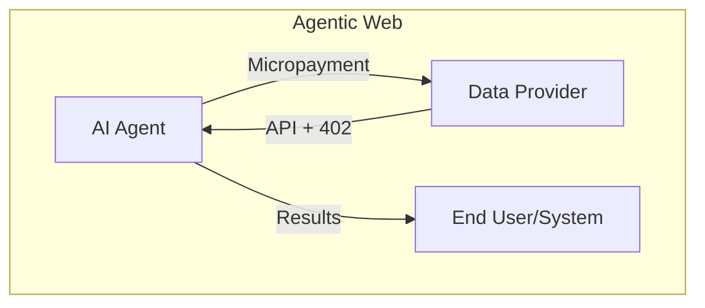

# HTTP

Application layer protocol defines:

- Types of messages exchanged.
- Syntax of various message types(fields definition).
- Semantics of fields.
- Rules for when/how to send/respond to messages.

## Protocol

Hypertext Transfer Protocol (RFC 2068):

- HTTP -> Socket Interface -> TCP.
- Stateless protocol.
- HTTP/1.0 默认不开启长连接: 客户端与服务端必须同时发送 `Connection: Keep-Alive`.
- HTTP/1.1 默认开启长连接:
  - `Keep-Alive: timeout=5, max=100`:
    表示 TCP 通道保持 5 秒, 最多接收 100 次请求.
  - `Keep-Alive` 无法保证客户端和服务器之间的连接一定活跃.
- HTTP 为无状态协议: 每个请求相互独立.

## Connections

- Non-persistent connections: 1 http request with 1 tcp connection.
- Persistent connections: multiple http request with 1 tcp connection.

## Message Format

HTTP request format:

```bash
request line -> (method field, object url field, protocol version)
header lines -> Host/Connections(close -> non-persistent connection)/User-agent/Accept-language
\r\n
entity body
```

HTTP response format:

```bash
status line -> (protocol version, status code, corresponding status message)
header lines -> Connections/Date/Server/Last-Modified/Content-Length(bytes)/Content-Type
\r\n
entity body
```

## Process

### Port to Transport Layer

- Bandwidth-sensitive application: UDP.
- Reliable-sensitive application: TCP.

| Application            | Application Layer | Transport Layer |
| ---------------------- | ----------------- | --------------- |
| Email                  | SMTP              | TCP             |
| Remote terminal access | Telnet            | TCP             |
| Web                    | HTTP/HTTPS        | TCP             |
| File transfer          | FTP               | TCP             |
| Streaming multimedia   | HTTP/HTTPS/RTP    | TCP/UDP         |
| Internet telephony     | SIP/RTP           | UDP             |

### Address

- IP (32 bits network layer): find specific host/end-system.
- Port (16 bits transport layer): find specific process.

## Status Codes

[RFC 2616](https://developer.mozilla.org/docs/Web/HTTP/Status)
defines the following
[status codes](https://evertpot.com/http):

- Informational responses: 100–199.
- Successful responses: 200–299.
  - 200 OK.
  - 201 Created.
  - 202 Accepted.
- Redirects: 300–399.
  - 301 Moved Permanently.
  - 302 Found.
  - 304 Not Modified.
  - 307 Temporary Redirect.
  - 308 Permanent Redirect.
- Client errors: 400–499.
  - 400 Bad Request.
  - 401 Unauthorized.
  - 403 Forbidden.
  - 404 Not Found.
  - 405 Method Not Allowed.
  - 406 Not Acceptable.
- Server errors: 500–599.
  - 500 Internal Server Error.
  - 501 Not Implemented.
  - 502 Bad Gateway.
  - 503 Service Unavailable.
  - 504 Gateway Timeout.

Use reasonable HTTP status codes:

- 200: general success.
- 201: successful creation.
- 301: moved permanently (SEO friendly).
- 302: moved temporarily.
- 304: not modified (HTTP cache).
- 400: bad requests from client.
- 401: unauthorized requests.
- 403: missing permissions.
- 404: missing resources.
- 429: too many requests.
- 5xx: internal errors (these should be avoided at all costs).


:::tip[HTTP 402]

HTTP 402 `Payment Required`
embeds payments directly into HTTP.
Based on [x402](https://github.com/coinbase/x402),
agent payments protocol (AP2) designed to [agentic commerce](https://www.msuiche.com/posts/when-machines-pay-machines-the-economics-of-agentic-ai).



:::

## Performance

限制 Web 性能的主要因素是客户端与服务器之间的网络往返延迟 (RTT):

- 持久化连接以支持连接重用: `N` 次 HTTP 请求节省的总延迟时间为 `(N-1) * RTT`.
- 分块传输编码以支持流式响应.
- 请求管道以支持并行请求处理 (局限性较大):
  - FIFO 管道, 队头请求会阻塞后续请求.
  - 应用必须处理中断的连接并恢复.
  - 应用必须处理中断请求的幂等问题.
  - 应用必须保护自身不受出问题的代理的影响.
- 模拟多路复用: 并行使用多个 TCP 连接 (大多数现代浏览器支持每个主机打开 6 个连接).
- 利用多个 TCP 连接进行域名分区.
- Resources bundling and inlining (但一定程度上放弃缓存粒度).
- 改进的更好的缓存机制.
