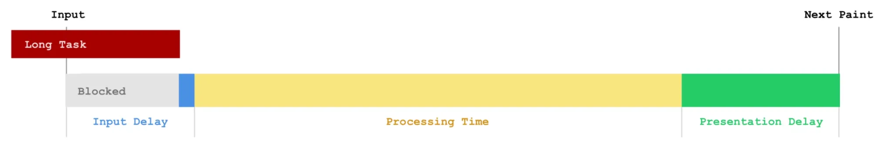

# Web Vitals

## Web Performance API

```ts
performance.mark('mainThread-start')
expensiveCalculation()
performance.mark('mainThread-stop')
performance.measure('mainThread', 'mainThread-start', 'mainThread-stop')
```

```ts
// 计算加载时间.
function getPerformanceTiming() {
  const performance = window.performance

  if (!performance) {
    // 当前浏览器不支持.
    console.log('你的浏览器不支持 performance 接口')
    return
  }

  const t = performance.timing
  const times = {}

  // 【重要】页面加载完成的时间.
  // 【原因】几乎代表了用户等待页面可用的时间.
  times.loadPage = t.loadEventEnd - t.navigationStart

  // 【重要】解析 DOM 树结构的时间.
  // 【原因】DOM 树嵌套过多.
  times.domReady = t.domComplete - t.responseEnd

  // 【重要】重定向的时间.
  // 【原因】拒绝重定向. e.g. http://example.com/ 不应写成 http://example.com.
  times.redirect = t.redirectEnd - t.redirectStart

  // 【重要】DNS 查询时间.
  // 【原因】DNS 预加载做了么? 页面内是不是使用了太多不同的域名导致域名查询的时间太长?
  // 可使用 HTML5 Prefetch 预查询 DNS, 见: [HTML5 prefetch](http://segmentfault.com/a/1190000000633364).
  times.lookupDomain = t.domainLookupEnd - t.domainLookupStart

  // 【重要】读取页面第一个字节的时间.
  // 【原因】这可以理解为用户拿到你的资源占用的时间, 加异地机房了么, 加CDN 处理了么? 加带宽了么? 加 CPU 运算速度了么?
  // TTFB 即 Time To First Byte 的意思.
  // 维基百科: https://en.wikipedia.org/wiki/Time_To_First_Byte.
  times.ttfb = t.responseStart - t.navigationStart

  // 【重要】内容加载完成的时间.
  // 【原因】页面内容经过 gzip 压缩了么, 静态资源 `CSS`/`JS` 等压缩了么?
  times.request = t.responseEnd - t.requestStart

  // 【重要】执行 onload 回调函数的时间.
  // 【原因】是否太多不必要的操作都放到 onload 回调函数里执行了, 考虑过延迟加载/按需加载的策略么?
  times.loadEvent = t.loadEventEnd - t.loadEventStart

  // DNS 缓存时间.
  times.appCache = t.domainLookupStart - t.fetchStart

  // 卸载页面的时间.
  times.unloadEvent = t.unloadEventEnd - t.unloadEventStart

  // TCP 建立连接完成握手的时间.
  times.connect = t.connectEnd - t.connectStart
  return times
}
```

```ts
const [pageNav] = performance.getEntriesByType('navigation')

// Measuring DNS lookup time.
const totalLookupTime = pageNav.domainLookupEnd - pageNav.domainLookupStart

// Quantifying total connection time.
const connectionTime = pageNav.connectEnd - pageNav.connectStart
let tlsTime = 0 // <-- Assume 0 to start with

// Was there TLS negotiation?
if (pageNav.secureConnectionStart > 0) {
  // Awesome! Calculate it!
  tlsTime = pageNav.connectEnd - pageNav.secureConnectionStart
}

// Cache seek plus response time of the current document.
const fetchTime = pageNav.responseEnd - pageNav.fetchStart

// Service worker time plus response time.
let workerTime = 0

if (pageNav.workerStart > 0) {
  workerTime = pageNav.responseEnd - pageNav.workerStart
}

// Request time only (excluding redirects, DNS, and connection/TLS time).
const requestTime = pageNav.responseStart - pageNav.requestStart

// Response time only (download).
const responseTime = pageNav.responseEnd - pageNav.responseStart

// Request + response time.
const requestResponseTime = pageNav.responseEnd - pageNav.requestStart
```

## FP

First paint time:

```ts
function entryHandler(list) {
  for (const entry of list.getEntries()) {
    if (entry.name === 'first-paint') {
      observer.disconnect()
    }

    console.log(entry)
  }
}

const observer = new PerformanceObserver(entryHandler)
observer.observe({ type: 'paint', buffered: true })

// {
//   duration: 0,
//   entryType: "paint",
//   name: "first-paint",
//   startTime: 359,
// }
```

## FCP

First Contentful Paint:

- Add the `defer` or `async` attributes to `<script>` tags.
- Minify the JavaScript and CSS files.
- Remove unused CSS (e.g. Tailwind.css JIT mode).
- Lazy importing components not for first page.
- Server side rendering.
- Reduce server response time (e.g. CDN).
- TBT (Total Blocking Time) = TTI (Time to Interactive) - FCP (First Contentful Paint).

```ts
function entryHandler(list) {
  for (const entry of list.getEntries()) {
    if (entry.name === 'first-contentful-paint') {
      observer.disconnect()
    }

    console.log(entry)
  }
}

const observer = new PerformanceObserver(entryHandler)
observer.observe({ type: 'paint', buffered: true })

// {
//   duration: 0,
//   entryType: "paint",
//   name: "first-contentful-paint",
//   startTime: 459,
// }
```

## LCP

Largest Contentful Paint:

- Use a CDN for assets like images and video.
- Compress images:
  - Minify images.
  - Convert images from JPEG/PNG to WebP.
- Responsive images:
  size image based on device size with `srcset` on `` or `<picture>`.
- 渐进渲染是提高 `SpeedIndex` 关键: 结合 `Suspense` 优先渲染已准备好的视图, 渐进渲染等待数据的视图.
- LCP optimization [checklist](https://calibreapp.com/blog/largest-contentful-paint).
- LCP optimization [guide](https://csswizardry.com/2022/03/optimising-largest-contentful-paint).

```ts
function entryHandler(list) {
  if (observer) {
    observer.disconnect()
  }

  for (const entry of list.getEntries()) {
    console.log(entry)
  }
}

const observer = new PerformanceObserver(entryHandler)
observer.observe({ type: 'largest-contentful-paint', buffered: true })

// {
//   duration: 0,
//   element: p,
//   entryType: 'largest-contentful-paint',
//   id: '',
//   loadTime: 0,
//   name: '',
//   renderTime: 1021.299,
//   size: 37932,
//   startTime: 1021.299,
//   url: '',
// }
```

Emulate slow third-party resources with [Playwright](https://www.checklyhq.com/blog/how-playwright-can-monitor-third-party-resources):

```ts
import { expect, test } from '@playwright/test'

test('works with slows resources', async ({ page }) => {
  page.route(
    '**',
    route =>
      new Promise((resolve) => {
        const requestURL = route.request().url()

        if (requestURL.match(/http:\/\/localhost:8080/)) {
          resolve(route.continue())
        } else {
          setTimeout(() => {
            console.log(`Delaying ${requestURL}`)
            resolve(route.continue())
          }, 10000)
        }
      }),
  )
  await page.goto('http://localhost:8080')

  const largestContentfulPaint = await page.evaluate(() => {
    return new Promise((resolve) => {
      new PerformanceObserver((l) => {
        const entries = l.getEntries()
        // the last entry is the largest contentful paint
        const largestPaintEntry = entries.at(-1)
        resolve(largestPaintEntry.startTime)
      }).observe({
        type: 'largest-contentful-paint',
        buffered: true,
      })
    })
  })

  console.log(`CLP: ${Number.parseFloat(largestContentfulPaint)}ms`)

  // Expect a title "to contain" a substring.
  await expect(page).toHaveTitle(/Frontend downtime/)
})
```

对于 `<video>` 元素,
[预加载海报](https://calendar.perfplanet.com/2025/insights-from-100-site-speed-reviews-in-2025)
可以大幅改善 LCP:

- `fetchpriority="high"` to preload.
- `aspect-ratio` to match video.
- `object-fit: cover` to prevents re-renders.

```html
<link rel="preload" as="image" href="posterimage.svg" fetchpriority="high" />

<video poster="/assets/posterimage.svg" autoplay="" muted="">
  <source src="/assets/video.mp4" type="video/mp4" />
</video>
```

## INP

[](https://frontendmasters.com/blog/understanding-inp)

Interaction to Next Paint (INP) 已取代 FID,
[成为 Core Web Vitals 的一部分](https://web.dev/blog/inp-cwv-launch):

- It considers the time between user's interaction and the next paint.
- Input delay: callback queue blocked by other higher priority tasks.
- Processing time: event handler execution time.
- Presentation delay: rendering and compositing time.

Improve INP for Vanilla.js:

- Reduce:
  减少不必要的代码,
  e.g. Useless polyfills, redundant animation and transition effects.
- Defer:
  推迟不需要在下一个绘制之前运行的代码,
  e.g. Lazy loading, code splitting,
  defer irrelevant expensive calculations (`requestIdleCallback()`).
- Optimize:
  优化必须在下一个绘制之前运行的代码,
  e.g. Debounce, throttle, virtualized Window, time slicing (`yieldToMain()`).

Improve INP in [Next.js](https://www.thisdot.co/blog/improving-inp-in-react-and-next-js):

- Concurrent rendering with `useTransition` hook.
- Leverage automatic batching.
- Selective hydration [pattern](https://www.patterns.dev/react/react-selective-hydration).
- Leverage SSG and ISR for static content.
- Offloading heavy computations to [Web Workers](https://partytown.builder.io/nextjs).
- Prevent unnecessary re-renders with `Forget Compiler` and state management library.

## CLS

Cumulative Layout Shift:

- Set `height` and `width` attributes of image or video,
  so that it won’t move content around it once it’s loaded.
- Avoid using `popups` or `overlays`
  unless they appear when the user interacts with the page.
- When it’s necessary to move elements, use `transform` animations.

```ts
let sessionValue = 0
let sessionEntries = []
const cls = {
  subType: 'layout-shift',
  name: 'layout-shift',
  type: 'performance',
  pageURL: getPageURL(),
  value: 0,
}

function entryHandler(list) {
  for (const entry of list.getEntries()) {
    // Only count layout shifts without recent user input.
    if (!entry.hadRecentInput) {
      const firstSessionEntry = sessionEntries[0]
      const lastSessionEntry = sessionEntries[sessionEntries.length - 1]

      // If the entry occurred less than 1 second after the previous entry and
      // less than 5 seconds after the first entry in the session, include the
      // entry in the current session. Otherwise, start a new session.
      if (
        sessionValue
        && entry.startTime - lastSessionEntry.startTime < 1000
        && entry.startTime - firstSessionEntry.startTime < 5000
      ) {
        sessionValue += entry.value
        sessionEntries.push(formatCLSEntry(entry))
      } else {
        sessionValue = entry.value
        sessionEntries = [formatCLSEntry(entry)]
      }

      // If the current session value is larger than the current CLS value,
      // update CLS and the entries contributing to it.
      if (sessionValue > cls.value) {
        cls.value = sessionValue
        cls.entries = sessionEntries
        cls.startTime = performance.now()
        lazyReportCache(deepCopy(cls))
      }
    }
  }
}

const observer = new PerformanceObserver(entryHandler)
observer.observe({ type: 'layout-shift', buffered: true })

// {
//   duration: 0,
//   entryType: "layout-shift",
//   hadRecentInput: false,
//   lastInputTime: 0,
//   name: "",
//   sources: (2) [LayoutShiftAttribution, LayoutShiftAttribution],
//   startTime: 1176.199999999255,
//   value: 0.000005752046026677329,
// }
```

## Core Web Vitals

Google [Core Web Vitals](https://web.dev/articles/vitals):

- 加载 (Loading): LCP.
- 交互 (Interactivity): INP.
- 视觉稳定 (Visual Stability): CLS.

## PRPL Pattern

`PRPL` pattern focuses on 4 main performance considerations:

- Pushing critical resources efficiently:
  minimize amount of round trips to server and reducing loading time.
- Rendering initial route soon as possible:
  improve user experience.
- Pre-caching assets in the background for frequently visited routes:
  minimize amount of requests to server and enable better offline experience.
- Lazily loading routes and assets that aren’t requested as frequently.

## Performance Best Practice

- Code optimization:
  - Fast CSS styles: `CSS Performance`.
  - Fast JavaScript code (`Effective JavaScript`):
    - DOM performance.
    - React performance.
    - Concurrency: asynchronous/web worker.
    - Use monomorphic objects due to shape and inline caches.
    - Use monomorphic function in hot code paths.
- Resources optimization (HTML/CSS/JS/Images/Audio/Video/Fonts):
  - Remove useless files: Chrome devtool code coverage panel.
  - Code splitting: Webpack `splitChunks`.
  - Tree shaking.
  - Gzip/Brotli (`Accept-Encoding`/`Content-Encoding`).
  - CDN: faster resources.
- Loading performance:
  - PreFetch/PreLoad/PreRendering (SSR).
  - Lazy loading: HTML/CSS/JS/Images/Audio/Video/Fonts.
  - Resources priority hints.
  - Resources loading hints.
- Web caching:
  - Offline caching: PWA.
  - HTTP caching: 强缓存与协商缓存.
  - CDN: shared public caches.
- Network protocols performance:
  - Reducing HTTP requests.
    - 重用 TCP 连接.
    - 多路复用.
    - 减少传输冗余资源.
  - Caching and reducing DNS lookups:
    - Remove too much domains.
    - HTML5 DNS prefetch.
  - Avoid HTTP redirects.
  - CDN: minimize RTT.

## Performance Tools

Speed tools [list](https://web.dev/speed-tools):

- [WebPageTest](https://www.webpagetest.org)
- [PageSpeed Insights](https://pagespeed.web.dev)
- Chrome UX [report](https://developer.chrome.com/docs/crux).
- Chrome [DevTools](https://developer.chrome.com/docs/devtools)
- LightHouse CI [action](https://github.com/treosh/lighthouse-ci-action).
- Chrome audit [tab](https://github.com/GoogleChrome/lighthouse):
  - Performance [audit](https://web.dev/lighthouse-performance).
  - PWA [audit](https://web.dev/lighthouse-pwa).
  - Best practices [audit](https://web.dev/lighthouse-best-practices).
  - Accessibility [audit](https://web.dev/lighthouse-accessibility).
  - SEO [audit](https://web.dev/lighthouse-seo).
- Chrome inspector: `chrome://inspect/#devices` to start inspecting.

## Web Vitals Reference

- LCP optimization [guide](https://web.dev/optimize-lcp).
- INP optimization [guide](https://web.dev/explore/how-to-optimize-inp).
- CLS optimization [guide](https://web.dev/optimize-cls).
- Web latency [guide](https://vercel.com/blog/latency-numbers-every-web-developer-should-know).
- Web vitals measurement [best practices](https://web.dev/vitals-field-measurement-best-practices).
- Web vitals field data debugging [guide](https://web.dev/debug-web-vitals-in-the-field).
- Web vitals real world [case](https://mp.weixin.qq.com/s/zJMM4SF7pc6LZPCsQfWOxw).

## Performance Reference

- `web.dev` performance optimization [guide](https://web.dev/explore/fast).
- `web.dev` performance newbie [course](https://web.dev/learn/performance).
- Performance [budgets](https://www.speedcurve.com/blog/performance-budgets).
- Next.js SEO [course](https://nextjs.org/learn/seo).
- The [anatomy](https://calendar.perfplanet.com/2025/the-anatomy-of-a-web-performance-report) of a web performance report.
