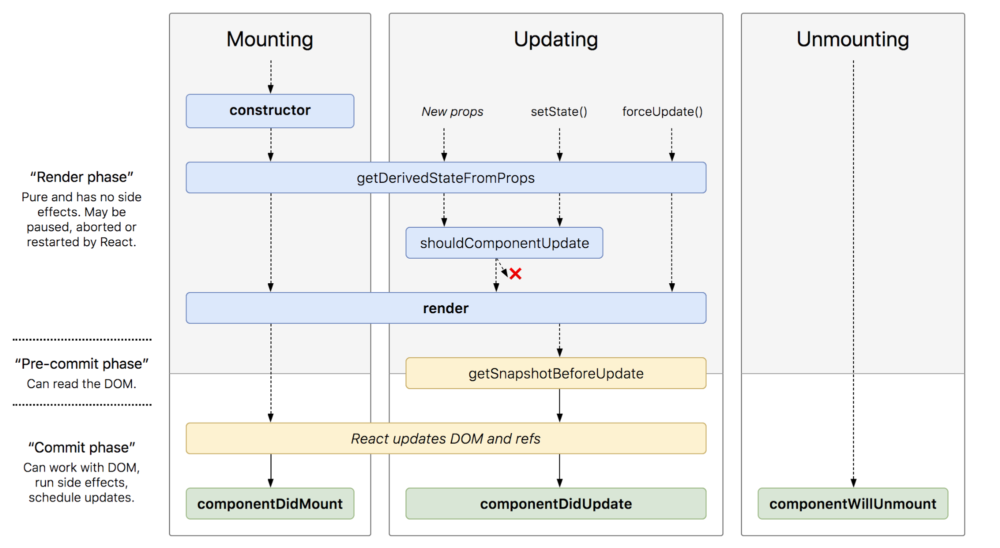
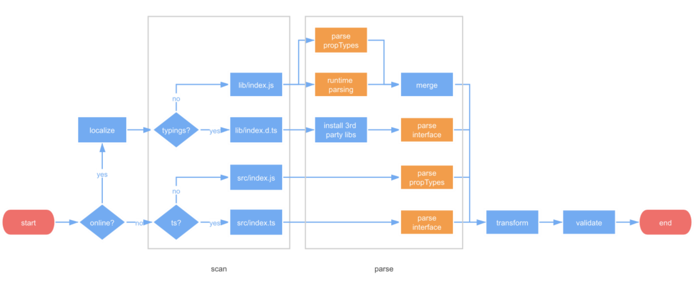
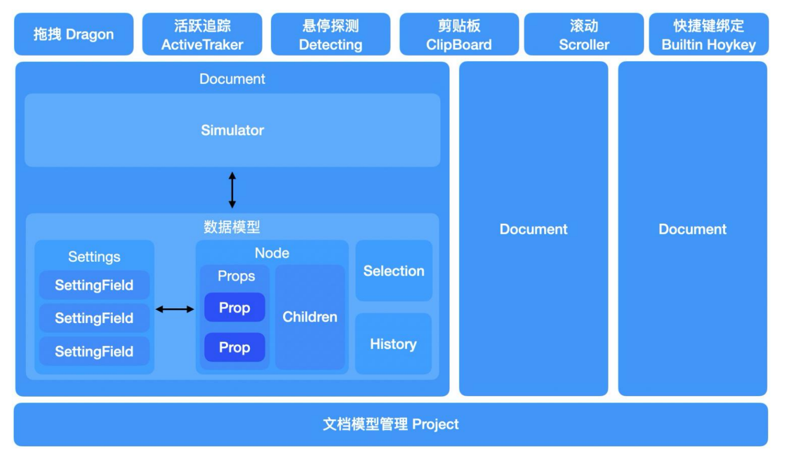
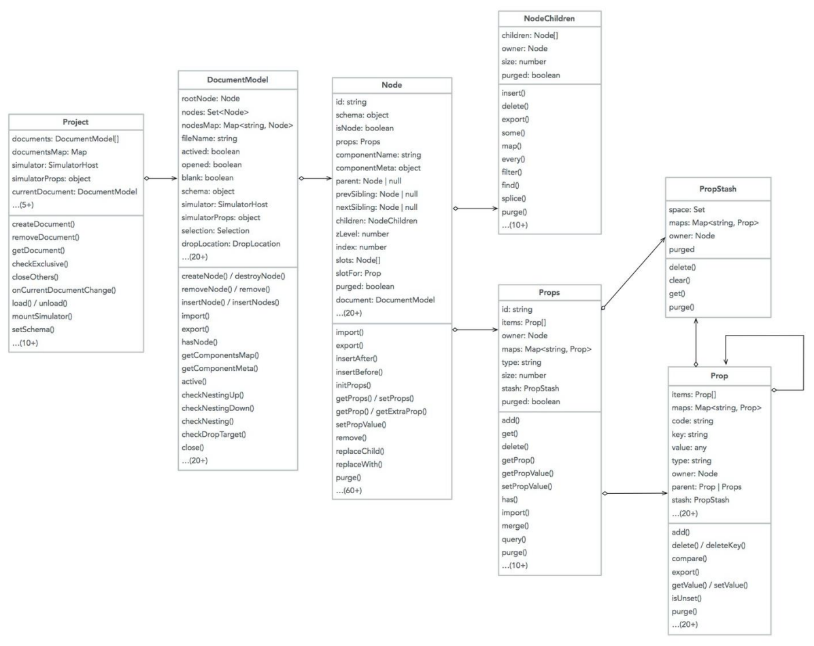

# React Basic Notes

## Props and States

### SetState

- `setState` synchronous way:
  when it comes `blocking mode`
  (`ReactDOM.createBlockingRoot(rootNode).render(<App />)`),
  `setState` works in synchronous mode:
  `scheduleUpdateOnFiber` -> `ensureRootIsScheduled` -> **`flushSyncCallbackQueue`**.
- `setState` asynchronous way:
  at most of the other time, `setState` works in asynchronous mode,
  including `legacy mode`(`ReactDOM.render(<App />, rootNode)`)
  and `concurrent mode`(`ReactDOM.createRoot(rootNode).render(<App />)`).
- 在异步模式下, 为了防止子组件在处理事件时多次渲染,
  将多个 `setState` (包括父组件) 移到浏览器事件之后执行
  (`Batched Updates`: 此时 React 内部变量 `isBatchingUpdates` 变成 `true`),
  可以提升 React 性能.
  未来会在更多的可以 `Batched Updates` 的场景下将 `setState` 设为异步执行,
  所以编写代码时最好将 `setState` 总是当做异步执行函数.

```tsx
class Example extends React.Component {
  constructor() {
    super()
    this.state = {
      val: 0,
    }
  }

  componentDidMount() {
    this.setState({ val: this.state.val + 1 })
    console.log(this.state.val) // 第 1 次 log

    this.setState({ val: this.state.val + 1 })
    console.log(this.state.val) // 第 2 次 log

    setTimeout(() => {
      this.setState({ val: this.state.val + 1 })
      console.log(this.state.val) // 第 3 次 log

      this.setState({ val: this.state.val + 1 })
      console.log(this.state.val) // 第 4 次 log
    }, 0)
  }

  render() {
    return <div>Example</div>
  }
}

// => 0 0 2 3
```

:::tip State Structure Principles

[Principles for structuring state](https://beta.reactjs.org/learn/choosing-the-state-structure):

- Group related state.
- Avoid contradictions in state.
- Avoid duplication in state.
- Avoid redundant state.
- Avoid deeply nested state.

:::

### componentDidMount

- Don't `setState` directly in this method.
- Can use `setInterval`/`setTimeout`/AJAX request/`fetch` in this method,
  and call `setState` as `callback` inside these functions.

```tsx
class MyComponent extends React.Component {
  constructor(props) {
    super(props)
    this.state = {
      error: null,
      isLoaded: false,
      items: [],
    }
  }

  componentDidMount() {
    fetch('https://api.example.com/items')
      .then(res => res.json())
      .then(
        (result) => {
          this.setState({
            isLoaded: true,
            items: result.items,
          })
        },
        // Note: it's important to handle errors here
        // instead of a catch() block so that we don't swallow
        // exceptions from actual bugs in components.
        (error) => {
          this.setState({
            isLoaded: true,
            error,
          })
        },
      )
  }

  render() {
    const { error, isLoaded, items } = this.state
    if (error) {
      return (
        <div>
          Error:
          {error.message}
        </div>
      )
    } else if (!isLoaded) {
      return <div>Loading...</div>
    } else {
      return (
        <ul>
          {items.map(item => (
            <li key={item.name}>
              {item.name}
              {' '}
              {item.price}
            </li>
          ))}
        </ul>
      )
    }
  }
}
```

### Props Validation

- `React.PropTypes.array/bool/func/number/object/string/symbol/node/element`.
- `React.PropTypes.any.isRequired`.
- `React.PropTypes.objectOf(React.PropsTypes.number)`.
- `React.PropTypes.arrayOf(React.PropsTypes.number)`.
- `React.PropTypes.instanceOf/oneOf/oneOfType(type)`.

## Element and Component

React Element 实际上是纯对象,
可由 `React.createElement()`/`JSX`/`Element Factory Helper` 创建,
并被 React 在必要时渲染成真实的 DOM Nodes.

```ts
type ReactInternalType =
  | 'react.element'
  | 'react.portal'
  | 'react.fragment'
  | 'react.strict_mode'
  | 'react.profiler'
  | 'react.provider'
  | 'react.context'
  | 'react.forward_ref'
  | 'react.suspense'
  | 'react.suspense_list'
  | 'react.memo'
  | 'react.lazy'
  | 'react.block'
  | 'react.server.block'
  | 'react.fundamental'
  | 'react.scope'
  | 'react.opaque.id'
  | 'react.debug_trace_mode'
  | 'react.offscreen'
  | 'react.legacy_hidden'

export interface ReactElement<Props> {
  $$typeof: any
  key: string | number | null
  type:
    | string
    | ((props: Props) => ReactElement<any>)
    | (new (props: Props) => ReactComponent<any>)
    | ReactInternalType
  props: Props
  ref: Ref

  // ReactFiber
  _owner: any

  // __DEV__
  _store: { validated: boolean }
  _self: React$Element<any>
  _shadowChildren: any
  _source: Source
}
```

```ts
ReactDOM.render(
  {
    type: Form,
    props: {
      isSubmitted: false,
      buttonText: 'OK!',
    },
  },
  document.getElementById('root'),
)

// React: You told me this...
const FormElement = {
  type: Form,
  props: {
    isSubmitted: false,
    buttonText: 'OK!',
  },
}

// React: ...And Form told me this...
const ButtonElement = {
  type: Button,
  props: {
    children: 'OK!',
    color: 'blue',
  },
}

// React: ...and Button told me this! I guess I'm done.
const HTMLButtonElement = {
  type: 'button',
  props: {
    className: 'button button-blue',
    children: {
      type: 'b',
      props: {
        children: 'OK!',
      },
    },
  },
}
```

### JSX

在 JSX 中, 小写标签被认为是 HTML 标签.
但是, 含有 `.` 的大写和小写标签名却不是.

- `<component />`: 转换为 `React.createElement('component')` (e.g HTML native tag).
- `<obj.component />`: 转换为 `React.createElement(obj.component)`.
- `<Component />`: 转换为 `React.createElement(Component)`.

#### JSX Transform

- [New JSX transform](https://reactjs.org/blog/2020/09/22/introducing-the-new-jsx-transform.html).

```ts
import React from 'react'

function App() {
  return React.createElement('h1', null, 'Hello world')
}
```

```ts
// Inserted by a compiler
import { jsx as _jsx } from 'react/jsx-runtime'

function App() {
  return _jsx('h1', { children: 'Hello world' })
}
```

ESLint config for new JSX transform:

```json
{
  "rules": {
    "react/jsx-uses-react": "off",
    "react/react-in-jsx-scope": "off"
  }
}
```

TypeScript config for new JSX transform:

```json
{
  "include": ["./src/**/*"],
  "compilerOptions": {
    "module": "esnext",
    "target": "es2015",
    "jsx": "react-jsx",
    "strict": true
  }
}
```

### Functional and Class component

- 函数型组件没有实例, 类型组件具有实例, 但实例化的工作由 react 自动完成
- With React Hooks, functional component can get
  `state`, `lifecycle hooks` and performance optimization
  consistent to class component.

### Stateless and Stateful component

React Component
[definition](https://github.com/facebook/react/blob/main/packages/react/src/ReactBaseClasses.js):

- `React.Component`.
- `React.PureComponent`.

```ts
interface NewLifecycle<P, S, SS> {
  getSnapshotBeforeUpdate?: (
    prevProps: Readonly<P>,
    prevState: Readonly<S>,
  ) => SS | null

  componentDidUpdate?: (
    prevProps: Readonly<P>,
    prevState: Readonly<S>,
    snapshot?: SS,
  ) => void
}

interface ComponentLifecycle<P, S, SS = any> extends NewLifecycle<P, S, SS> {
  componentDidMount?: () => void

  shouldComponentUpdate?: (
    nextProps: Readonly<P>,
    nextState: Readonly<S>,
    nextContext: any,
  ) => boolean

  componentWillUnmount?: () => void

  componentDidCatch?: (error: Error, errorInfo: ErrorInfo) => void
}

class Component<P = object, S = object, SS = any> extends ComponentLifecycle<
  P,
  S,
  SS
> {
  readonly props: Readonly<P> & Readonly<{ children?: ReactNode | undefined }>
  state: Readonly<S>

  static contextType?: Context<any> | undefined
  context: any

  constructor(props: Readonly<P> | P)

  setState<K extends keyof S>(
    state:
      | ((prevState: Readonly<S>, props: Readonly<P>) => Pick<S, K> | S | null)
      | (Pick<S, K> | S | null),
    callback?: () => void,
  ): void

  forceUpdate(callback?: () => void): void

  render(): ReactNode
}

class PureComponent<P = object, S = object, SS = any> extends Component<
  P,
  S,
  SS
> {}
```

#### Stateless component

采用函数型声明, 不使用 `setState()`, 一般作为表现型组件.

#### Stateful component

- 采用类型声明, 使用 setState(), 一般作为容器型组件(containers)
- 结合 Redux 中的 connect 方法, 将 store 中的 state 作为此类组件的 props

```tsx
class Component {
  render() {
    this.setState((prevState, props) => ({
      counter: prevState.counter + props.increment,
    }))

    return <div>Component</div>
  }
}
```

### Component Lifecycle

- Reconciliation phase:
  - constructor.
  - getDerivedStateFromProps.
  - getDerivedStateFromError.
  - shouldComponentUpdate.
  - `ClassComponent` `render` function.
  - `setState` updater functions.
  - `FunctionComponent` body function.
  - `useState`/`useReducer`/`useMemo` updater functions.
  - `UNSAFE_componentWillMount`.
  - `UNSAFE_componentWillReceiveProps`.
  - `UNSAFE_componentWillUpdate`.
- Commit phase:
  - componentDidMount.
  - getSnapshotBeforeUpdate.
  - componentDidUpdate.
  - componentWillUnmount.
  - componentDidCatch.

因为协调阶段可能被中断与恢复, 甚至重做,
React 协调阶段的生命周期钩子可能会被调用多次,
**协调阶段的生命周期钩子不要包含副作用**: e.g `fetch` promises, `async` functions.
通过 [`React.StrictMode`](https://reactjs.org/docs/strict-mode.html#detecting-unexpected-side-effects)
可以自动检测应用中隐藏的问题.

[](https://reactjs.org/docs/react-component.html#the-component-lifecycle)

#### Creation and Mounting Phase

`constructor(props, context)`
-> `static getDerivedStateFromProps()`
-> `render()`
-> `componentDidMount()`.

#### Updating Phase

Update for three reasons:

- Parent/top components (re-)rendering.
- `this.setState()` called.
- `this.forceUpdate()` called.

`static getDerivedStateFromProps()`
-> `shouldComponentUpdate(nextProps, nextState)`
-> `render()`
-> `getSnapshotBeforeUpdate()`
-> `componentDidUpdate(prevProps, prevState)`.

`getSnapshotBeforeUpdate()`:
在最新的渲染输出提交给 DOM 前将会立即调用,
这对于从 DOM 捕获信息（比如：滚动位置）很有用.

#### Unmounting Phase

`componentWillUnmount()`.

#### Error Handling Phase

`static getDerivedStateFromError()`
-> `componentDidCatch()`.

### Render Function

- Default render behavior (without any `memo`/`useMemo`/`PureComponent`):
  when a parent component renders,
  React will recursively render **all child components** inside of it
  (because `props.children` is always a new reference when parent re-rendering).
- Render logic:
  - Can't mutate existing variables and objects.
  - Can't create random values like `Math.random()` or `Date.now()`.
  - Can't make network requests.
  - Can't queue state updates.

### React Element API

#### React Clone Element API

Modify children properties:

```tsx
function CreateTextWithProps({
  text,
  ASCIIChar,
  ...props
}: {
  text: string
  ASCIIChar: string
}) {
  return (
    <span {...props}>
      {text}
      {ASCIIChar}
    </span>
  )
}

function RepeatCharacters({ times, children }) {
  return React.cloneElement(children, {
    ASCIIChar: children.props.ASCIIChar.repeat(times),
  })
}

export default function App() {
  return (
    <div>
      <RepeatCharacters times={3}>
        <CreateTextWithProps text="Foo Text" ASCIIChar="." />
      </RepeatCharacters>
    </div>
  )
}
```

```tsx
function RadioGroup(props: { name: string, children: ReactElement }) {
  const RenderChildren = () =>
    React.Children.map(props.children, (child) => {
      return React.cloneElement(child, {
        name: props.name,
      })
    })

  return (
    <div>
      <RenderChildren />
    </div>
  )
}

function RadioButton(props: {
  value: string
  name: string
  children: ReactElement
}) {
  return (
    <label>
      <input type="radio" value={props.value} name={props.name} />
      {props.children}
    </label>
  )
}

export default function App() {
  return (
    <RadioGroup name="numbers">
      <RadioButton value="first">First</RadioButton>
      <RadioButton value="second">Second</RadioButton>
      <RadioButton value="third">Third</RadioButton>
    </RadioGroup>
  )
}
```

#### React Children API

- `React.Children.toArray(children)`.
- `React.Children.forEach(children, fn)`.
- `React.Children.map(children, fn)`.
- `React.Children.count(children)`.
- `React.Children.only(children)`.

```tsx
import { Children, cloneElement } from 'react'

function Breadcrumbs({ children }: { children: ReactElement }) {
  const arrayChildren = Children.toArray(children)

  return (
    <ul
      style={{
        listStyle: 'none',
        display: 'flex',
      }}
    >
      {Children.map(arrayChildren, (child, index) => {
        const isLast = index === arrayChildren.length - 1

        if (!isLast && !child.props.link) {
          throw new Error(
            `BreadcrumbItem child no. ${index + 1}
            should be passed a 'link' prop`,
          )
        }

        return (
          <>
            {child.props.link
              ? (
                <a
                  href={child.props.link}
                  style={{
                    display: 'inline-block',
                    textDecoration: 'none',
                  }}
                >
                  <div style={{ marginRight: '5px' }}>
                    {cloneElement(child, {
                      isLast,
                    })}
                  </div>
                </a>
                )
              : (
                <div style={{ marginRight: '5px' }}>
                  {cloneElement(child, {
                    isLast,
                  })}
                </div>
                )}
            {!isLast && <div style={{ marginRight: '5px' }}></div>}
          </>
        )
      })}
    </ul>
  )
}

function BreadcrumbItem({
  isLast,
  children,
}: {
  isLast: boolean
  children: ReactElement
}) {
  return (
    <li
      style={{
        color: isLast ? 'black' : 'blue',
      }}
    >
      {children}
    </li>
  )
}

export default function App() {
  return (
    <Breadcrumbs>
      <BreadcrumbItem link="https://example.com/">Example</BreadcrumbItem>
      <BreadcrumbItem link="https://example.com/hotels/">Hotels</BreadcrumbItem>
      <BreadcrumbItem>A Fancy Hotel Name</BreadcrumbItem>
    </Breadcrumbs>
  )
}
```

### Refs

Refs 用于返回对元素的引用.
但在大多数情况下, 应该避免使用它们.
当需要直接访问 DOM 元素或组件的实例时, 它们可能非常有用:

- Managing focus, text selection, or media playback.
- Triggering imperative animations.
- Integrating with third-party DOM libraries.k

`Ref` 通过将 Fiber 树中的 `instance` 赋给 `ref.current` 实现

```ts
function commitAttachRef(finishedWork: Fiber) {
  // finishedWork 为含有 Ref effectTag 的 Fiber
  const ref = finishedWork.ref

  // 含有 ref prop, 这里是作为数据结构
  if (ref !== null) {
    // 获取 ref 属性对应的 Component 实例
    const instance = finishedWork.stateNode
    let instanceToUse
    switch (finishedWork.tag) {
      case HostComponent:
        // 对于 HostComponent, 实例为对应 DOM 节点
        instanceToUse = getPublicInstance(instance)
        break
      default:
        // 其他类型实例为 fiber.stateNode
        instanceToUse = instance
    }

    // 赋值 ref
    if (typeof ref === 'function')
      ref(instanceToUse)
    else ref.current = instanceToUse
  }
}
```

```tsx
class CssThemeProvider extends React.PureComponent<Props> {
  private rootRef = React.createRef<HTMLDivElement>()

  render() {
    return <div ref={this.rootRef}>{this.props.children}</div>
  }
}
```

#### String Refs

**不建议使用** [`String Refs`](https://github.com/facebook/react/pull/8333#issuecomment-271648615):

- React 无法获取 `this` 引用, 需要持续追踪当前`render`出的组件, 性能变慢.
- `String Refs` 不可组合化:
  if library puts ref on passed child, user can't put another ref on it.
  `Callback Refs` are perfectly composable.
- `String Refs` don't work with static analysis:
  `Flow` can't guess the magic that framework does to make string ref appear on `this.refs`,
  as well as its type (which could be different).
  `Callback Refs` are friendly to static analysis.

```tsx
class Foo extends Component {
  render() {
    // eslint-disable-next-line react/no-string-refs
    return <input onClick={() => this.action()} ref="input" />
  }

  action() {
    // eslint-disable-next-line react/no-string-refs
    console.log(this.refs.input.value)
  }
}
```

```tsx
class App extends React.Component<{ data: object }> {
  renderRow = (index) => {
    // ref 会绑定到 DataTable 组件实例, 而不是 App 组件实例上
    return <input ref={`input-${index}`} />

    // 如果使用 function 类型 ref, 则不会有这个问题
    // return <input ref={input => this['input-' + index] = input} />;
  }

  render() {
    return <DataTable data={this.props.data} renderRow={this.renderRow} />
  }
}
```

#### Forward Refs

不能在函数式组件上使用`ref`属性,
因为它们没有实例, 但可以在函数式组件内部使用`ref`.
Ref forwarding 是一个特性,
它允许一些组件获取接收到 ref 对象并将它进一步传递给子组件.

```tsx
// functional component
function Button(props: { children: ReactElement }, ref) {
  return (
    <button ref={ref} className="CustomButton">
      {props.children}
    </button>
  )
}

const ButtonElement = React.forwardRef(Button)

// Create ref to the DOM button:
// get ref to `<button>`
const ref = React.createRef()
export default function App() {
  return <ButtonElement ref={ref}>Forward Ref</ButtonElement>
}
```

```tsx
type Ref = HTMLButtonElement
interface Props {
  children: React.ReactNode
  type: 'submit' | 'button'
}

function Button(props: Props, ref: Ref) {
  return (
    <button ref={ref} className="MyClassName" type={props.type}>
      {props.children}
    </button>
  )
}

const FancyButton = React.forwardRef<Ref, Props>(Button)

export default FancyButton
```

#### Callback Refs

```tsx
class UserInput extends Component {
  setSearchInput = (input) => {
    this.input = input
  }

  render() {
    return (
      <>
        <input type="text" ref={this.setSearchInput} />
        <button type="submit">Submit</button>
      </>
    )
  }
}
```

### Compound Components

Compound components [example](https://dev.to/alexi_be3/react-component-patterns-49ho):

```tsx
import * as React from 'react'

interface Props {
  onStateChange?: (e: string) => void
  defaultValue?: string
}

interface State {
  currentValue: string
  defaultValue?: string
}

interface RadioInputProps {
  label: string
  value: string
  name: string
  imgSrc: string
  key: string | number
  currentValue?: string
  onChange?: (e: React.ChangeEvent<HTMLInputElement>) => void
}

function RadioImageForm({
  children,
  onStateChange,
  defaultValue,
}: React.PropsWithChildren<Props>): React.ReactElement {
  const [state, setState] = React.useState<State>({
    currentValue: '',
    defaultValue,
  })

  // Memoized so that providerState isn't recreated on each render
  const providerState = React.useMemo(
    () => ({
      onChange: (event: React.ChangeEvent<HTMLInputElement>): void => {
        const value = event.target.value
        setState({
          currentValue: value,
        })
        onStateChange?.(value)
      },
      ...state,
    }),
    [state, onStateChange],
  )

  return (
    <div>
      <form>
        {React.Children.map(children, (child: React.ReactElement) =>
          React.cloneElement(child, {
            ...providerState,
          }),)}
      </form>
    </div>
  )
}

function RadioInput({
  currentValue,
  onChange,
  label,
  value,
  name,
  imgSrc,
  key,
}: RadioInputProps): React.ReactElement {
  return (
    <label className="radio-button-group" key={key}>
      <input
        type="radio"
        name={name}
        value={value}
        aria-label={label}
        onChange={onChange}
        checked={currentValue === value}
        aria-checked={currentValue === value}
      />
      
    </label>
  )
}

RadioImageForm.RadioInput = RadioInput

export default RadioImageForm
```

- Compound components manage their own internal state,
  which they share among several child components.
- When importing a compound component,
  automatically import child components available on compound component.

```tsx
import type { CSSProperties, ReactNode } from 'react'
import React from 'react'

interface Props {
  children: ReactNode
  style?: CSSProperties
  rest?: any
}

function Header({ children, style, ...rest }: Props): JSX.Element {
  return (
    <div style={{ ...style }} {...rest}>
      {children}
    </div>
  )
}

function Body({ children, style, ...rest }: Props): JSX.Element {
  return (
    <div style={{ ...style }} {...rest}>
      {children}
    </div>
  )
}

function Footer({ children, style, ...rest }: Props): JSX.Element {
  return (
    <div style={{ ...style }} {...rest}>
      {children}
    </div>
  )
}

function getChildrenOnDisplayName(children: ReactNode[], displayName: string) {
  return React.Children.map(children, child =>
    child.displayName === displayName ? child : null,)
}

function Card({ children }: { children: ReactNode[] }): JSX.Element {
  const header = getChildrenOnDisplayName(children, 'Header')
  const body = getChildrenOnDisplayName(children, 'Body')
  const footer = getChildrenOnDisplayName(children, 'Footer')

  return (
    <div className="card">
      {header && <div className="card-header">{header}</div>}
      <div className="card-body">{body}</div>
      {footer && <div className="card-footer">{footer}</div>}
    </div>
  )
}

Header.displayName = 'Header'
Body.displayName = 'Body'
Footer.displayName = 'Footer'
Card.Header = Header
Card.Body = Body
Card.Footer = Footer

function App() {
  return (
    <div>
      <Card>
        <Card.Header>Header</Card.Header>
        <Card.Body>Body</Card.Body>
        <Card.Footer>Footer</Card.Footer>
      </Card>
    </div>
  )
}

export default App
```

## React Synthetic Events

- Events delegation:
  - React 16: delegate events handlers on `document` DOM node.
  - React 17: delegate events handlers on `app` root DOM node.
  - 先处理原生事件, 后处理 React 事件.
- Events dispatching: dispatch native events to `React.onXXX` handlers by `SyntheticEvent`.
  - 收集监听器: `const listeners = accumulateSinglePhaseListeners(targetFiber, eventName)`.
  - 派发合成事件: `dispatchQueue.push({ new SyntheticEvent(eventName), listeners })`.
  - 执行派发:
    `processDispatchQueue(dispatchQueue, eventSystemFlags)`
    -> `executeDispatch(event, listener, currentTarget)`.
  - Capture event: 从上至下调用 Fiber 树中绑定的回调函数.
  - Bubble event: 从下至上调用 Fiber 树中绑定的回调函数.

[](https://7kms.github.io/react-illustration-series/main/synthetic-event)

[react-dom/src/events/DOMPluginEventSystem](https://github.com/facebook/react/blob/main/packages/react-dom/src/events/DOMPluginEventSystem.js):

```ts
function listenToAllSupportedEvents(rootContainerElement: EventTarget) {
  if (enableEagerRootListeners) {
    // 1. 节流优化, 保证全局注册只被调用一次.
    if (rootContainerElement[listeningMarker])
      return

    rootContainerElement[listeningMarker] = true

    // 2. 遍历 allNativeEvents 监听冒泡和捕获阶段的事件.
    allNativeEvents.forEach((domEventName) => {
      if (!nonDelegatedEvents.has(domEventName)) {
        listenToNativeEvent(
          domEventName,
          false, // 冒泡阶段监听.
          rootContainerElement,
          null,
        )
      }

      listenToNativeEvent(
        domEventName,
        true, // 捕获阶段监听.
        rootContainerElement,
        null,
      )
    })
  }
}

function listenToNativeEvent(
  domEventName: DOMEventName,
  isCapturePhaseListener: boolean,
  rootContainerElement: EventTarget,
  targetElement: Element | null,
  eventSystemFlags?: EventSystemFlags = 0,
): void {
  const target = rootContainerElement
  const listenerSet = getEventListenerSet(target)
  const listenerSetKey = getListenerSetKey(domEventName, isCapturePhaseListener)

  // 利用 Set 数据结构, 保证相同的事件类型只会被注册一次.
  if (!listenerSet.has(listenerSetKey)) {
    if (isCapturePhaseListener)
      eventSystemFlags |= IS_CAPTURE_PHASE

    // 注册事件监听.
    addTrappedEventListener(
      target,
      domEventName,
      eventSystemFlags,
      isCapturePhaseListener,
    )
    listenerSet.add(listenerSetKey)
  }
}

function addTrappedEventListener(
  targetContainer: EventTarget,
  domEventName: DOMEventName,
  eventSystemFlags: EventSystemFlags,
  isCapturePhaseListener: boolean,
  isDeferredListenerForLegacyFBSupport?: boolean,
) {
  // 1. 构造 listener.
  const listener = createEventListenerWrapperWithPriority(
    targetContainer,
    domEventName,
    eventSystemFlags,
  )

  // 2. 注册事件监听.
  let unsubscribeListener

  if (isCapturePhaseListener) {
    unsubscribeListener = addEventCaptureListener(
      targetContainer,
      domEventName,
      listener,
    )
  } else {
    unsubscribeListener = addEventBubbleListener(
      targetContainer,
      domEventName,
      listener,
    )
  }
}

// 注册原生冒泡事件.
function addEventBubbleListener(
  target: EventTarget,
  eventType: string,
  listener: Function,
): Function {
  target.addEventListener(eventType, listener, false)
  return listener
}

// 注册原生捕获事件.
function addEventCaptureListener(
  target: EventTarget,
  eventType: string,
  listener: Function,
): Function {
  target.addEventListener(eventType, listener, true)
  return listener
}
```

[react-dom/src/events/ReactDOMEventListener](https://github.com/facebook/react/blob/main/packages/react-dom/src/events/ReactDOMEventListener.js):

```ts
// 派发原生事件至 React.onXXX.
function createEventListenerWrapperWithPriority(
  targetContainer: EventTarget,
  domEventName: DOMEventName,
  eventSystemFlags: EventSystemFlags,
): Function {
  // 1. 根据优先级设置 listenerWrapper.
  const eventPriority = getEventPriorityForPluginSystem(domEventName)
  let listenerWrapper

  switch (eventPriority) {
    case DiscreteEvent:
      listenerWrapper = dispatchDiscreteEvent
      break
    case UserBlockingEvent:
      listenerWrapper = dispatchUserBlockingUpdate
      break
    case ContinuousEvent:
    default:
      listenerWrapper = dispatchEvent
      break
  }

  // 2. 返回 listenerWrapper.
  return listenerWrapper.bind(
    null,
    domEventName,
    eventSystemFlags,
    targetContainer,
  )
}

function dispatchDiscreteEvent(
  domEventName,
  eventSystemFlags,
  container,
  nativeEvent,
) {
  const previousPriority = getCurrentUpdatePriority()
  const prevTransition = ReactCurrentBatchConfig.transition
  ReactCurrentBatchConfig.transition = null

  try {
    setCurrentUpdatePriority(DiscreteEventPriority)
    dispatchEvent(domEventName, eventSystemFlags, container, nativeEvent)
  } finally {
    setCurrentUpdatePriority(previousPriority)
    ReactCurrentBatchConfig.transition = prevTransition
  }
}

function dispatchContinuousEvent(
  domEventName,
  eventSystemFlags,
  container,
  nativeEvent,
) {
  const previousPriority = getCurrentUpdatePriority()
  const prevTransition = ReactCurrentBatchConfig.transition
  ReactCurrentBatchConfig.transition = null

  try {
    setCurrentUpdatePriority(ContinuousEventPriority)
    dispatchEvent(domEventName, eventSystemFlags, container, nativeEvent)
  } finally {
    setCurrentUpdatePriority(previousPriority)
    ReactCurrentBatchConfig.transition = prevTransition
  }
}

function dispatchEvent(
  domEventName: DOMEventName,
  eventSystemFlags: EventSystemFlags,
  targetContainer: EventTarget,
  nativeEvent: AnyNativeEvent,
) {
  let blockedOn = findInstanceBlockingEvent(
    domEventName,
    eventSystemFlags,
    targetContainer,
    nativeEvent,
  )

  if (blockedOn === null) {
    dispatchEventForPluginEventSystem(
      domEventName,
      eventSystemFlags,
      nativeEvent,
      return_targetInst,
      targetContainer,
    )
    clearIfContinuousEvent(domEventName, nativeEvent)
    return
  }

  if (
    queueIfContinuousEvent(
      blockedOn,
      domEventName,
      eventSystemFlags,
      targetContainer,
      nativeEvent,
    )
  ) {
    nativeEvent.stopPropagation()
    return
  }

  // We need to clear only if we didn't queue because queueing is accumulative.
  clearIfContinuousEvent(domEventName, nativeEvent)

  if (
    eventSystemFlags & IS_CAPTURE_PHASE
    && isDiscreteEventThatRequiresHydration(domEventName)
  ) {
    while (blockedOn !== null) {
      const fiber = getInstanceFromNode(blockedOn)

      if (fiber !== null)
        attemptSynchronousHydration(fiber)

      const nextBlockedOn = findInstanceBlockingEvent(
        domEventName,
        eventSystemFlags,
        targetContainer,
        nativeEvent,
      )

      if (nextBlockedOn === null) {
        dispatchEventForPluginEventSystem(
          domEventName,
          eventSystemFlags,
          nativeEvent,
          return_targetInst,
          targetContainer,
        )
      }

      if (nextBlockedOn === blockedOn)
        break

      blockedOn = nextBlockedOn
    }

    if (blockedOn !== null)
      nativeEvent.stopPropagation()

    return
  }

  dispatchEventForPluginEventSystem(
    domEventName,
    eventSystemFlags,
    nativeEvent,
    null,
    targetContainer,
  )
}
```

## React Reusability Patterns

### HOC

Higher Order Components.

Solve:

- Reuse code with using ES6 classes.
- Compose multiple HOCs.

Upside:

- Reusable (abstract same logic).
- HOC is flexible with input data
  (pass input data as parameters or derive it from props).

Downside:

- Wrapper hell: `withA(withB(withC(withD(Comp))))`.
- Implicit dependencies: which HOC providing a certain prop.
- Name collision/overlap props: overwrite the same name prop silently.
- HOC is not flexible with output data (to WrappedComponent).

```tsx
// ToggleableMenu.jsx
function withToggleable(Clickable) {
  return class Toggleable extends React.Component<{ children: ReactElement }> {
    constructor() {
      super()
      this.toggle = this.toggle.bind(this)
      this.state = { show: false }
    }

    toggle() {
      this.setState(prevState => ({ show: !prevState.show }))
    }

    render() {
      return (
        <div>
          <Clickable {...this.props} onClick={this.toggle} />
          {this.state.show && this.props.children}
        </div>
      )
    }
  }
}

class NormalMenu extends React.Component<{ onClick: Function, title: string }> {
  render() {
    return (
      <div onClick={this.props.onClick}>
        <h1>{this.props.title}</h1>
      </div>
    )
  }
}

const ToggleableMenu = withToggleable(NormalMenu)
export default ToggleableMenu
```

```tsx
class Menu extends React.Component {
  render() {
    return (
      <div>
        <ToggleableMenu title="First Menu">
          <p>Some content</p>
        </ToggleableMenu>
        <ToggleableMenu title="Second Menu">
          <p>Another content</p>
        </ToggleableMenu>
        <ToggleableMenu title="Third Menu">
          <p>More content</p>
        </ToggleableMenu>
      </div>
    )
  }
}
```

### Render Props

Children/Props as render function:

Solve:

- Reuse code with using ES6 classes.
- Lowest level of indirection.
- No naming collision.

e.g `Context` or `ThemesProvider` is designed base on Render Props.

Upside:

- Separate presentation from logic.
- Extendable.
- Reusable (abstract same logic).
- Render Props is flexible with output data
  (children parameters definition free).

Downside:

- Wrapper hell (when many cross-cutting concerns are applied to a component).
- Minor memory issues when defining a closure for every render.
- Unable to optimize code with `React.memo`/`React.PureComponent`
  due to `render()` function always changes.
- Render Props is not flexible with input data
  (restricts children components from using the data at outside field).

```tsx
interface Props {
  title: string
  children: ReactElement
}

class Toggleable extends React.Component<Props> {
  constructor() {
    super()
    this.toggle = this.toggle.bind(this)
    this.state = { show: false }
  }

  toggle() {
    this.setState(prevState => ({ show: !prevState.show }))
  }

  render() {
    return this.props.children(this.state.show, this.toggle)
  }
}

export default function ToggleableMenu(props: Props) {
  return (
    <Toggleable>
      {(show, onClick) => (
        <div>
          <div onClick={onClick}>
            <h1>{props.title}</h1>
          </div>
          {show && props.children}
        </div>
      )}
    </Toggleable>
  )
}
```

```tsx
class Menu extends React.Component {
  render() {
    return (
      <div>
        <ToggleableMenu title="First Menu">
          <p>Some content</p>
        </ToggleableMenu>
        <ToggleableMenu title="Second Menu">
          <p>Another content</p>
        </ToggleableMenu>
        <ToggleableMenu title="Third Menu">
          <p>More content</p>
        </ToggleableMenu>
      </div>
    )
  }
}
```

### React Hooks

- No wrapper hell: every hook is just one line of code.
- No implicit dependencies: explicit one certain call for one certain hook.
- No name collision and overlap props due to flexible data usage.
- No need for `JSX`.
- Flexible data usage.
- Flexible optimization methods:
  - Avoid re-render with hook deps list.
  - `useMemo` hook for memorized values.
  - `useCallback` hook for memorized functions.
  - `useRef` hook for lifecycle persistent values.
- Recap related-logic into separate well-structured hooks.
- Reuse same stateful logic with custom hooks.

## React TypeScript

- [React TypeScript CheatSheet](https://github.com/typescript-cheatsheets/react)
- [@types/react API](https://github.com/typescript-cheatsheets/react/blob/main/docs/advanced/types-react-ap.md)

### Props Types

```ts
export declare interface AppProps {
  children: React.ReactNode // best
  style?: React.CSSProperties // for style
  onChange?: (e: React.FormEvent<HTMLInputElement>) => void // form events!
  props: Props & React.HTMLProps<HTMLButtonElement>
}
```

### React Refs Types

```tsx
class CssThemeProvider extends React.PureComponent<Props> {
  private rootRef: React.RefObject<HTMLDivElement> = React.createRef()

  render() {
    return <div ref={this.rootRef}>{this.props.children}</div>
  }
}
```

### Function Component Types

Don't use `React.FC`/`React.FunctionComponent`:

- React 17:
  Unnecessary addition of `children` (hide some run-time error).
- React 18:
  `@types/react` v18 [remove implicit `children` in `React.FunctionComponent`](https://github.com/ant-design/ant-design/pull/34937).
- `React.FC` doesn't support generic components.
- Barrier for `<Comp>` with `<Comp.Sub>` types (**component as namespace pattern**).
- `React.FC` doesn't work correctly with `defaultProps`.

```tsx
// Declaring type of props
interface Props {
  message: string
}

// Inferred return type
const Message = ({ message }: Props) => <div>{message}</div>

// Explicit return type annotation
const Message = ({ message }: Props): JSX.Element => <div>{message}</div>

// Inline types annotation
const Message = ({ message }: { message: string }) => <div>{message}</div>

export default function App() {
  return <Message message="message" />
}
```

### Class Component Types

- `React.Component<P, S>`
- `readonly state: State`
- `static defaultProps`
- `static getDerivedStateFromProps`

```tsx
class MyComponent extends React.Component<{
  message?: string
}> {
  render() {
    const { message = 'default' } = this.props
    return <div>{message}</div>
  }
}
```

```tsx
import React from 'react'
import Button from './Button'

type Props = typeof ButtonCounter.defaultProps & {
  name: string
}

const initialState = { clicksCount: 0 }
type State = Readonly<typeof initialState>

class ButtonCounter extends React.Component<Props, State> {
  readonly state: State = initialState

  static defaultProps = {
    name: 'count',
  }

  static getDerivedStateFromProps(
    props: Props,
    state: State,
  ): Partial<State> | null {
    // ...
  }

  render() {
    return <span>{this.props.foo}</span>
  }
}
```

### Generic Component Types

```tsx
// 一个泛型组件
interface SelectProps<T> {
  items: T[]
}

class Select<T> extends React.Component<SelectProps<T>, any> {}

// 使用
const Form = () => <Select<string> items={['a', 'b']} />

export default function App() {
  return <Form />
}
```

In `.tsx` file, `<T>` maybe considered `JSX.Element`,
use `extends {}` to avoid it:

```tsx
const foo = <T extends object>(arg: T) => arg
```

### Component Props Type

- `React.ComponentProps`
- `React.ComponentPropsWithRef`
- `React.ComponentPropsWithoutRef`

```tsx
import { Button } from 'library'

type ButtonProps = React.ComponentProps<typeof Button>
type AlertButtonProps = Omit<ButtonProps, 'onClick'>

const AlertButton: React.FC<AlertButtonProps> = props => (
  <Button onClick={() => alert('hello')} {...props} />
)

export default function App() {
  return <AlertButton />
}
```

Typing existing untyped React components:

```ts
declare module 'react-router-dom' {
  import * as React from 'react'

  interface NavigateProps<T> {
    to: string | number
    replace?: boolean
    state?: T
  }

  export class Navigate<T = any> extends React.Component<NavigateProps<T>> {}
}
```

### Component Return Type

- `JSX.Element`: return value of `React.createElement`.
- `React.ReactNode`: return value of a component.

```ts
function foo(bar: string) {
  return { baz: 1 }
}

type FooReturn = ReturnType<typeof foo> // { baz: number }
```

### React Event Types

- `React.SyntheticEvent`.
- `React.AnimationEvent`:
  CSS animations.
- `React.ChangeEvent`:
  `<input>`/`<select>`/`<textarea>` change events.
- `React.ClipboardEvent`:
  copy/paste/cut events.
- `React.CompositionEvent`:
  user indirectly entering text events.
- `React.DragEvent`:
  drag/drop interaction events.
- `React.FocusEvent`:
  elements gets/loses focus events.
- `React.FormEvent<HTMLElement>`:
  form focus/change/submit events.
- `React.InvalidEvent`:
  validity restrictions of inputs fails.
- `React.KeyboardEvent`:
  keyboard interaction events.
- `React.MouseEvent`:
  pointing device interaction events (e.g mouse).
- `React.TouchEvent`:
  touch device interaction events.
  Extends UIEvent.
- `React.PointerEvent`:
  advanced pointing device interaction events
  (includes mouse, pen/stylus, touchscreen),
  recommended for modern browser.
  Extends `UIEvent`.
- `React.TransitionEvent`:
  CSS transition.
  Extends UIEvent.
- `React.UIEvent`:
  base event for Mouse/Touch/Pointer events.
- `React.WheelEvent`:
  mouse wheel scrolling events.
- Missing `InputEvent` (extends `UIEvent`):
  `InputEvent` is still an experimental interface
  and not fully supported by all browsers.
  Use `SyntheticEvent` instead.

#### React Event Handler Types

- `React.ChangeEventHandler<HTMLElement>`.

#### React Form Event Types

```tsx
interface State {
  text: string
}

class App extends React.Component<Props, State> {
  state = {
    text: '',
  }

  // typing on RIGHT hand side of =
  onChangeEvent = (e: React.FormEvent<HTMLInputElement>): void => {
    this.setState({ text: e.currentTarget.value })
  }

  // typing on LEFT hand side of =
  onChangeHandler: React.ChangeEventHandler<HTMLInputElement> = (e) => {
    this.setState({ text: e.currentTarget.value })
  }

  render() {
    return (
      <div>
        <input type="text" value={this.state.text} onChange={this.onChange} />
      </div>
    )
  }
}
```

```tsx
export default function Form() {
  return (
    <form
      ref={formRef}
      onSubmit={(e: React.SyntheticEvent) => {
        e.preventDefault()

        const target = e.target as typeof e.target & {
          email: { value: string }
          password: { value: string }
        }

        const email = target.email.value // Type Checks
        const password = target.password.value // Type Checks
      }}
    >
      <div>
        <label>
          Email:
          <input type="email" name="email" />
        </label>
      </div>
      <div>
        <label>
          Password:
          <input type="password" name="password" />
        </label>
      </div>
      <div>
        <input type="submit" value="Log in" />
      </div>
    </form>
  )
}
```

### React HTML and CSS Types

- `React.DOMAttributes<HTMLElement>`
- `React.AriaAttributes<HTMLElement>`
- `React.SVGAttributes<HTMLElement>`
- `React.HTMLAttributes<HTMLElement>`
- `React.ButtonHTMLAttributes<HTMLButtonElement>`
- `React.HTMLProps<HTMLElement>`
- `React.CSSProperties`

#### React Input Types

```ts
type StringChangeHandler = (newValue: string) => void
type NumberChangeHandler = (newValue: number) => void
type BooleanChangeHandler = (newValue: boolean) => void

interface BaseInputDefinition {
  id: string
  label: string
}

interface TextInputDefinition extends BaseInputDefinition {
  type: 'text'
  value: string
  onChange: StringChangeHandler
}

interface NumberInputDefinition extends BaseInputDefinition {
  type: 'number'
  value: number
  onChange: NumberChangeHandler
}

interface CheckboxInputDefinition extends BaseInputDefinition {
  type: 'checkbox'
  value: boolean
  onChange: BooleanChangeHandler
}

type Input =
  | TextInputDefinition
  | NumberInputDefinition
  | CheckboxInputDefinition
```

### React Portal Types

```tsx
const modalRoot = document.getElementById('modal-root') as HTMLElement

export class Modal extends React.Component<{ children: ReactElement }> {
  el: HTMLElement = document.createElement('div')

  componentDidMount() {
    modalRoot.appendChild(this.el)
  }

  componentWillUnmount() {
    modalRoot.removeChild(this.el)
  }

  render() {
    return ReactDOM.createPortal(this.props.children, this.el)
  }
}
```

```tsx
import type React from 'react'
import { useEffect, useRef } from 'react'
import { createPortal } from 'react-dom'

const modalRoot = document.querySelector('#modal-root') as HTMLElement

const Modal: React.FC<object> = ({ children }) => {
  const el = useRef(document.createElement('div'))

  useEffect(() => {
    const current = el.current
    modalRoot!.appendChild(current)
    return () => modalRoot!.removeChild(current)
  }, [])

  return createPortal(children, el.current)
}

export default Modal
```

```tsx
import { Modal } from '@components'

export default function App() {
  const [showModal, setShowModal] = React.useState(false)

  return (
    <div>
      <div id="modal-root"></div>
      {showModal && (
        <Modal>
          <div>
            I&apos;m a modal!
            {' '}
            <button onClick={() => setShowModal(false)}>close</button>
          </div>
        </Modal>
      )}
      <button onClick={() => setShowModal(true)}>show Modal</button>
    </div>
  )
}
```

### React Redux Types

```ts
const initialState = {
  name: '',
  points: 0,
  likesGames: true,
}

type State = typeof initialState
```

```ts
export function updateName(name: string) {
  return {
    type: 'UPDATE_NAME',
    name,
  } as const
}

export function addPoints(points: number) {
  return {
    type: 'ADD_POINTS',
    points,
  } as const
}

export function setLikesGames(value: boolean) {
  return {
    type: 'SET_LIKES_GAMES',
    value,
  } as const
}

type Action = ReturnType<
  typeof updateName | typeof addPoints | typeof setLikesGames
>

// =>
// type Action = {
//   readonly type: 'UPDATE_NAME';
//   readonly name: string;
// } | {
//   readonly type: 'ADD_POINTS';
//   readonly points: number;
// } | {
//   readonly type: 'SET_LIKES_GAMES';
//   readonly value: boolean;
// }
```

```ts
import type { Reducer } from 'redux'

function reducer(state: State, action: Action): Reducer<State, Action> {
  switch (action.type) {
    case 'UPDATE_NAME':
      return { ...state, name: action.name }
    case 'ADD_POINTS':
      return { ...state, points: action.points }
    case 'SET_LIKES_GAMES':
      return { ...state, likesGames: action.value }
    default:
      return state
  }
}
```

### React Hook Types

- `useState<T>`
- `Dispatch<T>`
- `SetStateAction<T>`
- `RefObject<T>`
- `MutableRefObject<T>`
- More [TypeScript Hooks](https://github.com/juliencrn/useHooks.ts).

#### UseState Hook Type

```tsx
export default function App() {
  const [user, setUser] = React.useState<IUser>({} as IUser)
  const handleClick = () => setUser(newUser)

  return <div>App</div>
}
```

#### UseReducer Hook Type

- Use [Discriminated Unions](https://www.typescriptlang.org/docs/handbook/typescript-in-5-minutes-func.html#discriminated-unions)
  for reducer actions.

```tsx
const initialState = { count: 0 }
type State = typeof initialState

type Action =
  | { type: 'increment', payload: number }
  | { type: 'decrement', payload: string }

function reducer(state: State, action: Action) {
  switch (action.type) {
    case 'increment':
      return { count: state.count + action.payload }
    case 'decrement':
      return { count: state.count - Number(action.payload) }
    default:
      throw new Error('Error')
  }
}

export default function Counter() {
  const [state, dispatch] = React.useReducer(reducer, initialState)

  return (
    <>
      Count:
      {' '}
      {state.count}
      <button onClick={() => dispatch({ type: 'decrement', payload: '5' })}>
        -
      </button>
      <button onClick={() => dispatch({ type: 'increment', payload: 5 })}>
        +
      </button>
    </>
  )
}
```

#### UseRef Hook Type

##### DOM Element Ref Type

- If possible, prefer as specific as possible.
- Return type is `RefObject<T>`.

```tsx
export default function Foo() {
  const divRef = useRef<HTMLDivElement>(null)

  useEffect(() => {
    if (!divRef.current)
      throw new Error('divRef is not assigned')

    doSomethingWith(divRef.current)
  })

  return <div ref={divRef}>etc</div>
}
```

##### Mutable Value Ref

- Return type is `MutableRefObject<T>`.

```tsx
export default function Foo() {
  const intervalRef = useRef<number | null>(null)

  // You manage the ref yourself (that's why it's called MutableRefObject!)
  useEffect(() => {
    intervalRef.current = setInterval()
    return () => clearInterval(intervalRef.current)
  }, [])

  // The ref is not passed to any element's "ref" prop
  return (
    <button onClick={() => clearInterval(intervalRef.current)}>
      Cancel timer
    </button>
  )
}
```

#### Custom Hooks Types

Use `as const` type assertion to avoid type inference
(especially for `[first, second]` type).

```ts
export function useLoading() {
  const [isLoading, setState] = React.useState(false)
  const load = () => {
    setState(true)
  }

  // return `[boolean, () => void]` as want
  // instead of `(boolean | () => void)[]`
  return [isLoading, load] as const
}
```

More hooks

```ts
import type { Dispatch, SetStateAction } from 'react'
import { useState } from 'react'

interface ReturnType {
  value: boolean
  setValue: Dispatch<SetStateAction<boolean>>
  setTrue: () => void
  setFalse: () => void
  toggle: () => void
}

function useBoolean(defaultValue?: boolean): ReturnType {
  const [value, setValue] = useState(!!defaultValue)

  const setTrue = () => setValue(true)
  const setFalse = () => setValue(false)
  const toggle = () => setValue(x => !x)

  return { value, setValue, setTrue, setFalse, toggle }
}

export default useBoolean
```

```ts
import type { RefObject } from 'react'
import { useEffect, useRef } from 'react'

function useEventListener<T extends HTMLElement = HTMLDivElement>(
  eventName: keyof WindowEventMap,
  handler: (event: Event) => void,
  element?: RefObject<T>,
) {
  // Create a ref that stores handler
  const savedHandler = useRef<(event: Event) => void>()

  useEffect(() => {
    // Define the listening target
    const targetElement: T | Window = element?.current || window
    if (!(targetElement && targetElement.addEventListener))
      return

    // Update saved handler if necessary
    if (savedHandler.current !== handler)
      savedHandler.current = handler

    // Create event listener that calls handler function stored in ref
    const eventListener = (event: Event) => {
      savedHandler?.current(event)
    }

    targetElement.addEventListener(eventName, eventListener)

    // Remove event listener on cleanup
    return () => {
      targetElement.removeEventListener(eventName, eventListener)
    }
  }, [eventName, element, handler])
}

export default useEventListener
```

```ts
import { useEffect, useReducer, useRef } from 'react'

import type { AxiosRequestConfig } from 'axios'
import axios from 'axios'

// State & hook output
interface State<T> {
  status: 'init' | 'fetching' | 'error' | 'fetched'
  data?: T
  error?: string
}

type Cache<T> = Record<string, T>

// discriminated union type
type Action<T> =
  | { type: 'request' }
  | { type: 'success', payload: T }
  | { type: 'failure', payload: string }

function useFetch<T = unknown>(
  url?: string,
  options?: AxiosRequestConfig,
): State<T> {
  const cache = useRef<Cache<T>>({})
  const cancelRequest = useRef<boolean>(false)

  const initialState: State<T> = {
    status: 'init',
    error: undefined,
    data: undefined,
  }

  // Keep state logic separated
  const fetchReducer = (state: State<T>, action: Action<T>): State<T> => {
    switch (action.type) {
      case 'request':
        return { ...initialState, status: 'fetching' }
      case 'success':
        return { ...initialState, status: 'fetched', data: action.payload }
      case 'failure':
        return { ...initialState, status: 'error', error: action.payload }
      default:
        return state
    }
  }

  const [state, dispatch] = useReducer(fetchReducer, initialState)

  useEffect(() => {
    if (!url)
      return

    const fetchData = async () => {
      dispatch({ type: 'request' })

      if (cache.current[url]) {
        dispatch({ type: 'success', payload: cache.current[url] })
      } else {
        try {
          const response = await axios(url, options)
          cache.current[url] = response.data

          if (cancelRequest.current)
            return

          dispatch({ type: 'success', payload: response.data })
        } catch (error) {
          if (cancelRequest.current)
            return

          dispatch({ type: 'failure', payload: error.message })
        }
      }
    }

    fetchData()

    return () => {
      cancelRequest.current = true
    }
  }, [url])

  return state
}

export default useFetch
```

## React Internationalization

- [XLIFF](https://en.wikipedia.org/wiki/XLIFF):
  XML Localization Interchange File Format.
- [ICU](https://github.com/unicode-org/icu):
  International Components for Unicode.
- [BCP 47](https://github.com/wooorm/bcp-47):
  IETF BCP 47 language tag.

### Simple i18n Implementation

```ts
// locale/zh-CN.js

export default {
  hello: '你好，{name}',
}
```

```ts
// locale/en-GB.js

export default {
  hello: 'Hello，{name}',
}
```

```ts
import IntlMessageFormat from 'intl-messageformat'
import zh from '../locale/zh'
import en from '../locale/en'
const MESSAGES = { en, zh }
const LOCALE = 'en' // 这里写上决定语言的方法，例如可以从 cookie 判断语言

class Intl {
  get(key, defaultMessage, options) {
    let msg = MESSAGES[LOCALE][key]

    if (msg == null) {
      if (defaultMessage != null)
        return defaultMessage

      return key
    }

    if (options) {
      msg = new IntlMessageFormat(msg, LOCALE)
      return msg.format(options)
    }

    return msg
  }
}

export default Intl
```

### React i18n Library

- [react-intl](https://github.com/alibaba/react-intl-universal)

### i18n Solution

- [奇安信前端国际化平台](https://mp.weixin.qq.com/s/QfTf02GrEXrbCnQswnWFuQ)

## Modern React

### ES6 Binding for This

```tsx
class Component extends React.Component {
  state = {}
  handleES6 = (event) => {}

  constructor(props) {
    super(props)
    this.handleLegacy = this.handleLegacy.bind(this)
  }

  handleLegacy(event) {
    this.setState(prev => ({ ...prev }))
  }

  render() {
    return <div>Component</div>
  }
}
```

### Context API

Context API provide a Dependency Injection style method,
to provide values to children components.

Context 中只定义被大多数组件所共用的属性
(avoid **Prop Drilling**):

- Global state.
- UI Theme.
- Preferred locale language.
- Application configuration.
- User setting.
- Authenticated user.
- Service collection.

频繁的 Context value 更改会导致依赖 value 的组件
穿透 `shouldComponentUpdate`/`React.memo` 进行 `forceUpdate`,
增加 `render` 次数, 从而导致性能问题.

```tsx
import React, { createContext, useContext, useMemo, useState } from 'react'
import { fakeAuth } from './app/services/auth'

const authContext = createContext()

function useAuth() {
  return useContext(authContext)
}

export default function AuthProvider({ children }: { children: ReactElement }) {
  const [user, setUser] = useState(null)

  const signIn = useCallback((cb) => {
    return fakeAuth.signIn(() => {
      setUser('user')
      cb()
    })
  }, [])

  const signOut = useCallback((cb) => {
    return fakeAuth.signOut(() => {
      setUser(null)
      cb()
    })
  }, [])

  const auth = useMemo(() => {
    return {
      user,
      signIn,
      signOut,
    }
  }, [user, signIn, signOut])

  return <authContext.Provider value={auth}>{children}</authContext.Provider>
}
```

#### Context Refs

```tsx
// Context.js
import React, { Component, createContext } from 'react'

// React team — thanks for Context API 👍
const context = createContext()
const { Provider: ContextProvider, Consumer } = context

class Provider extends Component<{ children: ReactElement }> {
  // refs
  // usage: this.textareaRef.current
  textareaRef = React.createRef()

  // input handler
  onInput = (e) => {
    const { name, value } = e.target

    this.setState({
      [name]: value,
    })
  }

  render() {
    return (
      <ContextProvider
        value={{
          textareaRef: this.textareaRef,
          onInput: this.onInput,
        }}
      >
        {this.props.children}
      </ContextProvider>
    )
  }
}
```

```tsx
// TextArea.jsx
import React from 'react'
import { Consumer } from './Context'

export default function TextArea() {
  return (
    <Consumer>
      {context => (
        <textarea
          ref={context.textareaRef}
          className="app__textarea"
          name="snippet"
          placeholder="Your snippet…"
          onChange={context.onInput}
          autoComplete="off"
          autoCorrect="off"
          autoCapitalize="off"
          spellCheck="false"
          wrap="off"
        />
      )}
    </Consumer>
  )
}
```

#### Context Internals

`createContext` 创建了一个 `{ _currentValue, Provider, Consumer }` 对象:

- `_currentValue` 保存值.
- `Provider` 为一种 JSX 类型, 会转为对应的 fiber 类型, 负责修改 `_currentValue`.
- `Consumer` 和 `useContext` 负责读取 `_currentValue`.
- `Provider` 处理每个节点之前会入栈当前 `Context`, 处理完会出栈,
  保证 `Context` 只影响子组件, 实现嵌套 `Context`.

### Error Boundary

以下是错误边界不起作用的情况:

- 事件处理器内代码.
- `setTimeout` 或 `requestAnimationFrame` 回调中的异步代码.
- 服务端渲染代码.
- 错误边界代码本身.

[React Error Boundary](https://github.com/bvaughn/react-error-boundary) library:

```tsx
class ErrorBoundary extends React.Component<{ children: ReactElement }> {
  state = {
    hasError: false,
    error: null,
    info: null,
  }

  // key point
  componentDidCatch(error, info) {
    this.setState({
      hasError: true,
      error,
      info,
    })
  }

  render() {
    if (this.state.hasError) {
      return (
        <div>
          <h1>Oops, something went wrong :(</h1>
          <p>
            The error:
            {this.state.error.toString()}
          </p>
          <p>
            Where it occurred:
            {this.state.info.componentStack}
          </p>
        </div>
      )
    }

    return this.props.children
  }
}
```

### React Fragment

- Less node, less memory, faster performance.
- Avoid extra parent-child relationship for CSS flex and grid layout.
- DOM debug inspector is less cluttered.

```tsx
class Items extends React.Component {
  render() {
    return (
      <React.Fragment>
        <Fruit />
        <Beverages />
        <Drinks />
      </React.Fragment>
    )
  }
}

class Fruit extends React.Component {
  render() {
    return (
      <>
        <li>Apple</li>
        <li>Orange</li>
        <li>Blueberry</li>
        <li>Cherry</li>
      </>
    )
  }
}

class Frameworks extends React.Component {
  render() {
    return (
      <>
        <p>JavaScript:</p>
        <li>React</li>
        ,
        <li>Vuejs</li>
        ,
        <li>Angular</li>
      </>
    )
  }
}
```

### React Portal

Portal provide a first-class way to render children into a DOM node
that exists **outside** the DOM hierarchy of the parent component
`ReactDOM.createPortal(child, container)`.

```html
<div id="root"></div>
<div id="portal"></div>
```

```tsx
const portalRoot = document.getElementById('portal')

class Portal extends React.Component<{ children: ReactElement }> {
  constructor() {
    super()
    this.el = document.createElement('div')
  }

  componentDidMount = () => {
    portalRoot.appendChild(this.el)
  }

  componentWillUnmount = () => {
    portalRoot.removeChild(this.el)
  }

  render() {
    const { children } = this.props
    return ReactDOM.createPortal(children, this.el)
  }
}

interface Props {
  on: boolean
  toggle: Function
  children: ReactElement
}

class Modal extends React.Component<Props> {
  render() {
    const { children, toggle, on } = this.props

    return (
      <Portal>
        {on
          ? (
            <div className="modal is-active">
              <div className="modal-background" />
              <div className="modal-content">
                <div className="box">
                  <h2 className="subtitle">{children}</h2>
                  <button onClick={toggle} className="closeButton button is-info">
                    Close
                  </button>
                </div>
              </div>
            </div>
            )
          : null}
      </Portal>
    )
  }
}

class App extends React.Component {
  state = {
    showModal: false,
  }

  toggleModal = () => {
    this.setState({
      showModal: !this.state.showModal,
    })
  }

  render() {
    const { showModal } = this.state
    return (
      <div className="box">
        <h1 className="subtitle">Hello, I am the parent!</h1>
        <button onClick={this.toggleModal} className="button is-black">
          Toggle Modal
        </button>
        <Modal on={showModal} toggle={this.toggleModal}>
          {showModal ? <h1>Hello, I am the portal!</h1> : null}
        </Modal>
      </div>
    )
  }
}

ReactDOM.createRoot(document.getElementById('root')).render(<App />)
```

### Concurrent Features

```tsx
import * as ReactDOM from 'react-dom'
import App from 'App'

// Create a root by using ReactDOM.createRoot():
const root = ReactDOM.createRoot(document.getElementById('app'))

// Render the main <App/> element to the root:
root.render(<App />)
```

### Batching Updates

- All updates will be automatically batched,
  including updates inside of **promises, async code and native event handlers**.
- `ReactDOM.flushSync` can opt-out of automatic batching.

```ts
function handleClick() {
  // React 17: Re-rendering happens after both of the states are updated.
  // This is called batching.
  // This is also the default behavior of React 18.
  setIsBirthday(b => !b)
  setAge(a => a + 1)
}

// For the following code blocks,
// React 18 does automatic batching, but React 17 doesn't.
// 1. Promises:
function handleClick() {
  fetchSomething().then(() => {
    setIsBirthday(b => !b)
    setAge(a => a + 1)
  })
}

// 2. Async code:
setInterval(() => {
  setIsBirthday(b => !b)
  setAge(a => a + 1)
}, 5000)

// 3. Native event handlers:
element.addEventListener('click', () => {
  setIsBirthday(b => !b)
  setAge(a => a + 1)
})
```

Reconciler 注册调度任务时, 会通过节流与防抖提升调度性能:

- 在 Task 注册完成后, 会设置 `FiberRoot` 的属性, 代表现在已经处于调度进行中.
- 再次进入 `ensureRootIsScheduled` 时
  (比如连续 2 次 `setState`, 第二次 `setState` 同样会触发 Reconciler 与 Scheduler 执行),
  如果发现处于调度中, 则会通过节流与防抖, 保证调度性能.
- 节流:
  `existingCallbackPriority === newCallbackPriority`,
  新旧更新的优先级相同, 则无需注册新 Task, 继续沿用上一个优先级相同的 Task, 直接退出调用.
- 防抖:
  `existingCallbackPriority !== newCallbackPriority`,
  新旧更新的优先级不同, 则取消旧 Task, 重新注册新 Task.

[EnsureRootIsScheduled](https://github.com/facebook/react/blob/main/packages/react-reconciler/src/ReactFiberWorkLoop.new.js):

```ts
function ensureRootIsScheduled(root: FiberRoot, currentTime: number) {
  const existingCallbackNode = root.callbackNode
  const nextLanes = getNextLanes(
    root,
    root === workInProgressRoot ? workInProgressRootRenderLanes : NoLanes,
  )

  if (nextLanes === NoLanes) {
    if (existingCallbackNode !== null)
      cancelCallback(existingCallbackNode)

    root.callbackNode = null
    root.callbackPriority = NoLane
    return
  }

  const newCallbackPriority = getHighestPriorityLane(nextLanes)
  const existingCallbackPriority = root.callbackPriority

  // Debounce.
  if (existingCallbackPriority === newCallbackPriority) {
    // The priority hasn't changed. We can reuse the existing task. Exit.
    return
  }

  // Throttle.
  if (existingCallbackNode != null) {
    // Cancel the existing callback. We'll schedule a new one below.
    cancelCallback(existingCallbackNode)
  }

  // Schedule a new callback.
  let newCallbackNode

  if (newCallbackPriority === SyncLane) {
    if (root.tag === LegacyRoot)
      scheduleLegacySyncCallback(performSyncWorkOnRoot.bind(null, root))
    else scheduleSyncCallback(performSyncWorkOnRoot.bind(null, root))

    if (supportsMicroTasks) {
      scheduleMicroTask(() => {
        if (executionContext === NoContext)
          flushSyncCallbacks()
      })
    } else {
      scheduleCallback(ImmediateSchedulerPriority, flushSyncCallbacks)
    }

    newCallbackNode = null
  } else {
    const eventPriority = lanesToEventPriority(nextLanes)
    const schedulerPriorityLevel
      = eventPriorityToSchedulePriority(eventPriority)
    newCallbackNode = scheduleCallback(
      schedulerPriorityLevel,
      performConcurrentWorkOnRoot.bind(null, root),
    )
  }

  root.callbackPriority = newCallbackPriority
  root.callbackNode = newCallbackNode
}
```

### Suspense

Extract loading/skeleton/placeholder components into single place:

```tsx
export default function App() {
  return (
    <Suspense fallback={<Skeleton />}>
      <Header />
      <Suspense fallback={<ListPlaceholder />}>
        <ListLayout>
          <List pageId={pageId} />
        </ListLayout>
      </Suspense>
    </Suspense>
  )
}
```

:::tip React Bottlenecks

1. CPU bottleneck: Concurrency Feature (Priority Interrupt Mechanism).
2. I/O bottleneck: Suspense.

:::

#### Error Boundary Suspense

```tsx
function ErrorFallback() {
  return (
    <div
      className="text-red-500 w-screen h-screen flex flex-col justify-center items-center"
      role="alert"
    >
      <h2 className="text-lg font-bold">Oops, something went wrong :( </h2>
      <Button
        className="mt-4"
        onClick={() => window.location.assign(window.location.origin)}
      >
        Refresh
      </Button>
    </div>
  )
}

interface AppProviderProps {
  children: React.ReactNode
}

export function AppProvider({ children }: AppProviderProps) {
  return (
    <React.Suspense
      fallback={(
        <div className="h-screen w-screen flex items-center justify-center">
          <Spinner size="xl" />
        </div>
      )}
    >
      <ErrorBoundary FallbackComponent={ErrorFallback}>
        {children}
      </ErrorBoundary>
    </React.Suspense>
  )
}
```

#### Lazy Suspense

Lazy loading and code splitting:

```tsx
import React, { Suspense, lazy } from 'react'

const Product = lazy(() => import('./ProductHandler'))

export default function App() {
  return (
    <div className="product-list">
      <h1>My Awesome Product</h1>
      <Suspense fallback={<h2>Product list is loading...</h2>}>
        <p>Take a look at my product:</p>
        <section>
          <Product id="PDT-49-232" />
          <Product id="PDT-50-233" />
          <Product id="PDT-51-234" />
        </section>
      </Suspense>
    </div>
  )
}
```

```tsx
const { lazy, Suspense } = React

const Lazy = lazy(
  () =>
    new Promise((resolve) => {
      setTimeout(() => {
        resolve({ default: () => <Resource /> })
      }, 4000)
    }),
)

function Resource() {
  return (
    <div className="box">
      <h1>React Lazy</h1>
      <p>
        This component loaded after 4 seconds, using React Lazy and Suspense
      </p>
    </div>
  )
}

export default function App() {
  return (
    <Suspense fallback={<div>Loading...</div>}>
      <Lazy />
    </Suspense>
  )
}

ReactDOM.createRoot(document.getElementById('root')).render(<App />)
```

#### SSR Suspense

React v18+: enable `Suspense` on the server:

- Selective Hydration: one slow part doesn't slow down whole page.
- Streaming HTML: show initial HTML early and stream the rest HTML.
- Enable code splitting for SSR.

```tsx
export default function LandingPage() {
  return (
    <div>
      <FastComponent />
      <Suspense fallback={<Spinner />}>
        <Comments />
      </Suspense>
    </div>
  )
}
```

### React Server Components

Give React a chunk of code that it runs exclusively on the server,
to do the database query to eliminate redundant network requests,
polish FCP and LCP, and improve SEO:

[](https://www.joshwcomeau.com/react/server-components)

Each meta-framework came up with its own approach to achieve such target.
Next.js has one approach, Gatsby has another, Remix has yet another.
It hasn't been standardized.

For years, the React team has been quietly tinkering on this problem,
trying to come up with an official way to solve this problem.
Their solution is called `React Server Components`.

Server Components never re-render.
They run once on the server to generate the UI.
The rendered value is sent to the client and locked in place.
As far as React is concerned, this output is immutable, and will never change:

```tsx
import db from 'imaginary-db'

export default async function Homepage() {
  const link = db.connect('localhost', 'root', 'passw0rd')
  const data = await db.query(link, 'SELECT * FROM products')

  return (
    <>
      <h1>Trending Products</h1>
      {data.map(item => (
        <article key={item.id}>
          <h2>{item.title}</h2>
          <p>{item.description}</p>
        </article>
      ))}
    </>
  )
}
```

| Features                    | Server | Client |
| --------------------------- | :----: | :----: |
| Backend Resources           |   o    |   x    |
| Server Sensitive Data       |   o    |   x    |
| Event Handlers              |   x    |   o    |
| State and Lifecycle Effects |   x    |   o    |
| Browser-only APIs           |   x    |   o    |

## React Performance

### React Performance Mental Model

**3L** - Less render times, less render calculations, less render nodes:

- 数据: 利用缓存 (复用数据与 VNode), 减少 re-render 次数.
- 计算: 精确判断更新时机和范围, 减少计算量, 优化 render 过程.
- 渲染: 精细粒度, 降低组件复杂度, 减少 DOM 数量.

### React Performance Best Practice

- Use `key` correctly.
- `React.useMemo` and `React.useCallback` (no anonymous functions).
- `shouldComponentUpdate`/`React.memo`/`React.PureComponent`:
  **shallow compare** on components
  to prevent unnecessary re-rendering **caused by parent components**.
- Lazy loading components (`React.lazy` and `React.Suspense`).
- Virtualized Lists.
- Stateless component: less props, less state, less nest (HOC or render props).
- `Immutable.js`.
- Isomorphic rendering.
- Webpack bundle analyzer.
- [Progressive React](https://houssein.me/progressive-react).
- `useDeferredValue`/`useTransition` hook for debounce concurrent features.

### Re-rendering Problem

React will recursively render **all child components** inside of it
(because `props.children` is always a new reference when parent re-rendering).

The major difference is that
`React.Component` doesn’t implement `shouldComponentUpdate()` lifecycle method
while `React.PureComponent` implements it.

If component `render()` function renders
the same result given the same props and state,
use `React.PureComponent`/`React.memo` for a performance boost in some cases.

```tsx
import React, { PureComponent } from 'react'

function Unstable(props: { value: string }) {
  console.log(' Rendered Unstable component ')

  return (
    <div>
      <p>
        {' '}
        {props.value}
      </p>
    </div>
  )
}

class App extends PureComponent {
  state = {
    value: 1,
  }

  componentDidMount() {
    setInterval(() => {
      this.setState(() => {
        return { value: 1 }
      })
    }, 2000)
  }

  render() {
    return (
      <div>
        <Unstable value={this.state.value} />
      </div>
    )
  }
}

export default App
```

```tsx
import React, { Component } from 'react'

function Unstable(props: { value: string }) {
  console.log(' Rendered this component ')

  return (
    <div>
      <p>
        {' '}
        {props.value}
      </p>
    </div>
  )
}

const MemoedUnstable = React.memo(Unstable)

class App extends Component {
  state = {
    value: 1,
  }

  componentDidMount() {
    setInterval(() => {
      this.setState(() => {
        return { value: 1 }
      })
    }, 2000)
  }

  render() {
    return (
      <div>
        <MemoedUnstable value={this.state.value} />
      </div>
    )
  }
}

export default App
```

[Prevent useless re-rendering](https://www.developerway.com/posts/react-re-renders-guide):

- `shouldComponentUpdate`.
- `React.PureComponent`: **shallow compare** diff.
- `React.memo`: **shallow compare** diff,
  to memorize stateless components that **props not changed often**,
  `export default React.memo(MyComponent, areEqual)`.
- Memorized values.
- Memorized event handlers.
- 在用 `memo` 或者 `useMemo` 做优化前
  ([Before You Memo](https://overreacted.io/before-you-memo)),
  可以从不变的部分里分割出变化的部分.
  通过将变化部分的 `state` 向下移动从而抽象出变化的子组件,
  或者将**变化内容提升** (**Lift Up**) 到父组件从而将不变部分独立出来:
  - Composition pattern, composite immutable/expensive component:
    - Sibling component.
    - Props component: `props.children`/`props.renderProps`.
  - Make reference values become immutable:
    - Styles (`object`).
    - Event callbacks (`function`).
    - [Babel plugin](https://www.npmjs.com/package/@babel/plugin-transform-react-constant-elements)
      to hoist reference values.

```tsx
// BAD
// When <App> re-rendering, <ExpensiveTree> will re-rendering:
// <ExpensiveTree /> is actually <ExpensiveTree props={}>.
// Every time <App> re-rendering will pass a new `{}` reference to <ExpensiveTree>.
import { useState } from 'react'

export default function App() {
  const [color, setColor] = useState('red')

  return (
    <div>
      <input value={color} onChange={e => setColor(e.target.value)} />
      <p style={{ color }}>Hello, world!</p>
      <ExpensiveTree />
    </div>
  )
}

function ExpensiveTree() {
  const now = performance.now()

  while (performance.now() - now < 100) {
    // Artificial delay -- do nothing for 100ms
  }

  return <p>I am a very slow component tree.</p>
}
```

Composite sibling component:

```tsx
// GOOD
// <ExpensiveTree> will not re-rendering.
export default function App() {
  return (
    <>
      <Form />
      <ExpensiveTree />
    </>
  )
}

function Form() {
  const [color, setColor] = useState('red')
  return (
    <>
      <input value={color} onChange={e => setColor(e.target.value)} />
      <p style={{ color }}>Hello, world!</p>
    </>
  )
}
```

Composite props component:

```tsx
// GOOD
// <ExpensiveTree> will not re-rendering.
export default function App() {
  return (
    <ColorPicker>
      <p>Hello, world!</p>
      <ExpensiveTree />
    </ColorPicker>
  )
}

function ColorPicker({ children }: { children: ReactElement }) {
  const [color, setColor] = useState('red')
  return (
    <div style={{ color }}>
      <input value={color} onChange={e => setColor(e.target.value)} />
      {children}
    </div>
  )
}
```

```tsx
export default function Parent({
  children,
  lastChild,
}: {
  children: ReactElement
  lastChild: ReactElement
}) {
  return (
    <div className="parent">
      <ChildA />
      {' '}
      {/* Only ChildA gets re-rendered */}
      {children}
      {' '}
      {/* Bailed out */}
      {lastChild}
      {' '}
      {/* Bailed out */}
    </div>
  )
}
```

Immutable objects:

```tsx
// BAD
export default function App1(items) {
  return <BigListComponent style={{ width: '100%' }} items={items} />
}
```

```tsx
// GOOD
const bigListStyle = { width: '100%' }

export default function App2(items) {
  return <BigListComponent style={bigListStyle} items={items} />
}
```

Immutable functions:

```tsx
// BAD: Inline function
export default function App1(items) {
  return <BigListComponent onClick={() => dispatchEvent()} />
}
```

```tsx
// GOOD: Reference to a function
const clickHandler = () => dispatchEvent()

export default function App2(items) {
  return <BigListComponent onClick={clickHandler} />
}
```

### Code Splitting

```tsx
import React, { Component } from 'react'
import { Formik } from 'formik'
import * as Yup from 'yup'

const formValidator = Yup.object().shape({
  /* ... */
})

export default class Form extends Component {
  render() {
    return <Formik validationSchema={formValidator}>{/* ... */}</Formik>
  }
}
```

```tsx
import React, { Component } from 'react'

export default class App extends Component {
  constructor() {
    super()

    this.state = {
      Form: undefined,
    }
  }

  render() {
    const { Form } = this.state

    return (
      <div className="app">
        {Form ? <Form /> : <button onClick={this.showForm}>Show form</button>}
      </div>
    )
  }

  showForm = async () => {
    const { default: Form } = await import('./Form')
    this.setState({ Form })
  }
}
```

## React Testing

- [Jest and Enzyme snapshots testing](https://medium.com/codeclan/testing-react-with-jest-and-enzyme-20505fec4675).
- [Cypress: E2E testing framework](https://github.com/cypress-io/cypress).
- [GitHub CI for UI testing](https://storybook.js.org/blog/how-to-automate-ui-tests-with-github-actions).
- [React testing tutorial](https://www.robinwieruch.de/react-testing-tutorial).

### Shallow Renderer

浅层渲染 (Shallow Renderer) 对于在 React 中编写单元测试用例很有用.
它允许渲染一个一级深的组件并断言其渲染方法返回的内容, 而不必担心子组件未实例化或渲染.

```tsx
export default function MyComponent() {
  return (
    <div>
      <span className="heading">Title</span>
      <span className="description">Description</span>
    </div>
  )
}
```

```tsx
import ShallowRenderer from 'react-test-renderer/shallow'

const renderer = new ShallowRenderer()
renderer.render(<MyComponent />)

const result = renderer.getRenderOutput()

expect(result.type).toBe('div')
expect(result.props.children).toEqual([
  <span key="heading" className="heading">
    Title
  </span>,
  <span key="description" className="description">
    Description
  </span>,
])
```

### Test Renderer

测试渲染器 (Test Renderer) 可用于将组件渲染为纯 JavaScript 对象,
而不依赖于 DOM 或原生移动环境.
该包可以轻松获取由 ReactDOM 或 React Native 平台所渲染的视图层次结构 (类似于 DOM 树) 的快照,
而无需使用浏览器或 jsdom.

```tsx
import TestRenderer from 'react-test-renderer'

export default function Link({
  page,
  children,
}: {
  page: string
  children: ReactElement
}) {
  return <a href={page}>{children}</a>
}

const testRenderer = TestRenderer.create(
  <Link page="https://www.facebook.com/">Facebook</Link>,
)

console.log(testRenderer.toJSON())
// {
//   type: 'a',
//   props: { href: 'https://www.facebook.com/' },
//   children: [ 'Facebook' ]
// }
```

### Enzyme Mindset

`React Internals`:

- Enzyme tests ultimately prevent from modifying component without changing the test.
- Enzyme tests slowed down development speed and productivity,
  since every small change requires rewriting some part of tests.
- Enzyme provide access the DOM of the component.
  So using enzyme,
  we are not bound to test the internals
  but we can test the DOM too.

```bash
npm i -D enzyme enzyme-adapter-react-16 @types/enzyme
```

```tsx
import React from 'react'
import { configure, shallow } from 'enzyme'
import Adapter from 'enzyme-adapter-react-16'
import { DataTable } from './components'

configure({ adapter: new Adapter() })

describe(() => {
  it('renders in table rows based on provided columns', () => {
    const cols = [
      { header: 'ID', name: 'id' },
      { header: 'Name', name: 'name' },
      { header: 'Email', name: 'email' },
    ]
    const data = [
      { id: 5, name: 'John', email: 'john@example.com' },
      { id: 6, name: 'Liam', email: 'liam@example.com' },
      { id: 7, name: 'Maya', email: 'maya@example.com', someTest: 10 },
      {
        id: 8,
        name: 'Oliver',
        email: 'oliver@example.com',
        hello: 'hello world',
      },
      { id: 25, name: 'Amelia', email: 'amelia@example.com' },
    ]

    // Shallow render Data Table
    const container = shallow(<DataTable data={data} cols={cols} />)

    // There should be ONLY 1 table element
    const table = container.find('table')
    expect(table).toHaveLength(1)

    // The table should have ONLY 1 thead element
    const thead = table.find('thead')
    expect(thead).toHaveLength(1)

    // The number of th tags should be equal to number of columns
    const headers = thead.find('th')
    expect(headers).toHaveLength(cols.length)
    // Each th tag text should equal to column header
    headers.forEach((th, idx) => {
      expect(th.text()).toEqual(cols[idx].header)
    })

    // The table should have ONLY 1 tbody tag
    const tbody = table.find('tbody')
    expect(tbody).toHaveLength(1)

    // tbody tag should have the same number of tr tags as data rows
    const rows = tbody.find('tr')
    expect(rows).toHaveLength(data.length)
    // Loop through each row and check the content
    rows.forEach((tr, rowIndex) => {
      const cells = tr.find('td')
      expect(cells).toHaveLength(cols.length)
      expect(cells.at(0).text()).toEqual(data[rowIndex].id)
      expect(cells.at(1).text()).toEqual(data[rowIndex].name)
      expect(cells.at(2).text()).toEqual(data[rowIndex].email)
    })
  })
})
```

### React Testing Library Mindset

`User behavior` and `A11Y`:

- Rather than tests focusing on the **implementation** (props and state) (Enzyme),
  tests are more focused on **user behavior** (react-testing-library).
- React testing library enforce to
  use `placeholder`, `aria`, `test-ids` to access elements,
  benefiting for a11y components
  (write tests > build accessible components > tests pass).

But sometimes may need to test the internals of the component
when just testing the DOM from user’s perspective may not make sense.

So depending on the use cases,
we can choose between these two libraries
or just install them all for individual use cases.

> Enzyme for Internal API, React testing library for user behavior.

### React Testing Library Installation

<!-- markdownlint-disable line-length -->

```bash
npm i -D @testing-library/react @testing-library/dom @testing-library/jest-dom @testing-library/user-event
```

<!-- markdownlint-enable line-length -->

### React Testing Library Basis

```tsx
import React from 'react'

/**
 * render: render the component
 * screen: finding elements along with user
 */
import { render, screen } from '@testing-library/react'
import userEvent from '@testing-library/user-event'
import { Checkbox, Welcome } from './'

describe('Welcome should', () => {
  test('has correct welcome message', () => {
    render(<Welcome firstName="John" lastName="Doe" />)
    expect(screen.getByRole('heading')).toHaveTextContent('Welcome, John Doe')
  })

  test('has correct input value', () => {
    render(<Welcome firstName="John" lastName="Doe" />)
    expect(screen.getByRole('form')).toHaveFormValues({
      firstName: 'John',
      lastName: 'Doe',
    })
  })

  test('handles click correctly', () => {
    render(<Checkbox />)
    userEvent.click(screen.getByText('Check'))
    expect(screen.getByLabelText('Check')).toBeChecked()
  })
})
```

```tsx
import React from 'react'
import { fireEvent, render, wait } from '@testing-library/react'

import { App } from './App'
import { api } from './api'

// Normally you can mock entire module using jest.mock('./api);
const mockCreateItem = (api.createItem = jest.fn())

test('allows users to add items to their list', async () => {
  const todoText = 'Learn spanish'
  mockCreateItem.mockResolvedValueOnce({ id: 123, text: todoText })

  const { getByText, getByLabelText } = render(<App />)

  const input = getByLabelText('What needs to be done?')
  const button = getByText('Add #1')

  fireEvent.change(input, { target: { value: todoText } })
  fireEvent.click(button)

  await wait(() => getByText(todoText))

  expect(mockCreateItem).toBeCalledTimes(1)
  expect(mockCreateItem).toBeCalledWith(
    '/items',
    expect.objectContaining({ text: todoText }),
  )
})
```

### React Testing Library Events

#### FireEvent API

- `fireEvent` trigger DOM event: `fireEvent(node, event)`.
- `fireEvent.*` helpers for default event types:
  - click fireEvent.click(node).
  - See [all supported events](https://github.com/testing-library/dom-testing-library/blob/main/src/event-map.js).

#### UserEvent API

[User Event](https://testing-library.com/docs/ecosystem-user-event)
provides more advanced simulation of browser interactions
than the built-in `fireEvent method`.

```bash
npm i -D @testing-library/user-event @testing-library/dom
```

```tsx
import React from 'react'
import { render, screen } from '@testing-library/react'
import userEvent from '@testing-library/user-event'

test('click', () => {
  render(
    <div>
      <label htmlFor="checkbox">Check</label>
      <input id="checkbox" type="checkbox" />
    </div>,
  )

  userEvent.click(screen.getByText('Check'))
  expect(screen.getByLabelText('Check')).toBeChecked()
})
```

### React Hooks Testing Library

#### Basic Hook Testing

```ts
import { useCallback, useState } from 'react'

export default function useCounter(initialValue = 0) {
  const [count, setCount] = useState(initialValue)
  const increment = useCallback(() => setCount(x => x + 1), [])
  const reset = useCallback(() => setCount(initialValue), [initialValue])
  return { count, increment, reset }
}
```

```ts
import { act, renderHook } from '@testing-library/react-hooks'
import useCounter from './useCounter'

test('should reset counter to updated initial value', () => {
  const { result, rerender } = renderHook(
    ({ initialValue }) => useCounter(initialValue),
    {
      initialProps: { initialValue: 0 },
    },
  )

  rerender({ initialValue: 10 })

  act(() => {
    result.current.reset()
  })

  expect(result.current.count).toBe(10)
})
```

#### Async Hook Testing

```ts
import React, { useCallback, useContext, useState } from 'react'

export default function useCounter(initialValue = 0) {
  const [count, setCount] = useState(initialValue)
  const step = useContext(CounterStepContext)
  const increment = useCallback(() => setCount(x => x + step), [step])
  const incrementAsync = useCallback(
    () => setTimeout(increment, 100),
    [increment],
  )
  const reset = useCallback(() => setCount(initialValue), [initialValue])
  return { count, increment, incrementAsync, reset }
}
```

```ts
import { renderHook } from '@testing-library/react-hooks'
import useCounter from './useCounter'

test('should increment counter after delay', async () => {
  const { result, waitForNextUpdate } = renderHook(() => useCounter())
  result.current.incrementAsync()
  await waitForNextUpdate()
  expect(result.current.count).toBe(1)
})
```

#### Error Hook Testing

```ts
import React, { useCallback, useContext, useState } from 'react'

export default function useCounter(initialValue = 0) {
  const [count, setCount] = useState(initialValue)
  const step = useContext(CounterStepContext)
  const increment = useCallback(() => setCount(x => x + step), [step])
  const incrementAsync = useCallback(
    () => setTimeout(increment, 100),
    [increment],
  )
  const reset = useCallback(() => setCount(initialValue), [initialValue])

  if (count > 9000)
    throw new Error('It\'s over 9000!')

  return { count, increment, incrementAsync, reset }
}
```

```ts
import { act, renderHook } from '@testing-library/react-hooks'
import { useCounter } from './useCounter'

it('should throw when over 9000', () => {
  const { result } = renderHook(() => useCounter(9000))

  act(() => {
    result.current.increment()
  })

  expect(result.error).toEqual(Error('It\'s over 9000!'))
})
```

### React Testing Library API

- `getByXXX` queries: common use case.
- `queryByXXX` queries: not throw error when nothing match.
- `findByXXX` queries: `getBy` queries + `waitFor`.

| API        | No Match | 1 Match | 1+ Match | Await |
| ---------- | -------- | ------- | -------- | ----- |
| getBy      | throw    | return  | throw    | No    |
| queryBy    | null     | return  | throw    | No    |
| findBy     | throw    | return  | throw    | Yes   |
| getAllBy   | throw    | array   | array    | No    |
| queryAllBy | []       | array   | array    | No    |
| findAllBy  | throw    | array   | array    | Yes   |

```tsx
import { render, screen } from '@testing-library/react'
import userEvent from '@testing-library/user-event'
import TransactionCreateStepTwo from './TransactionCreateStepTwo'

test('if amount and note is entered, pay button becomes enabled', async () => {
  render(
    <TransactionCreateStepTwo sender={{ id: '5' }} receiver={{ id: '5' }} />,
  )

  expect(await screen.findByRole('button', { name: /pay/i })).toBeDisabled()

  userEvent.type(screen.getByPlaceholderText(/amount/i), '50')
  userEvent.type(screen.getByPlaceholderText(/add a note/i), 'dinner')
  expect(await screen.findByRole('button', { name: /pay/i })).toBeEnabled()
})
```

### React Testing Library Reference

- [Custom Jest DOM Matchers](https://github.com/testing-library/jest-dom)
- [React testing library cheat sheet](https://testing-library.com/docs/react-testing-library/cheatsheet)

## React Style Guide

### Naming Style

- use PascalCase for `.jsx` and component constructor
- use camelCase for component instance reference
- use camelCase for props name

```ts
// bad
import reservationCard from './ReservationCard'
```

```ts
// good
import ReservationCard from './ReservationCard'
```

```tsx
// bad
const ReservationItem = <ReservationCard />

// good
const reservationItem = <ReservationCard />

export default function App() {
  return <div>App</div>
}
```

- Setting displayName for HOC:

```tsx
// bad
function withFoo(WrappedComponent) {
  return function WithFoo(props) {
    return <WrappedComponent {...props} foo />
  }
}

// good
function withFoo(WrappedComponent) {
  function WithFoo(props) {
    return <WrappedComponent {...props} foo />
  }

  const wrappedComponentName
    = WrappedComponent.displayName || WrappedComponent.name || 'Component'

  WithFoo.displayName = `withFoo(${wrappedComponentName})`
  return WithFoo
}
```

### Props Style

- use `prop` not `prop={true}`
- filter out unnecessary props

```tsx
// bad
class Component {
  render() {
    const { irrelevantProp, ...relevantProps } = this.props
    return <WrappedComponent {...this.props} />
  }
}

// good
class Component {
  render() {
    const { irrelevantProp, ...relevantProps } = this.props
    return <WrappedComponent {...relevantProps} />
  }
}
```

### Refs Style

- use callback refs

```tsx
// bad
// deprecated
export default function Component() {
  // eslint-disable-next-line react/no-string-refs
  return <Foo ref="myRef" />
}
```

```tsx
// good
export default function Component() {
  return (
    <Foo
      ref={(ref) => {
        this.myRef = ref
      }}
    />
  )
}
```

### Alignment Style

```tsx
// good
const Component = <Foo superLongParam="bar" anotherSuperLongParam="baz" />

// if props fit in one line then keep it on the same line
const Component = <Foo bar="bar" />

// children get indented normally
const Component = (
  <Foo superLongParam="bar" anotherSuperLongParam="baz">
    <Bar />
  </Foo>
)

// good
const Component = <div>{showButton && <Button />}</div>

export default function App() {
  return <Component />
}
```

### Quotes Style

- Use `"` for JSX attributes, use `'` for all other JS:

```tsx
// bad
// <Foo bar='bar' />

// good
const Foo = <Foo bar="bar" />

// bad
// <Foo style={{ left: "20px" }} />

// good
const Bar = <Foo style={{ left: '20px' }} />

export default function App() {
  return <Foo />
}
```

### Spacing Style

- A single space in self-closing tag.
- No pad JSX curly spaces>.

```tsx
// bad
// <Foo/>

// very bad
// <Foo                 />

// good
const Foo = <Foo />

// bad
// <Foo bar={ baz } />

// good
const Foo = <Foo bar={baz} />

export default function App() {
  return <Foo />
}
```

### Ordering of Class Component

1. optional static methods
2. constructor
3. getChildContext
4. getDerivedStateFromProps
5. componentDidMount
6. getDerivedStateFromProps
7. shouldComponentUpdate
8. getSnapshotBeforeUpdate
9. componentDidUpdate
10. componentWillUnmount
11. clickHandlers or eventHandlers like onClickSubmit() or onChangeDescription()
12. getter methods for render like getSelectReason() or getFooterContent()
13. optional render methods like renderNavigation() or renderProfilePicture()
14. render

### Project Structure Best Practice

- `components`:
  - 模块化隔离, 最小依赖, 测试友好.
  - 每个组件文件夹包含大写并与文件同名的组件,
    且其中除了注入服务操作外, render return 之前, 无任何代码.
  - `use`开头并与文件夹同名的服务.
  - `use`开头, `Service`结尾, 并与文件夹同名的可注入服务.
- `services`: 服务中只存在基础 Hooks, 自定义 Hooks, 第三方 Hooks,
  静态数据, 工具函数, 工具类.

### React Style Best Practice

- 组件细分化.
- 组件:
  - 只传入必要的 props.
  - 使用 `Immutable.js` 或者 `React.addons.update` 实现不可变数据结构.
  - 结合 `React.addons.PureRenderMixin` 来减少 reRender.
- 在 `shouldComponentUpdate` 中优化组件减少 reRender.
- 使用 Context API.
- 少做 DOM 操作，始终让 UI 能够基于 state 还原.
- 在 store 和 action 中不 DOM 操作或者访问 `window.属性`，只与数据打交道.
- 推荐使用 ES6.
- npm 的 debug 包, log 组件渲染的每个步骤和动作.
- [Single Element Pattern](https://github.com/diegohaz/singel).

## Styled Component

### Shared CSS Styles

```tsx
// Import React.js, styled-components and css
import React from 'react'
import styled, { css } from 'styled-components'
const container = document.querySelector('.container')

// Define new const with bold style
const headingStyle = css`
  font-weight: bold;
`

// Define typography styles
const H1 = styled.h1`
  font-size: 54px;
  // Using headingStyle const
  ${headingStyle}
`
const H2 = styled.h2`
  font-size: 36px;
  // Using headingStyle const
  ${headingStyle}
`
const H3 = styled.h3`
  font-size: 24px;
  // Using headingStyle const
  ${headingStyle}
`
const H4 = styled.h4`
  font-size: 16px;
  // Using headingStyle const
  ${headingStyle}
`
const H5 = styled.h5`
  font-size: 14px;
  // Using headingStyle const
  ${headingStyle}
`
const H6 = styled.h6`
  font-size: 12px;
  // Using headingStyle const
  ${headingStyle}
`
const Text = styled.p`
  font-size: 16px;
`
const Small = styled.small`
  font-size: 80%;
`

// Use our styles
export default function WrapperContainer() {
  return (
    <div>
      <H1>Heading h1</H1>
      <H2>Heading h2</H2>
      <H3>Heading h3</H3>
      <H4>Heading h4</H4>
      <H5>Heading h5</H5>
      <H6>Heading h6</H6>
      <Text>Body text</Text>
      <Small>Small text</Small>
    </div>
  )
}

ReactDOM.createRoot(container).render(<WrapperContainer />)
```

### Styled Component Extension

```tsx
// Import React.js and styled-components
import React from 'react'
import styled from 'styled-components'

const container = document.querySelector('.container')

const Button = styled.button`
  padding: 12px 24px;
  font-size: 16px;
  color: #fff;
  border: 0;
  border-radius: 35px;
  box-shadow:
    0 10px 20px rgba(0, 0, 0, 0.19),
    0 6px 6px rgba(0, 0, 0, 0.23);
  cursor: pointer;
`

// Using extend to create a red variant of the button
const RedButton = Button.extend`
  background-color: #e74c3c;
`

// Using extend to create a green variant of the button
const GreenButton = Button.extend`
  background-color: #2ecc71;
`

// Use our styles
export default function WrapperContainer() {
  return (
    <div>
      <Button>Default button</Button>
      <RedButton>Red button</RedButton>
      <GreenButton>Green button</GreenButton>
    </div>
  )
}

ReactDOM.createRoot(container).render(<WrapperContainer />)
```

### Styled Component Props

```tsx
// Import React.js, styled-components and css
import React from 'react'
import styled, { css } from 'styled-components'

const container = document.querySelector('.container')

const Button = styled.button`
  padding: 12px 24px;
  font-size: 16px;
  border: 0;
  border-radius: 35px;
  box-shadow:
    0 10px 20px rgba(0, 0, 0, 0.19),
    0 6px 6px rgba(0, 0, 0, 0.23);
  cursor: pointer;

  // Using props to create a gray variant of the button
  ${props =>
    props.gray
    && css`
      background-color: #95a5a6;
    `}
  // Using props to create a green variant of the button
  ${props =>
    props.green
    && css`
      background-color: #2ecc71;
    `}
  // Using props to create a red variant of the button
  ${props =>
    props.red
    && css`
      background-color: #e74c3c;
    `}
  // We can also use a ternary operator for "binary" changes
  color: ${props => (props.gray ? '#2c3e50' : '#fff')};
`

export default function WrapperContainer() {
  return (
    <div>
      <Button>Default button</Button>
      {/* Button with prop "red" */}
      <Button red>Red button</Button>
      {/* Button with prop "green" */}
      <Button green>Green button</Button>
    </div>
  )
}

ReactDOM.createRoot(container).render(<WrapperContainer />)
```

### Variants Driven Components

```ts
import { styled } from '@stitches/react'

const Box = styled('div', {
  variants: {
    color: {
      pink: {
        backgroundColor: 'pink',
      },
      turquoise: {
        backgroundColor: 'turquoise',
      },
    },
    shape: {
      square: {
        borderRadius: 0,
      },
      round: {
        borderRadius: '100%',
      },
    },
    size: {
      small: {
        width: '70px',
        height: '70px',
      },
      large: {
        width: '140px',
        height: '140px',
      },
    },
    isGlowing: {
      true: {
        $$shadowColor: 'transparent',
        boxShadow: '0 0 30px $$shadowColor',
      },
    },
  },

  defaultVariants: {
    color: 'pink',
    shape: 'square',
    size: 'small',
  },

  compoundVariants: [
    {
      color: 'pink',
      isGlowing: true,
      css: {
        $$shadowColor: 'pink',
      },
    },
    {
      color: 'turquoise',
      isGlowing: true,
      css: {
        $$shadowColor: 'turquoise',
      },
    },
  ],
})
```

## Create React App

- [Custom React Scripts](https://auth0.com/blog/how-to-configure-create-react-app/)

```bash
npx create-react-app app-name --scripts-version @sabertazimi/react-scripts --use-npm
npm init react-app app-name --scripts-version @sabertazimi/react-scripts --use-npm
```

### Create React APP CLI

`createReactApp.js`:

`init`
-> commander setup
-> `createApp()`
-> process CLI args
-> `run()`
-> process `react-scripts@version` and `cra-template-xxx@version`
-> install `react`, `react-dom`, `react-scripts` and `cra-template-xxx`
-> invoke `react-scripts init` for further process.

### React Scripts

#### React Scripts Initialization

Initialization in `react-scripts/scripts/init.js`:

- 可以用于改变默认 registry:

```ts
'use strict'

const registries = {
  npm: 'https://registry.npmjs.org',
  yarn: 'https://registry.yarnpkg.com',
  aliyun: 'https://registry.npm.taobao.org',
}

module.exports = registries
```

- 自定义安装默认依赖 (`react`, `react-dom`, `react-router`, `redux` etc.)
- 额外安装模板依赖 `packages.dependencies` in `cra-template/template.json`
- Setup `package.json`:
  `appPackage.eslintConfig`, `appPackage.browserslist`.
  `appPackage.dependencies`, `appPackage.scripts`
  and merge rest config in `packages` in `cra-template/template.json`
  (ignore `).
- Copy template files from `cra-template-xxx/template` directory.
- Setup git repository.
- Install deps and devDeps list from `react-scripts` and `cra-template-xxx`.
- Uninstall `cra-template-xxx` package.
- Setup first git commit.
- Print available scripts.
- Done.

#### React Scripts Commands

Locating in `react-scripts/scripts/`:

- `start.js` for `react-scripts start`.
- `build.js` for `react-scripts build`.
- `test.js` for `react-scripts test`.
- `eject.js` for `react-scripts eject`.

##### React Scripts Start

When develop `react-scripts` locally
with `react-scripts start`,
it will use `templatePath` located in
`react-scripts/config/paths.js`
to find local template.

#### React Scripts Configuration

Config in `react-scripts/config/` directory:

- `env.js`: static environment variables.
- `getHttpsConfig.js`: get HTTPS(SSL) config.
- `modules.js`: locale modules webpack alias with `baseUrl`.
- `paths.js`: configurable paths variables (most for Webpack config).
- `webpackDevServer.config.js`: Webpack Dev Server configuration.
- `webpack.config.js`: Webpack configuration
  (paths, deps/devDeps, plugins, loader rules etc.).

```ts
// Add support for Ant Design UI.
const webpackConfig = {
  test: /\.(js|mjs|jsx|ts|tsx)$/,
  include: paths.appSrc,
  loader: require.resolve('babel-loader'),
  options: {
    customize: require.resolve('babel-preset-react-app/webpack-overrides'),
    plugins: [
      [
        require.resolve('babel-plugin-import'),
        {
          libraryName: 'antd',
          libraryDirectory: 'es',
          style: 'css',
        },
      ],
    ],
    cacheDirectory: true,
    cacheCompression: isEnvProduction,
    compact: isEnvProduction,
  },
}
```

```ts
// Add Webpack bundle analyzer plugin.
const { BundleAnalyzerPlugin } = require('webpack-bundle-analyzer')

const webpackConfig = {
  plugins: [
    isEnvDevelopment
    && new BundleAnalyzerPlugin({
      analyzerPort: 5000,
    }),
  ].filter(Boolean),
}
```

### CRA Usage

#### CRA CSS

```css
@import-normalize; /* bring in normalize.css styles */

/* rest of app styles */
```

#### CRA Public Folder

- None of the files in public folder get post-processed or minified.
- Missing files will not be called at compilation time,
  and will cause `404` errors for your users.
- Result filenames won’t include `content hashes`
  so you’ll need to add query arguments or rename them every time they change.

```html
<link rel="icon" href="%PUBLIC_URL%/favicon.ico" />
```

```tsx
class Component {
  render() {
    // Note: this is an escape hatch and should be used sparingly!
    // Normally recommend using `import` for getting asset URLs
    // as described in “Adding Images and Fonts” section.
    return 
  }
}
```

#### CRA Environment Variables

- Create custom environment variables beginning with `REACT_APP_`.
  Any other variables except `NODE_ENV` will be ignored.
- HTML access environment variables `%REACT_APP_XXX%`.
- JavaScript access environment variables via `process.env.REACT_APP_XXX`.
- [`.env`](https://github.com/motdotla/dotenv)
  file define permanent environment variables:
  - `npm start`: `.env.development.local`>`.env.local`>`.env.development`>`.env`.
  - `npm run build`: `.env.production.local`>`.env.local`>`.env.production`>`.env`.
  - `npm test`: `.env.test.local`>`.env.test`>`.env`.
- Environment variables [list](https://create-react-app.dev/docs/advanced-configuration).

```bash
GENERATE_SOURCEMAP=false
REACT_APP_NOT_SECRET_CODE=abcdef
```

```html
<link rel="icon" href="%PUBLIC_URL%/favicon.ico" />
<title>%REACT_APP_WEBSITE_NAME%</title>
```

```tsx
export default function App() {
  return (
    <div>
      <small>
        You are running this application in
        {' '}
        <b>{process.env.NODE_ENV}</b>
        {' '}
        mode.
      </small>
      <form>
        <input
          type="hidden"
          defaultValue={process.env.REACT_APP_NOT_SECRET_CODE}
        />
      </form>
    </div>
  )
}
```

```html
<div>
  <small>You are running this application in <b>development</b> mode.</small>
  <form>
    <input type="hidden" value="abcdef" />
  </form>
</div>
```

#### CRA Code Splitting

Code splitting for [production build](https://create-react-app.dev/docs/production-build)
with `import('dep').then();`:

```ts
import type { ReportHandler } from 'web-vitals'

function reportWebVitals(onPerfEntry?: ReportHandler) {
  if (onPerfEntry && onPerfEntry instanceof Function) {
    // Code splitting into separate chunk
    import('web-vitals').then(({ getCLS, getFID, getFCP, getLCP, getTTFB }) => {
      getCLS(onPerfEntry)
      getFID(onPerfEntry)
      getFCP(onPerfEntry)
      getLCP(onPerfEntry)
      getTTFB(onPerfEntry)
    })
  }
}

export default reportWebVitals
```

#### CRA Service Worker

- [PWA Template](https://github.com/cra-template/pwa)

#### CRA Deployment

- [Official Documentation](https://facebook.github.io/create-react-app/docs/deployment).
- [Deploy Subdirectory](https://medium.com/@svinkle/how-to-deploy-a-react-app-to-a-subdirectory-f694d46427c1).
- `Cache-Control: max-age=31536000` for `build/static` assets,
  `Cache-Control: no-cache` for everything else.
  `build/static` file contents hash is embedded into the filename.
- Change `homepage` in `package.json`:
  - `"homepage": "."`.
  - `"homepage": "https://example.com/relative/path/"`.
- Use `path={'${process.env.PUBLIC_URL}/about'}`
  in `Routes.js` when using `react-router-dom`.
- Or use `basename` for `react-router@^4`.

```tsx
// renders <a href="/calendar/today">
export default function App() {
  return (
    <BrowserRouter basename="/calendar">
      <Link to="/today" />
    </BrowserRouter>
  )
}
```

#### SPA Deployment

- Deployment services [guide](https://hiddedevries.nl/en/blog/2020-06-27-how-deployment-services-make-client-side-routing-work).

[`vercel.json`](https://vercel.com/support/articles/how-do-i-use-the-ignored-build-step-field-on-vercel):

```json
{
  "routes": [{ "src": "/[^.]+", "dest": "/", "status": 200 }]
}
```

```json
{
  "routes": [
    { "handle": "filesystem" },
    { "src": "/.*", "dest": "/index.html" }
  ]
}
```

```bash
# https://vercel.com/sabertaz/awesome-notes/settings/git
# Ignored Build Step
[ "$VERCEL_GIT_COMMIT_REF" == "gh-pages" ]
```

[Netlify](https://docs.netlify.com/routing/redirects/rewrites-proxies/#history-pushstate-and-single-page-apps):

```bash
/*    /index.html   200
```

GitHub Pages:

```bash
# 404 fallback
ln -s index.html 404.html
```

### Custom CRA

- Custom `packages/cra-template-*`: change HTML/CSS/JS boilerplate.
- Custom `packages/react-scripts/config/`:
  change paths, deps/devDeps, plugins, loader rules etc.
- Custom `packages/react-scripts/scripts/`: change react-scripts CLI behaviors.

#### CRA MonoRepo

- `babel-preset-react-app`: babel preset configuration.
- `cra-template`/`cra-template-typescript`: CRA default templates.
- `eslint-config-react-app`: eslint configuration.
- `react-app-polyfill`: polyfills for various browsers.
- `react-dev-utils`:
  most utility functions for paths, helpers, middleware, and webpack plugins.

#### Custom React Scripts

In `Create React App`
[code](https://github.com/facebook/create-react-app/blob/main/packages/create-react-app/createReactApp.js):

```ts
const templatesVersionMinimum = '3.3.0'

// Assume compatibility if we can't test the version.
if (!semver.valid(packageVersion))
  packageVersion = templatesVersionMinimum

// Only support templates when used alongside new react-scripts versions.
const supportsTemplates = semver.gte(packageVersion, templatesVersionMinimum)
if (supportsTemplates)
  allDependencies.push(templateToInstall)
```

Due to version checking for template feature,
custom react scripts should
publish with version `^3.3.0` or `^4.x.x`.

#### Custom CRA Templates

HTML/CSS/JSX boilerplate in `react-scripts/template/` directory,
now Templates are always named in the format cra-template-[template-name]
in `packages/cra-template` and `packages/cra-template-typescript`.

```bash
npx create-react-app my-app --template [template-name]
```

Dependencies in `template.json`
will bump to latest minor version automatically.

In `react-scripts/scripts/utils/verifyTypeScriptSetup.js`,
if template `src` don't exist `react-app-env.d.ts` file,
it will create automatically with `reference` to `react-scripts` types:

```ts
// Reference `react-scripts` types
if (!fs.existsSync(paths.appTypeDeclarations)) {
  fs.writeFileSync(
    paths.appTypeDeclarations,
    `/// <reference types="react-scripts" />${os.EOL}`,
  )
}
```

## Micro Frontends

通过 `single-spa` 包装的主应用是一个基座,
它提供相应的协议,
子应用按照协议进行包装就可以接入主应用.
主应用就像插座,
子应用就像不同的电器,
只要遵循某种协议就可以轻松实现可插拔操作.

:::tip Single SPA Lifecycle

- Register.
- Load.
- Bootstrap.
- Mount.
- Unmount.
- Unload.

:::

`single-spa` 子项目的的挂载、更新、卸载等操作,
并不是 `single-spa` 原生提供的,
用户可以根据自己的需要来自行实现子应用的挂载, 卸载及更新等逻辑.
`single-spa` 通过 `reroute` 和路由控制来调用子应用.
在 `single-spa` 的开发过程中,
需要自己手动去写调用子应用的方法.

### Application EntryPoint

- HTML Entry (`import-html-entry` from `qiankun`).
- JavaScript Entry.

### Styles Isolation

- Shadow DOM container.
- CSS module.
- CSS scoped namespace.
- CSS selector renaming.
- CSS in JS.

### Scripts Isolation

- Snapshot sandbox: 类似中断恢复机制, 备份快照 -> 子应用挂载/运行/卸载 -> 恢复快照.
- Proxy sandbox: `window` proxy (`fakeWindow` for every sub-app).
- Runtime sandbox.

### Application Communication

- Pub-Sub Pattern.
- Callback registration.
- Global store.

## Low-Code Development

### Low-Code Components

利用静态解析 (`react-docgen-typescript`) 与动态解析 (`parse-prop-types`)
从原始组件生成属性文件, 匹配低代码物料协议
[`assets.json`](https://github.com/alibaba/lowcode-engine/blob/main/packages/types/src/assets.ts),
从而将原始组件转化为低代码组件.



### Low-Code Editor

低代码编辑器目标:

- Layout :低代码组件布局设置.
- Configure: 低代码组件属性设置.
- Interactive: 低代码组件逻辑设置.

低代码编辑器功能:

- 容器节点功能.
- 节点设置功能.
- 节点增删功能.
- 节点移动功能:
  通过 `__reactInternalInstance$` 找到组件对应的 `fiberNode`,
  通过 `fiberNode` 上的 `stateNode` 获取 DOM 实例,
  调用 `getBoundingClientRect` 得到具体位置信息,
  实现拖拽定位功能.
- 节点在画布上的辅助功能: e.g `hover`/`select`/`resize`/`drag`/`drop`.
- 设计态和渲染态的坐标系转换: e.g 滚动监听.
- 快捷键功能.
- 历史功能: 撤销和重做.
- 结构化的插件扩展功能.
- 原地编辑功能.



经过 `Editor` 设置后, 生成符合业务需求的
[`schema.json`](https://github.com/alibaba/lowcode-engine/blob/main/packages/types/src/schema.ts):

- 项目模型 (`Project`).
- 文档模型 (`DocumentModel`).
- 节点模型 (`Node`):
  - `ReactElement` 变种.
  - 管理 `Props`/`Node` tree.
  - 操作 `schema.json` 的最低粒度.
- 属性模型 (`Prop`):
  - `ReactProp` 变种.
  - 每一个 `Prop` 对应 `schema.json` `props` 的一个字段.

一个 `Project` 包含若干个 `DocumentModel` 实例,
每个 `DocumentModel` 包含一组 `Node` 构成一颗树,
每个 `Node` 通过 `Props` 实例管理所有 `Prop`:



### Low-Code Renderer

`低代码渲染`: 将 `schema.json` 通过 `Renderer` 渲染生成业务页面.

### Low-Code Generator

`低代码出码`: 将 `schema.json` 通过 `Generator` 转化生成业务代码.

### Low-Code Reference

- [Low-Code Engine Technical White Paper](https://developer.aliyun.com/ebook/7507)

## Reference

- React component library [patterns](https://www.gabe.pizza/notes-on-component-libraries).
- React interview [questions](https://github.com/semlinker/reactjs-interview-questions).
