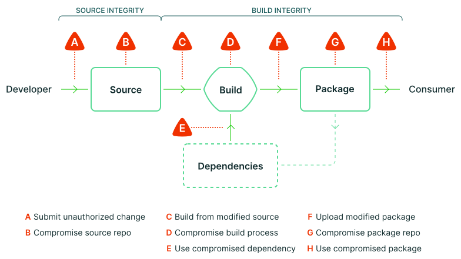

# Supply Chain

[](https://slsa.dev/spec)

## Supply Chain Attack

- [Running file encryption attack in Node.js module](https://dev.to/devdevcharlie/running-a-ransomware-attack-in-a-nodejs-module-4hgb).
- [left-pad](https://blog.npmjs.org/post/141577284765/kik-left-pad-and-npm).
- [eslint](https://eslint.org/blog/2018/07/postmortem-for-malicious-package-publishes).
- [antd](https://github.com/ant-design/ant-design/issues/13098).
- [faker.js](https://github.com/marak/Faker.js).
- [colors.js](https://github.com/Marak/colors.js/issues/285).
- [node-ipc](https://github.com/RIAEvangelist/node-ipc).
- [es5-ext](https://github.com/medikoo/es5-ext/commit/28de285ed433b45113f01e4ce7c74e9a356b2af2).
- [event-source-polyfill](https://github.com/Yaffle/EventSource/commit/de137927e13d8afac153d2485152ccec48948a7a).
- [styled-components](https://github.com/styled-components/styled-components/commit/ba9d732ca7da53f2a095e35450ecffd592c6f5ba).

## Supply Chain Protection

评估 NPM package 质量:

- 代码质量.
- 测试完备性.
- 文档完备性.
- 工程完备性 (DevOps).
- 开发人员构成.
- 兼容性:
- 流行度.
- 历史遗留 Bug.
- 重复实现复杂度.
- 使用时长.
- 后续依赖版本更新策略.

`pnpm` workspace config to prevent [supply chain attacks](https://pnpm.io/blog/2025/12/05/newsroom-npm-supply-chain-security):

```yaml
minimumReleaseAge: <duration-in-minutes>

minimumReleaseAgeExclude:
  - package-with-critical-hotfix@1.2.3

trustPolicy: no-downgrade

trustPolicyExclude:
  - package-that-migrated-cicd@1.2.3
```

## Malicious Package Attack

名字与流行包相近, 通过 `postinstall` 脚本执行病毒脚本, 获取系统环境变量信息 e.g. `crossenv`.

## Malicious Package Protection

- No typo in `package.json`:
  - NPM package [database](https://openbase.com).
  - NPM package [advisor](https://snyk.io/advisor).
- 禁止执行 `postinstall` 脚本.
- Use mature dependency management tools: `renovate`.
- Stay alert to security issues:
  - Apply operating system patches.
  - Security tools: `npm audit`, `socket.security`.
  - Official advisories.
  - Mailing lists and blogs.
  - Social media.
- Package integrity check.

```bash
cat FILENAME.js | openssl dgst -sha384 -binary | openssl base64 -A
```

```yaml
strictDepBuilds: true

onlyBuiltDependencies:
  - package-with-necessary-build-scripts

ignoredBuiltDependencies:
  - package-with-unnecessary-build-scripts
```
